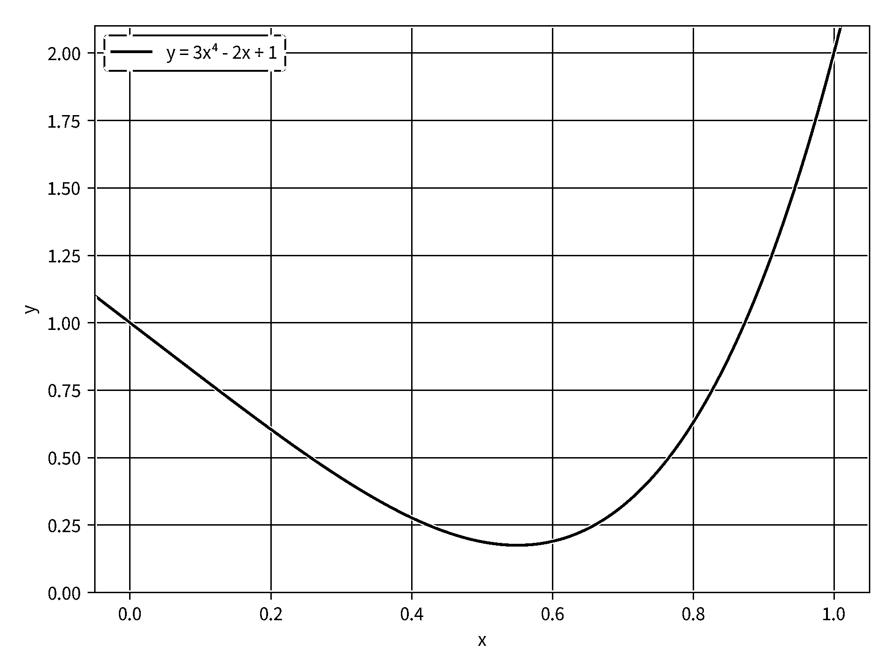
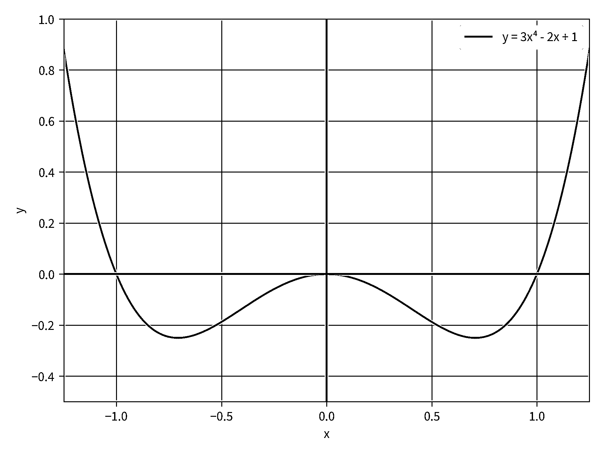

# 科学 Python:使用 SciPy 进行优化

> 原文：<https://realpython.com/python-scipy-cluster-optimize/>

当你想用 Python 做科学工作时，你可以求助的第一个库是 [SciPy](https://scipy.org/) 。正如你将在本教程中看到的， **SciPy** 不仅仅是一个库，而是一个完整的**库生态系统**，它们协同工作，帮助你快速可靠地完成复杂的科学任务。

**在本教程中，您将学习如何:**

*   **查找**关于您可以使用 SciPy 做的所有事情的信息
*   在你的电脑上安装 SciPy
*   **使用** SciPy 通过几个变量对数据集进行聚类
*   **使用** SciPy 找到函数的最优值

您可以通过下载下面链接中的源代码来学习本教程中的示例:

**获取示例代码:** [单击此处获取示例代码，您将在本教程中使用](https://realpython.com/bonus/scipy-code/)来了解 SciPy。

## 区分科学生态系统和科学图书馆

当您想要使用 Python 执行科学计算任务时，可能会建议您使用几个库，包括:

*   [NumPy](https://realpython.com/tutorials/numpy/)
*   我的天啊
*   [Matplotlib](https://realpython.com/python-matplotlib-guide/)
*   IPython
*   交响乐
*   熊猫

总的来说，这些库组成了 [**SciPy 生态系统**](https://scipy.org/about.html) ，并且被设计成一起工作。他们中的许多人直接依赖 NumPy 数组来进行计算。本教程希望您对创建 NumPy 数组和操作它们有所了解。

**注意:**如果你需要一个关于 [NumPy](https://realpython.com/tutorials/numpy/) 的快速入门或者复习，那么你可以看看这些教程:

*   [看 Ma，无 For 循环:用 NumPy 进行数组编程](https://realpython.com/numpy-array-programming/)
*   [NumPy arange():如何使用 np.arange()](https://realpython.com/how-to-use-numpy-arange/)
*   [MATLAB vs. Python:基本数组运算概述](https://realpython.com/matlab-vs-python/#an-overview-of-basic-array-operations)

在本教程中，您将了解到 **SciPy 库**，它是 SciPy 生态系统的核心组件之一。SciPy 库是 Python 中科学计算的基础库。它为诸如数值积分、优化、信号处理、[线性代数](https://realpython.com/python-scipy-linalg/)等任务提供了许多高效且用户友好的界面。

[*Remove ads*](/account/join/)

## 了解 SciPy 模块

SciPy 库由许多**模块**组成，这些模块将库分成不同的功能单元。如果您想了解 SciPy 包含的不同模块，那么您可以在`scipy`上运行`help()`，如下所示:

>>>

```py
>>> import scipy
>>> help(scipy)
```

这为整个 SciPy 库产生了一些帮助输出，其中一部分如下所示:

```py
Subpackages
-----------

Using any of these subpackages requires an explicit import.  For example,
``import scipy.cluster``.

::

 cluster                      --- Vector Quantization / Kmeans
 fft                          --- Discrete Fourier transforms
 fftpack                      --- Legacy discrete Fourier transforms
 integrate                    --- Integration routines
...
```

这个代码块显示了帮助输出的`Subpackages`部分，这是 SciPy 中可以用于计算的所有可用模块的列表。

请注意该部分顶部的文本，它声明，`"Using any of these subpackages requires an explicit import."`当您想要使用 SciPy 中某个模块的功能时，您需要导入您想要使用的模块**特别是**。稍后在教程中你会看到一些这样的例子，从 SciPy 导入库的指南显示在 [SciPy 文档](https://docs.scipy.org/doc/scipy/reference/api.html#guidelines-for-importing-functions-from-scipy)中。

一旦决定要使用哪个模块，就可以查看 SciPy [API 参考](https://docs.scipy.org/doc/scipy/reference/#api-reference)，其中包含了 SciPy 中每个模块的所有细节。如果你正在寻找一些有更多解释的东西，那么 [SciPy 课堂笔记](https://scipy-lectures.org/intro/scipy.html)是深入许多 SciPy 模块的一个很好的资源。

在本教程的后面，您将了解到`cluster`和`optimize`，它们是 SciPy 库中的两个模块。但是首先，你需要在你的电脑上安装 SciPy。

## 在你的电脑上安装 SciPy

和大多数 [Python 包](https://realpython.com/python-modules-packages/)一样，在你的电脑上安装 SciPy 有两种主要方式:

1.  蟒蛇
2.  [PyPI 和 pip](https://realpython.com/what-is-pip/)

在这里，您将学习如何使用这两种方法来安装库。SciPy 唯一的直接依赖项是 NumPy 包。如果需要，这两种安装方法都会自动安装除 SciPy 之外的 NumPy。

### 蟒蛇

Anaconda 是 Python 的一个流行的**发行版**，主要是因为它包含了针对 Windows、macOS 和 Linux 的最流行的科学 Python 包的预构建版本。如果您的计算机上还没有安装 Python，那么 Anaconda 是一个很好的入门选择。Anaconda 预装了 SciPy 及其所需的依赖项，因此一旦安装了 Anaconda，就不需要做任何其他事情了！

你可以从他们的[下载页面](https://anaconda.com/download)下载并安装 Anaconda。确保下载最新的 Python 3 版本。一旦您的计算机上安装了安装程序，您就可以根据您的平台遵循应用程序的默认设置过程。

**注意:**确保将 Anaconda 安装在**不需要管理员权限**修改的目录下。这是安装程序中的默认设置。

如果您已经安装了 Anaconda，但是您想安装或更新 SciPy，那么您也可以这样做。在 macOS 或 Linux 上打开一个终端应用程序，或者在 Windows 上打开 Anaconda 提示符，然后键入以下代码行之一:

```py
$ conda install scipy
$ conda update scipy
```

如果您需要安装 SciPy，您应该使用第一行；如果您只想更新 SciPy，您应该使用第二行。要确保安装了 SciPy，请在您的终端中运行 Python 并尝试导入 SciPy:

>>>

```py
>>> import scipy
>>> print(scipy.__file__)
/.../lib/python3.7/site-packages/scipy/__init__.py
```

在这段代码中，你已经导入了`scipy`并且[打印了](https://realpython.com/python-print/)文件的位置，从那里`scipy`被加载。上面的例子是针对 macOS 的。您的计算机可能会显示不同的位置。现在，您已经在计算机上安装了 SciPy，可以使用了。您可以跳到[的下一部分](#using-the-cluster-module-in-scipy)开始使用 SciPy！

[*Remove ads*](/account/join/)

### Pip

如果您已经安装了不是 Anaconda 的 Python 版本，或者您不想使用 Anaconda，那么您将使用`pip`来安装 SciPy。要了解更多关于什么是`pip`的信息，请查看[什么是 Pip？新蟒蛇指南](https://realpython.com/what-is-pip/)和[Pip 初学者指南](https://realpython.com/courses/what-is-pip/)。

**注意:** `pip`使用一种叫做**轮子**的格式安装包。在[轮盘格式](https://realpython.com/python-wheels/)中，代码在发送到你的计算机之前被编译。这几乎与 Anaconda 采用的方法相同，尽管 wheel 格式文件与 Anaconda 格式略有不同，而且两者不可互换。

要使用`pip`安装 SciPy，请打开您的终端应用程序，并键入以下代码行:

```py
$ python -m pip install -U scipy
```

如果尚未安装 SciPy，该代码将安装它，如果已经安装了 SciPy，则升级它。要确保安装了 SciPy，请在您的终端中运行 Python 并尝试导入 SciPy:

>>>

```py
>>> import scipy
>>> print(scipy.__file__)
/.../lib/python3.7/site-packages/scipy/__init__.py
```

在这段代码中，您已经导入了`scipy`并打印了文件的位置，即`scipy`被加载的位置。上面的例子是针对使用 [pyenv](https://realpython.com/intro-to-pyenv/) 的 macOS。您的计算机可能会显示不同的位置。现在你已经在电脑上安装了 SciPy。让我们看看如何使用 SciPy 来解决您可能会遇到的一些问题！

## 使用 SciPy 中的集群模块

**聚类**是一种流行的技术，通过将数据关联成组来对数据进行分类。SciPy 库包括一个 [**k 均值**聚类算法](https://realpython.com/k-means-clustering-python/)以及几个层次聚类算法的实现。在本例中，您将在`scipy.cluster.vq`中使用 k 均值算法，其中`vq`代表**矢量量化**。

首先，您应该看一看您将在这个示例中使用的数据集。该数据集由 4827 条真实短信和 747 条垃圾短信组成。原始数据集可以在 [UCI 机器学习库](https://archive.ics.uci.edu/ml/datasets/SMS+Spam+Collection)或作者的[网页](http://www.dt.fee.unicamp.br/~tiago/smsspamcollection/)上找到。

**注:**这些数据由 Tiago A. Almeida 和 José María Gómez Hidalgo 收集，并发表在 2011 年在美国加利福尼亚州山景城举办的*2011 年 ACM 文档工程研讨会(DOCENG'11)* 的一篇题为“对垃圾短信过滤研究的贡献:新的收集和结果”的文章中。

在数据集中，每条消息都有两个标签之一:

1.  **`ham`** 为合法消息

2.  **`spam`** 为垃圾短信

完整的文本消息与每个标签相关联。当您浏览数据时，您可能会注意到垃圾邮件中往往有许多数字。它们通常包括电话号码或奖金。让我们根据消息中的位数来预测消息是否是垃圾邮件。为此，您将根据消息中出现的位数将数据分成三组:

1.  **非垃圾邮件:**位数最小的消息被预测为非垃圾邮件。

2.  **未知:**中间位数的消息未知，需要更高级的算法处理。

3.  **垃圾邮件:**位数最高的消息被预测为垃圾邮件。

让我们开始对短信进行聚类。首先，您应该导入将在本例中使用的库:

```py
 1from pathlib import Path
 2import numpy as np
 3from scipy.cluster.vq import whiten, kmeans, vq
```

您可以看到您正在从`scipy.cluster.vq`导入三个函数。每个函数都接受一个 NumPy 数组作为输入。这些数组应该在列中有数据集的**特征**，在行中有**观察值**。

一个特征是一个感兴趣的[变量](https://realpython.com/python-variables/)，而每次记录每个特征时都会创建一个观察。在本例中，数据集中有 5，574 条观察结果或单个消息。此外，您会看到有两个特性:

1.  **短信中的位数**
2.  **该位数在整个数据集中出现的次数**

接下来，您应该从 UCI 数据库加载数据文件。数据以文本文件的形式出现，其中消息的类用制表符与消息分开，每条消息占一行。您应该使用`pathlib.Path`将数据读入一个[列表](https://realpython.com/courses/lists-tuples-python/):

```py
 4data = Path("SMSSpamCollection").read_text()
 5data = data.strip()
 6data = data.split("\n")
```

在这段代码中，您使用`pathlib.Path.read_text()`将文件读入一个字符串。然后，使用`.strip()`删除任何尾随空格，并将[字符串](https://realpython.com/python-strings/)拆分成一个带有`.split()`的列表。

接下来，你可以开始**分析**数据。你需要计算每条短信中出现的位数。Python 在标准库中包含了`collections.Counter`,以类似字典的结构收集对象的计数。然而，因为`scipy.cluster.vq`中的所有函数都期望 NumPy 数组作为输入，所以在这个例子中不能使用`collections.Counter`。相反，您使用 NumPy 数组并手动实现计数。

同样，您感兴趣的是给定 SMS 消息中的位数，以及有多少 SMS 消息具有该位数。首先，您应该创建一个 NumPy 数组，该数组将给定消息的位数与消息的结果相关联，无论该消息是垃圾邮件还是垃圾邮件:

```py
 7digit_counts = np.empty((len(data), 2), dtype=int)
```

在这段代码中，您将创建一个空的 NumPy 数组`digit_counts`，它有两列和 5，574 行。行数等于数据集中的消息数。您将使用`digit_counts`将消息中的位数与消息是否是垃圾邮件联系起来。

您应该在进入循环之前创建数组，这样就不必在数组扩展时分配新的内存。这提高了代码的效率。接下来，您应该处理数据以记录位数和消息的状态:

```py
 8for i, line in enumerate(data):
 9    case, message = line.split("\t")
10    num_digits = sum(c.isdigit() for c in message)
11    digit_counts[i, 0] = 0 if case == "ham" else 1
12    digit_counts[i, 1] = num_digits
```

下面是这段代码如何工作的逐行分析:

*   **第 8 行:**循环结束`data`。您使用`enumerate()`将列表中的值放到`line`中，并为该列表创建一个索引`i`。要了解更多关于`enumerate()`的内容，请查看 [Python enumerate():用计数器简化循环](https://realpython.com/python-enumerate/)。

*   **第 9 行:**拆分制表符上的行，创建`case`和`message`。`case`是表示消息是`ham`还是`spam`的字符串，而`message`是包含消息文本的字符串。

*   **第 10 行:**用一个理解的`sum()`计算消息的位数。在理解中，使用 [`isdigit()`](https://realpython.com/python-strings/) 检查消息中的每个字符，如果元素是数字，则返回`True`，否则返回`False`。`sum()`然后将每个`True`结果视为 1，将每个`False`结果视为 0。因此，`sum()`在这次理解中的结果是`isdigit()`返回`True`的字符数。

*   **第 11 行:**赋值到`digit_counts`。如果消息是合法的(`ham`)，则将`i`行的第一列指定为 0，如果消息是垃圾邮件，则指定为 1。

*   **第 12 行:**赋值到`digit_counts`。您将`i`行的第二列指定为消息中的位数。

现在您有了一个 NumPy 数组，其中包含了每条消息的位数。但是，您希望将**聚类算法**应用于一个数组，该数组中的消息数量具有特定的位数。换句话说，您需要创建一个数组，其中第一列包含消息中的位数，第二列包含具有该位数的消息数。查看下面的代码:

```py
13unique_counts = np.unique(digit_counts[:, 1], return_counts=True)
```

[`np.unique()`](https://docs.scipy.org/doc/numpy/reference/generated/numpy.unique.html) 将一个数组作为第一个参数，并返回另一个包含该参数中唯一元素的数组。它还需要几个可选参数。这里，您使用`return_counts=True`来指示`np.unique()`返回一个数组，其中包含每个唯一元素在输入数组中出现的次数。这两个输出作为存储在`unique_counts`中的元组返回。

接下来，您需要将`unique_counts`转换成适合集群的形状:

```py
14unique_counts = np.transpose(np.vstack(unique_counts))
```

使用`np.vstack()`将来自`np.unique()`的两个 1xN 输出组合成一个 2xN 数组，然后将它们转置成一个 Nx2 数组。这种格式将在聚类函数中使用。`unique_counts`中的每一行现在都有两个元素:

1.  **信息中的位数**
2.  **具有该位数的消息数**

这两个操作的输出子集如下所示:

```py
[[   0 4110]
 [   1  486]
 [   2  160]
 ...
 [  40    4]
 [  41    2]
 [  47    1]]
```

在数据集中，有 4110 条消息没有数字，486 条消息有 1 个数字，依此类推。现在，您应该对这个数组应用 k-means 聚类算法:

```py
15whitened_counts = whiten(unique_counts)
16codebook, _ = kmeans(whitened_counts, 3)
```

您使用`whiten()`归一化每个特征，使其具有单位方差，这改进了来自`kmeans()`的结果。然后，`kmeans()`将白化数据和要创建的聚类数作为参数。在这个例子中，您想要创建 3 个集群，分别是**肯定是火腿**、**肯定是垃圾邮件**和**未知的**。`kmeans()`返回两个值:

1.  **一个三行两列的数组，代表每组的质心:**`kmeans()`算法通过最小化观测值到每个质心的距离，计算每个聚类质心的最佳位置。这个数组被分配给`codebook`。

2.  **从观察值到质心的平均欧几里德距离:**这个例子的其余部分不需要这个值，所以可以把它赋给`_`。

接下来，您应该使用`vq()`来确定每个观察值属于哪个集群:

```py
17codes, _ = vq(whitened_counts, codebook)
```

`vq()`将来自`codebook`的代码分配给每个观察值。它返回两个值:

1.  **第一个值**是一个与`unique_counts`长度相同的数组，其中每个元素的值都是一个整数，表示该观察被分配到哪个集群。因为您在这个例子中使用了三个集群，所以每个观察都被分配到集群`0`、`1`或`2`。

2.  **第二个值**是每个观察与其质心之间的欧几里德距离的数组。

现在您已经有了聚类的数据，您应该使用它来预测 SMS 消息。您可以检查计数，以确定聚类算法在绝对垃圾邮件和未知邮件之间以及未知邮件和绝对垃圾邮件之间划出了多少位数的界限。

聚类算法随机给每个聚类分配代码`0`、`1`或`2`，所以你需要识别哪个是哪个。您可以使用此代码来查找与每个集群相关联的代码:

```py
18ham_code = codes[0]
19spam_code = codes[-1]
20unknown_code = list(set(range(3)) ^ set((ham_code, spam_code)))[0]
```

在这段代码中，第一行查找与 ham 消息相关的代码。根据我们上面的假设，ham 消息具有最少的数字，并且数字数组从最少到最多的数字排序。因此，ham 消息簇在`codes`的开始处开始。

类似地，垃圾消息具有最多的数字，并且形成了`codes`中的最后一个簇。因此，垃圾消息的代码将等于`codes`的最后一个元素。最后，您需要找到未知消息的代码。由于代码只有 3 个选项，并且您已经确定了其中的两个，您可以在一个 [Python `set`](https://realpython.com/python-sets/) 上使用 [`symmetric_difference`](https://docs.python.org/3.8/library/stdtypes.html#frozenset.symmetric_difference) 操作符来确定最后一个代码值。然后，您可以打印与每种消息类型相关联的群:

```py
21print("definitely ham:", unique_counts[codes == ham_code][-1])
22print("definitely spam:", unique_counts[codes == spam_code][-1])
23print("unknown:", unique_counts[codes == unknown_code][-1])
```

在这段代码中，每一行都获得了`unique_counts`中的行，其中`vq()`被赋予了不同的代码值。因为该操作返回一个数组，所以您应该获取该数组的最后一行，以确定分配给每个分类的最大位数。输出如下所示:

```py
definitely ham: [0  4110]
definitely spam: [47  1]
unknown: [20 18]
```

在此输出中，您会看到**肯定是垃圾消息**是消息中的零位数消息，**未知**消息是 1 到 20 位数之间的所有数字，**肯定是垃圾消息**是 21 到 47 位数之间的所有数字，这是数据集中的最大位数。

现在，您应该检查您对该数据集的预测有多准确。首先，为`digit_counts`创建一些掩码，这样您就可以轻松地获取消息的`ham`或`spam`状态:

```py
24digits = digit_counts[:, 1]
25predicted_hams = digits == 0
26predicted_spams = digits > 20
27predicted_unknowns = np.logical_and(digits > 0, digits <= 20)
```

在这段代码中，您将创建`predicted_hams`掩码，其中消息中没有数字。然后，为所有超过 20 位的消息创建`predicted_spams`掩码。最后，中间的消息是`predicted_unknowns`。

接下来，将这些掩码应用于实际数字计数以检索预测:

```py
28spam_cluster = digit_counts[predicted_spams]
29ham_cluster = digit_counts[predicted_hams]
30unk_cluster = digit_counts[predicted_unknowns]
```

这里，您将在最后一个代码块中创建的掩码应用到`digit_counts`数组。这将创建三个新数组，其中仅包含已被聚类到每个组中的消息。最后，您可以看到每种消息类型中有多少属于每个集群:

```py
31print("hams:", np.unique(ham_cluster[:, 0], return_counts=True))
32print("spams:", np.unique(spam_cluster[:, 0], return_counts=True))
33print("unknowns:", np.unique(unk_cluster[:, 0], return_counts=True))
```

这段代码打印了分类中每个唯一值的计数。记住，`0`表示消息是`ham`，`1`表示消息是`spam`。结果如下所示:

```py
hams: (array([0, 1]), array([4071,   39]))
spams: (array([0, 1]), array([  1, 232]))
unknowns: (array([0, 1]), array([755, 476]))
```

从这个输出中，您可以看到有 4110 条消息属于绝对是垃圾邮件的组，其中 4071 条实际上是垃圾邮件，只有 39 条是垃圾邮件。相反，在 233 条被归入**肯定是垃圾邮件**组的消息中，只有 1 条是真正的垃圾邮件，其余的都是垃圾邮件。

当然，超过 1200 封邮件属于**未知**类别，因此需要一些更高级的分析来对这些邮件进行分类。你可能想研究一下像[自然语言处理](https://realpython.com/natural-language-processing-spacy-python/)这样的东西来帮助提高你预测的准确性，你可以[使用 Python 和 Keras 来帮助解决](https://realpython.com/python-keras-text-classification/)。

[*Remove ads*](/account/join/)

## 使用 SciPy 中的优化模块

当您需要**优化**一个函数的输入参数时，`scipy.optimize`包含许多用于优化不同类型函数的有用方法:

*   **`minimize_scalar()`** 和 **`minimize()`** 分别最小化一个变量和多个变量的函数
*   **`curve_fit()`** 用函数来拟合一组数据
*   **`root_scalar()`** 和 **`root()`** 分别求一元和多元函数的零点
*   **`linprog()`** 最小化带有线性不等式和等式约束的线性目标函数

实际上，所有这些功能都在执行这样或那样的 [**优化**](https://realpython.com/linear-programming-python/) 。在本节中，您将了解两个最小化函数，`minimize_scalar()`和`minimize()`。

### 最小化一元函数

接受一个数字并产生一个输出的数学函数称为**标量函数**。它通常与接受多个数字并产生多个输出数字的多元函数形成对比。在下一节中，您将看到一个优化多元函数的示例。

对于这一部分，你的标量函数将是一个四次多项式，你的目标是找到函数的**最小值**。函数是 y = 3x⁴ - 2x + 1。下图绘制了 x 从 0 到 1 范围内的函数:

[](https://files.realpython.com/media/minimize_scalar.6858d6b6396f.png)

在图中，你可以看到这个函数在大约 x = 0.55 处有一个最小值。你可以用 [`minimize_scalar()`](https://docs.scipy.org/doc/scipy/reference/generated/scipy.optimize.minimize_scalar.html#scipy.optimize.minimize_scalar) 来确定 x 和 y 坐标的最小值。首先，从`scipy.optimize`进口`minimize_scalar()`。然后，您需要定义要最小化的目标函数:

```py
 1from scipy.optimize import minimize_scalar
 2
 3def objective_function(x):
 4    return 3 * x ** 4 - 2 * x + 1
```

`objective_function()`接受输入`x`并对其应用必要的数学运算，然后返回结果。在函数定义中，你可以使用任何你想要的数学函数。唯一的限制是函数最后必须返回一个数字。

接下来用`minimize_scalar()`求这个函数的最小值。`minimize_scalar()`只有一个必需的输入，即目标函数定义的名称:

```py
 5res = minimize_scalar(objective_function)
```

`minimize_scalar()`的输出是 [`OptimizeResult`](https://docs.scipy.org/doc/scipy/reference/generated/scipy.optimize.OptimizeResult.html#scipy.optimize.OptimizeResult) 的一个实例。这个类收集了优化器运行的许多相关细节，包括优化是否成功，以及如果成功，最终结果是什么。该功能的`minimize_scalar()`输出如下所示:

```py
 fun: 0.17451818777634331
    nfev: 16
     nit: 12
 success: True
       x: 0.5503212087491959
```

这些结果都是`OptimizeResult`的属性。`success`是一个[布尔值](https://realpython.com/python-boolean/)，表示优化是否成功完成。如果优化成功，那么`fun`就是目标函数值在最优值`x`。从输出中可以看出，正如所料，这个函数的最佳值接近 x = 0.55。

**注:**你可能知道，**并不是每个函数都有最小值**。例如，尝试看看如果你的目标函数是 y = x 会发生什么。对于`minimize_scalar()`，没有最小值的目标函数通常会导致`OverflowError`，因为优化器最终会尝试一个太大而无法由计算机计算的数字。

与没有最小值的函数相对的是有几个最小值的**函数**。在这些情况下，`minimize_scalar()`不能保证找到函数的全局最小值。然而，`minimize_scalar()`有一个`method`关键字参数，您可以指定它来控制用于优化的求解器。SciPy 库有三种内置的标量最小化方法:

1.  **`brent`** 是[布伦特算法](https://en.wikipedia.org/wiki/Brent%27s_method)的一个实现。这是默认方法。
2.  **`golden`** 是[黄金分割搜索](https://en.wikipedia.org/wiki/Golden-section_search)的一个实现。文档指出布伦特的方法通常更好。
3.  **`bounded`** 是布伦特算法的有界实现。当最小值在已知范围内时，限制搜索区域是有用的。

当`method`为`brent`或`golden`时，`minimize_scalar()`取另一个自变量，称为`bracket`。这是一个由两个或三个元素组成的序列，提供了对最小值区域边界的初步猜测。但是，这些解算器不保证找到的最小值在此范围内。

另一方面，当`method`为`bounded`时，`minimize_scalar()`取另一个名为`bounds`的自变量。这是严格限定最小值搜索区域的两个元素的序列。使用函数 y = x⁴ - x 尝试`bounded`方法。该函数绘制在下图中:

[](https://files.realpython.com/media/minimize_scalar_multiple_minima.3b64cc654054.png)

使用前面的示例代码，您可以像这样重新定义`objective_function()`:

```py
 7def objective_function(x):
 8    return x ** 4 - x ** 2
```

首先，尝试默认的`brent`方法:

```py
 9res = minimize_scalar(objective_function)
```

在这段代码中，您没有为`method`传递一个值，所以默认情况下`minimize_scalar()`使用了`brent`方法。输出是这样的:

```py
 fun: -0.24999999999999994
    nfev: 15
     nit: 11
 success: True
       x: 0.7071067853059209
```

您可以看到优化是成功的。它在 x = 0.707 和 y = -1/4 附近找到了最佳值。如果你[解析求解了方程的最小值](https://www.wolframalpha.com/input/?i=Minimize%5Bx%5E4+-+x%5E2%2C+x%5D)，那么你会发现最小值在 x = 1/√2，这与最小化函数找到的答案非常接近。然而，如果你想找到 x = -1/√2 处的**对称最小值**呢？您可以通过向`brent`方法提供`bracket`参数来返回相同的结果:

```py
10res = minimize_scalar(objective_function, bracket=(-1, 0))
```

在这段代码中，您提供了序列`(-1, 0)`到`bracket`来开始在-1 和 0 之间的区域进行搜索。你期望在这个区域有一个最小值，因为目标函数是关于 y 轴对称的。然而，即使有了`bracket`，`brent`方法仍然返回 x = +1/√2 处的最小值。要找到 x = -1/√2 处的最小值，您可以使用带有`bounds`的`bounded`方法:

```py
11res = minimize_scalar(objective_function, method='bounded', bounds=(-1, 0))
```

在这段代码中，您将`method`和`bounds`作为参数添加到`minimize_scalar()`，并将`bounds`设置为从-1 到 0。此方法的输出如下:

```py
 fun: -0.24999999999998732
 message: 'Solution found.'
    nfev: 10
  status: 0
 success: True
       x: -0.707106701474177
```

不出所料，最小值出现在 x = -1/√2 处。注意这个方法的附加输出，它在`res`中包含了一个`message`属性。该字段通常用于一些最小化求解器的更详细输出。

[*Remove ads*](/account/join/)

### 最小化多变量函数

`scipy.optimize`还包括更一般的 [`minimize()`](https://docs.scipy.org/doc/scipy/reference/generated/scipy.optimize.minimize.html#scipy.optimize.minimize) 。该函数可以处理**多变量**输入和输出，并具有更复杂的优化算法来处理这种情况。另外，`minimize()`可以处理**约束**对你问题的解决。您可以指定三种类型的约束:

1.  [**`LinearConstraint`**](https://docs.scipy.org/doc/scipy/reference/generated/scipy.optimize.LinearConstraint.html#scipy.optimize.LinearConstraint) :通过用用户输入的数组取解的 x 值的内积，并将结果与一个下限和一个上限进行比较，来约束解。
2.  [**`NonlinearConstraint`**](https://docs.scipy.org/doc/scipy/reference/generated/scipy.optimize.NonlinearConstraint.html#scipy.optimize.NonlinearConstraint) :通过将用户提供的函数应用于解的 x 值并将返回值与下限和上限进行比较来约束解。
3.  [**`Bounds`**](https://docs.scipy.org/doc/scipy/reference/generated/scipy.optimize.Bounds.html#scipy.optimize.Bounds) :解 x 值被约束在一个下限和一个上限之间。

当您使用这些约束时，它会限制您能够使用的优化方法的具体选择，因为并非所有可用的方法都以这种方式支持约束。

让我们来演示一下如何使用`minimize()`。假设你是一名股票经纪人，对出售固定数量股票的总收入最大化感兴趣。你已经确定了一组特定的买家，对于每一个买家，你知道他们将支付的价格和他们手头有多少现金。

你可以把这个问题表述为一个**约束优化问题**。目标函数是你想收入最大化。然而，`minimize()`会找到一个函数的最小值，所以您需要将您的目标函数乘以-1 来找到产生最大负数的 x 值。

这个问题有一个**约束**，就是买家购买的股份总数不超过你手头的股份数。每个解决方案变量也有**界限**，因为每个买家都有可用现金的上限，下限为零。负的解 x 值意味着你要向买家付款！

尝试下面的代码来解决这个问题。首先，导入您需要的模块，然后设置变量以确定市场中的买家数量和您想要出售的股票数量:

```py
 1import numpy as np
 2from scipy.optimize import minimize, LinearConstraint
 3
 4n_buyers = 10
 5n_shares = 15
```

在这段代码中，您从`scipy.optimize`导入`numpy`、`minimize()`和`LinearConstraint`。然后，你设定一个有 10 个买家的市场，他们将从你这里总共购买 15 股。

接下来，在给定前两个数组的情况下，创建数组来存储每个买家支付的价格、他们能够支付的最大金额以及每个买家能够支付的最大股票数量。对于这个例子，您可以使用`np.random`中的[随机数生成](https://realpython.com/courses/generating-random-data-python/)来生成数组:

```py
 6np.random.seed(10)
 7prices = np.random.random(n_buyers)
 8money_available = np.random.randint(1, 4, n_buyers)
```

在这段代码中，您为 NumPy 的随机数生成器设置了种子。这个函数确保每次你运行这个代码，你都会得到相同的随机数。它在这里是为了确保你的输出与教程相同，以便比较。

在第 7 行中，您生成了买方将支付的价格数组。`np.random.random()`在半开区间[0，1]上创建一个随机数数组。数组中元素的数量由参数的值决定，在本例中是买方的数量。

在第 8 行中，您从[1，4]的半开区间上生成一个整数数组，同样包含购买者数量的大小。这个数组表示每个买家的可用现金总额。现在，您需要计算每个买家可以购买的最大股份数:

```py
 9n_shares_per_buyer = money_available / prices
10print(prices, money_available, n_shares_per_buyer, sep="\n")
```

在第 9 行，您用`money_available`与`prices`的比值来确定每个买家可以购买的最大股票数量。最后，打印每个数组，用换行符隔开。输出如下所示:

```py
[0.77132064 0.02075195 0.63364823 0.74880388 0.49850701 0.22479665
 0.19806286 0.76053071 0.16911084 0.08833981]
[1 1 1 3 1 3 3 2 1 1]
[ 1.29647768 48.18824404  1.57816269  4.00638948  2.00598984 13.34539487
 15.14670609  2.62974258  5.91328161 11.3199242 ]
```

第一行是价格数组，价格是介于 0 和 1 之间的浮点数。该行后面是从 1 到 4 的整数形式的最大可用现金。最后，您会看到每个买家可以购买的股票数量。

现在，您需要为求解器创建**约束**和**边界**。约束条件是购买的股票总数不能超过可用的股票总数。这是一个约束而不是界限，因为它涉及到不止一个解变量。

从数学上来说，你可以说`x[0] + x[1] + ... + x[n] = n_shares`，其中`n`是购买者的总数。更简洁地说，你可以用一个向量的点或内积来表示解的值，并约束它等于`n_shares`。记住`LinearConstraint`取输入数组与解值的点积，并将其与下限和上限进行比较。您可以用它来设置对`n_shares`的约束:

```py
11constraint = LinearConstraint(np.ones(n_buyers), lb=n_shares, ub=n_shares)
```

在这段代码中，您创建了一个长度为`n_buyers`的 1 的数组，并将其作为第一个参数传递给`LinearConstraint`。因为`LinearConstraint`用这个参数取解向量的点积，它将产生购买股票的总和。

这个结果被限制在另外两个参数之间:

1.  下界`lb`
2.  上限`ub`

由于`lb = ub = n_shares`，这是一个**等式约束**，因为值的总和必须等于`lb`和`ub`。如果`lb`不同于`ub`，那么它将是一个**不等式约束**。

接下来，为解决方案变量创建边界。界限将购买的股份数量限制为下限为 0，上限为`n_shares_per_buyer`。`minimize()`期望的边界格式是下限和上限的元组序列:

```py
12bounds = [(0, n) for n in n_shares_per_buyer]
```

在这段代码中，您使用一个[理解](https://realpython.com/list-comprehension-python/)为每个买家生成一个元组列表。运行优化之前的最后一步是定义目标函数。回想一下，你正在努力使你的收入最大化。换句话说，你想让你收入的负数尽可能的大。

你从每笔交易中获得的收入是买家支付的价格乘以他们购买的股票数量。从数学上来说，你可以把它写成`prices[0]*x[0] + prices[1]*x[1] + ... + prices[n]*x[n]`，这里`n`也是买家的总数。

同样，你可以用内积或`x.dot(prices)`来更简洁地表示这一点。这意味着您的目标函数应该将当前解值`x`和价格数组作为参数:

```py
13def objective_function(x, prices):
14    return -x.dot(prices)
```

在这段代码中，您将`objective_function()`定义为接受两个参数。然后你取`x`和`prices`的点积，并返回该值的负值。请记住，您必须返回负值，因为您试图使该数字尽可能小，或者尽可能接近负无穷大。最后可以调用`minimize()`:

```py
15res = minimize(
16    objective_function,
17    x0=10 * np.random.random(n_buyers),
18    args=(prices,),
19    constraints=constraint,
20    bounds=bounds,
21)
```

在这段代码中，`res`是`OptimizeResult`的一个实例，就像`minimize_scalar()`一样。正如你将看到的，有许多相同的领域，尽管问题是完全不同的。在对`minimize()`的调用中，您传递了五个参数:

1.  **`objective_function`** :第一个位置参数必须是你要优化的函数。

2.  **`x0`** :下一个参数是对解的值的初步猜测。在这种情况下，您只需提供一个 0 到 10 之间的随机值数组，长度为`n_buyers`。对于某些算法或某些问题，选择一个合适的初始猜测可能很重要。但是，对于这个例子来说，似乎并不太重要。

3.  **`args`** :下一个参数是需要传递到目标函数中的其他参数的元组。`minimize()`将总是把解的当前值`x`传递到目标函数中，所以这个参数用作收集任何其他必要输入的地方。在这个例子中，您需要将`prices`传递给`objective_function()`，所以在这里。

4.  **`constraints`** :接下来的论证是对问题的一系列约束。您已经越过了之前生成的关于可用份额数量的约束。

5.  **`bounds`** :最后一个参数是您之前生成的解变量的边界序列。

一旦求解器运行，您应该通过打印来检查`res`:

```py
 fun: -8.783020157087478
     jac: array([-0.7713207 , -0.02075195, -0.63364828, -0.74880385, 
       -0.49850702, -0.22479665, -0.1980629 , -0.76053071, -0.16911089,
       -0.08833981])
 message: 'Optimization terminated successfully.'
    nfev: 204
     nit: 17
    njev: 17
  status: 0
 success: True
       x: array([1.29647768e+00, 2.78286565e-13, 1.57816269e+00,
       4.00638948e+00, 2.00598984e+00, 3.48323773e+00, 3.19744231e-14,
       2.62974258e+00, 2.38121197e-14, 8.84962214e-14])
```

在这个输出中，您可以看到`message`和`status`表示优化的最终状态。对于这个优化器，`0`状态意味着优化成功终止，这也可以在`message`中看到。由于优化是成功的，`fun`显示目标函数值在优化的解决方案值。这次销售你将获得 8.78 美元的收入。

你可以在`res.x`中看到优化函数的`x`的值。在这种情况下，结果是你应该向第一个买家出售大约 1.3 股，向第二个买家出售零股，向第三个买家出售 1.6 股，向第四个买家出售 4.0 股，以此类推。

您还应该检查并确保满足您设置的约束和界限。您可以使用以下代码来实现这一点:

```py
22print("The total number of shares is:", sum(res.x))
23print("Leftover money for each buyer:", money_available - res.x * prices)
```

在这段代码中，您打印每个买家购买的股票的总和，它应该等于`n_shares`。然后，你打印每个买家手头的现金和他们花费的金额之间的差额。这些值中的每一个都应该是正数。这些检查的输出如下所示:

```py
The total number of shares is: 15.000000000000002
Leftover money for each buyer: [3.08642001e-14 1.00000000e+00 
 3.09752224e-14 6.48370246e-14 3.28626015e-14 2.21697984e+00
 3.00000000e+00 6.46149800e-14 1.00000000e+00 1.00000000e+00]
```

如您所见，解决方案的所有约束和界限都得到了满足。现在你应该试着改变问题，这样求解者*就不能*找到解决方案。将`n_shares`的值更改为 1000，这样您就可以尝试向这些相同的买家出售 1000 股。当你运行`minimize()`时，你会发现结果如下所示:

```py
 fun: nan
     jac: array([nan, nan, nan, nan, nan, nan, nan, nan, nan, nan])
 message: 'Iteration limit exceeded'
    nfev: 2182
     nit: 101
    njev: 100
  status: 9
 success: False
       x: array([nan, nan, nan, nan, nan, nan, nan, nan, nan, nan])
```

请注意，`status`属性现在有了一个值`9`，并且`message`表示已经超过了迭代限制。鉴于每个买家的钱数和市场上的买家数量，不可能卖出 1000 股。然而，`minimize()`仍然返回一个`OptimizeResult`实例，而不是引发一个错误。在继续进一步计算之前，您需要确保检查状态代码。

[*Remove ads*](/account/join/)

## 结论

在本教程中，您了解了 **SciPy 生态系统**以及它与 **SciPy 库**的不同之处。您阅读了 SciPy 中的一些可用模块，并学习了如何使用 Anaconda 或 pip 安装 SciPy。然后，您关注了一些使用 SciPy 中的集群和优化功能的例子。

在**聚类**的例子中，您开发了一种算法来将垃圾短信从合法短信中分类出来。使用`kmeans()`，你发现超过 20 位数左右的消息极有可能是垃圾消息！

在**优化**的例子中，你首先在一个只有一个变量的数学上清晰的函数中找到最小值。然后，你解决了更复杂的问题，最大化你卖股票的利润。使用`minimize()`，你找到了卖给一群买家的最优股票数量，获利 8.79 美元！

SciPy 是一个巨大的库，有更多的模块可以深入研究。有了现在的知识，你就可以开始探索了！

您可以通过下载下面链接中的源代码来学习本教程中的示例:

**获取示例代码:** [单击此处获取示例代码，您将在本教程中使用](https://realpython.com/bonus/scipy-code/)来了解 SciPy。*****