# 使用 scipy.fft 的傅里叶变换:Python 信号处理

> 原文：<https://realpython.com/python-scipy-fft/>

**傅立叶变换**是分析**信号**的强大工具，用于从音频处理到图像压缩的方方面面。SciPy 在其`scipy.fft`模块中提供了一个成熟的实现，在本教程中，您将学习如何使用它。

`scipy.fft`模块可能看起来令人生畏，因为有许多函数，通常有相似的名字，并且[文档](https://docs.scipy.org/doc/scipy/reference/tutorial/fft.html)使用了许多没有解释的技术术语。好消息是，您只需要理解一些核心概念就可以开始使用该模块。

如果你对数学不适应，也不用担心！您将通过具体的示例对算法有所了解，如果您想深入研究这些等式，还可以找到更多资源的链接。对于傅立叶变换如何工作的直观介绍，你可能会喜欢 [3Blue1Brown 的视频](https://www.youtube.com/watch?v=spUNpyF58BY)。

在本教程中，您将学习:

*   如何以及何时使用**傅立叶变换**
*   如何从 **`scipy.fft`** 中为您的使用案例选择正确的功能
*   如何查看和修改信号的**频谱**
*   在`scipy.fft`中有哪些不同的**变换**

如果你想在读完这篇教程后保留它的摘要，请下载下面的备忘单。它解释了`scipy.fft`模块中的所有功能，并对可用的不同转换类型进行了分类:

**scipy.fft 备忘单:** [点击这里获得免费的 scipy.fft 备忘单](https://realpython.com/bonus/scipy-fft-cheatsheet/)，它总结了本教程中介绍的技术。

## `scipy.fft`模块

傅立叶变换在许多应用中是至关重要的工具，尤其是在科学计算和数据科学中。因此，SciPy 很早就提供了它及其相关转换的实现。最初，SciPy 提供了`scipy.fftpack`模块，但是他们已经更新了他们的实现，并把它移到了`scipy.fft`模块。

SciPy 功能齐全。关于这个库的更一般的介绍，请查看 [Scientific Python:使用 SciPy 进行优化](https://realpython.com/python-scipy-cluster-optimize/)。

[*Remove ads*](/account/join/)

### 安装 SciPy 和 Matplotlib

在开始之前，您需要安装 SciPy 和 [Matplotlib](https://realpython.com/python-matplotlib-guide/) 。您可以通过以下两种方式之一实现这一点:

1.  **用 Anaconda 安装:**下载安装 [Anaconda 个人版](https://www.anaconda.com/products/individual)。它附带了 SciPy 和 Matplotlib，所以一旦您按照安装程序中的步骤操作，就大功告成了！

2.  **用`pip`安装:**如果你已经安装了 [`pip`](https://realpython.com/what-is-pip/) ，那么你可以用下面的命令安装这些库:

    ```py
    $ python -m pip install -U scipy matplotlib` 
    ```

您可以通过在您的终端中键入`python`并运行以下代码来验证安装是否有效:

>>>

```py
>>> import scipy, matplotlib
>>> print(scipy.__file__)
/usr/local/lib/python3.6/dist-packages/scipy/__init__.py
>>> print(matplotlib.__file__)
/usr/local/lib/python3.6/dist-packages/matplotlib/__init__.py
```

这段代码导入 SciPy 和 Matplotlib 并打印模块的位置。您的计算机可能会显示不同的路径，但只要它打印一个路径，安装工作。

SciPy 现已安装！现在是时候来看看`scipy.fft`和`scipy.fftpack`的区别了。

### `scipy.fft`vs`scipy.fftpack`T2】

在查看 SciPy 文档时，您可能会遇到两个看起来非常相似的模块:

1.  `scipy.fft`
2.  `scipy.fftpack`

`scipy.fft`模块较新，应优先于`scipy.fftpack`。你可以在 SciPy 1.4.0 的[发行说明中读到更多关于这一变化的信息，但这里有一个简短的总结:](https://docs.scipy.org/doc/scipy/reference/release.1.4.0.html#scipy-fft-added)

*   `scipy.fft`拥有改进的 API。
*   `scipy.fft`支持使用[多个工人](https://realpython.com/intro-to-python-threading/)，这在某些情况下可以提供速度提升。
*   `scipy.fftpack`被认为是遗留的，SciPy 建议使用`scipy.fft`来代替。

除非你有充分的理由使用`scipy.fftpack`，否则你应该坚持使用`scipy.fft`。

### `scipy.fft`vs`numpy.fft`T2】

SciPy 的[快速傅立叶变换(FFT)](https://en.wikipedia.org/wiki/Fast_Fourier_transform) 实现比 NumPy 的实现包含更多的特性，并且更有可能获得错误修复。如果可以选择，您应该使用 SciPy 实现。

NumPy 保持了 FFT 实现的向后兼容性，尽管作者认为像傅立叶变换这样的功能最好放在 SciPy 中。更多详情见 [SciPy 常见问题解答](https://www.scipy.org/scipylib/faq.html#what-is-the-difference-between-numpy-and-scipy)。

## 傅立叶变换

[傅立叶分析](https://en.wikipedia.org/wiki/Fourier_analysis)是研究如何将一个**数学函数**分解成一系列更简单的**三角函数**的领域。傅立叶变换是这一领域的一个工具，用于将一个函数分解成它的分量频率。

好吧，这个定义太深奥了。出于本教程的目的，傅立叶变换是一种工具，允许您获取信号并查看其中每个频率的功率。看一下这句话中的重要术语:

*   **信号**是随时间变化的信息。例如，音频、视频和电压轨迹都是信号的例子。
*   一个**频率**是某物重复的速度。例如，时钟以一赫兹(Hz)的频率滴答作响，即每秒重复一次。
*   **功率**，这里只是指每个频率的强弱。

下图是一些[正弦波](https://en.wikipedia.org/wiki/Sine_wave)的频率和功率的直观演示:

[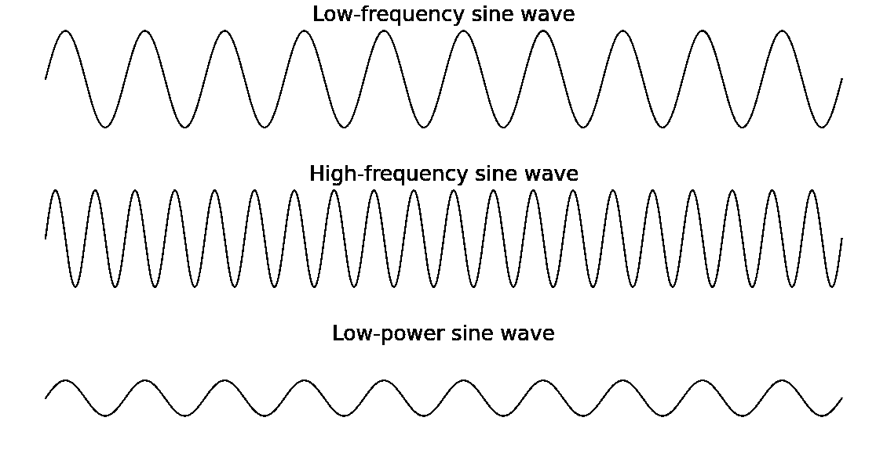](https://files.realpython.com/media/freqpower2.f3dbf5bddc29.png)

**高频**正弦波的波峰比**低频**正弦波的波峰靠得更近，因为它们重复的频率更高。**低功率**正弦波的峰值比其他两个正弦波小。

为了更具体地说明这一点，假设您对某人同时在钢琴上弹奏三个音符的录音进行了傅立叶变换。得到的**频谱**将显示三个峰值，每个音符一个。如果这个人演奏一个音符比其他的更柔和，那么这个音符的频率会比其他两个低。

以下是钢琴示例的视觉效果:

[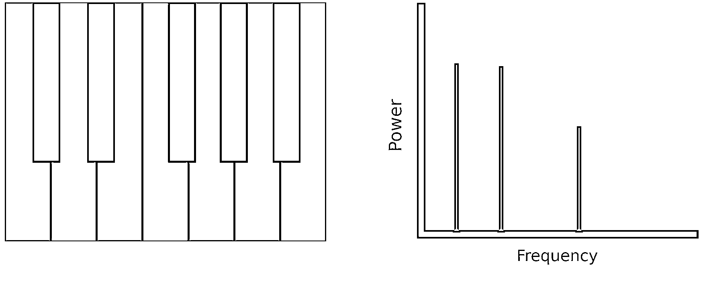](https://files.realpython.com/media/pianofreqblue.ff266a14503f.png)

钢琴上最高的音符比其他两个音符演奏得更安静，因此该音符产生的频谱具有较低的峰值。

[*Remove ads*](/account/join/)

### 为什么需要傅立叶变换？

傅立叶变换在许多应用中是有用的。比如 [Shazam](https://www.shazam.com/company) 等音乐识别服务，就是利用傅立叶变换来识别歌曲。JPEG 压缩使用傅立叶变换的一种变体来移除图像的高频成分。[语音识别](https://realpython.com/python-speech-recognition/)使用傅立叶变换和相关变换从原始音频中恢复口语单词。

一般来说，如果需要查看信号中的频率，就需要傅里叶变换。如果在时域处理信号很困难，那么使用傅立叶变换将其移到频域是值得一试的。在下一节中，您将了解时域和频域之间的差异。

### 时域与频域

在本教程的其余部分，你会看到术语**时域**和**频域**。这两个术语指的是看待信号的两种不同方式，要么将其视为分量频率，要么视为随时间变化的信息。

在时域中，信号是振幅(y 轴)随时间(x 轴)变化的波。您很可能习惯于看到时间域中的图表，例如下图:

[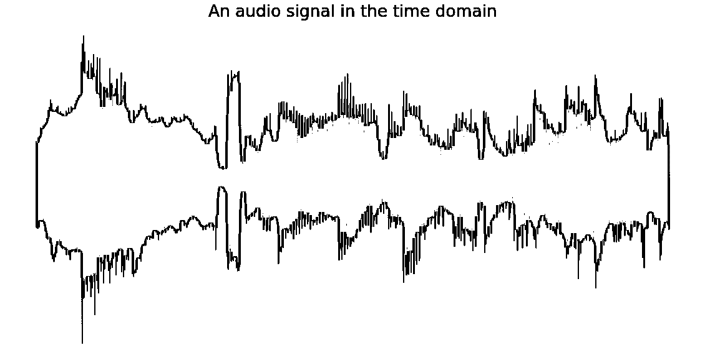](https://files.realpython.com/media/timedomain.cc67471385a2.png)

这是某音频的图像，是一个**时域**信号。横轴表示时间，纵轴表示振幅。

在频域中，信号表示为一系列频率(x 轴)，每个频率都有一个相关的功率(y 轴)。下图是经过傅里叶变换后的上述音频信号:

[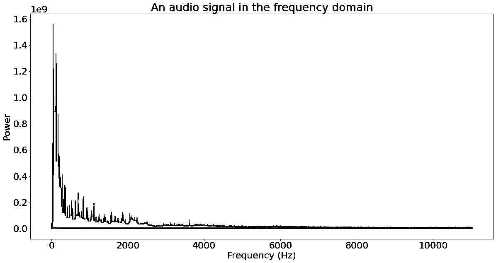](https://files.realpython.com/media/freqdomain.fdeba267dfda.png)

这里，来自之前的音频信号由其组成频率表示。底部的每个频率都有一个相关的能量，产生你所看到的光谱。

有关频域的更多信息，请查看 DeepAI 词汇表条目。

### 傅立叶变换的类型

傅立叶变换可以细分为不同类型的变换。最基本的细分基于转换操作的数据类型:连续函数或离散函数。本教程将只讨论**离散傅立叶变换(DFT)** 。

即使在本教程中，你也会经常看到术语 DFT 和 FFT 互换使用。然而，它们并不完全一样。**快速傅立叶变换(FFT)** 是一种计算离散傅立叶变换(DFT)的算法，而 DFT 就是变换本身。

你将在`scipy.fft`库中看到的另一个区别是不同类型的输入。`fft()`接受复数值输入，`rfft()`接受实数值输入。向前跳到章节[使用快速傅立叶变换(FFT)](#using-the-fast-fourier-transform-fft) 来解释[复数](https://realpython.com/python-complex-numbers/)和实数。

另外两种变换与 DFT 密切相关:离散余弦变换(DCT)和离散正弦变换(T2 变换)。你将在[一节中了解离散余弦和正弦变换](#the-discrete-cosine-and-sine-transforms)。

## 实际例子:从音频中去除不想要的噪声

为了帮助您理解傅立叶变换以及可以做些什么，您需要过滤一些音频。首先，您将创建一个带有高音调嗡嗡声的音频信号，然后使用傅立叶变换消除嗡嗡声。

### 产生信号

正弦波有时被称为纯音，因为它们代表单一频率。您将使用正弦波来生成音频，因为它们会在生成的频谱中形成明显的峰值。

正弦波的另一个优点是可以直接使用 NumPy 生成。如果你以前没有用过 NumPy，那么你可以看看[什么是 NumPy？](https://realpython.com/tutorials/numpy/)

下面是一些生成正弦波的代码:

```py
import numpy as np
from matplotlib import pyplot as plt

SAMPLE_RATE = 44100  # Hertz
DURATION = 5  # Seconds

def generate_sine_wave(freq, sample_rate, duration):
    x = np.linspace(0, duration, sample_rate * duration, endpoint=False)
    frequencies = x * freq
    # 2pi because np.sin takes radians
    y = np.sin((2 * np.pi) * frequencies)
    return x, y

# Generate a 2 hertz sine wave that lasts for 5 seconds
x, y = generate_sine_wave(2, SAMPLE_RATE, DURATION)
plt.plot(x, y)
plt.show()
```

在您[导入](https://realpython.com/python-import/) NumPy 和 Matplotlib 之后，您定义了两个常量:

1.  **`SAMPLE_RATE`** 决定了信号每秒用多少个数据点来表示正弦波。因此，如果信号的采样速率为 10 Hz，并且是一个 5 秒的正弦波，那么它将有`10 * 5 = 50`个数据点。
2.  **`DURATION`** 是生成样本的长度。

接下来，定义一个函数来生成一个正弦波，因为以后会多次用到它。该函数获取一个频率`freq`，然后[返回](https://realpython.com/python-return-statement/)你将用来绘制波形的`x`和`y`值。

正弦波的 x 坐标在`0`和`DURATION`之间均匀分布，因此代码使用 NumPy 的 [`linspace()`](https://numpy.org/doc/stable/reference/generated/numpy.linspace.html) 来生成它们。它需要一个起始值、一个结束值和要生成的样本数。设置`endpoint=False`对于傅立叶变换正常工作很重要，因为它假设信号是[周期性的](http://msp.ucsd.edu/techniques/latest/book-html/node171.html)。

[`np.sin()`](https://numpy.org/doc/stable/reference/generated/numpy.sin.html) 计算正弦函数在每个 x 坐标的值。结果乘以频率使正弦波以该频率振荡，乘积乘以 2π将输入值转换为[弧度](https://en.wikipedia.org/wiki/Radian)。

**注意:**如果你以前没怎么学过三角学，或者你需要复习，那么就去看看[可汗学院的三角学课程](https://www.khanacademy.org/math/algebra2/x2ec2f6f830c9fb89:trig)。

定义函数后，使用它生成一个持续 5 秒的 2 赫兹正弦波，并使用 Matplotlib 绘制它。你的正弦波图应该是这样的:

[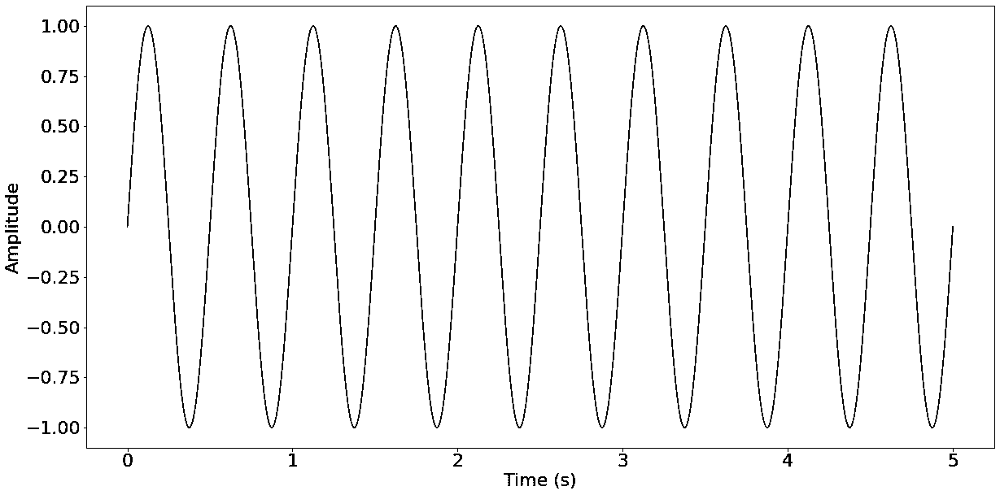](https://files.realpython.com/media/firstsin.edca17cbaa5b.png)

x 轴表示以秒为单位的时间，由于时间的每一秒都有两个峰值，所以可以看到正弦波每秒振荡两次。这种正弦波的频率太低，听不到，因此在下一节中，您将生成一些频率更高的正弦波，并了解如何混合它们。

[*Remove ads*](/account/join/)

### 混合音频信号

好消息是混合音频信号只需两步:

1.  将信号加在一起
2.  **归一化**结果

在将信号混合在一起之前，您需要生成它们:

```py
_, nice_tone = generate_sine_wave(400, SAMPLE_RATE, DURATION)
_, noise_tone = generate_sine_wave(4000, SAMPLE_RATE, DURATION)
noise_tone = noise_tone * 0.3

mixed_tone = nice_tone + noise_tone
```

这个代码示例中没有什么新内容。它生成分别分配给[变量](https://realpython.com/python-variables/) `nice_tone`和`noise_tone`的中音和高音。你将使用高音调作为你不想要的噪音，所以它会乘以`0.3`来降低它的功率。然后代码将这些音调加在一起。注意，您使用下划线(`_`)来丢弃由`generate_sine_wave()`返回的`x`值。

下一步是**标准化**，或者缩放信号以适合目标格式。由于您稍后将如何存储音频，您的目标格式是一个 16 位整数，其范围从-32768 到 32767:

```py
normalized_tone = np.int16((mixed_tone / mixed_tone.max()) * 32767)

plt.plot(normalized_tone[:1000])
plt.show()
```

在这里，代码对`mixed_tone`进行缩放，使其适合一个 16 位整数，然后使用 NumPy 的`np.int16`将其转换为该数据类型。将`mixed_tone`除以其最大值，将其缩放到`-1`和`1`之间。当这个信号乘以`32767`后，缩放在`-32767`和`32767`之间，大致是`np.int16`的范围。代码只绘制第一个`1000`样本，这样您可以更清楚地看到信号的结构。

你的情节应该是这样的:

[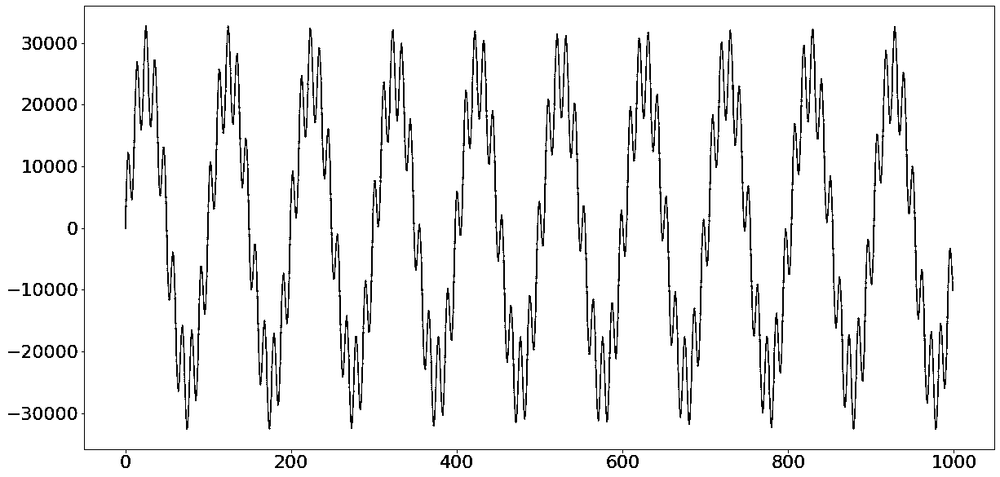](https://files.realpython.com/media/mixedsignal.ff1130345c3a.png)

信号看起来像一个扭曲的正弦波。你看到的正弦波就是你产生的 400 Hz 的音，失真就是 4000 Hz 的音。如果你仔细观察，你会发现扭曲的形状是正弦波。

要收听音频，您需要将其存储为音频播放器可以读取的格式。最简单的方法是使用 SciPy 的 [wavfile.write](https://docs.scipy.org/doc/scipy/reference/io.html) 方法将其存储在一个 WAV 文件中。16 位整数是 WAV 文件的标准数据类型，因此您将把信号规范化为 16 位整数:

```py
from scipy.io.wavfile import write

# Remember SAMPLE_RATE = 44100 Hz is our playback rate
write("mysinewave.wav", SAMPLE_RATE, normalized_tone)
```

这段代码将写入运行 Python 脚本的目录中的文件`mysinewave.wav`。然后你可以使用任何音频播放器或者甚至是使用 Python 的[来听这个文件。你会听到一个低音和一个高音。这些是您混合的 400 Hz 和 4000 Hz 正弦波。](https://realpython.com/playing-and-recording-sound-python/)

完成这一步后，您就准备好了音频样本。下一步是使用傅立叶变换去除高音音调！

### 使用快速傅立叶变换

是时候对你生成的音频使用 FFT 了。FFT 是一种实现傅里叶变换的算法，可以在时域中计算信号的频谱，例如您的音频:

```py
from scipy.fft import fft, fftfreq

# Number of samples in normalized_tone
N = SAMPLE_RATE * DURATION

yf = fft(normalized_tone)
xf = fftfreq(N, 1 / SAMPLE_RATE)

plt.plot(xf, np.abs(yf))
plt.show()
```

这段代码将计算你生成的音频的傅立叶变换并绘制出来。在分解它之前，先看看它产生的情节:

[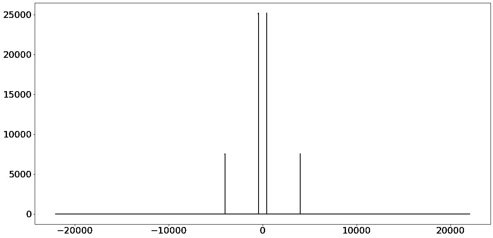](https://files.realpython.com/media/firstfft.b1983096fafd.png)

你可以在正频率上看到两个峰值，在负频率上看到这些峰值的镜像。正频率峰值位于 400 Hz 和 4000 Hz，这对应于您输入音频的频率。

傅立叶变换将复杂多变的信号转换成它所包含的频率。因为你只输入了两个频率，所以只输出了两个频率。正负对称是将**实值输入**放入傅立叶变换的副作用，但稍后你会听到更多。

在前几行中，您从稍后将使用的`scipy.fft`导入函数，并定义一个变量`N`，该变量存储信号中的样本总数。

接下来是最重要的部分，计算傅立叶变换:

```py
yf = fft(normalized_tone)
xf = fftfreq(N, 1 / SAMPLE_RATE)
```

代码调用了两个非常重要的函数:

1.  [**`fft()`**](https://docs.scipy.org/doc/scipy/reference/generated/scipy.fft.fft.html) 计算变换本身。

2.  [**`fftfreq()`**](https://docs.scipy.org/doc/scipy/reference/generated/scipy.fft.fftfreq.html) 计算`fft()`输出中每个**仓**的中心频率。没有这个，就没有办法在你的频谱上画出 x 轴。

一个 **bin** 是一个已经分组的数值范围，就像一个[直方图](https://realpython.com/python-histograms/)一样。关于**仓**的更多信息，参见本[信号处理堆栈交换问题](https://dsp.stackexchange.com/questions/26927/what-is-a-frequency-bin)。出于本教程的目的，您可以认为它们只是单个值。

一旦获得傅立叶变换的结果值及其相应的频率，就可以绘制它们:

```py
plt.plot(xf, np.abs(yf))
plt.show()
```

这段代码有趣的部分是在绘制之前对`yf`所做的处理。你在`yf`上调用 [`np.abs()`](https://numpy.org/doc/stable/reference/generated/numpy.absolute.html) 是因为它的值是**复数**。

一个**复数**是一个[数](https://realpython.com/python-numbers/)，它有两个部分，一个**实数**部分和一个**虚数**部分。有很多理由说明这样定义数字是有用的，但是你现在需要知道的是它们的存在。

数学家一般将复数写成 *a* + *bi* 的形式，其中 *a* 为实部， *b* 为虚部。 *b* 后面的 *i* 表示 *b* 是虚数。

**注:**有时候你会看到用 *i* 写的复数，有时候你会看到用 *j* 写的复数，比如 2 + 3 *i* 和 2 + 3 *j* 。两者是一样的，只是 *i* 被数学家用的多， *j* 被工程师用的多。

想了解更多关于复数的知识，请看一看[可汗学院的课程](https://www.khanacademy.org/math/algebra2/x2ec2f6f830c9fb89:complex)或[数学趣味网页](https://www.mathsisfun.com/numbers/complex-numbers.html)。

由于复数有两个部分，在二维轴上绘制它们相对于频率的图形需要从它们中计算出一个值。这就是`np.abs()`的用武之地。它计算复数的√(a + b ),这是两个数字加在一起的总幅度，重要的是是单个值。

**注意:**作为题外话，你可能已经注意到`fft()`返回的最大频率刚刚超过 20 千赫兹，准确地说是 22050 赫兹。这个值正好是我们采样率的一半，被称为[奈奎斯特频率](https://en.wikipedia.org/wiki/Nyquist_frequency)。

这是信号处理中的一个基本概念，意味着采样速率必须至少是信号最高频率的两倍。

[*Remove ads*](/account/join/)

### 使用`rfft()`和加快速度

`fft()`输出的频谱围绕 y 轴反射，因此负半部分是正半部分的镜像。这种对称性是通过将实数**(非复数)输入到变换中产生的。*

*您可以利用这种对称性，通过只计算一半来加快傅立叶变换的速度。`scipy.fft`以 [`rfft()`](https://numpy.org/doc/stable/reference/generated/numpy.fft.rfft.html) 的形式实现这种速度黑客。

关于`rfft()`的伟大之处在于它是`fft()`的替代者。记住之前的 FFT 代码:

```py
yf = fft(normalized_tone)
xf = fftfreq(N, 1 / SAMPLE_RATE)
```

换入`rfft()`，代码基本保持不变，只是有一些关键的变化:

```py
from scipy.fft import rfft, rfftfreq

# Note the extra 'r' at the front
yf = rfft(normalized_tone)
xf = rfftfreq(N, 1 / SAMPLE_RATE)

plt.plot(xf, np.abs(yf))
plt.show()
```

由于`rfft()`返回的输出只有`fft()`的一半，它使用不同的函数来获得频率映射，`rfftfreq()`而不是`fftfreq()`。

`rfft()`仍然产生复杂的输出，所以绘制其结果的代码保持不变。然而，由于负频率已经消失，该图应该如下所示:

[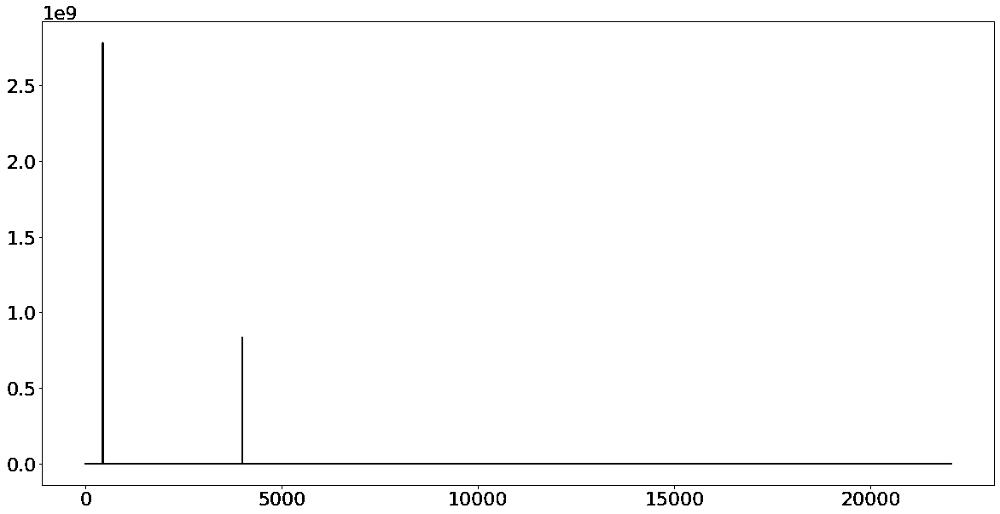](https://files.realpython.com/media/rfftplot.8e16850b2dde.png)

你可以看到上面的图像只是`fft()`产生的频谱的正侧。`rfft()`从不计算频谱的负半部分，这使得它比使用`fft()`更快。

使用`rfft()`的速度是使用`fft()`的两倍，但是有些输入长度比其他的要快。如果你知道你将只与实数打交道，那么这是一个值得了解的速度技巧。

现在你已经有了信号的频谱，你可以继续过滤它。

### 过滤信号

傅立叶变换的一大优点是它是可逆的，因此当您将信号变换回时域时，您在频域对信号所做的任何更改都会生效。您将利用这一点来过滤您的音频并消除高音频率。

**警告:**本节演示的滤波技术不适用于真实世界的信号。参见章节[避免过滤陷阱](#avoiding-filtering-pitfalls)了解原因的解释。

`rfft()`返回的值代表每个频率仓的功率。如果给定频段的功率设置为零，则该频段中的频率将不再出现在结果时域信号中。

使用`xf`的长度、最大频率以及频率仓均匀间隔的事实，您可以计算出目标频率的索引:

```py
# The maximum frequency is half the sample rate
points_per_freq = len(xf) / (SAMPLE_RATE / 2)

# Our target frequency is 4000 Hz
target_idx = int(points_per_freq * 4000)
```

然后，您可以在目标频率附近的索引处设置`yf`至`0`以消除它:

```py
yf[target_idx - 1 : target_idx + 2] = 0

plt.plot(xf, np.abs(yf))
plt.show()
```

您的代码应该产生以下图形:

[](https://files.realpython.com/media/freqremoved.51f079cdfcf8.png)

因为只有一个峰值，所以看起来它起作用了！接下来，您将应用傅里叶逆变换回到时域。

[*Remove ads*](/account/join/)

### 应用逆 FFT

应用逆 FFT 类似于应用 FFT:

```py
from scipy.fft import irfft

new_sig = irfft(yf)

plt.plot(new_sig[:1000])
plt.show()
```

既然使用的是`rfft()`，那么就需要使用`irfft()`来进行逆运算。然而，如果你使用了`fft()`，那么反函数将会是`ifft()`。您的绘图现在应该看起来像这样:

[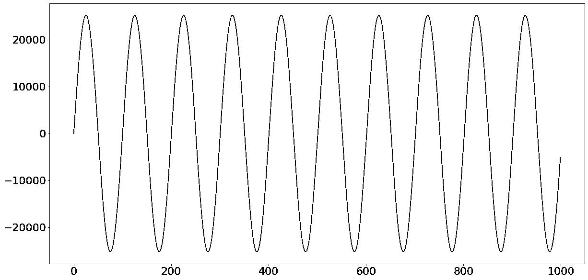](https://files.realpython.com/media/cleansig.a30a1b9f6591.png)

可以看到，现在有一个频率为 400 Hz 的正弦波振荡，并且成功消除了 4000 Hz 噪声。

同样，在将信号写入文件之前，需要对其进行规范化。你可以像上次一样做:

```py
norm_new_sig = np.int16(new_sig * (32767 / new_sig.max()))

write("clean.wav", SAMPLE_RATE, norm_new_sig)
```

当你听这个文件的时候，你会听到烦人的噪音已经消失了！

### 避免过滤陷阱

上面的例子更多的是出于教育目的，而不是现实世界的使用。在真实世界的信号上复制这个过程，比如一段音乐，[可能会引入比它消除的](https://dsp.stackexchange.com/questions/6220/why-is-it-a-bad-idea-to-filter-by-zeroing-out-fft-bins)更多的嗡嗡声。

在现实世界中，您应该使用 [`scipy.signal`](https://docs.scipy.org/doc/scipy/reference/signal.html) 包中的滤波器设计功能对信号进行滤波。过滤是一个涉及大量数学知识的复杂话题。为了更好的介绍，看看[科学家和工程师的数字信号处理指南](https://www.dspguide.com/ch14.htm)。

## 离散余弦和正弦变换

如果不看一下[离散余弦变换(DCT)](https://en.wikipedia.org/wiki/Discrete_cosine_transform) 和[离散正弦变换(DST)](https://en.wikipedia.org/wiki/Discrete_sine_transform) ，关于`scipy.fft`模块的教程是不完整的。这两种变换与傅立叶变换密切相关，但完全是对实数进行操作。这意味着它们将一个实值函数作为输入，产生另一个实值函数作为输出。

SciPy 将这些变换实现为 [`dct()`](https://docs.scipy.org/doc/scipy/reference/generated/scipy.fft.dct.html#scipy.fft.dct) 和 [`dst()`](https://docs.scipy.org/doc/scipy/reference/generated/scipy.fft.dst.html#scipy.fft.dst) 。`i*`和`*n`变量分别是函数的逆和 n 维版本。

DCT 和 DST 有点像傅立叶变换的两个部分。这并不完全正确，因为数学要复杂得多，但这是一个有用的心理模型。

那么，如果 DCT 和 DST 就像傅立叶变换的两半，那么它们为什么有用呢？

首先，它们比完全傅立叶变换更快，因为它们有效地完成了一半的工作。他们甚至可以比`rfft()`更快。最重要的是，它们完全以实数工作，所以你永远不用担心复数。

在学习如何在它们之间进行选择之前，您需要了解偶数和奇数函数。**偶数函数**关于 y 轴对称，而**奇数函数**关于原点对称。为了直观地想象这一点，请看下图:

[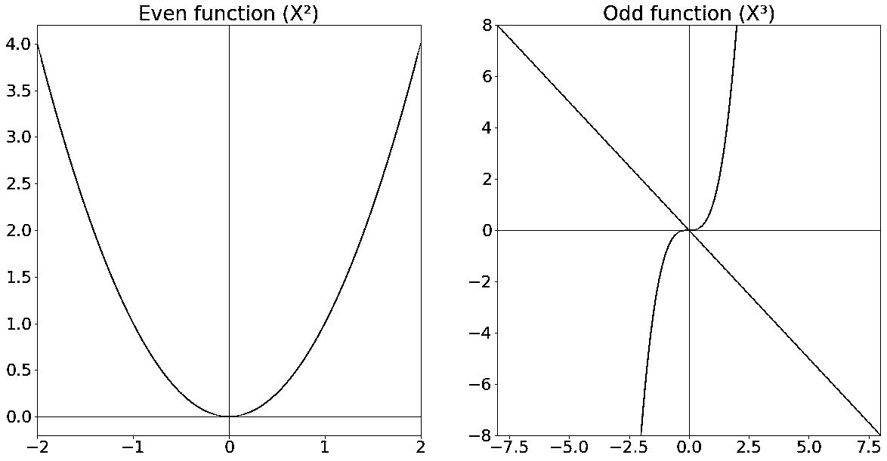](https://files.realpython.com/media/evenandodd.8410a9717f96.png)

你可以看到偶数函数是关于 y 轴对称的。奇函数关于 *y* = - *x* 对称，被描述为关于原点对称的**。**

当你计算傅立叶变换时，你假设你计算的函数是无穷的。全傅里叶变换(DFT)假设输入函数无限重复。然而，DCT 和 DST 假设函数是通过对称性扩展的。DCT 假设函数以偶对称扩展，DST 假设函数以奇对称扩展。

下图说明了每个变换如何将函数扩展到无穷大:

[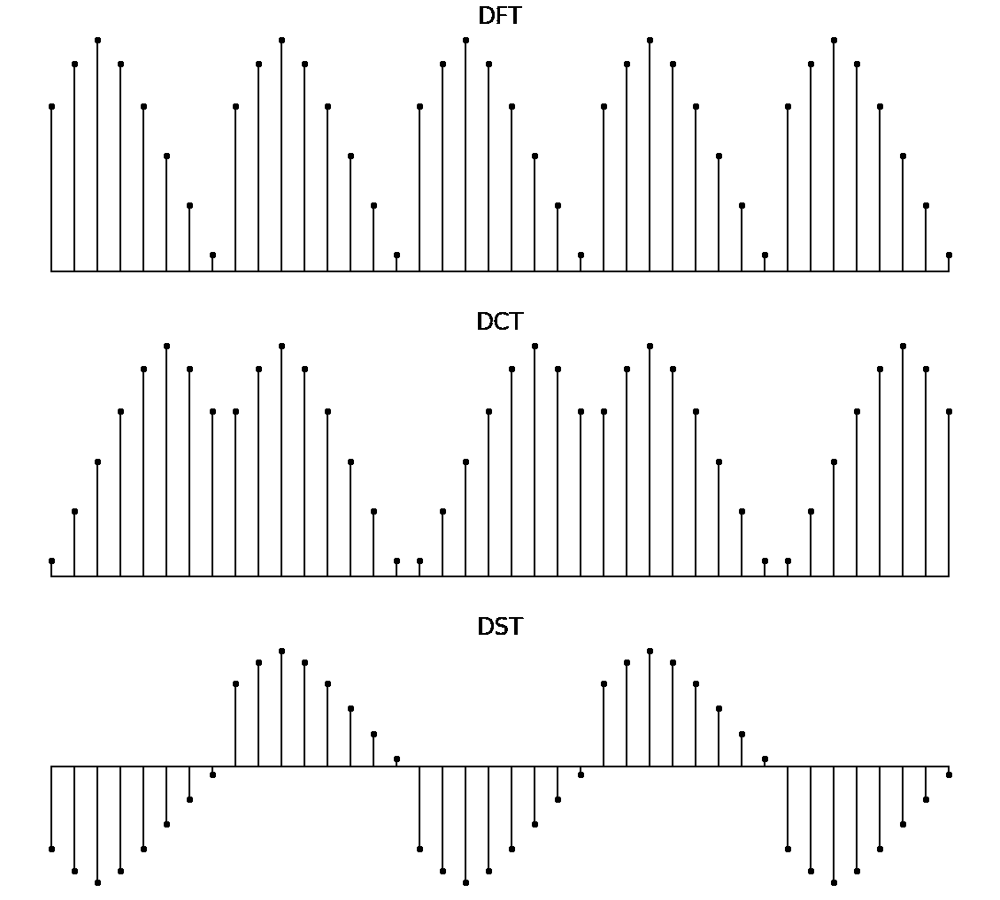](https://files.realpython.com/media/funcextension.8794e9dc3154.png)

在上图中，DFT 按原样重复该函数。DCT 垂直镜像该函数以扩展它，DST 水平镜像它。

注意，DST 暗示的对称性导致函数的大跳跃。这些被称为**的不连续性**和[在产生的频谱中产生更多的高频成分](https://dsp.stackexchange.com/questions/46754/dct-vs-dst-for-image-compression)。因此，除非你知道你的数据具有奇对称性，否则你应该使用 DCT 而不是 DST。

DCT 是非常常用的。还有很多例子，但是 JPEG、MP3 和 WebM 标准都使用 DCT。

[*Remove ads*](/account/join/)

## 结论

傅立叶变换是一个强有力的概念，它被用于从纯数学到音频工程甚至金融的各个领域。你现在已经熟悉了**离散傅立叶变换**，并且已经准备好使用`scipy.fft`模块将其应用于滤波问题。

**在本教程中，您学习了:**

*   如何以及何时使用**傅立叶变换**
*   如何从 **`scipy.fft`** 中为您的使用案例选择正确的功能
*   **时域**和**频域**有什么区别
*   如何查看和修改信号的**频谱**
*   如何使用 **`rfft()`** 加速你的代码

在上一节中，您还学习了**离散余弦变换**和**离散正弦变换**。您看到了调用哪些函数来使用它们，并且了解了何时使用其中一个而不是另一个。

如果你想要本教程的摘要，那么你可以下载下面的备忘单。它解释了`scipy.fft`模块中的所有功能，并对可用的不同转换类型进行了分类:

**scipy.fft 备忘单:** [点击这里获得免费的 scipy.fft 备忘单](https://realpython.com/bonus/scipy-fft-cheatsheet/)，它总结了本教程中介绍的技术。

继续探索这个迷人的话题，尝试变换，一定要在下面的评论中分享你的发现！********