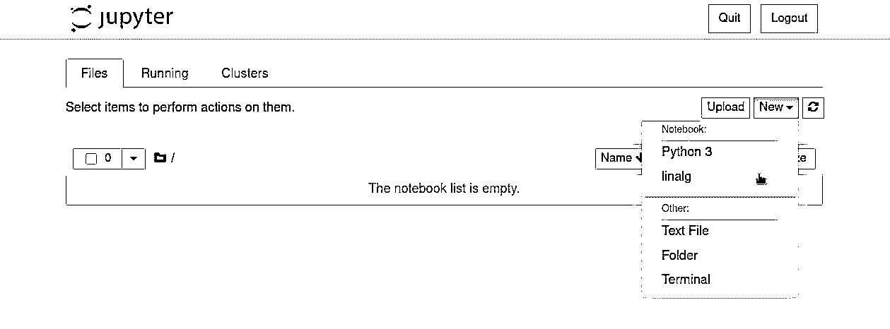
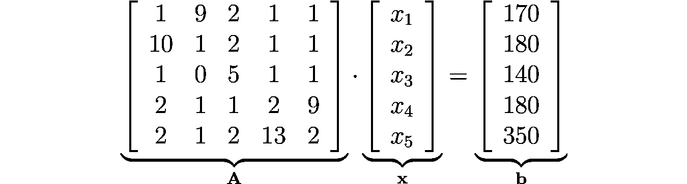

# 使用 scipy.linalg 在 Python 中处理线性系统

> 原文：<https://realpython.com/python-scipy-linalg/>

**线性代数**广泛应用于各种学科，一旦你使用像**向量**和**线性方程**这样的概念组织信息，你就可以用它来解决许多问题。在 Python 中，与这个主题相关的大多数例程都是在 [`scipy.linalg`](https://docs.scipy.org/doc/scipy/reference/linalg.html) 中实现的，这提供了非常快的线性代数能力。

特别是，**线性系统**在建模各种现实世界问题中发挥着重要作用，`scipy.linalg`提供了以高效方式研究和解决它们的工具。

**在本教程中，您将学习如何:**

*   利用 **`scipy.linalg`** 将**线性代数概念**应用到实际问题中
*   使用 Python 和 NumPy 处理**向量**和**矩阵**
*   使用**线性系统**模拟实际问题
*   如何用 **`scipy.linalg`** 解线性方程组

我们开始吧！

**免费奖励:** [点击此处获取免费的 NumPy 资源指南](#)，它会为您指出提高 NumPy 技能的最佳教程、视频和书籍。

## `scipy.linalg` 入门

[SciPy](https://www.scipy.org/scipylib/index.html) 是一个用于科学计算的开源 Python 库，包括几个用于科学和工程中常见任务的模块，如[线性代数](https://docs.scipy.org/doc/scipy/reference/linalg.html)、[优化](https://realpython.com/python-scipy-cluster-optimize/)、[积分](https://docs.scipy.org/doc/scipy/reference/tutorial/integrate.html)、[插值](https://docs.scipy.org/doc/scipy/reference/interpolate.html)、[信号处理](https://realpython.com/python-scipy-fft/)。它是 [SciPy 栈](https://www.scipy.org/)的一部分，后者包括其他几个用于科学计算的包，如 [NumPy](https://realpython.com/numpy-tutorial/) 、 [Matplotlib](https://realpython.com/python-matplotlib-guide/) 、 [SymPy](https://www.sympy.org/) 、 [IPython](https://ipython.org/) 和 [pandas](https://realpython.com/learning-paths/pandas-data-science/) 。

[线性代数](https://en.wikipedia.org/wiki/Linear_algebra)是数学的一个分支，涉及线性方程及其使用[向量](https://en.wikipedia.org/wiki/Vector_(mathematics_and_physics))和[矩阵](https://en.wikipedia.org/wiki/Matrix_(mathematics))的表示。这是一个在工程的几个领域使用的基础学科，也是更深入理解[机器学习](https://realpython.com/learning-paths/machine-learning-python/)的先决条件。

**`scipy.linalg`** 包括几个处理线性代数问题的工具，包括执行矩阵计算的函数，如行列式、逆矩阵、[特征值、特征向量](https://en.wikipedia.org/wiki/Eigenvalues_and_eigenvectors)和[奇异值分解](https://en.wikipedia.org/wiki/Singular_value_decomposition)。

在本教程中，你将使用`scipy.linalg`中的一些函数来处理涉及线性系统的实际问题。为了使用`scipy.linalg`，你必须安装和设置 SciPy 库，这可以通过使用 [Anaconda](https://www.anaconda.com/products/individual) Python 发行版和 [conda](https://docs.conda.io/projects/conda/en/latest/user-guide/getting-started.html) 包和环境管理系统来完成。

**注意:**要了解更多关于 Anaconda 和 conda 的信息，请查看[在 Windows 上设置 Python 进行机器学习](https://realpython.com/python-windows-machine-learning-setup/)。

首先，创建一个 conda 环境并激活它:

```py
$ conda create --name linalg
$ conda activate linalg
```

激活 conda 环境后，您的提示符将显示其名称`linalg`。然后，您可以在环境中安装必要的软件包:

```py
(linalg) $ conda install scipy jupyter
```

执行此命令后，系统需要一段时间来确定依赖项并继续安装。

**注意:**除了 SciPy，您还将使用 [Jupyter Notebook](https://jupyter.org/) 在交互式环境中运行代码。这样做不是强制性的，但它有助于处理数值和科学应用程序。

要复习使用 Jupyter 笔记本，请看一下 [Jupyter 笔记本:简介](https://realpython.com/jupyter-notebook-introduction/)。

如果您喜欢使用不同的 Python 发行版和 [`pip`包管理器](https://realpython.com/what-is-pip/)来阅读本文，那么展开下面的可折叠部分来看看如何设置您的环境。


首先，建议创建一个[虚拟环境](https://realpython.com/python-virtual-environments-a-primer/)，在其中安装软件包。假设您安装了 Python，您可以创建一个名为`linalg`的虚拟环境:

```py
$ python -m venv linalg
```

创建环境后，您需要激活它，这样您就可以使用`pip`在环境中安装包。如果您使用的是 Linux 或 macOS，那么您可以使用以下命令激活环境:

```py
$ source ./linalg/bin/activate
```

在 Windows 上，您必须使用的命令略有不同:

```py
C:> \linalg\Scripts\activate.bat
```

激活 conda 环境后，您的提示符将显示其名称`linalg`。然后，您可以使用`pip`在环境中安装必要的包:

```py
(linalg) $ python -m pip install scipy jupyter
```

系统需要一段时间来找出依赖关系并继续安装。命令结束后，您就可以打开 Jupyter 并使用`scipy.linalg`了。

在打开 Jupyter Notebook 之前，您需要注册 conda `linalg`环境，以便您可以使用它作为内核来创建笔记本。为此，在激活了`linalg`环境的情况下，运行以下命令:

```py
(linalg) $ python -m ipykernel install --user --name linalg
```

现在，您可以通过运行以下命令来打开 Jupyter 笔记本:

```py
$ jupyter notebook
```

Jupyter 加载到你的浏览器后，点击*新建* → *直线*创建一个新的笔记本，如下图所示:

[](https://files.realpython.com/media/scipy-linalg-jupyter.775b42f2580e.jpg)

在笔记本内部，您可以通过[导入](https://realpython.com/python-modules-packages/)包`scipy`来测试安装是否成功:

>>>

```py
In [1]: import scipy
```

现在您已经完成了环境的设置，您将看到如何在 Python 中处理向量和矩阵，这是使用`scipy.linalg`处理线性代数应用程序的基础。

[*Remove ads*](/account/join/)

## 使用 NumPy 处理向量和矩阵

**矢量**是一个数学实体，用于表示既有大小又有方向的物理量。它是解决工程和机器学习问题的一个基本工具，正如用于表示向量变换的**矩阵**以及其他应用一样。

[NumPy](https://numpy.org/) 是在 Python 中使用矩阵和向量最多的[库](https://www.jetbrains.com/lp/python-developers-survey-2020/#FrameworksLibraries)，与`scipy.linalg`一起用于线性代数应用。在本节中，您将了解使用它创建矩阵和向量以及对它们执行操作的基本知识。

要开始处理矩阵和向量，你需要在 Jupyter 笔记本上做的第一件事是导入`numpy`。通常的方法是使用别名`np`:

>>>

```py
In [2]: import numpy as np
```

为了表示矩阵和向量，NumPy 使用了一种叫做 [`ndarray`](https://realpython.com/numpy-array-programming/) 的特殊类型。

要创建一个`ndarray`对象，可以使用`np.array()`，它需要一个类似数组的对象，比如一个[列表](https://realpython.com/python-lists-tuples/)或者一个嵌套列表。

例如，假设您需要创建以下矩阵:

[](https://files.realpython.com/media/scipy-linalg-matrix-np.b3b8be998727.png)

要用 NumPy 创建它，您可以使用`np.array()`，提供一个包含矩阵每行元素的嵌套列表:

>>>

```py
In [3]: A = np.array([[1, 2], [3, 4], [5, 6]])
 ...: A
Out[3]:
array([[1, 2],
 [3, 4],
 [5, 6]])
```

正如您可能注意到的，NumPy 提供了矩阵的可视化表示，您可以在其中识别它的列和行。

值得注意的是，NumPy 数组的元素必须是同一类型。您可以使用`.dtype`来检查 NumPy 数组的类型:

>>>

```py
In [4]: A.dtype
Out[4]:
dtype('int64')
```

由于`A`的所有元素都是整数，所以数组是用类型`int64`创建的。如果其中一个元素是一个[浮点数](https://realpython.com/python-numbers/#floating-point-numbers)，那么这个数组将被创建为类型`float64`:

>>>

```py
In [5]: A = np.array([[1.0, 2], [3, 4], [5, 6]])
 ...: A
Out[5]:
array([[1., 2.],
 [3., 4.],
 [5., 6.]])

In [6]: A.dtype
Out[6]:
dtype('float64')
```

要检查`ndarray`对象的尺寸，可以使用`.shape`。例如，要检查`A`的尺寸，可以使用`A.shape`:

>>>

```py
In [7]: A.shape
Out[7]:
(3, 2)
```

正如所料，`A`矩阵的维数是`3` × `2`，因为`A`有三行两列。

当处理涉及矩阵的问题时，你经常需要使用[转置](https://en.wikipedia.org/wiki/Transpose)操作，它交换矩阵的列和行。

要转置由`ndarray`对象表示的向量或矩阵，可以使用`.transpose()`或`.T`。比如你可以用`A.T`获得`A`的转置:

>>>

```py
In [8]: A.T
Out[8]:
array([[1., 3., 5.],
 [2., 4., 6.]])
```

通过转置，`A`的列变成了`A.T`的行，行变成了列。

要创建一个向量，可以使用`np.array()`，提供一个包含向量元素的列表:

>>>

```py
In [9]: v = np.array([1, 2, 3])
 ...: v
Out[9]:
array([1, 2, 3])
```

要检查向量的维度，您可以像之前一样使用`.shape`:

>>>

```py
In [10]: v.shape
Out[10]:
(3,)
```

注意这个向量的形状是`(3,)`，而不是`(3, 1)`或者`(1, 3)`。这是一个与那些习惯于使用 [MATLAB](https://realpython.com/matlab-vs-python/) 的人相关的 NumPy 特性。在 NumPy 中，可以创建像`v`这样的一维数组，这可能会在执行矩阵和向量之间的运算时产生问题。例如，转置操作对一维数组没有影响。

每当您向`np.array()`提供一个类似一维数组的参数时，得到的数组将是一个一维数组。要创建二维数组，您必须提供一个类似二维数组的参数，如嵌套列表:

>>>

```py
In [11]: v = np.array([[1, 2, 3]])
 ...: v.shape
Out[11]:
(1, 3)
```

上例中，`v`的维数为`1` × `3`，对应一个二维线矢量的维数。要创建列向量，可以使用嵌套列表:

>>>

```py
In [12]: v = np.array([[1], [2], [3]])
 ...: v.shape
Out[12]:
(3, 1)
```

在这种情况下，`v`的维数为`3` × `1`，对应一个二维列向量的维数。

使用嵌套列表来创建向量可能很费力，尤其是使用最多的列向量。或者，您可以创建一个一维向量，向`np.array`提供一个平面列表，并使用`.reshape()`来改变`ndarray`对象的尺寸:

>>>

```py
In [13]: v = np.array([1, 2, 3]).reshape(3, 1)
 ...: v.shape
Out[13]:
(3, 1)
```

在上面的例子中，您使用`.reshape()`从形状为`(3,)`的一维向量中获得形状为`(3, 1)`的列向量。值得一提的是`.reshape()`期望新数组的元素个数与原数组的元素个数兼容。换句话说，具有新形状的数组中的元素数量必须等于原始数组中的元素数量。

在这个例子中，您也可以使用`.reshape()`而不用显式定义数组的行数:

>>>

```py
In [14]: v = np.array([1, 2, 3]).reshape(-1, 1)
 ...: v.shape
Out[14]:
(3, 1)
```

这里，作为参数提供给`.reshape()`的`-1`表示新数组只有一列所需的行数，由第二个参数指定。在这种情况下，由于原始数组有三个元素，新数组的行数将是`3`。

在实际应用中，您经常需要创建由 0、1 或随机元素组成的矩阵。为此，NumPy 提供了一些方便的函数，您将在接下来看到。

[*Remove ads*](/account/join/)

### 使用便利函数创建数组

NumPy 还提供了一些方便的函数来创建数组。例如，要创建一个用零填充的数组，可以使用`np.zeros()`:

>>>

```py
In [15]: A = np.zeros((3, 2))
 ...: A
Out[15]:
array([[0., 0.],
 [0., 0.],
 [0., 0.]])
```

作为它的第一个参数，`np.zeros()`期望一个[元组](https://realpython.com/python-lists-tuples/#python-tuples)来指示您想要创建的数组的形状，并且它返回一个类型为`float64`的数组。

类似地，要创建填充 1 的数组，可以使用`np.ones()`:

>>>

```py
In [16]: A = np.ones((2, 3))
 ...: A
Out[16]:
array([[1., 1., 1.],
 [1., 1., 1.]])
```

值得注意的是，`np.ones()`也返回一个类型为`float64`的数组。

要创建包含随机元素的数组，可以使用`np.random.rand()`:

>>>

```py
In [17]: A = np.random.rand(3, 2)
 ...: A
Out[17]:
array([[0.8206045 , 0.54470809],
 [0.9490381 , 0.05677859],
 [0.71148476, 0.4709059 ]])
```

`np.random.rand()`返回一个从`0`到`1`的随机元素数组，取自[均匀分布](https://en.wikipedia.org/wiki/Continuous_uniform_distribution)。注意，与`np.zeros()`和`np.ones()`不同的是，`np.random.rand()`不期望元组作为它的参数。

类似地，要获得一个数组，其中的随机元素来自平均值和单位方差为零的[正态分布](https://en.wikipedia.org/wiki/Normal_distribution)，您可以使用`np.random.randn()`:

>>>

```py
In [18]: A = np.random.randn(3, 2)
 ...: A
Out[18]:
array([[-1.20019512, -1.78337814],
 [-0.22135221, -0.38805899],
 [ 0.17620202, -2.05176764]])
```

现在您已经创建了数组，您将看到如何使用它们执行操作。

### 对 NumPy 数组执行操作

在数组上使用加法(`+`)、减法(`-`)、乘法(`*`)、除法(`/`)和指数(`**`)运算符的常见 Python 操作总是按元素执行的。如果其中一个操作数是一个[标量](https://en.wikipedia.org/wiki/Scalar_(mathematics))，那么这个操作将在这个标量和数组的每个元素之间执行。

例如，要创建一个填充了等于`10`的元素的矩阵，您可以使用`np.ones()`并用`*`将输出乘以`10`:

>>>

```py
In [19]: A = 10 * np.ones((2, 2))
 ...: A
Out[19]:
array([[10., 10.],
 [10., 10.]])
```

如果两个操作数都是相同形状的数组，则运算将在数组的相应元素之间执行:

>>>

```py
In [20]: A = 10 * np.ones((2, 2))
 ...: B = np.array([[2, 2], [5, 5]])
 ...: C = A * B
 ...: C
Out[20]:
array([[20., 20.],
 [50., 50.]])
```

这里，您将矩阵`A`的每个元素乘以矩阵`B`的相应元素。

要根据线性代数规则执行矩阵乘法，可以使用`np.dot()`:

>>>

```py
In [21]: A = np.array([[1, 2], [3, 4]])
 ...: v = np.array([[5], [6]])
 ...: x = np.dot(A, v)
 ...: x
Out[21]:
array([[17],
 [39]])
```

这里，您将一个名为`A`的 2 × 2 矩阵乘以一个名为`v`的 2 × 1 向量。

您可以使用`@`操作符获得相同的结果，从 [PEP 465 和 Python 3.5](https://docs.python.org/3/whatsnew/3.5.html#pep-465-a-dedicated-infix-operator-for-matrix-multiplication) 开始，NumPy 和原生 Python 都支持该操作符:

>>>

```py
In [22]: A = np.array([[1, 2], [3, 4]])
 ...: v = np.array([[5], [6]])
 ...: x = A @ v
 ...: x
Out[22]:
array([[17],
 [39]])
```

除了处理矩阵和向量的基本操作，NumPy 还提供了一些特定的函数来处理`numpy.linalg`中的线性代数。然而，对于那些应用程序来说，`scipy.linalg`提供了一些优势，您将在下面看到。

[*Remove ads*](/account/join/)

## 将`scipy.linalg`与`numpy.linalg`进行比较

NumPy 在 [`numpy.linalg`](https://numpy.org/doc/stable/reference/routines.linalg.html) 模块中包含了一些处理线性代数应用程序的工具。然而，除非您不想将 SciPy 作为依赖项添加到您的项目中，否则通常最好使用`scipy.linalg`,原因如下:

*   正如[官方文档](https://docs.scipy.org/doc/scipy/reference/tutorial/linalg.html#scipy-linalg-vs-numpy-linalg)中解释的那样，`scipy.linalg`包含了`numpy.linalg`中的所有功能，加上一些`numpy.linalg`中没有的额外高级功能。

*   `scipy.linalg`的编译总是支持 [BLAS](https://en.wikipedia.org/wiki/Basic_Linear_Algebra_Subprograms) 和 [LAPACK](https://en.wikipedia.org/wiki/LAPACK) ，它们是包含以优化方式执行数值运算的例程的库。对于`numpy.linalg`，BLAS 和 LAPACK 的使用是可选的。因此，根据你如何安装 NumPy，`scipy.linalg`功能可能会比`numpy.linalg`快。

总之，考虑到科学和技术应用程序通常没有关于依赖性的限制，安装 SciPy 并使用`scipy.linalg`而不是`numpy.linalg`通常是个好主意。

在下一节中，您将使用`scipy.linalg`工具来处理线性系统。您将从一个简单的例子开始，然后将这些概念应用到一个实际问题中。

## 用`scipy.linalg.solve()`解线性系统

线性系统可以是一个有用的工具，用于找到几个实际和重要问题的解决方案，包括与车辆交通、平衡化学方程式、电路和[多项式插值](https://en.wikipedia.org/wiki/Polynomial_interpolation)相关的问题。

在这一节中，你将学习如何使用`scipy.linalg.solve()`来求解线性系统。但是在着手编写代码之前，理解基础知识是很重要的。

### 了解线性系统

线性系统，或者更准确地说，线性方程组，是与一组变量线性相关的一组方程。这里有一个与变量 *x* ₁、 *x* ₂和 *x* ₃:相关的线性系统的例子

[](https://files.realpython.com/media/scipy-linalg-lin-syst-ex.64d4624b5478.png)

这里有三个包含三个变量的方程。为了有一个**线性**系统，值*k*₁……*k*₉和*b*₁……*b*₃必须是常数。

当只有两三个方程和变量时，可以手动执行计算，合并方程，并找到变量的值。然而，对于四个或更多的变量，手动求解一个线性系统需要相当长的时间，并且出错是很常见的。

实际应用一般涉及大量变量，这使得手动求解线性系统不可行。幸运的是，有一些工具可以完成这项艰巨的工作，比如 [`scipy.linalg.solve()`](https://docs.scipy.org/doc/scipy/reference/generated/scipy.linalg.solve.html) 。

### 使用`scipy.linalg.solve()`

SciPy 提供了`scipy.linalg.solve()`来快速可靠地求解线性系统。要了解其工作原理，请考虑以下系统:

[](https://files.realpython.com/media/scipy-linalg-lin-syst-ex2.dd5d107931c0.png)

为了使用`scipy.linalg.solve()`，你需要首先将线性系统写成一个**矩阵乘积**，如下式所示:

[](https://files.realpython.com/media/scipy-linalg-lin-syst-ex2-m.ddf00eacc290.png)

注意，计算完矩阵乘积后，你会得到系统的原始方程。`scipy.linalg.solve()`期望解决的输入是矩阵`A`和向量`b`，它们可以使用 NumPy 数组来定义。这样，您可以使用以下代码求解系统:

>>>

```py
 1In [1]: import numpy as np
 2 ...: from scipy.linalg import solve
 3
 4In [2]: A = np.array(
 5 ...:   [
 6 ...:       [3, 2],
 7 ...:       [2, -1],
 8 ...:   ]
 9 ...: )
10
11In [3]: b = np.array([12, 1]).reshape((2, 1))
12
13In [4]: x = solve(A, b)
14 ...: x
15Out[4]:
16array([[2.],
17 [3.]])
```

下面是正在发生的事情的分类:

*   **1、2 号线**从`scipy.linalg`随`solve()`一起导入编号为`np`。
*   **第 4 行到第 9 行**使用名为`A`的 NumPy 数组创建系数矩阵。
*   **第 11 行**使用名为`b`的 NumPy 数组创建独立的术语向量。要使它成为两行的列向量，可以使用`.reshape((2, 1))`。
*   **第 13 行和第 14 行**调用`solve()`求解由`A`和`b`表征的线性系统，结果存储在`x`中，并打印出来。请注意，`solve()`返回的是浮点成分的解，即使原始数组的所有元素都是整数。

如果你在原始方程中替换掉 *x* ₁=2 和 *x* ₂=3，那么你可以验证这就是系统的解。

既然您已经学习了使用`scipy.linalg.solve()`的基础知识，那么是时候看看线性系统的实际应用了。

[*Remove ads*](/account/join/)

## 解决实际问题:制定饮食计划

线性系统通常解决的一类问题是，当你需要找到获得某种混合物所需的组分比例时。下面，你将使用这个想法来建立一个膳食计划，混合不同的食物，以获得均衡的饮食。

为此，考虑均衡饮食应包括以下内容:

*   170 单位的维生素 A
*   180 单位的维生素 B
*   140 单位的维生素 C
*   180 单位的维生素 D
*   350 单位的维生素 E

你的任务是找出每种不同食物的数量，以获得规定量的维生素。在下表中，您得到了根据每种维生素的单位分析每种食物一克的结果:

| 食物 | 维生素 a | 维生素 b | 维生素 c | 钙化醇 | 生育酚 |
| --- | --- | --- | --- | --- | --- |
| #1 | one | Ten | one | Two | Two |
| #2 | nine | one | Zero | one | one |
| #3 | Two | Two | five | one | Two |
| #4 | one | one | one | Two | Thirteen |
| #5 | one | one | one | nine | Two |

通过将食物 1 表示为 *x* ₁等等，并考虑到你将混合 *x* ₁单位的食物 1、 *x* ₂单位的食物 2 等等，你可以写一个表达式来表示你在组合中得到的维生素 a 的量。考虑到均衡饮食应包含 170 单位的维生素 A，您可以使用维生素 A 栏中的数据写出以下等式:

[](https://files.realpython.com/media/scipy-linalg-vit-a.5a09968cd924.png)

对维生素 B、C、D 和 E 重复同样的过程，你得到下面的线性系统:

[](https://files.realpython.com/media/scipy-linalg-vits.fdee4b584c37.png)

要使用`scipy.linalg.solve()`，您必须获得系数矩阵`A`和独立项向量`b`，它们由下式给出:

[](https://files.realpython.com/media/scipy-linalg-vits-m.348720485e97.png)

现在你只需要用`scipy.linalg.solve()`找出数量 *x* ₁，…， *x* ₅:

>>>

```py
In [1]: import numpy as np
 ...: from scipy.linalg import solve

In [2]: A = np.array(
 ...:    [
 ...:        [1, 9, 2, 1, 1],
 ...:        [10, 1, 2, 1, 1],
 ...:        [1, 0, 5, 1, 1],
 ...:        [2, 1, 1, 2, 9],
 ...:        [2, 1, 2, 13, 2],
 ...:    ]
 ...: )

In [3]: b = np.array([170, 180, 140, 180, 350]).reshape((5, 1))

In [4]: x = solve(A, b)
 ...: x
Out[4]:
array([[10.],
 [10.],
 [20.],
 [20.],
 [10.]])
```

这表明均衡饮食应该包括`10`单位食物 1、`10`单位食物 2、`20`单位食物 3、`20`单位食物 4 和`10`单位食物 5。

## 结论

恭喜你！您已经学习了如何使用一些线性代数概念，以及如何使用`scipy.linalg`来解决涉及线性系统的问题。您已经看到向量和矩阵对于表示数据非常有用，并且通过使用线性代数概念，您可以对实际问题进行建模并以高效的方式解决它们。

**在本教程中，您学习了如何:**

*   利用 **`scipy.linalg`** 将**线性代数概念**应用到实际问题中
*   使用 Python 和 NumPy 处理**向量**和**矩阵**
*   使用**线性系统**模拟实际问题
*   利用 **`scipy.linalg`** 求解线性系统

线性代数是一个非常广泛的话题。有关其他线性代数应用程序的更多信息，请查看以下资源:

*   [科学 Python:使用 SciPy 进行优化](https://realpython.com/python-scipy-cluster-optimize/)
*   [动手线性编程:用 Python 优化](https://realpython.com/linear-programming-python/)
*   [NumPy、SciPy 和 Pandas:与 Python 的相关性](https://realpython.com/numpy-scipy-pandas-correlation-python/)

继续学习，欢迎在下面留下任何问题或评论！****