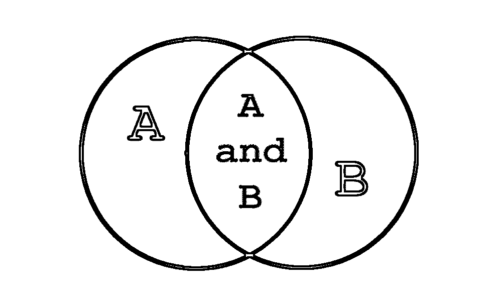
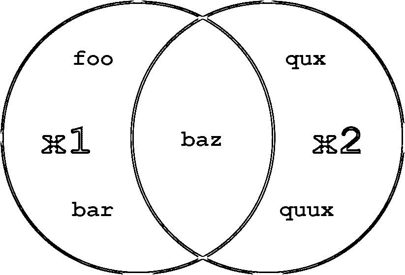
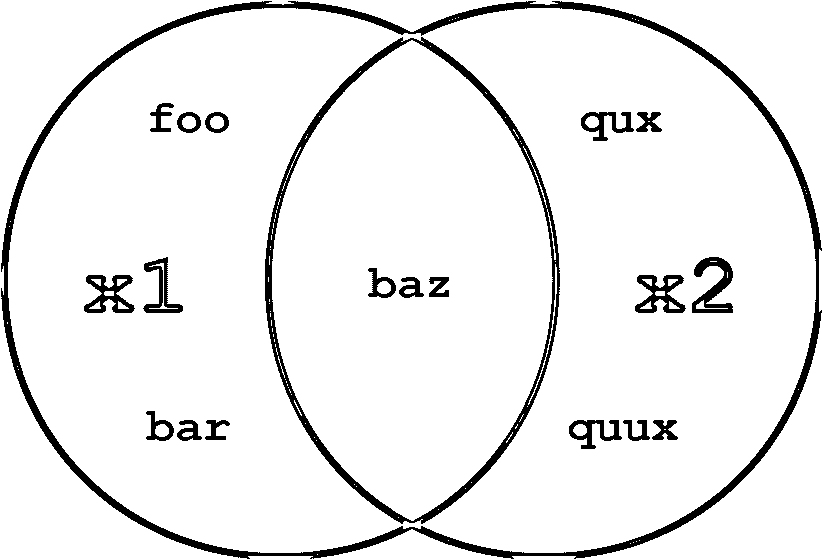
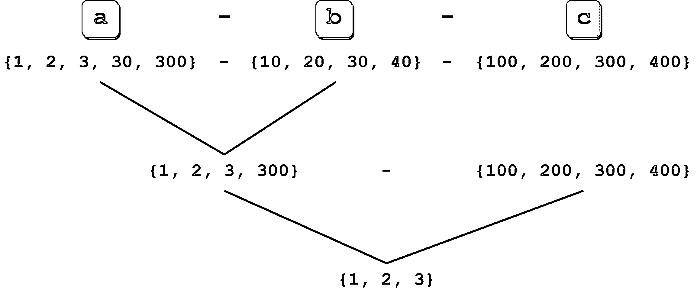
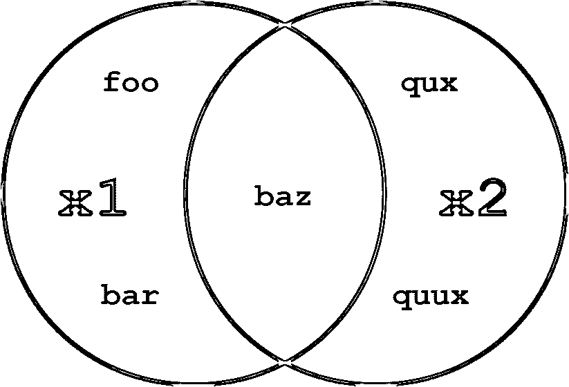

# Python 中的集合

> 原文：<https://realpython.com/python-sets/>

*立即观看**本教程有真实 Python 团队创建的相关视频课程。和文字教程一起看，加深理解: [**套在 Python 里**](/courses/sets-python/)

也许你记得在数学教育的某个时候学习过**集合**和**集合论**。也许你还记得维恩图:

[](https://files.realpython.com/media/t.8b7abb515ae8.png)

如果这没有让你想起什么，不要担心！本教程对你来说应该还是很容易理解的。

在数学中，集合的严格定义可能是抽象的，难以理解。然而实际上，集合可以简单地认为是定义明确的不同对象的集合，通常称为**元素**或**成员**。

将对象分组到一个集合中在编程中也很有用，Python 提供了一个内置的集合类型来做到这一点。集合与其他对象类型的区别在于可以对其执行的独特操作。

**以下是你将在本教程中学到的:**你将看到如何在 Python 中定义 **set** 对象，并发现它们支持的操作。与前面的列表和词典教程一样，当您完成本教程后，您应该会很好地感觉到什么时候集合是合适的选择。你还将了解到**冷冻布景**，除了一个重要的细节外，它们与布景相似。

***参加测验:****通过我们的交互式“Python 集”测验来测试您的知识。完成后，您将收到一个分数，以便您可以跟踪一段时间内的学习进度:*

*[参加测验](/quizzes/python-sets/)

## 定义集合

Python 的内置`set`类型有以下特点:

*   集合是无序的。
*   集合元素是唯一的。不允许重复的元素。
*   集合本身可以被修改，但是集合中包含的元素必须是不可变的类型。

让我们看看这意味着什么，以及如何在 Python 中使用集合。

可以通过两种方式创建集合。首先，您可以使用内置的`set()`函数定义一个集合:

```py
x = set(<iter>)
```

在这种情况下，参数`<iter>`是一个 iterable——现在再一次考虑 list 或 tuple——它生成包含在集合中的对象列表。这类似于给予`.extend()`列表方法的`<iter>`参数:

>>>

```py
>>> x = set(['foo', 'bar', 'baz', 'foo', 'qux'])
>>> x
{'qux', 'foo', 'bar', 'baz'}

>>> x = set(('foo', 'bar', 'baz', 'foo', 'qux'))
>>> x
{'qux', 'foo', 'bar', 'baz'}
```

[字符串](https://realpython.com/python-strings/)也是可迭代的，所以一个字符串也可以传递给`set()`。您已经看到`list(s)`生成了字符串`s`中的字符列表。类似地，`set(s)`生成了一组`s`中的人物:

>>>

```py
>>> s = 'quux'

>>> list(s)
['q', 'u', 'u', 'x']
>>> set(s)
{'x', 'u', 'q'}
```

您可以看到结果集是无序的:定义中指定的原始顺序不一定被保留。此外，重复值在集合中只出现一次，就像前两个例子中的字符串`'foo'`和第三个例子中的字母`'u'`一样。

或者，可以用花括号(`{}`)来定义集合:

```py
x = {<obj>, <obj>, ..., <obj>}
```

当一个集合以这种方式定义时，每个`<obj>`成为集合中的一个独特元素，即使它是可迭代的。这种行为类似于`.append()`列表方法。

因此，上面显示的集合也可以这样定义:

>>>

```py
>>> x = {'foo', 'bar', 'baz', 'foo', 'qux'}
>>> x
{'qux', 'foo', 'bar', 'baz'}

>>> x = {'q', 'u', 'u', 'x'}
>>> x
{'x', 'q', 'u'}
```

概括一下:

*   `set()`的参数是可迭代的。它生成一个要放入集合的元素列表。
*   花括号中的对象被原封不动地放入集合中，即使它们是可迭代的。

观察这两个集合定义之间的差异:

>>>

```py
>>> {'foo'}
{'foo'}

>>> set('foo')
{'o', 'f'}
```

集合可以是空的。然而，回想一下 Python 将空花括号(`{}`)解释为空字典，因此定义空集的唯一方法是使用`set()`函数:

>>>

```py
>>> x = set()
>>> type(x)
<class 'set'>
>>> x
set()

>>> x = {}
>>> type(x)
<class 'dict'>
```

在[布尔上下文](https://realpython.com/python-boolean/)中，空集是假的:

>>>

```py
>>> x = set()
>>> bool(x)
False
>>> x or 1
1
>>> x and 1
set()
```

你可能认为最直观的集合会包含相似的对象——例如，甚至是[数字](https://realpython.com/python-numbers/)或姓氏:

>>>

```py
>>> s1 = {2, 4, 6, 8, 10}
>>> s2 = {'Smith', 'McArthur', 'Wilson', 'Johansson'}
```

但是 Python 并不要求这样。集合中的元素可以是不同类型的对象:

>>>

```py
>>> x = {42, 'foo', 3.14159, None}
>>> x
{None, 'foo', 42, 3.14159}
```

不要忘记集合元素必须是不可变的。例如，一个元组可以包含在一个集合中:

>>>

```py
>>> x = {42, 'foo', (1, 2, 3), 3.14159}
>>> x
{42, 'foo', 3.14159, (1, 2, 3)}
```

但是列表和字典是可变的，所以它们不能是集合元素:

>>>

```py
>>> a = [1, 2, 3]
>>> {a}
Traceback (most recent call last):
  File "<pyshell#70>", line 1, in <module>
    {a}
TypeError: unhashable type: 'list'

>>> d = {'a': 1, 'b': 2}
>>> {d}
Traceback (most recent call last):
  File "<pyshell#72>", line 1, in <module>
    {d}
TypeError: unhashable type: 'dict'
```

[*Remove ads*](/account/join/)

## 设置规模和成员资格

`len()`函数返回集合中元素的数量，而`in`和`not in`操作符可用于测试成员资格:

>>>

```py
>>> x = {'foo', 'bar', 'baz'}

>>> len(x)
3

>>> 'bar' in x
True
>>> 'qux' in x
False
```

## 在器械包上操作

许多可用于 Python 其他复合数据类型的操作对集合没有意义。例如，集合不能被索引或切片。然而，Python 提供了一整套对集合对象的操作，这些操作通常模仿为数学集合定义的[操作](https://en.wikipedia.org/wiki/Set_(mathematics)#Basic_operations)。

### 运算符与方法

Python 中的大多数(尽管不是全部)集合操作可以通过两种不同的方式执行:通过操作符或通过方法。以 set union 为例，让我们看看这些操作符和方法是如何工作的。

给定两个集合`x1`和`x2`,`x1`和`x2`的并集是由任一集合中的所有元素组成的集合。

考虑这两组:

```py
x1 = {'foo', 'bar', 'baz'}
x2 = {'baz', 'qux', 'quux'}
```

`x1`和`x2`的并集就是`{'foo', 'bar', 'baz', 'qux', 'quux'}`。

**注意:**注意，同时出现在`x1`和`x2`中的元素`'baz'`，在联合中只出现一次。集合从不包含重复值。

在 Python 中，可以用`|`操作符执行集合并集:

>>>

```py
>>> x1 = {'foo', 'bar', 'baz'}
>>> x2 = {'baz', 'qux', 'quux'}
>>> x1 | x2
{'baz', 'quux', 'qux', 'bar', 'foo'}
```

集合并集也可以用`.union()`方法获得。方法在其中一个集合上调用，另一个集合作为参数传递:

>>>

```py
>>> x1.union(x2)
{'baz', 'quux', 'qux', 'bar', 'foo'}
```

在上面的例子中，操作符和方法的行为是一样的。但是它们之间有一个微妙的区别。当使用`|`操作符时，两个操作数都必须是集合。另一方面，`.union()`方法将任何 iterable 作为参数，将其转换为集合，然后执行 union。

观察这两种说法的区别:

>>>

```py
>>> x1 | ('baz', 'qux', 'quux')
Traceback (most recent call last):
  File "<pyshell#43>", line 1, in <module>
    x1 | ('baz', 'qux', 'quux')
TypeError: unsupported operand type(s) for |: 'set' and 'tuple'

>>> x1.union(('baz', 'qux', 'quux'))
{'baz', 'quux', 'qux', 'bar', 'foo'}
```

两者都试图计算`x1`和元组`('baz', 'qux', 'quux')`的并集。使用`|`操作符会失败，但使用`.union()`方法会成功。

[*Remove ads*](/account/join/)

### 可用的运算符和方法

下面是 Python 中可用的集合操作列表。有些是由操作符执行的，有些是由方法执行的，有些是由两者执行的。上面概述的原则通常适用:在需要集合的地方，方法通常接受任何 iterable 作为参数，但是操作符需要实际的集合作为操作数。

`x1.union(x2[, x3 ...])`

`x1 | x2 [| x3 ...]`

> 计算两个或多个集合的并集。

[](https://files.realpython.com/media/t.ca57b915cec6.png)

<figcaption class="figure-caption text-center">Set Union</figcaption>

`x1.union(x2)`和`x1 | x2`都返回`x1`或`x2`中所有元素的集合:

>>>

```py
>>> x1 = {'foo', 'bar', 'baz'}
>>> x2 = {'baz', 'qux', 'quux'}

>>> x1.union(x2)
{'foo', 'qux', 'quux', 'baz', 'bar'}

>>> x1 | x2
{'foo', 'qux', 'quux', 'baz', 'bar'}
```

可以使用运算符或方法指定两个以上的集合:

>>>

```py
>>> a = {1, 2, 3, 4}
>>> b = {2, 3, 4, 5}
>>> c = {3, 4, 5, 6}
>>> d = {4, 5, 6, 7}

>>> a.union(b, c, d)
{1, 2, 3, 4, 5, 6, 7}

>>> a | b | c | d
{1, 2, 3, 4, 5, 6, 7}
```

结果集包含存在于任何指定集中的所有元素。

`x1.intersection(x2[, x3 ...])`

`x1 & x2 [& x3 ...]`

> 计算两个或多个集合的交集。

[](https://files.realpython.com/media/t.9c6d33717cdc.png)

<figcaption class="figure-caption text-center">Set Intersection</figcaption>

`x1.intersection(x2)`和`x1 & x2`返回`x1`和`x2`共有的元素集合:

>>>

```py
>>> x1 = {'foo', 'bar', 'baz'}
>>> x2 = {'baz', 'qux', 'quux'}

>>> x1.intersection(x2)
{'baz'}

>>> x1 & x2
{'baz'}
```

可以使用交集方法和运算符指定多个集合，就像使用集合并集一样:

>>>

```py
>>> a = {1, 2, 3, 4}
>>> b = {2, 3, 4, 5}
>>> c = {3, 4, 5, 6}
>>> d = {4, 5, 6, 7}

>>> a.intersection(b, c, d)
{4}

>>> a & b & c & d
{4}
```

结果集只包含所有指定集中存在的元素。

`x1.difference(x2[, x3 ...])`

`x1 - x2 [- x3 ...]`

> 计算两个或多个集合之间的差。

[](https://files.realpython.com/media/t.a90b4c323d99.png)

<figcaption class="figure-caption text-center">Set Difference</figcaption>

`x1.difference(x2)`和`x1 - x2`返回所有在`x1`而不在`x2`的元素的集合:

>>>

```py
>>> x1 = {'foo', 'bar', 'baz'}
>>> x2 = {'baz', 'qux', 'quux'}

>>> x1.difference(x2)
{'foo', 'bar'}

>>> x1 - x2
{'foo', 'bar'}
```

另一种思考方式是，`x1.difference(x2)`和`x1 - x2`返回当`x2`中的任何元素从`x1`中移除或减去时产生的集合。

同样，您可以指定两个以上的集合:

>>>

```py
>>> a = {1, 2, 3, 30, 300}
>>> b = {10, 20, 30, 40}
>>> c = {100, 200, 300, 400}

>>> a.difference(b, c)
{1, 2, 3}

>>> a - b - c
{1, 2, 3}
```

当指定多个集合时，操作从左到右执行。在上面的例子中，首先计算`a - b`，得到`{1, 2, 3, 300}`。然后从那个集合中减去`c`，剩下`{1, 2, 3}`:

[](https://files.realpython.com/media/t.b37d6f78f99a.png) 

`x1.symmetric_difference(x2)`

`x1 ^ x2 [^ x3 ...]`

> 计算集合之间的[对称差](https://en.wikipedia.org/wiki/Symmetric_difference)。

[](https://files.realpython.com/media/t.604de51646cc.png)

<figcaption class="figure-caption text-center">Set Symmetric Difference</figcaption>

`x1.symmetric_difference(x2)`和`x1 ^ x2`返回`x1`或`x2`中所有元素的集合，但不能同时返回:

>>>

```py
>>> x1 = {'foo', 'bar', 'baz'}
>>> x2 = {'baz', 'qux', 'quux'}

>>> x1.symmetric_difference(x2)
{'foo', 'qux', 'quux', 'bar'}

>>> x1 ^ x2
{'foo', 'qux', 'quux', 'bar'}
```

`^`操作符也允许两个以上的集合:

>>>

```py
>>> a = {1, 2, 3, 4, 5}
>>> b = {10, 2, 3, 4, 50}
>>> c = {1, 50, 100}

>>> a ^ b ^ c
{100, 5, 10}
```

与差运算符一样，当指定多个集合时，运算从左到右执行。

奇怪的是，尽管`^`操作符允许多个集合，但是`.symmetric_difference()`方法不允许:

>>>

```py
>>> a = {1, 2, 3, 4, 5}
>>> b = {10, 2, 3, 4, 50}
>>> c = {1, 50, 100}

>>> a.symmetric_difference(b, c)
Traceback (most recent call last):
  File "<pyshell#11>", line 1, in <module>
    a.symmetric_difference(b, c)
TypeError: symmetric_difference() takes exactly one argument (2 given)
```

`x1.isdisjoint(x2)`

> 确定两个集合是否有任何共同的元素。

如果`x1`和`x2`没有共同的元素，则`x1.isdisjoint(x2)`返回`True`:

>>>

```py
>>> x1 = {'foo', 'bar', 'baz'}
>>> x2 = {'baz', 'qux', 'quux'}

>>> x1.isdisjoint(x2)
False

>>> x2 - {'baz'}
{'quux', 'qux'}
>>> x1.isdisjoint(x2 - {'baz'})
True
```

如果`x1.isdisjoint(x2)`是`True`，那么`x1 & x2`就是空集:

>>>

```py
>>> x1 = {1, 3, 5}
>>> x2 = {2, 4, 6}

>>> x1.isdisjoint(x2)
True
>>> x1 & x2
set()
```

**注意:**没有对应于`.isdisjoint()`方法的运算符。

`x1.issubset(x2)`

`x1 <= x2`

> 确定一个集合是否是另一个集合的子集。

在集合论中，如果`x1`的每个元素都在`x2`中，那么集合`x1`被认为是另一个集合`x2`的子集。

如果`x1`是`x2`的子集，`x1.issubset(x2)`和`x1 <= x2`返回`True`:

>>>

```py
>>> x1 = {'foo', 'bar', 'baz'}
>>> x1.issubset({'foo', 'bar', 'baz', 'qux', 'quux'})
True

>>> x2 = {'baz', 'qux', 'quux'}
>>> x1 <= x2
False
```

集合被认为是自身的子集:

>>>

```py
>>> x = {1, 2, 3, 4, 5}
>>> x.issubset(x)
True
>>> x <= x
True
```

这似乎很奇怪，也许。但是它符合定义——`x`的每个元素都在`x`中。

`x1 < x2`

> 确定一个集合是否是另一个集合的真子集。

真子集和子集是一样的，除了集合不能相同。如果`x1`的每个元素都在`x2`中，并且`x1`和`x2`不相等，则集合`x1`被认为是另一个集合`x2`的真子集。

如果`x1`是`x2`的真子集，则`x1 < x2`返回`True`:

>>>

```py
>>> x1 = {'foo', 'bar'}
>>> x2 = {'foo', 'bar', 'baz'}
>>> x1 < x2
True

>>> x1 = {'foo', 'bar', 'baz'}
>>> x2 = {'foo', 'bar', 'baz'}
>>> x1 < x2
False
```

虽然集合被认为是自身的子集，但它不是自身的真子集:

>>>

```py
>>> x = {1, 2, 3, 4, 5}
>>> x <= x
True
>>> x < x
False
```

**注意:**`<`运算符是检验一个集合是否是真子集的唯一方法。没有相应的方法。

`x1.issuperset(x2)`

`x1 >= x2`

> 确定一个集合是否是另一个集合的超集。

超集是子集的逆集。如果`x1`包含`x2`的所有元素，那么集合`x1`被认为是另一个集合`x2`的超集。

如果`x1`是`x2`的超集，`x1.issuperset(x2)`和`x1 >= x2`返回`True`:

>>>

```py
>>> x1 = {'foo', 'bar', 'baz'}

>>> x1.issuperset({'foo', 'bar'})
True

>>> x2 = {'baz', 'qux', 'quux'}
>>> x1 >= x2
False
```

你已经看到一个集合被认为是它自身的子集。集合也被认为是其自身的超集:

>>>

```py
>>> x = {1, 2, 3, 4, 5}
>>> x.issuperset(x)
True
>>> x >= x
True
```

`x1 > x2`

> 确定一个集合是否是另一个集合的适当超集。

正确的超集与超集是相同的，除了集合不能相同。如果`x1`包含`x2`的所有元素，并且`x1`和`x2`不相等，那么一个集合`x1`被认为是另一个集合`x2`的真超集。

如果`x1`是`x2`的适当超集，则`x1 > x2`返回`True`:

>>>

```py
>>> x1 = {'foo', 'bar', 'baz'}
>>> x2 = {'foo', 'bar'}
>>> x1 > x2
True

>>> x1 = {'foo', 'bar', 'baz'}
>>> x2 = {'foo', 'bar', 'baz'}
>>> x1 > x2
False
```

集合不是其自身的适当超集:

>>>

```py
>>> x = {1, 2, 3, 4, 5}
>>> x > x
False
```

**注意:**`>`操作符是测试一个集合是否是一个恰当超集的唯一方法。没有相应的方法。

[*Remove ads*](/account/join/)

## 修改器械包

尽管集合中包含的元素必须是不可变的类型，但是集合本身是可以修改的。和上面的操作一样，也有混合的操作符和方法可以用来改变集合的内容。

### 扩充赋值运算符和方法

上面列出的每个并集、交集、差集和对称差集运算符都有一个扩充的赋值表，可用于修改集合。对于每一种，也有相应的方法。

`x1.update(x2[, x3 ...])`

`x1 |= x2 [| x3 ...]`

> 通过联合修改集合。

`x1.update(x2)`和`x1 |= x2`向`x1`添加`x2`中`x1`还没有的任何元素:

>>>

```py
>>> x1 = {'foo', 'bar', 'baz'}
>>> x2 = {'foo', 'baz', 'qux'}

>>> x1 |= x2
>>> x1
{'qux', 'foo', 'bar', 'baz'}

>>> x1.update(['corge', 'garply'])
>>> x1
{'qux', 'corge', 'garply', 'foo', 'bar', 'baz'}
```

`x1.intersection_update(x2[, x3 ...])`

`x1 &= x2 [& x3 ...]`

> 通过交集修改集合。

`x1.intersection_update(x2)`和`x1 &= x2`更新`x1`，仅保留在`x1`和`x2`中发现的元素:

>>>

```py
>>> x1 = {'foo', 'bar', 'baz'}
>>> x2 = {'foo', 'baz', 'qux'}

>>> x1 &= x2
>>> x1
{'foo', 'baz'}

>>> x1.intersection_update(['baz', 'qux'])
>>> x1
{'baz'}
```

`x1.difference_update(x2[, x3 ...])`

`x1 -= x2 [| x3 ...]`

> 通过差异修改集合。

`x1.difference_update(x2)`和`x1 -= x2`更新`x1`，删除`x2`中发现的元素:

>>>

```py
>>> x1 = {'foo', 'bar', 'baz'}
>>> x2 = {'foo', 'baz', 'qux'}

>>> x1 -= x2
>>> x1
{'bar'}

>>> x1.difference_update(['foo', 'bar', 'qux'])
>>> x1
set()
```

`x1.symmetric_difference_update(x2)`

`x1 ^= x2`

> 通过对称差修改集合。

`x1.symmetric_difference_update(x2)`和`x1 ^= x2`更新`x1`，保留在`x1`或`x2`中找到的元素，但不能同时保留:

>>>

```py
>>> x1 = {'foo', 'bar', 'baz'}
>>> x2 = {'foo', 'baz', 'qux'}
>>> 
>>> x1 ^= x2
>>> x1
{'bar', 'qux'}
>>> 
>>> x1.symmetric_difference_update(['qux', 'corge'])
>>> x1
{'bar', 'corge'}
```

[*Remove ads*](/account/join/)

### 修改集合的其他方法

除了上面增加的操作符，Python 还支持几个额外的修改集合的方法。

`x.add(<elem>)`

> 向集合中添加元素。

`x.add(<elem>)`将`<elem>`添加到`x`中，T1 必须是单个不可变对象:

>>>

```py
>>> x = {'foo', 'bar', 'baz'}

>>> x.add('qux')
>>> x
{'bar', 'baz', 'foo', 'qux'}
```

`x.remove(<elem>)`

> 从集合中移除元素。

`x.remove(<elem>)`从`x`中删除`<elem>`。如果`<elem>`不在`x`中，Python 会引发异常:

>>>

```py
>>> x = {'foo', 'bar', 'baz'}

>>> x.remove('baz')
>>> x
{'bar', 'foo'}

>>> x.remove('qux')
Traceback (most recent call last):
  File "<pyshell#58>", line 1, in <module>
    x.remove('qux')
KeyError: 'qux'
```

`x.discard(<elem>)`

> 从集合中移除元素。

`x.discard(<elem>)`也从`x`中删除`<elem>`。但是，如果`<elem>`不在`x`中，这个方法什么也不做，而是引发一个异常:

>>>

```py
>>> x = {'foo', 'bar', 'baz'}

>>> x.discard('baz')
>>> x
{'bar', 'foo'}

>>> x.discard('qux')
>>> x
{'bar', 'foo'}
```

`x.pop()`

> 从集合中移除随机元素。

`x.pop()`从`x`中移除并返回任意选择的元素。如果`x`为空，`x.pop()`会引发一个异常:

>>>

```py
>>> x = {'foo', 'bar', 'baz'}

>>> x.pop()
'bar'
>>> x
{'baz', 'foo'}

>>> x.pop()
'baz'
>>> x
{'foo'}

>>> x.pop()
'foo'
>>> x
set()

>>> x.pop()
Traceback (most recent call last):
  File "<pyshell#82>", line 1, in <module>
    x.pop()
KeyError: 'pop from an empty set'
```

`x.clear()`

> 清除集合。

`x.clear()`删除`x`中的所有元素:

>>>

```py
>>> x = {'foo', 'bar', 'baz'}
>>> x
{'foo', 'bar', 'baz'}
>>> 
>>> x.clear()
>>> x
set()
```

[*Remove ads*](/account/join/)

## 冻结器械包

Python 提供了另一个名为 **frozenset** 的内置类型，除了 frozenset 是不可变的之外，它在所有方面都与 set 完全一样。您可以对冷冻集执行非修改操作:

>>>

```py
>>> x = frozenset(['foo', 'bar', 'baz'])
>>> x
frozenset({'foo', 'baz', 'bar'})

>>> len(x)
3

>>> x & {'baz', 'qux', 'quux'}
frozenset({'baz'})
```

但是试图修改冷冻集的方法会失败:

>>>

```py
>>> x = frozenset(['foo', 'bar', 'baz'])

>>> x.add('qux')
Traceback (most recent call last):
  File "<pyshell#127>", line 1, in <module>
    x.add('qux')
AttributeError: 'frozenset' object has no attribute 'add'

>>> x.pop()
Traceback (most recent call last):
  File "<pyshell#129>", line 1, in <module>
    x.pop()
AttributeError: 'frozenset' object has no attribute 'pop'

>>> x.clear()
Traceback (most recent call last):
  File "<pyshell#131>", line 1, in <module>
    x.clear()
AttributeError: 'frozenset' object has no attribute 'clear'

>>> x
frozenset({'foo', 'bar', 'baz'})
```

> 深潜:冷冻集和扩充任务
> 
> 由于 frozenset 是不可变的，您可能会认为它不可能是增强赋值操作符的目标。但是请注意:
> 
> >>>
> 
> ```py
> `>>> f = frozenset(['foo', 'bar', 'baz'])
> >>> s = {'baz', 'qux', 'quux'}
> 
> >>> f &= s
> >>> f
> frozenset({'baz'})` 
> ```
> 
> 怎么回事？
> 
> Python 不会就地对 frozensets 执行增强赋值。语句`x &= s`实际上等同于`x = x & s`。它没有修改原来的`x`。它正在将`x`重新分配给一个新的对象，而最初引用的对象`x`不见了。
> 
> 您可以使用`id()`功能验证这一点:
> 
> >>>
> 
> ```py
> `>>> f = frozenset(['foo', 'bar', 'baz'])
> >>> id(f)
> 56992872
> >>> s = {'baz', 'qux', 'quux'}
> 
> >>> f &= s
> >>> f
> frozenset({'baz'})
> >>> id(f)
> 56992152` 
> ```
> 
> `f`在扩充赋值后具有不同的整数标识符。它已被重新分配，而不是就地修改。
> 
> Python 中的一些对象在作为增强赋值操作符的目标时会被就地修改。但是冰冻人不是。

当你想使用一个集合，但是你需要一个不可变的对象时，Frozensets 是很有用的。例如，您不能定义其元素也是集合的集合，因为集合元素必须是不可变的:

>>>

```py
>>> x1 = set(['foo'])
>>> x2 = set(['bar'])
>>> x3 = set(['baz'])
>>> x = {x1, x2, x3}
Traceback (most recent call last):
  File "<pyshell#38>", line 1, in <module>
    x = {x1, x2, x3}
TypeError: unhashable type: 'set'
```

如果您真的觉得必须定义一组集合(嘿，这是可能的)，如果元素是 frozensets，您可以这样做，因为它们是不可变的:

>>>

```py
>>> x1 = frozenset(['foo'])
>>> x2 = frozenset(['bar'])
>>> x3 = frozenset(['baz'])
>>> x = {x1, x2, x3}
>>> x
{frozenset({'bar'}), frozenset({'baz'}), frozenset({'foo'})}
```

同样，回想一下前面关于[字典](https://realpython.com/python-dicts)的教程，字典键必须是不可变的。您不能将内置集合类型用作字典键:

>>>

```py
>>> x = {1, 2, 3}
>>> y = {'a', 'b', 'c'}
>>> 
>>> d = {x: 'foo', y: 'bar'}
Traceback (most recent call last):
  File "<pyshell#3>", line 1, in <module>
    d = {x: 'foo', y: 'bar'}
TypeError: unhashable type: 'set'
```

如果您发现自己需要使用集合作为字典键，您可以使用 frozensets:

>>>

```py
>>> x = frozenset({1, 2, 3})
>>> y = frozenset({'a', 'b', 'c'})
>>> 
>>> d = {x: 'foo', y: 'bar'}
>>> d
{frozenset({1, 2, 3}): 'foo', frozenset({'c', 'a', 'b'}): 'bar'}
```

## 结论

在本教程中，您学习了如何在 Python 中定义 **set** 对象，并且熟悉了可用于处理 set 的函数、运算符和方法。

现在，您应该已经熟悉 Python 提供的基本内置数据类型了。

接下来，您将开始探索如何在 Python 程序中组织和构建对这些对象进行操作的代码。

***参加测验:****通过我们的交互式“Python 集”测验来测试您的知识。完成后，您将收到一个分数，以便您可以跟踪一段时间内的学习进度:*

*[参加测验](/quizzes/python-sets/)*

*[« Dictionaries in Python](https://realpython.com/python-dicts/)[Sets in Python](#)[Python Program Lexical Structure »](https://realpython.com/python-program-structure/)

*立即观看**本教程有真实 Python 团队创建的相关视频课程。和文字教程一起看，加深理解: [**套在 Python 里**](/courses/sets-python/)*********