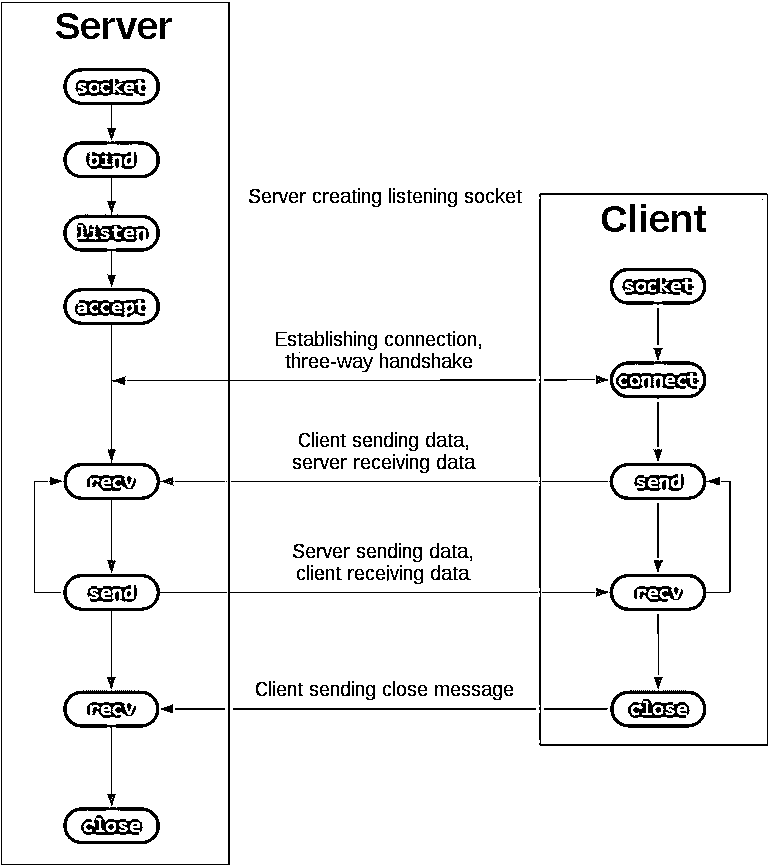
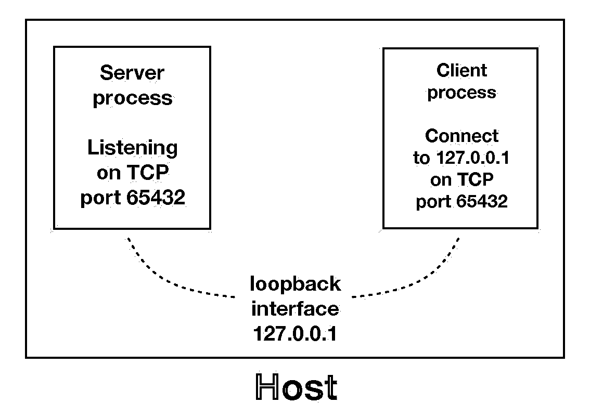
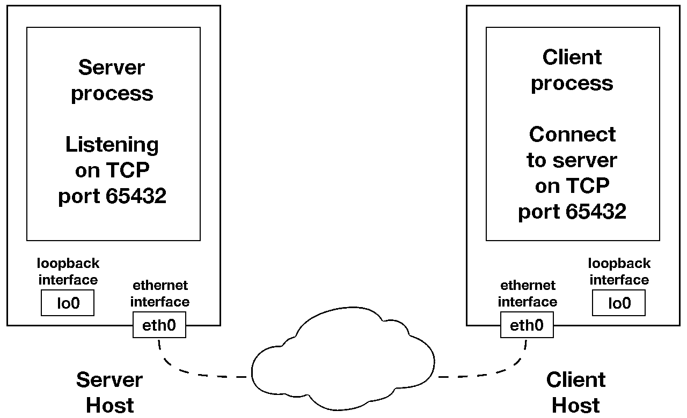
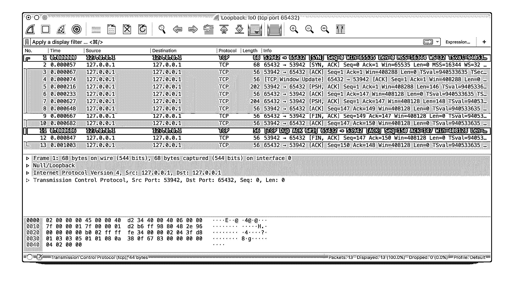

# Python 中的套接字编程(指南)

> 原文：<https://realpython.com/python-sockets/>

套接字和套接字 API 用于通过网络发送消息。它们提供了一种[进程间通信(IPC)](https://en.wikipedia.org/wiki/Inter-process_communication) 的形式。该网络可以是计算机的逻辑本地网络，也可以是物理连接到外部网络的网络，它自己连接到其他网络。一个明显的例子是互联网，你通过你的 ISP 连接到互联网。

**在本教程中，您将创建:**

*   一个简单的**套接字服务器和客户端**
*   同时处理多个连接的改进版本
*   一个服务器-客户端应用程序，其功能就像一个成熟的**套接字应用程序**，拥有自己的**自定义头和内容**

在本教程结束时，您将了解如何使用 Python 的[套接字模块](https://docs.python.org/3/library/socket.html)中的主要函数和方法来编写您自己的客户端-服务器应用程序。您将知道如何使用自定义类在端点之间发送消息和数据，您可以在自己的应用程序中构建和利用这些消息和数据。

本教程中的示例需要 Python 3.6 或更高版本，并且已经使用 Python 3.10 进行了测试。为了充分利用本教程，最好下载源代码，并在阅读时放在手边以供参考:

**获取源代码:** [点击此处获取源代码，您将在本教程的示例中使用](https://realpython.com/bonus/python-sockets-source-code/)。

网络和套接字是很大的主题。关于他们的文字已经写了很多。如果您是套接字或网络的新手，如果您对所有的术语和内容感到不知所措，这是完全正常的。

但是不要气馁。这个教程是给你的！和任何 Python 相关的东西一样，你可以一次学一点点。将这篇文章加入书签，当你准备好下一部分时再回来。

## 背景

插座有着悠久的历史。它们的使用[起源于 1971 年的 ARPANET](https://en.wikipedia.org/wiki/Network_socket#History) ，后来成为 1983 年发布的伯克利软件分发(BSD)操作系统中的 API，名为[伯克利套接字](https://en.wikipedia.org/wiki/Berkeley_sockets)。

当互联网随着万维网在 20 世纪 90 年代起飞时，网络编程也是如此。Web 服务器和浏览器并不是唯一利用新连接的网络和使用套接字的应用程序。各种类型和规模的客户机-服务器应用程序开始广泛使用。

今天，尽管 socket API 所使用的底层协议已经发展了多年，并且开发了新的协议，但是低级 API 仍然保持不变。

最常见的套接字应用程序类型是客户端-服务器应用程序，其中一方充当服务器并等待来自客户端的连接。这是您将在本教程中创建的应用程序类型。更具体地说，您将关注用于[互联网套接字](https://en.wikipedia.org/wiki/Berkeley_sockets)的套接字 API，有时称为 Berkeley 或 BSD 套接字。还有 [Unix 域套接字](https://en.wikipedia.org/wiki/Unix_domain_socket)，只能用于同一个主机上的进程之间的通信。

[*Remove ads*](/account/join/)

## 套接字 API 概述

Python 的[套接字模块](https://docs.python.org/3/library/socket.html)提供了与 [Berkeley 套接字 API](https://en.wikipedia.org/wiki/Berkeley_sockets) 的接口。这是您将在本教程中使用的模块。

该模块中的主要套接字 API 函数和方法是:

*   `socket()`
*   `.bind()`
*   `.listen()`
*   `.accept()`
*   `.connect()`
*   `.connect_ex()`
*   `.send()`
*   `.recv()`
*   `.close()`

Python 提供了一个方便且一致的 API，它直接映射到系统调用，即它们的 C 语言对应物。在下一节中，您将学习如何一起使用它们。

作为其标准库的一部分，Python 也有一些类，使得使用这些低级套接字函数更加容易。尽管本教程没有涉及到，但是您可以查看一下 [socketserver 模块](https://docs.python.org/3/library/socketserver.html)，这是一个网络服务器框架。还有许多模块可以实现更高级别的互联网协议，如 HTTP 和 SMTP。有关概述，请参见[互联网协议和支持](https://docs.python.org/3/library/internet.html)。

## TCP 套接字

您将使用`socket.socket()`创建一个套接字对象，将套接字类型指定为`socket.SOCK_STREAM`。当您这样做时，使用的默认协议是[传输控制协议(TCP)](https://en.wikipedia.org/wiki/Transmission_Control_Protocol) 。这是一个很好的默认设置，可能也是您想要的。

为什么应该使用 TCP？传输控制协议(TCP):

*   **可靠:**网络中丢弃的数据包由发送方检测并重新发送。
*   **有有序的数据传递:**应用程序按照发送方写入的顺序读取数据。

相比之下，用`socket.SOCK_DGRAM`创建的[用户数据报协议(UDP)](https://en.wikipedia.org/wiki/User_Datagram_Protocol) 套接字是不可靠的，接收方读取的数据可能与发送方写入的数据不一致。

为什么这很重要？网络是一个尽最大努力的传递系统。不能保证您的数据会到达目的地，也不能保证您会收到发送给您的内容。

网络设备(如路由器和交换机)的可用带宽有限，并且有其固有的系统限制。它们有 CPU、内存、总线和接口包缓冲区，就像你的客户机和服务器一样。TCP 让您不必担心数据包丢失、无序数据到达以及其他在网络通信时不可避免会出现的陷阱。

为了更好地理解这一点，请查看 TCP 的套接字 API 调用序列和数据流:

[](https://files.realpython.com/media/sockets-tcp-flow.1da426797e37.jpg)

<figcaption class="figure-caption text-center">TCP Socket Flow ([Image source](https://commons.wikimedia.org/wiki/File:InternetSocketBasicDiagram_zhtw.png))</figcaption>

左边的列代表服务器。右手边是客户端。

从左上角的列开始，注意服务器为设置“监听”套接字而进行的 API 调用:

*   `socket()`
*   `.bind()`
*   `.listen()`
*   `.accept()`

监听套接字顾名思义就是这样做的。它监听来自客户端的连接。当客户机连接时，服务器调用`.accept()`来接受或完成连接。

客户机调用`.connect()`来建立到服务器的连接，并启动三次握手。握手步骤很重要，因为它确保连接的每一端在网络中都是可到达的，换句话说，客户端可以到达服务器，反之亦然。可能只有一台主机、客户机或服务器可以到达另一台。

中间是往返部分，通过调用`.send()`和`.recv()`在客户机和服务器之间交换数据。

在底部，客户端和服务器关闭各自的套接字。

[*Remove ads*](/account/join/)

## 回显客户端和服务器

现在您已经对 socket API 以及客户机和服务器如何通信有了一个大致的了解，您已经准备好创建您的第一个客户机和服务器了。您将从一个简单的实现开始。服务器将简单地把它收到的任何信息回显给客户机。

### 回声服务器

这是服务器:

```py
# echo-server.py

import socket

HOST = "127.0.0.1"  # Standard loopback interface address (localhost)
PORT = 65432  # Port to listen on (non-privileged ports are > 1023)

with socket.socket(socket.AF_INET, socket.SOCK_STREAM) as s:
    s.bind((HOST, PORT))
    s.listen()
    conn, addr = s.accept()
    with conn:
        print(f"Connected by {addr}")
        while True:
            data = conn.recv(1024)
            if not data:
                break
            conn.sendall(data)
```

**注意:**现在不要担心理解上面的一切。这几行代码中有很多内容。这只是一个起点，因此您可以看到一个运行中的基本服务器。

在本教程的最后有一个[参考部分](#reference)，其中有更多的信息和其他资源的链接。在整个教程中，您还可以找到这些和其他有用的链接。

好的，那么 API 调用中到底发生了什么？

`socket.socket()`创建一个支持[上下文管理器类型](https://docs.python.org/3/reference/datamodel.html#context-managers)的 socket 对象，因此您可以在 [`with`语句](https://docs.python.org/3/reference/compound_stmts.html#with)中使用它。没必要给`s.close()`打电话:

```py
with socket.socket(socket.AF_INET, socket.SOCK_STREAM) as s:
    pass  # Use the socket object without calling s.close().
```

传递给 [`socket()`](https://docs.python.org/3/library/socket.html#socket.socket) 的参数是[常量](https://docs.python.org/3/library/socket.html#constants)，用于指定[地址族](#socket-address-families)和套接字类型。`AF_INET`是 [IPv4](https://en.wikipedia.org/wiki/IPv4) 的互联网地址族。`SOCK_STREAM`是 [TCP](#tcp-sockets) 的套接字类型，该协议将用于在网络中传输消息。

`.bind()`方法用于将套接字与特定的网络接口和端口号相关联:

```py
# echo-server.py

# ...

with socket.socket(socket.AF_INET, socket.SOCK_STREAM) as s:
 s.bind((HOST, PORT))    # ...
```

传递给`.bind()`的值取决于套接字的[地址族](#socket-address-families)。在本例中，您使用的是`socket.AF_INET` (IPv4)。因此它期望一个二元组:`(host, port)`。

`host`可以是主机名、 [IP 地址](https://realpython.com/python-ipaddress-module/)或空字符串。如果使用 IP 地址，`host`应该是 IPv4 格式的地址字符串。IP 地址`127.0.0.1`是[回送](https://en.wikipedia.org/wiki/Localhost)接口的标准 IPv4 地址，因此只有主机上的进程能够连接到服务器。如果传递空字符串，服务器将接受所有可用 IPv4 接口上的连接。

`port`表示接受来自客户端的连接的 [TCP 端口](https://en.wikipedia.org/wiki/Transmission_Control_Protocol#TCP_ports)号。应该是从`1`到`65535`的整数，因为`0`是保留的。如果端口号小于`1024`，一些系统可能需要超级用户权限。

这里有一个关于使用主机名和`.bind()`的注意事项:

> “如果在 IPv4/v6 套接字地址的主机部分使用主机名，程序可能会显示不确定的行为，因为 Python 使用从 DNS 解析返回的第一个地址。根据 DNS 解析和/或主机配置的结果，套接字地址将被不同地解析为实际的 IPv4/v6 地址。对于确定性行为，请在主机部分使用数字地址。[(来源)](https://docs.python.org/3/library/socket.html)

稍后你会在[使用主机名](#using-hostnames)中了解到更多。现在，只要理解当使用主机名时，根据名称解析过程返回的内容，您可能会看到不同的结果。这些结果可能是任何东西。第一次运行应用程序时，您可能会得到地址`10.1.2.3`。下一次，你得到一个不同的地址，`192.168.0.1`。第三次，你可以得到`172.16.7.8`，以此类推。

在服务器示例中，`.listen()`使服务器能够接受连接。它使服务器成为一个“监听”套接字:

```py
# echo-server.py

# ...

with socket.socket(socket.AF_INET, socket.SOCK_STREAM) as s:
    s.bind((HOST, PORT))
 s.listen() conn, addr = s.accept()    # ...
```

[`.listen()`](https://docs.python.org/3/library/socket.html#socket.socket.listen) 方法有一个`backlog`参数。它指定在拒绝新连接之前，系统允许的未接受连接数。从 Python 3.5 开始，它是可选的。如果未指定，则选择默认的`backlog`值。

如果您的服务器同时收到大量连接请求，增加`backlog`值可能会有所帮助，因为它设置了挂起连接的最大队列长度。最大值取决于系统。比如在 Linux 上，参见 [`/proc/sys/net/core/somaxconn`](https://serverfault.com/questions/518862/will-increasing-net-core-somaxconn-make-a-difference/519152) 。

[`.accept()`](https://docs.python.org/3/library/socket.html#socket.socket.accept) 方法[阻止](#blocking-calls)的执行，并等待传入的连接。当客户端连接时，它返回一个表示连接的新套接字对象和一个保存客户端地址的元组。元组将包含用于 IPv4 连接的`(host, port)`或用于 IPv6 的`(host, port, flowinfo, scopeid)`。有关元组值的详细信息，请参见参考部分的[套接字地址族](#socket-address-families)。

需要理解的一件事是，您现在有了一个来自`.accept()`的新 socket 对象。这很重要，因为它是您将用来与客户端通信的套接字。它不同于服务器用来接受新连接的监听套接字:

```py
# echo-server.py

# ...

with socket.socket(socket.AF_INET, socket.SOCK_STREAM) as s:
    s.bind((HOST, PORT))
    s.listen()
 conn, addr = s.accept() with conn: print(f"Connected by {addr}") while True: data = conn.recv(1024) if not data: break conn.sendall(data)
```

在`.accept()`提供客户端套接字对象`conn`后，无限 [`while`循环](https://realpython.com/python-while-loop/)用于循环[阻塞调用](#blocking-calls)到`conn.recv()`。它读取客户端发送的任何数据，并使用`conn.sendall()`将其回显。

如果`conn.recv()`返回一个空的 [`bytes`](https://docs.python.org/3/library/stdtypes.html#bytes-objects) 对象`b''`，则表示客户端关闭了连接，循环终止。 [`with`语句](https://realpython.com/python-with-statement/)与`conn`一起使用，自动关闭程序块末端的插座。

[*Remove ads*](/account/join/)

### 回显客户端

现在让我们来看看客户端:

```py
# echo-client.py

import socket

HOST = "127.0.0.1"  # The server's hostname or IP address
PORT = 65432  # The port used by the server

with socket.socket(socket.AF_INET, socket.SOCK_STREAM) as s:
    s.connect((HOST, PORT))
    s.sendall(b"Hello, world")
    data = s.recv(1024)

print(f"Received {data!r}")
```

与服务器相比，客户端非常简单。它创建一个套接字对象，使用 [`.connect()`](https://docs.python.org/3/library/socket.html#socket.socket.connect) 连接到服务器，并调用`s.sendall()`发送它的消息。最后，它调用`s.recv()`来读取服务器的回复，然后[打印它](https://realpython.com/python-print/)。

### 运行 Echo 客户端和服务器

在本节中，您将运行客户机和服务器，查看它们的行为并检查发生了什么。

**注意:**如果你在从命令行运行例子或你自己的代码时有困难，请阅读[我如何使用 Python 制作我自己的命令行命令？](https://dbader.org/blog/how-to-make-command-line-commands-with-python)或[如何运行你的 Python 脚本](https://realpython.com/run-python-scripts/)。如果你使用的是 Windows，请查看 [Python Windows FAQ](https://docs.python.org/3/faq/windows.html) 。

打开终端或命令提示符，导航到包含脚本的目录，确保路径上安装了 Python 3.6 或更高版本，然后运行服务器:

```py
$ python echo-server.py
```

您的终端将会挂起。这是因为服务器在`.accept()`被[阻止](#blocking-calls)，或者暂停:

```py
# echo-server.py

# ...

with socket.socket(socket.AF_INET, socket.SOCK_STREAM) as s:
    s.bind((HOST, PORT))
    s.listen()
 conn, addr = s.accept()    with conn:
        print(f"Connected by {addr}")
        while True:
            data = conn.recv(1024)
            if not data:
                break
            conn.sendall(data)
```

它正在等待客户端连接。现在，打开另一个终端窗口或命令提示符并运行客户端:

```py
$ python echo-client.py 
Received b'Hello, world'
```

在服务器窗口中，您应该会注意到如下内容:

```py
$ python echo-server.py 
Connected by ('127.0.0.1', 64623)
```

在上面的输出中，服务器打印了从`s.accept()`返回的`addr`元组。这是客户端的 IP 地址和 TCP 端口号。端口号`64623`，在您的机器上运行时很可能会有所不同。

### 查看插座状态

要查看主机上套接字的当前状态，请使用`netstat`。它在 macOS、Linux 和 Windows 上默认可用。

下面是启动服务器后 macOS 的 netstat 输出:

```py
$ netstat -an
Active Internet connections (including servers)
Proto Recv-Q Send-Q  Local Address          Foreign Address        (state)
tcp4       0      0  127.0.0.1.65432        *.*                    LISTEN
```

注意`Local Address`是`127.0.0.1.65432`。如果`echo-server.py`使用了`HOST = ""`而不是`HOST = "127.0.0.1"`，netstat 会显示:

```py
$ netstat -an
Active Internet connections (including servers)
Proto Recv-Q Send-Q  Local Address          Foreign Address        (state)
tcp4       0      0  *.65432                *.*                    LISTEN
```

`Local Address`是`*.65432`，这意味着所有支持该地址族的可用主机接口都将用于接受传入的连接。在这个例子中，在对`socket()`的调用中使用了`socket.AF_INET`(IP v4)。你可以在`Proto`一栏看到这个:`tcp4`。

上面的输出被裁剪成只显示 echo 服务器。您可能会看到更多的输出，这取决于您运行它的系统。需要注意的是列`Proto`、`Local Address`和`(state)`。在上面的最后一个示例中，netstat 显示 echo 服务器正在所有接口的端口 65432 上使用 IPv4 TCP 套接字(`tcp4`)，并且它处于监听状态(`LISTEN`)。

另一种方法是使用`lsof`(列出打开的文件)来访问它以及其他有用的信息。默认情况下，它在 macOS 上可用，如果尚未安装，可以使用您的软件包管理器安装在 Linux 上:

```py
$ lsof -i -n
COMMAND     PID   USER   FD   TYPE   DEVICE SIZE/OFF NODE NAME
Python    67982 nathan    3u  IPv4 0xecf272      0t0  TCP *:65432 (LISTEN)
```

当与`-i`选项一起使用时，`lsof`给出了开放互联网套接字的`COMMAND`、`PID`(进程 ID)和`USER`(用户 ID)。以上是 echo 服务器流程。

`netstat`和`lsof`有很多选项可用，并且根据运行它们的操作系统而有所不同。查看`man`页面或文档。他们绝对值得花一点时间去了解。你会得到回报的。在 macOS 和 Linux 上，使用`man netstat`和`man lsof`。对于 Windows，使用`netstat /?`。

当试图连接到没有监听套接字的端口时，您会遇到以下常见错误:

```py
$ python echo-client.py 
Traceback (most recent call last):
 File "./echo-client.py", line 9, in <module>
 s.connect((HOST, PORT))
ConnectionRefusedError: [Errno 61] Connection refused
```

指定的端口号不正确，或者服务器没有运行。或者可能是路径中有防火墙阻挡了连接，这很容易被忘记。您也可能会看到错误`Connection timed out`。添加允许客户端连接到 TCP 端口的防火墙规则！

在参考部分有一个常见[错误](#errors)的列表。

[*Remove ads*](/account/join/)

## 通信故障

现在，您将进一步了解客户端和服务器是如何相互通信的:

[](https://files.realpython.com/media/sockets-loopback-interface.44fa30c53c70.jpg)

使用[回环](https://en.wikipedia.org/wiki/Localhost)接口(IPv4 地址`127.0.0.1`或 IPv6 地址`::1`)时，数据永远不会离开主机或接触外部网络。在上图中，环回接口包含在主机内部。这代表了环回接口的内部性质，并表明通过该接口的连接和数据都位于主机本地。这就是为什么您还会听到环回接口和 IP 地址`127.0.0.1`或`::1`被称为“本地主机”

应用程序使用环回接口与主机上运行的其它进程进行通信，以实现安全性和与外部网络的隔离。因为它是内部的，只能从主机内部访问，所以不会暴露。

如果您有一个使用自己的私有数据库的应用服务器，就可以看到这一点。如果它不是其他服务器使用的数据库，它可能被配置为仅侦听环回接口上的连接。如果是这种情况，网络上的其他主机就无法连接到它。

当您在应用程序中使用除`127.0.0.1`或`::1`之外的 IP 地址时，它可能被绑定到一个连接到外部网络的[以太网](https://en.wikipedia.org/wiki/Ethernet)接口。这是您通往“本地主机”王国之外的其他主机的网关:

[](https://files.realpython.com/media/sockets-ethernet-interface.aac312541af5.jpg)

在外面要小心。这是一个肮脏、残酷的世界。在冒险离开“localhost”的安全范围之前，请务必阅读使用主机名一节有一个安全注意事项适用于即使你不使用主机名，但只使用 IP 地址。

## 处理多个连接

echo 服务器肯定有其局限性。最大的一个就是只服务一个客户，然后退出。echo 客户端也有这个限制，但是还有一个额外的问题。当客户端使用`s.recv()`时，可能只会从`b'Hello, world'`返回一个字节`b'H'`:

```py
# echo-client.py

# ...

with socket.socket(socket.AF_INET, socket.SOCK_STREAM) as s:
    s.connect((HOST, PORT))
    s.sendall(b"Hello, world")
 data = s.recv(1024) 
print(f"Received {data!r}")
```

上面使用的`1024`的`bufsize`自变量是一次要接收的*最大*数据量。并不意味着`.recv()`会返回`1024`字节。

`.send()`方法也是如此。它返回发送的字节数，这可能小于传入的数据的大小。您负责检查这个并根据需要多次调用`.send()`来发送所有数据:

> “应用程序负责检查所有数据是否都已发送；如果只传输了部分数据，应用程序需要尝试传递剩余的数据。[(来源)](https://docs.python.org/3/library/socket.html#socket.socket.send)

在上面的例子中，您通过使用`.sendall()`避免了这样做:

> 与 send()不同，此方法继续从字节发送数据，直到所有数据都已发送或出现错误。成功时返回。[(来源)](https://docs.python.org/3/library/socket.html#socket.socket.sendall)

在这一点上你有两个问题:

*   如何同时处理多个连接？
*   你需要调用`.send()`和`.recv()`直到所有的数据都被发送或接收。

你能做什么？有许多方法可以实现[并发](https://realpython.com/python-concurrency/)。一种流行的方法是使用[异步 I/O](https://docs.python.org/3/library/asyncio.html) 。`asyncio`在 Python 3.4 中被引入标准库。传统的选择是使用[线程](https://realpython.com/intro-to-python-threading/)。

并发的问题是很难做到正确。有许多微妙之处需要考虑和防范。所有需要做的就是让其中的一个显现出来，你的应用程序可能会突然以不那么微妙的方式失败。

这并不是要吓退你学习和使用并发编程。如果您的应用需要扩展，如果您想要使用多个处理器或一个内核，这是必要的。然而，对于本教程，您将使用比线程更传统、更容易推理的东西。你要用系统调用的祖师爷: [`.select()`](https://docs.python.org/3/library/selectors.html#selectors.BaseSelector.select) 。

`.select()`方法允许您在多个套接字上检查 I/O 完成情况。因此，您可以调用`.select()`来查看哪些插座的 I/O 已经准备好进行读写。但这是 Python，所以还有更多。您将使用标准库中的[选择器](https://docs.python.org/3/library/selectors.html)模块，以便使用最有效的实现，而不管您运行的是什么操作系统:

> “该模块支持基于选择模块原语的高级高效 I/O 多路复用。我们鼓励用户使用这个模块，除非他们希望对所使用的操作系统级原语进行精确控制。”[(来源)](https://docs.python.org/3/library/selectors.html)

然而，通过使用`.select()`，你不能同时运行。也就是说，根据您的工作量，这种方法可能仍然非常快。这取决于您的应用程序在处理请求时需要做什么，以及它需要支持的客户端数量。

[`asyncio`](https://docs.python.org/3/library/asyncio.html) 使用单线程协同多任务和一个事件循环来管理任务。使用`.select()`，您将编写自己版本的事件循环，尽管更加简单和同步。当使用多线程时，即使你有并发性，你现在也必须使用 [GIL](https://realpython.com/python-gil/) (全局解释器锁)和 [CPython 和 PyPy](https://wiki.python.org/moin/GlobalInterpreterLock) 。这有效地限制了您可以并行完成的工作量。

这就是说使用`.select()`可能是一个非常好的选择。不要觉得你必须使用`asyncio`、线程或者最新的异步库。通常，在网络应用程序中，您的应用程序无论如何都是受 I/O 限制的:它可能在本地网络上等待，等待网络另一端的端点，等待磁盘写入，等等。

如果您从启动 CPU 绑定工作的客户端收到请求，请查看 [concurrent.futures](https://docs.python.org/3/library/concurrent.futures.html) 模块。它包含类 [ProcessPoolExecutor](https://docs.python.org/3/library/concurrent.futures.html#processpoolexecutor) ，该类使用一个进程池来异步执行调用。

如果您使用多个进程，操作系统能够调度您的 Python 代码在多个处理器或内核上并行运行，而无需 GIL。有关想法和灵感，请参见 PyCon talk [约翰·里斯-用 AsyncIO 和多处理技术思考 GIL 之外的世界- PyCon 2018](https://www.youtube.com/watch?v=0kXaLh8Fz3k) 。

在下一节中，您将看到解决这些问题的服务器和客户机的例子。他们使用`.select()`来同时处理多个连接，并根据需要多次调用`.send()`和`.recv()`。

[*Remove ads*](/account/join/)

## 多连接客户端和服务器

在接下来的两节中，您将使用从[选择器](https://docs.python.org/3/library/selectors.html)模块创建的`selector`对象创建一个处理多个连接的服务器和客户机。

### 多连接服务器

首先，将注意力转向多连接服务器。第一部分设置监听套接字:

```py
# multiconn-server.py

import sys
import socket
import selectors import types

sel = selectors.DefaultSelector() 
# ...

host, port = sys.argv[1], int(sys.argv[2])
lsock = socket.socket(socket.AF_INET, socket.SOCK_STREAM) lsock.bind((host, port)) lsock.listen() print(f"Listening on {(host, port)}") lsock.setblocking(False) sel.register(lsock, selectors.EVENT_READ, data=None)
```

这个服务器和 echo 服务器最大的区别就是调用`lsock.setblocking(False)`来配置非阻塞模式的套接字。对这个插座的呼叫将不再被[阻塞](#blocking-calls)。当它与`sel.select()`一起使用时，正如您将在下面看到的，您可以等待一个或多个套接字上的事件，然后在准备就绪时读写数据。

`sel.register()`为您感兴趣的事件向`sel.select()`注册要监控的套接字。对于监听套接字，您需要读取事件:`selectors.EVENT_READ`。

为了在套接字中存储您想要的任意数据，您将使用`data`。在`.select()`返回的时候返回。您将使用`data`来跟踪套接字上发送和接收的内容。

接下来是事件循环:

```py
# multiconn-server.py

# ...

try:
 while True: events = sel.select(timeout=None) for key, mask in events: if key.data is None: accept_wrapper(key.fileobj) else: service_connection(key, mask) except KeyboardInterrupt:
    print("Caught keyboard interrupt, exiting")
finally:
    sel.close()
```

[`sel.select(timeout=None)`](https://docs.python.org/3/library/selectors.html#selectors.BaseSelector.select) [阻塞](#blocking-calls)，直到有套接字为 I/O 做好准备。它返回元组列表，每个套接字一个。每个元组包含一个`key`和一个`mask`。`key`是一个包含`fileobj`属性的[选择键](https://docs.python.org/3/library/selectors.html#selectors.SelectorKey) [`namedtuple`](https://realpython.com/python-namedtuple/) 。`key.fileobj`是 socket 对象，`mask`是就绪操作的事件[屏蔽](https://en.wikipedia.org/wiki/Mask_(computing))。

如果`key.data`是`None`，那么你知道它来自监听套接字，你需要接受连接。您将调用自己的`accept_wrapper()`函数来获取新的套接字对象，并向选择器注册它。你一会儿就会看到。

如果`key.data`不是`None`，那么您知道这是一个已经被接受的客户端套接字，您需要服务它。然后用`key`和`mask`作为参数调用`service_connection()`，这就是你在套接字上操作所需要的一切。

下面是您的`accept_wrapper()`函数的作用:

```py
# multiconn-server.py

# ...

def accept_wrapper(sock):
 conn, addr = sock.accept()  # Should be ready to read    print(f"Accepted connection from {addr}")
 conn.setblocking(False)    data = types.SimpleNamespace(addr=addr, inb=b"", outb=b"")
    events = selectors.EVENT_READ | selectors.EVENT_WRITE
    sel.register(conn, events, data=data)

# ...
```

因为监听套接字是为事件`selectors.EVENT_READ`注册的，所以它应该准备好读取。你调用`sock.accept()`然后调用`conn.setblocking(False)`将插座置于*非阻塞*模式。

记住，这是这个版本服务器的主要目标，因为你不希望它[阻塞](#blocking-calls)。如果它阻塞了，那么整个服务器将停止运行，直到它返回。这意味着即使服务器没有积极工作，其他套接字也会等待。这是您不希望您的服务器处于的可怕的“挂起”状态。

接下来，使用 [`SimpleNamespace`](https://docs.python.org/3/library/types.html#types.SimpleNamespace) 创建一个对象来保存希望包含在套接字中的数据。因为您想知道客户端连接何时准备好进行读写，所以这两个事件都用[按位 OR](https://realpython.com/python-bitwise-operators/#bitwise-or) 操作符来设置:

```py
# multiconn-server.py

# ...

def accept_wrapper(sock):
    conn, addr = sock.accept()  # Should be ready to read
    print(f"Accepted connection from {addr}")
    conn.setblocking(False)
    data = types.SimpleNamespace(addr=addr, inb=b"", outb=b"")
 events = selectors.EVENT_READ | selectors.EVENT_WRITE    sel.register(conn, events, data=data)

# ...
```

然后，`events`掩码、套接字和数据对象被传递给`sel.register()`。

现在看一下`service_connection()`，看看当客户端连接准备好时是如何处理的:

```py
# multiconn-server.py

# ...

def service_connection(key, mask):
    sock = key.fileobj
    data = key.data
    if mask & selectors.EVENT_READ:
        recv_data = sock.recv(1024)  # Should be ready to read
        if recv_data:
            data.outb += recv_data
        else:
            print(f"Closing connection to {data.addr}")
            sel.unregister(sock)
            sock.close()
    if mask & selectors.EVENT_WRITE:
        if data.outb:
            print(f"Echoing {data.outb!r} to {data.addr}")
            sent = sock.send(data.outb)  # Should be ready to write
            data.outb = data.outb[sent:]

# ...
```

这是简单多连接服务器的核心。`key`是从`.select()`返回的`namedtuple`，包含套接字对象(`fileobj`)和数据对象。`mask`包含已经准备好的事件。

如果套接字准备好读取，那么`mask & selectors.EVENT_READ`将评估为`True`，因此`sock.recv()`被调用。任何读取的数据都被附加到`data.outb`中，以便以后发送。

注意`else:`块，检查是否没有接收到数据:

```py
# multiconn-server.py

# ...

def service_connection(key, mask):
    sock = key.fileobj
    data = key.data
    if mask & selectors.EVENT_READ:
        recv_data = sock.recv(1024)  # Should be ready to read
 if recv_data: data.outb += recv_data else: print(f"Closing connection to {data.addr}") sel.unregister(sock) sock.close()    if mask & selectors.EVENT_WRITE:
        if data.outb:
            print(f"Echoing {data.outb!r} to {data.addr}")
            sent = sock.send(data.outb)  # Should be ready to write
            data.outb = data.outb[sent:]

# ...
```

如果没有收到数据，这意味着客户端已经关闭了它们的套接字，所以服务器也应该关闭。但是别忘了在关闭前调用`sel.unregister()`，这样就不再被`.select()`监控了。

当套接字准备好写入时，对于健康的套接字来说总是这样，存储在`data.outb`中的任何接收到的数据都使用`sock.send()`回显到客户端。然后，发送的字节将从发送缓冲区中删除:

```py
# multiconn-server.py

# ...

def service_connection(key, mask):

    # ...

    if mask & selectors.EVENT_WRITE:
        if data.outb:
            print(f"Echoing {data.outb!r} to {data.addr}")
            sent = sock.send(data.outb)  # Should be ready to write
 data.outb = data.outb[sent:] 
# ...
```

`.send()`方法返回发送的字节数。然后，这个数字可以与`.outb`缓冲器上的[片符号](https://realpython.com/python-strings/#string-slicing)一起使用，以丢弃发送的字节。

[*Remove ads*](/account/join/)

### 多连接客户端

现在来看看多连接客户端，`multiconn-client.py`。它与服务器非常相似，但是它不是监听连接，而是通过`start_connections()`启动连接:

```py
# multiconn-client.py

import sys
import socket
import selectors
import types

sel = selectors.DefaultSelector()
messages = [b"Message 1 from client.", b"Message 2 from client."]

def start_connections(host, port, num_conns):
    server_addr = (host, port)
    for i in range(0, num_conns):
        connid = i + 1
        print(f"Starting connection {connid} to {server_addr}")
        sock = socket.socket(socket.AF_INET, socket.SOCK_STREAM)
        sock.setblocking(False)
        sock.connect_ex(server_addr)
        events = selectors.EVENT_READ | selectors.EVENT_WRITE
        data = types.SimpleNamespace(
            connid=connid,
            msg_total=sum(len(m) for m in messages),
            recv_total=0,
            messages=messages.copy(),
            outb=b"",
        )
        sel.register(sock, events, data=data)

# ...
```

`num_conns`从命令行读取，是创建到服务器的连接数。就像服务器一样，每个套接字都设置为非阻塞模式。

您使用 [`.connect_ex()`](https://docs.python.org/3/library/socket.html#socket.socket.connect_ex) 而不是`.connect()`，因为`.connect()`会立即引发一个`BlockingIOError`异常。`.connect_ex()`方法最初返回一个错误*指示器*、`errno.EINPROGRESS`，而不是引发一个会干扰正在进行的连接的异常。一旦连接完成，套接字就准备好进行读写，并由`.select()`返回。

在设置好套接字后，使用`SimpleNamespace`创建您想要用套接字存储的数据。客户端发送给服务器的消息是使用`messages.copy()`复制的，因为每个连接都会调用`socket.send()`并修改列表。跟踪客户机需要发送、已经发送和已经接收的内容所需的一切，包括消息中的总字节数，都存储在对象`data`中。

检查从服务器的`service_connection()`对客户端版本所做的更改:

```py
 def service_connection(key, mask): sock = key.fileobj data = key.data if mask & selectors.EVENT_READ: recv_data = sock.recv(1024)  # Should be ready to read if recv_data: -            data.outb += recv_data +            print(f"Received {recv_data!r} from connection {data.connid}") +            data.recv_total += len(recv_data) -        else: -            print(f"Closing connection {data.connid}") +        if not recv_data or data.recv_total == data.msg_total: +            print(f"Closing connection {data.connid}") sel.unregister(sock) sock.close() if mask & selectors.EVENT_WRITE: +        if not data.outb and data.messages: +            data.outb = data.messages.pop(0) if data.outb: -            print(f"Echoing {data.outb!r} to {data.addr}") +            print(f"Sending {data.outb!r} to connection {data.connid}") sent = sock.send(data.outb)  # Should be ready to write data.outb = data.outb[sent:]
```

除了一个重要的区别之外，基本上是一样的。客户端跟踪它从服务器收到的字节数，以便它可以关闭自己的连接。当服务器检测到这种情况时，它也会关闭自己的连接。

注意，通过这样做，服务器依赖于表现良好的客户端:服务器期望客户端在完成发送消息后关闭其连接端。如果客户端没有关闭，服务器将保持连接打开。在一个实际的应用程序中，您可能希望在您的服务器中通过实现一个[超时](https://en.wikipedia.org/wiki/Timeout_%28computing%29)来防止客户端连接在一定时间后没有发送请求时累积。

### 运行多连接客户端和服务器

现在是时候运行`multiconn-server.py`和`multiconn-client.py`了。他们都使用[命令行参数](https://realpython.com/python-command-line-arguments/)。您可以不带参数运行它们来查看选项。

对于服务器，传递`host`和`port`号:

```py
$ python multiconn-server.py
Usage: multiconn-server.py <host> <port>
```

对于客户端，还要向服务器传递要创建的连接数，`num_connections`:

```py
$ python multiconn-client.py
Usage: multiconn-client.py <host> <port> <num_connections>
```

以下是监听端口 65432 上的环回接口时的服务器输出:

```py
$ python multiconn-server.py 127.0.0.1 65432
Listening on ('127.0.0.1', 65432)
Accepted connection from ('127.0.0.1', 61354)
Accepted connection from ('127.0.0.1', 61355)
Echoing b'Message 1 from client.Message 2 from client.' to ('127.0.0.1', 61354)
Echoing b'Message 1 from client.Message 2 from client.' to ('127.0.0.1', 61355)
Closing connection to ('127.0.0.1', 61354)
Closing connection to ('127.0.0.1', 61355)
```

下面是客户端创建到上面服务器的两个连接时的输出:

```py
$ python multiconn-client.py 127.0.0.1 65432 2
Starting connection 1 to ('127.0.0.1', 65432)
Starting connection 2 to ('127.0.0.1', 65432)
Sending b'Message 1 from client.' to connection 1
Sending b'Message 2 from client.' to connection 1
Sending b'Message 1 from client.' to connection 2
Sending b'Message 2 from client.' to connection 2
Received b'Message 1 from client.Message 2 from client.' from connection 1
Closing connection 1
Received b'Message 1 from client.Message 2 from client.' from connection 2
Closing connection 2
```

太好了！现在您已经运行了多连接客户机和服务器。在下一节中，您将进一步研究这个例子。

[*Remove ads*](/account/join/)

## 应用客户端和服务器

与开始时相比，多连接客户机和服务器的例子无疑是一个改进。然而，现在您可以再走一步，在最终实现中解决前面的`multiconn`示例的缺点:应用程序客户机和服务器。

您需要一个适当处理错误的客户机和服务器，以便其他连接不受影响。显然，如果没有捕获到异常，您的客户机或服务器不应该崩溃。这是到目前为止您不必担心的事情，因为为了简洁和清晰起见，示例有意省略了错误处理。

既然您已经熟悉了基本的 API、非阻塞套接字和`.select()`，那么您可以添加一些错误处理，并解决房间里的大象问题，这些示例已经对您隐藏在那边的大窗帘后面。还记得介绍中提到的自定义类吗？这就是你接下来要探索的。

首先，您将解决这些错误:

> 所有错误都会引发异常。可以引发无效参数类型和内存不足情况的正常异常；从 Python 3.3 开始，与套接字或地址语义相关的错误会引发`OSError`或它的一个子类。”[(来源)](https://docs.python.org/3/library/socket.html)

所以，你需要做的一件事就是抓住`OSError`。与错误相关的另一个重要考虑是**超时**。您会在文档的很多地方看到对它们的讨论。超时会发生，是一种所谓的正常错误。主机和路由器重新启动，交换机端口坏了，电缆坏了，电缆被拔掉了，你能想到的都有。您应该为这些和其他错误做好准备，在代码中处理它们。

房间里的大象呢？正如套接字类型`socket.SOCK_STREAM`所暗示的，当使用 TCP 时，您正在从连续的字节流中读取。这就像从磁盘上的文件中读取数据，但是你是从网络上读取字节。然而，与阅读文件不同，这里没有 [`f.seek()`](https://docs.python.org/3/tutorial/inputoutput.html#methods-of-file-objects) 。

换句话说，你不能重新定位套接字指针(如果有的话)，也不能移动数据。

当字节到达你的套接字时，会涉及到网络缓冲区。一旦你读了它们，它们需要被保存在某个地方，否则你就会把它们扔掉。再次调用`.recv()`读取套接字中可用的*下一个*字节流。

你将从插槽中读取数据。因此，您需要调用`.recv()`和*将数据保存在缓冲区*中，直到您读取了足够的字节，以获得对您的应用程序有意义的完整消息。

由您来定义并跟踪消息边界的位置。就 TCP 套接字而言，它只是向网络发送和从网络接收原始字节。它不知道这些原始字节是什么意思。

这就是为什么您需要定义一个[应用层](https://en.wikipedia.org/wiki/Application_layer)协议。什么是应用层协议？简单地说，您的应用程序将发送和接收消息。这些消息的格式是您的应用程序的协议。

换句话说，您为这些消息选择的长度和格式定义了应用程序的语义和行为。这与您在上一段中学到的关于从套接字读取字节的内容直接相关。当你用`.recv()`读取字节时，你需要跟上读取了多少字节，并找出*消息边界*在哪里。

你怎么能这样做？一种方法是总是发送固定长度的消息。如果它们总是一样大，那就简单了。当你将这个字节数读入缓冲区时，你就知道你得到了一条完整的消息。

然而，对于需要使用填充符来填充的小消息，使用固定长度的消息是低效的。此外，您仍然面临着如何处理不适合一条消息的数据的问题。

在本教程中，您将学习一种通用方法，这种方法被许多协议使用，包括 HTTP。您将为消息添加前缀**头**，它包括内容长度以及您需要的任何其他字段。这样做，你只需要跟上标题。阅读完邮件头后，您可以对其进行处理，以确定邮件内容的长度。有了内容长度，您就可以读取该字节数来使用它。

您将通过创建一个可以发送和接收包含文本或二进制数据的消息的自定义类来实现这一点。您可以为自己的应用程序改进和扩展这个类。最重要的是，你将能够看到一个如何做到这一点的例子。

在开始之前，您需要了解一些关于套接字和字节的知识。正如您之前了解到的，当通过套接字发送和接收数据时，您发送和接收的是*个原始字节*。

如果您接收数据，并希望在将其解释为多个字节(例如一个 4 字节的整数)的上下文中使用它，那么您需要考虑到它可能不是您的机器的 CPU 所固有的格式。另一端的客户机或服务器的 CPU 可能使用不同的字节顺序。如果是这种情况，那么您需要在使用它之前将其转换为您的主机的本机字节顺序。

这种字节顺序被称为 CPU 的[字节序](https://en.wikipedia.org/wiki/Endianness)。详见参考部分的[字节顺序](#byte-endianness)。您可以通过利用 [Unicode](https://realpython.com/python-encodings-guide/) 作为您的消息头并使用 UTF-8 编码来避免这个问题。由于 UTF-8 使用 8 位编码，因此不存在字节排序问题。

你可以在 Python 的[编码和 Unicode](https://docs.python.org/3/library/codecs.html#encodings-and-unicode) 文档中找到解释。请注意，这仅适用于文本标题。您将使用在消息头中定义的显式类型和编码来发送内容，即消息有效负载。这将允许你以任何格式传输你想要的任何数据(文本或二进制)。

使用`sys.byteorder`可以很容易地确定你的机器的字节顺序。例如，您可能会看到这样的内容:

```py
$ python -c 'import sys; print(repr(sys.byteorder))'
'little'
```

如果你在一个虚拟机上运行这个程序，这个虚拟机模拟了一个大端 CPU (PowerPC ),那么会发生这样的事情:

```py
$ python -c 'import sys; print(repr(sys.byteorder))'
'big'
```

在这个示例应用程序中，您的应用层协议将报头定义为采用 UTF-8 编码的 Unicode 文本。对于消息中的实际内容，即消息负载，如果需要，您仍然需要手动交换字节顺序。

这将取决于您的应用程序以及它是否需要处理来自具有不同字节序的机器的多字节二进制数据。您可以通过添加额外的头并使用它们传递参数来帮助您的客户端或服务器实现二进制支持，类似于 HTTP。

如果这还没有意义，不要担心。在下一节中，您将看到所有这些是如何工作和组合在一起的。

[*Remove ads*](/account/join/)

### 应用协议报头

现在，您将完全定义协议头。协议头是:

*   可变长度文本
*   编码为 UTF-8 的 Unicode
*   使用 [JSON](https://realpython.com/python-json/) 序列化的 Python 字典

协议报头字典中所需的报头或子报头如下:

| 名字 | 描述 |
| --- | --- |
| `byteorder` | 机器的字节顺序(使用`sys.byteorder`)。您的应用程序可能不需要这样做。 |
| `content-length` | 内容的长度，以字节为单位。 |
| `content-type` | 有效负载中的内容类型，例如，`text/json`或`binary/my-binary-type`。 |
| `content-encoding` | 内容使用的编码，例如，`utf-8`表示 Unicode 文本，`binary`表示二进制数据。 |

这些头通知接收者消息有效载荷中的内容。这允许您发送任意数据，同时提供足够的信息，以便接收方能够正确解码和解释内容。因为头在字典中，所以可以根据需要通过插入键值对来添加额外的头。

### 发送应用消息

还有一点问题。你有一个变长的头，很好看也很灵活，但是用`.recv()`读的时候怎么知道头的长度呢？

当您之前学习使用`.recv()`和消息边界时，您还学习了固定长度的头可能是低效的。确实如此，但是您将使用一个小的 2 字节固定长度的头作为包含其长度的 JSON 头的前缀。

您可以将此视为发送消息的混合方法。实际上，您通过首先发送消息头的长度来引导消息接收过程。这使得你的接收者很容易解构信息。

为了让您更好地了解邮件格式，请完整查看邮件:

[](https://files.realpython.com/media/sockets-app-message.2e131b0751e3.jpg)

消息以两个字节的固定长度报头开始，这是网络字节顺序中的一个整数。这是下一个头的长度，可变长度的 JSON 头。一旦你用`.recv()`读取了两个字节，那么你知道你可以把这两个字节作为一个整数来处理，然后在解码 UTF-8 JSON 头之前读取这个字节数。

JSON 头包含一个附加头的字典。其中一个是`content-length`，它是消息内容的字节数(不包括 JSON 头)。一旦你调用了`.recv()`并读取了`content-length`字节，那么你就到达了一个消息边界，这意味着你已经读取了一条完整的消息。

### 应用程序消息类别

最后，回报！在本节中，您将学习`Message`类，并了解当读写事件在套接字上发生时，它是如何与`.select()`一起使用的。

这个示例应用程序反映了客户机和服务器可以合理使用的消息类型。在这一点上，你远远超出了玩具回声客户端和服务器！

为了保持简单，并演示在实际应用程序中如何工作，这个例子使用了一个实现基本搜索特性的应用程序协议。客户端发送一个搜索请求，服务器查找匹配项。如果客户端发送的请求没有被识别为搜索，服务器会认为这是一个二进制请求，并返回一个二进制响应。

在阅读了以下部分、运行了示例并对代码进行了实验之后，您将会看到事情是如何工作的。然后，您可以使用`Message`类作为起点，并修改它供您自己使用。

这个应用程序离`multiconn`客户机和服务器的例子并不远。事件循环代码在`app-client.py`和`app-server.py`中保持不变。您要做的是将消息代码移动到一个名为`Message`的类中，并添加方法来支持头部和内容的读取、写入和处理。这是使用[类](https://realpython.com/python3-object-oriented-programming/)的一个很好的例子。

正如您之前所学的，您将在下面看到，使用套接字涉及到保持状态。通过使用类，您可以将所有的状态、数据和代码捆绑在一个有组织的单元中。当启动或接受连接时，会为客户端和服务器中的每个套接字创建一个类的实例。

对于包装器和实用程序方法，客户端和服务器端的类基本相同。它们以下划线开头，比如`Message._json_encode()`。这些方法简化了类的使用。他们通过允许其他方法保持更短的时间和支持[干](https://en.wikipedia.org/wiki/Don%27t_repeat_yourself)原则来帮助其他方法。

服务器的`Message`类的工作方式与客户端的基本相同，反之亦然。不同之处在于，客户端启动连接并发送请求消息，然后处理服务器的响应消息。相反，服务器等待连接，处理客户端的请求消息，然后发送响应消息。

看起来是这样的:

| 步骤 | 端点 | 操作/消息内容 |
| --- | --- | --- |
| one | 客户 | 发送包含请求内容的`Message` |
| Two | 计算机网络服务器 | 接收并处理客户请求`Message` |
| three | 计算机网络服务器 | 发送包含响应内容的`Message` |
| four | 客户 | 接收并处理服务器响应`Message` |

下面是文件和代码布局:

| 应用 | 文件 | 密码 |
| --- | --- | --- |
| 计算机网络服务器 | `app-server.py` | 服务器的主脚本 |
| 计算机网络服务器 | `libserver.py` | 服务器的`Message`类 |
| 客户 | `app-client.py` | 客户端的主脚本 |
| 客户 | `libclient.py` | 客户端的`Message`类 |

#### 消息入口点

理解`Message`类是如何工作的可能是一个挑战，因为它的设计中有一个方面可能不是很明显。为什么？管理状态。

在创建了一个`Message`对象之后，它与一个套接字相关联，该套接字使用`selector.register()`来监控事件:

```py
# app-server.py

# ...

def accept_wrapper(sock):
    conn, addr = sock.accept()  # Should be ready to read
    print(f"Accepted connection from {addr}")
    conn.setblocking(False)
 message = libserver.Message(sel, conn, addr) sel.register(conn, selectors.EVENT_READ, data=message) 
# ...
```

**注意:**本节中的一些代码示例来自服务器的主脚本和`Message`类，但是本节和讨论同样适用于客户端。当客户端版本不同时，您会收到警告。

当套接字上的事件准备好时，它们由`selector.select()`返回。然后，您可以使用`key`对象上的`data`属性获取对消息对象的引用，并调用`Message`中的方法:

```py
# app-server.py

# ...

try:
 while True: events = sel.select(timeout=None) for key, mask in events:            if key.data is None:
                accept_wrapper(key.fileobj)
            else:
 message = key.data                try:
 message.process_events(mask)                # ...

# ...
```

看看上面的事件循环，你会看到`sel.select()`在驾驶座上。它正在阻塞，在循环的顶端等待事件。它负责在套接字上准备好处理读写事件时唤醒。这意味着，间接地，它也负责调用方法`.process_events()`。这就是为什么`.process_events()`是切入点。

下面是`.process_events()`方法的作用:

```py
# libserver.py

# ...

class Message:
    def __init__(self, selector, sock, addr):
        # ...

    # ...

    def process_events(self, mask):
        if mask & selectors.EVENT_READ:
            self.read()
        if mask & selectors.EVENT_WRITE:
            self.write()

    # ...
```

那就好:`.process_events()`简单。它只能做两件事:调用`.read()`和`.write()`。

这就是管理状态的由来。如果另一个方法依赖于具有特定值的状态变量，那么它们将只从`.read()`和`.write()`被调用。这使得事件进入套接字进行处理时，逻辑尽可能简单。

您可能想混合使用一些方法来检查当前状态变量，并根据它们的值调用其他方法来处理`.read()`或`.write()`之外的数据。最终，这可能会被证明过于复杂，难以管理和跟上。

您应该明确地修改该类以适应您自己的需要，以便它最适合您，但是如果您保持状态检查和对依赖于该状态的方法的调用(如果可能的话)到`.read()`和`.write()`方法，您可能会得到最好的结果。

现在看`.read()`。这是服务器的版本，但是客户端的版本是一样的。它只是使用了不同的方法名，`.process_response()`而不是`.process_request()`:

```py
# libserver.py

# ...

class Message:

    # ...

    def read(self):
        self._read()

        if self._jsonheader_len is None:
            self.process_protoheader()

        if self._jsonheader_len is not None:
            if self.jsonheader is None:
                self.process_jsonheader()

        if self.jsonheader:
            if self.request is None:
                self.process_request()

    # ...
```

首先调用`._read()`方法。它调用`socket.recv()`从套接字读取数据，并将其存储在接收缓冲区中。

记住，当调用`socket.recv()`时，组成完整消息的所有数据可能还没有到达。`socket.recv()`可能需要再次调用。这就是为什么在调用处理消息的适当方法之前，要对消息的每个部分进行状态检查。

在方法处理它的消息部分之前，它首先检查以确保足够的字节已经被读入接收缓冲区。如果有，它会处理各自的字节，从缓冲区中删除它们，并将其输出写入下一个处理阶段使用的变量。因为消息有三个组成部分，所以有三个状态检查和`process`方法调用:

| 消息组件 | 方法 | 输出 |
| --- | --- | --- |
| 固定长度标题 | `process_protoheader()` | `self._jsonheader_len` |
| JSON 标题 | `process_jsonheader()` | `self.jsonheader` |
| 内容 | `process_request()` | `self.request` |

接下来，来看看`.write()`。这是服务器的版本:

```py
# libserver.py

# ...

class Message:

    # ...

    def write(self):
        if self.request:
            if not self.response_created:
                self.create_response()

        self._write()

    # ...
```

`.write()`方法首先检查一个`request`。如果一个已经存在，但还没有创建响应，则调用`.create_response()`。`.create_response()`方法设置状态变量`response_created`并将响应写入发送缓冲区。

如果发送缓冲区中有数据,`._write()`方法调用`socket.send()`。

记住，当调用`socket.send()`时，发送缓冲区中的所有数据可能还没有排队等待传输。套接字的网络缓冲区可能已满，可能需要再次调用`socket.send()`。这就是为什么有国家检查。`.create_response()`方法应该只被调用一次，但是预计`._write()`需要被调用多次。

`.write()`的客户端版本类似:

```py
# libclient.py

# ...

class Message:
    def __init__(self, selector, sock, addr, request):
        # ...

    def write(self):
        if not self._request_queued:
            self.queue_request()

        self._write()

        if self._request_queued:
            if not self._send_buffer:
                # Set selector to listen for read events, we're done writing.
                self._set_selector_events_mask("r")

    # ...
```

因为客户端发起到服务器的连接并首先发送请求，所以检查状态变量`_request_queued`。如果一个请求没有被排队，它调用`.queue_request()`。`queue_request()`方法创建请求并将其写入发送缓冲区。它还设置了状态变量`_request_queued`,这样它只被调用一次。

就像服务器一样，如果发送缓冲区中有数据，`._write()`就会调用`socket.send()`。

客户端版本`.write()`的显著区别是最后一次检查请求是否已经排队。这将在[客户端主脚本](#client-main-script)一节中详细解释，但是这样做的原因是告诉`selector.select()`停止监视套接字的写事件。如果请求已经排队，并且发送缓冲区是空的，那么您就完成了写操作，并且您只对读事件感兴趣。没有理由被通知套接字是可写的。

总结这一节，考虑这样一个想法:这一节的主要目的是解释`selector.select()`通过方法`.process_events()`调用`Message`类，并描述状态是如何被管理的。

这很重要，因为在连接的生命周期中会多次调用`.process_events()`。因此，请确保任何只应调用一次的方法要么自己检查状态变量，要么由方法设置的状态变量由调用方检查。

#### 服务器主脚本

在服务器的主脚本`app-server.py`中，从命令行读取参数，这些参数指定要监听的接口和端口:

```py
$ python app-server.py
Usage: app-server.py <host> <port>
```

例如，要监听端口`65432`上的环回接口，请输入:

```py
$ python app-server.py 127.0.0.1 65432
Listening on ('127.0.0.1', 65432)
```

使用空字符串`<host>`监听所有接口。

在创建套接字之后，使用选项`socket.SO_REUSEADDR`调用`socket.setsockopt()`:

```py
# app-server.py

# ...

host, port = sys.argv[1], int(sys.argv[2])
lsock = socket.socket(socket.AF_INET, socket.SOCK_STREAM)
# Avoid bind() exception: OSError: [Errno 48] Address already in use lsock.setsockopt(socket.SOL_SOCKET, socket.SO_REUSEADDR, 1) lsock.bind((host, port))
lsock.listen()
print(f"Listening on {(host, port)}")
lsock.setblocking(False)
sel.register(lsock, selectors.EVENT_READ, data=None)

# ...
```

设置该插座选项可避免错误`Address already in use`。当在连接处于 [TIME_WAIT](http://www.serverframework.com/asynchronousevents/2011/01/time-wait-and-its-design-implications-for-protocols-and-scalable-servers.html) 状态的端口上启动服务器时，您会看到这种情况。

例如，如果服务器主动关闭了一个连接，它将保持在`TIME_WAIT`状态两分钟或更长时间，这取决于操作系统。如果您试图在`TIME_WAIT`状态到期之前再次启动服务器，那么您将得到一个`Address already in use`的`OSError`异常。这是一种安全措施，确保网络中任何延迟的数据包都不会被发送到错误的应用程序。

事件循环捕捉任何错误，以便服务器可以保持运行并继续运行:

```py
# app-server.py

# ...

try:
 while True: events = sel.select(timeout=None) for key, mask in events: if key.data is None: accept_wrapper(key.fileobj) else: message = key.data try: message.process_events(mask) except Exception: print( f"Main: Error: Exception for {message.addr}:\n" f"{traceback.format_exc()}" ) message.close() except KeyboardInterrupt:
    print("Caught keyboard interrupt, exiting")
finally:
    sel.close()
```

当一个客户端连接被接受时，一个`Message`对象被创建:

```py
# app-server.py

# ...

def accept_wrapper(sock):
    conn, addr = sock.accept()  # Should be ready to read
    print(f"Accepted connection from {addr}")
    conn.setblocking(False)
 message = libserver.Message(sel, conn, addr)    sel.register(conn, selectors.EVENT_READ, data=message)

# ...
```

`Message`对象与对`sel.register()`的调用中的套接字相关联，并且最初被设置为仅监视读取事件。一旦请求被读取，您将修改它只监听写事件。

在服务器中采用这种方法的一个优点是，在大多数情况下，当套接字是健康的并且没有网络问题时，它将总是可写的。

如果您告诉`sel.register()`也监视`EVENT_WRITE`，那么事件循环将立即唤醒并通知您这是一种情况。然而，在这一点上，没有理由醒来并调用插座上的`.send()`。没有要发送的响应，因为请求尚未处理。这将消耗和浪费宝贵的 CPU 周期。

#### 服务器消息类别

在[消息入口点](#message-entry-point)一节中，您了解了当套接字事件通过`.process_events()`准备好时`Message`对象是如何被调用的。现在，您将了解在套接字上读取数据以及消息的一部分准备好由服务器处理时会发生什么。

服务器的消息类在`libserver.py`里，是你之前下载的源代码的一部分。您也可以通过单击下面的链接下载代码:

**获取源代码:** [点击此处获取源代码，您将在本教程的示例中使用](https://realpython.com/bonus/python-sockets-source-code/)。

这些方法按照处理消息的顺序出现在类中。

当服务器已经读取了至少两个字节时，可以处理固定长度的报头:

```py
# libserver.py

# ...

class Message:
    def __init__(self, selector, sock, addr):
        # ...

    # ...

    def process_protoheader(self):
        hdrlen = 2
        if len(self._recv_buffer) >= hdrlen:
            self._jsonheader_len = struct.unpack(
                ">H", self._recv_buffer[:hdrlen]
            )[0]
            self._recv_buffer = self._recv_buffer[hdrlen:]

    # ...
```

固定长度的报头是网络中的 2 字节整数，或大端字节顺序。它包含 JSON 头的长度。您将使用 [struct.unpack()](https://docs.python.org/3/library/struct.html) 来读取值，对其进行解码，并将其存储在`self._jsonheader_len`中。在处理完它所负责的消息片段后，`.process_protoheader()`将其从接收缓冲区中删除。

就像固定长度的头一样，当接收缓冲区中有足够的数据来包含 JSON 头时，也可以对它进行处理:

```py
# libserver.py

# ...

class Message:

    # ...

    def process_jsonheader(self):
        hdrlen = self._jsonheader_len
        if len(self._recv_buffer) >= hdrlen:
            self.jsonheader = self._json_decode(
                self._recv_buffer[:hdrlen], "utf-8"
            )
            self._recv_buffer = self._recv_buffer[hdrlen:]
            for reqhdr in (
                "byteorder",
                "content-length",
                "content-type",
                "content-encoding",
            ):
                if reqhdr not in self.jsonheader:
                    raise ValueError(f"Missing required header '{reqhdr}'.")

    # ...
```

调用方法`self._json_decode()`将 JSON 头解码并反序列化到字典中。因为 JSON 头被定义为采用 UTF-8 编码的 Unicode，所以在调用中对`utf-8`进行了硬编码。结果被保存到`self.jsonheader`。在处理完它所负责的消息片段后，`process_jsonheader()`将其从接收缓冲区中删除。

接下来是消息的实际内容或有效载荷。由`self.jsonheader`中的 JSON 头描述。当`content-length`字节在接收缓冲器中可用时，可以处理请求:

```py
# libserver.py

# ...

class Message:

    # ...

    def process_request(self):
        content_len = self.jsonheader["content-length"]
        if not len(self._recv_buffer) >= content_len:
            return
        data = self._recv_buffer[:content_len]
        self._recv_buffer = self._recv_buffer[content_len:]
        if self.jsonheader["content-type"] == "text/json":
            encoding = self.jsonheader["content-encoding"]
            self.request = self._json_decode(data, encoding)
            print(f"Received request {self.request!r} from {self.addr}")
        else:
            # Binary or unknown content-type
            self.request = data
            print(
                f"Received {self.jsonheader['content-type']} "
                f"request from {self.addr}"
            )
        # Set selector to listen for write events, we're done reading.
        self._set_selector_events_mask("w")

    # ...
```

将消息内容保存到`data`变量后，`.process_request()`将其从接收缓冲区中删除。然后，如果内容类型是 JSON，`.process_request()`对其进行解码和反序列化。如果不是，这个示例应用程序假设它是一个二进制请求，并简单地打印内容类型。

`.process_request()`做的最后一件事是修改选择器，只监控写事件。在服务器的主脚本`app-server.py`中，套接字最初被设置为仅监视读取事件。现在这个请求已经被完全处理了，你不再对阅读感兴趣了。

现在可以创建响应并将其写入套接字。当套接字可写时，从`.write()`调用`.create_response()`:

```py
# libserver.py

# ...

class Message:

    # ...

    def create_response(self):
        if self.jsonheader["content-type"] == "text/json":
            response = self._create_response_json_content()
        else:
            # Binary or unknown content-type
            response = self._create_response_binary_content()
        message = self._create_message(**response)
        self.response_created = True
        self._send_buffer += message
```

根据内容类型，通过调用其他方法来创建响应。在这个示例应用程序中，当`action == 'search'`时，对 JSON 请求进行简单的字典查找。对于您自己的应用程序，您可以定义在这里调用的其他方法。

在创建响应消息之后，状态变量`self.response_created`被设置，使得`.write()`不再调用`.create_response()`。最后，响应被附加到发送缓冲区。这被`._write()`看到并通过`._write()`发送。

需要解决的一个棘手问题是如何在响应写完后关闭连接。您可以在方法`._write()`中调用`.close()`:

```py
# libserver.py

# ...

class Message:

    # ...

    def _write(self):
        if self._send_buffer:
            print(f"Sending {self._send_buffer!r} to {self.addr}")
            try:
                # Should be ready to write
                sent = self.sock.send(self._send_buffer)
            except BlockingIOError:
                # Resource temporarily unavailable (errno EWOULDBLOCK)
                pass
            else:
                self._send_buffer = self._send_buffer[sent:]
                # Close when the buffer is drained. The response has been sent.
                if sent and not self._send_buffer:
                    self.close()

 # ...
```

尽管它有些隐蔽，但考虑到`Message`类只处理每个连接的一条消息，这是一个可以接受的折衷。写完响应后，服务器就没什么可做的了。它已经完成了它的工作。

#### 客户端主脚本

在客户端的主脚本`app-client.py`中，从命令行读取参数，并用于创建请求和启动与服务器的连接:

```py
$ python app-client.py
Usage: app-client.py <host> <port> <action> <value>
```

这里有一个例子:

```py
$ python app-client.py 127.0.0.1 65432 search needle
```

在从命令行参数创建了表示请求的字典之后，主机、端口和请求字典被传递给`.start_connection()`:

```py
# app-client.py

# ...

def start_connection(host, port, request):
    addr = (host, port)
    print(f"Starting connection to {addr}")
    sock = socket.socket(socket.AF_INET, socket.SOCK_STREAM)
    sock.setblocking(False)
    sock.connect_ex(addr)
    events = selectors.EVENT_READ | selectors.EVENT_WRITE
    message = libclient.Message(sel, sock, addr, request)
    sel.register(sock, events, data=message)

# ...
```

为服务器连接创建一个套接字，并使用`request`字典创建一个`Message`对象。

与服务器一样，`Message`对象与调用`sel.register()`中的套接字相关联。但是，对于客户端，套接字最初被设置为针对读取和写入事件进行监控。一旦请求被写入，您将修改它只监听读事件。

这种方法为您提供了与服务器相同的优势:不浪费 CPU 周期。请求发出后，您不再对写事件感兴趣，所以没有理由唤醒并处理它们。

#### 客户端消息类别

在[消息入口点](#message-entry-point)一节中，您了解了当套接字事件通过`.process_events()`准备好时如何调用消息对象。现在，您将了解在套接字上读写数据以及客户端准备好处理消息之后会发生什么。

客户端的消息类在`libclient.py`里，是你之前下载的源代码的一部分。您也可以通过单击下面的链接下载代码:

**获取源代码:** [点击此处获取源代码，您将在本教程的示例中使用](https://realpython.com/bonus/python-sockets-source-code/)。

这些方法按照处理消息的顺序出现在类中。

客户端的第一个任务是对请求进行排队:

```py
# libclient.py

# ...

class Message:

    # ...

    def queue_request(self):
        content = self.request["content"]
        content_type = self.request["type"]
        content_encoding = self.request["encoding"]
        if content_type == "text/json":
            req = {
                "content_bytes": self._json_encode(content, content_encoding),
                "content_type": content_type,
                "content_encoding": content_encoding,
            }
        else:
            req = {
                "content_bytes": content,
                "content_type": content_type,
                "content_encoding": content_encoding,
            }
        message = self._create_message(**req)
        self._send_buffer += message
        self._request_queued = True

    # ...
```

根据命令行传递的内容，用于创建请求的字典位于客户端的主脚本`app-client.py`中。当创建一个`Message`对象时，请求字典作为一个参数传递给该类。

请求消息被创建并附加到发送缓冲区，然后被发现并通过`._write()`发送。状态变量`self._request_queued`被设置，使得`.queue_request()`不再被调用。

发送请求后，客户端等待服务器的响应。

客户端读取和处理消息的方法与服务器端相同。当从套接字读取响应数据时，`process`头方法被调用:`.process_protoheader()`和`.process_jsonheader()`。

不同之处在于最后的`process`方法的命名，以及它们处理响应而不是创建响应的事实:`.process_response()`、`._process_response_json_content()`和`._process_response_binary_content()`。

最后，但肯定不是最不重要的，是最后一次召集`.process_response()`:

```py
# libclient.py

# ...

class Message:

    # ...

    def process_response(self):

        # ...

        # Close when response has been processed
        self.close()

 # ...
```

#### 消息类摘要

为了总结您对`Message`类的学习，有必要提及一些关于一些支持方法的重要注意事项。

该类引发的任何异常都由事件循环中的主脚本在`except`子句中捕获:

```py
# app-client.py

# ...

try:
    while True:
        events = sel.select(timeout=1)
        for key, mask in events:
            message = key.data
 try: message.process_events(mask) except Exception: print( f"Main: Error: Exception for {message.addr}:\n" f"{traceback.format_exc()}" ) message.close()        # Check for a socket being monitored to continue.
        if not sel.get_map():
            break
except KeyboardInterrupt:
    print("Caught keyboard interrupt, exiting")
finally:
    sel.close()
```

注意台词:`message.close()`。

这是一条非常重要的线，原因不止一个！它不仅确保套接字是关闭的，而且`message.close()`还将套接字从`.select()`的监控中移除。这极大地简化了类中的代码并降低了复杂性。如果有异常或者你自己明确提出了一个，你知道`.close()`会负责清理。

方法`Message._read()`和`Message._write()`也包含一些有趣的东西:

```py
# libclient.py

# ...

class Message:

    # ...

    def _read(self):
        try:
            # Should be ready to read
            data = self.sock.recv(4096)
        except BlockingIOError:
            # Resource temporarily unavailable (errno EWOULDBLOCK)
 pass        else:
            if data:
                self._recv_buffer += data
            else:
                raise RuntimeError("Peer closed.")

    # ...
```

注意`except BlockingIOError:`行。

`._write()`方法也有一个。这些行很重要，因为它们捕捉到一个临时错误，并使用`pass`跳过它。暂时的错误是当套接字[阻塞](#blocking-calls)时，例如，如果它正在等待网络或连接的另一端，也称为它的对等方。

通过用`pass`捕捉并跳过异常，`.select()`将最终触发一个新的调用，您将获得另一个读取或写入数据的机会。

[*Remove ads*](/account/join/)

### 运行应用客户端和服务器

在所有这些艰苦的工作之后，是时候找点乐子，进行一些搜索了！

在这些例子中，您将运行服务器，以便它通过为参数`host`传递一个空字符串来监听所有接口。这将允许您运行客户端并从另一个网络上的虚拟机进行连接。它模拟大端 PowerPC 机器。

首先，启动服务器:

```py
$ python app-server.py '' 65432
Listening on ('', 65432)
```

现在运行客户端并输入一个搜索。看看你能否找到他:

```
$ python app-client.py 10.0.1.1 65432 search morpheus
Starting connection to ('10.0.1.1', 65432)
Sending b'\x00d{"byteorder": "big", "content-type": "text/json", "content-encoding": "utf-8", "content-length": 41}{"action": "search", "value": "morpheus"}' to ('10.0.1.1', 65432)
Received response {'result': 'Follow the white rabbit. 🐰'} from ('10.0.1.1', 65432)
Got result: Follow the white rabbit. 🐰
Closing connection to ('10.0.1.1', 65432)
```py

您可能会注意到终端正在运行一个使用 Unicode (UTF-8)文本编码的 shell，所以上面的输出用表情符号打印得很好。

现在看看你是否能找到小狗:

```
$ python app-client.py 10.0.1.1 65432 search 🐶
Starting connection to ('10.0.1.1', 65432)
Sending b'\x00d{"byteorder": "big", "content-type": "text/json", "content-encoding": "utf-8", "content-length": 37}{"action": "search", "value": "\xf0\x9f\x90\xb6"}' to ('10.0.1.1', 65432)
Received response {'result': '🐾 Playing ball! 🏐'} from ('10.0.1.1', 65432)
Got result: 🐾 Playing ball! 🏐
Closing connection to ('10.0.1.1', 65432)
```py

注意在`sending`行中通过网络为请求发送的字节串。如果你寻找用十六进制打印的代表小狗表情符号的字节:`\xf0\x9f\x90\xb6`，就更容易看出来。如果你的终端使用的是编码为 UTF-8 的 Unicode，你可以通过[输入表情符号](https://support.apple.com/en-us/HT201586)进行搜索。

这表明您正在通过网络发送原始字节，它们需要由接收方解码才能正确解释。这就是为什么您不辞辛苦地创建一个包含内容类型和编码的头。

以下是上述两个客户端连接的服务器输出:

```
Accepted connection from ('10.0.2.2', 55340)
Received request {'action': 'search', 'value': 'morpheus'} from ('10.0.2.2', 55340)
Sending b'\x00g{"byteorder": "little", "content-type": "text/json", "content-encoding": "utf-8", "content-length": 43}{"result": "Follow the white rabbit. \xf0\x9f\x90\xb0"}' to ('10.0.2.2', 55340)
Closing connection to ('10.0.2.2', 55340)

Accepted connection from ('10.0.2.2', 55338)
Received request {'action': 'search', 'value': '🐶'} from ('10.0.2.2', 55338)
Sending b'\x00g{"byteorder": "little", "content-type": "text/json", "content-encoding": "utf-8", "content-length": 37}{"result": "\xf0\x9f\x90\xbe Playing ball! \xf0\x9f\x8f\x90"}' to ('10.0.2.2', 55338)
Closing connection to ('10.0.2.2', 55338)
```py

查看`sending`行，了解写入客户端套接字的字节。这是服务器的响应消息。

如果`action`参数是除了`search`之外的任何参数，您也可以测试向服务器发送二进制请求:

```
$ python app-client.py 10.0.1.1 65432 binary 😃
Starting connection to ('10.0.1.1', 65432)
Sending b'\x00|{"byteorder": "big", "content-type": "binary/custom-client-binary-type", "content-encoding": "binary", "content-length": 10}binary\xf0\x9f\x98\x83' to ('10.0.1.1', 65432)
Received binary/custom-server-binary-type response from ('10.0.1.1', 65432)
Got response: b'First 10 bytes of request: binary\xf0\x9f\x98\x83'
Closing connection to ('10.0.1.1', 65432)
```py

因为请求的`content-type`不是`text/json`，所以服务器将其视为自定义二进制类型，并且不执行 JSON 解码。它只是打印出`content-type`，并将前十个字节返回给客户端:

```
$ python app-server.py '' 65432
Listening on ('', 65432)
Accepted connection from ('10.0.2.2', 55320)
Received binary/custom-client-binary-type request from ('10.0.2.2', 55320)
Sending b'\x00\x7f{"byteorder": "little", "content-type": "binary/custom-server-binary-type", "content-encoding": "binary", "content-length": 37}First 10 bytes of request: binary\xf0\x9f\x98\x83' to ('10.0.2.2', 55320)
Closing connection to ('10.0.2.2', 55320)
```py

## 故障排除

不可避免的是，有些事情会失败，你会不知道该怎么做。别担心，每个人都会这样。希望在本教程、您的调试器和您最喜欢的搜索引擎的帮助下，您能够重新开始使用源代码部分。

如果没有，你的第一站应该是 Python 的[套接字模块](https://docs.python.org/3/library/socket.html)文档。确保您阅读了您调用的每个函数或方法的所有文档。此外，通读下面的[参考](#reference)部分以获取想法。特别是，检查[错误](#errors)部分。

有时候，并不全是关于源代码。源代码可能是正确的，它只是另一台主机、客户机或服务器。也可能是网络。可能是路由器、防火墙或其他网络设备在扮演中间人的角色。

对于这类问题，其他工具是必不可少的。下面是一些工具和实用程序，可能会有所帮助，或者至少提供一些线索。

[*Remove ads*](/account/join/)

### 乒

`ping`将通过发送 [ICMP](https://en.wikipedia.org/wiki/Internet_Control_Message_Protocol) 回应请求来检查主机是否存活并连接到网络。它直接与操作系统的 TCP/IP 协议栈通信，因此它独立于主机上运行的任何应用程序工作。

下面是在 macOS 上运行 ping 的示例:

```
$ ping -c 3 127.0.0.1
PING 127.0.0.1 (127.0.0.1): 56 data bytes
64 bytes from 127.0.0.1: icmp_seq=0 ttl=64 time=0.058 ms
64 bytes from 127.0.0.1: icmp_seq=1 ttl=64 time=0.165 ms
64 bytes from 127.0.0.1: icmp_seq=2 ttl=64 time=0.164 ms

--- 127.0.0.1 ping statistics ---
3 packets transmitted, 3 packets received, 0.0% packet loss
round-trip min/avg/max/stddev = 0.058/0.129/0.165/0.050 ms
```py

请注意输出末尾的统计数据。当您试图发现间歇性连接问题时，这很有帮助。比如有没有丢包？有多少延迟？可以查一下往返时间。

如果您和另一台主机之间有防火墙，ping 的回应请求可能不被允许。一些防火墙管理员实施了强制执行这一点的策略。这个想法是，他们不想让他们的主机被发现。如果是这种情况，并且您添加了防火墙规则来允许主机通信，那么请确保这些规则也允许 ICMP 在它们之间通过。

ICMP 是`ping`使用的协议，但它也是 TCP 和其他低层协议用来传递错误消息的协议。如果您遇到奇怪的行为或缓慢的连接，这可能是原因。

ICMP 消息由类型和代码标识。为了让你了解它们所携带的重要信息，这里有一些:

| ICMP 类型 | ICMP 代码 | 描述 |
| --- | --- | --- |
| eight | Zero | 回应请求 |
| Zero | Zero | 回音回复 |
| three | Zero | 目标网络不可达 |
| three | one | 无法到达目的主机 |
| three | Two | 目标协议不可达 |
| three | three | 目标端口不可达 |
| three | four | 需要分段，并且设置了 DF 标志 |
| Eleven | Zero | TTL 在传输中过期 |

有关碎片和 ICMP 消息的信息，请参见文章[路径 MTU 发现](https://en.wikipedia.org/wiki/Path_MTU_Discovery#Problems_with_PMTUD)。这是一个可能导致奇怪行为的例子。

### netstat

在[查看套接字状态](#viewing-socket-state)一节中，您了解了如何使用`netstat`来显示关于套接字及其当前状态的信息。该实用程序可在 macOS、Linux 和 Windows 上使用。

该部分没有提到示例输出中的列`Recv-Q`和`Send-Q`。这些列将向您显示网络缓冲区中的字节数，这些字节排队等待传输或接收，但由于某种原因还没有被远程或本地应用程序读取或写入。

换句话说，字节在操作系统的队列中的网络缓冲区中等待。一个原因可能是应用程序受到 CPU 的限制，或者无法调用`socket.recv()`或`socket.send()`并处理字节。或者可能存在影响通信的网络问题，如拥塞或网络硬件或电缆故障。

为了演示这一点，并看看在看到错误之前可以发送多少数据，您可以尝试一个连接到测试服务器并重复调用`socket.send()`的测试客户机。测试服务器从不调用`socket.recv()`。它只是接受连接。这会导致服务器上的网络缓冲区被填满，最终在客户端引发错误。

首先，启动服务器:

```
$ python app-server-test.py 127.0.0.1 65432
Listening on ('127.0.0.1', 65432)
```py

然后运行客户端，查看错误是什么:

```
$ python app-client-test.py 127.0.0.1 65432 binary test
Error: socket.send() blocking io exception for ('127.0.0.1', 65432):
BlockingIOError(35, 'Resource temporarily unavailable')
```py

下面是客户端和服务器仍在运行时的`netstat`输出，客户端多次打印出上面的错误消息:

```
$ netstat -an | grep 65432
Proto Recv-Q Send-Q  Local Address          Foreign Address        (state)
tcp4  408300      0  127.0.0.1.65432        127.0.0.1.53225        ESTABLISHED
tcp4       0 269868  127.0.0.1.53225        127.0.0.1.65432        ESTABLISHED
tcp4       0      0  127.0.0.1.65432        *.*                    LISTEN
```py

第一个条目是服务器(`Local Address`的端口是 65432):

```
Proto Recv-Q Send-Q  Local Address          Foreign Address        (state)
tcp4  408300      0  127.0.0.1.65432        127.0.0.1.53225        ESTABLISHED
```py

注意`Recv-Q` : `408300`。

第二个条目是客户端(`Foreign Address`有端口 65432):

```
Proto Recv-Q Send-Q  Local Address          Foreign Address        (state)
tcp4       0 269868  127.0.0.1.53225        127.0.0.1.65432        ESTABLISHED
```py

注意`Send-Q` : `269868`。

客户端确实试图写入字节，但是服务器没有读取它们。这导致服务器的网络缓冲区队列在接收端填满，而客户端的网络缓冲区队列在发送端填满。

### 窗户

如果你使用 Windows，有一套实用程序你一定要看看，如果你还没有的话: [Windows Sysinternals](https://docs.microsoft.com/en-us/sysinternals/) 。

其中一个就是`TCPView.exe`。TCPView 是 Windows 的图形化`netstat`。除了地址、端口号和套接字状态，它还会显示发送和接收的数据包和字节数的运行总数。像 Unix 实用程序`lsof`一样，您也可以获得进程名和 ID。检查其他显示选项的菜单。

[](https://files.realpython.com/media/tcpview.53c115c8b061.png)

### Wireshark

有时候你需要看看网络上发生了什么。忘记应用程序日志说了什么，或者从库调用返回的值是什么。您希望看到网络上实际发送或接收的内容。就像调试器一样，当您需要查看它时，没有替代品。

[Wireshark](https://www.wireshark.org/) 是一款网络协议分析器和流量捕获应用，运行于 macOS、Linux 和 Windows 等平台。有一个名为`wireshark`的 GUI 版本和一个名为`tshark`的基于文本的终端版本。

运行流量捕获是观察应用程序在网络上的行为并收集其发送和接收内容、频率和数量的证据的好方法。您还可以看到客户端或服务器何时关闭或中止连接或停止响应。此信息在您进行故障诊断时非常有用。

网上有许多好的教程和其他资源，将带您了解使用 Wireshark 和 TShark 的基本知识。

以下是在环回接口上使用 Wireshark 捕获流量的示例:

[](https://files.realpython.com/media/wireshark.529c058891dc.png)

这里是上面使用`tshark`显示的同一个例子:

```
$ tshark -i lo0 'tcp port 65432'
Capturing on 'Loopback'
 1   0.000000    127.0.0.1 → 127.0.0.1    TCP 68 53942 → 65432 [SYN] Seq=0 Win=65535 Len=0 MSS=16344 WS=32 TSval=940533635 TSecr=0 SACK_PERM=1
 2   0.000057    127.0.0.1 → 127.0.0.1    TCP 68 65432 → 53942 [SYN, ACK] Seq=0 Ack=1 Win=65535 Len=0 MSS=16344 WS=32 TSval=940533635 TSecr=940533635 SACK_PERM=1
 3   0.000068    127.0.0.1 → 127.0.0.1    TCP 56 53942 → 65432 [ACK] Seq=1 Ack=1 Win=408288 Len=0 TSval=940533635 TSecr=940533635
 4   0.000075    127.0.0.1 → 127.0.0.1    TCP 56 [TCP Window Update] 65432 → 53942 [ACK] Seq=1 Ack=1 Win=408288 Len=0 TSval=940533635 TSecr=940533635
 5   0.000216    127.0.0.1 → 127.0.0.1    TCP 202 53942 → 65432 [PSH, ACK] Seq=1 Ack=1 Win=408288 Len=146 TSval=940533635 TSecr=940533635
 6   0.000234    127.0.0.1 → 127.0.0.1    TCP 56 65432 → 53942 [ACK] Seq=1 Ack=147 Win=408128 Len=0 TSval=940533635 TSecr=940533635
 7   0.000627    127.0.0.1 → 127.0.0.1    TCP 204 65432 → 53942 [PSH, ACK] Seq=1 Ack=147 Win=408128 Len=148 TSval=940533635 TSecr=940533635
 8   0.000649    127.0.0.1 → 127.0.0.1    TCP 56 53942 → 65432 [ACK] Seq=147 Ack=149 Win=408128 Len=0 TSval=940533635 TSecr=940533635
 9   0.000668    127.0.0.1 → 127.0.0.1    TCP 56 65432 → 53942 [FIN, ACK] Seq=149 Ack=147 Win=408128 Len=0 TSval=940533635 TSecr=940533635
 10   0.000682    127.0.0.1 → 127.0.0.1    TCP 56 53942 → 65432 [ACK] Seq=147 Ack=150 Win=408128 Len=0 TSval=940533635 TSecr=940533635
 11   0.000687    127.0.0.1 → 127.0.0.1    TCP 56 [TCP Dup ACK 6#1] 65432 → 53942 [ACK] Seq=150 Ack=147 Win=408128 Len=0 TSval=940533635 TSecr=940533635
 12   0.000848    127.0.0.1 → 127.0.0.1    TCP 56 53942 → 65432 [FIN, ACK] Seq=147 Ack=150 Win=408128 Len=0 TSval=940533635 TSecr=940533635
 13   0.001004    127.0.0.1 → 127.0.0.1    TCP 56 65432 → 53942 [ACK] Seq=150 Ack=148 Win=408128 Len=0 TSval=940533635 TSecr=940533635
^C13 packets captured
```py

接下来，您将获得更多的参考资料来支持您的套接字编程之旅！

## 参考

您可以将本节作为一般参考，其中包含附加信息和外部资源链接。

### Python 文档

*   Python 的[套接字模块](https://docs.python.org/3/library/socket.html)
*   Python 的 [Socket 编程 HOWTO](https://docs.python.org/3/howto/sockets.html#socket-howto)

### 错误

以下摘自 Python 的`socket`模块文档:

> 所有错误都会引发异常。可以引发无效参数类型和内存不足情况的正常异常；从 Python 3.3 开始，与套接字或地址语义相关的错误会引发`OSError`或它的一个子类。”[(来源)](https://docs.python.org/3/library/socket.html)

以下是您在使用套接字时可能会遇到的一些常见错误:

| 例外 | `errno`常数 | 描述 |
| --- | --- | --- |
| 阻塞误差 | EWOULDBLOCK | 资源暂时不可用。比如在非阻塞模式下，调用`.send()`时，对等体忙而不读，发送队列(网络缓冲区)已满。或者网络有问题。希望这只是暂时的。 |
| OSError | EADDRINUSE | 地址已被使用。确保没有其他正在运行的进程使用相同的端口号，并且您的服务器正在设置套接字选项`SO_REUSEADDR` : `socket.setsockopt(socket.SOL_SOCKET, socket.SO_REUSEADDR, 1)`。 |
| 连接恐怖 | econnreset(经济集) | 对等方重置了连接。远程进程崩溃或没有正确关闭其套接字，也称为不干净的关闭。或者网络路径中有防火墙或其他设备缺少规则或行为不当。 |
| 超时错误 | ETIMEDOUT | 操作超时。对等方没有响应。 |
| ConnectionRefusedError | 经济复兴 | 连接被拒绝。没有应用程序监听指定的端口。 |

### 套接字地址族

`socket.AF_INET`和`socket.AF_INET6`代表用于`socket.socket()`第一个参数的地址和协议族。使用地址的 API 期望它是某种格式，这取决于套接字是用`socket.AF_INET`还是`socket.AF_INET6`创建的。

| 地址族 | 草案 | 地址元组 | 描述 |
| --- | --- | --- | --- |
| `socket.AF_INET` | IPv4 | `(host, port)` | `host`是一个字符串，其主机名类似于`'www.example.com'`或者 IPv4 地址类似于`'10.1.2.3'`。`port`是一个整数。 |
| `socket.AF_INET6` | IPv6 | `(host, port, flowinfo, scopeid)` | `host`是主机名类似于`'www.example.com'`或 IPv6 地址类似于`'fe80::6203:7ab:fe88:9c23'`的字符串。`port`是一个整数。`flowinfo`和`scopeid`代表 C 结构`sockaddr_in6`中的`sin6_flowinfo`和`sin6_scope_id`成员。 |

请注意下面来自 Python 的套接字模块文档中关于地址元组的`host`值的摘录:

> 对于 IPv4 地址，接受两种特殊形式来代替主机地址:空字符串代表`INADDR_ANY`，字符串`'<broadcast>'`代表`INADDR_BROADCAST`。这种行为与 IPv6 不兼容，因此，如果您打算在 Python 程序中支持 IPv6，您可能需要避免这些行为。”[(来源)](https://docs.python.org/3/library/socket.html)

更多信息参见 Python 的 [Socket families 文档](https://docs.python.org/3/library/socket.html#socket-families)。

本教程使用 IPv4 套接字，但是如果您的网络支持，请尽可能尝试测试和使用 IPv6。一种简单的支持方法是使用函数 [socket.getaddrinfo()](https://docs.python.org/3/library/socket.html#socket.getaddrinfo) 。它将`host`和`port`参数转换成一个五元组序列，该序列包含创建连接到该服务的套接字所需的所有参数。`socket.getaddrinfo()`将理解并解释传入的 IPv6 地址和解析为 IPv6 地址的主机名，以及 IPv4。

以下示例返回到端口`80`上`example.org`的 TCP 连接的地址信息:

>>>

```
>>> socket.getaddrinfo("example.org", 80, proto=socket.IPPROTO_TCP)
[(<AddressFamily.AF_INET6: 10>, <SocketType.SOCK_STREAM: 1>,
 6, '', ('2606:2800:220:1:248:1893:25c8:1946', 80, 0, 0)),
 (<AddressFamily.AF_INET: 2>, <SocketType.SOCK_STREAM: 1>,
 6, '', ('93.184.216.34', 80))]
```py

如果未启用 IPv6，您的系统上的结果可能会有所不同。上面返回的值可以通过传递给`socket.socket()`和`socket.connect()`来使用。在 Python 的套接字模块文档的[示例部分](https://docs.python.org/3/library/socket.html#example)中有一个客户端和服务器示例。

### 使用主机名

对于上下文，这一节主要适用于使用带有`.bind()`和`.connect()`或`.connect_ex()`的主机名，当您打算使用环回接口“localhost”时然而，它也适用于任何时候您使用主机名，并期望它解析到某个地址，并对您的应用程序有特殊的意义，影响其行为或假设。这与客户端使用主机名连接到由 DNS 解析的服务器(如 www.example.com)的典型场景形成对比。

以下摘自 Python 的`socket`模块文档:

> “如果在 IPv4/v6 套接字地址的主机部分使用主机名，程序可能会显示不确定的行为，因为 Python 使用从 DNS 解析返回的第一个地址。根据 DNS 解析和/或主机配置的结果，套接字地址将被不同地解析为实际的 IPv4/v6 地址。对于确定性行为，请在主机部分使用数字地址。[(来源)](https://docs.python.org/3/library/socket.html)

名称“ [localhost](https://en.wikipedia.org/wiki/Localhost) 的标准约定是将其解析为`127.0.0.1`或`::1`，即环回接口。在您的系统中，这种情况很有可能发生，但也有可能不发生。这取决于您的系统如何配置名称解析。正如所有的事情一样，总是有例外，并且不能保证使用名称“localhost”将连接到环回接口。

例如，在 Linux 上，请参见`man nsswitch.conf`，名称服务交换机配置文件。在 macOS 和 Linux 上另一个需要检查的地方是文件`/etc/hosts`。在 Windows 上，参见`C:\Windows\System32\drivers\etc\hosts`。`hosts`文件包含一个简单文本格式的名称到地址映射的静态表。 [DNS](https://en.wikipedia.org/wiki/Domain_Name_System) 完全是拼图的另一块。

有趣的是，截至 2018 年 6 月，有一个 RFC 草案[让“localhost”成为 localhost](https://tools.ietf.org/html/draft-ietf-dnsop-let-localhost-be-localhost-02) ，它讨论了使用“localhost”名称的约定、假设和安全性。

需要理解的重要一点是，当您在应用程序中使用主机名时，返回的地址实际上可以是任何内容。如果您有一个安全敏感的应用程序，不要对名称做任何假设。根据您的应用程序和环境，这可能是您关心的问题，也可能不是。

**注意:**安全预防措施和最佳实践仍然适用，即使您的应用程序不是显式安全敏感的。如果您的应用程序访问网络，它应该得到保护和维护。这至少意味着:

*   定期应用系统软件更新和安全补丁，包括 Python。你正在使用任何第三方库吗？如果是这样的话，请确保检查并更新这些信息。

*   如果可能，使用专用的或基于主机的防火墙来限制仅连接到受信任的系统。

*   配置了哪些 DNS 服务器？你信任他们和他们的管理员吗？

*   确保在调用处理请求数据的其他代码之前，对请求数据进行尽可能多的清理和验证。为此使用模糊测试，并定期运行它们。

不管您是否使用主机名，如果您的应用程序需要通过加密和认证来支持安全连接，那么您可能会希望考虑使用 [TLS](https://en.wikipedia.org/wiki/Transport_Layer_Security) 。这是一个独立的主题，超出了本教程的范围。参见 Python 的 [ssl 模块文档](https://docs.python.org/3/library/ssl.html)开始。这与您的 web 浏览器用来安全连接到网站的协议相同。

由于要考虑接口、IP 地址和名称解析，因此存在许多可变因素。你该怎么办？如果您没有网络申请审核流程，可以参考以下建议:

| 应用 | 使用 | 建议 |
| --- | --- | --- |
| 计算机网络服务器 | 环回接口 | 使用 IP 地址，如`127.0.0.1`或`::1`。 |
| 计算机网络服务器 | 以太网接口 | 使用 IP 地址，如`10.1.2.3`。要支持多个接口，请对所有接口/地址使用空字符串。请参见上面的安全说明。 |
| 客户 | 环回接口 | 使用 IP 地址，如`127.0.0.1`或`::1`。 |
| 客户 | 以太网接口 | 为了一致性和不依赖名称解析，请使用 IP 地址。对于典型情况，使用主机名。请参见上面的安全说明。 |

对于客户端或服务器，如果您需要验证您正在连接的主机，请考虑使用 TLS。

### 阻止通话

暂时挂起应用程序的套接字函数或方法是阻塞调用。例如，`.accept()`、`.connect()`、`.send()`、`.recv()` block，表示不立即返回。阻塞调用必须等待系统调用(I/O)完成，然后才能返回值。所以你，调用者，被阻塞，直到他们完成或超时或其他错误发生。

阻塞套接字调用可以设置为非阻塞模式，这样它们会立即返回。如果你这样做了，那么你至少需要重构或重新设计你的应用程序来处理套接字操作。

因为调用会立即返回，所以数据可能没有准备好。被调用方正在网络上等待，还没有时间完成它的工作。如果是这种情况，那么当前状态就是`errno`值`socket.EWOULDBLOCK`。[支持非阻塞模式。setblocking()](https://docs.python.org/3/library/socket.html#socket.socket.setblocking) 。

默认情况下，套接字总是以阻塞模式创建。参见[套接字超时注释](https://docs.python.org/3/library/socket.html#notes-on-socket-timeouts)了解三种模式的描述。

### 关闭连接

关于 TCP 要注意的一件有趣的事情是，客户端或服务器关闭它们这边的连接而另一边保持打开是完全合法的。这被称为“半开”连接。这是应用程序的决定是否是可取的。总的来说，不是。在这种状态下，已关闭连接端的一端无法再发送数据。他们只能接收它。

这种方法不一定被推荐，但是作为一个例子，HTTP 使用一个名为“Connection”的头，用于标准化应用程序应该如何关闭或保持打开的连接。有关详细信息，请参见 RFC 7230 中的第 6.3 节“超文本传输协议(HTTP/1.1):消息语法和路由”。

在设计和编写应用程序及其应用层协议时，最好先弄清楚您希望如何关闭连接。有时这很明显也很简单，或者需要一些初始的原型和测试。这取决于应用程序以及如何处理消息循环及其预期数据。只要确保套接字在完成工作后总是及时关闭即可。

### 字节顺序

参见[维基百科关于字节序](https://en.wikipedia.org/wiki/Endianness)的文章，了解不同 CPU 如何在内存中存储字节顺序的详细信息。当解释单个字节时，这不是问题。但是，当您处理作为单个值读取和处理的多个字节时，例如一个 4 字节的整数，如果您与使用不同字节顺序的机器通信，那么字节顺序需要颠倒。

字节顺序对于表示为多字节序列的文本字符串也很重要，比如 Unicode。除非你总是使用真正的、严格的 ASCII 码并控制客户端和服务器的实现，否则你最好使用 Unicode 编码，比如 UTF-8 或支持 T2 字节顺序标记(BOM)的编码。

明确定义应用层协议中使用的编码非常重要。您可以通过强制所有文本都是 UTF 8 或使用指定编码的“内容编码”头来做到这一点。这使您的应用程序不必检测编码，如果可能的话，您应该避免这样做。

当涉及存储在文件或数据库中的数据，并且没有指定其编码的元数据时，这就成了问题。当数据传输到另一个端点时，它必须尝试检测编码。关于讨论，请参见[维基百科的 Unicode 文章](https://en.wikipedia.org/wiki/Unicode)，其中引用了 [RFC 3629: UTF-8，一种 ISO 10646](https://tools.ietf.org/html/rfc3629#page-6) 的转换格式:

> 然而，UTF-8 标准 RFC 3629 建议在使用 UTF-8 的协议中禁止字节顺序标记，但是讨论了这可能不可行的情况。此外，UTF-8 对可能的模式有很大的限制(例如，高位设置不能有任何单独的字节)，这意味着应该可以在不依赖 BOM 的情况下将 UTF-8 与其他字符编码区分开来。”[(来源)](https://en.wikipedia.org/wiki/Unicode)

从中得出的结论是，如果应用程序处理的数据可能会发生变化，就要始终存储该数据所使用的编码。换句话说，如果编码不总是 UTF-8 或其他带有 BOM 的编码，尝试以某种方式将编码存储为元数据。然后，您可以在报头中发送该编码和数据，以告诉接收方它是什么。

TCP/IP 中使用的字节排序是 [big-endian](https://en.wikipedia.org/wiki/Endianness#Big) ，被称为网络顺序。网络顺序用于表示协议栈较低层的整数，如 IP 地址和端口号。Python 的套接字模块包括将整数与网络和主机字节顺序相互转换的函数:

| 功能 | 描述 |
| --- | --- |
| `socket.ntohl(x)` | 将 32 位正整数从网络字节顺序转换为主机字节顺序。在主机字节顺序与网络字节顺序相同的机器上，这是不可行的；否则，它执行 4 字节交换操作。 |
| `socket.ntohs(x)` | 将 16 位正整数从网络字节顺序转换为主机字节顺序。在主机字节顺序与网络字节顺序相同的机器上，这是不可行的；否则，它执行 2 字节交换操作。 |
| `socket.htonl(x)` | 将 32 位正整数从主机字节顺序转换为网络字节顺序。在主机字节顺序与网络字节顺序相同的机器上，这是不可行的；否则，它执行 4 字节交换操作。 |
| `socket.htons(x)` | 将 16 位正整数从主机字节顺序转换为网络字节顺序。在主机字节顺序与网络字节顺序相同的机器上，这是不可行的；否则，它执行 2 字节交换操作。 |

您还可以使用格式字符串使用 [struct 模块](https://docs.python.org/3/library/struct.html)打包和解包二进制数据:

```
import struct
network_byteorder_int = struct.pack('>H', 256)
python_int = struct.unpack('>H', network_byteorder_int)[0]
```

## 结论

您在本教程中涉及了很多内容！网络和套接字是很大的主题。如果您是网络或套接字的新手，不要被所有的术语和首字母缩略词吓倒。

为了理解所有东西是如何一起工作的，有很多部分需要熟悉。然而，就像 Python 一样，当你开始了解各个部分并花更多时间使用它们时，它会变得更有意义。

**在本教程中，您:**

*   查看了 Python 的`socket`模块中的**低级套接字 API** ，并了解了如何使用它来创建客户机-服务器应用程序
*   使用一个`selectors`对象构建了一个能够处理**多个连接**的客户端和服务器
*   创建您自己的**自定义类**，并将其用作应用层协议，以在端点之间交换消息和数据

从这里开始，您可以使用您的自定义类，并在它的基础上学习和帮助创建您自己的套接字应用程序更容易和更快。

要查看示例，您可以单击下面的链接:

**获取源代码:** [点击此处获取源代码，您将在本教程的示例中使用](https://realpython.com/bonus/python-sockets-source-code/)。

恭喜你坚持到最后！现在，您已经可以在自己的应用程序中使用套接字了。祝您的套接字开发之旅好运。**********