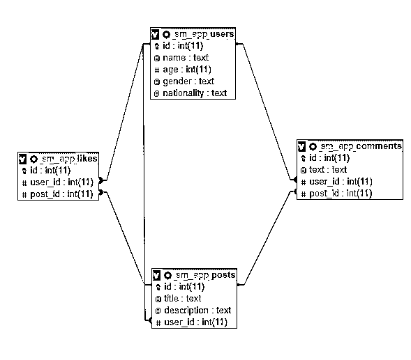

# Python SQL 库简介

> 原文：<https://realpython.com/python-sql-libraries/>

所有软件应用程序都与数据交互，最常见的是通过 T2 数据库管理系统(DBMS)与数据交互。一些编程语言附带了可以用来与 DBMS 交互的模块，而另一些则需要使用第三方包。在本教程中，您将探索您可以使用的不同的 **Python SQL 库**。您将开发一个简单的应用程序来与 SQLite、MySQL 和 PostgreSQL 数据库进行交互。

**在本教程中，您将学习如何:**

*   **使用 Python SQL 库将**连接到不同的数据库管理系统
*   **与 SQLite、MySQL 和 PostgreSQL 数据库进行交互**
*   **使用 Python 应用程序执行**常见数据库查询
*   使用 Python 脚本开发跨不同数据库的应用程序

为了从本教程中获得最大收益，您应该具备基本的 Python、SQL 和使用数据库管理系统的知识。您还应该能够用 Python 下载和[导入](https://realpython.com/absolute-vs-relative-python-imports/)包，并且知道如何在本地或远程安装和运行不同的数据库服务器。

**免费 PDF 下载:** [Python 3 备忘单](https://realpython.com/bonus/python-cheat-sheet-short/)

## 了解数据库模式

在本教程中，您将为一个社交媒体应用程序开发一个非常小的数据库。该数据库将由四个表组成:

1.  `users`
2.  `posts`
3.  `comments`
4.  `likes`

数据库模式的高级图表如下所示:

[](https://files.realpython.com/media/python-sql-database-schema.3f28bf80fefe.png)

因为一个用户可以喜欢很多帖子，所以`users`和`posts`都有一个[一对多关系](https://www.lifewire.com/one-to-many-relationships-1019756)。同样，一个用户可以发表许多评论，一篇文章也可以有多条评论。因此，`users`和`posts`也将与`comments`表有一对多的关系。这也适用于`likes`表，因此`users`和`posts`都将与`likes`表有一对多的关系。

[*Remove ads*](/account/join/)

## 使用 Python SQL 库连接到数据库

在通过 Python SQL 库与任何数据库交互之前，您必须**将**连接到该数据库。在本节中，您将看到如何从 Python 应用程序中连接到 [SQLite](https://realpython.com/python-sqlite-sqlalchemy/) 、 [MySQL](https://realpython.com/python-mysql/) 和 [PostgreSQL](https://www.postgresql.org/) 数据库。

**注意:**在执行 MySQL 和 PostgreSQL 数据库部分的脚本之前，您需要启动并运行 [MySQL](https://dev.mysql.com/downloads/) 和 [PostgreSQL](https://www.postgresql.org/download/) 服务器。要快速了解如何启动 MySQL 服务器，请查看[启动 Django 项目](https://realpython.com/django-setup/#mysql)的 MySQL 部分。要了解如何在 PostgreSQL 中创建数据库，请查看[使用 Python 防止 SQL 注入攻击](https://realpython.com/prevent-python-sql-injection/#setting-up-a-database)中的设置数据库部分。

建议您创建三个不同的 Python 文件，这样三个数据库各有一个。您将在相应的文件中为每个数据库执行脚本。

### SQLite

[**SQLite**](https://www.sqlite.org/docs.html) 可能是用 Python 应用程序连接到的最直接的数据库，因为你不需要安装任何外部 Python SQL 模块来这样做。默认情况下，您的 [Python 安装](https://realpython.com/installing-python/)包含一个名为 [`sqlite3`](https://docs.python.org/2/library/sqlite3.html) 的 Python SQL 库，您可以使用它与 SQLite 数据库进行交互。

此外，SQLite 数据库是**无服务器的**和**独立的**，因为它们从一个文件中读取和写入数据。这意味着，与 MySQL 和 PostgreSQL 不同，您甚至不需要安装和运行 SQLite 服务器来执行数据库操作！

下面是在 Python 中如何使用`sqlite3`连接到 SQLite 数据库:

```py
 1import sqlite3
 2from sqlite3 import Error
 3
 4def create_connection(path):
 5    connection = None
 6    try:
 7        connection = sqlite3.connect(path)
 8        print("Connection to SQLite DB successful")
 9    except Error as e:
10        print(f"The error '{e}' occurred")
11
12    return connection
```

下面是这段代码的工作原理:

*   **行 1 和 2** 导入`sqlite3`和模块的`Error`类。
*   **第 4 行**定义了一个接受 SQLite 数据库路径的函数`.create_connection()`。
*   **第 7 行**使用来自`sqlite3`模块的`.connect()`，并将 SQLite 数据库路径作为参数。如果数据库存在于指定位置，则建立到数据库的连接。否则，将在指定位置创建新的数据库，并建立连接。
*   **第 8 行**打印成功数据库连接的状态。
*   **第 9 行**捕捉任何[异常](https://realpython.com/python-exceptions/)，如果`.connect()`未能建立连接，可能会抛出异常。
*   **第 10 行**显示控制台中的错误信息。

`sqlite3.connect(path)`返回一个`connection`对象，该对象又由`create_connection()`返回。这个`connection`对象可以用来在 SQLite 数据库上执行查询。以下脚本创建了到 SQLite 数据库的连接:

```py
connection = create_connection("E:\\sm_app.sqlite")
```

一旦您执行了上面的脚本，您将会看到在根目录中创建了一个数据库文件`sm_app.sqlite`。请注意，您可以更改位置以匹配您的设置。

### MySQL

与 SQLite 不同，没有默认的 Python SQL 模块可以用来连接 MySQL 数据库。相反，您需要为 MySQL 安装一个 **Python SQL 驱动程序**，以便在 Python 应用程序中与 MySQL 数据库进行交互。一个这样的司机就是`mysql-connector-python`。可以用 [`pip`](https://realpython.com/what-is-pip/) 下载这个 Python SQL 模块:

```py
$ pip install mysql-connector-python
```

注意，MySQL 是一个基于服务器的数据库管理系统。一个 MySQL 服务器可以有多个数据库。与 SQLite 不同，在 SQLite 中创建连接相当于创建数据库，而 MySQL 数据库创建数据库的过程分为两步:

1.  **建立到 MySQL 服务器的连接**。
2.  **执行一个单独的查询**来创建数据库。

定义一个连接到 MySQL 数据库服务器并返回连接对象的函数:

```py
 1import mysql.connector
 2from mysql.connector import Error
 3
 4def create_connection(host_name, user_name, user_password):
 5    connection = None
 6    try:
 7        connection = mysql.connector.connect(
 8            host=host_name,
 9            user=user_name,
10            passwd=user_password
11        )
12        print("Connection to MySQL DB successful")
13    except Error as e:
14        print(f"The error '{e}' occurred")
15
16    return connection
17
18connection = create_connection("localhost", "root", "")
```

在上面的脚本中，您定义了一个接受三个参数的函数`create_connection()`:

1.  主机名
2.  用户名
3.  用户密码

`mysql.connector` Python SQL 模块包含一个方法`.connect()`,您可以在第 7 行使用它来连接 MySQL 数据库服务器。一旦建立了连接，`connection`对象就被返回给调用函数。最后，在第 18 行，用主机名、用户名和密码调用`create_connection()`。

到目前为止，你只建立了联系。数据库尚未创建。为此，您将定义另一个接受两个参数的函数`create_database()`:

1.  **`connection`** 是您要与之交互的数据库服务器的`connection`对象。
2.  **`query`** 是创建数据库的查询。

这个函数是这样的:

```py
def create_database(connection, query):
    cursor = connection.cursor()
    try:
        cursor.execute(query)
        print("Database created successfully")
    except Error as e:
        print(f"The error '{e}' occurred")
```

要执行查询，可以使用`cursor`对象。要执行的`query`以[字符串](https://realpython.com/python-strings/)的格式传递给`cursor.execute()`。

在 MySQL 数据库服务器中为您的社交媒体应用程序创建一个名为`sm_app`的数据库:

```py
create_database_query = "CREATE DATABASE sm_app"
create_database(connection, create_database_query)
```

现在您已经在数据库服务器上创建了一个数据库`sm_app`。然而，`create_connection()`返回的`connection`对象连接到 MySQL 数据库服务器。您需要连接到`sm_app`数据库。为此，您可以对`create_connection()`进行如下修改:

```py
 1def create_connection(host_name, user_name, user_password, db_name):
 2    connection = None
 3    try:
 4        connection = mysql.connector.connect(
 5            host=host_name,
 6            user=user_name,
 7            passwd=user_password,
 8            database=db_name 9        )
10        print("Connection to MySQL DB successful")
11    except Error as e:
12        print(f"The error '{e}' occurred")
13
14    return connection
```

您可以在第 8 行看到，`create_connection()`现在接受了一个名为`db_name`的额外参数。此参数指定要连接的数据库的名称。调用此函数时，可以传入要连接的数据库的名称:

```py
connection = create_connection("localhost", "root", "", "sm_app")
```

上面的脚本成功地调用了`create_connection()`并连接到了`sm_app`数据库。

[*Remove ads*](/account/join/)

### PostgreSQL

像 MySQL 一样，没有默认的 Python SQL 库可以用来与 PostgreSQL 数据库交互。而是需要安装一个**第三方 Python SQL 驱动**来与 PostgreSQL 交互。PostgreSQL 的一个 Python SQL 驱动程序是`psycopg2`。在您的终端上执行以下命令来安装`psycopg2` Python SQL 模块:

```py
$ pip install psycopg2
```

与 SQLite 和 MySQL 数据库一样，您将定义`create_connection()`来连接您的 PostgreSQL 数据库:

```py
import psycopg2
from psycopg2 import OperationalError

def create_connection(db_name, db_user, db_password, db_host, db_port):
    connection = None
    try:
        connection = psycopg2.connect(
            database=db_name,
            user=db_user,
            password=db_password,
            host=db_host,
            port=db_port,
        )
        print("Connection to PostgreSQL DB successful")
    except OperationalError as e:
        print(f"The error '{e}' occurred")
    return connection
```

使用`psycopg2.connect()`从 Python 应用程序中连接到 PostgreSQL 服务器。

然后，您可以使用`create_connection()`创建到 PostgreSQL 数据库的连接。首先，您将使用以下字符串与默认数据库`postgres`建立连接:

```py
connection = create_connection(
    "postgres", "postgres", "abc123", "127.0.0.1", "5432"
)
```

接下来，您必须在默认的`postgres`数据库中创建数据库`sm_app`。您可以在 PostgreSQL 中定义一个函数来执行任何 SQL 查询。下面，您定义`create_database()`在 PostgreSQL 数据库服务器中创建一个新的数据库:

```py
def create_database(connection, query):
    connection.autocommit = True
    cursor = connection.cursor()
    try:
        cursor.execute(query)
        print("Query executed successfully")
    except OperationalError as e:
        print(f"The error '{e}' occurred")

create_database_query = "CREATE DATABASE sm_app"
create_database(connection, create_database_query)
```

一旦运行上面的脚本，您将在 PostgreSQL 数据库服务器中看到`sm_app`数据库。

在对`sm_app`数据库执行查询之前，您需要连接到它:

```py
connection = create_connection(
    "sm_app", "postgres", "abc123", "127.0.0.1", "5432"
)
```

一旦执行了上面的脚本，就会与位于`postgres`数据库服务器中的`sm_app`数据库建立连接。这里，`127.0.0.1`是指数据库服务器主机 IP 地址，`5432`是指数据库服务器的端口号。

## 创建表格

在上一节中，您看到了如何使用不同的 Python SQL 库连接到 SQLite、MySQL 和 PostgreSQL 数据库服务器。您在所有三台数据库服务器上创建了`sm_app`数据库。在本节中，您将看到如何在这三个数据库中**创建表**。

如前所述，您将创建四个表:

1.  `users`
2.  `posts`
3.  `comments`
4.  `likes`

您将从 SQLite 开始。

### SQLite

要在 SQLite 中执行查询，请使用`cursor.execute()`。在本节中，您将定义一个使用该方法的函数`execute_query()`。您的函数将接受`connection`对象和一个查询字符串，您将把它传递给`cursor.execute()`。

`.execute()`可以执行任何以字符串形式传递给它的查询。在本节中，您将使用这个方法来创建表。在接下来的小节中，您将使用相同的方法来执行更新和删除查询。

**注意:**这个脚本应该在您为 SQLite 数据库创建连接的同一个文件中执行。

这是您的函数定义:

```py
def execute_query(connection, query):
    cursor = connection.cursor()
    try:
        cursor.execute(query)
        connection.commit()
        print("Query executed successfully")
    except Error as e:
        print(f"The error '{e}' occurred")
```

这段代码试图执行给定的`query`，并在必要时打印一条错误消息。

接下来，编写您的**查询**:

```py
create_users_table = """
CREATE TABLE IF NOT EXISTS users (
 id INTEGER PRIMARY KEY AUTOINCREMENT,
 name TEXT NOT NULL,
 age INTEGER,
 gender TEXT,
 nationality TEXT
);
"""
```

这意味着创建一个包含以下五列的表`users`:

1.  `id`
2.  `name`
3.  `age`
4.  `gender`
5.  `nationality`

最后，您将调用`execute_query()`来创建表格。您将传入在上一节中创建的`connection`对象，以及包含创建表查询的`create_users_table`字符串:

```py
execute_query(connection, create_users_table)
```

以下查询用于创建`posts`表:

```py
create_posts_table = """
CREATE TABLE IF NOT EXISTS posts(
 id INTEGER PRIMARY KEY AUTOINCREMENT, 
 title TEXT NOT NULL, 
 description TEXT NOT NULL, 
 user_id INTEGER NOT NULL, 
 FOREIGN KEY (user_id) REFERENCES users (id)
);
"""
```

由于`users`和`posts`之间存在一对多的关系，您可以在`posts`表中看到一个外键`user_id`，它引用了`users`表中的`id`列。执行以下脚本来创建`posts`表:

```py
execute_query(connection, create_posts_table)
```

最后，您可以用下面的脚本创建`comments`和`likes`表:

```py
create_comments_table = """
CREATE TABLE IF NOT EXISTS comments (
 id INTEGER PRIMARY KEY AUTOINCREMENT, 
 text TEXT NOT NULL, 
 user_id INTEGER NOT NULL, 
 post_id INTEGER NOT NULL, 
 FOREIGN KEY (user_id) REFERENCES users (id) FOREIGN KEY (post_id) REFERENCES posts (id)
);
"""

create_likes_table = """
CREATE TABLE IF NOT EXISTS likes (
 id INTEGER PRIMARY KEY AUTOINCREMENT, 
 user_id INTEGER NOT NULL, 
 post_id integer NOT NULL, 
 FOREIGN KEY (user_id) REFERENCES users (id) FOREIGN KEY (post_id) REFERENCES posts (id)
);
"""

execute_query(connection, create_comments_table)  
execute_query(connection, create_likes_table)
```

您可以看到在 SQLite 中**创建表**与使用原始 SQL 非常相似。您所要做的就是将查询存储在一个字符串变量中，然后将该变量传递给`cursor.execute()`。

[*Remove ads*](/account/join/)

### MySQL

您将使用`mysql-connector-python` Python SQL 模块在 MySQL 中创建表。就像使用 SQLite 一样，您需要将您的查询传递给`cursor.execute()`，它是通过调用`connection`对象上的`.cursor()`返回的。您可以创建另一个接受`connection`和`query`字符串的函数`execute_query()`:

```py
 1def execute_query(connection, query):
 2    cursor = connection.cursor()
 3    try:
 4        cursor.execute(query)
 5        connection.commit()
 6        print("Query executed successfully")
 7    except Error as e:
 8        print(f"The error '{e}' occurred")
```

在第 4 行，您将`query`传递给`cursor.execute()`。

现在您可以使用这个函数创建您的`users`表:

```py
create_users_table = """
CREATE TABLE IF NOT EXISTS users (
 id INT AUTO_INCREMENT, 
 name TEXT NOT NULL, 
 age INT, 
 gender TEXT, 
 nationality TEXT, 
 PRIMARY KEY (id)
) ENGINE = InnoDB
"""

execute_query(connection, create_users_table)
```

与 SQLite 相比，MySQL 中实现外键关系的查询略有不同。此外，MySQL 使用`AUTO_INCREMENT`关键字(与 SQLite `AUTOINCREMENT`关键字相比)来创建列，当插入新记录时，这些列的值**会自动递增**。

下面的脚本创建了`posts`表，该表包含一个外键`user_id`，该外键引用了`users`表的`id`列:

```py
create_posts_table = """
CREATE TABLE IF NOT EXISTS posts (
 id INT AUTO_INCREMENT, 
 title TEXT NOT NULL, 
 description TEXT NOT NULL, 
 user_id INTEGER NOT NULL, 
 FOREIGN KEY fk_user_id (user_id) REFERENCES users(id), 
 PRIMARY KEY (id)
) ENGINE = InnoDB
"""

execute_query(connection, create_posts_table)
```

类似地，要创建`comments`和`likes`表，可以将相应的`CREATE`查询传递给`execute_query()`。

### PostgreSQL

像 SQLite 和 MySQL 数据库一样，`psycopg2.connect()`返回的`connection`对象包含一个`cursor`对象。您可以使用`cursor.execute()`在 PostgreSQL 数据库上执行 Python SQL 查询。

定义一个功能`execute_query()`:

```py
def execute_query(connection, query):
    connection.autocommit = True
    cursor = connection.cursor()
    try:
        cursor.execute(query)
        print("Query executed successfully")
    except OperationalError as e:
        print(f"The error '{e}' occurred")
```

您可以使用此函数在 PostgreSQL 数据库中创建表、插入记录、修改记录和删除记录。

现在在`sm_app`数据库中创建`users`表:

```py
create_users_table = """
CREATE TABLE IF NOT EXISTS users (
 id SERIAL PRIMARY KEY,
 name TEXT NOT NULL, 
 age INTEGER,
 gender TEXT,
 nationality TEXT
)
"""

execute_query(connection, create_users_table)
```

可以看到在 PostgreSQL 中创建`users`表的查询与 SQLite 和 MySQL 略有不同。这里，关键字`SERIAL`用于创建自动递增的列。回想一下，MySQL 使用了关键字`AUTO_INCREMENT`。

此外，外键引用也以不同的方式指定，如下面创建`posts`表的脚本所示:

```py
create_posts_table = """
CREATE TABLE IF NOT EXISTS posts (
 id SERIAL PRIMARY KEY, 
 title TEXT NOT NULL, 
 description TEXT NOT NULL, 
 user_id INTEGER REFERENCES users(id)
)
"""

execute_query(connection, create_posts_table)
```

要创建`comments`表，您必须为`comments`表编写一个`CREATE`查询，并将其传递给`execute_query()`。创建`likes`表的过程是相同的。您只需修改`CREATE`查询来创建`likes`表，而不是`comments`表。

[*Remove ads*](/account/join/)

## 插入记录

在上一节中，您看到了如何通过使用不同的 Python SQL 模块在 SQLite、MySQL 和 PostgreSQL 数据库中创建表。在本节中，您将看到如何**将记录**插入到您的表中。

### SQLite

要将记录插入 SQLite 数据库，您可以使用与创建表相同的`execute_query()`函数。首先，您必须将您的`INSERT INTO`查询存储在一个字符串中。然后，可以将`connection`对象和`query`字符串传递给`execute_query()`。让我们将五条记录插入到`users`表中:

```py
create_users = """
INSERT INTO
 users (name, age, gender, nationality)
VALUES
 ('James', 25, 'male', 'USA'),
 ('Leila', 32, 'female', 'France'),
 ('Brigitte', 35, 'female', 'England'),
 ('Mike', 40, 'male', 'Denmark'),
 ('Elizabeth', 21, 'female', 'Canada');
"""

execute_query(connection, create_users)
```

因为您将`id`列设置为自动递增，所以您不需要为这些`users`指定`id`列的值。`users`表将从`1`到`5`用`id`值自动填充这五个记录。

现在将六条记录插入到`posts`表中:

```py
create_posts = """
INSERT INTO
 posts (title, description, user_id)
VALUES
 ("Happy", "I am feeling very happy today", 1),
 ("Hot Weather", "The weather is very hot today", 2),
 ("Help", "I need some help with my work", 2),
 ("Great News", "I am getting married", 1),
 ("Interesting Game", "It was a fantastic game of tennis", 5),
 ("Party", "Anyone up for a late-night party today?", 3);
"""

execute_query(connection, create_posts)
```

值得一提的是，`posts`表的`user_id`列是引用`users`表的`id`列的**外键**。这意味着`user_id`列必须包含一个值，即`users`表的`id`列中**已经存在**。如果它不存在，那么您会看到一个错误。

类似地，以下脚本将记录插入到`comments`和`likes`表中:

```py
create_comments = """
INSERT INTO
 comments (text, user_id, post_id)
VALUES
 ('Count me in', 1, 6),
 ('What sort of help?', 5, 3),
 ('Congrats buddy', 2, 4),
 ('I was rooting for Nadal though', 4, 5),
 ('Help with your thesis?', 2, 3),
 ('Many congratulations', 5, 4);
"""

create_likes = """
INSERT INTO
 likes (user_id, post_id)
VALUES
 (1, 6),
 (2, 3),
 (1, 5),
 (5, 4),
 (2, 4),
 (4, 2),
 (3, 6);
"""

execute_query(connection, create_comments)
execute_query(connection, create_likes)
```

在这两种情况下，您都将您的`INSERT INTO`查询存储为一个字符串，并使用`execute_query()`执行它。

### MySQL

从 Python 应用程序向 MySQL 数据库插入记录有两种方法。第一种方法类似于 SQLite。您可以将`INSERT INTO`查询存储在一个字符串中，然后使用`cursor.execute()`来插入记录。

在前面，您定义了一个用于插入记录的包装函数`execute_query()`。您现在可以使用同样的函数将记录插入到 MySQL 表中。以下脚本使用`execute_query()`将记录插入到`users`表中:

```py
create_users = """
INSERT INTO
 `users` (`name`, `age`, `gender`, `nationality`)
VALUES
 ('James', 25, 'male', 'USA'),
 ('Leila', 32, 'female', 'France'),
 ('Brigitte', 35, 'female', 'England'),
 ('Mike', 40, 'male', 'Denmark'),
 ('Elizabeth', 21, 'female', 'Canada');
"""

execute_query(connection, create_users)
```

第二种方法使用`cursor.executemany()`，它接受两个参数:

1.  **查询**字符串，包含要插入的记录的占位符
2.  **[列表中的](https://realpython.com/courses/lists-tuples-python/)** 为您想要插入的记录

看看下面的例子，它将两条记录插入到`likes`表中:

```py
sql = "INSERT INTO likes ( user_id, post_id ) VALUES ( %s, %s )"
val = [(4, 5), (3, 4)]

cursor = connection.cursor()
cursor.executemany(sql, val)
connection.commit()
```

选择哪种方法将记录插入 MySQL 表取决于您自己。如果你是 SQL 专家，那么你可以使用`.execute()`。如果您不太熟悉 SQL，那么使用`.executemany()`可能更简单。使用这两种方法中的任何一种，您都可以成功地将记录插入到`posts`、`comments`和`likes`表中。

[*Remove ads*](/account/join/)

### PostgreSQL

在上一节中，您看到了将记录插入 SQLite 数据库表的两种方法。第一个使用 SQL 字符串查询，第二个使用`.executemany()`。`psycopg2`遵循第二种方法，尽管`.execute()`用于执行基于占位符的查询。

您将带有占位符和记录列表的 SQL 查询传递给`.execute()`。列表中的每条记录都将是一个[元组](https://realpython.com/python-lists-tuples/)，其中元组值对应于数据库表中的列值。下面是如何将用户记录插入 PostgreSQL 数据库的`users`表中:

```py
users = [
    ("James", 25, "male", "USA"),
    ("Leila", 32, "female", "France"),
    ("Brigitte", 35, "female", "England"),
    ("Mike", 40, "male", "Denmark"),
    ("Elizabeth", 21, "female", "Canada"),
]

user_records = ", ".join(["%s"] * len(users))

insert_query = (
    f"INSERT INTO users (name, age, gender, nationality) VALUES {user_records}"
)

connection.autocommit = True
cursor = connection.cursor()
cursor.execute(insert_query, users)
```

上面的脚本创建了一个列表`users`,其中包含五个元组形式的用户记录。接下来，创建一个占位符字符串，它包含五个占位符元素(`%s`)，对应于五个用户记录。占位符字符串与将记录插入到`users`表中的查询连接在一起。最后，查询字符串和用户记录被传递给`.execute()`。上面的脚本成功地将五条记录插入到`users`表中。

看看另一个将记录插入 PostgreSQL 表的例子。以下脚本将记录插入到`posts`表中:

```py
posts = [
    ("Happy", "I am feeling very happy today", 1),
    ("Hot Weather", "The weather is very hot today", 2),
    ("Help", "I need some help with my work", 2),
    ("Great News", "I am getting married", 1),
    ("Interesting Game", "It was a fantastic game of tennis", 5),
    ("Party", "Anyone up for a late-night party today?", 3),
]

post_records = ", ".join(["%s"] * len(posts))

insert_query = (
    f"INSERT INTO posts (title, description, user_id) VALUES {post_records}"
)

connection.autocommit = True
cursor = connection.cursor()
cursor.execute(insert_query, posts)
```

您可以用同样的方法将记录插入到`comments`和`likes`表中。

## 选择记录

在本节中，您将看到如何使用不同的 Python SQL 模块从数据库表中选择记录。特别是，您将看到如何在 SQLite、MySQL 和 PostgreSQL 数据库上执行`SELECT`查询。

### SQLite

要使用 SQLite 选择记录，您可以再次使用`cursor.execute()`。然而，在你完成这些之后，你需要调用`.fetchall()`。该方法返回一个元组列表，其中每个元组都映射到检索到的记录中的相应行。

为了简化这个过程，您可以创建一个函数`execute_read_query()`:

```py
def execute_read_query(connection, query):
    cursor = connection.cursor()
    result = None
    try:
        cursor.execute(query)
        result = cursor.fetchall()
        return result
    except Error as e:
        print(f"The error '{e}' occurred")
```

该函数接受`connection`对象和`SELECT`查询，并返回选中的记录。

#### `SELECT`

现在让我们从`users`表中选择所有记录:

```py
select_users = "SELECT * from users"
users = execute_read_query(connection, select_users)

for user in users:
    print(user)
```

在上面的脚本中，`SELECT`查询从`users`表中选择所有用户。这被传递给`execute_read_query()`，后者返回来自`users`表的所有记录。然后记录被遍历并打印到控制台。

**注意:**不建议在大型表上使用`SELECT *`，因为这会导致大量 I/O 操作，从而增加网络流量。

上述查询的输出如下所示:

```py
(1, 'James', 25, 'male', 'USA')
(2, 'Leila', 32, 'female', 'France')
(3, 'Brigitte', 35, 'female', 'England')
(4, 'Mike', 40, 'male', 'Denmark')
(5, 'Elizabeth', 21, 'female', 'Canada')
```

同样，您可以使用下面的脚本从`posts`表中检索所有记录:

```py
select_posts = "SELECT * FROM posts"
posts = execute_read_query(connection, select_posts)

for post in posts:
    print(post)
```

输出如下所示:

```py
(1, 'Happy', 'I am feeling very happy today', 1)
(2, 'Hot Weather', 'The weather is very hot today', 2)
(3, 'Help', 'I need some help with my work', 2)
(4, 'Great News', 'I am getting married', 1)
(5, 'Interesting Game', 'It was a fantastic game of tennis', 5)
(6, 'Party', 'Anyone up for a late-night party today?', 3)
```

结果显示了`posts`表中的所有记录。

#### `JOIN`

您还可以执行涉及 **`JOIN`操作**的复杂查询，从两个相关的表中检索数据。例如，以下脚本返回用户 id 和名称，以及这些用户发布的帖子的描述:

```py
select_users_posts = """
SELECT
 users.id,
 users.name,
 posts.description
FROM
 posts
 INNER JOIN users ON users.id = posts.user_id
"""

users_posts = execute_read_query(connection, select_users_posts)

for users_post in users_posts:
    print(users_post)
```

以下是输出结果:

```py
(1, 'James', 'I am feeling very happy today')
(2, 'Leila', 'The weather is very hot today')
(2, 'Leila', 'I need some help with my work')
(1, 'James', 'I am getting married')
(5, 'Elizabeth', 'It was a fantastic game of tennis')
(3, 'Brigitte', 'Anyone up for a late night party today?')
```

你也可以通过实现**多个`JOIN`操作符**从三个相关的表中选择数据。以下脚本返回所有帖子，以及帖子上的评论和发表评论的用户的姓名:

```py
select_posts_comments_users = """
SELECT
 posts.description as post,
 text as comment,
 name
FROM
 posts
 INNER JOIN comments ON posts.id = comments.post_id
 INNER JOIN users ON users.id = comments.user_id
"""

posts_comments_users = execute_read_query(
    connection, select_posts_comments_users
)

for posts_comments_user in posts_comments_users:
    print(posts_comments_user)
```

输出如下所示:

```py
('Anyone up for a late night party today?', 'Count me in', 'James')
('I need some help with my work', 'What sort of help?', 'Elizabeth')
('I am getting married', 'Congrats buddy', 'Leila')
('It was a fantastic game of tennis', 'I was rooting for Nadal though', 'Mike')
('I need some help with my work', 'Help with your thesis?', 'Leila')
('I am getting married', 'Many congratulations', 'Elizabeth')
```

从输出中可以看到，`.fetchall()`没有返回列名。要返回列名，可以使用`cursor`对象的`.description`属性。例如，以下列表返回上述查询的所有列名:

```py
cursor = connection.cursor()
cursor.execute(select_posts_comments_users)
cursor.fetchall()

column_names = [description[0] for description in cursor.description]
print(column_names)
```

输出如下所示:

```py
['post', 'comment', 'name']
```

您可以看到给定查询的列名。

#### `WHERE`

现在，您将执行一个`SELECT`查询来返回帖子，以及帖子收到的赞的总数:

```py
select_post_likes = """
SELECT
 description as Post,
 COUNT(likes.id) as Likes
FROM
 likes,
 posts
WHERE
 posts.id = likes.post_id
GROUP BY
 likes.post_id
"""

post_likes = execute_read_query(connection, select_post_likes)

for post_like in post_likes:
    print(post_like)
```

输出如下所示:

```py
('The weather is very hot today', 1)
('I need some help with my work', 1)
('I am getting married', 2)
('It was a fantastic game of tennis', 1)
('Anyone up for a late night party today?', 2)
```

通过使用`WHERE`子句，您能够返回更具体的结果。

[*Remove ads*](/account/join/)

### MySQL

在 MySQL 中选择记录的过程与在 SQLite 中选择记录的过程完全相同。可以用`cursor.execute()`后跟`.fetchall()`。下面的脚本创建了一个包装器函数`execute_read_query()`，您可以用它来选择记录:

```py
def execute_read_query(connection, query):
    cursor = connection.cursor()
    result = None
    try:
        cursor.execute(query)
        result = cursor.fetchall()
        return result
    except Error as e:
        print(f"The error '{e}' occurred")
```

现在从`users`表中选择所有记录:

```py
select_users = "SELECT * FROM users"
users = execute_read_query(connection, select_users)

for user in users:
    print(user)
```

输出将类似于您在 SQLite 中看到的。

### PostgreSQL

使用`psycopg2` Python SQL 模块从 PostgreSQL 表中选择记录的过程类似于使用 SQLite 和 MySQL。同样，您将使用`cursor.execute()`后跟`.fetchall()`从 PostgreSQL 表中选择记录。以下脚本从`users`表中选择所有记录，并将它们打印到控制台:

```py
def execute_read_query(connection, query):
    cursor = connection.cursor()
    result = None
    try:
        cursor.execute(query)
        result = cursor.fetchall()
        return result
    except OperationalError as e:
        print(f"The error '{e}' occurred")

select_users = "SELECT * FROM users"
users = execute_read_query(connection, select_users)

for user in users:
    print(user)
```

同样，输出将与您之前看到的类似。

## 更新表格记录

在上一节中，您看到了如何从 SQLite、MySQL 和 PostgreSQL 数据库中选择记录。在本节中，您将介绍使用 SQLite、PostgresSQL 和 MySQL 的 Python SQL 库更新记录的过程。

### SQLite

在 SQLite 中更新记录非常简单。您可以再次使用`execute_query()`。例如，您可以用`2`的`id`来更新文章的描述。首先，`SELECT`本帖描述:

```py
select_post_description = "SELECT description FROM posts WHERE id = 2"

post_description = execute_read_query(connection, select_post_description)

for description in post_description:
    print(description)
```

您应该会看到以下输出:

```py
('The weather is very hot today',)
```

以下脚本更新了描述:

```py
update_post_description = """
UPDATE
 posts
SET
 description = "The weather has become pleasant now"
WHERE
 id = 2
"""

execute_query(connection, update_post_description)
```

现在，如果您再次执行`SELECT`查询，您应该会看到以下结果:

```py
('The weather has become pleasant now',)
```

输出已更新。

[*Remove ads*](/account/join/)

### MySQL

MySQL 中用`mysql-connector-python`更新记录的过程也是`sqlite3` Python SQL 模块的翻版。您需要将字符串查询传递给`cursor.execute()`。例如，下面的脚本用`2`的`id`更新了帖子的描述:

```py
update_post_description = """
UPDATE
 posts
SET
 description = "The weather has become pleasant now"
WHERE
 id = 2
"""

execute_query(connection,  update_post_description)
```

同样，您使用了包装函数`execute_query()`来更新文章描述。

### PostgreSQL

PostgreSQL 的更新查询类似于 SQLite 和 MySQL。您可以使用上述脚本来更新 PostgreSQL 表中的记录。

## 删除表格记录

在本节中，您将看到如何使用 SQLite、MySQL 和 PostgreSQL 数据库的 Python SQL 模块删除表记录。由于三个数据库的 **`DELETE`** 查询是相同的，所以删除记录的过程对于所有三个数据库是统一的。

### SQLite

您可以再次使用`execute_query()`从 SQLite 数据库中删除记录。您所要做的就是将`connection`对象和要删除的记录的字符串查询传递给`execute_query()`。然后，`execute_query()`将使用`connection`创建一个`cursor`对象，并将字符串查询传递给`cursor.execute()`，后者将删除记录。

例如，尝试删除带有`5`的`id`的注释:

```py
delete_comment = "DELETE FROM comments WHERE id = 5"
execute_query(connection, delete_comment)
```

现在，如果您从`comments`表中选择所有记录，您会看到第五条注释已经被删除。

### MySQL

MySQL 中的删除过程也类似于 SQLite，如下例所示:

```py
delete_comment = "DELETE FROM comments WHERE id = 2"
execute_query(connection, delete_comment)
```

这里，您从 MySQL 数据库服务器中的`sm_app`数据库的`comments`表中删除了第二条注释。

### PostgreSQL

PostgreSQL 的删除查询也类似于 SQLite 和 MySQL。您可以使用`DELETE`关键字编写一个删除查询字符串，然后将查询和`connection`对象传递给`execute_query()`。这将从 PostgreSQL 数据库中删除指定的记录。

## 结论

在本教程中，您已经学习了如何使用三个常见的 Python SQL 库。`sqlite3`、`mysql-connector-python`和`psycopg2`允许您将 Python 应用程序分别连接到 SQLite、MySQL 和 PostgreSQL 数据库。

**现在你可以:**

*   **与 SQLite、MySQL 或 PostgreSQL 数据库进行交互**
*   **使用**三个不同的 Python SQL 模块
*   **在 Python 应用程序中对各种数据库执行** SQL 查询

然而，这只是冰山一角！还有用于**对象关系映射**的 Python SQL 库，比如 SQLAlchemy 和 Django ORM，它们在 Python 中实现了数据库交互任务的自动化。在我们的 [Python 数据库](https://realpython.com/tutorials/databases/)部分的其他教程中，你会学到更多关于这些库的知识。*******