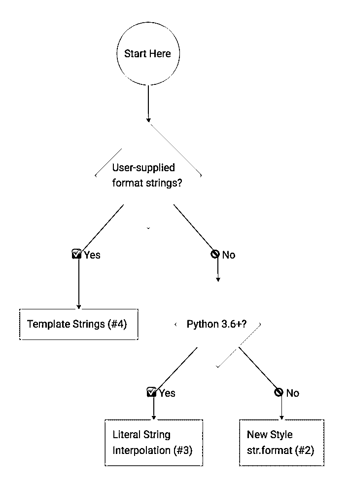

# Python 字符串格式化最佳实践

> 原文：<https://realpython.com/python-string-formatting/>

*立即观看**本教程有真实 Python 团队创建的相关视频课程。和书面教程一起看，加深理解: [**Python 字符串格式化技巧&最佳实践**](/courses/python-string-formatting-tips-best-practices/)

还记得 Python 的[禅，以及“在 Python 中应该有一种显而易见的方法来做某事”吗？当您发现在 Python 中有四种主要的*方法来进行字符串格式化时，您可能会感到困惑。*](https://www.python.org/dev/peps/pep-0020/)

在本教程中，您将学习 Python 中字符串格式化的四种主要方法，以及它们的优缺点。对于如何在自己的程序中选择最佳的通用字符串格式化方法，您还将获得一个简单的经验法则。

让我们直接开始吧，因为我们有很多要谈的。为了有一个简单的玩具例子来做实验，让我们假设你已经有了下面的[变量](https://realpython.com/python-variables/)(或者[常数](https://realpython.com/python-constants/)，真的):

>>>

```py
>>> errno = 50159747054
>>> name = 'Bob'
```

基于这些变量，您想要生成一个包含简单错误消息的输出[字符串](https://realpython.com/python-strings/):

>>>

```py
'Hey Bob, there is a 0xbadc0ffee error!'
```

这个错误可能真的会破坏一个开发人员的周一早晨…但是我们在这里讨论字符串格式。所以我们开始工作吧。

## #1“旧样式”字符串格式(%运算符)

Python 中的字符串有一个独特的内置操作，可以用`%`操作符访问。这使您可以非常容易地进行简单的位置格式化。如果你曾经在 [C](https://realpython.com/c-for-python-programmers/) 中使用过`printf`风格的函数，你会立刻意识到它是如何工作的。这里有一个简单的例子:

>>>

```py
>>> 'Hello, %s' % name
"Hello, Bob"
```

我在这里使用`%s`格式说明符来告诉 Python 在哪里替换用字符串表示的`name`的值。

还有其他格式说明符可以让您控制输出格式。例如，可以将数字转换为十六进制表示法，或者添加空白填充来生成格式良好的表格和报告。(参见 [Python 文档:“printf 风格的字符串格式化”](https://docs.python.org/3/library/stdtypes.html#old-string-formatting)。)

在这里，您可以使用`%x`格式说明符将`int`值转换为字符串，并将其表示为十六进制数:

>>>

```py
>>> '%x' % errno
'badc0ffee'
```

如果您想在单个字符串中进行多次替换,“旧样式”字符串格式语法会稍有变化。因为`%`操作符只接受一个参数，所以您需要将右边包装在一个元组中，就像这样:

>>>

```py
>>> 'Hey %s, there is a 0x%x error!' % (name, errno)
'Hey Bob, there is a 0xbadc0ffee error!'
```

如果将映射传递给`%`操作符，也可以在格式字符串中通过名称引用变量替换:

>>>

```py
>>> 'Hey %(name)s, there is a 0x%(errno)x error!' % {
...     "name": name, "errno": errno }
'Hey Bob, there is a 0xbadc0ffee error!'
```

这使得您的格式字符串更容易维护，也更容易在将来修改。您不必担心要确保传入值的顺序与格式字符串中引用值的顺序相匹配。当然，缺点是这种技术需要更多的输入。

我相信您一定想知道为什么这种`printf`样式的格式被称为“旧样式”字符串格式。它在技术上被 Python 3 中的“新风格”格式所取代，我们接下来会谈到这一点。

[*Remove ads*](/account/join/)

## #2“新样式”字符串格式(`str.format` )

Python 3 引入了一种新的[方法来进行字符串格式化](https://realpython.com/python-formatted-output/)，这种方法后来也被移植回 Python 2.7。这种“新样式”的字符串格式去掉了`%`-操作符的特殊语法，使字符串格式的语法更加规则。格式化现在由[在字符串对象](https://docs.python.org/3/library/stdtypes.html#str.format)上调用`.format()`来处理。

您可以使用`format()`进行简单的位置格式化，就像您可以使用“旧样式”格式化一样:

>>>

```py
>>> 'Hello, {}'.format(name)
'Hello, Bob'
```

或者，您可以通过名称引用变量替换，并按照您想要的任何顺序使用它们。这是一个非常强大的特性，因为它允许在不改变传递给`format()`的参数的情况下重新排列显示顺序:

>>>

```py
>>> 'Hey {name}, there is a 0x{errno:x} error!'.format(
...     name=name, errno=errno)
'Hey Bob, there is a 0xbadc0ffee error!'
```

这也表明将`int`变量格式化为十六进制字符串的语法已经改变。现在您需要通过添加一个`:x`后缀来传递一个格式规范。格式字符串语法变得更加强大，而不会使简单的用例变得复杂。仔细阅读 Python 文档中的这个[字符串格式化迷你语言是值得的。](https://docs.python.org/3/library/string.html#string-formatting)

在 Python 3 中，这种“新样式”的字符串格式优于`%`样式的格式。虽然[“旧风格”格式已经被弱化](https://docs.python.org/3/library/stdtypes.html?highlight=sprintf#printf-style-string-formatting)，但它并没有被弃用。最新版本的 Python 仍然支持它。根据[关于 Python 开发电子邮件列表](https://lists.gt.net/python/dev/969817)和[的讨论，关于 Python 开发 bug 追踪器](https://bugs.python.org/issue14123)、`%`的这个问题——格式化将会持续很长时间。

尽管如此，Python 3 的官方文档并不完全推荐“旧风格”的格式，也没有过多地提及它:

> 这里描述的格式化操作展示了导致许多常见错误的各种怪癖(比如不能正确显示元组和字典)。使用较新的格式化字符串或 str.format()接口有助于避免这些错误。这些替代方案还提供了更强大、更灵活、更可扩展的文本格式化方法。”([来源](https://docs.python.org/3/library/stdtypes.html?highlight=sprintf#printf-style-string-formatting))

这就是为什么我个人会努力坚持使用`str.format`来开发新代码。从 Python 3.6 开始，还有另一种方法来格式化字符串。我会在下一节告诉你所有的事情。

## #3 字符串插值/ f 字符串(Python 3.6+)

[Python 3.6 增加了一种新的字符串格式化方法](https://dbader.org/blog/cool-new-features-in-python-3-6)，称为格式化字符串文字或[“f-strings”](https://realpython.com/python-f-strings/)。这种格式化字符串的新方法允许您在字符串常量中使用嵌入式 Python 表达式。下面是一个简单的例子，让您感受一下这个特性:

>>>

```py
>>> f'Hello, {name}!'
'Hello, Bob!'
```

正如您所看到的，这给字符串常量加上了前缀字母“`f`”——因此命名为“f-strings”这种新的格式语法非常强大。因为可以嵌入任意的 Python 表达式，所以甚至可以用它做内联算术。看看这个例子:

>>>

```py
>>> a = 5
>>> b = 10
>>> f'Five plus ten is {a + b} and not {2 * (a + b)}.'
'Five plus ten is 15 and not 30.'
```

格式化字符串是 Python 解析器的一个特性，它将 f 字符串转换成一系列字符串常量和表达式。然后将它们连接起来，组成最后一串。

假设您有以下包含 f 字符串的`greet()`函数:

>>>

```py
>>> def greet(name, question):
...     return f"Hello, {name}! How's it {question}?"
...
>>> greet('Bob', 'going')
"Hello, Bob! How's it going?"
```

当您反汇编该函数并检查幕后发生的情况时，您会看到函数中的 f 字符串被转换成类似于以下内容的形式:

>>>

```py
>>> def greet(name, question):
...    return "Hello, " + name + "! How's it " + question + "?"
```

真正的实现比这稍微快一点，因为它使用了 [`BUILD_STRING`操作码作为优化](https://bugs.python.org/issue27078)。但是功能上它们是一样的:

>>>

```py
>>> import dis
>>> dis.dis(greet)
 2           0 LOAD_CONST               1 ('Hello, ')
 2 LOAD_FAST                0 (name)
 4 FORMAT_VALUE             0
 6 LOAD_CONST               2 ("! How's it ")
 8 LOAD_FAST                1 (question)
 10 FORMAT_VALUE             0
 12 LOAD_CONST               3 ('?')
 14 BUILD_STRING             5
 16 RETURN_VALUE
```

字符串文字也支持`str.format()`方法的现有格式字符串语法。这使您可以解决我们在前两节中讨论过的相同的格式问题:

>>>

```py
>>> f"Hey {name}, there's a {errno:#x} error!"
"Hey Bob, there's a 0xbadc0ffee error!"
```

Python 新的格式化字符串文字类似于 JavaScript 在 ES2015 中添加的[模板文字。我认为它们是 Python 的一个很好的补充，我已经开始在我的日常工作中使用它们了。您可以在我们的](https://developer.mozilla.org/en-US/docs/Web/JavaScript/Reference/Template_literals)[深度 Python f-strings 教程](https://realpython.com/python-f-strings/)中了解更多关于格式化字符串的信息。

[*Remove ads*](/account/join/)

## #4 模板字符串(标准库)

这里还有一个 Python 中的字符串格式化工具:模板字符串。这是一种更简单、功能更弱的机制，但在某些情况下，这可能正是您想要的。

让我们来看一个简单的问候示例:

>>>

```py
>>> from string import Template
>>> t = Template('Hey, $name!')
>>> t.substitute(name=name)
'Hey, Bob!'
```

您在这里看到我们需要从 Python 的内置`string`模块导入`Template`类。模板字符串不是核心语言特性，但它们是由标准库中的 [`string`模块提供的。](https://docs.python.org/3/library/string.html)

另一个区别是模板字符串不允许格式说明符。因此，为了让前面的错误字符串示例生效，您需要手动将`int`错误号转换成十六进制字符串:

>>>

```py
>>> templ_string = 'Hey $name, there is a $error error!'
>>> Template(templ_string).substitute(
...     name=name, error=hex(errno))
'Hey Bob, there is a 0xbadc0ffee error!'
```

效果很好。

那么什么时候应该在 Python 程序中使用模板字符串呢？在我看来，使用模板字符串的最佳时机是在处理程序用户生成的格式化字符串时。由于降低了复杂性，模板字符串是更安全的选择。

其他字符串格式化技术的更复杂的格式化微型语言可能会给程序带来安全漏洞。例如，[格式字符串有可能访问你的程序](http://lucumr.pocoo.org/2016/12/29/careful-with-str-format/)中的任意变量。

这意味着，如果恶意用户可以提供格式字符串，他们就有可能泄漏密钥和其他敏感信息！这里有一个简单的概念证明，说明这种攻击可能如何针对您的代码:

>>>

```py
>>> # This is our super secret key:
>>> SECRET = 'this-is-a-secret'

>>> class Error:
...      def __init__(self):
...          pass

>>> # A malicious user can craft a format string that
>>> # can read data from the global namespace:
>>> user_input = '{error.__init__.__globals__[SECRET]}'

>>> # This allows them to exfiltrate sensitive information,
>>> # like the secret key:
>>> err = Error()
>>> user_input.format(error=err)
'this-is-a-secret'
```

看看一个假想的攻击者是如何通过从一个恶意的格式字符串中访问`__globals__`字典来提取我们的秘密字符串的？可怕吧。模板字符串关闭了这个攻击媒介。如果您正在处理从[用户输入](https://realpython.com/python-input-output/)生成的格式字符串，这使它们成为更安全的选择:

>>>

```py
>>> user_input = '${error.__init__.__globals__[SECRET]}'
>>> Template(user_input).substitute(error=err)
ValueError:
"Invalid placeholder in string: line 1, col 1"
```

## 应该使用哪种字符串格式化方法？

我完全理解在 Python 中有这么多选择来格式化你的字符串会让人感到很困惑。这是一个很好的提示，来展示我为您整理的这张便捷的流程图信息图:

[](https://files.realpython.com/media/python-string-formatting-flowchart.4ecf0148fd87.png)

<figcaption class="figure-caption text-center">Python String Formatting Rule of Thumb (Image: [Click to Tweet](https://twitter.com/intent/tweet/?text=Python%20String%20Formatting%20Rule%20of%20Thumb&url=https://realpython.com/python-string-formatting/))</figcaption>

这个流程图是基于我在编写 Python 时应用的经验法则:

**Python 字符串格式化的经验法则:**如果你的格式字符串是用户提供的，使用[模板字符串(#4)](#4-template-strings-standard-library) 来避免安全问题。否则，如果你在 Python 3.6+上，使用[文字字符串插值/f 字符串(#3)](#3-string-interpolation-f-strings-python-36) ，如果你不是，使用[“新样式”str.format (#2)](#2-new-style-string-formatting-strformat) 。

## 关键要点

*   也许令人惊讶的是，在 Python 中处理字符串格式的方法不止一种。
*   每种方法都有各自的优缺点。您的用例将影响您应该使用哪种方法。
*   如果你在决定使用哪种字符串格式化方法时有困难，试试我们的 *Python 字符串格式化经验法则*。

*立即观看**本教程有真实 Python 团队创建的相关视频课程。和书面教程一起看，加深理解: [**Python 字符串格式化技巧&最佳实践**](/courses/python-string-formatting-tips-best-practices/)****