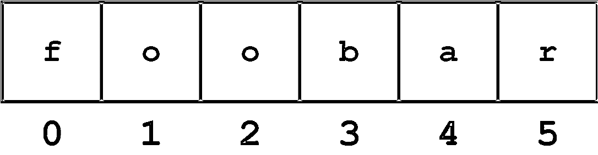
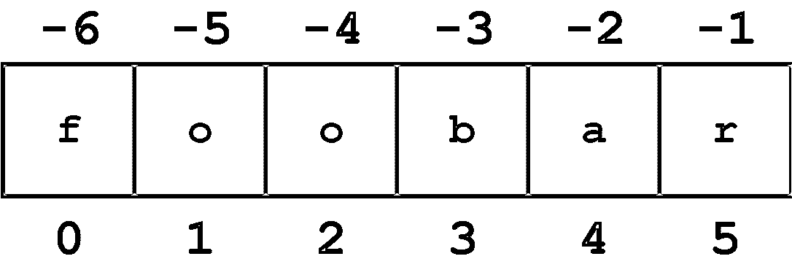
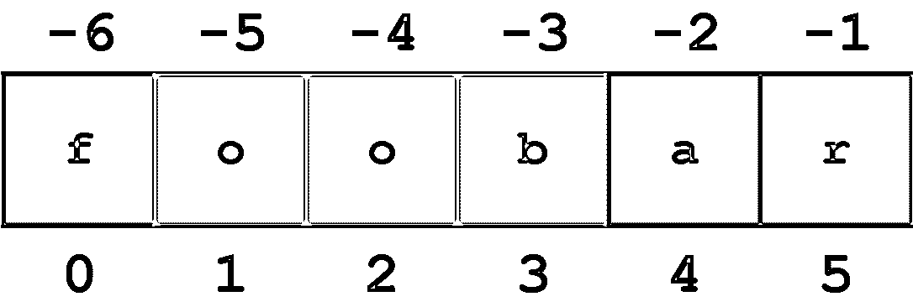
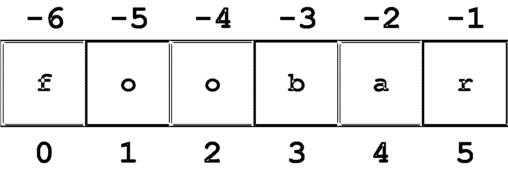
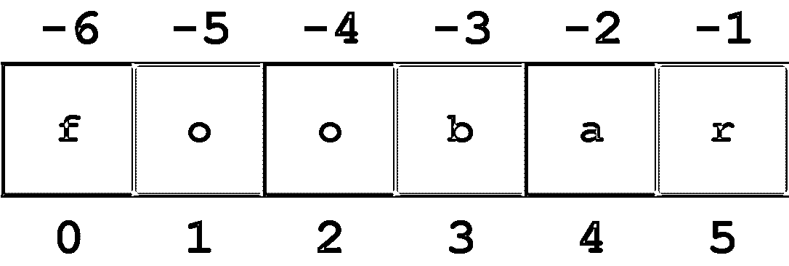

# Python 中的字符串和字符数据

> 原文：<https://realpython.com/python-strings/>

*立即观看**本教程有真实 Python 团队创建的相关视频课程。和书面教程一起看，加深理解:[**Python 中的字符串和字符数据**](/courses/python-strings/)

在 Python 中关于[基本数据类型的教程中，您学习了如何定义包含字符数据序列的**字符串:**对象。处理字符数据是编程的一部分。这是一个罕见的应用程序，至少在某种程度上不需要操作字符串。](https://realpython.com/python-data-types/)

**下面是你将在本教程中学到的:** Python 提供了一组丰富的操作符、函数和方法来处理字符串。完成本教程后，您将知道如何访问和提取部分字符串，并且熟悉可用于操作和修改字符串数据的方法。

还将向您介绍另外两个用于表示原始字节数据的 Python 对象，即`bytes`和`bytearray`类型。

***参加测验:****通过我们的交互式“Python 字符串和字符数据”测验来测试您的知识。完成后，您将收到一个分数，以便您可以跟踪一段时间内的学习进度:*

*[参加测验](/quizzes/python-strings/)

## 字符串操作

以下部分重点介绍了可用于处理字符串的运算符、方法和函数。

[*Remove ads*](/account/join/)

### 字符串运算符

在关于 Python 中的[操作符和表达式](https://realpython.com/python-operators-expressions/)的教程中，您已经看到了应用于数值操作数的操作符`+`和`*`。这两个运算符也可以应用于字符串。

#### `+`操作员

`+`操作符连接字符串。它返回由连接在一起的操作数组成的字符串，如下所示:

>>>

```py
>>> s = 'foo'
>>> t = 'bar'
>>> u = 'baz'

>>> s + t
'foobar'
>>> s + t + u
'foobarbaz'

>>> print('Go team' + '!!!')
Go team!!!
```

#### `*`操作员

`*`操作符创建一个字符串的多个副本。如果`s`是一个字符串，而`n`是一个整数，则以下任一表达式都会返回一个由`s`的`n`串联副本组成的字符串:

> `s * n`
> T1】

以下是两种形式的示例:

>>>

```py
>>> s = 'foo.'

>>> s * 4
'foo.foo.foo.foo.'
>>> 4 * s
'foo.foo.foo.foo.'
```

乘数操作数`n`必须是整数。您可能认为它必须是正整数，但有趣的是，它可以是零或负，在这种情况下，结果是一个空字符串:

>>>

```py
>>> 'foo' * -8
''
```

如果你要创建一个字符串变量并通过赋值`'foo' * -8`将其初始化为空字符串，任何人都会认为你有点愚蠢。但这是可行的。

#### `in`操作员

Python 还提供了可用于字符串的成员运算符。如果第一个操作数包含在第二个操作数中，则`in`运算符返回`True`，否则返回`False`:

>>>

```py
>>> s = 'foo'

>>> s in 'That\'s food for thought.'
True
>>> s in 'That\'s good for now.'
False
```

还有一个`not in`操作符，它的作用正好相反:

>>>

```py
>>> 'z' not in 'abc'
True
>>> 'z' not in 'xyz'
False
```

### 内置字符串函数

正如你在关于 Python 中的[基本数据类型的教程中所看到的，Python 提供了许多内置于解释器中并且总是可用的函数。以下是一些使用字符串的示例:](https://realpython.com/python-data-types/)

| 功能 | 描述 |
| --- | --- |
| `chr()` | 将整数转换为字符 |
| `ord()` | 将字符转换为整数 |
| `len()` | 返回字符串的长度 |
| `str()` | 返回对象的字符串表示形式 |

下面将更全面地探讨这些问题。

#### `ord(c)`

> 返回给定字符的整数值。

在最基本的层面上，计算机将所有信息存储为[数字](https://realpython.com/python-numbers/)。为了表示字符数据，使用将每个字符映射到其代表数字的转换方案。

常用的最简单的方案叫做 [ASCII](https://en.wikipedia.org/wiki/ASCII) 。它涵盖了您可能最习惯使用的常见拉丁字符。对于这些字符，`ord(c)`返回字符`c`的 ASCII 值:

>>>

```py
>>> ord('a')
97
>>> ord('#')
35
```

就目前而言，ASCII 是很好的。但是，世界上有许多不同的语言在使用，数字媒体中出现了无数的符号和字形。可能需要用计算机代码表示的全套字符远远超过你通常看到的普通拉丁字母、数字和符号。

Unicode 是一个雄心勃勃的标准，它试图为每一种可能的语言、每一种可能的平台上的每一个可能的字符提供一个数字代码。Python 3 广泛支持 Unicode，包括允许字符串中包含 Unicode 字符。

**更多信息:**参见 Python 文档中的 [Unicode &字符编码:无痛指南](https://realpython.com/python-encodings-guide/)和 [Python 的 Unicode 支持](https://docs.python.org/3/howto/unicode.html#python-s-unicode-support)。

只要您停留在通用字符的领域，ASCII 和 Unicode 之间的实际差别就很小。但是`ord()`函数也将为 [Unicode 字符](https://realpython.com/courses/python-unicode/)返回数值:

>>>

```py
>>> ord('€')
8364
>>> ord('∑')
8721
```

#### `chr(n)`

> 返回给定整数的字符值。

`chr()`与`ord()`相反。给定一个数值`n`，`chr(n)`返回一个表示对应于`n`的字符的字符串:

>>>

```py
>>> chr(97)
'a'
>>> chr(35)
'#'
```

`chr()`也处理 Unicode 字符:

>>>

```py
>>> chr(8364)
'€'
>>> chr(8721)
'∑'
```

`len(s)`

> 返回字符串的长度。

用`len()`，可以检查 Python 字符串长度。`len(s)`返回`s`中的字符数:

>>>

```py
>>> s = 'I am a string.'
>>> len(s)
14
```

`str(obj)`

> 返回对象的字符串表示形式。

几乎 Python 中的任何对象都可以呈现为字符串。`str(obj)`返回对象`obj`的字符串表示:

>>>

```py
>>> str(49.2)
'49.2'
>>> str(3+4j)
'(3+4j)'
>>> str(3 + 29)
'32'
>>> str('foo')
'foo'
```

[*Remove ads*](/account/join/)

### 字符串索引

通常在编程语言中，可以使用数字索引或键值直接访问有序数据集中的单个项目。这个过程被称为索引。

在 Python 中，字符串是字符数据的有序序列，因此可以用这种方式进行索引。字符串中的单个字符可以通过指定字符串名称后跟方括号中的数字(`[]`)来访问。

Python 中的字符串索引是从零开始的:字符串中的第一个字符有索引`0`，下一个有索引`1`，依此类推。最后一个字符的索引将是字符串长度减一。

例如，字符串`'foobar'`的索引示意图如下所示:

[](https://files.realpython.com/media/t.f398a9e25af0.png)

<figcaption class="figure-caption text-center">String Indices</figcaption>

单个字符可以通过索引访问，如下所示:

>>>

```py
>>> s = 'foobar'

>>> s[0]
'f'
>>> s[1]
'o'
>>> s[3]
'b'
>>> len(s)
6
>>> s[len(s)-1]
'r'
```

试图在字符串末尾之外进行索引会导致错误:

>>>

```py
>>> s[6]
Traceback (most recent call last):
  File "<pyshell#17>", line 1, in <module>
    s[6]
IndexError: string index out of range
```

字符串索引也可以用负数指定，在这种情况下，索引从字符串的末尾向后开始:`-1`表示最后一个字符，`-2`表示倒数第二个字符，依此类推。下图显示了字符串`'foobar'`的正负索引:

[](https://files.realpython.com/media/t.5089888b3d9f.png)

<figcaption class="figure-caption text-center">Positive and Negative String Indices</figcaption>

下面是一些负指数的例子:

>>>

```py
>>> s = 'foobar'

>>> s[-1]
'r'
>>> s[-2]
'a'
>>> len(s)
6
>>> s[-len(s)]
'f'
```

试图用字符串开头以外的负数进行索引会导致错误:

>>>

```py
>>> s[-7]
Traceback (most recent call last):
  File "<pyshell#26>", line 1, in <module>
    s[-7]
IndexError: string index out of range
```

对于任何非空字符串`s`，`s[len(s)-1]`和`s[-1]`都返回最后一个字符。没有任何索引对空字符串有意义。

### 字符串切片

Python 还允许一种从字符串中提取[子字符串](https://realpython.com/python-string-contains-substring/)的索引语法，称为字符串切片。如果`s`是一个字符串，则形式为`s[m:n]`的表达式返回从位置`m`开始的`s`部分，直到但不包括位置`n`:

>>>

```py
>>> s = 'foobar'
>>> s[2:5]
'oba'
```

**记住:**字符串索引是从零开始的。字符串中的第一个字符的索引为`0`。这适用于标准索引和切片。

同样，第二个索引指定了结果中不包含的第一个字符——上例中的字符`'r'` ( `s[5]`)。这看起来有点不直观，但它产生的结果是有意义的:表达式`s[m:n]`将返回长度为`n - m`个字符的子串，在本例中是`5 - 2 = 3`。

如果省略第一个索引，切片将从字符串的开头开始。因此，`s[:m]`和`s[0:m]`是等价的:

>>>

```py
>>> s = 'foobar'

>>> s[:4]
'foob'
>>> s[0:4]
'foob'
```

类似地，如果您像在`s[n:]`中一样省略第二个索引，切片将从第一个索引延伸到字符串的末尾。这是更麻烦的`s[n:len(s)]`的一个很好的、简洁的替代方案:

>>>

```py
>>> s = 'foobar'

>>> s[2:]
'obar'
>>> s[2:len(s)]
'obar'
```

对于任意字符串`s`和任意整数`n` ( `0 ≤ n ≤ len(s)`)，`s[:n] + s[n:]`将等于`s`:

>>>

```py
>>> s = 'foobar'

>>> s[:4] + s[4:]
'foobar'
>>> s[:4] + s[4:] == s
True
```

省略这两个索引将返回完整的原始字符串。字面上。它不是副本，而是对原始字符串的引用:

>>>

```py
>>> s = 'foobar'
>>> t = s[:]
>>> id(s)
59598496
>>> id(t)
59598496
>>> s is t
True
```

如果切片中的第一个索引大于或等于第二个索引，Python 将返回一个空字符串。如果您正在寻找一个空字符串，这是另一种生成空字符串的混淆方法:

>>>

```py
>>> s[2:2]
''
>>> s[4:2]
''
```

负索引也可以与切片一起使用。`-1`表示最后一个字符，`-2`表示倒数第二个字符，以此类推，就像简单的索引一样。下图显示了如何使用正负索引从字符串`'foobar'`中切分出子字符串`'oob'`:

[](https://files.realpython.com/media/t.ed50396b1e71.png)

<figcaption class="figure-caption text-center">String Slicing with Positive and Negative Indices</figcaption>

下面是相应的 Python 代码:

>>>

```py
>>> s = 'foobar'

>>> s[-5:-2]
'oob'
>>> s[1:4]
'oob'
>>> s[-5:-2] == s[1:4]
True
```

[*Remove ads*](/account/join/)

### 在字符串片段中指定步幅

还有一个切片语法的变体需要讨论。添加一个额外的`:`和第三个索引指定一个步幅(也称为一个步长)，它指示在检索片段中的每个字符后要跳跃多少个字符。

比如对于字符串`'foobar'`，切片`0:6:2`从第一个字符开始，到最后一个字符结束(整个字符串)，每隔一个字符跳过一个。如下图所示:

[](https://files.realpython.com/media/t.1fb308cf7573.png)

<figcaption class="figure-caption text-center">String Indexing with Stride</figcaption>

类似地，`1:6:2`指定一个从第二个字符(索引`1`)开始到最后一个字符结束的片段，并且步距值`2`再次导致每隔一个字符被跳过:

[](https://files.realpython.com/media/t.8a1e853f9509.png)

<figcaption class="figure-caption text-center">Another String Indexing with Stride</figcaption>

说明性的 REPL 代码如下所示:

>>>

```py
>>> s = 'foobar'

>>> s[0:6:2]
'foa'

>>> s[1:6:2]
'obr'
```

与任何切片一样，第一个和第二个索引可以省略，分别默认为第一个和最后一个字符:

>>>

```py
>>> s = '12345' * 5
>>> s
'1234512345123451234512345'
>>> s[::5]
'11111'
>>> s[4::5]
'55555'
```

您也可以指定一个负的步幅值，在这种情况下，Python 会在字符串中后退。在这种情况下，起始/第一个索引应该大于结束/第二个索引:

>>>

```py
>>> s = 'foobar'
>>> s[5:0:-2]
'rbo'
```

在上面的例子中，`5:0:-2`表示“从最后一个字符开始，后退`2`，直到但不包括第一个字符。”

当您向后步进时，如果省略了第一个和第二个索引，默认情况会以直观的方式反转:第一个索引默认为字符串的结尾，第二个索引默认为开头。这里有一个例子:

>>>

```py
>>> s = '12345' * 5
>>> s
'1234512345123451234512345'
>>> s[::-5]
'55555'
```

这是反转字符串的常见范例:

>>>

```py
>>> s = 'If Comrade Napoleon says it, it must be right.'
>>> s[::-1]
'.thgir eb tsum ti ,ti syas noelopaN edarmoC fI'
```

### 将变量插入字符串

在 Python 版中，引入了一种新的字符串格式化机制。这个特性被正式命名为格式化字符串文字，但更常用的是它的昵称 **f-string** 。

f-strings 提供的格式化功能非常广泛，这里不会详细介绍。如果你想了解更多，你可以看看真正的 Python 文章 [Python 3 的 f-Strings:一个改进的字符串格式化语法(指南)](https://realpython.com/python-f-strings/)。在本系列的后面还有一个关于格式化输出的教程，深入探讨了 f 字符串。

f 弦的一个简单特性是变量插值，你可以马上开始使用。您可以直接在 f 字符串中指定变量名，Python 会用相应的值替换该名称。

例如，假设您想要显示算术计算的结果。您可以用一个简单的`print()`语句来实现，用逗号分隔数值和字符串:

>>>

```py
>>> n = 20
>>> m = 25
>>> prod = n * m
>>> print('The product of', n, 'and', m, 'is', prod)
The product of 20 and 25 is 500
```

但是这很麻烦。要使用 f 弦完成同样的事情:

*   直接在字符串的左引号前指定小写`f`或大写`F`。这告诉 Python 它是 f 字符串而不是标准字符串。
*   在花括号(`{}`)中指定任何要插值的变量。

使用 f 弦重新转换，上面的例子看起来更清晰:

>>>

```py
>>> n = 20
>>> m = 25
>>> prod = n * m
>>> print(f'The product of {n} and {m} is {prod}')
The product of 20 and 25 is 500
```

Python 的三种引用机制中的任何一种都可以用来定义 f 字符串:

>>>

```py
>>> var = 'Bark'

>>> print(f'A dog says {var}!')
A dog says Bark!
>>> print(f"A dog says {var}!")
A dog says Bark!
>>> print(f'''A dog says {var}!''')
A dog says Bark!
```

[*Remove ads*](/account/join/)

### 修改字符串

一言以蔽之，不能。字符串是 Python 认为不可变的数据类型之一，这意味着不能被改变。事实上，到目前为止，您看到的所有数据类型都是不可变的。(Python 确实提供可变的数据类型，您很快就会看到这一点。)

像这样的语句会导致错误:

>>>

```py
>>> s = 'foobar'
>>> s[3] = 'x'
Traceback (most recent call last):
  File "<pyshell#40>", line 1, in <module>
    s[3] = 'x'
TypeError: 'str' object does not support item assignment
```

事实上，没有必要修改字符串。您通常可以通过生成原始字符串的副本来轻松完成您想要的操作，该副本中包含了所需的更改。在 Python 中有很多方法可以做到这一点。这里有一种可能性:

>>>

```py
>>> s = s[:3] + 'x' + s[4:]
>>> s
'fooxar'
```

还有一个内置的字符串方法来实现这一点:

>>>

```py
>>> s = 'foobar'
>>> s = s.replace('b', 'x')
>>> s
'fooxar'
```

请继续阅读关于内置字符串方法的更多信息！

### 内置字符串方法

您在 Python 中的[变量教程中了解到 Python 是一种高度面向对象的语言。Python 程序中的每一项数据都是一个对象。](https://realpython.com/python-variables/)

您还熟悉函数:可以调用来执行特定任务的可调用过程。

方法类似于函数。方法是一种与对象紧密关联的特殊类型的可调用过程。像函数一样，调用方法来执行不同的任务，但它是在特定的对象上调用的，并且在执行期间知道其目标对象。

调用对象上的方法的语法如下:

```py
obj.foo(<args>)
```

这将调用对象`obj`上的方法`.foo()`。`<args>`指定传递给方法的参数(如果有的话)。

在面向对象编程的讨论中，您将会深入探讨如何定义和调用方法。目前，我们的目标是展示 Python 支持的一些更常用的对字符串对象进行操作的内置方法。

在以下方法定义中，方括号(`[]`)中指定的参数是可选的。

#### 案例转换

该组中的方法对目标字符串执行大小写转换。

`s.capitalize()`

> 将目标字符串大写。

`s.capitalize()`返回`s`的副本，其中第一个字符转换为大写，所有其他字符转换为小写:

>>>

```py
>>> s = 'foO BaR BAZ quX'
>>> s.capitalize()
'Foo bar baz qux'
```

非字母字符不变:

>>>

```py
>>> s = 'foo123#BAR#.'
>>> s.capitalize()
'Foo123#bar#.'
```

`s.lower()`

> 将字母字符转换为小写。

`s.lower()`返回`s`的副本，其中所有字母字符都转换为小写:

>>>

```py
>>> 'FOO Bar 123 baz qUX'.lower()
'foo bar 123 baz qux'
```

`s.swapcase()`

> 交换字母字符的大小写。

`s.swapcase()`返回`s`的副本，其中大写字母字符被转换为小写字母，反之亦然:

>>>

```py
>>> 'FOO Bar 123 baz qUX'.swapcase()
'foo bAR 123 BAZ Qux'
```

`s.title()`

> 将目标字符串转换为“标题大小写”

`s.title()`返回`s`的副本，其中每个单词的第一个字母转换为大写，其余字母为小写:

>>>

```py
>>> 'the sun also rises'.title()
'The Sun Also Rises'
```

这个方法使用一个相当简单的算法。它不试图区分重要和不重要的单词，也不优雅地处理撇号、所有格或缩写词:

>>>

```py
>>> "what's happened to ted's IBM stock?".title()
"What'S Happened To Ted'S Ibm Stock?"
```

`s.upper()`

> 将字母字符转换为大写。

`s.upper()`返回`s`的副本，其中所有字母字符都转换为大写:

>>>

```py
>>> 'FOO Bar 123 baz qUX'.upper()
'FOO BAR 123 BAZ QUX'
```

#### 查找并替换

这些方法提供了在目标字符串中搜索指定子字符串的各种方法。

该组中的每个方法都支持可选的`<start>`和`<end>`参数。这些被解释为字符串切片:该方法的动作被限制在目标字符串的一部分，从字符位置`<start>`开始，一直到但不包括字符位置`<end>`。如果指定了`<start>`，但没有指定`<end>`，则该方法适用于从`<start>`到字符串末尾的目标字符串部分。

`s.count(<sub>[, <start>[, <end>]])`

> 统计子字符串在目标字符串中的出现次数。

`s.count(<sub>)`返回子串`<sub>`在`s`中非重叠出现的次数:

>>>

```py
>>> 'foo goo moo'.count('oo')
3
```

如果指定了`<start>`和`<end>`，则计数被限制为子串中出现的次数:

>>>

```py
>>> 'foo goo moo'.count('oo', 0, 8)
2
```

`s.endswith(<suffix>[, <start>[, <end>]])`

> 确定目标字符串是否以给定的子字符串结尾。

如果`s`以指定的`<suffix>`结束，则`s.endswith(<suffix>)`返回`True`，否则返回`False`;

>>>

```py
>>> 'foobar'.endswith('bar')
True
>>> 'foobar'.endswith('baz')
False
```

比较仅限于由`<start>`和`<end>`指示的子串，如果它们被指定:

>>>

```py
>>> 'foobar'.endswith('oob', 0, 4)
True
>>> 'foobar'.endswith('oob', 2, 4)
False
```

`s.find(<sub>[, <start>[, <end>]])`

> 在目标字符串中搜索给定的子字符串。

您可以使用`.find()`来查看 Python 字符串是否包含特定的子字符串。`s.find(<sub>)`返回在`s`中找到子串`<sub>`的最低索引:

>>>

```py
>>> 'foo bar foo baz foo qux'.find('foo')
0
```

如果没有找到指定的子字符串，该方法返回`-1`:

>>>

```py
>>> 'foo bar foo baz foo qux'.find('grault')
-1
```

如果指定了`<start>`和`<end>`，则搜索被限制在由它们指示的子串中:

>>>

```py
>>> 'foo bar foo baz foo qux'.find('foo', 4)
8
>>> 'foo bar foo baz foo qux'.find('foo', 4, 7)
-1
```

`s.index(<sub>[, <start>[, <end>]])`

> 在目标字符串中搜索给定的子字符串。

这个方法与`.find()`相同，除了如果没有找到`<sub>`它会引发一个异常，而不是返回`-1`:

>>>

```py
>>> 'foo bar foo baz foo qux'.index('grault')
Traceback (most recent call last):
  File "<pyshell#0>", line 1, in <module>
    'foo bar foo baz foo qux'.index('grault')
ValueError: substring not found
```

`s.rfind(<sub>[, <start>[, <end>]])`

> 在目标字符串中搜索从末尾开始的给定子字符串。

`s.rfind(<sub>)`返回在`s`中找到子串`<sub>`的最高索引:

>>>

```py
>>> 'foo bar foo baz foo qux'.rfind('foo')
16
```

与`.find()`一样，如果没有找到子串，则返回`-1`:

>>>

```py
>>> 'foo bar foo baz foo qux'.rfind('grault')
-1
```

如果指定了`<start>`和`<end>`，则搜索被限制在由它们指示的子串中:

>>>

```py
>>> 'foo bar foo baz foo qux'.rfind('foo', 0, 14)
8
>>> 'foo bar foo baz foo qux'.rfind('foo', 10, 14)
-1
```

`s.rindex(<sub>[, <start>[, <end>]])`

> 在目标字符串中搜索从末尾开始的给定子字符串。

这个方法与`.rfind()`相同，除了如果没有找到`<sub>`它会引发一个异常，而不是返回`-1`:

>>>

```py
>>> 'foo bar foo baz foo qux'.rindex('grault')
Traceback (most recent call last):
  File "<pyshell#1>", line 1, in <module>
    'foo bar foo baz foo qux'.rindex('grault')
ValueError: substring not found
```

`s.startswith(<prefix>[, <start>[, <end>]])`

> 确定目标字符串是否以给定的子字符串开头。

当使用 Python `.startswith()`方法时，如果`s`以指定的`<suffix>`开始，则`s.startswith(<suffix>)`返回`True`，否则返回`False`:

>>>

```py
>>> 'foobar'.startswith('foo')
True
>>> 'foobar'.startswith('bar')
False
```

比较仅限于由`<start>`和`<end>`指示的子串，如果它们被指定:

>>>

```py
>>> 'foobar'.startswith('bar', 3)
True
>>> 'foobar'.startswith('bar', 3, 2)
False
```

#### 字符分类

该组中的方法根据字符串包含的字符对字符串进行分类。

`s.isalnum()`

> 确定目标字符串是否由字母数字字符组成。

如果`s`为非空且所有字符均为字母数字(字母或数字)，则`s.isalnum()`返回`True`，否则返回`False`:

>>>

```py
>>> 'abc123'.isalnum()
True
>>> 'abc$123'.isalnum()
False
>>> ''.isalnum()
False
```

`s.isalpha()`

> 确定目标字符串是否由字母字符组成。

如果`s`非空且所有字符都是字母，则`s.isalpha()`返回`True`，否则`False`:

>>>

```py
>>> 'ABCabc'.isalpha()
True
>>> 'abc123'.isalpha()
False
```

`s.isdigit()`

> 确定目标字符串是否由数字字符组成。

您可以使用`.isdigit()` Python 方法来检查您的字符串是否仅由数字组成。如果`s`非空且所有字符均为数字，则`s.isdigit()`返回`True`，否则返回`False`:

>>>

```py
>>> '123'.isdigit()
True
>>> '123abc'.isdigit()
False
```

`s.isidentifier()`

> 确定目标字符串是否是有效的 Python 标识符。

根据语言定义，如果`s`是有效的 Python 标识符，则`s.isidentifier()`返回`True`，否则返回`False`:

>>>

```py
>>> 'foo32'.isidentifier()
True
>>> '32foo'.isidentifier()
False
>>> 'foo$32'.isidentifier()
False
```

**注意:** `.isidentifier()`将为匹配 [Python 关键字](https://realpython.com/python-keywords/)的字符串返回`True`，即使这实际上不是有效的标识符:

>>>

```py
>>> 'and'.isidentifier()
True
```

您可以使用一个名为`iskeyword()`的函数来测试一个字符串是否匹配一个 Python 关键字，这个函数包含在一个名为`keyword`的模块中。一种可行的方法如下所示:

>>>

```py
>>> from keyword import iskeyword
>>> iskeyword('and')
True
```

如果你真的想确保一个字符串作为一个有效的 Python 标识符，你应该检查一下`.isidentifier()`是`True`并且`iskeyword()`是`False`。

参见 [Python 模块和包——简介](https://realpython.com/python-modules-packages/)阅读更多关于 Python 模块的内容。

`s.islower()`

> 确定目标字符串的字母字符是否为小写。

如果`s`非空，并且包含的所有字母字符都是小写，则`s.islower()`返回`True`，否则返回`False`。非字母字符被忽略:

>>>

```py
>>> 'abc'.islower()
True
>>> 'abc1$d'.islower()
True
>>> 'Abc1$D'.islower()
False
```

`s.isprintable()`

> 确定目标字符串是否完全由可打印字符组成。

如果`s`为空或者它包含的所有字母字符都可以打印，则`s.isprintable()`返回`True`。如果`s`包含至少一个不可打印的字符，它将返回`False`。非字母字符被忽略:

>>>

```py
>>> 'a\tb'.isprintable()
False
>>> 'a b'.isprintable()
True
>>> ''.isprintable()
True
>>> 'a\nb'.isprintable()
False
```

**注意:**如果`s`是空字符串，这是唯一返回`True`的`.isxxxx()`方法。所有其他的返回空字符串的`False`。

`s.isspace()`

> 确定目标字符串是否由空白字符组成。

如果`s`非空且所有字符都是空白字符，则`s.isspace()`返回`True`，否则返回`False`。

最常见的空白字符是空格`' '`、制表符`'\t'`和换行符`'\n'`:

>>>

```py
>>> ' \t  \n '.isspace()
True
>>> '   a   '.isspace()
False
```

然而，还有一些其他的 ASCII 字符符合空白条件，如果考虑 Unicode 字符，还有很多超出空白的字符:

>>>

```py
>>> '\f\u2005\r'.isspace()
True
```

(`'\f'`和`'\r'`是 ASCII 换页符和回车符的转义序列；`'\u2005'`是 Unicode 四行空格的转义序列。)

`s.istitle()`

> 确定目标字符串是否区分大小写。

`s.istitle()`返回`True`如果`s`非空，则每个单词的第一个字母字符大写，每个单词的其他字母字符小写。否则返回`False`:

>>>

```py
>>> 'This Is A Title'.istitle()
True
>>> 'This is a title'.istitle()
False
>>> 'Give Me The #$#@ Ball!'.istitle()
True
```

**注意:**下面是 Python 文档对`.istitle()`的描述，如果你觉得这样更直观的话:“大写字符只能跟在无大小写字符后面，小写字符只能跟在有大小写字符后面。”

`s.isupper()`

> 确定目标字符串的字母字符是否为大写。

如果`s`非空，并且包含的所有字母字符都是大写，则`s.isupper()`返回`True`，否则返回`False`。非字母字符被忽略:

>>>

```py
>>> 'ABC'.isupper()
True
>>> 'ABC1$D'.isupper()
True
>>> 'Abc1$D'.isupper()
False
```

#### 字符串格式化

该组中的方法修改或增强字符串的格式。

`s.center(<width>[, <fill>])`

> 将字段中的字符串居中。

`s.center(<width>)`返回一个由位于宽度为`<width>`的字段中心的`s`组成的字符串。默认情况下，填充由 ASCII 空格字符组成:

>>>

```py
>>> 'foo'.center(10)
'   foo    '
```

如果指定了可选的`<fill>`参数，它将被用作填充字符:

>>>

```py
>>> 'bar'.center(10, '-')
'---bar----'
```

如果`s`已经至少与`<width>`一样长，则返回不变:

>>>

```py
>>> 'foo'.center(2)
'foo'
```

`s.expandtabs(tabsize=8)`

> 展开字符串中的选项卡。

`s.expandtabs()`用空格替换每个制表符(`'\t'`)。默认情况下，填充空格时假设每八列有一个制表位:

>>>

```py
>>> 'a\tb\tc'.expandtabs()
'a       b       c'
>>> 'aaa\tbbb\tc'.expandtabs()
'aaa     bbb     c'
```

`tabsize`是一个可选的关键字参数，用于指定可选的制表位列:

>>>

```py
>>> 'a\tb\tc'.expandtabs(4)
'a   b   c'
>>> 'aaa\tbbb\tc'.expandtabs(tabsize=4)
'aaa bbb c'
```

`s.ljust(<width>[, <fill>])`

> 将字段中的字符串左对齐。

`s.ljust(<width>)`返回由宽度为`<width>`的字段中左对齐的`s`组成的字符串。默认情况下，填充由 ASCII 空格字符组成:

>>>

```py
>>> 'foo'.ljust(10)
'foo       '
```

如果指定了可选的`<fill>`参数，它将被用作填充字符:

>>>

```py
>>> 'foo'.ljust(10, '-')
'foo-------'
```

如果`s`已经至少与`<width>`一样长，则返回不变:

>>>

```py
>>> 'foo'.ljust(2)
'foo'
```

`s.lstrip([<chars>])`

> 修剪字符串中的前导字符。

`s.lstrip()`返回`s`的副本，其中左端的所有空白字符都被删除:

>>>

```py
>>> '   foo bar baz   '.lstrip()
'foo bar baz   '
>>> '\t\nfoo\t\nbar\t\nbaz'.lstrip()
'foo\t\nbar\t\nbaz'
```

如果指定了可选的`<chars>`参数，它是一个指定要删除的字符集的字符串:

>>>

```py
>>> 'http://www.realpython.com'.lstrip('/:pth')
'www.realpython.com'
```

`s.replace(<old>, <new>[, <count>])`

> 替换字符串中出现的子字符串。

在 Python 中，要从字符串中删除一个字符，可以使用 Python string [`.replace()`](https://realpython.com/replace-string-python/) 方法。`s.replace(<old>, <new>)`返回一个`s`的副本，所有出现的子串`<old>`都被替换为`<new>`:

>>>

```py
>>> 'foo bar foo baz foo qux'.replace('foo', 'grault')
'grault bar grault baz grault qux'
```

如果指定了可选的`<count>`参数，从`s`的左端开始，最多执行`<count>`次替换:

>>>

```py
>>> 'foo bar foo baz foo qux'.replace('foo', 'grault', 2)
'grault bar grault baz foo qux'
```

`s.rjust(<width>[, <fill>])`

> 将字段中的字符串右对齐。

`s.rjust(<width>)`返回由宽度为`<width>`的字段中右对齐的`s`组成的字符串。默认情况下，填充由 ASCII 空格字符组成:

>>>

```py
>>> 'foo'.rjust(10)
'       foo'
```

如果指定了可选的`<fill>`参数，它将被用作填充字符:

>>>

```py
>>> 'foo'.rjust(10, '-')
'-------foo'
```

如果`s`已经至少与`<width>`一样长，则返回不变:

>>>

```py
>>> 'foo'.rjust(2)
'foo'
```

`s.rstrip([<chars>])`

> 修剪字符串中的尾随字符。

`s.rstrip()`返回从右端删除所有空白字符的`s`的副本:

>>>

```py
>>> '   foo bar baz   '.rstrip()
'   foo bar baz'
>>> 'foo\t\nbar\t\nbaz\t\n'.rstrip()
'foo\t\nbar\t\nbaz'
```

如果指定了可选的`<chars>`参数，它是一个指定要删除的字符集的字符串:

>>>

```py
>>> 'foo.$$$;'.rstrip(';$.')
'foo'
```

`s.strip([<chars>])`

> 从字符串的左端和右端去除字符。

`s.strip()`本质上相当于连续调用`s.lstrip()`和`s.rstrip()`。如果没有`<chars>`参数，它将删除开头和结尾的空格:

>>>

```py
>>> s = '   foo bar baz\t\t\t'
>>> s = s.lstrip()
>>> s = s.rstrip()
>>> s
'foo bar baz'
```

与`.lstrip()`和`.rstrip()`一样，可选的`<chars>`参数指定要删除的字符集:

>>>

```py
>>> 'www.realpython.com'.strip('w.moc')
'realpython'
```

**注意:**当一个字符串方法的返回值是另一个字符串时，通常情况下，可以通过链接调用来连续调用方法:

>>>

```py
>>> '   foo bar baz\t\t\t'.lstrip().rstrip()
'foo bar baz'
>>> '   foo bar baz\t\t\t'.strip()
'foo bar baz'

>>> 'www.realpython.com'.lstrip('w.moc').rstrip('w.moc')
'realpython'
>>> 'www.realpython.com'.strip('w.moc')
'realpython'
```

`s.zfill(<width>)`

> 用零填充左边的字符串。

`s.zfill(<width>)`将左侧填充有`'0'`字符的`s`的副本返回给指定的`<width>`:

>>>

```py
>>> '42'.zfill(5)
'00042'
```

如果`s`包含前导符号，则在插入零后，它仍位于结果字符串的左边缘:

>>>

```py
>>> '+42'.zfill(8)
'+0000042'
>>> '-42'.zfill(8)
'-0000042'
```

如果`s`已经至少与`<width>`一样长，则返回不变:

>>>

```py
>>> '-42'.zfill(3)
'-42'
```

`.zfill()`对于数字的字符串表示最有用，但是 Python 仍然乐意用零填充不是数字的字符串:

>>>

```py
>>> 'foo'.zfill(6)
'000foo'
```

#### 在字符串和列表之间转换

该组中的方法通过将对象粘贴在一起形成一个字符串，或者通过将字符串拆分成多个部分，在字符串和某种复合数据类型之间进行转换。

这些方法操作或返回 **iterables** ，这是一个通用的 Python 术语，表示对象的顺序集合。在接下来的关于明确迭代的教程中，您将更详细地探索 iterables 的内部工作方式。

这些方法中的许多要么返回列表，要么返回元组。这是两个相似的复合数据类型，是 Python 中可迭代对象的原型示例。它们将在下一个教程中介绍，所以您很快就会了解它们！在此之前，只需将它们视为值的序列。列表用方括号(`[]`)括起来，元组用圆括号(`()`)括起来。

有了这些介绍，让我们看看最后一组字符串方法。

`s.join(<iterable>)`

> 串联 iterable 中的字符串。

`s.join(<iterable>)`返回连接由`s`分隔的`<iterable>`中的对象得到的字符串。

请注意，`.join()`是在分隔符字符串`s`上调用的。`<iterable>`也必须是一个字符串对象序列。

一些示例代码应该有助于澄清。在下面的例子中，分隔符`s`是字符串`', '`，而`<iterable>`是字符串值的列表:

>>>

```py
>>> ', '.join(['foo', 'bar', 'baz', 'qux'])
'foo, bar, baz, qux'
```

结果是由逗号分隔的列表对象组成的单个字符串。

在下一个示例中，`<iterable>`被指定为单个字符串值。当字符串值用作 iterable 时，它被解释为字符串的单个字符的列表:

>>>

```py
>>> list('corge')
['c', 'o', 'r', 'g', 'e']

>>> ':'.join('corge')
'c:o:r:g:e'
```

因此，`':'.join('corge')`的结果是由用`':'`分隔的`'corge'`中的每个字符组成的字符串。

此示例失败，因为`<iterable>`中的一个对象不是字符串:

>>>

```py
>>> '---'.join(['foo', 23, 'bar'])
Traceback (most recent call last):
  File "<pyshell#0>", line 1, in <module>
    '---'.join(['foo', 23, 'bar'])
TypeError: sequence item 1: expected str instance, int found
```

不过，这是可以补救的:

>>>

```py
>>> '---'.join(['foo', str(23), 'bar'])
'foo---23---bar'
```

正如您将很快看到的，Python 中的许多复合对象可以被解释为 iterables，并且`.join()`对于从它们创建字符串特别有用。

`s.partition(<sep>)`

> 基于分隔符分割字符串。

`s.partition(<sep>)`在字符串`<sep>`第一次出现时拆分`s`。返回值是由三部分组成的元组，包括:

*   `s`在`<sep>`之前的部分
*   `<sep>`本身
*   `<sep>`之后的`s`部分

这里有几个`.partition()`的例子:

>>>

```py
>>> 'foo.bar'.partition('.')
('foo', '.', 'bar')
>>> 'foo@@bar@@baz'.partition('@@')
('foo', '@@', 'bar@@baz')
```

如果在`s`中没有找到`<sep>`，则返回的元组包含`s`，后跟两个空字符串:

>>>

```py
>>> 'foo.bar'.partition('@@')
('foo.bar', '', '')
```

**记住:**列表和元组会在下一个教程中介绍。

`s.rpartition(<sep>)`

> 基于分隔符分割字符串。

`s.rpartition(<sep>)`的功能与`s.partition(<sep>)`完全相同，除了`s`在`<sep>`的最后一次出现而不是第一次出现时被分割:

>>>

```py
>>> 'foo@@bar@@baz'.partition('@@')
('foo', '@@', 'bar@@baz')

>>> 'foo@@bar@@baz'.rpartition('@@')
('foo@@bar', '@@', 'baz')
```

`s.rsplit(sep=None, maxsplit=-1)`

> 将一个字符串拆分成子字符串列表。

如果没有参数，`s.rsplit()`将`s`分割成由任何空白序列分隔的子字符串，并将子字符串作为列表返回:

>>>

```py
>>> 'foo bar baz qux'.rsplit()
['foo', 'bar', 'baz', 'qux']
>>> 'foo\n\tbar   baz\r\fqux'.rsplit()
['foo', 'bar', 'baz', 'qux']
```

如果指定了`<sep>`，它将被用作分割的分隔符:

>>>

```py
>>> 'foo.bar.baz.qux'.rsplit(sep='.')
['foo', 'bar', 'baz', 'qux']
```

(如果用值 [`None`](https://realpython.com/null-in-python/) 指定`<sep>`，字符串由空白分隔，就像根本没有指定`<sep>`。)

当`<sep>`被显式指定为分隔符时，`s`中的连续分隔符被假定为分隔空字符串，将返回:

>>>

```py
>>> 'foo...bar'.rsplit(sep='.')
['foo', '', '', 'bar']
```

然而，当省略`<sep>`时，情况并非如此。在这种情况下，连续的空白字符被组合成一个分隔符，结果列表将不会包含空字符串:

>>>

```py
>>> 'foo\t\t\tbar'.rsplit()
['foo', 'bar']
```

如果指定了可选的关键字参数`<maxsplit>`，则从`s`的右端开始，最多执行这么多次分割:

>>>

```py
>>> 'www.realpython.com'.rsplit(sep='.', maxsplit=1)
['www.realpython', 'com']
```

`<maxsplit>`的默认值是`-1`，这意味着应该执行所有可能的分割——就像完全省略了`<maxsplit>`一样:

>>>

```py
>>> 'www.realpython.com'.rsplit(sep='.', maxsplit=-1)
['www', 'realpython', 'com']
>>> 'www.realpython.com'.rsplit(sep='.')
['www', 'realpython', 'com']
```

`s.split(sep=None, maxsplit=-1)`

> 将一个字符串拆分成子字符串列表。

`s.split()`的行为与`s.rsplit()`完全一样，除了如果指定了`<maxsplit>`，分割从`s`的左端而不是右端开始计数:

>>>

```py
>>> 'www.realpython.com'.split('.', maxsplit=1)
['www', 'realpython.com']
>>> 'www.realpython.com'.rsplit('.', maxsplit=1)
['www.realpython', 'com']
```

如果没有指定`<maxsplit>`，则`.split()`和`.rsplit()`无法区分。

`s.splitlines([<keepends>])`

> 在行边界断开字符串。

`s.splitlines()`将`s`拆分成行，并在列表中返回它们。以下任何字符或字符序列都被视为构成了一条线边界:

| 换码顺序 | 性格；角色；字母 |
| --- | --- |
| `\n` | 新行 |
| `\r` | 回车 |
| `\r\n` | 回车+换行 |
| `\v`或`\x0b` | 线条制表 |
| `\f`或`\x0c` | 换页 |
| `\x1c` | 文件分隔符 |
| `\x1d` | 组分隔符 |
| `\x1e` | 记录分离器 |
| `\x85` | 下一行(C1 控制代码) |
| `\u2028` | Unicode 行分隔符 |
| `\u2029` | Unicode 段落分隔符 |

下面是一个使用几种不同行分隔符的示例:

>>>

```py
>>> 'foo\nbar\r\nbaz\fqux\u2028quux'.splitlines()
['foo', 'bar', 'baz', 'qux', 'quux']
```

如果字符串中存在连续的行边界字符，则假定它们分隔空行，这些空行将出现在结果列表中:

>>>

```py
>>> 'foo\f\f\fbar'.splitlines()
['foo', '', '', 'bar']
```

如果指定了可选的`<keepends>`参数并且该参数为真，则结果字符串中会保留线条边界:

>>>

```py
>>> 'foo\nbar\nbaz\nqux'.splitlines(True)
['foo\n', 'bar\n', 'baz\n', 'qux']
>>> 'foo\nbar\nbaz\nqux'.splitlines(1)
['foo\n', 'bar\n', 'baz\n', 'qux']
```

[*Remove ads*](/account/join/)

## `bytes`物体

`bytes`对象是操作二进制数据的核心内置类型之一。`bytes`对象是单个[字节](https://en.wikipedia.org/wiki/Byte)值的不可变序列。一个`bytes`对象中的每个元素都是一个在`0`到`255`范围内的小整数。

### 定义一个文字`bytes`对象

`bytes`文字的定义方式与字符串文字相同，只是增加了一个`'b'`前缀:

>>>

```py
>>> b = b'foo bar baz'
>>> b
b'foo bar baz'
>>> type(b)
<class 'bytes'>
```

与字符串一样，您可以使用单引号、双引号或三引号机制中的任何一种:

>>>

```py
>>> b'Contains embedded "double" quotes'
b'Contains embedded "double" quotes'

>>> b"Contains embedded 'single' quotes"
b"Contains embedded 'single' quotes"

>>> b'''Contains embedded "double" and 'single' quotes'''
b'Contains embedded "double" and \'single\' quotes'

>>> b"""Contains embedded "double" and 'single' quotes"""
b'Contains embedded "double" and \'single\' quotes'
```

在`bytes`文字中只允许 ASCII 字符。任何大于`127`的字符值都必须使用适当的转义序列来指定:

>>>

```py
>>> b = b'foo\xddbar'
>>> b
b'foo\xddbar'
>>> b[3]
221
>>> int(0xdd)
221
```

可以在`bytes`文字上使用`'r'`前缀来禁止处理转义序列，就像字符串一样:

>>>

```py
>>> b = rb'foo\xddbar'
>>> b
b'foo\\xddbar'
>>> b[3]
92
>>> chr(92)
'\\'
```

### 用内置的`bytes()`函数定义一个`bytes`对象

`bytes()`函数也创建了一个`bytes`对象。返回哪种类型的`bytes`对象取决于传递给函数的参数。可能的形式如下所示。

`bytes(<s>, <encoding>)`

> 从字符串创建一个`bytes`对象。

`bytes(<s>, <encoding>)`将字符串`<s>`转换为`bytes`对象，根据指定的`<encoding>`使用`str.encode()`:

>>>

```py
>>> b = bytes('foo.bar', 'utf8')
>>> b
b'foo.bar'
>>> type(b)
<class 'bytes'>
```

**技术说明:**在这种形式的`bytes()`函数中，`<encoding>`参数是必需的。“编码”是指将字符转换为整数值的方式。值`"utf8"`表示 Unicode 转换格式 **UTF-8** ，这是一种可以处理所有可能的 Unicode 字符的编码。UTF-8 也可以通过指定`"UTF8"`、`"utf-8"`或`"UTF-8"`表示`<encoding>`。

更多信息参见 [Unicode 文档](http://www.unicode.org/standard/WhatIsUnicode.html)。只要您处理的是常见的拉丁字符，UTF-8 将为您提供良好的服务。

`bytes(<size>)`

> 创建一个由空(`0x00`)字节组成的`bytes`对象。

`bytes(<size>)`定义了一个指定`<size>`的`bytes`对象，必须是正整数。产生的`bytes`对象被初始化为空(`0x00`)字节:

>>>

```py
>>> b = bytes(8)
>>> b
b'\x00\x00\x00\x00\x00\x00\x00\x00'
>>> type(b)
<class 'bytes'>
```

`bytes(<iterable>)`

> 从 iterable 创建一个`bytes`对象。

`bytes(<iterable>)`从由`<iterable>`生成的整数序列中定义一个`bytes`对象。`<iterable>`必须是一个 iterable，它生成一个在`0 ≤ n ≤ 255`范围内的整数序列`n`:

>>>

```py
>>> b = bytes([100, 102, 104, 106, 108])
>>> b
b'dfhjl'
>>> type(b)
<class 'bytes'>
>>> b[2]
104
```

[*Remove ads*](/account/join/)

### 对`bytes`对象的操作

像字符串一样，`bytes`对象支持常见的序列操作:

*   `in`和`not in`操作符:

    >>>

    ```py
    >>> b = b'abcde'

    >>> b'cd' in b
    True
    >>> b'foo' not in b
    True` 
    ```

*   串联(`+`)和复制(`*`)运算符:

    >>>

    ```py
    >>> b = b'abcde'

    >>> b + b'fghi'
    b'abcdefghi'
    >>> b * 3
    b'abcdeabcdeabcde'` 
    ```

*   索引和切片:

    >>>

    ```py
    >>> b = b'abcde'

    >>> b[2]
    99
    >>> b[1:3]
    b'bc'` 
    ```

*   内置函数:

    >>>

    ```py
    >>> len(b)
    5
    >>> min(b)
    97
    >>> max(b)
    101` 
    ```

许多为字符串对象定义的方法对`bytes`对象也有效:

>>>

```py
>>> b = b'foo,bar,foo,baz,foo,qux'

>>> b.count(b'foo')
3

>>> b.endswith(b'qux')
True

>>> b.find(b'baz')
12

>>> b.split(sep=b',')
[b'foo', b'bar', b'foo', b'baz', b'foo', b'qux']

>>> b.center(30, b'-')
b'---foo,bar,foo,baz,foo,qux----'
```

但是，请注意，当这些操作符和方法在一个`bytes`对象上被调用时，操作数和参数也必须是`bytes`对象:

>>>

```py
>>> b = b'foo.bar'

>>> b + '.baz'
Traceback (most recent call last):
  File "<pyshell#72>", line 1, in <module>
    b + '.baz'
TypeError: can't concat bytes to str
>>> b + b'.baz'
b'foo.bar.baz'

>>> b.split(sep='.')
Traceback (most recent call last):
  File "<pyshell#74>", line 1, in <module>
    b.split(sep='.')
TypeError: a bytes-like object is required, not 'str'
>>> b.split(sep=b'.')
[b'foo', b'bar']
```

虽然一个`bytes`对象的定义和表示是基于 ASCII 文本的，但它实际上表现得像一个不可变的小整数序列，范围在`0`到`255`之间，包括这两个值。这就是为什么来自`bytes`对象的单个元素显示为整数:

>>>

```py
>>> b = b'foo\xddbar'
>>> b[3]
221
>>> hex(b[3])
'0xdd'
>>> min(b)
97
>>> max(b)
221
```

尽管一个切片显示为一个`bytes`对象，即使它只有一个字节长:

>>>

```py
>>> b[2:3]
b'c'
```

您可以使用内置的`list()`函数将`bytes`对象转换成整数列表:

>>>

```py
>>> list(b)
[97, 98, 99, 100, 101]
```

十六进制数通常用于指定二进制数据，因为两个十六进制数字直接对应一个字节。`bytes`类支持两种额外的方法，这两种方法有助于十六进制数字串之间的相互转换。

`bytes.fromhex(<s>)`

> 返回一个由一串十六进制值构成的`bytes`对象。

`bytes.fromhex(<s>)`返回将`<s>`中的每对十六进制数字转换成相应的字节值后得到的`bytes`对象。`<s>`中的十六进制数字对可以选择性地用空白分隔，空白被忽略:

>>>

```py
>>> b = bytes.fromhex(' aa 68 4682cc ')
>>> b
b'\xaahF\x82\xcc'
>>> list(b)
[170, 104, 70, 130, 204]
```

**注意:**这个方法是一个[类方法](https://realpython.com/instance-class-and-static-methods-demystified/)，不是一个对象方法。它被绑定到`bytes`类，而不是`bytes`对象。在接下来的关于[面向对象编程](https://realpython.com/python3-object-oriented-programming/)的教程中，你会更深入地了解类、对象以及它们各自的方法之间的区别。现在，只需注意这个方法是在`bytes`类上调用的，而不是在对象`b`上调用的。

`b.hex()`

> 从一个`bytes`对象返回一串十六进制值。

`b.hex()`返回将`bytes`对象`b`转换成一串十六进制数字对的结果。也就是说，它与`.fromhex()`相反:

>>>

```py
>>> b = bytes.fromhex(' aa 68 4682cc ')
>>> b
b'\xaahF\x82\xcc'

>>> b.hex()
'aa684682cc'
>>> type(b.hex())
<class 'str'>
```

**注意:**与`.fromhex()`相对，`.hex()`是对象方法，不是类方法。因此，它是在`bytes`类的对象上调用的，而不是在类本身上。

[*Remove ads*](/account/join/)

### `bytearray`物体

Python 支持另一种称为`bytearray`的二进制序列类型。`bytearray`物体与`bytes`物体非常相似，尽管有些不同:

*   Python 中没有定义`bytearray`文字的专用语法，比如可以用来定义`bytes`对象的`'b'`前缀。一个`bytearray`对象总是使用`bytearray()`内置函数创建的:

    >>>

    ```py
    >>> ba = bytearray('foo.bar.baz', 'UTF-8')
    >>> ba
    bytearray(b'foo.bar.baz')

    >>> bytearray(6)
    bytearray(b'\x00\x00\x00\x00\x00\x00')

    >>> bytearray([100, 102, 104, 106, 108])
    bytearray(b'dfhjl')` 
    ```

*   对象是可变的。您可以使用索引和切片来修改`bytearray`对象的内容:

    >>>

    ```py
    >>> ba = bytearray('foo.bar.baz', 'UTF-8')
    >>> ba
    bytearray(b'foo.bar.baz')

    >>> ba[5] = 0xee
    >>> ba
    bytearray(b'foo.b\xeer.baz')

    >>> ba[8:11] = b'qux'
    >>> ba
    bytearray(b'foo.b\xeer.qux')` 
    ```

一个`bytearray`对象也可以直接由一个`bytes`对象构成:

>>>

```py
>>> ba = bytearray(b'foo')
>>> ba
bytearray(b'foo')
```

## 结论

本教程深入介绍了 Python 为**字符串**处理提供的许多不同机制，包括字符串操作符、内置函数、索引、切片和内置方法。你还被介绍给了`bytes`和`bytearray`类型的人。

这些类型是您已经检查过的第一批复合类型——由一组较小的部分构建而成。Python 提供了几种复合内置类型。在下一篇教程中，您将探索两个最常用的:**列表**和**元组**。

***参加测验:****通过我们的交互式“Python 字符串和字符数据”测验来测试您的知识。完成后，您将收到一个分数，以便您可以跟踪一段时间内的学习进度:*

*[参加测验](/quizzes/python-strings/)*

*[« Operators and Expressions in Python](https://realpython.com/python-operators-expressions/)[Strings in Python](#)[Lists and Tuples in Python »](https://realpython.com/python-lists-tuples/)

*立即观看**本教程有真实 Python 团队创建的相关视频课程。和书面教程一起看，加深理解:[**Python 中的字符串和字符数据**](/courses/python-strings/)***********