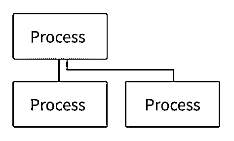

# 子流程模块:用 Python 包装程序

> 原文：<https://realpython.com/python-subprocess/>

如果你曾经想简化你的命令行脚本或者在命令行应用程序中使用 Python——或者任何相关的应用程序——那么 Python `subprocess`模块可以帮助你。从运行 shell 命令和命令行应用程序到启动 [GUI](https://en.wikipedia.org/wiki/Graphical_user_interface) 应用程序，Python `subprocess`模块可以提供帮助。

本教程结束时，您将能够:

*   理解 Python `subprocess`模块如何与**操作系统**交互
*   发布**外壳命令**，如`ls`或`dir`
*   将**输入**送入一个流程，并使用其**输出**。
*   使用`subprocess`时处理**错误**
*   通过考虑实际例子，理解`subprocess`的**用例**

在本教程中，在进入`subprocess`模块和[实验示例](#basic-usage-of-the-python-subprocess-module)之前，您将获得一个[高级心智模型](#processes-and-subprocesses)，用于理解流程、子流程和 Python。之后，您将开始探索 shell 并学习如何利用 Python 的`subprocess`和基于 [Windows](#basic-usage-of-subprocess-with-windows-shells) 和 [UNIX 的](#basic-usage-of-subprocess-with-unix-based-shells)shell 和系统。具体来说，您将涉及[与进程](#communication-with-processes)、[管道](#introduction-to-pipes)和[错误处理](#subprocess-exceptions)的通信。

**注意:** `subprocess`不是 GUI 自动化模块，也不是实现并发的一种方式。对于 GUI 自动化，你可能想看看 [PyAutoGUI](https://github.com/asweigart/pyautogui) 。关于并发性，请看一下本教程中与`subprocess` 相关的[模块部分。](#python-modules-associated-with-subprocess)

一旦你有了基础，你将会探索一些如何利用 Python 的`subprocess`的[实用想法](#practical-ideas)。您还将通过实验底层的`Popen()`构造函数来尝试 Python 的`subprocess`的[高级用法](#the-popen-class)。

**源代码:** [点击这里下载免费的源代码](https://realpython.com/bonus/python-subprocess-code/)，您将使用它来熟悉 Python `subprocess`模块。

## 流程和子流程

首先，您可能想知道为什么 Python `subprocess`模块名称中有一个`sub`。到底什么是过程呢？在本节中，您将回答这些问题。你将获得一个思考过程的高级心智模型。如果你已经熟悉了流程，那么你可能想直接跳到 Python `subprocess`模块的[基本用法。](#basic-usage-of-the-python-subprocess-module)

[*Remove ads*](/account/join/)

### 进程和操作系统

每当你使用计算机时，你总是在和程序互动。进程是操作系统对正在运行的程序的抽象。所以，使用计算机总是涉及到过程。开始菜单、应用程序栏、命令行解释器、文本编辑器、浏览器等等——每个应用程序都包含一个或多个进程。

一个典型的操作系统会报告数百甚至数千个正在运行的进程，稍后您将了解这些进程。然而，中央*处理*单元(CPU)通常只有少量内核，这意味着它们只能同时运行少量指令。因此，您可能想知道成千上万的进程是如何同时运行的。

简而言之，操作系统是一个了不起的多任务处理系统——它必须如此。CPU 是计算机的大脑，但它以[纳秒](https://en.wikipedia.org/wiki/Nanosecond)的时间尺度运行。计算机的大多数其他组件都比 CPU 慢得多。例如，一个磁性硬盘的读取时间比一个典型的 CPU 操作要长几千倍。

如果一个进程需要在硬盘上写东西，或者等待远程服务器的响应，那么 CPU 会在大部分时间处于空闲状态*。多任务处理让 CPU 忙个不停。*

操作系统在多任务处理方面如此出色的部分原因是它的组织性也非常好。操作系统在进程表或[进程控制块](https://en.wikipedia.org/wiki/Process_control_block)中跟踪进程。在这个表中，您会发现进程的[文件句柄](https://realpython.com/why-close-file-python/#in-short-files-are-resources-limited-by-the-operating-system)，安全上下文，对其[地址空间](https://en.wikipedia.org/wiki/Address_space)的引用，等等。

进程表允许操作系统随意放弃一个特定的进程，因为它拥有在以后返回并继续该进程所需的所有信息。一个进程在执行过程中可能会被中断成千上万次，但是操作系统总是会在返回时找到它停止的确切位置。

然而，一个操作系统不会启动成千上万个进程。你熟悉的许多过程都是由你开始的。在下一节中，您将研究一个进程的生命周期。

### 流程寿命

考虑如何从命令行启动 Python 应用程序。这是您的命令行*进程*启动 Python *进程*的一个实例:

[](https://files.realpython.com/media/Peek_2022-05-06_11-31.b24eb35f6ed0.gif)

启动另一个进程的进程被称为**父进程**，新进程被称为**子进程**。父进程和子进程通常独立运行。有时，子节点从父节点继承特定的资源或上下文。

正如您在[进程和操作系统](#processes-and-the-operating-system)中了解到的，关于进程的信息保存在一个表中。每个进程都跟踪其父进程，这使得进程层次结构可以表示为一棵树。在下一节的[中，您将探索您系统的流程树。](#active-processes-on-your-system)

**注意:**创建进程的精确机制因操作系统而异。简要概述一下，维基百科关于流程管理的文章中有一小段是关于[流程创建](https://en.wikipedia.org/wiki/Process_management_(computing)#Process_creation)的。

有关 Windows 机制的更多细节，请查看 win32 API 文档页面上的[创建进程](https://docs.microsoft.com/en-us/windows/win32/procthread/creating-processes)

在基于 UNIX 的系统上，通常通过使用 [`fork()`](https://man7.org/linux/man-pages/man2/fork.2.html) 复制当前进程，然后用 [`exec()`](https://man7.org/linux/man-pages/man3/exec.3.html) 系列函数之一替换子进程来创建进程。

流程及其子流程之间的父子关系并不总是相同的。有时这两个过程会共享特定的资源，比如输入和输出，但有时不会。有时子进程比父进程生存时间长。子进程比父进程长寿会导致[孤儿](https://en.wikipedia.org/wiki/Orphan_process)或[僵尸](https://en.wikipedia.org/wiki/Zombie_process)进程，尽管关于这些的更多讨论超出了本教程的范围。

当一个进程完成运行时，它通常会结束。每个进程在退出时都应该返回一个整数。这个整数被称为**返回码**或[退出状态](https://en.wikipedia.org/wiki/Exit_status)。零是成功的同义词，而任何其他值都被认为是失败。不同的整数可以用来表示进程失败的原因。

就像您可以从 Python 中的函数返回值一样，一旦进程退出，操作系统也希望它返回一个整数。这就是为什么规范的 [C](https://en.wikipedia.org/wiki/C_(programming_language)) `main()`函数通常返回一个整数:

```py
// minimal_program.c

int  main(){ return  0; }
```

这个例子显示了使用 [`gcc`](https://gcc.gnu.org/) 编译文件所需的最少 C 代码，并且没有任何警告。它有一个返回整数的`main()`函数。当这个程序运行时，操作系统将把它的执行解释为成功，因为它返回零。

那么，现在您的系统上正在运行哪些进程呢？在下一节中，您将探索一些可以用来查看系统进程树的工具。当可视化`subprocess`模块如何工作时，能够看到哪些进程正在运行以及它们是如何构造的将会很方便。

[*Remove ads*](/account/join/)

### 系统上的活动进程

您可能很想知道现在系统上正在运行什么进程。为此，您可以使用特定于平台的实用程序来跟踪它们:

*   [*视窗*](#windows-1)
**   [**Linux + macOS**](#linux-macos-1)

**有许多工具可用于 Windows，但有一个工具很容易设置，速度很快，并且会毫不费力地向您展示进程树，这就是 [Process Hacker](https://processhacker.sourceforge.io/) 。

您可以通过进入[下载页面](https://processhacker.sourceforge.io/downloads.php)或使用[巧克力来安装 Process Hacker](https://chocolatey.org/):

```py
PS> choco install processhacker
```

打开应用程序，您应该立即看到流程树。

PowerShell 可以使用的本地命令之一是 [`Get-Process`](https://docs.microsoft.com/en-us/powershell/module/microsoft.powershell.management/get-process) ，它在命令行中列出了活动的进程。`tasklist`是一个命令提示符实用程序，它也能做到这一点。

微软官方版本的 Process Hacker 是 [Sysinternals](https://docs.microsoft.com/en-us/sysinternals/) 工具的一部分，即[进程监视器](https://docs.microsoft.com/en-us/sysinternals/downloads/procmon)和[进程浏览器](https://docs.microsoft.com/en-us/sysinternals/downloads/process-explorer)。您还会得到 [PsList](https://docs.microsoft.com/en-us/sysinternals/downloads/pslist) ，这是一个命令行实用程序，类似于 UNIX 上的`pstree`。您可以通过进入[下载页面](https://docs.microsoft.com/en-us/sysinternals/downloads/)或使用 Chocolatey 来安装 Sysinternals:

```py
PS> choco install sysinternals
```

您也可以使用更基本但经典的[任务管理器](https://en.wikipedia.org/wiki/Task_Manager_(Windows))—通过按下 `Win` + `X` 并选择任务管理器来访问。

对于基于 UNIX 的系统，有许多命令行实用程序可供选择:

*   [`top`](https://man7.org/linux/man-pages/man1/top.1.html) :经典的进程和资源监视器，通常默认安装。一旦运行，要查看树视图，也叫森林视图，按 `Shift` + `V` 。森林视图可能无法在默认的 macOS `top`上运行。
*   [`htop`](https://htop.dev/) :更高级更人性化的`top`版本。
*   [`atop`](https://man7.org/linux/man-pages/man1/pcp-atop.1.html) :另一个版本的`top`，有更多的信息，但更具技术性。
*   [`bpytop`](https://pypi.org/project/bpytop/) :视觉效果不错的`top`的 Python 实现。
*   [`pstree`](https://en.wikipedia.org/wiki/Pstree) :专门探索流程树的实用程序。

在 macOS 上，您的实用程序中也有[活动监视器](https://support.apple.com/guide/activity-monitor/welcome/mac)应用程序。在查看菜单中，如果您选择*所有流程，分层次选择*，您应该能够看到您的流程树。

您还可以探索 Python [psutil](https://github.com/giampaolo/psutil) 库，它允许您在基于 Windows 和 UNIX 的系统上检索运行的进程信息。

跨系统的进程跟踪的一个通用属性是，每个进程都有一个**进程标识号**，或 **PID** ，这是一个唯一的整数，用于在操作系统的上下文中标识该进程。您会在上面列出的大多数实用程序中看到这个数字。

除了 PID 之外，通常还可以看到资源使用情况，比如特定进程正在使用的 [CPU](https://en.wikipedia.org/wiki/Central_processing_unit) 的百分比和 [RAM](https://en.wikipedia.org/wiki/Random-access_memory) 的数量。如果一个程序占用了你所有的资源，这就是你要找的信息。

进程的资源利用率对于开发或调试使用`subprocess`模块的脚本很有用，即使您不需要 PID，或者关于代码本身中进程正在使用什么资源的任何信息。在使用即将出现的示例时，考虑打开流程树的表示，以查看新流程的弹出。

现在，您已经对流程有了一个大致的了解。在整个教程中，您将深化您的心智模型，但现在是时候看看如何使用 Python `subprocess`模块启动您自己的流程了。

## Python `subprocess`模块概述

Python `subprocess`模块用于启动子流程。这些进程可以是从 GUI 应用程序到 shell 的任何东西。流程的父子关系就是`subprocess`名称中的**子**的来源。当您使用`subprocess`时，Python 是创建新的子流程的父流程。新的子进程是什么，由您决定。

Python `subprocess`最初是[为 Python 2.4 提出并接受](https://peps.python.org/pep-0324/)作为使用 [`os`模块](https://docs.python.org/3/library/os.html)的替代方案。一些有文档记录的更改发生在 3.8 之后。本文中的例子是用 Python 3.10.4 测试的，但是你只需要 3.8+就可以完成本教程。

你与 Python `subprocess`模块的大部分交互将通过 [`run()`](https://docs.python.org/3/library/subprocess.html#subprocess.run) 函数来完成。这个[阻塞](https://en.wikipedia.org/wiki/Blocking_(computing))功能将启动一个进程，*等待*直到新进程退出，然后继续。

[文档](https://docs.python.org/3/library/subprocess.html#using-the-subprocess-module)推荐使用`run()`来处理它能处理的所有情况。对于需要更多控制的边缘情况，可以使用 [`Popen`](https://docs.python.org/3/library/subprocess.html#subprocess.Popen) 类。`Popen`是整个`subprocess`模块的底层类。`subprocess`模块中的所有函数都是围绕`Popen()`构造函数及其实例方法的便利包装器。在本教程快结束的时候，你将[深入](#the-popen-class)到`Popen`类。

**注意:**如果你正试图决定你是否需要`subprocess`，看看[上决定你的任务](#use-cases-for-the-shell-and-subprocess)是否需要`subprocess`的部分。

你可能会遇到其他类似[`call()`](https://docs.python.org/3/library/subprocess.html#subprocess.call)[`check_call()`](https://docs.python.org/3/library/subprocess.html#subprocess.check_call)[`check_output()`](https://docs.python.org/3/library/subprocess.html#subprocess.check_output)的函数，但这些都属于 Python 3.5 及更早版本的更老的`subprocess` [API](https://en.wikipedia.org/wiki/API) 。这三个函数所做的一切都可以用新的`run()`函数来复制。旧的 API 主要是为了向后兼容，在本教程中不会涉及。

在`subprocess`模块中也有相当多的冗余，这意味着有各种方法来实现相同的最终目标。在本教程中，您不会探索所有的变化。不过，你会发现，一些强健的技术应该会让你走在正确的道路上。

## Python `subprocess`模块的基本用法

在这一节中，您将看到一些演示`subprocess`模块用法的最基本的例子。您将从探索一个带有`run()`函数的基本命令行定时器程序开始。

如果您想按照示例进行操作，那么创建一个新文件夹。所有的例子和程序都可以保存在这个文件夹中。在命令行中导航到这个新创建的文件夹，为后面的示例做准备。本教程中的所有代码都是标准的 Python 库——不需要外部依赖——所以不需要虚拟环境。

[*Remove ads*](/account/join/)

### 定时器示例

为了掌握 Python `subprocess`模块，您将需要一个运行和试验的基本程序。为此，您将使用一个用 Python 编写的程序:

```py
# timer.py

from argparse import ArgumentParser
from time import sleep

parser = ArgumentParser()
parser.add_argument("time", type=int)
args = parser.parse_args()
print(f"Starting timer of {args.time} seconds")
for _ in range(args.time):
    print(".", end="", flush=True)
    sleep(1)
print("Done!")
```

计时器程序使用 [`argparse`](https://realpython.com/command-line-interfaces-python-argparse/) 接受一个整数作为参数。整数代表定时器在退出前应该等待的秒数，程序使用 [`sleep()`](https://realpython.com/python-sleep/) 来实现。它将播放一个小动画，代表过去的每一秒，直到它退出:

[https://player.vimeo.com/video/715636109?background=1](https://player.vimeo.com/video/715636109?background=1)

这并不多，但关键是它作为一个跨平台的进程运行了几秒钟，你可以很容易地修补。您将使用`subprocess`调用它，就好像它是一个单独的可执行文件。

**注意**:用 Python `subprocess`模块调用 *Python* 程序没有多大意义——通常不需要其他 Python 模块在单独的进程中，因为你可以直接[导入](https://realpython.com/python-modules-packages/)它们。

对于本教程中的大多数示例，您将使用 Python 程序的主要原因是它们是跨平台的，并且您很可能已经安装了 Python！

您可能会认为启动一个新的进程是实现[并发](https://en.wikipedia.org/wiki/Concurrency_(computer_science))的一个好方法，但这不是`subprocess`模块的预期用例。也许你需要的是其他致力于[并发](https://realpython.com/python-concurrency/)的 Python 模块，在[后面的章节](#python-modules-associated-with-subprocess)中会有介绍。

`subprocess`模块主要用于调用 Python 之外的*和*程序。但是，如您所见，如果您愿意，也可以调用 Python！有关`subprocess`用例的更多讨论，请查看[部分](#use-cases-for-the-shell-and-subprocess)，其中对此进行了更深入的讨论，或者稍后的[示例之一](#creating-a-new-project-an-example)。

好了，准备好开始吧！一旦准备好`timer.py`程序，打开一个 Python [交互会话](https://realpython.com/interacting-with-python/)，用`subprocess`调用计时器:

>>>

```py
>>> import subprocess
>>> subprocess.run(["python", "timer.py", "5"])
Starting timer of 5 seconds
.....Done!
CompletedProcess(args=['python', 'timer.py', '5'], returncode=0)
```

使用这段代码，您应该已经看到了在 REPL 中播放的动画。您导入了`subprocess`,然后调用了`run()`函数，将字符串列表作为惟一的参数。这是`run()`功能的`args`参数。

在执行`run()`时，定时器进程开始，您可以实时看到它的输出。一旦完成，它返回一个 [`CompletedProcess`](https://docs.python.org/3/library/subprocess.html#subprocess.CompletedProcess) 类的实例。

在命令行上，您可能习惯于用单个字符串启动程序:

```py
$ python timer.py 5
```

然而，使用`run()`，您需要将命令作为一个序列传递，如`run()`示例所示。序列中的每一项都代表一个[令牌](https://en.wikipedia.org/wiki/Lexical_analysis#Token)，用于系统调用来启动一个新的进程。

**注意:**调用`run()`不同于在命令行上调用程序。`run()`函数发出一个[系统调用](https://en.wikipedia.org/wiki/System_call)，放弃了对 shell 的需求。您将在后面的[部分](#introduction-to-the-shell-and-text-based-programs-with-subprocess)中讨论与 shell 的交互。

Shells 通常会进行自己的标记化，这就是为什么您只需在命令行上将命令写成一个长字符串。但是，使用 Python `subprocess`模块，您必须手动将命令分解成标记。例如，可执行文件的名称、标志和参数都是一个令牌。

**注意**:如果你需要，你可以使用 [`shlex`](https://docs.python.org/3/library/shlex.html) 模块来帮助你，只是要记住它是为 [POSIX 兼容](https://en.wikipedia.org/wiki/POSIX#POSIX-oriented_operating_systems)系统设计的，可能在 Windows 环境下不能很好地工作:

>>>

```py
>>> import shlex
>>> shlex.split("python timer.py 5")
['python', 'timer.py', '5']

>>> subprocess.run(shlex.split("python timer.py 5"))
Starting timer of 5 seconds
.....Done!
CompletedProcess(args=['python', 'timer.py', '5'], returncode=0)
```

`split()`函数将一个典型的命令分成所需的不同令牌。当不清楚如何分割具有特殊字符(如空格)的更复杂的命令时，`shlex`模块可以派上用场:

>>>

```py
>>> shlex.split("echo 'Hello, World!'")
['echo', 'Hello, World!']
```

您会注意到，包含空格的消息被保存为单个标记，不再需要额外的引号。外壳上额外的引号用于将令牌分组在一起，但是因为`subprocess`使用序列，所以应该将哪些部分解释为一个令牌总是很明确的。

现在您已经熟悉了使用 Python `subprocess`模块启动新进程的一些基本知识，接下来您将看到您可以运行*任何*类型的进程，而不仅仅是 Python 或基于文本的程序。

### 使用`subprocess`运行任何应用

有了`subprocess`，你不再局限于基于文本的应用程序，比如 shell。只要您知道想要运行的程序的确切名称或路径，您就可以使用“开始”菜单或应用程序栏调用任何应用程序:

*   [*视窗*](#windows-2)
**   [*Linux*](#linux-2)**   [*macOS*](#macos-2)**

***>>>

```py
>>> subprocess.run(["notepad"])
CompletedProcess(args=['notepad'], returncode=0)
```

>>>

```py
>>> subprocess.run(["gedit"])
CompletedProcess(args=['gedit'], returncode=0)
```

根据您的 Linux 发行版，您可能有不同的文本编辑器，比如`kate`、`leafpad`、`kwrite`或`enki`。

>>>

```py
>>> subprocess.run(["open", "-e"])
CompletedProcess(args=['open', '-e'], returncode=0)
```

这些命令应该会打开一个文本编辑器窗口。通常`CompletedProcess`不会被返回，直到你关闭编辑器窗口。然而，在 macOS 的情况下，因为你需要运行启动器进程 [`open`](https://ss64.com/osx/open.html) 来启动[文本编辑](https://support.apple.com/guide/textedit/welcome/mac)，`CompletedProcess`会立即返回。

启动器进程负责启动一个特定的进程，然后结束。有时程序，如网络浏览器，内置了这些功能。启动器进程的机制超出了本教程的范围，但是可以说它们能够操纵操作系统的进程树来重新分配父子关系。

**注意:**有许多问题你可能一开始会找`subprocess`来解决，但之后你会找到一个特定的模块或库来帮你解决。这倾向于成为`subprocess`的主题，因为它是一个相当低级的实用程序。

你可能想用`subprocess`做的事情的一个例子是打开一个网页浏览器到一个特定的页面。然而，为此，最好使用 Python 模块 [`webbrowser`](https://docs.python.org/3/library/webbrowser.html) 。`webbrowser`模块使用`subprocess`，但是处理你可能遇到的所有挑剔的跨平台和浏览器差异。

话又说回来，`subprocess`可能是一个非常有用的工具，可以快速完成某件事。如果你不需要一个完整的库，那么`subprocess`可以成为你的[瑞士军刀](https://en.wikipedia.org/wiki/Swiss_Army_knife)。这完全取决于您的用例。关于这个话题的更多讨论将在[晚些时候](#use-cases-for-the-shell-and-subprocess)进行。

您已经使用 Python 成功启动了新流程！这是最基本的。接下来，您将仔细查看从`run()`返回的`CompletedProcess`对象。

[*Remove ads*](/account/join/)

### `CompletedProcess`对象

当您使用`run()`时，返回值是`CompletedProcess`类的一个实例。顾名思义，`run()`只在子进程结束后返回对象。它有各种有用的属性，比如用于流程的`args`和`returncode`。

为了清楚地看到这一点，您可以将`run()`的结果赋给一个变量，然后访问它的属性，例如`.returncode`:

>>>

```py
>>> import subprocess
>>> completed_process = subprocess.run(["python", "timer.py"])
usage: timer.py [-h] time
timer.py: error: the following arguments are required: time

>>> completed_process.returncode
2
```

该流程有一个指示失败的返回代码，但是它**没有引发[异常](https://realpython.com/python-exceptions/)T5】。通常，当一个`subprocess`进程失败时，您总是希望引发一个异常，这可以通过传入一个`check=True`参数来实现:**

>>>

```py
>>> completed_process = subprocess.run(
...     ["python", "timer.py"],
...     check=True ... )
...
usage: timer.py [-h] time
timer.py: error: the following arguments are required: time
Traceback (most recent call last):
  ...
subprocess.CalledProcessError: Command '['python', 'timer.py']' returned
 non-zero exit status 2.
```

有各种各样的方法来处理失败，其中一些将在下一节中介绍。现在需要注意的重要一点是，如果进程失败，`run()`不一定会引发异常，除非您已经传入了一个`check=True`参数。

`CompletedProcess`还有一些与[输入/输出(I/O)](https://en.wikipedia.org/wiki/Input/output) 相关的属性，您将在[与进程通信](#communication-with-processes)一节中更详细地介绍这些属性。不过，在与进程通信之前，您将学习如何在使用`subprocess`编码时处理错误。

## `subprocess`异常情况

正如您之前看到的，即使一个进程退出并返回一个代表失败的代码，Python 也不会引发异常。对于`subprocess`模块的大多数用例来说，这并不理想。如果一个过程失败了，你通常会想办法处理它，而不仅仅是继续下去。

许多`subprocess`用例涉及到简短的个人脚本，你可能不会花太多时间，或者至少[不应该在](https://xkcd.com/1319/)上花太多时间。如果你正在修改这样的脚本，那么你会希望`subprocess`尽早失败。

### `CalledProcessError`为非零退出代码

如果一个进程返回一个非零的退出代码，你应该把它解释为一个失败的进程。与您可能期望的相反，Python 模块`subprocess`不会*而*会在非零退出代码时自动引发异常。一个失败的进程通常不是你希望你的程序悄悄忽略的，所以你可以传递一个`check=True`参数给`run()`来引发一个异常:

>>>

```py
>>> completed_process = subprocess.run(
...     ["python", "timer.py"],
...     check=True ... )
...
usage: timer.py [-h] time
timer.py: error: the following arguments are required: time
Traceback (most recent call last):
  ...
subprocess.CalledProcessError: Command '['python', 'timer.py']' returned
 non-zero exit status 2.
```

一旦子流程运行到非零返回代码，就会引发`CalledProcessError`。如果你正在开发一个简短的个人脚本，那么这可能对你来说已经足够好了。如果您想更优雅地处理错误，那么请继续阅读关于[异常处理](#an-example-of-exception-handling)的章节。

需要记住的一点是,`CalledProcessError`并不适用于可能会无限期挂起和阻塞您的执行的进程。为了防止这种情况，您需要利用`timeout`参数。

### `TimeoutExpired`对于耗时过长的过程

有时进程表现不佳，它们可能花费太长时间或无限期挂起。为了处理这些情况，使用`run()`函数的`timeout`参数总是一个好主意。

向`run()`传递一个`timeout=1`参数将导致该函数关闭进程，并在一秒钟后引发一个`TimeoutExpired`错误:

>>>

```py
>>> import subprocess
>>> subprocess.run(["python", "timer.py", "5"], timeout=1)
Starting timer of 5 seconds
.Traceback (most recent call last):
 ...
subprocess.TimeoutExpired: Command '['python', 'timer.py', '5']' timed out
 after 1.0 seconds
```

在本例中，输出了计时器动画的第一个点，但是子流程在完成之前关闭了。

另一种可能发生的错误是，该程序在特定系统上不存在，这引发了最后一种错误。

[*Remove ads*](/account/join/)

### `FileNotFoundError`对于不存在的程序

您将看到的最后一种异常是`FileNotFoundError`，如果您试图调用目标系统上不存在的程序，就会引发该异常:

>>>

```py
>>> import subprocess
>>> subprocess.run(["now_you_see_me"])
Traceback (most recent call last):
  ...
FileNotFoundError: The system cannot find the file specified
```

这种类型的错误无论如何都会出现，所以您不需要为`FileNotFoundError`传递任何参数。

这些是您在使用 Python `subprocess`模块时会遇到的主要异常。对于许多用例，知道异常并确保使用`timeout`和`check`参数就足够了。这是因为如果子流程失败了，那么这通常意味着您的脚本失败了。

然而，如果您有一个更复杂的程序，那么您可能希望更优雅地处理错误。例如，您可能需要在很长一段时间内调用许多进程。为此，您可以使用 [`try` … `except`](https://realpython.com/python-exceptions/#the-try-and-except-block-handling-exceptions) 结构。

### 异常处理的例子

这里有一段代码展示了使用`subprocess`时需要处理的主要异常:

```py
import subprocess

try:
    subprocess.run(
        ["python", "timer.py", "5"], timeout=10, check=True
    )
except FileNotFoundError as exc:
    print(f"Process failed because the executable could not be found.\n{exc}")
except subprocess.CalledProcessError as exc:
    print(
        f"Process failed because did not return a successful return code. "
        f"Returned {exc.returncode}\n{exc}"
    )
except subprocess.TimeoutExpired as exc:
    print(f"Process timed out.\n{exc}")
```

这个片段向您展示了如何处理由`subprocess`模块引发的三个主要异常的示例。

既然您已经使用了基本形式的`subprocess`并处理了一些异常，那么是时候熟悉如何与 shell 交互了。

## 用`subprocess` 介绍 Shell 和基于文本的程序

`subprocess`模块的一些最受欢迎的用例是与基于文本的程序交互，通常在 shell 上可用。这就是为什么在这一节中，您将开始探索与基于文本的程序交互时涉及的所有活动部分，并且可能会问您是否需要 shell！

shell 通常与[命令行界面](https://en.wikipedia.org/wiki/Command-line_interface)或 CLI 同义，但这个术语并不完全准确。实际上有两个独立的过程构成了典型的命令行体验:

1.  解释器，通常被认为是整个 CLI。常见的解释器是 Linux 上的 Bash、macOS 上的 Zsh 或 Windows 上的 PowerShell。在本教程中，解释器将被称为外壳。
2.  **界面**，在窗口中显示解释器的输出，并将用户的按键发送给解释器。该接口是一个独立于外壳的进程，有时被称为[终端模拟器](https://en.wikipedia.org/wiki/Terminal_emulator)。

当在命令行上时，通常认为您是在直接与 shell 交互，但实际上您是在与*接口*交互。该接口负责将您的命令发送到 shell，并将 shell 的输出显示给您。

记住这个重要的区别，是时候把你的注意力转向`run()`实际上在做什么了。人们通常认为调用`run()`在某种程度上与在终端界面中键入命令是一样的，但是有重要的区别。

虽然所有的新进程都是用相同的[系统调用](https://en.wikipedia.org/wiki/System_call)创建的，但是进行系统调用的上下文是不同的。`run()`函数可以直接进行系统调用，而不需要通过 shell 来实现:

[https://player.vimeo.com/video/715635882?background=1](https://player.vimeo.com/video/715635882?background=1)

事实上，许多被认为是外壳程序的程序，比如 [Git](https://git-scm.com/) ，实际上只是不需要外壳就能运行的*基于文本的*程序。在 UNIX 环境中尤其如此，所有熟悉的实用程序如`ls`、`rm`、`grep`和`cat`实际上都是可以直接调用的独立的可执行文件:

>>>

```py
>>> # Linux or macOS
>>> import subprocess
>>> subprocess.run(["ls"])
timer.py
CompletedProcess(args=['ls'], returncode=0)
```

但是，有一些工具是专门针对 shells 的。在像 PowerShell 这样的 Windows Shells 中，查找嵌入到 shell 中的工具要常见得多，像`ls`这样的命令是 shell 本身的*部分，而不是像在 UNIX 环境中那样单独的可执行文件:*

>>>

```py
>>> # Windows
>>> import subprocess
>>> subprocess.run(["ls"])
Traceback (most recent call last):
  ...
FileNotFoundError: [WinError 2] The system cannot find the file specified
```

在 PowerShell 中，`ls`是`Get-ChildItem`的默认别名，但是调用它也不行，因为`Get-ChildItem`不是一个单独的可执行文件——它是 PowerShell 本身的*部分。*

许多基于文本的程序可以独立于 shell 运行，这一事实可能会让您想知道是否可以省去中间过程——即 shell——并直接将`subprocess`用于通常与 shell 相关联的基于文本的程序。

[*Remove ads*](/account/join/)

### 用例为外壳`subprocess`和

您可能希望用`Python`子进程模块调用 shell 有几个常见原因:

*   当您知道某些命令只能通过 shell 使用时，这在 Windows 中更常见
*   当您有使用特定 shell 编写 shell 脚本的经验时，您会希望在主要使用 Python 的同时利用您的能力来完成某些任务
*   当您继承了一个大型 shell 脚本，该脚本可能做 Python 做不到的事情，但是用 Python 重新实现需要很长时间

这不是一个详尽的列表！

您可以使用 shell 来包装程序或进行一些文本处理。然而，与 Python 相比，语法可能非常晦涩。使用 Python，文本处理工作流更容易编写，更容易维护，[通常更具性能](https://stackoverflow.com/a/4493209/10445017)，并且可以跨平台启动。所以很值得考虑不带壳去。

然而，经常发生的情况是，您没有时间或者不值得花力气用 Python 重新实现现有的 shell 脚本。在这种情况下，将`subprocess`用于一些[松散的 Python](https://www.youtube.com/watch?v=Jd8ulMb6_ls) 并不是一件坏事！

使用`subprocess`本身的常见原因本质上类似于使用带有`subprocess`的 shell:

*   当你不得不使用或分析一个[黑盒](https://en.wikipedia.org/wiki/Black_box)，甚至一个[白盒](https://en.wikipedia.org/wiki/White_box_(software_engineering))
*   当您需要一个应用程序的包装器时
*   当您需要启动另一个应用程序时
*   作为基本 shell 脚本的替代方案

**注意:**[黑盒](https://en.wikipedia.org/wiki/Black_box)可能是一个可以免费使用的程序，但是它的源代码是不可用的，所以没有办法知道它到底做了什么，也没有办法修改它的内部。

类似地，[白盒](https://en.wikipedia.org/wiki/White_box_(software_engineering))可以是一个程序，它的源代码是可用的，但不能被修改。它也可能是一个你可以改变其源代码的程序，但是它的复杂性意味着你要花很长时间才能理解它并能够改变它。

在这些情况下，你可以使用`subprocess`来包装不同透明度的盒子，绕过任何改变或重新实现 Python 的需要。

通常你会发现对于`subprocess`用例，会有一个专用的库来完成这个任务。在本教程的后面，您将研究一个创建 Python 项目的[脚本，该脚本包含一个](#creating-a-new-project-an-example)[虚拟环境](https://realpython.com/python-virtual-environments-a-primer/)和一个完全初始化的 [Git](https://realpython.com/python-git-github-intro/) 存储库。然而， [Cookiecutter](https://github.com/cookiecutter/cookiecutter) 和 [Copier](https://copier.readthedocs.io/) 库已经存在。

即使特定的库可能能够完成你的任务，用`subprocess`做一些事情仍然是值得的。首先，对你来说，执行你已经知道如何做的事情可能比学习一个新的库要快得多。

此外，如果您正在与朋友或同事共享这个脚本，那么如果您的脚本是纯 Python 的，没有任何其他依赖性，尤其是如果您的脚本需要在服务器或嵌入式系统这样的最小环境中运行，这将非常方便。

然而，如果您使用`subprocess`而不是`pathlib`来读写 Bash 中的一些文件，您可能需要考虑学习如何使用 Python 来[读写](https://realpython.com/read-write-files-python/)。学习如何读写文件并不需要很长时间，对于这样一个普通的任务来说，这绝对是值得的。

至此，是时候熟悉基于 Windows 和 UNIX 的系统上的 shell 环境了。

### 基于 UNIX 的 shell中`subprocess`的基本用法

要使用`run()`运行 shell 命令，`args`应该包含您想要使用的 shell、指示您想要它运行特定命令的标志，以及您要传入的命令:

>>>

```py
>>> import subprocess
>>> subprocess.run(["bash", "-c", "ls /usr/bin | grep pycode"])
pycodestyle
pycodestyle-3
pycodestyle-3.10
CompletedProcess(args=['bash', '-c', 'ls /usr/bin | grep pycode'], returncode=0)
```

这里演示了一个常见的 shell 命令。它使用通过管道传输到`grep`的`ls`来过滤一些条目。对于这种操作，shell 非常方便，因为您可以利用管道操作符(`|`)。稍后你将更详细地介绍管道。

你可以用你选择的外壳替换`bash`。`-c`标志代表*命令*，但是根据您使用的 shell 可能会有所不同。这几乎与添加`shell=True`参数时发生的情况完全相同:

>>>

```py
>>> subprocess.run(["ls /usr/bin | grep pycode"], shell=True)
pycodestyle
pycodestyle-3
pycodestyle-3.10
CompletedProcess(args=['ls /usr/bin | grep pycode'], returncode=0)
```

`shell=True`参数在幕后使用`["sh", "-c", ...]`，所以它几乎相当于前面的例子。

**注意:**在基于 UNIX 的系统上，`sh` shell 传统上是 [Bourne shell](https://en.wikipedia.org/wiki/Bourne_shell) 。也就是说，Bourne shell 现在已经相当老了，所以许多操作系统都使用`sh`作为链接到 [Bash](https://www.gnu.org/software/bash/) 或 [Dash](https://en.wikipedia.org/wiki/Almquist_shell#dash) 。

这通常不同于与您交互的终端界面所使用的 shell。例如，从 macOS Catalina 开始，你会在命令行应用上发现的默认 shell 已经从 Bash 变成了 [Zsh](https://www.zsh.org/) ，然而`sh`仍然经常指向 Bash。同样，在 Ubuntu 上，`sh`指向 Dash，但是您通常在命令行应用程序上与之交互的默认仍然是 Bash。

因此，在您的系统上调用`sh`可能会产生与本教程中不同的 shell。尽管如此，这些例子应该仍然有效。

你会注意到，`"-c"`后面的符号应该是一个包含所有空格的符号。在这里，您将控制权交给 shell 来解析命令。如果要包含更多的标记，这将被解释为传递给 shell 可执行文件的更多选项，而不是在 shell 中运行的附加命令。

[*Remove ads*](/account/join/)

### Windows shell中`subprocess`的基本用法

在这一节中，您将介绍在 Windows 环境中使用`subprocess`shell 的基本方法。

要使用`run()`运行 shell 命令，`args`应该包含您想要使用的 shell、指示您想要它运行特定命令的标志，以及您要传入的命令:

>>>

```py
>>> import subprocess
>>> subprocess.run(["pwsh", "-Command", "ls C:\RealPython"])

 Directory: C:\RealPython

Mode                 LastWriteTime         Length Name
----                 -------------         ------ ----
-a---            09/05/22    10:41            237 basics.py
-a---            18/05/22    17:28            486 hello_world.py

CompletedProcess(args=['pwsh', '-Command', 'ls'], returncode=0)
```

注意`pwsh`和`pwsh.exe`都是工作的。如果你没有 PowerShell Core，那么你可以调用`powershell`或者`powershell.exe`。

你会注意到，`"-Command"`后面的符号应该是一个包含所有空格的符号。在这里，您将控制权交给 shell 来解析命令。如果要包含更多的标记，这将被解释为传递给 shell 可执行文件的更多选项，而不是在 shell 中运行的附加命令。

如果需要命令提示符，那么可执行文件是`cmd`或`cmd.exe`，表示后面的令牌是命令的标志是`/c`:

>>>

```py
>>> import subprocess
>>> subprocess.run(["cmd", "/c", "dir C:\RealPython"])
 Volume in drive C has no label.
 Volume Serial Number is 0000-0000

 Directory of C:\RealPython

30/03/22  23:01    <DIR>          .
30/03/22  23:01    <DIR>          ..
09/05/22  10:41               237 basics.py
18/05/22  17:28               486 hello_world.py
```

最后一个例子完全等同于用`shell=True`调用`run()`。换句话说，使用`shell=True`参数就像将`"cmd"`和`"/c"`添加到您的参数列表中。

**注意:** Windows 的发展与基于 UNIX 的系统有很大不同。最广为人知的 shell 是 Windows [命令提示符](https://en.wikipedia.org/wiki/Cmd.exe)，它现在是一个遗留的 shell。命令提示符是为了模拟 Windows [之前的 MS-DOS](https://en.wikipedia.org/wiki/MS-DOS) 环境。许多 shell 脚本或批处理`.bat`脚本就是为这种环境编写的，它们至今仍在使用。

带有`Shell`参数的`run()`函数几乎总是使用命令提示符结束。`subprocess`模块使用 Windows [`COMSPEC`](https://en.wikipedia.org/wiki/COMSPEC) 环境变量，该变量在几乎所有情况下都会指向命令提示符`cmd.exe`。到目前为止，有如此多的程序将`COMSPEC`等同于`cmd.exe`，以至于改变它会在意想不到的地方造成很多破坏！所以一般不建议换`COMSPEC`。

此时，您应该知道一个重要的安全问题，如果您的 Python 程序中有面向用户的元素，不管是什么操作系统，您都应该注意这个问题。这是一个不仅限于`subprocess`的漏洞。相反，它可以用于许多不同的领域。

### 安全警告

如果在任何时候你计划获取用户输入并以某种方式将其转换为对`subprocess`的调用，那么你必须非常小心[注入](https://en.wikipedia.org/wiki/Code_injection)攻击。也就是说，要考虑到潜在的恶意行为者。如果你只是让人们在你的机器上运行代码，有很多方法会导致混乱。

举一个非常简单的例子，您获取用户输入，未经过滤就将其发送到在 shell 上运行的子流程:

*   [*视窗*](#windows-3)
**   [**Linux + macOS**](#linux-macos-3)*

```py
# unsafe_program.py

import subprocess

# ...

subprocess.run(["pwsh", "-Command", f"ls {input()}"])

# ...
```

```py
# unsafe_program.py

import subprocess

# ...

subprocess.run(["bash", "-c", f"ls {input()}"])

# ...
```

你可以想象预期的用例是包装`ls`并向其添加一些东西。所以预期的用户行为是提供一个类似`"/home/realpython/"`的路径。然而，如果恶意行为者意识到发生了什么，他们几乎可以执行任何他们想要的代码。举下面的例子，但是**要小心这个**:

*   [*视窗*](#windows-4)
**   [**Linux + macOS**](#linux-macos-4)

**> `C:\RealPython; echo 'You could've been hacked: rm -Recurse -Force C:\'`

> `/home/realpython/; echo 'You could've been hacked: rm -rf /*'`

再次，**当心**！这些看起来无辜的行可以尝试删除系统上的一切！在这种情况下，恶意部分在引号中，所以它不会运行，但是如果引号不在那里，您就有麻烦了。这样做的关键部分是用相关的标志调用`rm`来递归地删除所有文件、文件夹和子文件夹，它将强制删除完成。通过添加分号，它可以将`echo`和潜在的`rm`作为完全独立的命令运行，分号充当命令分隔符，允许通常多行代码在一行上运行。

运行这些恶意命令会对文件系统造成不可修复的损坏，并且需要重新安装操作系统。所以，要小心！

幸运的是，操作系统不允许你对一些特别重要的文件这样做。在基于 UNIX 的系统中，`rm`命令需要使用 [`sudo`](https://en.wikipedia.org/wiki/Sudo) ，或者在 Windows 中以管理员身份运行才能完全成功地破坏。不过，该命令在停止之前可能会删除很多重要的内容。

所以，确保如果你正在动态地构建用户输入来馈入一个`subprocess`调用，那么你要非常小心！有了这个警告，接下来您将讨论如何使用命令的输出和将命令链接在一起——简而言之，如何在进程启动后与它们进行通信。

[*Remove ads*](/account/join/)

## 与进程的通信

您已经使用了`subprocess`模块来执行程序并向 shell 发送基本命令。但是仍然缺少一些重要的东西。对于许多您可能希望使用`subprocess`的任务，您可能希望稍后在 Python 代码中动态发送输入或使用输出。

为了与您的流程进行通信，您首先应该了解一些关于流程一般是如何通信的，然后您将看两个例子来理解这些概念。

### 标准输入/输出流

一个[流](https://en.wikipedia.org/wiki/Stream_(computing))在最基本的情况下代表了一系列的元素，这些元素并不是一次都可用的。当你[从一个文件](https://realpython.com/working-with-files-in-python/)中读取字符和行时，你正在以文件对象的形式处理一个流，它最基本的是一个[文件描述符](https://realpython.com/why-close-file-python/#in-short-files-are-resources-limited-by-the-operating-system)。文件描述符通常用于流。所以，术语*流*、*文件*和*类文件*互换使用并不罕见。

当进程初始化时，有三个特殊的流供进程使用。流程执行以下操作:

1.  读取输入的`stdin`
2.  写入`stdout`以获得通用输出
3.  写入`stderr`进行错误报告

这些是[标准流](https://en.wikipedia.org/wiki/Standard_streams)——用于进程通信的跨平台模式。

有时子进程从父进程继承这些流。当您在 REPL 中使用`subprocess.run()`并能够看到命令的输出时，就会发生这种情况。Python 解释器的`stdout`由子流程继承。

当您在 REPL 环境中时，您会看到一个命令行界面过程，包括三个标准 I/O 流。该接口有一个 shell 进程作为子进程，它本身有一个 Python REPL 作为子进程。在这种情况下，除非您另外指定，`stdin`来自键盘，而`stdout`和`stderr`显示在屏幕上。接口、外壳和 REPL 共享流:

[](https://files.realpython.com/media/2022-05-31_17_26_47-process__Figma.f98ed0f101b2.png)

您可以将标准 I/O 流视为字节分配器。子流程填充`stdout`和`stderr`，你填充`stdin`。然后你读取`stdout`和`stderr`中的字节，子进程从`stdin`读取。

与分配器一样，您可以在`stdin`链接到子进程之前存储它。当需要时，子进程将从`stdin`中读取数据。但是，一旦进程从流中读取数据，字节就会被分配。你不能回头再读一遍:

[https://player.vimeo.com/video/715635931?background=1](https://player.vimeo.com/video/715635931?background=1)

这三个流或文件是与您的进程通信的基础。在下一节中，您将通过获得一个幻数生成器程序的输出开始看到这一点。

### 幻数生成器示例

通常，当使用`subprocess`模块时，您会希望将输出用于某些事情，而不仅仅是像您到目前为止所做的那样显示输出。在这一节中，您将使用一个幻数生成器来输出一个幻数。

想象一下，幻数生成器是某个晦涩难懂的程序，一个黑匣子，在你的工作岗位上由几代[系统管理员](https://xkcd.com/705/)继承而来。它输出一个你秘密计算所需的幻数。您将从`subprocess`的`stdout`中读取并在您的包装 Python 程序中使用它:

```py
# magic_number.py

from random import randint

print(randint(0, 1000))
```

好吧，没那么神奇。也就是说，你感兴趣的不是这个神奇的数字生成器——有趣的是与一个带有`subprocess`的假想黑盒进行交互。为了获取数字生成器的输出供以后使用，您可以向`run()`传递一个`capture_output=True`参数:

>>>

```py
>>> import subprocess
>>> magic_number_process = subprocess.run(
...     ["python", "magic_number.py"], capture_output=True
... )
>>> magic_number_process.stdout
b'769\n'
```

将`True`的一个`capture_output`参数传递给`run()`使得流程的输出在已完成的流程对象的`.stdout`属性中可用。你会注意到它是作为一个[字节对象](https://docs.python.org/3/library/stdtypes.html#bytes-objects)返回的，所以在读取它的时候需要注意[编码](#the-decoding-of-standard-streams)。

还要注意的是，`CompletedProcess`的`.stdout`属性不再是一个流。该流已经被读取，并作为字节对象存储在`.stdout`属性中。

有了输出，您可以使用多个子流程来获取值，并在代码中对它们进行操作:

>>>

```py
>>> import subprocess
>>> sum(
...     int(
...         subprocess.run(
...             ["python", "magic_number.py"], capture_output=True
...         ).stdout
...     )
...     for _ in range(2)
... )
1085
```

在本例中，您启动了两个幻数进程，获取两个幻数，然后将它们相加。目前，您依赖于由`int()`构造函数对 bytes 对象的自动解码。不过，在下一节中，您将学习如何显式解码和编码。

[*Remove ads*](/account/join/)

### 标准流的解码

进程以字节为单位进行通信，你有几种不同的方法来处理这些字节的编码和解码。在表面之下，`subprocess`有几种进入 [*文本模式*](https://github.com/python/cpython/blob/3.10/Lib/subprocess.py#L849) 的方法。

*文本模式*意味着`subprocess`将尝试处理编码本身。为此，它需要知道使用什么字符编码。在`subprocess`中，大多数选项都会尝试使用默认编码。然而，你通常[想要明确使用什么编码](https://peps.python.org/pep-0597/#using-the-default-encoding-is-a-common-mistake)来防止将来很难发现的错误。

您可以为 Python 传递一个`text=True`参数来使用默认编码处理编码。但是，如前所述，使用`encoding`参数显式指定编码总是更安全，因为并非所有系统都使用*几乎*通用 [UTF-8](https://en.wikipedia.org/wiki/UTF-8) :

>>>

```py
>>> magic_number_process = subprocess.run(
...     ["python", "magic_number.py"], capture_output=True, encoding="utf-8"
... )
...
>>> magic_number_process.stdout
'647\n'
```

如果在*文本模式*下，`CompletedProcess`上的`.stdout`属性现在是一个字符串而不是一个字节对象。

您还可以通过直接调用`stdout`属性上的`.decode()`方法来解码返回的字节，根本不需要*文本模式*:

>>>

```py
>>> magic_number_process = subprocess.run(
...     ["python", "magic_number.py"], capture_output=True
... )
...
>>> magic_number_process.stdout.decode("utf-8")
'72\n'
```

还有其他方法可以让`run()`进入*文本模式*。您也可以为`errors`或`universal_newlines`设置一个`True`值，这也会将`run()`置于*文本模式*。这似乎是多余的，但是这大部分是为了向后兼容，因为`subprocess`模块已经改变了很多年。

现在您已经知道了如何读取和解码进程的输出，是时候看看如何写入进程的输入了。

### 反应游戏示例

在本节中，您将使用`subprocess`与命令行游戏进行交互。这是一个用来测试人类反应时间的基本程序。不过，凭借您对标准 I/O 流的了解，您将能够破解它！游戏的源代码利用了 [`time`](https://realpython.com/python-time-module/) 和 [`random`](https://realpython.com/python-random/) 模块:

```py
# reaction_game.py

from time import perf_counter, sleep
from random import random

print("Press enter to play")
input()
print("Ok, get ready!")
sleep(random() * 5 + 1)
print("go!")
start = perf_counter()
input()
end = perf_counter()
print(f"You reacted in {(end - start) * 1000:.0f} milliseconds!\nGoodbye!")
```

程序启动，要求用户按 enter 键，然后在一段随机的时间后会要求用户再次按 enter 键。它[测量](https://realpython.com/python-timer/)从消息出现到用户按回车键的时间，或者至少游戏开发者是这么认为的:

[https://player.vimeo.com/video/715635604?background=1](https://player.vimeo.com/video/715635604?background=1)

`input()`函数将从`stdin`开始读取，直到它到达一个新行，这意味着在这个上下文中的 `Enter` 击键。它返回从`stdin`开始使用的所有内容，除了换行符。有了这些知识，你就可以用`subprocess`来和这个游戏互动了:

>>>

```py
>>> import subprocess
>>> process = subprocess.run(
...     ["python", "reaction_game.py"], input="\n\n", encoding="utf-8"
... )
...
Press enter to play
Ok, get ready!
go!
You reacted in 0 milliseconds!
Goodbye!
```

0 毫秒的反应时间！还不错！考虑到人类的平均反应时间大约是 270 毫秒，你的程序绝对是超人的。注意，游戏对输出进行舍入，所以 0 毫秒并不意味着它是瞬时的。

传递给`run()`的`input`参数是由两个换行符组成的字符串。`encoding`参数设置为`utf-8`，使`run()`进入*文本模式*。这为它建立了接收你给它的输入的过程。

在程序开始之前，`stdin`被存储起来，等待程序使用它所包含的换行符。消耗一个新行来开始游戏，消耗下一个新行来反应`go!`。

现在你已经知道发生了什么——也就是说`stdin`可以被*储存*——你可以不用`subprocess`自己编写程序。如果你开始游戏，然后按几下 `Enter` ，这将为`stdin`储存几个换行符，程序将在到达`input()`行时自动使用这些换行符。所以你的反应时间实际上只是反应游戏执行`start = time()`和消耗输入的时间:

[https://player.vimeo.com/video/715635649?background=1](https://player.vimeo.com/video/715635649?background=1)

游戏开发者明白了这一点，并发誓要发布另一个版本来防范这一漏洞。同时，您将在`subprocess`的引擎盖下看得更远一点，并了解它如何连接标准 I/O 流。

[*Remove ads*](/account/join/)

## 管道和外壳

要真正理解子流程和流的重定向，您确实需要理解管道以及它们是什么。例如，如果您想将两个进程连接在一起，将一个`stdout`输入到另一个进程的`stdin`中，这一点尤其正确。在这一部分，你将掌握管道以及如何在`subprocess`模块中使用它们。

### 管道介绍

管道，或称[管道](https://en.wikipedia.org/wiki/Pipeline_(computing))，是一种特殊的流，它不是像大多数文件那样只有一个文件句柄，而是有两个。一个句柄是只读的，另一个是只写的。这个名字非常具有描述性——管道用于将字节流从一个进程传输到另一个进程。它也是缓冲的，所以一个进程可以写入它，它会保存这些字节，直到它被读取，就像分配器一样。

您可能习惯于在命令行上看到管道，正如您在 shell 的[部分所做的那样:](#introduction-to-the-shell-and-text-based-programs-with-subprocess)

```py
$ ls /usr/bin | grep python
```

这个命令告诉 shell 创建一个`ls`进程来列出`/usr/bin`中的所有文件。管道操作员(`|`)告诉 shell 从`ls`流程的`stdout`创建一个管道，并将其送入`grep`流程的`stdin`。`grep`进程过滤掉所有不包含字符串`python`的行。

Windows 没有`grep`，但是相同命令的大致等效如下:

```py
PS> ls "C:\Program Files" | Out-String -stream | Select-String windows
```

然而，在 Windows PowerShell 上，事情的工作方式非常不同。正如您在本教程的 [Windows shell 部分](#basic-usage-of-subprocess-with-windows-shells)中了解到的，不同的命令不是独立的可执行文件。因此，PowerShell 在内部将一个命令的输出重定向到另一个命令，而不启动新的进程。

**注意:**如果你没有使用基于 UNIX 的操作系统，但有 Windows 10 或以上版本，那么你实际上*有使用基于 UNIX 的操作系统的权利*！看看[Linux 的 Windows 子系统](https://docs.microsoft.com/en-us/windows/wsl/install)，它将让你接触到一个全功能的 Linux shell。

您可以在 PowerShell 上为不同的进程使用管道，尽管深入研究其中的复杂之处超出了本教程的范围。有关 PowerShell 管道的更多信息，请查看[文档](https://docs.microsoft.com/en-us/powershell/module/microsoft.powershell.core/about/about_pipelines)。因此，对于其余的管道示例，将只使用基于 UNIX 的示例，因为两个系统的基本机制是相同的。不管怎样，它们在 Windows 上并不常见。

如果您想让 shell 负责将进程相互连接，那么您可以将整个字符串作为命令传递给`subprocess`:

>>>

```py
>>> import subprocess
>>> subprocess.run(["sh" , "-c", "ls /usr/bin | grep python"])
python3
python3-config
python3.8
python3.8-config
...
CompletedProcess(...)
```

这样，您可以让您选择的 shell 负责将一个进程传送到另一个进程，而不是尝试用 Python 重新实现。在某些情况下，这是一个完全正确的选择。

[稍后在教程](#pipe-simulation-with-run)中，你也会发现*不能直接用`run()`来*管进程。为此，你需要更复杂的`Popen()`。在本教程快结束时，实际的管道在[中演示，用管道](#connecting-two-processes-together-with-pipes)将两个过程连接在一起。

无论您是否打算用`subprocess`模块将一个进程通过管道传输到另一个进程中，`subprocess`模块在幕后大量使用管道。

### `subprocess`的管道

Python `subprocess`模块广泛使用管道与其启动的进程进行交互。在前面的例子中，您使用了`capture_output`参数来访问`stdout`:

>>>

```py
>>> import subprocess
>>> magic_number_process = subprocess.run(
...     ["python", "magic_number.py"], capture_output=True
... )
>>> magic_number_process.stdout
b'769\n'
```

`capture_output=True`相当于将`stdout`和`stderr`参数显式设置为`subprocess.PIPE`常数:

>>>

```py
>>> import subprocess
>>> magic_number_process = subprocess.run(
...     ["python", "magic_number.py"],
...     stdout=subprocess.PIPE,
...     stderr=subprocess.PIPE
... )
...
>>> magic_number_process.stdout
b'769\n'
```

`PIPE`常数没什么特别的。它只是一个数字，向`subprocess`表明应该创建一个管道。然后，该函数创建一个管道链接到子流程的`stdout`，然后该函数将这个管道读入`CompletedProcess`对象的`stdout`属性。到了一个`CompletedProcess`的时候，它不再是一个管道，而是一个可以多次访问的 bytes 对象。

**注意:**管道缓冲器的容量有限。根据您运行的系统，如果您计划在缓冲区中保存大量数据，您可能会很容易遇到这个限制。要解决这个限制，您可以使用普通文件。

您还可以将一个[文件对象](https://realpython.com/working-with-files-in-python/#pythons-with-open-as-pattern)传递给任何一个标准流参数:

>>>

```py
>>> from tempfile import TemporaryFile
>>> with TemporaryFile() as f:
...     ls_process = subprocess.run(["python", "magic_number.py"], stdout=f)
...     f.seek(0)
...     print(f.read().decode("utf-8"))
...
0
554
```

然而，你*不能*将一个字节对象或一个字符串直接传递给`stdin`参数。它需要像文件一样。

注意，首先返回的`0`来自对 [`seek()`](https://docs.python.org/3/library/io.html?highlight=seek#io.IOBase.seek) 的调用，该调用返回新的流位置，在这种情况下是流的开始。

`input`参数与`capture_output`参数相似，都是快捷方式。使用`input`参数将创建一个缓冲区来存储`input`的内容，然后将该文件链接到新进程，作为它的`stdin`。

在`subprocess`内部用管道实际连接两个进程是你*不能用`run()`做*做的事情。相反，您可以将管道工作委托给 shell，就像您在前面的[使用`subprocess`](#introduction-to-the-shell-and-text-based-programs-with-subprocess) 介绍基于 Shell 和文本的程序一节中所做的那样。

如果你需要链接不同的进程而不把任何工作委托给 shell，那么你[可以用底层的`Popen()`构造函数](#connecting-two-processes-together-with-pipes)来做这件事。您将在稍后的[部分](#the-popen-class)中讲述`Popen()`。不过，在下一节中，您将使用`run()`模拟*一个管道，因为在大多数情况下，直接链接进程并不重要。*

### 管道模拟用`run()`

虽然您不能通过使用`run()`函数用管道将两个进程链接在一起，至少在没有将它委托给 shell 的情况下，您可以通过明智地使用`stdout`属性来模拟管道。

如果您在基于 UNIX 的系统上，几乎所有典型的 shell 命令都是独立的可执行文件，那么您可以将第二个进程的`input`设置为第一个`CompletedProcess`的`.stdout`属性:

>>>

```py
>>> import subprocess
>>> ls_process = subprocess.run(["ls", "/usr/bin"], stdout=subprocess.PIPE)
>>> grep_process = subprocess.run(
...     ["grep", "python"], input=ls_process.stdout, stdout=subprocess.PIPE
... )
>>> print(grep_process.stdout.decode("utf-8"))
python3
python3-config
python3.8
python3.8-config
...
```

这里`ls`的`CompletedProcess`对象的`.stdout`属性被设置为`grep_process`的`input`。重要的是设置为`input`而不是`stdin`。这是因为`.stdout`属性不是一个类似文件的对象。它是一个 bytes 对象，所以不能作为`stdin`的参数。

或者，您也可以直接操作文件，将它们设置为标准流参数。使用文件时，将文件对象作为参数设置为`stdin`，而不是使用`input`参数:

>>>

```py
>>> import subprocess
>>> from tempfile import TemporaryFile
>>> with TemporaryFile() as f:
...     ls_process = subprocess.run(["ls", "/usr/bin"], stdout=f)
...     f.seek(0)
...     grep_process = subprocess.run(
...         ["grep", "python"], stdin=f, stdout=subprocess.PIPE
...     )
...
0 # from f.seek(0)
>>> print(grep_process.stdout.decode("utf-8"))
python3
python3-config
python3.8
python3.8-config
...
```

正如您在上一节中了解到的，对于 Windows PowerShell，这样做没有太大意义，因为大多数时候，这些实用程序是 PowerShell 本身的一部分。因为您不需要处理单独的可执行文件，管道就变得不那么必要了。然而，如果需要做类似的事情，管道的模式仍然是相同的。

随着大多数工具的出现，现在是时候考虑一下`subprocess`的一些实际应用了。

## 实用创意

当你想用 Python 解决一个问题时，有时`subprocess`模块是最简单的方法，即使它可能不是最正确的。

使用`subprocess`通常很难跨平台工作，并且它有固有的[危险](#a-security-warning)。但是即使它可能涉及一些[马虎的 Python](https://www.youtube.com/watch?v=Jd8ulMb6_ls) ，使用`subprocess`可能是解决问题的一个非常快速有效的方法。

如前所述，对于大多数你可以想象用`subprocess`完成的任务，通常会有一个专用于该特定任务的库。这个库几乎肯定会使用`subprocess`，开发者会努力让代码变得可靠，并覆盖所有可能使使用`subprocess`变得困难的极端情况。

因此，即使存在专用的库，使用`subprocess`通常会更简单，尤其是如果您处于需要限制依赖关系的环境中。

在接下来的部分中，您将探索一些实用的想法。

### 创建新项目:示例

假设您经常需要创建新的本地项目，每个项目都有一个虚拟环境，并被初始化为 T2 Git 库。你可以去找专门从事这项工作的 [Cookiecutter](https://github.com/cookiecutter/cookiecutter) 图书馆，这是个不错的主意。

然而，使用 Cookiecutter 意味着学习 Cookiecutter。假设您没有太多时间，并且您的环境非常小——您真正能指望的只有 Git 和 Python。在这些情况下，`subprocess`可以快速为您设置项目:

```py
# create_project.py

from argparse import ArgumentParser
from pathlib import Path
import subprocess

def create_new_project(name):
    project_folder = Path.cwd().absolute() / name
    project_folder.mkdir()
    (project_folder / "README.md").touch()
    with open(project_folder / ".gitignore", mode="w") as f:
        f.write("\n".join(["venv", "__pycache__"]))
    commands = [
        [
            "python",
            "-m",
            "venv",
            f"{project_folder}/venv",
        ],
        ["git", "-C", project_folder, "init"],
        ["git", "-C", project_folder, "add", "."],
        ["git", "-C", project_folder, "commit", "-m", "Initial commit"],
    ]
    for command in commands:
        try:
            subprocess.run(command, check=True, timeout=60)
        except FileNotFoundError as exc:
            print(
                f"Command {command} failed because the process "
                f"could not be found.\n{exc}"
            )
        except subprocess.CalledProcessError as exc:
            print(
                f"Command {command} failed because the process "
                f"did not return a successful return code.\n{exc}"
            )
        except subprocess.TimeoutExpired as exc:
            print(f"Command {command} timed out.\n  {exc}")

if __name__ == "__main__":
    parser = ArgumentParser()
    parser.add_argument("project_name", type=str)
    args = parser.parse_args()
    create_new_project(args.project_name)
```

这是一个命令行工具，您可以调用它来启动项目。它将负责创建一个`README.md`文件和一个`.gitignore`文件，然后运行一些命令来创建一个虚拟环境，初始化一个 git 存储库，并执行您的第一次提交。它甚至是跨平台的，选择使用`pathlib`来创建文件和文件夹，这抽象了操作系统的差异。

用 Cookiecutter 能做到吗？你能用 [GitPython](https://github.com/gitpython-developers/GitPython) 做`git`部分吗？你能使用`venv`模块来创建虚拟环境吗？对所有人都是。但是，如果你只是需要一些快速和肮脏的东西，使用你已经知道的命令，那么只使用`subprocess`可能是一个伟大的选择。

### 更改扩展属性

如果你使用 Dropbox，你可能不知道有一种方法可以在同步时忽略文件。例如，您可以将虚拟环境保存在项目文件夹中，并使用 Dropbox 来同步代码，但将虚拟环境保存在本地。

也就是说，这不像添加一个`.dropboxignore`文件那么简单。相反，它涉及到向文件添加特殊属性，这可以从命令行完成。这些属性在类 UNIX 系统和 Windows 之间是不同的:

*   [*视窗*](#windows-5)
**   [*Linux*](#linux-5)**   [*macOS*](#macos-5)**

```py
PS> Set-Content -Path `
 'C:\Users\yourname\Dropbox\YourFileName.pdf' `
 -Stream com.dropbox.ignored -Value 1
```

```py
$ attr -s com.dropbox.ignored -V 1 \
  /home/yourname/Dropbox/YourFileName.pdf
```

```py
$ xattr -w com.dropbox.ignored 1 \
  /Users/yourname/Dropbox/YourFileName.pdf
```

有一些基于 UNIX 的项目，如 [dropboxignore](https://github.com/sp1thas/dropboxignore) ，使用 shell 脚本来使忽略文件和文件夹变得更容易。代码相对复杂，在 Windows 上也不行。

有了`subprocess`模块，您可以很容易地包装不同的 shell 命令，以实现您自己的实用程序:

```py
# dropbox_ignore.py

import platform
from pathlib import Path
from subprocess import run, DEVNULL

def init_shell():
    print("initializing shell")
    system = platform.system()
    print(f"{system} detected")
    if system == "Linux":
        return Bash_shell()
    elif system == "Windows":
        return Pwsh_shell()
    elif system == "Darwin":
        raise NotImplementedError

class Pwsh_shell():
    def __init__(self) -> None:
        try:
            run(["pwsh", "-V"], stdout=DEVNULL, stderr=DEVNULL)
            self.shell = "pwsh"
        except FileNotFoundError as exc:
            print("Powershell Core not installed, falling back to PowerShell")
            self.shell = "powershell"

    @staticmethod
    def _make_string_path_list(paths: list[Path]) -> str:
        return "', '".join(str(path).replace("'", "`'") for path in paths)

    def ignore_folders(self, paths: list[Path]) -> None:
        path_list = self._make_string_path_list(paths)
        command = (
            f"Set-Content -Path '{path_list}' "
            f"-Stream com.dropbox.ignored -Value 1"
        )
        run([self.shell, "-NoProfile", "-Command", command], check=True)
        print("Done!")

class Bash_shell():
    @staticmethod
    def _make_string_path_list(paths: list[Path]) -> str:
        return "' '".join(str(path).replace("'", "\\'") for path in paths)

    def ignore_folders(self, paths: list[Path]) -> None:
        path_list = self._make_string_path_list(paths)
        command = (
            f"for f in '{path_list}'\n do\n "
            f"attr -s com.dropbox.ignored -V 1 $f\ndone"
        )
        run(["bash", "-c", command], check=True)
        print("Done!")
```

这是作者的[dottropbox ignore](https://github.com/iansedano/dot_dropbox_ignore)资源库的一个简化片段。`init_shell()`函数使用 [`platform`](https://docs.python.org/3/library/platform.html) 模块检测操作系统，并返回一个对象，该对象是特定于系统的外壳的抽象。该代码没有在 macOS 上实现该行为，所以如果它检测到它正在 macOS 上运行，就会引发一个`NotImplementedError`。

shell 对象允许你调用一个带有一列 [`pathlib`](https://realpython.com/python-pathlib/) [`Path`](https://docs.python.org/3/library/pathlib.html#pathlib.Path) 对象的`.ignore_folders()`方法来设置 Dropbox 忽略那些文件。

在`Pwsh_shell`类上，构造函数测试 PowerShell 核心是否可用，如果不可用，将退回到较旧的 Windows PowerShell，默认安装在 Windows 10 上。

在下一节中，您将回顾在决定是否使用`subprocess`时需要记住的一些其他模块。

## 与`subprocess`关联的 Python 模块

当决定某个任务是否适合`subprocess`时，有一些相关的模块你可能想知道。

在`subprocess`存在之前，你可以使用`os.system()`来运行命令。然而，就像以前使用`os`的许多东西一样，标准库模块已经取代了`os`，所以它主要在内部使用。几乎没有任何自己使用`os`的用例。

有一个[官方文档页面](https://docs.python.org/3/library/subprocess.html#replacing-older-functions-with-the-subprocess-module)，在这里你可以查看一些用`os`完成任务的老方法，并学习如何用`subprocess`做同样的事情。

人们可能会认为`subprocess`可以用于[并发](https://realpython.com/python-concurrency/)，在简单的情况下，确实可以。但是，按照草率的 Python 哲学，很可能只是快速地拼凑一些东西。如果您想要更健壮的东西，那么您可能想要开始查看`multiprocessing`模块。

根据你正在尝试的任务，你也许可以用 [`asyncio`](https://realpython.com/async-io-python/) 或 [`threading`](https://realpython.com/intro-to-python-threading/) 模块来完成它。如果所有东西都是用 Python 写的，那么这些模块可能是你的最佳选择。

`asyncio`模块也有一个[高级 API](https://docs.python.org/3/library/asyncio-subprocess.html) 来创建和管理子流程，所以如果您想要对非 Python 并行流程有更多的控制，这可能是一个不错的选择。

现在是时候深入`subprocess`并探索底层的`Popen`类及其构造函数了。

## `Popen`类

如上所述，整个`subprocess`模块的底层类是`Popen`类和`Popen()`构造函数。`subprocess`中的每个函数调用幕后的`Popen()`构造函数。使用`Popen()`构造函数可以让您对新启动的子流程进行更多的控制。

简单总结一下，`run()`基本上就是`Popen()`类的构造函数，一些设置，然后在新初始化的`Popen`对象上调用 [`.communicate()`](https://docs.python.org/3/library/subprocess.html#subprocess.Popen.communicate) 方法。`.communicate()`方法是一种阻塞方法，一旦进程结束，它就返回`stdout`和`stderr`数据。

`Popen`的名字来自一个类似的 [UNIX 命令](https://man7.org/linux/man-pages/man3/popen.3.html)，代表*管道打开*。该命令创建一个管道，然后启动一个调用 shell 的新进程。然而，`subprocess`模块不会自动调用 shell。

`run()`函数是一个**阻塞函数**，这意味着不可能与进程进行动态交互。然而，`Popen()`构造函数启动了一个新的进程并继续，让进程以*并行*方式运行。

你之前入侵的反应游戏的开发者发布了他们游戏的新版本，在这个版本中，你不能通过加载带有换行符的`stdin`来作弊:

```py
# reaction_game_v2.py

from random import choice, random
from string import ascii_lowercase
from time import perf_counter, sleep

print(
    "A letter will appear on screen after a random amount of time,\n"
    "when it appears, type the letter as fast as possible "
    "and then press enter\n"
)
print("Press enter when you are ready")
input()
print("Ok, get ready!")
sleep(random() * 5 + 2)
target_letter = choice(ascii_lowercase)
print(f"=====\n= {target_letter} =\n=====\n")

start = perf_counter()
while True:
    if input() == target_letter:
        break
    else:
        print("Nope! Try again.")
end = perf_counter()

print(f"You reacted in {(end - start) * 1000:.0f} milliseconds!\nGoodbye!")
```

现在程序会显示一个随机字符，你需要按下那个字符让游戏记录你的反应时间:

[https://player.vimeo.com/video/715635705?background=1](https://player.vimeo.com/video/715635705?background=1)

该怎么办呢？首先，你需要掌握在基本命令中使用`Popen()`，然后你会找到另一种方法来开发反应游戏。

### 使用`Popen()`

使用`Popen()`构造函数在外观上与使用`run()`非常相似。如果有一个论点你可以传递给`run()`，那么你通常可以传递给`Popen()`。最根本的区别是它不是一个[阻塞](https://en.wikipedia.org/wiki/Blocking_(computing))调用——它不是等到进程结束，而是并行运行进程。因此，如果您想读取新进程的输出，就需要考虑这种非阻塞特性:

```py
# popen_timer.py

import subprocess
from time import sleep

with subprocess.Popen(
    ["python", "timer.py", "5"], stdout=subprocess.PIPE
) as process:

    def poll_and_read():
        print(f"Output from poll: {process.poll()}")
        print(f"Output from stdout: {process.stdout.read1().decode('utf-8')}")

    poll_and_read()
    sleep(3)
    poll_and_read()
    sleep(3)
    poll_and_read()
```

这个程序调用[上下文管理器](https://realpython.com/python-with-statement/)中的定时器进程，并将`stdout`分配给一个管道。然后在`Popen`对象上运行 [`.poll()`](https://docs.python.org/3/library/subprocess.html#subprocess.Popen.poll) 方法，并读取其`stdout`。

`.poll()`方法是检查进程是否仍在运行的基本方法。如果是，那么`.poll()`返回`None`。否则，它将返回进程的退出代码。

然后程序使用 [`.read1()`](https://docs.python.org/3/library/io.html#io.BufferedIOBase.read1) 尝试读取`.stdout`可用的尽可能多的字节。

**注意:**如果您将`Popen`对象置于*文本模式*，然后在`.stdout`上调用`.read()`，那么对`.read()`的调用将被*阻塞*，直到它到达一个新行。在这种情况下，换行符将与定时器程序的结尾一致。在这种情况下，这种行为是不可取的。

要读取当时可用的尽可能多的字节，不考虑换行符，您需要使用`.read1()`来读取。需要注意的是`.read1()`只在字节流上可用，所以你需要确保手动处理编码，不要使用*文本模式*。

这个程序的输出首先打印出`None`,因为这个过程还没有完成。然后程序打印出目前为止`stdout`中可用的内容，这是开始消息和动画的第一个字符。

三秒钟后，计时器还没有结束，所以你再次得到`None`，还有动画的另外两个角色。又过了三秒，这个过程结束了，所以`.poll()`产生了`0`，你得到了动画的最终角色和`Done!`:

```py
Output from poll: None
Output from stdout: Starting timer of 5 seconds
.
Output from poll: None
Output from stdout: ..
Output from poll: 0
Output from stdout: ..Done!
```

在这个例子中，您已经看到了`Popen()`构造函数的工作方式与`run()`非常不同。在大多数情况下，你不需要这种细粒度的控制。也就是说，在接下来的部分中，您将看到如何将一个进程连接到另一个进程，以及如何破解新的反应游戏。

### 用管道将两个过程连接在一起

正如在[前一节](#pipe-simulation-with-run)中提到的，如果你需要用管道将进程连接在一起，你需要使用`Popen()`构造函数。这主要是因为`run()`是一个阻塞调用，所以当下一个进程开始时，第一个进程已经结束，这意味着您不能直接链接到它的`stdout`。

该程序将仅针对 UNIX 系统进行演示，因为 Windows 中的管道远不常见，正如在[模拟管道](#pipe-simulation-with-run)一节中提到的:

```py
# popen_pipe.py

import subprocess

ls_process = subprocess.Popen(["ls", "/usr/bin"], stdout=subprocess.PIPE)
grep_process = subprocess.Popen(
    ["grep", "python"], stdin=ls_process.stdout, stdout=subprocess.PIPE
)

for line in grep_process.stdout:
    print(line.decode("utf-8").strip())
```

在本例中，两个进程并行启动。它们通过一个公共管道连接在一起，`for`循环负责读取`stdout`处的管道以输出这些行。

需要注意的一个关键点是，与返回一个`CompletedProcess`对象的`run()`相反，`Popen()`构造函数返回一个`Popen`对象。`CompletedProcess`的标准流属性指向*字节对象或字符串*，但是`Popen`对象的相同属性指向*实际流*。这允许您在进程运行时与它们进行通信。

但是，是否真的需要将进程通过管道连接到另一个进程，则是另一回事了。问问你自己，用 Python 协调这个过程并专门使用`run()`是否会损失很多。不过，有些情况下你真的需要`Popen`，比如破解新版的反应时间游戏。

### 与流程动态交互

既然您知道可以使用`Popen()`在流程运行时动态地与流程交互，那么是时候将这一知识再次用于开发反应时间游戏了:

```py
# reaction_game_v2_hack.py

import subprocess

def get_char(process):
    character = process.stdout.read1(1)
    print(
        character.decode("utf-8"),
        end="",
        flush=True,  # Unbuffered print
    )
    return character.decode("utf-8")

def search_for_output(strings, process):
    buffer = ""
    while not any(string in buffer for string in strings):
        buffer = buffer + get_char(process)

with subprocess.Popen(
    [
        "python",
        "-u",  # Unbuffered stdout and stderr
        "reaction_game_v2.py",
    ],
    stdin=subprocess.PIPE,
    stdout=subprocess.PIPE,
) as process:
    process.stdin.write(b"\n")
    process.stdin.flush()
    search_for_output(["==\n= ", "==\r\n= "], process)
    target_char = get_char(process)
    stdout, stderr = process.communicate(
        input=f"{target_char}\n".encode("utf-8"), timeout=10
    )
    print(stdout.decode("utf-8"))
```

有了这个脚本，您就完全控制了进程的缓冲，这就是为什么您将诸如`-u`这样的参数传递给 Python 进程，将`flush=True`传递给`print()`。这些参数是为了确保不会发生额外的缓冲。

该脚本通过使用一个函数来工作，该函数将通过从进程的`stdout`中一次抓取一个字符来搜索字符串列表中的一个。当每个字符出现时，脚本将搜索字符串。

**注意:**为了在基于 Windows 和 UNIX 的系统上都能工作，需要搜索两个字符串:或者是`"==\n= "`或者是`"==\r\n= "`。Windows 系统需要 Windows 风格的[回车](https://en.wikipedia.org/wiki/Carriage_return)和典型的换行符。

在脚本找到一个目标字符串(在本例中是目标字母之前的字符序列)后，它将获取下一个字符，并将该字母写入进程的`stdin`,后跟一个换行符:

[https://player.vimeo.com/video/715635790?background=1](https://player.vimeo.com/video/715635790?background=1)

在 1 毫秒的时间里，它不像最初的黑客那样好，但它仍然是非常超人的。干得好！

抛开所有这些乐趣不谈，使用`Popen`与流程交互可能非常棘手，并且容易出错。首先，在求助于`Popen()`构造函数之前，看看是否可以独占使用`run()`。

如果你真的需要在这个层次上与流程交互， [`asyncio`](https://realpython.com/async-io-python/) 模块有一个[高层 API](https://docs.python.org/3/library/asyncio-subprocess.html) 来创建和管理子流程。

`asyncio`子流程功能旨在用于更复杂的`subprocess`应用，您可能需要编排各种流程。例如，如果您正在执行许多图像、视频或音频文件的复杂处理，可能会出现这种情况。如果你在这个水平上使用`subprocess`，那么你可能正在建造一个图书馆。

## 结论

您已经完成了进入 Python `subprocess`模块的旅程。您现在应该能够决定`subprocess`是否适合您的问题。您还应该能够决定是否需要调用 shell。除此之外，您应该能够运行子流程并与其输入和输出进行交互。

您还应该能够开始探索使用`Popen()`构造函数进行流程操作的可能性。

一路走来，你已经:

*   大致了解了**流程**
*   从初级到高级**`subprocess`**的用法
*   了解如何在使用`run()`时**引发和处理错误**
*   熟悉**shell**以及它们在 **Windows 和类 UNIX 系统上的复杂性**
*   通过**实际例子**探究了`subprocess`用于的**用例**
*   了解标准的**输入/输出流**以及如何**与它们进行交互**
*   开始与**管道**搏斗，包括外壳和`subprocess`
*   查看了 **`Popen()`构造函数**，并将其用于一些高级进程通信

现在，您已经准备好将各种可执行文件纳入 Pythonic 的影响范围了！

**源代码:** [点击这里下载免费的源代码](https://realpython.com/bonus/python-subprocess-code/)，您将使用它来熟悉 Python `subprocess`模块。*************************