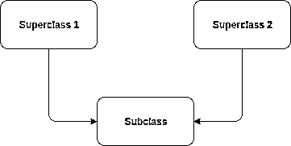

# 使用 Python super()增强您的类

> 原文：<https://realpython.com/python-super/>

*立即观看**本教程有真实 Python 团队创建的相关视频课程。和书面教程一起看，加深理解: [**用 Python super()**](/courses/python-super/) 为你的类增压

虽然 Python 不是纯粹的面向对象语言，但它足够灵活和强大，允许您使用面向对象的范例构建应用程序。Python 实现这一点的方法之一是支持**继承**，它用`super()`做到了这一点。

在本教程中，您将了解以下内容:

*   Python 中的继承概念
*   Python 中的多重继承
*   `super()`功能的工作原理
*   单一继承中的`super()`函数是如何工作的
*   多重继承中的`super()`函数是如何工作的

**免费奖励:** [掌握 Python 的 5 个想法](https://realpython.com/bonus/python-mastery-course/)，这是一个面向 Python 开发者的免费课程，向您展示将 Python 技能提升到下一个水平所需的路线图和心态。

## Python 的`super()`函数概述

如果你有面向对象语言的经验，你可能已经熟悉了`super()`的功能。

如果没有，不要害怕！虽然[官方文档](https://docs.python.org/3/library/functions.html#super)是相当技术性的，但在高层次上`super()`让你可以从继承它的子类中访问超类中的方法。

单独返回超类的临时对象，然后允许你调用超类的方法。

你为什么想做这些？虽然可能性受到您的想象力的限制，但一个常见的用例是构建扩展先前构建的类的功能的类。

用`super()`调用先前构建的方法可以让您不必在子类中重写这些方法，并允许您用最少的代码更改换出超类。

[*Remove ads*](/account/join/)

## `super()`在单继承

如果你不熟悉面向对象的编程概念，**继承**可能是一个陌生的术语。继承是面向对象编程中的一个概念，其中一个类从另一个类派生(或者**继承**)属性和行为，而不需要再次实现它们。

至少对我来说，看代码时更容易理解这些概念，所以让我们编写描述一些形状的类:

```py
class Rectangle:
    def __init__(self, length, width):
        self.length = length
        self.width = width

    def area(self):
        return self.length * self.width

    def perimeter(self):
        return 2 * self.length + 2 * self.width

class Square:
    def __init__(self, length):
        self.length = length

    def area(self):
        return self.length * self.length

    def perimeter(self):
        return 4 * self.length
```

这里有两个类似的类:`Rectangle`和`Square`。

您可以按如下方式使用它们:

>>>

```py
>>> square = Square(4)
>>> square.area()
16
>>> rectangle = Rectangle(2,4)
>>> rectangle.area()
8
```

在本例中，您有两个相互关联的形状:正方形是一种特殊的矩形。然而，代码没有反映这种关系，因此代码本质上是重复的。

通过使用继承，您可以减少编写的代码量，同时反映矩形和正方形之间的真实关系:

```py
class Rectangle:
    def __init__(self, length, width):
        self.length = length
        self.width = width

    def area(self):
        return self.length * self.width

    def perimeter(self):
        return 2 * self.length + 2 * self.width

# Here we declare that the Square class inherits from the Rectangle class
class Square(Rectangle):
    def __init__(self, length):
        super().__init__(length, length)
```

这里，您已经使用了`super()`来调用`Rectangle`类的`__init__()`，允许您在`Square`类中使用它而无需重复代码。下面是更改后保留的核心功能:

>>>

```py
>>> square = Square(4)
>>> square.area()
16
```

在这个例子中，`Rectangle`是超类，`Square`是子类。

因为`Square`和`Rectangle` `.__init__()`方法是如此的相似，你可以简单的通过使用`super()`从`Square`调用超类的`.__init__()`方法(`Rectangle.__init__()`)。这将设置`.length`和`.width`属性，即使您只需向`Square`构造函数提供一个`length`参数。

当您运行它时，即使您的`Square`类没有显式实现它，对`.area()`的调用将使用超类中的`.area()`方法并打印`16`。`Square`类**从`Rectangle`类继承了**类`.area()`。

**注意:**要了解更多关于 Python 中的继承和面向对象概念，请务必查看[继承和组合:Python OOP 指南](https://realpython.com/inheritance-composition-python/)和[Python 3 中的面向对象编程(OOP)](https://realpython.com/python3-object-oriented-programming/)。

## `super()`能为你做什么？

那么`super()`在单一继承中能为你做些什么呢？

像在其他面向对象的语言中一样，它允许你在子类中调用超类的方法。这种方法的主要用例是扩展继承方法的功能。

在下面的例子中，您将创建一个继承自`Square`的类`Cube`，并扩展`.area()`的功能(通过`Square`继承自`Rectangle`类)来计算`Cube`实例的表面积和体积:

```py
class Square(Rectangle):
    def __init__(self, length):
        super().__init__(length, length)

class Cube(Square):
    def surface_area(self):
        face_area = super().area()
        return face_area * 6

    def volume(self):
        face_area = super().area()
        return face_area * self.length
```

既然您已经构建了这些类，让我们来看看边长为`3`的立方体的表面积和体积:

>>>

```py
>>> cube = Cube(3)
>>> cube.surface_area()
54
>>> cube.volume()
27
```

**注意**:注意，在我们上面的例子中，`super()`不会单独为您进行方法调用:您必须调用代理对象本身的方法。

这里您已经为`Cube`类实现了两个方法:`.surface_area()`和`.volume()`。这两种计算都依赖于计算单个面的面积，因此，与其重新实现面积计算，不如使用`super()`来扩展面积计算。

还要注意的是，`Cube`类定义没有`.__init__()`。因为`Cube`从`Square`继承而来，并且`.__init__()`对`Cube`和对`Square`并没有什么不同，所以你可以跳过对它的定义，超类的`.__init__()`(`Square`)将被自动调用。

`super()`返回一个委托对象给父类，所以你直接在上面调用你想要的方法:`super().area()`。

这不仅让我们不必重写面积计算，还允许我们在一个位置改变内部的`.area()`逻辑。当你有许多继承自一个超类的子类时，这尤其方便。

[*Remove ads*](/account/join/)

## 一次`super()`深潜

在进入多重继承之前，让我们快速了解一下`super()`的机制。

虽然上面(和下面)的例子不带任何参数调用`super()`，但是`super()`也可以带两个参数:第一个参数是子类，第二个参数是该子类的实例对象。

首先，让我们看两个例子，使用已经显示的类，展示操作第一个[变量](https://realpython.com/python-variables/)可以做什么:

```py
class Rectangle:
    def __init__(self, length, width):
        self.length = length
        self.width = width

    def area(self):
        return self.length * self.width

    def perimeter(self):
        return 2 * self.length + 2 * self.width

class Square(Rectangle):
    def __init__(self, length):
        super(Square, self).__init__(length, length)
```

在 Python 3 中，`super(Square, self)`调用相当于无参数的`super()`调用。第一个参数指向子类`Square`，而第二个参数指向一个`Square`对象，在本例中是`self`。您也可以用其他类调用`super()`:

```py
class Cube(Square):
    def surface_area(self):
        face_area = super(Square, self).area()
        return face_area * 6

    def volume(self):
        face_area = super(Square, self).area()
        return face_area * self.length
```

在这个例子中，你将`Square`设置为`super()`的子类参数，而不是`Cube`。这使得`super()`开始在实例层次结构中`Square`之上的一个级别搜索匹配方法(在本例中为`.area()`),在本例中为`Rectangle`。

在这个具体的例子中，行为没有改变。但是想象一下，`Square`也实现了一个`.area()`函数，你想确保`Cube`没有使用它。以这种方式调用`super()`允许您这样做。

**注意:**虽然我们正在对`super()`的参数进行大量的修改，以探索它在引擎盖下是如何工作的，但我建议不要经常这样做。

推荐使用对`super()`的无参数调用，这对于大多数用例来说已经足够了，并且需要定期改变搜索层次可能表明存在更大的设计问题。

第二个参数呢？请记住，这是一个对象，它是用作第一个参数的类的实例。举个例子，`isinstance(Cube, Square)`必须返回`True`。

通过包含一个实例化的对象，`super()`返回一个**绑定的方法**:一个绑定到对象的方法，它为该方法提供对象的上下文，比如任何实例属性。如果没有包含这个参数，那么返回的方法只是一个函数，与对象的上下文无关。

有关绑定方法、未绑定方法和函数的更多信息，请阅读 Python 文档[的描述符系统](https://docs.python.org/3.7/howto/descriptor.html)。

**注意:**从技术上来说，`super()`不返回方法。它返回一个代理对象。这是一个对象，它将调用委托给正确的类方法，而无需为此创建额外的对象。

## `super()`在多重继承中

现在您已经学习了关于`super()`和单一继承的概述和一些例子，接下来将向您介绍展示多重继承如何工作以及`super()`如何实现该功能的概述和一些例子。

### 多重继承概述

还有另一个用例`super()`非常出色，这个用例不像单一继承场景那样常见。除了单一继承，Python 还支持多重继承，在多重继承中，一个子类可以从多个不一定相互继承的超类中继承(也称为**兄弟类**)。

我是一个非常视觉化的人，我发现图表对于理解这样的概念非常有帮助。下图显示了一个非常简单的多重继承场景，其中一个类继承自两个不相关的(兄弟)超类:

[](https://files.realpython.com/media/multiple_inheritance.22fc2c1ac608.png)

<figcaption class="figure-caption text-center">A diagrammed example of multiple inheritance (Image: Kyle Stratis)</figcaption>

为了更好地说明多重继承，这里有一些代码供您试用，展示了如何用一个`Triangle`和一个`Square`构建一个正金字塔(一个正方形底的金字塔):

```py
class Triangle:
    def __init__(self, base, height):
        self.base = base
        self.height = height

    def area(self):
        return 0.5 * self.base * self.height

class RightPyramid(Triangle, Square):
    def __init__(self, base, slant_height):
        self.base = base
        self.slant_height = slant_height

    def area(self):
        base_area = super().area()
        perimeter = super().perimeter()
        return 0.5 * perimeter * self.slant_height + base_area
```

**注意:**术语**倾斜高度**可能不熟悉，尤其是如果你已经有一段时间没有上过几何课或做过金字塔了。

倾斜高度是从一个物体(如金字塔)底部的中心到其表面到该物体顶点的高度。你可以在 [WolframMathWorld](http://mathworld.wolfram.com/SlantHeight.html) 了解更多关于倾斜高度的信息。

这个例子声明了一个`Triangle`类和一个从`Square`和`Triangle`继承的`RightPyramid`类。

您将看到另一个`.area()`方法，它使用`super()`，就像在单一继承中一样，目的是让它达到在`Rectangle`类中定义的`.perimeter()`和`.area()`方法。

**注意:**你可能注意到上面的代码还没有使用任何从`Triangle`类继承的属性。后面的例子将充分利用从`Triangle`和`Square`的继承。

然而，问题是两个超类(`Triangle`和`Square`)都定义了一个`.area()`。花点时间想想当你在`RightPyramid`上调用`.area()`时会发生什么，然后试着像下面这样调用它:

>>>

```py
>> pyramid = RightPyramid(2, 4)
>> pyramid.area()
Traceback (most recent call last):
  File "shapes.py", line 63, in <module>
    print(pyramid.area())
  File "shapes.py", line 47, in area
    base_area = super().area()
  File "shapes.py", line 38, in area
    return 0.5 * self.base * self.height
AttributeError: 'RightPyramid' object has no attribute 'height'
```

你猜到 Python 会尝试调用`Triangle.area()`了吗？这是因为一种叫做**方法决议顺序**的东西。

**注意:**我们怎么会注意到`Triangle.area()`被调用，而不是我们希望的`Square.area()`？如果您查看回溯的最后一行(在`AttributeError`之前)，您会看到对特定代码行的引用:

```py
return 0.5 * self.base * self.height
```

你可能在几何课上见过这个三角形的面积公式。否则，如果你像我一样，你可能已经向上滚动到`Triangle`和`Rectangle`类定义，并在`Triangle.area()`中看到相同的代码。

[*Remove ads*](/account/join/)

### 方法解析顺序

方法解析顺序(或 **MRO** )告诉 Python 如何搜索继承的方法。这在您使用`super()`时很方便，因为 MRO 会告诉您 Python 将在哪里寻找您用`super()`调用的方法，以及以什么顺序。

每个类都有一个`.__mro__`属性，允许我们检查顺序，所以让我们这样做:

>>>

```py
>>> RightPyramid.__mro__
(<class '__main__.RightPyramid'>, <class '__main__.Triangle'>, 
 <class '__main__.Square'>, <class '__main__.Rectangle'>, 
 <class 'object'>)
```

这告诉我们，方法将首先在`Rightpyramid`中搜索，然后在`Triangle`中搜索，然后在`Square`中搜索，然后在`Rectangle`中搜索，如果什么都没有找到，那么在所有类都源自的`object`中搜索。

这里的问题是解释器在`Square`和`Rectangle`之前在`Triangle`中搜索`.area()`，一找到`Triangle`中的`.area()`，Python 就调用它而不是你想要的那个。因为`Triangle.area()`期望有一个`.height`和一个`.base`属性，Python 抛出了一个`AttributeError`。

幸运的是，您可以控制 MRO 的构建方式。只需更改`RightPyramid`类的签名，您就可以按照您想要的顺序进行搜索，并且这些方法将正确解析:

```py
class RightPyramid(Square, Triangle):
    def __init__(self, base, slant_height):
        self.base = base
        self.slant_height = slant_height
        super().__init__(self.base)

    def area(self):
        base_area = super().area()
        perimeter = super().perimeter()
        return 0.5 * perimeter * self.slant_height + base_area
```

注意，`RightPyramid`用来自`Square`类的`.__init__()`部分初始化。这允许`.area()`按照设计在对象上使用`.length`。

现在，您可以构建一个金字塔，检查 MRO，并计算表面积:

>>>

```py
>>> pyramid = RightPyramid(2, 4)
>>> RightPyramid.__mro__
(<class '__main__.RightPyramid'>, <class '__main__.Square'>, 
<class '__main__.Rectangle'>, <class '__main__.Triangle'>, 
<class 'object'>)
>>> pyramid.area()
20.0
```

你可以看到 MRO 现在是你所期望的样子，而且多亏了`.area()`和`.perimeter()`，你还可以检查金字塔的区域。

不过，这里还有一个问题。为了简单起见，我在这个例子中做错了几件事:第一件，也可以说是最重要的一件事，就是我有两个不同的类，它们有相同的方法名和签名。

这导致了方法解析的问题，因为在 MRO 列表中遇到的第一个实例`.area()`将被调用。

当你在多重继承中使用`super()`时，设计你的类来与**合作**是必要的。其中一部分是通过确保方法签名是唯一的(无论是使用方法名还是方法参数),来确保您的方法是唯一的，以便在 MRO 中得到解析。

在这种情况下，为了避免彻底检查您的代码，您可以将`Triangle`类的`.area()`方法重命名为`.tri_area()`。这样，面积方法可以继续使用类属性，而不是采用外部参数:

```py
class Triangle:
    def __init__(self, base, height):
        self.base = base
        self.height = height
        super().__init__()

    def tri_area(self):
        return 0.5 * self.base * self.height
```

让我们继续在`RightPyramid`类中使用它:

```py
class RightPyramid(Square, Triangle):
    def __init__(self, base, slant_height):
        self.base = base
        self.slant_height = slant_height
        super().__init__(self.base)

    def area(self):
        base_area = super().area()
        perimeter = super().perimeter()
        return 0.5 * perimeter * self.slant_height + base_area

    def area_2(self):
        base_area = super().area()
        triangle_area = super().tri_area()
        return triangle_area * 4 + base_area
```

这里的下一个问题是，代码不像对`Square`对象那样有委托的`Triangle`对象，所以调用`.area_2()`会给我们一个`AttributeError`，因为`.base`和`.height`没有任何值。

要解决这个问题，您需要做两件事:

1.  所有用`super()`调用的方法都需要调用该方法的超类版本。这意味着您需要将`super().__init__()`添加到`Triangle`和`Rectangle`的`.__init__()`方法中。

2.  重新设计所有的`.__init__()`调用，取一个关键字字典。参见下面的完整代码。


```py
class Rectangle:
    def __init__(self, length, width, **kwargs):
        self.length = length
        self.width = width
        super().__init__(**kwargs)

    def area(self):
        return self.length * self.width

    def perimeter(self):
        return 2 * self.length + 2 * self.width

# Here we declare that the Square class inherits from 
# the Rectangle class
class Square(Rectangle):
    def __init__(self, length, **kwargs):
        super().__init__(length=length, width=length, **kwargs)

class Cube(Square):
    def surface_area(self):
        face_area = super().area()
        return face_area * 6

    def volume(self):
        face_area = super().area()
        return face_area * self.length

class Triangle:
    def __init__(self, base, height, **kwargs):
        self.base = base
        self.height = height
        super().__init__(**kwargs)

    def tri_area(self):
        return 0.5 * self.base * self.height

class RightPyramid(Square, Triangle):
    def __init__(self, base, slant_height, **kwargs):
        self.base = base
        self.slant_height = slant_height
        kwargs["height"] = slant_height
        kwargs["length"] = base
        super().__init__(base=base, **kwargs)

    def area(self):
        base_area = super().area()
        perimeter = super().perimeter()
        return 0.5 * perimeter * self.slant_height + base_area

    def area_2(self):
        base_area = super().area()
        triangle_area = super().tri_area()
        return triangle_area * 4 + base_area
```

这段代码中有许多重要的不同之处:

*   [** `kwargs`](https://realpython.com/python-kwargs-and-args/) 在某些地方被修改(比如`RightPyramid.__init__()` ):**这将允许这些对象的用户仅使用对该特定对象有意义的参数来实例化它们。

*   **在`**kwargs`之前设置命名参数:**这个你可以在`RightPyramid.__init__()`里看到。这产生了一个整洁的效果，将那个键从`**kwargs`字典中弹出，这样当它在`object`类的 MRO 末尾结束时，`**kwargs`是空的。

**注意:**跟踪`kwargs`的状态在这里可能很棘手，所以这里有一个按顺序排列的`.__init__()`调用表，显示了拥有那个调用的类，以及那个调用期间`kwargs`的内容:

| 班级 | 命名参数 | `kwargs` |
| --- | --- | --- |
| `RightPyramid` | `base`，`slant_height` |  |
| `Square` | `length` | `base`，`height` |
| `Rectangle` | `length`，`width` | `base`，`height` |
| `Triangle` | `base`，`height` |  |

现在，当您使用这些更新的类时，您会看到:

>>>

```py
>>> pyramid = RightPyramid(base=2, slant_height=4)
>>> pyramid.area()
20.0
>>> pyramid.area_2()
20.0
```

有用！您已经使用`super()`成功地导航了一个复杂的类层次结构，同时使用继承和组合以最小的重新实现创建了新的类。

[*Remove ads*](/account/join/)

### 多重继承选择

如您所见，多重继承非常有用，但也会导致非常复杂的情况和难以阅读的代码。也很少有对象从多个其他对象继承所有东西。

如果你看到自己开始使用多重继承和复杂的类层次结构，那就值得问问自己，是否可以通过使用**组合**而不是继承来实现更干净、更容易理解的代码。因为本文关注的是继承，所以我不会过多地讨论组合以及如何在 Python 中使用它。幸运的是，Real Python 已经发布了一个关于 Python 继承和组合的[深度指南](https://realpython.com/inheritance-composition-python/)，它将让你立刻成为 OOP 专家。

还有另一种技术可以帮助您避开多重继承的复杂性，同时仍然提供许多好处。这种技术的形式是一个专门的简单的类，叫做 **mixin** 。

mixin 作为一种继承工作，但是与其定义“是-a”关系，不如说它定义了“包含-a”关系可能更准确。使用 mix-in，您可以编写一个可以直接包含在任意数量的其他类中的行为。

下面，您将看到一个使用`VolumeMixin`为我们的 3D 对象赋予特定功能的简短示例——在本例中，是体积计算:

```py
class Rectangle:
    def __init__(self, length, width):
        self.length = length
        self.width = width

    def area(self):
        return self.length * self.width

class Square(Rectangle):
    def __init__(self, length):
        super().__init__(length, length)

class VolumeMixin:
    def volume(self):
        return self.area() * self.height

class Cube(VolumeMixin, Square):
    def __init__(self, length):
        super().__init__(length)
        self.height = length

    def face_area(self):
        return super().area()

    def surface_area(self):
        return super().area() * 6
```

在这个例子中，代码被修改为包含一个名为`VolumeMixin`的 mixin。mixin 然后被`Cube`使用，并赋予`Cube`计算其体积的能力，如下所示:

>>>

```py
>>> cube = Cube(2)
>>> cube.surface_area()
24
>>> cube.volume()
8
```

这个 mixin 可以以同样的方式在任何其他类中使用，这些类具有为其定义的区域，并且公式`area * height`返回正确的体积。

## 一个`super()`回顾

在本教程中，你学习了如何用`super()`来增强你的类。您的旅程从回顾单一继承开始，然后展示了如何使用`super()`轻松调用超类方法。

然后，您学习了多重继承在 Python 中是如何工作的，以及将`super()`与多重继承结合起来的技术。您还了解了 Python 如何使用方法解析顺序(MRO)解析方法调用，以及如何检查和修改 MRO 以确保在适当的时间调用适当的方法。

有关 Python 中面向对象编程和使用`super()`的更多信息，请查看以下资源:

*   [官方`super()`文档](https://docs.python.org/3/library/functions.html#super)
*   [Python 的`super()`被 Raymond Hettinger](https://rhettinger.wordpress.com/2011/05/26/super-considered-super/) 视为超级
*   [Python 3 中的面向对象编程](https://realpython.com/python3-object-oriented-programming/)

*立即观看**本教程有真实 Python 团队创建的相关视频课程。和书面教程一起看，加深理解: [**用 Python super()**](/courses/python-super/) 为你的类增压******