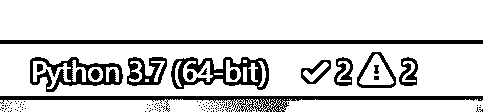

# Python 测试入门

> 原文：<https://realpython.com/python-testing/>

*立即观看**本教程有真实 Python 团队创建的相关视频课程。和书面教程一起看，加深理解: [**用 PyTest**](/courses/test-driven-development-pytest/) 测试驱动开发

本教程是为那些已经用 Python 写了一个很棒的应用程序但还没有写任何测试的人准备的。

用 Python 进行测试是一个很大的话题，可能会很复杂，但并不一定很难。您可以通过几个简单的步骤开始为您的应用程序创建简单的测试，然后在此基础上进行构建。

在本教程中，您将学习如何创建一个基本的测试，执行它，并在您的用户之前找到错误！您将了解可用于编写和执行测试、检查应用程序性能，甚至查找安全问题的工具。

**免费奖励:** [掌握 Python 的 5 个想法](https://realpython.com/bonus/python-mastery-course/)，这是一个面向 Python 开发者的免费课程，向您展示将 Python 技能提升到下一个水平所需的路线图和心态。

## 测试您的代码

有很多方法可以测试你的代码。在本教程中，您将从最基本的步骤开始学习技术，并朝着高级方法前进。

[*Remove ads*](/account/join/)

### 自动测试与手动测试

好消息是，您可能已经在没有意识到的情况下创建了一个测试。还记得您第一次运行和使用应用程序的时候吗？你检查过这些特性并尝试使用它们了吗？这就是所谓的**探索性测试**，也是手工测试的一种形式。

探索性测试是一种没有计划的测试形式。在探索性测试中，您只是在探索应用程序。

要有一套完整的手动测试，您需要做的就是列出您的应用程序具有的所有特性、它可以接受的不同类型的输入以及预期的结果。现在，每次你对你的代码进行修改时，你都需要检查列表上的每一项。

听起来没什么意思，是吧？

这就是自动化测试的用武之地。自动化测试是由脚本而不是人来执行您的测试计划(您想要测试的应用程序部分、您想要测试它们的顺序以及预期的响应)。Python 已经提供了一套工具和库来帮助您为应用程序创建自动化测试。我们将在本教程中探索这些工具和库。

### 单元测试与集成测试

测试领域并不缺少术语，现在您已经知道了自动化测试和手动测试之间的区别，是时候更深入一层了。

想想你可能如何测试汽车上的灯。你可以打开灯(被称为**测试步骤**)，走到车外或请朋友检查灯是否打开(被称为**测试断言**)。测试多个组件被称为**集成测试**。

想想为了让一个简单的任务产生正确的结果，需要正确工作的所有事情。这些组件就像是你的应用程序的一部分，所有你写的类、函数和模块。

集成测试的一个主要挑战是当集成测试没有给出正确的结果时。如果不能确定系统的哪个部分出现故障，就很难诊断问题。如果灯没有打开，那么可能是灯泡坏了。电池没电了吗？交流发电机呢？车的电脑是不是出故障了？

如果你有一辆时髦的汽车，它会告诉你什么时候你的灯泡坏了。它使用一种形式的**单元测试**来做到这一点。

单元测试是一个较小的测试，它检查单个组件是否以正确的方式运行。单元测试有助于您隔离应用程序中的问题，并更快地修复它。

您刚刚看到了两种类型的测试:

1.  集成测试检查应用程序中的组件是否可以相互操作。
2.  单元测试检查应用程序中的一个小组件。

您可以用 Python 编写集成测试和单元测试。为了编写内置函数`sum()`的单元测试，您需要对照已知的输出来检查`sum()`的输出。

例如，下面是如何检查数字`(1, 2, 3)`的`sum()`是否等于`6`:

>>>

```py
>>> assert sum([1, 2, 3]) == 6, "Should be 6"
```

这不会在 REPL 上输出任何内容，因为值是正确的。

如果来自`sum()`的结果不正确，这将失败，并显示`AssertionError`和消息`"Should be 6"`。使用错误的值再次尝试断言语句，以查看`AssertionError`:

>>>

```py
>>> assert sum([1, 1, 1]) == 6, "Should be 6"
Traceback (most recent call last):
  File "<stdin>", line 1, in <module>
AssertionError: Should be 6
```

在 REPL 中，您会看到凸起的`AssertionError`，因为`sum()`的结果与`6`不匹配。

不是在 REPL 上测试，而是将它放入一个名为`test_sum.py`的新 Python 文件中，并再次执行它:

```py
def test_sum():
    assert sum([1, 2, 3]) == 6, "Should be 6"

if __name__ == "__main__":
    test_sum()
    print("Everything passed")
```

现在您已经编写了一个**测试用例**，一个断言，和一个入口点(命令行)。现在，您可以在命令行中执行此操作:

```py
$ python test_sum.py
Everything passed
```

可以看到成功的结果，`Everything passed`。

在 Python 中，`sum()`接受任何 iterable 作为它的第一个参数。你用一个列表来测试。现在也用一个元组进行测试。用下面的代码创建一个名为`test_sum_2.py`的新文件:

```py
def test_sum():
    assert sum([1, 2, 3]) == 6, "Should be 6"

def test_sum_tuple():
    assert sum((1, 2, 2)) == 6, "Should be 6"

if __name__ == "__main__":
    test_sum()
    test_sum_tuple()
    print("Everything passed")
```

当你执行`test_sum_2.py`时，脚本会给出一个错误，因为`(1, 2, 2)`的`sum()`是`5`，而不是`6`。脚本的结果给出了错误消息、代码行和回溯:

```py
$ python test_sum_2.py
Traceback (most recent call last):
 File "test_sum_2.py", line 9, in <module>
 test_sum_tuple()
 File "test_sum_2.py", line 5, in test_sum_tuple
 assert sum((1, 2, 2)) == 6, "Should be 6"
AssertionError: Should be 6
```

在这里，您可以看到代码中的一个错误如何在控制台上给出一个错误，并提供一些关于错误位置和预期结果的信息。

**注意:**可以同时记录和测试你的代码，同时确保你的代码和它的记录保持同步。查看 [Python 的 doctest:立刻记录并测试你的代码](https://realpython.com/python-doctest/)以了解更多。

以这种方式编写测试对于简单的检查来说是可以的，但是如果不止一个测试失败了呢？这就是试车员的用武之地。测试运行程序是一个特殊的应用程序，设计用于运行测试、检查输出，并为您提供调试和诊断测试和应用程序的工具。

[*Remove ads*](/account/join/)

### 选择测试跑步者

Python 有许多可用的测试程序。Python 标准库中内置的那个叫做`unittest`。在本教程中，您将使用`unittest`测试用例以及`unittest`测试运行器。`unittest`的原则很容易移植到其他框架。三个最受欢迎的测试跑步者是:

*   `unittest`
*   `nose`或`nose2`
*   `pytest`

根据您的需求和经验水平选择最佳的测试跑步者非常重要。

#### `unittest`

`unittest`从 2.1 版本开始就已经内置到 Python 标准库中。您可能会在商业 Python 应用程序和开源项目中看到它。

包含测试框架和测试运行程序。`unittest`对编写和执行测试有一些重要的要求。

`unittest`要求:

*   您将测试作为方法放入类中
*   您在`unittest.TestCase`类中使用了一系列特殊的断言方法，而不是内置的`assert`语句

要将前面的例子转换成一个`unittest`测试用例，您必须:

1.  [从标准库中导入](https://realpython.com/absolute-vs-relative-python-imports/) `unittest`
2.  创建一个名为`TestSum`的类，它继承自`TestCase`类
3.  通过添加`self`作为第一个参数，将测试函数转换成方法
4.  更改断言以在`TestCase`类上使用`self.assertEqual()`方法
5.  将命令行入口点改为调用`unittest.main()`

按照这些步骤，用下面的代码创建一个新文件`test_sum_unittest.py`:

```py
import unittest

class TestSum(unittest.TestCase):

    def test_sum(self):
        self.assertEqual(sum([1, 2, 3]), 6, "Should be 6")

    def test_sum_tuple(self):
        self.assertEqual(sum((1, 2, 2)), 6, "Should be 6")

if __name__ == '__main__':
    unittest.main()
```

如果在命令行执行，您将看到一次成功(用`.`表示)和一次失败(用`F`表示):

```py
$ python test_sum_unittest.py
.F
======================================================================
FAIL: test_sum_tuple (__main__.TestSum)
----------------------------------------------------------------------
Traceback (most recent call last):
 File "test_sum_unittest.py", line 9, in test_sum_tuple
 self.assertEqual(sum((1, 2, 2)), 6, "Should be 6")
AssertionError: Should be 6

----------------------------------------------------------------------
Ran 2 tests in 0.001s

FAILED (failures=1)
```

您已经使用`unittest`测试运行器执行了两个测试。

**注意:**如果你正在编写需要同时在 Python 2 和 3 中执行的测试用例，要小心。在 Python 2.7 及以下版本中，`unittest`被称为`unittest2`。如果你简单地从`unittest`中[导入](https://realpython.com/python-import/)，你将会在 Python 2 和 3 之间得到具有不同特性的不同版本。

要了解更多关于`unittest`的信息，你可以浏览[单元测试文档](https://docs.python.org/3/library/unittest.html)。

#### `nose`

您可能会发现，随着时间的推移，当您为您的应用程序编写数百甚至数千个测试时，理解和使用来自`unittest`的输出变得越来越困难。

`nose`兼容任何使用`unittest`框架编写的测试，并且可以作为`unittest`测试运行程序的替代。作为开源应用的`nose`的开发落后了，一个叫做`nose2`的分支被创建了。如果你是从零开始，建议你使用`nose2`而不是`nose`。

要开始使用`nose2`，从 PyPI 安装`nose2`并在命令行上执行它。`nose2`将尝试在您当前的目录中发现所有名为`test*.py`的测试脚本和从`unittest.TestCase`继承的测试用例；

```py
$ pip install nose2
$ python -m nose2
.F
======================================================================
FAIL: test_sum_tuple (__main__.TestSum)
----------------------------------------------------------------------
Traceback (most recent call last):
 File "test_sum_unittest.py", line 9, in test_sum_tuple
 self.assertEqual(sum((1, 2, 2)), 6, "Should be 6")
AssertionError: Should be 6

----------------------------------------------------------------------
Ran 2 tests in 0.001s

FAILED (failures=1)
```

您刚刚从`nose2`测试运行程序中执行了您在`test_sum_unittest.py`中创建的测试。`nose2`提供了许多命令行标志来过滤您执行的测试。要了解更多信息，你可以浏览 [Nose 2 文档](https://nose2.readthedocs.io/)。

#### `pytest`

[`pytest`](https://realpython.com/pytest-python-testing/) 支持`unittest`测试用例的执行。`pytest`的真正优势来自于编写`pytest`测试用例。`pytest`测试用例是一个 Python 文件中的一系列函数，以名称`test_`开始。

`pytest`还有其他一些很棒的功能:

*   支持内置的`assert`语句，而不是使用特殊的`self.assert*()`方法
*   支持测试用例的过滤
*   从上次失败的测试重新运行的能力
*   一个由数百个插件组成的生态系统，用于扩展功能

为`pytest`编写的`TestSum`测试用例示例如下所示:

```py
def test_sum():
    assert sum([1, 2, 3]) == 6, "Should be 6"

def test_sum_tuple():
    assert sum((1, 2, 2)) == 6, "Should be 6"
```

您已经放弃了`TestCase`、任何对类的使用以及命令行入口点。

更多信息可以在 [Pytest 文档网站](https://docs.pytest.org/en/latest/)上找到。

[*Remove ads*](/account/join/)

## 编写您的第一个测试

让我们将您到目前为止所学到的东西结合起来，测试相同需求的简单实现，而不是测试内置的`sum()`函数。

创建一个新的项目文件夹，并在其中创建一个名为`my_sum`的新文件夹。在`my_sum`中，创建一个名为`__init__.py`的空文件。创建`__init__.py`文件意味着`my_sum`文件夹可以作为一个模块从父目录导入。

您的项目文件夹应该如下所示:

```py
project/
│
└── my_sum/
    └── __init__.py
```

打开`my_sum/__init__.py`并创建一个名为`sum()`的新函数，它接受一个 iterable(一个列表、元组或集合)并将值相加:

```py
def sum(arg):
    total = 0
    for val in arg:
        total += val
    return total
```

这个代码示例创建一个名为`total`的变量，遍历`arg`中的所有值，并将它们添加到`total`。一旦 iterable 用完，它就返回结果。

### 在哪里写测试

要开始编写测试，您可以简单地创建一个名为`test.py`的文件，它将包含您的第一个测试用例。因为该文件将需要能够导入您的应用程序以便能够测试它，所以您希望将`test.py`放在包文件夹之上，这样您的目录树将看起来像这样:

```py
project/
│
├── my_sum/
│   └── __init__.py
|
└── test.py
```

您会发现，随着您添加越来越多的测试，您的单个文件将变得混乱和难以维护，因此您可以创建一个名为`tests/`的文件夹，并将测试拆分成多个文件。按照惯例，要确保每个文件都以`test_`开头，这样所有的测试运行者都会认为 Python 文件包含了要执行的测试。一些非常大的项目根据它们的目的或用途将测试分成更多的子目录。

**注意:**如果你的应用是单个脚本怎么办？

您可以使用内置的`__import__()`函数导入脚本的任何属性，比如类、函数和变量。代替`from my_sum import sum`，你可以写如下:

```py
target = __import__("my_sum.py")
sum = target.sum
```

使用`__import__()`的好处是不用把项目文件夹变成包，可以指定文件名。如果您的文件名与任何标准库包冲突，这也很有用。例如，`math.py`会与`math`模块发生冲突。

### 如何构建一个简单的测试

在开始编写测试之前，您需要首先做出几个决定:

1.  你想测试什么？
2.  你写的是单元测试还是集成测试？

那么测试的结构应该大致遵循这个工作流程:

1.  创建您的输入
2.  执行被测试的代码，捕获输出
3.  将输出与预期结果进行比较

对于这个应用程序，您正在测试`sum()`。在`sum()`中有许多行为可以检查，例如:

*   它能对一列整数求和吗？
*   它能对一个元组或集合求和吗？
*   它能对一个浮点数列表求和吗？
*   当你给它提供一个错误的值，比如单个整数或者一个字符串，会发生什么？
*   当其中一个值为负时会发生什么？

最简单的测试是一个整数列表。使用以下 Python 代码创建一个文件`test.py`:

```py
import unittest

from my_sum import sum

class TestSum(unittest.TestCase):
    def test_list_int(self):
        """
 Test that it can sum a list of integers
 """
        data = [1, 2, 3]
        result = sum(data)
        self.assertEqual(result, 6)

if __name__ == '__main__':
    unittest.main()
```

此代码示例:

1.  从您创建的`my_sum`包中导入`sum()`

2.  定义一个名为`TestSum`的新测试用例类，它继承自`unittest.TestCase`

3.  定义一个测试方法`.test_list_int()`，用于测试整数列表。方法`.test_list_int()`将:

    *   用一列数字`(1, 2, 3)`声明一个变量`data`
    *   将`my_sum.sum(data)`的结果赋给一个`result`变量
    *   通过使用`unittest.TestCase`类上的`.assertEqual()`方法断言`result`的值等于`6`
4.  定义一个命令行入口点，它运行`unittest`测试运行程序`.main()`

如果你不确定`self`是什么或者`.assertEqual()`是如何定义的，你可以用 [Python 3 面向对象编程](https://realpython.com/python3-object-oriented-programming/)来温习你的面向对象编程。

[*Remove ads*](/account/join/)

### 如何写断言

编写测试的最后一步是根据已知的响应来验证输出。这被称为**断言**。关于如何编写断言，有一些通用的最佳实践:

*   确保测试是可重复的，并多次运行测试，以确保每次都给出相同的结果
*   尝试断言与您的输入数据相关的结果，例如检查结果是否是`sum()`示例中值的实际总和

有很多方法可以断言变量的值、类型和存在性。以下是一些最常用的方法:

| 方法 | 等于 |
| --- | --- |
| `.assertEqual(a, b)` | `a == b` |
| `.assertTrue(x)` | `bool(x) is True` |
| `.assertFalse(x)` | `bool(x) is False` |
| `.assertIs(a, b)` | `a is b` |
| `.assertIsNone(x)` | `x is None` |
| `.assertIn(a, b)` | `a in b` |
| `.assertIsInstance(a, b)` | `isinstance(a, b)` |

`.assertIs()`、`.assertIsNone()`、`.assertIn()`、`.assertIsInstance()`都有相反的方法，命名为`.assertIsNot()`，以此类推。

### 副作用

当你写测试时，通常不像查看函数的返回值那么简单。通常，执行一段代码会改变环境中的其他东西，比如类的属性、文件系统中的文件或者数据库中的值。这些被称为**副作用**，是测试的重要组成部分。在将副作用包含在您的断言列表中之前，决定是否正在测试它。

如果你发现你想要测试的代码单元有很多副作用，你可能违反了[单一责任原则](https://en.wikipedia.org/wiki/Single_responsibility_principle)。违反单一责任原则意味着这段代码做了太多的事情，重构会更好。遵循单一责任原则是设计代码的一个很好的方法，它易于为可靠的应用程序编写可重复的简单单元测试。

## 执行您的第一个测试

现在您已经创建了第一个测试，您想要执行它。当然，您知道它会通过，但是在您创建更复杂的测试之前，您应该检查您是否能够成功地执行测试。

### 执行测试运行程序

执行测试代码、检查断言并在控制台中给出测试结果的 Python 应用程序被称为**测试运行程序**。

在`test.py`的底部，您添加了这一小段代码:

```py
if __name__ == '__main__':
    unittest.main()
```

这是命令行入口点。意思是如果你在命令行运行`python test.py`单独执行脚本，它会调用`unittest.main()`。这通过发现这个文件中从`unittest.TestCase`继承的所有类来执行测试运行器。

这是执行`unittest`测试运行程序的许多方法之一。当您有一个名为`test.py`的测试文件时，调用`python test.py`是一个很好的开始方式。

另一种方法是使用`unittest`命令行。试试这个:

```py
$ python -m unittest test
```

这将通过命令行执行相同的测试模块(名为`test`)。

您可以提供附加选项来更改输出。其中之一是`-v`表示冗长。尝试下一步:

```py
$ python -m unittest -v test
test_list_int (test.TestSum) ... ok

----------------------------------------------------------------------
Ran 1 tests in 0.000s
```

这执行了`test.py`中的一个测试，并将结果打印到控制台。详细模式列出了它首先执行的测试的名称，以及每个测试的结果。

您可以使用以下命令请求自动发现，而不是提供包含测试的模块的名称:

```py
$ python -m unittest discover
```

这将在当前目录中搜索任何名为`test*.py`的文件，并尝试测试它们。

一旦您有了多个测试文件，只要您遵循`test*.py`命名模式，您就可以通过使用`-s`标志和目录名来提供目录名:

```py
$ python -m unittest discover -s tests
```

将在一个测试计划中运行所有测试，并给出结果。

最后，如果您的源代码不在根目录中，而是包含在子目录中，例如在一个名为`src/`的文件夹中，您可以告诉`unittest`在哪里执行测试，以便它可以正确地导入带有`-t`标志的模块:

```py
$ python -m unittest discover -s tests -t src
```

`unittest`会切换到`src/`目录，扫描`tests`目录下的所有`test*.py`文件，并执行。

[*Remove ads*](/account/join/)

### 了解测试输出

这是一个非常简单的例子，一切都通过了，所以现在您将尝试一个失败的测试并解释输出。

应该能够接受其他数字类型的列表，比如分数。

在`test.py`文件的顶部，添加一条导入语句，从标准库中的`fractions`模块导入`Fraction`类型:

```py
from fractions import Fraction
```

现在添加一个测试，其断言预期值不正确，在本例中预期 1/4、1/4 和 2/5 之和为 1:

```py
import unittest

from my_sum import sum

class TestSum(unittest.TestCase):
    def test_list_int(self):
        """
 Test that it can sum a list of integers
 """
        data = [1, 2, 3]
        result = sum(data)
        self.assertEqual(result, 6)

 def test_list_fraction(self): """ Test that it can sum a list of fractions """ data = [Fraction(1, 4), Fraction(1, 4), Fraction(2, 5)] result = sum(data) self.assertEqual(result, 1) 
if __name__ == '__main__':
    unittest.main()
```

如果使用`python -m unittest test`再次执行测试，您应该会看到以下输出:

```py
$ python -m unittest test
F.
======================================================================
FAIL: test_list_fraction (test.TestSum)
----------------------------------------------------------------------
Traceback (most recent call last):
 File "test.py", line 21, in test_list_fraction
 self.assertEqual(result, 1)
AssertionError: Fraction(9, 10) != 1

----------------------------------------------------------------------
Ran 2 tests in 0.001s

FAILED (failures=1)
```

在输出中，您将看到以下信息:

1.  第一行显示了所有测试的执行结果，一个失败(`F`)，一个通过(`.`)。

2.  `FAIL`条目显示了关于失败测试的一些细节:

    *   测试方法名称(`test_list_fraction`)
    *   测试模块(`test`)和测试用例(`TestSum`)
    *   对故障线路的追溯
    *   带有预期结果(`1`)和实际结果(`Fraction(9, 10)`)的断言的详细信息

请记住，您可以通过将`-v`标志添加到`python -m unittest`命令来将额外的信息添加到测试输出中。

### 从 PyCharm 运行您的测试

如果您使用的是 [PyCharm](https://realpython.com/pycharm-guide/) IDE，您可以按照以下步骤运行`unittest`或`pytest`:

1.  在项目工具窗口中，选择`tests`目录。
2.  在上下文菜单中，选择`unittest`的运行命令。例如，选择*运行‘我的测试中的单元测试…’*。

这将在测试窗口中执行`unittest`,并在 PyCharm 中给出结果:

[](https://files.realpython.com/media/py_run_test_folder.b0e61b478c81.png)

更多信息请访问 PyCharm 网站。

### 从 Visual Studio 代码运行测试

如果您使用的是 Microsoft Visual Studio 代码集成开发环境，Python 插件内置了对`unittest`、`nose`和`pytest`执行的支持。

如果你已经安装了 Python 插件，你可以通过打开命令面板用`Ctrl`+`Shift`+`P`并输入“Python test”来设置你的测试的配置。您将看到一系列选项:

[](https://files.realpython.com/media/vscode-test-capture.dfefa1d20789.PNG)

选择*调试所有单元测试*，VSCode 会提示配置测试框架。点击 cog 选择测试跑步者(`unittest`)和主目录(`.`)。

设置完成后，您将在窗口底部看到测试的状态，并且您可以通过单击这些图标快速访问测试日志并再次运行测试:

[](https://files.realpython.com/media/vscode-test-results.951be75c3d3b.PNG)

这表明测试正在执行，但是其中一些测试失败了。

[*Remove ads*](/account/join/)

## 测试像 Django 和 Flask 这样的 Web 框架

如果您使用流行的框架(如 Django 或 Flask)为 web 应用程序编写测试，那么在编写和运行测试的方式上会有一些重要的不同。

### 为什么它们不同于其他应用程序

想想您将在 web 应用程序中测试的所有代码。路线、视图和模型都需要大量的导入和关于正在使用的框架的知识。

这类似于教程开始时的汽车测试:你必须启动汽车的计算机，然后才能运行像检查车灯这样的简单测试。

Django 和 Flask 都提供了一个基于`unittest`的测试框架，让这一切变得简单。您可以继续以您一直学习的方式编写测试，但是执行它们会稍有不同。

### 如何使用 Django 测试运行器

Django `startapp`模板将在您的应用程序目录中创建一个`tests.py`文件。如果还没有，可以用以下内容创建它:

```py
from django.test import TestCase

class MyTestCase(TestCase):
    # Your test methods
```

到目前为止，与示例的主要区别在于，您需要从`django.test.TestCase`而不是`unittest.TestCase`继承。这些类有相同的 API，但是 Django `TestCase`类设置了所有需要测试的状态。

要执行您的测试套件，您可以使用`manage.py test`,而不是在命令行使用`unittest`:

```py
$ python manage.py test
```

如果你想要多个测试文件，用一个名为`tests`的文件夹替换`tests.py`，在里面插入一个名为`__init__.py`的空文件，然后创建你的`test_*.py`文件。姜戈会发现并执行这些。

更多信息请访问 Django 文档网站。

### 如何使用`unittest`和烧瓶

Flask 要求导入应用程序，然后设置为测试模式。您可以实例化一个测试客户端，并使用该测试客户端向应用程序中的任何路由发出请求。

所有的测试客户端实例化都是在测试用例的`setUp`方法中完成的。在下面的示例中，`my_app`是应用程序的名称。如果你不知道`setUp`是做什么的，不要担心。您将在[更高级的测试场景](#more-advanced-testing-scenarios)部分了解到这一点。

测试文件中的代码应该如下所示:

```py
import my_app
import unittest

class MyTestCase(unittest.TestCase):

    def setUp(self):
        my_app.app.testing = True
        self.app = my_app.app.test_client()

    def test_home(self):
        result = self.app.get('/')
        # Make your assertions
```

然后您可以使用`python -m unittest discover`命令来执行测试用例。

更多信息请访问[烧瓶文档网站](http://flask.pocoo.org/docs/0.12/testing/)。

[*Remove ads*](/account/join/)

## 更高级的测试场景

在开始为应用程序创建测试之前，请记住每个测试的三个基本步骤:

1.  创建您的输入
2.  执行代码，捕获输出
3.  将输出与预期结果进行比较

为输入创建一个静态值(如字符串或数字)并不总是那么容易。有时，您的应用程序将需要一个类或上下文的实例。那你会怎么做？

您作为输入创建的数据被称为 **fixture** 。创建装置并重复使用它们是常见的做法。

如果你运行相同的测试，每次传递不同的值，并期望得到相同的结果，这就是所谓的**参数化**。

### 处理预期故障

早些时候，当你列出测试`sum()`的场景时，出现了一个问题:当你给它提供一个错误的值，比如单个整数或字符串，会发生什么？

在这种情况下，您会期望`sum()`抛出一个错误。当它抛出错误时，会导致测试失败。

有一种特殊的方法来处理预期的错误。您可以使用`.assertRaises()`作为上下文管理器，然后在`with`块中执行测试步骤:

```py
import unittest

from my_sum import sum

class TestSum(unittest.TestCase):
    def test_list_int(self):
        """
 Test that it can sum a list of integers
 """
        data = [1, 2, 3]
        result = sum(data)
        self.assertEqual(result, 6)

    def test_list_fraction(self):
        """
 Test that it can sum a list of fractions
 """
        data = [Fraction(1, 4), Fraction(1, 4), Fraction(2, 5)]
        result = sum(data)
        self.assertEqual(result, 1)

 def test_bad_type(self): data = "banana" with self.assertRaises(TypeError): result = sum(data) 
if __name__ == '__main__':
    unittest.main()
```

只有当`sum(data)`引发`TypeError`时，这个测试用例才会通过。您可以用您选择的任何异常类型替换`TypeError`。

### 隔离应用程序中的行为

在本教程的前面，您已经学习了什么是副作用。副作用使得单元测试更加困难，因为每次运行测试时，它可能会给出不同的结果，或者更糟的是，一个测试可能会影响应用程序的状态，导致另一个测试失败！

[](https://files.realpython.com/media/YXhT6fA.d277d5317026.gif)

有一些简单的技术可以用来测试应用程序中有许多副作用的部分:

*   重构代码以遵循单一责任原则
*   模仿任何方法或函数调用来消除副作用
*   对应用程序的这一部分使用集成测试而不是单元测试

如果你不熟悉嘲讽，请看 [Python CLI 测试](https://realpython.com/python-cli-testing/#mocks)中一些很棒的例子。

### 编写集成测试

到目前为止，您主要学习了单元测试。单元测试是构建可预测的稳定代码的好方法。但是最终，您的应用程序需要在启动时工作！

集成测试是对应用程序的多个组件进行测试，以检查它们是否能协同工作。集成测试可能需要通过以下方式扮演应用程序的消费者或用户:

*   调用 HTTP REST API
*   调用 Python API
*   调用 web 服务
*   运行命令行

每种类型的集成测试都可以按照输入、执行和断言模式，以与单元测试相同的方式编写。最显著的区别是集成测试一次检查更多的组件，因此会比单元测试有更多的副作用。此外，集成测试将需要更多的设备，比如数据库、网络套接字或配置文件。

这就是为什么将单元测试和集成测试分开是一个好的实践。创建集成所需的装置(如测试数据库)和测试用例本身通常比单元测试需要更长的时间来执行，因此您可能只想在推向生产之前运行集成测试，而不是在每次提交时运行一次。

分离单元测试和集成测试的一个简单方法就是将它们放在不同的文件夹中:

```py
project/
│
├── my_app/
│   └── __init__.py
│
└── tests/
    |
    ├── unit/
    |   ├── __init__.py
    |   └── test_sum.py
    |
    └── integration/
        ├── __init__.py
        └── test_integration.py
```

有许多方法可以只执行一组选定的测试。可以将指定源目录标志`-s`添加到`unittest discover`中，其路径包含测试:

```py
$ python -m unittest discover -s tests/integration
```

`unittest`将为您提供`tests/integration`目录中所有测试的结果。

[*Remove ads*](/account/join/)

### 测试数据驱动的应用程序

许多集成测试将需要像数据库这样的后端数据以特定的值存在。例如，您可能希望有一个测试来检查数据库中超过 100 个客户的应用程序是否正确显示，或者即使产品名称以日语显示，订单页面是否正常工作。

这些类型的集成测试将依赖于不同的测试设备，以确保它们是可重复的和可预测的。

一个好的方法是将测试数据存储在集成测试文件夹中的一个名为`fixtures`的文件夹中，以表明它包含测试数据。然后，在您的测试中，您可以加载数据并运行测试。

如果数据由 JSON 文件组成，下面是这种结构的一个例子:

```py
project/
│
├── my_app/
│   └── __init__.py
│
└── tests/
    |
    └── unit/
    |   ├── __init__.py
    |   └── test_sum.py
    |
    └── integration/
        |
        ├── fixtures/
        |   ├── test_basic.json
        |   └── test_complex.json
        |
        ├── __init__.py
        └── test_integration.py
```

在您的测试用例中，您可以使用`.setUp()`方法从一个已知路径的 fixture 文件中加载测试数据，并针对该测试数据执行许多测试。记住，在一个 Python 文件中可以有多个测试用例，而`unittest` discovery 将同时执行这两个测试用例。每组测试数据可以有一个测试用例:

```py
import unittest

class TestBasic(unittest.TestCase):
    def setUp(self):
        # Load test data
        self.app = App(database='fixtures/test_basic.json')

    def test_customer_count(self):
        self.assertEqual(len(self.app.customers), 100)

    def test_existence_of_customer(self):
        customer = self.app.get_customer(id=10)
        self.assertEqual(customer.name, "Org XYZ")
        self.assertEqual(customer.address, "10 Red Road, Reading")

class TestComplexData(unittest.TestCase):
    def setUp(self):
        # load test data
        self.app = App(database='fixtures/test_complex.json')

    def test_customer_count(self):
        self.assertEqual(len(self.app.customers), 10000)

    def test_existence_of_customer(self):
        customer = self.app.get_customer(id=9999)
        self.assertEqual(customer.name, u"バナナ")
        self.assertEqual(customer.address, "10 Red Road, Akihabara, Tokyo")

if __name__ == '__main__':
    unittest.main()
```

如果您的应用程序依赖于来自远程位置的数据，比如一个[远程 API](https://realpython.com/python-api/) ，您将希望确保您的测试是可重复的。因为 API 离线或者有一个[连接问题](https://realpython.com/site-connectivity-checker-python/)而导致测试失败可能会减慢开发速度。在这种情况下，最好将远程设备存储在本地，这样就可以调用它们并发送给应用程序。

`requests`库有一个名为`responses`的免费包，它提供了创建响应夹具并将它们保存在测试文件夹中的方法。在他们的 GitHub 页面上找到更多[。](https://github.com/getsentry/responses)

## 多种环境下的测试

到目前为止，您已经使用具有一组特定依赖关系的虚拟环境测试了 Python 的单个版本。您可能想要检查您的应用程序是否在多个版本的 Python 上工作，或者是否在一个包的多个版本上工作。Tox 是一个在多种环境中自动测试的应用程序。

### 安装 Tox

通过 [`pip`](https://realpython.com/what-is-pip/) 可以在 PyPI 上安装 Tox 软件包:

```py
$ pip install tox
```

现在您已经安装了 Tox，需要对它进行配置。

### 为您的依赖项配置 Tox

Tox 是通过项目目录中的配置文件进行配置的。Tox 配置文件包含以下内容:

*   为了执行测试而运行的命令
*   执行前需要的任何附加包
*   要测试的目标 Python 版本

您不必学习 Tox 配置语法，而是可以通过运行 quickstart 应用程序来提前开始:

```py
$ tox-quickstart
```

Tox 配置工具将询问您这些问题，并创建一个类似于`tox.ini`中的文件:

```py
[tox] envlist  =  py27, py36 [testenv] deps  = commands  = python -m unittest discover
```

在运行 Tox 之前，它要求您的应用程序文件夹中有一个包含安装包的步骤的`setup.py`文件。如果你还没有，你可以在继续之前按照[这个指南](https://packaging.python.org/tutorials/packaging-projects/#setup-py)来创建一个`setup.py`。

或者，如果您的项目不在 PyPI 上发布，您可以通过在标题`[tox]`下的`tox.ini`文件中添加下面一行来跳过这个要求:

```py
[tox] envlist  =  py27, py36 skipsdist=True
```

如果您没有创建一个`setup.py`，并且您的应用程序有一些来自 PyPI 的依赖项，您将需要在`[testenv]`部分下的许多行中指定这些依赖项。例如，Django 将要求:

```py
[testenv] deps  =  django
```

一旦你完成了这个阶段，你就可以运行测试了。

您现在可以执行 Tox，它将创建两个虚拟环境:一个用于 Python 2.7，一个用于 Python 3.6。Tox 目录名为`.tox/`。在`.tox/`目录中，Tox 将针对每个虚拟环境执行`python -m unittest discover`。

您可以通过在命令行中调用 Tox 来运行此过程:

```py
$ tox
```

Tox 将输出您在各种环境下的测试结果。第一次运行时，Tox 需要一点时间来创建虚拟环境，但是一旦创建了虚拟环境，第二次执行就会快得多。

[*Remove ads*](/account/join/)

### 正在执行 Tox

Tox 的输出非常简单。它为每个版本创建一个环境，安装您的依赖项，然后运行测试命令。

还有一些额外的命令行选项需要记住。

仅运行单一环境，如 Python 3.6:

```py
$ tox -e py36
```

重新创建虚拟环境，以防您的依赖关系发生变化或[站点包](https://docs.python.org/3/install/#how-installation-works)损坏:

```py
$ tox -r
```

运行 Tox，减少详细输出:

```py
$ tox -q
```

使用更详细的输出运行 Tox:

```py
$ tox -v
```

有关 Tox 的更多信息可在 [Tox 文档网站](https://tox.readthedocs.io/en/latest/)上找到。

## 自动化测试的执行

到目前为止，您一直通过运行命令来手动执行测试。当您做出更改并将它们提交到一个像 Git 这样的源代码控制存储库时，有一些工具可以自动执行测试。自动化测试工具通常被称为 CI/CD 工具，代表“持续集成/持续部署”他们可以运行您的测试，编译和发布任何应用程序，甚至将它们部署到生产环境中。

Travis CI 是众多可用 CI()服务之一。

Travis CI 与 Python 配合得很好，现在您已经创建了所有这些测试，您可以在云中自动执行它们了！Travis CI 对 GitHub 和 GitLab 上的任何开源项目都是免费的，对私人项目也是收费的。

首先，登录网站，使用您的 GitHub 或 GitLab 凭据进行认证。然后用以下内容创建一个名为`.travis.yml`的文件:

```py
language:  python python: -  "2.7" -  "3.7" install: -  pip install -r requirements.txt script: -  python -m unittest discover
```

该配置指示 Travis CI:

1.  针对 Python 2.7 和 3.7 进行测试(您可以用您选择的任何版本替换这些版本。)
2.  安装您在`requirements.txt`中列出的所有软件包(如果您没有任何依赖项，您应该删除这一部分。)
3.  运行`python -m unittest discover`运行测试

一旦您提交并推送了这个文件，Travis CI 将在您每次推送远程 Git 存储库时运行这些命令。你可以在他们的网站上查看结果。

[*Remove ads*](/account/join/)

## 接下来是什么

既然您已经学习了如何创建测试、执行测试、将测试包含到项目中，甚至自动执行测试，那么随着您的测试库的增长，您可能会发现有一些高级的技术非常方便。

### 在你的应用中引入 Linters】

Tox 和 Travis CI 配置了测试命令。您在本教程中一直使用的测试命令是`python -m unittest discover`。

您可以在所有这些工具中提供一个或多个命令，这个选项使您能够添加更多的工具来提高应用程序的质量。

一种这样的应用被称为棉绒。一个过客会看着你的代码并对它进行评论。它可以给你提示你所犯的错误，纠正尾随空格，甚至预测你可能引入的错误。

关于 linters 的更多信息，请阅读 [Python 代码质量教程](https://realpython.com/python-code-quality/)。

#### 被动的林挺用`flake8`与

根据 [PEP 8](https://www.youtube.com/watch?v=Hwckt4J96dI) 规范来评论你的代码风格的流行短评是`flake8`。

您可以使用`pip`安装`flake8`:

```py
$ pip install flake8
```

然后，您可以对单个文件、文件夹或模式运行`flake8`:

```py
$ flake8 test.py
test.py:6:1: E302 expected 2 blank lines, found 1
test.py:23:1: E305 expected 2 blank lines after class or function definition, found 1
test.py:24:20: W292 no newline at end of file
```

您将看到`flake8`发现的代码错误和警告列表。

`flake8`可以在命令行上配置，也可以在项目的配置文件中配置。如果您想忽略某些规则，比如上面显示的`E305`，您可以在配置中设置它们。`flake8`将检查项目文件夹中的一个`.flake8`文件或一个`setup.cfg`文件。如果您决定使用 Tox，您可以将`flake8`配置部分放在`tox.ini`中。

这个例子忽略了`.git`和`__pycache__`目录以及`E305`规则。此外，它将最大行长度设置为 90 而不是 80 个字符。您可能会发现，79 个字符的默认行宽约束对于测试来说非常有限，因为它们包含长方法名、带有测试值的字符串文字以及其他可能更长的数据。通常将测试的行长度设置为最多 120 个字符:

```py
[flake8] ignore  =  E305 exclude  =  .git,__pycache__ max-line-length  =  90
```

或者，您可以在命令行上提供这些选项:

```py
$ flake8 --ignore E305 --exclude .git,__pycache__ --max-line-length=90
```

配置选项的完整列表可在[文档网站](http://flake8.pycqa.org/en/latest/user/options.html)上获得。

您现在可以将`flake8`添加到您的配置项配置中。对于 Travis CI，这将如下所示:

```py
matrix: include: -  python:  "2.7" script:  "flake8"
```

Travis 将读取`.flake8`中的配置，如果出现任何林挺错误，构建就会失败。确保将`flake8`依赖项添加到您的`requirements.txt`文件中。

#### 带有代码格式化程序的主动林挺

是一个被动的提示:它建议修改，但是你必须去修改代码。更积极的方法是代码格式化程序。代码格式化程序将自动更改您的代码，以满足一系列样式和布局实践。

是一个非常无情的格式化者。它没有任何配置选项，它有一个非常具体的风格。这使得它非常适合作为一个嵌入工具放在您的测试管道中。

**注意:** `black`需要 Python 3.6+。

您可以通过 pip 安装`black`:

```py
$ pip install black
```

然后在命令行运行`black`,提供想要格式化的文件或目录:

```py
$ black test.py
```

### 保持你的测试代码整洁

在编写测试时，您可能会发现，与常规应用程序相比，您最终会更多地复制和粘贴代码。测试有时会非常重复，但这绝不是让您的代码变得松散和难以维护的理由。

随着时间的推移，你将在你的测试代码中开发大量的技术债务，如果你的应用程序有重大的变化，需要改变你的测试，这可能是一个比必要的更麻烦的任务，因为你构建它们的方式。

编写测试时尽量遵循**干**原则:**D**on t**R**EPE at**Y**yourself。

测试夹具和函数是产生易于维护的测试代码的好方法。此外，可读性也很重要。考虑在你的测试代码上部署一个类似`flake8`的林挺工具:

```py
$ flake8 --max-line-length=120 tests/
```

### 测试变更之间的性能下降

在 Python 中有很多方法可以对代码进行基准测试。标准库提供了`timeit`模块，它可以对函数进行多次计时，并给出发行版。这个例子将执行`test()` 100 次，然后`print()`输出:

```py
def test():
    # ... your code

if __name__ == '__main__':
    import timeit
    print(timeit.timeit("test()", setup="from __main__ import test", number=100))
```

如果你决定使用`pytest`作为测试运行器，另一个选择是`pytest-benchmark`插件。这提供了一个名为`benchmark`的`pytest`夹具。你可以给`benchmark()`传递任何一个可调用的函数，它会把这个函数的时间记录到`pytest`的结果中。

您可以使用`pip`从 PyPI 安装`pytest-benchmark`:

```py
$ pip install pytest-benchmark
```

然后，您可以添加一个测试，该测试使用 fixture 并传递要执行的 callable:

```py
def test_my_function(benchmark):
    result = benchmark(test)
```

执行`pytest`将会给出基准测试结果:

[](https://files.realpython.com/media/pytest-bench-screen.6d83bffe8e21.png)

更多信息请访问[文档网站](https://pytest-benchmark.readthedocs.io/en/latest/)。

### 测试应用程序中的安全缺陷

您希望在应用程序上运行的另一个测试是检查常见的安全错误或漏洞。

您可以使用`pip`从 PyPI 安装`bandit`:

```py
$ pip install bandit
```

然后，您可以传递带有`-r`标志的应用程序模块的名称，它会给出一个摘要:

```py
$ bandit -r my_sum
[main]  INFO    profile include tests: None
[main]  INFO    profile exclude tests: None
[main]  INFO    cli include tests: None
[main]  INFO    cli exclude tests: None
[main]  INFO    running on Python 3.5.2
Run started:2018-10-08 00:35:02.669550

Test results:
 No issues identified.

Code scanned:
 Total lines of code: 5
 Total lines skipped (#nosec): 0

Run metrics:
 Total issues (by severity):
 Undefined: 0.0
 Low: 0.0
 Medium: 0.0
 High: 0.0
 Total issues (by confidence):
 Undefined: 0.0
 Low: 0.0
 Medium: 0.0
 High: 0.0
Files skipped (0):
```

与`flake8`一样，`bandit`标记的规则是可配置的，如果您希望忽略任何规则，您可以将以下部分添加到您的`setup.cfg`文件中，并提供选项:

```py
[bandit] exclude: /test tests: B101,B102,B301
```

更多细节可在 GitHub 网站获得。

## 结论

Python 通过内置验证应用程序是否按设计运行所需的命令和库，使测试变得容易。开始使用 Python 进行测试并不复杂:您可以使用`unittest`并编写小的、可维护的方法来验证您的代码。

随着您对测试的了解越来越多，您的应用程序越来越多，您可以考虑切换到其他测试框架之一，比如`pytest`，并开始利用更高级的特性。

感谢您的阅读。我希望你有一个没有 bug 的 Python 未来！

*立即观看**本教程有真实 Python 团队创建的相关视频课程。和书面教程一起看，加深理解: [**用 PyTest**](/courses/test-driven-development-pytest/) 测试驱动开发************