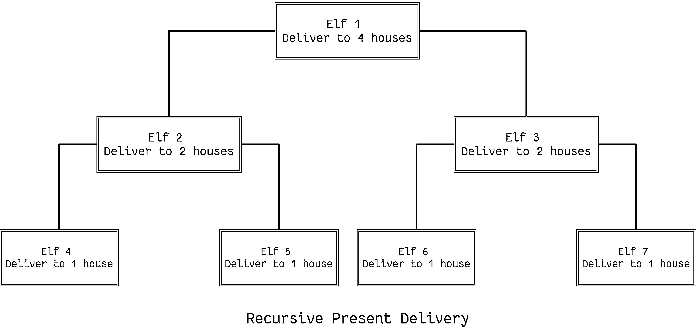

# 用 Python 递归思考

> 原文：<https://realpython.com/python-thinking-recursively/>

*立即观看**本教程有真实 Python 团队创建的相关视频课程。和写好的教程一起看，加深理解: [**用 Python 递归思考**](/courses/thinking-recursively-python/)

> “在我介绍给孩子们的所有想法中，递归是特别能够引起兴奋反应的一个想法。”
> 
> — *西蒙·派珀特，头脑风暴*

[](https://files.realpython.com/media/fixing_problems.ffd6d34e887e.png)

<figcaption class="figure-caption text-center">Image: [xkcd.com](https://www.xkcd.com/1739)</figcaption>

(生活中以及计算机科学中的)问题常常看起来很大，很可怕。但是如果我们不断地解决它们，通常我们可以把它们分解成更小的块，小到足以解决问题。这是递归思维的本质，我在这篇文章中的目的是向你，我亲爱的读者，提供从这个递归观点处理问题所必需的概念工具。

通过掌握递归函数和递归数据结构等概念，我们将一起学习如何在 Python 程序中使用递归。我们还将讨论在递归期间维护状态，以及通过[缓存结果来避免重新计算。](https://realpython.com/python-memcache-efficient-caching/)这将会非常有趣。向前向上！

## 亲爱的 Pythonic 圣诞老人……

我意识到作为 Pythonistas 的同伴，我们在这里都是同意的成年人，但孩子们似乎更好地探索递归之美。所以让我们暂时不要像成年人一样，讨论一下我们如何使用递归来帮助圣诞老人。

你有没有想过圣诞礼物是怎么送的？我当然有，而且我相信圣诞老人有一张他循环经过的房子的清单。他去一所房子，放下礼物，吃了饼干和牛奶，然后去名单上的下一所房子。因为这个传递礼物的算法是基于一个显式的循环结构，所以它被称为迭代算法。

[](https://files.realpython.com/media/santa_claus_2.ecbf2686f1a1.png)

用 Python 实现的迭代提交算法；

```py
houses = ["Eric's house", "Kenny's house", "Kyle's house", "Stan's house"]

def deliver_presents_iteratively():
    for house in houses:
        print("Delivering presents to", house)
```

>>>

```py
>>> deliver_presents_iteratively()
Delivering presents to Eric's house
Delivering presents to Kenny's house
Delivering presents to Kyle's house
Delivering presents to Stan's house
```

但我同情圣诞老人。在他这个年龄，他不应该自己送所有的礼物。我提出了一个算法，他可以用这个算法在他的小精灵之间分配送礼物的工作:

> 1.  Appoint an elf and give him all the work.
> 2.  Assign titles and responsibilities according to the number of houses the elves are responsible for:
>     *   `> 1` He is a manager who can appoint two elves and distribute work among them.
>     *   `= 1` He is a worker, and he must send gifts to the house assigned to him.

[](https://files.realpython.com/media/elves_7.8d1af1cd85c8.png)

这是递归算法的典型结构。如果当前的问题代表一个简单的案例，那就解决它。如果不是，把它分成子问题，并对它们应用同样的策略。

用 Python 实现的递归礼物递送算法；

```py
houses = ["Eric's house", "Kenny's house", "Kyle's house", "Stan's house"]

# Each function call represents an elf doing his work 
def deliver_presents_recursively(houses):
    # Worker elf doing his work
    if len(houses) == 1:
        house = houses[0]
        print("Delivering presents to", house)

    # Manager elf doing his work
    else:
        mid = len(houses) // 2
        first_half = houses[:mid]
        second_half = houses[mid:]

        # Divides his work among two elves
        deliver_presents_recursively(first_half)
        deliver_presents_recursively(second_half)
```

>>>

```py
>>> deliver_presents_recursively(houses)
Delivering presents to Eric's house
Delivering presents to Kenny's house
Delivering presents to Kyle's house
Delivering presents to Stan's house
```

[*Remove ads*](/account/join/)

## Python 中的递归函数

现在我们对递归有了一些直觉，让我们介绍递归函数的正式定义。递归函数是通过自引用表达式根据自身定义的函数。

这意味着函数将继续调用自身并重复其行为，直到满足某个条件[返回](https://realpython.com/python-return-statement/)一个结果。所有的递归函数共享一个由两部分组成的公共结构:基格和递归格。

为了演示这个结构，让我们编写一个计算`n!`的递归函数:

1.  将原始问题分解成同一问题的更简单的实例。这是递归情况:

    ```py
    n! = n x (n−1) x (n−2) x (n−3) ⋅⋅⋅⋅ x 3 x 2 x 1
    n! = n x (n−1)!` 
    ```

2.  随着大问题被分解成一个个越来越不复杂的问题，这些子问题最终一定会变得非常简单，不需要进一步细分就可以解决。这是基本情况:

    ```py
    n! = n x (n−1)! 
    n! = n x (n−1) x (n−2)!
    n! = n x (n−1) x (n−2) x (n−3)!
    ⋅
    ⋅
    n! = n x (n−1) x (n−2) x (n−3) ⋅⋅⋅⋅ x 3!
    n! = n x (n−1) x (n−2) x (n−3) ⋅⋅⋅⋅ x 3 x 2!
    n! = n x (n−1) x (n−2) x (n−3) ⋅⋅⋅⋅ x 3 x 2 x 1!` 
    ```

这里，`1!`是我们的基本情况，它等于`1`。

用 Python 实现的用于计算`n!`的递归函数:

```py
def factorial_recursive(n):
    # Base case: 1! = 1
    if n == 1:
        return 1

    # Recursive case: n! = n * (n-1)!
    else:
        return n * factorial_recursive(n-1)
```

>>>

```py
>>> factorial_recursive(5)
120
```

在幕后，每个递归调用都向调用堆栈添加一个堆栈帧(包含其执行上下文),直到我们到达基本情况。然后，随着每个调用返回其结果，堆栈开始展开:

[](https://files.realpython.com/media/stack.9c4ba62929cf.gif)

## 保持状态

在处理递归函数时，请记住每个递归调用都有自己的执行上下文，因此为了在递归期间保持状态，您必须:

*   通过每个递归调用来线程化状态，以便当前状态是当前调用的执行上下文的一部分
*   将状态保持在全局范围内

一次演示应该能让事情变得更清楚。让我们用递归来计算`1 + 2 + 3 ⋅⋅⋅⋅ + 10`。我们要维护的状态是*(当前正在加的数，到目前为止的累计数)*。

下面是如何通过在每个递归调用中使用[线程](https://realpython.com/intro-to-python-threading/)来实现的(例如，将更新后的当前状态作为参数传递给每个递归调用):

```py
def sum_recursive(current_number, accumulated_sum):
    # Base case
    # Return the final state
    if current_number == 11:
        return accumulated_sum

    # Recursive case
    # Thread the state through the recursive call
    else:
        return sum_recursive(current_number + 1, accumulated_sum + current_number)
```

>>>

```py
# Pass the initial state
>>> sum_recursive(1, 0)
55
```

[](https://files.realpython.com/media/state_3.3e8a68c4fde5.png)

下面是如何通过将状态保持在全局[范围](https://realpython.com/python-namespaces-scope/)来维护状态:

```py
# Global mutable state
current_number = 1
accumulated_sum = 0

def sum_recursive():
    global current_number
    global accumulated_sum
    # Base case
    if current_number == 11:
        return accumulated_sum
    # Recursive case
    else:
        accumulated_sum = accumulated_sum + current_number
        current_number = current_number + 1
        return sum_recursive()
```

>>>

```py
>>> sum_recursive()
55
```

我更喜欢在每个递归调用中线程化状态，因为我发现全局可变状态是邪恶的，但这将在以后讨论。

[*Remove ads*](/account/join/)

## Python 中的递归数据结构

如果一个数据结构可以用它自身的一个更小的版本来定义，那么它就是递归的。列表是递归数据结构的一个例子。让我来演示一下。假设您只有一个空列表，您可以对它执行的唯一操作是:

```py
# Return a new list that is the result of
# adding element to the head (i.e. front) of input_list
def attach_head(element, input_list):
    return [element] + input_list
```

使用空列表和`attach_head`操作，你可以生成任何列表。例如，让我们生成`[1, 46, -31, "hello"]`:

```py
attach_head(1,                                                  # Will return [1, 46, -31, "hello"]
            attach_head(46,                                     # Will return [46, -31, "hello"]
                        attach_head(-31,                        # Will return [-31, "hello"]
                                    attach_head("hello", [])))) # Will return ["hello"]
```

```py
[1, 46, -31, 'hello']
```

[](https://files.realpython.com/media/list.3df62a89243d.gif)

1.  从一个空列表开始，您可以通过递归地应用`attach_head`函数来生成任何列表，因此列表数据结构可以递归地定义为:

    ```py
     +---- attach_head(element, smaller list)
    list = +
           +---- empty list` 
    ```

2.  递归也可以看作是自引用的函数合成。我们将一个函数应用于一个参数，然后将结果作为一个参数传递给同一个函数的第二个应用程序，依此类推。用自己反复作曲`attach_head`和`attach_head`反复调用自己是一样的。

列表不是唯一的递归数据结构。其他例子还包括[集合](https://realpython.com/python-sets/)，树，[字典](https://realpython.com/python-dicts/)等。

递归数据结构和递归函数形影不离。递归函数的结构通常可以根据它作为输入的递归数据结构的定义来建模。让我通过递归计算列表中所有元素的总和来演示这一点:

```py
def list_sum_recursive(input_list):
    # Base case
    if input_list == []:
        return 0

    # Recursive case
    # Decompose the original problem into simpler instances of the same problem
    # by making use of the fact that the input is a recursive data structure
    # and can be defined in terms of a smaller version of itself
    else:
        head = input_list[0]
        smaller_list = input_list[1:]
        return head + list_sum_recursive(smaller_list)
```

>>>

```py
>>> list_sum_recursive([1, 2, 3])
6
```

## 幼稚递归是幼稚的

斐波那契数列最初是由意大利数学家斐波那契在十三世纪定义的，用来模拟兔子数量的增长。斐波那契推测，从第一年的一对兔子开始，某一年出生的兔子对的数量等于前两年每年出生的兔子对的数量。

为了计算第 n 年出生的兔子数量，他定义了递归关系:

```py
Fn = Fn-1 + Fn-2
```

基本情况是:

```py
F0 = 0 and F1 = 1
```

让我们编写一个递归函数来计算第 n 个斐波那契数:

```py
def fibonacci_recursive(n):
    print("Calculating F", "(", n, ")", sep="", end=", ")

    # Base case
    if n == 0:
        return 0
    elif n == 1:
        return 1

    # Recursive case
    else:
        return fibonacci_recursive(n-1) + fibonacci_recursive(n-2)
```

>>>

```py
>>> fibonacci_recursive(5)
Calculating F(5), Calculating F(4), Calculating F(3), Calculating F(2), Calculating F(1), 
Calculating F(0), Calculating F(1), Calculating F(2), Calculating F(1), Calculating F(0), 
Calculating F(3), Calculating F(2), Calculating F(1), Calculating F(0), Calculating F(1),

5
```

天真地遵循第 n 个斐波那契数的递归定义是相当低效的。从上面的输出可以看出，我们不必要地重新计算了值。让我们通过缓存每次斐波那契计算 F <sub>k</sub> 的结果来尝试改进`fibonacci_recursive`:

```py
from functools import lru_cache

@lru_cache(maxsize=None)
def fibonacci_recursive(n):
    print("Calculating F", "(", n, ")", sep="", end=", ")

    # Base case
    if n == 0:
        return 0
    elif n == 1:
        return 1

    # Recursive case
    else:
        return fibonacci_recursive(n-1) + fibonacci_recursive(n-2)
```

>>>

```py
>>> fibonacci_recursive(5)
Calculating F(5), Calculating F(4), Calculating F(3), Calculating F(2), Calculating F(1), Calculating F(0),

5
```

[`lru_cache`](https://realpython.com/lru-cache-python/) 是缓存结果的[装饰器](https://realpython.com/primer-on-python-decorators/)。因此，我们通过在试图计算值之前显式检查该值来避免重新计算。关于`lru_cache`需要记住的一点是，因为它使用字典来缓存结果，所以函数的位置和关键字参数(在字典中充当键)必须是可散列的。

[*Remove ads*](/account/join/)

## 讨厌的细节

Python 不支持[尾调用消除](https://en.wikipedia.org/wiki/Tail_call)。因此，如果您最终使用了比[默认调用堆栈深度](https://docs.python.org/3.6/library/sys.html#sys.getrecursionlimit)更多的堆栈帧，就会导致堆栈溢出:

>>>

```py
>>> import sys
>>> sys.getrecursionlimit()
3000
```

如果你有一个需要深度递归的程序，请记住这个限制。

此外，Python 的可变数据结构不支持结构化共享，所以像对待[不可变数据结构](https://en.wikipedia.org/wiki/Persistent_data_structure)一样对待它们将会对您的空间和 [GC(垃圾收集)](https://realpython.com/python-memory-management/#garbage-collection)效率产生负面影响，因为您将会不必要地复制大量可变对象。例如，我使用这种模式来分解列表并对其进行递归:

>>>

```py
>>> input_list = [1, 2, 3]
>>> head = input_list[0]
>>> tail = input_list[1:]
>>> print("head --", head)
head -- 1
>>> print("tail --", tail)
tail -- [2, 3]
```

为了清楚起见，我这样做是为了简化事情。请记住，tail 是通过复制创建的。在大型列表上递归地这么做可能会对您的空间和 GC 效率产生负面影响。

## 鳍

我曾经在一次面试中被要求解释递归。我拿了一张纸，两面都写了`Please turn over`。面试官没有理解这个笑话，但是既然你已经读了这篇文章，希望你能理解🙂快乐的蟒蛇！

## 参考文献

1.  [递归思考](https://realpython.com/asins/0471816523/)
2.  [小阴谋家](https://realpython.com/asins/0262560992/)
3.  [计算机编程的概念、技术和模型](https://realpython.com/asins/0262220695/)
4.  [算法设计手册](https://realpython.com/asins/1848000693/)
5.  [Haskell 编程从第一原理](http://haskellbook.com/)

*立即观看**本教程有真实 Python 团队创建的相关视频课程。和写好的教程一起看，加深理解: [**用 Python 递归思考**](/courses/thinking-recursively-python/)*****