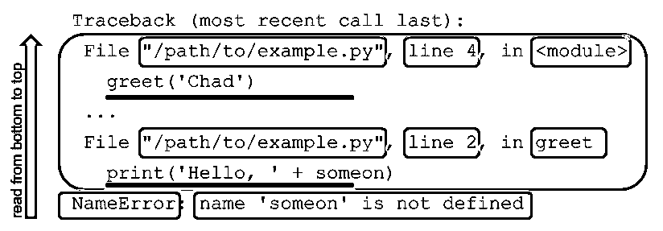

# 了解 Python 回溯

> 原文：<https://realpython.com/python-traceback/>

*立即观看**本教程有真实 Python 团队创建的相关视频课程。与书面教程一起观看，加深您的理解: [**充分利用 Python 回溯**](/courses/python-traceback/)

当代码中出现异常时，Python 会打印一个**回溯**。如果你是第一次看到回溯输出，或者你不知道它在告诉你什么，那么回溯输出可能有点让人不知所措。但是 Python traceback 提供了丰富的信息，可以帮助您诊断和修复代码中引发异常的原因。理解 Python 回溯提供的信息对于成为更好的 Python 程序员至关重要。

**本教程结束时，你将能够:**

*   理解你看到的下一个追溯
*   认识一些更常见的追溯
*   成功记录回溯，同时仍然处理异常

**免费奖励:** ，它向您展示 Python 3 的基础知识，如使用数据类型、字典、列表和 Python 函数。

## 什么是 Python 回溯？

回溯是一份报告，其中包含代码中特定点的函数调用。回溯有很多名字，包括**栈跟踪**、**栈回溯**、**回溯**等等。在 Python 中，使用的术语是**回溯**。

当你的程序导致一个异常时，Python 会打印当前的回溯来帮助你知道哪里出错了。下面是一个说明这种情况的例子:

```py
# example.py
def greet(someone):
    print('Hello, ' + someon)

greet('Chad')
```

这里，`greet()`用参数`someone`调用。然而，在`greet()`中，没有使用那个[变量](https://realpython.com/python-variables/)名称。反而在 [`print()`](https://realpython.com/python-print/) 调用中被拼错为`someon`。

**注意:**本教程假设您理解 Python 异常。如果你不熟悉或者只是想复习一下，那么你应该看看 [Python 异常:简介](https://realpython.com/python-exceptions/)。

当您运行此程序时，您将获得以下回溯:

```py
$ python example.py
Traceback (most recent call last):
 File "/path/to/example.py", line 4, in <module>
 greet('Chad')
 File "/path/to/example.py", line 2, in greet
 print('Hello, ' + someon)
NameError: name 'someon' is not defined
```

这个回溯输出包含了诊断问题所需的所有信息。回溯输出的最后一行告诉您引发了什么类型的异常，以及关于该异常的一些相关信息。回溯的前几行指出了导致引发异常的代码。

在上面的回溯中，异常是一个`NameError`，这意味着有一个对某个名称(变量、函数、类)的引用还没有被定义。在这种情况下，引用的名称是`someon`。

这种情况下的最后一行有足够的信息来帮助您解决问题。在代码中搜索名字`someon`，这是一个拼写错误，将为您指出正确的方向。然而，通常你的代码要复杂得多。

[*Remove ads*](/account/join/)

## 如何解读 Python 回溯？

当您试图确定代码中出现异常的原因时，Python traceback 包含大量有用的信息。在本节中，您将通过不同的回溯来理解回溯中包含的不同信息。

### Python 回溯概述

每个 Python 回溯都有几个重要的部分。下图突出显示了各个部分:

[](https://files.realpython.com/media/python_traceback_2.b27a4eb060a8.png)

在 Python 中，最好从下往上读回溯:

1.  **蓝框:**回溯的最后一行是错误信息行。它包含引发的异常名称。

2.  **绿框:**异常名称后是错误信息。此消息通常包含有助于理解引发异常的原因的信息。

3.  **黄色框:**追溯的更高部分是从下到上移动的各种函数调用，从最近到最近。这些呼叫由每个呼叫的两行条目表示。每个调用的第一行包含诸如文件名、行号和模块名之类的信息，所有这些信息都指定了在哪里可以找到代码。

4.  **红色下划线:**这些调用的第二行包含实际执行的代码。

在命令行中执行代码时的回溯输出和在 REPL 中运行代码时的回溯输出有一些不同。下面是在 REPL 中执行的上一节中的相同代码以及由此产生的回溯输出:

>>>

```py
>>> def greet(someone):
...   print('Hello, ' + someon)
... 
>>> greet('Chad')
Traceback (most recent call last):
  File "<stdin>", line 1, in <module>
  File "<stdin>", line 2, in greet
NameError: name 'someon' is not defined
```

注意，代替文件名的是`"<stdin>"`。这是有意义的，因为您是通过标准输入来键入代码的。此外，已执行的代码行不会显示在回溯中。

**注意**:如果你习惯于在其他编程语言中看到堆栈跟踪，那么你会注意到 Python 回溯相比之下的主要区别。大多数其他语言将异常打印在顶部，然后从上到下，从最近调用到最近调用。

已经有人说过了，但只是重申一下，Python 回溯应该从下往上读。这非常有帮助，因为回溯被打印出来，并且您的终端(或者您正在读取回溯的任何地方)通常在输出的底部结束，这给了您开始读取回溯的完美位置。

### 具体追溯演练

查看一些特定的回溯输出将有助于您更好地理解和了解回溯会给您提供什么信息。

下面的示例中使用了下面的代码来说明 Python 回溯所提供的信息:

```py
# greetings.py
def who_to_greet(person):
    return person if person else input('Greet who? ')

def greet(someone, greeting='Hello'):
    print(greeting + ', ' + who_to_greet(someone))

def greet_many(people):
    for person in people:
        try:
            greet(person)
        except Exception:
            print('hi, ' + person)
```

这里，`who_to_greet()`接受一个值，`person`，要么返回它，要么提示返回一个值。

然后，`greet()`取一个要问候的名字，`someone`，和一个可选的`greeting`值，调用 [`print()`](https://realpython.com/courses/python-print/) 。`who_to_greet()`也通过传入的`someone`值被调用。

最后，`greet_many()`将迭代`people`的列表并调用`greet()`。如果调用`greet()`引发了异常，则打印一个简单的备份问候。

只要提供了正确的输入，这段代码没有任何会导致异常的错误。

如果您将对`greet()`的调用添加到`greetings.py`的底部，并指定一个它不期望的关键字参数(例如`greet('Chad', greting='Yo')`，那么您将得到以下回溯:

```py
$ python example.py
Traceback (most recent call last):
 File "/path/to/greetings.py", line 19, in <module>
 greet('Chad', greting='Yo')
TypeError: greet() got an unexpected keyword argument 'greting'
```

同样，使用 Python 回溯，最好向后工作，向上移动输出。从回溯的最后一行开始，您可以看到异常是一个`TypeError`。异常类型后面的消息，冒号后面的所有内容，为您提供了一些有用的信息。它告诉你`greet()`是用一个它没有预料到的关键字参数调用的。未知的参数名称也给你:`greting`。

向上移动，您可以看到导致异常的那一行。在本例中，是我们添加到`greetings.py`底部的`greet()`调用。

下一行给出了代码所在文件的路径、可以找到代码的文件的行号以及代码所在的模块。在这种情况下，因为我们的代码没有使用任何其他 Python 模块，所以我们在这里只看到了`<module>`，这意味着这是正在执行的文件。

使用不同的文件和不同的输入，您可以看到回溯确实为您指出了找到问题的正确方向。如果您正在跟进，从`greetings.py`的底部删除有问题的`greet()`调用，并将以下文件添加到您的目录中:

```py
# example.py
from greetings import greet

greet(1)
```

在这里，您已经设置了另一个 Python 文件，该文件导入您之前的模块`greetings.py`，并从中使用`greet()`。如果你现在运行`example.py`，会发生以下情况:

```py
$ python example.py
Traceback (most recent call last):
 File "/path/to/example.py", line 3, in <module>
 greet(1)
 File "/path/to/greetings.py", line 5, in greet
 print(greeting + ', ' + who_to_greet(someone))
TypeError: must be str, not int
```

在这种情况下引发的异常又是一个`TypeError`,但是这一次这个消息没有那么有用。它告诉你，在代码的某个地方，它期望处理一个字符串，但是给定的是一个整数。

向上移动，您会看到执行的代码行。然后是代码的文件和行号。然而，这一次，我们得到的不是`<module>`，而是正在执行的函数的名称`greet()`。

移到下一个执行的代码行，我们看到有问题的`greet()`调用传入了一个整数。

有时，在引发异常后，另一段代码会捕获该异常并导致异常。在这些情况下，Python 将按照接收的顺序输出所有异常回溯，再次以最近引发的异常回溯结束。

由于这可能有点令人困惑，这里有一个例子。将对`greet_many()`的调用添加到`greetings.py`的底部:

```py
# greetings.py
...
greet_many(['Chad', 'Dan', 1])
```

这应该会打印出对这三个人的问候。但是，如果您运行这段代码，您将看到一个输出多个回溯的示例:

```py
$ python greetings.py
Hello, Chad
Hello, Dan
Traceback (most recent call last):
 File "greetings.py", line 10, in greet_many
 greet(person)
 File "greetings.py", line 5, in greet
 print(greeting + ', ' + who_to_greet(someone))
TypeError: must be str, not int

During handling of the above exception, another exception occurred: 
Traceback (most recent call last):
 File "greetings.py", line 14, in <module>
 greet_many(['Chad', 'Dan', 1])
 File "greetings.py", line 12, in greet_many
 print('hi, ' + person)
TypeError: must be str, not int
```

注意上面输出中以`During handling`开始的高亮行。在所有回溯之间，你会看到这条线。它的信息非常清楚，当您的代码试图处理前一个异常时，另一个异常出现了。

**注意**:Python 3 中增加了显示之前异常回溯的特性。在 Python 2 中，您将只能获得最后一个异常的回溯。

你以前见过前面的异常，当你用一个整数调用`greet()`时。因为我们在要问候的人的列表中添加了一个`1`，所以我们可以期待相同的结果。然而，函数`greet_many()`将`greet()`调用包装在`try`和`except`块中。万一`greet()`导致一个异常被引发，`greet_many()`想要打印一个默认的问候。

这里重复了`greetings.py`的相关部分:

```py
def greet_many(people):
    for person in people:
        try:
            greet(person)
        except Exception:
            print('hi, ' + person)
```

因此，当`greet()`因为错误的整数输入而导致`TypeError`时，`greet_many()`会处理这个异常并尝试打印一个简单的问候。在这里，代码最终导致另一个类似的异常。它仍在尝试添加一个字符串和一个整数。

查看所有回溯输出可以帮助您了解异常的真正原因。有时，当您看到最后一个异常被引发，以及它导致的回溯时，您仍然看不到哪里出了问题。在这些情况下，转到前面的异常通常会让您更好地了解根本原因。

[*Remove ads*](/account/join/)

## Python 中有哪些常见的回溯？

在编程时，知道如何在程序引发异常时读取 Python 回溯会非常有帮助，但是知道一些更常见的回溯也可以加快您的过程。

以下是您可能遇到的一些常见异常，它们出现的原因和含义，以及您可以在它们的回溯中找到的信息。

### `AttributeError`

当您试图访问一个没有定义属性的对象的属性时，就会引发`AttributeError`。Python 文档定义了何时引发此异常:

> 当属性引用或赋值失败时引发。[(来源)](https://docs.python.org/3/library/exceptions.html#AttributeError)

下面是一个`AttributeError`被提升的例子:

>>>

```py
>>> an_int = 1
>>> an_int.an_attribute
Traceback (most recent call last):
  File "<stdin>", line 1, in <module>
AttributeError: 'int' object has no attribute 'an_attribute'
```

一个`AttributeError`的错误信息行告诉您，特定的对象类型，在本例中为`int`，没有被访问的属性，在本例中为`an_attribute`。看到错误消息行中的`AttributeError`可以帮助您快速识别您试图访问哪个属性以及到哪里去修复它。

大多数情况下，得到这个异常表明您可能正在使用一个不是您所期望的类型的对象:

>>>

```py
>>> a_list = (1, 2)
>>> a_list.append(3)
Traceback (most recent call last):
  File "<stdin>", line 1, in <module>
AttributeError: 'tuple' object has no attribute 'append'
```

在上面的例子中，你可能期望`a_list`是 [`list`](https://realpython.com/python-lists-tuples/) 类型，它有一个叫做 [`.append()`](https://realpython.com/python-append/) 的方法。当您收到`AttributeError`异常，并看到它是在您试图调用`.append()`时引发的，这告诉您您可能没有处理您所期望的对象类型。

通常，当您期望从函数或方法调用中返回一个特定类型的对象时，就会发生这种情况，而您最终得到了一个类型为 [`None`](https://realpython.com/null-in-python/) 的对象。在这种情况下，错误信息行将显示为`AttributeError: 'NoneType' object has no attribute 'append'`。

### `ImportError`

当一个[导入](https://realpython.com/absolute-vs-relative-python-imports/)语句出错时，就会引发`ImportError`。如果你试图[导入](https://realpython.com/python-import/)的模块找不到，或者如果你试图从一个不存在的模块中导入一些东西，你就会得到这个异常，或者它的子类`ModuleNotFoundError`。Python 文档定义了何时引发此异常:

> 当 import 语句在尝试加载模块时遇到问题时引发。当`from ... import`中的“from list”有一个找不到的名称时也会引发。[(来源)](https://docs.python.org/3/library/exceptions.html#ImportError)

下面是一个`ImportError`和`ModuleNotFoundError`被提升的例子:

>>>

```py
>>> import asdf
Traceback (most recent call last):
  File "<stdin>", line 1, in <module>
ModuleNotFoundError: No module named 'asdf'
>>> from collections import asdf
Traceback (most recent call last):
  File "<stdin>", line 1, in <module>
ImportError: cannot import name 'asdf'
```

在上面的例子中，您可以看到试图导入一个不存在的模块`asdf`，导致了`ModuleNotFoundError`。当试图从一个存在的模块`collections`中导入一个不存在的东西`asdf`时，这会导致一个`ImportError`。回溯底部的错误信息行告诉您哪一项不能被导入，在两种情况下都是`asdf`。

### `IndexError`

当你试图从一个序列中检索一个索引时，比如一个 [`list`或者一个`tuple`](https://realpython.com/python-lists-tuples/) ，而这个索引在序列中找不到时，就会引发`IndexError`。Python 文档定义了何时引发此异常:

> 当序列下标超出范围时引发。[(来源)](https://docs.python.org/3/library/exceptions.html#IndexError)

这里有一个引发`IndexError`的例子:

>>>

```py
>>> a_list = ['a', 'b']
>>> a_list[3]
Traceback (most recent call last):
  File "<stdin>", line 1, in <module>
IndexError: list index out of range
```

一个`IndexError`的错误信息行并没有给你太多的信息。你可以看到你有一个序列引用是`out of range`和序列的类型是什么，在这种情况下是`list`。这些信息与其余的回溯信息结合起来，通常足以帮助您快速确定如何修复问题。

[*Remove ads*](/account/join/)

### `KeyError`

与`IndexError`类似，当您试图访问一个不在映射中的键(通常是一个`dict`)时，就会引发`KeyError`。把这个当做`IndexError`但是对于[字典](https://realpython.com/python-dicts/)来说。Python 文档定义了何时引发此异常:

> 在现有键集中找不到映射(字典)键时引发。[(来源)](https://docs.python.org/3/library/exceptions.html#KeyError)

下面是一个`KeyError`被提升的例子:

>>>

```py
>>> a_dict['b']
Traceback (most recent call last):
  File "<stdin>", line 1, in <module>
KeyError: 'b'
```

`KeyError`的错误信息行给出了找不到的键。这不是很多，但结合其余的追溯，通常足以修复问题。

要深入了解`KeyError`，请看一下 [Python KeyError 异常以及如何处理它们](https://realpython.com/python-keyerror/)。

### `NameError`

当你引用了一个变量、模块、类、函数或者其他一些你的代码中没有定义的名字时，就会引发`NameError`。Python 文档定义了何时引发此异常:

> 找不到本地或全局名称时引发。[(来源)](https://docs.python.org/3/library/exceptions.html#NameError)

在下面的代码中，`greet()`接受一个参数`person`。但是在函数本身中，这个参数被拼错成了`persn`:

>>>

```py
>>> def greet(person):
...     print(f'Hello, {persn}')
>>> greet('World')
Traceback (most recent call last):
  File "<stdin>", line 1, in <module>
  File "<stdin>", line 2, in greet
NameError: name 'persn' is not defined
```

`NameError`回溯的错误信息行给出了缺少的名字。在上面的例子中，它是传入函数的一个拼写错误的变量或参数。

如果是您拼错的参数，也会引发一个`NameError`:

>>>

```py
>>> def greet(persn):
...     print(f'Hello, {person}')
>>> greet('World')
Traceback (most recent call last):
  File "<stdin>", line 1, in <module>
  File "<stdin>", line 2, in greet
NameError: name 'person' is not defined
```

在这里，看起来你好像没有做错什么。回溯中执行和引用的最后一行看起来不错。如果您发现自己处于这种情况，那么要做的事情就是仔细检查您的代码，看看在哪里使用和定义了`person`变量。在这里，您可以很快看到参数名称拼写错误。

### `SyntaxError`

当您的代码中有不正确的 Python 语法时，会引发 [`SyntaxError`](https://realpython.com/invalid-syntax-python/) 。Python 文档定义了何时引发此异常:

> 当分析器遇到语法错误时引发。[(来源)](https://docs.python.org/3/library/exceptions.html#SyntaxError)

下面，问题是在函数定义行的末尾缺少了一个冒号。在 Python REPL 中，按 enter 键后会立即出现此语法错误:

>>>

```py
>>> def greet(person)
  File "<stdin>", line 1
    def greet(person)
                    ^
SyntaxError: invalid syntax
```

`SyntaxError`的错误信息行只告诉你代码的语法有问题。查看上面的行可以找到有问题的行，通常还有一个`^`(插入符号)指向问题点。这里，函数的`def`语句中缺少冒号。

同样，使用`SyntaxError`回溯，常规的第一行`Traceback (most recent call last):`会丢失。这是因为当 Python 试图解析代码时会引发`SyntaxError`，而这些行实际上并没有被执行。

[*Remove ads*](/account/join/)

### `TypeError`

当你的代码试图用一个对象做一些不能做的事情时，比如试图将一个字符串加到一个整数上，或者在一个长度没有定义的对象上调用`len()`，就会引发`TypeError`。Python 文档定义了何时引发此异常:

> 当操作或函数应用于不适当类型的对象时引发。[(来源)](https://docs.python.org/3/library/exceptions.html#TypeError)

下面是几个被引发的`TypeError`的例子:

>>>

```py
>>> 1 + '1'
Traceback (most recent call last):
  File "<stdin>", line 1, in <module>
TypeError: unsupported operand type(s) for +: 'int' and 'str'
>>> '1' + 1
Traceback (most recent call last):
  File "<stdin>", line 1, in <module>
TypeError: must be str, not int
>>> len(1)
Traceback (most recent call last):
  File "<stdin>", line 1, in <module>
TypeError: object of type 'int' has no len()
```

以上所有引发`TypeError`的例子都会导致一个包含不同消息的错误消息行。它们中的每一个都能很好地告诉你哪里出了问题。

前两个示例尝试将字符串和整数相加。然而，它们有细微的不同:

*   第一个是尝试将一个`str`添加到一个`int`中。
*   第二个是尝试将一个`int`添加到一个`str`中。

错误信息行反映了这些差异。

最后一个例子试图在一个`int`上调用`len()`。错误信息行告诉你，你不能用`int`这样做。

### `ValueError`

当对象的值不正确时会引发`ValueError`。你可以认为这是因为索引的值不在序列的范围内而引发的`IndexError`，只有`ValueError`是针对更一般的情况。Python 文档定义了何时引发此异常:

> 当操作或函数接收到类型正确但值不正确的参数，并且这种情况没有用更精确的异常(如`IndexError`)来描述时引发。[(来源)](https://docs.python.org/3/library/exceptions.html#ValueError)

这里有两个`ValueError`被加注的例子:

>>>

```py
>>> a, b, c = [1, 2]
Traceback (most recent call last):
  File "<stdin>", line 1, in <module>
ValueError: not enough values to unpack (expected 3, got 2)
>>> a, b = [1, 2, 3]
Traceback (most recent call last):
  File "<stdin>", line 1, in <module>
ValueError: too many values to unpack (expected 2)
```

这些示例中的`ValueError`错误信息行告诉您这些值到底有什么问题:

1.  在第一个例子中，您试图解包太多的值。错误消息行甚至告诉您，您期望解包 3 个值，但是得到了 2 个值。

2.  在第二个例子中，问题是你得到了太多的值，却没有足够的变量来将它们打包。

## 你如何记录回溯？

获得一个异常及其导致的 Python 回溯意味着您需要决定如何处理它。通常，修复代码是第一步，但有时问题出在意外或不正确的输入上。虽然在您的代码中提供这些情况是很好的，但有时通过记录回溯和做其他事情来隐藏异常也是有意义的。

下面是一个更真实的代码示例，它需要消除一些 Python 回溯。这个例子使用了 [`requests`库](https://2.python-requests.org/en/master/)。你可以在 [Python 的请求库(指南)](https://realpython.com/python-requests/)中找到更多关于它的信息:

```py
# urlcaller.py
import sys
import requests

response = requests.get(sys.argv[1])

print(response.status_code, response.content)
```

这段代码运行良好。当您运行这个脚本时，给它一个 URL 作为[命令行参数](https://realpython.com/python-command-line-arguments/)，它将调用这个 URL，然后打印 HTTP 状态代码和来自响应的内容。即使响应是 HTTP 错误状态，它也能工作:

```py
$ python urlcaller.py https://httpbin.org/status/200
200 b''
$ python urlcaller.py https://httpbin.org/status/500
500 b''
```

但是，有时脚本要检索的 URL 不存在，或者主机服务器关闭了。在这些情况下，这个脚本现在将引发一个未被捕获的`ConnectionError`异常，并打印一个回溯:

```py
$ python urlcaller.py http://thisurlprobablydoesntexist.com
...
During handling of the above exception, another exception occurred:

Traceback (most recent call last):
 File "urlcaller.py", line 5, in <module> response = requests.get(sys.argv[1])  File "/path/to/requests/api.py", line 75, in get
    return request('get', url, params=params, **kwargs)
  File "/path/to/requests/api.py", line 60, in request
    return session.request(method=method, url=url, **kwargs)
  File "/path/to/requests/sessions.py", line 533, in request
    resp = self.send(prep, **send_kwargs)
  File "/path/to/requests/sessions.py", line 646, in send
    r = adapter.send(request, **kwargs)
  File "/path/to/requests/adapters.py", line 516, in send
    raise ConnectionError(e, request=request)
requests.exceptions.ConnectionError: HTTPConnectionPool(host='thisurlprobablydoesntexist.com', port=80): Max retries exceeded with url: / (Caused by NewConnectionError('<urllib3.connection.HTTPConnection object at 0x7faf9d671860>: Failed to establish a new connection: [Errno -2] Name or service not known',))
```

这里的 Python 回溯可能很长，会引发许多其他异常，最终导致`ConnectionError`被`requests`本身引发。如果你向上追溯最后的异常，你可以看到问题都是从我们的代码的第 5 行`urlcaller.py`开始的。

如果您在 [`try`和`except`块](https://realpython.com/python-exceptions/#the-try-and-except-block-handling-exceptions)中包装违规行，捕捉适当的异常将允许您的脚本继续处理更多输入:

```py
# urlcaller.py
...
try:
    response = requests.get(sys.argv[1])
except requests.exceptions.ConnectionError:
    print(-1, 'Connection Error')
else:
    print(response.status_code, response.content)
```

上面的代码使用了一个带有`try`和`except`块的`else`子句。如果您不熟悉 Python 的这个特性，那么可以查看一下 [Python 异常:简介](https://realpython.com/python-exceptions/#the-else-clause)中关于`else`子句的部分。

现在，当您运行带有 URL 的脚本时，将会产生一个`ConnectionError`,您将得到一个状态代码的`-1`,以及内容`Connection Error`:

```py
$ python urlcaller.py http://thisurlprobablydoesntexist.com
-1 Connection Error
```

这很有效。然而，在大多数真实的系统中，您不希望只是消除异常和导致的回溯，而是希望记录回溯。记录回溯可以让你更好地理解程序中的错误。

**注意:**要了解更多关于 Python 日志系统的信息，请查看 Python 中的[日志](https://realpython.com/python-logging/)。

您可以通过导入 [`logging`包](https://realpython.com/python-logging-source-code/)，获得一个记录器，并在`try`和`except`块的`except`部分调用该记录器上的`.exception()`，在脚本中记录回溯。您的最终脚本应该类似于以下代码:

```py
# urlcaller.py
import logging import sys
import requests

logger = logging.getLogger(__name__) 
try:
    response = requests.get(sys.argv[1])
except requests.exceptions.ConnectionError as e:
 logger.exception()    print(-1, 'Connection Error')
else:
    print(response.status_code, response.content)
```

现在，当您为一个有问题的 URL 运行脚本时，它将打印预期的`-1`和`Connection Error`，但是它也将记录回溯:

```py
$ python urlcaller.py http://thisurlprobablydoesntexist.com
...
  File "/path/to/requests/adapters.py", line 516, in send
    raise ConnectionError(e, request=request)
requests.exceptions.ConnectionError: HTTPConnectionPool(host='thisurlprobablydoesntexist.com', port=80): Max retries exceeded with url: / (Caused by NewConnectionError('<urllib3.connection.HTTPConnection object at 0x7faf9d671860>: Failed to establish a new connection: [Errno -2] Name or service not known',))
-1 Connection Error
```

默认情况下，Python 会向标准错误(`stderr`)发送日志消息。这看起来好像我们根本没有抑制回溯输出。但是，如果您在重定向`stderr`时再次调用它，您可以看到日志记录系统正在工作，我们可以保存日志供以后使用:

```py
$ python urlcaller.py http://thisurlprobablydoesntexist.com 2> my-logs.log
-1 Connection Error
```

[*Remove ads*](/account/join/)

## 结论

Python 回溯包含大量信息，可以帮助您找到 Python 代码中的错误。这些回溯看起来有点吓人，但是一旦你把它分解开来，看看它试图向你展示什么，它们会非常有帮助。一行一行地浏览一些回溯会让你更好地理解它们所包含的信息，并帮助你最大限度地利用它们。

运行代码时获得 Python 回溯输出是改进代码的机会。这是 Python 试图帮助你的一种方式。

既然您已经知道了如何阅读 Python traceback，那么您可以通过学习更多的工具和技术来诊断您的 traceback 输出所告诉您的问题。Python 内置的 [`traceback`模块](https://docs.python.org/3.7/library/traceback.html)可以用来处理和检查回溯。当您需要从回溯输出中获取更多信息时,`traceback`模块会很有帮助。学习更多关于调试 Python 代码的一些[技术和在空闲状态下调试的方法](https://realpython.com/search?q=debugging)[也会有所帮助。](https://realpython.com/python-debug-idle/)

*立即观看**本教程有真实 Python 团队创建的相关视频课程。与书面教程一起观看，加深您的理解: [**充分利用 Python 回溯**](/courses/python-traceback/)*******