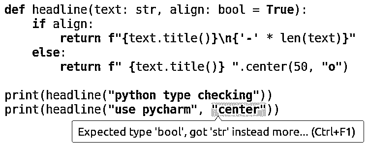
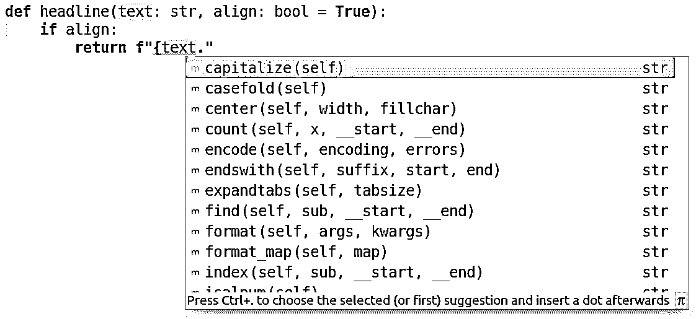

# Python 类型检查(指南)

> 原文：<https://realpython.com/python-type-checking/>

*立即观看**本教程有真实 Python 团队创建的相关视频课程。配合文字教程一起看，加深理解: [**Python 类型检查**](/courses/python-type-checking/)

在本指南中，您将了解 Python 类型检查。传统上，Python 解释器以灵活但隐含的方式处理类型。Python 的最新版本允许您指定显式类型提示，不同的工具可以使用这些提示来帮助您更高效地开发代码。

在本教程中，您将了解以下内容:

*   类型批注和类型提示
*   向代码中添加静态类型，包括您的代码和他人的代码
*   运行静态类型检查器
*   在运行时强制类型

这是一个全面的指南，将涵盖很多领域。如果您只想快速浏览一下 Python 中的类型提示是如何工作的，并看看类型检查是否会包含在您的代码中，您不需要阅读全部内容。两个部分 [Hello Types](#hello-types) 和[利弊](#pros-and-cons)将让您体验类型检查是如何工作的，以及它何时有用的建议。

**免费奖励:** [掌握 Python 的 5 个想法](https://realpython.com/bonus/python-mastery-course/)，这是一个面向 Python 开发者的免费课程，向您展示将 Python 技能提升到下一个水平所需的路线图和心态。

## 类型系统

所有的编程语言都包括某种类型的[类型系统](https://en.wikipedia.org/wiki/Type_system)，该系统形式化了它可以处理的对象类别以及如何处理这些类别。例如，类型系统可以定义数字类型，用`42`作为数字类型对象的一个例子。

[*Remove ads*](/account/join/)

### 动态打字

Python 是一种动态类型语言。这意味着 Python 解释器只在代码运行时进行类型检查，并且允许变量的类型在其生命周期内改变。以下虚拟示例演示了 Python 具有动态类型:

>>>

```py
>>> if False:
...     1 + "two"  # This line never runs, so no TypeError is raised
... else:
...     1 + 2
...
3

>>> 1 + "two"  # Now this is type checked, and a TypeError is raised
TypeError: unsupported operand type(s) for +: 'int' and 'str'
```

在第一个例子中，分支`1 + "two"`从不运行，所以它从不进行类型检查。第二个例子显示，当对`1 + "two"`求值时，它会产生一个`TypeError`，因为在 Python 中不能将整数和字符串相加。

接下来，让我们看看变量是否可以改变类型:

>>>

```py
>>> thing = "Hello"
>>> type(thing)
<class 'str'>

>>> thing = 28.1
>>> type(thing)
<class 'float'>
```

`type()`返回对象的类型。这些例子证实了`thing`的类型是允许改变的，Python 在它改变时正确地推断出了类型。

### 静态打字

动态类型的对立面是静态类型。静态类型检查是在不运行程序的情况下执行的。在大多数静态类型语言中，例如 [C](https://realpython.com/c-for-python-programmers/) 和 [Java](https://realpython.com/oop-in-python-vs-java/) ，这是在编译程序时完成的。

对于静态类型，通常不允许变量改变类型，尽管可能存在将变量转换为不同类型的机制。

让我们看一个静态类型语言的简单例子。考虑下面的 Java 片段:

```py
String  thing; thing  =  "Hello";
```

第一行声明变量名`thing`在编译时被绑定到`String`类型。该名称永远不能反弹到另一种类型。在第二行中，`thing`被赋值。它永远不能被赋予一个不是`String`对象的值。例如，如果你稍后说`thing = 28.1f`，编译器会因为不兼容的类型而抛出一个错误。

Python 将永远保持动态类型语言的地位。然而， [PEP 484](https://www.python.org/dev/peps/pep-0484/) 引入了类型提示，这使得对 Python 代码进行静态类型检查成为可能。

与大多数其他静态类型语言中类型的工作方式不同，类型提示本身不会导致 Python 强制类型。顾名思义，类型提示只是建议类型。还有其他一些工具，你将在后面看到它们使用类型提示来执行静态类型检查。

### 鸭子打字

另一个在谈论 Python 时经常用到的术语是 [duck typing](https://en.wikipedia.org/wiki/Duck_typing) 。这个绰号来自短语“如果它走路像鸭子，叫声像鸭子，那么它一定是一只鸭子”(或[及其任何变体](https://en.wikipedia.org/wiki/Duck_test#History))。

Duck typing 是一个与动态类型相关的概念，在动态类型中，对象的类型或类没有它定义的方法重要。使用 duck 类型，你根本不用检查类型。相反，您需要检查给定方法或属性的存在。

例如，您可以在任何定义了`.__len__()`方法的 Python 对象上调用`len()`:

>>>

```py
>>> class TheHobbit:
...     def __len__(self):
...         return 95022
...
>>> the_hobbit = TheHobbit()
>>> len(the_hobbit)
95022
```

注意，对`len()`的调用给出了`.__len__()`方法的返回值。事实上，`len()`的实现本质上相当于如下:

```py
def len(obj):
    return obj.__len__()
```

为了调用`len(obj)`，对`obj`唯一真正的约束是它必须定义一个`.__len__()`方法。否则，对象可以是不同的类型，如`str`、`list`、`dict`或`TheHobbit`。

当使用[结构子类型](https://en.wikipedia.org/wiki/Structural_type_system)对 Python 代码进行静态类型检查时，Duck 类型有所支持。稍后你会学到[更多关于鸭子打字](#duck-types-and-protocols)的知识。

[*Remove ads*](/account/join/)

## 你好类型

在本节中，您将看到如何向函数添加类型提示。以下函数通过添加适当的大写字母和装饰线将文本字符串转换为标题:

```py
def headline(text, align=True):
    if align:
        return f"{text.title()}\n{'-' * len(text)}"
    else:
        return f" {text.title()} ".center(50, "o")
```

默认情况下，该函数返回带有下划线的左对齐标题。通过将`align`标志设置为`False`，您可以选择将标题居中，并环绕一行`o`:

>>>

```py
>>> print(headline("python type checking"))
Python Type Checking
--------------------

>>> print(headline("python type checking", align=False))
oooooooooooooo Python Type Checking oooooooooooooo
```

现在是我们第一次类型提示的时候了！要将有关类型的信息添加到函数中，只需如下注释其参数和返回值:

```py
def headline(text: str, align: bool = True) -> str:
    ...
```

`text: str`语法规定`text`参数应该是`str`类型。类似地，可选的`align`参数应该具有类型`bool`，默认值为`True`。最后，`-> str`符号指定`headline()`将返回一个字符串。

在[风格](https://realpython.com/python-pep8/)方面， [PEP 8](https://www.python.org/dev/peps/pep-0008/#other-recommendations) 推荐如下:

*   对冒号使用常规规则，即冒号前没有空格，冒号后有一个空格:`text: str`。
*   将参数注释与默认值`align: bool = True`组合时，请在`=`符号周围使用空格。
*   在`->`箭头周围使用空格:`def headline(...) -> str`。

像这样添加类型提示没有运行时效果:它们只是提示，本身并不强制执行。例如，如果我们对`align`参数使用了错误的类型(不可否认，它的名字很糟糕),代码仍然可以运行，没有任何问题或警告:

>>>

```py
>>> print(headline("python type checking", align="left"))
Python Type Checking
--------------------
```

**注意:**这看似可行的原因是字符串`"left"` [比较起来像真值](https://realpython.com/python-operators-expressions/#evaluation-of-non-boolean-values-in-boolean-context)。使用`align="center"`不会有预期的效果，因为`"center"`也是真实的。

为了捕捉这种错误，您可以使用静态类型检查器。也就是说，这是一个检查代码类型的工具，而不是传统意义上的实际运行。

您可能已经在编辑器中内置了这样的类型检查器。例如 [PyCharm](https://www.jetbrains.com/pycharm/) 会立即给你一个警告:

[](https://files.realpython.com/media/pycharm_type_error.76a49b9d4ff1.png)

不过最常用的类型检查工具是 [Mypy](http://mypy-lang.org/) 。一会儿你会得到一个关于 Mypy 的简短介绍，稍后你会了解更多关于它如何工作的。

如果您的系统上还没有 Mypy，您可以使用`pip`安装它:

```py
$ pip install mypy
```

将以下代码放在名为`headlines.py`的文件中:

```py
 1# headlines.py
 2
 3def headline(text: str, align: bool = True) -> str:
 4    if align:
 5        return f"{text.title()}\n{'-' * len(text)}"
 6    else:
 7        return f" {text.title()} ".center(50, "o")
 8
 9print(headline("python type checking"))
10print(headline("use mypy", align="center"))
```

这基本上与您之前看到的代码相同:`headline()`的定义和两个使用它的例子。

现在对这段代码运行 Mypy:

```py
$ mypy headlines.py
headlines.py:10: error: Argument "align" to "headline" has incompatible
 type "str"; expected "bool"
```

根据类型提示，Mypy 能够告诉我们在第 10 行使用了错误的类型。

要修复代码中的问题，您应该更改传入的参数`align`的值。您也可以将`align`标志重命名为一个不太容易混淆的名称:

```py
 1# headlines.py
 2
 3def headline(text: str, centered: bool = False) -> str:
 4    if not centered:
 5        return f"{text.title()}\n{'-' * len(text)}"
 6    else:
 7        return f" {text.title()} ".center(50, "o")
 8
 9print(headline("python type checking"))
10print(headline("use mypy", centered=True))
```

在这里，您已经将`align`更改为`centered`，并且在调用`headline()`时正确地使用了一个[布尔值](https://realpython.com/python-boolean/)来表示`centered`。代码现在通过了 Mypy:

```py
$ mypy headlines.py
Success: no issues found in 1 source file
```

成功消息确认没有检测到类型错误。旧版本的 Mypy 通过不显示任何输出来表明这一点。此外，当您运行代码时，您会看到预期的输出:

```py
$ python headlines.py
Python Type Checking
--------------------
oooooooooooooooooooo Use Mypy oooooooooooooooooooo
```

第一个标题靠左对齐，而第二个标题居中。

[*Remove ads*](/account/join/)

## 利弊

上一节让您初步了解了 Python 中的类型检查。您还看到了向代码中添加类型的一个好处:类型提示帮助**捕捉某些错误**。其他优势包括:

*   类型提示帮助**记录你的代码**。传统上，如果你想记录函数参数的预期类型，你会使用[文档字符串](https://realpython.com/documenting-python-code/)。这是可行的，但是由于没有文档字符串的标准(尽管有 [PEP 257](https://www.python.org/dev/peps/pep-0257/) ，它们不能被容易地用于自动检查。

*   类型提示**改进 ide 和 linters** 。它们使得对代码进行静态推理变得更加容易。这反过来允许 ide 提供更好的代码完成和类似的特性。通过类型标注，PyCharm 知道`text`是一个字符串，并可以基于此给出具体建议:

    [](https://files.realpython.com/media/pycharm_code_completion.82857c2750f6.png)T4】

*   类型提示帮助你**构建和维护一个更干净的架构**。编写类型提示的行为迫使你考虑程序中的类型。虽然 Python 的动态特性是它的一大优点，但意识到依赖 duck 类型、重载方法或多返回类型是一件好事。

当然，静态类型检查并不全是桃子和奶油。还有一些你应该考虑的缺点:

*   类型提示**需要开发人员花费时间和精力来添加**。尽管花更少的时间[调试](https://realpython.com/python-debugging-pdb/)可能会有回报，但你会花更多的时间输入代码。

*   类型提示**在现代 python**中效果最好。注释是在 Python 3.0 中引入的，在 Python 2.7 中可以使用[类型的注释](#type-comments)。尽管如此，像[变量注释](#variable-annotations)和[推迟类型提示的评估](https://www.python.org/dev/peps/pep-0563/)这样的改进意味着使用 Python 3.6 甚至 [Python 3.7](https://realpython.com/python37-new-features/) 进行类型检查会有更好的体验。

*   类型提示**在启动时间**中引入了轻微的惩罚。如果你需要使用 [`typing`模块](#sequences-and-mappings)，那么[导入](https://realpython.com/absolute-vs-relative-python-imports/)的时间可能会很长，尤其是在短脚本中。


稍后你将了解`typing`模块，以及在大多数情况下当你添加类型提示时它是如何必要的。导入模块必然要花一些时间，但是要花多少时间呢？

为了了解这一点，创建两个文件:`empty_file.py`应该是一个空文件，而`import_typing.py`应该包含以下行:

```py
import typing
```

在 Linux 上，使用 [`perf`实用程序](https://perf.wiki.kernel.org/)很容易检查`typing` [导入](https://realpython.com/python-import/)需要多少时间:

```py
$ perf stat -r 1000 python3.6 import_typing.py

 Performance counter stats for 'python3.6 import_typing.py' (1000 runs):

 [ ... extra information hidden for brevity ... ]

 0.045161650 seconds time elapsed    ( +-  0.77% )
```

所以运行`import typing.py`脚本大约需要 45 毫秒。当然，这并不是花在导入`typing`上的所有时间。其中一些是启动 Python 解释器的开销，所以让我们比较一下在空文件上运行 Python:

```py
$ perf stat -r 1000 python3.6 empty_file.py

 Performance counter stats for 'python3.6 empty_file.py' (1000 runs):

 [ ... extra information hidden for brevity ... ]

 0.028077845 seconds time elapsed    ( +-  0.49% )
```

根据这个测试，在 Python 3.6 中，`typing`模块的导入大约需要 17 毫秒。

Python 3.7 中宣传的改进之一是[更快的启动](https://docs.python.org/3/whatsnew/3.7.html#optimizations)。让我们看看结果是否不同:

```py
$ perf stat -r 1000 python3.7 import_typing.py
 [...]
 0.025979806 seconds time elapsed    ( +-  0.31% )

$ perf stat -r 1000 python3.7 empty_file.py
 [...]
 0.020002505 seconds time elapsed    ( +-  0.30% )
```

事实上，一般启动时间减少了大约 8 毫秒，导入`typing`的时间从 17 毫秒减少到大约 6 毫秒——几乎快了 3 倍。

**使用`timeit`**

其他平台上也有类似的工具。Python 本身带有标准库中的`timeit`模块。通常，我们会直接使用`timeit`作为上面的计时。然而，`timeit`很难确定可靠的导入时间，因为 Python 擅长于只导入模块一次。考虑下面的例子:

```py
$ python3.6 -m timeit "import typing"
10000000 loops, best of 3: 0.134 usec per loop
```

当你得到一个结果时，你应该怀疑这个结果:0.1 微秒比`perf`测得的要快 100000 倍以上！`timeit`实际做的是运行`import typing`语句 3000 万次，而 Python 实际上只导入了`typing`一次。

为了获得合理的结果，您可以告诉`timeit`只运行一次:

```py
$ python3.6 -m timeit -n 1 -r 1 "import typing"
1 loops, best of 1: 9.77 msec per loop
$ python3.7 -m timeit -n 1 -r 1 "import typing"
1 loop, best of 1: 1.97 msec per loop
```

这些结果与上述`perf`的结果处于同一等级。然而，由于这些只是基于代码的一次执行，它们不如基于多次运行的那些可靠。

这两种情况下的结论都是导入`typing`需要几毫秒。对于您编写的大多数程序和脚本来说，这可能不是问题。

**新的`importtime`选项**

在 Python 3.7 中，还有一个新的命令行选项，可以用来计算导入需要多少时间。使用`-X importtime`您将得到一份关于所有进口的报告:

```py
$ python3.7 -X importtime import_typing.py
import time: self [us] | cumulative | imported package
[ ... some information hidden for brevity ... ]
import time:       358 |        358 | zipimport
import time:      2107 |      14610 | site
import time:       272 |        272 |   collections.abc
import time:       664 |       3058 |   re
import time:      3044 |       6373 | typing
```

这显示了类似的结果。导入`typing`大约需要 6 毫秒。如果你仔细阅读报告，你会注意到大约一半的时间花在导入`typing`所依赖的`collections.abc`和`re`模块上。

那么，您应该在自己的代码中使用静态类型检查吗？这不是一个全有或全无的问题。幸运的是，Python 支持[逐步输入](https://www.python.org/dev/peps/pep-0483/)的概念。这意味着您可以逐渐将类型引入到代码中。没有类型提示的代码将被静态类型检查器忽略。因此，您可以开始向关键组件添加类型，并且只要它为您增加价值就继续下去。

看看上面的利弊列表，你会注意到添加类型对你正在运行的程序或程序的用户没有任何影响。类型检查是为了让开发人员的生活更好、更方便。

关于是否向项目中添加类型的一些经验法则是:

*   如果你刚刚开始学习 Python，你可以放心地等待类型提示，直到你有了更多的经验。

*   类型提示在[简短的抛弃型脚本](https://www.youtube.com/watch?v=Jd8ulMb6_ls)中没有增加什么价值。

*   在将被其他人使用的库中，尤其是那些[在 PyPI](https://realpython.com/pypi-publish-python-package/) 上发布的库，类型提示增加了很多价值。使用您的库的其他代码需要这些类型提示来进行正确的类型检查。使用类型提示的项目示例参见 [`cursive_re`](https://github.com/Bogdanp/cursive_re/blob/master/cursive_re/exprs.py) 、 [`black`](https://github.com/ambv/black/blob/master/black.py) 、我们自己的 [Real Python Reader](https://github.com/realpython/reader/blob/master/reader/feed.py) 和 [Mypy](https://github.com/python/mypy/blob/master/mypy/build.py) 本身。

*   在较大的项目中，类型提示有助于理解类型如何在代码中流动，强烈推荐使用。在与他人合作的项目中更是如此。

在他的优秀文章[Python 中类型提示的状态](https://bernat.tech/posts/the-state-of-type-hints-in-python/)中，Bernát Gábor 建议“**只要单元测试值得编写，就应该使用类型提示**事实上，类型提示在你的代码中扮演着类似于[测试](https://realpython.com/python-testing/)的角色:它们帮助你作为开发者写出更好的代码。

希望您现在已经了解了 Python 中的类型检查是如何工作的，以及您是否想在自己的项目中使用它。

在本指南的其余部分，我们将更详细地介绍 Python 类型系统，包括如何运行静态类型检查器(特别关注 Mypy)，如何在没有类型提示的情况下键入使用库的检查代码，以及如何在运行时使用注释。

## 注释

注释是在 Python 3.0 中引入的[，最初没有任何特定的用途。它们只是一种将任意表达式与函数参数和返回值关联起来的方法。](https://www.python.org/dev/peps/pep-3107/)

几年后， [PEP 484](https://www.python.org/dev/peps/pep-0484/) 基于 Jukka Lehtosalo 在他的博士项目 Mypy 上所做的工作，定义了如何在 Python 代码中添加类型提示。添加类型提示的主要方式是使用批注。随着类型检查变得越来越普遍，这也意味着注释应该主要用于类型提示。

接下来的部分解释了注释如何在类型提示的上下文中工作。

### 功能注释

对于函数，您可以注释参数和返回值。这是按如下方式完成的:

```py
def func(arg: arg_type, optarg: arg_type = default) -> return_type:
    ...
```

对于参数，语法是`argument: annotation`，而返回类型使用`-> annotation`进行注释。请注意，注释必须是有效的 Python 表达式。

下面的简单示例向计算圆周的函数添加注释:

```py
import math

def circumference(radius: float) -> float:
    return 2 * math.pi * radius
```

运行代码时，您还可以检查注释。它们存储在函数的一个特殊的`.__annotations__`属性中:

>>>

```py
>>> circumference(1.23)
7.728317927830891

>>> circumference.__annotations__
{'radius': <class 'float'>, 'return': <class 'float'>}
```

有时你可能会对 Mypy 如何解释你的类型提示感到困惑。对于那些情况，有特殊的 Mypy 表达式:`reveal_type()`和`reveal_locals()`。您可以在运行 Mypy 之前将这些添加到您的代码中，Mypy 将忠实地报告它推断出了哪些类型。例如，将下面的代码保存到`reveal.py`:

```py
 1# reveal.py
 2
 3import math
 4reveal_type(math.pi) 5
 6radius = 1
 7circumference = 2 * math.pi * radius
 8reveal_locals()
```

接下来，通过 Mypy 运行这段代码:

```py
$ mypy reveal.py
reveal.py:4: error: Revealed type is 'builtins.float'

reveal.py:8: error: Revealed local types are:
reveal.py:8: error: circumference: builtins.float
reveal.py:8: error: radius: builtins.int
```

即使没有任何注释，Mypy 也能正确地推断出内置的类型`math.pi`，以及我们的局部变量`radius`和`circumference`。

**注意:**reveal 表达式仅仅是一个帮助你添加类型和调试类型提示的工具。如果你试图以 Python 脚本的形式运行`reveal.py`文件，它会因`NameError`而崩溃，因为`reveal_type()`不是 Python 解释器已知的函数。

如果 Mypy 说“Name ' `reveal_locals`'未定义”，您可能需要更新您的 Mypy 安装。`reveal_locals()`表达式在 [Mypy 版本 0.610](http://mypy-lang.blogspot.com/2018/06/mypy-0610-released.html) 及更高版本中可用。

[*Remove ads*](/account/join/)

### 变量注释

在前一节的`circumference()`的定义中，您只注释了参数和返回值。您没有在函数体中添加任何注释。通常情况下，这就足够了。

然而，有时类型检查器也需要帮助来确定变量的类型。变量注释在 [PEP 526](https://www.python.org/dev/peps/pep-0526/) 中定义，并在 Python 3.6 中引入。语法与函数参数注释的语法相同:

```py
pi: float = 3.142

def circumference(radius: float) -> float:
    return 2 * pi * radius
```

变量`pi`已经用`float`类型提示进行了注释。

**注意:**静态类型的检查器更能判断出`3.142`是一个浮点数，所以在这个例子中`pi`的注释是不必要的。随着您对 Python 类型系统的了解越来越多，您将会看到更多变量注释的相关示例。

变量的注释存储在模块级`__annotations__`字典中:

>>>

```py
>>> circumference(1)
6.284

>>> __annotations__
{'pi': <class 'float'>}
```

你可以注释一个变量，而不用给它赋值。这将注释添加到`__annotations__`字典中，而变量仍未定义:

>>>

```py
>>> nothing: str
>>> nothing
NameError: name 'nothing' is not defined

>>> __annotations__
{'nothing': <class 'str'>}
```

因为没有给`nothing`赋值，所以还没有定义名称`nothing`。

### 键入注释

如前所述，注释是在 Python 3 中引入的，它们还没有被移植到 Python 2 中。这意味着如果你正在编写需要支持[传统 Python](https://pythonclock.org/) 的代码，你不能使用注释。

相反，您可以使用类型注释。这些是特殊格式的注释，可用于添加与旧代码兼容的类型提示。要在函数中添加类型注释，您需要执行如下操作:

```py
import math

def circumference(radius):
 # type: (float) -> float    return 2 * math.pi * radius
```

类型注释只是注释，所以它们可以在任何版本的 Python 中使用。

类型注释由类型检查器直接处理，因此这些类型在`__annotations__`字典中不可用:

>>>

```py
>>> circumference.__annotations__
{}
```

类型注释必须以`type:`开始，并且与函数定义在同一行或下一行。如果你想用几个参数注释一个函数，你可以用逗号分隔每个类型:

```py
def headline(text, width=80, fill_char="-"):
    # type: (str, int, str) -> str
    return f" {text.title()} ".center(width, fill_char)

print(headline("type comments work", width=40))
```

您还可以将每个参数写在单独的一行上，并带有自己的注释:

```py
 1# headlines.py
 2
 3def headline(
 4    text,           # type: str
 5    width=80,       # type: int
 6    fill_char="-",  # type: str
 7):                  # type: (...) -> str
 8    return f" {text.title()} ".center(width, fill_char)
 9
10print(headline("type comments work", width=40))
```

通过 Python 和 Mypy 运行示例:

```py
$ python headlines.py
---------- Type Comments Work ----------

$ mypy headlines.py
Success: no issues found in 1 source file
```

如果你有错误，比如你碰巧在第 10 行用`width="full"`调用了`headline()`，Mypy 会告诉你:

```py
$ mypy headline.py
headline.py:10: error: Argument "width" to "headline" has incompatible
 type "str"; expected "int"
```

还可以向变量添加类型注释。这与向参数添加类型注释的方式类似:

```py
pi = 3.142  # type: float
```

在本例中，`pi`将作为一个浮点变量进行类型检查。

[*Remove ads*](/account/join/)

### 所以，打注释还是打注释？

向自己的代码中添加类型提示时，应该使用批注还是类型注释？简而言之:**能用注释就用注释，不能用就用类型注释。**

注释提供了更简洁的语法，使类型信息更接近于您的代码。它们也是[官方推荐的书写类型提示的方式](https://www.python.org/dev/peps/pep-0484/)，以后会进一步开发和适当维护。

类型注释更加冗长，可能会与代码中其他类型的注释冲突，比如 [linter 指令](https://realpython.com/python-code-quality/)。但是，它们可以用在不支持注释的代码库中。

还有第三个隐藏选项:[存根文件](https://github.com/python/mypy/wiki/Creating-Stubs-For-Python-Modules)。稍后，当我们讨论[向第三方库添加类型](#adding-stubs)时，你会了解到这些。

存根文件可以在任何版本的 Python 中工作，代价是必须维护第二组文件。一般来说，如果不能更改原始源代码，您只希望使用存根文件。

## 使用 Python 类型，第 1 部分

到目前为止，你只在类型提示中使用了像`str`、`float`和`bool`这样的基本类型。Python 类型系统非常强大，支持多种更复杂的类型。这是必要的，因为它需要能够合理地模拟 Python 的动态鸭类型化特性。

在这一节中，您将学习更多关于这种类型系统的知识，同时实现一个简单的纸牌游戏。您将看到如何指定:

*   [序列和映射](#sequences-and-mappings)的类型，如元组、列表和字典
*   键入别名，使代码更容易阅读
*   函数和方法[不返回任何东西](#functions-without-return-values)
*   可能属于任何类型的对象

在短暂地了解了一些类型理论之后，你将会看到在 Python 中用指定类型的[更多方法。你可以在这里](#playing-with-python-types-part-2)找到本节[的代码示例。](https://github.com/realpython/materials/tree/master/python-type-checking)

### 例子:一副牌

以下示例显示了一副[普通(法式)纸牌](https://en.wikipedia.org/wiki/French_playing_cards)的实现:

```py
 1# game.py
 2
 3import random
 4
 5SUITS = "♠ ♡ ♢ ♣".split()
 6RANKS = "2 3 4 5 6 7 8 9 10 J Q K A".split()
 7
 8def create_deck(shuffle=False):
 9    """Create a new deck of 52 cards"""
10    deck = [(s, r) for r in RANKS for s in SUITS]
11    if shuffle:
12        random.shuffle(deck)
13    return deck
14
15def deal_hands(deck):
16    """Deal the cards in the deck into four hands"""
17    return (deck[0::4], deck[1::4], deck[2::4], deck[3::4])
18
19def play():
20    """Play a 4-player card game"""
21    deck = create_deck(shuffle=True)
22    names = "P1 P2 P3 P4".split()
23    hands = {n: h for n, h in zip(names, deal_hands(deck))}
24
25    for name, cards in hands.items():
26        card_str = " ".join(f"{s}{r}" for (s, r) in cards)
27        print(f"{name}: {card_str}")
28
29if __name__ == "__main__":
30    play()
```

每张牌都被表示为一组表示花色和等级的字符串。这副牌被表示为一列卡片。创建一副常规的 52 张扑克牌，并随意洗牌。`deal_hands()`向四名玩家分发一副牌。

最后，`play()`玩游戏。截至目前，它只准备了一个纸牌游戏，通过建立一个洗牌甲板和分发卡给每个球员。以下是典型的输出:

```py
$ python game.py
P4: ♣9 ♢9 ♡2 ♢7 ♡7 ♣A ♠6 ♡K ♡5 ♢6 ♢3 ♣3 ♣Q
P1: ♡A ♠2 ♠10 ♢J ♣10 ♣4 ♠5 ♡Q ♢5 ♣6 ♠A ♣5 ♢4
P2: ♢2 ♠7 ♡8 ♢K ♠3 ♡3 ♣K ♠J ♢A ♣7 ♡6 ♡10 ♠K
P3: ♣2 ♣8 ♠8 ♣J ♢Q ♡9 ♡J ♠4 ♢8 ♢10 ♠9 ♡4 ♠Q
```

随着我们的进展，您将看到如何将这个例子扩展到一个更有趣的游戏中。

### 序列和映射

让我们给我们的纸牌游戏添加类型提示。换句话说，让我们注释函数`create_deck()`、`deal_hands()`和`play()`。第一个挑战是您需要注释复合类型，比如用于表示卡片组的列表和用于表示卡片本身的元组。

对于像`str`、`float`和`bool`这样的简单类型，添加类型提示就像使用类型本身一样简单:

>>>

```py
>>> name: str = "Guido"
>>> pi: float = 3.142
>>> centered: bool = False
```

对于复合类型，您也可以这样做:

>>>

```py
>>> names: list = ["Guido", "Jukka", "Ivan"]
>>> version: tuple = (3, 7, 1)
>>> options: dict = {"centered": False, "capitalize": True}
```

然而，这并没有真正说明全部情况。`names[2]`、`version[0]`、`options["centered"]`的类型会是什么？在这个具体案例中，你可以看到它们分别是`str`、`int`和`bool`。然而，类型提示本身并没有给出这方面的信息。

相反，你应该使用在 [`typing`模块](https://docs.python.org/library/typing.html)中定义的特殊类型。这些类型添加了用于指定复合类型的元素类型的语法。您可以编写以下内容:

>>>

```py
>>> from typing import Dict, List, Tuple

>>> names: List[str] = ["Guido", "Jukka", "Ivan"]
>>> version: Tuple[int, int, int] = (3, 7, 1)
>>> options: Dict[str, bool] = {"centered": False, "capitalize": True}
```

请注意，这些类型都以大写字母开头，并且都使用方括号来定义项目类型:

*   **`names`** 是一串字符串
*   **`version`** 是由三个整数组成的三元组
*   **`options`** 是一个将字符串映射为布尔值的字典

`typing`模块包含更多的复合类型，包括`Counter`、`Deque`、`FrozenSet`、`NamedTuple`和`Set`。此外，该模块还包括其他类型，您将在后面的章节中看到。

让我们回到纸牌游戏。一张卡由两个字符串的元组表示。你可以把这个写成`Tuple[str, str]`，那么这副牌的类型就变成了`List[Tuple[str, str]]`。因此你可以将`create_deck()`注释如下:

```py
 8def create_deck(shuffle: bool = False) -> List[Tuple[str, str]]:
 9    """Create a new deck of 52 cards"""
10    deck = [(s, r) for r in RANKS for s in SUITS]
11    if shuffle:
12        random.shuffle(deck)
13    return deck
```

除了返回值之外，您还向可选的`shuffle`参数添加了`bool`类型。

**注意:**元组和列表的注释不同。

元组是不可变的序列，通常由固定数量的可能不同类型的元素组成。例如，我们将一张牌表示为花色和等级的元组。一般来说，你为一个 n 元组写`Tuple[t_1, t_2, ..., t_n]`。

列表是一个可变的序列，通常由未知数量的相同类型的元素组成，例如卡片列表。无论列表中有多少元素，注释中只有一种类型:`List[t]`。

在很多情况下，你的函数会期待某种类型的[序列](https://docs.python.org/glossary.html#term-sequence)，并不真正关心它是一个列表还是一个元组。在这些情况下，您应该在注释函数参数时使用`typing.Sequence`:

```py
from typing import List, Sequence

def square(elems: Sequence[float]) -> List[float]:
    return [x**2 for x in elems]
```

使用`Sequence`是使用 duck 类型的一个例子。一个`Sequence`是支持`len()`和`.__getitem__()`的任何东西，独立于它的实际类型。

[*Remove ads*](/account/join/)

### 类型别名

当使用嵌套类型(如卡片组)时，类型提示可能会变得相当模糊。你可能需要盯着`List[Tuple[str, str]]`看一会儿，然后才能发现它与我们描述的一副牌相匹配。

现在考虑如何注释`deal_hands()`:

```py
15def deal_hands(
16    deck: List[Tuple[str, str]]
17) -> Tuple[
18    List[Tuple[str, str]],
19    List[Tuple[str, str]],
20    List[Tuple[str, str]],
21    List[Tuple[str, str]],
22]:
23    """Deal the cards in the deck into four hands"""
24    return (deck[0::4], deck[1::4], deck[2::4], deck[3::4])
```

太可怕了！

回想一下，类型注释是正则 Python 表达式。这意味着您可以通过将类型别名赋给新变量来定义自己的类型别名。例如，您可以创建`Card`和`Deck`类型别名:

```py
from typing import List, Tuple

Card = Tuple[str, str]
Deck = List[Card]
```

`Card`现在可以用在类型提示或新类型别名的定义中，就像上面例子中的`Deck`。

使用这些别名，`deal_hands()`的注释变得更加易读:

```py
15def deal_hands(deck: Deck) -> Tuple[Deck, Deck, Deck, Deck]:
16    """Deal the cards in the deck into four hands"""
17    return (deck[0::4], deck[1::4], deck[2::4], deck[3::4])
```

类型别名对于使您的代码及其意图更加清晰非常有用。同时，可以检查这些别名以了解它们代表什么:

>>>

```py
>>> from typing import List, Tuple
>>> Card = Tuple[str, str]
>>> Deck = List[Card]

>>> Deck
typing.List[typing.Tuple[str, str]]
```

注意，当打印`Deck`时，它显示它是一个 2 元组字符串列表的别名。

### 没有返回值的函数

你可能知道没有显式返回的函数仍然返回 [`None`](https://realpython.com/null-in-python/) :

>>>

```py
>>> def play(player_name):
...     print(f"{player_name} plays")
...

>>> ret_val = play("Jacob")
Jacob plays

>>> print(ret_val)
None
```

虽然这些函数在技术上返回一些东西，但是返回值是没有用的。您应该通过使用`None`作为返回类型来添加类型提示:

```py
 1# play.py
 2
 3def play(player_name: str) -> None:
 4    print(f"{player_name} plays")
 5
 6ret_val = play("Filip")
```

注释有助于捕捉那些试图使用无意义返回值的微妙错误。Mypy 会给你一个有用的警告:

```py
$ mypy play.py
play.py:6: error: "play" does not return a value
```

请注意，明确说明函数不返回任何内容不同于不添加有关返回值的类型提示:

```py
# play.py

def play(player_name: str):
    print(f"{player_name} plays")

ret_val = play("Henrik")
```

在后一种情况下，Mypy 没有关于返回值的信息，因此它不会生成任何警告:

```py
$ mypy play.py
Success: no issues found in 1 source file
```

作为一个更奇特的例子，请注意，您还可以注释那些永远不会正常返回的函数。这是用 [`NoReturn`](https://mypy.readthedocs.io/en/latest/more_types.html#the-noreturn-type) 完成的:

```py
from typing import NoReturn

def black_hole() -> NoReturn:
    raise Exception("There is no going back ...")
```

由于`black_hole()`总是引发异常，它将永远不会正确返回。

[*Remove ads*](/account/join/)

### 示例:玩一些牌

让我们回到我们的[卡牌游戏例子](#example-a-deck-of-cards)。在这个游戏的第二个版本中，我们像以前一样给每个玩家发一手牌。然后选择一个开始玩家，玩家轮流出牌。不过，游戏中并没有什么规则，所以玩家只会随机出牌:

```py
 1# game.py
 2
 3import random
 4from typing import List, Tuple
 5
 6SUITS = "♠ ♡ ♢ ♣".split()
 7RANKS = "2 3 4 5 6 7 8 9 10 J Q K A".split()
 8
 9Card = Tuple[str, str]
10Deck = List[Card]
11
12def create_deck(shuffle: bool = False) -> Deck:
13    """Create a new deck of 52 cards"""
14    deck = [(s, r) for r in RANKS for s in SUITS]
15    if shuffle:
16        random.shuffle(deck)
17    return deck
18
19def deal_hands(deck: Deck) -> Tuple[Deck, Deck, Deck, Deck]:
20    """Deal the cards in the deck into four hands"""
21    return (deck[0::4], deck[1::4], deck[2::4], deck[3::4])
22
23def choose(items):
24    """Choose and return a random item"""
25    return random.choice(items)
26
27def player_order(names, start=None):
28    """Rotate player order so that start goes first"""
29    if start is None:
30        start = choose(names)
31    start_idx = names.index(start)
32    return names[start_idx:] + names[:start_idx]
33
34def play() -> None:
35    """Play a 4-player card game"""
36    deck = create_deck(shuffle=True)
37    names = "P1 P2 P3 P4".split()
38    hands = {n: h for n, h in zip(names, deal_hands(deck))}
39    start_player = choose(names)
40    turn_order = player_order(names, start=start_player)
41
42    # Randomly play cards from each player's hand until empty
43    while hands[start_player]:
44        for name in turn_order:
45            card = choose(hands[name])
46            hands[name].remove(card)
47            print(f"{name}: {card[0] + card[1]:<3} ", end="")
48        print()
49
50if __name__ == "__main__":
51    play()
```

注意，除了改变`play()`，我们还增加了两个需要类型提示的新函数:`choose()`和`player_order()`。在讨论如何向它们添加类型提示之前，这里有一个运行游戏的输出示例:

```py
$ python game.py
P3: ♢10  P4: ♣4   P1: ♡8   P2: ♡Q
P3: ♣8   P4: ♠6   P1: ♠5   P2: ♡K
P3: ♢9   P4: ♡J   P1: ♣A   P2: ♡A
P3: ♠Q   P4: ♠3   P1: ♠7   P2: ♠A
P3: ♡4   P4: ♡6   P1: ♣2   P2: ♠K
P3: ♣K   P4: ♣7   P1: ♡7   P2: ♠2
P3: ♣10  P4: ♠4   P1: ♢5   P2: ♡3
P3: ♣Q   P4: ♢K   P1: ♣J   P2: ♡9
P3: ♢2   P4: ♢4   P1: ♠9   P2: ♠10
P3: ♢A   P4: ♡5   P1: ♠J   P2: ♢Q
P3: ♠8   P4: ♢7   P1: ♢3   P2: ♢J
P3: ♣3   P4: ♡10  P1: ♣9   P2: ♡2
P3: ♢6   P4: ♣6   P1: ♣5   P2: ♢8
```

在这个例子中，玩家`P3`被随机选为开始玩家。依次，每个玩家出一张牌:首先是`P3`，然后是`P4`，然后是`P1`，最后是`P2`。只要手里还有牌，玩家们就继续打牌。

### `Any`类型

`choose()`对名字列表和卡片列表(以及任何其他序列)都有效。为此添加类型提示的一种方法是:

```py
import random
from typing import Any, Sequence

def choose(items: Sequence[Any]) -> Any:
    return random.choice(items)
```

这或多或少意味着:`items`是一个序列，可以包含任何类型的项目，`choose()`将返回一个任何类型的项目。不幸的是，这并没有那么有用。考虑下面的例子:

```py
 1# choose.py
 2
 3import random
 4from typing import Any, Sequence
 5
 6def choose(items: Sequence[Any]) -> Any:
 7    return random.choice(items)
 8
 9names = ["Guido", "Jukka", "Ivan"]
10reveal_type(names)
11
12name = choose(names)
13reveal_type(name)
```

虽然 Mypy 会正确地推断出`names`是一个字符串列表，但是由于使用了`Any`类型，该信息在调用`choose()`后会丢失:

```py
$ mypy choose.py
choose.py:10: error: Revealed type is 'builtins.list[builtins.str*]'
choose.py:13: error: Revealed type is 'Any'
```

你很快就会看到更好的方法。不过，首先让我们从理论上看一下 Python 类型系统，以及`Any`所扮演的特殊角色。

## 类型理论

本教程主要是一个实践指南，我们将仅仅触及支撑 Python 类型提示的理论的表面。要了解更多细节，PEP 483 是一个很好的起点。如果你想回到实际例子，请随意[跳到下一节](#playing-with-python-types-part-2)。

### 子类型

一个重要的概念是**亚型**。形式上，如果以下两个条件成立，我们说类型`T`是`U`的子类型:

*   来自`T`的每个值也在`U`类型的值集中。
*   来自`U`类型的每个函数也在`T`类型的函数集中。

这两个条件保证了即使类型`T`与`U`不同，`T`类型的变量也可以一直伪装成`U`。

具体的例子，考虑`T = bool`和`U = int`。`bool`类型只有两个值。通常这些被表示为`True`和`False`，但是这些名字分别只是整数值`1`和`0`的别名:

>>>

```py
>>> int(False)
0

>>> int(True)
1

>>> True + True
2

>>> issubclass(bool, int)
True
```

因为 0 和 1 都是整数，所以第一个条件成立。上面你可以看到布尔可以加在一起，但是它们也可以做整数能做的任何事情。这是上面的第二个条件。换句话说，`bool`是`int`的一个子类型。

子类型的重要性在于一个子类型可以一直伪装成它的超类型。例如，以下代码类型检查是否正确:

```py
def double(number: int) -> int:
    return number * 2

print(double(True))  # Passing in bool instead of int
```

子类型和子类有些关系。事实上，所有子类都对应于子类型，而`bool`是`int`的子类型，因为`bool`是`int`的子类。但是，也有子类型不对应子类。例如，`int`是`float`的子类，但是`int`不是`float`的子类。

[*Remove ads*](/account/join/)

### 协变、逆变和不变

在复合类型中使用子类型会发生什么？例如，`Tuple[bool]`是`Tuple[int]`的子类型吗？答案取决于复合类型，以及该类型是[协变、逆变还是不变](https://en.wikipedia.org/wiki/Covariance_and_contravariance_%28computer_science%29)。这是一个很快的技术问题，所以让我们举几个例子:

*   `Tuple`是协变的。这意味着它保留了其条目类型的类型层次:`Tuple[bool]`是`Tuple[int]`的子类型，因为`bool`是`int`的子类型。

*   `List`不变。不变类型对于子类型没有任何保证。虽然`List[bool]`的所有值都是`List[int]`的值，但是您可以将`int`附加到`List[int]`而不是`List[bool]`。换句话说，子类型的第二个条件不成立，`List[bool]`不是`List[int]`的子类型。

*   `Callable`在论证中是逆变的。这意味着它颠倒了类型层次结构。稍后你会看到`Callable`如何工作，但是现在把`Callable[[T], ...]`看作一个函数，它唯一的参数是类型`T`。一个`Callable[[int], ...]`的例子是上面定义的`double()`函数。逆变意味着如果在`bool`上运行的函数是预期的，那么在`int`上运行的函数将是可接受的。

一般来说，你不需要直截了当地表达。但是，您应该意识到子类型和复合类型可能并不简单和直观。

### 渐进分型和一致分型

前面我们提到 Python 支持[逐步类型化](http://wphomes.soic.indiana.edu/jsiek/what-is-gradual-typing/)，在这里你可以逐步向你的 Python 代码添加类型提示。逐步打字基本上是通过`Any`类型实现的。

不知何故,`Any`位于子类型的类型层次结构的顶部和底部。任何类型的行为就好像它是`Any`的子类型，而`Any`的行为就好像它是任何其他类型的子类型。看上面子类型的定义，这是不太可能的。相反，我们谈论**一致的类型**。

如果`T`是`U`的子类型或者`T`或`U`是`Any`，则`T`类型与`U`类型一致。

类型检查器只抱怨不一致的类型。因此，要点是您永远不会看到由`Any`类型引起的类型错误。

这意味着您可以使用`Any`显式地退回到动态类型，描述过于复杂而无法在 Python 类型系统中描述的类型，或者描述复合类型中的项。例如，一个带有字符串键的字典可以将任何类型作为它的值，它可以被注释`Dict[str, Any]`。

但是请记住，如果你使用`Any`，静态类型检查器实际上不会做任何类型检查。

## 使用 Python 类型，第 2 部分

让我们回到我们的实际例子。回想一下，您试图注释一般的`choose()`函数:

```py
import random
from typing import Any, Sequence

def choose(items: Sequence[Any]) -> Any:
    return random.choice(items)
```

使用`Any`的问题是你会不必要的丢失类型信息。你知道如果你传递一个字符串列表给`choose()`，它会返回一个字符串。下面您将看到如何使用类型变量来表达这一点，以及如何处理:

*   [鸭子类型和协议](#duck-types-and-protocols)
*   将 [`None`作为默认值的参数](#the-optional-type)
*   [类方法](#type-hints-for-methods)
*   [自己班级的类型](#classes-as-types)
*   [可变数量的自变量](#annotating-args-and-kwargs)

### 类型变量

类型变量是一种特殊的变量，可以根据具体情况采用任何类型。

让我们创建一个类型变量，它将有效地封装`choose()`的行为:

```py
 1# choose.py
 2
 3import random
 4from typing import Sequence, TypeVar
 5
 6Choosable = TypeVar("Choosable")
 7
 8def choose(items: Sequence[Choosable]) -> Choosable:
 9    return random.choice(items)
10
11names = ["Guido", "Jukka", "Ivan"]
12reveal_type(names)
13
14name = choose(names)
15reveal_type(name)
```

必须使用来自`typing`模块的`TypeVar`定义类型变量。使用时，类型变量涵盖所有可能的类型，并尽可能采用最具体的类型。在这个例子中，`name`现在是一个`str`:

```py
$ mypy choose.py
choose.py:12: error: Revealed type is 'builtins.list[builtins.str*]'
choose.py:15: error: Revealed type is 'builtins.str*'
```

考虑其他几个例子:

```py
 1# choose_examples.py
 2
 3from choose import choose
 4
 5reveal_type(choose(["Guido", "Jukka", "Ivan"]))
 6reveal_type(choose([1, 2, 3]))
 7reveal_type(choose([True, 42, 3.14]))
 8reveal_type(choose(["Python", 3, 7])
```

前两个例子应该有类型`str`和`int`，但是后两个呢？单个列表项有不同的类型，在这种情况下,`Choosable`类型变量会尽力适应:

```py
$ mypy choose_examples.py
choose_examples.py:5: error: Revealed type is 'builtins.str*'
choose_examples.py:6: error: Revealed type is 'builtins.int*'
choose_examples.py:7: error: Revealed type is 'builtins.float*'
choose_examples.py:8: error: Revealed type is 'builtins.object*'
```

正如你已经看到的，`bool`是`int`的一个子类型，而`int`又是`float`的一个子类型。所以在第三个例子中，`choose()`的返回值肯定是可以被认为是一个`float`的值。在最后一个例子中，`str`和`int`之间没有子类型关系，所以关于返回值最好的说法是它是一个对象。

请注意，这些示例都没有引发类型错误。有没有办法告诉类型检查器`choose()`应该同时接受字符串和数字，但不能同时接受两者？

您可以通过列出可接受的类型来约束类型变量:

```py
 1# choose.py
 2
 3import random
 4from typing import Sequence, TypeVar
 5
 6Choosable = TypeVar("Choosable", str, float) 7
 8def choose(items: Sequence[Choosable]) -> Choosable:
 9    return random.choice(items)
10
11reveal_type(choose(["Guido", "Jukka", "Ivan"]))
12reveal_type(choose([1, 2, 3]))
13reveal_type(choose([True, 42, 3.14]))
14reveal_type(choose(["Python", 3, 7]))
```

现在`Choosable`只能是`str`或者`float`，Mypy 会注意到最后一个例子是错误的:

```py
$ mypy choose.py
choose.py:11: error: Revealed type is 'builtins.str*'
choose.py:12: error: Revealed type is 'builtins.float*'
choose.py:13: error: Revealed type is 'builtins.float*'
choose.py:14: error: Revealed type is 'builtins.object*'
choose.py:14: error: Value of type variable "Choosable" of "choose"
 cannot be "object"
```

还要注意，在第二个例子中，类型被认为是`float`，即使输入列表只包含`int`对象。这是因为`Choosable`仅限于字符串和浮动，而`int`是`float`的一个子类型。

在我们的卡牌游戏中，我们希望限制`choose()`用于`str`和`Card`:

```py
Choosable = TypeVar("Choosable", str, Card)

def choose(items: Sequence[Choosable]) -> Choosable:
    ...
```

我们简单提到过`Sequence`既代表列表又代表元组。正如我们所提到的，`Sequence`可以被认为是一个 duck 类型，因为它可以是任何实现了`.__len__()`和`.__getitem__()`的对象。

[*Remove ads*](/account/join/)

### 鸭子类型和协议

回想一下[引言](#duck-typing)中的以下例子:

```py
def len(obj):
    return obj.__len__()
```

`len()`可以返回任何实现了`.__len__()`方法的对象的长度。我们如何给`len()`添加类型提示，尤其是`obj`参数？

答案隐藏在学术术语[结构子类型](https://en.wikipedia.org/wiki/Structural_type_system)的背后。对类型系统进行分类的一种方式是根据它们是**名义**还是**结构**:

*   在一个**标称**系统中，类型之间的比较是基于名字和声明的。Python 类型系统大多是名义上的，因为它们的子类型关系，可以用一个`int`来代替一个`float`。

*   在一个**结构**系统中，类型之间的比较是基于结构的。您可以定义一个结构类型`Sized`，它包括定义`.__len__()`的所有实例，而不管它们的名义类型。

正在进行的工作是通过 PEP 544 为 Python 带来一个成熟的结构类型系统，其目的是增加一个叫做协议的概念。PEP 544 的大部分已经在 Mypy 中[实现了。](https://mypy.readthedocs.io/en/latest/protocols.html)

协议指定了一个或多个必须实现的方法。例如，所有定义`.__len__()`的类都满足`typing.Sized`协议。因此，我们可以将`len()`注释如下:

```py
from typing import Sized

def len(obj: Sized) -> int:
    return obj.__len__()
```

在`typing`模块中定义的协议的其他[例子包括`Container`、`Iterable`、`Awaitable`和`ContextManager`。](https://mypy.readthedocs.io/en/latest/protocols.html#predefined-protocols)

您也可以定义自己的协议。这是通过从`Protocol`继承并定义协议期望的函数签名(带有空函数体)来完成的。下面的例子展示了如何实现`len()`和`Sized`:

```py
from typing_extensions import Protocol

class Sized(Protocol):
    def __len__(self) -> int: ...

def len(obj: Sized) -> int:
    return obj.__len__()
```

在撰写本文时，对自定义协议的支持仍处于试验阶段，只能通过`typing_extensions`模块获得。这个模块必须通过做`pip install typing-extensions`从 [PyPI](https://pypi.org/project/typing-extensions/) 显式安装。

### `Optional`类型

Python 中一个常见的模式是使用`None`作为参数的默认值。这样做通常是为了避免[可变缺省值](https://docs.quantifiedcode.com/python-anti-patterns/correctness/mutable_default_value_as_argument.html)的问题，或者用一个标记值来标记特殊行为。

在卡片示例中，`player_order()`函数使用`None`作为`start`的标记值，表示如果没有给出开始玩家，则应该随机选择:

```py
27def player_order(names, start=None):
28    """Rotate player order so that start goes first"""
29    if start is None:
30        start = choose(names)
31    start_idx = names.index(start)
32    return names[start_idx:] + names[:start_idx]
```

这给类型提示带来的挑战是一般来说`start`应该是一个字符串。但是，它也可能采用特殊的非字符串值`None`。

为了注释这样的参数，您可以使用`Optional`类型:

```py
from typing import Sequence, Optional

def player_order(
    names: Sequence[str], start: Optional[str] = None
) -> Sequence[str]:
    ...
```

`Optional`类型简单地说，变量要么具有指定的类型，要么是`None`。指定相同内容的等效方式是使用`Union`类型:`Union[None, str]`

注意，当使用`Optional`或`Union`时，你必须注意当你操作变量时，变量具有正确的类型。在示例中，这是通过测试`start is None`是否。不这样做将导致静态类型错误以及可能的运行时错误:

```py
 1# player_order.py
 2
 3from typing import Sequence, Optional
 4
 5def player_order(
 6    names: Sequence[str], start: Optional[str] = None
 7) -> Sequence[str]:
 8    start_idx = names.index(start)
 9    return names[start_idx:] + names[:start_idx]
```

Mypy 告诉您，您没有考虑到`start`是`None`的情况:

```py
$ mypy player_order.py
player_order.py:8: error: Argument 1 to "index" of "list" has incompatible
 type "Optional[str]"; expected "str"
```

**注意:**使用`None`作为可选参数非常普遍，以至于 Mypy 会自动处理它。Mypy 假设默认参数`None`表示可选参数，即使类型提示没有明确这样说。您可以使用以下内容:

```py
def player_order(names: Sequence[str], start: str = None) -> Sequence[str]:
    ...
```

如果您不希望 Mypy 做出这样的假设，您可以使用`--no-implicit-optional`命令行选项关闭它。

[*Remove ads*](/account/join/)

### 例子:游戏的对象(ive)

让我们重写纸牌游戏，使其更加面向对象。这将允许我们讨论如何正确地注释类和方法。

将我们的纸牌游戏或多或少地直接翻译成使用了`Card`、`Deck`、`Player`和`Game`类的代码，看起来如下所示:

```py
 1# game.py
 2
 3import random
 4import sys
 5
 6class Card:
 7    SUITS = "♠ ♡ ♢ ♣".split()
 8    RANKS = "2 3 4 5 6 7 8 9 10 J Q K A".split()
 9
10    def __init__(self, suit, rank):
11        self.suit = suit
12        self.rank = rank
13
14    def __repr__(self):
15        return f"{self.suit}{self.rank}"
16
17class Deck:
18    def __init__(self, cards):
19        self.cards = cards
20
21    @classmethod
22    def create(cls, shuffle=False):
23        """Create a new deck of 52 cards"""
24        cards = [Card(s, r) for r in Card.RANKS for s in Card.SUITS]
25        if shuffle:
26            random.shuffle(cards)
27        return cls(cards)
28
29    def deal(self, num_hands):
30        """Deal the cards in the deck into a number of hands"""
31        cls = self.__class__
32        return tuple(cls(self.cards[i::num_hands]) for i in range(num_hands))
33
34class Player:
35    def __init__(self, name, hand):
36        self.name = name
37        self.hand = hand
38
39    def play_card(self):
40        """Play a card from the player's hand"""
41        card = random.choice(self.hand.cards)
42        self.hand.cards.remove(card)
43        print(f"{self.name}: {card!r:<3} ", end="")
44        return card
45
46class Game:
47    def __init__(self, *names):
48        """Set up the deck and deal cards to 4 players"""
49        deck = Deck.create(shuffle=True)
50        self.names = (list(names) + "P1 P2 P3 P4".split())[:4]
51        self.hands = {
52            n: Player(n, h) for n, h in zip(self.names, deck.deal(4))
53        }
54
55    def play(self):
56        """Play a card game"""
57        start_player = random.choice(self.names)
58        turn_order = self.player_order(start=start_player)
59
60        # Play cards from each player's hand until empty
61        while self.hands[start_player].hand.cards:
62            for name in turn_order:
63                self.hands[name].play_card()
64            print()
65
66    def player_order(self, start=None):
67        """Rotate player order so that start goes first"""
68        if start is None:
69            start = random.choice(self.names)
70        start_idx = self.names.index(start)
71        return self.names[start_idx:] + self.names[:start_idx]
72
73if __name__ == "__main__":
74    # Read player names from command line
75    player_names = sys.argv[1:]
76    game = Game(*player_names)
77    game.play()
```

现在让我们向代码中添加类型。

### 方法的类型提示

首先，方法的类型提示与函数的类型提示非常相似。唯一的区别是,`self`参数不需要注释，因为它总是一个类实例。`Card`类的类型很容易添加:

```py
 6class Card:
 7    SUITS = "♠ ♡ ♢ ♣".split()
 8    RANKS = "2 3 4 5 6 7 8 9 10 J Q K A".split()
 9
10    def __init__(self, suit: str, rank: str) -> None:
11        self.suit = suit
12        self.rank = rank
13
14    def __repr__(self) -> str:
15        return f"{self.suit}{self.rank}"
```

请注意，`.__init__()`方法应该总是将`None`作为其返回类型。

### 作为类型的类

类和类型之间有对应关系。例如，`Card`类的所有实例一起构成了`Card`类型。要使用类作为类型，只需使用类的名称。

例如，`Deck`本质上由一系列`Card`对象组成。您可以对此进行如下注释:

```py
17class Deck:
18    def __init__(self, cards: List[Card]) -> None:
19        self.cards = cards
```

Mypy 能够将注释中对`Card`的使用与`Card`类的定义联系起来。

但是，当您需要引用当前正在定义的类时，这就不那么简单了。例如，`Deck.create()` [类方法](https://realpython.com/instance-class-and-static-methods-demystified/)返回一个类型为`Deck`的对象。然而，你不能简单地添加`-> Deck`，因为`Deck`类还没有完全定义。

相反，您可以在注释中使用字符串。这些字符串只能由类型检查器稍后进行评估，因此可以包含自身引用和前向引用。`.create()`方法应该为其类型使用这样的字符串文字:

```py
20class Deck:
21    @classmethod
22    def create(cls, shuffle: bool = False) -> "Deck":
23        """Create a new deck of 52 cards"""
24        cards = [Card(s, r) for r in Card.RANKS for s in Card.SUITS]
25        if shuffle:
26            random.shuffle(cards)
27        return cls(cards)
```

注意，`Player`类也将引用`Deck`类。然而这没有问题，因为`Deck`是在`Player`之前定义的:

```py
34class Player:
35    def __init__(self, name: str, hand: Deck) -> None:
36        self.name = name
37        self.hand = hand
```

通常在运行时不使用注释。这为[推迟注释](https://www.python.org/dev/peps/pep-0563/)的评估的想法插上了翅膀。该建议不是将注释作为 Python 表达式进行评估并存储它们的值，而是存储注释的字符串表示，并仅在需要时对其进行评估。

这样的功能计划成为仍在神话中的 [Python 4.0](http://www.curiousefficiency.org/posts/2014/08/python-4000.html) 的标准。然而，在 [Python 3.7](https://realpython.com/python37-new-features/) 和更高版本中，可以通过`__future__`导入获得前向引用:

```py
from __future__ import annotations

class Deck:
    @classmethod
    def create(cls, shuffle: bool = False) -> Deck:
        ...
```

有了`__future__`导入，你甚至可以在定义`Deck`之前使用`Deck`来代替`"Deck"`。

### 返回`self`或`cls`

如上所述，您通常不应该注释`self`或`cls`参数。部分来说，这是不必要的，因为`self`指向该类的一个实例，所以它将拥有该类的类型。在`Card`示例中，`self`具有隐式类型`Card`。此外，显式添加该类型会很麻烦，因为该类还没有定义。您必须使用字符串语法，`self: "Card"`。

不过，有一种情况下，您可能想要注释`self`或`cls`。考虑一下，如果你有一个超类，其他类从它继承，并且它有返回`self`或`cls`的方法，会发生什么:

```py
 1# dogs.py
 2
 3from datetime import date
 4
 5class Animal:
 6    def __init__(self, name: str, birthday: date) -> None:
 7        self.name = name
 8        self.birthday = birthday
 9
10    @classmethod
11    def newborn(cls, name: str) -> "Animal":
12        return cls(name, date.today())
13
14    def twin(self, name: str) -> "Animal":
15        cls = self.__class__
16        return cls(name, self.birthday)
17
18class Dog(Animal):
19    def bark(self) -> None:
20        print(f"{self.name} says woof!")
21
22fido = Dog.newborn("Fido")
23pluto = fido.twin("Pluto")
24fido.bark()
25pluto.bark()
```

虽然代码运行没有问题，但 Mypy 会标记一个问题:

```py
$ mypy dogs.py
dogs.py:24: error: "Animal" has no attribute "bark"
dogs.py:25: error: "Animal" has no attribute "bark"
```

问题是，即使继承的`Dog.newborn()`和`Dog.twin()`方法将返回一个`Dog`，注释却说它们返回一个`Animal`。

在这种情况下，您需要更加小心，以确保注释是正确的。返回类型应该匹配`self`的类型或者`cls`的实例类型。这可以通过使用类型变量来完成，这些变量跟踪实际传递给`self`和`cls`的内容:

```py
# dogs.py

from datetime import date
from typing import Type, TypeVar

TAnimal = TypeVar("TAnimal", bound="Animal")

class Animal:
    def __init__(self, name: str, birthday: date) -> None:
        self.name = name
        self.birthday = birthday

    @classmethod
    def newborn(cls: Type[TAnimal], name: str) -> TAnimal:
        return cls(name, date.today())

    def twin(self: TAnimal, name: str) -> TAnimal:
        cls = self.__class__
        return cls(name, self.birthday)

class Dog(Animal):
    def bark(self) -> None:
        print(f"{self.name} says woof!")

fido = Dog.newborn("Fido")
pluto = fido.twin("Pluto")
fido.bark()
pluto.bark()
```

在这个例子中有一些事情需要注意:

*   类型变量`TAnimal`用于表示返回值可能是`Animal`的子类的实例。

*   我们指定`Animal`是`TAnimal`的上界。指定`bound`意味着`TAnimal`将仅仅是`Animal`或者它的一个子类。这是正确限制允许的类型所必需的。

*   `typing.Type[]`构造是`type()`的等价类型。您需要注意，class 方法需要一个类，并返回该类的一个实例。

### 注释`*args`和`**kwargs`

在游戏的[面向对象版本](#example-the-objective-of-the-game)中，我们增加了在命令行命名玩家的选项。这是通过在节目名称后列出播放器名称来实现的:

```py
$ python game.py GeirArne Dan Joanna
Dan: ♢A   Joanna: ♡9   P1: ♣A   GeirArne: ♣2
Dan: ♡A   Joanna: ♡6   P1: ♠4   GeirArne: ♢8
Dan: ♢K   Joanna: ♢Q   P1: ♣K   GeirArne: ♠5
Dan: ♡2   Joanna: ♡J   P1: ♠7   GeirArne: ♡K
Dan: ♢10  Joanna: ♣3   P1: ♢4   GeirArne: ♠8
Dan: ♣6   Joanna: ♡Q   P1: ♣Q   GeirArne: ♢J
Dan: ♢2   Joanna: ♡4   P1: ♣8   GeirArne: ♡7
Dan: ♡10  Joanna: ♢3   P1: ♡3   GeirArne: ♠2
Dan: ♠K   Joanna: ♣5   P1: ♣7   GeirArne: ♠J
Dan: ♠6   Joanna: ♢9   P1: ♣J   GeirArne: ♣10
Dan: ♠3   Joanna: ♡5   P1: ♣9   GeirArne: ♠Q
Dan: ♠A   Joanna: ♠9   P1: ♠10  GeirArne: ♡8
Dan: ♢6   Joanna: ♢5   P1: ♢7   GeirArne: ♣4
```

这是通过在实例化时解包并传入`sys.argv`到`Game()`来实现的。`.__init__()`方法使用`*names`将给定的名称打包到一个元组中。

关于类型注释:即使`names`是一组字符串，你也应该只注释每个名字的类型。换句话说，你应该使用`str`而不是`Tuple[str]`:

```py
46class Game:
47    def __init__(self, *names: str) -> None:
48        """Set up the deck and deal cards to 4 players"""
49        deck = Deck.create(shuffle=True)
50        self.names = (list(names) + "P1 P2 P3 P4".split())[:4]
51        self.hands = {
52            n: Player(n, h) for n, h in zip(self.names, deck.deal(4))
53        }
```

类似地，如果您有一个接受 [`**kwargs`](https://realpython.com/python-kwargs-and-args/) 的函数或方法，那么您应该只注释每个可能的关键字参数的类型。

### 可调用内容

函数在 Python 中是[一级对象](https://dbader.org/blog/python-first-class-functions)。这意味着您可以将函数用作其他函数的参数。这也意味着您需要能够添加表示函数的类型提示。

函数，以及 lambdas，方法和类都是用`typing.Callable` 表示的[。参数和返回值的类型通常也被表示出来。例如，`Callable[[A1, A2, A3], Rt]`代表一个带有三个参数的函数，这三个参数的类型分别是`A1`、`A2`和`A3`。函数的返回类型是`Rt`。](https://mypy.readthedocs.io/en/latest/kinds_of_types.html#callable-types-and-lambdas)

在下面的示例中，函数`do_twice()`调用给定函数两次，并打印返回值:

```py
 1# do_twice.py
 2
 3from typing import Callable
 4
 5def do_twice(func: Callable[[str], str], argument: str) -> None:
 6    print(func(argument))
 7    print(func(argument))
 8
 9def create_greeting(name: str) -> str:
10    return f"Hello {name}"
11
12do_twice(create_greeting, "Jekyll")
```

注意第 5 行中对`do_twice()`的`func`参数的注释。它说`func`应该是一个带有一个字符串参数的可调用函数，它也返回一个字符串。这种可调用的一个例子是第 9 行定义的`create_greeting()`。

大多数可调用类型都可以用类似的方式进行注释。然而，如果你需要更多的灵活性，可以看看[回调协议](https://mypy.readthedocs.io/en/latest/protocols.html#callback-protocols)和[扩展可调用类型](https://mypy.readthedocs.io/en/latest/additional_features.html#extended-callable-types)。

### 示例:心形

让我们以一个完整的[红心](https://en.wikipedia.org/wiki/Hearts)游戏的例子来结束。你可能已经从其他计算机模拟中知道这个游戏了。以下是规则的简要回顾:

*   四名玩家每人有 13 张牌。

*   持有♣2 的玩家开始第一轮，必须与♣2.对战

*   玩家轮流玩牌，如果可能的话，跟随领头的花色。

*   在领先花色中打出最高牌的玩家赢得该墩牌，并成为下一回合的开始玩家。

*   在之前的一墩牌中已经用过♡之前，玩家不能以♡打头。

*   在所有的牌都打出后，如果玩家拿到某些牌，他们就会得到分数:

    *   ♠Q 得了 13 分
    *   每个♡得 1 分
*   一场游戏持续几轮，直到一名玩家获得 100 分或更多。得分最少的玩家获胜。

更多详情可在[网上找到](https://www.bicyclecards.com/how-to-play/hearts)。

在这个例子中，没有多少你还没有看到的新的类型概念。因此，我们不会详细讨论这段代码，而是将它作为带注释代码的一个例子。


您可以从 [GitHub](https://github.com/realpython/materials/tree/master/python-type-checking) 下载这段代码和其他示例:

```py
# hearts.py

from collections import Counter
import random
import sys
from typing import Any, Dict, List, Optional, Sequence, Tuple, Union
from typing import overload

class Card:
    SUITS = "♠ ♡ ♢ ♣".split()
    RANKS = "2 3 4 5 6 7 8 9 10 J Q K A".split()

    def __init__(self, suit: str, rank: str) -> None:
        self.suit = suit
        self.rank = rank

    @property
    def value(self) -> int:
        """The value of a card is rank as a number"""
        return self.RANKS.index(self.rank)

    @property
    def points(self) -> int:
        """Points this card is worth"""
        if self.suit == "♠" and self.rank == "Q":
            return 13
        if self.suit == "♡":
            return 1
        return 0

    def __eq__(self, other: Any) -> Any:
        return self.suit == other.suit and self.rank == other.rank

    def __lt__(self, other: Any) -> Any:
        return self.value < other.value

    def __repr__(self) -> str:
        return f"{self.suit}{self.rank}"

class Deck(Sequence[Card]):
    def __init__(self, cards: List[Card]) -> None:
        self.cards = cards

    @classmethod
    def create(cls, shuffle: bool = False) -> "Deck":
        """Create a new deck of 52 cards"""
        cards = [Card(s, r) for r in Card.RANKS for s in Card.SUITS]
        if shuffle:
            random.shuffle(cards)
        return cls(cards)

    def play(self, card: Card) -> None:
        """Play one card by removing it from the deck"""
        self.cards.remove(card)

    def deal(self, num_hands: int) -> Tuple["Deck", ...]:
        """Deal the cards in the deck into a number of hands"""
        return tuple(self[i::num_hands] for i in range(num_hands))

    def add_cards(self, cards: List[Card]) -> None:
        """Add a list of cards to the deck"""
        self.cards += cards

    def __len__(self) -> int:
        return len(self.cards)

    @overload
    def __getitem__(self, key: int) -> Card: ...

    @overload
    def __getitem__(self, key: slice) -> "Deck": ...

    def __getitem__(self, key: Union[int, slice]) -> Union[Card, "Deck"]:
        if isinstance(key, int):
            return self.cards[key]
        elif isinstance(key, slice):
            cls = self.__class__
            return cls(self.cards[key])
        else:
            raise TypeError("Indices must be integers or slices")

    def __repr__(self) -> str:
        return " ".join(repr(c) for c in self.cards)

class Player:
    def __init__(self, name: str, hand: Optional[Deck] = None) -> None:
        self.name = name
        self.hand = Deck([]) if hand is None else hand

    def playable_cards(self, played: List[Card], hearts_broken: bool) -> Deck:
        """List which cards in hand are playable this round"""
        if Card("♣", "2") in self.hand:
            return Deck([Card("♣", "2")])

        lead = played[0].suit if played else None
        playable = Deck([c for c in self.hand if c.suit == lead]) or self.hand
        if lead is None and not hearts_broken:
            playable = Deck([c for c in playable if c.suit != "♡"])
        return playable or Deck(self.hand.cards)

    def non_winning_cards(self, played: List[Card], playable: Deck) -> Deck:
        """List playable cards that are guaranteed to not win the trick"""
        if not played:
            return Deck([])

        lead = played[0].suit
        best_card = max(c for c in played if c.suit == lead)
        return Deck([c for c in playable if c < best_card or c.suit != lead])

    def play_card(self, played: List[Card], hearts_broken: bool) -> Card:
        """Play a card from a cpu player's hand"""
        playable = self.playable_cards(played, hearts_broken)
        non_winning = self.non_winning_cards(played, playable)

        # Strategy
        if non_winning:
            # Highest card not winning the trick, prefer points
            card = max(non_winning, key=lambda c: (c.points, c.value))
        elif len(played) < 3:
            # Lowest card maybe winning, avoid points
            card = min(playable, key=lambda c: (c.points, c.value))
        else:
            # Highest card guaranteed winning, avoid points
            card = max(playable, key=lambda c: (-c.points, c.value))
        self.hand.cards.remove(card)
        print(f"{self.name} -> {card}")
        return card

    def has_card(self, card: Card) -> bool:
        return card in self.hand

    def __repr__(self) -> str:
        return f"{self.__class__.__name__}({self.name!r}, {self.hand})"

class HumanPlayer(Player):
    def play_card(self, played: List[Card], hearts_broken: bool) -> Card:
        """Play a card from a human player's hand"""
        playable = sorted(self.playable_cards(played, hearts_broken))
        p_str = "  ".join(f"{n}: {c}" for n, c in enumerate(playable))
        np_str = " ".join(repr(c) for c in self.hand if c not in playable)
        print(f" {p_str} (Rest: {np_str})")
        while True:
            try:
                card_num = int(input(f" {self.name}, choose card: "))
                card = playable[card_num]
            except (ValueError, IndexError):
                pass
            else:
                break
        self.hand.play(card)
        print(f"{self.name} => {card}")
        return card

class HeartsGame:
    def __init__(self, *names: str) -> None:
        self.names = (list(names) + "P1 P2 P3 P4".split())[:4]
        self.players = [Player(n) for n in self.names[1:]]
        self.players.append(HumanPlayer(self.names[0]))

    def play(self) -> None:
        """Play a game of Hearts until one player go bust"""
        score = Counter({n: 0 for n in self.names})
        while all(s < 100 for s in score.values()):
            print("\nStarting new round:")
            round_score = self.play_round()
            score.update(Counter(round_score))
            print("Scores:")
            for name, total_score in score.most_common(4):
                print(f"{name:<15}  {round_score[name]:>3}  {total_score:>3}")

        winners = [n for n in self.names if score[n] == min(score.values())]
        print(f"\n{' and '.join(winners)} won the game")

    def play_round(self) -> Dict[str, int]:
        """Play a round of the Hearts card game"""
        deck = Deck.create(shuffle=True)
        for player, hand in zip(self.players, deck.deal(4)):
            player.hand.add_cards(hand.cards)
        start_player = next(
            p for p in self.players if p.has_card(Card("♣", "2"))
        )
        tricks = {p.name: Deck([]) for p in self.players}
        hearts = False

        # Play cards from each player's hand until empty
        while start_player.hand:
            played: List[Card] = []
            turn_order = self.player_order(start=start_player)
            for player in turn_order:
                card = player.play_card(played, hearts_broken=hearts)
                played.append(card)
            start_player = self.trick_winner(played, turn_order)
            tricks[start_player.name].add_cards(played)
            print(f"{start_player.name} wins the trick\n")
            hearts = hearts or any(c.suit == "♡" for c in played)
        return self.count_points(tricks)

    def player_order(self, start: Optional[Player] = None) -> List[Player]:
        """Rotate player order so that start goes first"""
        if start is None:
            start = random.choice(self.players)
        start_idx = self.players.index(start)
        return self.players[start_idx:] + self.players[:start_idx]

    @staticmethod
    def trick_winner(trick: List[Card], players: List[Player]) -> Player:
        lead = trick[0].suit
        valid = [
            (c.value, p) for c, p in zip(trick, players) if c.suit == lead
        ]
        return max(valid)[1]

    @staticmethod
    def count_points(tricks: Dict[str, Deck]) -> Dict[str, int]:
        return {n: sum(c.points for c in cards) for n, cards in tricks.items()}

if __name__ == "__main__":
    # Read player names from the command line
    player_names = sys.argv[1:]
    game = HeartsGame(*player_names)
    game.play()
```

以下是代码中需要注意的几点:

*   对于难以用`Union`或类型变量表达的类型关系，可以使用`@overload`装饰器。参见`Deck.__getitem__()`中的示例和[文档](https://mypy.readthedocs.io/en/latest/more_types.html#function-overloading)中的更多信息。

*   子类对应于子类型，因此在任何需要使用`Player`的地方都可以使用`HumanPlayer`。

*   当子类从超类重新实现方法时，类型注释必须匹配。参见`HumanPlayer.play_card()`中的示例。

开始游戏时，你控制第一个玩家。输入数字以选择要玩的牌。下面是一个玩游戏的例子，突出显示的线条显示了玩家做出选择的位置:

```py
$ python hearts.py GeirArne Aldren Joanna Brad

Starting new round:
Brad -> ♣2
 0: ♣5  1: ♣Q  2: ♣K  (Rest: ♢6 ♡10 ♡6 ♠J ♡3 ♡9 ♢10 ♠7 ♠K ♠4)
 GeirArne, choose card: 2 GeirArne => ♣K
Aldren -> ♣10
Joanna -> ♣9
GeirArne wins the trick

 0: ♠4  1: ♣5  2: ♢6  3: ♠7  4: ♢10  5: ♠J  6: ♣Q  7: ♠K  (Rest: ♡10 ♡6 ♡3 ♡9)
 GeirArne, choose card: 0 GeirArne => ♠4
Aldren -> ♠5
Joanna -> ♠3
Brad -> ♠2
Aldren wins the trick

...

Joanna -> ♡J
Brad -> ♡2
 0: ♡6  1: ♡9  (Rest: )
 GeirArne, choose card: 1 GeirArne => ♡9
Aldren -> ♡A
Aldren wins the trick

Aldren -> ♣A
Joanna -> ♡Q
Brad -> ♣J
 0: ♡6  (Rest: )
 GeirArne, choose card: 0 GeirArne => ♡6
Aldren wins the trick

Scores:
Brad             14  14
Aldren           10  10
GeirArne          1   1
Joanna            1   1
```

## 静态类型检查

到目前为止，您已经了解了如何向代码中添加类型提示。在本节中，您将了解更多关于如何实际执行 Python 代码的静态类型检查。

### Mypy 项目

Mypy 由 Jukka Lehtosalo 于 2012 年左右在剑桥攻读博士学位期间创立。Mypy 最初被设想为具有无缝动态和静态类型的 Python 变体。参见 2012 年芬兰 PyCon 上 Jukka 的幻灯片,了解 Mypy 最初愿景的示例。

这些原创想法中的大部分仍然在 Mypy 项目中发挥着重要作用。事实上,“无缝动态和静态类型化”的口号仍然[在 Mypy 的主页](http://mypy-lang.org)上醒目可见，并且很好地描述了在 Python 中使用类型提示的动机。

2012 年以来最大的变化就是 Mypy 不再是 Python 的*变种*。在其第一个版本中，Mypy 是一种独立的语言，除了类型声明之外，它与 Python 兼容。按照吉多·范·罗苏姆的[建议，Mypy 被改写成使用注释。今天，Mypy 是一个静态类型检查器，用于常规的*Python 代码。*](https://twitter.com/gvanrossum/status/700741601966985216)

### 运行 Mypy

首次运行 Mypy 之前，必须安装该程序。使用`pip`最容易做到这一点:

```py
$ pip install mypy
```

安装 Mypy 后，您可以将其作为常规命令行程序运行:

```py
$ mypy my_program.py
```

在您的`my_program.py` Python 文件上运行 Mypy 将检查它的类型错误，而不实际执行代码。

对代码进行类型检查时，有许多可用的选项。由于 Mypy 仍处于非常活跃的开发阶段，命令行选项很容易在不同版本之间发生变化。您应该参考 Mypy 的帮助来了解哪些设置是您的版本的默认设置:

```py
$ mypy --help
usage: mypy [-h] [-v] [-V] [more options; see below]
 [-m MODULE] [-p PACKAGE] [-c PROGRAM_TEXT] [files ...]

Mypy is a program that will type check your Python code.

[... The rest of the help hidden for brevity ...]
```

此外， [Mypy 命令行文档在线](https://mypy.readthedocs.io/en/stable/command_line.html#command-line)有很多信息。

让我们看看一些最常见的选项。首先，如果你使用的是没有类型提示的第三方包，你可能想让 Mypy 关于这些的警告静音。这可以通过`--ignore-missing-imports`选项来完成。

以下示例使用 [Numpy](https://realpython.com/numpy-array-programming/) 计算并打印几个数字的余弦值:

```py
 1# cosine.py
 2
 3import numpy as np
 4
 5def print_cosine(x: np.ndarray) -> None:
 6    with np.printoptions(precision=3, suppress=True):
 7        print(np.cos(x))
 8
 9x = np.linspace(0, 2 * np.pi, 9)
10print_cosine(x)
```

注意 [`np.printoptions()`](https://docs.scipy.org/doc/numpy/reference/generated/numpy.printoptions.html) 只在 Numpy 的 1.15 及以后版本才有。运行此示例会将一些数字打印到控制台:

```py
$ python cosine.py
[ 1\.     0.707  0\.    -0.707 -1\.    -0.707 -0\.     0.707  1\.   ]
```

这个例子的实际输出并不重要。然而，你应该注意到参数`x`在第 5 行用`np.ndarray`进行了注释，因为我们想要打印一个完整的数字数组的余弦值。

您可以像往常一样对这个文件运行 Mypy:

```py
$ mypy cosine.py 
cosine.py:3: error: No library stub file for module 'numpy'
cosine.py:3: note: (Stub files are from https://github.com/python/typeshed)
```

这些警告可能不会马上让你明白，但是你很快就会了解到[存根](#adding-stubs)和[排版](#typeshed)。您基本上可以将警告理解为 Mypy，表示 Numpy 包不包含类型提示。

在大多数情况下，第三方包中缺少类型提示并不是您想烦恼的事情，因此您可以隐藏这些消息:

```py
$ mypy --ignore-missing-imports cosine.py 
Success: no issues found in 1 source file
```

如果您使用`--ignore-missing-import`命令行选项，Mypy 将[不会尝试跟踪或警告任何丢失的导入](https://mypy.readthedocs.io/en/stable/running_mypy.html#how-mypy-handles-imports)。这可能有点过分，因为它也忽略了实际的错误，比如拼错了包的名字。

处理第三方包的两种侵入性较小的方法是使用类型注释或配置文件。

在上面这个简单的例子中，您可以通过向包含导入的行添加类型注释来消除`numpy`警告:

```py
 3import numpy as np  # type: ignore
```

文字`# type: ignore`告诉 Mypy 忽略 Numpy 的导入。

如果您有几个文件，在配置文件中跟踪要忽略的导入可能会更容易。Mypy 读取当前目录中名为`mypy.ini`的文件(如果存在的话)。该配置文件必须包含一个名为`[mypy]`的部分，并且可能包含`[mypy-module]`形式的模块特定部分。

以下配置文件将忽略 Numpy 缺少类型提示:

```py
# mypy.ini [mypy] [mypy-numpy] ignore_missing_imports  =  True
```

在配置文件中可以指定许多选项。也可以指定一个全局配置文件。更多信息参见[文档](https://mypy.readthedocs.io/en/stable/config_file.html)。

### 添加存根

Python 标准库中的所有包都有类型提示。然而，如果你使用第三方软件包，你已经看到情况可能会有所不同。

下面的例子使用[解析包](https://pypi.org/project/parse/)进行简单的文本解析。要继续学习，您应该首先安装 Parse:

```py
$ pip install parse
```

解析可以用来识别简单的模式。这里有一个小程序，它会尽力找出你的名字:

```py
 1# parse_name.py
 2
 3import parse
 4
 5def parse_name(text: str) -> str:
 6    patterns = (
 7        "my name is {name}",
 8        "i'm {name}",
 9        "i am {name}",
10        "call me {name}",
11        "{name}",
12    )
13    for pattern in patterns:
14        result = parse.parse(pattern, text)
15        if result:
16            return result["name"]
17    return ""
18
19answer = input("What is your name? ")
20name = parse_name(answer)
21print(f"Hi {name}, nice to meet you!")
```

主要流程在最后三行中定义:询问您的姓名，解析答案，并打印问候。第 14 行调用了`parse`包，试图根据第 7-11 行列出的模式之一找到一个名字。

该程序可按如下方式使用:

```py
$ python parse_name.py
What is your name? I am Geir Arne
Hi Geir Arne, nice to meet you!
```

请注意，即使我回答了`I am Geir Arne`，程序也认为`I am`不是我名字的一部分。

让我们在程序中添加一个小错误，看看 Mypy 是否能够帮助我们检测到它。将第 16 行从`return result["name"]`改为`return result`。这将返回一个`parse.Result`对象，而不是包含名字的字符串。

接下来在程序上运行 Mypy:

```py
$ mypy parse_name.py 
parse_name.py:3: error: Cannot find module named 'parse'
parse_name.py:3: note: (Perhaps setting MYPYPATH or using the
 "--ignore-missing-imports" flag would help)
```

Mypy 打印出与您在上一节中看到的错误类似的错误:它不知道`parse`包。您可以尝试忽略导入:

```py
$ mypy parse_name.py --ignore-missing-imports
Success: no issues found in 1 source file
```

不幸的是，忽略导入意味着 Mypy 无法发现我们程序中的 bug。更好的解决方案是向解析包本身添加类型提示。由于 [Parse 是开源的](https://github.com/r1chardj0n3s/parse),你实际上可以向源代码添加类型并发送一个 pull 请求。

或者，您可以在一个[存根文件](https://mypy.readthedocs.io/en/latest/stubs.html)中添加类型。存根文件是一个文本文件，它包含方法和函数的签名，但不包含它们的实现。它们的主要功能是向由于某种原因不能更改的代码添加类型提示。为了展示这是如何工作的，我们将为解析包添加一些存根。

首先，您应该将所有的存根文件放在一个公共目录中，并将`MYPYPATH`环境变量设置为指向这个目录。在 Mac 和 Linux 上，您可以如下设置`MYPYPATH`:

```py
$ export MYPYPATH=/home/gahjelle/python/stubs
```

您可以通过将该行添加到您的`.bashrc`文件来永久设置该变量。在 Windows 上你可以点击开始菜单，搜索*环境变量*来设置`MYPYPATH`。

接下来，在存根目录中创建一个名为`parse.pyi`的文件。它必须以您正在添加类型提示的包命名，并带有一个`.pyi`后缀。暂时将该文件留空。然后再次运行 Mypy:

```py
$ mypy parse_name.py
parse_name.py:14: error: Module has no attribute "parse"
```

如果您已经正确设置了所有内容，您应该会看到这个新的错误消息。Mypy 使用新的`parse.pyi`文件来确定在`parse`包中哪些函数是可用的。由于存根文件是空的，Mypy 假设`parse.parse()`不存在，然后给出您在上面看到的错误。

下面的例子没有为整个`parse`包添加类型。相反，它显示了您需要添加的类型提示，以便 Mypy 对您使用的`parse.parse()`进行类型检查:

```py
# parse.pyi

from typing import Any, Mapping, Optional, Sequence, Tuple, Union

class Result:
    def __init__(
        self,
        fixed: Sequence[str],
        named: Mapping[str, str],
        spans: Mapping[int, Tuple[int, int]],
    ) -> None: ...
    def __getitem__(self, item: Union[int, str]) -> str: ...
    def __repr__(self) -> str: ...

def parse(
    format: str,
    string: str,
    evaluate_result: bool = ...,
    case_sensitive: bool = ...,
) -> Optional[Result]: ...
```

[省略号`...`](https://realpython.com/python-ellipsis/) 是文件的一部分，应该完全按照上面的写法。存根文件应该只包含变量、属性、函数和方法的类型提示，所以实现应该被省略，并由`...`标记代替。

最终，Mypy 能够发现我们引入的 bug:

```py
$ mypy parse_name.py
parse_name.py:16: error: Incompatible return value type (got
 "Result", expected "str")
```

这直接指向第 16 行，以及我们返回一个`Result`对象而不是名称字符串的事实。把`return result`改回`return result["name"]`，再次运行 Mypy，看它开心不。

### 排版的

您已经看到了如何使用存根来添加类型提示，而无需更改源代码本身。在上一节中，我们向第三方解析包添加了一些类型提示。现在，如果每个人都需要为他们正在使用的所有第三方软件包创建自己的存根文件，这将不会非常有效。

[Typeshed](https://github.com/python/typeshed) 是一个 Github 库，包含 Python 标准库的类型提示，以及许多第三方包。Typeshed 包含在 Mypy 中，所以如果您使用的包已经在 Typeshed 中定义了类型提示，类型检查就可以了。

您还可以[向已排版的](https://github.com/python/typeshed/blob/master/CONTRIBUTING.md)提供类型提示。不过要确保首先获得软件包所有者的许可，特别是因为他们可能会在源代码本身中添加类型提示——这是[首选的方法](https://github.com/python/typeshed/blob/master/CONTRIBUTING.md#adding-a-new-library)。

### 其他静态类型检查器

在本教程中，我们主要关注使用 Mypy 进行类型检查。然而，在 Python 生态系统中还有其他静态类型检查器。

这个 [**PyCharm**](https://realpython.com/python-ides-code-editors-guide/#pycharm) 编辑器自带类型检查器。如果您使用 PyCharm 编写 Python 代码，将会自动进行类型检查。

脸书研制出了 [**柴堆**](https://pyre-check.org/) 。它的目标之一是快速和高效。虽然有一些不同，但 Pyre 的功能与 Mypy 非常相似。如果您有兴趣尝试 Pyre，请参见[文档](https://pyre-check.org/docs/overview.html)。

此外，谷歌还创造了 [**Pytype**](https://github.com/google/pytype) 。这个类型检查器的工作方式也与 Mypy 基本相同。除了检查带注释的代码，Pytype 还支持对不带注释的代码进行类型检查，甚至自动向代码添加注释。更多信息参见[快速入门](https://github.com/google/pytype/blob/master/docs/quickstart.md)文档。

### 在运行时使用类型

最后要注意的是，在 Python 程序执行期间，也可以在运行时使用类型提示。Python 可能永远不会支持运行时类型检查。

然而，类型提示在运行时可以在`__annotations__`字典中找到，如果您愿意，您可以使用它们来进行类型检查。在您开始编写自己的强制类型包之前，您应该知道已经有几个包在为您做这件事了。看看 [**Enforce**](https://pypi.org/project/enforce/) ， [**Pydantic**](https://pypi.org/project/pydantic/) ，或者 [**Pytypes**](https://pypi.org/project/pytypes/) 的一些例子。

类型提示的另一个用途是将 Python 代码翻译成 C 语言，并对其进行编译以进行优化。流行的 [**Cython** 项目](https://cython.org/)使用混合 C/Python 语言编写静态类型的 Python 代码。然而，从 0.27 版本开始，Cython 也支持类型注释。最近， [**Mypyc** 项目](https://github.com/mypyc/mypyc)已经面世。虽然还没有准备好用于一般用途，但它可以将一些带类型注释的 Python 代码编译成 C 扩展。

## 结论

Python 中的类型提示是一个非常有用的特性，没有它你也能快乐地生活。类型提示并不能让你写出任何不使用类型提示就无法写出的代码。相反，使用类型提示可以让您更容易推理代码，找到细微的错误，并维护一个干净的体系结构。

在本教程中，您了解了 Python 中的类型提示是如何工作的，以及渐进类型化如何使 Python 中的类型检查比许多其他语言中的类型检查更加灵活。您已经看到了使用类型提示的一些优点和缺点，以及如何使用批注或类型注释将它们添加到代码中。最后，您看到了 Python 支持的许多不同类型，以及如何执行静态类型检查。

有很多资源可以让你了解更多关于 Python 中静态类型检查的知识。PEP 483 和 [PEP 484](https://www.python.org/dev/peps/pep-0484/) 给出了很多关于 Python 中如何实现类型检查的背景知识。 [Mypy 文档](https://mypy.readthedocs.io/)有一个很棒的[参考部分](https://mypy.readthedocs.io/en/stable/builtin_types.html)详细介绍了所有可用的不同类型。

*立即观看**本教程有真实 Python 团队创建的相关视频课程。配合文字教程一起看，加深理解: [**Python 类型检查**](/courses/python-type-checking/)************