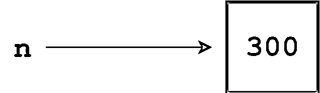
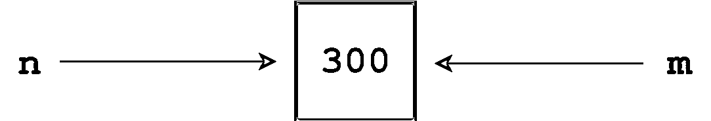
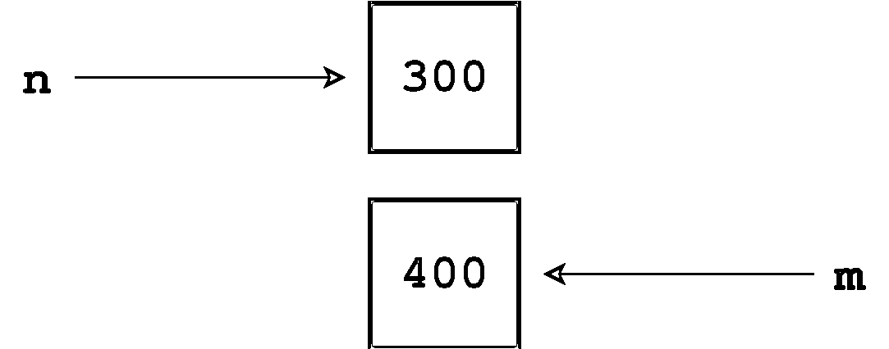
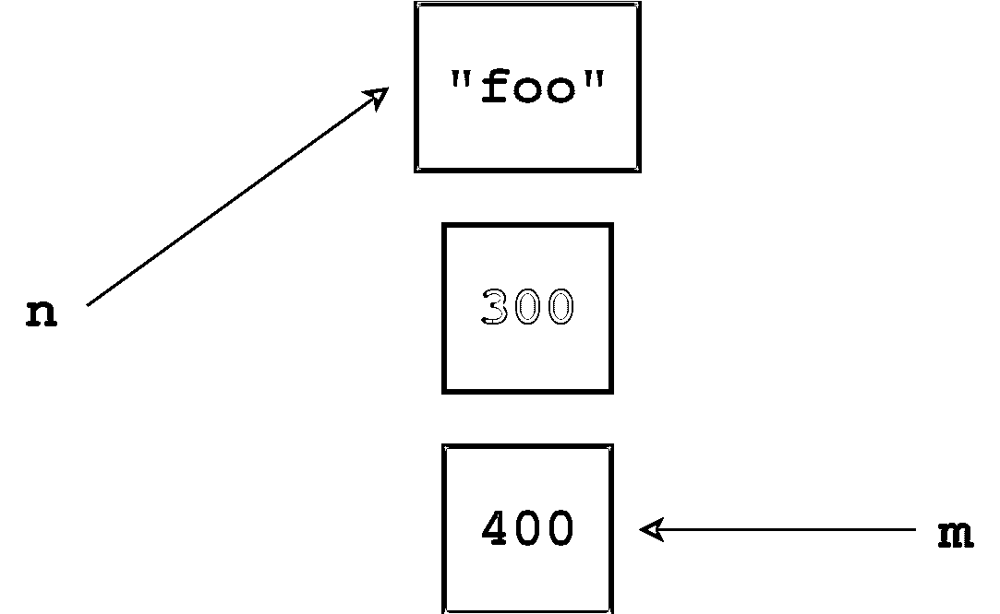

# Python 中的变量

> 原文：<https://realpython.com/python-variables/>

*立即观看**本教程有真实 Python 团队创建的相关视频课程。和书面教程一起看，加深理解:[**Python 中的变量**](/courses/variables-python/)

在之前关于 Python 中的[基本数据类型的教程中，您看到了如何创建各种 Python 数据类型的值。但到目前为止，显示的所有值都是文字值或常量值:](https://realpython.com/python-data-types/)

>>>

```py
>>> print(5.3)
5.3
```

如果您正在编写更复杂的代码，您的程序将需要随着程序执行而变化的数据。

下面是你将在本教程中学到的:你将学习如何用抽象术语**对象**来描述 Python 程序中的每一项数据，并且你将学习如何使用被称为**变量**的符号名称来操作对象。

**免费 PDF 下载:** [Python 3 备忘单](https://realpython.com/bonus/python-cheat-sheet-short/)

***参加测验:****通过我们的交互式“Python 变量”测验来测试您的知识。完成后，您将收到一个分数，以便您可以跟踪一段时间内的学习进度:*

*[参加测验](/quizzes/python-variables/)

## 变量赋值

把变量想象成一个特定对象的名字。在 Python 中，变量不需要像许多其他编程语言那样预先声明或定义。要创建一个变量，你只需要给它赋值，然后开始使用它。赋值用一个等号(`=`)完成:

>>>

```py
>>> n = 300
```

这被解读为“`n`被赋予值`300`。完成后，`n`可用于语句或表达式中，其值将被替换:

>>>

```py
>>> print(n)
300
```

正如在 REPL 会话中可以直接从解释器提示符显示文字值而不需要使用 [`print()`](https://realpython.com/python-print/) 一样，变量也是如此:

>>>

```py
>>> n
300
```

稍后，如果您更改`n`的值并再次使用它，新值将被替换:

>>>

```py
>>> n = 1000
>>> print(n)
1000
>>> n
1000
```

Python 还允许链式赋值，这使得同时给几个变量赋值成为可能:

>>>

```py
>>> a = b = c = 300
>>> print(a, b, c)
300 300 300
```

上面的链式赋值将`300`同时赋给变量`a`、`b`和`c`。

[*Remove ads*](/account/join/)

## Python 中的变量类型

在许多编程语言中，变量是静态类型的。这意味着变量最初被声明为具有特定的数据类型，并且在它的生命周期中分配给它的任何值必须总是具有该类型。

Python 中的变量不受此限制。在 Python 中，变量可能被赋予一种类型的值，然后被重新赋予不同类型的值:

>>>

```py
>>> var = 23.5
>>> print(var)
23.5

>>> var = "Now I'm a string"
>>> print(var)
Now I'm a string
```

## 对象引用

当你给变量赋值时，实际上发生了什么？这在 Python 中是一个重要的问题，因为答案与您在许多其他编程语言中找到的答案有些不同。

Python 是一种高度面向对象的语言。事实上，Python 程序中的每一项数据都是特定类型或类的对象。(这一点将在这些教程中多次重申。)

考虑以下代码:

>>>

```py
>>> print(300)
300
```

当出现语句`print(300)`时，解释器执行以下操作:

*   创建一个整数对象
*   给它赋值`300`
*   将它显示到控制台

您可以看到一个整数对象是使用内置的`type()`函数创建的:

>>>

```py
>>> type(300)
<class 'int'>
```

Python 变量是一个符号名，它是一个对象的引用或[指针](https://realpython.com/pointers-in-python/)。一旦一个对象被赋值给一个变量，你就可以用这个名字来引用这个对象。但是数据本身仍然包含在对象中。

例如:

>>>

```py
>>> n = 300
```

这种赋值创建了一个值为`300`的整数对象，并赋予变量`n`指向该对象。

[](https://files.realpython.com/media/t.2d7bcb9afaaf.png)

<figcaption class="figure-caption text-center">Variable Assignment</figcaption>

以下代码验证`n`是否指向一个整数对象:

>>>

```py
>>> print(n)
300
>>> type(n)
<class 'int'>
```

现在考虑以下语句:

>>>

```py
>>> m = n
```

执行时会发生什么？Python 不会创建另一个对象。它只是创建一个新的符号名或引用，`m`，它指向与`n`所指向的对象相同的对象。

[](https://files.realpython.com/media/t.d368386b8423.png)

<figcaption class="figure-caption text-center">Multiple References to a Single Object</figcaption>

接下来，假设您这样做:

>>>

```py
>>> m = 400
```

现在 Python 用值`400`创建了一个新的 integer 对象，`m`成为了对它的引用。

[](https://files.realpython.com/media/t.d476d91592cd.png)

<figcaption class="figure-caption text-center">References to Separate Objects</figcaption>

最后，假设下面执行这条语句:

>>>

```py
>>> n = "foo"
```

现在 Python 创建了一个值为`"foo"`的字符串对象，并让`n`引用它。

[](https://files.realpython.com/media/t.344ab0b3aa8c.png)

<figcaption class="figure-caption text-center">Orphaned Object</figcaption>

不再有对整数对象`300`的任何引用。它是孤立的，没有办法访问它。

本系列教程偶尔会提到对象的生存期。一个对象的生命从它被创建时就开始了，那时至少会创建一个对它的引用。在一个对象的生命周期中，可能会创建对它的额外引用，正如您在上面看到的，对它的引用也可能会被删除。可以说，只要至少有一个对一个对象的引用，该对象就一直存在。

当对一个对象的引用数降到零时，它就不再可访问了。到那时，它的生命周期就结束了。Python 最终会注意到它是不可访问的，并回收分配的内存，以便它可以用于其他用途。在计算机行话中，这个过程被称为[垃圾收集](https://en.wikipedia.org/wiki/Garbage_collection_%28computer_science%29)。

[*Remove ads*](/account/join/)

## 物体身份

在 Python 中，创建的每个对象都被赋予一个唯一标识它的编号。保证没有两个对象在其生命周期重叠的任何期间具有相同的标识符。一旦一个对象的引用计数下降到零并且被垃圾回收，就像上面的`300`对象发生的那样，那么它的标识号就变得可用，并且可以再次使用。

内置 Python 函数`id()`返回对象的整数标识符。使用`id()`函数，您可以验证两个变量确实指向同一个对象:

>>>

```py
>>> n = 300
>>> m = n
>>> id(n)
60127840
>>> id(m)
60127840

>>> m = 400
>>> id(m)
60127872
```

赋值`m = n`后，`m`和`n`都指向同一个对象，通过`id(m)`和`id(n)`返回相同的数字来确认。一旦`m`被重新分配给`400`，`m`和`n`指向不同身份的不同对象。

> 深入探讨:缓存小整数值
> 
> 根据您现在对 Python 中变量赋值和对象引用的了解，以下内容可能不会让您感到惊讶:
> 
> >>>
> 
> ```py
> `>>> m = 300
> >>> n = 300
> >>> id(m)
> 60062304
> >>> id(n)
> 60062896` 
> ```
> 
> 通过语句`m = 300`，Python 创建了一个值为`300`的整数对象，并将`m`设置为对它的引用。类似地，`n`被赋值给一个值为`300`的整数对象，但不是同一个对象。因此，它们具有不同的身份，您可以从`id()`返回的值中验证这一点。
> 
> 但是考虑一下这个:
> 
> >>>
> 
> ```py
> `>>> m = 30
> >>> n = 30
> >>> id(m)
> 1405569120
> >>> id(n)
> 1405569120` 
> ```
> 
> 这里，`m`和`n`被分别分配给具有值`30`的整数对象。但是在这种情况下，`id(m)`和`id(n)`是一样的！
> 
> 出于优化的目的，解释器在启动时为范围`[-5, 256]`内的整数创建对象，然后在程序执行期间重用它们。因此，当您将单独的变量赋给这个范围内的整数值时，它们实际上将引用同一个对象。

## 变量名

到目前为止，您看到的例子都使用了简短的变量名，如`m`和`n`。但是变量名可能更冗长。事实上，这通常是有益的，因为它使变量的目的乍一看更明显。

正式来说，Python 中的变量名可以是任意长度，可以由大小写字母(`A-Z`、`a-z`)、数字(`0-9`)和下划线字符(`_`)组成。另一个限制是，尽管变量名可以包含数字，但变量名的第一个字符不能是数字。

**注意:**Python 3 的一个新增功能是完全的 [Unicode 支持](https://realpython.com/python-encodings-guide/)，它也允许在变量名中使用 Unicode 字符。您将在以后的教程中更深入地了解 Unicode。

例如，以下所有内容都是有效的变量名:

>>>

```py
>>> name = "Bob"
>>> Age = 54
>>> has_W2 = True
>>> print(name, Age, has_W2)
Bob 54 True
```

但这个不是，因为变量名不能以数字开头:

>>>

```py
>>> 1099_filed = False
SyntaxError: invalid token
```

请注意，case 是重要的。小写字母和大写字母不一样。使用下划线字符也很重要。下列各项定义了不同的变量:

>>>

```py
>>> age = 1
>>> Age = 2
>>> aGe = 3
>>> AGE = 4
>>> a_g_e = 5
>>> _age = 6
>>> age_ = 7
>>> _AGE_ = 8

>>> print(age, Age, aGe, AGE, a_g_e, _age, age_, _AGE_)
1 2 3 4 5 6 7 8
```

没有什么可以阻止你在同一个程序中创建两个不同的变量，叫做`age`和`Age`，或者就此而言叫做`agE`。但这可能是不明智的。在你离开代码一段时间后，任何试图阅读你的代码的人，甚至你自己，肯定会感到困惑。

给一个变量取一个足够有描述性的名字来清楚地说明它的用途是值得的。例如，假设您正在统计大学毕业生的人数。你可以选择以下任何一个选项:

>>>

```py
>>> numberofcollegegraduates = 2500
>>> NUMBEROFCOLLEGEGRADUATES = 2500
>>> numberOfCollegeGraduates = 2500
>>> NumberOfCollegeGraduates = 2500
>>> number_of_college_graduates = 2500

>>> print(numberofcollegegraduates, NUMBEROFCOLLEGEGRADUATES,
... numberOfCollegeGraduates, NumberOfCollegeGraduates,
... number_of_college_graduates)
2500 2500 2500 2500 2500
```

他们都可能是比`n`，或`ncg`，或类似的更好的选择。至少你可以从名字中知道变量的值应该代表什么。

另一方面，它们不一定都同样清晰易读。与许多事情一样，这是个人喜好的问题，但大多数人会发现前两个例子，其中的字母都挤在一起，更难阅读，特别是所有大写字母的例子。构造多单词变量名最常用的方法是最后三个例子:

*   **骆驼大小写:**第二个及后续单词大写，使单词边界更容易看清。(大概，有人在某个时候突然想到，散布在变量名称中的大写字母有点像驼峰。)
    *   示例:`numberOfCollegeGraduates`
*   **帕斯卡大小写:**与骆驼大小写相同，除了第一个字也是大写。
    *   示例:`NumberOfCollegeGraduates`
*   **Snake Case:** 单词之间用下划线隔开。
    *   示例:`number_of_college_graduates`

程序员们以惊人的热情激烈地争论，哪一个更好。可以为他们所有人提出合理的论据。使用三个中最吸引你的一个。选择一个并坚持使用它。

稍后你会看到变量不是唯一可以命名的东西。您还可以命名函数、类、模块等等。适用于变量名的规则也适用于标识符，标识符是对程序对象命名的更一般的术语。

Python 代码的[风格指南，也被称为 **PEP 8** ，包含了](https://www.python.org/dev/peps/pep-0008/)[命名约定](https://www.python.org/dev/peps/pep-0008/#naming-conventions)，列出了不同对象类型名称的建议标准。PEP 8 包括以下建议:

*   函数和变量名应该使用大小写。
*   类名应该使用 Pascal 大小写。(PEP 8 将此称为“CapWords”约定。)

[*Remove ads*](/account/join/)

## 保留字(关键词)

对标识符名称还有一个限制。Python 语言保留了一小部分指定特殊语言功能的[关键字](https://realpython.com/python-keywords/)。任何对象都不能与保留字同名。

在 Python 3.6 中，有 33 个保留关键字:

| Python
关键词 |   |   |   |
| --- | --- | --- | --- |
| `False` | `def` | `if` | `raise` |
| `None` | `del` | `import` | `return` |
| `True` | `elif` | `in` | `try` |
| `and` | `else` | `is` | `while` |
| `as` | `except` | `lambda` | `with` |
| `assert` | `finally` | `nonlocal` | `yield` |
| `break` | `for` | `not` |  |
| `class` | `from` | `or` |  |
| `continue` | `global` | `pass` |  |

在 Python 解释器中输入`help("keywords")`就可以随时看到这个列表。保留字区分大小写，必须严格按照所示使用。都是全小写，除了`False`、[、](https://realpython.com/null-in-python/)、`True`。

尝试创建与任何保留字同名的变量会导致错误:

>>>

```py
>>> for = 3
SyntaxError: invalid syntax
```

## 结论

本教程涵盖了 Python **变量**的基础知识，包括对象引用和标识，以及 Python 标识符的命名。

现在，您已经很好地理解了 Python 的一些数据类型，并且知道如何创建引用这些类型的对象的变量。

接下来，您将看到如何将数据对象组合成包含各种**操作**的**表达式**。

***参加测验:****通过我们的交互式“Python 变量”测验来测试您的知识。完成后，您将收到一个分数，以便您可以跟踪一段时间内的学习进度:*

*[参加测验](/quizzes/python-variables/)*

*[« Basic Data Types in Python](https://realpython.com/python-data-types/)[Variables in Python](#)[Operators and Expressions in Python »](https://realpython.com/python-operators-expressions/)

*立即观看**本教程有真实 Python 团队创建的相关视频课程。和书面教程一起看，加深理解:[**Python 中的变量**](/courses/variables-python/)*******