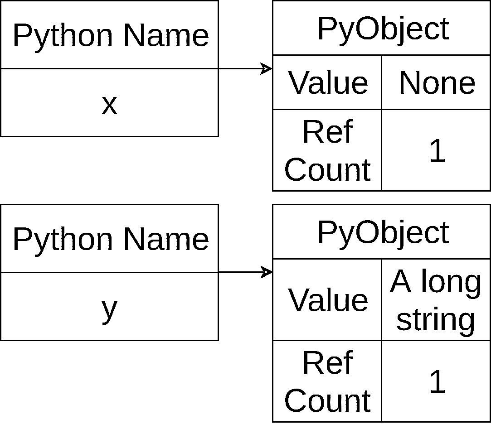

# Python 与 C++:为工作选择合适的工具

> 原文：<https://realpython.com/python-vs-cpp/>

你是一个比较 Python 和 C++的 C++开发者吗？你是不是看着 Python 想知道这一切大惊小怪的是什么？你想知道 Python 和你已经知道的概念相比怎么样吗？或者也许你打赌如果你把 C++和 Python 关在一个笼子里，让他们一决雌雄，谁会赢？那这篇文章就送给你了！

在本文中，您将了解到:

*   当你比较 Python 和 C++时的区别和相似之处
*   对于一个问题，Python 可能是更好的选择，反之亦然
*   学习 Python 时遇到问题时可以求助的资源

这篇文章针对的是正在[学习 Python](https://realpython.com/python-first-steps/) 的 C++开发者。它假定您对这两种语言都有基本的了解，并将使用 Python 3.6 及更高版本，以及 C++11 或更高版本中的概念。

让我们来看看 Python 和 C++的对比吧！

**免费下载:** [从 Python 技巧中获取一个示例章节:这本书](https://realpython.com/bonus/python-tricks-sample-pdf/)用简单的例子向您展示了 Python 的最佳实践，您可以立即应用它来编写更漂亮的+Python 代码。

## 比较语言:Python 与 C++

通常，您会发现赞美一种编程语言优于另一种编程语言的文章。通常情况下，他们会通过贬低一种语言来推广另一种语言。这不是那种类型的文章。

当你比较 Python 和 C++的时候，记住它们都是工具，并且它们都有不同的用途。想一想锤子和螺丝刀的比较。你*可以*用螺丝刀敲进钉子，你*可以*用锤子敲进螺丝，但这两种体验都不会那么有效。

在工作中使用正确的工具很重要。在本文中，您将了解 Python 和 C++的特性，这些特性使它们成为解决某些类型问题的正确选择。所以，不要把 Python vs C++中的“vs”理解为“反对”。更确切地说，把它当作一个比较。

[*Remove ads*](/account/join/)

## 编译 vs 虚拟机

让我们从比较 Python 和 C++的最大区别开始。在 C++中，你使用编译器将你的源代码转换成机器代码并生成可执行文件。可执行文件是一个单独的文件，可以作为独立程序运行:

[](https://files.realpython.com/media/cpp_single_compile.209a9e10bff5.png)

这个过程为特定的处理器和操作系统输出实际的机器指令。在这幅图中，它是一个 Windows 程序。这意味着您必须为 Windows、Mac 和 Linux 分别重新编译您的程序:

[](https://files.realpython.com/media/cpp_multi_compile.3ff938bd23f1.png)

您可能还需要修改 C++代码，以便在这些不同的系统上运行。

另一方面，Python 使用不同的过程。现在，记住你将看到的是该语言的标准实现 [CPython](https://realpython.com/cpython-source-code-guide/) 。除非你正在做一些特别的事情，否则这就是你正在运行的 Python。

每次执行程序时，Python 都会运行。它就像 C++编译器一样编译你的源代码。不同之处在于 Python 会编译成[字节码](https://docs.python.org/3/glossary.html#term-bytecode)，而不是本机代码。字节码是 [Python 虚拟机](https://leanpub.com/insidethepythonvirtualmachine/read)的本机指令代码。为了加速程序的后续运行，Python 将字节码存储在`.pyc`文件中:

[](https://files.realpython.com/media/python_compile_to_pyc.514448b58d8a.png)

如果您使用的是 Python 2，那么您会在`.py`文件旁边找到这些文件。对于 Python 3，您可以在一个`__pycache__`目录中找到它们。

生成的字节码不会在您的处理器上自然运行。相反，它是由 Python 虚拟机运行的。这与 [Java](https://realpython.com/oop-in-python-vs-java/) 虚拟机或。NET 公共运行时环境。代码的首次运行将导致编译步骤。然后，字节码将被解释为在您的特定硬件上运行:

[](https://files.realpython.com/media/python_initial_run.7d67c05e0bc2.png)

只要程序没有改变，每次后续运行都将跳过编译步骤，并使用先前编译的字节码来解释:

[](https://files.realpython.com/media/python_execute.pyc.f20350ccc1cf.png)

解释代码比直接在硬件上运行本机代码要慢。那么为什么 Python 是这样工作的呢？嗯，解释虚拟机中的代码意味着只需要为特定处理器上的特定操作系统编译虚拟机。它运行的所有 Python 代码都可以在任何安装了 Python 的机器上运行。

**注意:** [CPython 是用 C 编写的](https://realpython.com/c-for-python-programmers/)，所以它可以在大多数有 C 编译器的系统上运行。

这种跨平台支持的另一个特点是 Python 广泛的标准库可以在所有操作系统上工作。

例如，使用 [`pathlib`](https://docs.python.org/3.7/library/pathlib.html) 将为您管理路径分隔符，无论您使用的是 Windows、Mac 还是 Linux。这些库的开发人员花了很多时间使它具有可移植性，所以您不需要在 Python 程序中担心它！

在您继续之前，让我们开始跟踪 Python 与 C++的比较图表。当您介绍新的比较时，它们将以斜体添加:

| 特征 | 计算机编程语言 | C++ |
| --- | --- | --- |
| *更快的执行速度* |  | x |
| *跨平台执行* | x |  |

既然您已经看到了 Python 和 C++在运行时的差异，那么让我们深入研究一下这两种语言的语法细节。

[*Remove ads*](/account/join/)

## 语法差异

Python 和 C++在语法上有许多相似之处，但也有一些地方值得讨论:

*   空白
*   布尔表达式
*   变量和指针
*   （听力或阅读）理解测试

让我们先从最有争议的一个开始:空白。

### 空白

大多数开发人员在比较 Python 和 C++时注意到的第一件事是“空白问题”Python 使用前导空格来标记范围。这意味着一个`if`块或其他类似结构的主体由缩进的级别来表示。C++用花括号(`{}`)表示同样的想法。

虽然 Python lexer 可以接受任何空格，只要你保持一致，但是[pep 8](https://realpython.com/python-pep8/)([官方风格指南](https://www.python.org/dev/peps/pep-0008/)为每一级缩进指定了 4 个空格。大多数编辑器都可以配置为自动完成这项工作。

关于 Python 的空白规则，已经有大量的[文章](https://unspecified.wordpress.com/2011/10/18/why-pythons-whitespace-rule-is-right/)、[文章](https://www.quora.com/Do-you-think-that-indentation-in-Python-is-annoying)和[文章](https://news.ycombinator.com/item?id=5231632)发表，所以让我们跳过这个问题，转到其他事情上来。

Python 使用行尾，而不是依靠像`;`这样的词法标记来结束每条语句。如果需要将一个语句扩展到一行，那么可以使用反斜杠(`\`)来表示。(请注意，如果您在一组括号内，则不需要继续字符。)

在空白问题上，双方都有人不满意。一些 Python 开发人员喜欢您不必键入大括号和分号。一些 C++开发人员讨厌对格式的依赖。学会适应这两者是你最好的选择。

既然您已经看到了空白问题，让我们继续讨论一个争议较少的问题:布尔表达式。

### 布尔表达式

与 C++相比，Python 中使用[布尔表达式](https://realpython.com/python-boolean/)的方式略有不同。在 C++中，除了内置值之外，还可以使用数值来表示`true`或`false`。任何评估为`0`的值都被认为是`false`，而其他所有数值都是`true`。

Python 有一个类似的概念，但是将其扩展到包括其他情况。基本都挺像的。 [Python 文档](https://docs.python.org/3/library/stdtypes.html#truth-value-testing)声明以下项目评估为`False`:

*   定义为 false 的常数:
    *   `None`
    *   `False`
*   任何数字类型的零:
    *   `0`
    *   `0.0`
    *   `0j`
    *   `Decimal(0)`
    *   `Fraction(0, 1)`
*   空序列和集合:
    *   `''`
    *   `()`
    *   `[]`
    *   `{}`
    *   `set()`
    *   `range(0)`

其他所有项目都是`True`。这意味着空列表`[]`是`False`，而只包含零的列表`[0]`仍然是`True`。

大多数对象将评估为`True`，除非对象有返回`False`的`__bool__()`或返回 0 的`__len__()`。这允许您扩展您的自定义类来充当布尔表达式。

Python 与 C++相比，在布尔运算符方面也有一些细微的变化。首先，`if`和`while`语句不像在 C++中那样需要括号。然而，括号有助于提高可读性，所以请使用您的最佳判断。

大多数 C++布尔运算符在 Python 中都有类似的运算符:

| C++运算符 | Python 运算符 |
| --- | --- |
| `&&` | `and` |
| `&#124;&#124;` | `or` |
| `!` | `not` |
| `&` | `&` |
| `&#124;` | `&#124;` |

大部分操作符和 C++类似，但是如果你想温习一下，你可以阅读 Python 中的[操作符和表达式。](https://realpython.com/python-operators-expressions/)

[*Remove ads*](/account/join/)

### 变量和指针

当你用 C++写完之后第一次开始使用 Python 的时候，你可能不会太在意[变量](https://realpython.com/python-variables/)。它们似乎通常像在 C++中一样工作。然而，它们并不相同。在 C++中，你使用变量来引用值，而在 Python 中，你使用名称。

**注意:**在本节中，您将看到 Python 和 C++中的变量和名称，对于 C++您将使用**变量**，对于 Python 您将使用**名称**。在其他地方，它们都将被称为**变量**。

首先，让我们后退一点，更广泛地看看 Python 的[对象模型](https://docs.python.org/3.6/reference/datamodel.html)。

在 Python 中，*一切*都是对象。[数字](https://realpython.com/python-numbers/)被保存在物体中。模块保存在对象中。一个类的对象*和这个类本身都是对象。函数也是对象:*

>>>

```py
>>> a_list_object = list()
>>> a_list_object
[]
>>> a_class_object = list
>>> a_class_object
<class 'list'>
>>> def sayHi(name):
...      print(f'Hello, {name}')
...
>>> a_function_object = sayHi
>>> a_function_object
<function sayHi at 0x7faa326ac048>
```

调用`list()`创建一个新的列表对象，您将它分配给`a_list_object`。使用类名`list`本身就在类对象上加了一个标签。您也可以在函数上放置新标签。这是一个强大的工具，像所有强大的工具一样，它可能是危险的。(我在看你，电锯先生。)

**注意:**上面的代码显示运行在一个 [REPL](https://realpython.com/interacting-with-python/) 中，代表“读取、评估、打印循环”这种交互式环境经常被用来试验 Python 和其他解释语言中的想法。

如果你在命令提示符下输入`python`,它会弹出一个 REPL，你可以在这里开始输入代码并自己尝试！

回到 Python 与 C++的讨论，注意这种行为与你在 C++中看到的不同。与 Python 不同，C++有分配给一个内存位置的变量，您必须指出该变量将使用多少内存:

```py
int  an_int; float  a_big_array_of_floats[REALLY_BIG_NUMBER];
```

在 Python 中，所有对象都是在内存中创建的，您可以给它们加上标签。标签本身没有类型，可以贴在任何类型的对象上:

>>>

```py
>>> my_flexible_name = 1
>>> my_flexible_name
1
>>> my_flexible_name = 'This is a string'
>>> my_flexible_name
'This is a string'
>>> my_flexible_name = [3, 'more info', 3.26]
>>> my_flexible_name
[3, 'more info', 3.26]
>>> my_flexible_name = print
>>> my_flexible_name
<built-in function print>
```

您可以将`my_flexible_name`赋给任何类型的对象，Python 会随之滚动。

当你比较 Python 和 C++的时候，变量和名字的区别可能有点混乱，但是它带来了一些很好的好处。一个是在 Python 中你没有[指针](https://realpython.com/pointers-in-python/)，你永远不需要考虑堆和栈的问题。在本文的稍后部分，您将深入了解内存管理。

### 理解

Python 有一个语言特性叫做 [**列表综合**](https://realpython.com/courses/using-list-comprehensions-effectively/) 。虽然在 C++中模拟列表理解是可能的，但这相当棘手。在 Python 中，它们是教给初级程序员的基本工具。

思考列表理解的一种方式是，它们就像列表、字典或集合的超级初始化器。给定一个 iterable 对象，您可以创建一个列表，并在创建时过滤或修改原始列表:

>>>

```py
>>> [x**2 for x in range(5)]
[0, 1, 4, 9, 16]
```

这个脚本从 iterable `range(5)`开始，创建一个包含 iterable 中每一项的方块的列表。

可以向第一个 iterable 中的值添加条件:

>>>

```py
>>> odd_squares = [x**2 for x in range(5) if x % 2]
>>> odd_squares
[1, 9]
```

本理解末尾的`if x % 2`将`range(5)`中使用的数字限定为奇数。

此时，你可能会有两种想法:

1.  这是一个强大的语法技巧，将简化我的代码的某些部分。
2.  你可以在 C++中做同样的事情。

虽然确实可以在 C++中创建奇数平方的`vector`,但这样做通常意味着代码要多一点:

```py
std::vector<int>  odd_squares; for  (int  ii  =  0;  ii  <  10;  ++ii)  { if  (ii  %  2)  { odd_squares.push_back(ii*ii); } }
```

对于来自 C 风格语言的开发人员来说，列表理解是他们能够[编写更多 Pythonic 代码](https://realpython.com/learning-paths/writing-pythonic-code/)的第一个值得注意的方法之一。许多开发人员开始用 C++结构编写 Python:

```py
odd_squares = []
for ii in range(5):
    if (ii % 2):
        odd_squares.append(ii)
```

这是完全有效的 Python。然而，它可能会运行得更慢，而且不像 list comprehension 那样清晰简洁。学会使用列表理解不仅会提高你的代码速度，还会让你的代码更有条理，更易读！

**注:**当你阅读 Python 的时候，你会经常看到单词**Python**被用来描述某事。这只是社区用来描述干净、优雅、看起来像是 Python 绝地武士写的代码的术语。

[*Remove ads*](/account/join/)

### Python 的`std::algorithms`

C++标准库中内置了丰富的算法。Python 有一组类似的内置函数，涵盖了相同的领域。

其中第一个也是最强大的是 [`in`操作符](https://www.pythoncentral.io/quick-tip-using-pythons-in-operator/)，它提供了一个可读性很强的测试来查看一个条目是否包含在[列表](https://realpython.com/python-lists-tuples/)、[集合](https://realpython.com/python-sets/)或[字典](https://realpython.com/courses/dictionaries-python/)中:

>>>

```py
>>> x = [1, 3, 6, 193]
>>> 6 in x
True
>>> 7 in x
False
>>> y = { 'Jim' : 'gray', 'Zoe' : 'blond', 'David' : 'brown' }
>>> 'Jim' in y
True
>>> 'Fred' in y
False
>>> 'gray' in y
False
```

注意，`in`操作符在字典上使用时，只测试键，而不是值。这由最终测试`'gray' in y`显示。

`in`可以与`not`结合使用，以获得可读性很强的语法:

```py
if name not in y:
    print(f"{name} not found")
```

下一个 Python 内置操作符是 [`any`](https://docs.python.org/3.7/library/functions.html?any#any) 。这是一个布尔函数，如果给定 iterable 的任何元素计算结果为`True`，则返回`True`。这看起来有点傻，直到你记起你的理解清单！结合这两者可以为许多情况产生强大、清晰的语法:

>>>

```py
>>> my_big_list = [10, 23, 875]
>>> my_small_list = [1, 2, 8]
>>> any([x < 3 for x in my_big_list])
False
>>> any([x < 3 for x in my_small_list])
True
```

最后，你还有 [`all`](https://docs.python.org/3.7/library/functions.html?all#all) ，类似于`any`。如果——你猜对了 iterable 中的所有元素都是`True`,那么只返回`True` *。同样，将它与列表理解结合起来会产生一个强大的语言特性:*

>>>

```py
>>> list_a = [1, 2, 9]
>>> list_b = [1, 3, 9]
>>> all([x % 2 for x in list_a])
False
>>> all([x % 2 for x in list_b])
True
```

`any`和`all`可以覆盖 C++开发人员期待`std::find`或`std::find_if`的大部分领域。

**注意:**在上面的`any`和`all`示例中，您可以删除括号(`[]`，而不会损失任何功能。(例如:`all(x % 2 for x in list_a)`)这使用了[生成器表达式](https://realpython.com/introduction-to-python-generators/)，虽然很方便，但超出了本文的范围。

在进入变量类型之前，让我们更新一下 Python 与 C++的比较图:

| 特征 | 计算机编程语言 | C++ |
| --- | --- | --- |
| 更快的执行 |  | x |
| 跨平台执行 | x |  |
| *单一类型变量* |  | x |
| *多类型变量* | x |  |
| *理解* | x |  |
| *丰富的内置算法集* | x | x |

好了，现在你可以看变量和参数类型了。我们走吧！

## 静态与动态打字

当你比较 Python 和 C++时，另一个大话题是[数据类型](https://realpython.com/python-data-types/)的使用。C++是静态类型的语言，而 Python 是动态类型的。让我们探索一下这意味着什么。

### 静态打字

C++是静态类型的，这意味着代码中使用的每个变量都必须有特定的数据类型，如`int`、`char`、`float`等等。你只能把正确类型的值赋给一个变量，除非你遇到了一些困难。

这对开发人员和编译器都有好处。开发人员的优势在于提前知道特定变量的类型，从而知道允许哪些操作。编译器可以使用类型信息来优化代码，使代码更小、更快，或者两者兼而有之。

然而，这种先进的知识是有代价的。传递给函数的参数必须与函数期望的类型相匹配，这会降低代码的灵活性和潜在的有用性。

[*Remove ads*](/account/join/)

### 鸭子打字

动态分型通常被称为**鸭分型。**这是一个奇怪的名字，一会儿你会读到更多关于它的内容！但首先，我们先举个例子。这个函数获取一个 file 对象并读取前十行:

```py
def read_ten(file_like_object):
    for line_number in range(10):
        x = file_like_object.readline()
        print(f"{line_number} = {x.strip()}")
```

要使用这个函数，您将创建一个 file 对象并将其传入:

```py
with open("types.py") as f:
    read_ten(f)
```

这显示了该函数的基本设计是如何工作的。虽然这个函数被描述为“从文件对象中读取前十行”，但是 Python 中并没有要求`file_like_object` *是*文件。只要传入的对象支持`.readline()`，该对象可以是任何类型:

```py
class Duck():
    def readline(self):
        return "quack"

my_duck = Duck()
read_ten(my_duck)
```

用一个`Duck`对象调用`read_ten()`会产生:

```py
0 = quack
1 = quack
2 = quack
3 = quack
4 = quack
5 = quack
6 = quack
7 = quack
8 = quack
9 = quack
```

这就是**鸭式打字**的精髓。俗话说，“如果它长得像鸭子，游得像鸭子，叫得像鸭子，那么它大概*就是*鸭子。”

换句话说，如果对象有所需的方法，那么不管对象的类型如何，都可以传入它。Duck 或动态类型为您提供了巨大的灵活性，因为它允许在满足所需接口的地方使用任何类型。

但是，这里有一个问题。如果你传入一个*不符合*所需接口的对象会怎样？比如传一个数给`read_ten()`，像这样:`read_ten(3)`？

这将导致引发异常。除非您捕捉到异常，否则您的程序将会因一个[回溯](https://realpython.com/python-traceback/)而崩溃:

```py
Traceback (most recent call last):
  File "<stdin>", line 1, in <module>
  File "duck_test.py", line 4, in read_ten
    x = file_like_object.readline()
AttributeError: 'int' object has no attribute 'readline'
```

动态类型可能是一个非常强大的工具，但是正如您所看到的，在使用它时您必须小心。

**注意:** Python 和 C++都被认为是[强类型](https://stackoverflow.com/a/11328980)语言。虽然 C++有更强的类型系统，但这方面的细节对于学习 Python 的人来说通常意义不大。

让我们转到受益于 Python 动态类型的一个特性:模板。

### 模板

Python 没有 C++那样的模板，但一般也不需要。在 Python 中，一切都是单个基本类型的子类。这就是允许你创建如上所述的鸭子类型函数的原因。

C++中的模板系统允许你创建在多种不同类型上操作的函数或算法。这是非常强大的，可以节省你大量的时间和精力。然而，它也可能是困惑和挫折的来源，因为模板中的编译器错误可能会让您感到困惑。

能够使用 duck typing 代替模板使得一些事情变得容易得多。但是这也会导致难以检测的问题。和所有复杂的决策一样，当你比较 Python 和 C++时，需要权衡利弊。

[*Remove ads*](/account/join/)

### 类型检查

最近在 Python 社区中有很多关于 Python 中静态类型检查的兴趣和讨论。像 [mypy](http://mypy-lang.org/) 这样的项目已经提高了在语言的特定位置添加运行前类型检查的可能性。这对于管理大型软件包或特定 API 之间的接口非常有用。

它有助于解决鸭子打字的一个缺点。对于使用函数的开发人员来说，如果他们能够完全理解每个参数需要是什么，那会很有帮助。这在大型项目团队中非常有用，因为许多开发人员需要通过 API 进行交流。

再一次，让我们看看你的 Python 和 C++对比图:

| 特征 | 计算机编程语言 | C++ |
| --- | --- | --- |
| 更快的执行 |  | x |
| 跨平台执行 | x |  |
| 单一类型变量 |  | x |
| 多类型变量 | x |  |
| （听力或阅读）理解测试 | x |  |
| 丰富的内置算法集 | x | x |
| *静态打字* |  | x |
| *动态打字* | x |  |

现在，您已经准备好了解面向对象编程的不同之处了。

## 面向对象编程

和 C++一样，Python 支持一个[面向对象的编程模型](https://realpython.com/courses/intro-object-oriented-programming-oop-python/)。你在 C++中学到的许多相同的概念都被移植到 Python 中。您仍然需要对[继承、复合](https://realpython.com/inheritance-composition-python/)和多重继承做出决定。

### 相似之处

在 Python 和 C++中，类之间的继承类似。一个新类可以从一个或多个基类继承方法和属性，就像你在 C++中看到的一样。然而，一些细节有些不同。

Python 中的基类不像 C++那样自动调用它们的构造函数。当你切换语言时，这可能会令人困惑。

[多重继承](https://realpython.com/python-super/#super-in-multiple-inheritance)在 Python 中也有效，它和在 C++中一样有很多怪癖和奇怪的规则。

类似地，您也可以使用组合来构建类，其中一种类型的对象包含其他类型。考虑到 Python 中的一切都是对象，这意味着类可以保存语言中的任何东西。

### 差异

然而，当你比较 Python 和 C++时，还是有一些不同的。前两者是有关联的。

第一个区别是 Python 没有类的访问修饰符的概念。类对象中的一切都是公共的。Python 社区已经开发了一个约定，任何以单下划线开头的类成员都被视为私有。语言并没有强制这样做，但是看起来效果很好。

Python 中每个类成员和方法都是公共的这一事实导致了第二个不同:Python 的封装支持比 C++弱得多。

如前所述，单下划线约定使得这在实际代码库中比在理论意义上更不成为问题。一般来说，任何违反这条规则并依赖于类内部工作的用户都是在自找麻烦。

### 运算符 ooverlord vs dunder 方法

在 C++中，可以添加**运算符重载**。这些允许您为某些数据类型定义特定语法操作符(如`==`)的行为。通常，这是用来增加你的类的更自然的用法。对于`==`操作符，您可以确切地定义一个类的两个对象相等意味着什么。

一些开发人员需要很长时间才能理解的一个区别是如何解决 Python 中缺少运算符重载的问题。Python 的对象可以在任何标准容器中工作，这很好，但是如果您想让 [`==`操作符](https://realpython.com/python-is-identity-vs-equality/)在新类的两个对象之间进行深度比较，该怎么办呢？在 C++中，你可以在你的类中创建一个`operator==()`来进行比较。

Python 有一个类似的结构，在整个语言中使用得相当一致: **dunder methods** 。Dunder 方法之所以得名，是因为它们都以双下划线或“d-under”开头和结尾

Python 中许多操作对象的内置函数都是通过调用对象的 [dunder 方法](https://realpython.com/operator-function-overloading/)来处理的。对于上面的例子，您可以将`__eq__()`添加到您的类中，进行您喜欢的任何奇特的比较:

```py
class MyFancyComparisonClass():
    def __eq__(self, other):
        return True
```

这将生成一个类，该类与其类的任何其他实例进行比较的方式相同。不是特别有用，但它证明了这一点。

Python 中使用了大量的 dunder 方法，内置函数广泛地利用了这些方法。例如，添加`__lt__()`将允许 Python 比较两个对象的相对顺序。这意味着不仅`<`操作员可以工作，而且`>`、`<=`和`>=`也可以工作。

更好的是，如果你的新类有几个对象在一个列表中，那么你可以在列表中使用 [`sorted()`](https://realpython.com/python-sort/) ，它们将使用`__lt__()`排序。

再一次，让我们看看你的 Python 和 C++对比图:

| 特征 | 计算机编程语言 | C++ |
| --- | --- | --- |
| 更快的执行 |  | x |
| 跨平台执行 | x |  |
| 单一类型变量 |  | x |
| 多类型变量 | x |  |
| （听力或阅读）理解测试 | x |  |
| 丰富的内置算法集 | x | x |
| 静态打字 |  | x |
| 动态打字 | x |  |
| *严格封装* |  | x |

既然您已经看到了跨两种语言的面向对象编码，那么让我们看看 Python 和 C++如何管理内存中的这些对象。

[*Remove ads*](/account/join/)

## 内存管理

当你比较 Python 和 C++时，最大的区别之一就是它们处理内存的方式。正如您在关于 C++和 Python 名称中的变量一节中看到的，Python 没有指针，也不容易让您直接操纵内存。虽然有时候你想拥有那种程度的控制，但大多数时候这是不必要的。

放弃对内存位置的直接控制会带来一些好处。您不需要担心内存所有权，也不需要确保内存在分配后被释放一次(且仅一次)。您也永远不必担心对象是分配在堆栈上还是堆上，这往往会让 C++开发新手感到困惑。

Python 为您管理所有这些问题。为了做到这一点，Python 中的所有东西都是从 Python 的`object`派生的一个类。这允许 Python 解释器实现引用计数，作为跟踪哪些对象仍在使用，哪些对象可以被释放的手段。

当然，这种便利是有代价的。为了释放分配给你的内存对象，Python 有时需要运行所谓的**垃圾收集器**，它会找到未使用的内存对象并释放它们。

**注意:** CPython 有一个复杂的[内存管理方案](https://realpython.com/python-memory-management/)，这意味着释放内存并不一定意味着内存被返回给操作系统。

Python 使用两种工具来释放内存:

1.  引用计数收集器
2.  世代收藏家

让我们分别看一下这些。

### 参考计数收集器

引用计数收集器是标准 Python 解释器的基础，并且总是在运行。它的工作原理是在程序运行时，记录给定的内存块(通常是 Python `object`)有多少次被附加了一个名字。许多规则都描述了引用计数何时递增或递减，但有一个例子可以说明这一点:

>>>

```py
 1>>> x = 'A long string'
 2>>> y = x
 3>>> del x
 4>>> del y
```

在上面的例子中，第 1 行创建了一个包含字符串`"A long string"`的新对象。然后将名称`x`放在这个对象上，将对象的引用计数增加到 1:

[](https://files.realpython.com/media/cpp_ref_count_one.6d62510015e9.png)

在第 2 行，它指定`y`来命名同一个对象，这将把引用计数增加到 2:

[](https://files.realpython.com/media/cpp_ref_count_two.199793fc702e.png)

当您在第 3 行用`x`调用`del`时，您删除了对该对象的一个引用，将计数降回 1:

[](https://files.realpython.com/media/cpp_ref_count_one_one.47037ceb7f95.png)

最后，当您删除对对象的最后一个引用`y`时，它的引用计数会降到零，并且可以被引用计数垃圾收集器释放。在这一点上，它可能会也可能不会被立即释放，但一般来说，这对开发人员来说并不重要:

[](https://files.realpython.com/media/cpp_ref_count_zero_two.e3dff58e94b0.png)

虽然这将负责找到并释放许多需要释放的对象，但有一些情况它不会捕捉到。为此，您需要分代垃圾收集器。

[*Remove ads*](/account/join/)

### 分代垃圾收集器

引用计数方案中的一个大漏洞是你的程序可以构建一个引用循环，其中对象`A`有一个对对象`B`的引用，对象`B`有一个对对象`A`的引用。完全有可能遇到这种情况，并且代码中没有任何内容引用任何一个对象。在这种情况下，两个对象都不会达到引用计数 0。

**分代垃圾收集器**涉及一个复杂的算法，超出了本文的范围，但是它会找到一些孤立的引用循环，并为您释放它们。它偶尔运行，由文档中的[描述的设置控制。其中一个参数是完全禁用这个垃圾收集器。](https://docs.python.org/3.7/library/gc.html)

### 当你不想要垃圾收集时

当你比较 Python 和 C++的时候，就像你比较任何两个工具一样，每个优势都有一个权衡。Python 不需要显式的内存管理，但偶尔它会在垃圾收集上花费比预期更长的时间。对于 C++，情况正好相反:你的程序将有一致的响应时间，但是你需要在管理内存上花费更多的精力。

在许多程序中，偶尔的垃圾收集命中并不重要。如果你正在写一个只运行 10 秒钟的脚本，那么你不太可能注意到其中的区别。然而，有些情况需要一致的响应时间。实时系统就是一个很好的例子，在这种情况下，在固定的时间内对硬件做出响应对于系统的正常运行至关重要。

对实时性有严格要求的系统是 Python 不适合的语言选择。拥有一个严格控制的系统，其中你可以确定时间是 C++的一个很好的用途。当您决定项目的语言时，这些是需要考虑的问题类型。

是时候更新您的 Python 与 C++图表了:

| 特征 | 计算机编程语言 | C++ |
| --- | --- | --- |
| 更快的执行 |  | x |
| 跨平台执行 | x |  |
| 单一类型变量 |  | x |
| 多类型变量 | x |  |
| （听力或阅读）理解测试 | x |  |
| 丰富的内置算法集 | x | x |
| 静态打字 |  | x |
| 动态打字 | x |  |
| 严格封装 |  | x |
| *直接内存控制* |  | x |
| *垃圾收集* | x |  |

## 线程、多处理和异步 IO

C++和 Python 中的并发模型是相似的，但是它们有不同的结果和好处。这两种语言都支持线程、多处理和异步 IO 操作。让我们来看看每一个。

### 穿线

虽然 C++和 Python 都在语言中内置了线程，但结果可能会有明显的不同，这取决于您要解决的问题。通常，[线程化](https://realpython.com/intro-to-python-threading/)用于解决性能问题。在 C++中，由于线程可以充分利用多处理器系统上的内核，因此线程可以为计算受限和 I/O 受限问题提供总体加速。

另一方面，Python 做了一个设计权衡，使用**全局解释器锁**，或者 [GIL](https://realpython.com/python-gil/) ，来简化它的线程实现。GIL 有很多好处，但缺点是一次只能运行一个线程，即使有多个内核。

如果您的问题是 I/O 受限的，比如一次获取几个网页，那么这个限制一点也不会困扰您。您将欣赏 Python 更简单的线程模型和用于[线程间通信](https://docs.python.org/3/library/queue.html)的内置方法。但是，如果您的问题是 CPU 受限的，那么 GIL 将会把您的性能限制在单个处理器上。幸运的是，Python 的多处理库有一个与其线程库相似的接口。

### 多重处理

标准库中内置了 Python 中的多处理支持。它有一个干净的界面，允许你旋转多个进程，并在它们之间共享信息。您可以创建一个进程池，并使用几种技术在它们之间分配工作。

虽然 Python 仍然使用类似的操作系统原语来创建新的流程，但许多底层的复杂性对开发人员来说是隐藏的。

C++依靠`fork()`来提供多处理支持。虽然这使您可以直接访问生成多个流程的所有控制和问题，但这也要复杂得多。

### 异步 IO

虽然 Python 和 C++都支持异步 IO 例程，但它们的处理方式不同。在 C++中，`std::async`方法很可能使用线程来实现其操作的异步 IO 特性。在 Python 中，[异步 IO](https://realpython.com/async-io-python/) 代码只会在单线程上运行。

这里也有权衡。使用单独的线程允许 C++异步 IO 代码在计算受限的问题上执行得更快。在其异步 IO 实现中使用的 Python 任务更加轻量级，因此处理大量的 I/O 绑定问题会更快。

在本节中，Python 与 C++的对比图保持不变。两种语言都支持全面的并发选项，在速度和便利性之间有不同的权衡。

[*Remove ads*](/account/join/)

## 其他问题

如果您正在比较 Python 和 C++并考虑将 Python 添加到您的工具箱中，那么还有一些其他的事情需要考虑。虽然您当前的编辑器或 IDE 肯定适用于 Python，但您可能希望添加某些扩展或语言包。也值得看一看 PyCharm，因为它是 Python 特有的。

几个 C++项目都有 [Python 绑定](https://realpython.com/python-bindings-overview/)。像 [Qt](https://www.qt.io/qt-for-python) 、 [WxWidgets](https://docs.wxwidgets.org/3.0/overview_python.html) 以及许多具有多语言绑定的消息传递 API。

如果你想在 C++ 中[嵌入 Python，那么你可以使用](https://www.codeproject.com/Articles/11805/Embedding-Python-in-C-C-Part-I) [Python/C API](https://docs.python.org/2/extending/embedding.html) 。

最后，有几种方法可以使用您的 C++技能来扩展 Python 和添加功能，或者从 Python 代码中调用您现有的 C++库。像 [CTypes](https://dbader.org/blog/python-ctypes-tutorial) 、 [Cython](https://cython.org/) 、 [CFFI](https://dbader.org/blog/python-cffi) 、 [Boost 这样的工具。Python](https://www.boost.org/doc/libs/1_70_0/libs/python/doc/html/index.html) 和 [Swig](http://www.swig.org/Doc3.0/Python.html) 可以帮助你将这些语言结合起来，发挥各自的优势。

## 总结:Python vs C++

您已经花了一些时间阅读和思考 Python 和 C++之间的区别。虽然 Python 具有更简单的语法和更少的尖锐边缘，但它并不是所有问题的完美解决方案。您已经了解了这两种语言的语法、内存管理、处理和其他几个方面。

让我们最后看一下 Python 和 C++的对比图:

| 特征 | 计算机编程语言 | C++ |
| --- | --- | --- |
| 更快的执行 |  | x |
| 跨平台执行 | x |  |
| 单一类型变量 |  | x |
| 多类型变量 | x |  |
| （听力或阅读）理解测试 | x |  |
| 丰富的内置算法集 | x | x |
| 静态打字 |  | x |
| 动态打字 | x |  |
| 严格封装 |  | x |
| 直接存储控制 |  | x |
| 碎片帐集 | x |  |

如果你比较 Python 和 C++，那么你可以从图表中看到，这不是一个比另一个好的例子。它们中的每一个都是为各种用例精心制作的工具。就像你不会用锤子来敲螺丝一样，在工作中使用正确的语言会让你的生活更轻松！

## 结论

恭喜你。您现在已经看到了 Python 和 C++的一些优点和缺点。您已经了解了每种语言的一些特征以及它们的相似之处。

您已经看到 C++在您需要时非常有用:

*   快速的执行速度(可能以开发速度为代价)
*   完全控制记忆

相反，当您需要时，Python 非常有用:

*   快速开发速度(可能以执行速度为代价)
*   托管内存

现在，您已经准备好在下一个项目中做出明智的语言选择了！*********