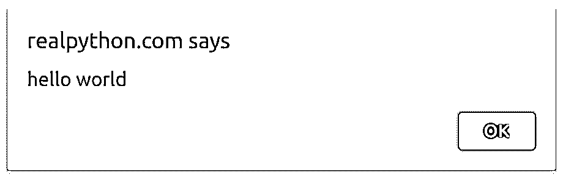
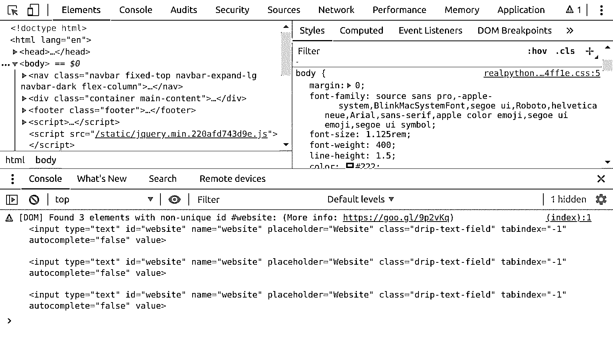
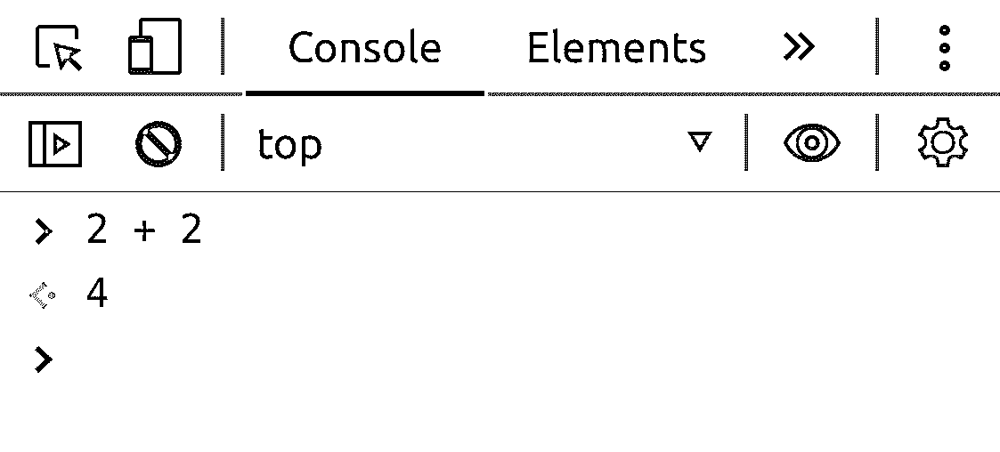
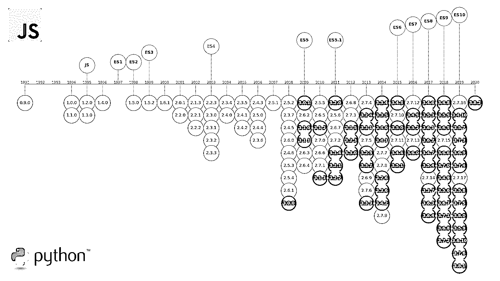
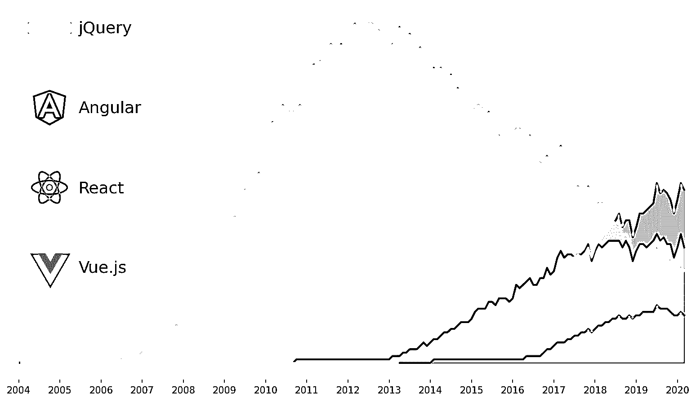

# python vs . python istas 的 JavaScript

> 原文：<https://realpython.com/python-vs-javascript/>

*立即观看**本教程有真实 Python 团队创建的相关视频课程。和文字教程一起看，加深理解:[**Python vs JavaScript for Python 开发者**](/courses/python-vs-javascript-for-python-devs/)

如果你对 web 开发很认真，那么你需要在某个时候学习一下 **JavaScript** 。年复一年，无数的调查表明，JavaScript 是世界上最流行的编程语言之一，拥有庞大且不断增长的开发者群体。就像 Python 一样，现代 JavaScript 几乎可以在任何地方使用，包括前端，后端，桌面，移动，以及[物联网](https://en.wikipedia.org/wiki/Internet_of_things) (IoT)。有时，在 Python 和 JavaScript 之间可能没有明显的选择。

如果您以前从未使用过 JavaScript，或者对其近年来的快速发展感到不知所措，那么本文将带您走上正确的道路。您应该已经知道 Python 的[基础，以便从两种语言之间的比较中充分受益。](https://realpython.com/products/python-basics-book/)

**在这篇文章中，你将学习如何:**

*   比较 **Python 与 JavaScript**
*   为工作选择正确的语言
*   用 JavaScript 编写一个 **shell 脚本**
*   在网页上生成**动态内容**
*   利用 JavaScript **生态系统**
*   避免 JavaScript 中常见的陷阱

**免费奖励:** [掌握 Python 的 5 个想法](https://realpython.com/bonus/python-mastery-course/)，这是一个面向 Python 开发者的免费课程，向您展示将 Python 技能提升到下一个水平所需的路线图和心态。

## JavaScript 一览

如果你已经熟悉 JavaScript 的起源，或者只是想看看实际运行的代码，那么请随意跳到下一节。否则，请准备一堂简短的历史课，带您了解 JavaScript 的演变。

[*Remove ads*](/account/join/)

### 不是 Java！

许多人，尤其是一些 IT 招聘人员，认为 JavaScript 和 Java 是同一种语言。不过，很难责怪他们，因为发明这样一个听起来耳熟的名字是一种营销伎俩。

JavaScript 在更名为 **LiveScript** 之前最初被称为 **Mocha** ，最终在发布前不久更名为 **JavaScript** 。当时， [Java](https://realpython.com/oop-in-python-vs-java/) 是一项很有前途的 web 技术，但是对于非技术型的网站管理员来说太难了。JavaScript 旨在作为一种有点类似但对初学者友好的语言，以补充 web 浏览器中的 Java 小程序。

**趣闻:【Java 和 JavaScript 都是 1995 年发布的。Python 已经五岁了。**

更令人困惑的是，由于缺乏许可权，微软开发了自己的语言版本，称为 **JScript** ，用于 Internet Explorer 3.0。今天，人们经常把 JavaScript 称为 **JS** 。

虽然 Java 和 JavaScript 在类似 C 的语法和标准库中有一些相似之处，但它们用于不同的目的。Java 从客户端发展成为一种更通用的语言。JavaScript 尽管简单，但足以验证 HTML 表单和添加小动画。

### 是 ECMAScript

JavaScript 是在网络早期由一家相对较小的公司开发的，名为 **Netscape** 。为了赢得与微软的市场竞争并缩小不同浏览器之间的差异，网景公司需要标准化他们的语言。在被国际**万维网联盟(W3C)** 拒绝后，他们向一个名为 **ECMA** (今天的 **Ecma 国际**)的欧洲标准化机构寻求帮助。

ECMA 为这种被称为 ECMAScript T1 的语言定义了一个正式规范，因为的 JavaScript T3 已经被的太阳微系统 T5 注册了商标。JavaScript 成了它最初启发的规范的实现之一。

**注:**换言之，JavaScript 符合 [ECMAScript 规范](https://www.ecma-international.org/publications/standards/Ecma-262.htm)。ECMAScript 家族的另一个著名成员是用于 Flash 平台的 **ActionScript** 。

虽然该规范的个别实现在某种程度上符合 ECMAScript，但它们也附带了额外的专有 API。这导致网页不能在不同的浏览器上正确显示，并且出现了像 [jQuery](https://jquery.com/) 这样的库。

### 还有其他剧本吗？

直到今天，JavaScript 仍然是唯一一种被 web 浏览器原生支持的编程语言。这是网络的通用语。有人爱，有人不爱。

已经有很多尝试用其他技术取代 JavaScript，并且这种尝试还会继续下去，这些技术包括:

*   **富互联网应用:** Flash、Silverlight、JavaFX
*   Transpilers: Haxe，Google Web Toolkit，pyjs
*   **JavaScript 方言:** CoffeeScript，TypeScript

在 HTML5 出现之前，这些尝试不仅受到个人喜好的驱动，也受到网络浏览器的限制。在那个时代，你不能使用 JavaScript 来完成计算密集型任务，比如绘制矢量图形或处理音频。

另一方面，富互联网应用(RIA) 通过插件在浏览器中提供身临其境的桌面体验。它们非常适合游戏和处理媒体。不幸的是，他们中的大多数都是封闭的源代码。有些在某些平台上存在安全漏洞或性能问题。更糟糕的是，它们都严重限制了网络搜索引擎索引用这些插件构建的页面的能力。

大约在同一时间出现了 transpilers，它允许将其他语言自动翻译成 JavaScript。这使得前端开发的门槛大大降低，因为后端工程师突然可以在一个新的领域利用他们的技能。然而，缺点是开发时间较慢，对 web 标准的支持有限，以及对移植的 JavaScript 代码的调试繁琐。为了将它链接回原始代码，你需要一个[源地图](https://developer.mozilla.org/en-US/docs/Tools/Debugger/How_to/Use_a_source_map)。

**注:**当[编译器](https://en.wikipedia.org/wiki/Compiler)将高级编程语言编写的人类可读代码直接翻译成[机器代码](https://en.wikipedia.org/wiki/Machine_code)时，翻译程序将一种高级语言翻译成另一种。这就是为什么 transpilers 也被称为**源到源**编译器。不过，它们与为外国硬件平台生成机器码的[交叉编译器](https://en.wikipedia.org/wiki/Cross_compiler)不同。

要为浏览器编写 Python 代码，可以使用一个可用的 transpilers，比如 [Transcrypt](https://www.transcrypt.org/) 或 [pyjs](http://pyjs.org/) 。后者是 Google Web Toolkit (GWT)的一个端口，这是一个非常流行的 Java-to-JavaScript transpiler。另一个选择是使用像 [Brython](https://realpython.com/brython-python-in-browser/) 这样的工具，它运行纯 JavaScript 的 Python 解释器的精简版本。然而，这些好处可能会被糟糕的性能和缺乏兼容性所抵消。

Transpiling 允许大量新语言出现，旨在取代 JavaScript 并解决其缺点。其中一些语言与 JavaScript 的方言密切相关。也许第一个是大约十年前创作的 [CoffeeScript](https://coffeescript.org/) 。最新的一个是谷歌的 [Dart](https://dart.dev/) ，根据 GitHub 的数据，这是 2019 年发展最快的语言[。随后出现了更多的语言，但是由于 JavaScript 最近的进步，它们中的大多数已经过时了。](https://octoverse.github.com/#fastest-growing-languages)

一个明显的例外是微软的 [TypeScript](https://www.typescriptlang.org/) ，它在最近几年越来越受欢迎。这是一个完全兼容的 JavaScript 超集，增加了可选的**静态类型检查**。如果这听起来很熟悉，那是因为 Python 的[类型提示](https://realpython.com/lessons/type-hinting/)受到了 TypeScript 的启发。

[](https://files.realpython.com/media/trends-chart.5cbb0e9a5be2.jpg)

<figcaption class="figure-caption text-center">Search Interest in TypeScript According to Google Trends</figcaption>

虽然现代 JavaScript 已经成熟并得到了积极的发展，但 transpiling 仍然是确保向后兼容旧浏览器的常用方法。即使您没有使用 TypeScript，这似乎是许多新项目的首选语言，您仍然需要将您的新 JavaScript 转换成该语言的旧版本。否则，您可能会遇到运行时错误。

一些 transpilers 还利用所谓的聚合填充来合成尖端的 web APIs，这些 API 在某些浏览器上可能是不可用的。

今天，JavaScript 可以被认为是网络的汇编语言。许多专业的前端工程师倾向于*而不是*手写。在这种情况下，它是通过传输从零开始生成的。

然而，即使是手写代码也经常以某种方式得到处理。例如，[缩小](https://en.wikipedia.org/wiki/Minification_(programming))删除空白并重命名[变量](https://realpython.com/python-variables/)以减少传输的数据量并混淆代码，从而更难进行逆向工程。这类似于将高级编程语言的源代码编译成本机代码。

除此之外，值得一提的是当代浏览器支持 [WebAssembly](https://webassembly.org/) 标准，这是一项相当新的技术。它为代码定义了一种二进制格式，可以在浏览器中以近乎本机的性能运行。它快速、可移植、安全，并允许交叉编译用 C++或 Rust 等语言编写的代码。例如，有了它，你可以把你最喜欢的视频游戏的几十年前的代码在浏览器中运行。

目前，WebAssembly 可以帮助您优化代码中计算关键部分的性能，但它也是有代价的。首先，你需要知道当前支持的编程语言之一。你必须熟悉底层的概念，比如内存管理，因为现在还没有垃圾收集器。与 JavaScript 代码的集成既困难又昂贵。此外，没有简单的方法从它调用 web APIs。

看来，经过这么多年，JavaScript 不会很快消失。

[*Remove ads*](/account/join/)

## JavaScript 初学者工具包

在比较 Python 和 JavaScript 时，您会注意到的第一个相似之处是，两者的入门门槛都很低，这使得这两种语言对想要学习编码的初学者都非常有吸引力。对于 JavaScript，唯一的初始要求是拥有一个 web 浏览器。如果你正在读这篇文章，那么你已经知道了。这种可访问性有助于语言的流行。

### 地址栏

为了体验一下编写 JavaScript 代码的感觉，您现在可以停止阅读，在导航到地址栏之前，在地址栏中键入以下文本:

[](https://files.realpython.com/media/javascript_alert.2f151dc202dd.gif)

文字文字是`javascript:alert('hello world')`，但是不要随便复制粘贴！

前缀之后的部分是一段 JavaScript 代码。确认后，它会让您的浏览器显示一个对话框，其中包含`hello world`消息。每个浏览器呈现该对话框的方式略有不同。比如谷歌 Chrome 是这样显示的:

[](https://files.realpython.com/media/javascript_alert.ffc4dd53a1db.png)

在大多数浏览器中，将这样的代码片段复制并粘贴到地址栏会失败，浏览器会过滤掉前缀`javascript:`,作为防止注入恶意代码的安全措施。

一些浏览器，如 Mozilla Firefox，则更进一步，完全阻止这种代码执行。在任何情况下，这都不是使用 JavaScript 的最方便的方式，因为您只能使用一行代码，并且只能使用一定数量的字符。有更好的方法。

### 网络开发工具

如果你是在台式机或笔记本电脑上查看这个页面，那么你可以利用 **web 开发工具**，它提供了跨竞争网络浏览器的可比体验。

**注意:**下面的例子使用的是[谷歌浏览器](https://www.google.com/chrome/)版本`80.0`。其他浏览器的键盘快捷键可能会有所不同，但界面应该基本相同。

要切换这些工具，请参考您的浏览器文档或尝试以下常用键盘快捷键之一:

*   T2`F12`

*   `Ctrl`+`Shift`+`I`

*   `Cmd`+`Option`+`I`

例如，如果您使用的是 Apple Safari 或 Microsoft Edge，此功能可能会被默认停用。一旦 web developer 工具被激活，您将看到无数的选项卡和工具栏，其内容类似于以下内容:

[](https://files.realpython.com/media/javascript_devtools.09cdc989dc08.png)

<figcaption class="figure-caption text-center">Web Developer Tools in Google Chrome</figcaption>

总的来说，它是一个强大的开发环境，配备了 JavaScript 调试器、性能和内存分析器、网络流量管理器等等。甚至还有一个通过 USB 电缆连接的物理设备的远程调试器！

然而，目前只需关注**控制台**，你可以通过点击位于顶部的标签来访问它。或者，您可以在使用 web developer 工具的同时，随时按下 `Esc` 快速将其置于最前面。

控制台主要用于检查当前网页发出的日志消息，但是它也是一个很好的 JavaScript 学习助手。就像使用[交互式 Python 解释器](https://realpython.com/interacting-with-python/#using-the-python-interpreter-interactively)一样，你可以直接在控制台中键入 JavaScript 代码，让它**在运行中执行**:

[](https://files.realpython.com/media/javascript_console.f15f9e136136.png)

<figcaption class="figure-caption text-center">JavaScript Console in Web Developer Tools</figcaption>

它拥有你期望从典型的工具中得到的一切，甚至更多。特别是，控制台带有语法高亮、上下文自动完成、命令历史、类似于 [GNU Readline](https://en.wikipedia.org/wiki/GNU_Readline) 的行编辑，以及呈现交互元素的能力。它的呈现能力对于检查对象和表格数据、从堆栈跟踪跳转到源代码或查看 HTML 元素特别有用。

您可以使用预定义的`console`对象将自定义消息记录到控制台。JavaScript 的`console.log()`相当于 [Python 的`print()`](https://realpython.com/python-print/) :

```py
console.log('hello world');
```

这将使消息出现在 web developer 工具的 console 选项卡中。除此之外，`console`对象中还有一些[有用的方法](https://www.w3schools.com/jsref/obj_console.asp)。

[*Remove ads*](/account/join/)

### HTML 文档

到目前为止，JavaScript 代码最自然的位置是在它通常操作的 [HTML](https://realpython.com/html-css-python/#the-html-document) 文档附近。稍后你会学到更多。您可以通过三种不同的方式从 HTML 引用 JavaScript:

| 方法 | 代码示例 |
| --- | --- |
| HTML 元素的属性 | `` |
| HTML `<script>`标签 | `<script>alert('hello');</script>` |
| 外存储器 | `<script src="/path/to/file.js"></script>` |

你想要多少就有多少。第一种和第二种方法将**内嵌** JavaScript 直接嵌入到 HTML 文档中。虽然这很方便，但您应该尽量将命令式 JavaScript 与声明式 HTML 分开，以提高可读性。

更常见的是用 JavaScript 代码找到一个或多个引用外部文件**的`<script>`标签。这些文件可以由本地或远程 web 服务器提供。**

`<script>`标签可以出现在文档中的任何地方，只要它嵌套在`<head>`或`<body>`标签中:

```py
<!DOCTYPE html>
<html>
<head>
  <meta charset="UTF-8">
  <title>Home Page</title>
  <script src="https://server.com/library.js"></script>
  <script src="local/assets/app.js"></script>
  <script> function  add(a,  b)  { return  a  +  b; } </script>
</head>
<body>
  <p>Lorem ipsum dolor sit amet (...)</p>
  <script> console.log(add(2,  3)); </script>
</body>
</html>
```

重要的是网络浏览器如何处理 HTML 文档。从上到下阅读文档。每当发现一个`<script>`标签，它就会立即被执行，甚至在页面被完全加载之前。如果您的脚本试图找到尚未呈现的 HTML 元素，那么您会得到一个错误。

为了安全起见，请始终将`<script>`标签放在文档主体的底部:

```py
<!DOCTYPE html>
<html>
<head>
  <meta charset="UTF-8">
  <title>Home Page</title>
</head>
<body>
  <p>Lorem ipsum dolor sit amet (...)</p>
  <script src="https://server.com/library.js"></script>
  <script src="local/assets/app.js"></script>
  <script> function  add(a,  b)  { return  a  +  b; } </script>
  <script> console.log(add(2,  3)); </script>
</body>
</html>
```

这不仅可以防止你犯上述错误，还可以改善整体用户体验。通过向下移动这些标签，您允许用户在 JavaScript 文件开始下载之前看到完全呈现的页面。您还可以 [`defer`](https://www.w3schools.com/tags/att_script_defer.asp) 下载外部 JavaScript 文件，直到页面加载完毕:

```py
<script src="https://server.com/library.js" defer></script>
```

如果你想了解更多关于混合 JavaScript 和 HTML 的知识，那么看看 W3Schools 的 JavaScript 教程。

### Node.js

您不再需要 web 浏览器来执行 JavaScript 代码。有一个叫做 [Node.js](https://nodejs.org/en/) 的工具为服务器端 JavaScript 提供了一个**运行时环境**。

运行时环境由作为语言解释器或编译器的 **JavaScript 引擎**以及用于与外界交互的 **API** 组成。不同的 web 浏览器有几种可选的引擎:

| 网络浏览器 | JavaScript 引擎 |
| --- | --- |
| 苹果 Safari | JavaScriptCore |
| 微软 Edge | V8 |
| 微软 IE | 人体精神力量的中心 |
| Mozilla Firefox | 蜘蛛猴 |
| 谷歌浏览器 | V8 |

其中的每一项都由其供应商实施和维护。然而，对于最终用户来说，除了单个引擎的性能之外，没有明显的区别。Node.js 使用谷歌为其 Chrome 浏览器开发的相同 V8 引擎。

在 web 浏览器中运行 JavaScript 时，您通常希望能够响应鼠标点击，动态添加 HTML 元素，或者从网络摄像头获取图像。但是这在 Node.js 应用程序中没有意义，它运行在浏览器之外。

在为您的平台安装了 Node.js 之后，您就可以像使用 Python 解释器一样执行 JavaScript 代码了。要开始互动会话，请在您的终端上键入`node`:

```py
$ node
> 2 + 2
4
```

这类似于您之前看到的 web 开发人员控制台。然而，一旦你试图引用与浏览器相关的东西，你就会得到一个错误:

```py
>  alert('hello world'); Thrown: ReferenceError:  alert  is  not  defined
```

这是因为您的运行时环境缺少另一个组件，即浏览器 API。同时，Node.js 提供了一组在后端应用程序中有用的 API,例如文件系统 API:

```py
>  const  fs  =  require('fs'); >  fs.existsSync('/path/to/file'); false
```

出于安全原因，你不会在浏览器中找到这些 API。想象一下，允许一些随机的网站控制你电脑上的文件！

如果标准库不能满足您的需求，那么您可以使用 Node.js 环境自带的**节点包管理器** ( `npm`)安装第三方包。要浏览或搜索包，请进入`npm` [公共注册表](https://www.npmjs.com/)，它类似于 [Python 包索引](https://pypi.org/) (PyPI)。

类似于`python`命令，您可以使用 Node.js 运行**脚本**:

```py
$ echo "console.log('hello world');" > hello.js
$ node hello.js
hello world
```

通过提供一个包含 JavaScript 代码的文本文件的路径，您可以指示 Node.js 运行该文件，而不是启动一个新的交互式会话。

在类似 Unix 的系统上，您甚至可以在文件的第一行使用 **[shebang](https://en.wikipedia.org/wiki/Shebang_(Unix))** 注释来指定运行该文件的程序:

```py
#!/usr/bin/env node
console.log('hello world');
```

注释必须是 Node.js 可执行文件的路径。然而，为了避免硬编码一个绝对路径，它可能在不同的安装中有所不同，最好让 [env](https://en.wikipedia.org/wiki/Env) 工具计算出 Node.js 安装在机器上的什么位置。

然后，您必须使该文件成为可执行文件，然后才能像运行 Python 脚本一样运行它:

```py
$ chmod +x hello.js
$ ./hello.js
hello world
```

用 Node.js 构建成熟的 web 应用程序的道路漫长而曲折，但用 Python 编写 [Django](https://realpython.com/django-setup/) 或 [Flask](https://realpython.com/python-web-applications-with-flask-part-i/) 应用程序的道路也是如此。

[*Remove ads*](/account/join/)

### 外语

有时 JavaScript 的运行时环境可以是另一种编程语言。这是典型的脚本语言。比如 Python，在**插件**开发中被广泛使用。你会在[崇高文本](https://www.sublimetext.com/)编辑器、 [GIMP](https://www.gimp.org/) 和 [Blender](https://www.blender.org/) 中找到。


举个例子，您可以使用脚本 API 评估 Java 程序中的 JavaScript 代码:

```py
package  org.example; import  javax.script.ScriptEngine; import  javax.script.ScriptEngineManager; import  javax.script.ScriptException; public  class App  { public  static  void  main(String[]  args)  throws  ScriptException  { final  ScriptEngineManager  manager  =  new  ScriptEngineManager(); final  ScriptEngine  engine  =  manager.getEngineByName("javascript"); System.out.println(engine.eval("2 + 2")); } }
```

这是一个 Java 扩展，尽管它可能在您特定的 [Java 虚拟机](https://en.wikipedia.org/wiki/Java_virtual_machine)中不可用。随后的几代 Java 捆绑了替代的脚本引擎，比如 [Rhino](https://en.wikipedia.org/wiki/Rhino_(JavaScript_engine)) 、 [Nashorn](https://en.wikipedia.org/wiki/Nashorn_(JavaScript_engine)) 和 [GraalVM](https://en.wikipedia.org/wiki/GraalVM) 。

这为什么有用？

只要性能不太差，你可以重用现有 JavaScript 库的代码，而不是用另一种语言重写。也许用 JavaScript 解决一个问题，比如数学表达式求值，会比你的母语更**方便**。最后，在运行时使用脚本语言进行**行为定制**，比如数据过滤或验证，可能是编译语言的唯一出路。

## JavaScript vs Python

在这一节中，您将从 Python 爱好者的角度比较 Python 和 JavaScript。前面会有一些新概念，但是您也会发现这两种语言之间的一些相似之处。

### 用例

Python 是一种**通用**、多范例、高级、跨平台、解释型编程语言，具有丰富的标准库和平易近人的语法。

因此，它被广泛用于各种学科，包括计算机科学教育、[脚本](https://realpython.com/run-python-scripts/)和[自动化](https://realpython.com/modern-web-automation-with-python-and-selenium/)、原型、[软件测试](https://realpython.com/python-testing/)、 [web 开发](https://realpython.com/learning-paths/become-python-web-developer/)、编程[嵌入式设备](https://realpython.com/micropython/)和[科学计算](https://realpython.com/python-scipy-cluster-optimize/)。尽管这是可行的，但你可能不会选择 Python 作为视频游戏或移动应用程序开发的主要技术。

另一方面，JavaScript 最初只是一种客户端脚本语言，让 HTML 文档更具交互性。它有意地简单，并且有一个唯一的焦点:向用户界面添加行为。尽管它的能力有所提高，但今天仍然如此。使用 Javascript，您不仅可以构建 web 应用程序，还可以构建桌面程序和移动应用程序。定制的运行时环境让您可以在服务器甚至物联网设备上执行 JavaScript。

### 哲学

Python 以牺牲表达能力为代价，强调代码的可读性和可维护性。毕竟，你甚至不能在不破坏代码的情况下对代码进行过多的格式化。你也不会像在 C++或 Perl 中那样找到深奥的运算符，因为大多数 Python [运算符](https://realpython.com/python-operators-expressions/)都是英语单词。有些人开玩笑说 Python 是可执行的[伪代码](https://en.wikipedia.org/wiki/Pseudocode)因为它的语法简单明了。

稍后你会发现，JavaScript 提供了更多的灵活性，但也带来了更多的麻烦。例如，在 JavaScript 中创建自定义数据类型没有唯一正确的方法。此外，即使新语法解决了问题，这种语言也需要保持与旧浏览器的向后兼容。

### 版本

直到最近，你还会在 Python 的官方网站上找到两个很不兼容的版本供下载。 **Python 2.7** 和 **Python 3.x** 之间的这种分歧让初学者感到困惑，也是减缓最新开发分支采用速度的主要因素。

2020 年 1 月，在拖延了多年的最后期限后，终于放弃了对 Python 2.7 的支持。然而，尽管一些政府机构发布了安全更新和警告，但仍有许多项目尚未迁移:

[](https://files.realpython.com/media/version-chart2.606423be16c4.png)

<figcaption class="figure-caption text-center">Timeline of JavaScript and Python Versions</figcaption>

Brendan Eich 在 1995 年创造了 JavaScript，但是我们今天知道的 ECMAScript 在两年后被标准化了。从那时起，只有少数几个版本，与同一时期每年发布的多个新版本相比，这看起来停滞不前。

注意 ES3 和 ES5 之间的差距，它持续了整整十年！由于政治冲突和技术委员会的分歧， **ES4** 从未出现在 web 浏览器中，但它被 Macromedia(后来的 Adobe)用作 ActionScript 的基础。

2015 年，随着 ES6 的推出，JavaScript 迎来了第一次重大变革，ES6 也被称为 ES2015 或 **ECMAScript Harmony** 。它带来了许多新的语法结构，使语言更加成熟、安全，并且方便了程序员。这也标志着 ECMAScript 发布时间表的一个转折点，现在每年都会有一个新版本。

如此快的速度意味着你不能假设最新的语言版本已经被所有主要的网络浏览器所采用，因为它需要时间来推出更新。这就是为什么**传输**和**多填充**盛行的原因。今天，几乎所有现代网络浏览器都可以支持 ES5，这是 transpilers 的默认目标。

[*Remove ads*](/account/join/)

### 运行时间

要运行一个 Python 程序，你首先需要下载、安装，并可能为你的平台配置它的**解释器**。一些操作系统提供了开箱即用的解释器，但它可能不是您想要使用的版本。还有替代的 Python 实现，包括 [CPython](https://realpython.com/cpython-source-code-guide/) 、 [PyPy](https://realpython.com/pypy-faster-python/) 、 [Jython](https://www.jython.org/) 、 [IronPython](https://ironpython.net/) ，或者 [Stackless Python](https://github.com/stackless-dev/stackless/wiki) 。您还可以从多个 Python **发行版**中进行选择，比如 [Anaconda](https://www.anaconda.com/) ，它们带有预装的第三方包。

JavaScript 则不同。没有独立的程序可以下载。取而代之的是，每个主流的网络浏览器都附带了某种 JavaScript 引擎和 API，它们共同构成了运行时环境。在上一节中，您了解了 Node.js，它允许在浏览器之外运行 JavaScript 代码。您还知道在其他编程语言中嵌入 JavaScript 的可能性。

### 生态系统

一个语言生态系统包括它的运行时环境、框架、库、工具和方言，以及它的最佳实践和不成文的规则。您选择哪种组合将取决于您的特定用例。

在过去，编写 JavaScript 只需要一个好的代码编辑器。你可以下载一些库，比如 [jQuery](https://jquery.com/) 、[下划线. js](https://underscorejs.org/) 或者[主干网. js](https://backbonejs.org/) ，或者依靠内容交付网络(CDN)为你的客户提供这些库。今天，你需要回答的[问题](https://hackernoon.com/how-it-feels-to-learn-javascript-in-2016-d3a717dd577f)的数量和你需要获得的工具甚至可以让你开始构建一个最简单的网站。

前端应用程序的构建过程与后端应用程序一样复杂，甚至更复杂。你的网络项目要经过林挺、传输、多填充、捆绑、缩小等等。见鬼，即使是 CSS 样式表也不再足够，需要由预处理器从扩展语言编译而来，如 [Sass](https://sass-lang.com/) 或 [Less](http://lesscss.org/) 。

为了缓解这种情况，一些框架提供了一些实用工具，为您设置默认的项目结构、生成配置文件和下载依赖项。例如，如果您的计算机上已经有了最新的 Node.js，您可以用这个简短的命令创建一个新的 [React](https://reactjs.org/) 应用程序:

```py
$ npx create-react-app todo
```

在撰写本文时，这个命令花了几分钟才完成，并在 1，815 个包中安装了巨大的 166 MB！相比之下，[用 Python 开始一个 Django 项目](https://realpython.com/django-setup/)，这是即时的:

```py
$ django-admin startproject blog
```

现代 JavaScript 生态系统是巨大的，并且在不断发展，这使得我们不可能对其元素进行全面的概述。在学习 JavaScript 的过程中，你会遇到大量的外来工具。然而，其中一些概念听起来很熟悉。以下是将它们映射回 Python 的方法:

|  | 计算机编程语言 | Java Script 语言 |
| --- | --- | --- |
| 代码编辑器/ IDE | [PyCharm](https://realpython.com/pycharm-guide/) ， [VS Code](https://realpython.com/python-development-visual-studio-code/) | [原子](https://atom.io/)、 [VS 代码](https://code.visualstudio.com/)、[网络风暴](https://www.jetbrains.com/webstorm/) |
| 代码格式化程序 | `black` | `Prettier` |
| 依赖性管理器 | [`Pipenv`](https://realpython.com/pipenv-guide/) ，`poetry` | `bower`(已弃用)`npm`，`yarn` |
| 文档工具 | [T2`Sphinx`](https://realpython.com/courses/documenting-python-projects-sphinx-read-the-docs/) | `JSDoc`，`sphinx-js` |
| 解释者 | `bpython`、`ipython`、`python` | `node` |
| 图书馆 | [`requests`](https://realpython.com/python-requests/) ，`dateutil` | `axios`，`moment` |
| 棉绒 | `flake8`、`pyflakes`、[、`pylint`、](https://realpython.com/courses/writing-cleaner-python-code-pylint/) | `eslint`，`tslint` |
| 包管理器 | [`pip`](https://realpython.com/what-is-pip/) ，`twine` | `bower`(已弃用)`npm`，`yarn` |
| 包注册表 | [黑桃](https://pypi.org/) | [npm](https://www.npmjs.com/) |
| 包装传送带 | `pipx` | `npx` |
| 运行时管理器 | [T2`pyenv`](https://realpython.com/intro-to-pyenv/) | `nvm` |
| 脚手架工具 | `cookiecutter` | `cookiecutter`，`Yeoman` |
| 测试框架 | `doctest`、`nose`、[、`pytest`、](https://realpython.com/pytest-python-testing/) | `Jasmine`、`Jest`、`Mocha` |
| Web 框架 | [姜戈](https://realpython.com/get-started-with-django-1/)，[烧瓶](https://realpython.com/tutorials/flask/)，[龙卷风](https://www.tornadoweb.org/en/stable/) | [角](https://angular.io/)、[反应](https://reactjs.org/)、[视图。js](https://vuejs.org/) |

这个列表并不详尽。此外，上面提到的一些工具有重叠的功能，所以很难在每个类别中进行比较。

有时候 Python 和 JavaScript 之间没有直接的相似之处。例如，虽然您可能习惯于为您的 Python 项目创建隔离的[虚拟环境](https://realpython.com/python-virtual-environments-a-primer/)，但是 Node.js 通过将依赖项安装到本地文件夹中来解决这个问题。

相反，JavaScript 项目可能需要前端开发特有的额外工具。一个这样的工具是 [Babel](https://babeljs.io/) ，它**根据被分组为预置的各种插件来传输你的代码。它可以处理实验性的 ECMAScript 特性以及 TypeScript，甚至 React 的 [JSX](https://reactjs.org/docs/introducing-jsx.html) 扩展语法。**

另一类工具是**模块捆绑器**，它的作用是将多个独立的源文件合并成一个可以被网络浏览器轻松使用的文件。

在开发过程中，您希望将代码分解成可重用的、可测试的、自包含的[模块](https://realpython.com/python-modules-packages/)。对于一个有经验的 Python 程序员来说，这是合理的。不幸的是，JavaScript 最初并不支持模块化。您仍然需要为此使用单独的工具，尽管这一需求正在发生变化。模块打包器的流行选择是 [webpack](https://webpack.js.org/) 、[package](https://parceljs.org/)和 [Browserify](http://browserify.org/) ，它们也可以处理静态资产。

然后你有**构建自动化**工具，比如[咕噜](https://gruntjs.com/)和[大口](https://gulpjs.com/)。它们与 Python 中的 [Fabric](http://www.fabfile.org/) 和 [Ansible](https://www.ansible.com/) 有些相似，尽管它们在本地使用。这些工具自动化了枯燥的任务，如复制文件或运行 transpiler。

在一个有很多交互 UI 元素的大规模单页面应用(SPA)中，你可能需要一个专门的库比如 [Redux](https://redux.js.org/) 或者 [MobX](https://mobx.js.org/) 进行**状态管理**。这些库不依赖于任何特定的前端框架，但是可以很快连接起来。

如您所见，学习 JavaScript 生态系统是一个漫长的旅程。

[*Remove ads*](/account/join/)

### 记忆模型

这两种语言都利用自动堆内存管理来消除人为错误并减少认知负荷。尽管如此，这并不能完全免除您遭受**内存泄漏**的风险，而且还会增加一些性能开销。

**注意:**当一块不再需要的内存被不必要地占用，并且没有办法释放它时，就会发生内存泄漏，因为你的代码不再能够访问它。JavaScript 中内存泄漏的一个常见来源是全局变量和持有对失效对象的强引用的[闭包](https://realpython.com/inner-functions-what-are-they-good-for/)。

正统的 CPython 实现使用**引用计数**以及非确定性的**垃圾收集** (GC)来处理引用周期。偶尔，当你冒险编写一个定制的 [C 扩展模块](https://realpython.com/build-python-c-extension-module/)时，你可能会被迫手动分配和回收内存。

在 JavaScript 中，内存管理的实际实现也留给您的特定引擎和版本，因为它不是语言规范的一部分。垃圾收集的基本策略通常是**标记和清除**算法，但是也存在各种优化技术。

例如，堆可以组织成几代，将短期对象和长期对象分开。垃圾收集可以并发运行，以卸载执行的主线程。采用增量方法有助于避免在清理内存时程序完全停止。

## JavaScript 类型系统

您一定很想了解 JavaScript 语法，但是首先让我们快速看一下它的[类型系统](https://realpython.com/python-type-checking/#type-systems)。它是定义任何编程语言的最重要的组件之一。

### 类型检查

Python 和 JavaScript 都是**动态类型的**，因为它们[在运行时检查类型](https://realpython.com/python-type-checking/)，当应用程序正在执行时，而不是在编译时。这很方便，因为您不必强制声明变量的类型，如`int`或`str`:

>>>

```py
>>> data = 42
>>> data = 'This is a string'
```

在这里，您为在计算机内存中具有不同表示的两种不同类型的实体重用相同的变量名。首先它是一个整数，然后它是一段文本。

**注意:**值得注意的是，一些静态类型语言，比如 Scala，也不需要显式的类型声明，只要可以从上下文中**推断**即可。

动态类型经常被误解为没有任何类型。这来自于这样一种语言，在这种语言中，变量就像一个只能容纳特定类型对象的盒子。在 Python 和 JavaScript 中，类型信息不是与变量联系在一起，而是与它所指向的对象联系在一起。这样的变量仅仅是一个别名，一个标签，或者一个指向内存中某个对象的指针。

缺少类型声明对于原型来说是很好的，但是在大型项目中，从维护的角度来看，这很快就会成为一个瓶颈。动态类型不太安全，因为在不经常使用的代码执行路径中检测不到错误的风险更高。

此外，对于人类和代码编辑者来说，这使得对代码的推理更加困难。Python 通过引入[类型提示](https://realpython.com/lessons/type-hinting/)解决了这个问题，您可以用它来点缀变量:

```py
data: str = 'This is a string'
```

默认情况下，类型提示只提供信息值，因为 Python 解释器在运行时并不关心它们。然而，您可以向工具链添加一个单独的实用程序，比如一个[静态类型检查器](http://mypy-lang.org/)，以获得关于不匹配类型的早期警告。类型提示是完全可选的，这使得将动态类型代码与静态类型代码结合起来成为可能。这种方法被称为**渐进打字**。

渐进类型化的思想是从 TypeScript 借鉴来的，TypeScript 本质上是 JavaScript，其类型可以转换回普通的旧 JavaScript。

两种语言的另一个共同特征是使用 **[鸭类型](https://realpython.com/lessons/duck-typing/)** 来测试类型兼容性。然而，Python 和 JavaScript 的一个显著不同之处是它们的类型检查机制的强度。

Python 通过拒绝对具有不兼容类型的对象采取行动，展示了**强类型**。例如，您可以使用加号(`+`)运算符来添加数字，或者使用[来连接字符串](https://realpython.com/lessons/concatenating-joining-strings-python/)，但是您不能将这两者混合使用:

>>>

```py
>>> '3' + 2
Traceback (most recent call last):
  File "<stdin>", line 1, in <module>
TypeError: can only concatenate str (not "int") to str
```

解释器不会隐式地将一种类型提升为另一种类型。你得自己决定，手工制作一个合适的类型铸件。如果你想要一个代数和，你应该这样做:

>>>

```py
>>> int('3') + 2
5
```

要将两个字符串连接在一起，您需要相应地转换第二个操作数:

>>>

```py
>>> '3' + str(2)
>>> '32'
```

另一方面，JavaScript 使用**弱类型**，它根据一组规则自动强制类型。不幸的是，这些规则是不一致的，而且很难记住，因为它们依赖于[操作符的优先级](https://realpython.com/python-operators-expressions/#operator-precedence)。

以前面的例子为例，当您使用加号(`+`)操作符时，JavaScript 会隐式地将数字转换为字符串:

```py
>  '3'  +  2 '32'
```

只要这是你想要的行为，那就很好。否则，你会为试图找到一个逻辑错误的根本原因而焦虑不安。但是比这更可怕的是。让我们看看如果将操作符改为其他内容会发生什么:

```py
>  '3'  -  2 1
```

现在是另一个操作数被转换成数字，所以最终结果不是字符串。如您所见，弱类型可能相当令人惊讶。

类型检查的力量不仅仅是黑白的。Python 位于这个范围的中间。例如，它会很高兴地将一个整数加到一个浮点数上，而在这种情况下， [Swift 编程语言](https://developer.apple.com/swift/)会产生一个错误。

**注:**强 vs 弱分型独立于静态 vs 动态分型。例如， [C 编程语言](https://realpython.com/build-python-c-extension-module/)同时是静态和弱类型的。

概括地说，JavaScript 是动态的，也是弱类型的，并且支持鸭类型。

[*Remove ads*](/account/join/)

### JavaScript 类型

在 Python 中，一切都是一个[对象](https://realpython.com/python3-object-oriented-programming/)，而 JavaScript 区分了**原语**和**引用**类型。它们在几个方面有所不同。

首先，只有几个预定义的基元类型需要关注，因为您不能自己创建。JavaScript 自带的大多数内置数据类型都是引用类型。

这些是 JavaScript 中唯一可用的**原语类型**:

*   `boolean`
*   `null`
*   `number`
*   `string`
*   `symbol`(从 ES6 开始)
*   `undefined`

另一方面，这里有一些 JavaScript 现成的**引用类型**:

*   `Array`
*   `Boolean`
*   `Date`
*   `Map`
*   `Number`
*   `Object`
*   `RegExp`
*   `Set`
*   `String`
*   `Symbol`
*   (…)

还有一个[提议](https://github.com/tc39/proposal-bigint)在 ES11 中加入一个新的`BigInt`数字类型，一些浏览器已经支持了。除此之外，您可能定义的任何自定义数据类型都将是引用类型。

原语类型的变量存储在一个叫做[栈](https://realpython.com/how-to-implement-python-stack/)的特殊内存区域，速度很快，但是大小有限，而且是短命的。相反，具有引用类型的对象是在堆上分配的，这仅受计算机上可用的物理内存量的限制。这类对象的生命周期要长得多，但访问速度稍慢。

基本类型是没有任何属性或方法可调用的空值。但是，一旦您尝试使用点符号访问一个对象，JavaScript 引擎就会立即将一个原始值包装在相应的包装器对象中:

```py
>  'Lorem ipsum'.length 11
```

尽管 JavaScript 中的字符串文字是一种原始数据类型，但您可以检查它的`.length`属性。幕后发生的事情是，您的代码被替换为对`String`对象的**构造函数**的调用:

```py
>  new  String('Lorem ipsum').length 11
```

构造函数是一种特殊的函数，它创建给定类型的新实例。可以看到,`.length`属性是由`String`对象定义的。这种包装机制被称为**自动装箱**，直接从 Java 编程语言复制而来。

原始类型和引用类型之间的另一个更明显的区别是它们是如何传递的。具体来说，每当您分配或传递一个基本类型的值时，您实际上在内存中创建了该值的一个副本。这里有一个例子:

```py
>  x  =  42 >  y  =  x >  x++  // This is short for x += 1 >  console.log(x,  y) 43  42
```

赋值`y = x`在内存中创建新值。现在你有了由`x`和`y`引用的数字`42`的两个不同副本，所以增加一个不会影响另一个。

但是，当您传递对对象文字的引用时，两个变量都指向内存中的同一个实体:

```py
>  x  =  {name:  'Person1'} >  y  =  x >  x.name  =  'Person2' >  console.log(y) {name:  'Person2'}
```

`Object`是 JavaScript 中的引用类型。在这里，你有两个变量，`x`和`y`，引用一个`Person`对象的同一个实例。对其中一个变量的更改会反映在另一个变量中。

最后但不是最不重要的，原始类型是，这意味着一旦它们被初始化，你就不能改变它们的状态。每一次修改，比如增加一个数字或使文本大写，都会产生原始值的一个全新副本。虽然这有点浪费，但是有足够的理由使用不可变值，包括[线程安全](https://realpython.com/intro-to-python-threading/)，更简单的设计，以及一致的状态管理。

**注意:**公平地说，这与 Python 处理传递对象的方式几乎相同，尽管它缺乏基本类型。可变类型如`list`和`dict`不创建副本，而不可变类型如`int`和`str`创建副本。

要在 JavaScript 中检查变量是基本类型还是引用类型，可以使用内置的`typeof`操作符:

```py
>  typeof  'Lorem ipsum' 'string' >  typeof  new  String('Lorem ipsum') 'object'
```

对于引用类型，`typeof`操作符总是返回一个通用的`"object"`字符串。

**注意:**总是使用`typeof`操作符来检查变量是否为`undefined`。否则，你会发现自己有麻烦:

```py
>  typeof  noSuchVariable  ===  'undefined' true >  noSuchVariable  ===  undefined ReferenceError:  noSuchVariable  is  not  defined
```

将一个不存在的变量与任何值进行比较都会抛出异常！

如果你想获得一个特定类型的更详细的信息，那么你有几个选择:

```py
>  today  =  new  Date() >  today.constructor.name 'Date' >  today  instanceof  Date true >  Date.prototype.isPrototypeOf(today) true
```

您可以尝试使用`instanceof`操作符检查一个对象的构造函数名，或者您可以使用`.prototype`属性测试它是否是从一个特定的父类型派生的。

[*Remove ads*](/account/join/)

### 类型层次

Python 和 JavaScript 是[面向对象的](https://realpython.com/python3-object-oriented-programming/)编程语言。它们都允许您用封装了身份、状态和行为的对象来表达代码。虽然包括 Python 在内的大多数编程语言都使用基于类的继承，但 JavaScript 是少数不使用的语言之一。

**注意:**类是对象的模板。你可以考虑像饼干模具或对象工厂这样的类。

要在 JavaScript 中创建定制类型的层次结构，您需要熟悉**原型继承**。当您从更经典的继承模型进行转换时，这通常是最难理解的概念之一。如果你有 20 分钟的时间，那么你可以看一个很棒的关于原型的[视频](https://www.youtube.com/watch?v=YkoelSTUy7A)，它清楚地解释了这个概念。

**注意:**与 Python 相反，[多重继承](https://realpython.com/lessons/multiple-inheritance-python/)在 JavaScript 中是不可能的，因为任何给定的对象只能有一个原型。也就是说，你可以使用在 ES6 中引入的[代理对象](https://developer.mozilla.org/en-US/docs/Web/JavaScript/Reference/Global_Objects/Proxy)来减轻这个问题。

故事的主旨是 JavaScript 中没有类。嗯，从技术上来说，你可以使用 ES6 中引入的`class`关键字，但它纯粹是一个[语法糖](https://en.wikipedia.org/wiki/Syntactic_sugar)，让新来者更容易。原型仍然在幕后使用，因此有必要更仔细地观察它们，稍后您将有机会这样做。

### 功能类型

最后，**函数**是 JavaScript 和 Python 类型系统中有趣的一部分。在这两种语言中，它们通常被称为[一等公民](https://realpython.com/lessons/functions-are-first-class-citizens-python/)或[一等对象](https://realpython.com/lessons/functions-first-class-objects-python/)，因为解释器不会将它们与其他数据类型区别对待。您可以将一个函数作为参数传递，从另一个函数返回，或者像普通值一样存储在变量中。

这是一个非常强大的特性，允许你定义[高阶](https://realpython.com/lessons/returning-functions-functions/)函数，并充分利用[函数范式](https://realpython.com/courses/functional-programming-python/)。对于函数是特殊实体的语言，你可以在设计模式的帮助下解决这个问题，比如[策略模式](https://sourcemaking.com/design_patterns/strategy)。

就功能而言，JavaScript 甚至比 Python 更灵活。您可以定义一个匿名的**函数表达式**，其中充满了具有副作用的语句，而 Python 的 [lambda 函数](https://realpython.com/python-lambda/)必须只包含一个表达式，不包含任何语句:

```py
let  countdown  =  5; const  id  =  setInterval(function()  { if  (countdown  >  0)  { console.log(`${countdown--}...`); }  else  if  (countdown  ===  0)  { console.log('Go!'); clearInterval(id); } },  1000);
```

内置的 [`setInterval()`](https://www.w3schools.com/jsref/met_win_setinterval.asp) 让你以毫秒为单位的时间间隔周期性地执行一个给定的函数，直到你用相应的 ID 调用`clearInterval()`为止。注意一个[条件语句](https://realpython.com/python-conditional-statements/)的使用和一个来自函数表达式外部范围的变量的突变。

## JavaScript 语法

JavaScript 和 Python 都是高级脚本语言，在语法上有很多相似之处。尤其是他们的最新版本。也就是说，JavaScript 被设计成类似 Java，而 Python 是模仿 ABC 和 T2 的 Modula-3 语言。

### 代码块

Python 的标志之一是使用强制的[缩进](https://realpython.com/lessons/getting-python-code-indentation-right/)来表示代码块，这是非常不寻常的，并且不被新的 Python 转换者所接受。许多流行的编程语言，包括 JavaScript，都使用**花括号**或特殊的关键字来代替:

```py
function  fib(n) { if  (n  >  1)  { return  fib(n-2)  +  fib(n-1); } return  1; }
```

在 JavaScript 中，每一个由多行代码组成的代码块都需要一个开始`{`和一个结束`}`，这给了你任意格式化代码的自由。你可以混合制表符和空格，不需要注意括号的位置。

不幸的是，这会导致混乱的代码和不同风格偏好的开发人员之间的宗派冲突。这使得代码审查很成问题。因此，您应该始终为您的团队建立编码标准，并一致地使用它们，最好是以自动化的方式。

**注:**你可以利用**三元 if** ( `?:`)来简化上面的函数体，它有时被称为[猫王运算符](https://en.wikipedia.org/wiki/Elvis_operator)，因为它看起来像著名歌手的发型:

```py
return  (n  >  1)  ?  fib(n-2)  +  fib(n-1)  :  1;
```

这相当于 Python 中的一个[条件表达式](https://realpython.com/python-conditional-statements/)。

说到缩进，习惯上 JavaScript 代码的格式是每个缩进层次使用**两个空格**，而不是 Python 中[推荐的](https://www.python.org/dev/peps/pep-0008/#indentation)四个空格。

[*Remove ads*](/account/join/)

### 语句

为了减少那些从 Java 或另一种 [C 族编程语言](https://en.wikipedia.org/wiki/List_of_C-family_programming_languages)转换过来的人的摩擦，JavaScript 用一个熟悉的**分号** ( `;`)终止语句。如果你曾经用这些语言中的一种编程过，那么你会知道在指令后面放一个分号变成了肌肉记忆:

```py
alert('hello world');
```

不过，JavaScript 中不需要分号，因为解释器会猜测并自动为您插入一个。在大多数情况下，这是正确的，但有时可能会导致特殊的结果。

**注意:**你也可以在 Python 中使用分号！虽然它们不是很流行，但是它们有助于在一行中隔离多个语句:

```py
import pdb; pdb.set_trace()
```

人们对是否明确使用分号有强烈的意见。虽然有一些重要的特例，但这在很大程度上只是一个惯例。

### 标识符

标识符，比如变量名或函数名，在 JavaScript 和 Python 中必须是字母数字的。换句话说，它们只能包含字母、数字和一些特殊字符。同时，它们不能以数字开头。虽然允许使用非拉丁字符，但通常应避免使用:

*   **合法:**`foo``foo42``_foo``$foo``fößar`
*   **非法:** `42foo`

两种语言中的名字**都区分大小写**，所以像`foo`和`Foo`这样的变量是不同的。尽管如此，JavaScript 中的命名约定与 Python 中的略有不同:

|  | 计算机编程语言 | Java Script 语言 |
| --- | --- | --- |
| 类型 | `ProjectMember` | `ProjectMember` |
| 变量、属性或函数 | `first_name` | `firstName` |

一般来说，Python 建议对复合名称使用 lower _ case _ with _ underscores，也称为 [snake_case](https://en.wikipedia.org/wiki/Snake_case) ，这样各个单词就可以用下划线字符(`_`)隔开。该规则的唯一例外是类，其名称应该遵循大写单词或 Pascal 大小写风格。JavaScript 也对类型使用大写单词，但对其他类型使用 mixedCase，或[小写字母](https://en.wikipedia.org/wiki/Camel_case)。

### 评论

JavaScript 有单行和多行**注释**:

```py
x++;  // This is a single-line comment /*
 This whole paragraph
 is a comment and will
 be ignored.
*/
```

您可以使用双斜线(`//`)在一行的任何地方开始注释，这类似于 Python 的散列符号(`#`)。虽然 Python 中没有多行注释，但是您可以通过在三重引号(`'''`)中包含一段代码来创建一个[多行字符串](https://realpython.com/lessons/triple-quoted-strings/)来模拟它们。或者，您可以将其包装在一个 [`if`语句](https://realpython.com/python-conditional-statements/)中，该语句永远不会计算为`True`:

```py
if False:
    ...
```

例如，您可以使用这个技巧在调试期间临时禁用现有的代码块。

### 字符串文字

要在 JavaScript 中定义字符串文字，可以交替使用一对单引号(`'`)或双引号(`"`)，就像在 Python 中一样。然而，在很长一段时间里，没有办法在 JavaScript 中定义多行字符串。只有 ES6 在 2015 年带来了**模板文字**，看起来像是从 Python 借来的 [f 字符串](https://realpython.com/python-f-strings/)和多行字符串的混合体:

```py
var  name  =  'John Doe'; var  message  =  `Hi ${name.split(' ')[0]},

We're writing to you regarding...

Kind regards,
Xyz
`;
```

模板以反勾号(`)开始，也称为重音符，而不是普通的引号。为了**插入**一个变量或者任何合法的表达式，你必须使用美元符号，后面跟着一对匹配的花括号:`${...}`。这与 Python 的 f 字符串不同，后者不需要美元符号。

[*Remove ads*](/account/join/)

### 可变范围

当你在 JavaScript 中像在 Python 中一样定义变量时，你隐式地创建了一个**全局变量**。由于全局变量打破了封装，你应该很少需要它们！在 JavaScript 中声明变量的正确方式一直是通过`var`关键字:

```py
x  =  42;  // This is a global variable. Did you really mean that? var  y  =  15;  // This is global only when declared in a global context.
```

不幸的是，这并没有声明一个真正的局部变量，它有自己的问题，您将在下一节中发现。自 ES6 以来，有了一种更好的方法来分别用`let`和`const`关键字声明**变量**和**常量**:

```py
>  let  name  =  'John Doe'; >  const  PI  =  3.14; >  PI  =  3.1415; TypeError:  Assignment  to  constant  variable.
```

与常量不同，JavaScript 中的变量不需要初始值。您可以稍后提供一个:

```py
let  name; name  =  'John Doe';
```

当你去掉初始值时，你创建的是所谓的变量**声明**，而不是变量**定义**。这样的变量会自动接收一个特殊的值`undefined`，这是 JavaScript 中的原始类型之一。这在 Python 中是不同的，你总是定义除了[变量注释](https://www.python.org/dev/peps/pep-0526/)之外的变量。但即使这样，这些变量在技术上也没有声明:

```py
name: str
name = 'John Doe'
```

这样的注释不会影响变量的生命周期。如果你在赋值前引用了`name`，那么你会收到一个`NameError`异常。

### 开关语句

如果您一直在抱怨 Python 没有合适的 **switch 语句**，那么您会很高兴地得知 JavaScript 有:

```py
// As with C, clauses will fall through unless you break out of them. switch  (expression)  { case  'kilo': value  =  bytes  /  2**10; break; case  'mega': value  =  bytes  /  2**20; break; case  'giga': value  =  bytes  /  2**30; break; default: console.log(`Unknown unit: "${expression}"`); }
```

表达式可以计算任何类型，包括字符串，这在影响 JavaScript 的早期 Java 版本中并不总是如此。顺便说一下，你注意到上面代码片段中熟悉的**取幂运算符** ( `**`)了吗？直到 2016 年的 ES7 才推出 JavaScript 版本。

### 枚举

在纯 JavaScript 中没有本地的**枚举**类型，但是您可以在 TypeScript 中使用`enum`类型，或者用类似下面的代码模拟一个类型:

```py
const  Sauce  =  Object.freeze({ BBQ:  Symbol('bbq'), CHILI:  Symbol('chili'), GARLIC:  Symbol('garlic'), KETCHUP:  Symbol('ketchup'), MUSTARD:  Symbol('mustard') });
```

冻结对象可防止您添加或移除其属性。这与常量不同，常量可以是可变的！常数总是指向同一个对象，但是对象本身可能会改变它的值:

```py
>  const  fruits  =  ['apple',  'banana']; >  fruits.push('orange');  // ['apple', 'banana', 'orange'] >  fruits  =  []; TypeError:  Assignment  to  constant  variable.
```

您可以向数组添加一个`orange`，它是可变的，但是您不能修改指向它的常量。

### 箭头功能

在 ES6 之前，你只能使用`function`关键字定义一个**函数**或者一个匿名的**函数表达式**:

```py
function  add(a,  b)  { return  a  +  b; } let  add  =  function(a,  b)  { return  a  +  b; };
```

然而，为了减少样板代码并解决将函数绑定到对象的一个小问题，除了常规语法之外，现在还可以使用**箭头函数**:

```py
let  add  =  (a,  b)  =>  a  +  b;
```

注意，这里不再有关键字`function`，return 语句是隐式的。箭头符号(`=>`)将函数的参数与函数体分开。人们有时称它为*胖*箭头函数，因为它最初是从 CoffeeScript 借来的，coffee script 也有一个*瘦*箭头(`->`)对应函数。

箭头函数最适合小型匿名表达式，如 Python 中的 [lambdas](https://realpython.com/python-lambda/) ，但如果需要，它们可以包含多个有副作用的语句:

```py
let  add  =  (a,  b)  =>  { const  result  =  a  +  b; return  result; }
```

当您想从 arrow 函数返回一个**对象文字**时，您需要用括号将它括起来，以避免代码块的模糊性:

```py
let  add  =  (a,  b)  =>  ({ result:  a  +  b });
```

否则，函数体会对没有任何 [`return`语句](https://realpython.com/python-return-statement/)的代码块感到困惑，冒号会创建一个[标记的语句](https://developer.mozilla.org/en-US/docs/Web/JavaScript/Reference/Statements/label)，而不是一个键值对。

### 默认参数

从 ES6 开始，函数参数可以有**默认值**，就像 Python 中一样:

```py
>  function  greet(name  =  'John')  { …  console.log('Hello',  name); …  } >  greet(); Hello  John
```

然而，与 Python 不同的是，每次调用函数时都会解析默认值，而不是仅在定义函数时才解析。这使得安全使用可变类型以及动态引用运行时传递的其他参数成为可能:

```py
>  function  foo(a,  b=a+1,  c=[])  { …  c.push(a); …  c.push(b); …  console.log(c); …  } >  foo(1); [1,  2] >  foo(5); [5,  6]
```

每次调用`foo()`时，它的默认参数都来自传递给函数的实际值。

### 可变函数

当您想在 Python 中声明一个参数数量可变的[函数时，您可以利用特殊的`*args`语法。JavaScript 的等价物是用 **spread** ( `...`)操作符定义的 **rest 参数**:](https://realpython.com/python-kwargs-and-args/)

```py
>  function  average(...numbers)  { …  if  (numbers.length  >  0)  { …  const  sum  =  numbers.reduce((a,  x)  =>  a  +  x); …  return  sum  /  numbers.length; …  } …  return  0; …  } >  average(); 0 >  average(1); 1 >  average(1,  2); 1.5 >  average(1,  2,  3); 2
```

扩展运算符也可用于组合可迭代序列。例如，您可以将一个数组的元素提取到另一个数组中:

```py
const  redFruits  =  ['apple',  'cherry']; const  fruits  =  ['banana',  ...redFruits];
```

根据您在目标列表中放置 spread 操作符的位置，您可以预先计划或追加元素，或者将它们插入到中间的某个位置。

### 析构分配

要将一个 iterable 解包为单个变量或常量，可以使用**析构**赋值:

```py
>  const  fruits  =  ['apple',  'banana',  'orange']; >  const  [a,  b,  c]  =  fruits; >  console.log(b); banana
```

同样，你可以析构甚至**重命名**对象属性:

```py
const  person  =  {name:  'John Doe',  age:  42,  married:  true}; const  {name:  fullName,  age}  =  person; console.log(`${fullName} is ${age} years old.`);
```

这有助于避免在一个作用域内定义的变量的名称冲突。

### `with`报表

还有一种方法可以使用稍微古老的 [`with`语句](https://realpython.com/python-with-statement/)来深入到对象的属性:

```py
const  person  =  {name:  'John Doe',  age:  42,  married:  true}; with  (person)  { console.log(`${name} is ${age} years old.`); }
```

它的工作原理类似于 [Object Pascal](https://en.wikipedia.org/wiki/Object_Pascal) 中的一个构造，其中一个局部作用域被给定对象的属性临时扩充。

**注:**Python vs JavaScript 中的`with`语句是[假朋友](https://en.wikipedia.org/wiki/False_friend)。在 Python 中，使用一个`with`语句通过[上下文管理器](https://realpython.com/courses/python-context-managers-and-with-statement/)来管理资源。

由于这可能是晦涩的，`with`语句通常不被鼓励，甚至在[严格模式](https://developer.mozilla.org/en-US/docs/Web/JavaScript/Reference/Strict_mode)中不可用。

### 可迭代程序、迭代器和生成器

自 ES6 以来，JavaScript 已经有了**可迭代**和**迭代器**协议以及**生成器函数**，它们看起来几乎与 Python 的[可迭代、迭代器](https://realpython.com/lessons/looping-over-iterables/)和[生成器](https://realpython.com/introduction-to-python-generators/)相同。要将常规函数转换成生成器函数，需要在关键字`function`后添加一个星号(`*`):

```py
function*  makeGenerator()  {}
```

但是，你不能用箭头函数来生成[生成器函数](https://realpython.com/courses/python-generators/)。

当你调用一个生成器函数时，它不会执行函数体。相反，它返回一个符合迭代器协议的挂起的**生成器对象**。为了推进您的生成器，您可以调用`.next()`，它类似于 Python 的内置`next()`:

```py
>  const  generator  =  makeGenerator(); >  const  {value,  done}  =  generator.next(); >  console.log(value); undefined >  console.log(done); true
```

因此，您总是会得到一个具有两个属性的状态对象:后续值和一个指示生成器是否已耗尽的标志。当生成器中没有更多的值时，Python 抛出`StopIteration`异常。

要从生成器函数返回一些值，可以使用 [`yield`](https://realpython.com/introduction-to-python-generators/) 关键字或`return`关键字。生成器将继续输入值，直到不再有`yield`语句，或者直到您`return`过早地:

```py
let  shouldStopImmediately  =  false; function*  randomNumberGenerator(maxTries=3)  { let  tries  =  0; while  (tries++  <  maxTries)  { if  (shouldStopImmediately)  { return  42;  // The value is optional } yield  Math.random(); } }
```

上面的生成器将不断产生随机数，直到它达到最大尝试次数，或者你设置一个标志使它提前终止。

Python 中的`yield from`表达式的等价物是`yield*`表达式，其中**将迭代**委托给另一个迭代器或可迭代对象:

```py
>  function*  makeGenerator()  { …  yield  1; …  yield*  [2,  3,  4]; …  yield  5; …  } >  const  generator  =  makeGenerator() >  generator.next(); {value:  1,  done:  false} >  generator.next(); {value:  2,  done:  false} >  generator.next(); {value:  3,  done:  false} >  generator.next(); {value:  4,  done:  false} >  generator.next(); {value:  5,  done:  false} >  generator.next(); {value:  undefined,  done:  true}
```

有趣的是，同时使用`return`和`yield`是合法的:

```py
function*  makeGenerator()  { return  yield  42; }
```

然而，由于语法限制，您必须使用括号才能在 Python 中达到相同的效果:

```py
def make_generator():
    return (yield 42)
```

为了解释发生了什么，您可以通过引入一个辅助常量来重写该示例:

```py
function*  makeGenerator()  { const  message  =  yield  42; return  message; }
```

如果你知道 Python 中的[协程](https://realpython.com/lessons/what-are-python-coroutines/)，那么你会记得生成器对象既可以是**生产者**也可以是**消费者**。通过向`.next()`提供一个可选参数，可以将任意值发送到挂起的生成器中:

```py
>  function*  makeGenerator()  { …  const  message  =  yield  'ping'; …  return  message; …  } >  const  generator  =  makeGenerator(); >  generator.next(); {value:  "ping",  done:  false} >  generator.next('pong'); {value:  "pong",  done:  true}
```

对`.next()`的第一次调用运行生成器，直到第一个`yield`表达式，恰好返回`"ping"`。第二个调用传递一个存储在常量中的`"pong"`，并立即从生成器返回。

### 异步功能

上面探索的漂亮机制是[异步编程](https://realpython.com/async-io-python/)和在 Python 中采用`async`和`await`关键字的基础。JavaScript 在 2017 年通过 ES8 引入了**异步函数**走了同样的路。

当生成器函数返回一种特殊的迭代器时，生成器对象，[异步函数](https://realpython.com/python-async-features/)总是返回一个**承诺**，这是在 ES6 中首次引入的。承诺表示异步调用的未来结果，例如来自[获取 API](https://developer.mozilla.org/en-US/docs/Web/API/Fetch_API) 的`fetch()`。

当您从异步函数返回任何值时，它会自动包装在一个 promise 对象中，该对象可以在另一个异步函数中等待:

```py
async  function  greet(name)  { return  `Hello ${name}`; } async  function  main()  { const  promise  =  greet('John'); const  greeting  =  await  promise; console.log(greeting);  // "Hello John" } main();
```

通常，您会`await`并一次性分配结果:

```py
const  greeting  =  await  greet('John');
```

尽管您不能完全摆脱异步函数的承诺，但是它们显著地提高了代码的可读性。它开始看起来像同步代码，即使您的函数可以多次暂停和恢复。

与 Python 中异步代码的一个显著区别是，在 JavaScript 中，您不需要手动设置**事件循环**，它在后台隐式运行。JavaScript 天生就是异步的。

### 对象和构造函数

从本文前面的部分可以知道，JavaScript 没有类的概念。相反，它知道物体。您可以使用**对象文字**创建新对象，它们看起来像 [Python 字典](https://realpython.com/python-dicts/):

```py
let  person  =  { name:  'John Doe', age:  42, married:  true };
```

它就像一个字典，您可以使用点语法或方括号来访问各个属性:

```py
>  person.age++; >  person['age']; 43
```

对象属性不需要用引号括起来，除非它们包含空格，但这并不是一种常见的做法:

```py
>  let  person  =  { …  'full name':  'John Doe' …  }; >  person['full name']; 'John Doe' >  person.full  name; SyntaxError:  Unexpected  identifier
```

就像字典和 Python 中的一些对象一样，JavaScript 中的对象有**动态属性**。这意味着您可以添加新属性或从对象中删除现有属性:

```py
>  let  person  =  {name:  'John Doe'}; >  person.age  =  42; >  console.log(person); {name:  "John Doe",  age:  42} >  delete  person.name; true >  console.log(person); {age:  42}
```

从 ES6 开始，对象可以拥有带有**计算名称**的属性:

```py
>  let  person  =  { …  ['full'  +  'Name']:  'John Doe' …  }; >  person.fullName; 'John Doe'
```

Python 字典和 JavaScript 对象允许包含函数作为它们的键和属性。有一些方法可以将这样的函数绑定到它们的所有者，这样它们的行为就像类方法一样。例如，您可以使用循环引用:

```py
>  let  person  =  { …  name:  'John Doe', …  sayHi:  function()  { …  console.log(`Hi, my name is ${person.name}.`); …  } …  }; >  person.sayHi(); Hi,  my  name  is  John  Doe.
```

`sayHi()`与它所属的对象紧密耦合，因为它通过名称引用了`person`变量。如果您要在某个时候重命名该变量，那么您必须遍历整个对象，并确保更新该变量名的所有出现。

一个稍微好一点的方法是利用暴露给函数的隐式`this`变量。根据调用函数的人的不同，`this`的值会有所不同:

```py
>  let  jdoe  =  { …  name:  'John Doe', …  sayHi:  function()  { …  console.log(`Hi, my name is ${this.name}.`);  …  } …  }; >  jdoe.sayHi(); Hi,  my  name  is  John  Doe.
```

把一个硬编码的`person`替换成`this`后，类似于 Python 的`self`，变量名是什么就无所谓了，结果还是和以前一样。

**注意:**如果用箭头函数替换函数表达式，上面的例子就不起作用了，因为后者对`this`变量有不同的作用域规则。

这很好，但是一旦你决定引入更多同类的对象，你就必须重复每个对象的所有属性并重新定义所有函数。您更希望拥有的是一个用于`Person`对象的模板。

在 JavaScript 中创建自定义数据类型的规范方法是定义一个**构造函数**，这是一个普通的函数:

```py
function  Person()  { console.log('Calling the constructor'); }
```

按照惯例，为了表示这样的函数有特殊的含义，您应该将大写单词后面的第一个字母大写，而不是通常的 mixedCase。

然而，在语法层面上，它只是一个可以正常调用的函数:

```py
>  Person(); Calling  the  constructor undefined
```

它的特别之处在于你如何称呼它:

```py
>  new  Person(); Calling  the  constructor Person  {}
```

当您在函数调用前添加`new`关键字时，它将隐式返回一个 JavaScript 对象的全新实例。这意味着你的构造函数不应该包含`return`语句。

解释器负责为新对象分配内存和搭建新对象，而构造器的作用是给对象一个初始状态。您可以使用前面提到的`this`关键字来引用正在构建的新实例:

```py
function  Person(name)  { this.name  =  name; this.sayHi  =  function()  { console.log(`Hi, my name is ${this.name}.`); } }
```

现在您可以创建多个不同的`Person`实体:

```py
const  jdoe  =  new  Person('John Doe'); const  jsmith  =  new  Person('John Smith');
```

好吧，但是你仍然在复制所有`Person`类型实例的函数定义。构造函数只是一个将相同的值与单个对象挂钩的工厂。这是一种浪费，如果您在某个时候改变它，可能会导致不一致的行为。考虑一下这个:

```py
>  const  jdoe  =  new  Person('John Doe'); >  const  jsmith  =  new  Person('John Smith'); >  jsmith.sayHi  =  _  =>  console.log('What?'); >  jdoe.sayHi(); Hi,  my  name  is  John  Doe. >  jsmith.sayHi(); What?
```

因为每个对象都有其属性的副本，包括函数，所以您必须小心地更新所有实例以保持一致的行为。否则，他们会做不同的事情，这通常不是你想要的。对象可能有不同的状态，但是它们的行为通常不会改变。

### 原型

根据经验，您应该将业务逻辑从关注数据的构造器转移到**原型**对象:

```py
function  Person(name)  { this.name  =  name; } Person.prototype.sayHi  =  function()  { console.log(`Hi, my name is ${this.name}.`); };
```

每个物体都有原型。您可以通过引用构造函数的`.prototype`属性来访问自定义数据类型的原型。它已经有了一些预定义的属性，比如`.toString()`，这些属性对于 JavaScript 中的所有对象都是通用的。您可以使用自定义方法和值添加更多属性。

当 JavaScript 寻找一个对象的属性时，它首先试图在该对象中找到它。一旦失败，它就转移到相应的原型。因此，原型中定义的属性在相应类型的所有实例中共享。

原型是链式的，所以属性查找会继续，直到链中不再有原型。这类似于通过继承的类型层次结构。

由于有了原型，您不仅可以在一个地方创建方法，还可以通过将它们附加到一个:

```py
>  Person.prototype.PI  =  3.14; >  new  Person('John Doe').PI; 3.14 >  new  Person('John Smith').PI; 3.14
```

为了说明原型的强大功能，您可以尝试扩展现有对象的行为，甚至是内置的数据类型。让我们通过在 prototype 对象中指定一个新方法来为 JavaScript 中的`string`类型添加一个新方法:

```py
String.prototype.toSnakeCase  =  function()  { return  this.replace(/\s+/g,  '') .split(/(?<=[a-z])(?=[A-Z])/g) .map(x  =>  x.toLowerCase()) .join('_'); };
```

它使用[正则表达式](https://realpython.com/regex-python/)将文本转换成 snake_case。突然之间，字符串变量、常量甚至字符串都可以从中受益:

```py
>  "loremIpsumDolorSit".toSnakeCase(); 'lorem_ipsum_dolor_sit'
```

然而，这是一把双刃剑。以类似的方式，有人可以在一个流行类型的原型中覆盖一个现有的方法，这将打破其他地方所做的假设。这样的[猴子补丁](https://en.wikipedia.org/wiki/Monkey_patch)在[测试](https://realpython.com/learning-paths/test-your-python-apps/)中可能有用，但在其他方面非常危险。

### 类别

从 ES6 开始，有了一种使用更熟悉的语法定义原型的替代方法:

```py
class  Person  { constructor(name)  { this.name  =  name; } sayHi()  { console.log(`Hi, my name is ${this.name}.`); } }
```

尽管这看起来像是在定义一个**类**，但这只是在 JavaScript 中指定定制数据类型的一个方便的高级隐喻。在幕后，没有真正的类！出于这个原因，有些人甚至完全反对使用这种新语法。

您可以在您的类中拥有**getter**和**setter**，这类似于 Python 的[类属性](https://docs.python.org/3/howto/descriptor.html?#properties):

```py
>  class  Square  { …  constructor(size)  { …  this.size  =  size;  // Triggers the setter …  } …  set  size(value)  { …  this._size  =  value;  // Sets the private field …  } …  get  area()  { …  return  this._size**2; …  } …  } >  const  box  =  new  Square(3); >  console.log(box.area); 9 >  box.size  =  5; >  console.log(box.area); 25
```

当您省略 setter 时，您创建了一个只读属性。然而，这是一种误导，因为您仍然可以像在 Python 中一样访问底层的`private`字段。

在 JavaScript 中封装内部实现的一种常见模式是**立即调用函数表达式(life)**，看起来可能是这样的:

```py
>  const  odometer  =  (function(initial)  { …  let  mileage  =  initial; …  return  { …  get:  function()  {  return  mileage;  }, …  put:  function(miles)  {  mileage  +=  miles;  } …  }; …  })(33000); >  odometer.put(65); >  odometer.put(12); >  odometer.get(); 33077
```

换句话说，它是一个调用自身的匿名函数。你也可以使用更新的箭头功能来创造生活:

```py
const  odometer  =  ((initial)  =>  { let  mileage  =  initial; return  { get:  _  =>  mileage, put:  (miles)  =>  mileage  +=  miles }; })(33000);
```

这就是 JavaScript 在历史上如何模拟**模块**以避免全局[名称空间](https://realpython.com/python-namespaces-scope/)中的名称冲突。如果没有 IIFE，它使用闭包和函数作用域只公开有限的面向公众的 API，那么一切都可以从调用代码中访问。

有时你想定义一个逻辑上属于你的类的工厂或实用函数。在 Python 中，你有`@classmethod`和`@staticmethod`装饰器，它们允许你将**静态方法**与类相关联。为了在 JavaScript 中达到同样的结果，您需要使用`static`方法修饰符:

```py
class  Color  { static  brown()  { return  new  Color(244,  164,  96); } static  mix(color1,  color2)  { return  new  Color(...color1.channels.map( (x,  i)  =>  (x  +  color2.channels[i])  /  2 )); } constructor(r,  g,  b)  { this.channels  =  [r,  g,  b]; } } const  color1  =  Color.brown(); const  color2  =  new  Color(128,  0,  128); const  blended  =  Color.mix(color1,  color2);
```

注意，目前没有定义静态类属性的方法，至少没有额外的 transpiler 插件。

当你从一个类`extend`到另一个类**时，链接原型可以类似于**类继承:

```py
class  Person  { constructor(firstName,  lastName)  { this.firstName  =  firstName; this.lastName  =  lastName; } fullName()  { return  `${this.firstName}  ${this.lastName}`; } } class  Gentleman  extends  Person  { signature()  { return  'Mr. '  +  super.fullName() } }
```

在 Python 中，你可以扩展不止一个类，但是在 JavaScript 中这是不可能的。要从**父类**中引用属性，您可以使用 [`super()`](https://realpython.com/python-super/) ，它必须在构造函数中被调用来传递参数。

### 装修工

装饰器是 JavaScript 从 Python 复制的另一个特性。从技术上讲，它们仍然是 T2 的提案，可能会有变化，但是你可以使用 T4 的在线游乐场或当地的运输公司来测试它们。但是，需要注意的是，它们需要一些配置。根据所选择的插件及其选项，您会得到不同的语法和行为。

一些框架已经使用了装饰者的定制语法，这需要转换成普通的 JavaScript。如果您选择了 [TC-39](https://tc39.es/) 提议，那么您将只能修饰类及其成员。JavaScript 中似乎不会有任何特殊的函数装饰语法。

## JavaScript 怪癖

Brendan Eich 花了 10 天时间创建了后来成为 JavaScript 的原型。在一次商业会议上提交给利益相关者之后，这种语言被认为已经可以生产了，并且在很多年里没有经历太多的变化。

不幸的是，这使得这种语言因其古怪而声名狼藉。有些人甚至没有把 JavaScript 当成“真正的”编程语言，这让它成为了许多笑话和模因的牺牲品。

今天，这种语言比过去友好多了。然而，知道应该避免什么是值得的，因为许多遗留的 JavaScript 仍然在那里等着咬你。

### 伪数组

Python 的[列表和元组](https://realpython.com/python-lists-tuples/)被实现为传统意义上的[数组，而 JavaScript 的`Array`类型与 Python 的](https://en.wikipedia.org/wiki/Array_data_structure)[字典](https://realpython.com/python-dicts/)有更多的共同点。那么什么是数组呢？

在计算机科学中，数组是一种占据连续内存块的数据结构，其元素是有序的，大小相同。这样，你可以用数字索引随机访问它们。

在 Python 中，列表是一个由典型的整数指针组成的数组，这些指针引用分散在不同内存区域的异构对象。

**注意:**对于 Python 中的低级数组，您可能有兴趣查看一下内置的 [`array`](https://docs.python.org/3/library/array.html) 模块。

JavaScript 的数组是一个属性恰好是数字的对象。它们不一定紧挨着存放。然而，它们在迭代过程中保持正确的顺序。

在 JavaScript 中，当您从数组中删除一个元素时，会产生一个空白:

```py
>  const  fruits  =  ['apple',  'banana',  'orange']; >  delete  fruits[1]; true >  console.log(fruits); ['apple',  empty,  'orange'] >  fruits[1]; undefined
```

在移除其中一个元素后，数组的大小不会改变:

```py
>  console.log(fruits.length); 3
```

相反，即使数组短得多，也可以将新元素放在远处的索引处:

```py
>  fruits[10]  =  'watermelon'; >  console.log(fruits.length); 11 >  console.log(fruits); ['apple',  empty,  'orange',  empty  ×  7,  'watermelon']
```

这在 Python 中是行不通的。

### 数组排序

Python 对于[排序数据](https://realpython.com/courses/python-sorting-data/)很聪明，因为它可以分辨出元素类型之间的区别。例如，当你对一列数字进行排序时，默认情况下，它会将它们按升序排列:

>>>

```py
>>> sorted([53, 2020, 42, 1918, 7])
[7, 42, 53, 1918, 2020]
```

然而，如果你想对一个字符串列表进行排序，那么它会神奇地知道如何比较这些元素，从而使它们按照[字典顺序](https://en.wikipedia.org/wiki/Lexicographical_order)出现:

>>>

```py
>>> sorted(['lorem', 'ipsum', 'dolor', 'sit', 'amet'])
['amet', 'dolor', 'ipsum', 'lorem', 'sit']
```

当你开始混合不同的类型时，事情就变得复杂了:

>>>

```py
>>> sorted([42, 'not a number'])
Traceback (most recent call last):
  File "<stdin>", line 1, in <module>
TypeError: '<' not supported between instances of 'str' and 'int'
```

到目前为止，您已经知道 Python 是一种强类型语言，不喜欢混合类型。另一方面，JavaScript 则相反。它会根据一些模糊的规则急切地转换不兼容类型的元素。

您可以使用`.sort()`在 JavaScript 中进行排序:

```py
>  ['lorem',  'ipsum',  'dolor',  'sit',  'amet'].sort(); ['amet',  'dolor',  'ipsum',  'lorem',  'sit']
```

事实证明，对字符串进行排序的效果和预期的一样。让我们看看它是如何处理数字的:

```py
>  [53,  2020,  42,  1918,  7].sort(); [1918,  2020,  42,  53,  7]
```

这里发生的事情是，数组元素被隐式转换为字符串，并按字典顺序排序。为了防止这种情况，您必须提供您的自定义排序**策略**，作为要比较的两个元素的函数，例如:

```py
>  [53,  2020,  42,  1918,  7].sort((a,  b)  =>  a  -  b); [7,  42,  53,  1918,  2020]
```

您的策略和排序方法之间的约定是，您的函数应该返回三个值之一:

1.  当两个元素相等时，归零
2.  **需要交换元素时的正数**
3.  **元素顺序正确时的负数**

这是其他语言中常见的模式，也是 Python 中排序的[老方法。](https://docs.python.org/3.3/howto/sorting.html#the-old-way-using-the-cmp-parameter)

### 自动插入分号

此时，您知道 JavaScript 中的分号是可选的，因为如果您自己不这样做，解释器会在每条指令的末尾自动插入分号。

在某些情况下，这可能会导致令人惊讶的结果:

```py
function  makePerson(name)  { return ({ fullName:  name, createdAt:  new  Date() }) }
```

在这个例子中，您可能希望 JavaScript 引擎在函数的最后插入一个缺少的分号，就在对象文字的右括号后面。但是，当您调用该函数时，会发生以下情况:

```py
>  const  jdoe  =  makePerson('John Doe'); >  console.log(jdoe); undefined
```

您的函数通过返回一个`undefined`改变了预期的动作，因为*插入了两个*分号，而不是一个:

```py
function  makePerson(name)  { return;   ({ fullName:  name, createdAt:  new  Date() });  }
```

如您所见，依赖分号是可选的这一事实会在您的代码中引入一些错误风险。另一方面，如果你开始到处放分号，那也没用。

要修复这个示例，您需要更改代码格式，以便返回值与`return`语句在同一行开始:

```py
function  makePerson(name)  { return  { fullName:  name, createdAt:  new  Date() }; }
```

在某些情况下，您不能依赖自动分号插入，而需要显式插入。例如，当您用括号开始一个新行时，不能省略分号:

```py
const  total  =  2  +  3 (4  +  5).toString()
```

由于缺少分号，这将产生一个运行时错误，使两行合并成一行:

```py
const  total  =  2  +  3(4  +  5).toString();
```

数值不能像函数一样被调用。

### 混乱的循环

JavaScript 中的循环尤其令人困惑，因为它们数量太多，而且看起来很像，而 Python 只有两个。JavaScript 中循环的主要类型是从 Java 移植而来的 **`for`循环**:

```py
const  fruits  =  ['apple',  'banana',  'orange']; for  (let  i  =  0;  i  <  fruits.length;  i++)  { console.log(fruits[i]); }
```

它有三个部分，都是可选的:

1.  **初始化:** `let i = 0`
2.  **条件:** `i < fruits.length`
3.  **清理:** `i++`

第一部分在循环开始前只执行一次，它通常为计数器设置初始值。然后，在每次迭代之后，清理部分运行以更新计数器。紧接着，评估条件以确定循环是否应该继续。这大致相当于在 Python 中迭代索引列表:

```py
fruits = ['apple', 'banana', 'orange']
for i in range(len(fruits)):
    print(fruits[i])
```

注意 Python 为您做了多少工作。另一方面，暴露循环内部给了你很大的灵活性。这种类型的循环通常是**确定性的**，因为你知道它会从头开始迭代多少次。

在 JavaScript 中，您可以通过省略一个或多个部分来使传统的`for`循环不确定，甚至使**无限**:

```py
for  (;;)  { // An infinite loop }
```

然而，进行这种迭代的一种更惯用的方法是使用 **[`while`](https://realpython.com/python-while-loop/) 循环**，这与 Python 中的循环非常相似:

```py
while  (true)  { const  age  =  prompt('How old are you?'); if  (age  >=  18)  { break; } }
```

除此之外，JavaScript 还有一个 **`do...while`循环**，它保证至少运行一次，因为它在它的主体之后检查条件。您可以按以下方式重写此示例:

```py
let  age; do  { age  =  prompt('How old are you?'); }  while  (age  <  18);
```

除了使用`break`关键字中途停止迭代之外，您还可以像在 Python 中一样使用`continue`关键字跳到下一次迭代:

```py
for  (let  i  =  0;  i  <  10;  i++)  { if  (i  %  2  ===  0)  { continue; } console.log(i); }
```

但是，您不能在循环中使用 [`else`子句。](https://docs.python.org/3/tutorial/controlflow.html#break-and-continue-statements-and-else-clauses-on-loops)

您可能会尝试 JavaScript 中的 **`for...in`循环**，认为它会像 Python `for`循环一样迭代值。虽然看起来很像，名字也差不多，但实际上表现却大相径庭！

JavaScript 中的`for...in`循环遍历给定对象的属性，包括原型链中的属性:

```py
>  const  object  =  {name:  'John Doe',  age:  42}; >  for  (const  attribute  in  object)  { …  console.log(`${attribute} = ${object[attribute]}`); …  } name  =  John  Doe age  =  42
```

如果您想排除附加到原型的属性，您可以调用`hasOwnProperty()`。它将测试给定的属性是否属于一个对象实例。

当您用一个数组填充`for...in`循环时，它将遍历数组的数字索引。如您所知，JavaScript 中的数组只是美化了的字典:

```py
>  const  fruits  =  ['apple',  'banana',  'orange']; …  for  (const  fruit  in  fruits)  { …  console.log(fruit); …  } 0 1 2
```

另一方面，数组公开了`.forEach()`，它可以代替一个循环:

```py
const  fruits  =  ['apple',  'banana',  'orange']; fruits.forEach(fruit  =>  console.log(fruit));
```

这是一个[高阶函数](https://en.wikipedia.org/wiki/Higher-order_function)，它接受一个回调，该回调将为数组中的每个元素运行。这种模式适合更大的范围，因为 JavaScript 通常采用函数式方法进行迭代。

**注意:**要测试一个对象中是否定义了一个属性，使用`in`操作符:

```py
>  'toString'  in  [1,  2,  3]; true >  '__str__'  in  [1,  2,  3]; false
```

最后，当 ES6 规范引入 iterable 和 iterator 协议时，它允许实现一个期待已久的循环来迭代序列。然而，由于`for...in`这个名字已经被使用，他们必须想出一个不同的名字。

**`for...of`循环**是 Python 中 [`for`](https://realpython.com/python-for-loop/) 循环的最近亲。使用它，您可以迭代任何可迭代的对象，包括字符串和数组:

```py
const  fruits  =  ['apple',  'banana',  'orange']; for  (const  fruit  of  fruits)  { console.log(fruit); }
```

这可能是 Python 程序员在 JavaScript 中迭代的最直观的方式。

### 没有`new` 的构造函数

让我们回到之前定义的`Person`类型:

```py
function  Person(name)  { this.name  =  name; this.sayHi  =  function()  { console.log(`Hi, my name is ${this.name}.`); } }
```

如果您忘记正确调用前面有`new`关键字的构造函数，那么它会无声地失败，留给您一个`undefined`变量:

```py
>  let  bob  =  Person('Bob'); >  console.log(bob); undefined
```

有一个小技巧可以保护你不犯这种错误。当你省略`new`关键字时，将不会有任何对象被绑定，所以构造函数内部的`this`变量将指向[全局对象](https://developer.mozilla.org/en-US/docs/Glossary/Global_object)，比如 web 浏览器中的`window`对象。您可以检测到这一点，并委托给有效的构造函数调用:

```py
>  function  Person(name)  { …  if  (this  ===  window)  { …  return  new  Person(name); …  } …  this.name  =  name; …  this.sayHi  =  function()  { …  console.log(`Hi, my name is ${this.name}.`); …  } …  } >  let  person  =  Person('John Doe'); >  console.log(person); Person  {name:  'John Doe',  sayHi:  ƒ}
```

这是您可能希望在构造函数中包含`return`语句的唯一原因。

**注意:**三重等号(`===`)是有意的，与 JavaScript 中的弱类型有关。下面你会了解到更多。

### 默认全局范围

除非您已经在全局范围内，否则当您没有在变量声明之前使用以下关键字之一时，变量会自动变成全局变量:

*   `var`
*   `let`
*   `const`

很容易陷入这个陷阱，尤其是当你来自 Python 的时候。例如，函数中定义的这样一个变量在函数外部将变得可见:

```py
>  function  call()  { …  global  =  42; …  let  local  =  3.14 …  } >  call(); >  console.log(global); 42 >  console.log(local); ReferenceError:  local  is  not  defined
```

有趣的是，在 Python 中决定你是声明局部变量还是全局变量的规则比这复杂得多。Python 中还有变量作用域的[其他种类](https://realpython.com/python-scope-legb-rule/#conclusion)。

### 功能范围

这种怪癖只存在于遗留代码中，遗留代码使用`var`关键字进行变量声明。你已经知道当一个变量被这样声明时，它就不是全局变量了。但是它也不会有局部范围。

无论变量在函数中定义得有多深，它的作用域都是整个函数:

```py
>  function  call()  { …  if  (true)  { …  for  (let  i  =  0;  i  <  10;  i++)  { …  var  notGlobalNorLocal  =  42  +  i; …  } …  } …  notGlobalNorLocal--; …  console.log(notGlobalNorLocal); …  } >  call(); 50
```

在退出之前，变量在函数的顶层是可见的，并且仍然有效。然而，嵌套函数不会向外部作用域公开它们的变量:

```py
>  function  call()  { …  function  inner()  { …  var  notGlobalNorLocal  =  42; …  } …  inner(); …  console.log(notGlobalNorLocal); …  } >  call(); ReferenceError:  notGlobalNorLocal  is  not  defined
```

不过，情况正好相反。内部函数可以看到外部作用域中的变量，但是当您返回内部函数以备后用时，事情会变得更加有趣。这就产生了一个[闭合](https://realpython.com/inner-functions-what-are-they-good-for/)。

### 吊装

这一条与前面的[怪癖](#function-scope)有关，同样适用于用臭名昭著的`var`关键字声明的变量。

让我们从一个小谜语开始:

```py
var  x  =  42; function  call()  { console.log(x);  // A = ??? var  x  =  24; console.log(x);  // B = ??? } call(); console.log(x);  // C = ???
```

考虑一下结果会是什么:

1.  A = `42`，B = `24`，C = `42`
2.  A = `42`，B = `24`，C = `24`
3.  A = `24`，B = `24`，C = `42`
4.  A = `24`，B = `24`，C = `24`
5.  `SyntaxError: Identifier 'x' has already been declared`

当你在思考你的答案时，让我们仔细看看什么是吊装。简而言之，它是 JavaScript 中的一种隐式机制，将变量声明移动到函数的顶部，但仅限于那些使用`var`关键字的变量声明。请记住，它移动的是*声明*，而不是定义。

在一些编程语言中，比如 C，所有的变量都必须在函数的开头声明。其他语言，比如 Pascal，甚至更进一步，专门为变量声明开辟了一个特殊的部分。JavaScript 试图模仿这一点。

好了，准备好了吗？正确答案是以上都不是！它将打印以下内容:

*   A = `undefined`
*   B = `24`
*   C = `42`

为了阐明这些结果背后的原因，您可以手动执行 JavaScript 在这种情况下会执行的提升:

```py
var  x  =  42; function  call()  { var  x;   console.log(x);  // A = undefined x  =  24; console.log(x);  // B = 24 } call(); console.log(x);  // C = 42
```

全局变量暂时被局部变量屏蔽，因为名称查找是向外的。函数内部的`x`声明上移。当一个变量被声明但没有初始化时，它就有了`undefined`值。

变量不是唯一受提升影响的构造。通常，当您在 JavaScript 中定义一个函数时，您甚至可以在定义它之前调用它:

```py
call();  // Prints "hello" function  call()  { console.log('hello'); }
```

这在交互式 shell 中是行不通的，在交互式 shell 中，每段代码都会被立即评估。

现在，当你使用`var`关键字声明一个变量，并给这个变量分配一个函数*表达式*时，它将被提升:

```py
call();  // TypeError: call is not a function var  call  =  function()  { console.log('hello'); };
```

因此，您的变量将保持`undefined`，直到您初始化它。

### 虚幻函数签名

JavaScript 中不存在函数签名。无论您声明哪种形式参数，它们对函数调用都没有影响。

具体来说，您可以将任意数量的参数传递给一个不需要任何东西的函数，它们将被忽略:

```py
>  function  currentYear()  { …  return  new  Date().getFullYear(); …  } >  currentYear(42,  'foobar'); 2020
```

您也可以避免传递看似必需的参数:

```py
>  function  truthy(expression)  { …  return  !!expression; …  } >  truthy(); false
```

形参作为一个文档，允许你通过名字引用实参。否则，他们是不需要的。在任何函数中，您都可以访问一个特殊的`arguments`变量，它代表传递的实际参数:

```py
>  function  sum()  { …  return  [...arguments].reduce((a,  x)  =>  a  +  x); …  } >  sum(1,  2,  3,  4); 10
```

`arguments`是一个类似数组的对象，它是可迭代的，有数字索引，但不幸的是它没有附带`.forEach()`。要将其包装在数组中，可以使用 spread 运算符。

这曾经是在 ES6 的 rest 参数之前在 JavaScript 中定义[可变函数](https://en.wikipedia.org/wiki/Variadic_function)的唯一方式。

### 隐式类型强制

JavaScript 是一种弱类型编程语言，这表现在它能够隐式转换不兼容的类型。

当您比较两个值时，这可能会导致误报:

```py
if  ('2'  ==  2)  {  // Evaluates to true
```

一般来说，为了安全起见，您应该选择**严格比较**运算符(`===`):

```py
>  '2'  ===  2; false >  '2'  !==  2; true
```

该运算符比较操作数的值和类型。

### 没有整数类型

Python 有几个数据类型来表示数字:

*   `int`
*   `float`
*   `complex`

之前的 Python 一代也有`long`类型，最终合并成了`int`。

其他编程语言甚至更慷慨，让您对内存消耗、取值范围、浮点精度以及对[符号](https://en.wikipedia.org/wiki/Signed_number_representations)的处理进行细粒度控制。

JavaScript 只有一种数值类型:`Number`，它对应于 Python 的`float`数据类型。实际上，它是一个 64 位双精度数字，符合 [IEEE 754](https://standards.ieee.org/standard/754-2019.html) 规范。对于早期的 web 开发来说，这很简单，也足够了，但是今天它可能会引起一些问题。

**注意:**在 JavaScript 中获取浮点数的整数部分，可以使用内置的`parseInt()`。

首先，在大多数情况下，这是非常浪费的 T2。如果你要用 JavaScript 的`Number`来表示一个 FHD 视频帧的像素，那么你必须分配大约 50 MB 的内存。在支持[字节](https://realpython.com/lessons/defining-bytes-objects-bytes/)流的编程语言中，比如 Python，你需要的内存只是这个数量的一小部分。

其次，由于浮点数在计算机内存中的表示方式，它们会遭遇[舍入误差](https://realpython.com/python-rounding/)。因此，它们不适合需要**高精度**的应用，比如货币计算:

```py
>  0.1  +  0.2; 0.30000000000000004
```

它们代表非常大和非常小的数字是不安全的:

```py
>  const  x  =  Number.MAX_SAFE_INTEGER  +  1; >  const  y  =  Number.MAX_SAFE_INTEGER  +  2; >  x  ===  y; true
```

但这还不是最糟糕的。毕竟，计算机内存一天比一天便宜，而且有办法规避舍入误差。

当 Node.js 流行起来后，人们开始用它来编写后端应用程序。他们需要一种访问本地文件系统的方法。一些操作系统通过任意整数来识别文件。有时候，这些数字在 JavaScript 中没有精确的表示，所以你[不能打开文件](https://github.com/nodejs/node/issues/12115)，或者你在不知道的情况下读了一些随机文件。

为了解决 JavaScript 中处理**大数**的问题，将会有另一种原语类型可以可靠地表示任意大小的整数。一些网络浏览器已经支持这个[提议](https://github.com/tc39/proposal-bigint):

```py
>  const  x  =  BigInt(Number.MAX_SAFE_INTEGER)  +  1n; >  const  y  =  BigInt(Number.MAX_SAFE_INTEGER)  +  2n; >  x  ===  y; false
```

因为不能将新的`BigInt`数据类型与常规数字混合，所以必须包装它们或者使用特殊的文字:

```py
>  typeof  42; 'number' >  typeof  42n; 'bigint' >  typeof  BigInt(42); 'bigint'
```

除此之外，`BigInt`数字将与两个有点相关的有符号和无符号整数的类型化数组兼容:

1.  `BigInt64Array`
2.  `BigUint64Array`

虽然常规的`BigInt`可以存储任意大的数字，但这两个数组的元素仅限于 64 位。

### `null`vs`undefined`T2】

编程语言提供了表示缺少值的方法。比如 Python 有 [`None`](https://realpython.com/null-in-python/) ，Java 有`null`，Pascal 有`nil`。在 JavaScript 中，你不仅可以得到`null`，还可以得到`undefined`。

在一个值已经太多的情况下，用多种方法来表示缺失的值似乎有些奇怪:

> 我称之为我的十亿美元错误。这是 1965 年零引用的发明。(……)这导致了数不清的错误、漏洞和系统崩溃，在过去的四十年里，这些可能造成了数十亿美元的痛苦和损失。
> 
> — *东尼·霍尔*

`null`和`undefined`的区别相当微妙。已声明但未初始化的变量将隐式获得`undefined`的值。另一方面，`null`值不会自动分配:

```py
let  x;  // undefined let  y  =  null;
```

您可以随时手动将`undefined`值赋给变量:

```py
let  z  =  undefined;
```

在 ES6 之前，`null`和`undefined`之间的区别经常被用来实现默认函数参数。一个可能的实现是这样的:

```py
function  fn(required,  optional)  { if  (typeof  optional  ===  'undefined')  { optional  =  'default'; } // ... }
```

如果——不管出于什么原因——您想为可选参数保留一个空值，那么您不能显式地传递`undefined`,因为它将再次被默认值覆盖。

为了区分这两种情况，您应该传递一个`null`值:

```py
fn(42);  // optional = "default" fn(42,  undefined);  // optional = "default" fn(42,  null);  // optional = null
```

除了必须处理`null`和`undefined`之外，您有时可能会遇到`ReferenceError`异常:

```py
>  foobar; ReferenceError:  foobar  is  not  defined
```

这表明你试图引用一个在当前作用域中没有声明的变量，而`undefined`意味着声明但未初始化，而`null`意味着声明并初始化但值为空。

### `this`范围

Python 中的方法必须声明一个特殊的`self`参数，除非它们是静态的[或类方法](https://realpython.com/courses/staticmethod-vs-classmethod-python/)。参数保存对类的特定实例的引用。它的名字可以是任何东西，因为它总是作为第一个位置参数被传递。

在 JavaScript 中，像在 Java 中一样，您可以利用一个特殊的`this`关键字，它对应于当前实例。但是*当前的*实例意味着什么呢？这取决于你如何调用你的函数。

回想一下对象文字的语法:

```py
>  let  jdoe  =  { …  name:  'John Doe', …  whoami:  function()  { …  console.log(this); …  } …  }; >  jdoe.whoami(); {name:  "John Doe",  whoami:  ƒ}
```

在函数中使用`this`可以让您引用拥有该函数的特定对象，而无需硬编码变量名。无论函数是就地定义为匿名表达式，还是像下面这样的常规函数，都没有关系:

```py
>  function  whoami()  { …  console.log(this); …  } >  let  jdoe  =  {name:  'John Doe',  whoami}; >  jdoe.whoami(); {name:  "John Doe",  whoami:  ƒ}
```

重要的是调用函数的对象:

```py
>  jdoe.whoami(); {name:  "John Doe",  whoami:  ƒ} >  whoami(); Window  {…}
```

在第一行中，您通过`jdoe`对象的属性调用`whoami()`。在这种情况下，`this`的值与`jdoe`变量的值相同。然而，当你直接调用同一个函数时，`this`反而变成了[全局对象](https://developer.mozilla.org/en-US/docs/Glossary/Global_object)。

**注意:**这条规则不适用于用`new`关键字调用的构造函数。在这种情况下，函数的`this`引用将指向新创建的对象。

您可以将 JavaScript 函数视为附加到全局对象的方法。在 web 浏览器中，`window`是全局对象，所以实际上，上面的代码片段是它的缩写:

```py
>  jdoe.whoami(); {name:  "John Doe",  whoami:  ƒ} >  window.whoami(); Window  {…}
```

你看到这里的模式了吗？

默认情况下，函数中`this`的值取决于点运算符前面的对象。只要你控制你的函数被调用的方式，一切都会好的。只有当你自己不调用函数时，它才成为一个问题，这是回调的常见情况。

让我们定义另一个对象文字来演示这一点:

```py
const  collection  =  { items:  ['apple',  'banana',  'orange'], type:  'fruit', show:  function()  { this.items.forEach(function(item)  { console.log(`${item} is a ${this.type}`); }); } };
```

`collection`是具有共同类型的元素的集合。目前，`.show()`不能像预期的那样工作，因为它没有揭示元素类型:

```py
>  collection.show(); apple  is  a  undefined banana  is  a  undefined orange  is  a  undefined
```

虽然`this.items`正确的引用了水果的数组，但是回调函数好像收到了不同的`this`引用。这是因为回调与对象文字无关。就好像它是在别处定义的一样:

```py
function  callback(item)  { console.log(`${item} is a ${this.type}`); } const  collection  =  { items:  ['apple',  'banana',  'orange'], type:  'fruit', show:  function()  { this.items.forEach(callback); } };
```

解决这个问题最直接的方法是用自定义变量或常量替换回调中的`this`:

```py
const  collection  =  { items:  ['apple',  'banana',  'orange'], type:  'fruit', show:  function()  { const  that  =  this;   this.items.forEach(function(item)  { console.log(`${item} is a ${that.type}`);   }); } };
```

您将`this`的值保存在一个本地常量中，回调将引用该常量。因为回调被定义为内部函数，所以它可以从外部作用域访问变量和常量。这对于一个独立的功能来说是不可能的。

现在结果是正确的:

```py
>  collection.show(); apple  is  a  fruit banana  is  a  fruit orange  is  a  fruit
```

这种模式非常常见，以至于`.forEach()`接受一个可选参数来替换回调中的`this`:

```py
const  collection  =  { items:  ['apple',  'banana',  'orange'], type:  'fruit', show:  function()  { this.items.forEach(function(item)  { console.log(`${item} is a ${this.type}`); },  this);   } }; collection.show();
```

这比您之前看到的自定义 hack 更优雅，也更通用，因为它允许您传递一个常规函数。虽然并不是 JavaScript 中的每个内置方法都如此优雅，但是还有三种方法可以修补`this`引用:

1.  `.apply()`
2.  `.bind()`
3.  `.call()`

这些是函数对象上可用的方法。使用`.apply()`和`.call()`，您可以调用一个函数，同时向它注入任意上下文。它们的工作方式相同，但使用不同的语法传递参数:

```py
>  function  whoami(x,  y)  { …  console.log(this,  x,  y); …  } >  let  jdoe  =  {name:  'John Doe'}; >  whoami.apply(jdoe,  [1,  2]); {name:  "John Doe"}  1  2 >  whoami.call(jdoe,  1,  2); {name:  "John Doe"}  1  2
```

在这三者中，`.bind()`是最强大的，因为它允许您永久地更改`this`的值，以供将来调用。它的工作方式略有不同，因为它返回一个绑定到给定上下文的新函数:

```py
>  const  newFunction  =  whoami.bind(jdoe); >  newFunction(1,  2); {name:  "John Doe"}  1  2 >  newFunction(3,  4); {name:  "John Doe"}  3  4
```

这有助于解决未绑定回调的早期问题:

```py
const  collection  =  { items:  ['apple',  'banana',  'orange'], type:  'fruit', show:  function()  { this.items.forEach(callback.bind(this));   } };
```

你刚刚在 JavaScript 中读到的关于`this`的内容都不适用于 ES6 中的箭头函数。顺便说一句，这很好，因为它消除了许多歧义。在 arrow 函数中没有上下文绑定，也没有隐式的`this`引用可用。相反，`this`被视为一个普通的变量，受词法范围规则的约束。

让我们用箭头函数重写前面的一个例子:

```py
>  const  collection  =  { …  items:  ['apple',  'banana',  'orange'], …  type:  'fruit', …  show:  ()  =>  { …  this.items.forEach((item)  =>  { …  console.log(`${item} is a ${this.type}`); …  }); …  } …  }; >  collection.show(); TypeError:  Cannot  read  property  'forEach'  of  undefined
```

如果您将两个函数都换成它们的 arrow 对应物，那么您会得到一个异常，因为作用域中不再有`this`变量了。您可以保留外部函数，以便回调可以获取它的`this`引用:

```py
const  collection  =  { items:  ['apple',  'banana',  'orange'], type:  'fruit', show:  function()  {   this.items.forEach((item)  =>  { console.log(`${item} is a ${this.type}`); }); } }; collection.show();
```

如您所见，箭头函数并不能完全取代传统函数。

这一部分仅仅是冰山一角。要了解更多关于古怪的 JavaScript 行为，请看一下[棘手的代码示例](https://github.com/denysdovhan/wtfjs)，它也可以作为可安装的 Node.js 模块获得。另一个伟大的智慧来源是道格拉斯·克洛克福特的书 [*JavaScript:好的部分*](https://realpython.com/asins/0596517742/) ，其中也有一节专门讲述坏的和糟糕的部分。

## 下一步是什么？

作为一名 Pythonista，你知道掌握一门编程语言及其生态系统只是你通往成功之路的开始。一路上有更多的抽象概念需要把握。

### 文档对象模型

如果你打算做任何类型的客户端开发，那么你就不能逃避熟悉 DOM。

**注意:**您以前可能使用过相同的 DOM 接口来处理 Python 中的 XML 文档。

为了允许**在 JavaScript 中操作** HTML 文档，网络浏览器公开了一个叫做 DOM 的标准接口，它包括各种对象和方法。当页面加载时，您的脚本可以通过预定义的`document`实例访问文档的内部表示:

```py
const  body  =  document.body;
```

它是一个全局变量，你可以在代码的任何地方使用。

每个文档都是一个元素树。为了**遍历**这个层次，您可以从根开始，使用以下属性向不同的方向移动:

*   **上升:** `.parentElement`
*   **左:** `.previousElementSibling`
*   **右:** `.nextElementSibling`
*   **往下:**`.children``.firstElementChild``.lastElementChild`

这些属性在 DOM 树中的所有元素上都可以方便地获得，这对于[递归](https://realpython.com/python-recursion/)遍历来说是完美的:

```py
const  html  =  document.firstElementChild; const  body  =  html.lastElementChild; const  element  =  body.children[2].nextElementSibling;
```

如果不指向树中的元素，大多数属性将是`null`。唯一的例外是`.children`属性，它总是返回一个可以为空的类似数组的对象。

通常，您不知道元素在哪里。对象和树中的其他元素一样，有几个方法用于元素查找**。您可以通过标签名、ID 属性、CSS 类名甚至使用复杂的 [CSS 选择器](https://www.w3schools.com/css/css_selectors.asp)来搜索元素。*

*您可以一次查找一个元素，也可以一次查找多个元素。例如，要根据 CSS 选择器匹配元素，可以调用以下两种方法之一:

1.  `.querySelector(selector)`
2.  `.querySelectorAll(selector)`

第一个方法返回第一次出现的匹配元素或`null`，而第二个方法总是返回一个包含所有匹配元素的类似数组的对象。在`document`对象上调用这些方法将导致整个文档被搜索。您可以通过对以前找到的元素调用相同的方法来限制搜索范围:

```py
const  div  =  document.querySelector('div');  // The 1st div in the whole document div.querySelectorAll('p');  // All paragraphs inside that div
```

一旦有了对 HTML 元素的引用，就可以用它做很多事情，比如:

*   向其附加数据
*   改变它的风格
*   改变其内容
*   改变它的位置
*   让它互动
*   完全移除它

您还可以**创建新元素**并将它们添加到 DOM 树中:

```py
const  parent  =  document.querySelector('.content'); const  child  =  document.createElement('div'); parent.appendChild(child);
```

使用 DOM 最具挑战性的部分是熟练构建精确的 CSS 选择器。你可以使用网上提供的众多互动操场中的一个来练习和学习。

### JavaScript 框架

DOM 接口是一组用于创建交互式用户界面的基本构件。它完成了工作，但是随着客户端代码的增长，它变得越来越难以维护。业务逻辑和表示层开始相交，违反了[关注点分离](https://en.wikipedia.org/wiki/Separation_of_concerns)原则，同时代码重复堆积。

网络浏览器由于没有统一的界面而火上浇油。有时候，你试图使用的特性并不是在所有主流浏览器上都可用，或者以不同的方式实现。为了确保一致的行为，您需要包含一个合适的**样板代码**，它隐藏了实现细节。

为了解决这些问题，人们开始共享 JavaScript **库**,这些库封装了常见的模式，使浏览器 API 不那么不协调。有史以来最受欢迎的库是 [jQuery](https://jquery.com/) ，直到最近，它的受欢迎程度还让今天的前端**框架**相形见绌:

[](https://files.realpython.com/media/frameworks.e9b8825c5ac0.png)

<figcaption class="figure-caption text-center">Search Interest in JavaScript Frameworks According to Google Trends</figcaption>

虽然这不是一个完全真实的苹果和橘子的比较，但是它显示了 jQuery 曾经有多受欢迎。在高峰期，它的点击率超过了所有其他主要框架和库的总和。尽管有点老和不时髦，它仍然在许多遗留项目中使用，有时甚至在最近的项目中使用。

注意:一个库包含了你可以调用的底层实用函数，而一个框架拥有对你的代码生命周期的完全控制权。框架也强加了特定的应用程序结构，并且与库相比是重量级的。

jQuery 有很好的文档和最小的 API，因为只需要记住一个函数，即通用的`$()`。您可以使用该函数来创建和搜索元素、更改它们的样式、处理事件等等。

就一致性和对新兴网络标准的支持而言，现代网络浏览器要好得多。事实上，以至于有些人选择在没有任何前端框架帮助的情况下用**普通 JavaScript** 开发客户端代码。

那么，为什么大多数人倾向于使用前端框架呢？

使用框架有好处也有坏处，但是最大的好处似乎是它们允许你在更高的抽象层次上操作。不用考虑文档元素，您可以构建自包含且可重用的**组件**，这将提高您作为程序员的生产力。

这与框架提供的声明性**状态管理**相结合，允许您处理高度交互的客户端 JavaScript 应用程序的复杂性。如果你坚持在足够长的时间内不使用 JavaScript 框架，那么你通常会在不知不觉中构建自己的框架。

至于选择哪个流行的框架，那就看你的目标了。为了保持相关性，您应该先花时间学习纯 JavaScript，因为前端框架来来去去是出了名的快。

如果你想找一份前端开发人员甚至全栈工程师的工作，那么你应该看看职位描述。他们可能会希望有人在这些框架中有经验:

*   [角度](https://angular.io/)
*   [反应](https://reactjs.org/)与[重叠](https://redux.js.org/)
*   vista . js

在撰写本文时，这些可以说是最流行的 JavaScript 框架。

## 结论

在本教程中，您了解了 JavaScript 的**起源**，它的替代品，以及该语言的发展方向。您通过仔细观察 Python 和 JavaScript 在语法、运行时环境、相关工具和术语方面的异同，对它们进行了比较。最后，你学会了如何在 JavaScript 中避免致命的**错误**。

**您现在能够:**

*   比较 **Python 与 JavaScript**
*   为工作选择正确的语言
*   用 JavaScript 编写一个 **shell 脚本**
*   在网页上生成**动态内容**
*   利用 JavaScript **生态系统**
*   避免 JavaScript 中常见的陷阱

尝试将 **Node.js** 用于您的下一个脚本项目，或者在 web 浏览器中构建一个交互式客户端应用程序。当您将刚刚学到的知识与现有的 Python 知识结合起来时，前途无量。

*立即观看**本教程有真实 Python 团队创建的相关视频课程。和文字教程一起看，加深理解:[**Python vs JavaScript for Python 开发者**](/courses/python-vs-javascript-for-python-devs/)**************