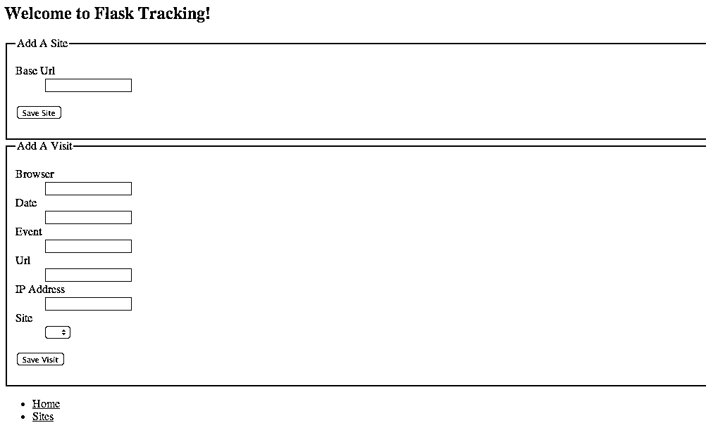
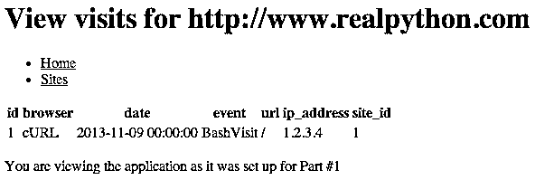

# 使用 Flask 的 Python Web 应用程序——第一部分

> 原文：<https://realpython.com/python-web-applications-with-flask-part-i/>

请注意:这是来自 Real Python 的 Michael Herman 和来自 [De Deo Designs](http://dedeodesigns.com/) 的 Python 开发者 Sean Vieira 的合作作品。

* * *

### 本系列文章:

1.  **第一部分:应用设置← *当前文章*T3】**
2.  第二部分:[设置用户账户、模板、静态文件](https://realpython.com/python-web-applications-with-flask-part-ii/)
3.  第三部分:[测试(单元和集成)、调试和错误处理](https://realpython.com/python-web-applications-with-flask-part-iii/)

**更新时间:2013 年 11 月 17 日**

最近，由于一场精彩的演出，我重新向自己介绍了 [Flask](http://flask.pocoo.org/) ，这是“Python 的微框架”。这是一个伟大的小框架；不幸的是，像[辛纳特拉](http://www.sinatrarb.com/)(它的灵感来源)一样，从小的“独立”应用程序过渡到大的应用程序是很困难的。有很多样板文件(包括我自己的[烧瓶样板文件](https://github.com/mjhea0/flask-boilerplate))可以帮助你更容易地完成过渡。然而，使用样板文件并不能帮助我们理解样板文件约定的“为什么”。

在查看了现有的教程后，我想，“一定有更好的方法”——然后我看到了米格尔·格林伯格的大型教程。为他的文章构建一个*应用*而不是样板文件给我留下了深刻的印象。因此，在本系列教程中，我们将构建一个我们自己的中型应用程序，并附带生成一个样板文件。希望当我们完成时，我们会对 Flask 提供的东西以及我们可以围绕它构建的东西有更好的理解。

[*Remove ads*](/account/join/)

## 我们在建造什么

本系列将关注名为[烧瓶追踪](https://github.com/mjhea0/flask-tracking)的网络分析解决方案的开发。本系列的目标是拥有一个工作应用程序，使用户能够:

*   向应用程序注册。
*   将网站添加到他们的帐户。
*   在他们的网站上安装跟踪代码，以便在事件发生时跟踪各种事件。
*   查看关于其网站事件活动的报告。

最终，*我们的*目标(除了拥有符合上述餐巾纸规范的工作应用程序之外)是:

*   了解如何使用 Flask 开发中型应用程序。
*   通过[重构](https://realpython.com/python-refactoring/)和[测试](https://realpython.com/python-testing/)获得实践经验。
*   对构建可组合系统有更深的理解。
*   开发一个样板文件，我们可以在未来的项目中重复使用。

## 开始

本系列假设您已经对 Python 和 Flask 有所了解。你应该已经熟悉了 [Python 的教程](http://docs.python.org/2/tutorial/)中的一切，熟悉了命令行(或者，至少，熟悉了 [`pip`](https://realpython.com/what-is-pip/) )，你也应该读过 Flask 的[快速入门](http://flask.pocoo.org/docs/quickstart/)和[教程](http://flask.pocoo.org/docs/tutorial/)。如果你想要更多的练习，更进一步，阅读我的烧瓶入门教程[这里](https://github.com/mjhea0/flaskr-tdd)。也就是说，如果你是 Python 和 Flask 的[新手，你应该仍然能够跟上。](https://realpython.com/python-basics/)

我们今天的目标是实现应用程序的核心——跟踪对站点的访问。我们将允许多个网站，但我们不会担心用户或访问控制。

### 基本原则

在我们深入研究之前，我想谈一谈指导我们开发的一些原则——我们不会太深入地研究这些最佳实践的“为什么”,但是在可能的情况下，我们会提供一些文章的链接，解释这些实践为我们提供了什么。请将本系列中的所有观点视为[强观点，弱观点](http://www.saffo.com/02008/07/26/strong-opinions-weakly-held/)。

#### Python 的禅宗

如果你还不知道，Python 有一个“开发哲学”，叫做 Python 的[禅(也称为 PEP 20)](http://www.python.org/dev/peps/pep-0020/) 。要阅读它，只需打开 python 解释器并键入:

>>>

```py
>>> import this
```

然后你会看到:

> 蒂姆·彼得斯的《Python 之禅》
> 
> 漂亮总比难看好。
> 
> 显性比隐性好。
> 
> 简单比复杂好。
> 
> 复杂总比复杂好。
> 
> 扁平的比嵌套的好。
> 
> 疏比密好。
> 
> 可读性很重要。
> 
> 特例不足以特殊到打破规则。
> 
> 虽然实用性战胜了纯粹性。
> 
> 错误永远不会无声无息地过去。
> 
> 除非明确沉默。
> 
> 面对暧昧，拒绝猜测的诱惑。
> 
> 应该有一种——最好只有一种——显而易见的方法来做这件事。
> 
> 尽管这种方式一开始可能并不明显，除非你是荷兰人。
> 
> 现在总比没有好。
> 
> 虽然永远也不会比现在的*对*好。
> 
> 如果实现很难解释，这是一个坏主意。
> 
> 如果实现很容易解释，这可能是一个好主意。
> 
> 名称空间是一个非常棒的想法——让我们多做一些吧！

这些是工作的依据。阅读丹尼尔·格林菲尔德关于理查德·琼斯的 19 篇 Pythonic 论文的笔记以获得更详细的解释。

#### 首字母缩略词爆炸

我们还将使我们的开发实践符合以下原则:

*   虽然我们可以构建许多工具来使我们的生活变得更容易，但我们将把自己局限于构建使我们的应用程序*工作*所必需的工具，记住在许多情况下 [YAGNI(你不会需要它)](http://c2.com/cgi/wiki?YouArentGonnaNeedIt)。
*   也就是说，当我们遇到我们在应用程序中重复的代码模式时，我们将重构我们的代码以保持其干燥。
*   我们从 YAGNI 穿越到 DRY 的触发器将是[三振出局，你重构原则](http://c2.com/cgi/wiki?ThreeStrikesAndYouRefactor)。在三个地方使用一个模式将使它有资格被提取。两种用途仍归 YAGNI 所有。(在大型项目中，许多人建议修改这条规则——当您需要重用它时，重构它。)

### 关于存储库结构的说明

在这个系列中，你可以在 Github 的 [`flask-tracking`库中找到这些练习的完整代码。本教程的每个部分在资源库中都有一个分支和一个](https://github.com/mjhea0/flask-tracking)[版本](https://github.com/mjhea0/flask-tracking/releases)。该部分的代码在 [part-1 分支](https://github.com/mjhea0/flask-tracking/tree/part-1)中。如果您选择签出存储库，那么只需运行:

```py
$ git checkout part-N
```

其中`N`是该代码对应的文章编号(因此对于这篇文章使用`git checkout part-1`)。

[*Remove ads*](/account/join/)

## 开始项目

前面的问题解决后，让我们开始创建一个新文件夹来保存我们的项目并激活一个虚拟环境(如果您不确定如何设置虚拟环境，请花一点时间查看 Flask 快速入门中的[指南):](http://flask.pocoo.org/docs/installation/)

```py
$ mkdir flask-tracking
$ cd flask-tracking
$ virtualenv --no-site-packages venv
$ source venv/bin/activate
```

### 依赖性

就像《爱丽丝梦游仙境》一样，我们希望我们的依赖关系“恰到好处”。太多的依赖，我们将无法在离开代码库一个月后不花一周时间审查文档的情况下继续工作。依赖太少，我们将花费时间开发除了我们的应用程序以外的一切。为了确保我们保持依赖关系“恰到好处”,我们将使用以下(不完美的)规则——每个依赖关系必须很好地解决至少一个困难的问题。我们将从对三个库的依赖开始——Flask 本身用于管理请求/响应周期， [Flask-WTF](http://pythonhosted.org/Flask-WTF/) 用于 CSRF 保护和数据验证，最后 [Flask-SQLAlchemy](http://pythonhosted.org/Flask-SQLAlchemy/) 用于数据库连接池和对象/关系映射器。这是我们的 requirements.txt 文件:

```py
Flask==0.10.1
Flask-SQLAlchemy==1.0
Flask-WTF==0.9.3
```

现在我们可以运行`pip install -r requirements.txt`将我们的需求安装到我们的虚拟环境中。

## 超越小

大多数 Flask 应用程序开始都很小，然后随着项目范围的扩大而重构。对于我们这些没有编写并重构过小型 Flask 应用程序的人来说，我们在 [`part-0`分支](https://github.com/mjhea0/flask-tracking/tree/part-0)中有一个跟踪应用程序的单模块版本(总共 145 行*)。如果你已经在 Flask 中编写了一个单模块应用程序，请随意[跳到下一节](#toc_9)。

对于那些留下来的人，请`git checkout part-0`或者从库的[发布部分下载第 0 部分。应用程序中应该有一个单独的模块`tracking.py`，整体结构应该如下所示:](https://github.com/mjhea0/flask-tracking/releases)

```py
├── flask-tracking.db
├── requirements.txt
├── templates
│   ├── data_list.html
│   ├── helpers
│   │   ├── forms.html
│   │   └── tables.html
│   ├── index.html
│   ├── layout.html
│   └── validation_error.html
└── tracking.py
```

如果你打开它，你看到的第一件事是:

```py
_cwd = dirname(abspath(__file__))

SECRET_KEY = 'flask-session-insecure-secret-key'
SQLALCHEMY_DATABASE_URI = 'sqlite:///' + join(_cwd, 'flask-tracking.db')
SQLALCHEMY_ECHO = True
WTF_CSRF_SECRET_KEY = 'this-is-not-random-but-it-should-be'

app = Flask(__name__)
app.config.from_object(__name__)

db = SQLAlchemy(app)
```

我们设置了一些基本的配置设置——`SECRET_KEY`用于签署 Flask 的会话,`SQLALCHEMY_DATABASE_URI`是我们数据库的路径(我们现在使用的是[SQLite](https://realpython.com/python-sqlite-sqlalchemy/)),`WTF_CSRF_SECRET_KEY`用于签署 WTForms 的 CSRF 令牌。我们初始化一个新的 Flask 应用程序，告诉它用当前模块中所有的`ALL_CAPS`符号来配置自己(用我们的`app.config.from_object`调用)。然后，我们用应用程序初始化 Flask-SQLAlchemy 扩展。

从那里开始，这是一个非常简单的方法——我们建立我们的模型:

```py
class Site(db.Model):
    __tablename__ = 'tracking_site'

    id = db.Column(db.Integer, primary_key=True)
    base_url = db.Column(db.String)
    visits = db.relationship('Visit', backref='tracking_site', lazy='select')

    def __repr__(self):
        return '<Site %r>' % (self.base_url)

    def __str__(self):
        return self.base_url

class Visit(db.Model):
    # ... snip ...
```

和表单:

```py
class SiteForm(Form):
    base_url = fields.StringField()

class VisitForm(Form):
    # ... snip ...
```

以及利用这些模型和形式的路线:

```py
@app.route("/")
def index():
    site_form = SiteForm()
    visit_form = VisitForm()
    return render_template("index.html",
                           site_form=site_form,
                           visit_form=visit_form)

@app.route("/site", methods=("POST", ))
def add_site():
    form = SiteForm()
    if form.validate_on_submit():
        site = Site()
        form.populate_obj(site)
        db.session.add(site)
        db.session.commit()
        flash("Added site")
        return redirect(url_for("index"))
    return render_template("validation_error.html", form=form)
```

还有几个帮助器函数可以将 SQLAlchemy 查询对象转换为模板的数据列表，然后在模块底部，我们设置了一个`main`块来创建我们的表(如果它们不存在),并在调试模式下运行应用程序:

```py
if __name__ == "__main__":
    app.debug = True
    db.create_all()
    app.run()
```

如果你运行`python tracking.py`，然后在你的浏览器中导航到 [localhost:5000](http://localhost:5000) ，你会看到一个极其简单的应用程序。它是功能性的(你可以创建网站和添加访问)，但它没有用户和访问控制——每个人都可以看到一切。

[](https://files.realpython.com/media/flask-tracking-1.6f407a760368.png)

然而，正如你所看到的，`tracking.py`已经是一个功能的混合体——控制器、模型、助手和命令行设置都被塞进了一个文件中。将它分解成独立的功能区域会使它更容易维护。此外，重新打包这个应用程序将使我们更清楚地知道在哪里添加我们想要的所有其他特性(用户、访问控制等)。).当你完成了第 0 部分的代码，运行`git checkout part-1`进入下一部分。

[*Remove ads*](/account/join/)

## 一个存放所有东西的地方

让我们首先为我们的应用程序创建一个包(我们将使用 Flask 文档中描述的结构的修改形式，用于[包](http://flask.pocoo.org/docs/patterns/packages/)和[蓝图](http://flask.pocoo.org/docs/blueprints/)):

```py
flask-tracking/       # Our working root
    flask_tracking/   # The application package
        __init__.py
    requirements.txt  # Meta data needed by our application
    README.md         # and developers
```

请记住，我们今天的目标只是跟踪网站的访问，我们将避免为我们的跟踪代码创建一个子包…然而(记住，YAGNI，直到你需要它)。让我们继续添加单独的`models`、`forms`和`views`模块来分别保存我们的领域模型、数据转换层和视图代码。让我们也创建一个`templates`子目录来保存我们将用来渲染站点的资源。最后，我们将添加一个配置文件和一个脚本来运行应用程序。现在我们应该有一个如下所示的目录结构:

```py
flask-tracking/
    flask_tracking/
        templates/    # Holds Jinja templates
        __init__.py   # General application setup
        forms.py      # User data to domain data mappers and validators
        models.py     # Domain models
        views.py      # well ... controllers, really.
    config.py         # Configuration, just like it says on the cover
    README.md
    requirements.txt
    run.py            # `python run.py` to bring the application up locally.
```

### 领域模型

我们的领域模型很简单——一个站点有一个根 URL，一次访问有关于访问者的元数据(浏览器、IP 地址、URL 等)。).我们包含了`__repr__`方法，在命令行上给我们更好的细节(`<Visit for site ID 1: / - 2013-11-09 14:10:11>`比`<package.module.Visit object at 0x12345>`更有用)。`Site`包含了一个`__str__`方法来控制我们在下拉菜单中显示站点列表时显示的内容。

```py
from flask.ext.sqlalchemy import SQLAlchemy

db = SQLAlchemy()

class Site(db.Model):
    __tablename__ = 'tracking_site'

    id = db.Column(db.Integer, primary_key=True)
    base_url = db.Column(db.String)
    visits = db.relationship('Visit', backref='tracking_site', lazy='select')

    def __repr__(self):
        return '<Site {:d}  {}>'.format(self.id, self.base_url)

    def __str__(self):
        return self.base_url

class Visit(db.Model):
    __tablename__ = 'tracking_visit'

    id = db.Column(db.Integer, primary_key=True)
    browser = db.Column(db.String)
    date = db.Column(db.DateTime)
    event = db.Column(db.String)
    url = db.Column(db.String)
    ip_address = db.Column(db.String)
    site_id = db.Column(db.Integer, db.ForeignKey('tracking_site.id'))

    def __repr__(self):
        r = '<Visit for site ID {:d}: {} - {:%Y-%m-%d %H:%M:%S}>'
        return r.format(self.site_id, self.url, self.date)
```

注意，我们还没有用任何应用程序初始化我们的`flask.ext.sqlalchemy`对象，所以这些模型没有绑定到这个特定的应用程序(这种灵活性带来了一些小代价，我们很快就会遇到)。

### 数据转换层

我们的`forms`代码是标准的 WTForms，只有一个例外。如果你看一下`VisitForm`:

```py
from .models import Site

# ... snip ...

class VisitForm(Form):
    browser = fields.StringField()
    date = fields.DateField()
    event = fields.StringField()
    url = fields.StringField()
    ip_address = fields.StringField("IP Address")
    site = QuerySelectField(query_factory=lambda: Site.query.all())
```

你会注意到，我们需要将`Site.query.all`包装在 [`lambda`](https://realpython.com/python-lambda/) 中，而不是原样传递。由于在构建`VisitForm`时，我们的`db`没有绑定到应用程序，所以我们不能访问`Site.query`。创建一个只有在`VisitForm`被实例化时才调用`Site.query`的函数(例如，在我们的视图中我们调用`form = VisitForm()`)确保了我们只有在可以访问 Flask 应用程序实例时才能访问`Site.query`。

### 视图

我们的视图是应用程序中最复杂的部分(看看我们导入了多少依赖项):

```py
from flask import Blueprint, flash, Markup, redirect, render_template, url_for

from .forms import SiteForm, VisitForm
from .models import db, query_to_list, Site, Visit
```

我们从创建蓝图开始(我们也可以`from flask_tracking import app`使用应用程序，但是我更喜欢在我的应用程序超出单个文件时切换到蓝图)

```py
tracking = Blueprint("tracking", __name__)
```

然后，我们使用普通的 decorator 语法将我们的视图映射到 routes 我添加了关于一些功能的注释，在这些功能中，我们正在做的事情可能不是非常清楚(或者我们正在重复我们自己，并且我们以后会想要重构):

```py
@tracking.route("/")
def index():
    site_form = SiteForm()
    visit_form = VisitForm()
    return render_template("index.html",
                           site_form=site_form,
                           visit_form=visit_form)

@tracking.route("/site", methods=("POST", ))
def add_site():
    # The create a form, validate the form,
    # map the form to a model, save the model,
    # and redirect pattern will be pretty common
    # throughout the application. This is an area
    # that is ripe for improvement and refactoring.
    form = SiteForm()
    if form.validate_on_submit():
        site = Site()
        form.populate_obj(site)
        db.session.add(site)
        db.session.commit()
        flash("Added site")
        return redirect(url_for(".index"))

    return render_template("validation_error.html", form=form)

@tracking.route("/site/<int:site_id>")
def view_site_visits(site_id=None):
    site = Site.query.get_or_404(site_id)
    query = Visit.query.filter(Visit.site_id == site_id)
    data = query_to_list(query)
    title = "visits for {}".format(site.base_url)
    return render_template("data_list.html", data=data, title=title)

@tracking.route("/visit", methods=("POST", ))
@tracking.route("/site/<int:site_id>/visit", methods=("POST",))
def add_visit(site_id=None):
    if site_id is None:
        # This is only used by the visit_form on the index page.
        form = VisitForm()
    else:
        site = Site.query.get_or_404(site_id)
        # WTForms does not coerce obj or keyword arguments
        # (otherwise, we could just pass in `site=site_id`)
        # CSRF is disabled in this case because we will *want*
        # users to be able to hit the /site/:id endpoint from other sites.
        form = VisitForm(csrf_enabled=False, site=site)

    if form.validate_on_submit():
        visit = Visit()
        form.populate_obj(visit)
        visit.site_id = form.site.data.id
        db.session.add(visit)
        db.session.commit()
        flash("Added visit for site {}".format(form.site.data.base_url))
        return redirect(url_for(".index"))

    return render_template("validation_error.html", form=form)

@tracking.route("/sites")
def view_sites():
    query = Site.query.filter(Site.id >= 0)
    data = query_to_list(query)

    # The header row should not be linked
    results = [next(data)]
    for row in data:
        row = [_make_link(cell) if i == 0 else cell
               for i, cell in enumerate(row)]
        results.append(row)

    return render_template("data_list.html", data=results, title="Sites")

_LINK = Markup('<a href="{url}">{name}</a>')

def _make_link(site_id):
    url = url_for(".view_site_visits", site_id=site_id)
    return _LINK.format(url=url, name=site_id)
```

这给了我们一个应用程序，让我们在主页上添加一个站点或一次访问，查看站点列表，并查看每个站点的访问。我们实际上还没有在应用程序中注册蓝图，所以…

[*Remove ads*](/account/join/)

### 应用程序设置

…向前到`__init__.py`:

```py
from flask import Flask

from .models import db
from .views import tracking

app = Flask(__name__)
app.config.from_object('config')

# Add the `constants` variable to all Jinja templates.
@app.context_processor
def provide_constants():
    return {"constants": {"TUTORIAL_PART": 1}}

db.init_app(app)

app.register_blueprint(tracking)
```

我们创建一个应用程序，配置它，在应用程序上注册我们的 Flask-SQLAlchemy 实例，最后注册我们的蓝图。现在弗拉斯克知道如何处理我们的路线。

### 配置和命令行运行程序

我们的配置更上一层楼，启用 Flask 的会话并设置我们的 SQLite 数据库:

```py
# config.py
from os.path import abspath, dirname, join

_cwd = dirname(abspath(__file__))

SECRET_KEY = 'flask-session-insecure-secret-key'
SQLALCHEMY_DATABASE_URI = 'sqlite:///' + join(_cwd, 'flask-tracking.db')
SQLALCHEMY_ECHO = True
```

如果数据库表不存在，我们的应用程序运行器会创建数据库表，并在调试模式下运行应用程序:

```py
# run.py
#!/usr/bin/env python
from flask_tracking import app, db

if __name__ == "__main__":
    app.debug = True
    # Because we did not initialize Flask-SQLAlchemy with an application
    # it will use `current_app` instead.  Since we are not in an application
    # context right now, we will instead pass in the configured application
    # into our `create_all` call.
    db.create_all(app=app)
    app.run()
```

参见 Flask-SQLAlchemy 的 [*上下文介绍*](http://pythonhosted.org/Flask-SQLAlchemy/contexts.html) 如果你想更好地理解为什么我们需要将`app`传递给`db.create_all`调用。

## 一切都各就各位

现在我们应该能够运行`python run.py`并看到我们的应用程序启动。去 [localhost:5000](http://localhost:5000) 创建一个网站进行测试。然后，要验证其他人是否可以添加对该网站的访问，请尝试运行:

```py
$ curl --data 'event=BashVisit&browser=cURL&url=/&ip_address=1.2.3.4&date=2013-11-09' localhost:5000/site/1/visit
```

从命令行。当您返回应用程序时，单击“站点”,然后为您的站点单击“1”。页面上应显示一次访问:

[](https://files.realpython.com/media/flask-tracking-2.00893fc13094.png)

## 总结

这个帖子到此为止。我们现在有一个工作应用程序，可以添加网站和访问记录。我们仍然需要添加用户帐户、易于使用的客户端跟踪 API 和报告。

1.  在第二部分中，我们将添加用户，访问控制，并使用户能够从他们自己的网站添加访问。我们将探索编写模板、保持模型和表单同步以及处理静态文件的更多最佳实践。

2.  在第三部分中，我们将探索为我们的应用程序编写测试，记录和调试错误。

3.  在第四部分中，我们将进行一些测试驱动的开发，使我们的应用程序能够接受付款并显示简单的报告。

4.  在第五部分中，我们将编写一个 RESTful JSON API 供其他人使用。

5.  在第六部分中，我们将介绍使用 Fabric 和基本 A/B 特性测试的自动化部署(在 Heroku 上)。

6.  最后，在第七部分中，我们将介绍如何用文档、代码覆盖率和质量度量工具来保护您的应用程序。

感谢阅读，下次继续收听！*****