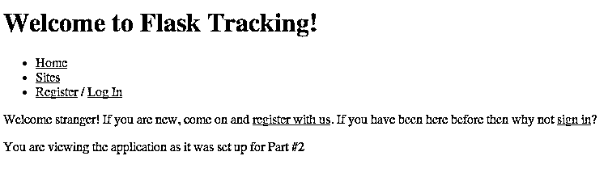

# 使用 Flask 的 Python Web 应用程序–第二部分

> 原文：<https://realpython.com/python-web-applications-with-flask-part-ii/>

请注意:这是来自 Real Python 的 Michael Herman 和来自 [De Deo Designs](http://dedeodesigns.com/) 的 Python 开发者 Sean Vieira 的合作作品。

* * *

**本系列文章:**

1.  第一部分:[应用程序设置](https://realpython.com/python-web-applications-with-flask-part-i/)
2.  **第二部分:设置用户账号、模板、静态文件← *本期文章***
3.  第三部分:[测试(单元和集成)、调试和错误处理](https://realpython.com/python-web-applications-with-flask-part-iii/)

欢迎回到烧瓶跟踪开发系列！对于那些刚刚加入我们的人来说，我们正在实现一个符合[这个餐巾纸规范](https://realpython.com/python-web-applications-with-flask-part-i/#toc_1)的网络分析应用。对于所有在家的人来说，你可以查看今天的代码:

```py
$ git checkout v0.2
```

或者，你可以从 Github 的[发布页面下载。那些刚刚加入我们的人可能也希望](https://github.com/mjhea0/flask-tracking/releases)[读一读关于存储库结构的注释](https://realpython.com/python-web-applications-with-flask-part-i/#toc_5)。

## 家务管理

快速回顾一下，在我们的上一篇文章中，我们设置了一个基本的应用程序，它可以通过简单的 web 界面或 HTTP 添加站点并记录访问。

今天，我们将添加用户，访问控制，并使用户能够使用跟踪信标从他们自己的网站添加访问。我们还将深入探讨编写模板、保持模型和表单同步以及处理静态文件的一些最佳实践。

[*Remove ads*](/account/join/)

### 从单包装到多包装

上次我们离开应用程序时，目录结构看起来像这样:

```py
flask-tracking/
    flask_tracking/
        templates/    # Holds Jinja templates
        __init__.py   # General application setup
        forms.py      # User data to domain data mappers and validators
        models.py     # Domain models
        views.py      # well ... controllers, really.
    config.py         # Configuration, just like it says on the cover
    README.md
    requirements.txt
    run.py            # `python run.py` to bring the application up locally.
```

为了清楚起见，让我们将现有的`forms`、`models`和`views`移到一个`tracking`子包中，并为我们的`User`特定功能创建另一个子包，我们称之为`users`:

```py
flask_tracking/
    templates/
    tracking/         # This is the code from Part 1
        __init__.py   # Create this file - it should be empty.
        forms.py
        models.py
        views.py
    users/            # Where we are working today
        __init__.py
    __init__.py       # This is also code from Part 1
```

这意味着我们需要将`flask_tracking/__init__.py`的进口从`from .views import tracking`改为`from .tracking.views import tracking`。

然后是`tracking.models`中的数据库设置。我们将把它移到父包(`flask_tracking`)中，因为数据库管理器将在包之间共享。让我们称那个模块为`data`:

```py
# flask_tracking/data.py
from flask.ext.sqlalchemy import SQLAlchemy

db = SQLAlchemy()

def query_to_list(query, include_field_names=True):
    """Turns a SQLAlchemy query into a list of data values."""
    column_names = []
    for i, obj in enumerate(query.all()):
        if i == 0:
            column_names = [c.name for c in obj.__table__.columns]
            if include_field_names:
                yield column_names
        yield obj_to_list(obj, column_names)

def obj_to_list(sa_obj, field_order):
    """Takes a SQLAlchemy object - returns a list of all its data"""
    return [getattr(sa_obj, field_name, None) for field_name in field_order]
```

然后我们可以更新`tracking.models`来使用`from flask_tracking.data import db`和`tracking.views`来使用`from flask_tracking.data import db, query_to_list`，我们现在应该有一个工作的*多包*应用程序。

## 用户

既然我们已经将我们的应用程序分成了相关功能的独立包，让我们开始处理`users`包。用户需要能够注册一个帐户，管理他们的帐户，登录和退出。可能会有更多与用户相关的功能(尤其是围绕权限)，但为了清楚起见，我们将坚持这些基本功能。

### 寻求帮助

我们有一个[规则](https://realpython.com/python-web-applications-with-flask-part-i/#toc_7)来处理[依赖](https://realpython.com/courses/managing-python-dependencies/)——我们添加的每一个依赖都必须很好地解决至少一个难题。维护用户会话有几个有趣的边缘情况，这使它成为依赖关系的绝佳候选。幸运的是，对于这个用例，有一个现成的工具- [Flask-Login](http://flask-login.readthedocs.org/en/latest/) 。然而，有一件事 Flask-Login 根本不处理——认证。我们可以使用任何我们想要的身份验证方案——从“只需提供用户名”到像 Persona 这样的分布式身份验证方案。让我们保持简单，使用用户名和密码。这意味着我们需要存储一个用户的密码，我们希望对其进行哈希运算。由于正确地散列密码是一个困难的问题，我们将采用另一个依赖项来确保我们的密码被安全地散列。(我们选择 pbdkdf2 是因为在撰写本文时它被认为是安全的，并且包含在 Python 3.3 中——我们只在运行 Python 2 时需要它。)

让我们继续添加:

```py
Flask-Login==0.2.7
backports.pbkdf2==0.1
```

到我们的`requirements.txt`文件，然后(确保我们的虚拟环境被激活)我们可以再次运行`pip install -r requirements.txt`来安装它们。(编译 pbkdf2 的 C 加速时可能会出现一些错误——可以忽略它们)。我们稍后将把它与我们的应用程序集成在一起——首先我们需要设置我们的用户，这样 Flask-Login 就可以使用了。

### 型号

我们将在`users.models`中建立我们的`User` SQLAlchemy 类。我们将只存储用户名、电子邮件地址和密码:

```py
from random import SystemRandom

from backports.pbkdf2 import pbkdf2_hmac, compare_digest
from flask.ext.login import UserMixin
from sqlalchemy.ext.hybrid import hybrid_property

from flask_tracking.data import db

class User(UserMixin, db.Model):
    __tablename__ = 'users_user'
    id = db.Column(db.Integer, primary_key=True)
    name = db.Column(db.String(50))
    email = db.Column(db.String(120), unique=True)
    _password = db.Column(db.LargeBinary(120))
    _salt = db.Column(db.String(120))
    sites = db.relationship('Site', backref='owner', lazy='dynamic')

    @hybrid_property
    def password(self):
        return self._password

    # In order to ensure that passwords are always stored
    # hashed and salted in our database we use a descriptor
    # here which will automatically hash our password
    # when we provide it (i. e. user.password = "12345")
    @password.setter
    def password(self, value):
        # When a user is first created, give them a salt
        if self._salt is None:
            self._salt = bytes(SystemRandom().getrandbits(128))
        self._password = self._hash_password(value)

    def is_valid_password(self, password):
        """Ensure that the provided password is valid.

 We are using this instead of a ``sqlalchemy.types.TypeDecorator``
 (which would let us write ``User.password == password`` and have the incoming
 ``password`` be automatically hashed in a SQLAlchemy query)
 because ``compare_digest`` properly compares **all***
 the characters of the hash even when they do not match in order to
 avoid timing oracle side-channel attacks."""
        new_hash = self._hash_password(password)
        return compare_digest(new_hash, self._password)

    def _hash_password(self, password):
        pwd = password.encode("utf-8")
        salt = bytes(self._salt)
        buff = pbkdf2_hmac("sha512", pwd, salt, iterations=100000)
        return bytes(buff)

    def __repr__(self):
        return "<User #{:d}>".format(self.id)
```

*唷*——这段代码几乎有一半是密码！更糟糕的是，当你读到这篇文章时，我们的`_hash_password`实现很可能被认为是不完美的(这是加密技术不断变化的本质)，但它确实涵盖了所有基本的最佳实践:

*   始终使用每个用户独特的盐。
*   使用带有可调工作单元的键拉伸算法。
*   使用*常数时间*算法比较哈希。

在与密码无关的注释中，我们在`User` s 和`Site` s ( `sites = db.relationship('Site', backref='owner', lazy='dynamic')`)之间建立了[一对多](http://pythonhosted.org/Flask-SQLAlchemy/models.html#one-to-many-relationships)关系，这样我们就可以让用户管理多个站点。

此外，我们正在子类化 Flask-Login 的`UserMixin`类。Flask-Login 要求`User`类实现[某些方法](https://flask-login.readthedocs.org/en/latest/#your-user-class) ( `get_id`、`is_authenticated`等)。)以便它能完成它的工作。`UserMixin`提供了这些方法的缺省版本，对于我们的目的来说非常好。

[*Remove ads*](/account/join/)

### 积分瓶-登录

现在我们有了一个`User`，我们可以与 Flask-Login 集成。为了避免循环导入，我们将在名为`auth`的顶级模块中设置扩展:

```py
# flask_tracking/auth.py
from flask.ext.login import LoginManager

from flask_tracking.users.models import User

login_manager = LoginManager()

login_manager.login_view = "users.login"
# We have not created the users.login view yet
# but that is the name that we will use for our
# login view, so we will set it now.

@login_manager.user_loader
def load_user(user_id):
    return User.query.get(user_id)
```

`@login_manager.user_loader`向 Flask-Login 注册我们的`load_user`函数，以便当用户登录 Flask-Login 后返回时，可以从存储在 Flask 的`session`中的 user_id 加载用户。

最后，我们将`login_manager`导入到`flask_tracking/__init__.py`中，并向我们的应用程序对象注册它:

```py
from .auth import login_manager

# ...

login_manager.init_app(app)
```

### 视图

接下来，让我们为用户设置视图和控制器功能，以启用注册/登录/注销功能。首先，我们将设置我们的表单:

```py
# flask_tracking/users/forms.py
from flask.ext.wtf import Form
from sqlalchemy.orm.exc import MultipleResultsFound, NoResultFound
from wtforms import fields
from wtforms.validators import Email, InputRequired, ValidationError

from .models import User

class LoginForm(Form):
    email = fields.StringField(validators=[InputRequired(), Email()])
    password = fields.StringField(validators=[InputRequired()])

    # WTForms supports "inline" validators
    # which are methods of our `Form` subclass
    # with names in the form `validate_[fieldname]`.
    # This validator will run after all the
    # other validators have passed.
    def validate_password(form, field):
        try:
            user = User.query.filter(User.email == form.email.data).one()
        except (MultipleResultsFound, NoResultFound):
            raise ValidationError("Invalid user")
        if user is None:
            raise ValidationError("Invalid user")
        if not user.is_valid_password(form.password.data):
            raise ValidationError("Invalid password")

        # Make the current user available
        # to calling code.
        form.user = user

class RegistrationForm(Form):
    name = fields.StringField("Display Name")
    email = fields.StringField(validators=[InputRequired(), Email()])
    password = fields.StringField(validators=[InputRequired()])

    def validate_email(form, field):
        user = User.query.filter(User.email == field.data).first()
        if user is not None:
            raise ValidationError("A user with that email already exists")
```

同样，大量的代码，这一次主要是验证用户输入。需要注意的一点是，对于我们的登录表单，当用户通过身份验证时，我们将表单上的`User`实例公开为`form.user`(因此我们不必在两个地方进行相同的查询——尽管 SQLAlchemy 在这里会做正确的事情，并且只访问数据库一次)。

最后，我们可以建立我们的观点:

```py
# flask_tracking/users/views.py
from flask import Blueprint, flash, redirect, render_template, request, url_for
from flask.ext.login import login_required, login_user, logout_user

from flask_tracking.data import db
from .forms import LoginForm, RegistrationForm
from .models import User

users = Blueprint('users', __name__)

@users.route('/login/', methods=('GET', 'POST'))
def login():
    form = LoginForm()
    if form.validate_on_submit():
        # Let Flask-Login know that this user
        # has been authenticated and should be
        # associated with the current session.
        login_user(form.user)
        flash("Logged in successfully.")
        return redirect(request.args.get("next") or url_for("tracking.index"))
    return render_template('users/login.html', form=form)

@users.route('/register/', methods=('GET', 'POST'))
def register():
    form = RegistrationForm()
    if form.validate_on_submit():
        user = User()
        form.populate_obj(user)
        db.session.add(user)
        db.session.commit()
        login_user(user)
        return redirect(url_for('tracking.index'))
    return render_template('users/register.html', form=form)

@users.route('/logout/')
@login_required
def logout():
    # Tell Flask-Login to destroy the
    # session->User connection for this session.
    logout_user()
    return redirect(url_for('tracking.index'))
```

并将它们导入并注册到我们的应用程序对象:

```py
# flask_tracking/__init__.py
from .users.views import users

# ...

app.register_blueprint(users)
```

注意在我们的`login`视图中对`load_user`的调用。`Flask-Login`要求我们调用这个函数来激活我们用户的会话(它将为我们管理)。

最后要看的是我们的`users/login.html`模板:

```py


Log into Flask Tracking!

{{super()}}
<form action="{{ url_for('users.login', ext=request.args.get('next', '')) }}" method="POST">
{{ forms.render(form) }}
<p><input type="Submit" value="Sign In"></p>
</form>

```

我们一会儿将讨论`layout.html`和`forms`宏——需要注意的关键是，对于表单的`action`,我们显式地传入了`next`参数的值:

```py
url_for('users.login', next=request.args.get('next', ''))
```

这确保了当用户将表单提交给`users.login`时，`next`参数可用于我们的重定向代码:

```py
login_user(form.user)
flash("Logged in successfully.")
return redirect(request.args.get("next") or url_for("tracking.index"))
```

这段代码中有一个微妙的安全漏洞，我们将在下一篇文章中修复它(但是如果您已经发现了它，它会指出来)。

[*Remove ads*](/account/join/)

### 战斗复制

但是等等！你看到我们刚刚重复第三次的模式了吗？(我们实际上至少重复了*和*两种模式，但是我们今天只打算删除其中一种模式的重复部分)。这部分的`register`代码:

```py
user = User()
form.populate_obj(user)
db.session.add(user)
db.session.commit()
```

也在`tracking`代码中重复多次。让我们使用一个自定义 mixin 来提取数据库会话行为，我们可以从 [Flask-Kit](https://github.com/semirook/flask-kit) 中借用这个自定义 mixin。打开`flask_tracking/data`并添加以下代码:

```py
class CRUDMixin(object):
    __table_args__ = {'extend_existing': True}

    id = db.Column(db.Integer, primary_key=True)

    @classmethod
    def create(cls, commit=True, **kwargs):
        instance = cls(**kwargs)
        return instance.save(commit=commit)

    @classmethod
    def get(cls, id):
        return cls.query.get(id)

    # We will also proxy Flask-SqlAlchemy's get_or_44
    # for symmetry
    @classmethod
    def get_or_404(cls, id):
        return cls.query.get_or_404(id)

    def update(self, commit=True, **kwargs):
        for attr, value in kwargs.iteritems():
            setattr(self, attr, value)
        return commit and self.save() or self

    def save(self, commit=True):
        db.session.add(self)
        if commit:
            db.session.commit()
        return self

    def delete(self, commit=True):
        db.session.delete(self)
        return commit and db.session.commit()
```

`CRUDMixin`为我们提供了一种更简单的方式来处理四种最常见的模型操作(创建、读取、更新和删除):

```py
def create(cls, commit=True, **kwargs): 
    pass

def get(cls, id): 
    pass

def update(self, commit=True, **kwargs): 
    pass

def delete(self, commit=True): 
    pass
```

现在，如果我们将我们的`User`类更新为子类`CRUDMixin`:

```py
from flask_tracking.data import CRUDMixin, db

class User(UserMixin, CRUDMixin, db.Model):
```

然后我们可以使用更清晰的:

```py
user = User.create(**form.data)
```

征求我们的意见。这使得推理我们的代码在做什么变得更容易，也使得重构变得更容易(因为每段代码处理的关注点更少)。我们也可以更新我们的`tracking`包的代码来使用相同的方法。

### 模板

在第一部分中，为了节省时间，我们跳过了对模板的审查。现在让我们花几分钟时间来回顾一下我们用来呈现 HTML 的更有趣的部分。

稍后，我们可能会将这些都分解成一个 RESTful 接口。我们可以使用 JavaScript MVC 框架来处理前端，并向后端发出请求以获取必要的数据，而不是让 Python/Flask/Jinja 提供预先格式化的页面。然后，客户端将向服务器发送请求以创建/注册新站点，并负责在创建新站点和访问时更新视图。视图将负责 REST 接口。

也就是说，由于我们关注的是 Flask，我们现在将使用 [Jinja](https://realpython.com/primer-on-jinja-templating/) 来提供页面。

### 布局

首先，看看 [`layout.html`](https://github.com/mjhea0/flask-tracking/blob/part-2/flask_tracking/templates/layout.html) (为了节省空间，我将大部分代码从本文中去掉，但我提供了完整代码的链接):

```py
<title>{{ title }}</title>
<!-- ... snip ... -->
<h1>{{ self.title() }}</h1>
```

这个片段展示了我最喜欢的两个技巧——首先，我们有一个包含变量的块(`title`)，这样我们就可以从我们的`render_template`调用中设置这个值(这样我们就不需要仅仅为了更改标题而创建一个全新的模板)。第二，我们用特殊的`self`变量*重用*我们的头块的内容。这意味着，当我们设置`title`(在子模板中或者通过关键字参数设置为`render_template`)时，我们提供的文本将在浏览器的标题栏和`h1`标签中显示*。*

[*Remove ads*](/account/join/)

### 表单管理

值得一看的模板结构的另一部分是[我们的宏](https://github.com/mjhea0/flask-tracking/tree/part-2/flask_tracking/templates/helpers)。对于那些来自 Django 背景的人来说，Jinja 的宏是 Django 的类固醇。例如，我们的`form.render`宏使得向我们的一个模板添加表单变得非常容易:

```py

<dl>

<dt>{{ field.label }}</dt>
<dd>{{ field }}

<ul class="errors">

<li>{{error}}</li>

</ul>
</dd>

</dl>
{{ form.hidden_tag() }}

```

使用它非常简单:

```py

<!-- ... snip ... -->
<form action="{{url_for('users.register')}}" method="POST">
{{ forms.render(form) }}
<p><input type="Submit" value="Learn more about your visitors"></p>
</form>
```

我们可以使用`form.render`为表单中的每个字段自动生成样本 HTML，而不是一遍又一遍地编写相同的表单 HTML。这样，我们所有的形式看起来和功能都是一样的，如果我们不得不改变它们，我们只需要在一个地方做一次。**不要重复自己**可以产生非常干净的代码。

## 重构跟踪应用程序

现在我们已经正确地设置好了所有这些，让我们回过头来重构应用程序的主体:*请求跟踪*。

在第一部分中，我们构建了请求跟踪器的框架。网站被创建在索引页面上，任何人都可以查看所有可用的网站。只要最终用户自己发送所有信息，Flask-Tracking 就会愉快地存储这些信息。现在，我们有了用户，所以我们想过滤网站的[列表](https://realpython.com/python-lists-tuples/)。此外，如果我们的应用程序可以从访问者那里获取一些数据，而不是要求应用程序的最终用户自己获取所有数据，那就更好了。

### 过滤网站

让我们从网站列表开始:

```py
# flask_tracking/tracking/views.py
@tracking.route("/sites", methods=("GET", "POST"))
@login_required
def view_sites():
    form = SiteForm()

    if form.validate_on_submit():
        Site.create(owner=current_user, **form.data)
        flash("Added site")
        return redirect(url_for(".view_sites"))

    query = Site.query.filter(Site.user_id == current_user.id)
    data = query_to_list(query)
    results = []

    try:
        # The header row should not be linked
        results = [next(data)]
        for row in data:
            row = [_make_link(cell) if i == 0 else cell
                   for i, cell in enumerate(row)]
            results.append(row)
    except StopIteration:
        # This happens when a user has no sites registered yet
        # Since it is expected, we ignore it and carry on.
        pass

    return render_template("tracking/sites.html", sites=results, form=form)

_LINK = Markup('<a href="{url}">{name}</a>')

def _make_link(site_id):
    url = url_for(".view_site_visits", site_id=site_id)
    return _LINK.format(url=url, name=site_id)
```

从顶部开始，`@login_required`装饰器由`Flask-Login`提供。任何试图访问`/sites/`的未登录用户都将被重定向到登录页面。接下来，我们检查用户是否正在添加一个新站点(`form.validate_on_submit`检查`request.method`是否是 POST 并验证表单——如果任何一个先决条件失败，该方法返回`False`，否则返回`True`)。如果用户正在创建一个新的站点，我们创建一个新的站点(使用我们的`CRUDMixin`定义的方法，所以如果您自己对代码进行更改，您将希望确保`Site`和`Visit`都从`CRUDMixin`继承)并重定向回同一个页面。我们在保存新站点后重定向回我们自己，以防止页面刷新导致用户试图添加站点两次。(这称为 Post-Redirect-Get 模式)。

如果你不确定我的意思，试着注释掉`return redirect(url_for(".view_sites"))`，然后提交“添加一个站点”表单，当页面重新加载时，按下`F5`刷新你的浏览器。恢复重定向后，尝试同样的练习。(当重定向被删除时，浏览器将询问您是否真的要再次提交表单数据——浏览器发出的最后一个请求是创建新站点的帖子。通过重定向，浏览器发出的最后一个请求是 GET 请求，该请求重新加载了`view_sites`页面。

接下来，如果用户没有创建新的站点(或者如果提供的数据有错误)，我们将查询我们的数据库，以查找当前登录用户创建的所有站点。然后我们稍微转换一下我们的列表，将数据库 ID 转换成每个非标题行的 HTML 链接。当您还不知道模板模式是否值得“宏化”时，使用“内联”模板有利于快速原型开发。在我们的例子中，这是带有动作链接的表格的唯一视图，所以我们使用内联模板技术来演示另一种方法。

值得注意的是，我们已经选择使用`sites_view`来显示站点及其访问和注册站点。如何拆分应用程序完全取决于您。拥有一个`view_sites`和一个`add_site`视图，其中前者仅可用于获取请求，后者用于发布也是一种有效的技术。无论哪种技术对你来说更清晰，你都应该更喜欢——只要确保你始终如一。

### 从访问者那里获取数据

与此同时，`add_visit`现在有点复杂(尽管它主要是映射代码):

```py
from flask import request

from .geodata import get_geodata

# ... snip ...

@tracking.route("/sites/<int:site_id>/visit", methods=("GET", "POST"))
def add_visit(site_id=None):
    site = Site.get_or_404(site_id)

    browser = request.headers.get("User-Agent")
    url = request.values.get("url") or request.headers.get("Referer")
    event = request.values.get("event")
    ip_address = request.access_route[0] or request.remote_addr
    geodata = get_geodata(ip_address)
    location = "{}, {}".format(geodata.get("city"),
                               geodata.get("zipcode"))

    # WTForms does not coerce obj or keyword arguments
    # (otherwise, we could just pass in `site=site_id`)
    # CSRF is disabled in this case because we will *want*
    # users to be able to hit the /sites/{id}  endpoint from other sites.
    form = VisitForm(csrf_enabled=False,
                     site=site,
                     browser=browser,
                     url=url,
                     ip_address=ip_address,
                     latitude=geodata.get("latitude"),
                     longitude=geodata.get("longitude"),
                     location=location,
                     event=event)

    if form.validate():
        Visit.create(**form.data)
        # No need to send anything back to the client
        # Just indicate success with the response code
        # (204 is "Your request succeeded; I have nothing else to say.")
        return '', 204

    return jsonify(errors=form.errors), 400
```

我们已经移除了用户通过表单从我们的网站手动添加访问的能力(因此我们也移除了`add_visit`上的第二条路线)。我们现在对可以在服务器上导出的数据(浏览器、IP 地址)进行显式映射，然后构造我们的`VisitForm`,直接传入这些映射值。我们从`access_route`获取的 [IP 地址](https://realpython.com/python-ipaddress-module/)以防我们在代理之后，此后`remote_addr`将包含最后一个代理的 IP 地址，这根本不是我们想要的。我们禁用 CSRF 保护，因为我们实际上*希望*用户能够从其他地方向该端点发出请求。最后，我们知道这个请求是针对哪个站点的，因为我们已经为 URL 设置了`<int:site_id>`参数。

这并不是这个想法的完美实现。我们没有任何方法来验证该请求是来自我们的跟踪信标的合法请求。有人可以修改 [JavaScript](https://realpython.com/python-vs-javascript/) 代码或者从另一台服务器提交修改过的请求，我们会很乐意保存它。这很简单，也很容易实现。但是您可能不应该在生产环境中使用这些代码。

`get_geodata(ip_address)`查询`http://freegeoip.net/`这样我们可以大致了解请求来自哪里:

```py
from json import loads
from re import compile, VERBOSE
from urllib import urlopen

FREE_GEOIP_URL = "http://freegeoip.net/json/{}"
VALID_IP = compile(r"""
\b
(25[0-5]|2[0-4][0-9]|[01]?[0-9][0-9]?)
\.(25[0-5]|2[0-4][0-9]|[01]?[0-9][0-9]?)
\.(25[0-5]|2[0-4][0-9]|[01]?[0-9][0-9]?)
\.(25[0-5]|2[0-4][0-9]|[01]?[0-9][0-9]?)
\b
""", VERBOSE)

def get_geodata(ip):
    """
 Search for geolocation information using http://freegeoip.net/
 """
    if not VALID_IP.match(ip):
        raise ValueError('Invalid IPv4 format')

    url = FREE_GEOIP_URL.format(ip)
    data = {}

    try:
        response = urlopen(url).read()
        data = loads(response)
    except Exception:
        pass

    return data
```

将此作为`geodata.py`保存在`tracking`目录中。

返回到视图，这个视图所做的就是从请求中复制信息并将其存储在数据库中。它用 HTTP 204(无内容)响应来响应请求。这告诉浏览器请求成功了，但是我们不需要花费额外的时间来生成终端用户看不到的内容。

[*Remove ads*](/account/join/)

### 查看访问

我们还为每个站点的访问视图添加了身份验证:

```py
@tracking.route("/sites/<int:site_id>")
@login_required
def view_site_visits(site_id=None):
    site = Site.get_or_404(site_id)
    if not site.user_id == current_user.id:
        abort(401)

    query = Visit.query.filter(Visit.site_id == site_id)
    data = query_to_list(query)
    return render_template("tracking/site.html", visits=data, site=site)
```

这里唯一真正的变化是，如果用户登录，但不拥有该网站，他们将看到一个授权错误页面，而不是能够查看该网站的访问。

### 提供追踪访客的方法

最后，我们希望为用户提供一段代码，他们可以将这段代码放在自己的网站上，自动记录访问次数:

```py
{# flask_tracking/templates/tracking/site.html #}

{{ super() }}
<p>To track visits to this site, simple add the following snippet to the pages that you wish to track:</p>
<code><pre>
&lt;script>
(function() {
  var img = new Image();
  img.src = "{{ url_for('tracking.add_visit', site_id=site.id, event='PageLoad', _external=true) }}";
})();
&lt;/script>
&lt;noscript>
&lt;img src="{{ url_for('tracking.add_visit', site_id=site.id, event='PageLoad', _external=true) }}" width="1" height="1" />
&lt;/noscript>
</pre></code>
<h2>Visits for {{ site.base_url }}</h2>
<table>
{{ tables.render(visits) }}
</table>

```

我们的代码片段非常简单——当页面加载时，我们创建一个新的图像，并将其来源设置为我们的跟踪 URL。浏览器将*立即*加载指定的图像(这将是什么都没有),我们将在我们的应用程序中记录一个跟踪点击。我们也有一个`<noscript>`块给那些没有启用 JavaScript 的人。(如果我们真的想跟上时代，我们也可以更新我们的服务器端代码来检查`Do Not Track`头，只有当用户选择跟踪时才记录访问。)

## 总结

这个帖子到此为止。我们现在有了用户帐户，并且开始有了易于使用的客户端跟踪 API。我们仍然需要最终确定我们的客户端 API，应用程序的风格和添加报告。

应用程序的代码可以在[这里](https://github.com/mjhea0/flask-tracking)找到。

您的应用程序现在应该如下所示:

[](https://files.realpython.com/media/flask-tracking-3.20b14871c9a4.png)

**展望未来:**

*   在第三部分中，我们将探索[为我们的应用程序编写测试](https://realpython.com/python-testing/)，记录和调试错误。
*   在第四部分中，我们将进行一些测试驱动的开发，使我们的应用程序能够接受付款并显示简单的报告。
*   在第五部分中，我们将编写一个 RESTful JSON API 供其他人使用。
*   在第六部分中，我们将介绍使用 Fabric 和基本 A/B 特性测试的自动化部署(在 Heroku 上)。
*   最后，在第七部分中，我们将介绍如何用文档、代码覆盖率和质量度量工具来保护您的应用程序。*****