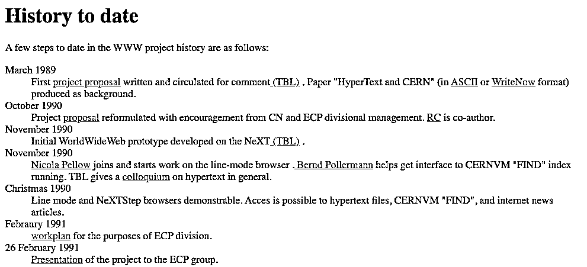
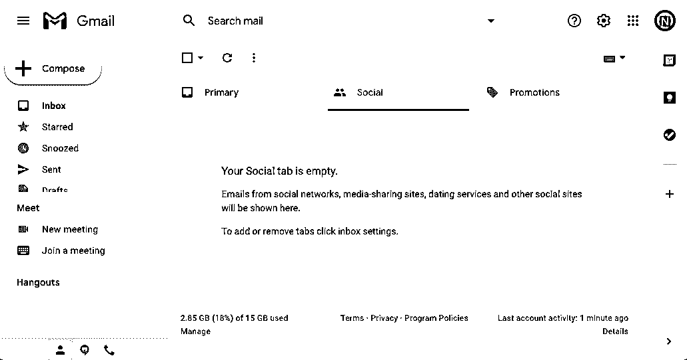
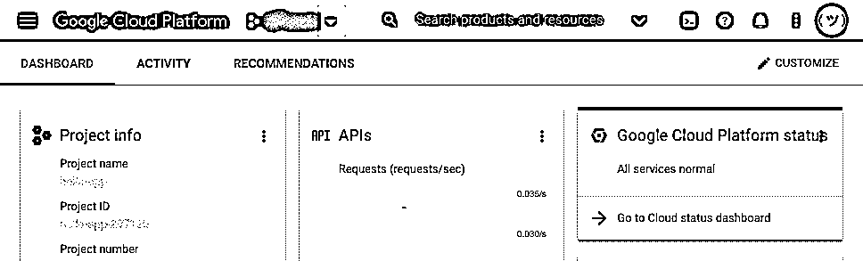
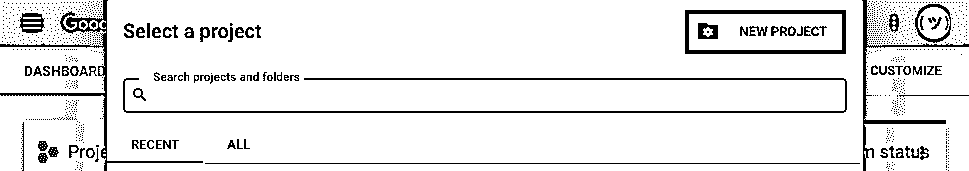
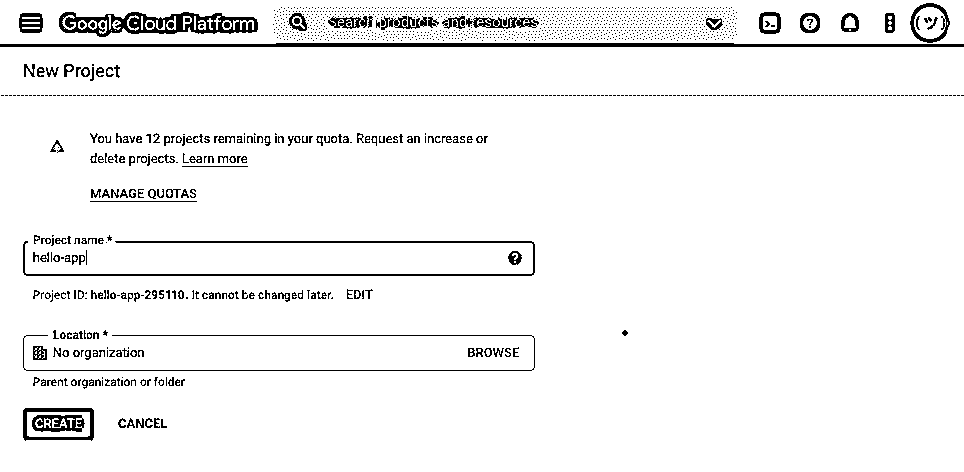
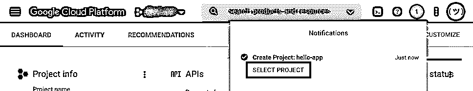
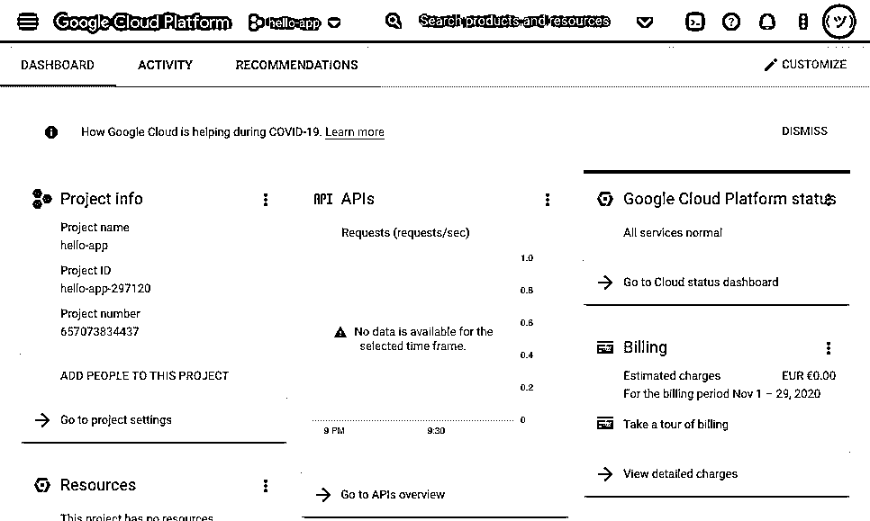
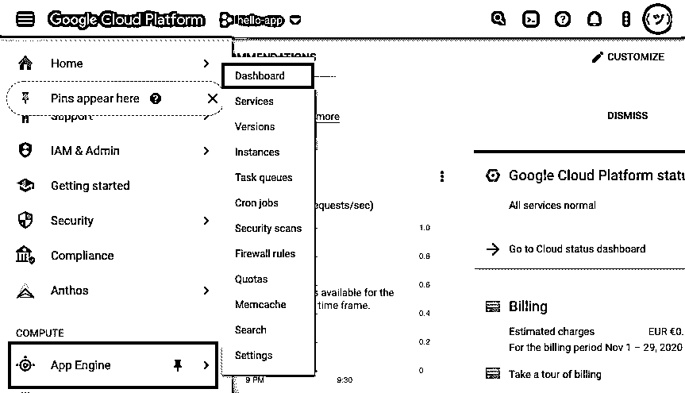
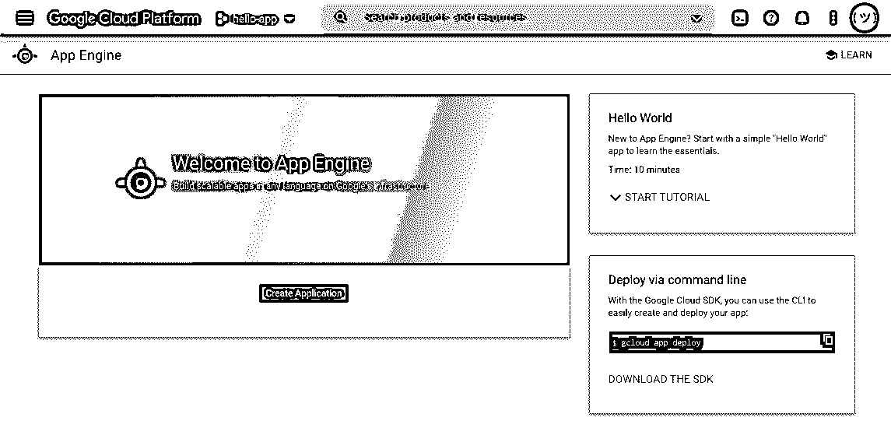
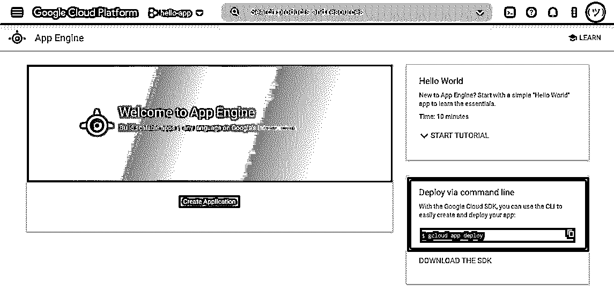

# Python Web 应用程序:将脚本部署为 Flask 应用程序

> 原文：<https://realpython.com/python-web-applications/>

*立即观看**本教程有真实 Python 团队创建的相关视频课程。和书面教程一起看，加深理解: [**用 Flask**](/courses/deploy-python-script-web-flask/) 在 Web 上部署你的 Python 脚本

你写了一个令你自豪的 Python 脚本，现在你想向全世界炫耀它。但是*怎么会是*？大多数人不会知道如何处理你的`.py`文件。将你的脚本转换成一个 **Python web 应用**是一个让你的代码对广大受众可用的好办法。

在本教程中，您将学习如何从本地 Python 脚本到完全部署的 Flask web 应用程序，您可以与全世界共享该应用程序。

本教程结束时，你会知道:

*   什么是**网络应用**以及你如何**在线托管它们**
*   如何将 Python 脚本转换成 **Flask web 应用**
*   如何通过在 Python 代码中添加 HTML 来改善用户体验
*   如何**将**你的 Python web 应用部署到**谷歌应用引擎**

除了浏览一个示例项目之外，您还会在整个教程中找到大量的**练习**。他们会给你机会通过额外的练习巩固你所学的东西。您也可以通过单击下面的链接下载将用于构建 web 应用程序的源代码:

**获取示例代码:** [单击此处获取示例代码，您将在本教程中使用](https://realpython.com/bonus/python-web-apps-code/)了解如何使用 Flask 创建 Python web 应用程序。

## 温习基础知识

在本节中，您将在本教程实践部分的不同主题中获得理论基础:

*   存在哪些类型的 Python 代码分发
*   为什么构建 web 应用程序是一个好的选择
*   什么是 web 应用程序
*   内容如何通过互联网传递
*   虚拟主机意味着什么
*   存在哪些托管提供商，使用哪一个

重温这些主题可以帮助你在为 Web 编写 Python 代码时更加自信。然而，如果你已经熟悉了它们，那么请随意跳过，安装 Google Cloud SDK，并开始构建你的 Python web 应用。

[*Remove ads*](/account/join/)

### 分发您的 Python 代码

把你的代码带给你的用户叫做**分发**。传统上，有三种不同的方法可以用来分发您的代码，以便其他人可以使用您的程序:

1.  Python 库
2.  独立程序
3.  Python web 应用程序

您将仔细研究下面的每一种方法。

#### Python 库

如果你使用过 Python 广泛的包生态系统，那么你可能已经安装了带有 [`pip`](https://realpython.com/what-is-pip/) 的 [Python 包](https://realpython.com/python-modules-packages/)。作为一名程序员，您可能希望[在 PyPI](https://realpython.com/pypi-publish-python-package/) 上发布您的 Python 包，以允许其他用户通过使用`pip`安装它来访问和使用您的代码:

```py
$ python3 -m pip install <your-package-name>
```

在您成功地将代码发布到 PyPI 之后，这个命令将在您的任何用户的计算机上安装您的包，包括它的依赖项，前提是他们有互联网连接。

如果您不想将代码发布为 PyPI 包，那么您仍然可以使用 Python 的内置`sdist`命令来创建一个[源发行版](https://docs.python.org/3/distutils/sourcedist.html)或一个 [Python 轮](https://realpython.com/python-wheels/)来创建一个[构建发行版](https://packaging.python.org/glossary/#term-built-distribution)来与您的用户共享。

像这样分发代码可以使它接近您编写的原始脚本，并且只添加其他人运行它所必需的内容。然而，使用这种方法也意味着您的用户需要使用 Python 来运行您的代码。许多想要使用脚本功能的人不会安装 Python，或者不熟悉直接处理代码所需的过程。

向潜在用户展示代码的一种更加用户友好的方式是构建一个独立的程序。

#### 独立程序

计算机程序有不同的形状和形式，将 Python 脚本转换成独立程序有多种选择。下面你会读到两种可能性:

1.  打包您的代码
2.  构建 GUI

像 [PyInstaller](https://www.pyinstaller.org/) 、 [py2app](https://py2app.readthedocs.io/en/latest/) 、 [py2exe](https://www.py2exe.org/) 或[公文包](https://briefcase.readthedocs.io/en/latest/)这样的程序可以帮助打包你的代码。它们将 Python 脚本转换成可执行程序，可以在不同平台上使用，而不需要用户显式运行 Python 解释器。

**注意:**要了解更多关于打包代码的信息，请查看使用 PyInstaller 轻松分发 Python 应用程序的[或收听真正的 Python 播客插曲](https://realpython.com/pyinstaller-python/)[打包 Python 应用程序的选项](https://realpython.com/podcasts/rpp/24/)。

虽然打包代码可以解决依赖性问题，但是代码仍然只能在命令行上运行。大多数人习惯于使用提供图形用户界面(GUI)的程序。您可以通过为 Python 代码构建一个 GUI 来让更多的人访问您的代码。

**注意:**有不同的软件包可以帮助你构建 GUI，包括 [Tkinter](https://realpython.com/python-gui-tkinter/) 、 [wxPython](https://realpython.com/python-gui-with-wxpython/) 和 [PySimpleGUI](https://realpython.com/pysimplegui-python/) 。如果你想构建一个基于桌面的应用，那么看看 [Python GUI 编程](https://realpython.com/learning-paths/python-gui-programming/)的学习路径。

虽然一个独立的 GUI 桌面程序可以让你的代码被更多的人访问，但是它仍然是人们入门的一个障碍。在运行你的程序之前，潜在用户需要完成几个步骤。他们需要找到适合其操作系统的正确版本，下载并成功安装。有些人可能在成功之前就放弃了。

许多开发人员转而构建可以在互联网浏览器上快速访问和运行的 web 应用程序，这是有道理的。

#### Python 网络应用

web 应用程序的优势在于它们是独立于平台的，任何能够访问互联网的人都可以运行。他们的代码在后端服务器上实现，程序在那里处理输入的请求，并通过所有浏览器都能理解的共享协议做出响应。

Python 支持许多大型 web 应用程序，并且是后端语言的常见选择。许多 Python 驱动的 web 应用程序从一开始就被规划为 web 应用程序，并且是使用 Python web 框架构建的，比如您将在本教程中使用的 [Flask](https://realpython.com/learning-paths/flask-by-example/) 。

然而，与上面描述的 web 优先的方法不同，您将从一个不同的角度出发。毕竟，你没有*计划*构建一个网络应用。您刚刚创建了一个有用的 Python 脚本，现在您想与全世界分享。为了让更多的用户能够访问它，您将把它重构为一个 web 应用程序，然后部署到互联网上。

是时候回顾一下什么是 web 应用程序，以及它与 Web 上的其他内容有何不同。

[*Remove ads*](/account/join/)

### 了解 Python Web 应用程序

从历史上看，网站有固定的内容，对于访问该页面的每个用户都是一样的。这些网页被称为静态网页，因为当你与它们互动时，它们的内容不会改变。当提供静态网页时，web 服务器通过发回该网页的内容来响应您的请求，而不管您是谁或您采取了什么其他操作。

您可以在[第一个上线的 URL](http://info.cern.ch/hypertext/WWW/TheProject.html)浏览静态网站的示例，以及它链接到的页面:

[](http://info.cern.ch/hypertext/WWW/History.html)

<figcaption class="figure-caption text-center">The history of the WWW</figcaption>

这种静态网站不被认为是应用程序，因为它们的内容不是由代码动态生成的。虽然静态网站曾经构成了整个互联网，但今天的大多数网站都是真正的网络应用程序，提供可以改变内容的动态网页(T2)。

例如，一个网络邮件应用程序允许你以多种方式与之交互。根据您的操作，它可以显示不同类型的信息，通常停留在一个页面中:

[](https://files.realpython.com/media/gae-dynamic-webpage.c10c1cbd973f.png)

<figcaption class="figure-caption text-center">A single-page Webmail application</figcaption>

**Python 驱动的 web 应用**使用 Python 代码来决定采取什么动作和显示什么内容。您的代码由托管您网站的 web 服务器运行，这意味着您的用户不需要安装任何东西。他们只需要一个浏览器和一个互联网连接就可以与你的代码进行交互。

让 Python 在网站上运行可能很复杂，但是有许多不同的 web 框架自动处理细节。如上所述，在本教程中，您将构建一个基本的 Flask 应用程序。

在接下来的部分中，您将从较高的层面了解在服务器上运行 Python 代码并向用户提供响应所需的主要过程。

### 查看 HTTP 请求-响应周期

通过互联网提供动态内容涉及许多不同的部分，它们都必须相互通信才能正常工作。以下是用户与 web 应用程序交互时发生的情况的概述:

1.  **发送:**首先，你的用户在你的 web 应用上请求一个特定的网页。例如，他们可以通过在浏览器中键入 URL 来实现这一点。

2.  **接收:**这个请求被托管你的网站的网络服务器接收。

3.  **匹配:**您的 web 服务器现在使用一个程序将用户的请求匹配到您的 Python 脚本的特定部分。

4.  **运行:**程序调用适当的 Python 代码。当您的代码运行时，它会写出一个网页作为响应。

5.  **传送:**然后程序通过网络服务器将这个响应传送给你的用户。

6.  **查看:**最后，用户可以查看 web 服务器的响应。例如，生成的网页可以在浏览器中显示。

这是内容如何通过互联网传送的一般过程。服务器上使用的编程语言以及用于建立连接的技术可能会有所不同。然而，用于跨 [HTTP](https://en.wikipedia.org/wiki/Hypertext_Transfer_Protocol) **请求**和**响应**进行通信的概念保持不变，被称为 **HTTP 请求-响应周期**。

注意: Flask 将为您处理大部分这种复杂性，但它有助于在头脑中保持对这一过程的松散理解。

要让 Flask 在服务器端处理请求，您需要找到一个 Python 代码可以在线的地方。在线存储你的代码来运行一个网络应用程序叫做**虚拟主机**，有很多提供商提供付费和免费的虚拟主机服务。

### 选择托管提供商:谷歌应用引擎

选择虚拟主机提供商时，您需要确认它支持运行 Python 代码。它们中的许多都需要花钱，但本教程将坚持使用一个免费的选项，它是专业的、高度可扩展的，但设置起来仍然合理: [Google App Engine](https://cloud.google.com/appengine/docs/standard/python3) 。

**注意:** Google App Engine 对每个应用强制执行每日[配额](https://cloud.google.com/appengine/quotas)。如果你的网络应用超过了这些限额，那么谷歌将开始向你收费。如果你是谷歌云的新客户，那么你可以在注册时获得一个[免费促销积分](https://cloud.google.com/free)。

还有许多其他的免费选项，比如 [PythonAnywhere](https://www.pythonanywhere.com/) 、 [Repl.it](https://repl.it/) 或 [Heroku](https://www.heroku.com/) ，你可以稍后再去探索。使用 Google App Engine 将为您学习如何将 Python 代码部署到 web 上提供一个良好的开端，因为它在抽象掉复杂性和允许您自定义设置之间取得了平衡。

谷歌应用引擎是谷歌云平台(GCP)的一部分，该平台由谷歌运营，代表着一个大型云提供商，另外还有[微软 Azure](https://azure.microsoft.com/) 和[亚马逊网络服务(AWS)](http://aws.amazon.com/) 。

要开始使用 GCP，请为您的操作系统下载并安装 [Google Cloud SDK](https://cloud.google.com/sdk/docs/install) 。除了本教程，你还可以参考[谷歌应用引擎的文档](https://cloud.google.com/appengine/docs/standard/python3)。

**注意:**您将使用 Python 3 标准环境。谷歌应用引擎的[标准环境](https://cloud.google.com/appengine/docs/standard)支持 Python 3 运行时，并提供一个免费层。

Google Cloud SDK 安装还包括一个名为`gcloud`的命令行程序，您稍后将使用它来部署您的 web 应用程序。安装完成后，您可以通过在控制台中键入以下命令来验证一切正常:

```py
$ gcloud --version
```

您应该会在终端中收到一个文本输出，类似于下面的内容:

```py
app-engine-python 1.9.91
bq 2.0.62
cloud-datastore-emulator 2.1.0
core 2020.11.13
gsutil 4.55
```

您的版本号可能会不同，但是只要在您的计算机上成功找到了`gcloud`程序，您的安装就成功了。

有了这个概念的高级概述和 Google Cloud SDK 的安装，您就可以设置一个 Python 项目，稍后您将把它部署到互联网上。

[*Remove ads*](/account/join/)

## 构建一个基本的 Python Web 应用程序

Google App Engine 要求您使用 web 框架在 Python 3 环境中创建 web 应用程序。由于您试图使用最小的设置将您的本地 Python 代码放到互联网上，所以像 [Flask](https://flask.palletsprojects.com/en/1.1.x/) 这样的微框架是一个不错的选择。Flask 的最小实现是如此之小，以至于您可能甚至没有注意到您正在使用一个 web 框架。

**注意:**如果你以前在 Python 2.7 环境下使用过 Google App Engine，那么你会注意到这个过程[已经发生了显著的变化](https://cloud.google.com/appengine/docs/standard/python/migrate-to-python3)。

两个值得注意的变化是 [webapp2](https://cloud.google.com/appengine/docs/standard/python/tools/webapp2) 已经退役，你不再能够在`app.yaml`文件中指定动态内容的 URL。这两个变化的原因是 Google App Engine 现在要求您使用 Python web 框架。

您将要创建的应用程序将依赖于几个不同的文件，因此您需要做的第一件事是创建一个项目文件夹来保存所有这些文件。

### 设置您的项目

创建一个项目文件夹，并给它一个描述您的项目的名称。对于本练习项目，调用文件夹`hello-app`。这个文件夹中需要三个文件:

1.  **`main.py`** 包含你的 Python 代码，包装在 Flask web 框架的最小实现中。
2.  **`requirements.txt`** 列出了代码正常工作所需的所有依赖关系。
3.  **`app.yaml`** 帮助谷歌应用引擎决定在其服务器上使用哪些设置。

虽然三个文件听起来很多，但是您会看到这个项目在所有三个文件中使用了不到十行代码。这代表了您需要为任何可能启动的 Python 项目提供给 Google App Engine 的最小设置。剩下的就是你自己的 Python 代码了。您可以通过单击下面的链接下载将在本教程中使用的完整源代码:

**获取示例代码:** [单击此处获取示例代码，您将在本教程中使用](https://realpython.com/bonus/python-web-apps-code/)了解如何使用 Flask 创建 Python web 应用程序。

接下来，您将查看每个文件的内容，从最复杂的文件`main.py`开始。

### 创建`main.py`

是 Flask 用来传递内容的文件。在文件的顶部，您[在第 1 行导入](https://realpython.com/python-import/)了`Flask`类，然后您在第 3 行创建了一个 Flask 应用程序的实例:

```py
 1from flask import Flask
 2
 3app = Flask(__name__)
 4
 5@app.route("/")
 6def index():
 7    return "Congratulations, it's a web app!"
```

创建 Flask `app`后，在第 5 行编写一个名为`@app.route`的 [Python 装饰器](https://realpython.com/primer-on-python-decorators/)，Flask 用它来连接函数中包含的代码的 [URL](https://en.wikipedia.org/wiki/URL) 端点。`@app.route`的参数定义了 URL 的路径组件，在本例中是根路径(`"/"`)。

第 6 行和第 7 行的代码组成了`index()`，由装饰器包装。该函数定义了当用户请求已定义的 URL 端点时应该执行的操作。它的[返回值](https://realpython.com/python-return-statement/)决定了用户加载页面时会看到什么。

**注:**`index()`的命名只是约定俗成。它关系到一个网站的主页面通常怎么叫`index.html`。如果需要，您可以选择不同的函数名。

换句话说，如果用户在他们的浏览器中输入你的 web 应用的基本 URL，那么 Flask 运行`index()`并且用户看到返回的文本。在这种情况下，该文本只是一句话:`Congratulations, it's a web app!`

您可以呈现更复杂的内容，也可以创建多个函数，以便用户可以访问应用程序中的不同 URL 端点来接收不同的响应。然而，对于这个初始实现，坚持使用这个简短且令人鼓舞的成功消息是很好的。

### 创建`requirements.txt`

下一个要看的文件是`requirements.txt`。因为 Flask 是这个项目唯一的依赖项，所以您只需要指定:

```py
Flask==2.1.2
```

如果您的应用程序有其他依赖项，那么您也需要将它们添加到您的`requirements.txt`文件中。

在服务器上设置项目时，Google App Engine 将使用`requirements.txt`为项目安装必要的 Python 依赖项。这类似于在本地创建并激活一个新的[虚拟环境](https://realpython.com/python-virtual-environments-a-primer/)之后你会做的事情。

[*Remove ads*](/account/join/)

### 创建`app.yaml`

第三个文件`app.yaml`，帮助 Google App Engine 为您的代码建立正确的服务器环境。这个文件只需要一行代码，它定义了 Python 运行时:

```py
runtime:  python38
```

上面显示的行阐明了 Python 代码的正确运行时是 Python 3.8。这足以让 Google App Engine 在其服务器上进行必要的设置。

**注意:**确保您想要使用的 [Python 3 运行时环境](https://cloud.google.com/appengine/docs/standard/python3/runtime)在 Google App Engine 上可用。

您可以使用 Google App Engine 的`app.yaml`文件进行额外的设置，例如向您的应用程序添加环境变量。您还可以使用它来定义应用程序静态内容的路径，如图像、CSS 或 JavaScript 文件。本教程不会深入这些额外的设置，但是如果你想添加这样的功能，你可以参考 Google App Engine 关于 [`app.yaml`配置文件](https://cloud.google.com/appengine/docs/standard/python3/config/appref)的文档。

这九行代码完成了这个应用程序的必要设置。您的项目现在可以部署了。

然而，在将代码投入生产之前对其进行测试是一个很好的做法，这样可以捕捉到潜在的错误。接下来，在将代码部署到互联网之前，您将检查本地的一切是否如预期的那样工作。

### 本地测试

Flask 附带了一个开发 web 服务器。您可以使用这个开发服务器来复查您的代码是否按预期工作。为了能够在本地运行 Flask development server，您需要完成两个步骤。一旦您部署了代码，Google App Engine 将在其服务器上执行相同的步骤:

1.  建立一个虚拟环境。
2.  安装`flask`包。

为了[设置 Python 3 虚拟环境](https://realpython.com/python-virtual-environments-a-primer/)，在终端上导航到您的项目文件夹，并键入以下命令:

```py
$ python3 -m venv venv
```

这将使用您系统上安装的 Python 3 版本创建一个名为`venv`的新虚拟环境。接下来，您需要通过获取激活脚本来激活虚拟环境:

```py
$ source venv/bin/activate
```

执行该命令后，您的提示符将会改变，表明您现在正在虚拟环境中操作。成功设置并激活虚拟环境后，就可以安装 Flask 了:

```py
$ python3 -m pip install -r requirements.txt
```

这个命令从 PyPI 获取`requirements.txt`中列出的所有包，并将它们安装到您的虚拟环境中。在这种情况下，唯一安装的包将是 Flask。

等待安装完成，然后打开`main.py`并在文件底部添加以下两行代码:

```py
if __name__ == "__main__":
    app.run(host="127.0.0.1", port=8080, debug=True)
```

这两行告诉 Python 在从命令行执行脚本时启动 Flask 的开发服务器。只有在本地运行脚本时才会用到它。当您将代码部署到 Google App Engine 时，一个专业的 web 服务器进程，如 [Gunicorn](https://gunicorn.org/) ，将会为应用程序提供服务。你不需要做任何改变来实现这一点。

现在，您可以启动 Flask 的开发服务器，并在浏览器中与 Python 应用程序进行交互。为此，您需要通过键入以下命令来运行启动 Flask 应用程序的 Python 脚本:

```py
$ python3 main.py
```

Flask 启动开发服务器，您的终端将显示如下所示的输出:

```py
 * Serving Flask app "main" (lazy loading)
 * Environment: production
 WARNING: This is a development server.
 Do not use it in a production deployment.
 Use a production WSGI server instead.
 * Debug mode: on
 * Running on http://127.0.0.1:8080/ (Press CTRL+C to quit)
 * Restarting with stat
 * Debugger is active!
 * Debugger PIN: 315-059-987
```

这个输出告诉您三条重要的信息:

1.  **`WARNING` :** 这是 Flask 的开发服务器，也就是说你不想用它来为你的代码在生产中服务。谷歌应用引擎将为你处理。

2.  **`Running on http://127.0.0.1:8080/` :** 这是你可以找到你的应用的网址。这是你的本地主机的网址，这意味着应用程序正在你自己的电脑上运行。在浏览器中导航到该 URL 以实时查看您的代码。

3.  **`Press CTRL+C to quit` :** 同一行还告诉你，按键盘上的 `Ctrl` + `C` 可以退出开发服务器。

按照说明，在`http://127.0.0.1:8080/`打开一个浏览器标签。您应该看到一个页面，显示您的函数返回的文本:`Congratulations, it's a web app!`

**注意:**URL`127.0.0.1`也叫 **localhost** ，意思是指向自己的电脑。冒号(`:`)后面的数字`8080`称为**端口号**。该端口可以被认为是一个特定的频道，类似于广播电视或无线电频道。

您已经在`main.py`文件的`app.run()`中定义了这些值。在端口`8080`上运行应用程序意味着您可以监听这个端口号，并接收来自开发服务器的通信。端口`8080`通常用于本地测试，但是您也可以使用不同的号码。

您可以使用 Flask 的开发服务器来检查您对 Python 应用程序代码所做的任何更改。服务器监听您在代码中所做的更改，并将自动重新加载以显示它们。如果您的应用程序在开发服务器上不能像您期望的那样呈现，那么它也不能在生产中工作。因此，在部署它之前，请确保它看起来不错。

还要记住，即使它在本地工作得很好，部署后也可能不一样。这是因为当您将代码部署到 Google App Engine 时，还涉及到其他因素。然而，对于一个基本的应用程序，比如你在本教程中构建的应用程序，如果它在本地运行良好，你可以确信它可以在生产中运行。


更改`index()`的返回值，并确认您可以看到浏览器中反映的更改。玩弄它。当你把`index()`的返回值改为 HTML 代码，比如`<h1>Hello</h1>`，而不是使用纯文本字符串，会发生什么？

在本地开发服务器上检查了您的设置和代码的功能之后，您就可以将它部署到 Google App Engine 了。

[*Remove ads*](/account/join/)

## 部署您的 Python Web 应用程序

终于到了让你的应用上线的时候了。但是首先，你的代码需要在谷歌的服务器上有一个位置，你需要确保它安全到达那里。在本节教程中，您将在云中和本地完成必要的部署设置。

### 在谷歌应用引擎上设置

一步一步地阅读下面的设置过程。您可以将您在浏览器中看到的内容与截图进行比较。示例截图中使用的项目名称是`hello-app`。

首先登录[谷歌云平台](https://console.cloud.google.com/)。导航到[仪表板视图](https://console.cloud.google.com/home/dashboard)，您会在窗口顶部看到一个工具栏。选择工具栏左侧的向下箭头按钮。这将弹出一个包含 Google 项目列表的模式:

[](https://files.realpython.com/media/gae-all-projects.96d8de4948a3.png)

该模式显示您的项目列表。如果您尚未创建任何项目，该列表可能为空。在该模式的右上角，找到*新项目*按钮并点击它:

[](https://files.realpython.com/media/gae-new-project.cd55698e84c3.png)

点击*新项目*会将你重定向到一个新页面，在这里你可以为你的项目选择一个名字。这个名称将出现在您的应用程序的 URL 中，看起来类似于`http://your-application-name.nw.r.appspot.com`。使用`hello-app`作为这个项目的名称，以与教程保持一致:

[](https://files.realpython.com/media/gae-name-project.a9bcfb8d956a.png)

您可以在*项目名称*输入框下看到您的项目 ID。项目 ID 由您输入的名称和 Google App Engine 添加的数字组成。在本教程的例子中，您可以看到项目 ID 是`hello-app-295110`。复制您的个人项目 ID，因为您将在以后的部署中需要它。

**注意:**由于项目 ID 需要是唯一的，您的编号将与本教程中显示的不同。

你现在可以点击*创建*并等待项目在 Google App Engine 端建立。完成后，会弹出一个通知，告诉你一个新项目已经创建。它还为您提供了选择它的选项。点击*选择项目*继续操作:

[](https://files.realpython.com/media/gae-select-project.b302432f452b.png)

点击*选择项目*会将你重定向到新的谷歌云平台项目的主页。看起来是这样的:

[](https://files.realpython.com/media/gae-cloud-dashboard.3233e5d08f26.png)

从这里，你想切换到谷歌应用引擎的仪表板。你可以点击左上角的汉堡菜单，向下滚动选择第一个列表中的*应用引擎*，然后选择下一个弹出列表顶部的*仪表盘*:

[](https://files.realpython.com/media/gae-appengin-dashboard.4c9dee7fc4cb.png)

这将最终把您重定向到新项目的 Google App Engine 仪表板视图。由于该项目到目前为止是空的，因此该页面将类似于以下内容:

[](https://files.realpython.com/media/gae-04-new-project-page.281c177aae52.png)

当您看到此页面时，意味着您已经完成了在 Google App Engine 上设置一个新项目。现在，您已经准备好返回到您计算机上的终端，并完成将您的应用程序部署到该项目所需的本地步骤。

[*Remove ads*](/account/join/)

### 为部署在本地设置

在成功地[安装了谷歌云 SDK](https://cloud.google.com/sdk/docs/install) 之后，你就可以访问`gcloud`命令行界面了。该程序附带了指导您部署 web 应用程序的有用说明。首先键入在 Google App Engine 网站上创建新项目时建议您使用的命令:

[](https://files.realpython.com/media/gae-05-command.ed682136cd05.png)

正如您在页面右下角看到的，Google App Engine 建议使用一个终端命令将您的代码部署到这个项目中。打开您的终端，导航到您的项目文件夹，然后运行建议的命令:

```py
$ gcloud app deploy
```

当您在没有任何预先设置的情况下执行此命令时，程序将响应一条错误消息:

```py
ERROR: (gcloud.app.deploy)
You do not currently have an active account selected.
Please run:

  $ gcloud auth login

to obtain new credentials.

If you have already logged in with a different account:

    $ gcloud config set account ACCOUNT

to select an already authenticated account to use.
```

您收到此错误消息是因为您无法将任何代码部署到您的 Google App Engine 帐户，除非您向 Google 证明您是该帐户的所有者。您需要从本地计算机使用您的 Google App Engine 帐户进行身份验证。

`gcloud`命令行应用程序已经为您提供了您需要运行的命令。将它键入您的终端:

```py
$ gcloud auth login
```

这将通过生成一个验证 URL 并在浏览器中打开它来启动身份验证过程。通过在浏览器窗口中选择您的 Google 帐户并授予 Google Cloud SDK 必要的权限来完成该过程。完成此操作后，您可以返回到您的终端，在这里您会看到一些关于认证过程的信息:

```py
Your browser has been opened to visit:

    https://accounts.google.com/o/oauth2/auth?client_id=<yourid>

You are now logged in as [<your@email.com>].
Your current project is [None].  You can change this setting by running:
  $ gcloud config set project PROJECT_ID
```

如果您看到此消息，则身份验证成功。您还可以看到，命令行程序再次为您提供了关于下一步的有用信息。

它告诉您当前没有项目集，您可以通过运行`gcloud config set project PROJECT_ID`来设置一个。现在您将需要您之前记录的项目 ID。

**注意:**您可以随时通过访问 Google App Engine 网站，点击向下箭头，调出显示您所有 Google 项目的模式，从而获得您的项目 ID。项目标识列在项目名称的右侧，通常由项目名称和一个六位数组成。

在运行建议的命令时，确保用您自己的项目 ID 替换`hello-app-295110`:

```py
$ gcloud config set project hello-app-295110
```

您的终端将打印出一条简短的反馈消息，表明项目属性已经更新。在成功地验证和设置默认项目为您的项目 ID 之后，您已经完成了必要的设置步骤。

### 运行部署流程

现在，您已经准备好再次尝试初始部署命令:

```py
$ gcloud app deploy
```

`gcloud`应用程序从您刚刚设置的默认配置中获取您的认证凭证和项目 ID 信息，并允许您继续。接下来，您需要选择一个区域来托管您的应用程序:

```py
You are creating an app for project [hello-app-295110].
WARNING: Creating an App Engine application for a project is
irreversible and the region cannot be changed.
More information about regions is at
<https://cloud.google.com/appengine/docs/locations>.

Please choose the region where you want your App Engine application
located:

 [1] asia-east2
 [2] asia-northeast1
 [3] asia-northeast2
 [4] asia-northeast3
 [5] asia-south1
 [6] asia-southeast2
 [7] australia-southeast1
 [8] europe-west
 [9] europe-west2
 [10] europe-west3
 [11] europe-west6
 [12] northamerica-northeast1
 [13] southamerica-east1
 [14] us-central
 [15] us-east1
 [16] us-east4
 [17] us-west2
 [18] us-west3
 [19] us-west4
 [20] cancel
Please enter your numeric choice:
```

输入左侧列出的数字之一，然后按下 `Enter` 。

**注意:**你选择哪个地区的这个 app 并不重要。但是，如果您正在构建一个流量很大的大型应用程序，那么您会希望将它部署到一个在物理上靠近大多数用户所在位置的服务器上。

输入一个数字后，CLI 将继续设置过程。在将您的代码部署到 Google App Engine 之前，它会向您展示部署的概况，并要求您进行最终确认:

```py
Creating App Engine application in project [hello-app-295110]
and region [europe-west]....done.
Services to deploy:

descriptor:      [/Users/realpython/Documents/helloapp/app.yaml]
source:          [/Users/realpython/Documents/helloapp]
target project:  [hello-app-295110]
target service:  [default]
target version:  [20201109t112408]
target url:      [https://hello-app-295110.ew.r.appspot.com]

Do you want to continue (Y/n)?
```

在您通过键入 `Y` 确认设置之后，您的部署将最终上路。当 Google App Engine 在其服务器上设置您的项目时，您的终端将向您显示更多信息和一个小的加载动画:

```py
Beginning deployment of service [default]...
Created .gcloudignore file. See `gcloud topic gcloudignore` for details.
╔════════════════════════════════════════════════════════════╗
╠═ Uploading 3 files to Google Cloud Storage                ═╣
╚════════════════════════════════════════════════════════════╝
File upload done.
Updating service [default]...⠼
```

由于这是首次部署您的 web 应用程序，因此可能需要几分钟才能完成。部署完成后，您将在控制台中看到另一个有用的输出。它看起来与下面的类似:

```py
Deployed service [default] to [https://hello-app-295110.ew.r.appspot.com]

You can stream logs from the command line by running:
  $ gcloud app logs tail -s default

To view your application in the web browser run:
  $ gcloud app browse
```

现在，您可以在浏览器中导航到提到的 URL，或者键入建议的命令`gcloud app browse`来访问您的 live web 应用程序。您应该会看到与之前在本地主机上运行应用程序时看到的相同的简短文本响应:`Congratulations, it's a web app!`

请注意，此网站有一个您可以与其他人共享的 URL，他们将能够访问它。您现在拥有了一个真实的 Python web 应用程序！


再次更改`index()`的返回值，并使用`gcloud app deploy`命令第二次部署您的应用。确认您可以在浏览器中看到实时网站上反映的更改。

至此，您已经完成了将本地 Python 代码发布到 web 上的必要步骤。然而，到目前为止你放在网上的唯一功能是打印出一串文本。

是时候加快步伐了！按照同样的过程，您将在下一节中带来更多有趣的在线功能。您将把本地温度转换器脚本的代码重构到 Flask web 应用程序中。

[*Remove ads*](/account/join/)

## 将脚本转换成网络应用程序

由于本教程是关于从您已有的代码创建和部署 Python web 应用程序，因此在此为您提供了温度转换器脚本的 Python 代码:

```py
def fahrenheit_from(celsius):
    """Convert Celsius to Fahrenheit degrees."""
    try:
        fahrenheit = float(celsius) * 9 / 5 + 32
        fahrenheit = round(fahrenheit, 3)  # Round to three decimal places
        return str(fahrenheit)
    except ValueError:
        return "invalid input"

if __name__ == "__main__":
    celsius = input("Celsius: ")
    print("Fahrenheit:", fahrenheit_from(celsius))
```

这是一个简短的脚本，允许用户将摄氏温度转换为等效的华氏温度。


将代码保存为 Python 脚本，并尝试一下。确保它按预期工作，并且您了解它的功能。请随意改进代码。

有了这个工作脚本，现在需要修改代码，将其集成到 Flask 应用程序中。这样做有两个要点需要考虑:

*   **执行:**web app 怎么知道什么时候运行代码？
*   **用户输入:**web app 将如何收集用户输入？

您已经学习了如何通过将代码添加到分配了路由的函数中来告诉 Flask 执行特定的代码。首先从解决这项任务开始。

### 添加代码作为功能

Flask 将不同的任务分成不同的函数，每个函数通过`@app.route`装饰器被分配一条路径。当用户通过 URL 访问指定的路径时，相应函数中的代码就会被执行。

首先将`fahrenheit_from()`添加到`main.py`文件中，并用`@app.route`装饰器包装它:

```py
from flask import Flask

app = Flask(__name__)

@app.route("/")
def index():
    return "Congratulations, it's a web app!"

@app.route("/") def fahrenheit_from(celsius):
    """Convert Celsius to Fahrenheit degrees."""
    try:
        fahrenheit = float(celsius) * 9 / 5 + 32
        fahrenheit = round(fahrenheit, 3)  # Round to three decimal places
        return str(fahrenheit)
    except ValueError:
        return "invalid input"

if __name__ == "__main__":
    app.run(host="127.0.0.1", port=8080, debug=True)
```

到目前为止，您只将 Python 脚本的代码复制到 Flask 应用程序的一个函数中，并添加了`@app.route`装饰器。

然而，这个设置已经有一个问题了。当您在开发服务器中运行代码时会发生什么？试试看。

目前，您的两个功能都由同一条路径触发(`"/"`)。当用户访问该路径时，Flask 选择第一个与之匹配的函数并执行该代码。在您的例子中，这意味着`fahrenheit_from()`永远不会被执行，因为`index()`匹配相同的路由并首先被调用。

您的第二个功能将需要其自己的唯一路径才能访问。此外，您仍然需要允许您的用户为您的功能提供输入。

### 将值传递给代码

您可以通过告诉 Flask 将基本 URL 之后的 URL 的任何剩余部分视为一个值并将其传递给函数来解决这两个任务。这只需要在`fahrenheit_from()`之前对`@app.route`装饰器的参数做一个小的改变:

```py
@app.route("/<celsius>") def fahrenheit_from(celsius):
    # -- snip --
```

尖括号语法(`<>`)告诉 Flask 捕捉基本 URL ( `"/"`)后面的任何文本，并将其传递给装饰器包装为变量`celsius`的函数。注意`fahrenheit_from()`需要`celsius`作为输入。

**注意:**确保您捕获的 URL 路径组件与您传递给函数的参数同名。否则，Flask 会感到困惑，并通过向您显示一条错误消息来让您知道这一点。

回到您的 web 浏览器，使用 Flask 的开发服务器尝试新功能。现在，您可以使用不同的 URL 端点通过 web 应用程序访问这两项功能:

*   **索引(`/` ):** 如果你去基础网址，那么你会看到之前的鼓励短信。
*   **摄氏度(`/42` ):** 如果你在正斜杠后添加一个数字，那么你会看到转换后的温度出现在你的浏览器中。

更多地使用它，尝试输入不同的输入。即使您的脚本中的错误处理仍然有效，并在用户输入非数字输入时显示一条消息。您的 web 应用程序处理的功能与 Python 脚本在本地处理的功能相同，只是现在您可以将其部署到互联网上。

[*Remove ads*](/account/join/)

### 重构你的代码

Flask 是一个成熟的 web 框架，允许你把很多任务交给它的内部。例如，你可以让 Flask 负责**类型检查**你的函数的输入，如果不合适就返回一个错误消息。所有这些都可以通过`@app.route`的参数中的简洁语法来完成。将以下内容添加到路径捕获器中:

```py
@app.route("/<int:celsius>")
```

在变量名前添加`int:`告诉 Flask 检查它从 URL 接收的输入是否可以转换成整数。如果可以，则将内容传递给`fahrenheit_from()`。如果不能，那么 Flask 会显示一个`Not Found`错误页面。

**注意:**`Not Found`错误意味着 Flask 试图将它从 URL 中截取的路径组件与它知道的任何函数进行匹配。

然而，它目前知道的唯一模式是空的基本路径(`/`)和后跟数字的基本路径，例如`/42`。由于像`/hello`这样的文本不匹配这些模式，它会告诉你在服务器上没有找到请求的 URL。

在应用 Flask 的类型检查后，您现在可以安全地移除`fahrenheit_from()`中的`try` … `except`块。Flask 只会将整数传递给函数:

```py
from flask import Flask

app = Flask(__name__)

@app.route("/")
def index():
    return "Congratulations, it's a web app!"

@app.route("/<int:celsius>")
def fahrenheit_from(celsius):
    """Convert Celsius to Fahrenheit degrees."""
    fahrenheit = float(celsius) * 9 / 5 + 32
    fahrenheit = round(fahrenheit, 3)  # Round to three decimal places
    return str(fahrenheit)

if __name__ == "__main__":
    app.run(host="127.0.0.1", port=8080, debug=True)
```

至此，您已经完成了将温度转换脚本转换为 web 应用程序的工作。确认本地一切正常，然后将您的应用再次部署到 Google App Engine。


重构`index()`。它应该返回解释如何使用温度转换器 web 应用程序的文本。请记住，您可以在返回字符串中使用 HTML 标记。HTML 将在您的登录页面上正确呈现。

在成功地将您的温度转换 web 应用程序部署到互联网后，您现在就有了一个链接，可以与其他人共享，并允许他们将摄氏温度转换为华氏温度。

然而，界面看起来仍然很基本，web 应用程序的功能更像是一个 [API](https://realpython.com/tutorials/api/) 而不是前端 web 应用程序。许多用户可能不知道如何在当前状态下与 Python web 应用程序进行交互。这向您展示了使用纯 Python 进行 web 开发的局限性。

如果你想创建更直观的界面，那么你至少需要开始使用一点 HTML。

在下一节中，您将继续迭代您的代码，并使用 HTML 创建一个**输入框**，它允许用户直接在页面上输入一个数字，而不是通过 URL。

## 改进您的网络应用程序的用户界面

在这一节中，您将学习如何向您的 web 应用程序添加 HTML `<form>` input 元素，以允许用户以他们习惯于从其他在线应用程序使用的直接方式与之交互。

为了改善 web 应用程序的用户界面和用户体验，您需要使用 Python 以外的语言，即前端语言，如 HTML、CSS 和 JavaScript。本教程尽可能避免深入讨论这些内容，而是专注于 Python 的使用。

然而，如果你想在你的网络应用中添加一个输入框，那么你需要使用*一些* HTML。您将只实现绝对最小化，以使您的 web 应用程序看起来和感觉上更像用户熟悉的网站。您将使用 [HTML `<form>`元素](https://developer.mozilla.org/en-US/docs/Web/HTML/Element/form)来收集他们的输入。

**注:**如果你想了解更多关于 HTML 的知识，那就去看看 Real Python 的[面向 Python 开发者的 HTML 和 CSS](https://realpython.com/html-css-python/)或者 MDN 的[HTML 简介](https://developer.mozilla.org/en-US/docs/Learn/Getting_started_with_the_web/HTML_basics)。

更新您的 web 应用程序后，您将有一个文本字段，用户可以在其中输入以摄氏度为单位的温度。将会有一个*转换*按钮将用户提供的摄氏温度转换为华氏温度:

[https://player.vimeo.com/video/492638932?background=1](https://player.vimeo.com/video/492638932?background=1)

转换后的结果将显示在下一行，并在用户点击*转换*时更新。

您还将更改应用程序的功能，以便表单和转换结果显示在同一页面上。您将重构代码，这样您只需要一个 URL 端点。

[*Remove ads*](/account/join/)

### 收集用户输入

首先在您的登录页面上创建一个`<form>`元素。将以下几行 HTML 复制到`index()`的返回语句中，替换之前的文本消息:

```py
@app.route("/")
def index():
    return """<form action="" method="get">
 <input type="text" name="celsius">
 <input type="submit" value="Convert">
 </form>"""
```

当您在基本 URL 重新加载页面时，您会看到一个输入框和一个按钮。HTML 会正确呈现。恭喜，您刚刚创建了一个输入表单！

注意:请记住，这几行 HTML 代码本身并不构成一个有效的 HTML 页面。然而，现代浏览器被设计成可以填补空白并为你创建缺失的结构。

当你输入一个值然后点击*转换*会发生什么？虽然页面看起来一样，但您可能会注意到 URL 发生了变化。它现在显示一个**查询参数**，在基本 URL 后面有一个**值**。

例如，如果您在文本框中输入`42`并点击按钮，那么您的 URL 将如下所示:`http://127.0.0.1:8080/?celsius=42`。这是好消息！该值被成功记录并作为查询参数添加到 HTTP GET 请求中。看到这个 URL 意味着您再次请求基本 URL，但是这一次您发送了一些额外的值。

然而，这个额外的值目前没有任何作用。虽然表单已经设置好了，但是它还没有正确地连接到 Python web 应用程序的代码功能。

为了理解如何建立这种联系，您将阅读`<form>`元素的每一部分，看看不同的部分是关于什么的。您将分别查看以下三个元素及其属性:

1.  `<form>`元素
2.  输入箱
3.  提交按钮

每一个都是独立的 HTML 元素。虽然本教程旨在将重点放在 Python 而不是 HTML 上，但是对这段 HTML 代码有一个基本的了解仍然是有帮助的。从最外层的 HTML 元素开始。

#### `<form>`元素

元素创建了一个 HTML 表单。另外两个`<input>`元素被包装在里面:

```py
<form action="" method="get">
  <input type="text" name="celsius" />
  <input type="submit" value="Convert" />
</form>
```

`<form>`元素还包含两个 **HTML 属性**，称为`action`和`method`:

*   **`action`** 决定用户提交的数据将被发送到哪里。您在这里将值保留为空字符串，这使得您的浏览器将请求定向到调用它的同一个 URL。在您的情况下，这是空的基本 URL。

*   **`method`** 定义了表单产生什么类型的 HTTP 请求。使用默认的`"get"`创建一个 HTTP GET 请求。这意味着用户提交的数据将在 URL 查询参数中可见。如果您提交敏感数据或与数据库通信，那么您需要使用 HTTP POST 请求。

检查完`<form>`元素及其属性后，下一步是仔细查看两个`<input>`元素中的第一个。

#### 输入框

第二个 HTML 元素是嵌套在`<form>`元素中的`<input>`元素:

```py
<form action="" method="get">
 <input type="text" name="celsius" />  <input type="submit" value="Convert" />
</form>
```

第一个`<input>`元素有两个 HTML 属性:

1.  **`type`** 定义了应该创建什么类型的`<input>`元素。有很多可供选择，比如复选框和下拉元素。在这种情况下，您希望用户输入一个数字作为文本，所以您将类型设置为`"text"`。

2.  **`name`** 定义用户输入的值将被称为什么。你可以把它想象成一个[字典](https://realpython.com/python-dicts/)的键，其中的值是用户在文本框中输入的任何内容。您看到这个名称作为查询参数的键出现在 URL 中。稍后您将需要这个键来检索用户提交的值。

HTML `<input>`元素可以有不同的形状，其中一些需要不同的属性。当查看第二个`<input>`元素时，您会看到一个这样的例子，它创建了一个*提交*按钮，并且是组成代码片段的最后一个 HTML 元素。

#### 提交按钮

第二个`<input>`元素创建了允许用户提交输入的按钮:

```py
<form action="" method="get">
  <input type="text" name="celsius" />
 <input type="submit" value="Convert" /> </form>
```

这个元素还有两个 HTML 属性，分别命名为`type`和`value`:

*   **`type`** 定义了将创建什么样的输入元素。使用值`"submit"`创建一个按钮，允许您向前发送捆绑的表单数据。

*   **`value`** 定义按钮应该显示什么文本。您可以随意更改它，看看按钮如何显示您更改的文本。

通过对不同 HTML 元素及其属性的简短概述，您现在对添加到 Python 代码中的内容以及这些元素的用途有了更好的理解。

将表单提交连接到 Flask 代码所需的信息是第一个`<input>`元素的`name`值`celsius`，您将使用它来访问函数中提交的值。

接下来，您将学习如何更改 Python 代码来正确处理提交的表单输入。

[*Remove ads*](/account/join/)

### 接收用户输入

在您的`<form>`元素的`action`属性中，您指定了 HTML 表单的数据应该被发送回它来自的同一个 URL。现在您需要包含在`index()`中获取值的功能。为此，您需要完成两个步骤:

1.  **导入 Flask 的`request`对象:**像许多 web 框架一样，Flask 将 HTTP 请求作为全局对象传递。为了能够使用这个全局`request`对象，您首先需要导入它。

2.  **获取值:**`request`对象包含提交的值，并允许您通过 Python 字典语法访问它。您需要从全局对象中获取它，以便能够在函数中使用它。

现在重写您的代码并添加这两个更改。您还需要将捕获的值添加到表单字符串的末尾，以显示在表单之后:

```py
from flask import Flask
from flask import request 
app = Flask(__name__)

@app.route("/")
def index():
 celsius = request.args.get("celsius", "")    return (
        """<form action="" method="get">
 <input type="text" name="celsius">
 <input type="submit" value="Convert">
 </form>"""
 + celsius    )

@app.route("/<int:celsius>")
def fahrenheit_from(celsius):
    """Convert Celsius to Fahrenheit degrees."""
    fahrenheit = float(celsius) * 9 / 5 + 32
    fahrenheit = round(fahrenheit, 3)  # Round to three decimal places
    return str(fahrenheit)

if __name__ == "__main__":
    app.run(host="127.0.0.1", port=8080, debug=True)
```

`request.args`字典包含通过 HTTP GET 请求提交的任何数据。如果您的基本 URL 最初被调用，没有表单提交，那么字典将是空的，您将返回一个空字符串作为默认值。如果页面通过提交表单被调用，那么字典将在`celsius`键下包含一个值，您可以成功地获取它并将其添加到返回的字符串中。

旋转一下！现在，您可以输入一个数字，并看到它显示在表单按钮的正下方。如果你输入一个新的号码，那么旧的会被替换。您可以正确地发送和接收用户提交的数据。

在您继续将提交的值与您的温度转换器代码集成之前，您能想到这个实现有什么潜在的问题吗？


当你输入一个字符串而不是一个数字时会发生什么？试试看。

现在输入简短的 HTML 代码`<marquee>BUY USELESS THINGS!!!</marquee>`并按下*转换*。

目前，你的网络应用程序接受任何类型的输入，无论是一个[数字](https://realpython.com/python-numbers/)，一个[字符串](https://realpython.com/python-strings/)，甚至是 HTML 或 [JavaScript](https://realpython.com/python-vs-javascript/) 代码。这是非常危险的，因为用户可能会通过输入特定类型的内容，无意或有意地破坏您的 web 应用程序。

大多数情况下，您应该允许 Flask 通过使用不同的项目设置来自动处理这些安全问题。但是，您现在就处于这种情况下，所以了解如何手动使您创建的表单输入安全是一个好主意。

### 转义用户输入

接受用户的输入并在没有首先调查你将要显示什么的情况下显示该输入是一个巨大的安全漏洞。即使没有恶意，您的用户也可能会做一些意想不到的事情，导致您的应用程序崩溃。

尝试通过添加一些 HTML 文本来破解未转义的输入表单。不要输入数字，复制下面一行 HTML 代码，将其粘贴到您的输入框中，然后单击 *Convert* :

```py
<marquee><a href="https://www.realpython.com">CLICK ME</a></marquee>
```

Flask 将文本直接插入到 HTML 代码中，这会导致文本输入被解释为 HTML 标记。因此，您的浏览器会忠实地呈现代码，就像处理任何其他 HTML 一样。你突然不得不处理一个时髦的教育垃圾链接，而不是以文本的形式显示输入，这个链接是从 90 年代穿越到现在的:

[https://player.vimeo.com/video/492638327?background=1](https://player.vimeo.com/video/492638327?background=1)

虽然这个例子是无害的，并且不需要刷新页面，但是您可以想象当以这种方式添加其他类型的内容时，这会带来怎样的安全问题。你不想让你的用户编辑你的 web 应用程序中不应该被编辑的部分。

为了避免这种情况，您可以使用 Flask 内置的 [`escape()`](https://flask.palletsprojects.com/en/1.1.x/api/#flask.escape) ，它将特殊的 HTML 字符`<`、`>`和`&`转换成可以正确显示的等价表示。

您首先需要将`escape`导入到您的 Python 脚本中来使用这个功能。然后，当您提交表单时，您可以转换任何特殊的 HTML 字符，并使您的表单输入防 90 年代黑客攻击:

```py
from flask import Flask
from flask import request, escape 
app = Flask(__name__)

@app.route("/")
def index():
 celsius = str(escape(request.args.get("celsius", "")))    return (
        """<form action="" method="get">
 <input type="text" name="celsius">
 <input type="submit" value="Convert">
 </form>"""
        + celsius
    )

@app.route("/<int:celsius>")
def fahrenheit_from(celsius):
    """Convert Celsius to Fahrenheit degrees."""
    fahrenheit = float(celsius) * 9 / 5 + 32
    fahrenheit = round(fahrenheit, 3)  # Round to three decimal places
    return str(fahrenheit)

if __name__ == "__main__":
    app.run(host="127.0.0.1", port=8080, debug=True)
```

刷新您的开发服务器并尝试提交一些 HTML 代码。现在它将作为您输入的文本字符串显示给您。

**注意:**需要将转义序列转换回 Python `str`。否则，Flask 也会贪婪地将函数返回的`<form>`元素转换成转义字符串。

当构建更大的 web 应用程序时，你不必处理输入的转义，因为所有的 HTML 都将使用[模板](https://flask.palletsprojects.com/en/1.1.x/tutorial/templates/)来处理。如果你想了解更多，那么看看[烧瓶的例子](https://realpython.com/learning-paths/flask-by-example/)。

在学习了如何收集用户输入以及如何对其进行转义之后，您终于准备好实现温度转换功能，并向用户显示他们输入的摄氏温度的华氏等效温度。

### 处理用户输入

因为这种方法只使用一个 URL 端点，所以您不能像前面那样依靠 Flask 通过 URL 路径组件捕获来检查用户输入。这意味着你需要从原始代码的初始`fahrenheit_from()`重新引入你的`try` … `except`块。

**注意:**因为你在`fahrenheit_from()`中验证用户输入的类型，你不需要实现`flask.escape()`，它也不会是你最终代码的一部分。您可以安全地移除`escape`的导入，并将对`request.args.get()`的调用剥离回初始状态。

这一次，`fahrenheit_from()`将不会与一个`@app.route`装饰者相关联。继续删除那行代码。当访问特定的 URL 端点时，您将从`index()`显式调用`fahrenheit_from()`，而不是让 Flask 执行它。

在从`fahrenheit_from()`中删除装饰器并重新引入`try` … `except`块之后，接下来您将添加一个[条件语句](https://realpython.com/python-conditional-statements/)到`index()`，检查全局`request`对象是否包含一个`celsius`键。如果是，那么你要调用`fahrenheit_from()`来计算相应的华氏温度。如果没有，那么您将一个空字符串赋给`fahrenheit`变量。

这样做允许您将`fahrenheit`的值添加到 HTML 字符串的末尾。空字符串在您的页面上是不可见的，但是如果用户提交了一个值，它就会显示在表单下面。

应用这些最终更改后，您完成了温度转换器烧瓶应用程序的代码:

```py
 1from flask import Flask
 2from flask import request 3
 4app = Flask(__name__)
 5
 6@app.route("/")
 7def index():
 8    celsius = request.args.get("celsius", "") 9    if celsius: 10        fahrenheit = fahrenheit_from(celsius) 11    else: 12        fahrenheit = "" 13    return (
14        """<form action="" method="get">
15 Celsius temperature: <input type="text" name="celsius"> 16 <input type="submit" value="Convert to Fahrenheit">
17 </form>"""
18        + "Fahrenheit: " 19        + fahrenheit 20    )
21
22def fahrenheit_from(celsius): 23    """Convert Celsius to Fahrenheit degrees."""
24    try: 25        fahrenheit = float(celsius) * 9 / 5 + 32
26        fahrenheit = round(fahrenheit, 3)  # Round to three decimal places
27        return str(fahrenheit)
28    except ValueError: 29        return "invalid input"
30
31if __name__ == "__main__":
32    app.run(host="127.0.0.1", port=8080, debug=True)
```

由于有相当多的变化，这里是一步一步的审查编辑行:

*   **第 2 行:**您不再使用`flask.escape()`，因此您可以将其从 import 语句中删除。

*   **第 8、11 和 12 行:**和以前一样，您通过 Flask 的全局`request`对象获取用户提交的值。通过使用 dictionary 方法`.get()`，您可以确保如果没有找到键，将返回一个空字符串。如果页面最初被加载，而用户还没有提交表单，就会出现这种情况。这在第 11 行和第 12 行实现。

*   **第 19 行:**通过返回末尾带有默认空字符串的表单，可以避免在表单提交之前显示任何内容。

*   **第 9 行和第 10 行:**在用户输入一个值并点击 *Convert* 之后，相同的页面再次被加载。这一次，`request.args.get("celsius", "")`找到了`celsius`键并返回相关的值。这使得条件语句评估为`True`，并且用户提供的值被传递给`fahrenheit_from()`。

*   **第 24 到 29 行:** `fahrenheit_from()`检查用户是否提供了有效的输入。如果提供的值可以转换成一个`float`，那么该函数将应用温度转换代码并返回华氏温度。如果它不能被转换，那么就产生一个 [`ValueError`异常](https://realpython.com/python-traceback/#valueerror)，函数返回字符串`"invalid input"`。

*   **第 19 行:**这一次，当你将`fahrenheit`变量连接到 HTML 字符串的末尾时，它指向`fahrenheit_from()`的返回值。这意味着转换后的温度或错误信息字符串将被添加到您的 HTML 中。

*   **第 15 行和第 18 行:**为了使页面更容易使用，您还向这个相同的 HTML 字符串添加了描述性标签`Celsius temperature`和`Fahrenheit`。

即使您添加这些字符串的方式不代表有效的 HTML，您的页面也会正确呈现。这要感谢现代浏览器的强大功能。

请记住，如果你有兴趣更深入地研究 [web 开发](https://realpython.com/learning-paths/become-python-web-developer/)，那么你需要[学习 HTML](https://developer.mozilla.org/en-US/docs/Learn/Getting_started_with_the_web/HTML_basics) 。但是为了让您的 Python 脚本在线部署，这就足够了。

现在，您应该能够在浏览器中使用温度转换脚本了。您可以通过输入框提供摄氏温度，单击按钮，然后在同一网页上看到转换后的华氏温度结果。因为您使用的是默认的 HTTP GET 请求，所以您也可以看到提交的数据出现在 URL 中。

**注意:**事实上，您甚至可以绕开表单，通过提供一个适当的地址来为`celsius`提供您自己的值，类似于您在没有 HTML 表单的情况下构建脚本时如何使用转换。

例如，尝试直接在你的浏览器中输入 URL `localhost:8080/?celsius=42`,你会看到结果温度转换出现在你的页面上。

使用`gcloud app deploy`命令将完成的应用程序再次部署到 Google App Engine。部署完成后，转到提供的 URL 或运行`gcloud app browse`来查看您的 Python web 应用程序在互联网上的实况。通过添加不同类型的输入来测试它。一旦你满意了，与世界分享你的链接。


您的 temperature converter web 应用程序的 URL 仍然类似于`https://hello-app-295110.ew.r.appspot.com/`。这不能反映你的应用程序的当前功能。

重新查看[部署说明](#deploy-your-python-web-application)，在 Google App Engine 上创建一个新项目，使用一个更合适的名称，并在那里部署您的应用。这将让你练习创建项目和将 Flask 应用程序部署到 Google App Engine。

至此，您已经成功地将 Python 脚本转换为 Python web 应用程序，并将其部署到 Google App Engine 进行在线托管。您可以使用相同的过程将更多的 Python 脚本转换成 web 应用程序。


创建你自己的[诗歌生成器](http://poem-generator.appspot.com/)，允许用户使用网络表单创建短诗。您的 web 应用程序应该使用单个页面和单个表单来接受 GET 请求。您可以使用这个[示例代码](https://github.com/realpython/book1-exercises/blob/master/chp09/solutions/9-1.py)来开始，或者您可以编写自己的代码。

如果你想了解更多关于你可以用 Google App Engine 做什么的信息，那么你可以阅读关于使用静态文件的[并添加一个](https://cloud.google.com/appengine/docs/standard/python3/serving-static-files) [CSS](https://en.wikipedia.org/wiki/CSS) 文件到你的 Python web 应用程序来改善它的整体外观。

在线托管您的代码可以让更多的人通过互联网访问它。继续把你最喜欢的脚本转换成 Flask 应用程序，并向全世界展示它们。

## 结论

您在本教程中涉及了很多内容！您从一个本地 Python 脚本开始，并将其转换为一个用户友好的、完全部署的 Flask 应用程序，现在托管在 Google App Engine 上。

**在学习本教程的过程中，您学习了:**

*   网络应用程序如何通过互联网提供数据
*   如何**重构**你的 Python 脚本，以便你可以**在线托管**
*   如何创建一个基本的**烧瓶应用程序**
*   如何手动**转义**用户输入
*   如何**将**你的代码部署到**谷歌应用引擎**

现在，您可以将您的本地 Python 脚本放到网上供全世界使用。如果您想下载在本教程中构建的应用程序的完整代码，可以单击下面的链接:

**获取示例代码:** [单击此处获取示例代码，您将在本教程中使用](https://realpython.com/bonus/python-web-apps-code/)了解如何使用 Flask 创建 Python web 应用程序。

如果你想学习更多关于使用 Python 进行 web 开发的知识，那么你现在已经准备好尝试 Python web 框架，比如 [Flask](https://realpython.com/learning-paths/flask-by-example/) 和 [Django](https://realpython.com/learning-paths/django-web-development/) 。继续努力吧！

*立即观看**本教程有真实 Python 团队创建的相关视频课程。和书面教程一起看，加深理解: [**用 Flask**](/courses/deploy-python-script-web-flask/) 在 Web 上部署你的 Python 脚本************