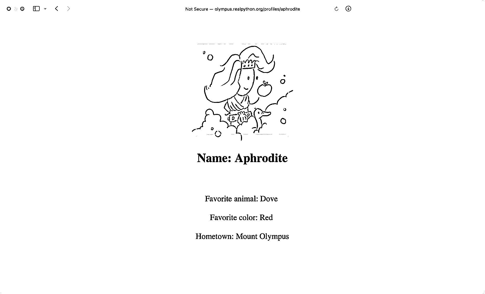
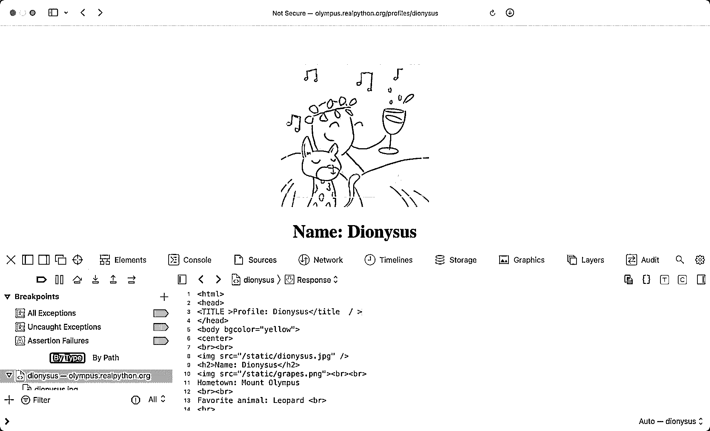
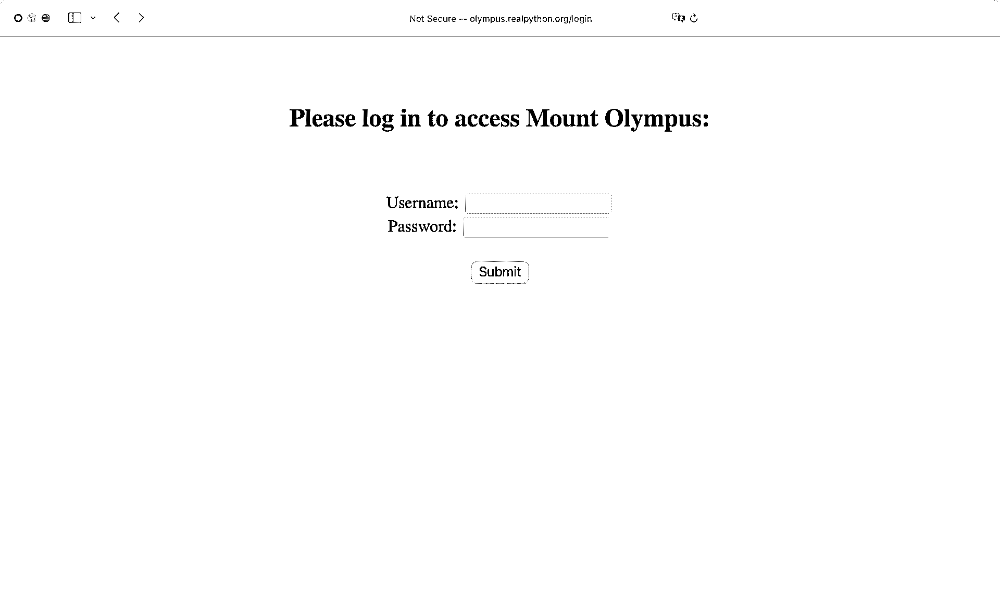
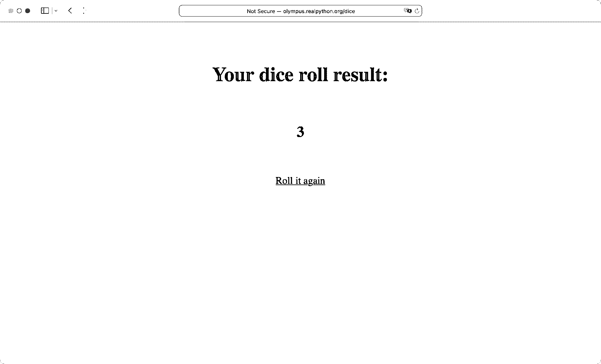

# Python 中 Web 抓取的实用介绍

> 原文：<https://realpython.com/python-web-scraping-practical-introduction/>

**Web 抓取**是从 Web 上收集和解析原始数据的过程，Python 社区已经开发出一些非常强大的 Web 抓取工具。

互联网可能是这个星球上最大的信息源。许多学科，如[数据科学](https://realpython.com/learning-paths/data-science-python-core-skills/)、商业智能和调查报告，可以从收集和分析网站数据中受益匪浅。

**在本教程中，您将学习如何:**

*   使用**字符串方法**和**正则表达式**解析网站数据
*   使用 **HTML 解析器**解析网站数据
*   与**表单**和其他网站组件交互

**注:**本教程改编自 [*Python 基础知识:Python 实用入门 3*](https://realpython.com/products/python-basics-book/) 中“与 Web 交互”一章。

这本书使用 Python 内置的 [IDLE](https://realpython.com/python-idle/) 编辑器来创建和编辑 Python 文件，并与 Python shell 进行交互，因此在整个教程中，你会偶尔看到对 IDLE 的引用。然而，从您选择的[编辑器](https://realpython.com/python-ides-code-editors-guide/)和[环境](https://realpython.com/effective-python-environment/)运行示例代码应该没有问题。

**源代码:** [点击这里下载免费的源代码](https://realpython.com/bonus/python-web-scraping-practical-introduction-code/)，你将使用它来收集和解析来自网络的数据。

## 从网站上抓取并解析文本

使用自动化过程从网站收集数据被称为网络搜集。一些网站明确禁止用户使用自动化工具抓取他们的数据，就像你将在本教程中创建的工具一样。网站这样做有两个可能的原因:

1.  该网站有充分的理由保护其数据。例如，谷歌地图不会让你太快地请求太多结果。
2.  向网站的服务器发出多次重复请求可能会耗尽带宽，降低其他用户访问网站的速度，并可能使服务器过载，从而导致网站完全停止响应。

在使用 Python 技能进行 web 抓取之前，您应该始终检查目标网站的可接受使用政策，以确定使用自动化工具访问网站是否违反了其使用条款。从法律上讲，违背网站意愿的网络抓取是一个灰色地带。

**重要提示:**请注意，在禁止抓取网页的网站上使用以下技术[可能是非法的](https://en.wikipedia.org/wiki/Web_scraping#Legal_issues)。

对于本教程，您将使用一个托管在 Real Python 服务器上的页面。您将访问的页面已经设置为与本教程一起使用。

既然你已经阅读了免责声明，你可以开始有趣的事情了。在下一节中，您将开始从单个 web 页面获取所有 HTML 代码。

[*Remove ads*](/account/join/)

### 打造你的第一台网络刮刀

你可以在 Python 的[标准库](https://docs.python.org/3/library/)中找到的一个有用的 web 抓取包是`urllib`，它包含了处理 URL 的工具。特别是， [`urllib.request`](https://realpython.com/urllib-request/) 模块包含一个名为`urlopen()`的函数，您可以用它来打开程序中的 URL。

在 IDLE 的交互窗口中，键入以下内容以导入`urlopen()`:

>>>

```py
>>> from urllib.request import urlopen
```

您将打开的网页位于以下 URL:

>>>

```py
>>> url = "http://olympus.realpython.org/profiles/aphrodite"
```

要打开网页，请将`url`传递给`urlopen()`:

>>>

```py
>>> page = urlopen(url)
```

`urlopen()`返回一个`HTTPResponse`对象:

>>>

```py
>>> page
<http.client.HTTPResponse object at 0x105fef820>
```

要从页面中提取 HTML，首先使用`HTTPResponse`对象的`.read()`方法，该方法返回一个字节序列。然后使用`.decode()`将字节解码成使用 [UTF-8](https://realpython.com/python-encodings-guide/#unicode-vs-utf-8) 的字符串:

>>>

```py
>>> html_bytes = page.read()
>>> html = html_bytes.decode("utf-8")
```

现在你可以[打印](https://realpython.com/python-print/)HTML 来查看网页的内容:

>>>

```py
>>> print(html)
<html>
<head>
<title>Profile: Aphrodite</title>
</head>
<body bgcolor="yellow">
<center>
<br><br>

<h2>Name: Aphrodite</h2>
<br><br>
Favorite animal: Dove
<br><br>
Favorite color: Red
<br><br>
Hometown: Mount Olympus
</center>
</body>
</html>
```

你看到的输出是网站的 [HTML 代码](https://realpython.com/html-css-python/)，当你访问`http://olympus.realpython.org/profiles/aphrodite`时，你的浏览器会显示出来:

[](https://files.realpython.com/media/website_aphrodite.10b67047ebc2.png)

使用`urllib`，您可以像在浏览器中一样访问网站。但是，您没有可视化地呈现内容，而是将源代码作为文本获取。既然已经有了文本形式的 HTML，就可以用几种不同的方法从中提取信息。

### 用字符串方法从 HTML 中提取文本

从网页的 HTML 中提取信息的一种方法是使用[字符串方法](https://realpython.com/python-strings/#built-in-string-methods)。例如，您可以使用`.find()`在 HTML 文本中搜索`<title>`标签，并提取网页的标题。

首先，您将提取您在前一个示例中请求的 web 页面的标题。如果你知道标题的第一个字符的索引和结束标签`</title>`的第一个字符的索引，那么你可以使用一个[字符串切片](https://realpython.com/python-strings/#string-slicing)来提取标题。

因为`.find()`返回一个[子串](https://realpython.com/python-string-contains-substring/)第一次出现的索引，所以可以通过将字符串`"<title>"`传递给`.find()`来获得开始`<title>`标签的索引:

>>>

```py
>>> title_index = html.find("<title>")
>>> title_index
14
```

但是，您并不需要`<title>`标签的索引。您需要标题本身的索引。要获得标题中第一个字母的索引，可以将字符串`"<title>"`的长度加到`title_index`中:

>>>

```py
>>> start_index = title_index + len("<title>")
>>> start_index
21
```

现在通过将字符串`"</title>"`传递给`.find()`来获取结束`</title>`标签的索引:

>>>

```py
>>> end_index = html.find("</title>")
>>> end_index
39
```

最后，您可以通过切分`html`字符串来提取标题:

>>>

```py
>>> title = html[start_index:end_index]
>>> title
'Profile: Aphrodite'
```

现实世界中的 HTML 可能比阿芙罗狄蒂个人资料页面上的 HTML 复杂得多，也不太容易预测。这里是另一个个人资料页面,你可以抓取一些更混乱的 HTML:

>>>

```py
>>> url = "http://olympus.realpython.org/profiles/poseidon"
```

尝试使用与上例相同的方法从这个新 URL 中提取标题:

>>>

```py
>>> url = "http://olympus.realpython.org/profiles/poseidon"
>>> page = urlopen(url)
>>> html = page.read().decode("utf-8")
>>> start_index = html.find("<title>") + len("<title>")
>>> end_index = html.find("</title>")
>>> title = html[start_index:end_index]
>>> title
'\n<head>\n<title >Profile: Poseidon'
```

哎呦！标题中夹杂了一点 HTML。为什么会这样？

`/profiles/poseidon`页面的 HTML 看起来类似于`/profiles/aphrodite`页面，但是有一点小小的不同。开始的`<title>`标签在结束的尖括号(`>`)前有一个额外的空格，呈现为`<title >`。

`html.find("<title>")`返回`-1`，因为精确的子串`"<title>"`不存在。当`-1`加到`len("<title>")`上，即`7`时，`start_index`变量被赋值`6`。

字符串`html`的索引`6`处的字符是一个换行符(`\n`)，正好在`<head>`标签的左尖括号(`<`)之前。这意味着`html[start_index:end_index]`返回所有从新行开始并在`</title>`标签之前结束的 HTML。

这类问题会以无数种不可预测的方式出现。您需要一种更可靠的方法来从 HTML 中提取文本。

[*Remove ads*](/account/join/)

### 了解正则表达式

**正则表达式**——或者简称为**正则表达式**——是可以用来在字符串中搜索文本的模式。Python 通过标准库的 [`re`](https://docs.python.org/3/library/re.html) 模块支持正则表达式。

**注意:**正则表达式不是 Python 特有的。它们是一个通用的编程概念，许多编程语言都支持它们。

要使用正则表达式，您需要做的第一件事是导入`re`模块:

>>>

```py
>>> import re
```

正则表达式使用称为**元字符**的特殊字符来表示不同的模式。例如，星号字符(`*`)代表零个或多个出现在星号前面的实例。

在下面的例子中，您使用`.findall()`来查找字符串中匹配给定正则表达式的任何文本:

>>>

```py
>>> re.findall("ab*c", "ac")
['ac']
```

`re.findall()`的第一个参数是要匹配的正则表达式，第二个参数是要测试的字符串。在上面的例子中，您在字符串`"ac"`中搜索模式`"ab*c"`。

正则表达式`"ab*c"`匹配字符串中以`"a"`开头、以`"c"`结尾并且在两者之间有零个或多个`"b"`实例的任何部分。`re.findall()`返回所有匹配的列表。字符串`"ac"`匹配这个模式，所以它被返回到列表中。

以下是应用于不同字符串的相同模式:

>>>

```py
>>> re.findall("ab*c", "abcd")
['abc']

>>> re.findall("ab*c", "acc")
['ac']

>>> re.findall("ab*c", "abcac")
['abc', 'ac']

>>> re.findall("ab*c", "abdc")
[]
```

注意，如果没有找到匹配，那么`.findall()`返回一个空列表。

模式匹配区分大小写。如果您想匹配这个模式而不考虑大小写，那么您可以传递第三个参数，值为`re.IGNORECASE`:

>>>

```py
>>> re.findall("ab*c", "ABC")
[]

>>> re.findall("ab*c", "ABC", re.IGNORECASE)
['ABC']
```

您可以使用句点(`.`)来代表正则表达式中的任何单个字符。例如，您可以找到包含由单个字符分隔的字母`"a"`和`"c"`的所有字符串，如下所示:

>>>

```py
>>> re.findall("a.c", "abc")
['abc']

>>> re.findall("a.c", "abbc")
[]

>>> re.findall("a.c", "ac")
[]

>>> re.findall("a.c", "acc")
['acc']
```

正则表达式中的模式`.*`代表重复任意次的任意字符。例如，您可以使用`"a.*c"`来查找以`"a"`开始并以`"c"`结束的每个子串，而不管中间是哪个或哪些字母:

>>>

```py
>>> re.findall("a.*c", "abc")
['abc']

>>> re.findall("a.*c", "abbc")
['abbc']

>>> re.findall("a.*c", "ac")
['ac']

>>> re.findall("a.*c", "acc")
['acc']
```

通常，您使用`re.search()`来搜索字符串中的特定模式。这个函数比`re.findall()`稍微复杂一些，因为它返回一个名为`MatchObject`的对象，该对象存储不同的数据组。这是因为在其他匹配中可能有匹配，而`re.search()`返回每一个可能的结果。

`MatchObject`的细节在这里无关紧要。现在，只需知道在`MatchObject`上调用`.group()`将返回第一个也是最具包容性的结果，这在大多数情况下正是您想要的:

>>>

```py
>>> match_results = re.search("ab*c", "ABC", re.IGNORECASE)
>>> match_results.group()
'ABC'
```

在`re`模块中还有一个对解析文本有用的函数。 [`re.sub()`](https://realpython.com/replace-string-python/#leverage-resub-to-make-complex-rules) ，是 *substitute* 的简称，允许你用新文本替换匹配正则表达式的字符串中的文本。它的表现有点像 [`.replace()`](https://realpython.com/replace-string-python/) 弦法。

传递给`re.sub()`的参数是正则表达式，后面是替换文本，后面是字符串。这里有一个例子:

>>>

```py
>>> string = "Everything is <replaced> if it's in <tags>."
>>> string = re.sub("<.*>", "ELEPHANTS", string)
>>> string
'Everything is ELEPHANTS.'
```

也许这并不是你所期望的。

`re.sub()`使用正则表达式`"<.*>"`查找并替换第一个`<`和最后一个`>`之间的所有内容，从`<replaced>`开始到`<tags>`结束。这是因为 Python 的正则表达式是*贪婪的*，这意味着当使用像`*`这样的字符时，它们试图找到最长的可能匹配。

或者，您可以使用非贪婪匹配模式`*?`，它的工作方式与`*`相同，只是它匹配可能的最短文本字符串:

>>>

```py
>>> string = "Everything is <replaced> if it's in <tags>."
>>> string = re.sub("<.*?>", "ELEPHANTS", string)
>>> string
"Everything is ELEPHANTS if it's in ELEPHANTS."
```

这次，`re.sub()`找到了两个匹配项，`<replaced>`和`<tags>`，并用字符串`"ELEPHANTS"`替换这两个匹配项。

[*Remove ads*](/account/join/)

### 用正则表达式从 HTML 中提取文本

有了所有这些知识，现在试着从另一个个人资料页面解析出标题，其中包括这段相当粗心的 HTML 代码:

```py
<TITLE >Profile: Dionysus</title  / >
```

`.find()`方法在处理这里的不一致时会有困难，但是通过巧妙使用正则表达式，您可以快速有效地处理这段代码:

```py
# regex_soup.py

import re
from urllib.request import urlopen

url = "http://olympus.realpython.org/profiles/dionysus"
page = urlopen(url)
html = page.read().decode("utf-8")

pattern = "<title.*?>.*?</title.*?>"
match_results = re.search(pattern, html, re.IGNORECASE)
title = match_results.group()
title = re.sub("<.*?>", "", title) # Remove HTML tags

print(title)
```

通过将字符串分成三部分来仔细查看`pattern`中的第一个正则表达式:

1.  **`<title.*?>`** 匹配`html`中的开始`<TITLE >`标签。模式的`<title`部分与`<TITLE`匹配，因为`re.search()`是用`re.IGNORECASE`调用的，而`.*?>`匹配`<TITLE`之后直到第一个`>`实例的任何文本。

2.  **`.*?`** 非贪婪地匹配开头`<TITLE >`后的所有文本，停在第一个匹配的`</title.*?>`。

3.  **`</title.*?>`** 与第一个模式的不同之处仅在于它使用了`/`字符，因此它匹配`html`中的结束`</title / >`标记。

第二个正则表达式，字符串`"<.*?>"`，也使用非贪婪的`.*?`来匹配`title`字符串中的所有 HTML 标签。通过用`""`替换任何匹配，`re.sub()`删除所有标签，只返回文本。

**注意:**用 Python 或任何其他语言进行 Web 抓取可能会很乏味。没有两个网站是以相同的方式组织的，HTML 通常是混乱的。此外，网站会随着时间而变化。今天有效的网页抓取工具不能保证明年或者下周也有效。

如果使用正确，正则表达式是一个强大的工具。在这篇介绍中，您仅仅触及了皮毛。有关正则表达式以及如何使用它们的更多信息，请查看由两部分组成的系列文章[正则表达式:Python 中的正则表达式](https://realpython.com/regex-python/)。

### 检查你的理解能力

展开下面的方框，检查您的理解情况。


编写一个程序，从以下 URL 获取完整的 HTML:

>>>

```py
>>> url = "http://olympus.realpython.org/profiles/dionysus"
```

然后使用`.find()`显示*名称:*和*喜爱的颜色:*之后的文本(不包括任何可能出现在同一行的前导空格或尾随 HTML 标签)。

您可以展开下面的方框查看解决方案。


首先，从`urlib.request`模块导入`urlopen`函数:

```py
from urllib.request import urlopen
```

然后打开 URL 并使用由`urlopen()`返回的`HTTPResponse`对象的`.read()`方法来读取页面的 HTML:

```py
url = "http://olympus.realpython.org/profiles/dionysus"
html_page = urlopen(url)
html_text = html_page.read().decode("utf-8")
```

`.read()`方法返回一个字节串，所以使用`.decode()`通过 UTF-8 编码对字节进行解码。

现在您已经将 web 页面的 HTML 源代码作为一个字符串分配给了`html_text`变量，您可以从 Dionysus 的概要文件中提取他的名字和最喜欢的颜色。狄俄尼索斯个人资料的 HTML 结构与您之前看到的阿芙罗狄蒂个人资料的结构相同。

您可以通过在文本中找到字符串`"Name:"`并提取该字符串第一次出现之后和下一个 HTML 标签之前的所有内容来获得名称。也就是说，您需要提取冒号(`:`)之后和第一个尖括号(`<`)之前的所有内容。你可以用同样的技巧提取喜欢的颜色。

下面的 [`for`循环](https://realpython.com/python-for-loop/)为名称和喜爱的颜色提取文本:

```py
for string in ["Name: ", "Favorite Color:"]:
    string_start_idx = html_text.find(string)
    text_start_idx = string_start_idx + len(string)

    next_html_tag_offset = html_text[text_start_idx:].find("<")
    text_end_idx = text_start_idx + next_html_tag_offset

    raw_text = html_text[text_start_idx : text_end_idx]
    clean_text = raw_text.strip(" \r\n\t")
    print(clean_text)
```

看起来在这个`for`循环中进行了很多工作，但这只是一点点计算提取所需文本的正确索引的运算。继续并分解它:

1.  您使用`html_text.find()`来查找字符串的起始索引，可以是`"Name:"`或`"Favorite Color:"`，然后将索引分配给`string_start_idx`。

2.  由于要提取的文本紧接在`"Name:"`或`"Favorite Color:"`中的冒号之后开始，所以通过将字符串的长度加到`start_string_idx`中可以获得紧跟在冒号之后的字符的索引，然后将结果赋给`text_start_idx`。

3.  通过确定第一个尖括号(`<`)相对于`text_start_idx`的索引，计算要提取的文本的结束索引，并将该值赋给`next_html_tag_offset`。然后将该值加到`text_start_idx`上，并将结果赋给`text_end_idx`。

4.  你通过从`text_start_idx`到`text_end_idx`分割`html_text`来提取文本，并将这个字符串分配给`raw_text`。

5.  使用`.strip()`删除`raw_text`开头和结尾的任何空白，并将结果赋给`clean_text`。

在循环结束时，使用`print()`显示提取的文本。最终输出如下所示:

```py
Dionysus
Wine
```

这个解决方案是解决这个问题的众多解决方案之一，所以如果你用不同的解决方案得到相同的输出，那么你做得很好！

当你准备好了，你可以进入下一部分。

## 在 Python 中使用 HTML 解析器进行 Web 抓取

虽然正则表达式通常非常适合模式匹配，但有时使用专门为解析 HTML 页面而设计的 HTML 解析器更容易。有许多 Python 工具是为此而编写的，但是 [Beautiful Soup](https://beautiful-soup-4.readthedocs.io/en/latest/) 库是一个很好的开始。

### 装美汤

要安装 Beautiful Soup，您可以在终端中运行以下命令:

```py
$ python -m pip install beautifulsoup4
```

使用这个命令，您可以将最新版本的 Beautiful Soup 安装到您的全局 Python 环境中。

[*Remove ads*](/account/join/)

### 创建一个`BeautifulSoup`对象

在新的编辑器窗口中键入以下程序:

```py
# beauty_soup.py

from bs4 import BeautifulSoup
from urllib.request import urlopen

url = "http://olympus.realpython.org/profiles/dionysus"
page = urlopen(url)
html = page.read().decode("utf-8")
soup = BeautifulSoup(html, "html.parser")
```

这个程序做三件事:

1.  使用`urllib.request`模块中的`urlopen()`打开网址`http://olympus.realpython.org/profiles/dionysus`

2.  以字符串形式从页面中读取 HTML，并将其赋给`html`变量

3.  创建一个`BeautifulSoup`对象，并将其分配给`soup`变量

分配给`soup`的`BeautifulSoup`对象是用两个参数创建的。第一个参数是要解析的 HTML，第二个参数是字符串`"html.parser"`，它告诉对象在后台使用哪个解析器。`"html.parser"`代表 Python 内置的 HTML 解析器。

### 使用一个`BeautifulSoup`对象

保存并运行上面的程序。当它完成运行时，您可以使用交互窗口中的`soup`变量以各种方式解析`html`的内容。

**注意:**如果你没有使用 IDLE，那么你可以用`-i`标志运行你的程序进入交互模式。类似于`python -i beauty_soup.py`的东西将首先运行你的程序，然后让你进入一个 REPL，在那里你可以探索你的对象。

例如，`BeautifulSoup`对象有一个`.get_text()`方法，可以用来从文档中提取所有文本，并自动删除任何 HTML 标签。

在 IDLE 的交互窗口中或编辑器中的代码末尾键入以下代码:

>>>

```py
>>> print(soup.get_text())

Profile: Dionysus

Name: Dionysus

Hometown: Mount Olympus

Favorite animal: Leopard

Favorite Color: Wine
```

这个输出中有很多空行。这些是 HTML 文档文本中换行符的结果。如果需要，可以用`.replace()` string 方法删除它们。

通常，您只需要从 HTML 文档中获取特定的文本。首先使用 Beautiful Soup 提取文本，然后使用`.find()` string 方法，这有时比使用正则表达式更容易。

然而，其他时候 HTML 标签本身是指出您想要检索的数据的元素。例如，您可能想要检索页面上所有图像的 URL。这些链接包含在`` HTML 标签的`src`属性中。

在这种情况下，您可以使用`find_all()`返回该特定标记的所有实例的列表:

>>>

```py
>>> soup.find_all("img")
[, ]
```

这将返回 HTML 文档中所有``标签的列表。列表中的对象看起来可能是代表标签的字符串，但它们实际上是 Beautiful Soup 提供的`Tag`对象的实例。`Tag`对象为处理它们所包含的信息提供了一个简单的接口。

您可以先从列表中解包`Tag`对象，对此进行一些探索:

>>>

```py
>>> image1, image2 = soup.find_all("img")
```

每个`Tag`对象都有一个`.name`属性，该属性返回一个包含 HTML 标签类型的字符串:

>>>

```py
>>> image1.name
'img'
```

您可以通过将名称放在方括号中来访问`Tag`对象的 HTML 属性，就像属性是字典中的键一样。

例如，``标签只有一个属性`src`，其值为`"/static/dionysus.jpg"`。同样，像链接`<a href="https://realpython.com" target="_blank">`这样的 HTML 标签有两个属性，`href`和`target`。

要获得 Dionysus profile 页面中图像的来源，可以使用上面提到的字典符号访问`src`属性:

>>>

```py
>>> image1["src"]
'/static/dionysus.jpg'

>>> image2["src"]
'/static/grapes.png'
```

HTML 文档中的某些标签可以通过`Tag`对象的属性来访问。例如，要获得文档中的`<title>`标签，可以使用`.title`属性:

>>>

```py
>>> soup.title
<title>Profile: Dionysus</title>
```

如果您通过导航到[个人资料页面](http://olympus.realpython.org/profiles/dionysus)来查看 Dionysus 个人资料的源代码，右键单击该页面，并选择*查看页面源代码*，那么您会注意到`<title>`标签全部用大写字母和空格书写:

[](https://files.realpython.com/media/website_dionysos_page.8d7be251d9a0.png)

Beautiful Soup 通过删除开始标签中多余的空格和结束标签中多余的正斜杠(`/`)自动为您清理标签。

您还可以使用`Tag`对象的`.string`属性来检索标题标签之间的字符串:

>>>

```py
>>> soup.title.string
'Profile: Dionysus'
```

Beautiful Soup 的一个特性是能够搜索特定类型的标签，这些标签的属性与某些值相匹配。例如，如果您想要查找所有具有与值`/static/dionysus.jpg`相等的`src`属性的``标签，那么您可以向`.find_all()`提供以下附加参数:

>>>

```py
>>> soup.find_all("img", src="/static/dionysus.jpg")
[]
```

这个例子有些武断，从这个例子中可能看不出这种技术的用处。如果你花一些时间浏览各种网站并查看它们的页面源代码，那么你会注意到许多网站都有极其复杂的 HTML 结构。

当使用 Python 从网站抓取数据时，您通常会对页面的特定部分感兴趣。通过花一些时间浏览 HTML 文档，您可以识别具有独特属性的标签，这些标签可用于提取您需要的数据。

然后，不用依赖复杂的正则表达式或使用`.find()`来搜索整个文档，您可以直接访问您感兴趣的特定标签并提取您需要的数据。

在某些情况下，你可能会发现漂亮的汤并没有提供你需要的功能。lxml 库开始有点棘手，但是它提供了比解析 HTML 文档更大的灵活性。一旦你习惯了使用美丽的汤，你可能会想要检查一下。

**注意:**在定位网页中的特定数据时，像美人汤这样的 HTML 解析器可以节省您大量的时间和精力。然而，有时 HTML 写得很差，没有条理，甚至像 Beautiful Soup 这样复杂的解析器也不能正确地解释 HTML 标签。

在这种情况下，您通常需要使用`.find()`和正则表达式技术来解析出您需要的信息。

Beautiful Soup 非常适合从网站的 HTML 中抓取数据，但是它没有提供任何处理 HTML 表单的方法。例如，如果你需要在一个网站上搜索一些查询，然后搜索结果，那么单靠美丽的汤不会让你走得很远。

[*Remove ads*](/account/join/)

### 检查你的理解能力

展开下面的方框，检查您的理解情况。


编写一个程序，从 URL `http://olympus.realpython.org/profiles`的[页面](http://olympus.realpython.org/profiles)获取完整的 HTML。

使用 Beautiful Soup，通过查找名为`a`的 HTML 标记并检索每个标记的`href`属性所取的值，打印出页面上所有链接的列表。

最终输出应该如下所示:

```py
http://olympus.realpython.org/profiles/aphrodite
http://olympus.realpython.org/profiles/poseidon
http://olympus.realpython.org/profiles/dionysus
```

确保在基本 URL 和相对 URL 之间只有一个斜杠(`/`)。

您可以展开下面的方框查看解决方案:


首先，从`urlib.request`模块中导入`urlopen`函数，从`bs4`包中导入`BeautifulSoup`类:

```py
from urllib.request import urlopen
from bs4 import BeautifulSoup
```

在`/profiles`页面上的每个链接 URL 是一个**相对 URL** ，所以用网站的基本 URL 创建一个`base_url`变量:

```py
base_url = "http://olympus.realpython.org"
```

您可以通过连接`base_url`和一个相对 URL 来构建一个完整的 URL。

现在用`urlopen()`打开`/profiles`页面，使用`.read()`获取 HTML 源代码:

```py
html_page = urlopen(base_url + "/profiles")
html_text = html_page.read().decode("utf-8")
```

下载并解码 HTML 源代码后，您可以创建一个新的`BeautifulSoup`对象来解析 HTML:

```py
soup = BeautifulSoup(html_text, "html.parser")
```

返回 HTML 源代码中所有链接的列表。您可以遍历这个列表，打印出网页上的所有链接:

```py
for link in soup.find_all("a"):
    link_url = base_url + link["href"]
    print(link_url)
```

您可以通过`"href"`下标访问每个链接的相对 URL。将该值与`base_url`连接，创建完整的`link_url`。

当你准备好了，你可以进入下一部分。

## 与 HTML 表单交互

到目前为止，您在本教程中使用的`urllib`模块非常适合请求网页内容。但是，有时您需要与网页交互来获取您需要的内容。例如，您可能需要提交表单或单击按钮来显示隐藏的内容。

**注:**本教程改编自 [*Python 基础知识:Python 实用入门 3*](https://realpython.com/products/python-basics-book/) 中“与 Web 交互”一章。如果你喜欢你正在阅读的东西，那么一定要看看这本书的其余部分。

Python 标准库并没有提供一个内置的交互处理网页的方法，但是许多第三方包可以从 [PyPI](https://pypi.org/) 获得。其中， [MechanicalSoup](https://mechanicalsoup.readthedocs.io/en/stable/) 是一个流行且相对简单的软件包。

本质上，MechanicalSoup 安装了所谓的**无头浏览器**，这是一个没有图形用户界面的网络浏览器。该浏览器通过 Python 程序以编程方式控制。

### 安装机械汤

您可以在您的终端中安装带有 [`pip`](https://realpython.com/what-is-pip/) 的机械汤:

```py
$ python -m pip install MechanicalSoup
```

您需要关闭并重新启动您的空闲会话，以便 MechanicalSoup 在安装后加载并被识别。

### 创建一个`Browser`对象

在 IDLE 的交互窗口中键入以下内容:

>>>

```py
>>> import mechanicalsoup
>>> browser = mechanicalsoup.Browser()
```

对象代表无头网络浏览器。您可以使用它们通过向它们的`.get()`方法传递一个 URL 来请求来自互联网的页面:

>>>

```py
>>> url = "http://olympus.realpython.org/login"
>>> page = browser.get(url)
```

`page`是一个`Response`对象，存储从浏览器请求 URL 的响应:

>>>

```py
>>> page
<Response [200]>
```

数字`200`代表请求返回的[状态码](https://developer.mozilla.org/en-US/docs/Web/HTTP/Status)。状态代码`200`表示请求成功。如果 URL 不存在，不成功的请求可能会显示状态代码`404`，如果请求时出现服务器错误，则可能会显示状态代码`500`。

MechanicalSoup 使用 Beautiful Soup 来解析请求中的 HTML，`page`有一个代表`BeautifulSoup`对象的`.soup`属性:

>>>

```py
>>> type(page.soup)
<class 'bs4.BeautifulSoup'>
```

您可以通过检查`.soup`属性来查看 HTML:

>>>

```py
>>> page.soup
<html>
<head>
<title>Log In</title>
</head>
<body bgcolor="yellow">
<center>
<br/><br/>
<h2>Please log in to access Mount Olympus:</h2>
<br/><br/>
<form action="/login" method="post" name="login">
Username: <input name="user" type="text"/><br/>
Password: <input name="pwd" type="password"/><br/><br/>
<input type="submit" value="Submit"/>
</form>
</center>
</body>
</html>
```

注意，这个页面上有一个`<form>`和用于用户名和密码的`<input>`元素。

[*Remove ads*](/account/join/)

### 提交带有机械汤的表格

在浏览器中打开上一个示例中的 [`/login`](http://olympus.realpython.org/login) 页面，在继续之前亲自查看一下:

[](https://files.realpython.com/media/website_login.739f488fbe74.png)

尝试输入随机的用户名和密码组合。如果你猜错了，那么消息*错误的用户名或密码！*显示在页面底部。

但是，如果您提供了正确的登录凭证，那么您将被重定向到 [`/profiles`](http://olympus.realpython.org/profiles) 页面:

| 用户名 | 密码 |
| --- | --- |
| `zeus` | `ThunderDude` |

在下一个例子中，您将看到如何使用 Python 来使用 MechanicalSoup 填写和提交这个表单！

HTML 代码的重要部分是登录表单——也就是说，`<form>`标签中的所有内容。该页面上的`<form>`的`name`属性被设置为`login`。这个表单包含两个`<input>`元素，一个名为`user`，另一个名为`pwd`。第三个`<input>`元素是*提交*按钮。

既然您已经知道了登录表单的底层结构，以及登录所需的凭证，那么请看一个填写表单并提交表单的程序。

在新的编辑器窗口中，键入以下程序:

```py
import mechanicalsoup

# 1
browser = mechanicalsoup.Browser()
url = "http://olympus.realpython.org/login"
login_page = browser.get(url)
login_html = login_page.soup

# 2
form = login_html.select("form")[0]
form.select("input")[0]["value"] = "zeus"
form.select("input")[1]["value"] = "ThunderDude"

# 3
profiles_page = browser.submit(form, login_page.url)
```

保存文件，按 `F5` 运行。要确认您已成功登录，请在交互式窗口中键入以下内容:

>>>

```py
>>> profiles_page.url
'http://olympus.realpython.org/profiles'
```

现在分解上面的例子:

1.  您创建了一个`Browser`实例，并使用它来请求 URL `http://olympus.realpython.org/login`。使用`.soup`属性将页面的 HTML 内容分配给`login_html`变量。

2.  `login_html.select("form")`返回页面上所有`<form>`元素的列表。因为页面只有一个`<form>`元素，所以可以通过检索列表中索引`0`处的元素来访问表单。当一页上只有一个表格时，你也可以使用`login_html.form`。接下来的两行选择用户名和密码输入，并将它们的值分别设置为`"zeus"`和`"ThunderDude"`。

3.  你用`browser.submit()`提交表格。注意，您向这个方法传递了两个参数，一个是`form`对象，另一个是通过`login_page.url`访问的`login_page`的 URL。

在交互窗口中，您确认提交成功地重定向到了`/profiles`页面。如果出了问题，那么`profiles_page.url`的值仍然是`"http://olympus.realpython.org/login"`。

**注意:**黑客可以通过快速尝试许多不同的用户名和密码，直到他们找到一个有效的组合，使用类似上面的自动化程序来**暴力破解**登录。

除了这是高度非法的，几乎所有的网站这些天来锁定你，并报告你的 IP 地址，如果他们看到你做了太多失败的请求，所以不要尝试！

既然您已经设置了`profiles_page`变量，那么是时候以编程方式获取`/profiles`页面上每个链接的 URL 了。

为此，您再次使用`.select()`，这次传递字符串`"a"`来选择页面上所有的`<a>`锚元素:

>>>

```py
>>> links = profiles_page.soup.select("a")
```

现在您可以迭代每个链接并打印出`href`属性:

>>>

```py
>>> for link in links:
...     address = link["href"]
...     text = link.text
...     print(f"{text}: {address}")
...
Aphrodite: /profiles/aphrodite
Poseidon: /profiles/poseidon
Dionysus: /profiles/dionysus
```

每个`href`属性中包含的 URL 都是相对 URL，如果您想稍后使用 MechanicalSoup 导航到它们，这些 URL 没有太大帮助。如果您碰巧知道完整的 URL，那么您可以分配构建完整 URL 所需的部分。

在这种情况下，基本 URL 只是`http://olympus.realpython.org`。然后，您可以将基本 URL 与在`src`属性中找到的相对 URL 连接起来:

>>>

```py
>>> base_url = "http://olympus.realpython.org"
>>> for link in links:
...     address = base_url + link["href"]
...     text = link.text
...     print(f"{text}: {address}")
...
Aphrodite: http://olympus.realpython.org/profiles/aphrodite
Poseidon: http://olympus.realpython.org/profiles/poseidon
Dionysus: http://olympus.realpython.org/profiles/dionysus
```

你可以只用`.get()`、`.select()`和`.submit()`做很多事情。也就是说，机械汤可以做得更多。要了解更多关于机械汤的信息，请查阅[官方文件](https://mechanicalsoup.readthedocs.io/en/stable/)。

[*Remove ads*](/account/join/)

### 检查你的理解能力

展开下面的方框，检查您的理解情况


使用 MechanicalSoup 向位于 URL `http://olympus.realpython.org/login`的[登录表单](http://olympus.realpython.org/login)提供正确的用户名(`zeus`)和密码(`ThunderDude`)。

提交表单后，显示当前页面的标题，以确定您已经被重定向到 [`/profiles`](http://olympus.realpython.org/profiles) 页面。

你的程序应该打印文本`<title>All Profiles</title>`。

您可以展开下面的方框查看解决方案。


首先，导入`mechanicalsoup`包并创建一个`Broswer`对象:

```py
import mechanicalsoup

browser = mechanicalsoup.Browser()
```

通过将 URL 传递给`browser.get()`将浏览器指向登录页面，并获取带有`.soup`属性的 HTML:

```py
login_url = "http://olympus.realpython.org/login"
login_page = browser.get(login_url)
login_html = login_page.soup
```

`login_html`是一个`BeautifulSoup`实例。因为页面上只有一个表单，所以您可以通过`login_html.form`访问该表单。使用`.select()`，选择用户名和密码输入，并填入用户名`"zeus"`和密码`"ThunderDude"`:

```py
form = login_html.form
form.select("input")[0]["value"] = "zeus"
form.select("input")[1]["value"] = "ThunderDude"
```

现在表单已经填写完毕，您可以使用`browser.submit()`提交它:

```py
profiles_page = browser.submit(form, login_page.url)
```

如果您用正确的用户名和密码填写了表单，那么`profiles_page`实际上应该指向`/profiles`页面。你可以通过打印分配给`profiles_page:`的页面标题来确认这一点

```py
print(profiles_page.soup.title)
```

您应该会看到以下显示的文本:

```py
<title>All Profiles</title>
```

如果您看到文本`Log In`或其他东西，那么表单提交失败。

当你准备好了，你可以进入下一部分。

## 与网站实时互动

有时，您希望能够从提供持续更新信息的网站获取实时数据。

在你学习 Python 编程之前的黑暗日子里，你不得不坐在浏览器前，每当你想检查更新的内容是否可用时，点击*刷新*按钮来重新加载页面。但是现在您可以使用 MechanicalSoup `Browser`对象的`.get()`方法来自动化这个过程。

打开您选择的浏览器并导航至 URL `http://olympus.realpython.org/dice`:

[](https://files.realpython.com/media/website_dice.3cdd09061f55.png)

这个 [`/dice`](http://olympus.realpython.org/dice) 页面模拟一个六面骰子的滚动，每次刷新浏览器都会更新结果。下面，您将编写一个程序，反复抓取页面以获得新的结果。

您需要做的第一件事是确定页面上的哪个元素包含掷骰子的结果。现在，右键单击页面上的任意位置并选择*查看页面源*即可。HTML 代码中间多一点的地方是一个类似下面的`<h2>`标签:

```py
<h2 id="result">3</h2>
```

对于您来说,`<h2>`标签的文本可能不同，但是这是抓取结果所需的页面元素。

**注意:**对于这个例子，您可以很容易地检查出页面上只有一个带有`id="result"`的元素。尽管`id`属性应该是惟一的，但实际上您应该总是检查您感兴趣的元素是否被惟一标识。

现在开始编写一个简单的程序，打开 [`/dice`](http://olympus.realpython.org/dice) 页面，抓取结果，并打印到控制台:

```py
# mech_soup.py

import mechanicalsoup

browser = mechanicalsoup.Browser()
page = browser.get("http://olympus.realpython.org/dice")
tag = page.soup.select("#result")[0]
result = tag.text

print(f"The result of your dice roll is: {result}")
```

这个例子使用了`BeautifulSoup`对象的`.select()`方法来查找带有`id=result`的元素。传递给`.select()`的字符串`"#result"`使用 [CSS ID 选择器](https://developer.mozilla.org/en-US/docs/Web/CSS/ID_selectors) `#`来表示`result`是一个`id`值。

为了定期获得新的结果，您需要创建一个循环，在每一步加载页面。因此，上面代码中位于行`browser = mechanicalsoup.Browser()`之下的所有内容都需要放在循环体中。

对于本例，您希望以 10 秒的间隔掷出 4 次骰子。为此，代码的最后一行需要告诉 Python 暂停运行十秒钟。你可以用 Python 的 [`time`模块](https://realpython.com/python-time-module/)中的 [`.sleep()`](https://realpython.com/python-sleep/) 来做到这一点。`.sleep()`方法采用单个参数，表示以秒为单位的睡眠时间。

这里有一个例子来说明`sleep()`是如何工作的:

```py
import time

print("I'm about to wait for five seconds...")
time.sleep(5)
print("Done waiting!")
```

当您运行这段代码时，您将会看到在第一个`print()`函数被执行 5 秒钟后才会显示`"Done waiting!"`消息。

对于掷骰子的例子，您需要将数字`10`传递给`sleep()`。以下是更新后的程序:

```py
# mech_soup.py

import time
import mechanicalsoup

browser = mechanicalsoup.Browser()

for i in range(4):
    page = browser.get("http://olympus.realpython.org/dice")
    tag = page.soup.select("#result")[0]
    result = tag.text
    print(f"The result of your dice roll is: {result}")
    time.sleep(10)
```

当您运行该程序时，您将立即看到打印到控制台的第一个结果。十秒钟后，显示第二个结果，然后是第三个，最后是第四个。打印第四个结果后会发生什么？

程序继续运行十秒钟，然后最终停止。那有点浪费时间！您可以通过使用一个 [`if`语句](https://realpython.com/python-conditional-statements/)来阻止它这样做，只对前三个请求运行`time.sleep()`:

```py
# mech_soup.py

import time
import mechanicalsoup

browser = mechanicalsoup.Browser()

for i in range(4):
    page = browser.get("http://olympus.realpython.org/dice")
    tag = page.soup.select("#result")[0]
    result = tag.text
    print(f"The result of your dice roll is: {result}")

    # Wait 10 seconds if this isn't the last request
    if i < 3:
        time.sleep(10)
```

有了这样的技术，你可以从定期更新数据的网站上抓取数据。但是，您应该意识到，快速连续多次请求某个页面可能会被视为对网站的可疑甚至恶意使用。

**重要提示:**大多数网站都会发布使用条款文档。你经常可以在网站的页脚找到它的链接。

在试图从网站上抓取数据之前，请务必阅读本文档。如果您找不到使用条款，那么尝试联系网站所有者，询问他们是否有关于请求量的任何政策。

不遵守使用条款可能会导致您的 IP 被封锁，所以要小心！

过多的请求甚至有可能使服务器崩溃，所以可以想象许多网站都很关心对服务器的请求量！始终检查使用条款，并在向网站发送多个请求时保持尊重。

[*Remove ads*](/account/join/)

## 结论

虽然可以使用 Python 标准库中的工具解析来自 Web 的数据，但是 PyPI 上有许多工具可以帮助简化这个过程。

**在本教程中，您学习了如何:**

*   使用 Python 内置的 **`urllib`** 模块请求网页
*   使用**美汤**解析 HTML
*   使用 **MechanicalSoup** 与 web 表单交互
*   反复从网站请求数据以**检查更新**

编写自动化的网络抓取程序很有趣，而且互联网上不缺乏可以带来各种令人兴奋的项目的内容。

请记住，不是每个人都希望你从他们的网络服务器上下载数据。在你开始抓取之前，一定要检查网站的使用条款，尊重你的网络请求时间，这样你就不会让服务器流量泛滥。

**源代码:** [点击这里下载免费的源代码](https://realpython.com/bonus/python-web-scraping-practical-introduction-code/)，你将使用它来收集和解析来自网络的数据。

## 额外资源

有关使用 Python 进行 web 抓取的更多信息，请查看以下资源:

*   [美汤:用 Python 搭建 Web 刮刀](https://realpython.com/beautiful-soup-web-scraper-python/)
*   [Python 中的 API 集成](https://realpython.com/api-integration-in-python/)
*   [Python&API:读取公共数据的成功组合](https://realpython.com/python-api/)

**注意:**如果你喜欢在这个例子中从 [*Python 基础知识:Python 3*](https://realpython.com/products/python-basics-book/) 实用介绍中所学到的东西，那么一定要看看本书的其余部分[。](https://realpython.com/products/python-basics-book/)********