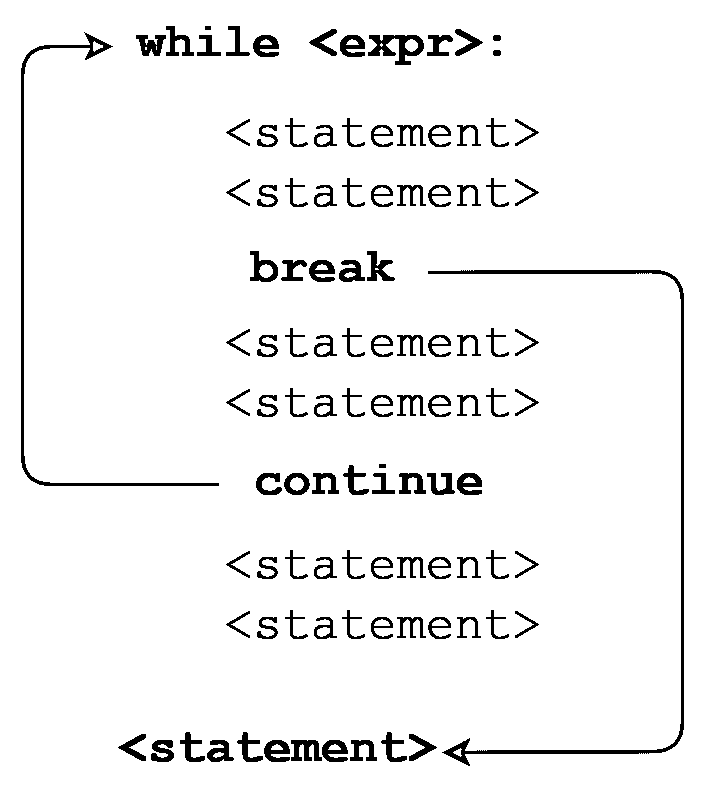

# python“while”循环(无限迭代)

> 原文：<https://realpython.com/python-while-loop/>

*立即观看**本教程有真实 Python 团队创建的相关视频课程。和书面教程一起看，加深理解: [**掌握 While Loops**](/courses/mastering-while-loops/)

**迭代**意味着一遍又一遍地执行同一个代码块，可能是多次。实现迭代的编程结构被称为**循环**。

在编程中，有两种类型的迭代，不定迭代和确定迭代:

*   使用**无限迭代**，循环执行的次数没有事先明确指定。相反，只要满足某些条件，就重复执行指定的块。

*   使用**确定迭代**，指定块将被执行的次数在循环开始时被明确指定。

**在本教程中，您将:**

*   了解`while`循环，这是用于无限迭代的 Python 控制结构
*   了解如何提前脱离循环或循环迭代
*   探索无限循环

完成后，你应该很好地掌握了如何在 Python 中使用无限迭代。

**免费奖励:** ，它向您展示 Python 3 的基础知识，如使用数据类型、字典、列表和 Python 函数。

***参加测验:****通过我们的交互式“Python”while“Loops”测验来测试您的知识。完成后，您将收到一个分数，以便您可以跟踪一段时间内的学习进度:*

*[参加测验](/quizzes/python-while-loop/)

## `while`循环

让我们看看 Python 的`while`语句是如何用来构造循环的。我们将从简单开始，然后不断修饰。

基本`while`循环的格式如下所示:

```py
while <expr>:
    <statement(s)>
```

`<statement(s)>`表示要重复执行的块，通常称为循环体。这用缩进来表示，就像在一个[语句](https://realpython.com/python-conditional-statements/)中一样。

**记住:**Python 中所有的控制结构都是用缩进来定义块的。参见前面教程中关于[分组语句](https://realpython.com/python-conditional-statements/#python-its-all-about-the-indentation)的讨论进行回顾。

控制表达式`<expr>`通常包含一个或多个变量，这些变量在开始循环之前被初始化，然后在循环体的某个地方被修改。

当遇到`while`循环时，首先在[布尔上下文](https://realpython.com/python-data-types/#boolean-type-boolean-context-and-truthiness)中评估`<expr>`。如果为真，则执行循环体。然后再次检查`<expr>`，如果仍然为真，则再次执行主体。这一直持续到`<expr>`变为假，此时程序执行继续到循环体之外的第一条语句。

考虑这个循环:

>>>

```py
 1>>> n = 5
 2>>> while n > 0:
 3...     n -= 1
 4...     print(n)
 5...
 64
 73
 82
 91
100
```

以下是本例中发生的情况:

*   `n`最初是`5`。第 2 行的`while`语句头中的表达式是`n > 0`，这是真的，所以循环体执行。在第 3 行的循环体内，`n`从`1`递减到`4`，然后打印出来。

*   当循环体结束时，程序执行返回到循环顶部的第 2 行，并再次计算表达式。还是真的，所以主体再执行一次，打印出`3`。

*   这一直持续到`n`变成`0`为止。此时，当表达式被测试时，它是假的，并且循环终止。执行将在循环体后面的第一条语句处继续，但在本例中没有这样的语句。

注意，在发生任何事情之前，首先测试的是`while`循环的控制表达式。如果一开始就为 false，循环体将永远不会被执行:

>>>

```py
>>> n = 0
>>> while n > 0:
...     n -= 1
...     print(n)
...
```

在上面的例子中，当遇到循环时，`n`就是`0`。控制表达式`n > 0`已经为假，所以循环体永远不会执行。

这里是另一个`while`循环，涉及一个列表，而不是一个数字比较:

>>>

```py
>>> a = ['foo', 'bar', 'baz']
>>> while a:
...     print(a.pop(-1))
...
baz
bar
foo
```

当在布尔上下文中评估一个[列表时，如果列表中有元素，则为 true，如果列表为空，则为 falsy。在这个例子中，`a`只要包含元素，就是真的。一旦用`.pop()`方法移除了所有的条目并且列表为空，`a`为假，循环终止。](https://realpython.com/python-operators-expressions/#evaluation-of-non-boolean-values-in-boolean-context)

[*Remove ads*](/account/join/)

## Python 的`break`和`continue`语句

到目前为止，在您看到的每个例子中，`while`循环的整个主体都在每次迭代中执行。Python 提供了两个[关键字](https://realpython.com/python-keywords/)，可以提前终止循环迭代:

*   Python **`break`** 语句立即终止整个循环。程序执行到循环体后面的第一条语句。

*   Python **`continue`** 语句立即终止当前循环迭代。执行跳转到循环的顶部，重新计算控制表达式以确定循环是再次执行还是终止。

下图展示了`break`和`continue`之间的区别:

[](https://files.realpython.com/media/t.899f357dd948.png)

<figcaption class="figure-caption text-center">break and continue</figcaption>

这里有一个名为`break.py`的脚本文件，它演示了`break`语句:

```py
 1n = 5
 2while n > 0:
 3    n -= 1
 4    if n == 2:
 5        break 6    print(n)
 7print('Loop ended.')
```

从命令行解释器运行`break.py`会产生以下输出:

```py
C:\Users\john\Documents>python break.py
4
3
Loop ended.
```

当`n`变为`2`时，执行`break`语句。循环完全终止，程序执行跳转到第 7 行的 [`print()`语句](https://realpython.com/python-print/)。

**注:**如果你的编程背景是在 [C](https://realpython.com/c-for-python-programmers/) 、 [C++](https://realpython.com/python-vs-cpp/) 、 [Java](https://realpython.com/java-vs-python/) ，或者 [JavaScript](https://realpython.com/python-vs-javascript/) ，那么你可能会疑惑 Python 的 do-while 循环在哪里。坏消息是 Python 没有 do-while 结构。但是好消息是，您可以使用一个带有`break`语句的`while`循环来模拟[。](https://realpython.com/python-do-while/)

下一个脚本`continue.py`，除了用`continue`语句代替了`break`之外，其他都是一样的:

```py
 1n = 5
 2while n > 0:
 3    n -= 1
 4    if n == 2:
 5        continue 6    print(n)
 7print('Loop ended.')
```

`continue.py`的输出如下所示:

```py
C:\Users\john\Documents>python continue.py
4
3
1
0
Loop ended.
```

这一次，当`n`为`2`时，`continue`语句导致迭代终止。因此，`2`不会被打印。执行返回到循环的顶部，重新计算条件，并且仍然为真。循环继续，当`n`变成`0`时终止，如前所述。

## `else`条款

Python 允许在一个`while`循环的末尾有一个可选的`else`子句。这是 Python 独有的特性，在大多数其他编程语言中没有。语法如下所示:

```py
while <expr>:
    <statement(s)>
else:
    <additional_statement(s)>
```

`else`子句中指定的`<additional_statement(s)>`将在`while`循环终止时执行。

[](https://files.realpython.com/media/t.a370f09e82c4.png)

现在，你可能会想，“这有什么用？”您可以通过将这些语句直接放在`while`循环之后，而不使用`else`来完成同样的事情:

```py
while <expr>:
    <statement(s)>
<additional_statement(s)>
```

有什么区别？

在后一种情况下，如果没有`else`子句，`<additional_statement(s)>`将在`while`循环终止后执行，无论如何。

当`<additional_statement(s)>`被放在`else`子句中时，只有当循环“因穷尽”而终止时，它们才会被执行——也就是说，如果循环迭代，直到控制条件变为假。如果循环被一个`break`语句退出，那么`else`子句将不会被执行。

考虑下面的例子:

>>>

```py
>>> n = 5
>>> while n > 0:
...     n -= 1
...     print(n)
... else: ...     print('Loop done.') ...
4
3
2
1
0
Loop done.
```

在这种情况下，循环重复，直到条件用尽:`n`变成`0`，所以`n > 0`变成假。因为循环过了它的自然寿命，可以这么说，所以执行了`else`子句。现在观察这里的区别:

>>>

```py
>>> n = 5
>>> while n > 0:
...     n -= 1
...     print(n)
...     if n == 2: ...         break ... else:
...     print('Loop done.')
...
4
3
2
```

这个循环因`break`而提前终止，所以`else`子句没有被执行。

看起来似乎单词`else`的含义不太适合`while`循环，也不太适合`if`陈述。Python 的创造者吉多·范·罗苏姆曾说过，如果让他重来一次，他会把`while`循环的`else`子句从语言中删除。

以下解释之一可能有助于使其更加直观:

*   把循环的头(`while n > 0`)想象成一个被反复执行的`if`语句(`if n > 0`)，当条件变为假时，`else`子句最终被执行。

*   把`else`想象成`nobreak`，因为如果没有`break`，后面的块就会被执行。

如果你觉得这两种解释都没有帮助，那就忽略它们吧。

`while`循环中的`else`子句什么时候有用？一种常见的情况是，您正在搜索特定项目的列表。如果找到了该项，您可以使用`break`退出循环，并且`else`子句可以包含在没有找到该项时要执行的代码:

>>>

```py
>>> a = ['foo', 'bar', 'baz', 'qux']
>>> s = 'corge'

>>> i = 0
>>> while i < len(a):
...     if a[i] == s:
...         # Processing for item found
...         break
...     i += 1
... else:
...     # Processing for item not found
...     print(s, 'not found in list.')
...
corge not found in list.
```

**注意:**上面显示的代码有助于说明这个概念，但是你实际上不太可能以这种方式搜索一个列表。

首先，列表通常用确定的迭代来处理，而不是一个`while`循环。明确迭代将在本系列的下一篇教程中介绍。

其次，Python 提供了在列表中搜索条目的内置方法。您可以使用`in`运算符:

>>>

```py
>>> if s in a:
...     print(s, 'found in list.')
... else:
...     print(s, 'not found in list.')
...
corge not found in list.
```

`list.index()`方法也可以。如果在列表中找不到条目，这个方法会引发一个`ValueError`异常，所以您需要理解异常处理才能使用它。在 Python 中，使用`try`语句来处理异常。下面给出一个例子:

>>>

```py
>>> try:
...     print(a.index('corge'))
... except ValueError:
...     print(s, 'not found in list.')
...
corge not found in list.
```

在本系列的后面，您将了解异常处理。

带有`while`循环的`else`子句有点奇怪，并不常见。但是，如果您发现有一种情况，您觉得它增加了代码的清晰度，请不要回避它！

[*Remove ads*](/account/join/)

## 无限循环

假设你写了一个理论上永远不会结束的`while`循环。听起来很奇怪，对吧？

考虑这个例子:

>>>

```py
>>> while True:
...     print('foo')
...
foo
foo
foo
 .
 .
 .
foo
foo
foo
KeyboardInterrupt
Traceback (most recent call last):
  File "<pyshell#2>", line 2, in <module>
    print('foo')
```

该代码被 `Ctrl` + `C` 终止，从键盘产生一个中断。否则，事情会没完没了地继续下去。在所示的输出中，许多`foo`输出行已被删除并替换为垂直省略号。

显然，`True`永远不会是假的，否则我们都有大麻烦了。因此，`while True:`启动了一个无限循环，理论上将永远运行下去。

也许这听起来不像是您想要做的事情，但是这种模式实际上很常见。例如，您可能为一个服务编写代码，该服务启动并永远运行，接受服务请求。“永远”在这个上下文中的意思是直到你关闭它，或者直到宇宙的热寂，无论哪个先出现。

更通俗地说，记住循环可以用`break`语句来打破。基于循环体内识别的条件终止循环可能更简单，而不是基于在顶部评估的条件。

这是上面显示的循环的另一个变体，它使用`.pop()`从[列表](https://realpython.com/python-lists-tuples/)中连续删除项目，直到它为空:

>>>

```py
>>> a = ['foo', 'bar', 'baz']
>>> while True:
...     if not a:
...         break
...     print(a.pop(-1))
...
baz
bar
foo
```

当`a`变为空时，`not a`变为真，`break`语句退出循环。

您也可以在一个循环中指定多个`break`语句:

```py
while True:
    if <expr1>:  # One condition for loop termination
        break
    ...
    if <expr2>:  # Another termination condition
        break
    ...
    if <expr3>:  # Yet another
        break
```

在这种情况下，结束循环有多种原因，从几个不同的位置开始`break`通常更干净，而不是试图在循环头中指定所有的终止条件。

无限循环非常有用。请记住，您必须确保循环在某个点被打破，这样它才不会真正变成无限的。

## 嵌套的`while`循环

一般来说，Python 控制结构可以相互嵌套。例如，`if` / `elif` / `else`条件语句可以嵌套:

```py
if age < 18:
    if gender == 'M':
        print('son')
    else:
        print('daughter')
elif age >= 18 and age < 65:
    if gender == 'M':
        print('father')
    else:
        print('mother')
else:
    if gender == 'M':
        print('grandfather')
    else:
        print('grandmother')
```

类似地，一个`while`循环可以包含在另一个`while`循环中，如下所示:

>>>

```py
>>> a = ['foo', 'bar']
>>> while len(a): ...     print(a.pop(0))
...     b = ['baz', 'qux']
...     while len(b): ...         print('>', b.pop(0))
...
foo
> baz
> qux
bar
> baz
> qux
```

嵌套循环中的`break`或`continue`语句适用于最近的封闭循环:

```py
while <expr1>:
    statement
    statement

    while <expr2>:
        statement
        statement
 break  # Applies to while <expr2>: loop 
 break  # Applies to while <expr1>: loop
```

此外，`while`循环可以嵌套在`if` / `elif` / `else`语句中，反之亦然:

```py
if <expr>:
    statement
    while <expr>:
        statement
        statement
else:
    while <expr>:
        statement
        statement
    statement
```

```py
while <expr>:
    if <expr>:
        statement
    elif <expr>:
        statement
    else:
        statement

    if <expr>:
        statement
```

事实上，所有 Python 控制结构可以根据您的需要任意混合。这是理所应当的。想象一下，如果有意想不到的限制，比如“一个`while`循环不能包含在一个`if`语句中”或者“`while`循环最多只能嵌套四层”，那会有多令人沮丧你很难把它们都记住。

看似任意的数字或逻辑限制被认为是糟糕的编程语言设计的标志。幸运的是，在 Python 中你不会发现很多。

[*Remove ads*](/account/join/)

## 单行`while`循环

与`if`语句一样，`while`循环可以在一行中指定。如果组成循环体的块中有多个语句，可以用分号(`;`)分隔:

>>>

```py
>>> n = 5
>>> while n > 0: n -= 1; print(n)

4
3
2
1
0
```

不过这只适用于简单的语句。你不能将两个复合语句合并成一行。因此，您可以像上面一样在一行中指定一个`while`循环，并在一行中编写一个`if`语句:

>>>

```py
>>> if True: print('foo')

foo
```

但是你不能这样做:

>>>

```py
>>> while n > 0: n -= 1; if True: print('foo')
SyntaxError: invalid syntax
```

记住 [PEP 8](https://www.python.org/dev/peps/pep-0008/#other-recommendations) 不鼓励在一行中有多个语句。所以你可能不应该经常这样做。

## 结论

在本教程中，您学习了使用 Python `while`循环的**无限迭代**。您现在能够:

*   构建基本和复杂的`while`循环
*   用`break`和`continue`中断循环执行
*   使用带有`while`循环的`else`子句
*   处理无限循环

现在，您应该已经很好地掌握了如何重复执行一段代码。

***参加测验:****通过我们的交互式“Python”while“Loops”测验来测试您的知识。完成后，您将收到一个分数，以便您可以跟踪一段时间内的学习进度:*

*[参加测验](/quizzes/python-while-loop/)

本系列的下一篇教程将介绍带有`for`循环的**确定迭代**——循环执行，其中明确指定了重复的次数。

[« Conditional Statements in Python](https://realpython.com/python-conditional-statements/)[Python "while" Loops](#)[Python "for" Loops »](https://realpython.com/python-for-loop/)

*立即观看**本教程有真实 Python 团队创建的相关视频课程。和书面教程一起看，加深理解: [**掌握 While Loops**](/courses/mastering-while-loops/)*******