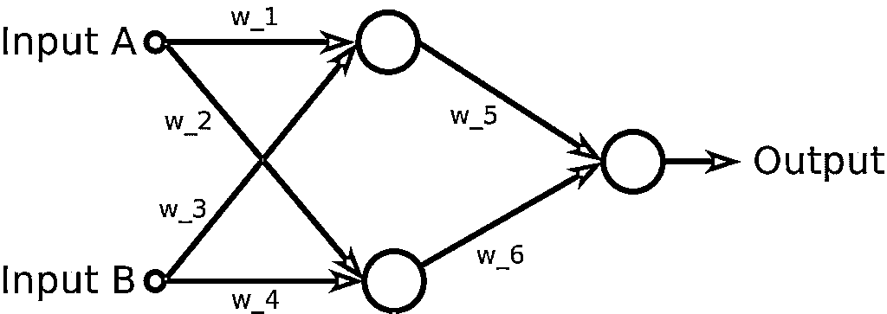

# 在 Windows 上为机器学习设置 Python

> 原文：<https://realpython.com/python-windows-machine-learning-setup/>

在过去的几年里，Python 已经被大量用于数值和科学应用。然而，为了以高效的方式执行数值计算，Python 依赖于外部库，有时是用其他语言实现的，比如部分使用 Fortran 语言实现的 [NumPy](http://www.numpy.org/) 库。

由于这些依赖性，有时为数值计算建立一个环境并链接所有必要的库并不容易。在涉及使用 Python 进行机器学习的研讨会上，人们很难让事情运转起来，这是很常见的，尤其是当他们使用的操作系统缺乏包管理系统时，例如 Windows。

**在本文中，您将:**

*   浏览在 Windows 操作系统上为数值计算设置 Python 环境的细节
*   介绍 Anaconda，这是一个 Python 发行版，旨在避免这些设置问题
*   了解如何在 Windows 机器上安装发行版并使用它的工具来管理包和环境
*   使用已安装的 Python 堆栈来构建神经网络，并对其进行训练以解决经典的分类问题

**免费奖励:** [点击此处获取 Conda 备忘单](https://realpython.com/bonus/conda-cheatsheet/)，其中包含管理您的 Python 环境和包的便捷使用示例。

## 介绍蟒蛇和康达

从 2011 年开始，Python 包含了 [`pip`](https://pypi.org/project/pip/) ，一个用来安装和管理用 Python 编写的软件包的包管理系统。然而，对于数值计算，有几个依赖关系不是用 Python 写的，所以最初发布的 [`pip`](https://realpython.com/courses/what-is-pip/) 不能自己解决问题。

为了解决这个问题，Continuum Analytics 发布了专注于科学应用的 Python 发行版 [Anaconda](https://www.anaconda.com/distribution/) ，以及 Anaconda 发行版使用的软件包和环境管理系统 [Conda](https://conda.io/) 。值得注意的是， [`pip`](https://realpython.com/what-is-pip/) 的最新版本可以使用[轮子](https://www.python.org/dev/peps/pep-0427/)处理外部依赖，但是，通过使用 Anaconda，您将能够更顺利地安装数据科学的关键库。(你可以在这里阅读更多关于这个讨论[。)](http://jakevdp.github.io/blog/2016/08/25/conda-myths-and-misconceptions/#Myth-#6:-Now-that-pip-uses-wheels,-conda-is-no-longer-necessary)

尽管 Conda 与 Anaconda Python 发行版紧密耦合，但两者是具有不同目标的不同项目:

*   **[Anaconda](https://www.anaconda.com/distribution/)** 是该软件在 [PyData](https://pydata.org/) 生态系统中的完整发行版，包括 Python 本身以及几个第三方开源项目的二进制文件。除了 Anaconda 之外，还有 [Miniconda](https://conda.io/miniconda.html) ，这是一个最小的 Python 发行版，基本上包括 conda 及其依赖项，因此您可以从头开始只安装您需要的包

*   **[Conda](https://conda.io)** 是一个包、依赖和环境管理系统，可以在没有 Anaconda 或 Miniconda 发行版的情况下安装。它运行在 Windows、macOS 和 Linux 上，是为 Python 程序创建的，但它可以为任何语言打包和分发软件。主要目的是通过下载软件的预编译版本，以一种简单的方式解决外部依赖性问题。

    从这个意义上说，它更像是通用软件包管理器的跨平台版本，如 [APT](https://en.wikipedia.org/wiki/APT_(Debian)) 或 [YUM](https://en.wikipedia.org/wiki/Yum_(software)) ，它以一种语言无关的方式帮助找到并安装软件包。此外，Conda 是一个环境管理器，所以如果您需要一个需要不同版本 Python 的包，通过使用 Conda，可以用完全不同的 Python 版本建立一个单独的环境，在您的默认环境中保持您通常的 Python 版本。

有很多关于为 Python 生态系统创建另一个包管理系统的讨论。值得一提的是，Conda 的创造者将 Python 标准打包推到了极限，只有在明确这是唯一合理的前进方式时，才创建第二个工具。

奇怪的是，就连吉多·范·罗苏姆在 2012 年 PyData meetup 的开幕演讲中也说，当谈到打包时，“与更大的 Python 社区相比，你的需求听起来真的很不寻常，所以你最好建立自己的需求。”(大家可以看一段[这个讨论](https://www.youtube.com/watch?v=QjXJLVINsSA&feature=youtu.be&t=3555)的视频。)关于这次讨论的更多信息可以在[这里](http://jakevdp.github.io/blog/2016/08/25/conda-myths-and-misconceptions/#Myth-#4:-Creating-conda-in-the-first-place-was-irresponsible-&-divisive)和[这里](http://technicaldiscovery.blogspot.com/2013/12/why-i-promote-conda.html)找到。

Anaconda 和 Miniconda 已经成为最流行的 Python 发行版，广泛用于各种公司和研究实验室的数据科学和机器学习。它们是免费的开源项目，目前在库中包含 1400 多个包。在下一节中，我们将介绍如何在 Windows 机器上安装 Miniconda Python 发行版。

[*Remove ads*](/account/join/)

## 安装 Miniconda Python 发行版

在本节中，您将逐步了解如何在 Windows 上设置 data science Python 环境。与完整的 Anaconda 发行版不同，您将使用 Miniconda 来建立一个只包含 conda 及其依赖项的最小环境，并使用它来安装必要的包。

**注意:**要在 Windows 上设置通用 Python 编程环境，请查看 Real Python 的[设置指南](https://realpython.com/python-coding-setup-windows/)。

Miniconda 和 Anaconda 的安装过程非常相似。基本的区别在于，Anaconda 提供了一个包含许多预安装包的环境，其中许多包从未被使用过。(可以在这里查看列表[。)Miniconda 是极简的、干净的，它允许您轻松地安装 Anaconda 的任何包。](https://docs.anaconda.com/anaconda/packages/py3.6_win-64)

在本文中，重点将是使用命令行界面(CLI)来设置包和环境。然而，如果你愿意，也可以使用 Conda 来安装 [Anaconda Navigator](https://docs.anaconda.com/anaconda/navigator/) ，一个图形用户界面(GUI)。

Miniconda 可以使用安装程序进行安装[这里](https://conda.io/miniconda.html)。您会注意到有 Windows、macOS 和 Linux 以及 32 位或 64 位操作系统的安装程序。您应该根据您的 Windows 安装考虑合适的架构，并下载 Python 3.x 版本(在撰写本文时，是 3.7)。

没有理由再在一个新项目中使用 Python 2，如果您正在进行的某个项目确实需要 Python 2，由于某些库尚未更新，即使您安装了 Miniconda Python 3.x 发行版，也可以使用 Conda 建立 Python 2 环境，您将在下一节看到这一点。

下载完成后，您只需运行安装程序并遵循安装步骤:

*   点击欢迎屏幕上的*下一个*:

[](https://files.realpython.com/media/miniconda_installer_1.8e05d1208356.png)

*   点击*我同意*同意许可条款:

[](https://files.realpython.com/media/miniconda_installer_2.0541a4c97d48.png)

*   选择安装类型，点击*下一步*。使用 Anaconda 或 Miniconda 的另一个优点是可以使用本地帐户安装发行版。(没有必要拥有管理员帐户。)如果是这种情况，选择*就我*。否则，如果您有管理员帐户，您可以选择*所有用户*:

[](https://files.realpython.com/media/miniconda_installer_3.7deacd2d6e61.png)

*   选择安装位置，点击下一步的*。如果你选择只为自己安装，默认位置将是你的用户的个人文件夹下的文件夹 *Miniconda3* 。重要的是不要在 Miniconda 路径中的文件夹名称中使用空格，因为许多 Python 包在文件夹名称中使用空格时会出现问题:*

[](https://files.realpython.com/media/miniconda_installer_4.9eee34622f05.png)

*   在*高级安装选项*中，建议使用默认选项，即不要将 Anaconda 添加到 PATH 环境变量中，并将 Anaconda 注册为默认 Python。点击*安装*开始安装:

[](https://files.realpython.com/media/miniconda_installer_5.8c8633be4ae6.png)

*   安装程序正在复制文件，请稍候:

[](https://files.realpython.com/media/miniconda_installer_6.769a977abed5.png)

*   安装完成后，点击下一个的*:*

[](https://files.realpython.com/media/miniconda_installer_7.5794961b1a9d.png)

*   点击*完成*完成安装并关闭安装程序:

[](https://files.realpython.com/media/miniconda_installer_8.9c04f88bc142.png)

因为 Anaconda 没有包含在 PATH 环境变量中，所以它的命令在 Windows 默认命令提示符下不起作用。要使用该发行版，您应该启动它自己的命令提示符，这可以通过点击开始按钮和 *Anaconda3 (64 位)*下的 *Anaconda 提示符*来完成:

[](https://files.realpython.com/media/anaconda_prompt_start.7e8fc1f5a8c2.png)

当提示符打开时，您可以通过运行`conda --version`来检查 Conda 是否可用:

```py
(base) C:\Users\IEUser>conda --version
conda 4.5.11
```

要获得关于安装的更多信息，您可以运行`conda info`:

```py
(base) C:\Users\IEUser>conda info

 active environment : base
 active env location : C:\Users\IEUser\Miniconda3
 shell level : 1
 user config file : C:\Users\IEUser\.condarc
 populated config files : C:\Users\IEUser\.condarc
 conda version : 4.5.11
 conda-build version : not installed
 python version : 3.7.0.final.0
 base environment : C:\Users\IEUser\Miniconda3  (writable)
 channel URLs : https://repo.anaconda.com/pkgs/main/win-64
 https://repo.anaconda.com/pkgs/main/noarch
 https://repo.anaconda.com/pkgs/free/win-64
 https://repo.anaconda.com/pkgs/free/noarch
 https://repo.anaconda.com/pkgs/r/win-64
 https://repo.anaconda.com/pkgs/r/noarch
 https://repo.anaconda.com/pkgs/pro/win-64
 https://repo.anaconda.com/pkgs/pro/noarch
 https://repo.anaconda.com/pkgs/msys2/win-64
 https://repo.anaconda.com/pkgs/msys2/noarch
 package cache : C:\Users\IEUser\Miniconda3\pkgs
 C:\Users\IEUser\AppData\Local\conda\conda\pkgs
 envs directories : C:\Users\IEUser\Miniconda3\envs
 C:\Users\IEUser\AppData\Local\conda\conda\envs
 C:\Users\IEUser\.conda\envs
 platform : win-64
 user-agent : conda/4.5.11 requests/2.19.1 CPython/3.7.0 Windows/10 Windows/10.0.17134
 administrator : False
 netrc file : None
 offline mode : False
```

现在您已经安装了 Miniconda，让我们看看 conda 环境是如何工作的。

[*Remove ads*](/account/join/)

## 了解康达环境

当您从头开始开发项目时，建议您使用所需库的最新版本。然而，当使用其他人的项目时，比如运行来自 [Kaggle](https://www.kaggle.com/) 或 [Github](https://github.com/) 的示例时，由于兼容性问题，您可能需要安装特定版本的包，甚至另一个版本的 Python。

当您尝试运行一个很久以前开发的应用程序时，也可能会出现这个问题，该应用程序使用了一个特定的库版本，但由于更新，该版本不再适用于您的应用程序。

虚拟环境是这类问题的解决方案。通过使用它们，可以创建多个环境，每个环境都有不同版本的包。一个典型的 Python 设置包括 [Virtualenv](https://virtualenv.pypa.io/en/stable/#) ，这是一个创建隔离的 Python 虚拟环境的工具，在 Python 社区中广泛使用。

Conda 包括自己的环境管理器，并提供了一些优于 Virtualenv 的优势，特别是在数值应用程序方面，例如管理非 Python 依赖项的能力和管理不同版本 Python 的能力，这是 Virtualenv 所不具备的。除此之外，Conda 环境完全兼容默认的 [Python 包](https://realpython.com/python-modules-packages/)，可以使用`pip`安装。

Miniconda 安装提供了 conda 和一个根环境，其中安装了一个 Python 版本和一些基本包。除了这个根环境之外，还可以设置其他环境，包括不同版本的 Python 和包。

使用 Anaconda 提示符，可以通过运行`conda env list`来检查可用的 conda 环境:

```py
(base) C:\Users\IEUser>conda env list
# conda environments:
#
base                  *  C:\Users\IEUser\Miniconda3
```

这个基础环境是根环境，由 Miniconda 安装程序创建。可以通过运行`conda create --name otherenv`来创建另一个名为`otherenv`的环境:

```py
(base) C:\Users\IEUser>conda create --name otherenv
Solving environment: done

## Package Plan ##

 environment location: C:\Users\IEUser\Miniconda3\envs\otherenv

Proceed ([y]/n)? y

Preparing transaction: done
Verifying transaction: done
Executing transaction: done
#
# To activate this environment, use
#
#     $ conda activate otherenv
#
# To deactivate an active environment, use
#
#     $ conda deactivate
```

正如环境创建过程完成后所通知的，可以通过运行`conda activate otherenv`来激活`otherenv`环境。您会注意到，通过提示符开头括号中的指示，环境已经发生了变化:

```py
(base) C:\Users\IEUser>conda activate otherenv

(otherenv) C:\Users\IEUser>
```

您可以在这个环境中通过运行`python`来打开 Python 解释器:

```py
(otherenv) C:\Users\IEUser>python
Python 3.7.0 (default, Jun 28 2018, 08:04:48) [MSC v.1912 64 bit (AMD64)] :: Anaconda, Inc. on win32
Type "help", "copyright", "credits" or "license" for more information.
>>>
```

该环境包括 Python 3.7.0，与 root base 环境中包含的版本相同。要退出 Python 解释器，只需运行`quit()`:

```py
>>> quit()

(otherenv) C:\Users\IEUser>
```

要停用`otherenv`环境并返回到根基础环境，您应该运行`deactivate`:

```py
(otherenv) C:\Users\IEUser>deactivate

(base) C:\Users\IEUser>
```

如前所述，Conda 允许您使用不同版本的 Python 轻松创建环境，这对于 Virtualenv 来说并不简单。要在一个环境中包含不同的 Python 版本，您必须在运行`conda create`时使用`python=<version>`来指定它。例如，要用 Python 2.7 创建一个名为`py2`的环境，您必须运行`conda create --name py2 python=2.7`:

```py
(base) C:\Users\IEUser>conda create --name py2 python=2.7
Solving environment: done

## Package Plan ##

 environment location: C:\Users\IEUser\Miniconda3\envs\py2

 added / updated specs:
 - python=2.7

The following NEW packages will be INSTALLED:

 certifi:        2018.8.24-py27_1
 pip:            10.0.1-py27_0
 python:         2.7.15-he216670_0
 setuptools:     40.2.0-py27_0
 vc:             9-h7299396_1
 vs2008_runtime: 9.00.30729.1-hfaea7d5_1
 wheel:          0.31.1-py27_0
 wincertstore:   0.2-py27hf04cefb_0

Proceed ([y]/n)? y

Preparing transaction: done
Verifying transaction: done
Executing transaction: done
#
# To activate this environment, use
#
#     $ conda activate py2
#
# To deactivate an active environment, use
#
#     $ conda deactivate

(base) C:\Users\IEUser>
```

如`conda create`的输出所示，这次安装了一些新的包，因为新环境使用 Python 2。您可以通过激活新环境并运行 Python 解释器来检查新环境是否确实使用了 Python 2:

```py
(base) C:\Users\IEUser>conda activate py2

(py2) C:\Users\IEUser>python
Python 2.7.15 |Anaconda, Inc.| (default, May  1 2018, 18:37:09) [MSC v.1500 64 bit (AMD64)] on win32
Type "help", "copyright", "credits" or "license" for more information.
>>>
```

现在，如果您运行`conda env list`，除了根基础环境之外，您应该看到创建的两个环境:

```py
(py2) C:\Users\IEUser>conda env list
# conda environments:
#
base                     C:\Users\IEUser\Miniconda3
otherenv                 C:\Users\IEUser\Miniconda3\envs\otherenv
py2               *  C:\Users\IEUser\Miniconda3\envs\py2

(py2) C:\Users\IEUser>
```

在列表中，星号表示已激活的环境。可以通过运行`conda remove --name <environment name> --all`删除环境。由于无法移除已激活的环境，您应该首先停用`py2`环境，以移除它:

```py
(py2) C:\Users\IEUser>deactivate

(base) C:\Users\IEUser>conda remove --name py2 --all

Remove all packages in environment C:\Users\IEUser\Miniconda3\envs\py2:

## Package Plan ##

 environment location: C:\Users\IEUser\Miniconda3\envs\py2

The following packages will be REMOVED:

 certifi:        2018.8.24-py27_1
 pip:            10.0.1-py27_0
 python:         2.7.15-he216670_0
 setuptools:     40.2.0-py27_0
 vc:             9-h7299396_1
 vs2008_runtime: 9.00.30729.1-hfaea7d5_1
 wheel:          0.31.1-py27_0
 wincertstore:   0.2-py27hf04cefb_0

Proceed ([y]/n)? y

(base) C:\Users\IEUser>
```

现在您已经介绍了使用 Conda 管理环境的基础知识，让我们看看如何在环境中管理包。

[*Remove ads*](/account/join/)

## 使用 Conda 了解基本包管理

在每个环境中，可以使用 Conda 软件包管理器安装软件包。默认情况下，Miniconda 安装程序创建的根基础环境包括一些不属于 Python 标准库的包。

默认安装包括使用 Conda 所需的最小软件包。要检查环境中已安装软件包的列表，您只需确保它已被激活并运行`conda list`。在根环境中，默认情况下会安装以下软件包:

```py
(base) C:\Users\IEUser>conda list
# packages in environment at C:\Users\IEUser\Miniconda3:
#
# Name                    Version                   Build  Channel
asn1crypto                0.24.0                   py37_0
ca-certificates           2018.03.07                    0
certifi                   2018.8.24                py37_1
cffi                      1.11.5           py37h74b6da3_1
chardet                   3.0.4                    py37_1
conda                     4.5.11                   py37_0
conda-env                 2.6.0                         1
console_shortcut          0.1.1                         3
cryptography              2.3.1            py37h74b6da3_0
idna                      2.7                      py37_0
menuinst                  1.4.14           py37hfa6e2cd_0
openssl                   1.0.2p               hfa6e2cd_0
pip                       10.0.1                   py37_0
pycosat                   0.6.3            py37hfa6e2cd_0
pycparser                 2.18                     py37_1
pyopenssl                 18.0.0                   py37_0
pysocks                   1.6.8                    py37_0
python                    3.7.0                hea74fb7_0
pywin32                   223              py37hfa6e2cd_1
requests                  2.19.1                   py37_0
ruamel_yaml               0.15.46          py37hfa6e2cd_0
setuptools                40.2.0                   py37_0
six                       1.11.0                   py37_1
urllib3                   1.23                     py37_0
vc                        14                   h0510ff6_3
vs2015_runtime            14.0.25123                    3
wheel                     0.31.1                   py37_0
win_inet_pton             1.0.1                    py37_1
wincertstore              0.2                      py37_0
yaml                      0.1.7                hc54c509_2

(base) C:\Users\IEUser>
```

要管理这些包，您还应该使用 Conda。接下来，让我们看看如何使用 Conda 搜索、安装、更新和删除软件包。

### 搜索和安装包

软件包由 Conda 从名为**通道**的库安装，一些默认通道由安装程序配置。要搜索特定的包，可以运行`conda search <package name>`。例如，这是你如何搜索`keras`包(一个机器学习库):

```py
(base) C:\Users\IEUser>conda search keras
Loading channels: done
# Name                  Version           Build  Channel
keras                     2.0.8  py35h15001cb_0  pkgs/main
keras                     2.0.8  py36h65e7a35_0  pkgs/main
keras                     2.1.2          py35_0  pkgs/main
keras                     2.1.2          py36_0  pkgs/main
keras                     2.1.3          py35_0  pkgs/main
keras                     2.1.3          py36_0  pkgs/main

... (more)
```

根据前面的输出，包有不同的版本，每个版本有不同的 builds，比如 Python 3.5 和 3.6。

之前的搜索只显示名为`keras`的包的精确匹配。要执行更广泛的搜索，包括名称中包含`keras`的所有包，您应该使用通配符`*`。例如，当您运行`conda search *keras*`时，您会得到以下结果:

```py
(base) C:\Users\IEUser>conda search *keras*
Loading channels: done
# Name                  Version           Build  Channel
keras                     2.0.8  py35h15001cb_0  pkgs/main
keras                     2.0.8  py36h65e7a35_0  pkgs/main
keras                     2.1.2          py35_0  pkgs/main
keras                     2.1.2          py36_0  pkgs/main
keras                     2.1.3          py35_0  pkgs/main
keras                     2.1.3          py36_0  pkgs/main

... (more)

keras-applications           1.0.2          py35_0  pkgs/main
keras-applications           1.0.2          py36_0  pkgs/main
keras-applications           1.0.4          py35_0  pkgs/main

... (more)

keras-base                2.2.0          py35_0  pkgs/main
keras-base                2.2.0          py36_0  pkgs/main

... (more)
```

正如前面的输出所示，默认通道中还有一些其他与 keras 相关的包。

要安装一个包，你应该运行`conda install <package name>`。默认情况下，最新版本的软件包将安装在活动环境中。所以，让我们在您已经创建的环境`otherenv`中安装软件包`keras`:

```py
(base) C:\Users\IEUser>conda activate otherenv

(otherenv) C:\Users\IEUser>conda install keras
Solving environment: done

## Package Plan ##

 environment location: C:\Users\IEUser\Miniconda3\envs\otherenv

 added / updated specs:
 - keras

The following NEW packages will be INSTALLED:

 _tflow_1100_select:  0.0.3-mkl
 absl-py:             0.4.1-py36_0
 astor:               0.7.1-py36_0
 blas:                1.0-mkl
 certifi:             2018.8.24-py36_1
 gast:                0.2.0-py36_0
 grpcio:              1.12.1-py36h1a1b453_0
 h5py:                2.8.0-py36h3bdd7fb_2
 hdf5:                1.10.2-hac2f561_1
 icc_rt:              2017.0.4-h97af966_0
 intel-openmp:        2018.0.3-0
 keras:               2.2.2-0
 keras-applications:  1.0.4-py36_1
 keras-base:          2.2.2-py36_0
 keras-preprocessing: 1.0.2-py36_1
 libmklml:            2018.0.3-1
 libprotobuf:         3.6.0-h1a1b453_0
 markdown:            2.6.11-py36_0
 mkl:                 2019.0-117
 mkl_fft:             1.0.4-py36h1e22a9b_1
 mkl_random:          1.0.1-py36h77b88f5_1
 numpy:               1.15.1-py36ha559c80_0
 numpy-base:          1.15.1-py36h8128ebf_0
 pip:                 10.0.1-py36_0
 protobuf:            3.6.0-py36he025d50_0
 python:              3.6.6-hea74fb7_0
 pyyaml:              3.13-py36hfa6e2cd_0
 scipy:               1.1.0-py36h4f6bf74_1
 setuptools:          40.2.0-py36_0
 six:                 1.11.0-py36_1
 tensorboard:         1.10.0-py36he025d50_0
 tensorflow:          1.10.0-mkl_py36hb361250_0
 tensorflow-base:     1.10.0-mkl_py36h81393da_0
 termcolor:           1.1.0-py36_1
 vc:                  14-h0510ff6_3
 vs2013_runtime:      12.0.21005-1
 vs2015_runtime:      14.0.25123-3
 werkzeug:            0.14.1-py36_0
 wheel:               0.31.1-py36_0
 wincertstore:        0.2-py36h7fe50ca_0
 yaml:                0.1.7-hc54c509_2
 zlib:                1.2.11-h8395fce_2

Proceed ([y]/n)?
```

Conda 在安装包时管理包的必要依赖项。由于包`keras`有很多依赖项，当你安装它时，Conda 设法安装这个大的包列表。

值得注意的是，由于`keras`包的最新版本使用 Python 3.6，而`otherenv`环境是使用 Python 3.7 创建的，所以`python`包 3.6.6 版作为一个依赖项被包含进来。确认安装后，可以检查一下`otherenv`环境的 Python 版本是否降级到了 3.6.6 版本。

有时，您不希望包被降级，最好是用必要的 Python 版本创建一个新环境。要在不安装软件包的情况下检查软件包所需的新软件包、更新和降级列表，您应该使用参数`--dry-run`。例如，要检查安装包`keras`将会改变的包，您应该运行以下命令:

```py
(otherenv) C:\Users\IEUser>conda install keras --dry-run
```

然而，如果有必要，可以通过安装特定版本的包`python`来更改 Conda 环境的默认 Python。为了演示这一点，让我们创建一个名为`envpython`的新环境:

```py
(otherenv) C:\Users\IEUser>conda create --name envpython
Solving environment: done

## Package Plan ##

 environment location: C:\Users\IEUser\Miniconda3\envs\envpython

Proceed ([y]/n)? y

Preparing transaction: done
Verifying transaction: done
Executing transaction: done
#
# To activate this environment, use
#
#     $ conda activate envpython
#
# To deactivate an active environment, use
#
#     $ conda deactivate
```

如您之前所见，由于根基础环境使用 Python 3.7，因此创建了包含相同版本 Python 的`envpython`:

```py
(base) C:\Users\IEUser>conda activate envpython

(envpython) C:\Users\IEUser>python
Python 3.7.0 (default, Jun 28 2018, 08:04:48) [MSC v.1912 64 bit (AMD64)] :: Anaconda, Inc. on win32
Type "help", "copyright", "credits" or "license" for more information.
>>> quit()

(envpython) C:\Users\IEUser>
```

要安装软件包的特定版本，可以运行`conda install <package name>=<version>`。例如，这是您在`envpython`环境中安装 Python 3.6 的方式:

```py
(envpython) C:\Users\IEUser>conda install python=3.6
Solving environment: done

## Package Plan ##

 environment location: C:\Users\IEUser\Miniconda3\envs\envpython

 added / updated specs:
 - python=3.6

The following NEW packages will be INSTALLED:

 certifi:        2018.8.24-py36_1
 pip:            10.0.1-py36_0
 python:         3.6.6-hea74fb7_0
 setuptools:     40.2.0-py36_0
 vc:             14-h0510ff6_3
 vs2015_runtime: 14.0.25123-3
 wheel:          0.31.1-py36_0
 wincertstore:   0.2-py36h7fe50ca_0

Proceed ([y]/n)?
```

如果您需要在一个环境中安装多个包，可以只运行`conda install`一次，传递包的名称。为了说明这一点，让我们安装`numpy`、`scipy`和`matplotlib`，在 root base 环境中进行数值计算的基本包:

```py
(envpython) C:\Users\IEUser>deactivate

(base) C:\Users\IEUser>conda install numpy scipy matplotlib
Solving environment: done

## Package Plan ##

 environment location: C:\Users\IEUser\Miniconda3

 added / updated specs:
 - matplotlib
 - numpy
 - scipy

The following packages will be downloaded:

 package                    |            build
 ---------------------------|-----------------
 libpng-1.6.34              |       h79bbb47_0         1.3 MB
 mkl_random-1.0.1           |   py37h77b88f5_1         267 KB
 intel-openmp-2019.0        |              117         1.7 MB
 qt-5.9.6                   |   vc14h62aca36_0        92.5 MB
 matplotlib-2.2.3           |   py37hd159220_0         6.5 MB
 tornado-5.1                |   py37hfa6e2cd_0         668 KB
 pyqt-5.9.2                 |   py37ha878b3d_0         4.6 MB
 pytz-2018.5                |           py37_0         232 KB
 scipy-1.1.0                |   py37h4f6bf74_1        13.5 MB
 jpeg-9b                    |       hb83a4c4_2         313 KB
 python-dateutil-2.7.3      |           py37_0         260 KB
 numpy-base-1.15.1          |   py37h8128ebf_0         3.9 MB
 numpy-1.15.1               |   py37ha559c80_0          37 KB
 mkl_fft-1.0.4              |   py37h1e22a9b_1         120 KB
 kiwisolver-1.0.1           |   py37h6538335_0          61 KB
 pyparsing-2.2.0            |           py37_1          96 KB
 cycler-0.10.0              |           py37_0          13 KB
 freetype-2.9.1             |       ha9979f8_1         470 KB
 icu-58.2                   |       ha66f8fd_1        21.9 MB
 sqlite-3.24.0              |       h7602738_0         899 KB
 sip-4.19.12                |   py37h6538335_0         283 KB
 ------------------------------------------------------------
 Total:       149.5 MB

The following NEW packages will be INSTALLED:

 blas:            1.0-mkl
 cycler:          0.10.0-py37_0
 freetype:        2.9.1-ha9979f8_1
 icc_rt:          2017.0.4-h97af966_0
 icu:             58.2-ha66f8fd_1
 intel-openmp:    2019.0-117
 jpeg:            9b-hb83a4c4_2
 kiwisolver:      1.0.1-py37h6538335_0
 libpng:          1.6.34-h79bbb47_0
 matplotlib:      2.2.3-py37hd159220_0
 mkl:             2019.0-117
 mkl_fft:         1.0.4-py37h1e22a9b_1
 mkl_random:      1.0.1-py37h77b88f5_1
 numpy:           1.15.1-py37ha559c80_0
 numpy-base:      1.15.1-py37h8128ebf_0
 pyparsing:       2.2.0-py37_1
 pyqt:            5.9.2-py37ha878b3d_0
 python-dateutil: 2.7.3-py37_0
 pytz:            2018.5-py37_0
 qt:              5.9.6-vc14h62aca36_0
 scipy:           1.1.0-py37h4f6bf74_1
 sip:             4.19.12-py37h6538335_0
 sqlite:          3.24.0-h7602738_0
 tornado:         5.1-py37hfa6e2cd_0
 zlib:            1.2.11-h8395fce_2

Proceed ([y]/n)?
```

既然你已经介绍了如何搜索和安装软件包，让我们看看如何使用 Conda 更新和删除它们。

[*Remove ads*](/account/join/)

### 更新和删除软件包

有时候，当新的包发布时，你需要更新它们。为此，您可以运行`conda update <package name>`。如果您希望更新一个环境中的所有包，您应该激活该环境并运行`conda update --all`。

要删除一个包，可以运行`conda remove <package name>`。例如，这是从根基础环境中删除`numpy`的方法:

```py
(base) C:\Users\IEUser>conda remove numpy
Solving environment: done

## Package Plan ##

 environment location: C:\Users\IEUser\Miniconda3

 removed specs:
 - numpy

The following packages will be REMOVED:

 matplotlib: 2.2.3-py37hd159220_0
 mkl_fft:    1.0.4-py37h1e22a9b_1
 mkl_random: 1.0.1-py37h77b88f5_1
 numpy:      1.15.1-py37ha559c80_0
 scipy:      1.1.0-py37h4f6bf74_1

Proceed ([y]/n)?
```

值得注意的是，当您删除一个包时，所有依赖于它的包也会被删除。

### 使用频道

有时，您在安装程序配置的默认频道上找不到您想要安装的软件包。例如，这是你如何安装 [`pytorch`](https://realpython.com/pytorch-vs-tensorflow/) ，另一个机器学习包:

```py
(base) C:\Users\IEUser>conda search pytorch
Loading channels: done

PackagesNotFoundError: The following packages are not available from current channels:

 - pytorch

Current channels:

 - https://repo.anaconda.com/pkgs/main/win-64
 - https://repo.anaconda.com/pkgs/main/noarch
 - https://repo.anaconda.com/pkgs/free/win-64
 - https://repo.anaconda.com/pkgs/free/noarch
 - https://repo.anaconda.com/pkgs/r/win-64
 - https://repo.anaconda.com/pkgs/r/noarch
 - https://repo.anaconda.com/pkgs/pro/win-64
 - https://repo.anaconda.com/pkgs/pro/noarch
 - https://repo.anaconda.com/pkgs/msys2/win-64
 - https://repo.anaconda.com/pkgs/msys2/noarch

To search for alternate channels that may provide the conda package you're
looking for, navigate to

 https://anaconda.org

and use the search bar at the top of the page.
```

在这种情况下，您可以在这里搜索包[。如果你搜索`pytorch`，你会得到以下结果:](https://anaconda.org/search)

[](https://files.realpython.com/media/pytorch_anaconda_search.dcb73b6d552d.png)

频道`pytorch`有一个名为`pytorch`的包，版本为`0.4.1`。要从一个特定的频道安装一个包，你可以使用带有`conda install`的`-c <channel>`参数:

```py
(base) C:\Users\IEUser>conda install -c pytorch pytorch
Solving environment: done

## Package Plan ##

 environment location: C:\Users\IEUser\Miniconda3

 added / updated specs:
 - pytorch

The following packages will be downloaded:

 package                    |            build
 ---------------------------|-----------------
 pytorch-0.4.1              |py37_cuda90_cudnn7he774522_1       590.4 MB  pytorch

The following NEW packages will be INSTALLED:

 pytorch: 0.4.1-py37_cuda90_cudnn7he774522_1 pytorch

Proceed ([y]/n)?
```

或者，您可以添加通道，以便 Conda 使用它来搜索要安装的软件包。要列出当前使用的通道，您可以运行`conda config --get channels`:

```py
(base) C:\Users\IEUser>conda config --get channels
--add channels 'defaults'   # lowest priority

(base) C:\Users\IEUser>
```

Miniconda 安装程序仅包含`defaults`通道。当包含更多的通道时，有必要设置它们的优先级，以确定从哪个通道安装软件包，以防它可从多个通道获得。

要将优先级最低的频道添加到列表中，您应该运行`conda config --append channels <channel name>`。要将优先级最高的通道添加到列表中，您应该运行`conda config --prepend channels <channel name>`。建议添加低优先级的新通道，以便优先使用默认通道。因此，或者，您可以安装`pytorch`，添加`pytorch`通道并运行`conda install pytorch`:

```py
(base) C:\Users\IEUser>conda config --append channels pytorch

(base) C:\Users\IEUser>conda config --get channels
--add channels 'pytorch'   # lowest priority
--add channels 'defaults'   # highest priority

(base) C:\Users\IEUser>conda install pytorch
Solving environment: done

## Package Plan ##

 environment location: C:\Users\IEUser\Miniconda3

 added / updated specs:
 - pytorch

The following packages will be downloaded:

 package                    |            build
 ---------------------------|-----------------
 pytorch-0.4.1              |py37_cuda90_cudnn7he774522_1       590.4 MB  pytorch

The following NEW packages will be INSTALLED:

 pytorch: 0.4.1-py37_cuda90_cudnn7he774522_1 pytorch

Proceed ([y]/n)?
```

并非所有套餐都可以在康达频道上买到。然而，这不是问题，因为您也可以使用`pip`在 Conda 环境中安装包。让我们看看如何做到这一点。

### 在康达环境中使用`pip`

有时候，你可能需要纯 Python 包，一般来说，这些包在 Conda 的频道上是没有的。比如你搜索`unipath`，一个用 Python 处理文件路径的包，Conda 就找不到。

你可以在这里搜索包[并使用另一个通道来安装它。然而，由于`unipath`是一个纯 Python 包，您可以使用`pip`来安装它，就像您在常规 Python 设置中所做的那样。唯一不同的是你要用康达包`pip`安装的`pip`。为了说明这一点，让我们创建一个名为`newproject`的新环境。如前所述，你可以这样运行`conda create`:](https://anaconda.org/search)

```py
conda create --name newproject
```

接下来，要安装`pip`，您应该激活环境并安装 Conda 包`pip`:

```py
(base) C:\Users\IEUser>conda activate newproject

(newproject) C:\Users\IEUser>conda install pip
Solving environment: done

## Package Plan ##

 environment location: C:\Users\IEUser\Miniconda3\envs\newproject

 added / updated specs:
 - pip

The following NEW packages will be INSTALLED:

 certifi:        2018.8.24-py37_1
 pip:            10.0.1-py37_0
 python:         3.7.0-hea74fb7_0
 setuptools:     40.2.0-py37_0
 vc:             14-h0510ff6_3
 vs2015_runtime: 14.0.25123-3
 wheel:          0.31.1-py37_0
 wincertstore:   0.2-py37_0

Proceed ([y]/n)?
```

最后，使用`pip`安装包`unipath`:

```py
(newproject) C:\Users\IEUser>pip install unipath
Collecting unipath
Installing collected packages: unipath
Successfully installed unipath-1.1
You are using pip version 10.0.1, however version 18.0 is available.
You should consider upgrading via the 'python -m pip install --upgrade pip' command.

(newproject) C:\Users\IEUser>
```

安装后，您可以使用`conda list`列出已安装的软件包，并使用 pip 检查`Unipath`是否已安装:

```py
(newproject) C:\Users\IEUser>conda list
# packages in environment at C:\Users\IEUser\Miniconda3\envs\newproject:
#
# Name                    Version                   Build  Channel
certifi                   2018.8.24                py37_1
pip                       10.0.1                   py37_0
python                    3.7.0                hea74fb7_0
setuptools                40.2.0                   py37_0
Unipath                   1.1                       <pip>
vc                        14                   h0510ff6_3
vs2015_runtime            14.0.25123                    3
wheel                     0.31.1                   py37_0
wincertstore              0.2                      py37_0

(newproject) C:\Users\IEUser>
```

也可以使用`pip`从版本控制系统(VCS)安装软件包。例如，让我们安装`supervisor`，版本 4.0.0dev0，可以在 [Git](https://realpython.com/python-git-github-intro/) 库中获得。由于 Git 没有安装在`newproject`环境中，您应该首先安装它:

```py
(newproject) C:\Users\IEUser> conda install git
```

然后，安装`supervisor`，使用`pip`从 Git 存储库安装它:

```py
(newproject) pip install -e git://github.com/Supervisor/supervisor@abef0a2be35f4aae4a4edeceadb7a213b729ef8d#egg=supervisor
```

安装完成后，您可以看到`supervisor`列在已安装包列表中:

```py
(newproject) C:\Users\IEUser>conda list
#
# Name                    Version                   Build  Channel
certifi                   2018.8.24                py37_1
git                       2.18.0               h6bb4b03_0
meld3                     1.0.2                     <pip>
pip                       10.0.1                   py37_0
python                    3.7.0                hea74fb7_0
setuptools                40.2.0                   py37_0
supervisor                4.0.0.dev0                <pip>

... (more)
```

现在，您已经了解了使用 Conda 环境和管理软件包的基本知识，让我们创建一个简单的机器学习示例，使用神经网络解决一个经典问题。

[*Remove ads*](/account/join/)

## 一个简单的机器学习例子

在本节中，您将使用 Conda 设置环境，并训练神经网络像 [XOR](https://en.wikipedia.org/wiki/XOR_gate) 门一样工作。

异或门实现数字逻辑[异或运算](https://en.wikipedia.org/wiki/Exclusive_or)，广泛应用于数字系统中。它采用两个数字输入，可以等于代表数字**假**值的`0`或代表数字**真**值的`1`，如果输入不同，则输出`1` ( **真**)，如果输入相等，则输出`0` ( **假**)。下表(在数字系统术语中称为**真值表**)总结了 XOR 门的操作:

| 输入 A | 输入 B | 输出:A XOR B |
| --- | --- | --- |
| Zero | Zero | Zero |
| Zero | one | one |
| one | Zero | one |
| one | one | Zero |

XOR 运算可以被解释为一个分类问题，假设它采用两个输入，并且应该根据输入是彼此相等还是彼此不同将它们分类到由`0`或`1`表示的两个类别中的一个。

它通常用作训练神经网络的第一个例子，因为它简单，同时需要非线性分类器，例如神经网络。神经网络将仅使用来自真值表的数据，而不知道它来自哪里，来“学习”由 XOR 门执行的操作。

为了实现神经网络，让我们创建一个新的 Conda 环境，命名为`nnxor`:

```py
(base) C:\Users\IEUser>conda create --name nnxor
```

然后，让我们激活它并安装软件包`keras`:

```py
(base) C:\Users\IEUser>conda activate nnxor

(nnxor) C:\Users\IEUser>conda install keras
```

[`keras`](https://keras.io/) 是在著名的机器学习库之上制作易于实现的神经网络的高级 API，比如 [TensorFlow](https://www.tensorflow.org/) 。

您将训练以下神经网络充当 XOR 门:

[](https://files.realpython.com/media/nnxor.a334b7848a9b.png)

网络接受两个输入，A 和 B*和 T3，并将它们输入到两个神经元，用大圆圈表示。然后，它获取这两个神经元的输出，并将它们馈送到输出神经元，该输出神经元应该根据 XOR 真值表提供分类。*

简而言之，训练过程包括调整权重值 *w_1* 直到 *w_6* ，使得输出与 XOR 真值表一致。为此，将一次输入一个输入示例，将根据权重的当前值计算输出，通过将输出与真值表给出的期望输出进行比较，将逐步调整权重的值。

为了组织这个项目，您将在 Windows 用户文件夹(`C:\Users\IEUser`)中创建一个名为`nnxor`的文件夹，并使用一个名为`nnxor.py`的文件来存储实现神经网络的 Python 程序:

[](https://files.realpython.com/media/nnxor_file.799d361d9286.png)

在`nnxor.py`文件中，您将定义网络，执行训练，并测试它:

```py
import numpy as np
np.random.seed(444)

from keras.models import Sequential
from keras.layers.core import Dense, Activation
from keras.optimizers import SGD

X = np.array([[0, 0], 
              [0, 1],
              [1, 0],
              [1, 1]])
y = np.array([[0], [1], [1], [0]])

model = Sequential()
model.add(Dense(2, input_dim=2))
model.add(Activation('sigmoid'))
model.add(Dense(1))
model.add(Activation('sigmoid'))

sgd = SGD(lr=0.1)
model.compile(loss='mean_squared_error', optimizer=sgd)

model.fit(X, y, batch_size=1, epochs=5000)

if __name__ == '__main__':
    print(model.predict(X))
```

首先，您导入`numpy`，初始化一个随机种子，以便您可以在再次运行程序时重现相同的结果，并导入您将用来构建神经网络的`keras`对象。

然后，定义一个`X`数组，包含 XOR 运算的 4 个可能的 A-B 输入集，以及一个`y`数组，包含在`X`中定义的每个输入集的输出。

接下来的五行定义了神经网络。`Sequential()`模型是`keras`提供的用于定义神经网络的模型之一，其中网络的层是以顺序的方式定义的。然后定义第一层神经元，由两个神经元组成，由两个输入供电，将它们的激活函数定义为序列中的 [sigmoid 函数](https://en.wikipedia.org/wiki/Sigmoid_function)。最后，您定义由一个具有相同激活函数的神经元组成的输出层。

下面两行定义了网络训练的细节。为了调整网络的权重，您将使用学习速率等于`0.1`的[随机梯度下降](https://en.wikipedia.org/wiki/Stochastic_gradient_descent) (SGD)，并且您将使用[均方误差](https://en.wikipedia.org/wiki/Mean_squared_error)作为要最小化的损失函数。

最后，通过运行`fit()`方法来执行训练，使用`X`和`y`作为训练样本，并在每个训练样本被输入网络后更新权重(`batch_size=1`)。`epochs`的数字代表整个训练集将被用来训练神经网络的次数。

在这种情况下，您使用包含 4 个输入输出示例的训练集重复训练 5000 次。默认情况下，每次使用训练集时，都会打乱训练示例。

在最后一行，训练过程完成后，打印 4 个可能的输入示例的预测值。

通过运行此脚本，您将看到随着新的训练示例输入到网络中，训练过程的演变和性能的提高:

```py
(nnxor) C:\Users\IEUser>cd nnxor

(nnxor) C:\Users\IEUser\nnxor>python nnxor.py
Using TensorFlow backend.
Epoch 1/5000
2018-09-16 09:49:05.987096: I tensorflow/core/platform/cpu_feature_guard.cc:141] Your CPU supports instructions that this TensorFlow binary was not compiled to use: AVX AVX2
2018-09-16 09:49:05.993128: I tensorflow/core/common_runtime/process_util.cc:69] Creating new thread pool with default inter op setting: 2\. Tune using inter_op_parallelism_threads for best performance.
4/4 [==============================] - 0s 39ms/step - loss: 0.2565
Epoch 2/5000
4/4 [==============================] - 0s 0us/step - loss: 0.2566
Epoch 3/5000
4/4 [==============================] - 0s 0us/step - loss: 0.2566
Epoch 4/5000
4/4 [==============================] - 0s 0us/step - loss: 0.2566
Epoch 5/5000
4/4 [==============================] - 0s 0us/step - loss: 0.2566
Epoch 6/5000
4/4 [==============================] - 0s 0us/step - loss: 0.2566
```

训练完成后，您可以检查网络对可能输入值的预测:

```py
Epoch 4997/5000
4/4 [==============================] - 0s 0us/step - loss: 0.0034
Epoch 4998/5000
4/4 [==============================] - 0s 0us/step - loss: 0.0034
Epoch 4999/5000
4/4 [==============================] - 0s 0us/step - loss: 0.0034
Epoch 5000/5000
4/4 [==============================] - 0s 0us/step - loss: 0.0034
[[0.0587215 ]
 [0.9468337 ]
 [0.9323144 ]
 [0.05158457]]
```

正如您定义的`X = np.array([[0, 0], [0, 1], [1, 0], [1, 1]])`，预期输出值是`0`、`1`、`1`和`0`，这与网络的预测输出一致，假设您应该对它们进行舍入以获得二进制值。

[*Remove ads*](/account/join/)

## 何去何从

数据科学和机器学习应用正在最多样化的领域出现，吸引了更多的人。然而，为数值计算建立一个环境可能是一项复杂的任务，经常会发现用户在数据科学研讨会上遇到困难，尤其是在使用 Windows 时。

在本文中，您已经了解了使用 Anaconda Python 发行版在 Windows 机器上设置 Python 数值计算环境的基础。

**免费奖励:** [点击此处获取 Conda 备忘单](https://realpython.com/bonus/conda-cheatsheet/)，其中包含管理您的 Python 环境和包的便捷使用示例。

现在您已经有了一个工作环境，是时候开始使用一些应用程序了。Python 是数据科学和机器学习中使用最多的语言之一，Anaconda 是最受欢迎的发行版之一，用于各种公司和研究实验室。它提供了几个软件包来安装 Python 所依赖的用于数据获取、争论、处理和可视化的库。

幸运的是，在 Real Python 上有很多关于这些库的[教程，包括以下内容:](https://realpython.com/tutorials/data-science/)

*   [NumPy 教程](https://realpython.com/tutorials/numpy/)
*   [使用 Matplotlib 进行 Python 绘图(指南)](https://realpython.com/python-matplotlib-guide/)
*   [Python 直方图绘制:NumPy，Matplotlib，Pandas & Seaborn](https://realpython.com/python-histograms/)
*   [纯 Python vs NumPy vs TensorFlow 性能对比](https://realpython.com/numpy-tensorflow-performance/)
*   [蟒蛇熊猫:诡计&你可能不知道的特点](https://realpython.com/python-pandas-tricks/)
*   快速、灵活、简单、直观:如何加快你的熊猫项目
*   [用 NumPy 和 Pandas 清理 Pythonic 数据](https://realpython.com/python-data-cleaning-numpy-pandas/)

此外，如果您想更深入地了解 Anaconda 和 conda，请查看以下链接:

*   [为什么您需要 Python 环境以及如何使用 Conda 管理它们](https://medium.freecodecamp.org/why-you-need-python-environments-and-how-to-manage-them-with-conda-85f155f4353c)
*   [康达:神话和误解](http://jakevdp.github.io/blog/2016/08/25/conda-myths-and-misconceptions/)******