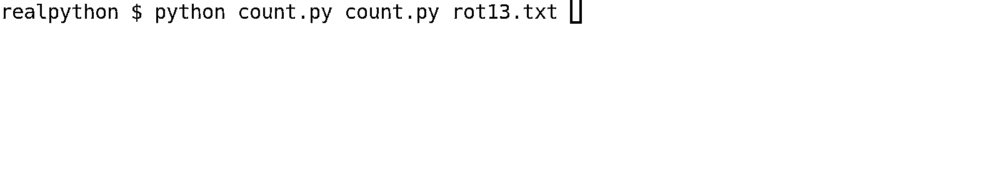
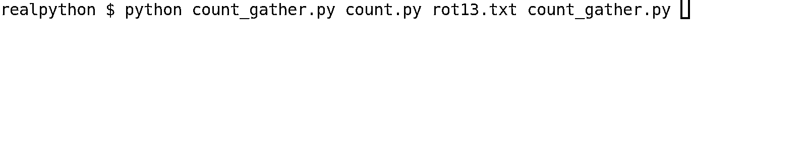

# Python 3.11 预览版:任务和异常组

> 原文：<https://realpython.com/python311-exception-groups/>

Python 3.11 将于 2022 年 10 月发布。尽管十月份还有几个月的时间，但是您已经可以预览一些即将到来的特性，包括 Python 3.11 必须提供的新任务和异常组。任务组可以让您更好地组织异步代码，而异常组可以收集同时发生的几个错误，并让您以直接的方式处理它们。

**在本教程中，您将:**

*   **在你的电脑上安装** Python 3.11 alpha，就在你当前安装的 Python 旁边
*   探索**异常组**如何组织几个不相关的错误
*   **过滤器**带有`except*`和**的异常组处理不同类型的**错误
*   使用**任务组**来设置你的**异步代码**
*   测试 Python 3.11 中较小的改进，包括**异常注释**和一个新的内部**异常表示**

Python 3.11 中还有许多其他的改进和特性。请查看变更日志中的[新增内容](https://docs.python.org/3.11/whatsnew/3.11.html)，获取最新列表。

**免费奖励:** [掌握 Python 的 5 个想法](https://realpython.com/bonus/python-mastery-course/)，这是一个面向 Python 开发者的免费课程，向您展示将 Python 技能提升到下一个水平所需的路线图和心态。

## Python 3.11 Alpha

Python 的新版本在每年 10 月发布。代码是在发布日期前[经过 17 个月的时间](https://www.python.org/dev/peps/pep-0602/)开发和测试的。新功能在 [alpha 阶段](https://en.wikipedia.org/wiki/Software_release_life_cycle#Alpha)实现，持续到五月，大约在最终发布前五个月。

大约每月[一次](https://www.python.org/dev/peps/pep-0664/)在 alpha 阶段，Python 的核心开发者发布一个新的 **alpha 版本**来展示新特性，测试它们，并获得早期反馈。目前 Python 3.11 的最新 alpha 版本是 **3.11.0a7** ，发布于 2022 年 4 月 5 日。

**注:**本教程使用的是 Python 3.11 的第七个 alpha 版本。如果您使用更高版本，可能会遇到一些小的差异。特别是，任务组实现的一些方面仍在讨论中。然而，你可以期望你在这里学到的大部分内容在 alpha 和 beta 阶段以及 Python 3.11 的最终版本中保持不变。

Python 3.11 的第一个 **beta 版本**即将发布，计划于 2022 年 5 月 6 日发布。通常，在[测试阶段](https://en.wikipedia.org/wiki/Software_release_life_cycle#Beta)不会添加新功能。相反，特性冻结和发布日期之间的时间被用来测试和固化代码。

[*Remove ads*](/account/join/)

### 很酷的新功能

Python 3.11 的一些最新亮点包括:

*   **异常组**，允许程序同时引发和处理多个异常
*   **任务组**，改善你如何运行异步代码
*   **增强的错误消息**，这将帮助你更有效地调试你的代码
*   **优化**，承诺使 Python 3.11 比以前的版本明显更快
*   **静态类型**的改进，这将让你[更精确地注释](https://realpython.com/python-type-checking/#annotations)你的代码
*   **TOML 支持**，它允许你使用标准库解析 TOML 文档

Python 3.11 有很多值得期待的地方！要获得全面的概述，请查看 [Python 3.11:供您尝试的酷新功能](https://realpython.com/python311-new-features/)。您还可以在本系列的其他文章中更深入地研究上面列出的一些特性:

*   [Python 3.11 预览版:更好的错误消息](https://realpython.com/python311-error-messages/)
*   [Python 3.11 预览版:TOML 和`tomllib`](https://realpython.com/python311-tomllib)

在本教程中，您将关注异常组如何一次处理多个不相关的异常，以及该特性如何为任务组铺平道路，从而使 Python 中的并发编程更加方便。您还将看到 Python 3.11 中其他一些更小的特性。

### 安装

要使用本教程中的代码示例，您需要在系统上安装 Python 3.11 版本。在这一小节中，你将学习几种不同的方法:使用 **Docker** ，使用 **pyenv** ，或者从**源**安装。选择最适合您和您的系统的一个。

**注意:** Alpha 版本是即将推出的功能的预览。虽然大多数特性都可以很好地工作，但是您不应该在生产中依赖任何 Python 3.11 alpha 版本，也不应该依赖任何潜在错误会带来严重后果的地方。

如果您可以在您的系统上访问 [Docker](https://docs.docker.com/get-docker/) ，那么您可以通过拉取并运行`python:3.11-rc-slim` [Docker 镜像](https://hub.docker.com/_/python)来下载最新版本的 Python 3.11:

```py
$ docker pull python:3.11-rc-slim
Unable to find image 'python:3.11-rc-slim' locally
latest: Pulling from library/python
[...]

$ docker run -it --rm python:3.11-rc-slim
```

这会将您带入 Python 3.11 REPL。查看 Docker 中的[运行 Python 版本，了解更多关于通过 Docker 使用 Python 的信息，包括如何运行脚本。](https://realpython.com/python-versions-docker/#running-python-in-a-docker-container)

[pyenv](https://realpython.com/intro-to-pyenv/) 工具非常适合管理系统上不同版本的 Python，如果你愿意，你可以用它来安装 Python 3.11 alpha。它有两个不同的版本，一个用于 Windows，一个用于 Linux 和 macOS。使用下面的切换器选择您的平台:

*   [*视窗*](#windows-1)
**   [**Linux + macOS**](#linux-macos-1)

**在 Windows 上，你可以使用 [pyenv-win](https://pyenv-win.github.io/pyenv-win/) 。首先更新您的`pyenv`安装:

```py
PS> pyenv update
:: [Info] ::  Mirror: https://www.python.org/ftp/python
[...]
```

进行更新可以确保您可以安装最新版本的 Python。你也可以[手动更新`pyenv`](https://pyenv-win.github.io/pyenv-win/#how-to-update-pyenv)。

在 Linux 和 macOS 上，可以使用 [pyenv](https://github.com/pyenv/pyenv) 。首先使用 [`pyenv-update`](https://github.com/pyenv/pyenv-update) 插件更新您的`pyenv`安装:

```py
$ pyenv update
Updating /home/realpython/.pyenv...
[...]
```

进行更新可以确保您可以安装最新版本的 Python。如果不想用更新插件，可以[手动更新`pyenv`](https://github.com/pyenv/pyenv#upgrading)。

使用`pyenv install --list`查看 Python 3.11 有哪些版本。然后，安装最新版本:

```py
$ pyenv install 3.11.0a7
Downloading Python-3.11.0a7.tar.xz...
[...]
```

安装可能需要几分钟时间。一旦你的新 alpha 版本安装完毕，你就可以创建一个[虚拟环境](https://realpython.com/python-virtual-environments-a-primer/)来玩它:

*   [*视窗*](#windows-2)
**   [**Linux + macOS**](#linux-macos-2)*

```py
PS> pyenv local 3.11.0a7
PS> python --version
Python 3.11.0a7

PS> python -m venv venv
PS> venv\Scripts\activate
```

您使用`pyenv local`激活您的 Python 3.11 版本，然后使用`python -m venv`设置虚拟环境。

```py
$ pyenv virtualenv 3.11.0a7 311_preview
$ pyenv activate 311_preview
(311_preview) $ python --version
Python 3.11.0a7
```

在 Linux 和 macOS 上，你使用 [`pyenv-virtualenv`](https://github.com/pyenv/pyenv-virtualenv) 插件来设置虚拟环境并激活它。

你也可以从[python.org](https://www.python.org/)的预发布版本中安装 Python。选择[最新预发布](https://www.python.org/download/pre-releases/)，向下滚动到页面底部的*文件*部分。下载并安装与您的系统对应的文件。更多信息参见 [Python 3 安装&设置指南](https://realpython.com/installing-python/)。

本教程中的许多示例将适用于旧版本的 Python，但一般来说，您应该使用 Python 3.11 可执行文件来运行它们。具体如何运行可执行文件取决于您的安装方式。如果您需要帮助，请参见关于 [Docker](https://realpython.com/python-versions-docker/#running-python-in-a-docker-container) 、 [pyenv](https://realpython.com/intro-to-pyenv/) 、[虚拟环境](https://realpython.com/python-virtual-environments-a-primer/)或[从源](https://realpython.com/installing-python/)安装的相关教程。

[*Remove ads*](/account/join/)

## Python 3.11 中的异常组和`except*`

处理[异常](https://realpython.com/python-exceptions/)是编程的重要部分。有时错误是因为代码中的错误而发生的。在这些情况下，[好的错误消息](https://realpython.com/python311-error-messages/)将帮助你有效地调试你的代码。其他时候，错误的发生并不是因为代码的错误。可能是用户试图打开一个损坏的文件，可能是网络中断，或者可能是数据库的身份验证丢失。

通常，一次只会发生一个错误。如果您的代码继续运行，可能会发生另一个错误。但是 Python 通常只会报告它遇到的第一个错误。但是，在某些情况下，一次报告几个错误是有意义的:

*   几个并发任务可能同时失败。
*   清理代码可能会导致它自己的错误。
*   代码可以尝试几种不同的方法，但都会引发异常。

在 Python 3.11 中，有了一个叫做**异常组**的新特性。它提供了一种将不相关的异常分组在一起的方法，并且提供了一种新的`except*`语法来处理它们。详细描述见 [PEP 654:异常组和`except*`](https://peps.python.org/pep-0654/) 。

PEP 654 由 CPython 的核心开发者之一 [Irit Katriel](https://github.com/iritkatriel) 编写并实现，得到了`asyncio`维护者 [Yury Selivanov](https://twitter.com/1st1) 和前 BDFL [吉多·范·罗苏姆](https://twitter.com/gvanrossum)的支持。它是在 2021 年 5 月的 [Python 语言峰会](https://pyfound.blogspot.com/2021/05/the-2021-python-language-summit-pep-654.html)上提出并讨论的。

本节将教您如何使用异常组。在下一节的[中，您将看到一个并发代码的实际例子，它使用异常组来同时引发和处理几个任务的错误。](#asynchronous-task-groups-in-python-311)

### 用`except` 处理常规异常

在探索异常组之前，您将回顾 Python 中常规异常处理的工作方式。如果您已经习惯了用 Python 处理错误，那么在这一小节中您不会学到任何新东西。然而，这篇综述将作为您稍后将了解的异常组的对比。您将在本教程的这一小节中看到的所有内容都适用于 Python 3 的所有版本，包括 Python 3.10。

异常打破了程序的正常流程。如果出现异常，Python 会丢弃其他所有东西，寻找处理错误的代码。如果没有这样的处理程序，那么不管程序在做什么，程序都会停止。

您可以使用`raise`关键字自己提出一个错误:

>>>

```py
>>> raise ValueError(654)
Traceback (most recent call last):
  ...
ValueError: 654
```

在这里，你用描述 [`654`](https://peps.python.org/pep-0654/#motivation) 明确地提出了一个`ValueError`。你可以看到 Python 提供了一个[回溯](https://realpython.com/python-traceback/)，它告诉你有一个未处理的错误。

有时，您会在代码中引发这样的错误，以表示出现了问题。然而，更常见的是遇到由 Python 本身或您正在使用的某个库引发的错误。例如，Python 不允许您添加一个字符串和一个整数，如果您尝试这样做，就会引发一个`TypeError`:

>>>

```py
>>> "3" + 11
Traceback (most recent call last):
  ...
TypeError: can only concatenate str (not "int") to str
```

大多数异常都有描述，可以帮助您找出问题所在。在这种情况下，它告诉你，你的第二项也应该是字符串。

你用 [`try` … `except`](https://realpython.com/python-exceptions/#the-try-and-except-block-handling-exceptions) 块来处理错误。有时，您使用这些只是记录错误并继续运行。其他时候，您设法从错误中恢复过来，或者计算一些替代值。

一个短的`try` … `except`块可能如下所示:

>>>

```py
>>> try:
...     raise ValueError(654)
... except ValueError as err:
...     print(f"Got a bad value: {err}")
...
Got a bad value: 654
```

您可以通过在控制台上打印一条消息来处理`ValueError`异常。注意，因为您处理了错误，所以在这个例子中没有回溯。但是，不处理其他类型的错误:

>>>

```py
>>> try:
...     "3" + 11
... except ValueError as err:
...     print(f"Got a bad value: {err}")
...
Traceback (most recent call last):
  ...
TypeError: can only concatenate str (not "int") to str
```

即使错误发生在`try` … `except`块中，它也不会被处理，因为没有与`TypeError`匹配的`except`子句。您可以在一个块中处理几种错误:

>>>

```py
>>> try:
...     "3" + 11
... except ValueError as err:
...     print(f"Got a bad value: {err}")
... except TypeError as err:
...     print(f"Got bad types: {err}")
...
Got bad types: can only concatenate str (not "int") to str
```

这个例子将处理`ValueError`和`TypeError`异常。

异常在[层级](https://docs.python.org/3/library/exceptions.html#exception-hierarchy)中定义。比如一个`ModuleNotFoundError`是一种`ImportError`，是一种`Exception`。

**注意:**因为大多数异常都是从`Exception`继承的，所以你可以通过只使用`except Exception`块来简化你的错误处理。这通常是个坏主意。您希望您的异常块尽可能具体，以避免意外错误的发生，并打乱您的错误处理。

匹配错误的第一个`except`子句将触发异常处理:

>>>

```py
>>> try:
...     import no_such_module
... except ImportError as err:
...     print(f"ImportError: {err.__class__}")
... except ModuleNotFoundError as err:
...     print(f"ModuleNotFoundError: {err.__class__}")
...
ImportError: <class 'ModuleNotFoundError'>
```

当你试图导入一个不存在的模块时，Python 会抛出一个`ModuleNotFoundError`。然而，由于`ModuleNotFoundError`是一种`ImportError`，您的错误处理触发了`except ImportError`子句。请注意:

*   最多会触发一个`except`子句
*   匹配的第一个`except`子句将被触发

如果您以前处理过异常，这可能看起来很直观。然而，稍后您将看到异常组的行为有所不同。

虽然一次最多只有一个异常是活动的，但是可以将相关的异常链接起来。这种链接是由 [PEP 3134](https://www.python.org/dev/peps/pep-3134/) 为 Python 3.0 引入的。例如，如果在处理错误时引发新的异常，观察会发生什么情况:

>>>

```py
>>> try:
...     "3" + 11
... except TypeError:
...     raise ValueError(654)
...
Traceback (most recent call last):
  ...
TypeError: can only concatenate str (not "int") to str

During handling of the above exception, another exception occurred: 
Traceback (most recent call last):
  ...
ValueError: 654
```

注意第`During handling of the above exception, another exception occurred`行。在这一行之前有一个回溯，代表由您的代码引起的最初的`TypeError`。然后，在这条线下面有另一个回溯，代表您在处理`TypeError`时引发的新的`ValueError`。

如果您的错误处理代码中碰巧有问题，这种行为特别有用，因为您可以获得关于原始错误和错误处理程序中的错误的信息。

您也可以使用一个 [`raise` … `from`语句](https://docs.python.org/3/tutorial/errors.html#exception-chaining)将异常显式地链接在一起。虽然您可以使用链式异常一次引发几个异常，但请注意，该机制适用于相关的异常，特别是在处理另一个异常时发生的异常。

这不同于异常组被设计来处理的用例。异常组将不相关的异常组合在一起，也就是说它们彼此独立发生。当处理链式异常时，您只能捕捉和处理链中的最后一个错误。您将很快了解到，您可以在一个异常组中捕获所有的异常。

[*Remove ads*](/account/join/)

### 用`ExceptionGroup` 分组异常

在这一小节中，您将探索 Python 3.11 中可用的新的`ExceptionGroup`类。首先，注意一个`ExceptionGroup`也是一种`Exception`:

>>>

```py
>>> issubclass(ExceptionGroup, Exception)
True
```

由于`ExceptionGroup`是`Exception`的子类，您可以使用 Python 的常规异常处理来处理它。您可以用`raise`引发一个`ExceptionGroup`，尽管您可能不会经常这么做，除非您正在实现一些低级的库。用`except ExceptionGroup`抓一个`ExceptionGroup`也是可以的。然而，正如您将在[的下一小节](#filter-exceptions-with-except)中了解到的，使用新的`except*`语法通常会更好。

与大多数其他异常不同，异常组在初始化时有两个参数:

1.  通常的描述
2.  一系列子异常

子异常序列可以包括其他异常组，但不能为空:

>>>

```py
>>> ExceptionGroup("one error", [ValueError(654)])
ExceptionGroup('one error', [ValueError(654)])

>>> ExceptionGroup("two errors", [ValueError(654), TypeError("int")])
ExceptionGroup('two errors', [ValueError(654), TypeError('int')])

>>> ExceptionGroup("nested",
...     [
...         ValueError(654),
...         ExceptionGroup("imports",
...             [
...                 ImportError("no_such_module"),
...                 ModuleNotFoundError("another_module"),
...             ]
...         ),
...     ]
... )
ExceptionGroup('nested', [ValueError(654), ExceptionGroup('imports',
 [ImportError('no_such_module'), ModuleNotFoundError('another_module')])])

>>> ExceptionGroup("no errors", [])
Traceback (most recent call last):
  ...
ValueError: second argument (exceptions) must be a non-empty sequence
```

在这个例子中，您正在[实例化](https://realpython.com/python-class-constructor/)几个不同的异常组，这表明异常组可以包含一个异常、几个异常，甚至其他异常组。但是，异常组不允许为空。

您第一次遇到异常组很可能是它的回溯。例外组回溯被格式化以清楚地显示组内的结构。当您提出一个例外组时，您会看到一个回溯:

>>>

```py
>>> raise ExceptionGroup("nested",
...     [
...         ValueError(654),
...         ExceptionGroup("imports",
...             [
...                 ImportError("no_such_module"),
...                 ModuleNotFoundError("another_module"),
...             ]
...         ),
...         TypeError("int"),
...     ]
... )
 + Exception Group Traceback (most recent call last):
 |   ...
 | ExceptionGroup: nested (3 sub-exceptions)
 +-+---------------- 1 ----------------
 | ValueError: 654
 +---------------- 2 ----------------
 | ExceptionGroup: imports (2 sub-exceptions)
 +-+---------------- 1 ----------------
 | ImportError: no_such_module
 +---------------- 2 ----------------
 | ModuleNotFoundError: another_module
 +------------------------------------
 +---------------- 3 ----------------
 | TypeError: int
 +------------------------------------
```

回溯列出了属于异常组所有异常。此外，以图形方式和通过列出每个组中有多少子异常来指示组内异常的嵌套树结构。

您之前已经了解到,`ExceptionGroup`也是一个常规的 Python 异常。这意味着您可以用常规的`except`块捕获异常组:

>>>

```py
>>> try:
...     raise ExceptionGroup("group", [ValueError(654)])
... except ExceptionGroup:
...     print("Handling ExceptionGroup")
...
Handling ExceptionGroup
```

这通常不是很有帮助，因为您更感兴趣的是嵌套在异常组中的错误。请注意，您不能直接处理这些问题:

>>>

```py
>>> try:
...     raise ExceptionGroup("group", [ValueError(654)])
... except ValueError:
...     print("Handling ValueError")
...
 + Exception Group Traceback (most recent call last):
 |   ...
 | ExceptionGroup: group (1 sub-exception)
 +-+---------------- 1 ----------------
 | ValueError: 654
 +------------------------------------
```

即使异常组包含一个`ValueError`，你也不能用`except ValueError`来处理它。相反，您应该使用一种新的`except*`语法来处理异常组。您将在下一节了解这是如何工作的。

### 用`except*` 过滤异常

在 Python 的早期版本中，已经有人尝试处理多个错误。例如，流行的[三重奏](https://trio.readthedocs.io/)库包括一个`MultiError`异常，它可以包装其他异常。然而，因为 Python 倾向于一次处理一个错误，所以处理`MultiError`异常的[不如理想的](https://github.com/python-trio/trio/issues/611)。

Python 3.11 中新的`except*`语法使得同时处理几个错误更加方便。异常组有一些常规异常没有的属性和方法。特别是，您可以访问`.exceptions`来获得组中所有子异常的元组。例如，您可以将上一小节中的最后一个示例重写如下:

>>>

```py
>>> try:
...     raise ExceptionGroup("group", [ValueError(654)])
... except ExceptionGroup as eg:
...     for err in eg.exceptions:
...         if isinstance(err, ValueError):
...             print("Handling ValueError")
...         elif isinstance(err, TypeError):
...             print("Handling TypeError")
...
Handling ValueError
```

一旦您捕获了一个`ExceptionGroup`，您就可以循环所有的子异常，并根据它们的类型来处理它们。虽然这是可能的，但很快就会变得很麻烦。还要注意，上面的代码不处理嵌套的异常组。

相反，您应该使用`except*`来处理异常组。您可以再次重写该示例:

>>>

```py
>>> try:
...     raise ExceptionGroup("group", [ValueError(654)])
... except* ValueError:
...     print("Handling ValueError")
... except* TypeError:
...     print("Handling TypeError")
...
Handling ValueError
```

每个`except*`子句处理一个异常组，它是原始异常组的子组，包含所有与给定错误类型匹配的异常。考虑稍微复杂一点的例子:

>>>

```py
>>> try:
...     raise ExceptionGroup(
...         "group", [TypeError("str"), ValueError(654), TypeError("int")]
...     )
... except* ValueError as eg:
...     print(f"Handling ValueError: {eg.exceptions}")
... except* TypeError as eg:
...     print(f"Handling TypeError: {eg.exceptions}")
...
Handling ValueError: (ValueError(654),)
Handling TypeError: (TypeError('str'), TypeError('int'))
```

注意，在这个例子中，两个`except*`子句都会触发。这不同于常规的`except`子句，在常规子句中，一次最多触发一个子句。

首先，从原始异常组中过滤出`ValueError`并进行处理。在被`except* TypeError`捕获之前，`TypeError`异常不会被处理。每个子句只触发一次，即使该类型有更多的异常。因此，您的处理代码必须处理异常组。

您可能最终只能部分处理异常组。例如，您可以只处理上一个示例中的`ValueError`:

>>>

```py
>>> try:
...     raise ExceptionGroup(
...         "group", [TypeError("str"), ValueError(654), TypeError("int")]
...     )
... except* ValueError as eg:
...     print(f"Handling ValueError: {eg.exceptions}")
...
Handling ValueError: (ValueError(654),)
 + Exception Group Traceback (most recent call last):
 |   ...
 | ExceptionGroup: group (2 sub-exceptions)
 +-+---------------- 1 ----------------
 | TypeError: str
 +---------------- 2 ----------------
 | TypeError: int
 +------------------------------------
```

在这种情况下，`ValueError`被处理。但是这在异常组中留下了两个未处理的错误。这些错误然后冒泡出来，并创建一个追溯。注意，`ValueError`不是回溯的一部分，因为它已经被处理了。你可以看到`except*`的行为与`except`不同:

*   可能会触发几个`except*`子句。
*   `except*`匹配错误的子句从例外组中删除该错误。

与普通的`except`相比，这是一个明显的变化，起初可能会感觉有点不直观。然而，这些变化使得处理多个并发错误变得更加方便。

您可以手动拆分例外组，尽管您可能不需要这样做:

>>>

```py
>>> eg = ExceptionGroup(
...     "group", [TypeError("str"), ValueError(654), TypeError("int")]
... )
>>> eg
ExceptionGroup('group', [TypeError('str'), ValueError(654), TypeError('int')])

>>> value_errors, eg = eg.split(ValueError) >>> value_errors
ExceptionGroup('group', [ValueError(654)])
>>> eg
ExceptionGroup('group', [TypeError('str'), TypeError('int')])

>>> import_errors, eg = eg.split(ImportError) >>> print(import_errors)
None
>>> eg
ExceptionGroup('group', [TypeError('str'), TypeError('int')])

>>> type_errors, eg = eg.split(TypeError) >>> type_errors
ExceptionGroup('group', [TypeError('str'), TypeError('int')])
>>> print(eg)
None
```

您可以在异常组上使用`.split()`将它们分成两个新的异常组。第一组由与给定错误匹配的错误组成，而第二组由剩余的错误组成。如果任何一个组最终是空的，那么它们将被`None`替换。如果您想手动操作异常组，请参见 [PEP 654](https://peps.python.org/pep-0654/) 和[文档](https://docs.python.org/3.11/library/exceptions.html#exception-groups)了解更多信息。

异常组不会替换常规异常！相反，它们被设计用来处理特定的用例，在这种情况下，同时处理几个异常是有用的。库应该清楚地区分可以引发常规异常的函数和可以引发异常组的函数。

PEP 654 的作者建议将函数从引发异常改为引发异常组应被视为重大更改，因为任何使用该库的人都需要更新他们处理错误的方式。在下一节中，您将了解任务组。它们是 Python 3.11 中的新特性，是标准库中引发异常组的第一部分。

您已经看到，在常规的`except`块中处理异常组是可能的，但是很麻烦。也可以反其道而行之。`except*`可以处理常规异常:

>>>

```py
>>> try:
...     raise ValueError(654)
... except* ValueError as eg:
...     print(type(eg), eg.exceptions)
...
<class 'ExceptionGroup'> (ValueError(654),)
```

即使您引发了一个单独的`ValueError`异常，`except*`机制也会在处理它之前将异常包装在一个异常组中。理论上，这意味着你可以用`except*`替换你所有的`except`积木。实际上，这是个坏主意。异常组旨在处理多个异常。除非需要，否则不要使用它们！

异常组是 Python 3.11 中的新增功能。但是，如果您使用的是旧版本的 Python，那么您可以使用 [`exceptiongroup` backport](https://pypi.org/project/exceptiongroup/) 来访问相同的功能。代替`except*`，反向端口使用`exceptiongroup.catch()` [上下文管理器](https://realpython.com/python-with-statement/)来处理多个错误。

[*Remove ads*](/account/join/)

## Python 3.11 中的异步任务组

在上一节中，您了解了异常组。你什么时候会使用它们？如上所述，异常组和`except*`并不意味着取代常规异常和`except`。

事实上，您很可能没有在自己的代码中引发异常组的良好用例。它们可能主要用在低级别的库中。随着 Python 3.11 越来越普及，您所依赖的包可能会开始产生异常组，因此您可能需要在应用程序中处理它们。

引入异常组的一个激励用例是处理并发代码中的错误。如果您同时运行几个任务，其中几个可能会遇到问题。直到现在，Python 还没有很好的方法来处理这个问题。几个异步库，像 [Trio](https://trio.readthedocs.io/en/stable/reference-core.html#working-with-multierrors) 、 [AnyIO](https://anyio.readthedocs.io/en/stable/tasks.html#handling-multiple-errors-in-a-task-group) 和 [Curio](https://curio.readthedocs.io/en/latest/reference.html#exceptions) ，增加了一种多错误容器。但是如果没有语言支持，处理并发错误仍然很复杂。

如果你想看异常组及其在并发编程中的使用的视频演示，看看[ukasz Langa 的](https://realpython.com/python-news-july-2021/#cpython-has-a-full-time-developer-in-residence)演示[异常组将如何改进 AsyncIO](https://www.youtube.com/watch?v=Lfe2zsGS0Js) 中的错误处理。

在本节中，您将探索一个模拟同时分析几个文件的玩具示例。您将从一个基本的同步应用程序构建这个示例，在这个应用程序中，文件被按顺序分析，直到一个完整的异步工具使用新的 Python 3.11 `asyncio`任务组。其他异步库中也存在类似的任务组，但是新的实现首次使用异常组来平滑错误处理。

您的第一个版本的分析工具将与旧版本的 Python 一起工作，但是您将需要 Python 3.11 来利用最终示例中的任务和异常组。

### 按顺序分析文件

在这一小节中，您将实现一个可以计算几个文件中的行数的工具。输出将会是动画的，这样您就可以很好地看到文件大小的分布情况。最终结果看起来会像这样:

[](https://files.realpython.com/media/count_sync.57c04fa518f2.gif)

您将扩展这个程序，探索异步编程的一些特性。虽然这个工具本身并不一定有用，但它很明确，因此您可以清楚地看到发生了什么，而且它很灵活，因此您可以引入几个异常，并通过异常组来处理它们。

Colorama 是一个库，可以让你更好地控制终端的输出。当程序计算不同文件中的行数时，您将使用它来创建动画。先用 [`pip`](https://realpython.com/what-is-pip/) 安装:

```py
$ python -m pip install colorama
```

顾名思义，Colorama 的主要用例是为您的终端添加颜色。但是，您也可以使用它在特定位置打印文本。将以下代码写入名为`count.py`的文件中:

```py
# count.py

import sys
import time

import colorama
from colorama import Cursor

colorama.init()

def print_at(row, text):
    print(Cursor.POS(1, 1 + row) + str(text))
    time.sleep(0.03)

def count_lines_in_file(file_num, file_name):
    counter_text = f"{file_name[:20]:<20} "
    with open(file_name, mode="rt", encoding="utf-8") as file:
        for line_num, _ in enumerate(file, start=1):
            counter_text += "□"
            print_at(file_num, counter_text)
        print_at(file_num, f"{counter_text} ({line_num})")

def count_all_files(file_names):
    for file_num, file_name in enumerate(file_names, start=1):
        count_lines_in_file(file_num, file_name)

if __name__ == "__main__":
    count_all_files(sys.argv[1:])
```

`print_at()`功能是动画的核心。它使用 Colorama 的`Cursor.POS()`在终端的特定行或线打印一些文本。接下来，[会让](https://realpython.com/python-sleep/)休眠一会儿，以创造动画效果。

您使用`count_lines_in_file()`来分析一个文件并制作动画。该函数打开一个文件并遍历它，一次一行。对于每一行，它向字符串添加一个框(`□`)，并使用`print_at()`在同一行连续打印字符串。这将创建动画。最后，打印出总行数。

**注意:**用 Colorama 定位终端光标是创建简单动画的快捷方式。然而，它确实扰乱了终端的正常流程，您可能会遇到一些文本被覆盖的问题。

通过在分析文件之前清空屏幕，并在结束时将光标设置在动画下方，您会有更流畅的体验。您可以通过在主块中添加如下内容来实现这一点:

```py
# count.py

# ...

if __name__ == "__main__":
 print(colorama.ansi.clear_screen())    count_all_files(sys.argv[1:])
 print(Cursor.POS(1, 1 + len(sys.argv)))
```

您还可以在这里和在`print_at()`中更改添加到`Cursor.POS()`的第二个参数的数字，以获得一个与您的终端设置相适应的行为。当您找到一个有效的数字时，您也应该在后面的示例中进行类似的定制。

你程序的入口点是`count_all_files()`。这将遍历您作为[命令行参数](https://realpython.com/python-command-line-arguments/)提供的所有文件名，并对它们调用`count_lines_in_file()`。

试试你的线计数器！您通过提供应该在命令行上分析的文件来运行程序。例如，您可以计算源代码中的行数，如下所示:

```py
$ python count.py count.py
count.py             □□□□□□□□□□□□□□□□□□□□□□□□□□□□ (28)
```

这将计算`count.py`中的行数。您应该创建几个其他文件，用于研究您的行计数器。这些文件中的一些会暴露出你目前没有做任何异常处理。您可以使用以下代码创建几个新文件:

>>>

```py
>>> import pathlib
>>> import string

>>> chars = string.ascii_uppercase
>>> data = [c1 + c2 for c1, c2 in zip(chars[:13], chars[13:])]
>>> pathlib.Path("rot13.txt").write_text("\n".join(data))
38

>>> pathlib.Path("empty_file.txt").touch()

>>> bbj = [98, 108, 229, 98, 230, 114, 115, 121, 108, 116, 101, 116, 248, 121]
>>> pathlib.Path("not_utf8.txt").write_bytes(bytes(bbj))
14
```

您已经创建了三个文件:`rot13.txt`、`empty_file.txt`和`not_utf8.txt`。第一个文件包含在 [ROT13](https://en.wikipedia.org/wiki/ROT13) 密码中相互映射的字母。第二个文件是一个完全空的文件，而第三个文件包含一些不是 UTF-8 编码的数据。您很快就会看到，最后两个文件会给您的程序带来问题。

要计算两个文件中的行数，需要在命令行中提供它们的名称:

```py
$ python count.py count.py rot13.txt
count.py             □□□□□□□□□□□□□□□□□□□□□□□□□□□□ (28)
rot13.txt            □□□□□□□□□□□□□ (13)
```

您用命令行提供的所有参数调用`count_all_files()`。然后，该函数对每个文件名进行循环。

如果您提供了一个不存在的文件名，那么您的程序将引发一个异常告诉您:

```py
$ python count.py wrong_name.txt
Traceback (most recent call last):
 ...
FileNotFoundError: [Errno 2] No such file or directory: 'wrong_name.txt'
```

如果您尝试分析`empty_file.txt`或`not_utf8.txt`，也会发生类似的事情:

```py
$ python count.py empty_file.txt
Traceback (most recent call last):
 ...
UnboundLocalError: cannot access local variable 'line_num' where it is
 not associated with a value

$ python count.py not_utf8.txt
Traceback (most recent call last):
 ...
UnicodeDecodeError: 'utf-8' codec can't decode byte 0xe5 in position 2:
 invalid continuation byte
```

这两种情况都会产生错误。对于`empty_file.txt`，问题是`line_num`是通过迭代文件的行来定义的。如果文件中没有行，那么`line_num`没有被定义，当你试图访问它的时候会得到一个错误。`not_utf8.txt`的问题在于，你试图对不是 UTF 8 编码的东西进行 UTF 8 解码。

在接下来的小节中，您将使用这些错误来探索异常组如何帮助您改进错误处理。现在，观察如果您试图分析两个都产生错误的文件会发生什么:

```py
$ python count.py not_utf8.txt empty_file.txt
Traceback (most recent call last):
 ...
UnicodeDecodeError: 'utf-8' codec can't decode byte 0xe5 in position 2:
 invalid continuation byte
```

请注意，只有对应于`not_utf8.txt`的第一个错误出现。这很自然，因为文件是按顺序分析的。这个错误发生在`empty_file.txt`打开之前很久。

[*Remove ads*](/account/join/)

### 同时分析文件

在这一小节中，您将重写程序以异步运行。这意味着对所有文件的分析是同时进行的，而不是按顺序进行的。看到更新后的程序运行很有启发性:

[](https://files.realpython.com/media/count_async.9e8ac162a5bc.gif)

动画显示，所有文件中的行数是同时计算的，而不是像以前那样一次只计算一个文件中的行数。

通过使用`async`和`await`关键字将函数重写为异步协程，可以实现这种并发性。请注意，这个新版本仍然使用旧的异步实践，并且这个代码在 [Python 3.7](https://realpython.com/python37-new-features/) 和更高版本中是可运行的。在下一小节中，您将执行最后一步并使用新的任务组。

用以下代码创建一个名为`count_gather.py`的新文件:

```py
# count_gather.py

import asyncio import sys

import colorama
from colorama import Cursor

colorama.init()

async def print_at(row, text):
    print(Cursor.POS(1, 1 + row) + str(text))
 await asyncio.sleep(0.03) 
async def count_lines_in_file(file_num, file_name):
    counter_text = f"{file_name[:20]:<20} "
    with open(file_name, mode="rt", encoding="utf-8") as file:
        for line_num, _ in enumerate(file, start=1):
            counter_text += "□"
 await print_at(file_num, counter_text) await print_at(file_num, f"{counter_text} ({line_num})") 
async def count_all_files(file_names):
 tasks = [ asyncio.create_task(count_lines_in_file(file_num, file_name)) for file_num, file_name in enumerate(file_names, start=1) ] await asyncio.gather(*tasks) 
if __name__ == "__main__":
 asyncio.run(count_all_files(sys.argv[1:]))
```

如果您将这段代码与前一小节中的`count.py`进行比较，那么您会注意到，大多数更改只是将`async`添加到函数定义中，或者将`await`添加到函数调用中。`async`和`await`T5】关键字构成了 Python 做[异步编程](https://realpython.com/async-io-python/)的 API。

**注意:** `asyncio`是 Python 标准库中包含的用于异步编程的库。不过 Python 的异步计算模型还是比较通用的，你可以用其他第三方库比如 [Trio](https://trio.readthedocs.io/) 和 [Curio](https://curio.readthedocs.io/) 代替`asyncio`。

或者，你可以使用第三方库，比如 [uvloop](https://uvloop.readthedocs.io/) 和 [Quattro](https://pypi.org/project/quattro/) 。这些不是`asyncio`的替代品。相反，他们在此基础上增加了性能或额外的功能。

接下来，请注意`count_all_files()`发生了显著变化。不是顺序调用`count_lines_in_file()`，而是为每个文件名创建一个任务。每个任务都为`count_lines_in_file()`准备了相关的参数。所有的任务都收集在一个列表里，传递给 [`asyncio.gather()`](https://docs.python.org/3/library/asyncio-task.html#asyncio.gather) 。最后，`count_all_files()`是通过调用 [`asyncio.run()`](https://docs.python.org/3/library/asyncio-task.html#asyncio.run) 发起的。

这里发生的是`asyncio.run()`创建了一个[事件循环](https://docs.python.org/3/library/asyncio-eventloop.html)。任务由事件循环执行。在动画中，看起来所有文件都是同时分析的。然而，虽然这些行是同时计数的，但它们不是并行计数的。你的程序中只有一个线程，但是这个线程不断地切换它正在执行的任务。

异步编程有时被称为**协作多任务**，因为每个任务都主动放弃控制权，让其他任务运行。把`await`想象成代码中的一个标记，在那里你决定可以切换任务。在这个例子中，这主要是当代码在下一个动画步骤之前休眠的时候。

**注意:** [线程](https://realpython.com/intro-to-python-threading/)实现了类似的结果，但是使用了**抢占式多任务**，其中操作系统决定何时切换任务。异步编程通常比线程编程更容易推理，因为您知道任务何时会中断。参见[使用并发性加速 Python 程序](https://realpython.com/python-concurrency/)了解线程、异步编程和其他类型的并发性的比较。

在几个不同的文件上运行您的新代码，并观察它们是如何被并行分析的:

```py
$ python count_gather.py count.py rot13.txt count_gather.py
count.py             □□□□□□□□□□□□□□□□□□□□□□□□□□□□ (28)
rot13.txt            □□□□□□□□□□□□□ (13)
count_gather.py      □□□□□□□□□□□□□□□□□□□□□□□□□□□□□□□ (31)
```

当你的文件在你的控制台中显示动画时，你会看到`rot13.txt`在其他任务之前完成。接下来，尝试分析您之前创建的一些麻烦的文件:

```py
$ python count_gather.py not_utf8.txt empty_file.txt
Traceback (most recent call last):
 ...
UnicodeDecodeError: 'utf-8' codec can't decode byte 0xe5 in position 2:
 invalid continuation byte
```

即使现在同时分析了`not_utf8.txt`和`empty_file.txt`，您也只能看到其中一个产生的错误。正如您之前了解到的，常规的 Python 异常是一个接一个处理的，而`asyncio.gather()`受此限制。

**注意:**等待`asyncio.gather()`时可以用`return_exceptions=True`作为论元。这将从所有任务中收集异常，并在所有任务完成后将它们返回到一个列表中。然而，正确处理这些异常是很复杂的，因为它们没有使用 Python 正常的错误处理。

像 Trio 和 Curio 这样的第三方库做了一些特殊的错误处理，能够处理多个异常。例如，Trio 的 [`MultiError`](https://trio.readthedocs.io/en/stable/reference-core.html#working-with-multierrors) 包装了两个或多个异常，并提供了处理它们的上下文管理器。

更方便地处理多个错误正是异常组被设计来处理的用例之一。在您的计数器应用程序中，您会希望看到一个组，其中包含每个未被分析的文件的一个异常，并有一种简单的方法来处理它们。是时候给新的 Python 3.11 `TaskGroup`一个旋转了！

[*Remove ads*](/account/join/)

### 用任务组控制并发处理

任务组一直是`asyncio`的一个计划功能。Yuri Selivanov 在他在 PyBay 2018 上发表的演讲 [`asyncio`:下一步是什么](https://www.youtube.com/watch?v=vem5GHboRNM&t=1527s)中提到它们是对 [Python 3.8](https://realpython.com/python38-new-features/) 的可能增强。其他图书馆也有类似的功能，包括[三人托儿所](https://trio.readthedocs.io/en/stable/reference-core.html#nurseries-and-spawning)、[古玩任务组](https://curio.readthedocs.io/en/latest/tutorial.html#task-groups)和[夸特罗任务组](https://pypi.org/project/quattro/)。

实现花费这么多时间的主要原因是任务组需要同时正确处理几个异常。Python 3.11 中新的异常组特性也为包含异步任务组铺平了道路。它们最终由[尤里·塞利万诺夫](https://twitter.com/1st1)和[吉多·范·罗苏姆](https://twitter.com/gvanrossum)实现，并在 Python 3.11.0a6 中发布

在这一小节中，您将重新实现您的计数器应用程序来使用`asyncio.TaskGroup`而不是`asyncio.gather()`。在下一小节中，您将使用`except*`来方便地处理您的应用程序可能引发的不同异常。

将以下代码放入名为`count_taskgroup.py`的文件中:

```py
# count_taskgroup.py

import asyncio
import sys

import colorama
from colorama import Cursor

colorama.init()

async def print_at(row, text):
    print(Cursor.POS(1, 1 + row) + str(text))
    await asyncio.sleep(0.03)

async def count_lines_in_file(file_num, file_name):
    counter_text = f"{file_name[:20]:<20} "
    with open(file_name, mode="rt", encoding="utf-8") as file:
        for line_num, _ in enumerate(file, start=1):
            counter_text += "□"
            await print_at(file_num, counter_text)
        await print_at(file_num, f"{counter_text} ({line_num})")

async def count_all_files(file_names):
 async with asyncio.TaskGroup() as tg: for file_num, file_name in enumerate(file_names, start=1): tg.create_task(count_lines_in_file(file_num, file_name)) 
if __name__ == "__main__":
    asyncio.run(count_all_files(sys.argv[1:]))
```

将此与`count_gather.py`进行比较。您会注意到唯一的变化是在`count_all_files()`中如何创建任务。在这里，您使用上下文管理器创建任务组。之后，您的代码与`count.py`中最初的同步实现非常相似:

```py
def count_all_files(file_names):
    for file_num, file_name in enumerate(file_names, start=1):
        count_lines_in_file(file_num, file_name)
```

在`TaskGroup`中创建的任务是并发运行的，类似于由`asyncio.gather()`运行的任务。只要您使用的是 Python 3.11，对文件计数的工作方式应该和以前一样:

```py
$ python count_taskgroup.py count.py rot13.txt count_taskgroup.py
count.py             □□□□□□□□□□□□□□□□□□□□□□□□□□□□ (28)
rot13.txt            □□□□□□□□□□□□□ (13)
count_taskgroup.py   □□□□□□□□□□□□□□□□□□□□□□□□□□□□□ (29)
```

不过，一个很大的改进是错误的处理方式。通过分析一些麻烦的文件来激发您的新代码:

```py
$ python count_taskgroup.py not_utf8.txt empty_file.txt
 + Exception Group Traceback (most recent call last):
 |   ...
 | ExceptionGroup: unhandled errors in a TaskGroup (2 sub-exceptions)
 +-+---------------- 1 ----------------
 | Traceback (most recent call last):
 |   File "count_taskgroup.py", line 18, in count_lines_in_file
 |     for line_num, _ in enumerate(file, start=1):
 |     ^^^^^^^^^^^^^^^^^^^^^^^^^^^^^^^^^^^^^^^^^^^^
 | UnicodeDecodeError: 'utf-8' codec can't decode byte 0xe5 in position 2:
 |                     invalid continuation byte
 +---------------- 2 ----------------
 | Traceback (most recent call last):
 |   File "count_taskgroup.py", line 21, in count_lines_in_file
 |     await print_at(file_num, f"{counter_text} ({line_num})")
 |                                                 ^^^^^^^^
 | UnboundLocalError: cannot access local variable 'line_num' where it is
 |                    not associated with a value
 +------------------------------------
```

注意，您会得到一个带有两个子异常的`Exception Group Traceback`，每个子异常对应一个未被分析的文件。这已经是对`asyncio.gather()`的改进了。在下一小节中，您将学习如何在代码中处理这些类型的错误。

Yuri Selivanov 指出，新的任务组比旧的任务组提供了更好的 API，因为任务组是“可组合的、可预测的和安全的”。此外，他指出，任务组:

> 1.  运行一组嵌套任务。如果一个任务失败，所有其他仍在运行的任务都将被取消。
> 2.  允许在计划嵌套任务之间执行代码(包括等待)。
> 3.  多亏了 ExceptionGroups，所有的错误都被传播并可以被处理/报告。
> 
> 尤里·谢利万诺夫 ( [来源](https://twitter.com/1st1/status/1493748843430567942))

在下一小节中，您将尝试在并发代码中处理和报告错误。

### 处理并发错误

您编写了一些有时会引发错误的并发代码。如何正确处理这些异常？您很快就会看到错误处理的例子。但是，首先，您将添加代码可能失败的另一种方式。

到目前为止，您在代码中看到的问题都是在文件分析开始之前出现的。为了模拟在分析过程中可能发生的错误，假设你的工具患有[恐怖症](https://en.wikipedia.org/wiki/Triskaidekaphobia)，这意味着它不理智地害怕数字 13。在`count_lines_in_file()`中增加两行:

```py
# count_taskgroup.py

# ...

async def count_lines_in_file(file_num, file_name):
    counter_text = f"{file_name[:20]:<20} "
    with open(file_name, mode="rt", encoding="utf-8") as file:
        for line_num, _ in enumerate(file, start=1):
            counter_text += "□"
            await print_at(file_num, counter_text)
        await print_at(file_num, f"{counter_text} ({line_num})")
 if line_num == 13: raise RuntimeError("Files with thirteen lines are too scary!") 
# ...
```

如果一个文件正好有 13 行，那么在分析结束时会产生一个`RuntimeError`。你可以通过分析`rot13.txt`来看这个的效果:

```py
$ python count_taskgroup.py rot13.txt
rot13.txt            □□□□□□□□□□□□□ (13)
 + Exception Group Traceback (most recent call last):
 |   ...
 | ExceptionGroup: unhandled errors in a TaskGroup (1 sub-exception)
 +-+---------------- 1 ----------------
 | Traceback (most recent call last):
 |   File "count_taskgroup.py", line 23, in count_lines_in_file
 |     raise RuntimeError("Files with thirteen lines are too scary!")
 |     ^^^^^^^^^^^^^^^^^^^^^^^^^^^^^^^^^^^^^^^^^^^^^^^^^^^^^^^^^^^^^^
 | RuntimeError: Files with thirteen lines are too scary!
 +------------------------------------
```

不出所料，你的新 triskaidekaphobic 代码在`rot13.py`的 13 行处停顿了。接下来，结合您之前看到的一个错误:

```py
$ python count_taskgroup.py rot13.txt not_utf8.txt
rot13.txt            □
 + Exception Group Traceback (most recent call last):
 |   ...
 | ExceptionGroup: unhandled errors in a TaskGroup (1 sub-exception)
 +-+---------------- 1 ----------------
 | Traceback (most recent call last):
 |   File "count_taskgroup.py", line 18, in count_lines_in_file
 |     for line_num, _ in enumerate(file, start=1):
 |     ^^^^^^^^^^^^^^^^^^^^^^^^^^^^^^^^^^^^^^^^^^^^
 | UnicodeDecodeError: 'utf-8' codec can't decode byte 0xe5 in position 2:
 |                     invalid continuation byte
 +------------------------------------
```

这一次，即使您知道两个文件都应该引发异常，也只报告一个错误。你只得到一个错误的原因是这两个问题会在不同的时间出现。任务组的一个特性是它们实现了一个[取消范围](https://github.com/python/cpython/issues/90908)。一旦某些任务失败，同一任务组中的其他任务就会被事件循环取消。

**注:**取消示波器是由[三人组](https://trio.readthedocs.io/en/stable/reference-core.html#cancellation-and-timeouts)首创的。取消范围的最终实现以及它们将在`asyncio`中支持哪些功能仍在讨论中。以下示例适用于 Python 3.11.0a7，但在 Python 3.11 最终完成之前，情况可能仍会发生变化。

通常，有两种方法可以用来处理异步任务中的错误:

1.  在协程中使用常规的`try` … `except`块来处理问题。
2.  使用任务组之外的新`try` … `except*`模块来处理问题。

在第一种情况下，一个任务中的错误通常不会影响其他正在运行的任务。然而，在第二种情况下，一个任务中的错误将取消所有其他正在运行的任务。

自己尝试一下吧！首先，添加`safe_count_lines_in_file()`,它在您的协程中使用常规的异常处理:

```py
# count_taskgroup.py

# ...

async def safe_count_lines_in_file(file_num, file_name):
 try: await count_lines_in_file(file_num, file_name) except RuntimeError as err: await print_at(file_num, err) 
async def count_all_files(file_names):
    async with asyncio.TaskGroup() as tg:
        for file_num, file_name in enumerate(file_names, start=1):
 tg.create_task(safe_count_lines_in_file(file_num, file_name)) 
# ...
```

你也把`count_all_files()`改成称呼新的`safe_count_lines_in_file()`而不是`count_lines_in_file()`。在这个实现中，只要一个文件有 13 行，您只需处理引发的`RuntimeError`。

**注意:** `safe_count_lines_in_file()`不使用任务组的任何具体特性。你也可以使用类似的函数使`count.py`和`count_gather.py`更加健壮。

分析`rot13.txt`和其他一些文件，确认错误不再取消其他任务:

```py
$ python count_taskgroup.py count.py rot13.txt count_taskgroup.py
count.py             □□□□□□□□□□□□□□□□□□□□□□□□□□□□ (28)
Files with thirteen lines are too scary!
count_taskgroup.py   □□□□□□□□□□□□□□□□□□□□□□□□□□□□□□□□□□□□□ (37)
```

被处理的错误不会冒泡并影响其他任务。在本例中，`count.py`和`count_taskgroup.py`得到了正确分析，尽管对`rot13.txt`的分析失败了。

接下来，尝试使用`except*`来处理事后错误。例如，您可以将事件循环包装在一个`try` … `except*`块中:

```py
# count_taskgroup.py

# ...

if __name__ == "__main__":
 try:        asyncio.run(count_all_files(sys.argv[1:]))
 except* UnicodeDecodeError as eg: print("Bad encoding:", *[str(e)[:50] for e in eg.exceptions])
```

回想一下`except*`与异常组一起工作。在这种情况下，您循环遍历组中的`UnicodeDecodeError`异常，并将它们的前 50 个字符打印到控制台以记录它们。

与其他一些文件一起分析`not_utf8.txt`看看效果:

```py
$ python count_taskgroup.py rot13.txt not_utf8.txt count.py
rot13.txt            □

count.py             □
Bad encoding: 'utf-8' codec can't decode byte 0xe5 in position 2
```

与前一个例子相反，即使您处理了`UnicodeDecodeError`，其他任务也会被取消。注意在`rot13.txt`和`count.py`中只计算一行。

**注意:**在`count.py`和`count_gather.py`示例中，您可以将对`count_all_files()`的调用包装在常规的`try` … `except`块中。然而，这将只允许您处理最多一个错误。相反，任务组可以报告所有错误:

```py
$ python count_taskgroup.py not_utf8.txt count_taskgroup.py empty.txt

count_taskgroup.py   □

Bad text: ["'utf-8' codec can't decode byte 0xe5 in position 2"] Empty file: ["cannot access local variable 'line_num' where it i"]
```

这个例子展示了在您扩展上一个例子中的代码来处理`UnicodeDecodeError`和`UnboundLocalError`之后，出现几个并发错误的结果。

如果您不处理引发的所有异常，那么未处理的异常仍然会导致您的程序因回溯而崩溃。要查看这一点，在您的分析中将`count.py`切换到`empty_file.txt`:

```py
$ python count_taskgroup.py rot13.txt not_utf8.txt empty_file.txt
rot13.txt            □
Bad encoding: 'utf-8' codec can't decode byte 0xe5 in position 2
 + Exception Group Traceback (most recent call last):
 |   ...
 | ExceptionGroup: unhandled errors in a TaskGroup (1 sub-exception) +-+---------------- 1 ----------------
 | Traceback (most recent call last):
 |   File "count_taskgroup.py", line 21, in count_lines_in_file
 |     await print_at(file_num, f"{counter_text} ({line_num})")
 |                                                 ^^^^^^^^
 | UnboundLocalError: cannot access local variable 'line_num' where it is
 |                    not associated with a value
 +------------------------------------
```

你得到熟悉的`UnboundLocalError`。请注意，部分错误消息指出有一个未处理的子异常。在您处理的`UnicodeDecodeError`子异常的回溯中没有记录。

现在，您已经看到了一个使用任务组来改进异步应用程序的错误处理的示例，特别是能够轻松地处理同时发生的几个错误。异常组和任务组的结合使 Python 成为一种非常适合异步编程的语言。

[*Remove ads*](/account/join/)

## 其他新功能

在 Python 的每一个新版本中，少数几个特性获得了最多的关注。然而，Python 的大部分发展都是一小步一小步地发生的，通过在这里或那里添加一个功能，改进一些现有的功能，或者修复一个长期存在的错误。

Python 3.11 也不例外。本节展示了 Python 3.11 中一些较小的改进。

### 用自定义注释注释异常

现在，您可以向例外添加自定义注释。这是对 Python 中异常处理方式的又一次改进。异常注释是由扎克·哈特菲尔德-多兹在 [PEP 678:用注释丰富异常](https://peps.python.org/pep-0678/)中提出的。PEP 已经被[接受](https://discuss.python.org/t/pep-678-enriching-exceptions-with-notes/13374/98)，并且该提议的早期版本已经在 Python 3.11.0a3 到 Python 3.11.0a7 上实现

在这些 alpha 版本中，您可以在异常时将字符串分配给一个`.__note__`属性，如果错误没有得到处理，该信息将变得可用。这里有一个基本的例子:

>>>

```py
>>> try:
...     raise ValueError(678)
... except ValueError as err:
...     err.__note__ = "Enriching Exceptions with Notes" ...     raise
...
Traceback (most recent call last):
  ...
ValueError: 678
Enriching Exceptions with Notes
```

您正在向`ValueError`添加注释，然后再提升它。然后，您的注释会与常规错误消息一起显示在追溯的末尾。

**注意:**本节的其余部分于 2022 年 5 月 9 日更新，以反映随着 [Python 3.11.0b1](https://www.python.org/downloads/release/python-3110b1/) 的发布而变得可用的异常注释特性的变化。

在[讨论期间，PEP `.__note__`的](https://discuss.python.org/t/pep-678-enriching-exceptions-with-notes/13374/21)被更改为`.__notes__`，它可以包含几个注释。在跟踪单个笔记很重要的特定用例中，笔记列表会很有用。这方面的一个例子是国际化和注释的[翻译。](https://peps.python.org/pep-0678/#non-goals)

还有一个新的专用方法`.add_note()`，可以用来添加这些注释。PEP 678 的[完整实现](https://github.com/python/cpython/pull/31317)在 Python 3.11 的[首个测试版](https://www.python.org/downloads/release/python-3110b1/)及以后版本中可用。

接下来，您应该按如下方式编写前面的示例:

>>>

```py
>>> try:
...     raise ValueError(678)
... except ValueError as err:
...     err.add_note("Enriching Exceptions with Notes") ...     raise
...
Traceback (most recent call last):
  ...
ValueError: 678
Enriching Exceptions with Notes
```

您可以添加几个重复调用`.add_note()`的音符，并通过循环`.__notes__`来恢复它们。引发异常时，所有注释都将打印在追溯记录的下方:

>>>

```py
>>> err = ValueError(678)
>>> err.add_note("Enriching Exceptions with Notes")
>>> err.add_note("Python 3.11")

>>> err.__notes__
['Enriching Exceptions with Notes', 'Python 3.11']
>>> for note in err.__notes__:
...     print(note)
...
Enriching Exceptions with Notes
Python 3.11

>>> raise err
Traceback (most recent call last):
  ...
ValueError: 678
Enriching Exceptions with Notes
Python 3.11
```

新的异常注释也与异常组兼容。

### 用`sys.exception()` 引用活动异常

在内部，Python 将异常表示为一个元组，其中包含关于异常类型、异常本身以及异常回溯的信息。这个[在 Python 3.11 中改变了](https://github.com/python/cpython/issues/89874)。现在，Python 将只在内部存储异常本身。类型和回溯都可以从异常对象派生。

一般来说，你不需要考虑这个变化，因为它都在引擎盖下。但是，如果您需要访问一个活动异常，您现在可以使用`sys`模块中新的 [`exception()`](https://docs.python.org/3.11/library/sys.html#sys.exception) 函数:

>>>

```py
>>> import sys

>>> try:
...     raise ValueError("bpo-46328")
... except ValueError:
...     print(f"Handling {sys.exception()}") ...
Handling bpo-46328
```

注意，你通常不会像上面那样在正常的错误处理中使用`exception()`。相反，在错误处理中使用的包装器库中使用它有时会很方便，但不能直接访问活动异常。在正常的错误处理中，您应该在`except`子句中命名您的错误:

>>>

```py
>>> try:
...     raise ValueError("bpo-46328")
... except ValueError as err: ...     print(f"Handling {err}")
...
Handling bpo-46328
```

在 Python 3.11 之前的版本中，您可以从 [`sys.exc_info()`](https://docs.python.org/3/library/sys.html#sys.exc_info) 中获得相同的信息:

>>>

```py
>>> try:
...     raise ValueError("bpo-46328")
... except ValueError:
...     sys.exception() is sys.exc_info()[1] ...
True
```

的确，`sys.exception()`和`sys.exc_info()[1]`是一样的。这个新功能是由 Irit Katriel 在 [bpo-46328](https://github.com/python/cpython/issues/90486) 中添加的，尽管这个想法最初是在 [PEP 3134](https://peps.python.org/pep-3134/#possible-future-compatible-changes) 中提出的，可以追溯到 2005 年。

[*Remove ads*](/account/join/)

### 一致引用活动回溯

如前一小节所述，Python 的旧版本将异常表示为元组。您可以通过两种不同的方式访问追溯信息:

>>>

```py
>>> import sys

>>> try:
...     raise ValueError("bpo-45711")
... except ValueError:
...     exc_type, exc_value, exc_tb = sys.exc_info()
...     exc_value.__traceback__ is exc_tb ...
True
```

注意，通过`exc_value`和`exc_tb`访问回溯返回完全相同的对象。总的来说，这就是你想要的。然而，事实证明，有一个微妙的错误隐藏了一段时间。您可以在不更新`exc_tb`的情况下更新对`exc_value`的追溯。

为了演示这一点，编写以下程序，该程序在异常处理期间更改回溯:

```py
 1# traceback_demo.py
 2
 3import sys
 4import traceback
 5
 6def tb_last(tb):
 7    frame, *_ = traceback.extract_tb(tb, limit=1)
 8    return f"{frame.name}:{frame.lineno}"
 9
10def bad_calculation():
11    return 1 / 0
12
13def main():
14    try:
15        bad_calculation()
16    except ZeroDivisionError as err:
17        err_tb = err.__traceback__
18        err = err.with_traceback(err_tb.tb_next) 19
20        exc_type, exc_value, exc_tb = sys.exc_info()
21        print(f"{tb_last(exc_value.__traceback__) = }")
22        print(f"{tb_last(exc_tb)                  = }")
23
24if __name__ == "__main__":
25    main()
```

您在第 18 行更改了活动异常的回溯。您很快就会看到，这不会更新 Python 3.10 和更早版本中异常元组的回溯部分。为了说明这一点，第 20 到 22 行比较了活动异常和回溯对象引用的回溯的最后一帧。

使用 Python 3.10 或更早版本运行此程序:

```py
$ python traceback_demo.py
tb_last(exc_value.__traceback__) = 'bad_calculation:11'
tb_last(exc_tb)                  = 'main:15'
```

这里需要注意的重要一点是，这两个行引用是不同的。活动异常指向更新的位置，即`bad_calculation()`内的第 11 行，而回溯指向`main()`内的旧位置。

在 Python 3.11 中，异常元组的回溯部分总是从异常本身读取。因此，不一致性消失了:

```py
$ python3.11 traceback_demo.py
tb_last(exc_value.__traceback__) = 'bad_calculation:11'
tb_last(exc_tb)                  = 'bad_calculation:11'
```

现在，访问回溯的两种方式给出了相同的结果。这修复了一个在 Python 中已经存在一段时间的 bug。不过，值得注意的是，这种不一致主要是学术上的。是的，旧的方法是错误的，但是它不太可能在实际代码中引起问题。

这个 bug 修复很有趣，因为它揭开了更大的帷幕。正如您在前一小节中了解到的，Python 的内部异常表示在 3.11 版中发生了变化。这一缺陷修复是这一变化的直接结果。

重构 Python 的异常是优化 Python 许多不同部分的更大努力的一部分。[马克·香农](https://github.com/markshannon)已经启动了[fast-cpython](https://github.com/faster-cpython)项目。简化例外只是该计划的想法之一。

您在本节中了解到的较小的改进举例说明了维护和开发编程语言的所有工作，而不仅仅是几个[项目](#cool-new-features)占据了大部分标题。您在这里学到的特性都与 Python 的异常处理相关。然而，还有许多其他的小变化也在发生。[Python 3.11 中的新特性](https://docs.python.org/3.11/whatsnew/3.11.html)跟踪所有这些特性。

## 结论

在本教程中，您了解了 Python 3.11 将于 2022 年 10 月发布时带来的一些新功能。您已经看到了它的一些新特性，并探索了如何利用这些改进。

**特别是，你已经:**

*   **在你的电脑上安装了**Python 3.11 的 alpha 版本
*   探索了**异常组**以及如何使用它们来组织错误
*   使用`except*`到**过滤**异常组和**处理不同类型的**错误
*   重写您的**异步代码**以使用**任务组**来启动并发工作流
*   尝试了 Python 3.11 中一些较小的改进，包括**异常注释**和一个新的内部**异常表示**

试用 Python 3.11 中的任务和异常组！你有它们的用例吗？在下面评论分享你的经验。

**免费奖励:** [掌握 Python 的 5 个想法](https://realpython.com/bonus/python-mastery-course/)，这是一个面向 Python 开发者的免费课程，向您展示将 Python 技能提升到下一个水平所需的路线图和心态。**************