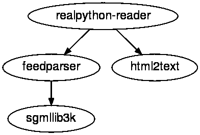

# Python 3.9:很酷的新特性供您尝试

> 原文：<https://realpython.com/python39-new-features/>

*立即观看**本教程有真实 Python 团队创建的相关视频课程。和文字教程一起看，加深理解:[**Python 3.9 中很酷的新特性**](/courses/cool-new-features-python-39/)

[Python 3.9 来了！](https://www.python.org/downloads/release/python-390/)在过去的一年里，来自世界各地的志愿者一直致力于 Python 的改进。虽然测试版已经发布了一段时间，但 Python 3.9 的第一个正式版本于 2020 年 10 月 5 日在[发布。](https://www.python.org/dev/peps/pep-0596/)

Python 的每个版本都包括新的、改进的和废弃的特性，Python 3.9 也不例外。[文档](https://docs.python.org/3.9/whatsnew/3.9.html)给出了变更的完整列表。下面，您将深入了解最新版本的 Python 带来的最酷的特性。

在本教程中，您将了解到:

*   使用**时区**访问和计算
*   有效合并和更新**字典**
*   基于**表达式**使用**装饰器**
*   结合**类型提示**和**其他注释**

要自己尝试新功能，您需要安装 Python 3.9。可以从 [Python 主页](https://www.python.org/download/pre-releases/)下载安装。或者，你可以使用[官方 Docker 图片](https://hub.docker.com/_/python/)来尝试一下。参见 Docker 中的[运行 Python 版本:如何尝试最新的 Python 版本](https://realpython.com/python-versions-docker/)了解更多详情。

**免费下载:** [从 Python 技巧中获取一个示例章节:这本书](https://realpython.com/bonus/python-tricks-sample-pdf/)用简单的例子向您展示了 Python 的最佳实践，您可以立即应用它来编写更漂亮的+Python 代码。

**额外学习材料:**查看[真实 Python 播客第 30 集](https://realpython.com/podcasts/rpp/30/)和[这段办公时间记录](https://realpython.com/lessons/office-hours-2020-10-21/)Python 3.9 技巧和与*真实 Python* 团队成员的小组讨论。

## 正确的时区支持

Python 通过标准库中的 [`datetime`](https://realpython.com/python-datetime/) 模块广泛支持处理日期和时间。然而，对使用时区的支持却有所欠缺。到目前为止，[推荐的处理时区的方式](https://realpython.com/python-datetime/#working-with-time-zones)一直是使用第三方库，比如 [`dateutil`](https://dateutil.readthedocs.io/en/stable/) 。

在普通 Python 中处理时区的最大挑战是您必须自己实现时区规则。一个`datetime`支持设置时区，但是只有 [UTC](https://en.wikipedia.org/wiki/Coordinated_Universal_Time) 立即可用。其他时区需要在抽象的 [`tzinfo`](https://docs.python.org/3/library/datetime.html#tzinfo-objects) 基类之上实现。

[*Remove ads*](/account/join/)

### 访问时区

你可以像这样从`datetime`库中得到一个 [UTC 时间戳](https://blog.ganssle.io/articles/2019/11/utcnow.html):

>>>

```py
>>> from datetime import datetime, timezone

>>> datetime.now(tz=timezone.utc)
datetime.datetime(2020, 9, 8, 15, 4, 15, 361413, tzinfo=datetime.timezone.utc)
```

注意，产生的时间戳是**时区感知的**。它有一个由`tzinfo`指定的附加时区。没有任何时区信息的时间戳被称为**幼稚**。

[保罗·甘索](https://www.ganssle.io/)多年来一直是`dateutil`的维护者。他在 2019 年加入了 Python 核心开发人员，并帮助添加了一个新的 [`zoneinfo`](https://docs.python.org/3.9/library/zoneinfo.html) 标准库，使时区工作更加方便。

`zoneinfo`提供对互联网号码分配机构(IANA) [时区数据库](https://www.iana.org/time-zones)的访问。IANA [每年都会几次更新它的数据库](http://mm.icann.org/pipermail/tz-announce/)，它是时区信息最权威的来源。

使用`zoneinfo`，您可以获得一个描述数据库中任何时区的对象:

>>>

```py
>>> from zoneinfo import ZoneInfo
>>> ZoneInfo("America/Vancouver")
zoneinfo.ZoneInfo(key='America/Vancouver')
```

您可以使用几个键中的一个来访问时区。在这种情况下，您使用`"America/Vancouver"`。

**注意:** `zoneinfo`使用驻留在您本地计算机上的 IANA 时区数据库。有可能——特别是在 Windows 上——你没有这样的数据库或者`zoneinfo`找不到它。如果您得到如下错误，那么`zoneinfo`无法定位时区数据库:

>>>

```py
>>> from zoneinfo import ZoneInfo
>>> ZoneInfo("America/Vancouver")
Traceback (most recent call last):
  File "<stdin>", line 1, in <module>
ZoneInfoNotFoundError: 'No time zone found with key America/Vancouver'
```

IANA 时区数据库的 Python 实现可以在 [PyPI](https://pypi.org/project/tzdata/) 上作为 [`tzdata`](https://tzdata.readthedocs.io/) 获得。可以用 [`pip`](https://realpython.com/what-is-pip/) 安装:

```py
$ python -m pip install tzdata
```

一旦安装了`tzdata`，`zoneinfo`应该能够读取所有支持的时区的信息。`tzdata`由 Python 核心团队维护。请注意，为了访问 IANA 时区数据库中的最新更改，您需要保持软件包更新。

您可以使用`datetime`函数的`tz`或`tzinfo`参数制作时区感知时间戳:

>>>

```py
>>> from datetime import datetime
>>> from zoneinfo import ZoneInfo
>>> datetime.now(tz=ZoneInfo("Europe/Oslo"))
datetime.datetime(2020, 9, 8, 17, 12, 0, 939001,
 tzinfo=zoneinfo.ZoneInfo(key='Europe/Oslo'))

>>> datetime(2020, 10, 5, 3, 9, tzinfo=ZoneInfo("America/Vancouver"))
datetime.datetime(2020, 10, 5, 3, 9,
 tzinfo=zoneinfo.ZoneInfo(key='America/Vancouver'))
```

用时间戳记录时区对于记录非常有用。它还方便了时区之间的转换:

>>>

```py
>>> from datetime import datetime
>>> from zoneinfo import ZoneInfo
>>> release = datetime(2020, 10, 5, 3, 9, tzinfo=ZoneInfo("America/Vancouver"))
>>> release.astimezone(ZoneInfo("Europe/Oslo"))
datetime.datetime(2020, 10, 5, 12, 9,
 tzinfo=zoneinfo.ZoneInfo(key='Europe/Oslo'))
```

请注意，奥斯陆时间比温哥华时间晚九个小时。

### 调查时区

IANA 时区数据库非常庞大。您可以使用`zoneinfo.available_timezones()`列出所有可用的时区:

>>>

```py
>>> import zoneinfo
>>> zoneinfo.available_timezones()
{'America/St_Lucia', 'SystemV/MST7', 'Asia/Aqtau', 'EST', ... 'Asia/Beirut'}

>>> len(zoneinfo.available_timezones())
609
```

数据库中时区的数量可能因您的安装而异。在本例中，您可以看到列出了`609`时区名称。每个时区都记录了已经发生的历史变化，您可以更仔细地观察每个时区。

[Kiritimati](https://en.wikipedia.org/wiki/Kiritimati) ，又名圣诞岛，目前位于世界最西部时区，UTC+14。情况并非总是如此。1995 年以前，该岛位于协调世界时 10 时[国际日期变更线](https://en.wikipedia.org/wiki/International_Date_Line)的另一侧。为了跨越日期线，Kiritimati 完全跳过了 1994 年 12 月 31 日。

通过仔细观察`"Pacific/Kiritimati"`时区对象，您可以看到这是如何发生的:

>>>

```py
>>> from datetime import datetime, timedelta
>>> from zoneinfo import ZoneInfo
>>> hour = timedelta(hours=1)
>>> tz_kiritimati = ZoneInfo("Pacific/Kiritimati")
>>> ts = datetime(1994, 12, 31, 9, 0, tzinfo=ZoneInfo("UTC"))

>>> ts.astimezone(tz_kiritimati)
datetime.datetime(1994, 12, 30, 23, 0,
 tzinfo=zoneinfo.ZoneInfo(key='Pacific/Kiritimati'))

>>> (ts + 1 * hour).astimezone(tz_kiritimati)
datetime.datetime(1995, 1, 1, 0, 0,
 tzinfo=zoneinfo.ZoneInfo(key='Pacific/Kiritimati'))
```

1994 年 12 月 30 日，Kiritimati 岛上的时钟显示 23:00 时，新年开始了一个小时。1994 年 12 月 31 日，从来没有发生过！

您还可以看到相对于 UTC 的偏移量发生了变化:

>>>

```py
>>> tz_kiritimati.utcoffset(datetime(1994, 12, 30)) / hour
-10.0

>>> tz_kiritimati.utcoffset(datetime(1995, 1, 1)) / hour
14.0
```

`.utcoffset()`返回一个`timedelta`。计算一个给定的`timedelta`代表多少小时的最有效的方法是用它除以一个代表一小时的`timedelta`。

关于时区还有很多其他奇怪的故事。Paul Ganssle 在他的 PyCon 2019 演讲中谈到了其中的一些问题，[处理时区:你希望不需要知道的一切](https://www.youtube.com/watch?v=rz3D8VG_2TY)。看看能不能在时区数据库里找到其他人的踪迹。

[*Remove ads*](/account/join/)

### 使用最佳实践

与时区打交道可能会很棘手。然而，随着标准库中`zoneinfo`的出现，事情变得简单了一些。这里有一些[建议](https://www.youtube.com/watch?v=rz3D8VG_2TY&t=24m10s)在处理日期和时间时要记住:

*   **民用时间**像开会、火车离站或音乐会的时间，最好存储在他们的本地时区。您通常可以通过存储一个简单的时间戳和时区的 IANA 键来实现这一点。以[字符串](https://realpython.com/python-strings/)形式存储的民用时间的一个例子是`"2020-10-05T14:00:00,Europe/Oslo"`。拥有关于时区的信息可以确保您总是能够恢复信息，即使时区本身发生了变化。

*   **时间戳**代表特定的时刻，通常记录事件的顺序。计算机日志就是一个例子。您不希望您的日志因为您的时区从夏令时变为标准时间而变得混乱。通常，您会将这些类型的时间戳存储为 UTC 中的原始日期时间。

因为 IANA 时区数据库一直在更新，所以您应该注意保持本地时区数据库的同步。如果您正在运行任何对时区敏感的应用程序，这一点尤其重要。

在 Mac 和 Linux 上，您通常可以信任您的系统来保持本地数据库的更新。如果你依赖于 [`tzdata`](https://pypi.org/project/tzdata/) 包，那么你应该记得不时地更新它。特别是，你不应该把它固定在一个特定的版本上好几年。

像`"America/Vancouver"`这样的名字可以让你明确地访问给定的时区。但是，当与用户交流时区相关的日期时间时，最好使用常规的时区名称。这些在时区对象上作为`.tzname()`可用:

>>>

```py
>>> from datetime import datetime
>>> from zoneinfo import ZoneInfo
>>> tz = ZoneInfo("America/Vancouver")
>>> release = datetime(2020, 10, 5, 3, 9, tzinfo=tz)
>>> f"Release date: {release:%b %d, %Y at %H:%M}  {tz.tzname(release)}"
'Release date: Oct 05, 2020 at 03:09 PDT'
```

您需要向`.tzname()`提供一个时间戳。这是必要的，因为时区的名称可能会随时间而改变，例如夏令时:

>>>

```py
>>> tz.tzname(datetime(2021, 1, 28))
'PST'
```

冬天，温哥华处于[太平洋标准时间(PST)](https://www.timeanddate.com/time/zones/pst) ，而夏天，温哥华处于[太平洋夏令时(PDT)](https://www.timeanddate.com/time/zones/pdt) 。

`zoneinfo`仅在 Python 3.9 及更高版本的标准库中可用。然而，如果您正在使用 Python 的早期版本，那么您仍然可以利用`zoneinfo`。PyPI 上有[后端口，可以安装](https://pypi.org/project/backports.zoneinfo/) [`pip`](https://realpython.com/what-is-pip/) :

```py
$ python -m pip install backports.zoneinfo
```

当导入`zoneinfo`时，您可以使用下面的[习语](https://realpython.com/python-import/#handle-packages-across-python-versions):

```py
try:
    import zoneinfo
except ImportError:
    from backports import zoneinfo
```

这使得您的程序与 3.6 及更高版本的所有 Python 兼容。关于`zoneinfo`的更多细节见 [PEP 615](https://www.python.org/dev/peps/pep-0615/) 。

## 字典更新更简单

字典是 Python 中最基本的数据结构之一。它们在语言中随处可见，并且随着时间的推移[得到了极大的优化](https://www.youtube.com/watch?v=npw4s1QTmPg)。

有几种方法可以合并两本词典。然而，该语法要么有点晦涩，要么很麻烦:

>>>

```py
>>> pycon = {2016: "Portland", 2018: "Cleveland"}
>>> europython = {2017: "Rimini", 2018: "Edinburgh", 2019: "Basel"}

>>> {**pycon, **europython}
{2016: 'Portland', 2018: 'Edinburgh', 2017: 'Rimini', 2019: 'Basel'}

>>> merged = pycon.copy()
>>> for key, value in europython.items():
...     merged[key] = value
...
>>> merged
{2016: 'Portland', 2018: 'Edinburgh', 2017: 'Rimini', 2019: 'Basel'}
```

这两种方法都是在不改变原始数据的情况下合并字典。注意`"Cleveland"`已经被`merged`中的`"Edinburgh"`覆盖。您也可以就地更新字典:

>>>

```py
>>> pycon.update(europython)
>>> pycon
{2016: 'Portland', 2018: 'Edinburgh', 2017: 'Rimini', 2019: 'Basel'}
```

不过，这改变了你原来的字典。请记住，`.update()`不会返回更新后的字典，所以在不改变原始数据的情况下使用`.update()`的巧妙尝试并不奏效:

>>>

```py
>>> pycon = {2016: "Portland", 2018: "Cleveland"}
>>> europython = {2017: "Rimini", 2018: "Edinburgh", 2019: "Basel"}

>>> merged = pycon.copy().update(europython)  # Does NOT work
>>> print(merged)
None
```

注意`merged`是 [`None`](https://realpython.com/null-in-python/) ，当两个字典合并时，结果已经被丢弃。你可以使用 [Python 3.8](https://realpython.com/python38-new-features/) 中引入的[海象操作符](https://realpython.com/python38-new-features/#the-walrus-in-the-room-assignment-expressions) ( `:=`)来完成这项工作:

>>>

```py
>>> (merged := pycon.copy()).update(europython)
>>> merged
{2016: 'Portland', 2018: 'Edinburgh', 2017: 'Rimini', 2019: 'Basel'}
```

尽管如此，这不是一个特别可读或令人满意的解决方案。

在 [PEP 584](https://www.python.org/dev/peps/pep-0584/) 的基础上，新版 Python 引入了两个新的字典操作符: **union** ( `|`)和 **in-place union** ( `|=`)。您可以使用`|`来合并两个字典，而`|=`将就地更新一个字典:

>>>

```py
>>> pycon = {2016: "Portland", 2018: "Cleveland"}
>>> europython = {2017: "Rimini", 2018: "Edinburgh", 2019: "Basel"}

>>> pycon | europython
{2016: 'Portland', 2018: 'Edinburgh', 2017: 'Rimini', 2019: 'Basel'}

>>> pycon |= europython
>>> pycon
{2016: 'Portland', 2018: 'Edinburgh', 2017: 'Rimini', 2019: 'Basel'}
```

如果`d1`和`d2`是两本字典，那么`d1 | d2`和`{**d1, **d2}`做的一样。`|`运算符用于计算集合的[并集，因此您可能已经熟悉这个符号了。](https://docs.python.org/3/library/stdtypes.html#frozenset.union)

使用`|`的一个优点是，它可以处理不同的类似字典的类型，并在合并过程中保持这种类型:

>>>

```py
>>> from collections import defaultdict
>>> europe = defaultdict(lambda: "", {"Norway": "Oslo", "Spain": "Madrid"})
>>> africa = defaultdict(lambda: "", {"Egypt": "Cairo", "Zimbabwe": "Harare"})

>>> europe | africa
defaultdict(<function <lambda> at 0x7f0cb42a6700>,
 {'Norway': 'Oslo', 'Spain': 'Madrid', 'Egypt': 'Cairo', 'Zimbabwe': 'Harare'})

>>> {**europe, **africa}
{'Norway': 'Oslo', 'Spain': 'Madrid', 'Egypt': 'Cairo', 'Zimbabwe': 'Harare'}
```

当您想要有效地处理丢失的按键时，可以使用 [`defaultdict`](https://realpython.com/python-defaultdict/) 。注意`|`保留了`defaultdict`，而`{**europe, **africa}`没有。

在`|`如何为字典工作和`+`如何为[列表](https://realpython.com/python-lists-tuples/)工作之间有一些相似之处。事实上，`+`操作符是[最初提出的](https://www.python.org/dev/peps/pep-0584/#use-the-addition-operator)来合并字典。当你观察就地操作者时，这种对应变得更加明显。

`|=`的基本用途是就地更新字典，类似于`.update()`:

>>>

```py
>>> libraries = {
...     "collections": "Container datatypes",
...     "math": "Mathematical functions",
... }
>>> libraries |= {"zoneinfo": "IANA time zone support"}
>>> libraries
{'collections': 'Container datatypes', 'math': 'Mathematical functions',
 'zoneinfo': 'IANA time zone support'}
```

当您用`|`合并字典时，两个字典都需要是正确的字典类型。另一方面，就地操作符(`|=`)乐于使用任何类似字典的数据结构:

>>>

```py
>>> libraries |= [("graphlib", "Functionality for graph-like structures")]
>>> libraries
{'collections': 'Container datatypes', 'math': 'Mathematical functions',
 'zoneinfo': 'IANA time zone support',
 'graphlib': 'Functionality for graph-like structures'}
```

在这个例子中，您从一个 2 元组列表中更新`libraries`。当您想要合并的两个字典中有重叠的关键字时，会保留最后一个值:

>>>

```py
>>> asia = {"Georgia": "Tbilisi", "Japan": "Tokyo"}
>>> usa = {"Missouri": "Jefferson City", "Georgia": "Atlanta"}
>>> asia | usa
{'Georgia': 'Atlanta', 'Japan': 'Tokyo', 'Missouri': 'Jefferson City'} 
>>> usa | asia
{'Missouri': 'Jefferson City', 'Georgia': 'Tbilisi', 'Japan': 'Tokyo'}
```

在第一个例子中，`"Georgia"`指向`"Atlanta"`，因为`usa`是合并中的最后一个字典。来自`asia`的值`"Tbilisi"`已被覆盖。注意，键`"Georgia"`仍然是结果字典中的第一个，因为它是`asia`中的第一个元素。颠倒合并的顺序会改变`"Georgia"`的位置和值。

运算符`|`和`|=`不仅被添加到常规字典中，还被添加到许多类似字典的类中，包括[`UserDict`](https://docs.python.org/3/library/collections.html#collections.UserDict)[`ChainMap`](https://docs.python.org/3/library/collections.html#collections.ChainMap)[`OrderedDict`](https://docs.python.org/3/library/collections.html#collections.OrderedDict)[`defaultdict`](https://docs.python.org/3/library/collections.html#collections.defaultdict)[`WeakKeyDictionary`](https://docs.python.org/3/library/weakref.html#weakref.WeakKeyDictionary)[`WeakValueDictionary`](https://docs.python.org/3/library/weakref.html#weakref.WeakValueDictionary)[`_Environ`](https://docs.python.org/3/library/os.html#os.environ)[`MappingProxyType`](https://docs.python.org/3/library/types.html#types.MappingProxyType)。它们已经*而不是*被添加到抽象基类 [`Mapping`](https://docs.python.org/3/library/collections.abc.html#collections.abc.Mapping) 或 [`MutableMapping`](https://docs.python.org/3.9/library/collections.abc.html#collections.abc.MutableMapping) 中。 [`Counter`](https://docs.python.org/3/library/collections.html#collections.Counter) 容器已经使用`|`寻找最大计数。这一点没有改变。

您可以通过分别实现 [`.__or__()`](https://docs.python.org/3/reference/datamodel.html#object.__or__) 和 [`.__ior__()`](https://docs.python.org/3/reference/datamodel.html#object.__ior__) 来改变`|`和`|=`的行为。详见 [PEP 584](https://www.python.org/dev/peps/pep-0584/) 。

[*Remove ads*](/account/join/)

## 更灵活的装饰者

传统上，[装饰器](https://realpython.com/primer-on-python-decorators/)必须是一个命名的、可调用的对象，通常是一个函数或类。 [PEP 614](https://www.python.org/dev/peps/pep-0614/) 允许装饰者是任何可调用的表达式。

大多数人不认为旧的修饰语法是限制性的。事实上，为装饰者放宽语法主要有助于一些特殊的用例。根据 PEP，[激励用例](https://www.python.org/dev/peps/pep-0614/#motivation)与 [GUI 框架](https://realpython.com/learning-paths/python-gui-programming/)中的回调相关。

[PyQT](https://realpython.com/python-pyqt-gui-calculator/) 使用[信号和](https://realpython.com/python-pyqt-gui-calculator/#signals-and-slots)插槽来连接小部件和回调。从概念上讲，你可以像下面这样把`button`的`clicked`信号连接到插槽`say_hello()`:

```py
button = QPushButton("Say hello")

@button.clicked.connect
def say_hello():
    message.setText("Hello, World!")
```

当你点击按钮*向*问好时，将会显示文本`Hello, World!`。

**注意:**这不是一个完整的例子，如果您试图运行它，它会引发一个错误。它故意保持简短，以保持对装饰者的关注，而不是陷入 PyQT 如何工作的细节中。

有关 PyQt 入门和设置完整应用程序的更多信息，请参见 [Python 和 PyQT:构建 GUI 桌面计算器](https://realpython.com/python-pyqt-gui-calculator/)。

现在假设您有几个按钮，为了跟踪它们，您将它们存储在一个字典中:

```py
buttons = {
  "hello": QPushButton("Say hello"),
  "leave": QPushButton("Goodbye"),
  "calculate": QPushButton("3 + 9 = 12"),
}
```

这一切都很好。然而，如果您想使用装饰器将一个按钮连接到一个插槽，这就给你带来了挑战。在 Python 的早期版本中，当使用装饰器时，不能使用方括号来访问项目。您需要执行如下操作:

```py
hello_button = buttons["hello"]

@hello_button.clicked.connect
def say_hello():
    message.setText("Hello, World!")
```

在 Python 3.9 中，这些限制被取消，现在您可以使用任何表达式，包括访问字典中的项的表达式:

```py
@buttons["hello"].clicked.connect
def say_hello():
    message.setText("Hello, World!")
```

虽然这不是一个大的变化，但在某些情况下，它允许您编写更干净的代码。扩展的语法也使得在运行时动态选择装饰器变得更加容易。假设您有以下可用的装饰者:

```py
# story.py
import functools

def normal(func):
    return func

def shout(func):
    @functools.wraps(func)
    def shout_decorator(*args, **kwargs):
        return func(*args, **kwargs).upper()

    return shout_decorator

def whisper(func):
    @functools.wraps(func)
    def whisper_decorator(*args, **kwargs):
        return func(*args, **kwargs).lower()

    return whisper_decorator
```

`@normal`装饰器根本不改变原始函数，而`@shout`和`@whisper`使函数返回的任何文本大写或小写。然后，您可以将对这些装饰器的引用存储在一个字典中，并让用户可以使用它们:

```py
# story.py (continued)
DECORATORS = {"normal": normal, "shout": shout, "whisper": whisper}

voice = input(f"Choose your voice ({', '.join(DECORATORS)}): ")

@DECORATORS[voice]
def get_story():
    return """
 Alice was beginning to get very tired of sitting by her sister on the
 bank, and of having nothing to do: once or twice she had peeped into
 the book her sister was reading, but it had no pictures or
 conversations in it, "and what is the use of a book," thought Alice
 "without pictures or conversations?"
 """

print(get_story())
```

当您运行这个脚本时，会询问您将哪个装饰器应用于[故事](https://www.gutenberg.org/ebooks/11)。然后，生成的文本被打印到屏幕上:

```py
$ python3.9 story.py
Choose your voice (normal, shout, whisper): shout 
 ALICE WAS BEGINNING TO GET VERY TIRED OF SITTING BY HER SISTER ON THE
 BANK, AND OF HAVING NOTHING TO DO: ONCE OR TWICE SHE HAD PEEPED INTO
 THE BOOK HER SISTER WAS READING, BUT IT HAD NO PICTURES OR
 CONVERSATIONS IN IT, "AND WHAT IS THE USE OF A BOOK," THOUGHT ALICE
 "WITHOUT PICTURES OR CONVERSATIONS?"
```

这个例子就好像`@shout`已经应用于`get_story()`一样。然而，在这里，它是在运行时根据您的输入应用的。与按钮示例一样，通过使用临时变量，您可以在早期版本的 Python 中实现相同的效果。

关于 decorator 的更多信息，请查看 Python Decorators 的初级读本。关于轻松语法的更多细节，请参见 [PEP 614](https://www.python.org/dev/peps/pep-0614/) 。

[*Remove ads*](/account/join/)

## 带注释的类型提示

在 Python 3.0 中，函数[注释](https://realpython.com/python-type-checking/#annotations)被[引入](https://www.python.org/dev/peps/pep-3107/)。该语法支持向 Python 函数添加任意元数据。下面是一个向公式添加单位的示例:

```py
# calculator.py

def speed(distance: "feet", time: "seconds") -> "miles per hour":
    """Calculate speed as distance over time"""
    fps2mph = 3600 / 5280  # Feet per second to miles per hour
    return distance / time * fps2mph
```

在本例中，注释仅用作读者的文档。稍后您将看到如何在运行时访问注释。

[PEP 484](https://www.python.org/dev/peps/pep-0484/) 建议对[类型提示](https://realpython.com/python-type-checking/)使用注释。随着类型提示越来越受欢迎，它们在 Python 中已经挤掉了注释的其他用途。

由于除了静态类型之外还有几个注释的用例， [PEP 593](https://www.python.org/dev/peps/pep-0593/) 引入了 [`typing.Annotated`](https://docs.python.org/3.9/library/typing.html#typing.Annotated) ，你可以用它将类型提示与其他信息结合起来。您可以像这样重做上面的`calculator.py`示例:

```py
# calculator.py

from typing import Annotated 
def speed(
 distance: Annotated[float, "feet"], time: Annotated[float, "seconds"] ) -> Annotated[float, "miles per hour"]:
    """Calculate speed as distance over time"""
    fps2mph = 3600 / 5280  # Feet per second to miles per hour
    return distance / time * fps2mph
```

`Annotated`至少需要两个参数。第一个参数是常规类型提示，其余参数是任意元数据。类型检查器只关心第一个参数，将元数据的解释留给您和您的应用程序。类型检查器会将类似于`Annotated[float, "feet"]`的类型提示与`float`同等对待。

您可以像往常一样通过`.__annotations__`访问注释。从`calculator.py`进口`speed()`:

>>>

```py
>>> from calculator import speed
>>> speed.__annotations__
{'distance': typing.Annotated[float, 'feet'],
 'time': typing.Annotated[float, 'seconds'],
 'return': typing.Annotated[float, 'miles per hour']}
```

每个注释都可以在字典中找到。您用`Annotated`定义的元数据存储在`.__metadata__`中:

>>>

```py
>>> speed.__annotations__["distance"].__metadata__
('feet',)

>>> {var: th.__metadata__[0] for var, th in speed.__annotations__.items()}
{'distance': 'feet', 'time': 'seconds', 'return': 'miles per hour'}
```

最后一个示例通过读取每个变量的第一个元数据项来挑选出所有的单元。另一种在运行时访问类型提示的方法是使用来自`typing`模块的`get_type_hints()`。`get_type_hints()`默认情况下会忽略元数据:

>>>

```py
>>> from typing import get_type_hints
>>> from calculator import speed
>>> get_type_hints(speed)
{'distance': <class 'float'>,
 'time': <class 'float'>,
 'return': <class 'float'>}
```

这应该允许大多数在运行时访问类型提示的程序继续工作，而无需更改。您可以使用新的可选参数`include_extras`来请求包含元数据:

>>>

```py
>>> get_type_hints(speed, include_extras=True)
{'distance': typing.Annotated[float, 'feet'],
 'time': typing.Annotated[float, 'seconds'],
 'return': typing.Annotated[float, 'miles per hour']}
```

使用`Annotated`可能会导致非常冗长的代码。保持代码简短易读的一个方法是使用[类型别名](https://realpython.com/python-type-checking/#type-aliases)。您可以定义表示注释类型的新变量:

```py
# calculator.py

from typing import Annotated

Feet = Annotated[float, "feet"] Seconds = Annotated[float, "seconds"] MilesPerHour = Annotated[float, "miles per hour"] 
def speed(distance: Feet, time: Seconds) -> MilesPerHour:
    """Calculate speed as distance over time"""
    fps2mph = 3600 / 5280  # Feet per second to miles per hour
    return distance / time * fps2mph
```

类型别名可能需要一些工作来设置，但是它们可以使您的代码非常清晰易读。

如果您有一个广泛使用注释的应用程序，您也可以考虑实现一个**注释工厂**。将以下内容添加到`calculator.py`的顶部:

```py
# calculator.py

from typing import Annotated

class AnnotationFactory:
    def __init__(self, type_hint):
        self.type_hint = type_hint

    def __getitem__(self, key):
        if isinstance(key, tuple):
            return Annotated[(self.type_hint, ) + key]
        else:
            return Annotated[self.type_hint, key]

    def __repr__(self):
        return f"{self.__class__.__name__}({self.type_hint})"
```

`AnnotationFactory`可以用不同的元数据创建`Annotated`对象。您可以使用注释工厂来创建更多的动态别名。更新`calculator.py`以使用`AnnotationFactory`:

```py
# calculator.py (continued)

Float = AnnotationFactory(float) 
def speed(
 distance: Float["feet"], time: Float["seconds"] ) -> Float["miles per hour"]:
    """Calculate speed as distance over time"""
    fps2mph = 3600 / 5280  # Feet per second to miles per hour
    return distance / time * fps2mph
```

`Float[<metadata>]`代表`Annotated[float, <metadata>]`，所以这个例子的工作方式和前面两个例子完全一样。

[*Remove ads*](/account/join/)

## 更强大的 Python 解析器

Python 3.9 最酷的特性之一是你在日常编码生活中不会注意到的。Python 解释器的一个基本组件是[解析器](https://realpython.com/cpython-source-code-guide/#lexing-and-parsing)。在最新版本中，解析器被重新实现。

从一开始，Python 就使用一个基本的 [LL(1)解析器](https://en.wikipedia.org/wiki/LL_parser)将源代码解析成解析树。您可以将 LL(1)解析器想象成一次读取一个字符，并计算出如何在不回溯的情况下解释源代码的解析器。

使用简单解析器的一个优点是它的实现和推理相当简单。一个缺点是有[个难题](https://www.python.org/dev/peps/pep-0617/#rationale)需要你用特殊的技巧来规避。

在一系列博客文章中，Python 的创始人吉多·范·罗苏姆调查了 [PEG(解析表达式语法)解析器](https://medium.com/@gvanrossum_83706/peg-parsing-series-de5d41b2ed60)。PEG 解析器比 LL(1)解析器更强大，并且不需要特殊的修改。由于 Guido 的研究，在 Python 3.9 中实现了一个 PEG 解析器。详见 [PEP 617](https://www.python.org/dev/peps/pep-0617/) 。

目标是让新的 PEG 解析器产生与旧的 LL(1)解析器相同的**抽象语法树(AST)** 。最新版本实际上附带了这两种解析器。虽然 PEG 解析器是默认的，但是您可以通过使用 [`-X oldparser`](https://docs.python.org/3.9/using/cmdline.html#id5) 命令行标志来使用旧的解析器运行您的程序:

```py
$ python -X oldparser script_name.py
```

或者，您可以设置 [`PYTHONOLDPARSER`](https://docs.python.org/3.9/using/cmdline.html#envvar-PYTHONOLDPARSER) 环境变量。

旧的解析器将在 [Python 3.10](https://www.python.org/dev/peps/pep-0619/) 中被移除。这将允许没有 LL(1)语法限制的新特性。目前正在考虑包含在 Python 3.10 中的一个这样的特性是[结构模式匹配](https://realpython.com/python-news-march-2021/#structural-pattern-matching-comes-to-python-3100)，如 [PEP 622](https://www.python.org/dev/peps/pep-0622/) 中所述。

让两个解析器都可用对于验证新的 PEG 解析器来说是非常好的。您可以在两个解析器上运行任何代码，并在 AST 级别进行比较。在测试过程中，对整个标准库以及许多流行的第三方包进行了编译和比较。

您还可以比较这两种解析器的性能。一般来说，PEG 解析器和 LL(1)的性能相似。在整个标准库中，PEG 解析器稍微快一点，但是它也使用稍微多一点的内存。实际上，当使用新的解析器时，您不会注意到任何性能上的变化，无论是好是坏。

## 其他非常酷的功能

到目前为止，您已经看到了 Python 3.9 中最大的新特性。然而，Python 的每个新版本也包括许多小的变化。官方文件包括了所有这些变化的列表。在本节中，您将了解一些其他非常酷的新特性，您可以开始使用它们。

### 字符串前缀和后缀

如果您需要删除一个字符串的开头或结尾，那么`.strip()`似乎可以完成这项工作:

>>>

```py
>>> "three cool features in Python".strip(" Python")
'ree cool features i'
```

后缀`" Python"`已经被删除，但是字符串开头的`"th"`也被删除。`.strip()`的实际行为有时令人惊讶——并引发了[许多](https://stackoverflow.com/questions/4148974/removing-a-prefix-from-a-string) [bug](https://bugs.python.org/issue37114) [报告](https://bugs.python.org/issue25979)。人们很自然地认为`.strip(" Python")`会删除子串`" Python"`，但它删除的是单个字符`" "`、`"P"`、`"y"`、`"t"`、`"h"`、`"o"`和`"n"`。

要真正删除字符串后缀，您可以这样做:

>>>

```py
>>> def remove_suffix(text, suffix):
...     if text.endswith(suffix):
...         return text[:-len(suffix)]
...     else:
...         return text
...
>>> remove_suffix("three cool features in Python", suffix=" Python")
'three cool features in'
```

这样效果更好，但是有点麻烦。这段代码还有一个微妙的错误:

>>>

```py
>>> remove_suffix("three cool features in Python", suffix="")
''
```

如果后缀碰巧是空字符串，不知何故整个字符串都被删除了。这是因为空字符串的长度是 0，所以`text[:0]`最终被返回。您可以通过将测试改为在`suffix and text.endswith(suffix)`上来解决这个问题。

在 Python 3.9 中，有两个新的字符串方法可以解决这个用例。您可以使用`.removeprefix()`和`.removesuffix()`分别删除字符串的开头或结尾:

>>>

```py
>>> "three cool features in Python".removesuffix(" Python")
'three cool features in'

>>> "three cool features in Python".removeprefix("three ")
'cool features in Python'

>>> "three cool features in Python".removeprefix("Something else")
'three cool features in Python'
```

注意，如果给定的前缀或后缀与字符串不匹配，那么字符串将原封不动地返回。

`.removeprefix()`和`.removesuffix()`最多去掉一个词缀。如果你想确保将它们全部移除，那么你可以使用 [`while`循环](https://realpython.com/python-while-loop/):

>>>

```py
>>> text = "Waikiki"
>>> text.removesuffix("ki")
'Waiki'

>>> while text.endswith("ki"):
...     text = text.removesuffix("ki")
...
>>> text
'Wai'
```

关于`.removeprefix()`和`.removesuffix()`的更多信息，请参见 [PEP 616](https://www.python.org/dev/peps/pep-0616/) 。

[*Remove ads*](/account/join/)

### 直接输入提示列表和字典

为基本类型添加类型提示通常很简单，比如`str`、`int`和`bool`。您可以直接用类型进行注释。这种情况与您自己创建的自定义类型类似:

```py
radius: float = 3.9

class NothingType:
    pass

nothing: NothingType = NothingType()
```

仿制药是一个不同的故事。泛型通常是一个可以参数化的容器，比如一列数字。出于技术原因，在以前的 Python 版本中，您不能使用`list[float]`或`list(float)`作为类型提示。相反，您需要从`typing`模块导入一个不同的列表对象:

```py
from typing import List

numbers: List[float]
```

在 Python 3.9 中，不再需要这种并行层次结构。现在，您终于可以使用`list`进行适当的类型提示了:

```py
numbers: list[float]
```

这将使您的代码更容易编写，并消除同时拥有`list`和`List`的困惑。在未来，使用`typing.List`和类似的泛型如`typing.Dict`和`typing.Type`将被弃用，这些泛型最终将从`typing`中移除。

如果您需要编写与旧版本 Python 兼容的代码，那么您仍然可以通过使用 [`__future__`导入](https://docs.python.org/3/library/__future__.html)来利用新语法，这在 [Python 3.7](https://realpython.com/python37-new-features/#typing-enhancements) 中是可用的。在 Python 3.7 中，您通常会看到类似这样的内容:

>>>

```py
>>> numbers: list[float]
Traceback (most recent call last):
  File "<stdin>", line 1, in <module>
TypeError: 'type' object is not subscriptable
```

然而，使用`__future__`导入可以让这个例子工作:

>>>

```py
>>> from __future__ import annotations
>>> numbers: list[float]
>>> __annotations__
{'numbers': 'list[float]'}
```

这是因为注释在运行时不会被计算。如果您尝试评估注释，那么您仍然会体验到`TypeError`。有关这种新语法的更多信息，请参见 [PEP 585](https://www.python.org/dev/peps/pep-0585/) 。

### 拓扑排序

由节点和边组成的图对于表示不同种类的数据很有用。例如，当您使用 [`pip`](https://realpython.com/what-is-pip/) 安装来自 [PyPI](https://realpython.com/pypi-publish-python-package/) 的一个包时，该包可能依赖于其他包，而其他包又可能有更多的依赖项。

这种结构可以用一个图来表示，其中每个包是一个节点，每个依赖项用一条边来表示:

[](https://files.realpython.com/media/dependencies.dot.829d4130fca9.png)

<figcaption class="figure-caption text-center">A graph showing the dependencies of realpython-reader</figcaption>

此图显示了 [`realpython-reader`](https://pypi.org/project/realpython-reader/) 包的依赖关系。直接取决于`feedparser`和`html2text`，而`feedparser`反过来又取决于`sgmllib3k`。

假设您希望按顺序安装这些软件包，以便始终满足所有依赖关系。然后你可以做所谓的[拓扑排序](https://en.wikipedia.org/wiki/Topological_sorting)来找到你的依赖关系的[总顺序](https://en.wikipedia.org/wiki/Total_order)。

Python 3.9 在标准库中引入了一个新的模块 [`graphlib`](https://docs.python.org/3.9/library/graphlib.html) ，做拓扑排序。您可以使用它来查找集合的总顺序，或者考虑到可以并行化的任务来进行更高级的调度。要查看示例，您可以在字典中表示早期的依赖关系:

>>>

```py
>>> dependencies = {
...     "realpython-reader": {"feedparser", "html2text"},
...     "feedparser": {"sgmllib3k"},
... }
...
```

这表达了您在上图中看到的依赖关系。例如，`realpython-reader`依赖于`feedparser`和`html2text`。在这种情况下，`realpython-reader`的具体依赖关系写成一个集合:`{"feedparser", "html2text"}`。您可以使用任何 iterable 来指定这些，包括一个列表。

**注意:**记住一个字符串在其字符上是可迭代的。因此，您通常希望将单个字符串包装在某种容器中:

>>>

```py
>>> dependencies = {"feedparser": "sgmllib3k"}  # Will NOT work
```

这个不*不是*说`feedparser`依赖`sgmllib3k`。而是说`feedparser`要靠`s`、`g`、`m`、`l`、`l`、`i`、`b`、`3`、`k`每一个。

要计算图表的总顺序，可以使用`graphlib`中的`TopologicalSorter`:

>>>

```py
>>> from graphlib import TopologicalSorter
>>> ts = TopologicalSorter(dependencies)
>>> list(ts.static_order())
['html2text', 'sgmllib3k', 'feedparser', 'realpython-reader']
```

给定的顺序建议你先安装`html2text`，再安装`sgmllib3k`，再安装`feedparser`，最后安装`realpython-reader`。

**注:**一个图的全序不一定唯一。在本例中，其他有效的排序是:

*   `sgmllib3k`、`html2text`、`feedparser`、`realpython-reader`
*   `sgmllib3k`、`feedparser`、`html2text`、`realpython-reader`

`TopologicalSorter`有一个扩展的 API，允许你使用`.add()`增加节点和边。您还可以迭代地使用该图，这在调度可以并行完成的任务时特别有用。完整示例见[文档](https://docs.python.org/3.9/library/graphlib.html)。

[*Remove ads*](/account/join/)

### 最大公约数(GCD)和最小公倍数(LCM)

数的除数是一个重要的性质，在密码学和其他领域都有应用。Python 很早就有了计算两个数的[最大公约数(GCD)](https://en.wikipedia.org/wiki/Greatest_common_divisor) 的函数:

>>>

```py
>>> import math
>>> math.gcd(49, 14)
7
```

49 和 14 的 GCD 是 7，因为 7 是 49 和 14 的最大数。

[最小公倍数(LCM)](https://en.wikipedia.org/wiki/Least_common_multiple) 与 GCD 有关。两个数的 LCM 是能被两个数相除的最小数。可以根据 GCD 来定义 LCM:

>>>

```py
>>> def lcm(num1, num2):
...     if num1 == num2 == 0:
...         return 0
...     return num1 * num2 // math.gcd(num1, num2)
...
>>> lcm(49, 14)
98
```

49 和 14 的最小公倍数是 98，因为 98 是能被 49 和 14 整除的最小数。在 Python 3.9 中，您不再需要定义自己的 LCM 函数:

>>>

```py
>>> import math
>>> math.lcm(49, 14)
98
```

`math.gcd()`和`math.lcm()`现在都支持两个以上的数字。例如，你可以这样计算`273`、`1729`、`6048`的最大公约数:

>>>

```py
>>> import math
>>> math.gcd(273, 1729, 6048)
7
```

注意`math.gcd()`和`math.lcm()`不能基于列表进行计算。然而，您可以[将](https://realpython.com/python-kwargs-and-args/#unpacking-with-the-asterisk-operators)列表解包成逗号分隔的参数:

>>>

```py
>>> import math
>>> numbers = [273, 1729, 6048]
>>> math.gcd(numbers)
Traceback (most recent call last):
  File "<stdin>", line 1, in <module>
TypeError: 'list' object cannot be interpreted as an integer

>>> math.gcd(*numbers)
7
```

在 Python 的早期版本中，您需要嵌套几个对`gcd()`的调用或者使用 [`functools.reduce()`](https://realpython.com/python-reduce-function/) :

>>>

```py
>>> import math
>>> math.gcd(math.gcd(273, 1729), 6048)
7

>>> import functools
>>> functools.reduce(math.gcd, [273, 1729, 6048])
7
```

在 Python 的最新版本中，这些计算变得更加简单易懂。

### 新的 HTTP 状态代码

IANA T2 协调几个关键的互联网基础设施资源，包括你之前看到的时区数据库。另一个这样的资源是 [HTTP 状态代码注册表](https://www.iana.org/assignments/http-status-codes/http-status-codes.xhtml)。HTTP 状态代码可在 [`http`标准库](https://docs.python.org/3/library/http.html)中获得:

>>>

```py
>>> from http import HTTPStatus
>>> HTTPStatus.OK
<HTTPStatus.OK: 200>

>>> HTTPStatus.OK.description
'Request fulfilled, document follows'

>>> HTTPStatus(404)
<HTTPStatus.NOT_FOUND: 404>

>>> HTTPStatus(404).phrase
'Not Found'
```

在 Python 3.9 中，新的 HTTP 状态代码 [103(早期提示)](https://tools.ietf.org/html/rfc8297)和 [425(过早)](https://tools.ietf.org/html/rfc8470)被添加到`http`:

>>>

```py
>>> from http import HTTPStatus
>>> HTTPStatus.EARLY_HINTS.value
103

>>> HTTPStatus(425).phrase
'Too Early'
```

如您所见，您可以根据号码和名称访问新代码。

[超文本咖啡壶控制协议(HTCPCP)](https://tools.ietf.org/html/rfc2324) 于 1998 年 4 月 1 日引入，用于控制、监控和诊断咖啡壶。它引入了像`BREW`这样的新方法，同时主要重用现有的 HTTP 状态代码。一个例外是新的 [418(我是一把茶壶)](https://tools.ietf.org/html/rfc2324#section-2.3.2)状态码，意在防止因在茶壶里煮咖啡而毁坏一把好茶壶的灾难。

[用于茶流出设备的超文本咖啡壶控制协议(HTCPCP-茶)](https://tools.ietf.org/html/rfc7168)也包括 418(我是茶壶)并且该代码也找到了进入许多主流 HTTP 库的方法，包括 [`requests`](https://2.python-requests.org/en/master/api/?highlight=teapot#status-code-lookup) 。

2017 年发起的从主要图书馆移除 418(我是茶壶)的[倡议遭到了](https://en.wikipedia.org/wiki/Hyper_Text_Coffee_Pot_Control_Protocol#Save_418_movement)的迅速[抵制。最终，](https://save418.com/)[辩论以 418 被](https://markets.businessinsider.com/news/stocks/save-418-saving-the-http-teapot-error-2017-8-1002253556)[提议](https://tools.ietf.org/html/draft-nottingham-thanks-larry-00)为保留的 HTTP 状态码而结束。418(我是茶壶)也加入了`http`:

>>>

```py
>>> from http import HTTPStatus
>>> HTTPStatus(418).phrase
"I'm a Teapot"

>>> HTTPStatus.IM_A_TEAPOT.description
'Server refuses to brew coffee because it is a teapot.'
```

你可以在一些地方看到 418 错误，包括在谷歌上。

[*Remove ads*](/account/join/)

### 删除不赞成使用的兼容性代码

Python 去年的一个重要里程碑是 Python 2 的[日落](https://www.python.org/doc/sunset-python-2/)。Python 2.7 是[在 2010 年首次发布的](https://www.python.org/dev/peps/pep-0373/)。2020 年 1 月 1 日，官方对 Python 2 的支持结束。

Python 2 已经为社区服务了近 20 年，并且被许多人亲切地怀念。同时，不用担心 Python 3 与 Python 2 的兼容性，核心开发人员可以专注于 Python 3 的持续改进，并在此过程中做一些清理工作。

Python 3.9 中移除了许多不推荐使用但为了向后兼容 Python 2 而保留下来的函数。Python 3.10 中还会移除一些。如果您想知道您的代码是否使用了这些旧特性，那么尝试在[开发模式](https://docs.python.org/3.9/library/devmode.html#devmode)下运行它:

```py
$ python -X dev script_name.py
```

使用开发模式会向您显示更多的警告，帮助您的代码经得起未来的考验。参见[Python 3.9 新特性](https://docs.python.org/3.9/whatsnew/3.9.html#you-should-check-for-deprecationwarning-in-your-code)了解更多关于被移除特性的信息。

## Python 的下一个版本是什么时候？

Python 3.9 中与代码无关的最后一个变化由 [PEP 602 描述——Python 的年度发布周期](https://www.python.org/dev/peps/pep-0602/)。传统上，Python 的新版本大约每十八个月发布一次。

从 Python 的当前版本开始，大约每隔 12 个月，即每年的 10 月，就会发布新的版本。这带来了几个好处，最明显的是更可预测和一致的发布时间表。对于年度发布，更容易计划和同步其他重要的开发者活动，如[PyCon US](https://realpython.com/pycon-guide/)sprint 和年度核心 sprint。

虽然发布会越来越频繁，但 Python 不会更快变得不兼容，也不会更快获得新特性。所有版本将在最初发布后的五年内得到支持，因此 Python 3.9 将在 2025 年前获得安全修复。

随着发布周期的缩短，新特性的发布会更快。同时，新版本将带来更少的变化，使更新变得不那么重要。

Python 的[指导委员会](https://realpython.com/python38-new-features/#the-python-steering-council)的选举在每次 Python 发布后举行。今后，这意味着指导委员会的五个职位将每年选举一次。

尽管 Python 的新版本将每 12 个月发布一次，但新版本的开发在发布前大约 17 个月就开始了。这是因为在 beta 测试阶段，没有新的特性被添加到一个版本中，这个阶段持续了大约五个月。

换句话说，Python 的下一个版本 [Python 3.10](https://twitter.com/gvanrossum/status/1306270482384076800) 的开发已经在进行中。你已经可以通过运行最新的[核心开发者 Docker 镜像](https://realpython.com/python-versions-docker/#running-the-latest-alpha)来测试 Python 3.10 的第一个 alpha 版本。

Python 3.10 的最终特性仍有待确定。然而，版本号有些特殊，因为它是第一个带有两位数次要版本的 Python 版本。这可能会导致一些问题，例如，如果您的代码将版本作为字符串进行比较，因为`"3.9" > "3.10"`。更好的解决方案是将版本作为元组进行比较:`(3, 9) < (3, 10)`。包 [`flake8-2020`](https://pypi.org/project/flake8-2020/) 测试代码中的这些和类似的问题。

## 那么，应该升级到 Python 3.9 吗？

首先，如果您想尝试本教程中展示的任何很酷的新特性，那么您需要使用 Python 3.9。可以将最新版本与当前版本的 Python 并行安装。最简单的方法就是使用类似 [`pyenv`](https://realpython.com/intro-to-pyenv/) 或者 [`conda`](https://realpython.com/python-windows-machine-learning-setup/) 这样的环境管理器。通过 [Docker](https://realpython.com/python-versions-docker/) 运行新版本会更少干扰。

当您考虑升级到 Python 3.9 时，您应该问自己两个不同的问题:

1.  您应该将开发人员或生产环境升级到 Python 3.9 吗？
2.  您是否应该让您的项目依赖于 Python 3.9，以便能够利用新特性？

如果您的代码在 Python 3.8 中运行流畅，那么在 Python 3.9 中运行相同的代码应该不会遇到什么问题。主要的绊脚石是，如果你依赖的函数在 Python 的早期版本中已经被否决，现在[被移除](#removal-of-deprecated-compatibility-code)。

新的 PEG 解析器自然没有像旧的那样经过广泛的测试。如果你运气不好，你可能会遇到一些奇怪的棘手问题。但是，请记住，您可以使用命令行标志切换回旧的解析器。

总之，在方便的时候尽早将自己的环境升级到 Python 的最新版本应该是相当安全的。如果你想保守一点，那么你可以等待第一个维护版本，Python 3.9.1。

您是否能够开始真正利用自己代码中的新特性，很大程度上取决于您的用户群。如果您的代码只在您可以控制和升级到 Python 3.9 的环境中运行，那么使用`zoneinfo`或新的字典合并操作符没有任何害处。

然而，如果你正在分发一个被许多人使用的库，那么最好保守一点。上一个版本的 [Python 3.5](https://www.python.org/dev/peps/pep-0478/) 发布于 9 月，现在已经不支持了。如果可能的话，你应该仍然致力于让你的库与 Python 3.6 和更高版本兼容，这样尽可能多的人可以享受你的成果。

有关为 Python 3.9 准备代码的详细信息，请参见官方文档中的[移植到 Python 3.9](https://docs.python.org/3.9/whatsnew/3.9.html#porting-to-python-3-9) 。

[*Remove ads*](/account/join/)

## 结论

新 Python 版本的发布是社区的一个重要里程碑。您可能无法立即开始使用这些很酷的新特性，但是几年后 Python 3.9 将会像现在的 Python 3.6 一样普及。

**在本教程中，您已经看到了像**这样的新功能:

*   **`zoneinfo`模块**用于处理**时区**
*   **Union 运算符**可以**更新字典**
*   更具表现力的**装饰语法**
*   除了类型提示之外，还可以用于其他事情的注释

要了解更多 Python 3.9 技巧以及与真正的 Python 团队成员的小组讨论，请查看以下附加资源:

*   [真正的 Python 播客第 30 集](https://realpython.com/podcasts/rpp/30/)
*   [办公时间记录](https://realpython.com/lessons/office-hours-2020-10-21/)

留出几分钟时间来尝试最让你兴奋的功能，然后在下面的评论中分享你的体验！

*立即观看**本教程有真实 Python 团队创建的相关视频课程。和文字教程一起看，加深理解:[**Python 3.9 中很酷的新特性**](/courses/cool-new-features-python-39/)***********