# Qt Designer 和 Python:更快地构建您的 GUI 应用程序

> 原文：<https://realpython.com/qt-designer-python/>

要在 PyQt 中为你的窗口和对话框创建一个 GUI，你可以采取两个主要的途径:你可以使用 [Qt Designer](https://doc.qt.io/qt-5/qtdesigner-manual.html) ，或者你可以**用普通的 Python 代码手工编写**GUI。第一种方法可以极大地提高您的工作效率，而第二种方法可以让您完全控制应用程序的代码。

GUI 应用程序通常由一个主窗口和几个 T2 对话框组成。如果你想以一种高效和用户友好的方式创建这些图形组件，那么 Qt Designer 就是你的工具。在本教程中，您将学习如何使用 Qt Designer 高效地创建 GUI。

在本教程中，您将学习:

*   什么是 Qt Designer 以及如何在您的系统上安装它
*   什么时候使用 **Qt Designer 和手工编码**来构建你的 GUI
*   如何使用 Qt Designer 构建和布局应用程序主窗口的 GUI
*   如何用 Qt Designer 创建和布局你的**对话框**的 GUI
*   如何在你的 GUI 应用中使用 Qt Designer 的 **`.ui`文件**

为了更好地理解本教程中的主题，您可以查看以下资源:

*   [Python 和 PyQt:构建 GUI 桌面计算器](https://realpython.com/python-pyqt-gui-calculator/)
*   [Python 和 PyQt:创建菜单、工具栏和状态栏](https://realpython.com/python-menus-toolbars/)
*   PyQt 布局:创建专业外观的 GUI 应用程序

您将通过在一个示例文本编辑器应用程序中使用 Qt Designer 构建的 GUI 将所有这些知识结合在一起。您可以通过单击下面的链接获得构建该应用程序所需的代码和所有资源:

**获取源代码:** [点击此处获取源代码，您将在本教程中使用](https://realpython.com/bonus/qt-designer-code/)了解如何使用 Qt Designer 创建 Python GUI 应用程序。

## Qt Designer 入门

**Qt Designer** 是一个 [Qt](https://www.qt.io/) 工具，它为你提供了一个[所见即所得(WYSIWYG)](https://en.wikipedia.org/wiki/WYSIWYG) 用户界面，为你的 PyQt 应用程序高效地创建 GUI。使用这个工具，你可以通过在一个空表单上拖拽 [`QWidget`](https://doc.qt.io/qt-5/qtwidgets-index.html) 对象来创建图形用户界面。之后，您可以使用不同的布局管理器将它们排列到一个连贯的 GUI 中。

Qt Designer 还允许你使用不同的风格和分辨率预览图形用户界面，连接[信号和插槽](https://www.riverbankcomputing.com/static/Docs/PyQt5/signals_slots.html)，创建菜单和工具栏，等等。

Qt Designer 独立于平台和编程语言。它不产生任何特定编程语言的代码，但是它创建 [`.ui`文件](https://doc.qt.io/qt-5/designer-ui-file-format.html)。这些文件是`XML`文件，详细描述了如何生成基于 Qt 的 GUI。

可以用 PyQt 自带的命令行工具 [`pyuic5`](https://www.riverbankcomputing.com/static/Docs/PyQt5/designer.html#pyuic5) 将`.ui`文件的内容翻译成 Python 代码。然后，您可以在 GUI 应用程序中使用这些 Python 代码。你也可以直接读取`.ui`文件并加载它们的内容来生成相关的 GUI。

[*Remove ads*](/account/join/)

### 安装和运行 Qt Designer

根据您当前的平台，有几种方法可以获得和安装 Qt Designer。如果您使用 Windows 或 Linux，则可以从终端或命令行运行以下命令:

```py
$ python3 -m venv ./venv
$ source venv/bin/activate
(venv) $ pip install pyqt5 pyqt5-tools
```

在这里，你创建一个 [Python 虚拟环境](https://realpython.com/python-virtual-environments-a-primer/)，激活它，安装`pyqt5`和`pyqt5-tools`。`pyqt5`安装 PyQt 和所需的 Qt 库的副本，而`pyqt5-tools`安装一套包括 Qt Designer 的 Qt 工具。

安装会根据您的平台将 Qt Designer 可执行文件放在不同的目录中:

*   **Linux:**T0】
*   **视窗:** `...Lib\site-packages\pyqt5_tools\designer.exe`

在 Linux 系统上，比如 Debian 和 Ubuntu，您也可以通过使用系统包管理器和以下命令来安装 Qt Designer:

```py
$ sudo apt install qttools5-dev-tools
```

这个命令在您的系统上下载并安装 Qt Designer 和其他 Qt 工具。换句话说，你将有一个系统范围的安装，你可以通过点击文件管理器或系统菜单中的图标来运行 Qt Designer。

在 macOS 上，如果你已经使用`brew install qt`命令安装了来自家酿的 [Qt，那么你的系统上应该已经安装了 Qt Designer。](https://formulae.brew.sh/formula/qt)

最后，您可以从[官方下载网站](https://www.qt.io/download-qt-installer)下载适用于您当前平台的 Qt 安装程序，然后按照屏幕上的说明进行操作。在这种情况下，要完成安装过程，你需要[注册一个 Qt 账号](https://login.qt.io/register)。

如果您已经安装了 Qt Designer，并使用了到目前为止讨论过的选项之一，那么继续运行并启动应用程序。您应该会在屏幕上看到以下两个窗口:

[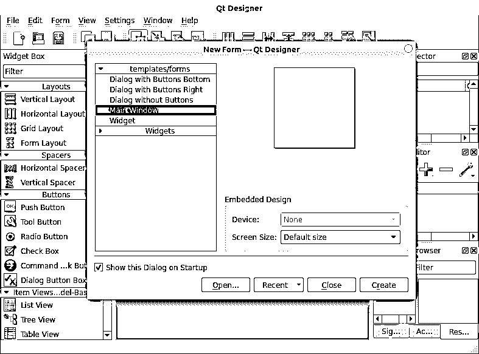](https://files.realpython.com/media/Qt-Designer-GUI.7fddfb2df121.png)

前台的窗口是 Qt Designer 的*新表单*对话框。背景中的窗口是 Qt Designer 的主窗口。在接下来的两节中，您将学习如何使用 Qt Designer 界面的这些组件的基础知识。

### 使用 Qt Designer 的新表单对话框

当您运行 Qt Designer 时，您会看到应用程序的主窗口和*新表单*对话框。在此对话框中，您可以从五个可用的 GUI 模板中进行选择。这些模板包括创建对话框、主窗口和自定义小部件的选项:

| 模板 | 表单类型 | 小工具 | 基础类 |
| --- | --- | --- | --- |
| 底部有按钮的对话框 | 对话 | *确定*和*取消*按钮水平布置在右下角 | [T2`QDialog`](https://doc.qt.io/qt-5/qdialog.html) |
| 右边有按钮的对话框 | 对话 | *确定*和*取消右上角垂直排列的*按钮 | `QDialog` |
| 没有按钮的对话框 | 对话 | 不 | `QDialog` |
| 主窗口 | 主窗口 | 顶部的菜单栏和底部的状态栏 | [T2`QMainWindow`](https://doc.qt.io/qt-5/qmainwindow.html) |
| 小部件 | 小部件 | 不 | [T2`QWidget`](https://doc.qt.io/qt-5/qwidget.html) |

默认情况下，当运行 Qt Designer 时，*新表单*对话框出现在前台。如果没有，那么你可以点击 Qt Designer 工具栏上的*新建*。也可以点击主菜单中的*文件→新建*或者按键盘上的 `Ctrl` + `N` 。

在*新建表单*对话框中，您可以选择想要启动的表单模板，然后点击*创建*生成一个新表单:

[https://player.vimeo.com/video/500145925?background=1](https://player.vimeo.com/video/500145925?background=1)

要使用 Qt Designer 模板创建一个新的空表单，您只需从*新表单*对话框中选择所需的模板，然后单击*创建*或按键盘上的 `Alt` + `R` 。

注意，前两个对话框模板有自己的默认按钮。这些是 [`QDialogButtonBox`](https://doc.qt.io/qt-5/qdialogbuttonbox.html) 中包含的标准按钮。这个类自动处理不同平台上按钮的位置或顺序。

例如，如果你使用一个*取消*按钮和一个*确定*按钮，那么 Linux 和 macOS 上的标准是以同样的顺序显示这些按钮。但在 Windows 上，按钮的顺序会对调，先出现 *OK* ，再出现 *Cancel* 。`QDialogButtonBox`自动为您处理此问题。

[*Remove ads*](/account/join/)

### 使用 Qt Designer 的主窗口

Qt Designer 的**主窗口**提供了一个菜单栏选项，用于保存和管理表单、编辑表单和更改编辑模式、布局和预览表单，以及调整应用程序的设置和访问其帮助文档:

[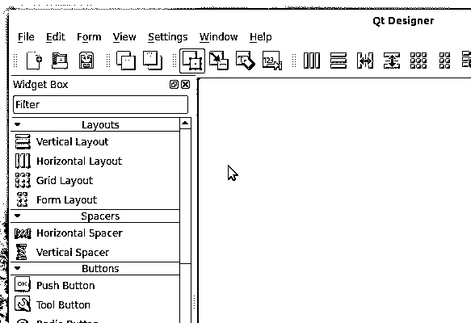](https://files.realpython.com/media/Qt-Designer-Main-Menu.4b5fbaa7079f.gif)

主窗口还提供了一个显示常用选项的工具栏。在编辑和布局表单时，您会用到这些选项中的大部分。这些选项在主菜单中也是可用的，特别是在*文件*、*编辑*和*表单*菜单中:

[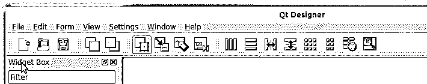](https://files.realpython.com/media/Qt-Designer-Toolbar.81e22badf269.gif)

Qt Designer 的主窗口还包括几个 **dock 窗口**，它们提供了一组丰富的特性和工具:

*   部件盒
*   对象检查器
*   属性编辑器
*   资源浏览器
*   动作编辑器
*   信号/插槽编辑器

**小部件框**提供了一系列布局管理器、间隔器、标准小部件和其他对象，您可以用它们来为您的对话框和窗口创建 GUI:

[https://player.vimeo.com/video/500146161?background=1](https://player.vimeo.com/video/500146161?background=1)

微件框在窗口顶部提供了一个过滤器选项。您可以键入给定对象或 widget 的名称并快速访问它。这些对象被分组到反映其特定用途的类别中。通过单击类别标签旁边的手柄，可以显示或隐藏类别中的所有可用对象。

当您创建表单时，您可以用鼠标指针从小部件框中取出对象，然后将它们拖放到表单上以构建 GUI。

小部件框还在窗口底部提供了一个**便签本**部分。在此部分中，您可以将常用对象分组到单独的类别中。通过将当前放在表单上的任何小部件拖放回小部件框中，可以用这些小部件填充便签簿类别。您可以通过右键单击小部件并在上下文菜单中选择*移除*来移除小部件。

**对象检查器**提供了当前表单上所有对象的[树](https://doc.qt.io/qt-5/objecttrees.html)视图。对象检查器的顶部还有一个过滤框，允许您在树中查找对象。您可以使用对象检查器来设置表单及其小部件的名称和其他属性。您也可以右键单击任何小部件来访问带有附加选项的上下文菜单:

[https://player.vimeo.com/video/500145888?background=1](https://player.vimeo.com/video/500145888?background=1)

使用对象检查器，您可以管理表单上的小部件。您可以重命名它们，更新它们的一些属性，从表单中删除它们，等等。对象检查器中的树形视图反映了当前表单上小部件和对象的**父子关系**。

**属性编辑器**是出现在 Qt Designer 主窗口中的另一个 dock 窗口。该窗口包含一个两列表格，其中包含活动对象的属性及其值。顾名思义，您可以使用属性编辑器来编辑对象的属性值:

[https://player.vimeo.com/video/500146210?background=1](https://player.vimeo.com/video/500146210?background=1)

属性编辑器提供了一种用户友好的方式来访问和编辑活动对象的属性值，如名称、大小、字体、图标等。编辑器上列出的属性将根据您在表单上选择的对象而变化。

这些属性根据类的层次结构从上到下列出。例如，如果您在表单上选择了一个 [`QPushButton`](https://doc.qt.io/qt-5/qpushbutton.html) ，那么属性编辑器会显示`QWidget`的属性，然后是 [`QAbstractButton`](https://doc.qt.io/qt-5/qabstractbutton.html) 的属性，最后是`QPushButton`本身的属性。请注意，编辑器上的行显示不同的颜色，以便直观地区分基础类。

最后，您有三个 dock 窗口，它们通常以标签的形式出现在右下角:

1.  **资源浏览器**提供了一种快速向应用程序添加资源的方式，例如图标、翻译文件、图像和其他二进制文件。
2.  **动作编辑器**提供了一种创建动作并将它们添加到表单中的方法。
3.  **信号/插槽编辑器**提供了一种在表单中连接信号和插槽的方法。

以下是这些工具提供的一些选项:

[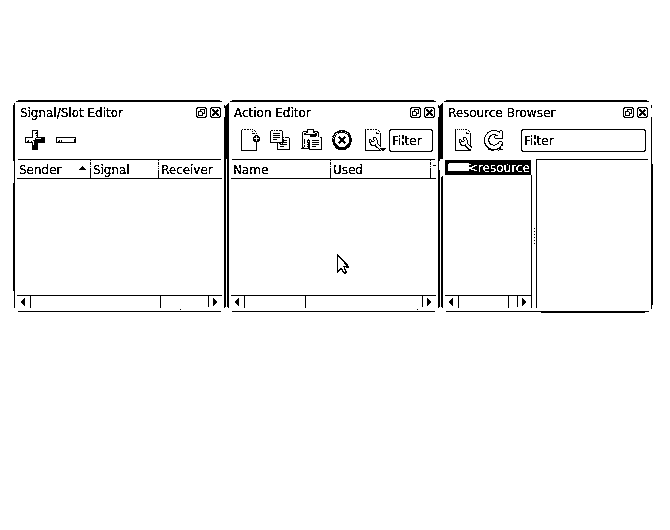](https://files.realpython.com/media/Qt-Designer-Action-Signal-Resource.594226f375cb.gif)

就是这样！这三个 dock 窗口完善了 Qt Designer 为您创建和定制对话框和窗口的 GUI 提供的工具和选项。

[*Remove ads*](/account/join/)

### 使用 Qt Designer 与手工编写图形用户界面

使用 PyQt，您至少有两种选择来创建窗口或对话框的 GUI:您可以使用 Qt Designer，或者您可以用普通的 Python 代码手工编写 GUI。两种选择各有利弊。有时很难决定何时使用其中之一。

Qt Designer 提供了一个用户友好的图形界面，允许您快速创建 GUI。这可以提高开发人员的工作效率，缩短开发周期。

另一方面，手工编写图形用户界面可以给你更多的控制权。使用这种方法，添加新的组件和特性不需要除了您的[代码编辑器或 IDE](https://realpython.com/python-ides-code-editors-guide/) 之外的任何额外工具，这在一些开发环境中非常方便。

你是使用 Qt 设计器还是手工编码你的 GUI 是一个个人决定。以下是这两种方法的一些一般注意事项:

| 特征 | Qt 设计器 | 手工编码 |
| --- | --- | --- |
| 开发人员的生产力 | 高的 | 如果您熟悉 PyQt，则为高，否则为低 |
| GUI 逻辑与业务逻辑的分离 | 高的 | 低的 |
| 对 GUI 组件的控制 | 低的 | 高的 |
| 动态添加和删除小部件的能力 | 低的 | 高的 |
| 探索、学习、原型制作和草图绘制的灵活性 | 高的 | 低的 |
| 使用定制小部件的灵活性 | 低的 | 高的 |
| 样板代码的数量 | 高的 | 低的 |

除了这些问题，如果您刚刚开始使用 PyQt，那么 Qt Designer 可以帮助您发现可用的小部件、布局管理器、基类、属性及其典型值，等等。

使用 Qt Designer 和手工编写 GUI 之间的最后一个区别是，在使用 Qt Designer 时，您需要运行一个额外的步骤:将`.ui`文件翻译成 Python 代码。

## 用 Qt Designer 和 Python 构建主窗口

使用 PyQt，您可以构建**主窗口风格的**和**对话框风格的**应用程序。主窗口风格的应用程序通常由一个带有菜单栏、一个或多个工具栏、中央小部件和状态栏的主窗口组成。它们也可以包括几个对话框，但是这些对话框独立于主窗口。

Qt Designer 使您能够使用预定义的主窗口模板快速构建主窗口的 GUI。一旦基于该模板创建了表单，您将拥有执行以下操作的工具:

*   创建主菜单
*   添加和填充工具栏
*   布局小部件

Qt Designer 的主窗口模板还提供了一个默认的中央小部件和一个位于窗口底部的状态栏:

[https://player.vimeo.com/video/500145960?background=1](https://player.vimeo.com/video/500145960?background=1)

Qt Designer 将其表单保存在`.ui`文件中。这些是`XML`文件，包含您稍后在应用程序中重新创建 GUI 所需的所有信息。

要保存表格，进入*文件→保存*，在*将表格另存为*对话框中输入`main_window.ui`，选择保存文件的目录，点击*保存*。您也可以通过按键盘上的 `Ctrl` + `S` 进入*保存表单为*对话框。

不要关闭 Qt Designer 会话——待在那里继续向刚刚创建的主窗口添加菜单和工具栏。

### 创建主菜单

Qt Designer 的主窗口模板在表单顶部提供了一个空的**菜单栏**。您可以使用菜单编辑器将**菜单**添加到菜单栏。菜单是选项的下拉列表，提供对应用程序选项的快速访问。回到 Qt Designer 和你新创建的主窗口。在表单的顶部，您会看到一个菜单栏，带有占位符文本*在此输入*。

如果您在这个占位符文本上双击或按下 `Enter` ，那么您可以键入您的第一个菜单的名称。要确认菜单名称，只需按下 `Enter` 。

假设您想要创建自己的文本编辑器。通常，这种应用程序有一个*文件*菜单，其中至少有以下一些选项:

*   ***新建*** 用于新建一个文档
*   ***打开*** 打开已有文档
*   ***打开最近的*** 打开最近查看的文档
*   ***保存*** 用于保存文档
*   ***退出*** 退出应用程序

以下是如何使用 Qt Designer 创建此菜单:

[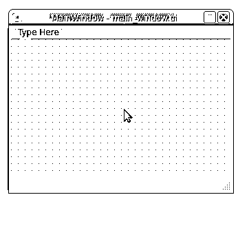](https://files.realpython.com/media/Qt-Designer-Main-Menu-Editor.a5e266106618.gif)

Qt Designer 的菜单编辑器允许您以用户友好的方式向菜单栏添加菜单。当您输入菜单或菜单选项的名称时，您可以在给定的字母前使用一个&符号(`&`)来提供一个**键盘快捷键**。

例如，如果您在*文件*菜单中的 *F* 前添加了一个&符号，那么您可以通过按 `Alt` + `F` 来访问该菜单。同样，如果您在*新建*中的 *N* 前添加了一个&符号，那么一旦您启动了*文件*菜单，您就可以通过按 `N` 来访问*新建*选项。

使用菜单编辑器，您还可以将**分隔符**添加到菜单中。这是在视觉上分离菜单选项并按逻辑分组的好方法。要添加分隔符，双击菜单编辑器中活动菜单末端的*添加分隔符*选项。右键点击现有分隔符，然后在上下文菜单中选择*移除分隔符*，即可移除该分隔符。此菜单还允许您添加新的分隔符。

如果您需要将分隔符移动到给定菜单中的另一个位置，那么您可以将分隔符拖动到所需的位置并将其放在那里。一条红线将指示分离器的放置位置。

您也可以将**子菜单**添加到给定的菜单选项中。为此，点击你想要附加子菜单的菜单选项右侧的图标，就像你在上面的例子中使用*打开最近的*选项一样。

要运行表单的预览，请转到*表单→预览*，或者点击键盘上的组合键 `Ctrl` + `R` 。

当您在示例文本编辑器中创建类似于*文件*菜单的菜单时，一个新的`QMenu`对象会自动添加到您的菜单栏中。当您向给定菜单添加菜单选项时，您创建了一个**动作**。Qt Designer 提供了一个动作编辑器，用于创建、定制和管理动作。该工具提供了一些方便的选项，您可以使用它们来微调您的操作:

[https://player.vimeo.com/video/500146019?background=1](https://player.vimeo.com/video/500146019?background=1)

使用动作编辑器，您可以微调、更新或设置以下选项:

*   动作的文本，将显示在菜单选项和工具栏按钮上
*   对象名，您将在代码中使用它来引用 action 对象
*   将显示在菜单选项和工具栏按钮上的图标
*   动作的[可检查的](https://doc.qt.io/qt-5/qaction.html#checkable-prop)属性
*   键盘快捷键，它将为用户提供一种快速访问该操作的方式

菜单选项文本中的最后一个省略号(`...`)是一种广泛使用的命名约定，它不执行立即操作，而是启动一个弹出对话框来执行进一步的操作。

对于图标，你需要将这些图标作为独立的文件打包到你的应用程序中，或者你可以创建一个[资源文件](https://doc.qt.io/qt-5/resources.html)，也称为`.qrc`文件。对于此示例，您可以通过单击下面的链接下载所需的图标和其他资源:

**获取源代码:** [点击此处获取源代码，您将在本教程中使用](https://realpython.com/bonus/qt-designer-code/)了解如何使用 Qt Designer 创建 Python GUI 应用程序。

下载完图标后，在`main_window.ui`文件旁边创建一个`resources`目录，并将图标复制到那里。然后回到动作编辑器，像这样给你的动作添加图标:

[https://player.vimeo.com/video/500145992?background=1](https://player.vimeo.com/video/500145992?background=1)

请注意，您的菜单选项现在会在左边显示一个图标。这为您的用户提供了额外的视觉信息，并帮助他们找到所需的选项。现在继续添加一个带有以下选项的*编辑*菜单:

*   ***复制*** 用于复制一些文字
*   ***粘贴*** 用于粘贴一些文字
*   ***剪切*** 用于剪切一些文字
*   ***查找和替换*** 用于查找和替换文本

接下来，添加一个*帮助*菜单，带有一个*关于*选项，用于启动一个对话框，提供关于你的文本编辑器的一般信息。最后，转到属性编辑器，将窗口的标题设置为`Sample Editor`。添加这些内容后，您的主窗口应该如下所示:

[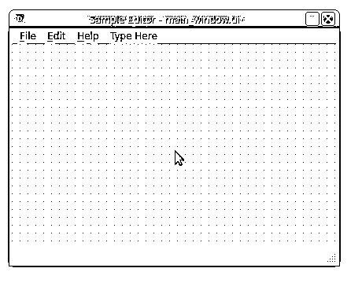](https://files.realpython.com/media/Sample-Text-Editor-Main-Menu.e9558f4d9989.gif)

有了这些补充，您的示例文本编辑器的主菜单开始看起来像真正的文本编辑器的菜单了！

[*Remove ads*](/account/join/)

### 创建工具栏

您可以使用 Qt Designer 在主窗口的 GUI 中添加任意数量的工具栏。为此，右键单击表单并从上下文菜单中选择*添加工具栏*。这将在窗口顶部添加一个空工具栏。或者，您可以通过选择*将工具栏添加到其他区域*来预定义您想要放置给定工具栏的[工具栏区域](https://www.riverbankcomputing.com/static/Docs/PyQt5/api/qtcore/qt.html#ToolBarArea):

[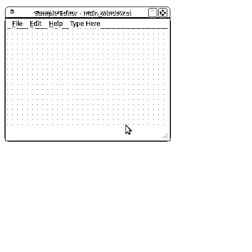](https://files.realpython.com/media/Qt-Designer-Create-Toolbars.eca8fa7e93f3.gif)

一旦你的工具栏就位，你就可以用按钮来填充它们。为此，您使用**动作**而不是小部件框中的特定工具栏按钮。要将动作添加到工具栏，可以使用动作编辑器:

[https://player.vimeo.com/video/500146235?background=1](https://player.vimeo.com/video/500146235?background=1)

操作可以在菜单选项和工具栏按钮之间共享，因此在这种情况下，您可以重用在上一节填充菜单时创建的操作。要填充工具栏，单击动作编辑器上的动作，然后将其拖放到工具栏上。请注意，通过右键单击工具栏，您可以添加分隔符来直观地分隔工具按钮。

### 布局单个中央部件

Qt Designer 使用`QMainWindow`构建它的主窗口模板。这个类提供了一个默认布局，允许您创建一个菜单栏、一个或多个工具栏、一个或多个 dock 小部件、一个状态栏和一个中央小部件。默认情况下，Qt Designer 使用一个`QWidget`对象作为主窗口模板上的中心小部件。

使用一个基本的`QWidget`对象作为主窗口 GUI 的中心部件是一个很好的选择，因为在这个部件之上，你可以在一个连贯的布局中放置一个**单个部件**或者**多个部件**。

例如，在您的示例文本编辑器中，您可能希望使用一个小部件为您的用户提供一个工作区来键入、复制、粘贴和编辑他们的文本。为此，您可以使用一个`QTextEdit`对象，然后添加一个垂直(或水平)布局作为中心小部件的布局:

[https://player.vimeo.com/video/500146185?background=1](https://player.vimeo.com/video/500146185?background=1)

在本例中，首先将一个`QTextEdit`拖到表单上。然后你点击表单来选择你的中心部件。最后，通过点击 Qt Designer 工具栏上的*垂直布局*，将垂直布局应用到您的中心小部件。

由于`QTextEdit`周围的间距看起来不合适，您使用对象检查器将布局的边距从`9`像素更改为`1`像素。

使用 Qt Designer，您可以使用不同的布局管理器来快速排列您的小部件。可以说，用 Qt Designer 布局 GUI 最容易的方法是使用主工具栏上与布局相关的部分:

[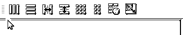](https://files.realpython.com/media/Qt-Designer-Layout-Toolbar.dfe5eace5102.gif)

从左到右，您会发现以下选项用于创建不同类型的布局:

| [计]选项 | 小部件排列 | 布局类 | 键盘快捷键 |
| --- | --- | --- | --- |
| *水平布局* | 水平地排成一行和几列 | [T2`QHBoxLayout`](https://doc.qt.io/qt-5/qhboxlayout.html) | `Ctrl` + `1` |
| *垂直布局* | 垂直排列成一列和几行 | [T2`QVBoxLayout`](https://doc.qt.io/qt-5/qvboxlayout.html) | `Ctrl` + `2` |
| *在分离器中水平布置* | 在可调整大小的拆分器中水平显示 | [T2`QSplitter`](https://doc.qt.io/qt-5/qsplitter.html) | `Ctrl` + `3` |
| *在分离器中垂直布置* | 在可调整大小的拆分器中垂直显示 | `QSplitter` | `Ctrl` + `4` |
| *布置成网格* | 有几行和几列的表格 | [T2`QGridLayout`](https://doc.qt.io/qt-5/qgridlayout.html) | `Ctrl` + `5` |
| *以表格形式布局* | 在两列表格中 | [T2`QFormLayout`](https://doc.qt.io/qt-5/qformlayout.html) | `Ctrl` + `6` |

工具栏中的最后两个选项与布局相关，但不创建布局:

1.  ***打破布局*** 允许你打破一个已有的布局。一旦在布局中排列了小部件，您就不能单独移动它们或调整它们的大小，因为它们的几何图形是由布局控制的。要修改单个部件，您可能需要中断布局并在以后重做。要访问此选项，您可以按键盘上的 `Ctrl` + `0` 。

2.  ***调整大小*** 调整布局的大小，以容纳所包含的小工具，并确保每个小工具都有足够的空间可见。要访问此选项，您可以按键盘上的 `Ctrl` + `J` 。

您也可以通过 Qt Designer 的主菜单栏，在*表单*菜单下访问所有这些布局相关的选项:

[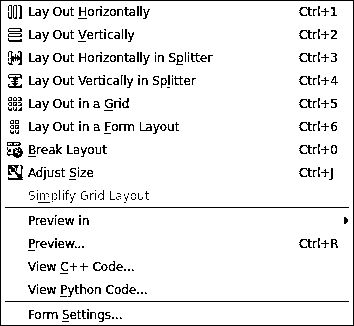](https://files.realpython.com/media/Qt-Designer-Form-Menu.286bb196fd55.png)

在*表单*菜单中，您可以访问所有与布局相关的选项，以及访问这些选项的完整键盘快捷键参考。您也可以通过表单的上下文菜单，在*布局*选项下访问这些选项。

[*Remove ads*](/account/join/)

### 布局一个复合中心部件

当你创建你的主窗口时，你可能会遇到这样的情况，你需要在给定的布局中使用**多个窗口部件**作为你的中心窗口部件。由于 Qt Designer 的主窗口模板附带了一个`QWidget`对象作为其中心小部件，因此您可以利用它来创建您自己的定制小部件排列，然后将其设置为中心小部件的顶层布局。

通过 Qt Designer，您可以使用布局管理器来布局您的小部件，正如您在上一节中已经看到的那样。如果您需要主窗口 GUI 的复合小部件布局，那么您可以通过运行以下步骤来构建它:

1.  将小部件拖放到您的表单上，并尝试将它们放置在所需的位置附近。
2.  选择应该由给定布局一起管理的小部件。
3.  使用 Qt Designer 的工具栏或主菜单，或者使用表单的上下文菜单应用适当的布局。

虽然您可以将布局拖到表单上，然后将小部件拖到布局上，但最佳做法是首先拖动所有小部件和间隔器，然后重复选择相关的小部件和间隔器，以将布局应用于它们。

例如，假设你正在[构建一个计算器应用程序](https://realpython.com/python-pyqt-gui-calculator/)。你需要一个 [`QLineEdit`](https://doc.qt.io/qt-5/qlineedit.html) 对象在你的窗体顶部显示操作和它们的结果。在线编辑下，您需要一些用于数字和操作的`QPushButton`对象。这给了你一个这样的窗口:

[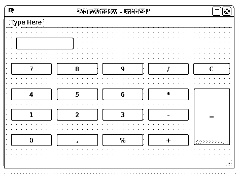](https://files.realpython.com/media/Calculator-No-Layout.0c561e217832.png)

这看起来有点像一个计算器，但是 GUI 是杂乱的。要将它安排到一个更加完美的计算器 GUI 中，您可以为按钮使用网格布局，并使用垂直框布局作为计算器的顶层布局:

[https://player.vimeo.com/video/492155782?background=1](https://player.vimeo.com/video/492155782?background=1)

你的计算器还需要一些额外的润色，但它现在看起来好多了。要获得更完美的版本，您可以使用属性编辑器来调整按钮上某些属性的值，例如它们的最大和最小大小。您还可以为计算器的主窗口设置固定的大小，等等。来吧，试一试！

### 拥有状态栏

Qt Designer 的主窗口模板默认提供了一个[状态栏](https://en.wikipedia.org/wiki/Status_bar)。状态栏是一个水平面板，通常位于 GUI 应用程序主窗口的底部。它的主要目的是显示关于应用程序当前**状态**的信息。

您可以将状态栏分成几个部分，并在每个部分显示不同的信息。状态栏上的信息可以是**临时的**或者**永久的**，大部分时间都是以短信的形式出现。状态栏上显示的信息的目的是让你的用户了解应用程序当前正在做什么，以及它在给定时间的一般状态。

您还可以使用状态栏来显示**帮助提示**，这是描述给定按钮或菜单选项功能的简短帮助消息。当用户将鼠标指针悬停在工具栏按钮或菜单选项上时，这种消息会出现在状态栏上。

## 用 Qt Designer 和 Python 创建对话框

[对话框](https://en.wikipedia.org/wiki/Dialog_box)是小尺寸窗口，通常用于提供辅助功能，如*首选项*对话框，或通过显示错误消息或给定操作的一般信息与用户交流。您还可以使用对话框向用户询问一些必需的信息，或者确认即将发生的操作。

PyQt 提供了一组丰富的内置对话框，可以直接在应用程序中使用。你只需要从 [`PyQt5.QtWidgets`](https://www.riverbankcomputing.com/static/Docs/PyQt5/api/qtwidgets/qtwidgets-module.html) 中导入即可。这里有一个总结:

| 对话类 | 目的 |
| --- | --- |
| [T2`QFontDialog`](https://doc.qt.io/qt-5/qfontdialog.html) | 选择和设置给定文本的字体 |
| [T2`QPrintDialog`](https://doc.qt.io/qt-5/qprintdialog.html) | 指定打印机的设置 |
| [T2`QProgressDialog`](https://doc.qt.io/qt-5/qprogressdialog.html) | 显示长期运行操作的进度 |
| [T2`QColorDialog`](https://doc.qt.io/qt-5/qcolordialog.html) | 选择和设置颜色 |
| [T2`QInputDialog`](https://doc.qt.io/qt-5/qinputdialog.html) | 从用户处获取单个值 |
| [T2`QFileDialog`](https://doc.qt.io/qt-5/qfiledialog.html) | 选择文件和目录 |
| [T2`QMessageBox`](https://doc.qt.io/qt-5/qmessagebox.html) | 显示错误、一般信息、警告和问题等消息 |
| [T2`QErrorMessage`](https://doc.qt.io/qt-5/qerrormessage.html) | 显示错误消息 |

所有这些内置对话框都可以直接在代码中使用。它们中的大多数都提供了类方法来根据您的需要构建特定类型的对话框。除了这些对话框，PyQt 还提供了 [`QDialog`](https://doc.qt.io/qt-5/qdialog.html) 类。您可以使用这个类在代码中创建您自己的对话框，但是您也可以使用 Qt Designer 快速创建您的对话框。

在接下来的几节中，您将学习如何使用 Qt Designer 及其对话框模板来创建、布局和定制您的对话框。

[*Remove ads*](/account/join/)

### 创建对话框图形用户界面

要用 Qt Designer 创建自定义对话框，从*新表单*对话框中选择合适的对话框模板。将所需的小部件拖放到表单上，正确地布置它们，并将表单保存在一个`.ui`文件中，供以后在应用程序中使用。

回到您的示例文本编辑器，假设您想要添加一个*查找和替换*对话框，如下所示:

[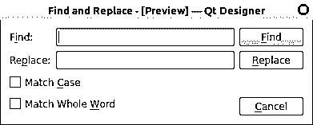](https://files.realpython.com/media/Find-Replace-Dialog.279daf19c283.png)

要创建这个对话框，从没有按钮的对话框模板开始，向表单添加所需的小部件:

[https://player.vimeo.com/video/500146098?background=1](https://player.vimeo.com/video/500146098?background=1)

这里，首先使用无按钮对话框模板创建一个空对话框，并在对象检查器中将窗口标题设置为*查找并替换*。然后使用小部件框将两个 [`QLabel`](https://www.riverbankcomputing.com/static/Docs/PyQt5/api/qtwidgets/qlabel.html) 对象拖放到表单上。这些标签向用户询问他们需要查找和替换的单词。这些单词将被输入到标签附近相应的`QLineEdit`对象中。

接下来，将三个`QPushButton`对象拖放到表单上。这些按钮将允许您的用户在当前文档中查找和替换单词。最后，您添加两个 [`QCheckBox`](https://doc.qt.io/qt-5/qcheckbox.html) 对象来提供*匹配大小写*和*匹配全字*选项。

一旦表单上有了所有的小部件，请确保将它们放置在与您希望在最终对话框中实现的目标相似的位置。现在是时候布置小部件了。

### 布局对话框 GUI

正如您之前看到的，要在一个表单中排列小部件，您可以使用几个**布局管理器**。要布置您的*查找和替换*对话框，请为标签、线条编辑和复选框使用网格布局。对于按钮，使用垂直布局。最后，使用水平布局作为对话框的顶层布局管理器:

[https://player.vimeo.com/video/500146036?background=1](https://player.vimeo.com/video/500146036?background=1)

在这里，您用鼠标指针选择标签、线条编辑和复选框，并对它们应用网格布局。之后，在*替换*和*取消*按钮之间添加一个垂直间隔，使它们在视觉上保持分离。

最后一步是设置对话框的顶层布局。在这种情况下，使用水平布局管理器。就是这样！您已经用 Qt Designer 构建了*查找和替换*对话框的 GUI。用文件名`find_replace.ui`保存。

使用 Qt Designer，您可以在对话框中调整许多其他属性和特性。例如，您可以设置输入小部件的 tab 键顺序，以改善用户使用键盘导航对话框的体验。还可以提供键盘快捷键，连接[信号和插槽](https://doc.qt.io/qt-5/signalsandslots.html)等等。

### 连接信号和插槽

到目前为止，您已经在 Edit Widgets 模式下使用了 Qt Designer，这是它的默认模式。在这种模式下，您可以向表单添加小部件，编辑小部件的属性，在表单上布置小部件，等等。但是，Qt Designer 有多达四种不同的模式，允许您处理表单的不同功能:

| 方式 | 目的 | 菜单选项 | 键盘快捷键 |
| --- | --- | --- | --- |
| 编辑小部件 | 编辑小部件 | *编辑→编辑小工具* | T2`F3` |
| 编辑信号/插槽 | 连接内置信号和插槽 | *编辑→编辑信号/插槽* | T2`F4` |
| 编辑好友 | 设置键盘快捷键 | *编辑→编辑好友* | 不 |
| 编辑 Tab 键顺序 | 设置小部件的 tab 键顺序 | *编辑→编辑标签顺序* | 不 |

您也可以通过单击 Qt Designer 工具栏中与模式相关部分的相应按钮来访问这些模式，如下所示:

[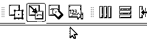](https://files.realpython.com/media/Qt-Designer-Mode-Toolbar.fbeca3ebfcbd.gif)

为了能够编辑部件和表单的内置信号和插槽，首先需要切换到编辑信号/插槽模式。

**注意:**在 Qt 中，术语**好友**指的是标签和小部件之间的特殊关系，其中标签提供了键盘快捷键或快捷方式，允许您使用键盘访问好友小部件。

用户在小部件和表单上的动作，比如点击或按键，在 PyQt 中被称为**事件**。当事件发生时，手边的小工具发出一个**信号**。这种机制允许您运行操作来响应事件。这些动作被称为**槽**，它们是方法或函数。

要执行一个插槽来响应一个事件，您需要选择一个由小部件发出的信号来响应一个事件，并将其连接到所需的插槽。

大多数小部件，包括对话框和窗口，都实现了内置的信号，当给定的事件在小部件上发生时，就会发出这些信号。小部件还提供了内置的插槽，允许您执行某些标准化的操作。

要使用 Qt Designer 在两个小部件之间建立信号和插槽连接，您需要用鼠标选择**信号提供器小部件**，然后将它拖放到**插槽提供器小部件**上。这将启动 Qt Designer 的*配置连接*对话框。现在回到*查找和替换*对话框，切换到 Qt Designer 的编辑信号/插槽模式。然后将*取消*按钮拖放到表单上:

[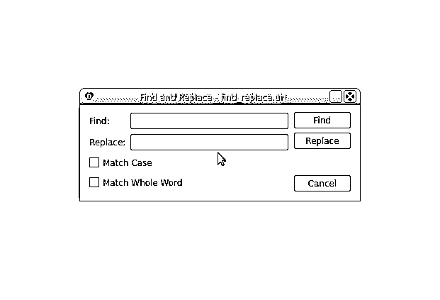](https://files.realpython.com/media/Qt-Designer-Configure-Connection-Dialog.8c1694ce6193.gif)

*配置连接*对话框有两个面板。在左侧面板上，您可以从信号提供商小部件中选择一个信号，在右侧面板上，您可以从插槽提供商小部件中选择一个插槽。要创建连接，按下 *OK* :

[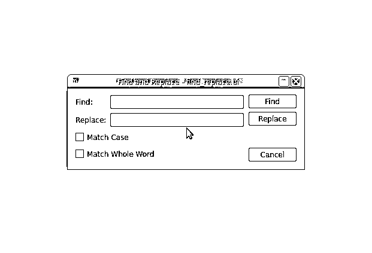](https://files.realpython.com/media/Qt-Designer-Create-Connection.ebe5c59da27a.gif)

连接显示为从信号提供者小部件到插槽提供者小部件的箭头，表示连接已经建立。您还会看到信号的名称和您刚刚连接的插槽。

在这种情况下，您将*取消*按钮的 [`clicked()`](https://doc.qt.io/qt-5/qabstractbutton.html#clicked) 信号与对话框的 [`reject()`](https://doc.qt.io/qt-5/qdialog.html#reject) 槽相连。现在，当您点击*取消*时，您的操作将被忽略，对话框将关闭。

要修改连接，请双击箭头或其中一个标签。这将显示*配置连接*对话框，在该对话框中，您可以根据需要更改信号或连接所涉及的插槽。

要删除连接，选择代表连接的箭头或识别信号和插槽的标签之一，然后按 `Del` 。

[*Remove ads*](/account/join/)

### 设置微件的标签顺序

为了提高你的对话框的可用性，你可以为你的输入部件设置一致的**标签顺序**。tab 键顺序是当您在键盘上按下 `Tab` 或 `Shift` + `Tab` 时，表单上的小部件成为焦点的顺序。

如果您使用 Qt Designer 创建表单，那么小部件的默认 tab 键顺序是基于您在表单上放置每个小部件的顺序。有时这个顺序不对，当你点击 `Tab` 或 `Shift` + `Tab` 时，焦点会跳到一个意想不到的小部件上。查看一下*查找和替换*对话框中的 tab 键顺序行为:

[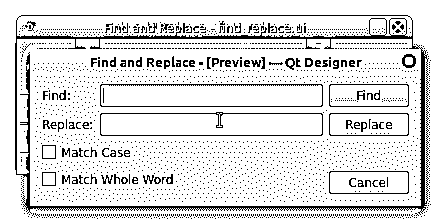](https://files.realpython.com/media/Find-Replace-Dialog-Tab-Order.36576752f247.gif)

焦点从*查找*行编辑开始，然后经过*替换*行编辑，然后通过复选框，最后通过按钮。如果您希望焦点从*查找*行编辑跳到*替换*行编辑，然后跳到*查找*按钮，该怎么办？在这种情况下，您可以更改对话框中输入小部件的 tab 键顺序。在 Qt Designer 中切换到编辑 Tab 键顺序模式。您会看到类似这样的内容:

[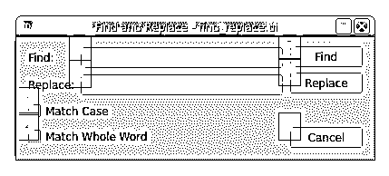](https://files.realpython.com/media/Qt-Designer-Tab-Order.43d9c2e325bd.png)

在编辑 tab 键顺序模式下，表单中的每个输入小部件都显示一个数字，标识它在 Tab 键顺序链中的位置。您可以通过点击所需顺序的数字来更改顺序:

[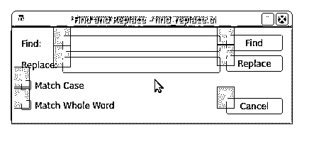](https://files.realpython.com/media/Qt-Designer-Change-Tab-Order.25ffc42684ab.gif)

您可以通过按所需顺序单击数字来更改输入小部件的 tab 键顺序。请注意，当您选择一个数字时，它会变为红色，表示这是 tab 键顺序链中当前编辑的位置。未设置的号码显示为蓝色，已设置的号码显示为绿色。如果你犯了一个错误，那么你可以通过从表单的上下文菜单中选择 *Restart* 来重新开始排序。

### 提供键盘快捷键

一个[键盘快捷键](https://doc.qt.io/qt-5/accelerators.html)是一个组合键，你可以在键盘上按下它来快速移动焦点到一个对话框或窗口的给定部件上。通常，键盘快捷键由 `Alt` 键和一个字母组成，该字母标识您想要访问的小工具或选项。这可以帮助您提高应用程序的可用性。

要在包含标签(如按钮或复选框)的小部件上定义键盘快捷键，只需在要在快捷键中使用的标签文本中的字母前放置一个&符号(`&`)。例如，在*查找和替换*对话框的*取消*按钮上的 *C* 前放置一个&符号，运行预览，然后按下 `Alt` + `C` ，如下例所示:

[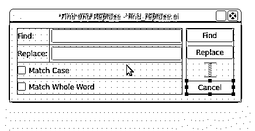](https://files.realpython.com/media/Qt-Designer-Set-Accelerator.6a0613a64996.gif)

通过在*取消*按钮文本中的字母 *C* 前放置一个&符号，您就创建了一个键盘快捷键。如果按下键盘上的 `Alt` + `C` ，则*取消*按钮被选中，对话框关闭。

要在不包含标签的小部件上定义键盘快捷键，例如行编辑，您需要使该小部件成为标签对象的伙伴。如果您想要创建好友连接，需要采取四个步骤:

1.  在标签文本中选择一个字母来标识好友连接，并提供键盘快捷键。
2.  在标签文本中的选定字母前放置一个&符号(`&`)。
3.  在 Qt Designer 中切换到编辑好友模式。
4.  将标签拖放到好友小部件上。

以下是如何在 *Find* 标签及其相关的行编辑之间创建伙伴关系:

[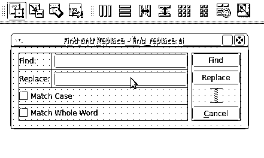](https://files.realpython.com/media/Qt-Designer-Set-Buddies.9680d49f376d.gif)

要在标签和小部件之间创建伙伴关系，请用鼠标选择标签，并将其拖到要设置为伙伴的输入小部件上。标签和输入部件将成为伙伴。从这一点开始，您可以按下 `Alt` 加上标签文本中选定的字母，将焦点移动到相关的小部件。

需要注意的是，在给定的表单中，不应该有两个带有相同键盘快捷键的小部件。这意味着您需要为每个键盘快捷键选择一个唯一的字母。

继续使用 Qt Designer 为您的*查找和替换*对话框上的小部件设置键盘快捷键。最终的结果应该像你在[创建对话框 GUI](https://realpython.com/qt-designer-python/#creating-a-dialog-gui) 一节开始时看到的对话框。

[*Remove ads*](/account/join/)

## 在应用程序中集成窗口和对话框

至此，您已经学习了如何使用 Qt Designer 为您的主窗口和对话框创建 GUI。在本节中，您将学习如何将这些 GUI 集成到您的 Python 代码中，并构建一个真正的应用程序。在 PyQt 中有两种主要的方法:

1.  **使用 [`pyuic5`](https://www.riverbankcomputing.com/static/Docs/PyQt5/designer.html#pyuic5) 将`.ui`文件的内容转化为 Python 代码**
2.  **加载**`.ui`文件的内容动态使用 [`uic.loadUi()`](https://www.riverbankcomputing.com/static/Docs/PyQt5/api/uic/uic-module.html#loadUi)

第一种方法使用`pyuic5`，它是 PyQt 安装中包含的一个工具，允许您将`.ui`文件的内容翻译成 Python 代码。这种方法因其高效而被广泛使用。但是，它有一个缺点:每次用 Qt Designer 修改 GUI 时，都需要重新生成代码。

第二种方法利用`uic.loadUi()`将`.ui`文件的内容动态加载到您的应用程序中。当您使用不涉及大量加载时间的小型 GUI 时，这种方法是合适的。

### 设置使用的窗口和对话框

现在是时候设置您的窗口和对话框了，以便在实际应用程序中使用(在本例中，是一个示例文本编辑器)。如果你一直遵循这个教程，那么你应该至少有两个`.ui`文件:

1.  **`main_window.ui`** 带有文本编辑器的 GUI 示例应用程序
2.  **`find_replace.ui`** 用一个*的 GUI 找到并替换*对话框

继续创建一个名为`sample_editor/`的新目录。在这个目录中，创建另一个名为`ui/`的目录，并将您的`.ui`文件复制到其中。另外，将包含菜单选项和工具栏按钮图标的`resources/`目录复制到`sample_editor/ui/`目录。到目前为止，您的应用程序的结构应该如下所示:

```py
sample_editor/
│
└── ui/
    ├── resources/
    │   ├── edit-copy.png
    │   ├── edit-cut.png
    │   ├── edit-paste.png
    │   ├── file-exit.png
    │   ├── file-new.png
    │   ├── file-open.png
    │   ├── file-save.png
    │   └── help-content.png
    │
    ├── find_replace.ui
    └── main_window.ui
```

由于主窗口 GUI 相对复杂，您可以使用`pyuic5`将`main_window.ui`的内容翻译成 Python 代码。

您可以通过单击下面的链接下载构建示例文本编辑器所需的所有代码和资源:

**获取源代码:** [点击此处获取源代码，您将在本教程中使用](https://realpython.com/bonus/qt-designer-code/)了解如何使用 Qt Designer 创建 Python GUI 应用程序。

现在打开一个终端，导航到`sample_editor/`目录。一旦到达那里，运行以下命令:

```py
$ pyuic5 -o main_window_ui.py ui/main_window.ui
```

这个命令从`ui/main_window.ui`文件生成一个名为`main_window_ui.py`的 Python 模块，并将其放在您的`sample_editor/`目录中。这个模块包含了主窗口 GUI 的 Python 代码。下面是代码的一个小样本:

```py
# -*- coding: utf-8 -*-

# Form implementation generated from reading ui file 'ui/main_window.ui'
#
# Created by: PyQt5 UI code generator 5.15.1
#
# WARNING: Any manual changes made to this file will be lost when pyuic5 is
# run again.  Do not edit this file unless you know what you are doing.

from PyQt5 import QtCore, QtGui, QtWidgets

class Ui_MainWindow(object):
    def setupUi(self, MainWindow):
        MainWindow.setObjectName("MainWindow")
        MainWindow.resize(413, 299)
        self.centralwidget = QtWidgets.QWidget(MainWindow)
        # Snip...

    def retranslateUi(self, MainWindow):
        _translate = QtCore.QCoreApplication.translate
        MainWindow.setWindowTitle(_translate("MainWindow", "Sample Editor"))
        self.menu_File.setTitle(_translate("MainWindow", "&File"))
        # Snip...
```

`Ui_MainWindow`拥有生成样本编辑器主窗口 GUI 的所有代码。注意`.setupUi()`包含了创建所有需要的小部件并在 GUI 上展示它们的代码。`.retranslateUi()`包含了[国际化和本地化](https://en.wikipedia.org/wiki/Internationalization_and_localization)的代码，但是这个主题超出了本教程的范围。

**注意:**如果`pyuic5`对您不起作用，那么您需要检查您当前的 PyQt 安装。如果您在 Python 虚拟环境中安装了 PyQt，那么您可能需要激活该环境。您还可以移动到您的虚拟环境目录，并从那里运行`pyuic5`。通常，你会在`bin/`目录下找到这个应用程序。

如果您在系统范围内安装了 PyQt，那么您应该能够直接从命令行运行`pyuic5`,而不需要激活虚拟环境。

现在，您的工作目录应该如下所示:

```py
sample_editor/
│
├── ui/
│   ├── resources/
│   │   ├── edit-copy.png
│   │   ├── edit-cut.png
│   │   ├── edit-paste.png
│   │   ├── file-exit.png
│   │   ├── file-new.png
│   │   ├── file-open.png
│   │   ├── file-save.png
│   │   └── help-content.png
│   │
│   ├── find_replace.ui
│   └── main_window.ui
│
└── main_window_ui.py
```

由于您的*查找和替换*对话框非常小，您可以使用`uic.loadUi()`直接从您的`.ui`文件加载它的 GUI。这个函数将一个带有`.ui`文件路径的字符串作为参数，并返回一个实现 GUI 的`QWidget`子类。

这种动态加载`.ui`文件的方式在实践中很少使用。你可以用它来加载不需要太多努力的小对话框。使用这种方法，您不需要在每次使用 Qt Designer 修改`.ui`文件时都为对话框的 GUI 生成 Python 代码，这在某些情况下可以提高生产率和可维护性。

既然您已经选择了构建每个 GUI 的策略，那么是时候将所有东西放在一个真正的应用程序中了。

[*Remove ads*](/account/join/)

### 将所有东西放在一个应用程序中

示例文本编辑器的所有部分就绪后，您可以创建应用程序并编写所需的代码来使用主窗口和*查找和替换*对话框。在您的`sample_editor/`目录中启动您最喜欢的代码编辑器或 IDE，并创建一个名为`app.py`的新文件。向其中添加以下代码:

```py
 1import sys
 2
 3from PyQt5.QtWidgets import (
 4    QApplication, QDialog, QMainWindow, QMessageBox
 5)
 6from PyQt5.uic import loadUi
 7
 8from main_window_ui import Ui_MainWindow
 9
10class Window(QMainWindow, Ui_MainWindow):
11    def __init__(self, parent=None):
12        super().__init__(parent)
13        self.setupUi(self)
14        self.connectSignalsSlots()
15
16    def connectSignalsSlots(self):
17        self.action_Exit.triggered.connect(self.close)
18        self.action_Find_Replace.triggered.connect(self.findAndReplace)
19        self.action_About.triggered.connect(self.about)
20
21    def findAndReplace(self):
22        dialog = FindReplaceDialog(self)
23        dialog.exec()
24
25    def about(self):
26        QMessageBox.about(
27            self,
28            "About Sample Editor",
29            "<p>A sample text editor app built with:</p>"
30            "<p>- PyQt</p>"
31            "<p>- Qt Designer</p>"
32            "<p>- Python</p>",
33        )
34
35class FindReplaceDialog(QDialog):
36    def __init__(self, parent=None):
37        super().__init__(parent)
38        loadUi("ui/find_replace.ui", self)
39
40if __name__ == "__main__":
41    app = QApplication(sys.argv)
42    win = Window()
43    win.show()
44    sys.exit(app.exec())
```

下面是这段代码的作用:

*   **第 3 行** [导入](https://realpython.com/python-import/)构建应用程序和 GUI 所需的 PyQt 类。
*   **6 号线**从`uic`模块导入`loadUi()`。这个函数提供了一种动态加载`.ui`文件内容的方法。
*   第 8 行导入了`Ui_MainWindow`，它包含了主窗口的 GUI。
*   **第 10 行**定义了`Window`，它将提供你的应用程序的主窗口。在这种情况下，该类使用[多重继承](https://realpython.com/inheritance-composition-python/#inheriting-multiple-classes)。它继承了`QMainWindow`的主窗口功能和`Ui_MainWindow`的 GUI 功能。
*   第 13 行调用`.setupUi()`，为你的主窗口创建整个 GUI。
*   **第 16 行**定义`.connectSignalsSlots()`，连接所需的信号和插槽。
*   **第 21 行**定义`.findAndReplace()`。这个方法创建了一个*查找和替换*对话框的实例并执行它。
*   **第 25 行**定义了`.about()`，它创建并启动一个小对话框来提供关于应用程序的信息。在这种情况下，您使用基于`QMessageBox`的内置对话框。
*   **第 35 行**定义了`FindReplaceDialog`，提供了*查找和替换*对话框。
*   **第 38 行**调用`loadUi()`从文件`ui/find_replace.ui`中加载对话框的 GUI。

最后，在第 41 到 44 行，您创建应用程序，创建并显示主窗口，并通过调用 application 对象上的`.exec()`运行应用程序的主循环。

值得注意的是，Qt Designer 可以用与上面代码中不同的方式来命名您的操作。例如，您可能会发现名字`.actionE_xit`而不是`.action_Exit`是指*退出*动作。因此，为了让这个例子正常工作，您需要确保您使用了正确的名称。

如果您想使用自己的名字而不是 Qt Designer 生成的名字，那么您可以进入属性编辑器，将`.objectName`属性更改为适合您的名字。

**注意:**你也可以用[合成而不是多重继承](https://realpython.com/inheritance-composition-python/)来创建`Window`。

例如，您可以这样定义`Window`及其初始化器:

```py
class Window(QMainWindow):
    def __init__(self, parent=None):
        super().__init__(parent)
 self.ui = Ui_MainWindow() self.ui.setupUi(self)        self.connectSignalsSlots()

    def connectSignalsSlots(self):
 self.ui.action_Exit.triggered.connect(self.close) self.ui.action_Find_Replace.triggered.connect(            self.findAndReplace
        )
 self.ui.action_About.triggered.connect(self.about)    # Snip...
```

在这种情况下，您创建了`.ui`，它是`Ui_MainWindow`的一个实例。从现在开始，您需要使用`.ui`来访问主窗口 GUI 上的小部件和对象。

如果您运行此应用程序，您将在屏幕上看到以下窗口:

[https://player.vimeo.com/video/500233090?background=1](https://player.vimeo.com/video/500233090?background=1)

就是这样！您已经使用 Qt Designer 创建了一个简单的文本编辑器。请注意，要编写这个应用程序，您只需编写 44 行 Python 代码，这远远少于您从头开始编写等效应用程序的 GUI 所需的代码。

## 结论

在 PyQt 中创建应用程序时，通常会构建一个主窗口和几个对话框。如果您手工编写代码，构建这些窗口和对话框的 GUI 会花费很多时间。幸运的是， [Qt](https://doc.qt.io/) 提供了 [Qt Designer](https://doc.qt.io/qt-5/qtdesigner-manual.html) ，这是一个强大的工具，旨在使用用户友好的图形界面快速高效地创建 GUI。

有了 Qt Designer，您可以将所有需要的小部件拖放到一个空的表单上，对它们进行布局，然后马上创建您的 GUI。这些图形用户界面保存在`.ui`文件中，您可以将其翻译成 Python 代码并在您的应用程序中使用。

**在本教程中，您学习了如何:**

*   在你的系统上安装 **Qt Designer**
*   决定什么时候**使用 Qt Designer vs 手动编码**你的 GUI
*   使用 Qt Designer 构建应用程序主窗口的 GUI
*   使用 Qt Designer 创建和布局您的**对话框**的 GUI
*   在你的 GUI 应用程序中使用 Qt Designer 的`.ui`文件

最后，通过使用 Qt Designer 创建构建示例文本编辑器应用程序所需的窗口和对话框的 GUI，将所有这些知识付诸实践。您可以通过单击下面的链接获得构建此应用程序所需的所有代码和资源:

**获取源代码:** [点击此处获取源代码，您将在本教程中使用](https://realpython.com/bonus/qt-designer-code/)了解如何使用 Qt Designer 创建 Python GUI 应用程序。*********