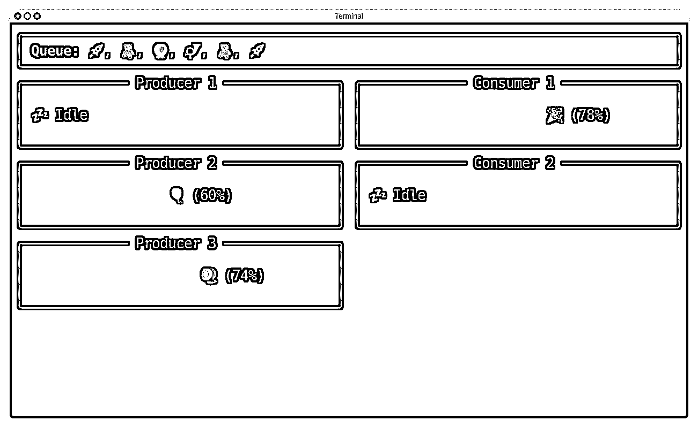
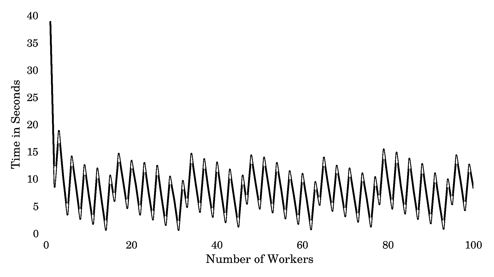

# 实践中的 Python 堆栈、队列和优先级队列

> 原文：<https://realpython.com/queue-in-python/>

队列是游戏、人工智能、卫星导航和任务调度中众多算法的支柱。它们是计算机科学学生在早期教育中学习的顶级抽象数据类型。同时，软件工程师经常利用更高级的**消息队列**来实现[微服务架构](https://realpython.com/python-microservices-grpc/)更好的可扩展性。另外，在 Python 中使用队列非常有趣！

Python 提供了一些内置的队列风格，您将在本教程中看到它们的作用。您还将快速入门关于队列及其类型的**理论。最后，您将看到一些**外部库**，用于连接主要云平台提供商上可用的流行消息代理。**

**在本教程中，您将学习如何:**

*   区分各种**类型的队列**
*   在 Python 中实现**队列数据类型**
*   通过应用正确的队列解决**实际问题**
*   使用 Python 的**线程安全**、**异步**和**进程间**队列
*   通过库将 Python 与分布式消息队列代理集成在一起

为了充分利用本教程，您应该熟悉 Python 的序列类型，例如[列表和元组](https://realpython.com/python-lists-tuples/)，以及标准库中更高级别的[集合](https://realpython.com/python-collections-module/)。

您可以通过单击下面框中的链接下载本教程的完整源代码以及相关的示例数据:

**获取源代码:** [单击此处获取源代码和示例数据](https://realpython.com/bonus/queue-code/)，您将使用它们来探索 Python 中的队列。

## 了解队列的类型

队列是一种抽象数据类型,表示根据一组规则排列的元素的**序列**。在本节中，您将了解最常见的队列类型及其相应的元素排列规则。至少，每个队列都提供了使用[大 O](https://realpython.com/binary-search-python/#the-big-o-notation) 符号在[常数时间](https://en.wikipedia.org/wiki/Time_complexity#Constant_time)或 O(1)中添加和删除元素的操作。这意味着无论队列大小如何，这两个操作都应该是即时的。

一些队列可能支持其他更具体的操作。是时候多了解他们了！

[*Remove ads*](/account/join/)

### 队列:先进先出

单词 *queue* 根据上下文可以有不同的含义。然而，当人们在没有使用任何限定词的情况下提到队列时，他们通常指的是 [FIFO 队列](https://en.wikipedia.org/wiki/FIFO_(computing_and_electronics))，这类似于你可能在杂货店收银台或旅游景点看到的队列:

[](https://files.realpython.com/media/IMG_3976.aaccf0e9a1fb.jpg)

<figcaption class="figure-caption text-center">Tourists Queuing Up to Enter the American Museum of Natural History in New York</figcaption>

请注意，与照片中人们并排聚集的队伍不同，严格意义上的队列是一列纵队，一次只允许一个人进入。

FIFO 是**先进先出**的缩写，它描述了元素通过队列的流动。这种队列中的元素将按照[先到先服务](https://www.merriam-webster.com/dictionary/first%20come%2C%20first%20served)的原则进行处理，这是大多数真实队列的工作方式。为了更好地观察 FIFO 队列中元素的移动，请看下面的动画:

[https://player.vimeo.com/video/723390369?background=1](https://player.vimeo.com/video/723390369?background=1)

<figcaption class="figure-caption text-center">Unbounded FIFO Queue</figcaption>

请注意，在任何给定的时间，新元素只允许在称为**尾**的一端加入队列，在本例中是在右边，而最旧的元素必须从另一端离开队列。当一个元素离开队列时，它的所有跟随者向队列的**头**移动一个位置。这几条规则确保了元素按照到达的顺序进行处理。

注意:你可以把 FIFO 队列中的元素想象成停在交通灯前的汽车。

向 FIFO 队列中添加一个元素通常被称为**入队**操作，而从其中检索一个元素被称为**出列**操作。不要将*出列*操作与[dequee(双端队列)](#deque-double-ended-queue)数据类型混淆，稍后您将了解到这一点！

入队和出队是两个独立的操作，可能以不同的速度进行。这一事实使得 FIFO 队列成为完美的工具，用于在流场景中缓冲数据以及调度需要等待直到某些[共享资源](https://en.wikipedia.org/wiki/Shared_resource)可用的**任务**。例如，被 HTTP 请求淹没的 web 服务器可能会将它们放入队列中，而不是立即错误地拒绝它们。

**注意:**在利用[并发](https://realpython.com/python-concurrency/)的程序中，一个 FIFO 队列通常成为共享资源本身，以促进异步工作者之间的双向通信。通过临时锁定对其元素的读或写访问，**阻塞队列**可以优雅地协调生产者池和消费者池。在后面关于[多线程](#using-thread-safe-queues)和[多处理](#using-multiprocessingqueue-for-interprocess-communication-ipc)中队列的章节中，你会找到更多关于这个用例的信息。

关于上面描述的队列，值得注意的另一点是，随着新元素的到来，它可以无限制地增长。想象一下，在繁忙的购物季节，结账队伍一直排到了商店的后面！然而，在某些情况下，您可能更喜欢使用一个预先知道固定容量的**有界队列**。有界队列有助于以两种方式控制稀缺资源:

1.  通过不可逆地拒绝不适合的元素
2.  通过重写队列中最老的元素

在第一种策略下，一旦一个 FIFO 队列饱和，它就不会再占用更多的元素，直到其他人离开队列来腾出一些空间。您可以在下面的动画示例中看到这种工作方式:

[https://player.vimeo.com/video/723396777?background=1](https://player.vimeo.com/video/723396777?background=1)

<figcaption class="figure-caption text-center">Bounded FIFO Queue (Bounce)</figcaption>

这个队列的容量为三，这意味着它最多可以容纳三个元素。如果你试图往里面塞更多的元素，那么它们会弹开消失，不留任何痕迹。同时，一旦占据队列的元素数量减少，队列将再次开始接受新元素。

在野外哪里可以找到这样一个有界的 FIFO 队列？

大多数数码相机都支持[连拍模式](https://en.wikipedia.org/wiki/Burst_mode_(photography))，以尽可能快的速度连续拍摄一系列照片，希望能捕捉到至少一张运动物体的清晰照片。因为将数据保存到存储卡上是瓶颈，通常有一个**内部缓冲**使相机能够在压缩和保存早期照片的同时继续拍摄新照片。

在老式静态相机中，缓冲区通常很小，几秒钟内就会填满。当这种情况发生时，按住快门按钮将不再有任何效果，或者拍摄新照片的速度将明显降低。只有在清空数据缓冲区后，摄像机的最大速度才能完全恢复。

处理有界 FIFO 队列中的传入元素的第二个策略是让您实现一个基本的**缓存**，它会忘记最老的元素，而不考虑您访问它的次数或频率。当新的元素比旧的元素更有可能被重用时，FIFO 缓存工作得最好。例如，您可以使用 FIFO 缓存回收策略强制注销很久以前登录的用户，而不管他们是否仍然活跃。

**注意:**为了简单比较其他缓存回收策略，请阅读使用 LRU 缓存策略的 Python 中的[缓存。](https://realpython.com/lru-cache-python/)

下面是一个有界 FIFO 队列的可视化描述，它最多可以容纳三个元素，但与以前不同的是，它不会阻止您添加更多元素:

[https://player.vimeo.com/video/723397721?background=1](https://player.vimeo.com/video/723397721?background=1)

<figcaption class="figure-caption text-center">Bounded FIFO Queue (Overwrite)</figcaption>

当该队列达到其最大容量时，添加新元素将首先将所有现有元素向头部移动一个位置，丢弃最旧的元素并为新元素腾出空间。请注意，被丢弃的元素会被它的近邻覆盖。

虽然无界 FIFO 队列及其两个有界对应队列涵盖了广泛的用例，但它们都有一个共同的特征，即具有独立的入口点和出口点。在下一节中，您将了解另一种流行的队列类型，它的布局略有不同。

[*Remove ads*](/account/join/)

### 堆栈:后进先出(LIFO)

堆栈是一种更特殊的队列，也称为 LIFO 或**后进先出**队列。它的工作方式几乎和普通队列完全一样，除了元素现在必须通过称为栈顶**的一端加入和离开。名称 *top* 反映了现实世界的书库往往是垂直的这一事实。厨房水槽中的一堆盘子就是一堆的例子:**

[](https://files.realpython.com/media/stack.475e76056033.jpg)

<figcaption class="figure-caption text-center">A Pile of Dirty Dishes Left in an Office Kitchen Sink</figcaption>

当洗碗机装满时，员工们会在吃完饭后把他们的脏盘子推到最上面。一旦橱柜里没有更多的干净盘子，饥饿的员工将不得不**从堆叠的顶部弹出**最后一个脏盘子，并用海绵擦干净，然后用微波炉加热他们的午餐。

如果在盘子堆的底部有一把非常需要的叉子，那么一些可怜的人将不得不一个接一个地翻遍上面所有的盘子，才能找到想要的餐具。类似地，当清洁人员在一天工作结束后来到办公室时，他们必须以[相反的顺序](https://realpython.com/python-reverse-list/)检查盘子，然后才能检查最后一个盘子。

您将在以下动画堆栈中看到此元素移动:

[https://player.vimeo.com/video/723398613?background=1](https://player.vimeo.com/video/723398613?background=1)

<figcaption class="figure-caption text-center">Unbounded LIFO Queue</figcaption>

尽管上面的 LIFO 队列是水平方向的，但它保留了堆栈的一般概念。新元素通过仅在右端连接来增加堆栈，如前面的示例所示。然而，这一次，只有最后一个推入堆栈的元素可以离开它。其余的必须等待，直到没有更多的元素后来加入堆栈。

堆栈广泛用于各种目的的计算中。也许程序员最熟悉的上下文是[调用栈](https://en.wikipedia.org/wiki/Call_stack),其中包含了按调用顺序排列的函数。在出现未处理的[异常](https://realpython.com/python-exceptions/)的情况下，Python 会通过[回溯](https://realpython.com/python-traceback/)向你揭示这个堆栈。它通常是一个容量有限的**有界堆栈**，你会在过多的[递归](https://realpython.com/python-recursion/)调用导致的[堆栈溢出错误](https://en.wikipedia.org/wiki/Stack_buffer_overflow)中发现。

在具有静态类型检查的编译语言中，局部变量[被分配在堆栈](https://en.wikipedia.org/wiki/Stack-based_memory_allocation)上，这是一个快速内存区域。堆栈可以帮助检测代码块中不匹配的括号，或者评估用[反向波兰符号(RPN)](https://en.wikipedia.org/wiki/Reverse_Polish_notation) 表示的算术表达式。您还可以使用堆栈来解决河内的[塔](https://en.wikipedia.org/wiki/Tower_of_Hanoi)难题，或者跟踪使用[深度优先搜索(DFS)](https://en.wikipedia.org/wiki/Depth-first_search) 算法遍历的[图](https://en.wikipedia.org/wiki/Graph_(abstract_data_type))或[树](https://en.wikipedia.org/wiki/Tree_(data_structure))中访问过的节点。

**注意:**当你在 DFS 算法中用一个 FIFO 队列替换堆栈，或者 LIFO 队列，并做一些小的调整，那么你将几乎免费得到[广度优先搜索(BFS)](https://en.wikipedia.org/wiki/Breadth-first_search) 算法！在本教程的后面，您将更详细地研究这两种算法。

虽然堆栈是队列的一种特化，但是双端队列是一种一般化的队列，可以用来作为实现 FIFO 和 LIFO 队列的基础。在下一节中，您将看到 deques 是如何工作的，以及在什么地方可以使用它们。

### 队列:双端队列

[双端队列](https://en.wikipedia.org/wiki/Double-ended_queue)或**双端队列**(发音为 *deck* )是一种更通用的数据类型，它结合并扩展了堆栈和队列背后的思想。它允许您在任何给定的时刻，在恒定的时间内将元素从两端入队或出队。因此，一个 deque 可以作为 FIFO 或 LIFO 队列工作，也可以作为介于两者之间的任何队列工作。

使用与前面相同的一行人的例子，您可以利用 deque 来建模更复杂的极限情况。在现实生活中，队列中的最后一个人可能会不耐烦，决定提前离开队列，或者在刚刚开放的新收银台加入另一个队列。相反，提前在网上预定了某个特定日期和时间的人可能会被允许在前面排队，而无需等待。

下面是一个动画，展示了一个**无界队列**的运行:

[https://player.vimeo.com/video/723399870?background=1](https://player.vimeo.com/video/723399870?background=1)

<figcaption class="figure-caption text-center">Unbounded Double-Ended Queue</figcaption>

在这个特殊的例子中，大多数元素通常遵循一个方向，加入右边**的队列，离开左边**的队列，就像普通的 FIFO 队列一样。但是，一些特权元素被允许从左端加入队列，而最后一个元素可以通过相对端离开队列。****

将一个元素添加到已经达到其最大容量的**有界队列**中将会覆盖当前位于另一端的元素。这个特性对于从序列中分离出前几个或后几个元素可能很方便。您可能还想在该序列中的任何位置停止，然后以较小的步长向左或向右移动:

[https://player.vimeo.com/video/723401029?background=1](https://player.vimeo.com/video/723401029?background=1)

<figcaption class="figure-caption text-center">Bounded Double-Ended Queue</figcaption>

假设您正在计算光栅图像的[扫描线](https://en.wikipedia.org/wiki/Scan_line)中像素强度的[移动平均值](https://en.wikipedia.org/wiki/Moving_average)。向左或向右移动可以预览几个连续的像素值，并动态计算它们的平均值。这或多或少就是[卷积核](https://realpython.com/image-processing-with-the-python-pillow-library/#image-filters-using-convolution-kernels)在高级图像处理中应用过滤器的工作方式。

大多数 deques 支持两个额外的操作，称为**向左旋转**和**向右旋转**，它们以循环的方式在一个或另一个方向上移动元素指定的位置。因为 deque 的大小保持不变，突出的元素会在末端缠绕，就像在[模拟汽车里程表](https://upload.wikimedia.org/wikipedia/commons/5/53/Odometer_rollover.jpg)中一样:

[https://player.vimeo.com/video/723405800?background=1](https://player.vimeo.com/video/723405800?background=1)

<figcaption class="figure-caption text-center">Rotation of a Double-Ended Queue</figcaption>

向右旋转时，队列中的最后一个元素成为第一个。另一方面，向左旋转时，第一个元素成为最后一个元素。也许你可以更容易地想象这个过程，把德克的元素排成一个圆圈，使两端相交。那么，向右和向左旋转将分别对应于顺时针和逆时针旋转。

旋转与 deque 的核心功能相结合，开启了有趣的可能性。例如，您可以使用一个队列来实现一个[负载平衡器](https://en.wikipedia.org/wiki/Load_balancing_(computing))或者一个以[循环](https://en.wikipedia.org/wiki/Round-robin_scheduling)方式工作的任务调度器。在一个 [GUI 应用](https://realpython.com/learning-paths/python-gui-programming/)中，你可以使用一个队列来存储**最近打开的文件**，允许用户**撤销和重做**他们的操作，或者让用户在他们的**网页浏览历史**中来回导航。

正如您所看到的，deques 有许多实际用途，尤其是在跟踪最近的活动方面。然而，有些问题需要您利用另一种类型的队列，您将在接下来读到这一点。

[*Remove ads*](/account/join/)

### 优先级队列:从高到低排序

一个**优先级队列**与你目前看到的不同，因为它不能存储普通元素。相反，每个元素现在必须有一个关联的优先级，以便与其他元素进行比较。队列将保持一个**排序的顺序**，让新元素在需要的地方加入，同时根据需要调整现有元素。当两个元素具有相同的优先级时，它们将遵循它们的插入顺序。

**注意:**确保通过[比较运算符](https://realpython.com/python-operators-expressions/#comparison-operators)为您的优先级选择一个值为*可比*的数据类型，例如小于(`<`)。例如，整数和时间戳可以，而复数[不能用来表示优先级，因为它们没有实现任何相关的比较操作符。](https://realpython.com/python-complex-numbers/)

这种排队方式类似于飞机上的优先登机:

[](https://files.realpython.com/media/airbus.90ede7e8a131.jpg)

<figcaption class="figure-caption text-center">Jet Bridge Connected to an Airbus A380 at Frankfurt Airport</figcaption>

普通乘客会排在队伍的最后，除非他们有小孩陪伴，有残疾，或者有积分，在这种情况下，他们会被快速排到队伍的前面。商务舱乘客通常享受单独的、小得多的队列，但即使是他们有时也不得不让头等舱乘客通过。

下面的动画演示了通过**无限优先级队列**的具有三个不同优先级的元素的示例流:

[https://player.vimeo.com/video/723407699?background=1](https://player.vimeo.com/video/723407699?background=1)

<figcaption class="figure-caption text-center">Unbounded Priority Queue</figcaption>

蓝色方块代表最低优先级，黄色三角形在层级中较高，红色圆圈最重要。一个新元素被插入到一个具有更高或相等优先级的元素和另一个具有较低优先级的元素之间。这个规则类似于[插入排序](https://realpython.com/sorting-algorithms-python/#the-insertion-sort-algorithm-in-python)算法，它恰好是[稳定的](https://en.wikipedia.org/wiki/Sorting_algorithm#Stability)，因为具有相同优先级的元素从不交换它们的初始位置。

您可以使用优先级队列来按照给定的键对一系列元素进行排序，或者获取**前几个元素。然而，这可能有些矫枉过正，因为有更有效的[排序算法](https://realpython.com/sorting-algorithms-python/)可用。优先级队列更适合元素可以动态进出的情况。其中一种情况是使用 [Dijkstra 算法](#dijkstras-algorithm-using-a-priority-queue)在加权图中搜索**最短路径**，稍后您将会读到这一点。**

**注意:**尽管优先级队列在概念上是一个序列，但它最有效的实现是建立在[堆数据结构](https://realpython.com/python-heapq-module/)之上的，这是一种[二叉树](https://en.wikipedia.org/wiki/Binary_tree)。因此，术语堆和优先级队列有时可以互换使用。

这是对队列理论和分类的一个比较长的介绍。在此过程中，您了解了 FIFO 队列、堆栈(LIFO 队列)、deques 和优先级队列。您还看到了有界队列和无界队列之间的区别，并且对它们的潜在应用有了一定的了解。现在，是时候尝试自己实现一些队列了。

## 用 Python 实现队列

首先，是否应该用 Python 自己实现一个队列？在大多数情况下，这个问题的答案将是决定性的*否*。语言自带电池，队列也不例外。事实上，您会发现 Python 有大量适合解决各种问题的队列实现。

也就是说，尝试从零开始构建东西是一种非常宝贵的学习经历。在[技术面试](https://realpython.com/python-coding-interview-tips/)中，你可能还会被要求提供一个队列实现。所以，如果你觉得这个话题有趣，那么请继续读下去。否则，如果您只是想在实践中[使用队列](#using-queues-in-practice)，那么完全可以跳过这一部分。

### 用队列表示 FIFO 和 LIFO 队列

为了表示计算机内存中的 FIFO 队列，您需要一个具有 O(1)或常数时间的[序列](https://docs.python.org/3/glossary.html#term-sequence),一端用于入队操作，另一端用于类似的高效出列操作。正如您现在已经知道的，双端队列可以满足这些要求。另外，它的通用性足以适应 LIFO 队列。

然而，因为编写代码超出了本教程的范围，所以您将利用 Python 标准库中的 [`deque`](https://realpython.com/python-deque/) 集合。

注意:dequee 是一种抽象数据类型，你可以用几种方式实现它。使用[双向链表](https://realpython.com/linked-lists-python/#how-to-use-doubly-linked-lists)作为底层实现将确保从两端访问和移除元素将具有期望的 O(1)时间复杂度。如果你的 deque 有一个固定的大小，那么你可以使用一个[循环缓冲区](https://en.wikipedia.org/wiki/Circular_buffer)，让你在固定的时间内访问*任何*元素。与链表不同，循环缓冲区是一种随机存取的数据结构。

为什么不用 Python `list`代替`collections.deque`作为 FIFO 队列的构建模块呢？

这两个序列都允许用它们的`.append()`方法以相当低的代价将元素入队，并为列表保留一点空间，当元素数量超过某个阈值时，偶尔需要将所有元素复制到一个新的内存位置。

不幸的是，用`list.pop(0)`将一个元素从列表的前面退出，或者用`list.insert(0, element)`插入一个元素，效率要低得多。这种操作总是移动剩余的元素，导致线性或 O(n)时间复杂度。相比之下，`deque.popleft()`和`deque.appendleft()`完全避免了这一步。

这样，您就可以基于 Python 的`deque`集合来定义您的自定义`Queue`类。

[*Remove ads*](/account/join/)

### 构建队列数据类型

既然您已经选择了合适的队列表示，那么您可以启动您最喜欢的[代码编辑器](https://realpython.com/python-ides-code-editors-guide/)，例如 [Visual Studio 代码](https://realpython.com/python-development-visual-studio-code/)或 [PyCharm](https://realpython.com/pycharm-guide/) ，并为不同的队列实现创建一个新的 [Python 模块](https://realpython.com/python-modules-packages/)。您可以调用文件`queues.py`(复数形式)以避免与 Python 标准库中已经可用的类似命名的`queue`(单数形式)模块冲突。

**注意:**在后面专门讨论 Python 中的[线程安全队列](#using-thread-safe-queues)的章节中，您将更仔细地了解内置的`queue`模块。

因为您希望您的自定义 FIFO 队列至少支持入队和出队操作，所以继续编写一个基本的`Queue`类，将这两个操作分别委托给`deque.append()`和`deque.popleft()`方法:

```py
# queues.py

from collections import deque

class Queue:
    def __init__(self):
        self._elements = deque()

    def enqueue(self, element):
        self._elements.append(element)

    def dequeue(self):
        return self._elements.popleft()
```

这个类仅仅包装了一个`collections.deque`实例，并将其称为`._elements`。属性名中的前导下划线表示实现的一个*内部*位，只有该类可以访问和修改。这种字段有时被称为 private，因为它们不应该在类体之外可见。

您可以通过在一个[交互式 Python 解释器](https://realpython.com/interacting-with-python/)会话中从本地模块导入来测试您的 FIFO 队列:

>>>

```py
>>> from queues import Queue

>>> fifo = Queue()
>>> fifo.enqueue("1st")
>>> fifo.enqueue("2nd")
>>> fifo.enqueue("3rd")

>>> fifo.dequeue()
'1st'
>>> fifo.dequeue()
'2nd'
>>> fifo.dequeue()
'3rd'
```

正如预期的那样，入队的元素会以它们原来的顺序返回给您。如果你愿意，你可以改进你的类，使它成为可迭代的，并且能够报告它的长度和可选地接受初始元素:

```py
# queues.py

from collections import deque

class Queue:
 def __init__(self, *elements): self._elements = deque(elements) 
 def __len__(self): return len(self._elements) 
 def __iter__(self): while len(self) > 0: yield self.dequeue() 
    def enqueue(self, element):
        self._elements.append(element)

    def dequeue(self):
        return self._elements.popleft()
```

一个`deque`接受一个可选的 iterable，您可以在初始化器方法中通过不同数量的位置参数`*elements`来提供它。通过实现特殊的`.__iter__()`方法，您将使您的类实例在 [`for`循环](https://realpython.com/python-for-loop/)中可用，而实现`.__len__()`将使它们与`len()`函数兼容。上面的`.__iter__()`方法是一个[生成器迭代器](https://docs.python.org/3/glossary.html#term-generator-iterator)的例子，它[产生](https://realpython.com/introduction-to-python-generators/)元素[和](https://en.wikipedia.org/wiki/Lazy_evaluation)。

**注意:**`.__iter__()`的实现通过在迭代时将元素从队列中取出来，减少了自定义队列的大小。

重新启动 Python 解释器并再次导入您的类，以查看运行中的更新代码:

>>>

```py
>>> from queues import Queue

>>> fifo = Queue("1st", "2nd", "3rd")
>>> len(fifo)
3

>>> for element in fifo:
...     print(element)
...
1st
2nd
3rd

>>> len(fifo)
0
```

该队列最初有三个元素，但是在一个循环中消耗完所有元素后，它的长度下降为零。接下来，您将实现一个 stack 数据类型，它将以相反的顺序将元素出队。

### 构建堆栈数据类型

构建一个[栈](https://realpython.com/how-to-implement-python-stack/)数据类型要简单得多，因为您已经完成了大部分艰苦的工作。由于大部分实现保持不变，您可以使用[继承](https://realpython.com/inheritance-composition-python/)来扩展您的`Queue`类，并覆盖`.dequeue()`方法以从堆栈顶部移除元素:

```py
# queues.py

# ...

class Stack(Queue):
    def dequeue(self):
        return self._elements.pop()
```

就是这样！现在，元素从您之前推送它们的队列的同一端弹出。您可以在交互式 Python 会话中快速验证这一点:

>>>

```py
>>> from queues import Stack

>>> lifo = Stack("1st", "2nd", "3rd")
>>> for element in lifo:
...     print(element)
...
3rd
2nd
1st
```

使用与前面相同的设置和测试数据，元素以相反的顺序返回给您，这是 LIFO 队列的预期行为。

**注意:**在本教程中，您将继承作为一种方便的重用代码的机制。然而，当前的类关系在语义上是不正确的，因为堆栈不是队列的子类型。您也可以先定义堆栈，然后让队列扩展它。在现实世界中，你可能应该让两个类都从一个[抽象基类](https://docs.python.org/3/glossary.html#term-abstract-base-class)继承，因为它们共享相同的接口。

在一次性脚本中，如果您不介意不时复制值的额外开销，那么您可能可以使用普通的旧 Python `list`作为基本堆栈:

>>>

```py
>>> lifo = []

>>> lifo.append("1st")
>>> lifo.append("2nd")
>>> lifo.append("3rd")

>>> lifo.pop()
'3rd'
>>> lifo.pop()
'2nd'
>>> lifo.pop()
'1st'
```

Python 列表是开箱即用的。他们可以报告自己的长度，并有一个合理的文本表示。在下一节中，您将选择它们作为优先级队列的基础。

[*Remove ads*](/account/join/)

### 用堆表示优先级队列

您将在本教程中实现的最后一个队列是优先级队列。与堆栈不同，优先级队列不能扩展前面定义的`Queue`类，因为它不属于同一个类型层次结构。FIFO 或 LIFO 队列中元素的顺序完全由元素的到达时间决定。在优先级队列中，元素的优先级和插入顺序共同决定了它在队列中的最终位置。

有许多方法可以实现优先级队列，例如:

*   一个由元素及其优先级组成的无序列表,每次在将优先级最高的元素出队之前都要搜索这个列表
*   元素及其优先级的有序列表,每次新元素入队时都会对其进行排序
*   一个**元素及其优先级的有序列表**，通过使用[二分搜索法](https://realpython.com/binary-search-python/)为新元素找到合适的位置来保持排序
*   一棵**二叉树**，它在入队和出列操作后保持堆[不变](https://en.wikipedia.org/wiki/Invariant_(mathematics)#Invariants_in_computer_science)

您可以将优先级队列想象成一个列表，每次新元素到达时都需要对其进行排序，以便在执行出列操作时能够删除最后一个优先级最高的元素。或者，您可以忽略元素顺序，直到删除优先级最高的元素，这可以使用[线性搜索](https://realpython.com/binary-search-python/#linear-search)算法找到。

在无序列表中查找元素的时间复杂度为 O(n)。对整个队列进行排序会更加昂贵，尤其是在经常使用的情况下。Python 的`list.sort()`方法采用了一种叫做 [Timsort](https://en.wikipedia.org/wiki/Timsort) 的算法，该算法具有 O(n log(n))的最坏情况时间复杂度。用 [`bisect.insort()`](https://realpython.com/binary-search-python/#using-the-bisect-module) 插入元素稍微好一点，因为它可以利用已经排序的列表，但是这种好处被后面缓慢的插入抵消了。

幸运的是，您可以聪明地通过使用一个**堆数据结构**来保持元素在优先级队列中排序。它提供了比前面列出的那些更有效的实现。下表快速比较了这些不同实现提供的入队和出队操作的时间复杂度:

| 履行 | 使…入队 | 出列 |
| --- | --- | --- |
| 在出列时查找最大值 | O(1) | O(n) |
| 排队时排序 | O(n log(n)) | O(1) |
| 入队时对分和插入 | O(n) | O(1) |
| 排队时推到堆上 | O(log(n)) | O(log(n)) |

对于大型数据卷，堆具有最佳的整体性能。虽然使用[二分法](https://en.wikipedia.org/wiki/Bisection_method)为新元素找到合适的位置是 O(log(n))，但是该元素的实际插入是 O(n)，这使得它不如堆理想。

Python 有`heapq`模块，它方便地提供了一些函数，可以将一个常规列表变成一个堆，并有效地操纵它。帮助您构建优先级队列的两个函数是:

1.  `heapq.heappush()`
2.  `heapq.heappop()`

当你把一个新元素放到一个非空的堆上时，它会在正确的位置结束，保持堆不变。请注意，这并不一定意味着结果元素将被排序:

>>>

```py
>>> from heapq import heappush

>>> fruits = []
>>> heappush(fruits, "orange")
>>> heappush(fruits, "apple")
>>> heappush(fruits, "banana")

>>> fruits
['apple', 'orange', 'banana']
```

上例中结果堆中的水果名称没有按照字母顺序排列。但是，如果你以不同的顺序推动它们，它们可以！

堆的意义不在于对元素进行排序，而是让它们保持某种关系，以便快速查找。真正重要的是，堆中的第一个元素总是具有最小(**最小堆**)或最大(**最大堆**)的值，这取决于您如何定义上述关系的条件。Python 的堆是最小堆，这意味着第一个元素具有最小的*值。*

当你从一个堆中取出一个元素时，你总是得到第一个，而其余的元素可能会有一点混乱:

>>>

```py
>>> from heapq import heappop

>>> heappop(fruits)
'apple'

>>> fruits
['banana', 'orange']
```

请注意*香蕉*和*橙子*如何交换位置，以确保第一个元素仍然是最小的。当您告诉 Python 按值比较两个字符串对象时，它开始从左到右成对地查看它们的字符，并逐个检查每一对。具有较低的 [Unicode 码位](https://realpython.com/python-encodings-guide/)的字符被认为较小，这决定了单词顺序。

现在，你如何将优先级放入混合中？毕竟，堆通过*值*而不是优先级来比较元素。要解决这个问题，您可以利用 Python 的**元组比较**，它考虑了元组的组成部分，从左向右查看，直到结果已知:

>>>

```py
>>> person1 = ("John", "Brown", 42)
>>> person2 = ("John", "Doe", 42)
>>> person3 = ("John", "Doe", 24)

>>> person1 < person2
True
>>> person2 < person3
False
```

在这里，你有三个元组代表不同的人。每个人都有名字、姓氏和年龄。Python 根据他们的姓氏决定`person1`应该在`person2`之前，因为他们有相同的名字，但是 Python 不考虑他们的年龄，因为顺序已经知道了。在第二次比较`person2`和`person3`时，年龄变得很重要，他们碰巧有相同的姓和名。

通过存储第一个元素是优先级的元组，可以在堆上强制执行优先顺序。然而，有一些细节你需要小心。在下一节中，您将了解更多关于它们的内容。

[*Remove ads*](/account/join/)

### 构建优先级队列数据类型

假设您正在为一家汽车公司开发软件。现代车辆实际上是车轮上的计算机，它利用[控制器局域网(CAN)总线](https://en.wikipedia.org/wiki/CAN_bus)来广播关于汽车中正在发生的各种事件的信息，例如解锁车门或给安全气囊充气。显然，其中一些事件比其他事件更重要，应该相应地排列优先次序。

**有趣的事实:**你可以为你的智能手机下载一个移动应用程序，例如 [Torque](https://wiki.torque-bhp.com/view/Main_Page) ，它可以让你通过蓝牙或特设的 WiFi 网络连接到你汽车的 can 总线，通过一个小的[扫描设备](https://realpython.com/asins/B08B5Q1W4Y/)连接到你汽车的[车载诊断(OBD)](https://en.wikipedia.org/wiki/On-board_diagnostics) 端口。

这种设置将允许您实时监控您的车辆参数，即使它们没有显示在仪表板上！这包括冷却液温度、电池电压、每加仑行驶英里数和排放量。此外，你还可以检查汽车的[ECU](https://en.wikipedia.org/wiki/Electronic_control_unit)是否报告了任何故障代码。

错过一个有故障的大灯信息或者多等一会儿音量降低也没关系。然而，当您踩下制动踏板时，您会期望它立即产生效果，因为它是一个安全关键子系统。在 CAN 总线协议中，每条消息都有一个优先级，它告诉中间单元是应该进一步转发该消息还是完全忽略该消息。

尽管这是一个过于简单化的问题，但是你可以把 can 总线看作是一个优先级队列，它根据消息的重要性对消息进行排序。现在，返回到代码编辑器，在之前创建的 Python 模块中定义以下类:

```py
# queues.py

from collections import deque
from heapq import heappop, heappush 
# ...

class PriorityQueue:
    def __init__(self):
        self._elements = []

    def enqueue_with_priority(self, priority, value):
        heappush(self._elements, (priority, value))

    def dequeue(self):
        return heappop(self._elements)
```

这是一个基本的优先级队列实现，它使用一个 Python 列表和两个操作它的方法定义了一堆元素。`.enqueue_with_priority()`方法接受两个参数，一个优先级和一个对应的值，然后它将这些参数封装在一个元组中，并使用`heapq`模块推送到堆上。注意，优先级在值之前，以利用 Python 比较元组的方式。

不幸的是，上面的实现有一些问题，当您尝试使用它时，这些问题变得很明显:

>>>

```py
>>> from queues import PriorityQueue

>>> CRITICAL = 3
>>> IMPORTANT = 2
>>> NEUTRAL = 1

>>> messages = PriorityQueue()
>>> messages.enqueue_with_priority(IMPORTANT, "Windshield wipers turned on")
>>> messages.enqueue_with_priority(NEUTRAL, "Radio station tuned in")
>>> messages.enqueue_with_priority(CRITICAL, "Brake pedal depressed")
>>> messages.enqueue_with_priority(IMPORTANT, "Hazard lights turned on")

>>> messages.dequeue()
(1, 'Radio station tuned in')
```

您定义了三个优先级:关键、重要和中立。接下来，您实例化了一个优先级队列，并使用它将一些具有这些优先级的消息入队。但是，您没有将具有最高优先级的消息出队，而是获得了与具有最低优先级的消息相对应的元组。

注意:最终，你要如何定义你的优先顺序取决于你自己。在本教程中，较低的优先级对应于较低的数值，而较高的优先级具有较大的值。

也就是说，在某些情况下，颠倒这个顺序会更方便。例如，在 Dijkstra 的最短路径算法中，您会希望将总成本较小的路径优先于总成本较高的路径。为了处理这种情况，稍后您将实现另一个类。

因为 Python 的堆是最小堆，所以它的第一个元素总是有最低的值。要解决这个问题，您可以在将一个元组推到堆上时翻转优先级的符号，使优先级成为一个负数，这样最高的优先级就变成了最低的:

```py
# queues.py

# ...

class PriorityQueue:
    def __init__(self):
        self._elements = []

    def enqueue_with_priority(self, priority, value):
 heappush(self._elements, (-priority, value)) 
    def dequeue(self):
 return heappop(self._elements)[1]
```

有了这个小小的改变，你将会把关键信息放在重要和中立的信息之前。此外，在执行出列操作时，您将通过使用方括号(`[]`)语法访问元组的第二个组件(位于第一个索引处)来解包该值。

现在，如果您回到交互式 Python 解释器，导入更新的代码，并再次将相同的消息排队，那么它们会以更合理的顺序返回给您:

>>>

```py
>>> messages.dequeue()
'Brake pedal depressed'

>>> messages.dequeue()
'Hazard lights turned on'

>>> messages.dequeue()
'Windshield wipers turned on'

>>> messages.dequeue()
'Radio station tuned in'
```

你首先得到关键的信息，然后是两个重要的信息，然后是中性的信息。到目前为止，一切顺利，对吧？但是，您的实现有两个问题。其中一个您已经可以在输出中看到，而另一个只会在特定的情况下出现。你能发现这些问题吗？

### 处理优先队列中的疑难案例

您的队列可以正确地按优先级对元素进行排序，但同时，在比较具有相同优先级的元素时，它违反了**排序稳定性**。这意味着在上面的例子中，闪烁危险灯优先于启动挡风玻璃雨刷器，即使这种顺序并不遵循事件的时间顺序。两条消息具有相同的优先级，重要，因此队列应该按照它们的插入顺序对它们进行排序。

明确地说，这是 Python 中元组比较的直接结果，如果前面的元组没有解决比较问题，就移动到元组中的下一个组件。因此，如果两条消息具有相同的优先级，那么 Python 将通过值来比较它们，在您的示例中，值是一个字符串。字符串遵循[的字典顺序](https://en.wikipedia.org/wiki/Lexicographic_order)，其中单词 *Hazard* 在单词*挡风玻璃*之前，因此顺序不一致。

与此相关的还有另一个问题，这在极少数情况下会完全破坏**元组比较**。具体来说，如果您试图将一个不支持任何[比较操作符](https://realpython.com/python-operators-expressions/#comparison-operators)的元素入队，比如一个自定义类的实例，并且队列中已经包含了至少一个您想要使用的具有相同优先级的元素，那么它将会失败。考虑下面的[数据类](https://realpython.com/python-data-classes/)来表示队列中的消息:

>>>

```py
>>> from dataclasses import dataclass

>>> @dataclass
... class Message:
...     event: str
...

>>> wipers = Message("Windshield wipers turned on")
>>> hazard_lights = Message("Hazard lights turned on")

>>> wipers < hazard_lights
Traceback (most recent call last):
  ...
TypeError: '<' not supported between instances of 'Message' and 'Message'
```

对象可能比普通的字符串更方便，但是与字符串不同，它们是不可比较的，除非你告诉 Python 如何执行[比较](https://realpython.com/python-data-classes/#comparing-cards)。如您所见，默认情况下，自定义类实例不提供小于(`<`)操作符的实现。

只要使用不同的优先级对消息进行排队，Python 就不会按值对它们进行比较:

>>>

```py
>>> messages = PriorityQueue()
>>> messages.enqueue_with_priority(CRITICAL, wipers)
>>> messages.enqueue_with_priority(IMPORTANT, hazard_lights)
```

例如，当您对关键消息和重要消息进行排队时，Python 会通过查看相应的优先级来明确确定它们的顺序。但是，一旦您尝试将另一个关键消息排入队列，您将会得到一个熟悉的错误:

>>>

```py
>>> messages.enqueue_with_priority(CRITICAL, Message("ABS engaged"))
Traceback (most recent call last):
  ...
TypeError: '<' not supported between instances of 'Message' and 'Message'
```

这一次，比较失败了，因为两条消息具有相同的优先级，Python 退回到通过值来比较它们，而您还没有为您的自定义`Message`类实例定义值。

您可以通过向堆中存储的元素引入另一个组件来解决这两个问题，即排序不稳定性和坏元组比较。这个额外的分量应该是可比较的，并且代表到达时间。当放置在元组中元素的优先级和值之间时，如果两个元素具有相同的优先级，它将解析顺序，而不管它们的值。

表示优先级队列中的到达时间的最直接的方式可能是一个单调递增的计数器。换句话说，您希望计算执行的入队操作的数量，而不考虑可能发生的潜在出队操作。然后，您将在每个入队的元素中存储计数器的当前值，以反映当时队列的状态。

可以使用 [`itertools`](https://realpython.com/python-itertools/) 模块中的`count()`迭代器，以简洁的方式从零计数到无穷大:

```py
# queues.py

from collections import deque
from heapq import heappop, heappush
from itertools import count 
# ...

class PriorityQueue:
    def __init__(self):
        self._elements = []
 self._counter = count() 
    def enqueue_with_priority(self, priority, value):
 element = (-priority, next(self._counter), value) heappush(self._elements, element) 
    def dequeue(self):
 return heappop(self._elements)[-1]
```

当您创建一个新的`PriorityQueue`实例时，计数器被初始化。每当您将一个值排入队列时，计数器都会递增，并在推送到堆上的元组中保留其当前状态。因此，如果您稍后将另一个具有相同优先级的值排入队列，则较早的值将优先，因为您用较小的计数器将其排入队列。

在元组中引入这个额外的计数器组件后，需要记住的最后一个细节是在出列操作期间更新弹出的值索引。因为现在元素是由三个部分组成的元组，所以应该返回位于索引二而不是索引一的值。然而，更安全的做法是使用负数作为索引来指示元组的最后一个组件*，而不考虑它的长度。*

您的优先级队列几乎准备好了，但是它缺少两个特殊的方法，`.__len__()`和`.__iter__()`，您在其他两个队列类中实现了这两个方法。虽然您不能通过继承重用他们的代码，因为优先级队列是*而不是*FIFO 队列的一个子类型，Python 提供了一个强大的机制让您解决这个问题。

[*Remove ads*](/account/join/)

### 使用 Mixin 类重构代码

为了跨不相关的类重用代码，您可以识别它们的最小公分母，然后将代码提取到一个 [mixin 类](https://realpython.com/inheritance-composition-python/#mixing-features-with-mixin-classes)中。mixin 类就像一种调味品。它不能独立存在，所以你通常不会实例化它，但是一旦你把它混合到另一个类中，它可以增加额外的味道。下面是它在实践中的工作方式:

```py
# queues.py

# ...

class IterableMixin:
 def __len__(self): return len(self._elements)   def __iter__(self): while len(self) > 0: yield self.dequeue() 
class Queue(IterableMixin):
    # ...

class Stack(Queue):
    # ...

class PriorityQueue(IterableMixin):
    # ...
```

您将`.__len__()`和`.__iter__()`方法从`Queue`类移到了一个单独的`IterableMixin`类，并让前者扩展了 mixin。你也让`PriorityQueue`继承了同一个 mixin 类。这与标准继承有何不同？

不像像 [Scala](https://www.scala-lang.org/) 这样的编程语言用[特征](https://en.wikipedia.org/wiki/Trait_(computer_programming))直接支持混合，Python 使用[多重继承](https://realpython.com/inheritance-composition-python/#inheriting-multiple-classes)来实现相同的概念。然而，扩展 mixin 类在语义上不同于扩展常规类，后者不再是**类型专门化**的一种形式。为了强调这个区别，有人称之为 mixin 类的**包含**而不是纯粹的继承。

注意你的 mixin 类引用了一个`._elements`属性，你还没有定义它！它是由具体的类提供的，比如`Queue`和`PriorityQueue`，这些类是在很久以后才加入进来的。Mixins 非常适合封装**行为**而不是状态，很像 [Java](https://realpython.com/java-vs-python/) 接口中的[默认方法](https://docs.oracle.com/javase/tutorial/java/IandI/defaultmethods.html)。通过用一个或多个 mixins 组成一个类，您可以改变或增加它的原始行为。

展开下面的可折叠部分以显示完整的源代码:


```py
# queues.py

from collections import deque
from heapq import heappop, heappush
from itertools import count

class IterableMixin:
    def __len__(self):
        return len(self._elements)

    def __iter__(self):
        while len(self) > 0:
            yield self.dequeue()

class Queue(IterableMixin):
    def __init__(self, *elements):
        self._elements = deque(elements)

    def enqueue(self, element):
        self._elements.append(element)

    def dequeue(self):
        return self._elements.popleft()

class Stack(Queue):
    def dequeue(self):
        return self._elements.pop()

class PriorityQueue(IterableMixin):
    def __init__(self):
        self._elements = []
        self._counter = count()

    def enqueue_with_priority(self, priority, value):
        element = (-priority, next(self._counter), value)
        heappush(self._elements, element)

    def dequeue(self):
        return heappop(self._elements)[-1]
```

有了这三个队列类，您终于可以应用它们来解决一个实际问题了！

## 在实践中使用队列

正如本教程介绍中提到的，队列是许多重要算法的支柱。一个特别有趣的应用领域是访问[图](https://en.wikipedia.org/wiki/Graph_(abstract_data_type))中的节点，例如，它可能代表城市之间的道路地图。在寻找两个地方之间的最短或最佳路径时，队列非常有用。

在本节中，您将使用刚刚构建的队列来实现经典的[图遍历](https://en.wikipedia.org/wiki/Graph_traversal)算法。用代码表示图形的方法有很多，同样数量的 Python 库已经做得很好了。为了简单起见，您将利用 [networkx](https://networkx.org/) 和 [pygraphviz](https://pygraphviz.github.io/) 库，以及广泛使用的 [DOT](https://en.wikipedia.org/wiki/DOT_(graph_description_language)) 图形描述语言。

您可以使用`pip`将这些库安装到您的[虚拟环境](https://realpython.com/python-virtual-environments-a-primer/)中:

```py
(venv) $ python -m pip install networkx pygraphviz
```

或者，您可以按照补充资料中的`README`文件中的说明，一步安装本教程剩余部分所需的所有依赖项。注意，安装 pygraphviz 可能有点困难，因为它需要一个 C 编译器工具链。查看官方[安装指南](https://pygraphviz.github.io/documentation/stable/install.html)了解更多详情。

### 样本数据:英国路线图

一旦您安装了所需的库，您将从一个 DOT 文件中读取英国[城市](https://en.wikipedia.org/wiki/List_of_cities_in_the_United_Kingdom)的**加权**和**无向**图，您可以在随附的资料中找到:

**获取源代码:** [单击此处获取源代码和示例数据](https://realpython.com/bonus/queue-code/)，您将使用它们来探索 Python 中的队列。

该图有 70 个节点代表英国城市，137 条边按连接城市之间的估计英里距离加权:

[](https://files.realpython.com/media/roadmap.b8238a1b1c8c.png)

<figcaption class="figure-caption text-center">Cities in the United Kingdom</figcaption>

请注意，上面描述的图表是英国道路网络的简化模型，因为它没有考虑道路类型、通行能力、速度限制、交通或旁路。它还忽略了一个事实，那就是连接两个城市的道路通常不止一条。因此，由卫星导航或谷歌地图确定的最短路径很可能与你在本教程中找到的排队路径不同。

也就是说，上面的图表代表了城市之间的实际道路连接，而不是直线。即使这些边缘在视觉上看起来像直线，但在现实生活中它们肯定不是。在图形上，您可以用多种方式来表示同一个图形。

接下来，您将使用 networkx 库将这个图读入 Python。

[*Remove ads*](/account/join/)

### 城市和道路的对象表示

虽然 networkx 本身不能读取点文件，但是该库提供了一些帮助函数，将这项任务委托给其他第三方库。在本教程中，您将使用 pygraphviz 来读取示例点文件:

>>>

```py
>>> import networkx as nx
>>> print(nx.nx_agraph.read_dot("roadmap.dot"))
MultiGraph named 'Cities in the United Kingdom' with 70 nodes and 137 edges
```

虽然在某些操作系统上安装 pygraphviz 可能有点困难，但它是迄今为止最快的，并且最符合点格式的高级特性。默认情况下，networkx 使用文本标识符表示图节点，这些文本标识符可以选择具有关联的属性字典:

>>>

```py
>>> import networkx as nx
>>> graph = nx.nx_agraph.read_dot("roadmap.dot")
>>> graph.nodes["london"]
{'country': 'England',
 'latitude': '51.507222',
 'longitude': '-0.1275',
 'pos': '80,21!',
 'xlabel': 'City of London',
 'year': 0}
```

例如，`"london"`字符串映射到一个相应的键值对字典。 [`pos`](https://graphviz.org/docs/attrs/pos/) 属性包含将[墨卡托投影](https://en.wikipedia.org/wiki/Mercator_projection)应用于纬度和经度后的归一化坐标，该属性由 [Graphviz](https://graphviz.org/) 用于在图形可视化中放置节点。`year`属性表示一个城市何时获得它的地位。当等于零时，表示[自古以来](https://en.wikipedia.org/wiki/Time_immemorial)。

因为这不是考虑图表的最方便的方式，所以您将定义一个自定义数据类型来表示您的道路地图中的一个城市。继续，创建一个名为`graph.py`的新文件，并在其中实现以下类:

```py
# graph.py

from typing import NamedTuple

class City(NamedTuple):
    name: str
    country: str
    year: int | None
    latitude: float
    longitude: float

    @classmethod
    def from_dict(cls, attrs):
        return cls(
            name=attrs["xlabel"],
            country=attrs["country"],
            year=int(attrs["year"]) or None,
            latitude=float(attrs["latitude"]),
            longitude=float(attrs["longitude"]),
        )
```

您扩展了一个名为 tuple 的[，以确保您的节点对象是](https://realpython.com/python-namedtuple/)[可散列的](https://realpython.com/python-hash-table/#hashability-vs-immutability)，这是 networkx 所需要的。您可以使用正确配置的[数据类](https://realpython.com/python-data-classes/)来代替，但是一个命名的元组是现成的。它也是可比较的，稍后您可能需要它来确定图的遍历顺序。`.from_dict()`类方法从一个点文件中提取一个属性字典，并返回一个`City`类的新实例。

为了利用您的新类，您需要创建一个新的 graph 实例，并注意节点标识符到 city 实例的映射。将以下助手函数添加到您的`graph`模块中:

```py
# graph.py

import networkx as nx

# ...

def load_graph(filename, node_factory):
    graph = nx.nx_agraph.read_dot(filename)
    nodes = {
        name: node_factory(attributes)
        for name, attributes in graph.nodes(data=True)
    }
    return nodes, nx.Graph(
        (nodes[name1], nodes[name2], weights)
        for name1, name2, weights in graph.edges(data=True)
    )
```

该函数为节点对象接受一个文件名和一个**可调用工厂**，比如你的`City.from_dict()`类方法。它首先读取一个点文件，并构建节点标识符到图节点的面向对象的 T4 表示的映射。最后，它返回该映射和一个包含节点和加权边的新图。

现在，您可以在交互式 Python 解释器会话中再次开始使用英国路线图:

>>>

```py
>>> from graph import City, load_graph

>>> nodes, graph = load_graph("roadmap.dot", City.from_dict)

>>> nodes["london"]
City(
 name='City of London',
 country='England',
 year=None,
 latitude=51.507222,
 longitude=-0.1275
)

>>> print(graph)
Graph with 70 nodes and 137 edges
```

从模块中导入 helper 函数和`City`类后，从一个示例点文件中加载图形，并将结果存储在两个变量中。`nodes`变量让您通过指定的名称获得对`City`类实例的引用，而`graph`变量保存整个 networkx `Graph`对象。

当寻找两个城市之间的最短路径时，您会想要识别给定城市的紧邻**邻居**，以找到可用的路径。使用 networkx 图形，您可以通过几种方式做到这一点。在最简单的情况下，您将使用指定的节点作为参数在图上调用`.neighbors()`方法:

>>>

```py
>>> for neighbor in graph.neighbors(nodes["london"]):
...     print(neighbor.name)
...
Bath
Brighton & Hove
Bristol
Cambridge
Canterbury
Chelmsford
Coventry
Oxford
Peterborough
Portsmouth
Southampton
Southend-on-Sea
St Albans
Westminster
Winchester
```

这仅显示相邻结点，而不显示连接边的可能权重，例如距离或估计行驶时间，您可能需要了解这些信息来选择最佳路径。如果您想包括权重，那么使用方括号语法访问一个节点:

>>>

```py
>>> for neighbor, weights in graph[nodes["london"]].items():
...     print(weights["distance"], neighbor.name)
...
115 Bath
53 Brighton & Hove
118 Bristol
61 Cambridge
62 Canterbury
40 Chelmsford
100 Coventry
58 Oxford
85 Peterborough
75 Portsmouth
79 Southampton
42 Southend-on-Sea
25 St Albans
1 Westminster
68 Winchester
```

邻居总是以您在点文件中定义它们的相同顺序列出。要按一个或多个权重对它们进行排序，可以使用下面的代码片段:

>>>

```py
>>> def sort_by(neighbors, strategy):
...     return sorted(neighbors.items(), key=lambda item: strategy(item[1]))
...
>>> def by_distance(weights):
...     return float(weights["distance"])
...
>>> for neighbor, weights in sort_by(graph[nodes["london"]], by_distance):
...     print(f"{weights['distance']:>3} miles, {neighbor.name}")
...
 1 miles, Westminster
 25 miles, St Albans
 40 miles, Chelmsford
 42 miles, Southend-on-Sea
 53 miles, Brighton & Hove
 58 miles, Oxford
 61 miles, Cambridge
 62 miles, Canterbury
 68 miles, Winchester
 75 miles, Portsmouth
 79 miles, Southampton
 85 miles, Peterborough
100 miles, Coventry
115 miles, Bath
118 miles, Bristol
```

首先，定义一个 helper 函数，该函数返回一个邻居列表以及按照指定策略排序的邻居权重。该策略采用与边相关联的所有权重的字典，并返回排序关键字。接下来，定义一个具体的策略，该策略根据输入字典生成浮点距离。最后，迭代伦敦的邻居，按距离升序排序。

有了这些关于 networkx 库的基本知识，现在就可以根据前面构建的定制队列数据类型来实现图遍历算法了。

[*Remove ads*](/account/join/)

### 使用 FIFO 队列的广度优先搜索

在广度优先搜索算法中，通过在同心层或级别中探索图来寻找满足特定条件的节点。您从任意选择的**源节点**开始遍历该图，除非该图是树数据结构，在这种情况下，您通常从该树的**根节点**开始。在每一步，你都要在深入之前访问当前节点的所有近邻。

**注意:**当图中包含循环时，为了避免陷入循环，请跟踪您访问过的邻居，并在下次遇到它们时跳过它们。例如，您可以将访问过的节点添加到 Python 集合中，然后使用`in`操作符检查该集合是否包含给定的节点。

例如，假设您想在英国找到一个在二十世纪被授予城市地位的地方，从爱丁堡开始搜索。networkx 库已经实现了许多算法，包括广度优先搜索，它可以帮助交叉检查您未来的实现。调用图中的`nx.bfs_tree()`函数来揭示广度优先的遍历顺序:

>>>

```
>>> import networkx as nx
>>> from graph import City, load_graph

>>> def is_twentieth_century(year):
...     return year and 1901 <= year <= 2000
...
>>> nodes, graph = load_graph("roadmap.dot", City.from_dict)
>>> for node in nx.bfs_tree(graph, nodes["edinburgh"]):
...     print("📍", node.name)
...     if is_twentieth_century(node.year):
...         print("Found:", node.name, node.year)
...         break
... else:
...     print("Not found")
...
📍 Edinburgh
📍 Dundee 📍 Glasgow 📍 Perth 📍 Stirling 📍 Carlisle 📍 Newcastle upon Tyne 📍 Aberdeen
📍 Inverness
📍 Lancaster
Found: Lancaster 1937
```py

突出显示的线条表示爱丁堡的所有六个近邻，这是您的源节点。请注意，在移动到图形的下一层之前，它们会被连续不间断地访问。后续层由从源节点开始的第二级邻居组成。

你探索突出显示的城市的未访问的邻居。第一个是邓迪，它的邻居包括阿伯丁和珀斯，但你已经去过珀斯了，所以你跳过它，只去阿伯丁。格拉斯哥没有任何未到访的邻居，而珀斯只有因弗内斯。同样，你去了斯特灵的邻居，却没有去卡莱尔的，卡莱尔与兰开斯特相连。你停止搜索，因为兰开斯特就是你的答案。

搜索结果有时可能会有所不同，这取决于您对起始点的选择，以及相邻结点的顺序(如果有多个结点满足某个条件)。为了确保结果一致，您可以根据某些标准对邻域进行排序。例如，您可以先访问纬度较高的城市:

>>>

```
>>> def order(neighbors):
...     def by_latitude(city):
...         return city.latitude
...     return iter(sorted(neighbors, key=by_latitude, reverse=True))

>>> for node in nx.bfs_tree(graph, nodes["edinburgh"], sort_neighbors=order):
...     print("📍", node.name)
...     if is_twentieth_century(node.year):
...         print("Found:", node.name, node.year)
...         break
... else:
...     print("Not found")
...
📍 Edinburgh
📍 Dundee 📍 Perth 📍 Stirling 📍 Glasgow 📍 Newcastle upon Tyne 📍 Carlisle 📍 Aberdeen
📍 Inverness
📍 Sunderland
Found: Sunderland 1992
```py

现在，答案不同了，因为纽卡斯尔比卡莱尔先被访问，因为它的纬度略高。反过来，这使得广度优先搜索算法在兰卡斯特之前找到桑德兰，这是一个符合你条件的备选节点。

**注意:**如果你想知道为什么`order()`在对`iter()`的调用中包装一个排序邻居列表，那是因为 [`nx.bfs_tree()`](https://networkx.org/documentation/stable/reference/algorithms/generated/networkx.algorithms.traversal.breadth_first_search.bfs_tree.html) 期望一个迭代器对象作为其`sort_neighbors`参数的输入。

现在您已经对广度优先搜索算法有了大致的了解，是时候自己实现它了。因为广度优先遍历是其他有趣算法的基础，所以您将把它的逻辑提取到一个单独的函数中，您可以将它委托给:

```
# graph.py

from queues import Queue

# ...

def breadth_first_traverse(graph, source):
    queue = Queue(source)
    visited = {source}
    while queue:
        yield (node := queue.dequeue())
        for neighbor in graph.neighbors(node):
            if neighbor not in visited:
                visited.add(neighbor)
                queue.enqueue(neighbor)

def breadth_first_search(graph, source, predicate):
    for node in breadth_first_traverse(graph, source):
        if predicate(node):
            return node
```py

第一个函数将 networkx 图和源节点作为参数，同时产生用广度优先遍历访问的节点。请注意，它使用来自`queues`模块的 **FIFO 队列**来跟踪节点邻居，确保您将在每一层上依次探索它们。该函数还通过将被访问的节点添加到一个 [Python 集合](https://realpython.com/python-sets/)中来标记它们，这样每个邻居最多被访问一次。

**注意:**不要使用`while`循环和 [walrus 操作符(`:=` )](https://realpython.com/python-walrus-operator/) 在一个表达式中产生一个出列节点，您可以利用这样一个事实，即您的定制队列是可迭代的，通过使用`for`循环使元素出列:

```
def breadth_first_traverse(graph, source):
    queue = Queue(source)
    visited = {source}
    for node in queue:
        yield node
        for neighbor in graph.neighbors(node):
            if neighbor not in visited:
                visited.add(neighbor)
                queue.enqueue(neighbor)
```py

然而，这依赖于您的`Queue`类中一个不明显的实现细节，所以在本教程的剩余部分，您将坚持使用更传统的`while`循环。

第二个函数建立在第一个函数的基础上，循环遍历生成的节点，一旦当前节点满足预期标准，就停止。如果没有节点使谓词为真，那么函数隐式返回 [`None`](https://realpython.com/null-in-python/) 。

为了测试广度优先搜索和遍历实现，可以用自己的函数替换 networkx 内置的便利函数:

>>>

```
>>> from graph import (
...     City,
...     load_graph,
...     breadth_first_traverse,
...     breadth_first_search as bfs,
... )

>>> def is_twentieth_century(city):
...     return city.year and 1901 <= city.year <= 2000

>>> nodes, graph = load_graph("roadmap.dot", City.from_dict)
>>> city = bfs(graph, nodes["edinburgh"], is_twentieth_century)
>>> city.name
'Lancaster'

>>> for city in breadth_first_traverse(graph, nodes["edinburgh"]):
...     print(city.name)
...
Edinburgh
Dundee
Glasgow
Perth
Stirling
Carlisle
Newcastle upon Tyne
Aberdeen
Inverness
Lancaster
⋮
```py

正如您所看到的，遍历顺序与您第一次尝试使用 networkx 时是一样的，这证实了您的算法对于这个数据集是正确的。但是，您的函数不允许以特定的顺序对邻居进行排序。尝试修改代码，使其接受可选的排序策略。您可以单击下面的可折叠部分查看一个可能的解决方案:


```
# graph.py

# ...

def breadth_first_traverse(graph, source, order_by=None):
    queue = Queue(source)
    visited = {source}
    while queue:
        yield (node := queue.dequeue())
 neighbors = list(graph.neighbors(node)) if order_by: neighbors.sort(key=order_by) for neighbor in neighbors:            if neighbor not in visited:
                visited.add(neighbor)
                queue.enqueue(neighbor)

def breadth_first_search(graph, source, predicate, order_by=None):
 for node in breadth_first_traverse(graph, source, order_by):        if predicate(node):
            return node
```py

广度优先搜索算法确保在搜索满足所需条件的节点时，您最终会探索图中所有连接的节点。例如，你可以用它来解决一个迷宫。广度优先遍历也是在无向图和无权重图中寻找两个节点之间的最短路径的基础。在下一节中，您将修改您的代码来做到这一点。

[*Remove ads*](/account/join/)

### 使用广度优先遍历的最短路径

在许多情况下，从源到目的地的路径上的节点越少，距离就越短。如果您的城市之间的连接没有权重，您可以利用这一观察来估计最短距离。这相当于每条边的权重相等。

使用广度优先方法遍历图将产生保证具有最少*个*节点的路径。有时两个节点之间可能有不止一条最短路径。例如，当您忽略道路距离时，在阿伯丁和珀斯之间有两条这样的最短路径。和以前一样，这种情况下的实际结果将取决于如何对相邻节点进行排序。

您可以使用 networkx 显示两个城市之间的所有最短路径，这两个城市具有相同的最小长度:

>>>

```
>>> import networkx as nx
>>> from graph import City, load_graph

>>> nodes, graph = load_graph("roadmap.dot", City.from_dict)

>>> city1 = nodes["aberdeen"]
>>> city2 = nodes["perth"]

>>> for i, path in enumerate(nx.all_shortest_paths(graph, city1, city2), 1):
...     print(f"{i}.", " → ".join(city.name for city in path))
...
1\. Aberdeen → Dundee → Perth
2\. Aberdeen → Inverness → Perth
```py

加载图表后，你[列举出](https://realpython.com/python-enumerate/)两个城市之间的最短路径，并将它们打印到屏幕上。你可以看到在阿伯丁和珀斯之间只有两条最短的路径。相比之下，伦敦和爱丁堡有四条不同的最短路径，每条路径有九个节点，但它们之间存在许多更长的路径。

广度优先遍历是如何帮助你准确找到最短路径的？

无论何时访问一个节点，都必须通过将该信息作为一个键-值对保存在字典中来跟踪引导您到该节点的前一个节点。稍后，您将能够通过跟随前面的节点从目的地追溯到源。回到您的代码编辑器，通过复制和改编您之前的`breadth_first_traverse()`函数的代码来创建另一个函数:

```
# graph.py

# ...

def shortest_path(graph, source, destination, order_by=None):
    queue = Queue(source)
    visited = {source}
 previous = {}    while queue:
 node = queue.dequeue()        neighbors = list(graph.neighbors(node))
        if order_by:
            neighbors.sort(key=order_by)
        for neighbor in neighbors:
            if neighbor not in visited:
                visited.add(neighbor)
                queue.enqueue(neighbor)
 previous[neighbor] = node if neighbor == destination: return retrace(previous, source, destination)
```py

这个新函数将另一个节点作为参数，并允许您使用自定义策略对邻居进行排序。它还定义了一个空字典，在访问邻居时，通过将它与路径上的前一个节点相关联来填充该字典。该字典中的所有键值对都是直接邻居，它们之间没有任何节点。

如果在您的源和目的地之间存在一条路径，那么该函数返回一个用另一个帮助函数构建的节点列表，而不是像`breadth_first_traverse()`那样产生单个节点。

**注意:**如果你愿意，你可以通过将`shortest_path()`和`breadth_first_traverse()`组合成一个函数来尝试重构这段代码。然而，有经验的程序员普遍认为，只要能让你的代码更容易理解并专注于一项职责，有一点重复有时是没问题的。

要重新创建源和目的地之间的最短路径，您可以迭代地查找之前使用广度优先方法遍历图时构建的字典:

```
# graph.py

from collections import deque

# ...

def retrace(previous, source, destination):
    path = deque()

    current = destination
    while current != source:
        path.appendleft(current)
        current = previous.get(current)
        if current is None:
            return None

    path.appendleft(source)
    return list(path)
```py

因为您从目的地开始，然后往回走，所以在左侧使用 Python `deque`集合和快速追加操作会很有帮助。在每次迭代中，将当前节点添加到路径中，并移动到前一个节点。重复这些步骤，直到到达源节点或者没有前一个节点。

当您调用最短路径的基于队列的实现时，您会得到与 networkx:

>>>

```
>>> from graph import shortest_path

>>> " → ".join(city.name for city in shortest_path(graph, city1, city2))
'Aberdeen → Dundee → Perth'

>>> def by_latitude(city):
...     return -city.latitude
...
>>> " → ".join(
...     city.name
...     for city in shortest_path(graph, city1, city2, by_latitude)
... )
'Aberdeen → Inverness → Perth'
```py

第一条路径遵循点文件中相邻点的自然顺序，而第二条路径更喜欢纬度较高的相邻点，这是通过自定义排序策略指定的。要强制执行降序，您需要在`.latitude`属性前添加减号(`-`)。

请注意，对于某些节点，路径可能根本不存在。例如，贝尔法斯特和格拉斯哥没有陆地连接，因为它们位于两个独立的岛屿上。你需要乘渡船从一个城市到另一个城市。广度优先遍历可以告诉你两个节点是否保持**连接**。下面是实现这种检查的方法:

```
# graph.py

# ...

def connected(graph, source, destination):
    return shortest_path(graph, source, destination) is not None
```py

从源节点开始，遍历连接节点的整个子图，比如北爱尔兰，之前节点的字典不会包括你的目的节点。因此，回溯将立即停止并返回`None`，让您知道在源和目的地之间没有路径。

您可以在交互式 Python 解释器会话中验证这一点:

>>>

```
>>> from graph import connected
>>> connected(graph, nodes["belfast"], nodes["glasgow"])
False
>>> connected(graph, nodes["belfast"], nodes["derry"])
True
```py

厉害！使用自定义的 FIFO 队列，您可以遍历图形，找到两个节点之间的最短路径，甚至确定它们是否相连。通过在代码中添加一个小的调整，您将能够将遍历从广度优先改为深度优先，这就是您现在要做的。

### 使用 LIFO 队列的深度优先搜索

顾名思义，深度优先遍历沿着从源节点开始的路径，在**回溯**到最后一个边交叉并尝试另一个分支之前，尽可能深地陷入图中。注意当您通过用`nx.dfs_tree()`替换`nx.bfs_tree()`来修改前面的示例时，遍历顺序的不同:

>>>

```
>>> import networkx as nx
>>> from graph import City, load_graph

>>> def is_twentieth_century(year):
...     return year and 1901 <= year <= 2000
...
>>> nodes, graph = load_graph("roadmap.dot", City.from_dict)
>>> for node in nx.dfs_tree(graph, nodes["edinburgh"]): ...     print("📍", node.name)
...     if is_twentieth_century(node.year):
...         print("Found:", node.name, node.year)
...         break
... else:
...     print("Not found")
...
📍 Edinburgh
📍 Dundee 📍 Aberdeen
📍 Inverness
📍 Perth 📍 Stirling 📍 Glasgow 📍 Carlisle 📍 Lancaster
Found: Lancaster 1937
```py

现在，不再按顺序浏览源节点的突出显示的邻居。到达邓迪后，算法继续沿着相同的路径前进，而不是访问第一个图层上爱丁堡的下一个邻居。

为了便于回溯，您可以在广度优先遍历函数中用一个 **LIFO 队列**来替换 FIFO 队列，您将非常接近深度优先遍历。然而，它只有在遍历树数据结构时才会正确运行。有圈的图有细微的差别，这需要在代码中做额外的修改。否则，您将实现一个基于[堆栈的图遍历](https://11011110.github.io/blog/2013/12/17/stack-based-graph-traversal.html)，它的工作方式完全不同。

**注意:**在[二叉树](https://en.wikipedia.org/wiki/Binary_tree)遍历中，深度优先搜索算法定义了几个众所周知的[排序](https://en.wikipedia.org/wiki/Tree_traversal#Depth-first_search)供子节点访问——例如，前序、按序、后序。

在经典的深度优先遍历中，除了用堆栈替换队列之外，最初不会将源节点标记为已访问:

```
# graph.py

from queues import Queue, Stack

# ...

def depth_first_traverse(graph, source, order_by=None):
    stack = Stack(source)
    visited = set()
    while stack:
        if (node := stack.dequeue()) not in visited:
            yield node
            visited.add(node)
            neighbors = list(graph.neighbors(node))
            if order_by:
                neighbors.sort(key=order_by)
            for neighbor in reversed(neighbors):
                stack.enqueue(neighbor)
```py

请注意，在开始从堆栈中弹出元素之前，您访问过的节点被初始化为一个空集。您还要检查该节点是否比广度优先遍历中更早就被访问过。当迭代邻居时，您颠倒它们的顺序以考虑 LIFO 队列的颠倒。最后，在将邻居推入堆栈后，不要立即将其标记为已访问。

因为深度优先遍历依赖于堆栈数据结构，所以您可以利用内置的**调用堆栈**来保存当前的搜索路径，以便稍后进行回溯，并递归地重写您的函数:

```
# graph.py

# ...

def recursive_depth_first_traverse(graph, source, order_by=None):
    visited = set()

    def visit(node):
        yield node
        visited.add(node)
        neighbors = list(graph.neighbors(node))
        if order_by:
            neighbors.sort(key=order_by)
        for neighbor in neighbors:
            if neighbor not in visited:
                yield from visit(neighbor)

    return visit(source)
```py

通过这样做，您可以避免维护自己的堆栈，因为 Python 会在后台为您将每个函数调用推到一个堆栈上。当相应的函数返回时，它弹出一个。您只需要跟踪被访问的节点。递归实现的另一个优点是，迭代时不必反转邻居，也不必将已经访问过的邻居推到堆栈上。

有了遍历函数，现在可以实现深度优先搜索算法了。因为广度优先和深度优先搜索算法看起来几乎相同，只是遍历顺序不同，所以可以通过将两种算法的公共部分委托给模板函数来重构代码:

```
# graph.py

# ...

def breadth_first_search(graph, source, predicate, order_by=None):
    return search(breadth_first_traverse, graph, source, predicate, order_by)

# ...

def depth_first_search(graph, source, predicate, order_by=None):
    return search(depth_first_traverse, graph, source, predicate, order_by)

def search(traverse, graph, source, predicate, order_by=None):
    for node in traverse(graph, source, order_by):
        if predicate(node):
            return node
```py

现在，你的`breadth_first_search()`和`depth_first_search()`函数用相应的遍历策略调用`search()`。继续在交互式 Python 解释器会话中测试它们:

>>>

```
>>> from graph import (
...     City,
...     load_graph,
...     depth_first_traverse,
...     depth_first_search as dfs,
... )

>>> def is_twentieth_century(city):
...     return city.year and 1901 <= city.year <= 2000
...
>>> nodes, graph = load_graph("roadmap.dot", City.from_dict)
>>> city = dfs(graph, nodes["edinburgh"], is_twentieth_century)
>>> city.name
'Lancaster'

>>> for city in depth_first_traverse(graph, nodes["edinburgh"]):
...     print(city.name)
...
Edinburgh
Dundee
Aberdeen
Inverness
Perth
Stirling
Glasgow
Carlisle
Lancaster
⋮
```py

即使搜索结果恰好与广度优先搜索算法相同，您也可以清楚地看到，遍历的顺序现在不同了，而是遵循一条线性路径。

您已经看到了在 FIFO 和 LIFO 队列之间进行选择会如何影响底层的图遍历算法。到目前为止，在寻找两个城市之间的最短路径时，您只考虑了中间节点的数量。在下一节中，您将更进一步，利用优先级队列来查找最佳路径，该路径有时可能包含更多的节点。

### 使用优先级队列的 Dijkstra 算法

根据样本点文件中的图表，伦敦和爱丁堡之间节点数最少的路径有 9 个站点，总距离从 451 英里到 574 英里不等。有四条这样的路径:

| 451 英里 | 460 英里 | 465 英里 | 574 英里 |
| --- | --- | --- | --- |
| 伦敦城 | 伦敦城 | 伦敦城 | 伦敦城 |
| 考文垂 | 彼得伯勒 | 彼得伯勒 | 布里斯托尔 |
| 伯明翰 | 林肯 | 诺丁汉 | 纽波特 |
| 斯托克 | 设菲尔德 | 设菲尔德 | St Asaph |
| 利物浦 | 韦克菲尔德 | 韦克菲尔德 | 利物浦 |
| 普雷斯顿 | 约克 | 约克 | 普雷斯顿 |
| 兰克斯特 | 达勒姆 | 达勒姆 | 兰克斯特 |
| 卡莱尔 | 泰恩河畔的纽卡斯尔 | 泰恩河畔的纽卡斯尔 | 卡莱尔 |
| 爱丁堡 | 爱丁堡 | 爱丁堡 | 爱丁堡 |

这些路径之间有很大的重叠，因为它们在到达目的地之前会在几个十字路口迅速汇合。在某种程度上，它们也与伦敦和爱丁堡之间距离**最短的路径**重叠，相当于 436 英里，尽管还有两个停靠站:

1.  伦敦城
2.  圣奥尔本斯
3.  考文垂
4.  伯明翰
5.  斯托克
6.  曼彻斯特
7.  索尔福德
8.  普雷斯顿
9.  兰克斯特
10.  卡莱尔
11.  爱丁堡

有时，为了节省时间、燃料或里程，绕道而行是值得的，即使这意味着沿途要经过更多的地方。

当你在组合中加入边缘砝码时，有趣的可能性就会出现在你面前。例如，您可以在视频游戏中实现基本的人工智能，方法是将导致虚拟敌人的负权重分配给边缘，将指向某种奖励的正权重分配给边缘。你也可以把像[魔方](https://rubiks.com/)这样的游戏中的移动表示为[决策树](https://en.wikipedia.org/wiki/Game_tree)来寻找最优解。

也许遍历加权图最常见的用途是当[计划路线](https://en.wikipedia.org/wiki/Journey_planner)时。在加权图或有许多并行连接的[多重图](https://en.wikipedia.org/wiki/Multigraph)中寻找最短路径的一个方法是 [Dijkstra 的算法](https://en.wikipedia.org/wiki/Dijkstra%27s_algorithm)，它建立在广度优先搜索算法的基础上。然而，Dijkstra 的算法使用了一个特殊的**优先级队列**，而不是常规的 FIFO 队列。

解释 [Dijkstra 的最短路径算法](https://www.youtube.com/watch?v=pVfj6mxhdMw)超出了本教程的范围。然而，简而言之，你可以把它分解成以下两个步骤:

1.  构建从一个固定源节点到图中所有其他节点的三条最短路径。
2.  使用与之前使用普通最短路径算法相同的方式，追溯从目的节点到源节点的路径。

第一部分是关于以贪婪的方式扫描每个未访问节点的加权边，检查它们是否提供了从源到当前邻居之一的更便宜的连接。从源到邻居的路径的总成本是边的权重和从源到当前访问的节点的累积成本之和。有时，包含更多节点的路径总开销会更小。

以下是 Dijkstra 算法第一步对源自贝尔法斯特的路径的示例结果:

| 城市 | 以前的 | 总成本 |
| --- | --- | --- |
| 阿马 | 利斯本 | Forty-one |
| 贝尔法斯特 | - | Zero |
| 存有偏见 | 贝尔法斯特 | Seventy-one |
| 利斯本 | 贝尔法斯特 | nine |
| 纽里 | 利斯本 | Forty |

上表中的第一列表示从出发地到目的地的最短路径上的城市。第二列显示了从源头到目的地的最短路径上的前一个城市。最后一列包含从源到城市的总距离信息。

贝尔法斯特是源城市，因此它没有前一个节点通向它，距离为零。源与 Derry 和 Lisburn 相邻，可以从贝尔法斯特直接到达，代价是相应的边。要去阿马或纽瑞，穿过利斯本会给你从贝尔法斯特最短的总距离。

现在，如果你想找到贝尔法斯特和阿玛之间的最短路径，那么从你的目的地开始，跟随前一篇专栏文章。要到达阿玛，你必须经过利斯本，而要到达利斯本，你必须从贝尔法斯特出发。那是你逆序的最短路径。

您只需要实现 Dijkstra 算法的第一部分，因为您已经有了第二部分，第二部分负责根据之前的节点重新寻找最短路径。然而，为了将未访问的节点排队，您必须使用 min-heap 的**可变版本，这样您就可以在发现更便宜的连接时更新元素优先级。展开下面的可折叠部分以实现这个新队列:**


在内部，这个专门的优先级队列存储数据类元素，而不是元组，因为元素必须是可变的。注意附加的`order`标志，它使元素具有可比性，就像元组一样:

```
# queues.py

from collections import deque
from dataclasses import dataclass
from heapq import heapify, heappop, heappush
from itertools import count
from typing import Any

# ...

@dataclass(order=True)
class Element:
    priority: float
    count: int
    value: Any

class MutableMinHeap(IterableMixin):
    def __init__(self):
        super().__init__()
        self._elements_by_value = {}
        self._elements = []
        self._counter = count()

    def __setitem__(self, unique_value, priority):
        if unique_value in self._elements_by_value:
            self._elements_by_value[unique_value].priority = priority
            heapify(self._elements)
        else:
            element = Element(priority, next(self._counter), unique_value)
            self._elements_by_value[unique_value] = element
            heappush(self._elements, element)

    def __getitem__(self, unique_value):
        return self._elements_by_value[unique_value].priority

    def dequeue(self):
        return heappop(self._elements).value
```py

这个可变的最小堆的行为与您之前编写的常规优先级队列基本相同，但是它还允许您使用方括号语法查看或修改元素的优先级。

一旦所有元素都就位，您就可以最终将它们连接在一起了:

```
# graph.py

from math import inf as infinity
from queues import MutableMinHeap, Queue, Stack

# ...

def dijkstra_shortest_path(graph, source, destination, weight_factory):
    previous = {}
    visited = set()

    unvisited = MutableMinHeap()
    for node in graph.nodes:
        unvisited[node] = infinity
    unvisited[source] = 0

    while unvisited:
        visited.add(node := unvisited.dequeue())
        for neighbor, weights in graph[node].items():
            if neighbor not in visited:
                weight = weight_factory(weights)
                new_distance = unvisited[node] + weight
                if new_distance < unvisited[neighbor]:
                    unvisited[neighbor] = new_distance
                    previous[neighbor] = node

    return retrace(previous, source, destination)
```py

最初，到所有目的地城市的距离都是未知的，因此您为每个未访问的城市分配一个无限的成本，但源城市除外，其距离等于零。稍后，当您找到一条到邻居的更便宜的路径时，您将更新它与优先级队列中的源的总距离，这将重新平衡自身，以便下次具有最短距离的未访问节点将首先弹出。

您可以交互式地测试您的 Dijkstra 算法，并将其与 networkx 实现进行比较:

>>>

```
>>> import networkx as nx
>>> from graph import City, load_graph, dijkstra_shortest_path

>>> nodes, graph = load_graph("roadmap.dot", City.from_dict)

>>> city1 = nodes["london"]
>>> city2 = nodes["edinburgh"]

>>> def distance(weights):
...     return float(weights["distance"])
...
>>> for city in dijkstra_shortest_path(graph, city1, city2, distance):
...     print(city.name)
...
City of London
St Albans
Coventry
Birmingham
Stoke-on-Trent
Manchester
Salford
Preston
Lancaster
Carlisle
Edinburgh

>>> def weight(node1, node2, weights):
...     return distance(weights)
...
>>> for city in nx.dijkstra_path(graph, city1, city2, weight):
...     print(city.name)
...
City of London
St Albans
Coventry
Birmingham
Stoke-on-Trent
Manchester
Salford
Preston
Lancaster
Carlisle
Edinburgh
```py

成功！这两个函数在伦敦和爱丁堡之间产生完全相同的最短路径。

这就结束了本教程的理论部分，这是相当激烈的。至此，您已经对不同种类的队列有了相当扎实的理解，您可以从头开始高效地实现它们，并且您知道在给定的算法中选择哪一种。然而，在实践中，您更可能依赖 Python 提供的高级抽象。

## 使用线程安全队列

现在假设你已经写了一个有不止一个执行流的程序。除了作为一个有价值的算法工具，队列还可以帮助抽象出[多线程](https://realpython.com/intro-to-python-threading/)环境中对共享资源的[并发](https://realpython.com/python-concurrency/)访问，而不需要显式锁定。Python 提供了一些**同步队列**类型，您可以安全地在多线程上使用它们来促进它们之间的通信。

在本节中，您将使用 Python 的[线程安全](https://en.wikipedia.org/wiki/Thread_safety)队列来实现经典的[多生产者、多消费者问题](https://en.wikipedia.org/wiki/Producer%E2%80%93consumer_problem)。更具体地说，您将创建一个命令行脚本，让您决定生产者和消费者的数量、它们的相对速度以及队列的类型:

```
$ python thread_safe_queues.py --producers 3 \
                               --consumers 2 \
                               --producer-speed 1 \
                               --consumer-speed 1 \
                               --queue fifo
```py

所有参数都是可选的，并且有合理的默认值。运行该脚本时，您将看到生产者和消费者线程通过同步队列进行通信的动画模拟:

[](https://files.realpython.com/media/queue_fifo.4bfb28b845b0.png)

<figcaption class="figure-caption text-center">Visualization of the Producers, Consumers, and the Thread-Safe Queue</figcaption>

该脚本使用丰富的库，您需要首先将它安装到您的虚拟环境中:

```
(venv) $ python -m pip install rich
```py

这将允许你添加颜色、[表情符号](https://en.wikipedia.org/wiki/Emoji)和可视组件到你的终端。请注意，有些终端可能不支持这种富文本格式。请记住，如果您还没有下载本教程中提到的脚本的完整源代码，可以随时通过下面的链接下载:

**获取源代码:** [单击此处获取源代码和示例数据](https://realpython.com/bonus/queue-code/)，您将使用它们来探索 Python 中的队列。

在开始使用队列之前，您必须做一些搭建工作。创建一个名为`thread_safe_queues.py`的新文件，并定义脚本的入口点，脚本将使用 [`argparse`](https://realpython.com/command-line-interfaces-python-argparse/) 模块解析参数:

```
# thread_safe_queues.py

import argparse
from queue import LifoQueue, PriorityQueue, Queue

QUEUE_TYPES = {
    "fifo": Queue,
    "lifo": LifoQueue,
    "heap": PriorityQueue
}

def main(args):
    buffer = QUEUE_TYPES[args.queue]()

def parse_args():
    parser = argparse.ArgumentParser()
    parser.add_argument("-q", "--queue", choices=QUEUE_TYPES, default="fifo")
    parser.add_argument("-p", "--producers", type=int, default=3)
    parser.add_argument("-c", "--consumers", type=int, default=2)
    parser.add_argument("-ps", "--producer-speed", type=int, default=1)
    parser.add_argument("-cs", "--consumer-speed", type=int, default=1)
    return parser.parse_args()

if __name__ == "__main__":
    try:
        main(parse_args())
    except KeyboardInterrupt:
        pass
```py

首先，将必要的模块和队列类导入到全局名称空间中。`main()`函数是您的入口点，它接收由`parse_args()`提供的解析后的参数，定义如下。`QUEUE_TYPES`字典将队列名称映射到它们各自的类，您可以调用它来基于命令行参数的值创建一个新的队列实例。

接下来，您定义您的生产商将随机挑选并假装正在生产的产品:

```
# thread_safe_queues.py

# ...

PRODUCTS = (
    ":balloon:",
    ":cookie:",
    ":crystal_ball:",
    ":diving_mask:",
    ":flashlight:",
    ":gem:",
    ":gift:",
    ":kite:",
    ":party_popper:",
    ":postal_horn:",
    ":ribbon:",
    ":rocket:",
    ":teddy_bear:",
    ":thread:",
    ":yo-yo:",
)

# ...
```

这些是文本代码，里奇最终会用相应的表情符号[符号](https://en.wikipedia.org/wiki/Glyph)来替换它们。例如，`:balloon:`将呈现为🎈。您可以在您的终端中运行`python -m rich.emoji`来查找 Rich 中所有可用的表情代码。

您的生产者线程和消费者线程将共享大量属性和行为，您可以将它们封装在一个公共基类中:

```py
# thread_safe_queues.py

import threading

# ...

class Worker(threading.Thread):
    def __init__(self, speed, buffer):
        super().__init__(daemon=True)
        self.speed = speed
        self.buffer = buffer
        self.product = None
        self.working = False
        self.progress = 0
```

worker 类扩展了`threading.Thread`类，并将自己配置为[守护进程](https://en.wikipedia.org/wiki/Daemon_(computing))线程，这样当主线程结束时，它的实例不会阻止你的程序退出，例如，由于[键盘中断](https://en.wikipedia.org/wiki/Keyboard_interrupt)信号。一个 worker 对象需要一个速度和一个缓冲队列来存放或取出成品。

除此之外，您还可以检查工作线程的状态，并请求它模拟一些工作或空闲时间:

```py
# thread_safe_queues.py

from random import randint
from time import sleep

# ...

class Worker(threading.Thread):
    # ...

    @property
    def state(self):
        if self.working:
            return f"{self.product} ({self.progress}%)"
        return ":zzz: Idle"

    def simulate_idle(self):
        self.product = None
        self.working = False
        self.progress = 0
        sleep(randint(1, 3))

    def simulate_work(self):
        self.working = True
        self.progress = 0
        delay = randint(1, 1 + 15 // self.speed)
        for _ in range(100):
            sleep(delay / 100)
            self.progress += 1
```

`.state` [属性](https://realpython.com/python-property/)返回一个字符串，该字符串包含产品名称和工作进度，或者是一条通用消息，表明工作人员当前处于空闲状态。`.simulate_idle()`方法重置工作线程的状态，并随机选择几秒钟进入睡眠状态。类似地，`.simulate_work()`根据工人的速度随机选择延迟时间，并在工作中不断进步。

研究基于 Rich library 的表示层对于理解这个例子并不重要，但是可以随意展开下面的可折叠部分以获得更多细节:


下面的代码定义了一个视图，该视图以每秒十次的速度呈现生产者、消费者和队列的当前状态:

```py
# thread_safe_queues.py

from itertools import zip_longest

from rich.align import Align
from rich.columns import Columns
from rich.console import Group
from rich.live import Live
from rich.panel import Panel

# ...

class View:
    def __init__(self, buffer, producers, consumers):
        self.buffer = buffer
        self.producers = producers
        self.consumers = consumers

    def animate(self):
        with Live(
            self.render(), screen=True, refresh_per_second=10
        ) as live:
            while True:
                live.update(self.render())

    def render(self):

        match self.buffer:
            case PriorityQueue():
                title = "Priority Queue"
                products = map(str, reversed(list(self.buffer.queue)))
            case LifoQueue():
                title = "Stack"
                products = list(self.buffer.queue)
            case Queue():
                title = "Queue"
                products = reversed(list(self.buffer.queue))
            case _:
                title = products = ""

        rows = [
            Panel(f"[bold]{title}:[/] {', '.join(products)}", width=82)
        ]
        pairs = zip_longest(self.producers, self.consumers)
        for i, (producer, consumer) in enumerate(pairs, 1):
            left_panel = self.panel(producer, f"Producer {i}")
            right_panel = self.panel(consumer, f"Consumer {i}")
            rows.append(Columns([left_panel, right_panel], width=40))
        return Group(*rows)

    def panel(self, worker, title):
        if worker is None:
            return ""
        padding = " " * int(29 / 100 * worker.progress)
        align = Align(
            padding + worker.state, align="left", vertical="middle"
        )
        return Panel(align, height=5, title=title)

# ...
```

注意使用[结构模式匹配](https://realpython.com/python310-new-features/#structural-pattern-matching)来基于队列类型设置标题和产品。一旦生产者和消费者就位，您将创建一个视图实例并调用它的`.animate()`方法。

接下来，您将定义生产者和消费者类，并将这些部分连接在一起。

### 排队。队列

您将尝试的第一个同步队列是一个无界 FIFO 队列，或者简单地说，是一个队列。你需要把它传递给你的生产者和消费者，所以现在就去定义他们吧。producer 线程将扩展一个 worker 类，并获取额外的产品集合以供选择:

```py
# thread_safe_queues.py

from random import choice, randint

# ...

class Producer(Worker):
    def __init__(self, speed, buffer, products):
        super().__init__(speed, buffer)
        self.products = products

    def run(self):
        while True:
            self.product = choice(self.products)
            self.simulate_work()
            self.buffer.put(self.product)
            self.simulate_idle()

# ...
```

方法是所有魔法发生的地方。生产者在一个无限循环中工作，选择一个随机的产品并在将该产品放入队列之前模拟一些工作，称为`buffer`。然后它会随机休眠一段时间，当它再次醒来时，这个过程会重复。

消费者非常相似，但比生产者更直接:

```py
# thread_safe_queues.py

# ...

class Consumer(Worker):
    def run(self):
        while True:
 self.product = self.buffer.get()            self.simulate_work()
 self.buffer.task_done()            self.simulate_idle()

# ...
```

它还在无限循环中工作，等待一个产品出现在队列中。默认情况下，`.get()`方法是**阻塞**，这将使消费者线程停止并等待，直到队列中至少有一个产品。这样，当操作系统将宝贵的资源分配给其他线程做有用的工作时，等待的消费者不会浪费任何 CPU 周期。

**注意:**为了避免[死锁](https://en.wikipedia.org/wiki/Deadlock)，您可以通过传递一个带有放弃前等待秒数的`timeout`关键字参数，在`.get()`方法上设置一个超时。

每次从同步队列中获取数据时，它的内部计数器都会增加，让其他线程知道队列还没有被清空。因此，当您完成处理一个出列任务时，将它标记为 done 是很重要的，除非您没有任何线程[加入](https://docs.python.org/3/library/queue.html#queue.Queue.join)队列。这样做会减少队列的内部计数器。

现在，回到您的`main()`函数，创建生产者和消费者线程，并启动它们:

```py
# thread_safe_queues.py

# ...

def main(args):
    buffer = QUEUE_TYPES[args.queue]()
    producers = [
        Producer(args.producer_speed, buffer, PRODUCTS)
        for _ in range(args.producers)
    ]
    consumers = [
        Consumer(args.consumer_speed, buffer) for _ in range(args.consumers)
    ]

    for producer in producers:
        producer.start()

    for consumer in consumers:
        consumer.start()

    view = View(buffer, producers, consumers)
    view.animate()
```

生产者和消费者的数量由传递给函数的命令行参数决定。一旦您启动它们，它们就会开始工作并使用队列进行线程间通信。底部的`View`实例不断地重新呈现屏幕，以反映应用程序的当前状态:

[https://player.vimeo.com/video/723346276?background=1](https://player.vimeo.com/video/723346276?background=1)

<figcaption class="figure-caption text-center">Thread-Safe FIFO Queue</figcaption>

生产商总是会把他们的成品通过这个队列推向消费者。尽管有时看起来好像消费者直接从生产者那里获取元素，但这只是因为事情发生得太快，以至于没有注意到入队和出队操作。

**注意:**值得注意的是，每当生产者将某个元素放入同步队列时，至多一个消费者会将该元素出队并处理它，而其他消费者不会知道。如果您希望将程序中的某个特定事件通知给多个用户，那么看看 [`threading`](https://docs.python.org/3/library/threading.html) 模块中的其他线程协调原语。

您可以增加生成器的数量，提高它们的速度，或者两者都提高，以查看这些变化如何影响系统的整体容量。因为队列是无限的，它永远不会减慢生产者的速度。但是，如果您指定了队列的`maxsize`参数，那么它将开始阻塞它们，直到队列中再次有足够的空间。

使用 FIFO 队列使得生产者将元素放在上面可视化的队列的左端。同时，消费者相互竞争队列中最右边的产品。在下一节中，您将看到当您使用`--queue lifo`选项调用脚本时，这种行为是如何变化的。

### 尾巴！尾巴！LIFO queue〔t0〕

从员工的角度来看，完全没有必要为了修改他们的交流方式而对代码做任何修改。仅仅通过向它们注入不同类型的同步队列，您就可以修改工人通信的规则。现在使用 LIFO 队列运行您的脚本:

```py
$ python thread_safe_queues.py --queue lifo
```

使用 LIFO 队列或堆栈时，刚创建的每个新产品都将优先于队列中的旧产品:

[https://player.vimeo.com/video/723358546?background=1](https://player.vimeo.com/video/723358546?background=1)

<figcaption class="figure-caption text-center">Thread-Safe LIFO Queue</figcaption>

在极少数情况下，当新产品的开发速度快于消费者的应对速度时，旧产品可能会遭遇[饥饿](https://en.wikipedia.org/wiki/Starvation_(computer_science))，因为它们被困在堆栈的底部，永远不会被消费掉。另一方面，当你有足够大的消费者群体或者当你没有获得同样多的新产品时，这可能不是一个问题。饥饿还可能涉及到优先级队列中的元素，您将在接下来读到这一点。

### 排队。优先级队列

要使用同步优先级队列或堆，您需要在代码中做一些调整。首先，您将需要一种具有相关优先级的新产品，因此定义两种新的数据类型:

```py
# thread_safe_queues.py

from dataclasses import dataclass, field
from enum import IntEnum

# ...

@dataclass(order=True)
class Product:
    priority: int
    label: str = field(compare=False)

    def __str__(self):
        return self.label

class Priority(IntEnum):
    HIGH = 1
    MEDIUM = 2
    LOW = 3

PRIORITIZED_PRODUCTS = (
    Product(Priority.HIGH, ":1st_place_medal:"),
    Product(Priority.MEDIUM, ":2nd_place_medal:"),
    Product(Priority.LOW, ":3rd_place_medal:"),
)
```

为了表示产品，您使用了一个数据类，并启用了定制的字符串表示和排序，但是您要注意不要通过标签来比较产品。在这种情况下，您希望标签是一个字符串，但通常，它可以是任何可能根本不可比的对象。您还定义了一个具有已知优先级值的 [enum](https://docs.python.org/3/library/enum.html) 类和三个优先级从高到低递减的产品。

**注意:**与之前的优先级队列实现相反，Python 的线程安全队列首先对优先级数值最低的元素进行排序。

此外，当用户在命令行中提供`--queue heap`选项时，您必须向您的生产者线程提供正确的产品集合:

```py
# thread_safe_queues.py

# ...

def main(args):
    buffer = QUEUE_TYPES[args.queue]()
 products = PRIORITIZED_PRODUCTS if args.queue == "heap" else PRODUCTS    producers = [
 Producer(args.producer_speed, buffer, products)        for _ in range(args.producers)
    ]
    # ...
```

您可以根据使用[条件表达式](https://realpython.com/python-conditional-statements/#conditional-expressions-pythons-ternary-operator)的命令行参数来提供普通产品或优先产品。

只要生产者和消费者知道如何处理新的产品类型，您的代码的其余部分就可以对这种变化保持不可知。因为这只是一个模拟，工作线程并不真正对产品做任何有用的事情，所以您可以用`--queue heap`标志运行您的脚本，看看效果:

[https://player.vimeo.com/video/723371195?background=1](https://player.vimeo.com/video/723371195?background=1)

<figcaption class="figure-caption text-center">Thread-Safe Priority Queue</figcaption>

请记住，堆数据结构是一棵二叉树，它的元素之间保持着特定的关系。因此，尽管优先级队列中的产品看起来排列不太正确，但它们实际上是按照正确的顺序被消费的。此外，由于多线程编程的不确定性，Python 队列并不总是报告它们最新的大小。

好了，您已经看到了使用三种类型的同步队列来协调工作线程的传统方式。Python 线程非常适合于受 I/O 约束的任务，这些任务大部分时间都在等待网络、文件系统或数据库上的数据。然而，最近出现了同步队列的单线程替代方案，利用了 [Python 的异步特性](https://realpython.com/python-async-features/)。这就是你现在要看的。

## 使用异步队列

如果您想在异步上下文中使用队列，那么 Python 可以满足您。 [`asyncio`](https://realpython.com/async-io-python/) 模块提供了来自`threading`模块的队列的异步副本，您可以在单线程上的[协程函数](https://docs.python.org/3/glossary.html#term-coroutine-function)中使用。因为两个队列族共享一个相似的接口，所以从一个队列族切换到另一个队列族应该相对容易。

在本节中，您将编写一个基本的[网络爬虫](https://en.wikipedia.org/wiki/Web_crawler)，它递归地跟踪指定网站上的链接，直到给定的深度级别，并计算每个链接的访问量。要异步获取数据，您将使用流行的 [`aiohttp`](https://pypi.org/project/aiohttp/) 库，而要解析 HTML 超链接，您将依赖 [`beautifulsoup4`](https://pypi.org/project/beautifulsoup4/) 。在继续之前，请确保将这两个库都安装到您的虚拟环境中:

```py
(venv) $ python -m pip install aiohttp beautifulsoup4
```

现在，您可以异步发出 HTTP 请求，并从从服务器接收的所谓的[标记汤](https://en.wikipedia.org/wiki/Tag_soup)中选择 HTML 元素。

**注:**你可以用美汤和 Python[搭建一个网页刮刀](https://realpython.com/beautiful-soup-web-scraper-python/)，在访问网页的同时收集有价值的数据。

为了给你的网络爬虫打基础，你首先要做几个构件。创建一个名为`async_queues.py`的新文件，并在其中定义以下结构:

```py
# async_queues.py

import argparse
import asyncio
from collections import Counter

import aiohttp

async def main(args):
    session = aiohttp.ClientSession()
    try:
        links = Counter()
        display(links)
    finally:
        await session.close()

def parse_args():
    parser = argparse.ArgumentParser()
    parser.add_argument("url")
    parser.add_argument("-d", "--max-depth", type=int, default=2)
    parser.add_argument("-w", "--num-workers", type=int, default=3)
    return parser.parse_args()

def display(links):
    for url, count in links.most_common():
        print(f"{count:>3}  {url}")

if __name__ == "__main__":
    asyncio.run(main(parse_args()))
```

与大多数异步程序一样，您将您的`main()`协程传递给`asyncio.run()`，以便它可以在默认的[事件循环](https://docs.python.org/3/library/asyncio-eventloop.html)上执行它。协程接受一些用下面定义的 helper 函数解析的命令行参数，启动一个新的`aiohttp.ClientSession`，并定义一个已访问链接的[计数器](https://realpython.com/python-counter/)。稍后，协程会显示按访问次数降序排列的链接列表。

要运行脚本，您需要指定一个根 URL，还可以选择最大深度和工作线程数。这里有一个例子:

```py
$ python async_queues.py https://www.python.org/ --max-depth 2 \
                                                 --num-workers 3
```

仍然缺少一些部分，如获取内容和解析 HTML 链接，所以将它们添加到您的文件中:

```py
# async_queues.py

from urllib.parse import urljoin
from bs4 import BeautifulSoup

# ...

async def fetch_html(session, url):
    async with session.get(url) as response:
        if response.ok and response.content_type == "text/html":
            return await response.text()

def parse_links(url, html):
    soup = BeautifulSoup(html, features="html.parser")
    for anchor in soup.select("a[href]"):
        href = anchor.get("href").lower()
        if not href.startswith("javascript:"):
            yield urljoin(url, href)
```

只要接收的内容是 HTML，你就只返回它，这可以通过查看`Content-Type` [HTTP 头](https://en.wikipedia.org/wiki/List_of_HTTP_header_fields)来判断。当从 HTML 内容中提取链接时，您将跳过`href`属性中的内联 [JavaScript](https://realpython.com/python-vs-javascript/) ，并可选地加入一个带有当前 URL 的相对路径。

接下来，您将定义一个新的数据类型，表示您将放入队列的作业，以及执行该作业的异步工作器:

```py
# async_queues.py

import sys
from typing import NamedTuple

# ...

class Job(NamedTuple):
    url: str
    depth: int = 1

# ...

async def worker(worker_id, session, queue, links, max_depth):
    print(f"[{worker_id} starting]", file=sys.stderr)
    while True:
 url, depth = await queue.get()        links[url] += 1
        try:
            if depth <= max_depth:
                print(f"[{worker_id}  {depth=}  {url=}]", file=sys.stderr)
                if html := await fetch_html(session, url):
                    for link_url in parse_links(url, html):
                        await queue.put(Job(link_url, depth + 1))
        except aiohttp.ClientError:
            print(f"[{worker_id} failed at {url=}]", file=sys.stderr)
        finally:
            queue.task_done()
```

作业由要访问的 URL 地址和当前深度组成，工作人员将使用该深度停止递归爬行。由于将一个作业指定为一个命名元组，所以在将它出队之后，您可以在突出显示的行上解包它的各个组件。如果不指定作业的深度，则默认为 1。

该工人坐在无限循环中，等待队列中的作业到达。消耗完一个作业后，工人可以将一个或多个深度提升的新作业放入队列中，由自己或其他工人消耗。

因为你的工人既是**的生产者**又是**的消费者**，所以在`try` … `finally`条款中无条件地将一项工作标记为已完成以避免僵局是至关重要的。您还应该处理您的 worker 中的错误，因为未处理的[异常](https://realpython.com/python-exceptions/)将使您的 worker 停止接受新的任务。

**注意:**你可以在异步代码中使用 [`print()`](https://realpython.com/python-print/) 函数——例如，[记录诊断消息](https://en.wikipedia.org/wiki/Logging_(software))——因为一切都运行在一个线程上。另一方面，你必须在多线程代码中用 [`logging`](https://realpython.com/python-logging/) 模块替换它，因为`print()`函数不是线程安全的。

另外，请注意，您将诊断消息打印到[标准错误(stderr)](https://en.wikipedia.org/wiki/Standard_streams#Standard_error_(stderr)) ，而您的程序的输出打印到[标准输出(stdout)](https://en.wikipedia.org/wiki/Standard_streams#Standard_output_(stdout)) ，这是两个完全独立的流。例如，这允许您将一个或两个重定向到一个文件。

您的员工在访问 URL 时会增加点击次数。此外，如果当前 URL 的深度没有超过允许的最大深度，那么 worker 将获取 URL 指向的 HTML 内容，并遍历其链接。walrus 操作符(`:=`)允许您等待 HTTP 响应，检查内容是否返回，并在单个表达式中将结果赋给`html`变量。

剩下的最后一步是创建异步队列的实例，并将其传递给工作线程。

### 阿辛西奥。队列

在本节中，您将通过创建队列和运行工作线程的异步任务来更新您的`main()`协程。每个 worker 将收到一个唯一的标识符，以便在日志消息、`aiohttp`会话、队列实例、访问特定链接的计数器和最大深度中区分它。因为您使用的是单线程，所以不需要确保[互斥](https://en.wikipedia.org/wiki/Mutual_exclusion)访问共享资源:

```py
 1# async_queues.py
 2
 3# ...
 4
 5async def main(args):
 6    session = aiohttp.ClientSession()
 7    try:
 8        links = Counter()
 9        queue = asyncio.Queue()
10        tasks = [
11            asyncio.create_task(
12                worker(
13                    f"Worker-{i + 1}",
14                    session,
15                    queue,
16                    links,
17                    args.max_depth,
18                )
19            )
20            for i in range(args.num_workers)
21        ]
22
23        await queue.put(Job(args.url))
24        await queue.join()
25
26        for task in tasks:
27            task.cancel()
28
29        await asyncio.gather(*tasks, return_exceptions=True)
30
31        display(links)
32    finally:
33        await session.close()
34
35# ...
```

下面是更新代码的逐行分解:

*   **第 9 行**实例化一个异步 FIFO 队列。
*   **第 10 行到第 21 行**创建了许多包装在[异步任务](https://docs.python.org/3/library/asyncio-task.html#creating-tasks)中的工作协程，这些任务在事件循环的后台尽快开始运行。
*   第 23 行将第一个作业放入队列，开始爬行。
*   第 24 行使主协程等待，直到队列被清空，并且不再有作业要执行。
*   **第 26 到 29 行**在不再需要后台任务时进行优雅的清理。

请不要对一个实际的在线网站运行网络爬虫。它会导致网络流量出现不必要的峰值，给你带来麻烦。为了测试您的爬虫，您最好启动 Python 内置的 HTTP 服务器，它会将文件系统中的本地文件夹转换为可导航的网站。例如，以下命令将使用 Python 虚拟环境启动本地文件夹中的服务器:

```py
$ cd venv/
$ python -m http.server
Serving HTTP on 0.0.0.0 port 8000 (http://0.0.0.0:8000/) ...
```

不过，这与现实世界的网站不太相似，因为文件和文件夹构成了树状层次结构，而网站通常由带有反向链接的密集多图表示。无论如何，当您在另一个终端窗口中针对一个选定的 URL 地址运行网络爬虫时，您会注意到爬虫会按照链接出现的自然顺序进行搜索:

```py
$ python async_queues.py http://localhost:8000 --max-depth=4
[Worker-1 starting]
[Worker-1 depth=1 url='http://localhost:8000']
[Worker-2 starting]
[Worker-3 starting]
[Worker-1 depth=2 url='http://localhost:8000/bin/']
[Worker-2 depth=2 url='http://localhost:8000/include/']
[Worker-3 depth=2 url='http://localhost:8000/lib/']
[Worker-2 depth=2 url='http://localhost:8000/lib64/']
[Worker-1 depth=2 url='http://localhost:8000/pyvenv.cfg']
[Worker-3 depth=3 url='http://localhost:8000/bin/activate']
[Worker-2 depth=3 url='http://localhost:8000/bin/activate.csh']
[Worker-1 depth=3 url='http://localhost:8000/bin/activate.fish']
[Worker-3 depth=3 url='http://localhost:8000/bin/activate.ps1']
[Worker-2 depth=3 url='http://localhost:8000/bin/pip']
[Worker-3 depth=3 url='http://localhost:8000/bin/pip3']
[Worker-1 depth=3 url='http://localhost:8000/bin/pip3.10']
[Worker-2 depth=3 url='http://localhost:8000/bin/python']
[Worker-3 depth=3 url='http://localhost:8000/bin/python3']
[Worker-1 depth=3 url='http://localhost:8000/bin/python3.10']
[Worker-2 depth=3 url='http://localhost:8000/lib/python3.10/']
[Worker-3 depth=3 url='http://localhost:8000/lib64/python3.10/']
[Worker-2 depth=4 url='http://localhost:8000/lib/python3.10/site-packages/']
[Worker-3 depth=4 url='http://localhost:8000/lib64/python3.10/site-packages/']
⋮
```

它访问第一层上深度等于 1 的唯一 URL。然后，在访问了第二层上的所有链接之后，爬虫前进到第三层，等等，直到到达所请求的最大深度层。一旦浏览了给定级别上的所有链接，爬行器就不会返回到更早的级别。这是使用 FIFO 队列的直接结果，它不同于使用堆栈或 LIFO 队列。

### 阿辛西奥。LifoQueue

与同步队列一样，它们的异步伙伴让您可以在不修改代码的情况下更改工作线程的行为。回到您的`async_queues`模块，用 LIFO 队列替换现有的 FIFO 队列:

```py
# async_queues.py

# ...

async def main(args):
    session = aiohttp.ClientSession()
    try:
        links = Counter()
 queue = asyncio.LifoQueue()        tasks = [
            asyncio.create_task(
                worker(
                    f"Worker-{i + 1}",
                    session,
                    queue,
                    links,
                    args.max_depth,
                )
            )
            for i in range(args.num_workers)
        ]

        await queue.put(Job(args.url))
        await queue.join()

        for task in tasks:
            task.cancel()

        await asyncio.gather(*tasks, return_exceptions=True)

        display(links)
    finally:
        await session.close()

# ...
```

在不停止 HTTP 服务器的情况下，再次使用相同的选项运行 web crawler:

```py
$ python async_queues.py http://localhost:8000 --max-depth=4
[Worker-1 starting]
[Worker-1 depth=1 url='http://localhost:8000']
[Worker-2 starting]
[Worker-3 starting]
[Worker-1 depth=2 url='http://localhost:8000/pyvenv.cfg']
[Worker-2 depth=2 url='http://localhost:8000/lib64/']
[Worker-3 depth=2 url='http://localhost:8000/lib/']
[Worker-1 depth=2 url='http://localhost:8000/include/']
[Worker-2 depth=3 url='http://localhost:8000/lib64/python3.10/']
[Worker-3 depth=3 url='http://localhost:8000/lib/python3.10/']
[Worker-1 depth=2 url='http://localhost:8000/bin/'] [Worker-2 depth=4 url='http://localhost:8000/lib64/python3.10/site-packages/']
[Worker-1 depth=3 url='http://localhost:8000/bin/python3.10'] [Worker-2 depth=3 url='http://localhost:8000/bin/python3']
[Worker-3 depth=4 url='http://localhost:8000/lib/python3.10/site-packages/']
[Worker-1 depth=3 url='http://localhost:8000/bin/python'] [Worker-2 depth=3 url='http://localhost:8000/bin/pip3.10']
[Worker-1 depth=3 url='http://localhost:8000/bin/pip3']
[Worker-3 depth=3 url='http://localhost:8000/bin/pip']
[Worker-2 depth=3 url='http://localhost:8000/bin/activate.ps1']
[Worker-1 depth=3 url='http://localhost:8000/bin/activate.fish']
[Worker-3 depth=3 url='http://localhost:8000/bin/activate.csh']
[Worker-2 depth=3 url='http://localhost:8000/bin/activate']
⋮
```

假设自上次运行以来内容没有改变，爬虫访问相同的链接，但是顺序不同。突出显示的行表示访问了先前探索的深度级别上的链接。

**注意:**如果您跟踪已经访问过的链接，并在随后的遭遇中跳过它们，那么这可能会导致不同的输出，具体取决于所使用的队列类型。这是因为许多不同的路径可能起源于不同的深度水平，但却通向同一个目的地。

接下来，您将看到一个异步优先级队列在运行。

### 异步的。优先权队列〔t0〕

要在优先级队列中使用您的作业，您必须指定在决定它们的优先级时如何比较它们。例如，您可能想先访问较短的 URL。继续将`.__lt__()`特殊方法添加到您的`Job`类中，当比较两个作业实例时，小于(`<`)操作符将委托给该类:

```py
# async_queues.py

# ...

class Job(NamedTuple):
    url: str
    depth: int = 1

 def __lt__(self, other): if isinstance(other, Job): return len(self.url) < len(other.url)
```

如果你把一个作业和一个完全不同的数据类型做比较，那么你不能说哪个更小，所以你隐式地返回`None`。另一方面，当比较`Job`类的两个实例时，通过检查它们对应的`.url`字段的长度来解析它们的优先级:

>>>

```py
>>> from async_queues import Job
>>> job1 = Job("http://localhost/")
>>> job2 = Job("https://localhost:8080/")
>>> job1 < job2
True
```

URL 越短，优先级越高，因为较小的值在最小堆中优先。

脚本中的最后一个变化是使用异步优先级队列，而不是另外两个队列:

```py
# async_queues.py

# ...

async def main(args):
    session = aiohttp.ClientSession()
    try:
        links = Counter()
 queue = asyncio.PriorityQueue()        tasks = [
            asyncio.create_task(
                worker(
                    f"Worker-{i + 1}",
                    session,
                    queue,
                    links,
                    args.max_depth,
                )
            )
            for i in range(args.num_workers)
        ]

        await queue.put(Job(args.url))
        await queue.join()

        for task in tasks:
            task.cancel()

        await asyncio.gather(*tasks, return_exceptions=True)

        display(links)
    finally:
        await session.close()

# ...
```

尝试使用更大的最大深度值运行网络爬虫——比方说，5:

```py
$ python async_queues.py http://localhost:8000 --max-depth 5
[Worker-1 starting]
[Worker-1 depth=1 url='http://localhost:8000']
[Worker-2 starting]
[Worker-3 starting]
[Worker-1 depth=2 url='http://localhost:8000/bin/']
[Worker-2 depth=2 url='http://localhost:8000/lib/']
[Worker-3 depth=2 url='http://localhost:8000/lib64/']
[Worker-3 depth=2 url='http://localhost:8000/include/']
[Worker-2 depth=2 url='http://localhost:8000/pyvenv.cfg']
[Worker-1 depth=3 url='http://localhost:8000/bin/pip']
[Worker-3 depth=3 url='http://localhost:8000/bin/pip3']
[Worker-2 depth=3 url='http://localhost:8000/bin/python']
[Worker-1 depth=3 url='http://localhost:8000/bin/python3']
[Worker-3 depth=3 url='http://localhost:8000/bin/pip3.10']
[Worker-2 depth=3 url='http://localhost:8000/bin/activate']
[Worker-1 depth=3 url='http://localhost:8000/bin/python3.10']
[Worker-3 depth=3 url='http://localhost:8000/lib/python3.10/']
[Worker-2 depth=3 url='http://localhost:8000/bin/activate.ps1']
[Worker-3 depth=3 url='http://localhost:8000/bin/activate.csh']
[Worker-1 depth=3 url='http://localhost:8000/lib64/python3.10/']
[Worker-2 depth=3 url='http://localhost:8000/bin/activate.fish']
[Worker-3 depth=4 url='http://localhost:8000/lib/python3.10/site-packages/']
[Worker-1 depth=4 url='http://localhost:8000/lib64/python3.10/site-packages/']
⋮
```

您会立即注意到，链接通常是按照 URL 长度决定的顺序浏览的。当然，由于服务器回复时间的不确定性，每次运行的确切顺序会略有不同。

异步队列是 Python 标准库的一个相当新的补充。它们故意模仿相应线程安全队列的接口，这应该让任何经验丰富的 python 爱好者有宾至如归的感觉。您可以使用异步队列在协程之间交换数据。

在下一节中，您将熟悉 Python 标准库中可用的最后一类队列，它允许您跨两个或更多操作系统级进程进行通信。

## 使用`multiprocessing.Queue`进行进程间通信(IPC)

到目前为止，您已经研究了只能在严格 I/O 受限的任务场景中有所帮助的队列，这些任务的进度不依赖于可用的计算能力。另一方面，使用 Python 在多个 CPU 内核上并行运行受 [CPU 限制的](https://en.wikipedia.org/wiki/CPU-bound)任务的传统方法利用了对解释器进程的克隆。您的操作系统提供了用于在这些进程间共享数据的[进程间通信(IPC)](https://en.wikipedia.org/wiki/Inter-process_communication) 层。

例如，您可以使用 [`multiprocessing`](https://docs.python.org/3/library/multiprocessing.html) 启动一个新的 Python 进程，或者从 [`concurrent.futures`](https://docs.python.org/3/library/concurrent.futures.html) 模块中使用一个这样的进程池。这两个模块都经过精心设计，以尽可能平稳地从线程切换到进程，这使得并行化现有代码变得相当简单。在某些情况下，只需要替换一个 import 语句，因为代码的其余部分遵循标准接口。

你只能在`multiprocessing`模块中找到 **FIFO 队列**，它有三种变体:

1.  `multiprocessing.Queue`
2.  `multiprocessing.SimpleQueue`
3.  `multiprocessing.JoinableQueue`

它们都是模仿基于线程的`queue.Queue`的，但是在完整性级别上有所不同。`JoinableQueue`通过添加`.task_done()`和`.join()`方法扩展了`multiprocessing.Queue`类，允许您等待直到所有排队的任务都被处理完。如果不需要这个功能，那就用`multiprocessing.Queue`代替。`SimpleQueue`是一个独立的、显著简化的类，只有`.get()`、`.put()`和`.empty()`方法。

**注意:**在操作系统进程之间共享一个资源，比如一个队列，比在线程之间共享要昂贵得多，而且受到限制。与线程不同，进程不共享公共内存区域，所以每次从一个进程向另一个进程传递消息时，数据必须在两端进行[编组和解组](https://en.wikipedia.org/wiki/Marshalling_(computer_science))。

而且 Python 使用 [`pickle`](https://realpython.com/python-pickle-module/) 模块进行数据序列化，不处理每种数据类型，相对较慢且不安全。因此，只有当并行运行代码带来的性能提升可以抵消额外的数据序列化和引导开销时，才应该考虑多个进程。

为了看到一个关于`multiprocessing.Queue`的实际例子，您将通过尝试使用[蛮力](https://en.wikipedia.org/wiki/Brute-force_attack)方法反转一个短文本的 [MD5](https://en.wikipedia.org/wiki/MD5) 哈希值来模拟一个计算密集型任务。虽然有更好的方法来解决这个问题，无论是算法上的[还是程序上的](https://en.wikipedia.org/wiki/Dictionary_attack)和，并行运行多个进程将会让你显著减少处理时间。

### 在单线程上反转 MD5 哈希

在并行化您的计算之前，您将关注于实现算法的单线程版本，并根据一些测试输入来测量执行时间。创建一个名为`multiprocess_queue`的新 Python 模块，并将以下代码放入其中:

```py
 1# multiprocess_queue.py
 2
 3import time
 4from hashlib import md5
 5from itertools import product
 6from string import ascii_lowercase
 7
 8def reverse_md5(hash_value, alphabet=ascii_lowercase, max_length=6):
 9    for length in range(1, max_length + 1):
10        for combination in product(alphabet, repeat=length):
11            text_bytes = "".join(combination).encode("utf-8")
12            hashed = md5(text_bytes).hexdigest()
13            if hashed == hash_value:
14                return text_bytes.decode("utf-8")
15
16def main():
17    t1 = time.perf_counter()
18    text = reverse_md5("a9d1cbf71942327e98b40cf5ef38a960")
19    print(f"{text} (found in {time.perf_counter() - t1:.1f}s)")
20
21if __name__ == "__main__":
22    main()
```

**第 8 行到第 14 行**定义了一个函数，该函数试图反转作为第一个参数提供的 MD5 哈希值。默认情况下，该函数只考虑最多包含六个小写 [ASCII](https://en.wikipedia.org/wiki/ASCII) 字母的文本。您可以通过提供另外两个可选参数来更改要猜测的字母表和文本的最大长度。

对于字母表中给定长度的每个可能的字母组合，`reverse_md5()`计算一个哈希值，并将其与输入进行比较。如果有匹配，那么它停止并返回猜测的文本。

**注意:**现在，MD5 被认为是密码不安全的，因为你可以快速计算这样的摘要。然而，从 26 个 ASCII 字母中抽取的 6 个字符给出了总共 308，915，776 种不同的组合，这对 Python 程序来说已经足够了。

**第 16 行到第 19 行**调用函数，将样本 MD5 哈希值作为参数传递，并使用 [Python 定时器](https://realpython.com/python-timer/)测量其执行时间。在一台经验丰富的台式计算机上，可能需要几秒钟才能找到指定输入的散列组合:

```py
$ python multiprocess_queue.py
queue (found in 6.9s)
```

如您所见，单词 *queue* 就是答案，因为它有一个 MD5 摘要，与您在**第 18 行**上的硬编码哈希值相匹配。七秒钟并不可怕，但是通过利用空闲的 CPU 内核，您可能会做得更好，这些内核渴望为您做一些工作。为了利用它们的潜力，您必须将数据分块并将其分发给您的工作进程。

### 分块平均分配工作负载

您希望通过将整个字母组合集分成几个更小的[不相交的子集](https://en.wikipedia.org/wiki/Disjoint_sets)来缩小每个 worker 中的搜索空间。为了确保工作人员不会浪费时间去做已经由另一个工作人员完成的工作，这些集合不能有任何重叠。虽然您不知道单个块的大小，但是您可以提供与 CPU 核心数量相等的块。

要计算后续块的索引，请使用下面的帮助函数:

```py
# multiprocess_queue.py

# ...

def chunk_indices(length, num_chunks):
    start = 0
    while num_chunks > 0:
        num_chunks = min(num_chunks, length)
        chunk_size = round(length / num_chunks)
        yield start, (start := start + chunk_size)
        length -= chunk_size
        num_chunks -= 1
```

它产生由当前块的第一个索引和它的最后一个索引加 1 组成的元组，这使得元组可以方便地用作内置`range()`函数的输入。由于[对后续数据块长度的](https://realpython.com/python-rounding/)取整，那些不同长度的数据块最终很好地交错在一起:

>>>

```py
>>> from multiprocess_queue import chunk_indices
>>> for start, stop in chunk_indices(20, 6):
...     print(len(r := range(start, stop)), r)
...
3 range(0, 3)
3 range(3, 6)
4 range(6, 10) 3 range(10, 13)
4 range(13, 17) 3 range(17, 20)
```

例如，分成六个块的总长度 20 产生在三个和四个元素之间交替的索引。

为了最大限度地降低进程间数据序列化的成本，每个 worker 将根据出列作业对象中指定的索引范围生成自己的字母组合块。您需要为特定的索引找到一个字母组合或 m-set 的一个 [n 元组。为了让您的生活更轻松，您可以将公式封装到一个新的类中:](https://en.wikipedia.org/wiki/Tuple#n-tuples_of_m-sets)

```py
# multiprocess_queue.py

# ...

class Combinations:
    def __init__(self, alphabet, length):
        self.alphabet = alphabet
        self.length = length

    def __len__(self):
        return len(self.alphabet) ** self.length

    def __getitem__(self, index):
        if index >= len(self):
            raise IndexError
        return "".join(
            self.alphabet[
                (index // len(self.alphabet) ** i) % len(self.alphabet)
            ]
            for i in reversed(range(self.length))
        )
```

该自定义数据类型表示给定长度的字母组合的集合。多亏了这两个特殊的方法和当所有组合都用尽时抛出的`IndexError`异常，您可以使用一个循环迭代`Combinations`类的实例。

上面的公式确定了由索引指定的组合中给定位置的字符，就像汽车中的里程表或数学中的定位系统一样。最右边的字母变化最频繁，而越靠左的字母变化越少。

现在，您可以更新您的 MD5-reversing 函数，以使用新的类并删除`itertools.product` import 语句:

```py
# multiprocess_queue.py

# ...

def reverse_md5(hash_value, alphabet=ascii_lowercase, max_length=6):
    for length in range(1, max_length + 1):
 for combination in Combinations(alphabet, length):            text_bytes = "".join(combination).encode("utf-8")
            hashed = md5(text_bytes).hexdigest()
            if hashed == hash_value:
                return text_bytes.decode("utf-8")

# ...
```

不幸的是，用纯 Python 函数替换用 C 实现的内置函数并在 Python 中进行一些计算会使代码慢一个数量级:

```py
$ python multiprocess_queue.py
queue (found in 38.8s)
```

你可以做一些优化来获得几秒钟的时间。例如，你可以在你的`Combinations`类中实现`.__iter__()`，以避免产生`if`语句或引发异常。您还可以将字母表的长度存储为实例属性。然而，对于这个例子来说，这些优化并不重要。

接下来，您将创建工作进程、作业数据类型和两个单独的队列，以便在主进程及其子进程之间进行通信。

### 以全双工模式通信

每个工作进程都将有一个对包含要消费的作业的**输入队列**的引用，以及一个对预期解决方案的**输出队列**的引用。这些引用支持工人和主进程之间的同步双向通信，称为[全双工](https://en.wikipedia.org/wiki/Duplex_(telecommunications)#Full_duplex)通信。要定义一个工作进程，您需要扩展`Process`类，它提供了我们熟悉的`.run()`方法，就像一个线程:

```py
# multiprocess_queue.py

import multiprocessing

# ...

class Worker(multiprocessing.Process):
    def __init__(self, queue_in, queue_out, hash_value):
        super().__init__(daemon=True)
        self.queue_in = queue_in
        self.queue_out = queue_out
        self.hash_value = hash_value

    def run(self):
        while True:
            job = self.queue_in.get()
            if plaintext := job(self.hash_value):
                self.queue_out.put(plaintext)
                break

# ...
```

稍后，主进程将定期检查是否有一个工人在输出队列中放置了一个反转的 MD5 文本，并在这种情况下提前终止程序。工人是守护进程，所以他们不会耽误主进程。另请注意，workers 存储输入哈希值以进行反转。

添加一个`Job`类，Python 将序列化该类并将其放在输入队列中供工作进程使用:

```py
# multiprocess_queue.py

from dataclasses import dataclass

# ...

@dataclass(frozen=True)
class Job:
    combinations: Combinations
    start_index: int
    stop_index: int

    def __call__(self, hash_value):
        for index in range(self.start_index, self.stop_index):
            text_bytes = self.combinations[index].encode("utf-8")
            hashed = md5(text_bytes).hexdigest()
            if hashed == hash_value:
                return text_bytes.decode("utf-8")
```

通过在作业中实现特殊的方法`.__call__()`,你可以调用你的类的对象。由于这个原因，当工人收到这些任务时，他们可以像调用常规函数一样调用这些任务。该方法的主体与`reverse_md5()`相似，但略有不同，您现在可以移除它，因为您不再需要它了。

最后，在启动工作进程之前，创建两个队列并用作业填充输入队列:

```py
# multiprocess_queue.py

import argparse

# ...

def main(args):
    queue_in = multiprocessing.Queue()
    queue_out = multiprocessing.Queue()

    workers = [
        Worker(queue_in, queue_out, args.hash_value)
        for _ in range(args.num_workers)
    ]

    for worker in workers:
        worker.start()

    for text_length in range(1, args.max_length + 1):
        combinations = Combinations(ascii_lowercase, text_length)
        for indices in chunk_indices(len(combinations), len(workers)):
            queue_in.put(Job(combinations, *indices))

def parse_args():
    parser = argparse.ArgumentParser()
    parser.add_argument("hash_value")
    parser.add_argument("-m", "--max-length", type=int, default=6)
    parser.add_argument(
        "-w",
        "--num-workers",
        type=int,
        default=multiprocessing.cpu_count(),
    )
    return parser.parse_args()

# ...

if __name__ == "__main__":
    main(parse_args())
```

和前面的例子一样，您使用`argparse`模块解析命令行参数。脚本的唯一强制参数是要反转的哈希值，例如:

```py
(venv) $ python multiprocess_queue.py a9d1cbf71942327e98b40cf5ef38a960
```

您可以使用`--num-workers`命令行参数指定工作进程的数量，该参数默认为您的 CPU 内核的数量。由于上下文切换的额外成本，将工作者的数量增加到超过硬件中的物理或逻辑处理单元的数量通常没有好处，这种成本开始增加。

另一方面，在 I/O 绑定的任务中，上下文切换变得几乎可以忽略不计，在这种情况下，您可能最终拥有数千个工作线程或协程。流程是一个不同的故事，因为它们的创建成本要高得多。即使您使用一个进程池预先加载这个成本，也有一定的限制。

此时，您的工作人员通过输入和输出队列与主流程进行双向通信。然而，程序在启动后突然退出，因为主进程没有等待它的守护进程子进程处理完它们的作业就结束了。现在是时候定期轮询输出队列，寻找潜在的解决方案，当您找到一个解决方案时，就可以跳出循环了:

```py
 1# multiprocess_queue.py
 2
 3import queue
 4import time
 5
 6# ...
 7
 8def main(args):
 9    t1 = time.perf_counter() 10
11    queue_in = multiprocessing.Queue()
12    queue_out = multiprocessing.Queue()
13
14    workers = [
15        Worker(queue_in, queue_out, args.hash_value)
16        for _ in range(args.num_workers)
17    ]
18
19    for worker in workers:
20        worker.start()
21
22    for text_length in range(1, args.max_length + 1):
23        combinations = Combinations(ascii_lowercase, text_length)
24        for indices in chunk_indices(len(combinations), len(workers)):
25            queue_in.put(Job(combinations, *indices))
26
27    while any(worker.is_alive() for worker in workers): 28        try: 29            solution = queue_out.get(timeout=0.1) 30            if solution: 31                t2 = time.perf_counter() 32                print(f"{solution} (found in {t2 - t1:.1f}s)") 33                break 34        except queue.Empty: 35            pass 36    else: 37        print("Unable to find a solution") 38
39# ...
```

您在队列的`.get()`方法上设置可选的`timeout`参数，以避免阻塞并允许 while 循环运行其条件。找到解决方案后，将它从输出队列中取出，在标准输出中打印匹配的文本以及估计的执行时间，然后退出循环。注意，`multiprocessing.Queue`引发了在`queue`模块中定义的异常，您可能需要导入这些异常。

然而，当没有匹配的解决方案时，循环将永远不会停止，因为您的工人仍然活着，等待更多的作业来处理，即使已经消耗了所有的作业。他们被困在`queue_in.get()`通话中，这是阻塞。您将在接下来的部分中解决这个问题。

### 用毒丸杀死一名工人

因为要消耗的作业数量是预先知道的，所以您可以告诉工人在清空队列后优雅地关闭。请求线程或进程停止工作的典型模式是将一个特殊的[标记值](https://en.wikipedia.org/wiki/Sentinel_value)放在队列的末尾。每当一个工人发现哨兵，它会做必要的清理，并逃离无限循环。这种哨兵被称为**毒丸**，因为它会杀死工人。

为 sentinel 选择值可能很棘手，尤其是对于`multiprocessing`模块，因为它处理全局名称空间的方式。查看官方文档中的[编程指南](https://docs.python.org/3/library/multiprocessing.html#programming-guidelines)了解更多细节。最安全的方法可能是坚持使用预定义的值，比如`None`，它在任何地方都有一个已知的身份:

```py
# multiprocess_queue.py

POISON_PILL = None

# ...
```

如果您使用一个定义为全局变量的自定义`object()`实例，那么您的每个工作进程都将拥有该对象的自己的副本，并具有惟一的标识。一个 worker 入队的 sentinel 对象将被反序列化为另一个 worker 中的一个全新实例，该实例具有与其全局变量不同的标识。因此，您无法在队列中检测出毒丸。

另一个需要注意的细微差别是，在使用完毒丸之后，要小心地将它放回源队列中:

```py
# multiprocess_queue.py

# ...

class Worker(multiprocessing.Process):
    def __init__(self, queue_in, queue_out, hash_value):
        super().__init__(daemon=True)
        self.queue_in = queue_in
        self.queue_out = queue_out
        self.hash_value = hash_value

    def run(self):
        while True:
            job = self.queue_in.get()
 if job is POISON_PILL: self.queue_in.put(POISON_PILL) break            if plaintext := job(self.hash_value):
                self.queue_out.put(plaintext)
                break

# ...
```

这将会给其他工人一个吞下毒丸的机会。或者，如果您知道您的员工的确切人数，那么您可以让那么多的毒丸入队，每个人一粒。在消耗完哨兵并将其放回队列后，一个工人跳出了无限循环，结束了它的生命。

最后，不要忘记将毒丸作为最后一个元素添加到输入队列中:

```py
# multiprocess_queue.py

# ...

def main(args):
    t1 = time.perf_counter()

    queue_in = multiprocessing.Queue()
    queue_out = multiprocessing.Queue()

    workers = [
        Worker(queue_in, queue_out, args.hash_value)
        for _ in range(args.num_workers)
    ]

    for worker in workers:
        worker.start()

    for text_length in range(1, args.max_length + 1):
        combinations = Combinations(ascii_lowercase, text_length)
        for indices in chunk_indices(len(combinations), len(workers)):
            queue_in.put(Job(combinations, *indices))

 queue_in.put(POISON_PILL) 
    while any(worker.is_alive() for worker in workers):
        try:
            solution = queue_out.get(timeout=0.1)
            t2 = time.perf_counter()
            if solution:
                print(f"{solution} (found in {t2 - t1:.1f}s)")
                break
        except queue.Empty:
            pass
    else:
        print("Unable to find a solution")

# ...
```

现在，您的脚本已经完成，可以处理查找匹配文本以及面对 MD5 哈希值不可逆转的情况。在下一节中，您将运行几个基准测试，看看整个练习是否值得。

### 分析并行执行的性能

当您比较原始单线程版本和多处理版本的执行速度时，您可能会感到失望。虽然您注意最小化数据序列化成本，但是将代码重写为纯 Python 才是真正的瓶颈。

更令人惊讶的是，速度似乎随着输入哈希值以及工作进程数量的变化而变化:

[](https://files.realpython.com/media/plot_multiprocessing.e574f51f7b54.png)

<figcaption class="figure-caption text-center">Number of Worker Processes vs the Execution Time</figcaption>

您可能会认为增加工作线程的数量会减少总的计算时间，在一定程度上确实如此。从单个工人到多个工人的比例大幅下降。然而，随着您添加更多的工作线程，执行时间会周期性地来回跳动。这里有几个因素在起作用。

首先，如果匹配的组合位于包含您的解决方案的块的末尾附近，那么被分配到该块的幸运工人将运行更长时间。根据搜索空间中的分割点(来源于工人的数量),您将在一个块中获得不同的解决方案距离。其次，即使距离保持不变，你创造的工人越多，环境切换的影响就越大。

另一方面，如果你的所有员工总是有同样多的工作要做，那么你会观察到一个大致的线性趋势，没有突然的跳跃。如您所见，并行化 Python 代码的执行并不总是一个简单的过程。也就是说，只要有一点点耐心和坚持，你肯定可以优化这几个瓶颈。例如，您可以:

*   想出一个更聪明的公式
*   通过缓存和预先计算中间结果来换取速度
*   内联函数调用和其他昂贵的构造
*   查找带有 Python 绑定的第三方 C 库
*   编写一个 [Python C 扩展模块](https://realpython.com/build-python-c-extension-module/)或者使用 [ctypes](https://realpython.com/python-bindings-overview/#ctypes) 或者 [Cython](https://realpython.com/python-bindings-overview/#cython)
*   为 Python 带来[实时(JIT)](https://en.wikipedia.org/wiki/Just-in-time_compilation) 编译工具
*   切换到另一个 Python 解释器，比如 [PyPy](https://realpython.com/pypy-faster-python/)

至此，您已经了解了 Python 标准库中所有可用的队列类型，包括同步线程安全队列、异步队列和基于进程的并行性的 FIFO 队列。在下一节中，您将简要了解几个第三方库，它们将允许您与独立的消息队列代理集成。

## 将 Python 与分布式消息队列集成

在有许多移动部件的分布式系统中，通常希望使用中间的[消息代理](https://en.wikipedia.org/wiki/Message_broker)来分离应用程序组件，它承担生产者和消费者服务之间弹性消息传递的负担。它通常需要自己的基础架构，这既是优势也是劣势。

一方面，它是另一个增加复杂性和需要维护的抽象层，但是如果配置正确，它可以提供以下好处:

*   **松耦合:**您可以修改一个组件或用另一个组件替换它，而不会影响系统的其余部分。
*   **灵活性:**您可以通过更改代理配置和消息传递规则来改变系统的业务规则，而无需编写代码。
*   **可伸缩性:**您可以动态添加更多给定种类的组件，以处理特定功能领域中增加的工作量。
*   **可靠性:**消费者可能需要在代理从队列中删除消息之前确认消息，以确保安全交付。在集群中运行代理可以提供额外的容错能力。
*   **持久性:**当消费者由于故障而离线时，代理可以在队列中保留一些消息。
*   **性能:**为消息代理使用专用的基础设施可以减轻应用程序服务的负担。

有许多不同类型的消息代理和您可以使用它们的场景。在这一节中，您将领略其中的一些。

### RabbitMQ: `pika`

RabbitMQ 可能是最受欢迎的开源消息代理之一，它允许您以多种方式将消息从生产者发送到消费者。通过运行一个临时的 [Docker](https://realpython.com/docker-in-action-fitter-happier-more-productive/) 容器，您可以方便地启动一个新的 RabbitMQ 代理，而无需在您的计算机上安装它:

```py
$ docker run -it --rm --name rabbitmq -p 5672:5672 rabbitmq
```

一旦启动，您就可以在本地主机和默认端口 5672 上连接到它。官方文档推荐使用 [Pika](https://pypi.org/project/pika/) 库来连接 Python 中的 RabbitMQ 实例。这是一个初级制作人的样子:

```py
# producer.py

import pika

QUEUE_NAME = "mailbox"

with pika.BlockingConnection() as connection:
    channel = connection.channel()
    channel.queue_declare(queue=QUEUE_NAME)
    while True:
        message = input("Message: ")
        channel.basic_publish(
            exchange="",
            routing_key=QUEUE_NAME,
            body=message.encode("utf-8")
        )
```

您使用默认参数打开一个连接，这假设 RabbitMQ 已经在您的本地机器上运行。然后，创建一个新的通道，它是 TCP 连接之上的轻量级抽象。您可以拥有多个独立的频道进行单独的传输。在进入循环之前，确保代理中存在一个名为`mailbox`的队列。最后，您继续发布从用户那里读取的消息。

消费者只是稍微长一点，因为它需要定义一个[回调函数](https://en.wikipedia.org/wiki/Callback_(computer_programming))来处理消息:

```py
# consumer.py

import pika

QUEUE_NAME = "mailbox"

def callback(channel, method, properties, body):
    message = body.decode("utf-8")
    print(f"Got message: {message}")

with pika.BlockingConnection() as connection:
    channel = connection.channel()
    channel.queue_declare(queue=QUEUE_NAME)
    channel.basic_consume(
        queue=QUEUE_NAME,
        auto_ack=True,
        on_message_callback=callback
    )
    channel.start_consuming()
```

大多数样板代码看起来与您的生产者相似。但是，您不需要编写显式循环，因为使用者将无限期地监听消息。

继续，在单独的终端选项卡中启动一些生产者和消费者。请注意，在队列已经有一些未使用的消息之后，或者如果有多个消费者连接到代理，当第一个消费者连接到 RabbitMQ 时会发生什么情况。

### 再说一遍:`redis`

[Redis](https://redis.io/) 是远程词典服务器的简称，其实真的是很多东西在伪装。它是一个内存中的键值数据存储，通常作为传统的 [SQL](https://en.wikipedia.org/wiki/SQL) 数据库和服务器之间的超高速缓存。同时，它可以作为一个持久化的 [NoSQL](https://en.wikipedia.org/wiki/NoSQL) 数据库，也可以作为[发布-订阅](https://en.wikipedia.org/wiki/Publish%E2%80%93subscribe_pattern)模型中的消息代理。您可以使用 Docker 启动本地 Redis 服务器:

```py
$ docker run -it --rm --name redis -p 6379:6379 redis
```

这样，您将能够使用 Redis 命令行界面连接到正在运行的容器:

```py
$ docker exec -it redis redis-cli
127.0.0.1:6379>
```

看一下官方文档中的[命令列表](https://redis.io/commands/),并在连接到 Redis 服务器时试用它们。或者，您可以直接跳到 Python 中。Redis 官方页面上列出的第一个库是 [`redis`](https://pypi.org/project/redis/) ，但值得注意的是，您可以从许多备选库中进行选择，包括异步库。

编写一个基本的发布者只需要几行 Python 代码:

```py
# publisher.py

import redis

with redis.Redis() as client:
    while True:
        message = input("Message: ")
        client.publish("chatroom", message)
```

您连接到一个本地 Redis 服务器实例，并立即开始在`chatroom`通道上发布消息。您不必创建通道，因为 Redis 会为您创建。订阅频道需要一个额外的步骤，创建`PubSub`对象来调用`.subscribe()`方法:

```py
# subscriber.py

import redis

with redis.Redis() as client:
    pubsub = client.pubsub()
    pubsub.subscribe("chatroom")
    for message in pubsub.listen():
        if message["type"] == "message":
            body = message["data"].decode("utf-8")
            print(f"Got message: {body}")
```

订阅者收到的消息是带有一些元数据的 Python 字典，这让您可以决定如何处理它们。如果有多个活动订阅者在一个频道上收听，那么所有订阅者都会收到相同的消息。另一方面，默认情况下，消息不会被持久化。

查看[如何使用 Redis 和 Python](https://realpython.com/python-redis/) 来了解更多信息。

### Apache Kaka:`kafka-python3`

到目前为止，Kafka 是你在本教程中遇到的三个消息代理中最高级、最复杂的一个。这是一个用于实时事件驱动应用的分布式流媒体平台。它的主要卖点是处理大量数据而几乎没有性能延迟的能力。

要运行 Kafka，您需要设置一个分布式集群。您可以使用 [Docker Compose](https://docs.docker.com/compose/) 一次性启动一个多容器 Docker 应用程序。比如可以抢[比特纳米](https://hub.docker.com/r/bitnami/kafka)打包的阿帕奇卡夫卡:

```py
# docker-compose.yml version:  "3" services: zookeeper: image:  'bitnami/zookeeper:latest' ports: -  '2181:2181' environment: -  ALLOW_ANONYMOUS_LOGIN=yes kafka: image:  'bitnami/kafka:latest' ports: -  '9092:9092' environment: -  KAFKA_BROKER_ID=1 -  KAFKA_CFG_LISTENERS=PLAINTEXT://:9092 -  KAFKA_CFG_ADVERTISED_LISTENERS=PLAINTEXT://127.0.0.1:9092 -  KAFKA_CFG_ZOOKEEPER_CONNECT=zookeeper:2181 -  ALLOW_PLAINTEXT_LISTENER=yes depends_on: -  zookeeper
```

当您将此配置保存在名为`docker-compose.yml`的文件中时，您可以通过运行以下命令来启动这两个服务:

```py
$ docker-compose up
```

有时，当 Kafka 版本与您的客户端库版本不匹配时，您可能会遇到问题。似乎支持最近的 Kafka 的 Python 库是 [`kafka-python3`](https://pypi.org/project/kafka-python3/) ，模仿 Java 客户端。

您的制作人可以就给定主题发送消息，如下所示:

```py
# producer.py

from kafka3 import KafkaProducer

producer = KafkaProducer(bootstrap_servers="localhost:9092")
while True:
    message = input("Message: ")
    producer.send(
        topic="datascience",
        value=message.encode("utf-8"),
    )
```

`.send()`方法是异步的，因为它返回一个[未来对象](https://en.wikipedia.org/wiki/Futures_and_promises)，你可以通过调用它的阻塞`.get()`方法来等待它。在消费者端，您将能够通过迭代消费者来读取发送的消息:

```py
# consumer.py

from kafka3 import KafkaConsumer

consumer = KafkaConsumer("datascience")
for record in consumer:
    message = record.value.decode("utf-8")
    print(f"Got message: {message}")
```

消费者的构造函数接受一个或多个它可能感兴趣的主题。

自然，对于这些强大的消息代理，您仅仅触及了皮毛。您在这一部分的目标是获得一个快速概览和一个起点，以防您想自己探索它们。

## 结论

现在，您已经对计算机科学中的队列理论有了很好的理解，并且知道了它们的 T2 实际应用，从寻找图中的最短路径到同步并发工作者和分离分布式系统。你能够认识到队列可以优雅地解决的问题。

你可以在 Python 中使用不同的数据结构从头开始实现 **FIFO** 、 **LIFO** 和**优先级队列**，理解它们的权衡。同时，您知道构建到标准库中的每个队列，包括**线程安全**队列、**异步**队列和一个用于基于**进程的**并行的队列。您还知道这些库允许 Python 与云中流行的**消息代理队列**集成。

**在本教程中，您学习了如何:**

*   区分各种**类型的队列**
*   在 Python 中实现**队列数据类型**
*   通过应用正确的队列解决**实际问题**
*   使用 Python 的**线程安全**、**异步**和**进程间**队列
*   通过库将 Python 与分布式消息队列代理集成在一起

一路走来，你已经实现了广度优先搜索 **(BFS)** 、深度优先搜索 **(DFS)** 和 **Dijkstra 的最短路径**算法。您已经构建了一个多生产者、多消费者问题的可视化模拟，一个异步的网络爬虫和一个并行的 MD5 散列反转程序。要获得这些实践示例的源代码，请访问以下链接:

**获取源代码:** [单击此处获取源代码和示例数据](https://realpython.com/bonus/queue-code/)，您将使用它们来探索 Python 中的队列。**********