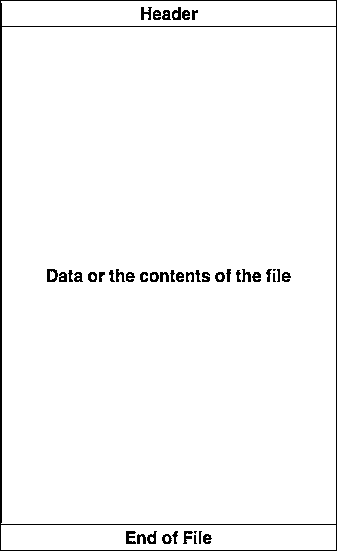

# 在 Python 中读写文件(指南)

> 原文：<https://realpython.com/read-write-files-python/>

*立即观看**本教程有真实 Python 团队创建的相关视频课程。和文字教程一起看，加深理解: [**用 Python 读写文件**](/courses/reading-and-writing-files-python/)

使用 Python 可以完成的最常见的任务之一是读写文件。无论是写入简单的文本文件，还是读取复杂的服务器日志，甚至是分析原始字节数据，所有这些情况都需要读取或写入文件。

在本教程中，您将学习:

*   文件是由什么组成的，为什么这对 Python 很重要
*   Python 中读写文件的基础
*   读写文件的一些基本场景

本教程主要面向初级到中级 Pythonistas，但是这里有一些提示，更高级的程序员也可能会喜欢。

**免费奖励:** ，它向您展示 Python 3 的基础知识，如使用数据类型、字典、列表和 Python 函数。

***参加测验:****通过我们的交互式“用 Python 读写文件”测验来测试您的知识。完成后，您将收到一个分数，以便您可以跟踪一段时间内的学习进度:*

*[参加测验](/quizzes/read-write-files-python/)

## 什么是文件？

在我们进入如何在 Python 中处理文件之前，理解文件到底是什么以及现代操作系统如何处理它们的某些方面是很重要的。

文件的核心是一组连续的字节[，用于存储数据](https://en.wikipedia.org/wiki/Computer_file)。这些数据以特定的格式组织，可以是简单的文本文件，也可以是复杂的可执行程序。最终，这些字节文件会被翻译成二进制的`1`和`0`，以便于计算机处理。

大多数现代文件系统上的文件由三个主要部分组成:

1.  **Header:** 关于文件内容的元数据(文件名、大小、类型等)
2.  **数据:**创建者或编辑者所写的文件内容
3.  **文件结束(EOF):** 表示文件结束的特殊字符

[](https://files.realpython.com/media/FileFormat.02335d06829d.png)

这些数据表示什么取决于所使用的格式规范，通常由扩展名表示。例如，扩展名为`.gif`的文件很可能符合[图形交换格式](https://en.wikipedia.org/wiki/GIF)规范。即使没有上千个文件扩展名，也有数百个[。对于本教程，您将只处理`.txt`或`.csv`文件扩展名。](https://en.wikipedia.org/wiki/List_of_filename_extensions)

[*Remove ads*](/account/join/)

### 文件路径

当您在操作系统上访问文件时，需要文件路径。文件路径是表示文件位置的字符串。它分为三个主要部分:

1.  **文件夹路径:**文件系统上的文件夹位置，后续文件夹由正斜杠`/` (Unix)或反斜杠`\` (Windows)分隔
2.  **文件名:**文件的实际名称
3.  **扩展名:**文件路径的结尾，前面加一个句点(`.`)，用来表示文件类型

这里有一个简单的例子。假设您有一个位于如下文件结构中的文件:

```py
/
│
├── path/
|   │
│   ├── to/
│   │   └── cats.gif
│   │
│   └── dog_breeds.txt
|
└── animals.csv
```

假设您想要访问`cats.gif`文件，而您当前的位置与`path`在同一个文件夹中。为了访问这个文件，你需要通过`path`文件夹，然后是`to`文件夹，最后到达`cats.gif`文件。文件夹路径为`path/to/`。文件名是`cats`。文件扩展名为`.gif`。所以完整路径是`path/to/cats.gif`。

现在让我们假设您的当前位置或当前工作目录(cwd)在我们的示例文件夹结构的`to`文件夹中。不用通过`path/to/cats.gif`的完整路径来引用`cats.gif`，可以简单地通过文件名和扩展名`cats.gif`来引用文件。

```py
/
│
├── path/
|   │
|   ├── to/  ← Your current working directory (cwd) is here
|   │   └── cats.gif  ← Accessing this file
|   │
|   └── dog_breeds.txt
|
└── animals.csv
```

但是`dog_breeds.txt`呢？如果不使用完整路径，如何访问它呢？您可以使用特殊字符双点(`..`)向上移动一个目录。这意味着`../dog_breeds.txt`将从`to`的目录中引用`dog_breeds.txt`文件:

```py
/
│
├── path/  ← Referencing this parent folder
|   │
|   ├── to/  ← Current working directory (cwd)
|   │   └── cats.gif
|   │
|   └── dog_breeds.txt  ← Accessing this file
|
└── animals.csv
```

双点(`..`)可以链接在一起，遍历当前目录以上的多个目录。例如，要从`to`文件夹中访问`animals.csv`，可以使用`../../animals.csv`。

### 行尾

当[处理文件数据](https://realpython.com/working-with-files-in-python/)时经常遇到的一个问题是新行或行尾的表示。行尾可以追溯到摩尔斯电码时代[，当时一个特定的手势被用来表示传输结束或行尾](https://en.wikipedia.org/wiki/Prosigns_for_Morse_code#Official_International_Morse_code_procedure_signs)。

后来，这个[被国际标准化组织(ISO)和美国标准协会(ASA)标准化为电传打字机](https://en.wikipedia.org/wiki/Newline#History)。ASA 标准规定行尾应该使用回车(`CR`或`\r` ) *和*换行符(`LF`或`\n`)`CR+LF`或`\r\n`)的顺序。然而，ISO 标准允许使用`CR+LF`字符或仅允许使用`LF`字符。

[Windows 使用`CR+LF`字符](https://unix.stackexchange.com/a/411830)来表示新的一行，而 Unix 和较新的 Mac 版本只使用`LF`字符。当您在不同于文件来源的操作系统上处理文件时，这会导致一些复杂情况。这里有一个简单的例子。假设我们检查在 Windows 系统上创建的文件`dog_breeds.txt`:

```py
Pug\r\n
Jack Russell Terrier\r\n
English Springer Spaniel\r\n
German Shepherd\r\n
Staffordshire Bull Terrier\r\n
Cavalier King Charles Spaniel\r\n
Golden Retriever\r\n
West Highland White Terrier\r\n
Boxer\r\n
Border Terrier\r\n
```

相同的输出在 Unix 设备上会有不同的解释:

```py
Pug\r
\n
Jack Russell Terrier\r
\n
English Springer Spaniel\r
\n
German Shepherd\r
\n
Staffordshire Bull Terrier\r
\n
Cavalier King Charles Spaniel\r
\n
Golden Retriever\r
\n
West Highland White Terrier\r
\n
Boxer\r
\n
Border Terrier\r
\n
```

这可能会使每一行的迭代出现问题，您可能需要考虑这样的情况。

### 字符编码

您可能面临的另一个常见问题是字节数据的编码。编码是从字节数据到人类可读字符的转换。这通常是通过分配一个数值来表示一个字符来实现的。两种最常见的编码是 [ASCII](https://www.ascii-code.com/) 和 [UNICODE](https://unicode.org/) 格式。 [ASCII 只能存储 128 个字符](https://en.wikipedia.org/wiki/ASCII)，而 [Unicode 最多可以包含 1114112 个字符](https://en.wikipedia.org/wiki/Unicode)。

ASCII 实际上是 [Unicode](https://realpython.com/python-encodings-guide/) (UTF-8)的子集，这意味着 ASCII 和 Unicode 共享相同的数字到字符值。需要注意的是，用不正确的字符编码解析文件可能会导致失败或错误的字符表达。例如，如果一个文件是使用 UTF-8 编码创建的，而您试图使用 ASCII 编码解析它，如果有一个字符不在这 128 个值之内，那么将会抛出一个错误。

[*Remove ads*](/account/join/)

## 在 Python 中打开和关闭文件

当你想处理一个文件时，首先要做的就是打开它。这是通过调用 [`open()`内置函数](https://docs.python.org/3/library/functions.html#open)来完成的。`open()`有一个必需的参数，它是文件的路径。`open()`有一个返回单，[文件对象](https://docs.python.org/3/glossary.html#term-file-object):

```py
file = open('dog_breeds.txt')
```

打开一个文件后，接下来要学习的是如何关闭它。

警告:你应该*始终*确保一个打开的文件被正确关闭。要了解原因，请查看[为什么关闭 Python 中的文件很重要？](https://realpython.com/why-close-file-python/)教程。

重要的是要记住关闭文件是你的责任。在大多数情况下，当应用程序或脚本终止时，文件最终会被关闭。然而，没有人能保证具体什么时候会发生。这可能会导致不必要的行为，包括资源泄漏。这也是 Python (Pythonic)中的一个最佳实践，以确保您的代码以一种良好定义的方式运行，并减少任何不必要的行为。

当你操作一个文件时，有两种方法可以确保一个文件被正确关闭，即使是在遇到错误的时候。关闭文件的第一种方法是使用`try-finally`块:

```py
reader = open('dog_breeds.txt')
try:
    # Further file processing goes here
finally:
    reader.close()
```

如果你不熟悉什么是`try-finally`块，看看 [Python 异常:介绍](https://realpython.com/python-exceptions/)。

关闭文件的第二种方法是使用 [`with`语句](https://realpython.com/python-with-statement/):

```py
with open('dog_breeds.txt') as reader:
    # Further file processing goes here
```

一旦文件离开`with`块，`with`语句会自动关闭文件，即使出现错误。我强烈推荐你尽可能多地使用`with`语句，因为它可以让代码更简洁，并让你更容易处理任何意外的错误。

最有可能的是，您还会想要使用第二个位置参数，`mode`。这个参数是一个[字符串](https://realpython.com/python-strings/)，它包含多个字符来表示您希望如何打开文件。默认的也是最常见的是`'r'`，它表示以只读模式将文件作为文本文件打开:

```py
with open('dog_breeds.txt', 'r') as reader:
    # Further file processing goes here
```

其他模式选项在[中有完整的在线文档](https://docs.python.org/3/library/functions.html#open)，但最常用的选项如下:

| 性格；角色；字母 | 意义 |
| --- | --- |
| `'r'` | 打开以供阅读(默认) |
| `'w'` | 打开进行写入，首先截断(覆盖)文件 |
| `'rb'`或`'wb'` | 以二进制模式打开(使用字节数据读/写) |

让我们回过头来谈一谈文件对象。文件对象是:

> "向底层资源公开面向文件的 API(使用诸如`read()`或`write()`的方法)的对象。"([来源](https://docs.python.org/3/glossary.html#term-file-object)

有三种不同类别的文件对象:

*   文本文件
*   缓冲二进制文件
*   原始二进制文件

这些文件类型都在`io`模块中定义。这里有一个所有事情如何排列的快速纲要。

[*Remove ads*](/account/join/)

### 文本文件类型

文本文件是你会遇到的最常见的文件。以下是如何打开这些文件的一些示例:

```py
open('abc.txt')

open('abc.txt', 'r')

open('abc.txt', 'w')
```

对于这些类型的文件，`open()`将返回一个`TextIOWrapper`文件对象:

>>>

```py
>>> file = open('dog_breeds.txt')
>>> type(file)
<class '_io.TextIOWrapper'>
```

这是由`open()`返回的默认文件对象。

### 缓冲二进制文件类型

缓冲二进制文件类型用于读写二进制文件。以下是如何打开这些文件的一些示例:

```py
open('abc.txt', 'rb')

open('abc.txt', 'wb')
```

对于这些类型的文件，`open()`将返回一个`BufferedReader`或`BufferedWriter`文件对象:

>>>

```py
>>> file = open('dog_breeds.txt', 'rb')
>>> type(file)
<class '_io.BufferedReader'>
>>> file = open('dog_breeds.txt', 'wb')
>>> type(file)
<class '_io.BufferedWriter'>
```

### 原始文件类型

原始文件类型是:

> "通常用作二进制和文本流的底层构件."([来源](https://docs.python.org/3.7/library/io.html#raw-i-o))

因此通常不使用它。

以下是如何打开这些文件的示例:

```py
open('abc.txt', 'rb', buffering=0)
```

对于这些类型的文件，`open()`将返回一个`FileIO`文件对象:

>>>

```py
>>> file = open('dog_breeds.txt', 'rb', buffering=0)
>>> type(file)
<class '_io.FileIO'>
```

## 读写打开的文件

一旦你打开了一个文件，你会想读或写这个文件。首先，让我们来读一个文件。可以对 file 对象调用多种方法来帮助您:

| 方法 | 它的作用 |
| --- | --- |
| [T2`.read(size=-1)`](https://docs.python.org/3.7/library/io.html#io.RawIOBase.read) | 这是根据`size`字节数从文件中读取的。如果没有参数被传递或者`None`或`-1`被传递，那么整个文件被读取。 |
| [T2`.readline(size=-1)`](https://docs.python.org/3.7/library/io.html#io.IOBase.readline) | 这最多从该行读取`size`个字符。这一直延续到行尾，然后绕回。如果没有参数被传递或者`None`或`-1`被传递，那么整行(或整行的剩余部分)被读取。 |
| [T2`.readlines()`](https://docs.python.org/3.7/library/io.html#io.IOBase.readlines) | 这将从 file 对象中读取剩余的行，并将它们作为一个列表返回。 |

使用上面使用的同一个`dog_breeds.txt`文件，让我们看一些如何使用这些方法的例子。下面是一个如何使用`.read()`打开和读取整个文件的例子:

>>>

```py
>>> with open('dog_breeds.txt', 'r') as reader:
>>>     # Read & print the entire file
>>>     print(reader.read())
Pug
Jack Russell Terrier
English Springer Spaniel
German Shepherd
Staffordshire Bull Terrier
Cavalier King Charles Spaniel
Golden Retriever
West Highland White Terrier
Boxer
Border Terrier
```

下面是一个使用 Python `.readline()`方法每次读取一行中 5 个字节的例子:

>>>

```py
>>> with open('dog_breeds.txt', 'r') as reader:
>>>     # Read & print the first 5 characters of the line 5 times
>>>     print(reader.readline(5))
>>>     # Notice that line is greater than the 5 chars and continues
>>>     # down the line, reading 5 chars each time until the end of the
>>>     # line and then "wraps" around
>>>     print(reader.readline(5))
>>>     print(reader.readline(5))
>>>     print(reader.readline(5))
>>>     print(reader.readline(5))
Pug

Jack
Russe
ll Te
rrier
```

下面是一个如何使用 Python `.readlines()`方法将整个文件作为一个列表读取的示例:

>>>

```py
>>> f = open('dog_breeds.txt')
>>> f.readlines()  # Returns a list object
['Pug\n', 'Jack Russell Terrier\n', 'English Springer Spaniel\n', 'German Shepherd\n', 'Staffordshire Bull Terrier\n', 'Cavalier King Charles Spaniel\n', 'Golden Retriever\n', 'West Highland White Terrier\n', 'Boxer\n', 'Border Terrier\n']
```

上面的例子也可以通过使用`list()`从文件对象中创建一个列表:

>>>

```py
>>> f = open('dog_breeds.txt')
>>> list(f)
['Pug\n', 'Jack Russell Terrier\n', 'English Springer Spaniel\n', 'German Shepherd\n', 'Staffordshire Bull Terrier\n', 'Cavalier King Charles Spaniel\n', 'Golden Retriever\n', 'West Highland White Terrier\n', 'Boxer\n', 'Border Terrier\n']
```

[*Remove ads*](/account/join/)

### 遍历文件中的每一行

读取文件时通常要做的一件事是遍历每一行。下面是一个如何使用 Python `.readline()`方法执行迭代的例子:

>>>

```py
>>> with open('dog_breeds.txt', 'r') as reader:
>>>     # Read and print the entire file line by line
>>>     line = reader.readline()
>>>     while line != '':  # The EOF char is an empty string
>>>         print(line, end='')
>>>         line = reader.readline()
Pug
Jack Russell Terrier
English Springer Spaniel
German Shepherd
Staffordshire Bull Terrier
Cavalier King Charles Spaniel
Golden Retriever
West Highland White Terrier
Boxer
Border Terrier
```

迭代文件中每一行的另一种方法是使用 file 对象的 Python `.readlines()`方法。记住，`.readlines()`返回一个列表，其中列表中的每个元素代表文件中的一行:

>>>

```py
>>> with open('dog_breeds.txt', 'r') as reader:
>>>     for line in reader.readlines():
>>>         print(line, end='')
Pug
Jack Russell Terrier
English Springer Spaniel
German Shepherd
Staffordshire Bull Terrier
Cavalier King Charles Spaniel
Golden Retriever
West Highland White Terrier
Boxer
Border Terrier
```

然而，上面的例子可以通过迭代文件对象本身来进一步简化:

>>>

```py
>>> with open('dog_breeds.txt', 'r') as reader:
>>>     # Read and print the entire file line by line
>>>     for line in reader:
>>>         print(line, end='')
Pug
Jack Russell Terrier
English Springer Spaniel
German Shepherd
Staffordshire Bull Terrier
Cavalier King Charles Spaniel
Golden Retriever
West Highland White Terrier
Boxer
Border Terrier
```

最后一种方法更加 Pythonic 化，速度更快，内存效率更高。因此，建议您改用这个。

**注:**以上部分例子包含`print('some text', end='')`。`end=''`是为了防止 Python 向正在打印的文本添加额外的换行符，并且只有[打印从文件中读取的内容](https://realpython.com/courses/python-print/)。

现在让我们开始编写文件。与读取文件一样，文件对象有多种方法可用于写入文件:

| 方法 | 它的作用 |
| --- | --- |
| `.write(string)` | 这会将字符串写入文件。 |
| `.writelines(seq)` | 这会将序列写入文件。每个序列项都不会附加行尾。由您决定添加适当的行尾。 |

这里有一个使用`.write()`和`.writelines()`的简单例子:

```py
with open('dog_breeds.txt', 'r') as reader:
    # Note: readlines doesn't trim the line endings
    dog_breeds = reader.readlines()

with open('dog_breeds_reversed.txt', 'w') as writer:
    # Alternatively you could use
    # writer.writelines(reversed(dog_breeds))

    # Write the dog breeds to the file in reversed order
    for breed in reversed(dog_breeds):
        writer.write(breed)
```

### 使用字节

有时候，你可能需要使用[字节串](https://docs.python.org/3.7/glossary.html#term-bytes-like-object)来处理文件。这是通过将`'b'`字符添加到`mode`参数中实现的。适用于 file 对象的所有相同方法。然而，每个方法都期望并返回一个`bytes`对象:

>>>

```py
>>> with open('dog_breeds.txt', 'rb') as reader:
>>>     print(reader.readline())
b'Pug\n'
```

使用`b`标志打开一个文本文件并不有趣。假设我们有一张可爱的杰克罗素梗(`jack_russell.png`)的照片:

[](https://files.realpython.com/media/jack_russell.92348cb14537.png)

<figcaption class="figure-caption text-center">Image: [CC BY 3.0 (https://creativecommons.org/licenses/by/3.0)], from Wikimedia Commons](https://commons.wikimedia.org/wiki/File:Jack_Russell_Terrier_1.jpg)</figcaption>

您实际上可以用 Python 打开该文件并检查其内容！由于 [`.png`文件格式](https://en.wikipedia.org/wiki/Portable_Network_Graphics)被很好地定义，文件的头是 8 个字节，分解如下:

| 价值 | 解释 |
| --- | --- |
| `0x89` | 一个“神奇”的数字，表示这是一个`PNG`的开始 |
| `0x50 0x4E 0x47` | `PNG`在 ASCII 码中 |
| `0x0D 0x0A` | DOS 风格的行尾`\r\n` |
| `0x1A` | 一种 DOS 风格的字符 |
| `0x0A` | Unix 风格的行尾`\n` |

果不其然，当你打开文件，逐个读取这些字节时，你可以看到这确实是一个`.png`头文件:

>>>

```py
>>> with open('jack_russell.png', 'rb') as byte_reader:
>>>     print(byte_reader.read(1))
>>>     print(byte_reader.read(3))
>>>     print(byte_reader.read(2))
>>>     print(byte_reader.read(1))
>>>     print(byte_reader.read(1))
b'\x89'
b'PNG'
b'\r\n'
b'\x1a'
b'\n'
```

[*Remove ads*](/account/join/)

### 完整示例:`dos2unix.py`

让我们把这整个事情带回家，看看如何读写文件的完整示例。下面是一个类似于 [`dos2unix`](https://en.wikipedia.org/wiki/Unix2dos) 的工具，可以将包含行尾`\r\n`的文件转换为`\n`。

该工具分为三个主要部分。第一个是`str2unix()`，它将一个字符串从`\r\n`行尾转换成`\n`。第二个是`dos2unix()`，将包含`\r\n`字符的字符串转换成`\n`。`dos2unix()`内部调用`str2unix()`。最后，还有 [`__main__`](https://realpython.com/if-name-main-python/) 块，只有当文件作为脚本执行时才调用它。可以把它想象成其他编程语言中的`main`函数。

```py
"""
A simple script and library to convert files or strings from dos like
line endings with Unix like line endings.
"""

import argparse
import os

def str2unix(input_str: str) -> str:
    r"""
 Converts the string from \r\n line endings to \n

 Parameters
 ----------
 input_str
 The string whose line endings will be converted

 Returns
 -------
 The converted string
 """
    r_str = input_str.replace('\r\n', '\n')
    return r_str

def dos2unix(source_file: str, dest_file: str):
    """
 Converts a file that contains Dos like line endings into Unix like

 Parameters
 ----------
 source_file
 The path to the source file to be converted
 dest_file
 The path to the converted file for output
 """
    # NOTE: Could add file existence checking and file overwriting
    # protection
    with open(source_file, 'r') as reader:
        dos_content = reader.read()

    unix_content = str2unix(dos_content)

    with open(dest_file, 'w') as writer:
        writer.write(unix_content)

if __name__ == "__main__":
    # Create our Argument parser and set its description
    parser = argparse.ArgumentParser(
        description="Script that converts a DOS like file to an Unix like file",
    )

    # Add the arguments:
    #   - source_file: the source file we want to convert
    #   - dest_file: the destination where the output should go

    # Note: the use of the argument type of argparse.FileType could
    # streamline some things
    parser.add_argument(
        'source_file',
        help='The location of the source '
    )

    parser.add_argument(
        '--dest_file',
        help='Location of dest file (default: source_file appended with `_unix`',
        default=None
    )

    # Parse the args (argparse automatically grabs the values from
    # sys.argv)
    args = parser.parse_args()

    s_file = args.source_file
    d_file = args.dest_file

    # If the destination file wasn't passed, then assume we want to
    # create a new file based on the old one
    if d_file is None:
        file_path, file_extension = os.path.splitext(s_file)
        d_file = f'{file_path}_unix{file_extension}'

    dos2unix(s_file, d_file)
```

## 提示和技巧

现在您已经掌握了读写文件的基本知识，这里有一些提示和技巧可以帮助您提高技能。

### `__file__`

`__file__`属性是模块的一个[特殊属性](https://docs.python.org/3/reference/datamodel.html)，类似于`__name__`。它是:

> 如果从文件中加载模块，则为从中加载模块的文件的路径名([来源](https://docs.python.org/3/reference/datamodel.html)

**注意:**为了进行迭代，`__file__`返回路径*相对于*调用初始 Python 脚本的位置。如果您需要完整的系统路径，您可以使用`os.getcwd()`来获取正在执行的代码的当前工作目录。

这里有一个真实的例子。在我过去的一份工作中，我为一个硬件设备做了多项测试。每个测试都是使用 Python 脚本编写的，测试脚本文件名用作标题。然后这些脚本将被执行，并可以使用`__file__`特殊属性打印它们的状态。下面是一个文件夹结构示例:

```py
project/
|
├── tests/
|   ├── test_commanding.py
|   ├── test_power.py
|   ├── test_wireHousing.py
|   └── test_leds.py
|
└── main.py
```

运行`main.py`会产生以下结果:

```py
>>> python main.py
tests/test_commanding.py Started:
tests/test_commanding.py Passed!
tests/test_power.py Started:
tests/test_power.py Passed!
tests/test_wireHousing.py Started:
tests/test_wireHousing.py Failed!
tests/test_leds.py Started:
tests/test_leds.py Passed!
```

通过使用`__file__`特殊属性，我能够动态地运行并获得所有测试的状态。

### 附加到文件

有时，您可能希望追加到文件中，或者从已经填充的文件的末尾开始写。这很容易通过使用`'a'`字符作为`mode`参数来实现:

```py
with open('dog_breeds.txt', 'a') as a_writer:
    a_writer.write('\nBeagle')
```

当您再次检查`dog_breeds.txt`时，您会看到文件的开头没有改变，而`Beagle`现在被添加到了文件的末尾:

>>>

```py
>>> with open('dog_breeds.txt', 'r') as reader:
>>>     print(reader.read())
Pug
Jack Russell Terrier
English Springer Spaniel
German Shepherd
Staffordshire Bull Terrier
Cavalier King Charles Spaniel
Golden Retriever
West Highland White Terrier
Boxer
Border Terrier
Beagle
```

[*Remove ads*](/account/join/)

### 同时处理两个文件

有时候，您可能希望同时读取一个文件和写入另一个文件。如果您使用学习如何写入文件时显示的示例，它实际上可以合并为以下内容:

```py
d_path = 'dog_breeds.txt'
d_r_path = 'dog_breeds_reversed.txt'
with open(d_path, 'r') as reader, open(d_r_path, 'w') as writer:
    dog_breeds = reader.readlines()
    writer.writelines(reversed(dog_breeds))
```

### 创建自己的上下文管理器

有时，您可能需要通过将 file 对象放在自定义类中来更好地控制它。当你这样做的时候，使用`with`语句就不能再用了，除非你增加几个神奇的方法:`__enter__`和`__exit__`。通过添加这些，你就创建了所谓的[上下文管理器](https://docs.python.org/3/library/stdtypes.html#typecontextmanager)。

当调用`with`语句时，调用`__enter__()`。从`with`语句块退出时，调用`__exit__()`。

这里有一个模板，您可以使用它来制作您的自定义类:

```py
class my_file_reader():
    def __init__(self, file_path):
        self.__path = file_path
        self.__file_object = None

    def __enter__(self):
        self.__file_object = open(self.__path)
        return self

    def __exit__(self, type, val, tb):
        self.__file_object.close()

    # Additional methods implemented below
```

既然您已经有了自己的自定义类，它现在是一个上下文管理器，您可以像使用内置的`open()`一样使用它:

```py
with my_file_reader('dog_breeds.txt') as reader:
    # Perform custom class operations
    pass
```

这里有一个很好的例子。还记得我们可爱的杰克·罗素形象吗？也许你想打开其他的`.png`文件，但不想每次都解析头文件。这里有一个如何做到这一点的例子。这个例子也使用了自定义迭代器。如果你不熟悉它们，看看 [Python 迭代器](https://dbader.org/blog/python-iterators):

```py
class PngReader():
    # Every .png file contains this in the header.  Use it to verify
    # the file is indeed a .png.
    _expected_magic = b'\x89PNG\r\n\x1a\n'

    def __init__(self, file_path):
        # Ensure the file has the right extension
        if not file_path.endswith('.png'):
            raise NameError("File must be a '.png' extension")
        self.__path = file_path
        self.__file_object = None

    def __enter__(self):
        self.__file_object = open(self.__path, 'rb')

        magic = self.__file_object.read(8)
        if magic != self._expected_magic:
            raise TypeError("The File is not a properly formatted .png file!")

        return self

    def __exit__(self, type, val, tb):
        self.__file_object.close()

    def __iter__(self):
        # This and __next__() are used to create a custom iterator
        # See https://dbader.org/blog/python-iterators
        return self

    def __next__(self):
        # Read the file in "Chunks"
        # See https://en.wikipedia.org/wiki/Portable_Network_Graphics#%22Chunks%22_within_the_file

        initial_data = self.__file_object.read(4)

        # The file hasn't been opened or reached EOF.  This means we
        # can't go any further so stop the iteration by raising the
        # StopIteration.
        if self.__file_object is None or initial_data == b'':
            raise StopIteration
        else:
            # Each chunk has a len, type, data (based on len) and crc
            # Grab these values and return them as a tuple
            chunk_len = int.from_bytes(initial_data, byteorder='big')
            chunk_type = self.__file_object.read(4)
            chunk_data = self.__file_object.read(chunk_len)
            chunk_crc = self.__file_object.read(4)
            return chunk_len, chunk_type, chunk_data, chunk_crc
```

您现在可以打开`.png`文件，并使用您的自定义上下文管理器正确解析它们:

>>>

```py
>>> with PngReader('jack_russell.png') as reader:
>>>     for l, t, d, c in reader:
>>>         print(f"{l:05}, {t}, {c}")
00013, b'IHDR', b'v\x121k'
00001, b'sRGB', b'\xae\xce\x1c\xe9'
00009, b'pHYs', b'(<]\x19'
00345, b'iTXt', b"L\xc2'Y"
16384, b'IDAT', b'i\x99\x0c('
16384, b'IDAT', b'\xb3\xfa\x9a$'
16384, b'IDAT', b'\xff\xbf\xd1\n'
16384, b'IDAT', b'\xc3\x9c\xb1}'
16384, b'IDAT', b'\xe3\x02\xba\x91'
16384, b'IDAT', b'\xa0\xa99='
16384, b'IDAT', b'\xf4\x8b.\x92'
16384, b'IDAT', b'\x17i\xfc\xde'
16384, b'IDAT', b'\x8fb\x0e\xe4'
16384, b'IDAT', b')3={'
01040, b'IDAT', b'\xd6\xb8\xc1\x9f'
00000, b'IEND', b'\xaeB`\x82'
```

## 不要重新发明蛇

在处理文件时，您可能会遇到一些常见的情况。这些情况中的大多数可以使用其他模块来处理。您可能需要处理的两种常见文件类型是`.csv`和`.json`。 *Real Python* 已经就如何处理这些问题整理了一些很棒的文章:

*   [用 Python 读写 CSV 文件](https://realpython.com/python-csv/)
*   [在 Python 中使用 JSON 数据](https://realpython.com/python-json/)

此外，还有一些内置的库可以帮助您:

*   [**`wave`**](https://docs.python.org/3.7/library/wave.html) :读写 WAV 文件(音频)
*   [**`aifc`**](https://docs.python.org/3/library/aifc.html) :读写 AIFF 和 AIFC 文件(音频)
*   [**`sunau`**](https://docs.python.org/3/library/sunau.html) :读写孙盟文件
*   [**`tarfile`**](https://docs.python.org/3/library/tarfile.html) :读写 tar 存档文件
*   [**`zipfile`**](https://docs.python.org/3/library/zipfile.html) :处理 ZIP 档案
*   [**`configparser`**](https://docs.python.org/3/library/configparser.html) :轻松创建和解析配置文件
*   [**`xml.etree.ElementTree`**](https://docs.python.org/3/library/xml.etree.elementtree.html) :创建或读取基于 XML 的文件
*   [**`msilib`**](https://docs.python.org/3/library/msilib.html) :读写微软安装程序文件
*   [**`plistlib`**](https://docs.python.org/3/library/plistlib.html) :生成并解析 Mac OS X `.plist`文件

外面还有很多。此外，PyPI 上还有更多第三方工具。下面是一些流行的方法:

*   [**`PyPDF2`**](https://pypi.org/project/PyPDF2/) : PDF 工具包
*   [**`xlwings`**](https://pypi.org/project/xlwings/) :读写 Excel 文件
*   [**`Pillow`**](https://realpython.com/image-processing-with-the-python-pillow-library/) :图像读取和操纵

[*Remove ads*](/account/join/)

## 你是文件巫师哈利！

你做到了！您现在已经知道如何使用 Python 处理文件，包括一些高级技术。在 Python 中处理文件应该比以往任何时候都容易，并且当你开始这样做时会有一种值得的感觉。

在本教程中，您已经学习了:

*   什么是文件
*   如何正确打开和关闭文件
*   如何读写文件
*   使用文件时的一些高级技巧
*   一些库可以处理常见的文件类型

如果你有任何问题，请在评论中联系我们。

***参加测验:****通过我们的交互式“用 Python 读写文件”测验来测试您的知识。完成后，您将收到一个分数，以便您可以跟踪一段时间内的学习进度:*

*[参加测验](/quizzes/read-write-files-python/)

*立即观看**本教程有真实 Python 团队创建的相关视频课程。和文字教程一起看，加深理解: [**用 Python 读写文件**](/courses/reading-and-writing-files-python/)***********