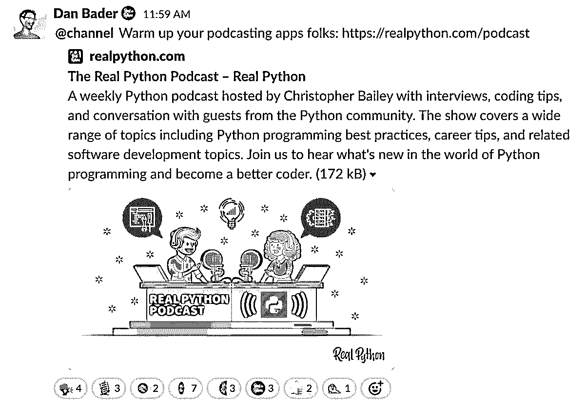

# 真正的 Python 播客来了！

> 原文：<https://realpython.com/real-python-podcast-launch/>

真正的 Python 播客终于上线了！收听有趣的嘉宾、对专家 Pythonistas 的采访以及真实 Python 团队的许多幕后活动。

今天我们正式推出真正的 Python 播客[**，这是一个面向像你这样的 Python 爱好者的新的(免费的)播客。**](https://realpython.com/podcasts/rpp/)

这已经酝酿了一段时间，克里斯托弗和我都非常自豪终于在本周向你们发布了第一集。

我们将为您准备一份有趣嘉宾的花名册，对专家 Pythonistas 的采访，以及许多真实 Python 团队的幕后故事。

以下是关于该节目的更多信息以及如何收听:

## 什么是真正的 Python 播客？

这是一个免费的每周节目，有采访、编码技巧和与来自 Python 社区的嘉宾的对话，由真正 Python 的[克里斯托弗·贝利](https://realpython.com/team/cbailey/)主持。

我们将涵盖广泛的主题，包括 Python 编程最佳实践、职业技巧和相关的软件开发主题。看看真实 Python 的幕后。

因此，请加入我们，了解 Python 编程领域的最新动态，成为一名更有效的 Python 爱好者。

[*Remove ads*](/account/join/)

## 你怎么能听这个节目？

该节目现在可以在所有常见的播客目录中看到，如苹果播客、谷歌播客、Spotify、Stitcher 等。只需启动你最喜欢的播客听应用程序，搜索“真正的 Python”。

或者，你可以在[realpython.com/podcast](https://realpython.com/podcasts/rpp/)在线收听

## 表演什么时候开始？

从 2020 年 3 月 20 日星期五起，真正的 Python 播客可以在所有常见的播客目录中找到。所以，预热你的播客应用程序🙂

<figcaption class="figure-caption text-center">We're Celebrating the Podcast Launch in the RP Slack Community</figcaption>

## 我们想听听你的意见！

这是一个社区的播客，面向社区。我们希望你参与进来，我们希望听到你的反馈，我们希望随着时间的推移，播客会越来越好。

你对一集有什么想法吗？你想和我们分享你的故事或者问克里斯托弗一个问题吗？在 [@realpython](https://twitter.com/realpython) 或[发推文，给我们留下语音邮件](https://realpython.com/podcast-question)，有机会在节目中亮相。

## 你怎么能支持这个节目？

使用你最喜欢的播客应用程序订阅，在[苹果播客](https://podcasts.apple.com/us/podcast/feed/id1501905538)或其他目录上留下对该播客的评论，并在脸书、LinkedIn 和 Twitter 上告诉全世界关于该节目的信息。

这是播客和节目笔记的链接:

[听真正的 Python 播客](https://realpython.com/podcasts/rpp/)

快乐的蟒蛇！

—丹·巴德*