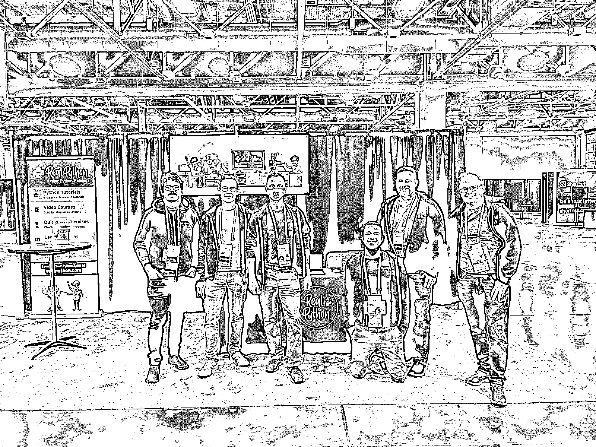
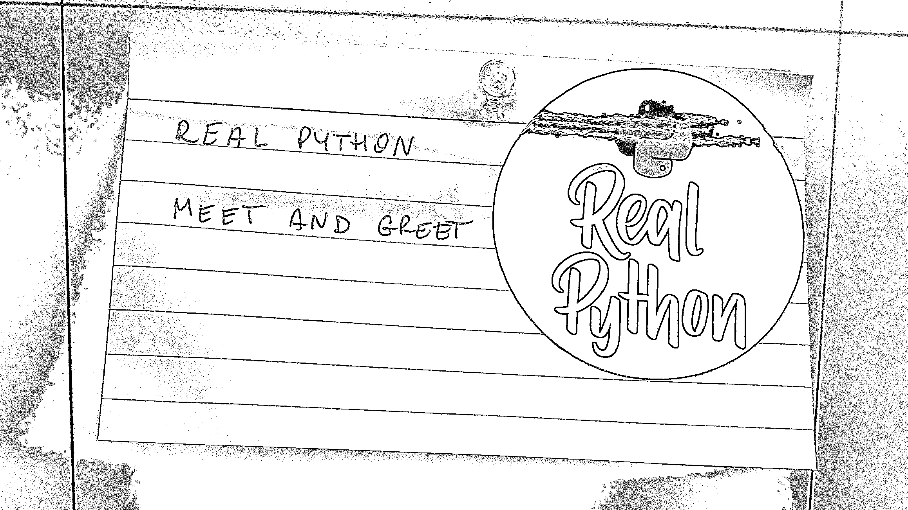
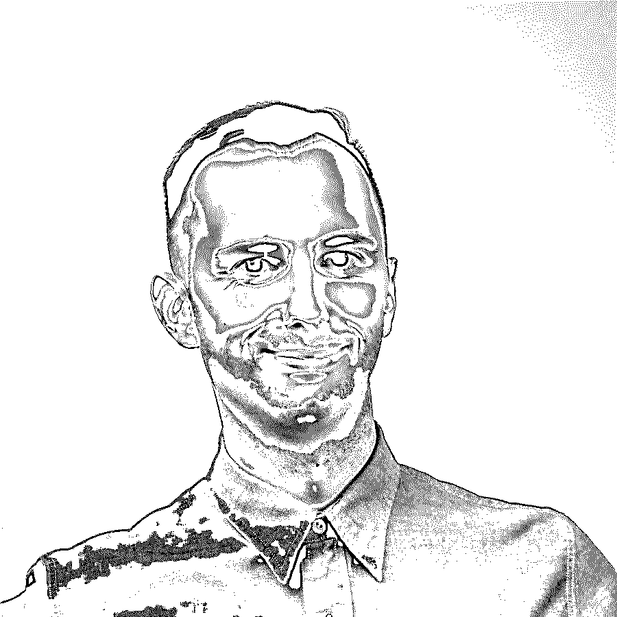

# PyCon US 2022 上的真蟒蛇

> 原文：<https://realpython.com/real-python-pycon-us-2022/>

PyCon US 作为面对面的会议又回来了。 [PyCon US 2022](https://us.pycon.org/2022/) 将于 4 月 29 日至 5 月 1 日在[盐湖城](https://en.wikipedia.org/wiki/Salt_Lake_City)举行，真正的蟒蛇也在那里。周六在**我们的展位**和**开放空间**加入我们。

在本文中，您将了解在盐湖城的 PyCon 上哪里可以找到真正的 Python，并了解我们的一些团队成员在会议上对什么感到兴奋。

## 在 PyCon US 2022 上认识真正的 Python

自 2003 年以来，PyCon US 大会一直是 Python 社区的年会。因为科维德·疫情，会议在 2020 年和 2021 年变成了虚拟的。在 Real Python，我们很高兴今年能够亲自见面。如果你在盐湖城，来打个招呼吧！

### 参观真正的 Python 展台

在任何 PyCon 会议上，展厅都是一个热闹的地方。在这里，您可以四处逛逛，与其他与会者聊天，同时探索赞助商和参展商带来了什么。这是一个闲逛和交新朋友的好地方！

Real Python 在今年的大会上有一个展位。我们很高兴有自己的地方闲逛，并向每个人展示我们的内容。你可以在微软和 AWS 正对面的**228 号展位**找到我们。寻找我们的标志和友好的面孔——我们会用眼睛微笑！

在展台前停下来听听我们提供的所有内容，或者聊聊您最喜欢的软件包、平方根或 Python 的最新发展。

[*Remove ads*](/account/join/)

### 加入我们的开放空间

[空地](https://realpython.com/pycon-guide/#open-spaces)是 PyCon 的独特特色。这些是自组织的一小时聚会式的[活动](https://us.pycon.org/2022/events/open-spaces/)，在整个会议期间不断发生。查看[开放空间版块](http://pycon.us/os)，看看有没有你想加入的东西！

Real Python 将在**周六**下午 **2 点**在**250 f**房间举办一个开放空间。欢迎加入我们，了解更多关于我们新内容的计划以及我们正在为网站做些什么。我们也很想听听你对真正的 Python 的体验，以及对改进和未来教程的建议。

## 认识团队

我们很高兴终于能参加会议，并再次与社区成员交流。

您可以在我们的展位和整个会议期间与我们见面。但也许在那之前你想了解一下我们。这是一些参加 PyCon 的团队成员。

### 丹·巴德

作为 Real Python 的所有者和主编，我非常高兴今年我们能在 PyCon 上有一个展位。这是我的第五次 PyCon，今年第一次拥有我们自己的 PyCon 小角落来展示真正的 Python，这感觉像是一个巨大的里程碑！

周五或周六的任何时候都可以来我们的展位打个招呼，与团队见面，或者了解更多关于我们为 Python 开发人员提供的学习资源和为企业提供的培训选项。我很期待见到你！

### 巴尔托什初学者

我的名字叫 [Bartosz Zaczyński](https://realpython.com/team/bzaczynski/) ，我是 Real Python 的内容创建者之一，帮助为您提供精彩的 Python 教程和课程。当我不制作或审查内容时，我经常在我们的 [Slack 社区](https://realpython.com/community/)平台上参与对话，或者在每周[办公时间](https://realpython.com/office-hours/)为真正的 Python 订户举办的网络研讨会期间参与现场讨论。我还积极参与了 Python 的教学，并在一个编码训练营担任学生的导师。

在我进入教育行业之前，我是一名全职软件工程师，为几家不同领域的公司工作。奇怪的是，在我的职业生涯中，Python 从来不是主要的编程语言，但不知何故，它成了我的最爱，并一直伴随着我。尽管 Python 并不完美，但我还没有发现比它更通用或更令人愉快的代码。

这将是我第二次参加 PyCon US，尽管这是我第一次亲自参加，对此我感到非常兴奋。我已经期待这个特别的活动很久了，因为这将是我三年前加入以来第一次有机会与真正的 Python 团队面对面。除此之外，我希望与一些长期办公时间的参与者握手，与我们的读者和订户聊天，并与其他 Python 爱好者结交新朋友。

今年，我们将在展厅拥有自己的展位，这应该会让我们更容易找到。如果你在附近，想要与真正的 Python 团队成员互动，成为[真正的 Python 播客](https://realpython.com/podcasts/rpp/)的客人，挑选一本我们的[书籍](https://realpython.com/products/)，或者只是拿一些[酷礼品](https://realpython.threadless.com/)，那么一定要来看看。我们很想听听我们的读者、观众和听众的意见，了解他们喜欢和不喜欢 Real Python 的什么，以及我们未来的教程和课程应该涵盖哪些主题。

我们还可以为一群人预订一个开放空间的房间，一起做一个项目，解决一个问题，或者谈论一些你觉得有趣的事情。如果你已经有了一些想法，请在下面的评论中告诉我们。我们在那里见！

### Geir Arne Hjelle

我是 Geir Arne Hjelle ，真实 Python 团队的内容创建者之一。我住在挪威的奥斯陆，在那里我试图将户外活动和编写 Python 教程结合起来。

我在 2018 年以自由职业者的身份加入了 Real Python。但是从去年 12 月份开始，我就开始全职工作了。除了创建教程，我还参与了我们的评审过程，在这个过程中，我评审了其他作者和团队成员写的一些内容。

我有幸参加了在克里夫兰举行的 2019 年[PyCon US](https://realpython.com/real-python-pycon-us/)，在那里我做了一个关于插件和模块化代码的[演讲](https://github.com/gahjelle/talks/tree/master/20190505_pycon_plugins)。这是一个很好的机会来认识我的一些真正的 Python 同事和令人惊叹的 Python 社区的其他人。

我确实参加了 2020 年和 2021 年的远程 PyCon 会议，并有幸在这两个场合讲授了一堂关于[装饰师](https://github.com/gahjelle/decorators_tutorial)的教程。尽管如此，我对终于能够再次亲自参加会议感到非常兴奋。

在会议前几天，我飞到盐湖城，这样我可以克服时差，参加一些辅导课，并通过 T2 志愿者帮助组织者。

随着会议的进行，我很高兴能再次和整个社区的人在一起。我期待着看到有趣的谈话，对所有事情进行有趣的聊天，不管是不是 Python。

[*Remove ads*](/account/join/)

### 马丁·布鲁斯*

*

嗨，我是马丁！我在 2019 年初开始为 Real Python 制作视频课程，从那以后，我不断地与团队进行更多的接触。我从 2021 年初开始做全职内容创作者。

这是我第一次亲自参加 PyCon US，但我去年有机会参加在线 PyCon US。通过一些幸运的地理巧合，我还参加了我的第一次现实生活中的 Python 会议， [Kiwi PyCon X](https://python.nz/kiwipycon) ，2019 年在 [Wellington，NZ](https://www.google.com/maps/place/Wellington,+New+Zealand/) 。

我目前与妻子和三个月大的女儿住在奥地利，我们在 PyCon 开始前飞到盐湖城，这意味着你会通过我眼睛下面的阴影认出我，因为不可避免的时区转换和夜间的婴儿醒来。

像盖尔·阿恩一样，我决定在会议上做志愿者。我最近完成了我在登记处的工作，这很有趣！本周晚些时候，我也会在绿色房间做志愿者，但大多数时候，你会在展厅的真正 Python 展台看到我。

在会议的第一天，能够在现实生活中见到[办公时间](https://realpython.com/office-hours/)的参与者和其他真正的 Python 读者和订阅者，已经很令人惊讶了。

顺道去电话亭打个招呼！我很乐意谈论任何事情，听取您对我们可以开发的新教程和视频课程的建议和想法，并谈论我们在 Real Python 提供的所有产品。

## 结论

终于！我们很高兴能再次见面。如果您在盐湖城参加 PyCon 2022，请到真正的 Python 展台前打个招呼。**