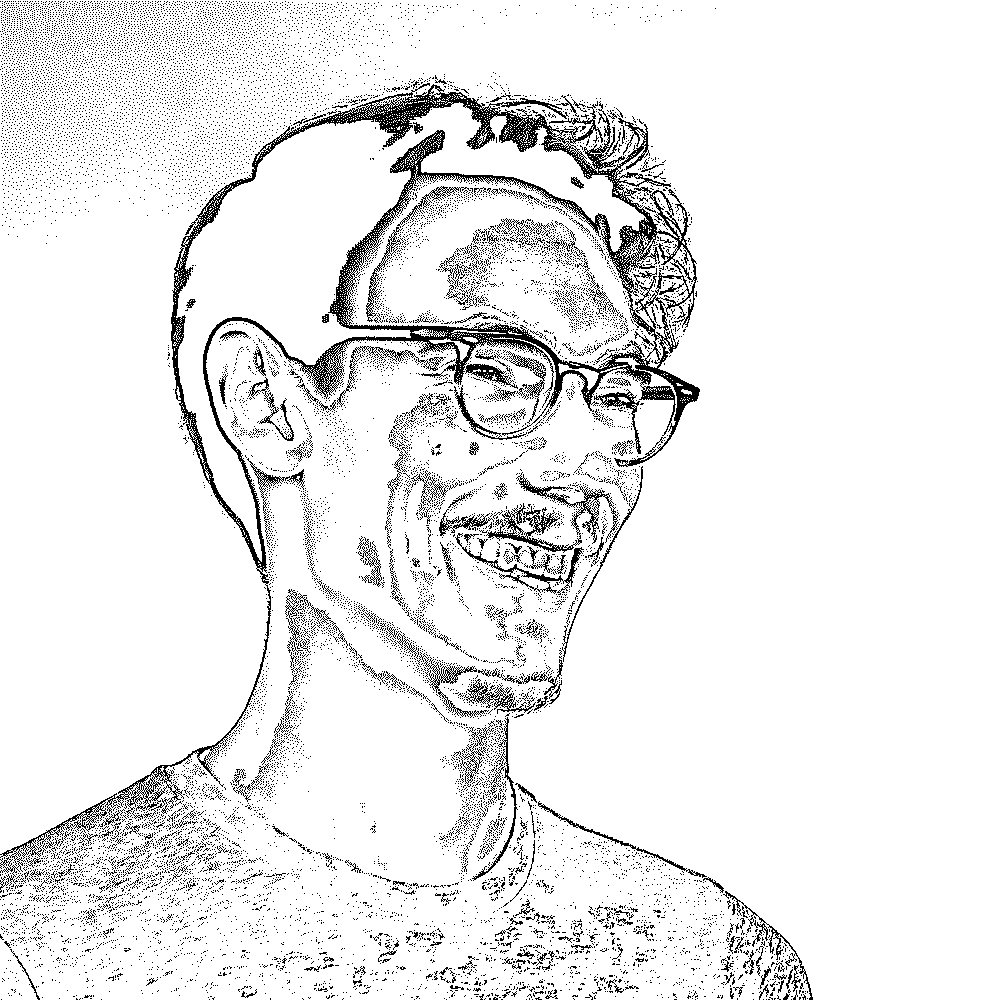

# PyCon US 2019 上的真蟒蛇

> 原文：<https://realpython.com/real-python-pycon-us/>

每年世界各地都有许多 PyCon，但其中最大的是美国 PyCon。今年，3000 多名 Pythonistas 来到俄亥俄州的克利夫兰，学习、合作、贡献，并会见新老朋友。我相信你们中的许多人已经知道 PyCon US 是什么，但如果不知道，那么我建议阅读我们的[PyCon 指南](https://realpython.com/pycon-guide/)以了解更多信息。

## 我们第一次聚在一起

今年， *Real Python* 有机会在 [PyCharm 内容创作者展台](https://blog.jetbrains.com/pycharm/2019/04/content-creators-at-the-pycharm-pycon-booth/)加入其他内容创作者，在那里我们花了一些时间与 *Real Python* 社区的读者和成员见面。哦，我们还分发了一吨*真蟒蛇*贴纸，而且我们的货已经卖完了！你拿到你的了吗？

团队也为我们的作者盖尔·阿恩·哈杰尔和 T2·安东尼·肖感到兴奋，他们也作为演讲者出席了会议。你可以在 PyCon YouTube 频道上听到他们关于[插件:为你的应用增加灵活性](https://www.youtube.com/watch?v=98s9YfoXB68)和[狡猾的 Python:编写更简单更易维护的 Python](https://www.youtube.com/watch?v=dqdsNoApJ80&t=3s) 的谈话录音。

我们也很幸运能够在 PyCon 为我们的读者安排一个真正的 Python 开放空间。我们的出席人数非常多，有 30 人出席。

这是一个很好的机会，我们不仅可以和您握手，感谢您对我们的鼓励和反馈，还可以确保我们能够继续推动和制作越来越好的内容。听取与会者的反馈是一次奇妙的经历，我们将采纳一些产生的想法，帮助我们为您提供更好的阅读和学习体验。

尽管成员和员工 Slack 小组每天都有对话，但大多数真正的 Python 团队成员从未见过面。对我个人来说，面对面地与我的同事见面，并与他们一起用餐或喝啤酒绝对是整个会议的亮点之一。

但我决定询问团队中其他人的经验，希望我们能为你提供一些有用的建议或可行的技巧，以防你第一次参加 PyCon。

我向一些参加 PyCon 的团队成员提出了同样的三个问题，并整理了他们的答案。这些问题是:

1.  你能简单地告诉我们你是谁，你做什么，进出*真正的 Python* 吗？这是你第一次参加皮肯节吗？如果是，是什么让 2019 年成为你第一次决定去的一年？
2.  你的 PyCon 有哪些亮点？PyCon 2019 你会有哪些回忆？
3.  PyCon 有太多的事情要做，不可能面面俱到。有什么事情是你没有机会去做，但又希望自己有机会去做的？

[*Remove ads*](/account/join/)

## 团队面试

事不宜迟，让我们看看他们有什么要说的。

### 吉姆·安德森

我是[吉姆·安德森](https://realpython.com/team/janderson/)，白天是嵌入式固件开发人员，主要用 C++做视频安防摄像头。我在工作中也接触了一些 Python。在 *Real Python* ，我是一名作者和一名技术评论者，通常倾向于低级、工具相关或一般 CS 主题的文章。

这是我第一次参加 PyCon。我最终决定去，只是因为我在真正的 Python 社区中看到的兴奋。我认识的人之前都在谈论这个话题。他们是对的。

有这么多亮点！当然，能够最终见到我的一些真正的 Python 同事非常酷，就像在 PyCharm 展台的内容创作者区闲逛一样。(谢谢 JetBrains！)

我想说，我最美好的记忆，也是真正在我脑海中凝固气氛的记忆，是看到一个来自 *PythonistaCafe* 和 PyCon 的朋友与一个正在打扫场地的人交谈。她被会议的友好气氛深深吸引，以至于她开始询问会议的情况，并考虑明年如何成为会议的一员。也许我们能在匹兹堡见到她。

我本来计划去听一个报告，但是错过了时间，错过了。那是[建造一个开源的人工胰腺](https://www.youtube.com/watch?v=1kT1VoX7VAs)，我仍然对我没能成功感到失望。这是一个很棒的话题，也是一次很棒的演讲。

### Geir Arne Hjelle

我的名字是盖尔·阿恩·哈杰尔，我在挪威北部的一个小村庄长大。目前，我住在奥斯陆，从事不同的数据科学和机器学习项目。大多数时候，我会使用 Python 和构建在 [`numpy`](https://realpython.com/numpy-array-programming/) 之上的优秀数据科学堆栈。

我从 2018 年春天开始为*真正的 Python* 写作，大部分是关于一般的 Python 包和概念。我的第一篇文章是关于 [`pathlib`包](https://realpython.com/python-pathlib/)，目前我正在写一篇关于导入如何工作的文章。此外，我通过对其他作者的文章进行评论来支持他们，包括大纲评论和技术评论。

今年是我第一次参加 PyCon US。我住在挪威，所以我主要在欧洲参加会议。今年秋天，我将第五次参加 [EuroSciPy](https://www.euroscipy.org/2019/) 。然而，在加入*真正的 Python* 团队后，我真的被在野外结识一些新朋友和同事的机会所诱惑。

去年夏天，詹姆斯和我设法见了面，但除此之外，我主要是通过他们松弛的头像来了解这个团队。与*真正的 Python* 团队的其他成员见面和闲逛，以及对我们为彼此做的一些评论感到厌烦，这些都是我将珍藏很久的美好回忆。

皮肯发生了这么多事。我全力以赴，参加了辅导课、主会议和部分冲刺赛。我真的很喜欢这一切。

教程很棒，包括大卫·比兹利的[深入探究λ微积分](https://pyvideo.org/pycon-us-2019/lambda-calculus-from-the-ground-up.html)。(耶，数学！)我很幸运地在会议期间去了[做了一个演讲](https://github.com/gahjelle/talks/tree/master/20190505_pycon_plugins)，非常有趣。在我演讲之前，我被照顾得很好:我想这是我第一次有自己的准备室，有人陪我去演讲室。

后来，我得到了一些非常好和有趣的问题。在冲刺阶段，我对 Jason Coombs 和 Barry Warsaw 为 Python 3.8 开发的新 [`importlib.metadata`](https://pypi.org/project/importlib-metadata/) 库提供了一点帮助。能够亲眼看到一些核心开发人员是如何工作的，真是太棒了。

我在克利夫兰有很多美好的经历，很难想象我没有机会做的事情。虽然，我承认在这次 PyCon 上，我非常关注我自己(特别是我的演讲是在会议的最后一部分)。

下一次，我会留出一些时间来做志愿者，并确保比这次更多地支持会议的运行。很高兴看到每个人都参与进来:我受到了欧内斯特·w·德宾三世的欢迎和接待，他也是整个会议的主席。

[*Remove ads*](/account/join/)

### 詹姆斯·默茨*

*

我是詹姆斯·默茨，是美国宇航局喷气推进实验室(JPL)的软件保障工程师。我目前正在进行欧罗巴快船项目，这是一颗将围绕木星轨道运行并在欧罗巴卫星附近进行近距离旅行的卫星。我已经为*真正的 Python* 写了大约一年了，主题从[记录 Python](https://realpython.com/documenting-python-code/) 到[如何最大限度地利用 PyCon](https://realpython.com/pycon-guide/) 。

这是我在 PyCon 的第四年，所以我开始了解我在大会上的方式，尽管每年都有不同，足以让我继续回来。到目前为止，今年对我来说是最好的一年，原因有两个:做志愿者和会见真正的 Python 帮(作者和读者)。

在我关于如何充分利用 PyCon 的指南中，我真的把重点放在了在 PyCon 做志愿者上。我意识到，虽然我在过去几年里做了一些事情，但我并没有真正实践我所宣扬的东西。我决定完全接受这一点，并尽我所能提供帮助。

会议结束时，我已经:

*   成为大卫·比兹利[深入研究λ微积分](https://pyvideo.org/pycon-us-2019/lambda-calculus-from-the-ground-up.html)的辅导“保镖”
*   帮助登记入住，甚至从 *Python Bytes* 和*跟我说说 Python*帮迈克尔·肯尼迪登记入住
*   完成了拉里·黑斯廷斯主持的行舞
*   成为一名会议工作人员跑者(确保演讲者准时出现在房间里的人)
*   担任会议工作人员主席(介绍演讲者的人)

通过这一切，我建立了一些非常惊人的联系，能够为我如此热爱的社区做一点贡献，我感到很棒。

说到社区，与真正的 Python 社区见面是另一大亮点。作为作者，我们真的没有太多面对面的机会。因此，最终在现实世界中见到一些我在数字上非常熟悉的人，是一种超现实的体验。更好的是，尽管我们来自世界不同的地方，有着不同的生活经历，但我们能够很快建立起团队精神。

也许比见到我的其他真正的 Python 团队成员更好的是见到你们，读者们。我们举行了我们的第一次*真正的蟒蛇* [开放空间](https://realpython.com/pycon-guide/#open-spaces)，在那里你们许多人停下来聊天。作为一名数字出版商的作者，有时很难与你为之写作的人联系，但对我来说，这变得更容易了。

今年的 PyCon 体验总体来说相当平衡，因为我进行了大量的网络交流，观看了演讲和教程，甚至参加了志愿者活动。我能想到的唯一一件我希望我能做的事就是做一个某种形式的展示。这就是明年的目的。

### 丹·巴德

嘿，我是[丹·巴德](https://realpython.com/team/dbader/)，我是*真正的 Python* 的所有者和主编。我还为基于 Django 的 CMS 和其他运行于其上的基础设施做所有的后端和前端开发。

我是一个长期的 Python 爱好者，并且非常热衷于教授 Python。出版我自己的 [Python 编程书籍](https://realpython.com/products/python-tricks-book/)是我一生的梦想，现在能够和一个令人敬畏的团队一起运行*真正的 Python* 是锦上添花！

今年是我第五次参加 PyCon，这肯定不会是最后一次…

我个人的亮点是和真正的 Python 教程团队在一起，第一次见到他们中的许多人。那简直让我心跳加速！有几天晚上我们出去吃东西喝饮料，我可能永远不会忘记的一个随机记忆是发现[洛根](https://realpython.com/team/ljones/)有多喜欢[黄金女郎电视节目](https://en.wikipedia.org/wiki/The_Golden_Girls) : - D

白天， [JetBrains 的好心人在他们的 PyCharm 展位](https://blog.jetbrains.com/pycharm/2019/04/pycharm-hosts-python-creators-at-expanded-pycon-booth/)给了我们一些空间，所以我们都穿上了我们的*真蟒蛇*饰品，与读者聊天，并分发贴纸和别针。太有趣了！

另一个美好的回忆是我们组织的 *Real Python* 开放空间，几十名读者和成员前来打招呼这让我大吃一惊，是迄今为止我最喜欢的 PyCon 体验之一！

在为推出我们的[视频订阅功能](https://realpython.com/account/join/)连续工作了几个月之后，当我第一次到达 PyCon 时，我感到非常疲惫，看到如此巨大的参与人数感觉令人惊讶。一开始我真的不知道该说什么！感谢大家的光临:)

今年也是我们第二次为 [*PythonistaCafe* 论坛](https://www.pythonistacafe.com)举办露天聚会，看到这个古怪的小项目现在如何引发如此紧密团结和令人敬畏的社区真是太酷了。

另一个亮点是与 Mike Kennedy 一起录制了一集现场直播的 [*Talk Python* 播客。和这家伙在一起总是一种享受:)](https://talkpython.fm/episodes/show/215/the-software-powering-talk-python-courses-and-podcast)

我希望我有更多的时间去参加会谈。来自*真正的 Python* 辅导团队的[盖尔·阿恩](https://www.youtube.com/watch?v=98s9YfoXB68)和[安东尼](https://www.youtube.com/watch?v=dqdsNoApJ80)给我留下了非常深刻的印象。有机会一定要去看看录音。

小蟒快乐，明年见！

* * *

[*Remove ads*](/account/join/)

## 总结*

*

不管在什么地方，PyCon 都是一种快乐的体验。无论你是会见同事、网上朋友，还是与 Python 以外的人有共同爱好的陌生人，都是这些人让你的经历变得特别。“为语言而来，为社区而留”这句老话在 PyCon US 听起来再正确不过了。

没有两个毕达哥尼亚是相同的，在发生的事件、谈话和教程的多样性中，每个人都有一些东西。就个人而言，我已经开始期待明年的 PyCon 了。如果时间允许，我会尽全力参加 2020 年的短跑比赛。但是即使我没有把它从我的清单上划掉，我已经知道明年我会很兴奋地见到你和许多其他人，尽管我很内向。

如果你参加了 PyCon US 并前来打招呼，或者加入了我们的*真正的 Python* 或*Python stacafe*开放空间，那么请在下面留下评论，让我们知道你最喜欢 PyCon 的哪一部分。对于明年第一次参加 PyCon 的人，你有什么建议要给他们吗？编码快乐！***