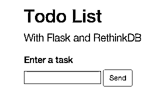
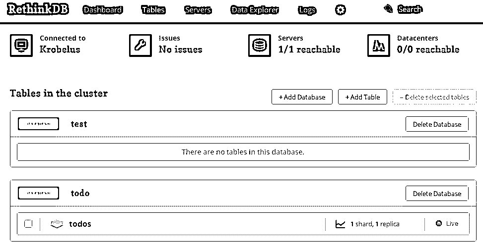
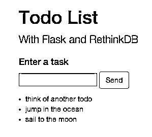

# rethink Flask——一个由 Flask 和 RethinkDB 支持的简单待办事项列表

> 原文：<https://realpython.com/rethink-flask-a-simple-todo-list-powered-by-flask-and-rethinkdb/>

在对基本的 [Flask](http://flask.pocoo.org/) 和 [RethinkDB](http://www.rethinkdb.com/) 模板的多次请求之后，我决定继续写一篇博文。这是那个帖子。

> BTW:我们总是欢迎请求。如果你想让我们写点什么，或者做点什么，请发邮件给我们。

今天我们将创建一个*简单的*待办事项列表，您可以根据自己的需要进行修改。在开始之前，我强烈建议通读一下[这篇](http://www.rethinkdb.com/docs/rethinkdb-vs-mongodb/)文章，它详细介绍了 RethinkDB 与其他一些 NoSQL 数据库的不同之处。

## 设置重新思考数据库

### 安装重新思考数据库

导航[此处](http://www.rethinkdb.com/docs/install/)并下载适合您系统的软件包。我用的是自制软件，花了将近 20 分钟来下载和安装这个版本:

```
==> Installing rethinkdb
==> Downloading http://download.rethinkdb.com/dist/rethinkdb-     1.11.2.tgz
######################################################################## 100.0%
==> ./configure --prefix=/usr/local/Cellar/rethinkdb/1.11.2 --  fetch v8 --fetch protobuf
==> make
==> make install-osx
==> Caveats
To have launchd start rethinkdb at login:
 ln -sfv /usr/local/opt/rethinkdb/*.plist   ~/Library/LaunchAgents
Then to load rethinkdb now:
 launchctl load   ~/Library/LaunchAgents/homebrew.mxcl.rethinkdb.plist
==> Summary
🍺  /usr/local/Cellar/rethinkdb/1.11.2: 174 files, 29M, built in   19.7 minutes
```py

[*Remove ads*](/account/join/)

### 全局安装 Python 驱动程序*

```
$ sudo pip install rethinkdb
```py

> **注意:**我全局安装了 Rethink(在 virtualenv 之外),因为我可能会在许多项目中使用相同的版本，使用许多不同的语言。在本教程的后面，我们将在 virtualenv 中安装。

### 测试您的设置

首先，让我们用以下命令启动服务器:

```
$ rethinkdb
```py

如果全部安装正确，您应该会看到类似以下内容:

```
info: Creating directory /Users/michaelherman/rethinkdb_data
info: Creating a default database for your convenience. (This is because you ran 'rethinkdb' without 'create', 'serve', or '--join', and the directory '/Users/michaelherman/rethinkdb_data' did not already exist.)
info: Running rethinkdb 1.11.2 (CLANG 4.2 (clang-425.0.28))...
info: Running on Darwin 12.4.0 x86_64
info: Loading data from directory    /Users/michaelherman/rethinkdb_data
info: Listening for intracluster connections on port 29015
info: Listening for client driver connections on port 28015
info: Listening for administrative HTTP connections on port 8080
info: Listening on addresses: 127.0.0.1, ::1
info: To fully expose RethinkDB on the network, bind to all addresses
info: by running rethinkdb with the `--bind all` command line option.
info: Server ready
```py

然后测试连接。在终端中打开一个新窗口，输入以下命令:

>>>

```
$ python
>>> import rethinkdb
>>> rethinkdb.connect('localhost', 28015).repl()
```py

您应该看到:

>>>

```
<rethinkdb.net.Connection object at 0x101122410>
```py

退出 Python shell，但让 RethinkDB 服务器在另一个终端窗口中运行。

## 建立一个基本的烧瓶项目

### 创建一个目录来存储您的项目

```
$ mkdir flask-rethink
$ cd flask-rethink
```py

### 设置并[激活一个虚拟](https://realpython.com/python-virtual-environments-a-primer/)

```
$ virtualenv --no-site-packages env
$ source env/bin/activate
```py

### 安装烧瓶和烧瓶-WTF

```
$ pip install flask
$ pip install flask-wtf
```py

[*Remove ads*](/account/join/)

### 创建一个 Pip 需求文件*

```
$ pip freeze > requirements.txt
```py

### 下载烧瓶样板文件

在[的模板目录中找到这个](https://github.com/mjhea0/flask-rethink)回购。您的项目结构现在应该如下所示:

```
├── app
│   ├── __init__.py
│   ├── forms.py
│   ├── models.py
│   ├── templates
│   │   ├── base.html
│   │   └── index.html
│   └── views.py
├── readme.md
├── requirements.txt
└── run.py
```py

### 运行应用程序

```
$ python run.py
```py

导航到 [http://localhost:5000/](http://localhost:5000/) ，您应该看到:

[](https://files.realpython.com/media/flask-rethink-main.a26c1da16d65.png)

先不要尝试提交任何东西，因为我们需要先建立一个数据库。让我们重新思考一下。

## 重新思考数据库配置

### 安装重新思考数据库

```
$ pip install rethinkdb
```py

### 将以下代码添加到“views . py”

```
# rethink imports
import rethinkdb as r
from rethinkdb.errors import RqlRuntimeError

# rethink config
RDB_HOST =  'localhost'
RDB_PORT = 28015
TODO_DB = 'todo'

# db setup; only run once
def dbSetup():
    connection = r.connect(host=RDB_HOST, port=RDB_PORT)
    try:
        r.db_create(TODO_DB).run(connection)
        r.db(TODO_DB).table_create('todos').run(connection)
        print 'Database setup completed'
    except RqlRuntimeError:
        print 'Database already exists.'
    finally:
        connection.close()
dbSetup()

# open connection before each request
@app.before_request
def before_request():
    try:
        g.rdb_conn = r.connect(host=RDB_HOST, port=RDB_PORT, db=TODO_DB)
    except RqlDriverError:
        abort(503, "Database connection could be established.")

# close the connection after each request
@app.teardown_request
def teardown_request(exception):
    try:
        g.rdb_conn.close()
    except AttributeError:
        pass
```py

查看注释，了解每个函数的简要说明。

### 再次启动您的服务器

您应该会在终端中看到以下警报:

```
Database setup completed
```py

> 如果您看到这个错误`rethinkdb.errors.RqlDriverError: Could not connect to localhost:28015.`，您的 RethinkDB 服务器没有运行。打开一个新的终端窗口并运行`$ rethinkdb`。

所以，我们创建了一个名为“todo”的新数据库，其中有一个名为“todos”的表。

您可以在 RethinkDB 管理中验证这一点。导航到 [http://localhost:8080/](http://localhost:8080/) 。管理员应该加载。如果您单击“Tables ”,您应该会看到我们创建的数据库和表:

[](https://files.realpython.com/media/flask-rethink-admin.a3996f26af7b.png)[*Remove ads*](/account/join/)

### 显示待办事项

有了数据库设置，让我们添加代码来显示待办事项。更新“views.py”中的`index()`函数:

```
@app.route("/")
def index():
    form = TaskForm()
    selection = list(r.table('todos').run(g.rdb_conn))
    return render_template('index.html', form=form, tasks=selection)
```py

这里，我们选择“todos”表，提取 JSON 中的所有数据，并将整个表传递给模板。

### 手动添加数据

在查看任何待办事项之前，我们需要先添加一些待办事项。让我们检查一下外壳，然后手动添加它们。

>>>

```
$ python
>>> import rethinkdb
>>> conn = rethinkdb.connect(db='todo')
>>> rethinkdb.table('todos').insert({'name':'sail to the moon'}).run(conn)
{u'errors': 0, u'deleted': 0, u'generated_keys': [u'c5562325-c5a1-4a78-8232-c0de4f500aff'], u'unchanged': 0, u'skipped': 0, u'replaced': 0, u'inserted': 1}
>>> rethinkdb.table('todos').insert({'name':'jump in the ocean'}).run(conn)
{u'errors': 0, u'deleted': 0, u'generated_keys': [u'0a3e3658-4513-48cb-bc68-5af247269ee4'], u'unchanged': 0, u'skipped': 0, u'replaced': 0, u'inserted': 1}
>>> rethinkdb.table('todos').insert({'name':'think of another todo'}).run(conn)
{u'errors': 0, u'deleted': 0, u'generated_keys': [u'b154a036-3c3b-47f4-89ec-cb9f4eff5f5a'], u'unchanged': 0, u'skipped': 0, u'replaced': 0, u'inserted': 1}
>>>
```py

因此，我们连接到数据库，然后在数据库的表中输入三个新对象。查看 API [文档](http://www.rethinkdb.com/api/python/)了解更多信息。

启动服务器。您现在应该看到三个任务:

[](https://files.realpython.com/media/flask-rethink-tasks.1cbdfdfea433.png)

### 最终确定表格

再次更新`index()`函数，从表单中提取数据并将其添加到数据库中:

```
@app.route('/', methods = ['GET', 'POST'])
def index():
    form = TaskForm()
      if form.validate_on_submit():
          r.table('todos').insert({"name":form.label.data}).run(g.rdb_conn)
          return redirect(url_for('index'))
      selection = list(r.table('todos').run(g.rdb_conn))
      return render_template('index.html', form = form, tasks = selection)
```

测试一下。添加一些 todos。发疯吧。

## 结论和挑战

目前的应用程序是功能性的，但我们还可以做更多的事情。让这款应用更上一层楼。

这里有一些想法:

1.  添加用户登录。
2.  创建一个更健壮的表单，可以为每个待办事项添加截止日期，然后在将待办事项呈现到 DOM 之前按该日期对其进行排序。
3.  添加功能和[单元测试](https://realpython.com/python-testing/)。
4.  添加为每个任务创建子任务的功能。
5.  通读 API 参考[文档](http://www.rethinkdb.com/api/python/)。玩转各种方法。
6.  将应用模块化。
7.  重构代码。向 RethinkDB 展示您的新代码。

你还想看什么？有兴趣看第二部分吗？与 [MongoDB](https://realpython.com/introduction-to-mongodb-and-python/) 相比，你觉得 RethinkDB 怎么样？下面分享一下你的想法。

你可以从[回购](https://github.com/mjhea0/flask-rethink)中抓取所有代码。干杯！***