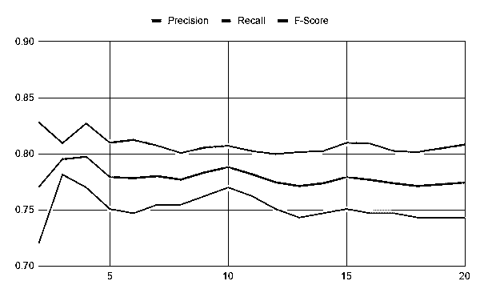

# 使用 Python 的情感分析对电影评论进行分类

> 原文：<https://realpython.com/sentiment-analysis-python/>

情感分析是一个强大的工具，可以让计算机理解一篇文章潜在的主观基调。这是人类很难做到的，正如你所想象的，对计算机来说也不总是那么容易。但是有了合适的工具和 Python，你可以使用情感分析来更好地理解一篇文章的**情感**。

你为什么要这么做？情绪分析有很多用途，例如通过使用社交媒体数据或汇总评论来了解股票交易者对某家公司的看法，这将在本教程结束时完成。

在本教程中，您将学习:

*   如何使用**自然语言处理**技术
*   如何利用机器学习**确定文本的情感**
*   如何使用 spaCy 来**构建一个 NLP 管道**,该管道将输入到情感分析分类器中

本教程非常适合希望获得以项目为中心的指导，使用 spaCy 构建情感分析管道的机器学习初学者。

你应该熟悉基本的[机器学习技术](https://realpython.com/tutorials/machine-learning)比如二进制分类以及它们背后的概念，比如训练循环、数据批次、权重和偏差。如果你不熟悉机器学习，那么你可以通过学习[逻辑回归](https://realpython.com/logistic-regression-python/)来启动你的旅程。

准备好之后，您可以通过从下面的链接下载源代码来学习本教程中的示例:

**获取源代码:** [点击此处获取源代码，您将在本教程中使用](https://realpython.com/bonus/sentiment-analysis-code/)来学习自然语言处理中的情感分析。

## 使用自然语言处理对文本数据进行预处理和清理

任何情感分析工作流程都是从加载数据开始的。但是一旦数据加载完毕，你会怎么做呢？在你可以用它做任何有趣的事情之前，你需要通过一个自然语言处理管道来处理它。

必要的步骤包括(但不限于)以下内容:

1.  **标记句子**将文本分解成句子、单词或其他单元
2.  **删除停用词**如“如果”、“但是”、“或者”等
3.  通过将一个单词的所有形式压缩成一种形式来使单词规范化
4.  **通过将文本转化为数字表示供分类器使用，对文本进行矢量化**

所有这些步骤都是为了减少任何人类可读文本中固有的噪声，并提高分类器结果的准确性。有很多很棒的工具可以帮助你，比如[自然语言工具包](https://www.nltk.org/)、 [TextBlob](https://textblob.readthedocs.io/en/dev/index.html) 和 [spaCy](https://spacy.io/) 。对于本教程，您将使用 spaCy。

注意: spaCy 是一个非常强大的工具，具有许多特性。要深入了解这些特性，请查看使用 spaCy 的[自然语言处理。](https://realpython.com/natural-language-processing-spacy-python/)

在继续之前，请确保您已经安装了 spaCy 及其英文版:

```py
$ pip install spacy==2.3.5
$ python -m spacy download en_core_web_sm
```

第一个命令安装 spaCy，第二个命令使用 spaCy 下载其英语语言模型。spaCy 支持许多不同的语言，这些语言在 spaCy 网站上列出。

警告:本教程仅适用于 spaCy 2。并且与 spaCy 3.0 不兼容。为了获得最佳体验，请安装上面指定的版本。

接下来，您将学习如何使用 spaCy 来帮助完成之前学习过的预处理步骤，从标记化开始。

[*Remove ads*](/account/join/)

### 标记化

**标记化**是将大块文本分解成小块的过程。spaCy 附带了一个默认的处理管道，从标记化开始，使这个过程变得很容易。在 spaCy 中，您可以进行句子标记化或单词标记化:

*   **单词标记化**将文本分解成单个单词。
*   **句子标记化**将文本分解成单独的句子。

在本教程中，您将使用单词标记化将文本分成单个单词。首先，将文本加载到 spaCy 中，spaCy 会为您完成标记化工作:

>>>

```py
>>> import spacy
>>> text = """
... Dave watched as the forest burned up on the hill,
... only a few miles from his house. The car had
... been hastily packed and Marta was inside trying to round
... up the last of the pets. "Where could she be?" he wondered
... as he continued to wait for Marta to appear with the pets.
... """

>>> nlp = spacy.load("en_core_web_sm")
>>> doc = nlp(text)
>>> token_list = [token for token in doc]
>>> token_list
[
, Dave, watched, as, the, forest, burned, up, on, the, hill, ,,
, only, a, few, miles, from, his, house, ., The, car, had,
, been, hastily, packed, and, Marta, was, inside, trying, to, round,
, up, the, last, of, the, pets, ., ", Where, could, she, be, ?, ", he, wondered,
, as, he, continued, to, wait, for, Marta, to, appear, with, the, pets, .,
]
```

在这段代码中，您设置了一些要标记的示例文本，加载 spaCy 的英语模型，然后通过将文本传递到`nlp`构造函数中来标记文本。这个模型包括一个您可以定制的默认处理管道，您将在项目部分的后面看到。

之后，生成一个令牌列表并打印出来。您可能已经注意到，“单词标记化”是一个稍微容易引起误解的术语，因为捕获的标记包括标点符号和其他非单词字符串。

令牌是 spaCy 中一种重要的容器类型，具有非常丰富的特性。在下一节中，您将学习如何使用这些特性之一来过滤掉停用词。

### 移除停止字

**停用词**是在人类交流中可能很重要，但对机器价值不大的词。spaCy 提供了一个默认的停用词列表，您可以自定义该列表。现在，您将看到如何使用令牌属性来删除停用词:

>>>

```py
>>> filtered_tokens = [token for token in doc if not token.is_stop]
>>> filtered_tokens
[
, Dave, watched, forest, burned, hill, ,,
, miles, house, ., car,
, hastily, packed, Marta, inside, trying, round,
, pets, ., ", ?, ", wondered,
, continued, wait, Marta, appear, pets, .,
]
```

在一行 Python 代码中，使用`.is_stop` token 属性从标记化的文本中过滤出停用词。

您注意到这个输出和标记文本后得到的输出之间有什么不同？去掉停用词后，标记列表会更短，帮助您理解标记的上下文也更少。

### 标准化单词

**规范化**比记号化稍微复杂一点。它需要将一个单词的所有形式浓缩成一个单词的单一表示。例如，“观看”、“观看”和“手表”都可以规范化为“手表”有两种主要的标准化方法:

1.  堵塞物
2.  词汇化

使用**词干**，一个单词在其**词干**处被切断，这是该单词的最小单位，从中可以创建后代单词。你刚刚看到了一个例子，上面是“手表”词干处理只是使用普通的词尾来截断字符串，所以它会漏掉“feel”和“felt”之间的关系。

**词汇化**试图解决这个问题。这个过程使用了一种数据结构，将一个单词的所有形式与其最简单的形式联系起来，即**词条**。因为词汇化通常比词干化更强大，所以它是 spaCy 提供的唯一规范化策略。

幸运的是，您不需要任何额外的代码来做到这一点。当你调用`nlp()`的时候，它会自动发生——还有许多其他活动，比如**词性标注**和**命名实体识别**。您可以利用`.lemma_`属性来检查每个令牌的引理:

>>>

```py
>>> lemmas = [
...     f"Token: {token}, lemma: {token.lemma_}"
...     for token in filtered_tokens
... ]
>>> lemmas
['Token: \n, lemma: \n', 'Token: Dave, lemma: Dave',
 'Token: watched, lemma: watch', 'Token: forest, lemma: forest',
 # ...
]
```

您在这里所做的只是通过遍历过滤后的记号列表生成一个可读的记号和词条列表，利用`.lemma_`属性来检查词条。这个例子只显示了前几个记号和引理。你的输出会更长。

**注意:**注意`.lemma_`属性上的下划线。那不是错别字。spaCy 中的惯例是[获取属性](https://spacy.io/usage/linguistic-features)的人类可读版本。

下一步是以机器能够理解的方式来表示每个令牌。这叫做**矢量化**。

[*Remove ads*](/account/join/)

### 向量化文本

**矢量化**是将令牌转换为**向量**或数值数组的过程，在 NLP 环境中，该数值数组是唯一的，并代表令牌的各种特征。向量被用于寻找单词相似性、对文本进行分类以及执行其他 NLP 操作。

这个特殊的表示是一个**密集数组**，其中数组中的每个空间都有定义的值。这与早期使用**稀疏数组**的方法相反，在这些方法中，大部分空间是空的。

像其他步骤一样，矢量化是通过`nlp()`调用自动完成的。因为您已经有了一个令牌对象列表，所以您可以获得其中一个令牌的向量表示，如下所示:

>>>

```py
>>> filtered_tokens[1].vector
array([ 1.8371646 ,  1.4529226 , -1.6147211 ,  0.678362  , -0.6594443 ,
 1.6417935 ,  0.5796405 ,  2.3021278 , -0.13260496,  0.5750932 ,
 1.5654886 , -0.6938864 , -0.59607106, -1.5377437 ,  1.9425622 ,
 -2.4552505 ,  1.2321601 ,  1.0434952 , -1.5102385 , -0.5787632 ,
 0.12055647,  3.6501784 ,  2.6160972 , -0.5710199 , -1.5221789 ,
 0.00629176,  0.22760668, -1.922073  , -1.6252862 , -4.226225  ,
 -3.495663  , -3.312053  ,  0.81387717, -0.00677544, -0.11603224,
 1.4620426 ,  3.0751472 ,  0.35958546, -0.22527039, -2.743926  ,
 1.269633  ,  4.606786  ,  0.34034157, -2.1272311 ,  1.2619178 ,
 -4.209798  ,  5.452852  ,  1.6940253 , -2.5972986 ,  0.95049495,
 -1.910578  , -2.374927  , -1.4227567 , -2.2528825 , -1.799806  ,
 1.607501  ,  2.9914255 ,  2.8065152 , -1.2510269 , -0.54964066,
 -0.49980402, -1.3882618 , -0.470479  , -2.9670253 ,  1.7884955 ,
 4.5282774 , -1.2602427 , -0.14885521,  1.0419178 , -0.08892632,
 -1.138275  ,  2.242618  ,  1.5077229 , -1.5030195 ,  2.528098  ,
 -1.6761329 ,  0.16694719,  2.123961  ,  0.02546412,  0.38754445,
 0.8911977 , -0.07678384, -2.0690763 , -1.1211847 ,  1.4821006 ,
 1.1989193 ,  2.1933236 ,  0.5296372 ,  3.0646474 , -1.7223308 ,
 -1.3634219 , -0.47471118, -1.7648507 ,  3.565178  , -2.394205  ,
 -1.3800384 ], dtype=float32)
```

在这里，您在`filtered_tokens`列表中的第二个标记上使用了`.vector`属性，在这组示例中是单词`Dave`。

**注意:**如果您对`.vector`属性得到不同的结果，不要担心。这可能是因为您正在使用不同版本的`en_core_web_sm`模型，或者可能是 spaCy 本身。

现在您已经了解了 spaCy 中一些典型的文本预处理步骤，您将学习如何对文本进行分类。

## 使用机器学习分类器预测情感

你的文本现在被处理成你的计算机可以理解的形式，所以你可以开始根据它的情感对它进行分类。您将涉及三个主题，这些主题将让您对文本数据的[机器学习分类](https://realpython.com/logistic-regression-python/#classification)有一个大致的了解:

1.  有哪些机器学习工具，它们是如何使用的
2.  分类如何工作
3.  如何使用 spaCy 进行文本分类

首先，您将了解一些可用于进行机器学习分类的工具。

### 机器学习工具

Python 中有许多工具可用于解决分类问题。以下是一些比较受欢迎的:

*   [TensorFlow](https://www.tensorflow.org/)
*   [指针](https://pytorch.org/)
*   [scikit-learn](https://scikit-learn.org/)

这个列表并不是包罗万象的，但是这些是 Python 中更广泛使用的机器学习框架。它们是庞大而强大的框架，需要花费大量时间才能真正掌握和理解。

**TensorFlow** 由 Google 开发，是最流行的机器学习框架之一。您主要使用它来实现您自己的机器学习算法，而不是使用现有的算法。它是相当低级的，这给了用户很大的权力，但它伴随着陡峭的学习曲线。

PyTorch 是脸书对 TensorFlow 的回应，并实现了许多相同的目标。然而，它是为了让 Python 程序员更熟悉而构建的，并且凭借其自身的优势已经成为一个非常受欢迎的框架。因为它们有相似的用例，[如果你正在考虑学习一个框架，比较 TensorFlow 和 PyTorch](https://realpython.com/pytorch-vs-tensorflow/) 是一个有用的练习。

**scikit-learn** 与 TensorFlow 和 PyTorch 形成对比。它是更高层次的，允许你使用现成的机器学习算法，而不是构建自己的算法。它在可定制性方面的不足，在易用性方面得到了充分的弥补，允许您只需几行代码就可以快速训练分类器。

幸运的是，spaCy 提供了一个相当简单的内置文本分类器，稍后您将会了解到。然而，首先，理解任何分类问题的一般工作流程是很重要的。

[*Remove ads*](/account/join/)

### 分类如何工作

不要担心——在这一部分，你不会深入到线性代数、向量空间或其他深奥的概念中，这些概念通常会推动机器学习。相反，您将获得对分类问题中常见的工作流和约束的实际介绍。

一旦有了矢量化数据，分类的基本工作流程如下所示:

1.  将您的数据分成训练集和评估集。
2.  选择模型架构。
3.  使用训练数据来训练您的模型。
4.  使用测试数据来评估模型的性能。
5.  对新数据使用您的训练模型来生成预测，在这种情况下，预测值将是介于-1.0 和 1.0 之间的数字。

这个列表并不详尽，为了提高准确性，还可以做一些额外的步骤和变化。例如，机器学习实践者经常将他们的数据集分成三组:

1.  培养
2.  确认
3.  试验

**训练集**顾名思义就是用来训练你的模型。**验证集**用于帮助调整您的模型的**超参数**，这可以带来更好的性能。

**注意:**超参数控制模型的训练过程和结构，可以包括学习率和批量大小等内容。但是，哪些超参数可用在很大程度上取决于您选择使用的模型。

**测试集**是一个数据集，它整合了各种各样的数据，以准确判断模型的性能。测试集通常用于比较多个模型，包括不同训练阶段的相同模型。

既然你已经学习了分类的一般流程，是时候用 spaCy 把它付诸行动了。

### 如何使用 spaCy 进行文本分类

您已经了解了 spaCy 如何使用`nlp()`构造函数为您做大量的文本预处理工作。这真的很有帮助，因为训练分类模型需要许多有用的例子。

此外，spaCy 还提供了一个管道功能，当您调用`nlp()`时，这个管道功能为发生在引擎盖下的许多魔法提供了动力。默认管道是在一个 [JSON](https://realpython.com/python-json/) 文件中定义的，该文件与您正在使用的任何一个预先存在的模型相关联(对于本教程来说是`en_core_web_sm`),但是如果您愿意，您也可以从头构建一个。

**注意:**要了解更多关于创建自己的语言处理管道的信息，请查看 [spaCy 管道文档](https://spacy.io/usage/processing-pipelines)。

这和分类有什么关系？spaCy 提供的内置管道组件之一叫做`textcat`(T1 的缩写)，它使你能够为你的文本数据分配类别(或**标签**，并将其用作神经网络的训练数据。

这个过程将生成一个训练好的模型，然后你可以用它来预测一段给定文本的情感。要利用该工具，您需要执行以下步骤:

1.  将`textcat`组件添加到现有管道中。
2.  向`textcat`组件添加有效标签。
3.  加载、洗牌和分割数据。
4.  训练模型，评估每个训练循环。
5.  使用训练好的模型来预测非训练数据的情感。
6.  或者，保存已训练的模型。

**注意:**你可以在[空间文档示例](https://spacy.io/usage/examples#textcat)中看到这些步骤的实现。这是在 spaCy 中对文本进行分类的主要方法，因此您会注意到项目代码大量来自这个示例。

在下一节中，您将学习如何通过构建自己的项目将所有这些部分组合在一起:一个电影评论情感分析器。

## 构建自己的 NLP 情感分析器

从前面的章节中，您可能已经注意到了构建情感分析管道的四个主要阶段:

1.  加载数据
2.  预处理
3.  训练分类器
4.  分类数据

为了构建一个现实生活中的情感分析器，您将完成组成这些阶段的每个步骤。你将使用由[安德鲁·马斯](http://www.andrew-maas.net/)编辑的[大型电影评论数据集](https://ai.stanford.edu/~amaas/data/sentiment/)来训练和测试你的情感分析器。准备好之后，继续下一部分加载数据。

[*Remove ads*](/account/join/)

### 加载和预处理数据

如果您还没有，请下载并提取大型电影评论数据集。花几分钟时间四处探索，看看它的结构，并对一些数据进行采样。这将告诉你如何加载数据。对于这一部分，你将使用 [spaCy 的`textcat`例子](https://spacy.io/usage/examples#textcat)作为粗略的指南。

您可以(也应该)将加载阶段分解成具体的步骤来帮助规划您的编码。这里有一个例子:

1.  从文件和目录结构中加载文本和标签。
2.  打乱数据。
3.  将数据分成训练集和测试集。
4.  返回两组数据。

这个过程是比较自成体系的，所以至少应该是自己的功能。在考虑该函数将执行的操作时，您可能已经想到了一些可能的参数。

因为您正在分割数据，控制这些分割的大小的能力可能是有用的，所以`split`是一个很好的包含参数。您可能还希望用一个`limit`参数来限制您处理的文档总量。您可以打开您最喜欢的编辑器并添加这个函数签名:

```py
def load_training_data(
    data_directory: str = "aclImdb/train",
    split: float = 0.8,
    limit: int = 0
) -> tuple:
```

有了这个签名，你就可以利用 Python 3 的[类型注释](https://realpython.com/lessons/type-hinting/)来明确你的函数需要什么类型以及它将返回什么。

此处的参数允许您定义存储数据的目录以及训练数据与测试数据的比率。一个好的开始比例是 80%的数据用于训练数据，20%的数据用于测试数据。除非另有说明，所有这些代码和下面的代码都应该在同一个文件中。

接下来，您需要遍历该数据集中的所有文件，并将它们加载到一个列表中:

```py
import os 
def load_training_data(
    data_directory: str = "aclImdb/train",
    split: float = 0.8,
    limit: int = 0
) -> tuple:
 # Load from files reviews = [] for label in ["pos", "neg"]: labeled_directory = f"{data_directory}/{label}" for review in os.listdir(labeled_directory): if review.endswith(".txt"): with open(f"{labeled_directory}/{review}") as f: text = f.read() text = text.replace("<br />", "\n\n") if text.strip(): spacy_label = { "cats": { "pos": "pos" == label, "neg": "neg" == label } } reviews.append((text, spacy_label))
```

虽然这看起来很复杂，但是您正在做的是构建数据的目录结构，查找并打开文本文件，然后将一个内容元组和一个标签字典追加到`reviews`列表中。

标签字典结构是 spaCy 模型在训练循环中需要的一种格式，您很快就会看到这一点。

**注意:**在本教程和您的 Python 之旅中，您将成为读写文件的。这是一项需要掌握的基本技能，所以在学习本教程时，请务必复习一下。

因为此时您已经打开了每个评论，所以用换行符替换文本中的`<br />` HTML 标签并使用`.strip()`删除所有前导和尾随空格是一个好主意。

对于这个项目，您不会立即从训练数据中删除停用词，因为它可能会改变句子或短语的含义，从而降低分类器的预测能力。这在一定程度上取决于您使用的停用词表。

加载完文件后，你想打乱它们。这有助于消除加载训练数据的顺序中任何可能的偏差。由于`random`模块使这一点在一行中很容易做到，您还将看到如何分割混洗的数据:

```py
import os
import random 
def load_training_data(
    data_directory: str = "aclImdb/train",
    split: float = 0.8,
    limit: int = 0
) -> tuple:
    # Load from files
    reviews = []
    for label in ["pos", "neg"]:
        labeled_directory = f"{data_directory}/{label}"
        for review in os.listdir(labeled_directory):
            if review.endswith(".txt"):
                with open(f"{labeled_directory}/{review}") as f:
                    text = f.read()
                    text = text.replace("<br />", "\n\n")
                    if text.strip():
                        spacy_label = {
                            "cats": {
                                "pos": "pos" == label,
                                "neg": "neg" == label}
                        }
                        reviews.append((text, spacy_label))
 random.shuffle(reviews) 
 if limit: reviews = reviews[:limit] split = int(len(reviews) * split) return reviews[:split], reviews[split:]
```

在这里，您通过调用`random.shuffle()`来混洗数据。然后，您可以选择使用某种数学方法截断和拆分数据，将拆分转换为定义拆分边界的多个项目。最后，您[使用列表片返回`reviews`列表的两个部分](https://realpython.com/python-return-statement/)。

以下是一个示例输出，为了简洁起见，进行了截断:

```py
(
 'When tradition dictates that an artist must pass (...)',
 {'cats': {'pos': True, 'neg': False}}
)
```

要了解更多关于`random`如何工作的信息，请看一下[用 Python 生成随机数据(指南)](https://realpython.com/python-random/)。

**注意:**spaCy 的制造商也发布了一个名为`thinc`的包，除了其他功能外，它还包括对大型数据集的简化访问，包括您在这个项目中使用的 IMDB review 数据集。

你可以在 GitHub 上找到项目[。如果您对其进行研究，请查看他们如何处理 IMDB 数据集的加载，并了解他们的代码与您自己的代码之间存在哪些重叠。](https://github.com/explosion/thinc)

既然您已经构建了数据加载器并做了一些简单的预处理，那么是时候构建空间管道和分类器训练循环了。

[*Remove ads*](/account/join/)

### 训练您的分类器

将 spaCy 管道放在一起，可以让您快速构建和训练一个用于分类文本数据的[卷积神经网络](https://en.wikipedia.org/wiki/Convolutional_neural_network) (CNN)。当你在这里使用它进行情感分析时，只要你给它提供训练数据和标签，它就足够通用于任何种类的[文本分类](https://realpython.com/python-keras-text-classification/)任务。

在项目的这一部分，您将负责三个步骤:

1.  修改基础空间管线以包含`textcat`组件
2.  构建一个训练循环来训练`textcat`组件
3.  在给定数量的训练循环后评估模型训练的进度

首先，您将把`textcat`添加到默认的空间管道中。

#### 修改空间管道以包括`textcat`

对于第一部分，您将加载与本教程开始时的例子中相同的管道，然后添加`textcat`组件(如果它还不存在的话)。之后，您将把数据使用的标签(`"pos"`表示正数，`"neg"`表示负数)添加到`textcat`。完成后，您就可以开始构建培训循环了:

```py
import os
import random
import spacy

def train_model(
    training_data: list,
    test_data: list,
    iterations: int = 20
) -> None:
    # Build pipeline
    nlp = spacy.load("en_core_web_sm")
    if "textcat" not in nlp.pipe_names:
        textcat = nlp.create_pipe(
            "textcat", config={"architecture": "simple_cnn"}
        )
        nlp.add_pipe(textcat, last=True)
```

如果你已经看过 spaCy 文档的 [`textcat`例子](https://spacy.io/usage/examples#textcat)，那么这个应该看起来很熟悉。首先，加载内置的`en_core_web_sm`管道，然后检查`.pipe_names`属性，查看`textcat`组件是否已经可用。

如果不是，那么您创建带有`.create_pipe()`的组件(也称为**管道**，并传入一个配置字典。在 [`TextCategorizer`文档](https://spacy.io/api/textcategorizer#init)中描述了一些你可以使用的选项。

最后，使用`.add_pipe()`将组件添加到管道中，使用`last`参数表示该组件应该添加到管道的末尾。

接下来，您将处理存在`textcat`组件的情况，然后添加标签作为文本的类别:

```py
import os
import random
import spacy

def train_model(
    training_data: list,
    test_data: list,
    iterations: int = 20
) -> None:
    # Build pipeline
    nlp = spacy.load("en_core_web_sm")
    if "textcat" not in nlp.pipe_names:
        textcat = nlp.create_pipe(
            "textcat", config={"architecture": "simple_cnn"}
        )
        nlp.add_pipe(textcat, last=True)
 else: textcat = nlp.get_pipe("textcat") 
 textcat.add_label("pos") textcat.add_label("neg")
```

如果组件出现在加载的管道中，那么您只需使用`.get_pipe()`将它赋给一个变量，这样您就可以对它进行操作。对于这个项目，你要做的就是从你的数据中添加标签，这样`textcat`就知道要寻找什么了。你会和`.add_label()`一起这么做。

您已经创建了管道，并为标签准备了`textcat`组件，它将用于训练。现在是时候编写训练循环了，它将允许`textcat`对电影评论进行分类。

#### 建立你的训练循环来训练`textcat`

为了开始训练循环，您将首先设置您的管道只训练`textcat`组件，使用 spaCy 的`minibatch()`和`compounding()`实用程序为它生成**批**数据，然后遍历它们并更新您的模型。

一个**批次**只是你的数据的一个子集。批处理数据可以减少训练过程中的内存占用，并更快地更新超参数。

**注意:**混合批量大小是一项相对较新的技术，应该有助于加快培训。你可以在 [spaCy 的培训提示](https://spacy.io/usage/training#tips-batch-size)中了解更多关于混合批量的信息。

下面是上述训练循环的实现:

```py
 1import os
 2import random
 3import spacy
 4from spacy.util import minibatch, compounding 5
 6def train_model(
 7    training_data: list,
 8    test_data: list,
 9    iterations: int = 20
10) -> None:
11    # Build pipeline
12    nlp = spacy.load("en_core_web_sm")
13    if "textcat" not in nlp.pipe_names:
14        textcat = nlp.create_pipe(
15            "textcat", config={"architecture": "simple_cnn"}
16        )
17        nlp.add_pipe(textcat, last=True)
18    else:
19        textcat = nlp.get_pipe("textcat")
20
21    textcat.add_label("pos")
22    textcat.add_label("neg")
23
24    # Train only textcat 25    training_excluded_pipes = [ 26        pipe for pipe in nlp.pipe_names if pipe != "textcat" 27    ]
```

在第 25 到 27 行，您创建了管道中除了`textcat`组件之外的所有组件的列表。然后，使用`nlp.disable()`上下文管理器为上下文管理器范围内的所有代码禁用这些组件。

现在您已经准备好添加代码来开始训练了:

```py
import os
import random
import spacy
from spacy.util import minibatch, compounding

def train_model(
    training_data: list,
    test_data: list,
    iterations: int = 20
) -> None:
    # Build pipeline
    nlp = spacy.load("en_core_web_sm")
    if "textcat" not in nlp.pipe_names:
        textcat = nlp.create_pipe(
            "textcat", config={"architecture": "simple_cnn"}
        )
        nlp.add_pipe(textcat, last=True)
    else:
        textcat = nlp.get_pipe("textcat")

    textcat.add_label("pos")
    textcat.add_label("neg")

    # Train only textcat
    training_excluded_pipes = [
        pipe for pipe in nlp.pipe_names if pipe != "textcat"
    ]
 with nlp.disable_pipes(training_excluded_pipes): optimizer = nlp.begin_training() # Training loop print("Beginning training") batch_sizes = compounding( 4.0, 32.0, 1.001 )  # A generator that yields infinite series of input numbers
```

这里，您调用`nlp.begin_training()`，它返回初始优化器函数。这是`nlp.update()`将用来更新底层模型的权重。

然后使用`compounding()`实用程序创建一个生成器，给你一个无限系列的`batch_sizes`，供`minibatch()`实用程序稍后使用。

现在，您将开始对批量数据进行训练:

```py
import os
import random
import spacy
from spacy.util import minibatch, compounding

def train_model(
    training_data: list,
    test_data: list,
    iterations: int = 20
) -> None:
    # Build pipeline
    nlp = spacy.load("en_core_web_sm")
    if "textcat" not in nlp.pipe_names:
        textcat = nlp.create_pipe(
            "textcat", config={"architecture": "simple_cnn"}
        )
        nlp.add_pipe(textcat, last=True)
    else:
        textcat = nlp.get_pipe("textcat")

    textcat.add_label("pos")
    textcat.add_label("neg")

    # Train only textcat
    training_excluded_pipes = [
        pipe for pipe in nlp.pipe_names if pipe != "textcat"
    ]
    with nlp.disable_pipes(training_excluded_pipes):
        optimizer = nlp.begin_training()
        # Training loop
        print("Beginning training")
        batch_sizes = compounding(
            4.0, 32.0, 1.001
        )  # A generator that yields infinite series of input numbers
 for i in range(iterations): loss = {} random.shuffle(training_data) batches = minibatch(training_data, size=batch_sizes) for batch in batches: text, labels = zip(*batch) nlp.update( text, labels, drop=0.2, sgd=optimizer, losses=loss                )
```

现在，对于在`train_model()`签名中指定的每个迭代，您创建一个名为`loss`的空字典，它将由`nlp.update()`更新和使用。您还可以利用`minibatch()`打乱训练数据，并将其分成不同大小的批次。

对于每一批，你分离文本和标签，然后输入它们，空的`loss`字典，和`optimizer`到`nlp.update()`。这将对每个示例进行实际的训练。

`dropout`参数告诉`nlp.update()`该批训练数据中要跳过的比例。这样做是为了让模型更难意外地记住训练数据，而没有提出一个可概括的模型。

这需要一些时间，所以定期评估你的模型是很重要的。您将使用从训练集中保留的数据来完成这项工作，该训练集也称为**维持集**。

#### 评估模型训练的进度

因为你要做许多评估，每个评估都有许多计算，所以写一个单独的`evaluate_model()`函数是有意义的。在这个函数中，您将针对未完成的模型运行测试集中的文档，以获得模型的预测，然后将它们与该数据的正确标签进行比较。

使用该信息，您将计算以下值:

*   **真阳性**是您的模型正确预测为阳性的文档。对于这个项目，这映射到积极的情绪，但在二元分类任务中推广到你试图识别的类别。

*   **假阳性**是您的模型错误地预测为阳性但实际上是阴性的文档。

*   **真否定**是您的模型正确预测为否定的文档。

*   **假阴性**是您的模型错误地预测为阴性但实际上为阳性的文档。

因为您的模型将为每个标签返回一个介于 0 和 1 之间的分数，所以您将基于该分数确定一个肯定或否定的结果。根据上述四个统计数据，您将计算精度和召回率，这是分类模型性能的常用度量:

*   **Precision** 是真阳性与您的模型标记为阳性的所有项目的比率(真*和*假阳性)。精度为 1.0 意味着您的模型标记为正面的每个评论都属于正面类。

*   **召回**是真阳性与所有*实际上*阳性的评论的比率，或者是真阳性的数量除以真阳性和假阴性的总数。

F 值是另一个流行的准确性指标，尤其是在 NLP 领域。解释它可能需要自己的文章，但是您将在代码中看到计算。与精确度和召回率一样，分数范围从 0 到 1，1 表示最高性能，0 表示最低性能。

对于`evaluate_model()`，您需要传入管道的`tokenizer`组件、`textcat`组件和您的测试数据集:

```py
def evaluate_model(
    tokenizer, textcat, test_data: list
) -> dict:
    reviews, labels = zip(*test_data)
    reviews = (tokenizer(review) for review in reviews)
    true_positives = 0
    false_positives = 1e-8  # Can't be 0 because of presence in denominator
    true_negatives = 0
    false_negatives = 1e-8
    for i, review in enumerate(textcat.pipe(reviews)):
        true_label = labels[i]
        for predicted_label, score in review.cats.items():
            # Every cats dictionary includes both labels. You can get all
            # the info you need with just the pos label.
            if (
                predicted_label == "neg"
            ):
                continue
            if score >= 0.5 and true_label["pos"]:
                true_positives += 1
            elif score >= 0.5 and true_label["neg"]:
                false_positives += 1
            elif score < 0.5 and true_label["neg"]:
                true_negatives += 1
            elif score < 0.5 and true_label["pos"]:
                false_negatives += 1
    precision = true_positives / (true_positives + false_positives)
    recall = true_positives / (true_positives + false_negatives)

    if precision + recall == 0:
        f_score = 0
    else:
        f_score = 2 * (precision * recall) / (precision + recall)
    return {"precision": precision, "recall": recall, "f-score": f_score}
```

在这个函数中，您将评论和它们的标签分开，然后使用一个[生成器表达式](https://realpython.com/introduction-to-python-generators/)来标记您的每个评估评论，准备将它们传递给`textcat`。生成器表达式是 spaCy 文档中推荐的一个很好的技巧，它允许你遍历你的标记化评论，而不用把它们都保存在内存中。

然后使用`score`和`true_label`来确定真或假阳性以及真或假阴性。然后，您使用这些来计算精确度、召回率和 f 值。现在剩下的就是给`evaluate_model()`打电话了:

```py
def train_model(training_data: list, test_data: list, iterations: int = 20):
    # Previously seen code omitted for brevity.
        # Training loop
        print("Beginning training")
 print("Loss\tPrecision\tRecall\tF-score")        batch_sizes = compounding(
            4.0, 32.0, 1.001
        )  # A generator that yields infinite series of input numbers
        for i in range(iterations):
            loss = {}
            random.shuffle(training_data)
            batches = minibatch(training_data, size=batch_sizes)
            for batch in batches:
                text, labels = zip(*batch)
                nlp.update(
                    text,
                    labels,
                    drop=0.2,
                    sgd=optimizer,
                    losses=loss
                )
 with textcat.model.use_params(optimizer.averages): evaluation_results = evaluate_model( tokenizer=nlp.tokenizer, textcat=textcat, test_data=test_data ) print( f"{loss['textcat']}\t{evaluation_results['precision']}" f"\t{evaluation_results['recall']}" f"\t{evaluation_results['f-score']}" )
```

这里您添加了一个[打印语句](https://realpython.com/python-print/)来帮助组织来自`evaluate_model()`的输出，然后用`.use_params()`上下文管理器调用它，以便在当前状态下使用模型。然后你给`evaluate_model()`打电话并打印结果。

训练过程完成后，最好保存刚刚训练的模型，以便在不训练新模型的情况下再次使用它。在您的训练循环之后，添加此代码以将训练好的模型保存到位于您的工作目录中名为`model_artifacts`的目录中:

```py
# Save model
with nlp.use_params(optimizer.averages):
    nlp.to_disk("model_artifacts")
```

这个代码片段将您的模型保存到一个名为`model_artifacts`的目录中，这样您就可以在不重新训练模型的情况下进行调整。最终的训练函数应该是这样的:

```py
def train_model(
    training_data: list,
    test_data: list,
    iterations: int = 20
) -> None:
    # Build pipeline
    nlp = spacy.load("en_core_web_sm")
    if "textcat" not in nlp.pipe_names:
        textcat = nlp.create_pipe(
            "textcat", config={"architecture": "simple_cnn"}
        )
        nlp.add_pipe(textcat, last=True)
    else:
        textcat = nlp.get_pipe("textcat")

    textcat.add_label("pos")
    textcat.add_label("neg")

    # Train only textcat
    training_excluded_pipes = [
        pipe for pipe in nlp.pipe_names if pipe != "textcat"
    ]
    with nlp.disable_pipes(training_excluded_pipes):
        optimizer = nlp.begin_training()
        # Training loop
        print("Beginning training")
        print("Loss\tPrecision\tRecall\tF-score")
        batch_sizes = compounding(
            4.0, 32.0, 1.001
        )  # A generator that yields infinite series of input numbers
        for i in range(iterations):
            print(f"Training iteration {i}")
            loss = {}
            random.shuffle(training_data)
            batches = minibatch(training_data, size=batch_sizes)
            for batch in batches:
                text, labels = zip(*batch)
                nlp.update(text, labels, drop=0.2, sgd=optimizer, losses=loss)
            with textcat.model.use_params(optimizer.averages):
                evaluation_results = evaluate_model(
                    tokenizer=nlp.tokenizer,
                    textcat=textcat,
                    test_data=test_data
                )
                print(
                    f"{loss['textcat']}\t{evaluation_results['precision']}"
                    f"\t{evaluation_results['recall']}"
                    f"\t{evaluation_results['f-score']}"
                )

    # Save model
    with nlp.use_params(optimizer.averages):
        nlp.to_disk("model_artifacts")
```

在本节中，您学习了如何训练模型并在训练时评估其性能。然后，您构建了一个根据输入数据训练分类模型的函数。

[*Remove ads*](/account/join/)

### 对评论进行分类

现在你有了一个训练好的模型，是时候用一个真实的评论来测试它了。出于这个项目的目的，您将硬编码一个评论，但是您当然应该尝试通过从其他来源读取评论来扩展这个项目，例如文件或评论聚合器的 API。

这个新功能的第一步是加载之前保存的模型。虽然您可以使用内存中的模型，但是加载保存的**模型工件**允许您有选择地完全跳过训练，稍后您将看到这一点。下面是`test_model()`签名以及加载您保存的模型的代码:

```py
def test_model(input_data: str=TEST_REVIEW):
    #  Load saved trained model
    loaded_model = spacy.load("model_artifacts")
```

在这段代码中，您定义了`test_model()`，它包含了`input_data`参数。然后加载之前保存的模型。

您正在处理的 IMDB 数据包括训练数据目录中的一个`unsup`目录，其中包含您可以用来测试您的模型的未标记的评论。这里有一篇这样的评论。您应该将它(或您选择的另一个)保存在文件顶部的一个`TEST_REVIEW`常量中:

```py
import os
import random
import spacy
from spacy.util import minibatch, compounding

TEST_REVIEW = """
Transcendently beautiful in moments outside the office, it seems almost
sitcom-like in those scenes. When Toni Colette walks out and ponders
life silently, it's gorgeous.<br /><br />The movie doesn't seem to decide
whether it's slapstick, farce, magical realism, or drama, but the best of it
doesn't matter. (The worst is sort of tedious - like Office Space with less humor.)
"""
```

接下来，您将把这个检查传递到您的模型中以生成一个预测，为显示做准备，然后向用户显示它:

```py
def test_model(input_data: str = TEST_REVIEW):
    #  Load saved trained model
    loaded_model = spacy.load("model_artifacts")
    # Generate prediction
    parsed_text = loaded_model(input_data)
    # Determine prediction to return
    if parsed_text.cats["pos"] > parsed_text.cats["neg"]:
        prediction = "Positive"
        score = parsed_text.cats["pos"]
    else:
        prediction = "Negative"
        score = parsed_text.cats["neg"]
    print(
        f"Review text: {input_data}\nPredicted sentiment: {prediction}"
        f"\tScore: {score}"
    )
```

在这段代码中，您将您的`input_data`传递到您的`loaded_model`，这将在`parsed_text`变量的`cats`属性中生成一个预测。然后你检查每种情绪的分数，并将最高的分数保存在`prediction`变量中。

然后，您将该情绪的分数保存到`score`变量中。这将更容易创建人类可读的输出，这是该函数的最后一行。

现在，您已经编写了`load_data()`、`train_model()`、`evaluate_model()`和`test_model()`函数。这意味着是时候把它们放在一起，训练你的第一个模型了。

### 连接管道

到目前为止，您已经构建了许多独立的函数，这些函数合在一起将加载数据，并训练、评估、保存和测试 Python 中的情感分析分类器。

让这些函数可用还有最后一步，那就是在脚本运行时调用它们。您将使用 [`if __name__ == "__main__":`习语](https://realpython.com/if-name-main-python/)来完成这个任务:

```py
if __name__ == "__main__":
    train, test = load_training_data(limit=2500)
    train_model(train, test)
    print("Testing model")
    test_model()
```

在这里，您使用您在[加载和预处理数据](#loading-and-preprocessing-data)部分编写的函数加载您的训练数据，并限制用于`2500`总计的评论数量。然后你使用你在[训练你的分类器](#training-your-classifier)中写的`train_model()`函数训练模型，一旦完成，你调用`test_model()`来测试你的模型的性能。

**注意:**根据训练示例的数量，训练可能需要十分钟或更长时间，具体取决于您的系统。您可以减少训练集的大小以缩短训练时间，但是您可能会有模型不太准确的风险。

你的模型预测了什么？你同意这个结果吗？如果在加载数据时增加或减少`limit`参数会发生什么？您的分数甚至您的预测可能会有所不同，但是您应该期望您的输出是这样的:

```py
$ python pipeline.py
Training model
Beginning training
Loss    Precision       Recall  F-score
11.293997120810673      0.7816593886121546      0.7584745762390477      0.7698924730851658
1.979159922178951       0.8083333332996527      0.8220338982702527      0.8151260503859189
[...]
0.000415042785704145    0.7926829267970453      0.8262711864056664      0.8091286306718204
Testing model
Review text:
Transcendently beautiful in moments outside the office, it seems almost
sitcom-like in those scenes. When Toni Colette walks out and ponders
life silently, it's gorgeous.<br /><br />The movie doesn't seem to decide
whether it's slapstick, farce, magical realism, or drama, but the best of it
doesn't matter. (The worst is sort of tedious - like Office Space with less humor.)

Predicted sentiment: Positive   Score: 0.8773064017295837
```

当您的模型训练时，您将看到丢失、精度和召回的度量以及每个训练迭代的 F 分数。你应该会看到损失普遍减少。精确度、召回率和 F 值都会反弹，但理想情况下它们会增加。然后你会看到考试复习，情绪预测，以及那个预测的分数——越高越好。

您现在已经使用 spaCy 的自然语言处理技术和神经网络训练了您的第一个情感分析机器学习模型！这里有两个图表显示了模型在二十次训练迭代中的表现。第一个图表显示了损失在训练过程中的变化:

[](https://files.realpython.com/media/loss_chart.c0fecc2d5c49.png)

虽然上图显示了一段时间内的损失，但下图绘制了同一训练期间的精确度、召回率和 F 分数:

[](https://files.realpython.com/media/precision_recall_fscore_chart.b232474e1a64.png)

在这些图表中，您可以看到损失开始很高，但在训练迭代中下降很快。在最初的几次训练迭代之后，精确度、召回率和 F 值相当稳定。你能做些什么来改善这些价值观呢？

[*Remove ads*](/account/join/)

## 结论

恭喜你用 Python 构建了你的第一个情感分析模型！你觉得这个项目怎么样？你不仅构建了一个有用的数据分析工具，还掌握了许多自然语言处理和机器学习的基本概念。

**在本教程中，您学习了如何:**

*   使用自然语言处理技术
*   使用**机器学习分类器**来确定处理后的文本数据的情感
*   使用 spaCy 构建您自己的 **NLP 管道**

你现在有了基本的工具包来构建更多的模型来回答你可能有的任何研究问题。如果您想回顾一下您所学的内容，那么您可以从下面的链接下载并试验本教程中使用的代码:

**获取源代码:** [点击此处获取源代码，您将在本教程中使用](https://realpython.com/bonus/sentiment-analysis-code/)来学习自然语言处理中的情感分析。

这个项目你还能做什么？以下是一些建议。

## 情绪分析和 Python 的后续步骤

这是一个核心项目，根据您的兴趣，您可以围绕它构建许多功能。这里有一些想法可以让你开始扩展这个项目:

*   在`load_data()`期间，数据加载过程将每个检查加载到内存中。你能通过使用**生成器函数**来提高内存效率吗？

*   重写您的代码以在预处理或数据加载过程中删除停止字。模式性能如何变化？您能把这种预处理合并到管道组件中吗？

*   使用[点击](https://click.palletsprojects.com/en/7.x/)等工具生成交互式**命令行界面**。

*   **将你的模型**部署到像 [AWS](https://aws.amazon.com/about-aws/) 这样的云平台上，并为其连接一个 API。这可以构成基于网络的工具的基础。

*   探索`textcat`管道组件的**配置参数**，并试验不同的配置。

*   探索不同的方式**传递新的评论**以生成预测。

*   **将选项**参数化，如保存和加载已训练模型的位置，是否跳过训练或训练新模型，等等。

这个项目使用[大型电影评论数据集](https://ai.stanford.edu/~amaas/data/sentiment/)，由[安德鲁·马斯](http://www.andrew-maas.net/)维护。感谢 Andrew 让这个精选的数据集被广泛使用。*******