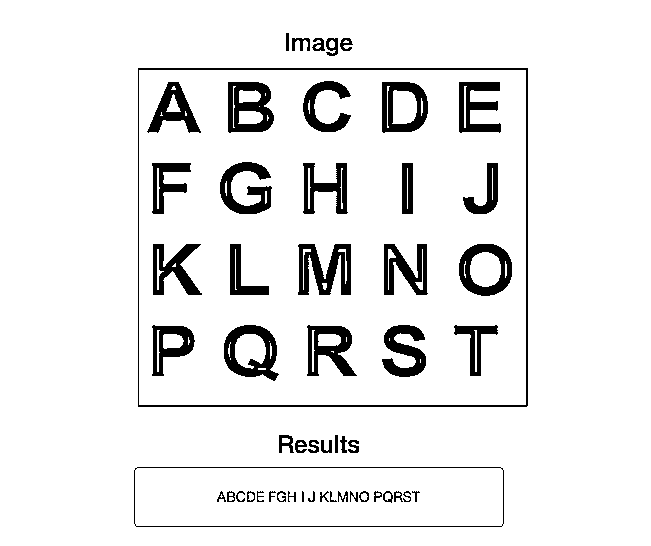

# 设置简单的 OCR 服务器

> 原文：<https://realpython.com/setting-up-a-simple-ocr-server/>

*以下是[博比·格雷森](http://twitter.com/_devbob)，一位 [Ahalogy](http://www.ahalogy.com/) 的软件开发人员和真正的 Python 之间的合作片段。*

## 为什么要用 Python 做 OCR？

[OCR](http://en.wikipedia.org/wiki/Optical_character_recognition) (光学字符识别)已经成为一种常见的 Python 工具。随着像[宇宙魔方](http://en.wikipedia.org/wiki/Tesseract_%28software%29)和 [Ocrad](http://www.gnu.org/software/ocrad/) 这样的库的出现，越来越多的开发者正在构建以新颖有趣的方式使用 OCR 的库和机器人。一个简单的例子是一个基本的 OCR 工具，用于从屏幕截图中提取文本，这样您就不必稍后重新键入文本。

## 开始步骤

我们将从开发 Flask 后端层开始，为 OCR 引擎的结果服务。从那里，您可以点击终端，并以适合您的方式将结果提供给最终用户。本教程将详细介绍所有这些内容。我们还将添加一些后端代码来生成 HTML 表单，以及前端代码来[消费 API](https://realpython.com/python-api/) 。本教程将不会涉及这一点，但是您可以访问代码。

我们开始吧。

首先，我们必须安装一些[依赖项](https://realpython.com/courses/managing-python-dependencies/)。一如既往，配置您的环境是 90%的乐趣。

> 这篇文章已经在 Ubuntu 版本上进行了测试，但它应该也适用于 12.x 和 13.x 版本。如果你运行的是 OSX，你可以使用 [VirtualBox](http://osxdaily.com/2012/03/27/install-run-ubuntu-linux-virtualbox/) 、 [Docker](https://www.docker.com/) (查看[Docker 文件](https://github.com/rhgraysonii/ocr_tutorial/blob/master/Dockerfile)以及[安装指南](https://github.com/rhgraysonii/ocr_tutorial/blob/master/DOCKER_INSTALL.md))或 [DigitalOcean](https://www.digitalocean.com/) 上的 droplet(推荐！)来创造适当的环境。

[*Remove ads*](/account/join/)

## 下载依赖关系

我们需要[宇宙魔方](http://en.wikipedia.org/wiki/Tesseract_%28software%29)及其所有的依赖项，包括[莱普尼卡](http://www.leptonica.com/)，以及其他一些支持这两个包的包，以便开始健全性检查。

> **注意**:您也可以使用 [_run.sh](https://github.com/rhgraysonii/ocr_tutorial/blob/master/_run.sh) shell 脚本来快速安装依赖项以及 Leptonica 和 Tesseract。如果你走这条路，跳到[网络服务器时间！](https://realpython.com/setting-up-a-simple-ocr-server/#web-server-time)一节。但是如果您以前没有这样做过，请考虑手工构建这些库(出于学习目的)。

```py
$ sudo apt-get update
$ sudo apt-get install autoconf automake libtool
$ sudo apt-get install libpng12-dev
$ sudo apt-get install libjpeg62-dev
$ sudo apt-get install g++
$ sudo apt-get install libtiff4-dev
$ sudo apt-get install libopencv-dev libtesseract-dev
$ sudo apt-get install git
$ sudo apt-get install cmake
$ sudo apt-get install build-essential
$ sudo apt-get install libleptonica-dev
$ sudo apt-get install liblog4cplus-dev
$ sudo apt-get install libcurl3-dev
$ sudo apt-get install python2.7-dev
$ sudo apt-get install tk8.5 tcl8.5 tk8.5-dev tcl8.5-dev
$ sudo apt-get build-dep python-imaging --fix-missing
```

### 发生什么事了？

简单地说，`sudo apt-get update`是“确保我们有最新的包列表”的缩写。然后我们抓取了一些允许我们摆弄图像的库——比如`libtiff`、`libpng`等等。除此之外，我们使用我们选择的编程语言`Python 2.7`，以及与所有这些部分交互的`python-imaging`库。

说到图像，如果我们想在以编程方式将图像放入之前摆弄(编辑)它们，我们还需要 [ImageMagick](http://www.imagemagick.org/) 。

```py
$ sudo apt-get install imagemagick
```

## 建造莱普尼卡和宇宙魔方

同样，如果您运行了 shell 脚本，那么它们已经安装好了，所以请继续执行 [Web 服务器时间！](https://realpython.com/setting-up-a-simple-ocr-server/#web-server-time)章节

### 百日咳〔t0〕

现在，终于轮到莱普妮卡了！

```py
$ wget http://www.leptonica.org/source/leptonica-1.70.tar.gz
$ tar -zxvf leptonica-1.70.tar.gz
$ cd leptonica-1.70/
$ ./autobuild
$ ./configure
$ make
$ sudo make install
$ sudo ldconfig
```

如果这是你第一次玩 [tar](http://en.wikipedia.org/wiki/Tar_%28computing%29) ，下面是发生的事情:

*   获取 Leptonica 的二进制文件(通过`wget`)
*   拉开 tarball
*   `cd`放入新解压的目录
*   运行`autobuild`和`configure` bash 脚本来设置应用程序
*   使用`make`来构建它
*   构建完成后用`make`安装
*   用`ldconfig`创建必要的链接

嘣！现在我们有了莱普尼卡。去宇宙魔方！

### 宇宙魔方

现在下载并构建宇宙魔方…

```py
$ cd ..
$ wget https://tesseract-ocr.googlecode.com/files/tesseract-ocr-3.02.02.tar.gz
$ tar -zxvf tesseract-ocr-3.02.02.tar.gz
$ cd tesseract-ocr/
$ ./autogen.sh
$ ./configure
$ make
$ sudo make install
$ sudo ldconfig
```

这里的过程几乎完全模仿了莱普尼卡的过程。所以为了保持干燥，请参阅 Leptonica 的解释以获取更多信息。

[*Remove ads*](/account/join/)

### 环境变量

我们需要设置一个环境变量来获取我们的宇宙魔方数据:

```py
$ export TESSDATA_PREFIX=/usr/local/share/
```

### 宇宙魔方包

最后，让我们看看相关的 Tesseract 英语语言包:

```py
$ cd ..
$ wget https://tesseract-ocr.googlecode.com/files/tesseract-ocr-3.02.eng.tar.gz
$ tar -xf tesseract-ocr-3.02.eng.tar.gz
$ sudo cp -r tesseract-ocr/tessdata $TESSDATA_PREFIX
```

嘣！我们现在有了宇宙魔方。我们可以使用 CLI 来测试。如果你想玩，请随意阅读[文档](https://code.google.com/p/tesseract-ocr/)。然而，我们需要一个 Python 包装器来真正实现我们的最终目标。所以下一步是建立一个 Flask 服务器和一个接受 POST 请求的基本 API:

1.  接受图像 URL
2.  对图像运行字符识别

## 网络服务器时间！

现在，开始有趣的事情。首先，我们需要构建一种通过 Python 与 Tesseract 交互的方法。我们可以使用`popen`,但这感觉是错误的/不和谐的。相反，我们可以使用一个非常简单但功能强大的 Python 包来包装 Tesseract - [pytesseract](https://github.com/madmaze/pytesseract) 。

想快速上手？运行 [_app.sh](https://github.com/rhgraysonii/ocr_tutorial/blob/master/_app.sh) shell 脚本。或者您可以通过抓取样板代码/结构[这里](https://github.com/rhgraysonii/ocr_tutorial/releases/tag/v0)然后运行以下命令来手动设置应用程序:

```py
$ wget https://github.com/rhgraysonii/ocr_tutorial/archive/v0.tar.gz
$ tar -xf v0.tar.gz
$ mv ocr_tutorial-0/* ../home/
$ cd ../home
$ sudo apt-get install python-virtualenv
$ virtualenv env
$ source env/bin/activate
$ pip install -r requirements.txt
```

> **注意:**Flask 样板(由 [Real Python](https://realpython.com) 维护)是一个很棒的库，可以让一个简单的 Python 服务器运行。我们为我们的基本应用程序定制了这个。查看[烧瓶样本库](https://github.com/mjhea0/flask-boilerplate)了解更多信息。

### 让我们做一个 OCR 引擎

现在，我们需要使用 pytesseract 创建一个类来接收和读取图像。在“flask_server”目录中创建一个名为 *ocr.py* 的新文件，并添加以下代码:

```py
import pytesseract
import requests
from PIL import Image
from PIL import ImageFilter
from StringIO import StringIO

def process_image(url):
    image = _get_image(url)
    image.filter(ImageFilter.SHARPEN)
    return pytesseract.image_to_string(image)

def _get_image(url):
    return Image.open(StringIO(requests.get(url).content))
```

精彩！

因此，在我们的主要方法`process_image()`中，我们锐化图像来锐化文本。

太棒了。一个可以玩的工作模块。

## 可选:为您的新 OCR 引擎构建 CLI 工具

制作一个 CLI 是一个很好的概念验证，也是做了这么多配置后的一个有趣的喘息。所以让我们试着做一个。在“flask_server”中创建一个名为 *cli.py* 的新文件，然后添加以下代码:

```py
import sys
import requests
import pytesseract
from PIL import Image
from StringIO import StringIO

def get_image(url):
    return Image.open(StringIO(requests.get(url).content))

if __name__ == '__main__':
    """Tool to test the raw output of pytesseract with a given input URL"""
    sys.stdout.write("""
===OOOO=====CCCCC===RRRRRR=====\n ==OO==OO===CC=======RR===RR====\n ==OO==OO===CC=======RR===RR====\n ==OO==OO===CC=======RRRRRR=====\n ==OO==OO===CC=======RR==RR=====\n ==OO==OO===CC=======RR== RR====\n ===OOOO=====CCCCC===RR====RR===\n\n """)
    sys.stdout.write("A simple OCR utility\n")
    url = raw_input("What is the url of the image you would like to analyze?\n")
    image = get_image(url)
    sys.stdout.write("The raw output from tesseract with no processing is:\n\n")
    sys.stdout.write("-----------------BEGIN-----------------\n")
    sys.stdout.write(pytesseract.image_to_string(image) + "\n")
    sys.stdout.write("------------------END------------------\n")
```

这真的很简单。我们逐行查看引擎输出的文本，并将其输出到 STDOUT。用几个图片 URL 来测试一下(`python flask_server/cli.py`)，或者玩一玩自己的 ascii 艺术。

[*Remove ads*](/account/join/)

## 回到服务器

现在我们有了引擎，我们需要给自己一些输出！向 *app.py* 添加以下路线处理程序和查看功能:

```py
@app.route('/v{}/ocr'.format(_VERSION), methods=["POST"])
def ocr():
    try:
        url = request.json['image_url']
        if 'jpg' in url:
            output = process_image(url)
            return jsonify({"output": output})
        else:
            return jsonify({"error": "only .jpg files, please"})
    except:
        return jsonify(
            {"error": "Did you mean to send: {'image_url': 'some_jpeg_url'}"}
        )
```

确保更新导入:

```py
import os
import logging
from logging import Formatter, FileHandler
from flask import Flask, request, jsonify

from ocr import process_image
```

另外，添加 API 版本号:

```py
_VERSION = 1  # API version
```

现在，如你所见，我们只是添加了引擎的`process_image()`方法的 [JSON 响应](https://realpython.com/python-json/)，使用来自 PIL 的`Image`将它传递到一个文件对象中进行安装。*是的，就目前而言，这个功能只适用于。jpg 图片。*

> **注意**:你不会安装`PIL`本身；这从`Pillow`开始，允许我们做同样的事情。这是因为 PIL 图书馆曾经被分叉，变成了`Pillow`。社区对这件事有强烈的意见。咨询谷歌的洞察力-和戏剧。

## 我们来测试一下！

运行您的应用程序:

```py
$ cd ../home/flask_server/
$ python app.py
```

然后在另一个终端选项卡运行中:

```py
$ curl -X POST http://localhost:5000/v1/ocr -d '{"image_url": "some_url"}' -H "Content-Type: application/json"
```

### 示例

```py
$ curl -X POST http://localhost:5000/v1/ocr -d '{"image_url": "https://realpython.cimg/blog_images/ocr/ocr.jpg"}' -H "Content-Type: application/json"
{
 "output": "ABCDE\nFGH I J\nKLMNO\nPQRST"
}
```

## 前端

随着后端 API 和 OCR 引擎的完成，我们现在可以添加一个基本的前端来使用 API，并通过 AJAX 和 jQuery 将结果添加到 DOM 中。同样，这不在本教程的讨论范围内，但是您可以从[库](https://github.com/rhgraysonii/ocr_tutorial)中获取代码。

[](https://files.realpython.com/media/results.68e253925803.png)

用一些示例图像来测试这一点:

1.  [OCR 样本#0](https://files.realpython.com/media/ocr.930a7baf9137.jpg)
2.  [OCR 样本#1](https://files.realpython.com/media/sample1.a36a230755dc.jpg)
3.  [OCR 样本#2](https://files.realpython.com/media/sample2.36f8074c5273.jpg)
4.  [OCR 样本#3](https://files.realpython.com/media/sample3.8d93cef43018.jpg)
5.  [OCR 样本#4](https://files.realpython.com/media/sample4.c68c31b95ffb.jpg)
6.  [OCR 样本#5](https://files.realpython.com/media/sample5.ca470b17f6d7.jpg)

[*Remove ads*](/account/join/)

## 结论和后续步骤

希望你喜欢这个教程。从[库](https://github.com/rhgraysonii/ocr_tutorial)中获取这里的最终代码[。哦——如果你觉得这个代码/教程有用，请启动回购。干杯！](https://github.com/rhgraysonii/ocr_tutorial/releases/tag/v1)

黑客快乐！****