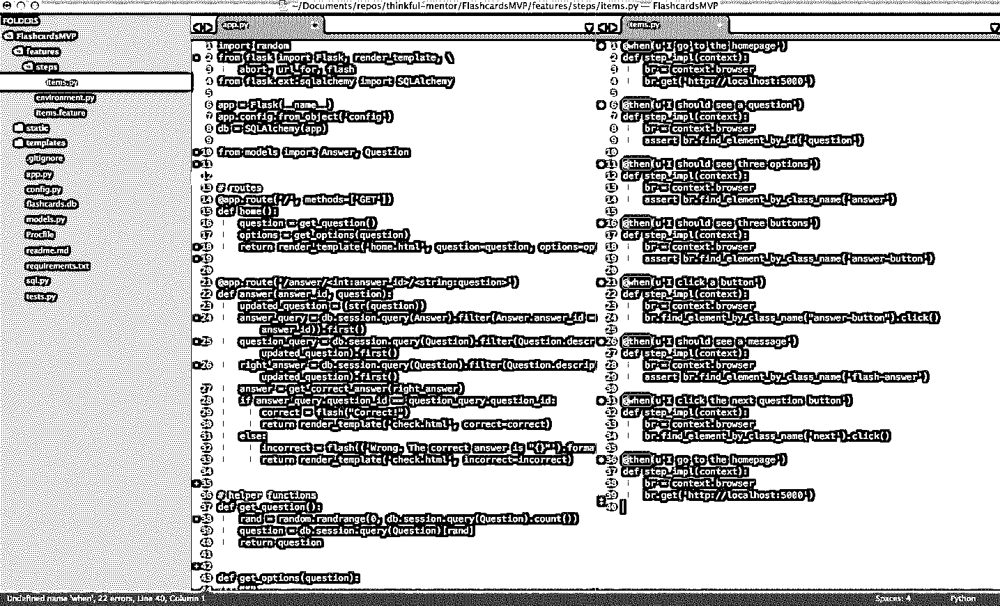
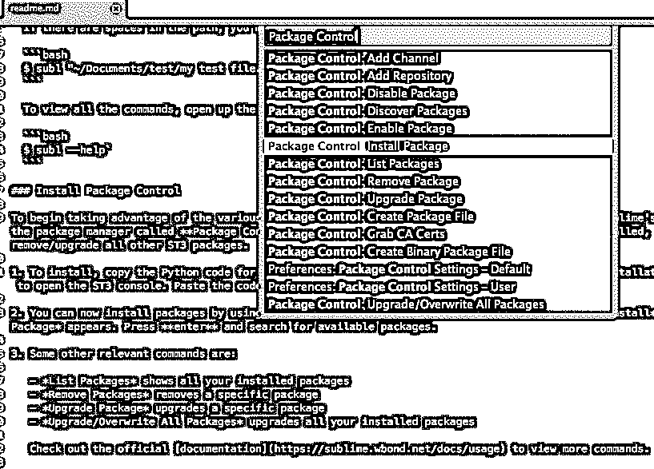
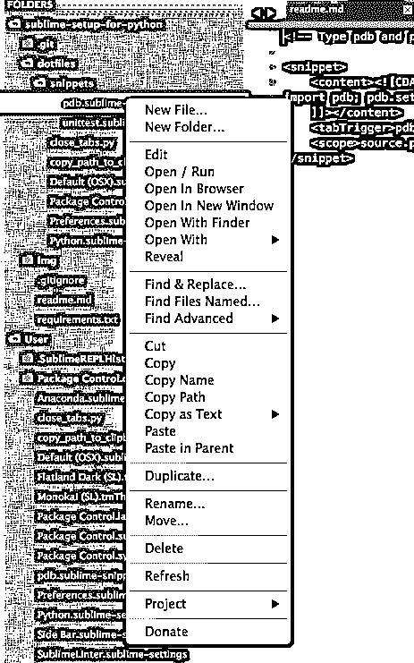
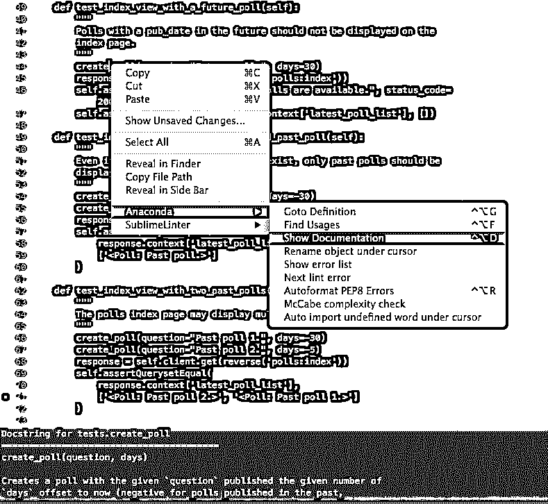
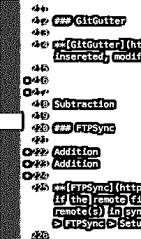

# 为全栈 Python 开发设置 Sublime Text 3

> 原文：<https://realpython.com/setting-up-sublime-text-3-for-full-stack-python-development/>

Sublime Text 3 (ST3)是一个轻量级的跨平台代码编辑器，以其速度快、易于使用和强大的社区支持而闻名。这是一个开箱即用的令人难以置信的编辑器，但真正的力量来自于使用包控制和创建自定义设置来增强其功能的能力。

在本文中，我们将了解如何为全栈 Python 开发(从前到后)设置 Sublime Text，使用自定义主题和包增强基本功能，并使用许多使 ST3 如此强大的命令、特性和关键字快捷方式。

> **注意:**本教程假设您使用的是 Mac，并且对终端很熟悉。如果您使用的是 Windows 或 Linux，许多命令会有所不同，但是您应该能够使用 Google 根据本教程中的信息快速找到答案。

在我们开始之前，让我们来解释一下我所说的“全栈”到底是什么意思

在当今 HTML5 和移动开发的世界中，JavaScript 无处不在。到处都是。Python 加上一个框架如 [Django](https://realpython.com/get-started-with-django-1/) 或 Flask 是不够的。要真正开发一个端到端的网站，你必须熟悉 JavaScript(以及各种 JavaScript 框架)、REST APIs、响应式设计，当然还有 [HTML 和 CSS](https://realpython.com/html-css-python/) 等等。

让我们面对现实吧:作为一名程序员，你和其他工匠一样。如果你想成为最好的你，那么你需要你的工具是锋利的。您的[开发环境](https://realpython.com/effective-python-environment/)必须设置为全栈开发——这正是我们现在要做的。

[](#)

**免费奖励:** [5 个崇高的文本调整，以提高您的 Python 生产力](#)，这是一个免费的电子邮件类，向您展示如何优化您的 Python +崇高的开发设置，以实现最高效率。

## 特征

让我们先来看看 Sublime Text 3 的几个默认特性:

1.  **分割布局**允许你在不同的分割屏幕上排列你的文件。这在您进行测试驱动开发(Python 代码在一个屏幕上，测试脚本在另一个屏幕上)或在前端工作(HTML 在一个屏幕上，CSS 和/或 JavaScript 在另一个屏幕上)时非常有用。T3T5

2.  **[复古模式](http://www.sublimetext.com/docs/3/vintage.html)** 为您提供在 ST3 境内使用的 [vi 命令](https://realpython.com/vim-and-python-a-match-made-in-heaven/)。

3.  类似 Chrome 的标签页让浏览和编辑几个文件变得更加简单。
4.  **自动加载最后一个会话**重新打开上次关闭编辑器时打开的所有文件和文件夹。我让 ST3 一直开着，各种项目都开着，所以如果我重启电脑，它会马上打开文件和文件夹。
5.  **代码片段**让你能够用一个关键词创建普通的代码片段，从而提高你的工作效率。有许多默认的代码片段。要自己尝试一个，打开一个新文件，输入`lorem`，按 `Tab` 。你应该得到一段 lorem ipsum 文本。同样，如果你在一个 Python 文件中输入`defs`，然后按下 `Tab` ，它将设置一个通用函数。

> **注意:**你也可以创建自己的代码片段:**工具>新建代码片段**。参考[文档](http://sublimetext.info/docs/en/extensibility/snippets.html)寻求帮助，也可以在这里查看我的一些片段[。](https://github.com/mjhea0/sublime-setup-for-python/tree/master/dotfiles/snippets)

[*Remove ads*](/account/join/)

## 定制崇高文本 3

下载 ST3 后，你可以自定义它。

### 安装`subl`命令行工具

就像 TextMate 有`mate`命令一样，Sublime Text 有一个名为 [`subl`](http://www.sublimetext.com/docs/3/osx_command_line.html) 的命令行工具，允许你从终端打开一个文件，或者整个目录的文件和文件夹。

要激活该命令，创建一个到`subl`二进制文件的符号链接:

```py
$ sudo ln -s /Applications/Sublime\ Text.app/Contents/SharedSupport/bin/subl /usr/bin/subl
```

通过打开 Sublime 确保链接正常工作:

```py
$ subl
```

如果这不起作用，您可能需要将`/bin`添加到您的路径中:

```py
$ echo "export PATH=~/bin:$PATH" >> ~/.profile
```

然后重复第一步。

> **注:**如果你仍然有困难，请查看[这篇文章](http://stackoverflow.com/questions/16199581/opening-sublime-text-on-command-line-as-subl-on-mac-os?lq=1)寻求帮助。你也可以阅读关于在 [Windows](http://stackoverflow.com/questions/9440639/sublime-text-from-command-line-win7?rq=1) 和 [Linux](http://askubuntu.com/questions/273034/lauching-sublime-text-from-command-line) 中创建符号链接的内容。

现在，您可以使用以下命令打开文件或目录:

```py
# Open the current directory.
$ subl .

# Open a directory called tests.
$ subl ~/Documents/test

# Open a file called text.txt.
$ subl test.txt
```

如果路径中有空格，必须用双引号将整个路径括起来:

```py
$ subl "~/Documents/test/my test file.txt"
```

要查看所有命令，请打开帮助文件:

```py
$ subl --help
```

### 安装包装控制

为了开始利用各种[包](https://sublime.wbond.net/)来扩展 Sublime 的功能，您需要手动安装名为 Package Control 的包管理器。一旦您安装了它，您可以使用它来安装，删除和升级所有其他 ST3 软件包。

1.  要安装，复制崇高文本 3 的 Python 代码找到[这里](https://sublime.wbond.net/installation#st3)。点击**查看>显示控制台**打开 ST3 控制台。将代码粘贴到控制台中。按下 `Enter` 。重启 ST3。
2.  你现在可以使用快捷键`Cmd`+`Shift`+`P`来安装软件包。开始输入`install`，直到`Package Control: Install Package`出现。按下 `Enter` 并搜索可用的软件包。

以下是一些其他相关命令:

*   `List Packages`显示您所有已安装的软件包。
*   `Remove Package`删除特定的包。
*   `Upgrade Package`升级特定的软件包。
*   升级您所有已安装的软件包。

查看官方[文档](https://sublime.wbond.net/docs/usage)查看更多命令。

[](https://files.realpython.com/media/st3_package_control.13d4617691d0.png)[*Remove ads*](/account/join/)

### 创建自定义设置文件

您可以使用基于 JSON 的设置文件完全配置 Sublime Text，因此很容易将您的自定义设置传输或同步到另一个系统。首先，我们需要创建自定义设置。最好为所有环境创建一个基础文件以及特定语言的设置文件。

要设置基本文件，请单击**升华文本>首选项>设置-用户**。向文件中添加一个空的 JSON 对象，并添加您的设置，如下所示:

```py
{ // base settings "auto_complete":  false, "sublimelinter":  false, "tab_size":  2, "word_wrap":  true }
```

1.  对于特定语言设置，单击**升华文本>首选项>设置-更多>语法特定-用户**。然后使用以下格式保存文件:**language . sublime-settings**。对于 Python 特定的设置，将文件保存为 **Python.sublime-settings** 。
2.  显然，您可以根据自己的喜好配置设置。然而，我强烈推荐从我的[基础](https://github.com/mjhea0/sublime-setup-for-python/blob/master/dotfiles/Preferences.sublime-settings)和 [Python 特有的](https://github.com/mjhea0/sublime-setup-for-python/blob/master/dotfiles/Python.sublime-settings)设置开始，然后做你认为合适的改变。
3.  可选:您可以使用 Dropbox 同步所有设置。只需将您的设置文件上传到 [Dropbox](https://github.com/miohtama/ztanesh/blob/master/zsh-scripts/bin/setup-sync-sublime-over-dropbox.sh) 中，并从那里加载它们以同步您所有机器上的 Sublime 环境。
4.  一个很好的设置参考可以在[崇高文本非官方文件](http://sublime-text-unofficial-documentation.readthedocs.org/en/latest/reference/settings.html)中找到。

## 主题

ST3 还让你选择改变整体主题，以更好地适应你的个性。自己设计。或者，如果你不喜欢艺术，你可以通过 Package Control 下载 Sublime 社区设计的各种自定义主题[中的一个。在安装主题之前，请查看](https://sublime.wbond.net/browse/labels/theme) [ColorSublime](http://colorsublime.com/) 预览主题。

曾经流行的[苏打黑暗主题](https://sublime.wbond.net/packages/Theme%20-%20Soda)和最小的[平地](https://sublime.wbond.net/packages/Theme%20-%20Flatland)是我个人最喜欢的两个。

安装主题后，确保通过**崇高文本>首选项>设置-用户**更新您的基本设置:

```py
{ "theme":  "Flatland Dark.sublime-theme", "color_scheme":  "Packages/Theme - Flatland/Flatland Dark.tmTheme" }
```

## 包装

除了打包的主题之外，我还利用下面的包来加速我的工作流。

### 侧边增强功能

[SideBarEnhancements](https://sublime.wbond.net/packages/SideBarEnhancements) 扩展了侧边栏中菜单选项的数量，加快了您的整体工作流程。像**新文件**和**副本**这样的选项是必不可少的，应该是 ST3 开箱即用的一部分。单单是**删除**选项就让它值得下载。这个特性只是将文件发送到回收站，这看起来似乎微不足道，但如果你删除了一个没有它的文件，那么就很难恢复，除非你使用的是版本控制系统。

[](https://files.realpython.com/media/st3_sidebar_enhancements.10d178edb862.png)

立即下载！

### 蟒蛇

Anaconda 是最终的 Python 包。它为 ST3 添加了许多类似 IDE 的功能，包括:

*   **自动补全**默认工作，但是有许多配置[选项](https://github.com/DamnWidget/anaconda#anaconda-autocompletion)。
*   **代码[林挺](http://en.wikipedia.org/wiki/Lint_%28software%29)** 使用 PyLint 或 PyFlakes 与 PEP 8。我个人使用一个不同的林挺包，我将很快解释，所以我在用户定义的 Anaconda 设置文件**Anaconda . Sublime-Settings**中完全禁用林挺，通过文件菜单:**Sublime>Preferences>Package Settings>Anaconda>Settings-User**:`{"anaconda_linting": false}`
*   **McCabe 代码复杂性检查器**在特定文件中运行 [McCabe 复杂性检查器](http://en.wikipedia.org/wiki/Cyclomatic_complexity)工具。如果你不熟悉什么是复杂性，一定要访问上面的链接。
*   **Goto Definitions** 查找并显示整个项目中任何[变量](https://realpython.com/python-variables/)、函数或类的定义。
*   **查找用法**快速搜索变量、函数或类在特定文件中的使用位置。
*   **显示文档**显示函数或类的[文档串](https://realpython.com/documenting-python-code/#documenting-your-python-code-base-using-docstrings)(当然，如果有定义的话)。

[](https://files.realpython.com/media/st3_anaconda_show_docs.5574abda6481.png)

你可以在这里查看所有的功能或者在 ST3 套装设置的自述文件中:**崇高文本>偏好设置>套装设置>蟒蛇>自述**。

> **注意:** [SublimeCodeIntel](https://sublime.wbond.net/packages/SublimeCodeIntel) 是另一个流行的软件包，它有许多与 Anaconda 相同的特性。我建议把它们都测试出来。

[*Remove ads*](/account/join/)

### Djaneiro

Djaneiro 支持 Django 模板和关键词高亮显示，并为 Sublime 文本提供有用的代码片段(制表符补全)。snippet 系统是一个不可思议的省时工具。对于模板、模型、表单和视图，只需几次击键就可以创建通用的 Django 块。查看官方[文档](https://github.com/squ1b3r/Djaneiro)以查看片段列表。

我个人最喜欢的是模板:`var`创建`{{ }}`，`tag`创建``。

### 要求文本

[requirementstxt](https://sublime.wbond.net/packages/requirementstxt) 为您的 **requirements.txt** 文件提供自动补全和语法高亮显示以及一个不错的版本管理系统。

### " T0 "级曲速调管风琴曲终人曲速调管风琴曲终人曲速调管风琴曲终人曲速调管风琴曲终人曲速调管风琴曲曲

SublimeLinter 是一个 ST3 棉绒的框架。包装本身不包括任何实际的棉绒；这些必须通过软件包控制使用**SublimeLinter-[linter _ name]**命名语法单独安装。你可以在这里查看官方贴吧。还有许多第三方棉绒，可以在包装控制中查看。点击查看安装说明[。](http://sublimelinter.readthedocs.org/en/latest/installation.html)

对于 Python 林挺，我推荐使用 [SublimeLinter-pyflakes](https://sublime.wbond.net/packages/SublimeLinter-pyflakes) 和 [SublimeLinter-pep8](https://sublime.wbond.net/packages/SublimeLinter-pep8) 。

我也用 [SublimeLinter-jshint](https://sublime.wbond.net/packages/SublimeLinter-jshint) 、 [SublimeLinter-pyyaml](https://sublime.wbond.net/packages/SublimeLinter-pyyaml) 、 [SublimeLinter-csslint](https://sublime.wbond.net/packages/SublimeLinter-csslint) 、 [SublimeLinter-html-tidy](https://sublime.wbond.net/packages/SublimeLinter-html-tidy) 、 [SublimeLinter-json](https://sublime.wbond.net/packages/SublimeLinter-json) 。

> **注意:**这些 linters 大部分都有相关的依赖项，所以请在安装前阅读安装说明。

您可以在自定义的**SublimeLinter . Sublime-Settings**文件: **Sublime Text >首选项>包设置> SublimeLinter >设置-用户**中自定义每一条 linter。例如，我忽略了以下 PEP 8 错误和警告:

```py
"pep8":  { "@disable":  false, "args":  [], "excludes":  [], "ignore":  "E501,C0301,W0142,W0402,R0201,E1101,E1102,C0103,R0901,R0903,R0904,C1001,W0223,W0232,W0201,E1103,R0801,C0111", "max-line-length":  100, "select":  "" },
```

### GitGutter

GitGutter 在 ST3 的 Gutter 区域显示小图标，指示自上次提交以来是否有行被插入、修改或删除。

[](https://files.realpython.com/media/st3_gitgutter.73de764e6241.png)

> **注意:**如果你想要支持许多分布式版本控制系统(Git、SVN、Bazaar 和 Mercurial)，请查看 [Modific](https://sublime.wbond.net/packages/Modific) 。

### FTPSync

将你的项目与你的远程文件同步。只需打开文件进行下载(如果远程文件比本地文件新)，并在每次保存时上传到远程服务器。这是保持本地和远程同步的好方法。您需要确保通过点击**升华文本>首选项>包设置> FTPSync >设置 FTPSync** 来添加至少一个远程连接。

示例设置:

```py
{ "primary":  { host:  "ftp.mywebsite.com", username:  "johnsmith", password:  "secretpassword", path:  "/www/", upload_on_save:  true, tls:  true } }
```

我个人将密码设置为`null`,因为我不想在那个文件中看到它。FTPSync 只是在每次保存后询问我的密码。

[*Remove ads*](/account/join/)

### 高级新文件

[AdvancedNewFile](https://sublime.wbond.net/packages/AdvancedNewFile) 用于在 ST3 内创建一个新的文件夹或文件，仅使用键绑定。

只需通过适当的键绑定调出 AdvancedNewFile 输入。然后，在输入字段中输入路径和文件名。按下 `Enter` ，文件将被创建。此外，如果指定的目录尚不存在，将会创建它们。默认情况下，当您输入路径信息时，状态栏中将显示正在创建的文件的路径。

有关其用法的更详细解释，请查看 GitHub 上的文档。请务必阅读制表符补全和预定义别名。

我替换了普通的 `Cmd` + `N` 命令，通过向**键绑定-用户**文件添加以下代码来创建一个带有 AdvancedNewFile 的新文件:**崇高文本>首选项>包设置>高级 NewFile >键绑定-用户**:

```py
[ {  "keys":  ["cmd+n"],  "command":  "advanced_new_file_new"} ]
```

你也可以设置一个默认目录开始:**崇高文本>偏好设置>包设置>高级新文件>设置-用户**

```py
{"default_initial":  "/Users/michaelherman/Documents/repos"}
```

现在，当我创建一个新文件时，`/Users/michaelherman/Documents/repos`字符串首先被自动插入，因为 99%的时间我都将所有脚本存储在该目录中。

### 埃米特

[Emmet](https://sublime.wbond.net/packages/Emmet) ，原名 Zen Coding，使用简单的缩写生成 HTML 或 CSS 代码片段。

例如，如果在一个 HTML 文件中键入一个 bang，`!`，并按下 `Tab` ，那么就会生成 HTML5 doctype 和一些基本的标签:

```py
<!doctype html>
<html lang="en">
<head>
  <meta charset="UTF-8">
  <title>Document</title>
</head>
<body>

</body>
</html>
```

查看官方[文档](http://docs.emmet.io/)以及这个方便的[备忘单](http://docs.emmet.io/cheat-sheet/)以获取更多信息。

### 降价预览

[降价预览](https://sublime.wbond.net/packages/Markdown%20Preview)用于预览和建立降价文件。

要使用，打开包管理器并键入`Markdown Preview`来显示可用的命令:

*   降价预览:Python 降价:在浏览器中预览
*   Markdown 预览:Python Markdown:在 Sublime 文本中导出 HTML
*   降价预览:Python 降价:复制到剪贴板
*   降价预览:GitHub 风格的降价:在浏览器中预览
*   Markdown 预览:GitHub 风格的 Markdown:以崇高的文本导出 HTML
*   降价预览:GitHub 风格的降价:复制到剪贴板
*   降价预览:打开降价备忘单

转换后，输出文件将在每次后续保存时更新。

## 键盘快捷键

*   **Goto things**`Cmd`+`P`用于快速查找和打开文件。只需在项目中键入部分路径和文件名，就可以轻松打开该文件。这对于在大型 Django 项目中快速打开文件非常有用。
*   **转到行号** `Ctrl` + `G` 带你到激活文件中的特定行号。
*   **Goto 符号** `Cmd` + `R` 列出了一个文件中的所有函数和类，以便于查找。只需开始输入您想要的。
*   **转到行首** `Cmd` + `Left` 和**转到行尾**`Cmd`+`Right`帮助您在行内导航。
*   **删除当前行**`Ctrl`+`Shift`+`K`删除当前行。
*   **多重编辑**是迄今为止我最喜欢的快捷方式:
    *   选择一个单词，然后按 `Cmd` + `D` 选择下一个相同的单词。然后再按 `Cmd` + `D` 再次选择下一个相同的单词，以此类推。
    *   按 `Cmd` + `Left Button` 在你点击的任何地方创建一个用于编辑的光标。
*   **块选择** `Option` + `Left Button` 用于选择一个文本块。它非常适合在格式化 CSV 文件时删除空白。

> **注:**更多快捷方式，看看[这篇文章](http://sublime-text-unofficial-documentation.readthedocs.org/en/latest/reference/keyboard_shortcuts_osx.html)。

[*Remove ads*](/account/join/)

## 自定义命令

用 Python 编写自己的定制命令和键绑定很容易。我目前使用的工作流程是:

1.  将当前文件的路径复制到剪贴板([链接](https://github.com/mjhea0/sublime-setup-for-python/blob/master/dotfiles/copy_path_to_clipboard.py))。
2.  关闭除活动选项卡之外的所有选项卡([链接](https://github.com/mjhea0/sublime-setup-for-python/blob/master/dotfiles/close_tabs.py))。

通过文件菜单(**Sublime>Preferences>Browse Packages**)将 Python 文件添加到您的**/Sublime Text 3/Packages/User**目录，然后打开用户目录，即可安装这些文件。要完成设置，从**键绑定-用户**文件(**升华文本>首选项>包设置>高级新文件>键绑定-用户**)绑定它们。

```py
[ // Copy file name { "keys":  ["cmd+shift+c"], "command":  "copy_path_to_clipboard" }, // Close all other tabs { "keys":  ["cmd+alt+w"], "command":  "close_tabs" } ]
```

## 额外资源

1.  [社区维护的文档](http://docs.sublimetext.info/en/latest/index.html)
2.  [软件包管理器文档](https://sublime.wbond.net/docs)
3.  [非官方文件参考](http://sublime-text-unofficial-documentation.readthedocs.org/en/latest/reference/reference.html)
4.  [拉皮条我的编辑-演示文稿](http://slides.com/nicklang/pimp-my-editor)

**免费奖励:** ，这是一个免费课程，向您展示如何优化您的 Python 开发设置。

## 结论

我希望这篇文章对您有所帮助，并且您能够根据您的个人偏好将上面的一些包和自定义设置与您自己的结合起来，以改进您的工作流。

如果你有任何问题或建议，请在下面的评论中告诉我。最后，查看这个 [repo](https://github.com/mjhea0/sublime-setup-for-python/tree/master/dotfiles) 中的 dotfiles 文件夹，查看我创建的所有资源。干杯！*****