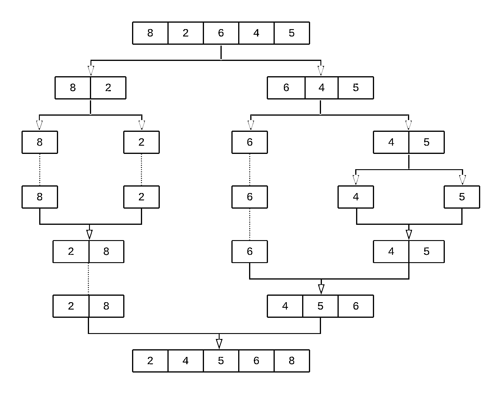

# Python 中的排序算法

> 原文：<https://realpython.com/sorting-algorithms-python/>

*立即观看**本教程有真实 Python 团队创建的相关视频课程。和文字教程一起看，加深理解:[**Python 中排序算法介绍**](/courses/intro-sorting-algorithms/)

**排序**是一个基本的构建模块，许多其他算法都是基于它构建的。它与你在整个编程生涯中会看到的几个令人兴奋的想法有关。理解 Python 中排序算法的幕后工作方式是实现解决现实问题的正确高效算法的基本步骤。

在本教程中，您将学习:

*   Python 中不同的**排序算法如何工作，以及它们在不同环境下如何比较**
*   Python 的内置排序功能如何在幕后工作
*   不同的计算机科学概念，如**递归**和**分治**如何应用于排序
*   如何用**大 O 记法**和 **Python 的`timeit`模块**来衡量一个算法的效率

在本教程结束时，你将从理论和实践的角度理解排序算法。更重要的是，你将对不同的算法设计技术有更深的理解，这些技术可以应用到你工作的其他领域。我们开始吧！

**免费下载:** [从 Python 技巧中获取一个示例章节:这本书](https://realpython.com/bonus/python-tricks-sample-pdf/)用简单的例子向您展示了 Python 的最佳实践，您可以立即应用它来编写更漂亮的+Python 代码。

## Python 中排序算法的重要性

[排序](https://docs.python.org/3/howto/sorting.html)是计算机科学中研究得最透彻的算法之一。有几十种不同的排序实现和应用程序可以用来提高代码的效率和效果。

您可以使用排序来解决各种问题:

*   **搜索:**如果对列表进行排序，那么在[列表中搜索一个项目](https://realpython.com/python-lists-tuples/)会快得多。

*   **选择:**使用排序的数据，根据条目与其他条目的关系从列表中选择条目更容易。例如，当值按升序或降序排列时，找到第 *k <sup>第</sup>T5】个最大值或最小值，或者找到列表的中值就容易得多。*

*   **Duplicates:** 在对列表进行排序时，可以非常快速地找到列表中的重复值。

*   **分布:**分析列表上项目的频率分布，如果对列表进行排序，速度非常快。例如，使用排序列表，查找出现频率最高或最低的元素相对简单。

从商业应用到学术研究，以及介于两者之间的任何领域，有无数种方法可以让你利用排序来节省时间和精力。

[*Remove ads*](/account/join/)

## Python 内置的排序算法

Python 语言，像许多其他高级编程语言一样，提供了使用`sorted()`对开箱即用的数据进行排序的能力。下面是一个对整数数组进行排序的示例:

>>>

```py
>>> array = [8, 2, 6, 4, 5]
>>> sorted(array)
[2, 4, 5, 6, 8]
```

您可以使用`sorted()`对任何列表进行排序，只要列表中的值具有可比性。

**注意:**要更深入地了解 Python 内置的排序功能是如何工作的，请查看[如何在 Python 中使用 sorted()和 sort()](https://realpython.com/python-sort/)和[用 Python 排序数据](https://realpython.com/courses/python-sorting-data/)。

## 时间复杂性的意义

本教程涵盖了两种不同的方法来测量排序算法的运行时间:

1.  从实用的角度来看，您将使用`timeit`模块测量实现的运行时间。
2.  从更理论的角度来看，您将使用 [**大 O 符号**](https://en.wikipedia.org/wiki/Big_O_notation) 来测量算法的**运行时复杂度**。

### 为您的代码计时

在比较 Python 中的两种排序算法时，查看每种算法运行的时间总是有帮助的。每个算法花费的具体时间将部分由您的硬件决定，但是您仍然可以使用执行之间的比例时间来帮助您决定哪个实现更节省时间。

在这一节中，您将关注一种使用`timeit`模块来测量运行排序算法所花费的实际时间的实用方法。关于在 Python 中计时代码执行的不同方法的更多信息，请查看 [Python 计时器函数:监控代码的三种方法](https://realpython.com/python-timer/)。

这里有一个函数，你可以用它来为你的算法计时:

```py
 1from random import randint
 2from timeit import repeat
 3
 4def run_sorting_algorithm(algorithm, array):
 5    # Set up the context and prepare the call to the specified
 6    # algorithm using the supplied array. Only import the
 7    # algorithm function if it's not the built-in `sorted()`.
 8    setup_code = f"from __main__ import {algorithm}" \
 9        if algorithm != "sorted" else ""
10
11    stmt = f"{algorithm}({array})"
12
13    # Execute the code ten different times and return the time
14    # in seconds that each execution took
15    times = repeat(setup=setup_code, stmt=stmt, repeat=3, number=10)
16
17    # Finally, display the name of the algorithm and the
18    # minimum time it took to run
19    print(f"Algorithm: {algorithm}. Minimum execution time: {min(times)}")
```

在这个例子中，`run_sorting_algorithm()`接收算法的名称和需要排序的输入数组。以下是对其工作原理的逐行解释:

*   **第 8 行**使用 [Python 的 f 字符串](https://realpython.com/python-f-strings/)的魔力导入算法的名称。这是为了让`timeit.repeat()`知道从哪里调用算法。请注意，这只对于本教程中使用的自定义实现是必要的。如果指定的算法是内置的`sorted()`，则不会导入任何内容。

*   **第 11 行**用提供的数组准备对算法的调用。这是将要执行和计时的语句。

*   **第 15 行**用设置代码和语句调用`timeit.repeat()`。这将调用指定的排序算法十次，返回每次执行所用的秒数。

*   **第 19 行**标识返回的最短时间，并将其与算法名称一起打印出来。

**注意:**一个常见的误解是，你应该找到算法每次运行的平均时间，而不是选择单个最短时间。时间测量是[噪声](https://en.wikipedia.org/wiki/Noisy_data)，因为系统同时运行其他进程。最短的时间总是最少的噪音，使其成为算法真实运行时间的最佳表示。

下面是一个如何使用`run_sorting_algorithm()`来确定使用`sorted()`对一万个整数值的数组进行排序所需时间的例子:

```py
21ARRAY_LENGTH = 10000
22
23if __name__ == "__main__":
24    # Generate an array of `ARRAY_LENGTH` items consisting
25    # of random integer values between 0 and 999
26    array = [randint(0, 1000) for i in range(ARRAY_LENGTH)]
27
28    # Call the function using the name of the sorting algorithm
29    # and the array you just created
30    run_sorting_algorithm(algorithm="sorted", array=array)
```

如果您将上面的代码保存在一个`sorting.py`文件中，那么您可以从终端运行它并查看它的输出:

```py
$ python sorting.py
Algorithm: sorted. Minimum execution time: 0.010945824000000007
```

请记住，每个实验的时间(以秒为单位)部分取决于您使用的硬件，因此在运行代码时，您可能会看到略有不同的结果。

**注:**你可以在[官方 Python 文档](https://docs.python.org/2/library/timeit.html)中了解更多关于`timeit`模块的内容。

[*Remove ads*](/account/join/)

### 用大 O 符号测量效率

一个算法运行的具体时间不足以得到它的 [**、时间复杂度**](https://en.wikipedia.org/wiki/Time_complexity) 的全貌。要解决这个问题，可以使用大 O(读作“大 oh”)符号。大 O 通常用于比较不同的实现，并决定哪一个是最有效的，跳过不必要的细节，专注于算法运行时最重要的内容。

运行不同算法所需的时间(以秒计)会受到几个不相关因素的影响，包括处理器速度或可用内存。另一方面，Big O 提供了一个平台，用与硬件无关的术语来表达运行时的复杂性。使用大 O，您可以根据算法的运行时相对于输入大小的增长速度来表示复杂性，尤其是当输入增长到任意大时。

假设 *n* 是算法输入的大小，大 O 符号表示 *n* 和算法寻找解的步骤数之间的关系。大 O 用一个大写字母“O”后跟括号内的这个关系。例如， ***O(n)*** 表示执行与输入大小成比例的多个步骤的算法。

虽然本教程不会深入大 O 符号的细节，但这里有五个不同算法的运行时复杂性的例子:

| 大 O | 复杂性 | 描述 |
| --- | --- | --- |
| *O(1)* | 常数 | 无论输入的大小如何，运行时都是恒定的。在[散列表](https://realpython.com/python-hash-table/)中寻找元素是可以在**常数时间**中执行的操作的一个例子。 |
| *O(n)* | 线性的 | 运行时随着输入的大小线性增长。检查列表中每一项的条件的函数就是一个 *O(n)* 算法的例子。 |
| *O(n <sup>2</sup> )* | 二次的 | 运行时间是输入大小的二次函数。在列表中查找重复值的简单实现是二次算法的一个例子，其中每个项目都要检查两次。 |
| *O(2 <sup>n</sup> )* | 指数的 | 运行时随着输入的大小呈指数增长。这些算法被认为效率极低。指数算法的一个例子是[三色问题](https://en.wikipedia.org/wiki/Graph_coloring)。 |
| *O(对数 n)* | 对数的 | 运行时呈线性增长，而输入的大小呈指数增长。例如，如果处理一千个元素需要一秒钟，那么处理一万个元素需要两秒钟，处理十万个元素需要三秒钟，以此类推。[二分搜索法](https://realpython.com/binary-search-python/)是对数运行时算法的一个例子。 |

本教程涵盖了所讨论的每种排序算法的运行时复杂性。它还包括如何在每个特定情况下确定运行时间的简要说明。这会让你更好地理解如何开始使用大 O 来分类其他算法。

**注:**为了更深入的了解大 O，结合 Python 中的几个实际例子，查看[大 O 记法和算法分析结合 Python 例子](https://stackabuse.com/big-o-notation-and-algorithm-analysis-with-python-examples/)。

## Python 中的冒泡排序算法

**冒泡排序**是最直接的排序算法之一。它的名字来源于算法的工作方式:随着每一次新的传递，列表中最大的元素向正确的位置“冒泡”。

冒泡排序包括多次遍历一个列表，逐个比较元素，并交换相邻的无序项。

### 在 Python 中实现冒泡排序

下面是一个用 Python 实现的冒泡排序算法:

```py
 1def bubble_sort(array):
 2    n = len(array)
 3
 4    for i in range(n):
 5        # Create a flag that will allow the function to
 6        # terminate early if there's nothing left to sort
 7        already_sorted = True
 8
 9        # Start looking at each item of the list one by one,
10        # comparing it with its adjacent value. With each
11        # iteration, the portion of the array that you look at
12        # shrinks because the remaining items have already been
13        # sorted.
14        for j in range(n - i - 1):
15            if array[j] > array[j + 1]:
16                # If the item you're looking at is greater than its
17                # adjacent value, then swap them
18                array[j], array[j + 1] = array[j + 1], array[j]
19
20                # Since you had to swap two elements,
21                # set the `already_sorted` flag to `False` so the
22                # algorithm doesn't finish prematurely
23                already_sorted = False
24
25        # If there were no swaps during the last iteration,
26        # the array is already sorted, and you can terminate
27        if already_sorted:
28            break
29
30    return array
```

因为这个实现以升序对数组进行排序，所以每一步都将最大的元素“冒泡”到数组的末尾。这意味着每次迭代比前一次迭代需要更少的步骤，因为数组的连续更大部分被排序。

**第 4 行和第 10 行**中的循环决定了算法遍历列表的方式。注意`j`最初是如何从列表中的第一个元素移动到最后一个元素之前的元素的。在第二次迭代中，`j`一直运行到最后两个项目，然后是最后三个项目，依此类推。在每次迭代结束时，列表的末尾部分将被排序。

随着循环的进行，**行 15** 将每个元素与其相邻的值进行比较，**行 18** 如果它们的顺序不正确就交换它们。这确保了函数末尾的排序列表。

**注意:**上面代码的第**行第 13、23 和 27** 行中的`already_sorted`标志是对算法的优化，在全功能的冒泡排序实现中不需要。但是，如果在循环结束之前列表已经全部排序，它允许函数保存不必要的步骤。

作为一个练习，您可以删除这个标志的使用，并比较两种实现的运行时。

为了正确分析算法是如何工作的，考虑一个值为`[8, 2, 6, 4, 5]`的列表。假设你从上面使用`bubble_sort()`。下图展示了算法每次迭代时数组的样子:

[](https://files.realpython.com/media/python-sorting-algorithms-bubble-sort.216ab9a52018.png)

<figcaption class="figure-caption text-center">The Bubble Sort Process</figcaption>

现在，随着算法的进展，让我们一步一步地看看阵列发生了什么:

1.  代码首先将第一个元素`8`与其相邻的元素`2`进行比较。由于`8 > 2`，值被交换，导致如下顺序:`[2, 8, 6, 4, 5]`。

2.  然后，该算法将第二个元素`8`与其相邻元素`6`进行比较。由于`8 > 6`，值被交换，导致如下顺序:`[2, 6, 8, 4, 5]`。

3.  接下来，该算法将第三个元素`8`与其相邻元素`4`进行比较。自从`8 > 4`以来，它也交换了值，产生了下面的顺序:`[2, 6, 4, 8, 5]`。

4.  最后，该算法将第四个元素`8`与其相邻元素`5`进行比较，并交换它们，得到`[2, 6, 4, 5, 8]`。此时，算法完成了对列表的第一次遍历(`i = 0`)。注意值`8`是如何从初始位置上升到列表末尾的正确位置的。

5.  第二遍(`i = 1`)考虑到列表的最后一个元素已经被定位，并关注剩余的四个元素`[2, 6, 4, 5]`。在这一过程结束时，值`6`找到了它的正确位置。第三次遍历列表定位值`5`，依此类推，直到列表被排序。

[*Remove ads*](/account/join/)

### 测量冒泡排序的运行时间复杂度

您的冒泡排序实现由两个嵌套的 [`for`循环](https://realpython.com/python-for-loop/)组成，其中算法执行 *n - 1* 比较，然后是 *n - 2* 比较，依此类推，直到完成最终比较。这样总共有*(n-1)+(n-2)+(n-3)+…+2+1 = n(n-1)/2*个比较，也可以写成 *n <sup>2</sup> - n* 。

您之前已经了解到，Big O 关注的是运行时相对于输入大小的增长情况。这意味着，为了将上述等式转化为算法的大 O 复杂度，您需要移除常数，因为它们不会随着输入大小而改变。

这样做将符号简化为 *n <sup>2</sup> - n* 。由于 *n <sup>2</sup>* 比 *n* 增长得快得多，所以最后一项也可以去掉，留下平均和最坏情况复杂度为***O(n<sup>2</sup>)***的冒泡排序。

在算法接收到一个已经排序的数组的情况下——假设实现包括前面解释的`already_sorted`标志优化——运行时复杂性将下降到更好的 *O(n)* ,因为算法不需要访问任何元素超过一次。

那么， *O(n)* 就是冒泡排序的最佳运行时复杂度。但是请记住，最好的情况是一个例外，在比较不同的算法时，您应该关注平均情况。

### 计时你的冒泡排序实现

使用本教程前面的`run_sorting_algorithm()`,下面是冒泡排序处理一个包含一万个条目的数组所需的时间。**第 8 行**替换了算法的名称，其他内容保持不变:

```py
 1if __name__ == "__main__":
 2    # Generate an array of `ARRAY_LENGTH` items consisting
 3    # of random integer values between 0 and 999
 4    array = [randint(0, 1000) for i in range(ARRAY_LENGTH)]
 5
 6    # Call the function using the name of the sorting algorithm
 7    # and the array you just created
 8    run_sorting_algorithm(algorithm="bubble_sort", array=array)
```

您现在可以运行脚本来获取`bubble_sort`的执行时间:

```py
$ python sorting.py
Algorithm: bubble_sort. Minimum execution time: 73.21720498399998
```

对包含一万个元素的数组进行排序花费了`73`秒。这代表了`run_sorting_algorithm()`运行的十次重复中最快的一次。多次执行这个脚本会产生类似的结果。

**注意:**单次执行冒泡排序需要`73`秒，但是算法使用`timeit.repeat()`运行了十次。这意味着，假设你有相似的硬件特征，你应该预期你的代码需要大约`73 * 10 = 730`秒来运行。速度较慢的机器可能需要更长的时间才能完成。

### 分析冒泡排序的优缺点

冒泡排序算法的主要优点是它的简单性。实现和理解都很简单。这可能是大多数计算机科学课程引入使用冒泡排序的主题的主要原因。

正如你之前看到的，冒泡排序的缺点是**慢**，运行时复杂度为 *O(n <sup>2</sup> )* 。不幸的是，这排除了它作为排序大型数组的实际候选。

## Python 中的插入排序算法

像冒泡排序一样，**插入排序**算法易于实现和理解。但与冒泡排序不同，它通过将每个项目与列表的其余部分进行比较，并将其插入到正确的位置，来一次一个元素地构建排序列表。这种“插入”过程给了算法它的名字。

解释插入排序的一个很好的类比是你排序一副卡片的方式。想象你手里拿着一组卡片，你想把它们按顺序排列。你首先要一步一步地将一张卡片与其余的卡片进行比较，直到你找到它的正确位置。这时，你将卡片插入正确的位置，并重新开始一张新卡片，重复直到你手中的所有卡片都被分类。

### 在 Python 中实现插入排序

插入排序算法的工作方式与卡片组的例子完全一样。下面是 Python 中的实现:

```py
 1def insertion_sort(array):
 2    # Loop from the second element of the array until
 3    # the last element
 4    for i in range(1, len(array)):
 5        # This is the element we want to position in its
 6        # correct place
 7        key_item = array[i]
 8
 9        # Initialize the variable that will be used to
10        # find the correct position of the element referenced
11        # by `key_item`
12        j = i - 1
13
14        # Run through the list of items (the left
15        # portion of the array) and find the correct position
16        # of the element referenced by `key_item`. Do this only
17        # if `key_item` is smaller than its adjacent values.
18        while j >= 0 and array[j] > key_item:
19            # Shift the value one position to the left
20            # and reposition j to point to the next element
21            # (from right to left)
22            array[j + 1] = array[j]
23            j -= 1
24
25        # When you finish shifting the elements, you can position
26        # `key_item` in its correct location
27        array[j + 1] = key_item
28
29    return array
```

与冒泡排序不同，插入排序的这种实现通过将较小的项目推到左边来构造排序列表。让我们一行一行地分解`insertion_sort()`:

*   **第 4 行**建立了一个循环，该循环决定了函数在每次迭代中定位的`key_item`。注意，循环从列表中的第二项开始，一直到最后一项。

*   **第 7 行**用函数试图放置的项目初始化`key_item`。

*   **第 12 行**初始化一个变量，该变量将连续指向`key item`左侧的每个元素。这些是将与`key_item`连续比较的元素。

*   **第 18 行**使用一个`while`循环将`key_item`与其左边的每个值进行比较，移动元素以腾出空间来放置`key_item`。

*   **第 27 行**在算法将所有较大的值向右移动后，将`key_item`定位在其正确的位置。

下图展示了对数组`[8, 2, 6, 4, 5]`排序时算法的不同迭代:

[](https://files.realpython.com/media/python-sorting-algorithms-insertion-sort.a102f819b3d7.png)

<figcaption class="figure-caption text-center">The Insertion Sort Process</figcaption>

下面是对数组排序时算法步骤的总结:

1.  该算法从`key_item = 2`开始，遍历其左侧的子阵列，找到它的正确位置。在这种情况下，子阵列是`[8]`。

2.  从`2 < 8`开始，算法将元素`8`向右移动一个位置。此时得到的数组是`[8, 8, 6, 4, 5]`。

3.  由于子数组中不再有元素，`key_item`现在被放置在新的位置，最后一个数组是`[2, 8, 6, 4, 5]`。

4.  第二遍从`key_item = 6`开始，穿过位于其左侧的子阵列，在本例中为`[2, 8]`。

5.  从`6 < 8`开始，算法向右移动 8。此时得到的数组是`[2, 8, 8, 4, 5]`。

6.  由于`6 > 2`，算法不需要一直遍历子阵列，所以定位`key_item`，完成第二遍。这时，合成的数组是`[2, 6, 8, 4, 5]`。

7.  第三次遍历列表将元素`4`放在正确的位置，第四次遍历将元素`5`放在正确的位置，使数组保持排序。

[*Remove ads*](/account/join/)

### 测量插入排序的运行时间复杂度

与冒泡排序实现类似，插入排序算法有两个遍历列表的嵌套循环。内部循环非常有效，因为它只遍历列表，直到找到元素的正确位置。也就是说，该算法在平均情况下仍有一个 ***O(n <sup>2</sup> )*** 的运行时复杂度。

最坏的情况发生在所提供的数组以相反的顺序排序时。在这种情况下，内部循环必须执行每个比较，以将每个元素放在正确的位置。这仍然会给你一个 O(n <sup>2</sup> ) 的运行时复杂度。

最好的情况发生在所提供的数组已经排序的时候。这里，从不执行内部循环，导致运行时复杂性为 *O(n)* ，就像冒泡排序的最佳情况一样。

尽管冒泡排序和插入排序具有相同的运行时复杂性，但实际上，插入排序比冒泡排序有效得多。如果您查看这两种算法的实现，那么您可以看到插入排序是如何减少比较来对列表进行排序的。

### 为插入排序实现计时

为了证明插入排序比冒泡排序更高效的论断，可以对插入排序算法计时，并与冒泡排序的结果进行比较。为此，您只需用插入排序实现的名称替换对`run_sorting_algorithm()`的调用:

```py
 1if __name__ == "__main__":
 2    # Generate an array of `ARRAY_LENGTH` items consisting
 3    # of random integer values between 0 and 999
 4    array = [randint(0, 1000) for i in range(ARRAY_LENGTH)]
 5
 6    # Call the function using the name of the sorting algorithm
 7    # and the array we just created
 8    run_sorting_algorithm(algorithm="insertion_sort", array=array)
```

您可以像以前一样执行脚本:

```py
$ python sorting.py
Algorithm: insertion_sort. Minimum execution time: 56.71029764299999
```

注意插入排序实现如何比冒泡排序实现少花大约`17`秒来排序相同的数组。尽管它们都是 O(n <sup>2</sup> ) 算法，插入排序更有效。

### 分析插入排序的优缺点

就像冒泡排序一样，插入排序算法实现起来非常简单。尽管插入排序是一种 *O(n <sup>2</sup> )* 算法，但它在实践中也比其他二次实现(如冒泡排序)高效得多。

还有更强大的算法，包括合并排序和快速排序，但这些实现是递归的，在处理小列表时通常无法胜过插入排序。如果列表足够小以提供更快的整体实现，一些快速排序实现甚至在内部使用插入排序。 [**Timsort**](https://en.wikipedia.org/wiki/Timsort) 也在内部使用插入排序对输入数组的小部分进行排序。

也就是说，插入排序对于大型数组并不实用，这为可以以更有效的方式扩展的算法打开了大门。

## Python 中的归并排序算法

**归并排序**是一种非常高效的排序算法。它基于[分治](https://en.wikipedia.org/wiki/Divide-and-conquer_algorithm)方法，这是一种用于解决复杂问题的强大算法技术。

要正确理解分而治之，首先要理解**递归**的概念。递归包括将一个问题分解成更小的子问题，直到它们小到可以管理。在编程中，递归通常由一个函数调用自己来表示。

**注**:本教程不深入探讨递归。为了更好地理解递归是如何工作的，并看到它在 Python 中的实际应用，请查看 Python 中的[递归思维](https://realpython.com/python-thinking-recursively/)和 Python 中的[递归:介绍](https://realpython.com/python-recursion/)。

分治算法通常遵循相同的结构:

1.  原始输入被分成几个部分，每个部分代表一个子问题，它与原始输入相似，但更简单。
2.  每个子问题都是递归求解的。
3.  所有子问题的解决方案被组合成一个单一的整体解决方案。

在合并排序的情况下，分治法将输入值集分成两个大小相等的部分，对每一半递归排序，最后将这两个排序部分合并成一个排序列表。

[*Remove ads*](/account/join/)

### 在 Python 中实现合并排序

合并排序算法的实现需要两个不同的部分:

1.  递归地将输入分成两半的函数
2.  合并两半的函数，产生一个排序的数组

下面是合并两个不同数组的代码:

```py
 1def merge(left, right):
 2    # If the first array is empty, then nothing needs
 3    # to be merged, and you can return the second array as the result
 4    if len(left) == 0:
 5        return right
 6
 7    # If the second array is empty, then nothing needs
 8    # to be merged, and you can return the first array as the result
 9    if len(right) == 0:
10        return left
11
12    result = []
13    index_left = index_right = 0
14
15    # Now go through both arrays until all the elements
16    # make it into the resultant array
17    while len(result) < len(left) + len(right):
18        # The elements need to be sorted to add them to the
19        # resultant array, so you need to decide whether to get
20        # the next element from the first or the second array
21        if left[index_left] <= right[index_right]:
22            result.append(left[index_left])
23            index_left += 1
24        else:
25            result.append(right[index_right])
26            index_right += 1
27
28        # If you reach the end of either array, then you can
29        # add the remaining elements from the other array to
30        # the result and break the loop
31        if index_right == len(right):
32            result += left[index_left:]
33            break
34
35        if index_left == len(left):
36            result += right[index_right:]
37            break
38
39    return result
```

`merge()`接收需要合并在一起的两个不同的排序数组。实现这一点的过程非常简单:

*   **第 4 行和第 9 行**检查数组是否为空。如果其中一个是，那么没有什么要合并的，所以函数返回另一个数组。

*   **第 17 行**开始一个 [`while`循环](https://realpython.com/courses/mastering-while-loops/)，每当结果包含来自两个提供的数组的所有元素时结束。目标是查看两个数组，并组合它们的条目以产生一个排序列表。

*   **第 21 行**比较两个数组开头的元素，选择较小的值，[将](https://realpython.com/python-append/)附加到结果数组的末尾。

*   **第 31 行和第 35 行**如果任何一个数组中的所有元素都已被使用，则将剩余的元素添加到结果中。

有了上面的函数，唯一缺少的是递归地将输入数组分成两半并使用`merge()`产生最终结果的函数:

```py
41def merge_sort(array):
42    # If the input array contains fewer than two elements,
43    # then return it as the result of the function
44    if len(array) < 2:
45        return array
46
47    midpoint = len(array) // 2
48
49    # Sort the array by recursively splitting the input
50    # into two equal halves, sorting each half and merging them
51    # together into the final result
52    return merge(
53        left=merge_sort(array[:midpoint]),
54        right=merge_sort(array[midpoint:]))
```

下面是代码的简要总结:

*   第 44 行作为递归的停止条件。如果输入数组包含的元素少于两个，则函数返回该数组。请注意，接收单个项目或空数组可能会触发这种情况。在这两种情况下，都没有什么需要排序的，所以函数应该返回。

*   第 47 行计算数组的中点。

*   **第 52 行**调用`merge()`，将排序后的两半作为数组传递。

注意这个函数如何递归地调用自己**，每次都将数组减半。每次迭代都要处理一个不断缩小的数组，直到只剩下不到两个元素，这意味着没有什么可排序的了。此时，`merge()`接管，合并两半并产生一个排序列表。*

*看一看 merge sort 对数组`[8, 2, 6, 4, 5]`进行排序的步骤表示:

[](https://files.realpython.com/media/python-sorting-algorithms-merge-sort.d6b5c7dec9ef.png)

<figcaption class="figure-caption text-center">The Merge Sort Process</figcaption>

该图使用黄色箭头表示在每个递归级别将数组减半。绿色箭头表示将每个子阵列合并在一起。这些步骤可以总结如下:

1.  用`[8, 2, 6, 4, 5]`对`merge_sort()`的第一次调用将`midpoint`定义为`2`。`midpoint`用于将输入数组分成`array[:2]`和`array[2:]`，分别产生`[8, 2]`和`[6, 4, 5]`。然后对每一半递归调用`merge_sort()`来分别对它们进行排序。

2.  用`[8, 2]`对`merge_sort()`的调用产生`[8]`和`[2]`。对这两半中的每一半重复该过程。

3.  用`[8]`调用`merge_sort()`会返回`[8]`，因为这是唯一的元素。用`[2]`调用`merge_sort()`也会发生同样的情况。

4.  此时，该函数开始使用`merge()`将子数组合并在一起，从`[8]`和`[2]`作为输入数组开始，产生`[2, 8]`作为结果。

5.  另一方面，`[6, 4, 5]`被递归分解并使用相同的过程合并，产生结果`[4, 5, 6]`。

6.  最后一步，`[2, 8]`和`[4, 5, 6]`与`merge()`合并在一起，产生最终结果:`[2, 4, 5, 6, 8]`。

### 衡量合并排序的复杂度

要分析合并排序的复杂性，可以分别看一下它的两个步骤:

1.  `merge()`有线性运行时。它接收两个组合长度最多为 *n* (原始输入数组的长度)的数组，并通过查看每个元素最多一次来组合这两个数组。这导致运行时复杂度为 *O(n)* 。

2.  第二步递归分割输入数组，并为每一半调用`merge()`。由于数组被减半直到只剩下一个元素，因此该函数执行的减半操作的总数为 *log <sub>2</sub> n* 。由于每半年调用一次`merge()`，我们得到总运行时间为***O(n log<sub>2</sub>n)***。

有趣的是， *O(n log <sub>2</sub> n)* 是排序算法能够实现的最佳可能最坏情况运行时间。

[*Remove ads*](/account/join/)

### 为合并排序实现计时

为了比较合并排序与前两个实现的速度，您可以使用与之前相同的机制，并替换第 8 行中的算法名称:

```py
 1if __name__ == "__main__":
 2    # Generate an array of `ARRAY_LENGTH` items consisting
 3    # of random integer values between 0 and 999
 4    array = [randint(0, 1000) for i in range(ARRAY_LENGTH)]
 5
 6    # Call the function using the name of the sorting algorithm
 7    # and the array you just created
 8    run_sorting_algorithm(algorithm="merge_sort", array=array)
```

您可以执行脚本来获得`merge_sort`的执行时间:

```py
$ python sorting.py
Algorithm: merge_sort. Minimum execution time: 0.6195857160000173
```

与冒泡排序和插入排序相比，合并排序的实现速度非常快，对一万个元素的数组进行排序不到一秒钟！

### 分析合并排序的优缺点

得益于其运行时复杂度为 *O(n log <sub>2</sub> n)* ，合并排序是一个非常有效的算法，可以随着输入数组的大小增长而很好地扩展。将 [**并行化**](https://en.wikipedia.org/wiki/Parallel_algorithm) 也很简单，因为它将输入数组分成块，如果需要的话，这些块可以并行分布和处理。

也就是说，对于小列表，递归的时间开销使得冒泡排序和插入排序等算法更快。例如，运行一个包含 10 个元素的实验会产生以下时间:

```py
Algorithm: bubble_sort. Minimum execution time: 0.000018774999999998654
Algorithm: insertion_sort. Minimum execution time: 0.000029786000000000395
Algorithm: merge_sort. Minimum execution time: 0.00016983000000000276
```

对十元素列表进行排序时，冒泡排序和插入排序都优于合并排序。

合并排序的另一个缺点是，它在递归调用自身时会创建数组的副本。它还在`merge()`中创建了一个新的列表来排序并返回两个输入部分。这使得合并排序比冒泡排序和插入排序使用更多的内存，冒泡排序和插入排序都能够就地对列表进行排序。

由于这种限制，您可能不希望在内存受限的硬件中使用合并排序来对大型列表进行排序。

## Python 中的快速排序算法

就像 merge sort 一样， **Quicksort** 算法应用分而治之的原则，将输入数组分成两个列表，第一个包含小项，第二个包含大项。然后，该算法递归地对两个列表进行排序，直到结果列表被完全排序。

划分输入列表被称为**划分**列表。Quicksort 首先选择一个`pivot`元素并围绕`pivot`划分列表，将每个较小的元素放入一个`low`数组，将每个较大的元素放入一个`high`数组。

将`low`列表中的每个元素放在`pivot`的左边，将`high`列表中的每个元素放在右边，将`pivot`精确地定位在最终排序列表中它需要的位置。这意味着该函数现在可以递归地对`low`和`high`应用相同的过程，直到整个列表被排序。

### 在 Python 中实现快速排序

下面是 Quicksort 的一个相当简洁的实现:

```py
 1from random import randint
 2
 3def quicksort(array):
 4    # If the input array contains fewer than two elements,
 5    # then return it as the result of the function
 6    if len(array) < 2:
 7        return array
 8
 9    low, same, high = [], [], []
10
11    # Select your `pivot` element randomly
12    pivot = array[randint(0, len(array) - 1)]
13
14    for item in array:
15        # Elements that are smaller than the `pivot` go to
16        # the `low` list. Elements that are larger than
17        # `pivot` go to the `high` list. Elements that are
18        # equal to `pivot` go to the `same` list.
19        if item < pivot:
20            low.append(item)
21        elif item == pivot:
22            same.append(item)
23        elif item > pivot:
24            high.append(item)
25
26    # The final result combines the sorted `low` list
27    # with the `same` list and the sorted `high` list
28    return quicksort(low) + same + quicksort(high)
```

下面是代码的摘要:

*   **第 6 行**如果数组包含的元素少于两个，则停止递归函数。

*   **第 12 行**从列表中随机选择`pivot`元素，并继续划分列表。

*   **第 19 行和第 20 行**将小于`pivot`的所有元素放入名为`low`的列表中。

*   **第 21 行和第 22 行**将等于`pivot`的每个元素放入名为`same`的列表中。

*   **第 23 行和第 24 行**将大于`pivot`的所有元素放入名为`high`的列表中。

*   **第 28 行**递归排序`low`和`high`列表，并将它们与`same`列表的内容组合在一起。

下面是 Quicksort 对数组`[8, 2, 6, 4, 5]`进行排序的步骤说明:

[](https://files.realpython.com/media/Python_Sorting_Algorithms_-_Quick_Sort.ee6dbe24f0d3.jpeg)

<figcaption class="figure-caption text-center">The Quicksort Process</figcaption>

黄线表示将数组划分为三个列表:`low`、`same`和`high`。绿线代表排序和把这些列表放回一起。以下是对这些步骤的简要说明:

1.  随机选择`pivot`元素。在这个例子中，`pivot`就是`6`。

2.  第一遍划分输入数组，使得`low`包含`[2, 4, 5]` , `same`包含`[6]`,`high`包含`[8]`。

3.  然后以`low`作为输入递归调用`quicksort()`。这将随机选择一个`pivot`，并将数组分成`[2]`作为`low`、`[4]`作为`same`和`[5]`作为`high`。

4.  该过程继续，但是在这一点上，`low`和`high`都有少于两个项目。这结束了递归，函数将数组放回一起。将排序后的`low`和`high`添加到`same`列表的任一侧产生`[2, 4, 5]`。

5.  另一方面，包含`[8]`的`high`列表少于两个元素，因此算法返回排序后的`low`数组，现在是`[2, 4, 5]`。将其与`same` ( `[6]`)和`high` ( `[8]`)合并产生最终的排序列表。

[*Remove ads*](/account/join/)

### 选择`pivot`元素

为什么上面的实现随机选择了`pivot`元素？一致地选择输入列表的第一个或最后一个元素不是一样的吗？

由于快速排序算法的工作方式，递归级别的数量取决于`pivot`在每个分区中的结束位置。在最好的情况下，算法始终选择**中值**元素作为`pivot`。这将使每个生成的子问题正好是前一个问题的一半大小，导致最多 *log <sub>2</sub> n* 级。

另一方面，如果算法始终选择数组的最小或最大元素作为`pivot`，那么生成的分区将尽可能不相等，导致 *n-1* 递归级别。这将是快速排序最糟糕的情况。

如你所见，Quicksort 的效率往往取决于`pivot`的选择。如果输入数组是未排序的，那么使用第一个或最后一个元素作为`pivot`将与随机元素一样工作。但是，如果输入数组已经排序或几乎排序，使用第一个或最后一个元素作为`pivot`可能会导致最坏的情况。随机选择`pivot`使得快速排序更有可能选择更接近中间值的值，从而更快地完成。

选择`pivot`的另一个选项是[找到数组](https://brilliant.org/wiki/median-finding-algorithm/)的中值，并强制算法使用它作为`pivot`。这可以在 *O(n)* 时间内完成。虽然这个过程稍微复杂一点，但是使用中间值作为快速排序的`pivot`可以保证你会得到最好的大 O 场景。

### 衡量快速排序的复杂程度

使用快速排序，输入列表以线性时间划分， *O(n)* ，并且这个过程平均递归重复 *log <sub>2</sub> n* 次。这就导致了最后的复杂度为***O(n log<sub>2</sub>n)***。

也就是说，记住关于选择`pivot`如何影响算法运行时间的讨论。当所选的`pivot`接近数组的中值时，会出现 *O(n)* 的最佳情况，当`pivot`是数组的最小或最大值时，会出现 *O(n <sup>2</sup> )* 的情况。

理论上，如果算法首先专注于找到中值，然后将其用作`pivot`元素，那么最坏情况的复杂度将下降到 *O(n log <sub>2</sub> n)* 。可以在线性时间内找到数组的中值，使用它作为`pivot`保证代码的快速排序部分将在 *O(n log <sub>2</sub> n)* 内执行。

通过使用中间值作为`pivot`，最终得到最终运行时间 *O(n) + O(n log <sub>2</sub> n)* 。你可以将其简化为 O(n log <sub>2</sub> n) ，因为对数部分比线性部分增长得更快。

**注意**:虽然在快速排序的最坏情况下实现 *O(n log <sub>2</sub> n)* 是可能的，但是这种方法在实践中很少使用。列表必须非常大，以使实现比简单的随机选择`pivot`更快。

随机选择`pivot`使得最坏的情况不太可能发生。这使得随机选择对于算法的大多数实现来说已经足够好了。

### 为您的快速排序实施计时

到目前为止，您已经熟悉了算法运行时的计时过程。只需更改第 8 行中**的算法名称:**

```py
 1if __name__ == "__main__":
 2    # Generate an array of `ARRAY_LENGTH` items consisting
 3    # of random integer values between 0 and 999
 4    array = [randint(0, 1000) for i in range(ARRAY_LENGTH)]
 5
 6    # Call the function using the name of the sorting algorithm
 7    # and the array you just created
 8    run_sorting_algorithm(algorithm="quicksort", array=array)
```

您可以像以前一样执行脚本:

```py
$ python sorting.py
Algorithm: quicksort. Minimum execution time: 0.11675417600002902
```

快速排序不仅在不到一秒钟内完成，而且比合并排序快得多(`0.11`秒对`0.61`秒)。将由`ARRAY_LENGTH`指定的元素数量从`10,000`增加到`1,000,000`并再次运行脚本，合并排序在`97`秒内完成，而快速排序只需`10`秒。

### 分析快速排序的优势和劣势

名副其实，Quicksort 非常快。尽管理论上最坏的情况是 *O(n <sup>2</sup> )* ，但在实践中，快速排序的良好实现胜过大多数其他排序实现。同样，就像合并排序一样，快速排序对于**并行化**来说很简单。

Quicksort 的一个主要缺点是不能保证它能达到平均的运行时复杂度。尽管最坏的情况很少发生，但某些应用不能承受性能下降的风险，因此它们选择保持在 *O(n log <sub>2</sub> n)* 范围内的算法，而不管输入如何。

就像合并排序一样，快速排序也是以牺牲内存空间来换取速度。这可能成为对较大列表排序的限制。

一个对十个元素列表进行排序的快速实验会产生以下结果:

```py
Algorithm: bubble_sort. Minimum execution time: 0.0000909000000000014
Algorithm: insertion_sort. Minimum execution time: 0.00006681900000000268
Algorithm: quicksort. Minimum execution time: 0.0001319930000000004
```

结果表明，当列表足够小时，快速排序也要付出递归的代价，比插入排序和冒泡排序需要更长的时间来完成。

[*Remove ads*](/account/join/)

## Python 中的 Timsort 算法

**Timsort** 算法被认为是一种**混合**排序算法，因为它采用了插入排序和合并排序的两全其美的组合。Timsort 对 Python 社区来说很亲近，因为它是由 Tim Peters 在 2002 年创建的，被用作 Python 语言的[标准排序算法。](https://en.wikipedia.org/wiki/Timsort)

Timsort 的主要特点是它利用了大多数真实数据集中已经排序的元素。这些被称为**自然运行**。然后，该算法遍历列表，将元素收集到游程中，并将它们合并到一个单独的排序列表中。

### 用 Python 实现 Timsort

在本节中，您将创建一个演示 Timsort 算法所有部分的基本 Python 实现。如果你有兴趣，你也可以看看 Timsort 的[原始 C 实现。](https://github.com/python/cpython/blob/master/Objects/listobject.c)

实现 Timsort 的第一步是修改前面的`insertion_sort()`的实现:

```py
 1def insertion_sort(array, left=0, right=None): 2    if right is None: 3        right = len(array) - 1 4
 5    # Loop from the element indicated by
 6    # `left` until the element indicated by `right`
 7    for i in range(left + 1, right + 1): 8        # This is the element we want to position in its
 9        # correct place
10        key_item = array[i]
11
12        # Initialize the variable that will be used to
13        # find the correct position of the element referenced
14        # by `key_item`
15        j = i - 1
16
17        # Run through the list of items (the left
18        # portion of the array) and find the correct position
19        # of the element referenced by `key_item`. Do this only
20        # if the `key_item` is smaller than its adjacent values.
21        while j >= left and array[j] > key_item: 22            # Shift the value one position to the left
23            # and reposition `j` to point to the next element
24            # (from right to left)
25            array[j + 1] = array[j]
26            j -= 1
27
28        # When you finish shifting the elements, position
29        # the `key_item` in its correct location
30        array[j + 1] = key_item
31
32    return array
```

这个修改后的实现增加了两个参数，`left`和`right`，它们指示数组的哪一部分应该被排序。这允许 Timsort 算法就地对数组的一部分进行排序。修改函数而不是创建一个新函数意味着它可以在插入排序和时间排序中重用。

现在看一下 Timsort 的实现:

```py
 1def timsort(array):
 2    min_run = 32
 3    n = len(array)
 4
 5    # Start by slicing and sorting small portions of the
 6    # input array. The size of these slices is defined by
 7    # your `min_run` size.
 8    for i in range(0, n, min_run):
 9        insertion_sort(array, i, min((i + min_run - 1), n - 1))
10
11    # Now you can start merging the sorted slices.
12    # Start from `min_run`, doubling the size on
13    # each iteration until you surpass the length of
14    # the array.
15    size = min_run
16    while size < n:
17        # Determine the arrays that will
18        # be merged together
19        for start in range(0, n, size * 2):
20            # Compute the `midpoint` (where the first array ends
21            # and the second starts) and the `endpoint` (where
22            # the second array ends)
23            midpoint = start + size - 1
24            end = min((start + size * 2 - 1), (n-1))
25
26            # Merge the two subarrays.
27            # The `left` array should go from `start` to
28            # `midpoint + 1`, while the `right` array should
29            # go from `midpoint + 1` to `end + 1`.
30            merged_array = merge(
31                left=array[start:midpoint + 1],
32                right=array[midpoint + 1:end + 1])
33
34            # Finally, put the merged array back into
35            # your array
36            array[start:start + len(merged_array)] = merged_array
37
38        # Each iteration should double the size of your arrays
39        size *= 2
40
41    return array
```

尽管实现比前面的算法要复杂一些，但我们可以用下面的方式快速总结一下:

*   **第 8 行和第 9 行**创建数组的小片段或游程，并使用插入排序对它们进行排序。您之前已经了解到插入排序在小列表上速度很快，Timsort 利用了这一点。Timsort 使用`insertion_sort()`中新引入的`left`和`right`参数对列表进行排序，而不必像 merge sort 和 Quicksort 那样创建新的数组。

*   **线 16** 合并这些较小的游程，每个游程最初的大小为`32`。随着每次迭代，游程的大小加倍，并且算法继续合并这些较大的游程，直到剩下单个排序的游程。

注意，与合并排序不同，Timsort 合并先前排序的子数组。这样做可以减少生成排序列表所需的比较总数。当使用不同的数组运行实验时，这种优于合并排序的优势将变得明显。

最后，**第二行**定义`min_run = 32`。这里使用`32`作为值有两个原因:

1.  使用插入排序对小数组进行排序非常快，`min_run`有一个小值就是利用了这个特性。用一个太大的值初始化`min_run`将会违背使用插入排序的目的，并且会使算法变慢。

2.  合并两个平衡的列表比合并大小不相称的列表更有效。当合并算法创建的所有不同运行时，选择一个 2 的幂的`min_run`值可以确保更好的性能。

结合以上两个条件，为`min_run`提供了几种选择。本教程中的实现使用`min_run = 32`作为可能性之一。

**注意:**在实践中，Timsort 做一些稍微复杂一点的事情来计算`min_run`。它在 32 和 64 之间选择一个值，这样列表的长度除以`min_run`正好是 2 的幂。如果不可能，它会选择一个接近但严格小于 2 的幂的值。

如果你很好奇，可以阅读*计算民润*板块下[关于如何挑选`min_run`](https://hg.python.org/cpython/file/tip/Objects/listsort.txt) 的完整分析。

### 测量时间排序的大复杂度

平均来说，Timsort 的复杂度是***O(n log<sub>2</sub>n)***，就像归并排序和快速排序一样。对数部分来自于将运行的大小加倍以执行每个线性合并操作。

然而，Timsort 在已经排序或接近排序的列表上表现得非常好，导致了最好的情况 *O(n)* 。在这种情况下，Timsort 明显优于 merge sort，并且符合 Quicksort 的最佳情况。但是 Timsort 最差的情况也是 *O(n log <sub>2</sub> n)* ，超过了 Quicksort 的 *O(n <sup>2</sup> )* 。

[*Remove ads*](/account/join/)

### 为您的 Timsort 实现计时

您可以使用`run_sorting_algorithm()`来查看 Timsort 如何对一万个元素的数组进行排序:

```py
 1if __name__ == "__main__":
 2    # Generate an array of `ARRAY_LENGTH` items consisting
 3    # of random integer values between 0 and 999
 4    array = [randint(0, 1000) for i in range(ARRAY_LENGTH)]
 5
 6    # Call the function using the name of the sorting algorithm
 7    # and the array you just created
 8    run_sorting_algorithm(algorithm="timsort", array=array)
```

现在执行脚本以获得`timsort`的执行时间:

```py
$ python sorting.py
Algorithm: timsort. Minimum execution time: 0.5121690789999998
```

在`0.51`秒，这个 Timsort 实现比 merge sort 快了整整`0.1`秒，即 17 %,尽管它比不上 Quicksort 的`0.11`。这也比插入排序快了可笑的 11000 %!

现在尝试使用这四种算法对一个已经排序的列表进行排序，看看会发生什么。您可以按如下方式修改您的`__main__`部分:

```py
 1if __name__ == "__main__":
 2    # Generate a sorted array of ARRAY_LENGTH items
 3    array = [i for i in range(ARRAY_LENGTH)]
 4
 5    # Call each of the functions
 6    run_sorting_algorithm(algorithm="insertion_sort", array=array)
 7    run_sorting_algorithm(algorithm="merge_sort", array=array)
 8    run_sorting_algorithm(algorithm="quicksort", array=array)
 9    run_sorting_algorithm(algorithm="timsort", array=array)
```

如果您现在执行脚本，那么所有算法都将运行并输出它们相应的执行时间:

```py
Algorithm: insertion_sort. Minimum execution time: 53.5485634999991
Algorithm: merge_sort. Minimum execution time: 0.372304601
Algorithm: quicksort. Minimum execution time: 0.24626494199999982
Algorithm: timsort. Minimum execution time: 0.23350277099999994
```

这一次，Timsort 比 merge sort 快了 37 %,比 Quicksort 快了 5 %,展示了它利用已排序运行的能力。

注意 Timsort 是如何受益于两种算法的，这两种算法在单独使用时要慢得多。Timsort 的天才之处在于将这些算法结合起来，发挥它们的优势，以实现令人印象深刻的结果。

### 分析 Timsort 的优势和劣势

Timsort 的主要缺点是复杂。尽管实现了原始算法的一个非常简化的版本，它仍然需要更多的代码，因为它依赖于`insertion_sort()`和`merge()`。

Timsort 的一个优点是，不管输入数组的结构如何，它都能够以 *O(n log <sub>2</sub> n)* 的方式可预测地执行。相比之下，快速排序可以降低到 *O(n <sup>2</sup> )* 。Timsort 对于小数组也非常快，因为该算法变成了单插入排序。

在现实世界中，对已经有某种预先存在的顺序的数组进行排序是很常见的，Timsort 是一个很好的选择。它的适应性使它成为排序任意长度数组的绝佳选择。

## 结论

排序是任何 Pythonista 工具箱中的基本工具。了解 Python 中不同的排序算法以及如何最大化它们的潜力，您就可以实现更快、更高效的应用和程序了！

在本教程中，您学习了:

*   Python 内置的 **`sort()`** 如何在幕后工作
*   什么是**大 O 记法**以及如何用它来比较不同算法的效率
*   如何测量运行代码所花费的**实际时间**
*   如何用 Python 实现五种不同的**排序算法**
*   使用不同算法的利弊是什么

您还学习了不同的技术，如**递归**、**分治**和**随机化**。这些是解决一长串不同算法的基本构件，在你继续研究的过程中，它们会一次又一次地出现。

使用本教程中的代码，创建新的实验，并进一步探索这些算法。更好的是，尝试用 Python 实现其他排序算法。这个列表很庞大，但是 [**选择排序**](https://en.wikipedia.org/wiki/Selection_sort) 、 [**堆排序**](https://en.wikipedia.org/wiki/Heapsort) 和 [**树排序**](https://en.wikipedia.org/wiki/Tree_sort) 是三个很好的开始选项。

*立即观看**本教程有真实 Python 团队创建的相关视频课程。和文字教程一起看，加深理解:[**Python 中排序算法介绍**](/courses/intro-sorting-algorithms/)*************