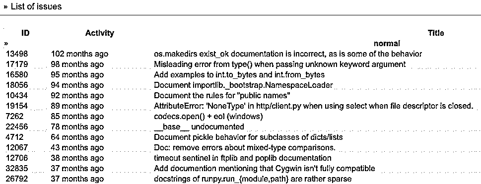

# 开始为 Python 做贡献:您的第一步

> 原文：<https://realpython.com/start-contributing-python/>

如果你想让**开始为开源贡献**，那么 [Python](https://github.com/python) 是一个很好的开始项目。你不仅会在最大的项目之一留下你的印记，而且你还会成为充满活力和热情的**社区**的一员。开源项目依赖于像你这样的志愿者的贡献来成长和发展，所以你将对开源软件的未来产生真正的影响。

最重要的是，为**开源**做贡献是学习和培养技能的好方法，所以如果你觉得自己不是专家，也不用担心。也许有一种方式非常适合你，即使你还不知道。一切从你的第一份贡献开始！

本教程结束时，你会知道:

*   你如何以符合你的**技能**和**兴趣**的方式做出贡献
*   你可以使用哪些资源和**工具**来帮助你自信地做出贡献
*   你可以在第一篇文章的**中找到修改建议**

**免费下载:** [从 CPython Internals:您的 Python 3 解释器指南](https://realpython.com/bonus/cpython-internals-sample/)获得一个示例章节，向您展示如何解锁 Python 语言的内部工作机制，从源代码编译 Python 解释器，并参与 CPython 的开发。

## 如何做出贡献

根据你的兴趣和技能，你可以以多种不同的方式做出贡献。例如，如果您想为 [CPython](https://github.com/python/cpython) 做贡献，您可以:

*   修复代码错误
*   为[标准库](https://docs.python.org/3/library/)中的函数编写[单元测试](https://realpython.com/python-testing/)
*   为标准库中的函数编写[文档](https://realpython.com/documenting-python-code/)

但是如果你想在其他领域有所贡献，你可以:

*   为 [Python 开发者指南](https://devguide.python.org/)编写文档
*   翻译文档
*   使用你的前端技能[改进 Python 的官方网站](https://github.com/python/pythondotorg)

您还可以帮助审查来自其他贡献者的[拉请求。**核心开发者**手头有很多工作，所以如果你能帮助推进一些问题，那么你将帮助 Python 变得更快。](https://github.com/python/cpython/pulls)

[*Remove ads*](/account/join/)

## 如何获得您需要的资源

当你开始为一个开源项目做贡献时，可能会一下子吸收很多信息。

为了帮助你浏览这一切，你的第一站应该是 [Python 开发者指南](https://devguide.python.org/)。这是一个所有贡献者和核心开发者都依赖的超级重要的资源，因为它涵盖了从[如何评估潜在贡献](https://devguide.python.org/committing/)到[如何处理问题跟踪](https://devguide.python.org/tracker/)的所有内容。(如果你[对本指南](https://github.com/python/devguide)有所贡献，那么你将能够对 Python 的贡献产生重大影响。)

一旦你开始做贡献，熟悉一些工具会很有用:

*   **GitHub:** Python 贡献者通过 [GitHub](https://github.com/) 相互协作，让你托管代码，做版本控制，给出反馈，等等。要了解如何使用这个工具的更多信息，请查看针对 Python 开发者的[Git 和 GitHub 简介](https://realpython.com/python-git-github-intro/)以及 Python 的官方 [Git Bootcamp 和备忘单](https://devguide.python.org/gitbootcamp/)。

*   如果你想贡献文档，那么学习如何使用这种标记语言会很有帮助。Python 开发者指南有一本关于 reStructuredText 的[初级读本来帮助你开始。(有趣的事实:reStructuredText 比](https://devguide.python.org/documenting/?highlight=restructuredtext#restructuredtext-primer) [Markdown](https://en.wikipedia.org/wiki/Markdown) 存在的时间还要长！)

*   **Sphinx:** 您将使用 [Sphinx](https://pypi.org/project/Sphinx/) 来[构建 Python 的文档](https://devguide.python.org/documenting/?highlight=sphinx#building-the-documentation)。要了解更多信息，您可以查看 Mariatta Wijaya 的[演讲](https://realpython.com/interview-mariatta-wijaya/)介绍 Sphinx 文档和重构文本和 Eric Holscher 的演讲[用 Sphinx 记录您的项目&阅读文档](https://www.youtube.com/watch?v=hM4I58TA72g&lc=z13kszcxvuzcxpa3r23aibphiuiif3jax04&ab_channel=PyCon2016)。

虽然你不需要有使用 C 编程语言的经验来为 Python 做贡献，但是它可以开辟一些新的贡献方式。以下是一些资源，您可以查看以了解更多信息:

*   [面向 Python 程序员的 C 语言](https://realpython.com/c-for-python-programmers/)
*   [CPython 源代码指南](https://realpython.com/cpython-source-code-guide/)
*   [CPython 内部:Python 3 解释器指南](https://realpython.com/products/cpython-internals-book/)

为了感受贡献 Python 的人际方面是如何工作的，你也可以看看 [Brett Canon 的](https://realpython.com/podcasts/rpp/47/)py cascade talk[设定对开源参与的期望](https://www.youtube.com/watch?v=-Nk-8fSJM6I&ab_channel=PyCascades)。这是关于对彼此设定合理的期望，这样我们就可以让开源让每个参与进来的人都感到愉快。

## 如何挑选你的第一期

如果您看到 Python 中有您认为应该改进的地方，那么欢迎您提出建议。但是对于你的第一次投稿，从一个已经被其他人标记的**问题**开始会更容易。

如果你想为 Python 开发者指南或 [Python 的官方网站](https://www.python.org/)投稿，那么你可以查看 GitHub 上列出的问题:

*   [Python 开发者指南发布](https://github.com/python/devguide/issues)
*   [python.org 问题](https://github.com/python/pythondotorg/issues)

如果你想为 [CPython](https://github.com/python/cpython) 做贡献，这是大多数人说“Python”的意思，那么你需要在 Python 的 bug tracker 上创建一个帐户，这个帐户叫做 **BPO** ，因为它位于[**`b`**`ugs.`**`p`**`ython.`**`o`**`rg`](https://bugs.python.org/)。您可以通过进入左侧菜单中的*用户→注册*将自己注册为用户。

默认视图中的信息可能很难理解，因为它显示了用户提出的问题以及核心开发人员提出的问题，这些问题可能已经得到了解决。幸运的是，你可以过滤这个列表来找到你想要的东西。

要过滤列表，首先登录，然后进入左侧菜单中的*您的查询→编辑*。你会得到一个**查询**的列表，你可以*在*或*省略*:

下面是一个例子，如果您编辑您的查询，只留下简单的文档问题，您会看到什么:

现在您已经过滤了列表，只留下了简单的文档问题，您看到的只是适合初学者的文档问题。

如果您想处理文档之外的内容，也可以尝试其他一些查询来帮助您找到感兴趣的问题:

| 询问 | 问题的类型 |
| --- | --- |
| *简单任务* | 被标记为适合初学者的问题 |
| *没有回复的报告* | 已报告但未讨论的问题 |
| *未读* | 已报告但未阅读的问题 |
| *最近创建的* | 最近报告的问题 |
| *50 期最新* | 最近更新的前五十个问题 |

一旦你决定了你的第一篇文章要写哪个问题，最好查看一下**评论**看看:

*   关于是否应该解决这个问题以及如何解决这个问题，仍有一些讨论在进行中
*   有人已经在研究这个问题了

你也可以检查最新版本的代码和文档，看看问题是否已经解决，但还没有被核心开发人员**关闭**。

**注意:**你可以在[官方文档中了解更多关于如何使用问题跟踪器对问题进行分类](https://devguide.python.org/triaging/)。

一旦您确定了要从哪个问题开始，您可以对该问题发表评论:

*   说你会继续努力
*   让其他人知道您计划何时提交您的[拉动请求](https://docs.github.com/en/github/collaborating-with-issues-and-pull-requests/about-pull-requests)

如果你清楚地传达了你的计划，那么其他贡献者将会知道其他人已经在处理这个问题了，并且能够将他们的精力集中在解决其他问题上。

[*Remove ads*](/account/join/)

## 如何提交您的第一篇投稿

请务必查看 Python 关于拉请求的[生命周期的官方文档。它将带你通过提交拉请求的](https://devguide.python.org/pullrequest/)[一步一步的机制](https://devguide.python.org/pullrequest/#step-by-step-guide)，给你关于[做好提交](https://devguide.python.org/pullrequest/#making-good-commits)的提示，等等。

由于大多数核心开发人员都是志愿者，您可能不会马上得到回复，但是您可以做一些事情来加快这个过程:

*   **清楚地解释你解决的问题以及你是如何解决的:**这将有助于评审者快速上手，并获得他们需要的信息[接受你的拉取请求](https://devguide.python.org/committing/)。
*   **在每个拉式请求中只解决一个问题:**如果你在做贡献时注意到另一个问题，那么你可以在第二个拉式请求中解决它。

为开源做贡献是关于协作的，所以交流是非常重要的。要了解更多，请查看[开源指南](https://opensource.guide)关于[提交投稿时有效沟通](https://opensource.guide/how-to-contribute/#how-to-submit-a-contribution)的说法。

当你提交了你的第一个拉取请求后，放松并庆祝吧！你已经在通往一些很酷的地方的旅途上迈出了第一大步。

## 下一步是什么？

如果你决定更多地参与其中，那么你可以探索一些机会。也许你想:

*   努力成为核心开发人员
*   求[师友](https://www.python.org/dev/core-mentorship/)
*   加入[分流团队](https://devguide.python.org/triaging/#becoming-a-member-of-the-python-triage-team)
*   加入一个特定项目的[工作组](https://www.python.org/psf/committees/)
*   成为 [Python 软件基金会](https://www.python.org/psf/)的[会员](https://pyfound.blogspot.com/2021/03/happy-anniversary-to-python-and-python.html)

Python 的世界里发生了很多事情，所以环顾四周，看看有什么让你着迷。让我们友好相处，共同创造美好的未来。

## 结论:开始为 Python 做贡献

祝贺您迈出了为 Python 做贡献的第一步！如果你冒险开始，那么你一定会在对一个重要的开源项目产生影响的同时学到很多东西。

**在本教程中，您学习了:**

*   你如何以符合你的**技能**和**兴趣**的方式为 Python 做出贡献
*   你可以使用哪些资源和**工具**来帮助你自信地做出贡献
*   你可以在第一篇文章的**中找到修改建议**

核心开发团队中的每个人都是从一个贡献开始的，那么为什么不试一试呢？在这个过程中，你一定会学到一些东西！**