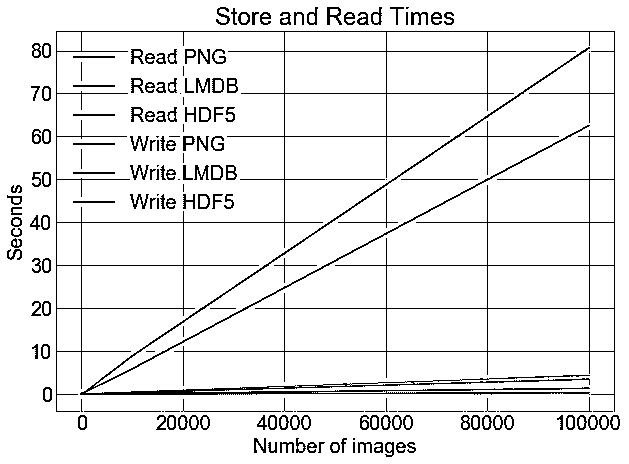

# Python 中存储和访问大量图像的三种方式

> 原文：<https://realpython.com/storing-images-in-python/>

为什么您想了解更多关于在 Python 中存储和访问图像的不同方法？如果你正在[用颜色](https://realpython.com/python-opencv-color-spaces/)分割一些图像或者[用 OpenCV 逐个检测人脸](https://realpython.com/face-recognition-with-python/)，那么你不需要担心这个问题。即使你正在使用 [Python 图像库(PIL)](https://realpython.com/image-processing-with-the-python-pillow-library/) 来绘制几百张照片，你仍然不需要。将图像作为`.png`或`.jpg`文件存储在磁盘上既合适又合适。

然而，给定任务所需的图像数量越来越多。卷积神经网络(也称为 convnets 或 CNN)等算法可以处理大量图像数据集，甚至可以从中学习。如果你感兴趣，你可以阅读更多关于 convnets 如何用于自拍排名或 T2 情绪分析的内容。

ImageNet 是一个著名的公共图像数据库，它由超过 1400 万张图像组成*。*

想想把它们全部加载到内存中进行训练要花多长时间，分批加载，可能是几百次，也可能是几千次。继续读下去，你会相信这需要相当长的时间——至少足够你离开电脑做许多其他事情，而你希望你在谷歌或英伟达工作。

在本教程中，您将了解到:

*   将图像作为`.png`文件存储在磁盘上
*   在 lightning 内存映射数据库中存储图像(LMDB)
*   以分层数据格式存储图像(HDF5)

**您还将探索以下内容:**

*   为什么替代存储方法值得考虑
*   当你读写单个图像时，性能有什么不同
*   当你读写*多张*图片时，性能有何不同
*   这三种方法在磁盘使用方面有何不同

如果没有一种存储方法，不要担心:对于本文，您所需要的只是相当扎实的 Python 基础和对图像的基本理解(它们实际上是由多维数组[数字](https://realpython.com/python-numbers/)组成的)和相对内存，比如 10MB 和 10GB 之间的区别。

我们开始吧！

**免费奖励:** ，向您展示真实世界 Python 计算机视觉技术的实用代码示例。

## 设置

您将需要一个图像数据集来进行实验，以及几个 [Python 包](https://realpython.com/python-modules-packages/)。

[*Remove ads*](/account/join/)

### 要使用的数据集

我们将使用加拿大高级研究所的图像数据集，更好的说法是 [CIFAR-10](https://en.wikipedia.org/wiki/CIFAR-10) ，它由 60，000 张 32x32 像素的彩色图像组成，属于不同的对象类别，如狗、猫和飞机。相对而言，CIFAR 不是一个非常大的数据集，但是如果我们使用完整的[tinyi images 数据集](https://groups.csail.mit.edu/vision/TinyImages/)，那么您将需要大约 400GB 的可用磁盘空间，这可能是一个限制因素。

本技术报告第三章中描述的数据集的功劳归于 Alex Krizhevsky、Vinod Nair 和 Geoffrey Hinton。

如果您想了解本文中的代码示例，您可以[在这里](https://www.cs.toronto.edu/~kriz/cifar.html)下载 CIFAR-10，选择 Python 版本。您将牺牲 163MB 的磁盘空间:

[](https://files.realpython.com/media/cifar_10.e77ef0cd86df.png)

<figcaption class="figure-caption text-center">Image: A. Krizhevsky</figcaption>

当你下载并解压文件夹时，你会发现这些文件不是人类可读的图像文件。它们实际上已经被序列化并使用 [cPickle](https://docs.python.org/2/library/pickle.html) 批量保存。

虽然在本文中我们不会考虑 [`pickle`](https://realpython.com/python-pickle-module/) 或`cPickle`，但除了提取 CIFAR 数据集之外，值得一提的是 Python `pickle`模块的关键优势是能够序列化任何 Python 对象，而无需您进行任何额外的代码或转换。它还有一个潜在的严重缺点，即存在安全风险，并且在处理大量数据时处理不好。

以下代码对五个批处理文件中的每一个进行解拾取，并将所有图像加载到一个 NumPy 数组中:

```py
import numpy as np
import pickle
from pathlib import Path

# Path to the unzipped CIFAR data
data_dir = Path("data/cifar-10-batches-py/")

# Unpickle function provided by the CIFAR hosts
def unpickle(file):
    with open(file, "rb") as fo:
        dict = pickle.load(fo, encoding="bytes")
    return dict

images, labels = [], []
for batch in data_dir.glob("data_batch_*"):
    batch_data = unpickle(batch)
    for i, flat_im in enumerate(batch_data[b"data"]):
        im_channels = []
        # Each image is flattened, with channels in order of R, G, B
        for j in range(3):
            im_channels.append(
                flat_im[j * 1024 : (j + 1) * 1024].reshape((32, 32))
            )
        # Reconstruct the original image
        images.append(np.dstack((im_channels)))
        # Save the label
        labels.append(batch_data[b"labels"][i])

print("Loaded CIFAR-10 training set:")
print(f" - np.shape(images) {np.shape(images)}")
print(f" - np.shape(labels) {np.shape(labels)}")
```

所有的图像现在都在 RAM 中的`images` [变量](https://realpython.com/python-variables/)中，它们相应的元数据在`labels`中，并准备好供你操作。接下来，您可以安装将用于这三种方法的 Python 包。

**注意:**最后一个代码块使用了 f 字符串。你可以在 [Python 3 的 f-Strings:一个改进的字符串格式化语法(指南)](https://realpython.com/python-f-strings/)中读到更多关于它们的内容。

### 在磁盘上存储图像的设置

您需要将您的环境设置为从磁盘保存和访问这些图像的默认方法。本文假设您的系统上安装了 Python 3.x，并将使用`Pillow`进行图像操作:

```py
$ pip install Pillow
```

或者，如果您愿意，可以使用 [Anaconda](https://anaconda.org/conda-forge/pillow) 来安装它:

```py
$ conda install -c conda-forge pillow
```

**注意:** `PIL`是 Python 映像库的原始版本，不再维护，与 Python 3.x 不兼容，如果您之前已经安装了`PIL`，请确保在安装`Pillow`之前卸载它，因为它们不能共存。

现在，您已经准备好从磁盘存储和读取图像了。

### LMDB 入门

[LMDB](https://en.wikipedia.org/wiki/Lightning_Memory-Mapped_Database) ，有时被称为“闪电数据库”，代表闪电内存映射数据库，因为它速度快，并且使用内存映射文件。它是一个键值存储，而不是关系数据库。

在实现方面，LMDB 是一个 B+树，这基本上意味着它是一个存储在内存中的树状图形结构，其中每个键值元素都是一个节点，节点可以有许多子节点。同一级别上的节点相互链接，以便快速遍历。

关键的是，B+树的关键组件被设置为对应于主机操作系统的页面大小，从而在访问数据库中的任何键值对时最大化效率。由于 LMDB 高性能在很大程度上依赖于这一点，因此 LMDB 效率也依赖于底层文件系统及其实施。

LMDB 高效的另一个关键原因是它是内存映射的。这意味着**它返回指向键和值**的内存地址的直接指针，而不需要像大多数其他数据库那样复制内存中的任何内容。

那些想深入了解 B+树的内部实现细节的人可以查看[这篇关于 B+树的文章](http://www.cburch.com/cs/340/reading/btree/index.html)，然后用[体验一下节点插入的可视化](https://www.cs.usfca.edu/~galles/visualization/BPlusTree.html)。

如果你对 B+树不感兴趣，不用担心。为了使用 LMDB，你不需要了解太多它们的内部实现。我们将为 LMDB C 库使用 [Python 绑定](https://realpython.com/python-bindings-overview/)，它可以通过 pip 安装:

```py
$ pip install lmdb
```

您还可以选择通过 [Anaconda](https://anaconda.org/conda-forge/python-lmdb) 进行安装:

```py
$ conda install -c conda-forge python-lmdb
```

检查一下你能不能从 Python shell 中`import lmdb`，你就可以开始了。

[*Remove ads*](/account/join/)

### HDF5 入门

HDF5 代表分层数据格式，一种称为 HDF4 或 HDF5 的文件格式。我们不需要担心 HDF4，因为 HDF5 是当前维护的版本。

有趣的是，HDF 起源于国家超级计算应用中心，作为一种可移植的、紧凑的科学数据格式。如果你想知道它是否被广泛使用，看看[美国宇航局关于 HDF5](https://earthdata.nasa.gov/user-resources/standards-and-references/hdf-eos5) 的简介，来自他们的地球数据项目。

HDF 文件由两种类型的对象组成:

1.  资料组
2.  组

数据集是多维数组，组由数据集或其他组组成。任何大小和类型的多维数组都可以存储为数据集，但是数据集内的维度和类型必须一致。每个数据集必须包含一个同质的 N 维数组。也就是说，因为组和数据集可能是嵌套的，所以您仍然可以获得您可能需要的异构性:

```py
$ pip install h5py
```

与其他库一样，您也可以通过 [Anaconda](https://anaconda.org/conda-forge/h5py) 安装:

```py
$ conda install -c conda-forge h5py
```

如果你能从 Python shell 中`import h5py`，那么一切都设置好了。

## 存储单幅图像

现在，您已经对这些方法有了大致的了解，让我们直接进入主题，看看我们关心的基本任务的定量比较:**读写文件需要多长时间，以及将使用多少磁盘内存。这也将作为方法如何工作的基本介绍，以及如何使用它们的代码示例。**

当我提到“文件”时，我通常是指很多文件。但是，进行区分很重要，因为有些方法可能针对不同的操作和文件数量进行了优化。

出于实验的目的，我们可以比较不同数量的文件之间的性能，从单个图像到 100，000 个图像，相差 10 倍。由于我们的五批 CIFAR-10 加起来有 50，000 张图像，因此我们可以使用每张图像两次，得到 100，000 张图像。

为了准备实验，您需要为每个方法创建一个文件夹，其中包含所有数据库文件或图像，并将这些目录的路径保存在变量中:

```py
from pathlib import Path

disk_dir = Path("data/disk/")
lmdb_dir = Path("data/lmdb/")
hdf5_dir = Path("data/hdf5/")
```

`Path`不会自动为您创建文件夹，除非您特别要求它:

```py
disk_dir.mkdir(parents=True, exist_ok=True)
lmdb_dir.mkdir(parents=True, exist_ok=True)
hdf5_dir.mkdir(parents=True, exist_ok=True)
```

现在，您可以继续运行实际的实验，使用代码示例说明如何使用这三种不同的方法执行基本任务。我们可以使用包含在 Python 标准库中的`timeit`模块来帮助计时实验。

虽然本文的主要目的不是学习不同 Python 包的 API，但是理解它们是如何实现的是很有帮助的。我们将在所有用于进行存储实验的代码旁边讨论一般原则。

[*Remove ads*](/account/join/)

### 存储到磁盘

我们这个实验的输入是一个单独的图像`image`，当前在内存中是一个 NumPy 数组。你想先把它保存到磁盘上作为一个`.png`图像，并用一个唯一的图像 ID `image_id`来命名它。这可以使用您之前安装的`Pillow`包来完成:

```py
from PIL import Image
import csv

def store_single_disk(image, image_id, label):
    """ Stores a single image as a .png file on disk.
 Parameters:
 ---------------
 image       image array, (32, 32, 3) to be stored
 image_id    integer unique ID for image
 label       image label
 """
    Image.fromarray(image).save(disk_dir / f"{image_id}.png")

    with open(disk_dir / f"{image_id}.csv", "wt") as csvfile:
        writer = csv.writer(
            csvfile, delimiter=" ", quotechar="|", quoting=csv.QUOTE_MINIMAL
        )
        writer.writerow([label])
```

这保存了图像。在所有真实的应用程序中，您还会关心附加到图像的元数据，在我们的示例数据集中是图像标签。当您将图像储存到磁盘时，有几个选项可用于存储元数据。

一种解决方案是将标签编码到图像名称中。这具有不需要任何额外文件的优点。

然而，它也有一个很大的缺点，那就是每当你对标签做任何事情时，都要强迫你处理所有的文件。将标签存储在一个单独的文件中允许您单独处理标签，而不必加载图像。上面，我已经为这个实验将标签存储在一个单独的`.csv`文件中。

现在让我们继续对 LMDB 做同样的工作。

### 存储到 LMDB

首先，LMDB 是一个键值存储系统，其中每个条目都保存为一个字节数组，所以在我们的例子中，键将是每个图像的唯一标识符，值将是图像本身。**键和值都应该是字符串**，所以通常的用法是将值序列化为一个字符串，然后在读回它时取消序列化。

您可以使用`pickle`进行序列化。任何 Python 对象都可以序列化，因此您还可以在数据库中包含图像元数据。当我们从磁盘加载数据集时，这样可以省去将元数据附加到图像数据的麻烦。

您可以为图像及其元数据创建一个基本的 [Python 类](https://realpython.com/lessons/what-object-oriented-programming-oop/):

```py
class CIFAR_Image:
    def __init__(self, image, label):
        # Dimensions of image for reconstruction - not really necessary 
        # for this dataset, but some datasets may include images of 
        # varying sizes
        self.channels = image.shape[2]
        self.size = image.shape[:2]

        self.image = image.tobytes()
        self.label = label

    def get_image(self):
        """ Returns the image as a numpy array. """
        image = np.frombuffer(self.image, dtype=np.uint8)
        return image.reshape(*self.size, self.channels)
```

其次，因为 LMDB 是内存映射的，所以新数据库需要知道它们预计会用完多少内存。在我们的例子中，这相对简单，但是在其他例子中，这可能是一个巨大的痛苦，您将在后面的部分中更深入地看到这一点。LMDB 称这个变量为`map_size`。

最后，在`transactions`中执行 LMDB 的读写操作。你可以把它们想象成类似于传统的数据库，由一组对数据库的操作组成。这可能看起来已经比磁盘版本复杂得多，但是坚持下去，继续阅读！

记住这三点，让我们看看将单个图像保存到 LMDB 的代码:

```py
import lmdb
import pickle

def store_single_lmdb(image, image_id, label):
    """ Stores a single image to a LMDB.
 Parameters:
 ---------------
 image       image array, (32, 32, 3) to be stored
 image_id    integer unique ID for image
 label       image label
 """
    map_size = image.nbytes * 10

    # Create a new LMDB environment
    env = lmdb.open(str(lmdb_dir / f"single_lmdb"), map_size=map_size)

    # Start a new write transaction
    with env.begin(write=True) as txn:
        # All key-value pairs need to be strings
        value = CIFAR_Image(image, label)
        key = f"{image_id:08}"
        txn.put(key.encode("ascii"), pickle.dumps(value))
    env.close()
```

**注意:**计算每个键值对将占用的确切字节数是个好主意。

对于不同大小的图像数据集，这将是一个近似值，但是您可以使用`sys.getsizeof()`来获得一个合理的近似值。请记住，`sys.getsizeof(CIFAR_Image)`将只返回一个类定义的大小，这是 1056，*不是*实例化对象的大小。

该函数也不能完全计算嵌套项目、[列表](https://realpython.com/python-lists-tuples/)或包含对其他对象的引用的对象。

或者，你可以使用 [`pympler`](https://pythonhosted.org/Pympler/#usage-examples) 通过确定一个对象的精确大小来节省一些计算。

您现在可以将图像保存到 LMDB 了。最后，我们来看看最后一种方法，HDF5。

### 使用 HDF5 存储

请记住，一个 HDF5 文件可以包含多个数据集。在这个相当简单的例子中，您可以创建两个数据集，一个用于图像，一个用于元数据:

```py
import h5py

def store_single_hdf5(image, image_id, label):
    """ Stores a single image to an HDF5 file.
 Parameters:
 ---------------
 image       image array, (32, 32, 3) to be stored
 image_id    integer unique ID for image
 label       image label
 """
    # Create a new HDF5 file
    file = h5py.File(hdf5_dir / f"{image_id}.h5", "w")

    # Create a dataset in the file
    dataset = file.create_dataset(
        "image", np.shape(image), h5py.h5t.STD_U8BE, data=image
    )
    meta_set = file.create_dataset(
        "meta", np.shape(label), h5py.h5t.STD_U8BE, data=label
    )
    file.close()
```

`h5py.h5t.STD_U8BE`指定将存储在数据集中的数据类型，在本例中是无符号的 8 位整数。你可以在这里看到 HDF 预定义数据类型的完整列表。

**注意:**数据类型的选择会强烈影响 HDF5 的运行时和存储要求，所以最好选择你的最低要求。

现在我们已经回顾了保存单个图像的三种方法，让我们继续下一步。

[*Remove ads*](/account/join/)

### 存储单幅图像的实验

现在，您可以将保存单幅图像的所有三个函数放入[字典](https://realpython.com/python-dicts/)中，稍后在计时实验中可以调用:

```py
_store_single_funcs = dict(
    disk=store_single_disk, lmdb=store_single_lmdb, hdf5=store_single_hdf5
)
```

最后，进行定时实验的一切都准备好了。让我们尝试保存来自 CIFAR 的第一个图像及其相应的标签，并以三种不同的方式存储它:

```py
from timeit import timeit

store_single_timings = dict()

for method in ("disk", "lmdb", "hdf5"):
    t = timeit(
        "_store_single_funcs[method](image, 0, label)",
        setup="image=images[0]; label=labels[0]",
        number=1,
        globals=globals(),
    )
    store_single_timings[method] = t
    print(f"Method: {method}, Time usage: {t}")
```

**注意:**当你在玩 LMDB 的时候，你可能会看到一个`MapFullError: mdb_txn_commit: MDB_MAP_FULL: Environment mapsize limit reached`错误。需要注意的是，LMDB 不会**而不是**覆盖预先存在的值，即使它们有相同的键。

这有助于加快写入时间，但也意味着如果你在同一个 LMDB 文件中不止一次地存储一张图片，那么你将用完地图的大小。如果您运行存储功能，请确保首先删除任何预先存在的 LMDB 文件。

请记住，我们感兴趣的是以秒为单位显示的运行时间，以及内存使用情况:

| 方法 | 保存单个图像+元 | 记忆 |
| --- | --- | --- |
| 唱片 | 1.915 毫秒 | 8 K |
| IMDB(IMDB) | 1.203 毫秒 | 32 K |
| HDF5 | 8.243 毫秒 | 8 K |

这里有两个要点:

1.  所有的方法都非常快。
2.  就磁盘使用而言，LMDB 使用的更多。

显然，尽管 LMDB 在性能上略有领先，但我们还没有说服任何人为什么不把图像存储在磁盘上。毕竟，它是人类可读的格式，您可以从任何文件系统浏览器打开和查看它们！好了，是时候看看更多的图片了…

## 存储许多图像

您已经看到了使用各种存储方法保存单个图像的代码，所以现在我们需要调整代码来保存多个图像，然后运行定时实验。

### 调整许多图像的代码

将多个*图像保存为`.png`文件就像多次调用`store_single_method()`一样简单。但这对于 LMDB 或 HDF5 来说是不正确的，因为你不希望每个图像有不同的数据库文件。相反，您希望将所有图像放入一个或多个文件中。*

您需要稍微修改一下代码，创建三个新的函数来接受多个图像，`store_many_disk()`、`store_many_lmdb()`和`store_many_hdf5`:

```py
 store_many_disk(images, labels):
    """ Stores an array of images to disk
 Parameters:
 ---------------
 images       images array, (N, 32, 32, 3) to be stored
 labels       labels array, (N, 1) to be stored
 """
    num_images = len(images)

    # Save all the images one by one
    for i, image in enumerate(images):
        Image.fromarray(image).save(disk_dir / f"{i}.png")

    # Save all the labels to the csv file
    with open(disk_dir / f"{num_images}.csv", "w") as csvfile:
        writer = csv.writer(
            csvfile, delimiter=" ", quotechar="|", quoting=csv.QUOTE_MINIMAL
        )
        for label in labels:
            # This typically would be more than just one value per row
            writer.writerow([label])

def store_many_lmdb(images, labels):
    """ Stores an array of images to LMDB.
 Parameters:
 ---------------
 images       images array, (N, 32, 32, 3) to be stored
 labels       labels array, (N, 1) to be stored
 """
    num_images = len(images)

    map_size = num_images * images[0].nbytes * 10

    # Create a new LMDB DB for all the images
    env = lmdb.open(str(lmdb_dir / f"{num_images}_lmdb"), map_size=map_size)

    # Same as before — but let's write all the images in a single transaction
    with env.begin(write=True) as txn:
        for i in range(num_images):
            # All key-value pairs need to be Strings
            value = CIFAR_Image(images[i], labels[i])
            key = f"{i:08}"
            txn.put(key.encode("ascii"), pickle.dumps(value))
    env.close()

def store_many_hdf5(images, labels):
    """ Stores an array of images to HDF5.
 Parameters:
 ---------------
 images       images array, (N, 32, 32, 3) to be stored
 labels       labels array, (N, 1) to be stored
 """
    num_images = len(images)

    # Create a new HDF5 file
    file = h5py.File(hdf5_dir / f"{num_images}_many.h5", "w")

    # Create a dataset in the file
    dataset = file.create_dataset(
        "images", np.shape(images), h5py.h5t.STD_U8BE, data=images
    )
    meta_set = file.create_dataset(
        "meta", np.shape(labels), h5py.h5t.STD_U8BE, data=labels
    )
    file.close()
```

因此，您可以将多个文件存储到磁盘，image files 方法被修改为遍历列表中的每个图像。对于 LMDB，也需要一个循环，因为我们为每个图像及其元数据创建了一个`CIFAR_Image`对象。

HDF5 方法的调整最小。事实上，几乎没有任何调整！除了外部限制或数据集大小之外，HFD5 文件对文件大小没有任何限制，因此所有图像都被填充到一个数据集中，就像以前一样。

接下来，您需要通过增加数据集的大小来为实验准备数据集。

[*Remove ads*](/account/join/)

### 准备数据集

在再次运行实验之前，让我们首先将数据集的大小加倍，这样我们可以用多达 100，000 张图像进行测试:

```py
cutoffs = [10, 100, 1000, 10000, 100000]

# Let's double our images so that we have 100,000
images = np.concatenate((images, images), axis=0)
labels = np.concatenate((labels, labels), axis=0)

# Make sure you actually have 100,000 images and labels
print(np.shape(images))
print(np.shape(labels))
```

既然有了足够多的图像，就该做实验了。

### 存储多幅图像的实验

正如您阅读许多图像一样，您可以使用`store_many_`创建一个处理所有功能的字典，并运行实验:

```py
_store_many_funcs = dict(
    disk=store_many_disk, lmdb=store_many_lmdb, hdf5=store_many_hdf5
)

from timeit import timeit

store_many_timings = {"disk": [], "lmdb": [], "hdf5": []}

for cutoff in cutoffs:
    for method in ("disk", "lmdb", "hdf5"):
        t = timeit(
            "_store_many_funcs[method](images_, labels_)",
            setup="images_=images[:cutoff]; labels_=labels[:cutoff]",
            number=1,
            globals=globals(),
        )
        store_many_timings[method].append(t)

        # Print out the method, cutoff, and elapsed time
        print(f"Method: {method}, Time usage: {t}")
```

如果您自己跟随并运行代码，您需要暂停片刻，等待 111，110 个图像以三种不同的格式分别存储到您的磁盘上三次。您还需要告别大约 2 GB 的磁盘空间。

现在是关键时刻了！所有这些存储需要多长时间？一张图胜过千言万语:

[](https://files.realpython.com/media/store_many.273573157770.png) [](https://files.realpython.com/media/store_many_log.29e8ae980ab6.png)

第一张图显示了正常的、未调整的存储时间，突出了存储到`.png`文件和 LMDB 或 HDF5 之间的巨大差异。

第二张图显示了计时的`log`,突出显示了 HDF5 开始时比 LMDB 慢，但由于图像量较大，它略微领先。

虽然具体结果可能因您的机器而异，但这也是 LMDB 和 HDF5 值得考虑的原因。下面是生成上图的代码:

```py
import matplotlib.pyplot as plt

def plot_with_legend(
    x_range, y_data, legend_labels, x_label, y_label, title, log=False
):
    """ Displays a single plot with multiple datasets and matching legends.
 Parameters:
 --------------
 x_range         list of lists containing x data
 y_data          list of lists containing y values
 legend_labels   list of string legend labels
 x_label         x axis label
 y_label         y axis label
 """
    plt.style.use("seaborn-whitegrid")
    plt.figure(figsize=(10, 7))

    if len(y_data) != len(legend_labels):
        raise TypeError(
            "Error: number of data sets does not match number of labels."
        )

    all_plots = []
    for data, label in zip(y_data, legend_labels):
        if log:
            temp, = plt.loglog(x_range, data, label=label)
        else:
            temp, = plt.plot(x_range, data, label=label)
        all_plots.append(temp)

    plt.title(title)
    plt.xlabel(x_label)
    plt.ylabel(y_label)
    plt.legend(handles=all_plots)
    plt.show()

# Getting the store timings data to display
disk_x = store_many_timings["disk"]
lmdb_x = store_many_timings["lmdb"]
hdf5_x = store_many_timings["hdf5"]

plot_with_legend(
    cutoffs,
    [disk_x, lmdb_x, hdf5_x],
    ["PNG files", "LMDB", "HDF5"],
    "Number of images",
    "Seconds to store",
    "Storage time",
    log=False,
)

plot_with_legend(
    cutoffs,
    [disk_x, lmdb_x, hdf5_x],
    ["PNG files", "LMDB", "HDF5"],
    "Number of images",
    "Seconds to store",
    "Log storage time",
    log=True,
)
```

现在让我们继续把图像读出来。

## 读取单个图像

首先，让我们考虑对于这三种方法中的每一种，将单个图像读回数组的情况。

### 从磁盘读取

在这三种方法中，由于序列化步骤，LMDB 在从内存中读回图像文件时需要做的工作最多。让我们来看一下这些函数，它们为三种存储格式中的每一种读取单个图像。

首先，从一个`.png`和`.csv`文件中读取一个图像及其元数据:

```py
def read_single_disk(image_id):
    """ Stores a single image to disk.
 Parameters:
 ---------------
 image_id    integer unique ID for image

 Returns:
 ----------
 image       image array, (32, 32, 3) to be stored
 label       associated meta data, int label
 """
    image = np.array(Image.open(disk_dir / f"{image_id}.png"))

    with open(disk_dir / f"{image_id}.csv", "r") as csvfile:
        reader = csv.reader(
            csvfile, delimiter=" ", quotechar="|", quoting=csv.QUOTE_MINIMAL
        )
        label = int(next(reader)[0])

    return image, label
```

[*Remove ads*](/account/join/)

### 阅读 LMDB 的作品

接下来，通过打开环境并启动读取事务，从 LMDB 读取相同的映像和元:

```py
 1def read_single_lmdb(image_id):
 2    """ Stores a single image to LMDB.
 3 Parameters:
 4 ---------------
 5 image_id    integer unique ID for image
 6
 7 Returns:
 8 ----------
 9 image       image array, (32, 32, 3) to be stored
10 label       associated meta data, int label
11 """
12    # Open the LMDB environment
13    env = lmdb.open(str(lmdb_dir / f"single_lmdb"), readonly=True)
14
15    # Start a new read transaction
16    with env.begin() as txn:
17        # Encode the key the same way as we stored it
18        data = txn.get(f"{image_id:08}".encode("ascii"))
19        # Remember it's a CIFAR_Image object that is loaded
20        cifar_image = pickle.loads(data)
21        # Retrieve the relevant bits
22        image = cifar_image.get_image()
23        label = cifar_image.label
24    env.close()
25
26    return image, label
```

关于上面的代码片段，有几点需要注意:

*   **第 13 行:**`readonly=True`标志指定在事务完成之前不允许对 LMDB 文件进行写操作。在数据库行话中，这相当于获取一个读锁。
*   **第 20 行:**要检索 CIFAR_Image 对象，您需要颠倒我们在编写它时处理它的步骤。这就是对象的`get_image()`有用的地方。

这就完成了从 LMDB 读取图像的工作。最后，您可能想对 HDF5 做同样的事情。

### 从 HDF5 读取

从 HDF5 读取看起来与写入过程非常相似。以下是打开和读取 HDF5 文件并解析相同图像和元的代码:

```py
def read_single_hdf5(image_id):
    """ Stores a single image to HDF5.
 Parameters:
 ---------------
 image_id    integer unique ID for image

 Returns:
 ----------
 image       image array, (32, 32, 3) to be stored
 label       associated meta data, int label
 """
    # Open the HDF5 file
    file = h5py.File(hdf5_dir / f"{image_id}.h5", "r+")

    image = np.array(file["/image"]).astype("uint8")
    label = int(np.array(file["/meta"]).astype("uint8"))

    return image, label
```

请注意，您可以通过使用前面带有正斜杠`/`的数据集名称索引`file`对象来访问文件中的各种数据集。和前面一样，您可以创建一个包含所有读取函数的字典:

```py
_read_single_funcs = dict(
    disk=read_single_disk, lmdb=read_single_lmdb, hdf5=read_single_hdf5
)
```

有了这本字典，你就可以做实验了。

### 读取单个图像的实验

您可能认为在中读取单个图像的实验会有一些微不足道的结果，但下面是实验代码:

```py
from timeit import timeit

read_single_timings = dict()

for method in ("disk", "lmdb", "hdf5"):
    t = timeit(
        "_read_single_funcs[method](0)",
        setup="image=images[0]; label=labels[0]",
        number=1,
        globals=globals(),
    )
    read_single_timings[method] = t
    print(f"Method: {method}, Time usage: {t}")
```

以下是阅读单幅图像的实验结果:

| 方法 | 读取单个图像+元 |
| --- | --- |
| 唱片 | 1.61970 毫秒 |
| IMDB(IMDB) | 4.52063 毫秒 |
| HDF5 | 1.98036 毫秒 |

直接从磁盘读取`.png`和`.csv`文件稍微快一些，但是这三种方法的执行速度都很快。我们接下来要做的实验要有趣得多。

## 读取许多图像

现在，您可以调整代码来一次读取许多图像。这可能是您最常执行的操作，因此运行时性能至关重要。

[*Remove ads*](/account/join/)

### 调整许多图像的代码

扩展上面的函数，可以用`read_many_`创建函数，用于接下来的实验。像以前一样，在读取不同数量的图像时比较性能是很有趣的，下面的代码中重复了这些内容以供参考:

```py
def read_many_disk(num_images):
    """ Reads image from disk.
 Parameters:
 ---------------
 num_images   number of images to read

 Returns:
 ----------
 images      images array, (N, 32, 32, 3) to be stored
 labels      associated meta data, int label (N, 1)
 """
    images, labels = [], []

    # Loop over all IDs and read each image in one by one
    for image_id in range(num_images):
        images.append(np.array(Image.open(disk_dir / f"{image_id}.png")))

    with open(disk_dir / f"{num_images}.csv", "r") as csvfile:
        reader = csv.reader(
            csvfile, delimiter=" ", quotechar="|", quoting=csv.QUOTE_MINIMAL
        )
        for row in reader:
            labels.append(int(row[0]))
    return images, labels

def read_many_lmdb(num_images):
    """ Reads image from LMDB.
 Parameters:
 ---------------
 num_images   number of images to read

 Returns:
 ----------
 images      images array, (N, 32, 32, 3) to be stored
 labels      associated meta data, int label (N, 1)
 """
    images, labels = [], []
    env = lmdb.open(str(lmdb_dir / f"{num_images}_lmdb"), readonly=True)

    # Start a new read transaction
    with env.begin() as txn:
        # Read all images in one single transaction, with one lock
        # We could split this up into multiple transactions if needed
        for image_id in range(num_images):
            data = txn.get(f"{image_id:08}".encode("ascii"))
            # Remember that it's a CIFAR_Image object 
            # that is stored as the value
            cifar_image = pickle.loads(data)
            # Retrieve the relevant bits
            images.append(cifar_image.get_image())
            labels.append(cifar_image.label)
    env.close()
    return images, labels

def read_many_hdf5(num_images):
    """ Reads image from HDF5.
 Parameters:
 ---------------
 num_images   number of images to read

 Returns:
 ----------
 images      images array, (N, 32, 32, 3) to be stored
 labels      associated meta data, int label (N, 1)
 """
    images, labels = [], []

    # Open the HDF5 file
    file = h5py.File(hdf5_dir / f"{num_images}_many.h5", "r+")

    images = np.array(file["/images"]).astype("uint8")
    labels = np.array(file["/meta"]).astype("uint8")

    return images, labels

_read_many_funcs = dict(
    disk=read_many_disk, lmdb=read_many_lmdb, hdf5=read_many_hdf5
)
```

有了存储在字典中的阅读函数和写作函数，您就可以开始实验了。

### 读取多幅图像的实验

现在，您可以运行实验来读出许多图像:

```py
from timeit import timeit

read_many_timings = {"disk": [], "lmdb": [], "hdf5": []}

for cutoff in cutoffs:
    for method in ("disk", "lmdb", "hdf5"):
        t = timeit(
            "_read_many_funcs[method](num_images)",
            setup="num_images=cutoff",
            number=1,
            globals=globals(),
        )
        read_many_timings[method].append(t)

        # Print out the method, cutoff, and elapsed time
        print(f"Method: {method}, No. images: {cutoff}, Time usage: {t}")
```

正如我们之前所做的，您可以绘制读取实验结果的图表:

[](https://files.realpython.com/media/read_many.9c4a6dc5bdc0.png) [](https://files.realpython.com/media/read_many_log.594dac8746ad.png)

上图显示了正常的、未调整的读取时间，显示了从`.png`文件读取与 LMDB 或 HDF5 之间的巨大差异。

相比之下，底部的图表显示了计时的`log`，突出显示了较少图像的相对差异。也就是说，我们可以看到 HDF5 是如何落后的，但随着图像数量的增加，它始终比 LMDB 快一点点。


使用与写时序相同的绘图函数，我们得到如下结果:

```py
disk_x_r = read_many_timings["disk"]
lmdb_x_r = read_many_timings["lmdb"]
hdf5_x_r = read_many_timings["hdf5"]

plot_with_legend(
    cutoffs,
    [disk_x_r, lmdb_x_r, hdf5_x_r],
    ["PNG files", "LMDB", "HDF5"],
    "Number of images",
    "Seconds to read",
    "Read time",
    log=False,
)

plot_with_legend(
    cutoffs,
    [disk_x_r, lmdb_x_r, hdf5_x_r],
    ["PNG files", "LMDB", "HDF5"],
    "Number of images",
    "Seconds to read",
    "Log read time",
    log=True,
)
```

在实践中，写时间通常没有读时间重要。想象一下，你正在训练一个关于图像的深度神经网络，而你的整个图像数据集一次只有一半适合 RAM。训练网络的每个时期都需要整个数据集，模型需要几百个时期才能收敛。实际上，您将在每个时期将数据集的一半读入内存。

人们有几个小技巧，比如训练伪纪元来使这个稍微好一点，但是你明白了。

现在，再看一下上面的图表。一个 40 秒和 4 秒的读取时间之间的差别就像等待你的模型训练 6 个小时或 40 分钟之间的差别！

如果我们在同一个图表上查看读取和写入时间，我们会看到以下内容:

[](https://files.realpython.com/media/read_write.a4f87d39489d.png)


您可以使用相同的绘图功能在单个图形上绘制所有读取和写入时序:

```py
plot_with_legend(
    cutoffs,
    [disk_x_r, lmdb_x_r, hdf5_x_r, disk_x, lmdb_x, hdf5_x],
    [
        "Read PNG",
        "Read LMDB",
        "Read HDF5",
        "Write PNG",
        "Write LMDB",
        "Write HDF5",
    ],
    "Number of images",
    "Seconds",
    "Log Store and Read Times",
    log=False,
)
```

当你将图像存储为`.png`文件时，写和读的时间有很大的不同。然而，对于 LMDB 和 HDF5，差异就不那么明显了。总的来说，即使读取时间比写入时间更重要，使用 LMDB 或 HDF5 存储图像也有很强的说服力。

现在，您已经了解了 LMDB 和 HDF5 的性能优势，让我们来看看另一个关键指标:磁盘使用率。

[*Remove ads*](/account/join/)

## 考虑磁盘使用情况

速度不是您可能感兴趣的唯一性能指标。我们已经在处理非常大的数据集，所以磁盘空间也是一个非常有效和相关的问题。

假设您有一个 3TB 的图像数据集。与我们的 CIFAR 示例不同，假设您已经在磁盘的某个地方保存了它们，那么通过使用另一种存储方法，您实际上是在制作它们的副本，该副本也必须被存储。这样做将在使用图像时给你带来巨大的性能优势，但是你需要确保你有足够的磁盘空间。

各种存储方法使用多少磁盘空间？以下是每种方法用于每种数量图像的磁盘空间:

[](https://files.realpython.com/media/store_mem.dadff24e67e3.png)


我使用 Linux `du -h -c folder_name/*`命令来计算我的系统上的磁盘使用情况。由于四舍五入的原因，这种方法有一些固有的近似性，但下面是一般的比较:

```py
# Memory used in KB
disk_mem = [24, 204, 2004, 20032, 200296]
lmdb_mem = [60, 420, 4000, 39000, 393000]
hdf5_mem = [36, 304, 2900, 29000, 293000]

X = [disk_mem, lmdb_mem, hdf5_mem]

ind = np.arange(3)
width = 0.35

plt.subplots(figsize=(8, 10))
plots = [plt.bar(ind, [row[0] for row in X], width)]
for i in range(1, len(cutoffs)):
    plots.append(
        plt.bar(
            ind, [row[i] for row in X], width, bottom=[row[i - 1] for row in X]
        )
    )

plt.ylabel("Memory in KB")
plt.title("Disk memory used by method")
plt.xticks(ind, ("PNG", "LMDB", "HDF5"))
plt.yticks(np.arange(0, 400000, 100000))

plt.legend(
    [plot[0] for plot in plots], ("10", "100", "1,000", "10,000", "100,000")
)
plt.show()
```

与使用普通`.png`图像存储相比，HDF5 和 LMDB 占用更多的磁盘空间。值得注意的是，LMDB 和 HDF5 的磁盘使用和性能**高度依赖于各种因素，包括操作系统，更重要的是，您存储的数据大小。**

LMDB 通过缓存和利用操作系统页面大小来提高效率。你不需要理解它的内部工作原理，但是请注意，**对于较大的图像，你最终会使用 LMDB 更多的磁盘，**因为图像不适合 LMDB 的叶页面，树中的常规存储位置，相反你会有许多溢出页面。上图中的 LMDB 棒线将脱离图表。

与您可能使用的普通图像相比，我们的 32x32x3 像素图像相对较小，并且可以实现最佳的 LMDB 性能。

虽然我们不会在这里进行实验性探索，但根据我自己对 256x256x3 或 512x512x3 像素图像的经验，HDF5 通常在磁盘使用方面比 LMDB 略高。这是进入最后一节的一个很好的过渡，这一节定性地讨论了这两种方法之间的差异。

## 讨论

LMDB 和 HDF5 还有其他值得了解的显著特性，简单讨论一下对这两种方法的批评也很重要。如果您想了解更多信息，讨论中包含了几个链接。

### 并行访问

我们在上面的实验中没有测试的一个关键比较是[并发](https://realpython.com/python-concurrency/)读取和写入。**通常，对于如此大的数据集，您可能希望通过并行化来加快操作速度。**

在大多数情况下，你不会对同时阅读同一幅图像的不同部分感兴趣，但是你*会*想要一次阅读多幅图像。根据并发性的定义，以`.png`文件的形式存储到磁盘实际上允许完全并发。只要图像名称不同，就可以从不同的线程中一次读取多个图像，或者一次写入多个文件。

LMDB 怎么样？在 LMDB 环境中，一次可以有多个读者，但只能有一个编写器，并且编写器不会阻止读者。你可以在 LMDB 科技网站上了解更多信息。

多个应用程序可以同时访问同一个 LMDB 数据库，来自同一个进程的多个线程也可以并发访问 LMDB 进行读取。这允许更快的读取时间:如果您将所有的 CIFAR 分成 10 个集合，那么您可以设置 10 个进程来读取一个集合中的每一个，这将把加载时间除以 10。

HDF5 还提供并行 I/O，支持并发读写。然而，在实现中，持有写锁，并且访问是顺序的，除非您有并行文件系统。

如果您正在开发这样一个系统，有两个主要的选择，这将在 HDF 并行 IO 小组撰写的本文[中进行更深入的讨论。这可能会变得非常复杂，最简单的选择是智能地将数据集分成多个 HDF5 文件，这样每个进程可以独立于其他文件处理一个`.h5`文件。](https://www.hdfgroup.org/2015/04/parallel-io-why-how-and-where-to-hdf5/)

### 文档

如果你谷歌`lmdb`，至少在英国，第三个搜索结果是 IMDb，互联网电影数据库。那不是你要找的！

实际上，LMDB 的 Python 绑定有一个主要的文档来源，它位于[Read Docs LMDB](https://lmdb.readthedocs.io/en/release/#)。虽然 Python 包甚至还没有达到版本> 0.94，但它*已经被广泛使用并且被认为是稳定的。*

至于 LMDB 技术本身，在 LMDB 科技网站有更详细的文档[，感觉有点像二年级学微积分，除非你从他们的](http://www.lmdb.tech/doc/index.html)[入门](http://www.lmdb.tech/doc/starting.html)页面开始。

对于 HDF5，在 [h5py docs](http://docs.h5py.org/en/stable/) 网站上有非常清晰的文档，还有[一篇由 Christopher Lovell](https://www.christopherlovell.co.uk/blog/2016/04/27/h5py-intro.html) 撰写的很有帮助的博客文章，它很好地概述了如何使用`h5py`软件包。O'Reilly 的书、 [Python 和 HDF5](https://realpython.com/asins/1449367836/) 也是入门的好方法。

虽然没有像初学者可能会欣赏的那样记录在案，但 LMDB 和 HDF5 都有庞大的用户社区，所以更深入的谷歌搜索通常会产生有用的结果。

[*Remove ads*](/account/join/)

### 更加严格地审视实施情况

存储系统中没有乌托邦，LMDB 和 HDF5 都有陷阱。

了解 LMDB 的一个关键点是，新数据是在不覆盖或移动现有数据的情况下写入的。这是一个设计决策，允许您在我们的实验中看到的极快的读取，并且还保证了数据的完整性和可靠性，而不需要额外保留事务日志。

但是，请记住，在写入新数据库之前，您需要为内存分配*定义`map_size`参数。这就是 LMDB 可能成为麻烦的地方。假设你已经创建了一个 LMDB 数据库，一切都很好。您已经耐心地等待将庞大的数据集打包到 LMDB 中。*

然后，稍后，您记得需要添加新数据。即使使用您在`map_size`上指定的缓冲区，您也很容易看到`lmdb.MapFullError`错误。除非你想用更新后的`map_size`重写整个数据库，否则你必须把新数据存储在一个单独的 LMDB 文件中。即使一个事务可以跨越多个 LMDB 文件，拥有多个文件仍然是一件痛苦的事情。

此外，一些系统对一次可以申请多少内存有限制。在我自己使用高性能计算(HPC)系统的经验中，这被证明是非常令人沮丧的，并且经常使我更喜欢 HDF5 而不是 LMDB。

对于 LMDB 和 HDF5，一次只能将请求的项目读入内存。使用 LMDB，键-单元对被逐个读入内存，而使用 HDF5，`dataset`对象可以像 Python 数组一样被访问，带有索引`dataset[i]`、范围、`dataset[i:j]`和其他拼接`dataset[i:j:interval]`。

由于系统的优化方式以及操作系统的不同，访问项目的顺序会影响性能。

根据我的经验，对于 LMDB 来说，按键顺序访问项目(键-值对按键的字母数字顺序保存在内存中)可能会获得更好的性能，而对于 HDF5 来说，访问大范围比使用以下方法逐个读取数据集的每个元素性能更好:

```py
# Slightly slower
for i in range(len(dataset)):
    # Read the ith value in the dataset, one at a time
    do_something_with(dataset[i])

# This is better
data = dataset[:]
for d in data:
    do_something_with(d)
```

如果你正在考虑选择一种文件存储格式来编写你的软件，那就不能不提 Cyrille Rossant 关于 HDF5 缺陷的[远离 HDF5](https://cyrille.rossant.net/moving-away-hdf5/) ，以及 Konrad Hinsen 关于 HDF5 和数据管理未来的[的回应](http://blog.khinsen.net/posts/2016/01/07/on-hdf5-and-the-future-of-data-management/)，这表明在他自己的使用案例中，一些缺陷可以通过许多较小的数据集而不是几个巨大的数据集来避免。请注意，相对较小的数据集仍有几 GB 大小。

### 与其他库的集成

如果你正在处理非常大的数据集，很有可能你会对它们做一些有意义的事情。值得考虑深度学习库以及与 LMDB 和 HDF5 的集成。

首先，所有的库都支持从磁盘读取图片作为`.png`文件，只要你把它们转换成期望格式的 NumPy 数组。这适用于所有的方法，我们在上面已经看到，以数组的形式读取图像是相对简单的。

**下面是几个最受欢迎的深度学习库及其 LMDB 和 HDF5 集成:**

*   [**Caffe**](https://caffe.berkeleyvision.org/) 有一个稳定的、得到良好支持的 LMDB 集成，它透明地处理读取步骤。LMDB 层也可以轻松替换为 HDF5 数据库。

*   [**Keras**](https://www.tensorflow.org/tutorials/keras/save_and_restore_models) 使用 HDF5 格式保存和恢复模型。这意味着张量流也可以。

*   [**TensorFlow**](https://www.tensorflow.org/api_docs/python/tf/contrib/data/LMDBDataset) 内置类`LMDBDataset`，提供从 LMDB 文件读入输入数据的接口，可以批量生成迭代器和张量。[tensor flow](https://realpython.com/pytorch-vs-tensorflow/)*不是*有一个内置的 HDF5 类，但是可以编写一个继承自`Dataset`类的类。我个人使用了一个定制类，它是基于我构建 HDF5 文件的方式为最佳读访问而设计的。

*   [**Theano**](http://deeplearning.net/software/theano/) 本身并不支持任何特定的文件格式或数据库，但如前所述，可以使用任何东西，只要它作为 N 维数组读入。

虽然还不够全面，但这有望让您对一些关键深度学习库的 LMDB/HDF5 集成有所了解。

## 关于用 Python 存储图像的几点个人见解

在我自己分析 TB 级医疗图像的日常工作中，我同时使用了 LMDB 和 HDF5，并且了解到，对于任何存储方法，**深谋远虑是至关重要的**。

通常，需要使用 k-fold 交叉验证来训练模型，这涉及将整个数据集分成 k 个集合(k 通常为 10)，并且训练 k 个模型，每个模型使用不同的 k 个集合作为测试集合。这确保了模型不会过度拟合数据集，或者换句话说，不会对看不见的数据做出好的预测。

制作 k 集的标准方法是将数据集中表示的每种类型的数据的相等表示放入每个 k 集中。因此，将每个 k 集保存到单独的 HDF5 数据集中可以最大限度地提高效率。有时，单个 k-set 不能一次加载到内存中，因此即使是数据集中的数据排序也需要一些预先考虑。

对于 LMDB，我同样会在创建数据库之前提前做好计划。在存储图像之前，有几个值得问的好问题:

*   我如何保存图像，以便大部分读取是连续的？
*   什么是好钥匙？
*   我如何计算一个好的`map_size`，预测数据集中潜在的未来变化？
*   单笔交易可以有多大，交易应该如何细分？

不管存储方法如何，当您处理大型影像数据集时，一点点规划就能帮上大忙。

[*Remove ads*](/account/join/)

## 结论

你已经坚持到最后了！你现在已经对一个大的主题有了一个鸟瞰。

在本文中，您已经了解了在 Python 中存储和访问大量图像的三种方法，并且可能有机会使用其中的一些方法。这篇文章的所有代码都在 [Jupyter 笔记本这里](https://github.com/realpython/materials/blob/storing-images/storing-images/storing_images.ipynb)或者 [Python 脚本这里](https://github.com/realpython/materials/blob/storing-images/storing-images/storing_images.py)。风险自负，因为几 GB 的磁盘空间将被汽车、船等小方块图像所取代。

您已经看到了各种存储方法如何极大地影响读写时间的证据，以及本文中考虑的三种方法的优缺点。虽然将图像存储为`.png`文件可能是最直观的，但考虑 HDF5 或 LMDB 等方法会带来很大的性能优势。

欢迎在评论区讨论本文未涉及的优秀存储方法，如 [LevelDB](https://github.com/google/leveldb) 、[羽毛](https://github.com/wesm/feather)、 [TileDB](https://tiledb.io/) 、[獾](https://blog.dgraph.io/post/badger/)、 [BoltDB](https://godoc.org/github.com/boltdb/bolt) ，或其他。**没有完美的存储方法，最好的方法取决于你具体的数据集和用例。**

## 延伸阅读

以下是与本文中涉及的三种方法相关的一些参考资料:

*   [LMDB 的 Python 绑定](https://lmdb.readthedocs.io/en/release/#)
*   [LMDB 文档:入门](http://www.lmdb.tech/doc/starting.html)
*   [针对 HDF5 (h5py)的 Python 绑定](https://www.h5py.org/)
*   [HD F5 组](https://www.hdfgroup.org/solutions/hdf5/)
*   [《Python 和 HDF5》来自奥莱利](https://realpython.com/asins/1449367836/)
*   [枕头](https://pillow.readthedocs.io/en/stable/)

您可能还会欣赏 Lim、Young 和 Patton 的[“用于深度神经网络可扩展训练的图像存储系统分析”](https://www.osti.gov/biblio/1335300)。该论文涵盖了与本文类似的实验，但是规模更大，考虑了冷缓存和热缓存以及其他因素。**********