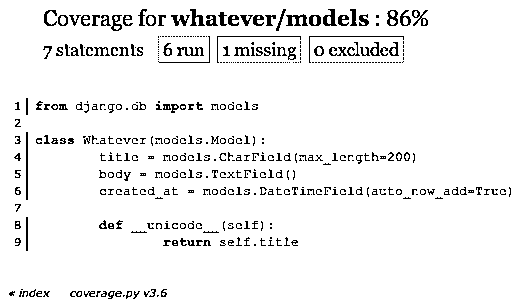
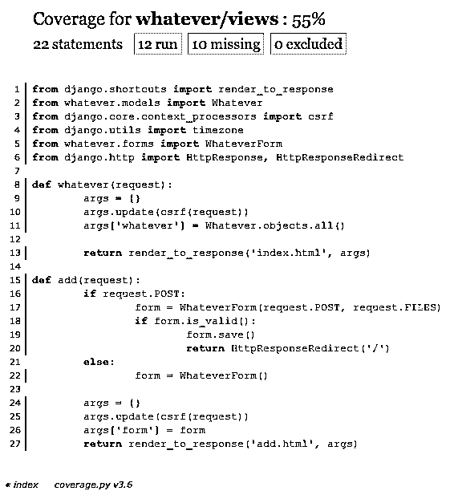

# Django 中的测试(第 1 部分)——最佳实践和例子

> 原文：<https://realpython.com/testing-in-django-part-1-best-practices-and-examples/>

测试至关重要。没有正确地测试你的代码，你将永远不知道代码是否如它应该的那样工作，无论是现在还是将来当代码库改变时。无数的时间可能被浪费在修复由代码库变更引起的问题上。更糟糕的是，您可能根本不知道有问题，直到您的最终用户抱怨它，这显然不是您想要发现代码中断的方式。

测试到位将*有助于*确保如果一个特定的函数出错，你会知道它。测试也使得[调试](https://realpython.com/python-debug-idle/)代码中断变得更加容易，节省了时间和金钱。

在过去，由于没有根据旧的代码库正确地测试新的特性，我真的丢了很多工作。不要让这种事发生在你身上。认真对待测试。你会对你的代码更有信心，你的雇主也会对你更有信心。它本质上是一份保险单。

测试有助于你构建好的代码，发现错误，写文档。

在本帖中，我们将首先看一个包括最佳实践的简介，然后看几个例子。

**免费奖励:** [点击此处获取免费的 Django 学习资源指南(PDF)](#) ，该指南向您展示了构建 Python + Django web 应用程序时要避免的技巧和窍门以及常见的陷阱。

## Django 测试简介

[*Remove ads*](/account/join/)

### 测试类型

单元测试和集成测试是两种主要的测试类型:

*   *单元测试*是测试一个特定功能的独立测试。
*   与此同时，集成测试是更大的测试，关注用户行为和测试整个应用程序。换句话说，集成测试结合了不同的代码功能，以确保它们的行为正确。

关注单元测试。写很多这样的。与集成测试相比，这些测试更容易编写和调试，您拥有的越多，您需要的集成测试就越少。单元测试应该很快。我们将研究一些加速测试的技术。

也就是说，集成测试有时仍然是必要的，即使你已经覆盖了单元测试，因为集成测试可以帮助捕捉代码[回归](http://en.wikipedia.org/wiki/Software_regression)。

通常，测试会导致成功(预期结果)、失败(意外结果)或错误。您不仅需要测试预期的结果，还需要测试代码处理意外结果的能力。

### 最佳实践

1.  如果它能断裂，就应该进行测试。这包括模型、视图、表单、模板、验证器等等。
2.  每个测试通常应该只测试一个功能。
3.  保持简单。您不希望必须在其他测试之上编写测试。
4.  无论何时从 repo 中拉出或推出代码，都要运行测试，并在进入生产环境之前运行测试。
5.  升级到 Django 的新版本时:
    *   本地升级，
    *   运行您的测试套件，
    *   修复 bug，
    *   推到回购和暂存，然后
    *   在交付代码之前，在 staging 中再次测试。

### 结构

构建适合您的项目的测试。我倾向于将每个应用程序的所有测试放在 *tests.py* 文件中，并根据我测试的内容对测试进行分组——例如，模型、视图、表单等。

您还可以完全绕过(删除)tests.py 文件，并在每个应用程序中以这种方式构建您的测试:

```py
└── app_name
    └── tests
        ├── __init__.py
        ├── test_forms.py
        ├── test_models.py
        └── test_views.py
```

最后，您可以创建一个单独的测试文件夹，它镜像整个项目结构，在每个应用程序文件夹中放置一个 *tests.py* 文件。

较大的项目应该使用后一种结构。如果你知道你的小项目最终会扩展成更大的项目，最好也使用后两种结构中的一种。我倾向于第一种和第三种结构，因为我发现为每个应用程序设计测试更容易，因为它们都可以在一个脚本中查看。

### 第三方软件包

使用以下包和库来帮助编写和运行您的测试套件:

*   django-webtest :让编写符合最终用户体验的功能测试和断言变得更加容易。将这些测试与 Selenium 测试结合起来，以全面覆盖模板和视图。
*   [覆盖率](http://nedbatchelder.com/code/coverage/):用于测量测试的有效性，显示你的代码库被测试覆盖的百分比。如果您刚刚开始设置单元测试，覆盖率可以帮助提供应该测试什么的建议。覆盖率也可以用来将测试变成一场游戏:例如，我每天都试图增加测试所覆盖的代码的百分比。
*   django-discover-runner :如果你以不同的方式组织测试，帮助定位测试(例如，在 *tests.py* 之外)。因此，如果您将测试组织到单独的文件夹中，就像上面的例子一样，您可以使用 discover-runner 来定位测试。
*   [factory_boy](https://github.com/rbarrois/factory_boy) 、[model _ mummy](https://github.com/vandersonmota/model_mommy)、 [mock](https://pypi.python.org/pypi/mock) :都是用来代替[fixture](https://docs.djangoproject.com/en/dev/howto/initial-data/)或 ORM 填充测试所需的数据。fixtures 和 ORM 都很慢，并且需要在模型改变时进行更新。

## 示例

在这个基本示例中，我们将测试:

*   模特，
*   观点，
*   表单，以及
*   API。

点击下载 Github repo [继续跟进。](https://github.com/mjhea0/testing-in-django)

[*Remove ads*](/account/join/)

### 设置

[安装覆盖范围](https://realpython.com/what-is-pip/)并将其添加到您的 INSTALLED_APPS:

```py
$ pip install coverage==3.6
```

跑步覆盖范围:

```py
$ coverage run manage.py test whatever -v 2
```

> 使用详细级别 2，`-v 2`，以获得更多详细信息。您也可以使用这个命令:`coverage run manage.py test -v 2`一次性测试您的整个 Django 项目。

构建您的报告以查看测试应该从哪里开始:

```py
$ coverage html
```

打开*django 15/html cov/index . html*查看您的报告结果。滚动到报告的底部。您可以跳过 virtualenv 文件夹中的所有行。不要测试任何内置的 Python 函数或库，因为它们已经被测试过了。您可以将 virtualenv 移出文件夹，以便在运行报告后使其更加清晰。

让我们从测试模型开始。

### 测试模型

在覆盖率报告中，单击“whatever/models”链接。您应该会看到这个屏幕:

[](https://files.realpython.com/media/testing-in-django.2ae07a4be183.png)

从本质上说，这个报告表明我们应该测试一个条目的标题。简单。

打开 *tests.py* 并添加以下代码:

```py
from django.test import TestCase
from whatever.models import Whatever
from django.utils import timezone
from django.core.urlresolvers import reverse
from whatever.forms import WhateverForm

# models test
class WhateverTest(TestCase):

    def create_whatever(self, title="only a test", body="yes, this is only a test"):
        return Whatever.objects.create(title=title, body=body, created_at=timezone.now())

    def test_whatever_creation(self):
        w = self.create_whatever()
        self.assertTrue(isinstance(w, Whatever))
        self.assertEqual(w.__unicode__(), w.title)
```

*这是怎么回事？*我们实际上创建了一个`Whatever`对象，并测试创建的标题是否与预期的标题匹配——它确实匹配。

> 注意:确保您的函数名称以`test_`开头，这不仅是一个常见的约定，也是为了让 django-discover-runner 能够定位测试。此外，为您添加到模型中的所有方法编写测试。

重新运行覆盖率:

```py
$ coverage run manage.py test whatever -v 2
```

您应该会看到以下结果，表明测试已经通过:

```py
test_whatever_creation (whatever.tests.WhateverTest) ... ok

----------------------------------------------------------------------
Ran 1 test in 0.002s

OK
```

然后，如果您再次查看覆盖率报告，模型现在应该是 100%。

[*Remove ads*](/account/join/)

### 测试视图

测试视图有时会很困难。我通常使用单元测试来检查状态代码，使用 Selenium Webdriver 来测试 AJAX、Javascript 等。

将以下代码添加到 *tests.py* 中的 WhateverTest 类中:

```py
# views (uses reverse)

    def test_whatever_list_view(self):
        w = self.create_whatever()
        url = reverse("whatever.views.whatever")
        resp = self.client.get(url)

        self.assertEqual(resp.status_code, 200)
        self.assertIn(w.title, resp.content)
```

这里，我们从客户端获取 URL，将结果存储在变量`resp`中，然后测试我们的断言。首先，我们测试响应代码是否为 200，然后我们测试实际的响应。您应该会得到以下结果:

```py
test_whatever_creation (whatever.tests.WhateverTest) ... ok
test_whatever_list_view (whatever.tests.WhateverTest) ... ok

----------------------------------------------------------------------
Ran 2 tests in 0.052s

OK
```

再次运行您的报告。您现在应该会看到一个“whatever/views”的链接，显示以下结果:

[](https://files.realpython.com/media/testing-in-django2.ece68e602a10.png)

您也可以编写测试来确保某些东西失败。例如，如果用户需要登录来创建一个新的对象，测试将会成功，即使它实际上无法创建对象。

让我们来看一个快速硒测试:

```py
# views (uses selenium)

import unittest
from selenium import webdriver

class TestSignup(unittest.TestCase):

    def setUp(self):
        self.driver = webdriver.Firefox()

    def test_signup_fire(self):
        self.driver.get("http://localhost:8000/add/")
        self.driver.find_element_by_id('id_title').send_keys("test title")
        self.driver.find_element_by_id('id_body').send_keys("test body")
        self.driver.find_element_by_id('submit').click()
        self.assertIn("http://localhost:8000/", self.driver.current_url)

    def tearDown(self):
        self.driver.quit

if __name__ == '__main__':
    unittest.main()
```

安装 selenium:

```py
$ pip install selenium==2.33.0
```

进行测试。Firefox 应该加载(如果你安装了的话)并运行测试。然后，我们断言在提交时加载了正确的页面。您还可以检查以确保新对象已添加到数据库中。

### 测试表格

添加以下方法:

```py
def test_valid_form(self):
    w = Whatever.objects.create(title='Foo', body='Bar')
    data = {'title': w.title, 'body': w.body,}
    form = WhateverForm(data=data)
    self.assertTrue(form.is_valid())

def test_invalid_form(self):
    w = Whatever.objects.create(title='Foo', body='')
    data = {'title': w.title, 'body': w.body,}
    form = WhateverForm(data=data)
    self.assertFalse(form.is_valid())
```

注意我们是如何从 JSON 生成表单数据的。这是一个固定装置。

您现在应该已经通过了 5 项测试:

```py
test_signup_fire (whatever.tests.TestSignup) ... ok
test_invalid_form (whatever.tests.WhateverTest) ... ok
test_valid_form (whatever.tests.WhateverTest) ... ok
test_whatever_creation (whatever.tests.WhateverTest) ... ok
test_whatever_list_view (whatever.tests.WhateverTest) ... ok

----------------------------------------------------------------------
Ran 5 tests in 12.753s

OK
```

您还可以编写测试，根据表单本身的验证器来断言是否显示某个错误消息。

[*Remove ads*](/account/join/)

### 测试 API

首先，[你可以从这个网址访问 API](https://realpython.com/api-integration-in-python/):[http://localhost:8000/API/whatever/？format=json](http://localhost:8000/api/whatever/?format=json) 。这是一个简单的设置，所以测试也相当简单。

安装 lxml 和解除 xml:

```py
$ pip install lxml==3.2.3
$ pip install defusedxml==0.4.1
```

添加以下测试案例:

```py
from tastypie.test import ResourceTestCase

class EntryResourceTest(ResourceTestCase):

    def test_get_api_json(self):
        resp = self.api_client.get('/api/whatever/', format='json')
        self.assertValidJSONResponse(resp)

    def test_get_api_xml(self):
        resp = self.api_client.get('/api/whatever/', format='xml')
        self.assertValidXMLResponse(resp)
```

我们只是断言我们在每种情况下都会得到响应。

## 下次

在下一个教程中，我们将会看到一个更复杂的例子，以及使用 model _ mommy 来生成测试数据。同样，您可以从[回购](https://github.com/mjhea0/testing-in-django)中获取代码。

**免费奖励:** [点击此处获取免费的 Django 学习资源指南(PDF)](#) ，该指南向您展示了构建 Python + Django web 应用程序时要避免的技巧和窍门以及常见的陷阱。

有什么要补充的吗？请在下方留言评论。****