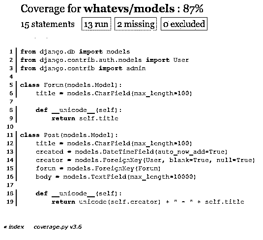

# 在 Django 测试(第二部分)-模型妈咪 vs Django 测试夹具

> 原文：<https://realpython.com/testing-in-django-part-2-model-mommy-vs-django-testing-fixtures/>

在上一篇[帖子](https://realpython.com/testing-in-django-part-1-best-practices-and-examples/)中，我向您介绍了 Django 中的测试，我们讨论了最佳实践和一些例子。这一次，我将向您展示一个更复杂的例子，并向您介绍用于创建样本数据的[模型妈妈](https://github.com/vandersonmota/model_mommy)。

## 你为什么要在乎？

在上一篇文章中，我说过，“[工厂男孩](https://github.com/rbarrois/factory_boy)、[模特妈咪](https://github.com/vandersonmota/model_mommy)、[模拟](https://pypi.python.org/pypi/mock)都是用来代替夹具或 ORM 来填充测试所需的数据。fixtures 和 ORM 都很慢，并且需要在模型改变时进行更新。”

总而言之，Django 测试夹具是有问题的，因为它们:

*   必须在每次模型/模式改变时更新，
*   非常非常慢。和
*   有时硬编码数据会导致您的测试在将来失败。

因此，通过使用 Model Mommy，您可以创建加载速度更快并且随着时间的推移更容易维护的装置。

[*Remove ads*](/account/join/)

## Django 测试夹具

让我们从上一篇文章中测试模型的例子开始:

```py
class WhateverTest(TestCase):

    def create_whatever(self, title="only a test", body="yes, this is only a test"):
        return Whatever.objects.create(
            title=title, body=body, created_at=timezone.now())

    def test_whatever_creation(self):
        w = self.create_whatever()
        self.assertTrue(isinstance(w, Whatever))
        self.assertEqual(w.__unicode__(), w.title)
```

这里我们简单地创建了一个`Whatever()`对象，并断言创建的标题与预期的标题相匹配。

如果您从 [repo](https://github.com/mjhea0/testing-in-django) 下载了项目，启动服务器并运行测试:

```py
$ coverage run manage.py test whatever -v 2
```

您将看到上述测试通过:

```py
test_whatever_creation (whatever.tests.WhateverTest) ... ok
```

现在，不必每次都为每个属性创建一个新的实例(无聊！)，我们可以用模型妈咪来精简流程。

## 模特妈咪

安装:

```py
$ pip install model_mommy
```

还记得我们的模特长什么样吗？

```py
class Whatever(models.Model):
    title = models.CharField(max_length=200)
    body = models.TextField()
    created_at = models.DateTimeField(auto_now_add=True)

    def __unicode__(self):
        return self.title
```

现在，我们可以用更简单的方式重写上面的测试:

```py
from model_mommy import mommy

class WhateverTestMommy(TestCase):

    def test_whatever_creation_mommy(self):
        what = mommy.make(Whatever)
        self.assertTrue(isinstance(what, Whatever))
        self.assertEqual(what.__unicode__(), what.title)
```

运行它。通过了吗？

有多简单？不需要传入参数。

## 新型号

让我们看一个更复杂的例子。

[*Remove ads*](/account/join/)

### 设置

创建新应用程序:

```py
$ python manage.py startapp whatevs
```

将 app 添加到 *settings.py* 文件中的`Installed_Apps`

创建模型:

```py
from django.db import models
from django.contrib.auth.models import User
from django.contrib import admin

class Forum(models.Model):
    title = models.CharField(max_length=100)

    def __unicode__(self):
        return self.title

class Post(models.Model):
    title = models.CharField(max_length=100)
    created = models.DateTimeField(auto_now_add=True)
    creator = models.ForeignKey(User, blank=True, null=True)
    forum = models.ForeignKey(Forum)
    body = models.TextField(max_length=10000)

    def __unicode__(self):
        return unicode(self.creator) + " - " + self.title
```

同步数据库。

我们的覆盖报告是什么样的？

[](https://files.realpython.com/media/model-mommy.1c5bb3946c6e.png)

### 测试

添加测试:

```py
from model_mommy import mommy
from django.test import TestCase
from whatevs.models import Forum, Thread

class WhateverTestMommy(TestCase):

    def test_forum_creation_mommy(self):
        new_forum = mommy.make('whatevs.Forum')
        new_thread = mommy.make('whatevs.Thread')
        self.assertTrue(isinstance(new_forum, Forum))
        self.assertTrue(isinstance(new_thread, Thread))
        self.assertEqual(new_forum.__unicode__(), new_forum.title)
        self.assertEqual(
            new_thread.__unicode__(), 
            (str(new_thread.forum) + " - " + str(new_thread.title)))
```

重新运行您的测试(应该会通过)，然后创建覆盖率报告:

```py
$ coverage run manage.py test whatevs -v 2
$ coverage html
```

## 嗯？

想尝试使用 [JSON](https://realpython.com/python-json/) 装置运行上述测试，看看如何使用 Django 测试装置设置测试吗？

我不确定下一个教程我们会有什么，所以让我知道你想看什么。抢码[这里](https://github.com/mjhea0/testing-in-django)。有问题一定要在下面评论。干杯！**