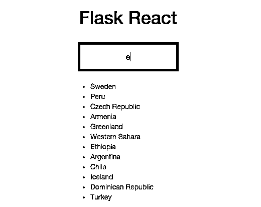

# 终极烧瓶前端

> 原文：<https://realpython.com/the-ultimate-flask-front-end/>

让我们看看小而强大的 JavaScript UI 库 [ReactJS](http://facebook.github.io/react/) 在构建一个基本的 web 应用程序时的表现。这款应用由 Python 3 和后端的[烧瓶框架](http://flask.pocoo.org/)和前端的[反应](https://facebook.github.io/react/)提供支持。另外我们会用到 [gulp.js](http://gulpjs.com/) (任务运行器) [bower](http://bower.io/) (前端包管理器) [Browserify](http://browserify.org/) (JavaScript 依赖捆绑器)。

*   **第 1 部分–入门(当前)**
*   [第 2 部分——开发动态搜索工具](/the-ultimate-flask-front-end-part-2/)

**免费奖励:** [点击此处获得免费的 Flask + Python 视频教程](https://realpython.com/bonus/discover-flask-video-tutorial/)，向您展示如何一步一步地构建 Flask web 应用程序。

*更新:*

*   05/22/2016:升级至 React 最新版本(v [15.0.1](http://facebook.github.io/react/blog/2016/04/08/react-v15.0.1.html) )。

## 反应解释

React 是一个库，不是框架。与客户端 MVC 框架不同，如 Backbone、Ember 和 AngularJS，它对您的技术堆栈没有任何假设，因此您可以轻松地将其集成到新的或遗留的代码库中。它通常用于管理应用程序 UI 的特定区域，而不是整个 UI 的 T2。

React 唯一关心的是用户界面(MVC 中的“V”)，它是由模块化视图[组件](http://facebook.github.io/react/docs/reusable-components.html)的层次结构定义的，这些组件将静态标记与动态 [JavaScript](https://realpython.com/python-vs-javascript/) 耦合在一起。如果你熟悉 Angular，这些组件类似于[指令](https://docs.angularjs.org/guide/directive)。组件使用一种称为 [JSX](http://facebook.github.io/jsx/) 的类似 XML 的语法，该语法向下转换为普通的 JavaScript。

因为组件是按层次顺序定义的，所以当状态改变时，不必重新呈现整个 DOM。取而代之的是，它使用一个[虚拟 DOM](http://facebook.github.io/react/docs/glossary.html) 来在状态改变后以惊人的速度重新渲染单个组件！

请务必阅读[入门](http://facebook.github.io/react/docs/getting-started.html)指南和优秀的[我们为什么要构建 React？](http://facebook.github.io/react/blog/2013/06/05/why-react.html)官方博客文章[反应](http://facebook.github.io/react/)文档。

[*Remove ads*](/account/join/)

## 项目设置

先说我们知道的:烧瓶。

从[库](https://github.com/realpython/ultimate-flask-front-end/releases/tag/v2.1)下载样板代码，提取文件，创建然后激活一个 virtualenv，并安装需求:

```py
$ pip install -r requirements.txt
```

最后，让我们运行应用程序，开始表演:

```py
$ sh run.sh
```

## 反应–第一轮

让我们来看看一个简单的组件。

### 组件:从静止到反应

我们将把这个 JSX 脚本添加到我们的`hello.html`中。花一分钟去看看。

```py
<script type="text/jsx"> /*** @jsx React.DOM */ var  realPython  =  React.createClass({ render:  function()  { return  (<h2>Greetings,  from  Real  Python!</h2>); } }); ReactDOM.render( React.createElement(realPython,  null), document.getElementById('content') ); </script>
```

**到底怎么回事？**

1.  我们通过调用`createClass()`创建了一个组件，然后将它分配给变量`realPython`。`React.createClass()`采用单个参数，一个对象。
2.  在这个对象中，我们添加了一个`render()`函数，它在被调用时声明性地更新 DOM。
3.  接下来是 JSX 的返回值`<h2>Greetings, from Real Python!</h2>`，它表示将被添加到 DOM 中的*实际的* HTML 元素。
4.  最后，`ReactDOM.render()`实例化`realPython`组件，并用`content`的`ID`选择器将标记注入 DOM 元素。

> 更多信息请参考[官方文件](http://facebook.github.io/react/docs/tutorial.html#jsx-syntax)。

### 转变

下一步是什么？好吧，我们需要将 JSX“转换”或转换成普通的 JavaScript。这很简单。更新*hello.html*喜欢这样:

```py
<!DOCTYPE html>
<html>
  <head lang="en">
    <meta charset="UTF-8">
    <title>Flask React</title>
    <meta name="viewport" content="width=device-width, initial-scale=1.0">
    <!-- styles -->
  </head>
  <body>
    <div class="container">
      <h1>Flask React</h1>
      <br>
      <div id="content"></div>
    </div>
    <!-- scripts -->
    <script src="https://cdnjs.cloudflare.com/ajax/libs/react/15.1.0/react.min.js"></script>
    <script src="https://cdnjs.cloudflare.com/ajax/libs/react/15.1.0/react-dom.min.js"></script>
    <script src="http://cdnjs.cloudflare.com/ajax/libs/react/0.13.3/JSXTransformer.js"></script>
    <script type="text/jsx"> /*** @jsx React.DOM */ var  realPython  =  React.createClass({ render:  function()  { return  (<h2>Greetings,  from  Real  Python!</h2>); } }); ReactDOM.render( React.createElement(realPython,  null), document.getElementById('content') ); </script>
  </body>
</html>
```

在这里，我们将`helloWorld`组件和以下脚本一起添加到模板中

```py
<script src="https://cdnjs.cloudflare.com/ajax/libs/react/15.1.0/react.min.js"></script>
<script src="https://cdnjs.cloudflare.com/ajax/libs/react/15.1.0/react-dom.min.js"></script>
<script src="http://cdnjs.cloudflare.com/ajax/libs/react/0.13.3/JSXTransformer.js"></script>
```

-后者，`JSXTransformer.js`，用`type="text/jsx"`搜索`<script>`标签，然后在浏览器中将 JSX 语法“转换”成普通的 JavaScript。*请注意，该工具[已弃用](https://facebook.github.io/react/blog/2015/06/12/deprecating-jstransform-and-react-tools.html#jsxtransformer)，并已被我们稍后将设置的 [Browserify](http://browserify.org/) 所取代。*

> 注意我们没有添加 jQuery，因为它是 React 所需要的**而不是**。

就是这样。运行 Flask development server 并在浏览器中查看结果，网址为[http://localhost:5000/hello](http://localhost:5000/hello)。

[](https://files.realpython.com/media/flask-react-dynamic-search.1575d97d167e.png)[*Remove ads*](/account/join/)

## 鲍尔

不要使用 CDN 中预先构建的 JavaScript 文件，让我们使用 [bower](http://bower.io/) 来更好地( [IMHO](http://htmlcheats.com/cdn-2/6-reasons-use-cdn/) ) [管理这些依赖关系](https://realpython.com/courses/managing-python-dependencies/)。Bower 是一个强大的前端依赖包管理器——即 jQuery、Bootstrap、React、Angular、Backbone。

> 在继续之前，确保您已经安装了[节点和 npm](http://nodejs.org/download/) 。

### 初始化

安装带 npm 的 bower:

```py
$ npm install -g bower
```

npm 是另一个用来管理节点模块的包管理器。与 PyPI/pip 不同，npm 的默认行为是在本地级别安装依赖项。标志用于覆盖全局安装 bower 的行为，因为您可能会在许多项目中使用 bower。

### 鲍尔森*

Bower 使用一个名为 *bower.json* 的文件来定义项目依赖关系，这类似于一个 *requirements.txt* 文件。运行以下命令以交互方式创建该文件:

```py
$ bower init
```

暂时接受默认值。一旦完成，您的 *bower.json* 文件应该看起来像这样:

```py
{ "name":  "ultimate-flask-front-end", "homepage":  "https://github.com/realpython/ultimate-flask-front-end", "authors":  [ "Michael Herman michael@realpython.com" ], "description":  "", "main":  "", "license":  "MIT", "ignore":  [ "**/.*", "node_modules", "bower_components", "test", "tests" ] }
```

> 关于 *bower.json* 和`init`命令的更多信息，请查看官方[文档](http://bower.io/docs/creating-packages/#bowerjson)。

### npm

像 *bower.json* 文件一样，npm 利用一个类似的文件，名为 *package.json* 来定义特定于项目的依赖关系。您也可以交互式地创建它:

```py
$ npm init
```

再次接受默认值:

```py
{ "name":  "ultimate-flask-front-end", "version":  "1.0.0", "description":  "", "main":  "index.js", "scripts":  { "test":  "echo \"Error: no test specified\" && exit 1" }, "repository":  { "type":  "git", "url":  "git+https://github.com/realpython/ultimate-flask-front-end.git" }, "author":  "", "license":  "ISC", "bugs":  { "url":  "https://github.com/realpython/ultimate-flask-front-end/issues" }, "homepage":  "https://github.com/realpython/ultimate-flask-front-end#readme" }
```

现在，让我们将 bower 添加到 npm 依赖文件中:

```py
$ npm install --save-dev bower
```

[*Remove ads*](/account/join/)

### 配置

和 *bower.json* 文件一起，我们可以在一个名为*的文件中定义[配置设置](http://bower.io/docs/config/)。鲍尔维奇*。现在在项目根目录下创建文件。您的项目结构现在应该如下所示:

```py
├── .bowerrc
├── .gitignore
├── bower.json
├── package.json
├── project
│   ├── app.py
│   ├── static
│   │   └── css
│   │       └── style.css
│   └── templates
│       ├── hello.html
│       └── index.html
├── requirements.txt
└── run.sh
```

bower 的标准行为是在项目根目录下名为“bower_components”的目录中安装包。我们需要覆盖这个行为，因为 Flask 需要访问静态目录中的包。因此，将以下 JSON 添加到文件中，以便 bower 自动将文件安装到正确的目录中:

```py
{ "directory":  "./project/static/bower_components" }
```

### 安装

让我们安装 Bootstrap 和 React。这可以通过两种方式之一实现:

1.  对每个包运行`bower install <package_name> --save`(`--save`标志将依赖项(名称和版本)添加到 *bower.json* 文件中。).
2.  用每个依赖项(同样是名称和版本)直接更新 *bower.json* 文件，然后运行`bower install`从该文件安装所有依赖项。

因为我们(呃， *I* )已经知道了版本，所以让我们使用第二种方法。更新 *bower.json* 文件如下:

```py
{ "name":  "ultimate-flask-front-end", "homepage":  "https://github.com/realpython/ultimate-flask-front-end", "authors":  [ "Michael Herman michael@realpython.com" ], "description":  "", "main":  "", "license":  "MIT", "ignore":  [ "**/.*", "node_modules", "bower_components", "test", "tests" ], "dependencies":  { "bootstrap":  "^3.3.6", "react":  "^15.1.0" } }
```

然后运行`bower install`:

```py
$ bower install
bower cached        https://github.com/twbs/bootstrap.git#3.3.6
bower validate      3.3.6 against https://github.com/twbs/bootstrap.git#^3.3.6
bower cached        https://github.com/facebook/react-bower.git#15.1.0
bower validate      15.1.0 against https://github.com/facebook/react-bower.git#^15.1.0
bower cached        https://github.com/jquery/jquery-dist.git#2.2.4
bower validate      2.2.4 against https://github.com/jquery/jquery-dist.git#1.9.1 - 2
bower install       react#15.1.0
bower install       bootstrap#3.3.6
bower install       jquery#2.2.4

react#15.1.0 project/static/bower_components/react

bootstrap#3.3.6 project/static/bower_components/bootstrap
└── jquery#2.2.4

jquery#2.2.4 project/static/bower_components/jquery
```

您现在应该看到“project/static/bower _ components”目录。

现在，在克隆了 [repo](https://github.com/realpython/ultimate-flask-front-end) 之后，您可以使用 pip、npm 和 bower 获取所有必需的依赖项:

```py
$ pip install -r requirements.txt
$ npm install
$ bower install
```

### 测试

更新*hello.html*中的 React 脚本:

```py
 <script src="{{ url_for('static', filename='bower_components/react/react.min.js') }}"></script>
    <script src="{{ url_for('static', filename='bower_components/react/react-dom.min.js') }}"></script>
```

测试应用程序，以确保它仍然工作。

## 接下来的步骤

设置好工具后，我们将在第二部分的[中回过头来反应并开发一个更健壮的应用程序。如果您想了解如何从头开始设置一个完整的 Python + Flask web 应用程序，请务必观看此视频系列:](/the-ultimate-flask-front-end-part-2/)

**免费奖励:** [点击此处获得免费的 Flask + Python 视频教程](https://realpython.com/bonus/discover-flask-video-tutorial/)，向您展示如何一步一步地构建 Flask web 应用程序。***