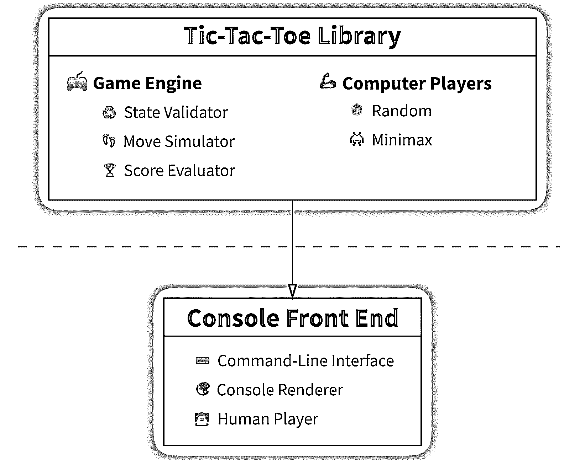

# 用 Python 中的 AI 播放器构建井字游戏引擎

> 原文：<https://realpython.com/tic-tac-toe-ai-python/>

当你还是个孩子的时候，你会学着玩井字游戏，有些人称之为十字游戏。直到你进入青少年时期，这个游戏仍然充满乐趣和挑战。然后，你学习编程，发现为这个双人游戏的虚拟版本编码的乐趣。作为一个成年人，你可能仍然会欣赏用 Python 创造一个拥有**人工智能(AI)** 的对手的游戏的简单性。

通过完成这个详细的一步一步的冒险，你将建立一个可扩展的**游戏引擎**和一个**无与伦比的电脑玩家**，它使用**最小最大算法**来玩井字游戏。一路上，您将深入了解不可变的类设计、通用插件架构和现代 Python 代码实践和模式。

**在本教程中，您将学习如何:**

*   用井字游戏引擎创建一个可重用的 Python 库
*   遵循 Pythonic 代码风格对井字游戏的**域**进行建模
*   实现人工播放器，包括一个基于 **minimax 算法**的播放器
*   为有人类玩家的游戏构建一个基于文本的**控制台前端**
*   探索**性能优化的策略**

单击下面的链接下载该项目的完整源代码:

**源代码:** [点击此处下载免费源代码](https://realpython.com/bonus/tic-tac-toe-ai-python-code/)，您将使用它用 Python 构建井字游戏引擎和 AI 播放器。

## 演示:Python 中的井字游戏 AI 播放器

在本教程结束时，你将拥有一个高度可重用和可扩展的 **Python 库**，以及一个用于井字游戏的抽象[游戏引擎](https://realpython.com/top-python-game-engines/)。它将封装通用游戏规则和计算机玩家，包括一个由于基本人工智能支持而永远不会输的游戏。此外，您将创建一个示例**控制台前端**，它构建在您的库之上，并实现一个在终端上运行的基于文本的交互式井字游戏。

这是两个玩家之间的真实游戏:

[https://player.vimeo.com/video/747651381?background=1](https://player.vimeo.com/video/747651381?background=1)

<figcaption class="figure-caption text-center">Console Front End</figcaption>

一般来说，你可以从人类玩家、随机移动的虚拟电脑玩家和坚持最优策略的智能电脑玩家中混合选择玩家。您还可以指定哪个玩家应该先走一步，增加他们获胜或平手的机会。

稍后，你将能够为不同的平台改编你的通用井字游戏库，比如一个**窗口桌面环境**或者一个**网络浏览器**。虽然在本教程中您将只遵循构建控制台应用程序的说明，但是您可以在支持材料中找到 [Tkinter](https://realpython.com/python-gui-tkinter/) 和 [PyScript](https://realpython.com/pyscript-python-in-browser/) 前端示例。

**注意:**这些前端不在这里讨论，因为实现它们需要相当熟悉 Python 中的[线程](https://realpython.com/intro-to-python-threading/)、 [asyncio](https://realpython.com/async-io-python/) 和[队列](https://realpython.com/queue-in-python/)，这超出了本教程的范围。但是您可以自己随意研究和使用示例代码。

Tkinter 前端是同一款游戏的精简版本，在另一个单独的教程中有所描述，该教程仅作为桌面环境中的库演示:

[https://player.vimeo.com/video/747651753?background=1](https://player.vimeo.com/video/747651753?background=1)

<figcaption class="figure-caption text-center">Tkinter Front End</figcaption>

与原版不同的是，它看起来不那么流畅，也不允许你轻松重启游戏。然而，它增加了与电脑或其他玩家对战的选项。

PyScript 前端允许您或您的朋友在 web 浏览器中玩游戏，即使他们的计算机上没有安装 [Python，这是一个显著的优势:](https://realpython.com/installing-python/)

[https://player.vimeo.com/video/747651357?background=1](https://player.vimeo.com/video/747651357?background=1)

<figcaption class="figure-caption text-center">PyScript Front End</figcaption>

如果你富有冒险精神，并且知道一点 PyScript 或 JavaScript，那么你可以通过增加与另一个玩家在线游戏的能力来扩展这个前端。为了方便通信，您需要使用 [WebSocket](https://en.wikipedia.org/wiki/WebSocket) 协议实现一个远程 web 服务器。看一看另一个教程中的一个工作中的 [WebSocket 客户端和服务器示例](https://realpython.com/python-xml-parser/#bind-xml-data-to-python-objects),了解一下它是如何工作的。

值得注意的是，本节演示的三个前端中的每一个都只是为同一个 Python 库实现了不同的**表示层**，它提供了底层的游戏逻辑和玩家。由于清晰的[关注点分离](https://en.wikipedia.org/wiki/Separation_of_concerns)和您将在本教程中实践的其他编程原则，它们之间没有不必要的冗余或代码重复。

[*Remove ads*](/account/join/)

## 项目概述

您将要构建的项目由两个高级组件组成，如下图所示:

[](https://files.realpython.com/media/diagram.4802afdb24e3.png)

<figcaption class="figure-caption text-center">Tic-Tac-Toe Architecture Diagram</figcaption>

第一个组件是一个抽象的井字游戏 Python 库，它不知道以图形形式向用户呈现游戏的可能方式。而是包含了游戏的核心逻辑和两个人造玩家。然而，该库不能独立存在，所以您还将创建一个示例前端来收集来自键盘的用户输入，并使用纯文本在控制台中可视化游戏。

您将从实现井字游戏库的底层细节开始，然后使用这些细节以自下而上的方式实现更高级别的游戏前端。完成本教程后，完整的文件结构将如下所示:

```py
tic-tac-toe/
│
├── frontends/
│   │
│   └── console/
│       ├── __init__.py
│       ├── __main__.py
│       ├── args.py
│       ├── cli.py
│       ├── players.py
│       └── renderers.py
│
└── library/
    │
    ├── src/
    │   │
    │   └── tic_tac_toe/
    │       │
    │       ├── game/
    │       │   ├── __init__.py
    │       │   ├── engine.py
    │       │   ├── players.py
    │       │   └── renderers.py
    │       │
    │       ├── logic/
    │       │   ├── __init__.py
    │       │   ├── exceptions.py
    │       │   ├── minimax.py
    │       │   ├── models.py
    │       │   └── validators.py
    │       │
    │       └── __init__.py
    │
    └── pyproject.toml
```

`frontends/`文件夹是为了存放一个或多个具体的游戏实现，比如你的基于文本的控制台，而`library/`是游戏库的主文件夹。您可以将这两个顶层文件夹视为相关但独立的项目。

注意，您的控制台前端包含了`__main__.py`文件，使它成为一个[可运行的 Python 包](https://docs.python.org/3/library/__main__.html#main-py-in-python-packages)，您将能够使用 Python 的`-m`选项从命令行调用它。假设您在下载了本教程中将要编写的完整源代码后，将当前工作目录更改为`frontends/`，您可以使用以下命令启动游戏:

```py
(venv) $ python -m console
```

记住 Python 必须能够在模块搜索路径上找到你的前端所依赖的井字库。确保这一点的最佳实践是创建并激活一个共享的[虚拟环境](https://realpython.com/python-virtual-environments-a-primer/)，并安装带有 [`pip`](https://realpython.com/what-is-pip/) 的库。您可以在支持材料的自述文件中找到有关如何操作的详细说明。

井字游戏库是一个名为`tic_tac_toe`的 Python 包，由两个子包组成:

1.  `tic_tac_toe.game`:设计成前端可延伸的脚手架
2.  `tic_tac_toe.logic`:井字游戏的积木

您将很快深入了解每一个问题。 [`pyproject.toml`](https://realpython.com/pypi-publish-python-package/) 文件包含构建和打包库所需的元数据。要将下载的库或您将在本教程中构建的完成代码安装到活动的虚拟环境中，请尝试以下命令:

```py
(venv) $ python -m pip install --editable library/
```

在开发过程中，您可以使用带有`-e`或`--editable`标志的`pip`来挂载库的源代码，而不是在您的虚拟环境中构建的包，从而制作一个[可编辑安装](https://setuptools.pypa.io/en/latest/userguide/development_mode.html)。这将避免您在对库进行更改以在前端反映这些更改后必须重复安装。

好吧，那就是你要建的！但是在开始之前，请检查一下先决条件。

## 先决条件

这是一个高级教程，涉及广泛的 Python 概念，为了顺利地继续学习，您应该熟悉这些概念。请使用以下资源来熟悉或回忆一些重要的主题:

*   [面向对象编程](https://realpython.com/python3-object-oriented-programming/)
*   [遗传与构成](https://realpython.com/inheritance-composition-python/)
*   [抽象类](https://realpython.com/python-interface/)
*   [数据类别](https://realpython.com/python-data-classes/)
*   [键入提示](https://realpython.com/python-type-checking/)
*   [正则表达式](https://realpython.com/regex-python/)
*   [缓存](https://realpython.com/lru-cache-python/)
*   [递归](https://realpython.com/python-recursion/)

您将要构建的项目完全依赖于 Python 的**标准库**，没有外部依赖性。也就是说，你至少需要 [Python 3.10](https://realpython.com/python310-new-features/) 或更高版本来利用本教程中的最新语法和特性。如果你目前使用的是旧的 Python 版本，那么你可以用`pyenv` 或[安装并](https://realpython.com/python-versions-docker/)[管理多个 Python 版本，在 Docker](https://realpython.com/intro-to-pyenv/) 中尝试最新的 Python 版本。

最后，你应该知道你将要实现的游戏规则。经典的[井字游戏](https://en.wikipedia.org/wiki/Tic-tac-toe)是在一个三乘三的格子或方块上进行的，每个玩家在一个空格子中放置他们的标记，一个 X 或一个 O。第一个将三个标记水平、垂直或对角排成一行的玩家赢得游戏。

[*Remove ads*](/account/join/)

## 步骤 1:模拟井字游戏领域

在这一步中，您将识别组成井字游戏的各个部分，并使用面向对象的方法来实现它们。通过用**不可变对象**对游戏的[域](https://en.wikipedia.org/wiki/Domain_(software_engineering))建模，你将得到模块化的可组合代码，这些代码更容易测试、维护、调试和推理，还有其他一些优点。

首先，打开您选择的[代码编辑器](https://realpython.com/python-ides-code-editors-guide/)，例如 [Visual Studio 代码](https://realpython.com/python-development-visual-studio-code/)或 [PyCharm](https://realpython.com/pycharm-guide/) ，并创建一个名为`tic-tac-toe`的新项目，它也将成为您的项目文件夹的名称。如今，大多数代码编辑器会给你自动为你的项目创建一个**虚拟环境**的选项，所以继续吧，照着做。如果您的没有，那么从命令行手动创建虚拟环境:

```py
$ cd tic-tac-toe/
$ python3 -m venv venv/
```

这将在`tic-tac-toe/`下创建一个名为`venv/`的文件夹。除非您计划继续在当前命令行会话中工作，否则不必激活新的虚拟环境。

接下来，在新项目中搭建文件和文件夹的基本结构，记住在`src/`子文件夹中的 Python 包中使用下划线(`_`)而不是破折号(`-`):

```py
tic-tac-toe/
│
├── frontends/
│   │
│   └── console/
│       ├── __init__.py
│       └── __main__.py
│
└── library/
    │
    ├── src/
    │   │
    │   └── tic_tac_toe/
    │       │
    │       ├── game/
    │       │   └── __init__.py
    │       │
    │       ├── logic/
    │       │   └── __init__.py
    │       │
    │       └── __init__.py
    │
    └── pyproject.toml
```

此时，上面文件树中的所有文件都应该是空的。在学习本教程的过程中，您将陆续用内容填充它们，并添加更多的文件。首先编辑位于`src/`子文件夹旁边的`pyproject.toml`文件。您可以将这个相当简单的井字游戏库打包配置粘贴到其中:

```py
# pyproject.toml [build-system] requires  =  ["setuptools>=64.0.0",  "wheel"] build-backend  =  "setuptools.build_meta" [project] name  =  "tic-tac-toe" version  =  "1.0.0"
```

您指定所需的构建工具，Python 将在必要时下载并安装这些工具，以及项目的一些元数据。将`pyproject.toml`文件添加到库中可以让您将它作为 [Python 包](https://realpython.com/python-modules-packages/)构建并安装到您的活动虚拟环境中。

**注意:**`pyproject.toml`文件是一个标准的配置文件，使用 [TOML](https://realpython.com/python-toml/) 格式来指定 Python 项目的最低构建系统需求。这个概念是在 PEP 518 中引入的，现在是在 Python 中添加打包元数据和配置的推荐方式。您将需要它来将井字游戏库安装到您的虚拟环境中。

打开终端窗口，发出以下命令激活您的虚拟环境(如果您还没有激活)，并使用可编辑模式安装井字游戏库:

```py
$ source venv/bin/activate
(venv) $ python -m pip install --editable library/
```

即使你的库中还没有 Python 代码，现在用`--editable`标志安装它将允许 Python 解释器导入你将直接从你的项目中添加的函数和类。否则，每当您对源代码进行更改并想要测试它时，您都必须记得再次构建并安装库到您的虚拟环境中。

现在您已经有了项目的总体结构，您可以开始实现一些代码了。到这一步结束时，您将拥有井字游戏的所有必要部分，包括游戏逻辑和状态验证，因此您将准备好将它们组合到一个抽象的游戏引擎中。

### 列举玩家的分数

游戏开始时，每位井字游戏玩家都会被分配到两个符号中的一个，要么是**十字(X)** 要么是**零(O)** ，他们用这些符号来标记游戏板上的位置。因为只有两个符号属于一组固定的离散值，所以可以在[枚举类型](https://en.wikipedia.org/wiki/Enumerated_type)或[枚举](https://realpython.com/python-enum/)中定义它们。使用枚举比[常量](https://realpython.com/python-constants/)更可取，因为它们具有增强的类型安全性、公共命名空间和对其成员的编程访问。

在`tic_tac_toe.logic`包中创建一个名为`models`的新 Python 模块:

```py
tic-tac-toe/
│
└── library/
    │
    ├── src/
    │   │
    │   └── tic_tac_toe/
    │       │
    │       ├── game/
    │       │   └── __init__.py
    │       │
    │       ├── logic/
    │       │   ├── __init__.py
 │       │   └── models.py    │       │
    │       └── __init__.py
    │
    └── pyproject.toml
```

在本步骤的剩余部分，您将使用这个文件来定义井字游戏[域模型](https://en.wikipedia.org/wiki/Domain_model)对象。

现在，从 Python 的标准库中导入 [`enum`](https://docs.python.org/3/library/enum.html#module-enum) 模块，并在您的模型中定义一个新的数据类型:

```py
# tic_tac_toe/logic/models.py

import enum

class Mark(enum.Enum):
    CROSS = "X"
    NAUGHT = "O"
```

`Mark`类的两个[单例](https://en.wikipedia.org/wiki/Singleton_pattern)实例，枚举成员`Mark.CROSS`和`Mark.NAUGHT`，代表玩家的符号。默认情况下，不能将 Python 枚举的成员与其值进行比较。例如，比较`Mark.CROSS == "X"`会得到`False`。这是为了避免混淆在不同地方定义的相同值和不相关的语义。

然而，有时根据字符串而不是枚举成员来考虑玩家标记可能更方便。为了实现这一点，将`Mark`定义为`str`和`enum.Enum`类型的 [mixin 类](https://realpython.com/inheritance-composition-python/#mixing-features-with-mixin-classes):

```py
# tic_tac_toe/logic/models.py

import enum

class Mark(str, enum.Enum):
    CROSS = "X"
    NAUGHT = "O"
```

这被称为[派生枚举](https://docs.python.org/3/library/enum.html#derived-enumerations)，其成员可以与混合类型的实例进行比较。在这种情况下，您现在可以将`Mark.NAUGHT`和`Mark.CROSS`与字符串值进行比较。

**注意:**在撰写本教程时，Python 3.10 是最新的版本，但是如果您正在使用更新的版本，那么您可以直接扩展 [`enum.StrEnum`](https://docs.python.org/3.11/library/enum.html#enum.StrEnum) ，它被添加到 Python 3.11 的标准库中:

```py
import enum

class Mark(enum.StrEnum):
    CROSS = "X"
    NAUGHT = "O"
```

`enum.StrEnum`的成员也是字符串，这意味着你可以在任何需要常规字符串的地方使用它们。

一旦你给第一个玩家分配了一个给定的标记，第二个玩家必须被分配唯一剩下的未分配的标记。因为枚举是被美化的类，你可以自由地将普通的方法和[属性](https://realpython.com/python-property/)放入其中。例如，您可以定义一个将返回另一个成员的`Mark`成员的属性:

```py
# tic_tac_toe/logic/models.py

import enum

class Mark(str, enum.Enum):
    CROSS = "X"
    NAUGHT = "O"

 @property def other(self) -> "Mark": return Mark.CROSS if self is Mark.NAUGHT else Mark.NAUGHT
```

属性的主体是一行代码，它使用一个条件表达式来确定正确的标记。您的酒店签名中的[返回类型](https://en.wikipedia.org/wiki/Return_type)周围的引号是强制的，以进行[向前声明](https://en.wikipedia.org/wiki/Forward_declaration)，并避免由于未解析的名称而导致的错误。毕竟你声称返回一个`Mark`，这个还没有完全定义。

**注意:**或者，您可以[将注释](https://peps.python.org/pep-0563/)的评估推迟到它们被定义之后:

```py
# tic_tac_toe/logic/models.py

from __future__ import annotations 
import enum

class Mark(str, enum.Enum):
    CROSS = "X"
    NAUGHT = "O"

    @property
 def other(self) -> Mark:        return Mark.CROSS if self is Mark.NAUGHT else Mark.NAUGHT
```

添加一个特殊的`__future__`导入，它必须出现在文件的开头，启用类型提示的惰性计算。稍后您将使用这种模式来避免导入交叉引用模块时的[循环引用](https://en.wikipedia.org/wiki/Circular_reference)问题。

在 Python 3.11 中，你也可以使用一个通用的 [`typing.Self`](https://realpython.com/python311-tomllib/#self-type) 类型来避免类型提示中的前向声明。

为了展示一些使用`Mark`枚举的实际例子，展开下面的可折叠部分:


在继续之前，请确保在模块搜索路径上可以访问该库，例如，将其安装到活动的虚拟环境中，如前面的[项目概述](#project-overview)中所示:

>>>

```py
>>> from tic_tac_toe.logic.models import Mark

>>> # Refer to a mark by its symbolic name literal
>>> Mark.CROSS
<Mark.CROSS: 'X'>
>>> Mark.NAUGHT
<Mark.NAUGHT: 'O'>

>>> # Refer to a mark by its symbolic name (string)
>>> Mark["CROSS"]
<Mark.CROSS: 'X'>
>>> Mark["NAUGHT"]
<Mark.NAUGHT: 'O'>

>>> # Refer to a mark by its value
>>> Mark("X")
<Mark.CROSS: 'X'>
>>> Mark("O")
<Mark.NAUGHT: 'O'>

>>> # Get the other mark
>>> Mark("X").other
<Mark.NAUGHT: 'O'>
>>> Mark("O").other
<Mark.CROSS: 'X'>

>>> # Get a mark's name
>>> Mark("X").name
'CROSS'

>>> # Get a mark's value
>>> Mark("X").value
'X'

>>> # Compare a mark to a string
>>> Mark("X") == "X"
True
>>> Mark("X") == "O"
False

>>> # Use the mark as if it was a string
>>> isinstance(Mark.CROSS, str)
True
>>> Mark.CROSS.lower()
'x'

>>> # Iterate over the available marks
>>> for mark in Mark:
...     print(mark)
...
Mark.CROSS
Mark.NAUGHT
```

在本教程的后面，您将使用其中的一些技术。

您现在有一种方法来表示玩家将在棋盘上留下的可用标记，以推进游戏。接下来，您将实现一个抽象的游戏板，并为这些标记定义好位置。

[*Remove ads*](/account/join/)

### 代表单元格的正方形网格

虽然有些人用不同的人数或不同大小的格子玩井字游戏，但你会坚持最基本和最经典的规则。回想一下，在经典的井字游戏中，游戏的棋盘是由一个 3×3 的单元格网格表示的。每个单元格可以是空的，也可以标有叉号或零号。

因为您用单个字符表示标记，所以您可以使用与单元格对应的一串精确的九个字符**来实现网格。单元格可以是空的，在这种情况下，您可以用空格字符(`" "`)填充它，或者它可以包含玩家的标记。在本教程中，您将通过从上到下连接行来按照[行主顺序](https://en.wikipedia.org/wiki/Row-_and_column-major_order)存储网格。*

*例如，用这样的表示法，你可以用下面的字符串来表达在之前演示的[三个游戏:](#demo-tic-tac-toe-ai-player-in-python)

*   `"XXOXO O "`
*   `"OXXXXOOOX"`
*   `"OOOXXOXX "`

为了更好地可视化它们，您可以在一个交互式 Python 解释器会话中快速启动并运行这个简短的函数:

>>>

```py
>>> def preview(cells):
...     print(cells[:3], cells[3:6], cells[6:], sep="\n")

>>> preview("XXOXO O  ")
XXO
XO
O

>>> preview("OXXXXOOOX")
OXX
XXO
OOX

>>> preview("OOOXXOXX ")
OOO
XXO
XX
```

该函数将一串单元格作为参数，并以用[切片操作符](https://realpython.com/python-strings/#string-slicing)从输入字符串中分割出的三个独立行的形式打印到屏幕上。

虽然使用字符串来表示单元格网格非常简单，但在验证其形状和内容方面却有所欠缺。除此之外，普通字符串不能提供您可能感兴趣的额外的、特定于网格的属性。出于这些原因，您将在包装在属性中的字符串之上创建一个新的`Grid`数据类型:

```py
# tic_tac_toe/logic/models.py

import enum
from dataclasses import dataclass 
# ...

@dataclass(frozen=True) class Grid:
 cells: str = " " * 9
```

您将`Grid`定义为一个[冻结数据类](https://realpython.com/python-data-classes/#immutable-data-classes)，使其实例不可变，这样一旦您创建了一个网格对象，您就不能改变它的单元格。起初这听起来可能有局限性，而且很浪费，因为您将被迫创建许多`Grid`类的实例，而不仅仅是重用一个对象。然而，不可变对象的[好处，包括容错和提高代码可读性，远远超过了现代计算机的成本。](https://hackernoon.com/5-benefits-of-immutable-objects-worth-considering-for-your-next-project-f98e7e85b6ac)

默认情况下，当您没有为`.cells`属性指定任何值时，它会假设一个正好有九个空格的字符串来反映一个**空网格**。但是，您仍然可以用错误的单元格值初始化网格，最终导致程序崩溃。您可以通过允许您的对象仅在处于有效状态时存在来防止这种情况。否则，按照[快速失效](https://en.wikipedia.org/wiki/Fail-fast)和[永远有效的域模型](https://enterprisecraftsmanship.com/posts/always-valid-domain-model/)原则，它们根本不会被创建。

数据类控制对象初始化，但是它们也允许你运行一个[后初始化钩子](https://docs.python.org/3/library/dataclasses.html#post-init-processing)来设置派生属性，例如基于其他字段的值。您将利用这种机制来执行**单元格验证**，并在实例化网格对象之前潜在地丢弃无效字符串:

```py
# tic_tac_toe/logic/models.py

import enum
import re from dataclasses import dataclass

# ...

@dataclass(frozen=True)
class Grid:
    cells: str = " " * 9

 def __post_init__(self) -> None: if not re.match(r"^[\sXO]{9}$", self.cells): raise ValueError("Must contain 9 cells of: X, O, or space")
```

您的特殊的`.__post_init__()`方法使用一个[正则表达式](https://realpython.com/regex-python/)来检查`.cells`属性的给定值是否正好是九个字符长，并且只包含预期的字符——即`"X"`、`"O"`或`" "`。还有其他方法来验证字符串，但是正则表达式非常简洁，并且将与您稍后添加的验证规则保持一致。

**注:**网格只负责验证一串单元格的语法正确性，并不理解游戏的更高层规则。一旦获得了额外的上下文，您将在其他地方实现特定单元格组合语义的验证。

此时，您可以向您的`Grid`类添加一些**额外属性**，这将在确定游戏状态时变得很方便:

```py
# tic_tac_toe/logic/models.py

import enum
import re
from dataclasses import dataclass
from functools import cached_property 
# ...

@dataclass(frozen=True)
class Grid:
    cells: str = " " * 9

    def __post_init__(self) -> None:
        if not re.match(r"^[\sXO]{9}$", self.cells):
            raise ValueError("Must contain 9 cells of: X, O, or space")

 @cached_property def x_count(self) -> int: return self.cells.count("X") 
 @cached_property def o_count(self) -> int: return self.cells.count("O") 
 @cached_property def empty_count(self) -> int: return self.cells.count(" ")
```

这三个属性分别返回交叉、空和空单元格的当前数量。因为你的数据类是不可变的，它的状态永远不会改变，所以你可以在来自`functools`模块的`@cached_property`装饰器的帮助下[缓存计算出的属性值](https://realpython.com/python-property/#caching-computed-attributes)。这将确保它们的代码最多运行一次，无论您访问这些属性多少次，例如在验证期间。

为了展示一些使用`Grid`类的实际例子，展开下面的可折叠部分:


在继续之前，请确保在模块搜索路径上可以访问该库，例如，将其安装到活动的虚拟环境中，如前面的[项目概述](#project-overview)中所示:

>>>

```py
>>> from tic_tac_toe.logic.models import Grid

>>> # Create an empty grid
>>> Grid()
Grid(cells='         ')

>>> # Create a grid of a particular cell combination
>>> Grid("XXOXO O  ")
Grid(cells='XXOXO O  ')

>>> # Don't create a grid with too few cells
>>> Grid("XO")
Traceback (most recent call last):
  ...
ValueError: Must contain 9 cells of: X, O, or space

>>> # Don't create a grid with invalid characters
>>> Grid("XXOxO O  ")
Traceback (most recent call last):
  ...
ValueError: Must contain 9 cells of: X, O, or space

>>> # Get the count of Xs, Os, and empty cells
>>> grid = Grid("OXXXXOOOX")
>>> grid.x_count
5
>>> grid.o_count
4
>>> grid.empty_count
0
```

现在你知道如何使用`Grid`类了。

使用 Python 代码，您模拟了一个 3×3 的单元格网格，其中可以包含玩家标记的特定组合。现在，是时候对玩家的移动进行建模，以便人工智能可以评估和选择最佳选项。

[*Remove ads*](/account/join/)

### 拍摄玩家移动的快照

代表玩家在井字游戏中移动的对象应该主要回答以下两个问题:

1.  **玩家标记:**玩家放置了什么标记？
2.  **Mark 的位置:**放在哪里？

然而，为了有一个完整的画面，一个人还必须在行动之前了解游戏的**状态。毕竟，这可能是一个好的或坏的举措，取决于当前的情况。你可能还会发现手边有游戏的结果状态很方便，这样你就可以给它打分了。通过**模拟那个动作**，你将能够把它与其他可能的动作进行比较。**

**注意:**如果不知道游戏的一些细节，比如起始玩家的标记，移动对象就不能验证自己，因为它不知道这些细节。在负责管理游戏状态的类中，您将检查给定的移动是否有效，并验证特定的网格单元组合。

基于这些想法，您可以向您的模型添加另一个不可变的数据类:

```py
# tic_tac_toe/logic/models.py

# ...

class Mark(str, enum.Enum):
    ...

@dataclass(frozen=True)
class Grid:
    ...

@dataclass(frozen=True) class Move:
 mark: Mark cell_index: int before_state: "GameState" after_state: "GameState"
```

暂时请忽略`GameState`类的两个前向声明。在下一节中，您将使用类型提示作为临时占位符来定义该类。

您的新类严格来说是一个[数据传输对象(DTO)](https://en.wikipedia.org/wiki/Data_transfer_object) ，其主要目的是传送数据，因为它不通过方法或动态计算的属性提供任何行为。`Move`类的对象由标识移动玩家的标记、单元格字符串中从零开始的数字索引以及移动前后的两种状态组成。

将实例化`Move`类，用值填充，并由缺失的`GameState`类操作。没有它，您自己将无法正确创建移动对象。现在是时候解决这个问题了！

### 确定游戏状态

井字游戏可能处于几种状态之一，包括三种可能的结果:

1.  比赛还没开始。
2.  游戏还在继续。
3.  比赛以平局结束。
4.  游戏已经结束，玩家 X 赢了。
5.  游戏结束，玩家 O 赢了。

您可以根据两个参数来确定井字游戏的当前状态:

1.  网格中单元格的组合
2.  首发球员的标志

如果不知道是谁开始游戏，你就无法判断现在轮到谁了，也无法判断给定的走法是否有效。最终，你无法正确评估情况，以便人工智能可以做出正确的决定。

要解决这个问题，首先将**游戏状态**指定为另一个不可变的数据类，由单元格网格和开始玩家的标记组成:

```py
# tic_tac_toe/logic/models.py

# ...

class Mark(str, enum.Enum):
    ...

@dataclass(frozen=True)
class Grid:
    ...

@dataclass(frozen=True)
class Move:
    ...

@dataclass(frozen=True) class GameState:
 grid: Grid starting_mark: Mark = Mark("X")
```

按照惯例，用十字标记单元格的玩家开始游戏，因此开始玩家标记的默认值为`Mark("X")`。但是，您可以根据自己的喜好，通过在运行时提供不同的值来更改它。

现在，添加一个缓存属性，返回应该进行下一步的玩家的标记:

```py
# tic_tac_toe/logic/models.py

# ...

@dataclass(frozen=True)
class GameState:
    grid: Grid
    starting_mark: Mark = Mark("X")

 @cached_property def current_mark(self) -> Mark: if self.grid.x_count == self.grid.o_count: return self.starting_mark else: return self.starting_mark.other
```

当格子是空的或者当两个玩家标记了相同数量的格子时，**当前玩家的标记**将与开始玩家的标记相同。在实践中，你只需要检查后一个条件，因为一个空白网格意味着两个玩家在网格中的分数都是零。要确定其他玩家的标记，您可以利用您在`Mark`枚举中的`.other`属性。

接下来，您将添加一些属性来评估游戏的当前状态。例如，当网格是空白的，或者正好包含九个空单元格时，您可以判断游戏尚未开始:

```py
# tic_tac_toe/logic/models.py

# ...

@dataclass(frozen=True)
class GameState:
    # ...

    @cached_property
    def current_mark(self) -> Mark:
        ...

 @cached_property def game_not_started(self) -> bool: return self.grid.empty_count == 9
```

这就是网格属性派上用场的地方。相反，当出现明显的赢家或平局时，你可以断定**游戏已经结束**:

```py
# tic_tac_toe/logic/models.py

# ...

@dataclass(frozen=True)
class GameState:
    # ...

    @cached_property
    def current_mark(self) -> Mark:
        ...

    @cached_property
    def game_not_started(self) -> bool:
        ...

 @cached_property def game_over(self) -> bool: return self.winner is not None or self.tie
```

稍后您将实现的`.winner`属性将返回一个`Mark`实例或`None`，而`.tie`属性将是一个[布尔值](https://realpython.com/python-boolean/)。一个**平局**是当两个玩家都没有赢，这意味着没有赢家，所有的方格都被填满，留下零个空白单元格:

```py
# tic_tac_toe/logic/models.py

# ...

@dataclass(frozen=True)
class GameState:
    # ...

    @cached_property
    def current_mark(self) -> Mark:
        ...

    @cached_property
    def game_not_started(self) -> bool:
        ...

    @cached_property
    def game_over(self) -> bool:
        ...

 @cached_property def tie(self) -> bool: return self.winner is None and self.grid.empty_count == 0
```

`.game_over`和`.tie`属性都依赖于它们委托给的`.winner`属性。不过，找到一个**赢家**要稍微困难一些。例如，您可以尝试使用正则表达式将当前单元格网格与预定义的获胜模式集合进行匹配:

```py
# tic_tac_toe/logic/models.py

# ...

WINNING_PATTERNS = (
 "???......", "...???...", "......???", "?..?..?..", ".?..?..?.", "..?..?..?", "?...?...?", "..?.?.?..", ) 
class Mark(str, enum.Enum):
    ...

class Grid:
    ...

class Move:
    ...

@dataclass(frozen=True)
class GameState:
    # ...

    @cached_property
    def current_mark(self) -> Mark:
        ...

    @cached_property
    def game_not_started(self) -> bool:
        ...

    @cached_property
    def game_over(self) -> bool:
        ...

    @cached_property
    def tie(self) -> bool:
        ...

 @cached_property def winner(self) -> Mark | None: for pattern in WINNING_PATTERNS: for mark in Mark: if re.match(pattern.replace("?", mark), self.grid.cells): return mark return None
```

两位玩家各有八种获胜模式，您可以使用类似正则表达式的模板来定义这些模式。模板包含具体玩家标记的问号占位符。迭代这些模板，用两个玩家的标记替换问号，为每个模式合成两个正则表达式。当单元格匹配获胜图案时，您返回相应的标记。否则，你返回`None`。

知道获胜者是一回事，但您可能还想知道匹配的**获胜单元格**以便在视觉上区分它们。在这种情况下，您可以添加一个类似的属性，它使用一个[列表理解](https://realpython.com/list-comprehension-python/)来返回获胜单元格的整数索引列表:

```py
# tic_tac_toe/logic/models.py

# ...

WINNING_PATTERNS = (
    "???......",
    "...???...",
    "......???",
    "?..?..?..",
    ".?..?..?.",
    "..?..?..?",
    "?...?...?",
    "..?.?.?..",
)

class Mark(str, enum.Enum):
    ...

class Grid:
    ...

class Move:
    ...

@dataclass(frozen=True)
class GameState:
    # ...

    @cached_property
    def current_mark(self) -> Mark:
        ...

    @cached_property
    def game_not_started(self) -> bool:
        ...

    @cached_property
    def game_over(self) -> bool:
        ...

    @cached_property
    def tie(self) -> bool:
        ...

    @cached_property
    def winner(self) -> Mark | None:
        ...

 @cached_property def winning_cells(self) -> list[int]: for pattern in WINNING_PATTERNS: for mark in Mark: if re.match(pattern.replace("?", mark), self.grid.cells): return [ match.start() for match in re.finditer(r"\?", pattern) ] return []
```

你可能会担心在`.winner`和`.winnning_cells`之间有一点代码重复，这违反了[不要重复自己(干)](https://en.wikipedia.org/wiki/Don't_repeat_yourself)的原则，但是没关系。Python 的[禅说*实用性胜过纯粹性*，事实上，提取公分母在这里提供不了什么价值，反而会降低代码的可读性。](https://docs.python.org/3/glossary.html#term-Zen-of-Python)

**注意:**当一个重复的代码片段至少有三个实例时，开始考虑[重构](https://en.wikipedia.org/wiki/Code_refactoring)你的代码通常是有意义的。您很有可能需要更多地重用同一段代码。

你的`GameState`开始看起来不错了。它可以正确地识别所有可能的游戏状态，但它缺乏适当的验证，这使得它容易出现运行时错误。在接下来的几节中，您将通过编纂和实施一些井字游戏规则来纠正这种情况。

[*Remove ads*](/account/join/)

### 引入单独的验证层

与网格一样，当提供的单元格组合和开始玩家的标记没有意义时，创建`GameState`类的实例应该会失败。例如，目前可以创建一个无效的游戏状态，它不能反映真正的游戏性。你可以自己测试一下。

在之前安装库的虚拟环境中启动一个交互式 Python 解释器会话，然后运行以下代码:

>>>

```py
>>> from tic_tac_toe.logic.models import GameState, Grid
>>> GameState(Grid("XXXXXXXXX"))
GameState(grid=Grid(cells='XXXXXXXXX'), starting_mark=<Mark.CROSS: 'X'>)
```

在这里，您使用一个网格初始化一个新的游戏状态，这个网格包含一个语法上正确的字符串和正确的字符和长度。然而，这样的单元格组合在语义上*是不正确的，因为不允许一个玩家用他们的标记填满整个格子。*

因为验证游戏状态相对来说比较复杂，所以在域模型中实现它会违反[单责任原则](https://en.wikipedia.org/wiki/Single-responsibility_principle)，并使您的代码可读性更差。验证属于您的体系结构中的一个单独的层，因此您应该将域模型及其验证逻辑保存在两个不同的 Python 模块中，而不要混合它们的代码。继续在您的项目中创建两个新文件:

```py
tic-tac-toe/
│
└── library/
    │
    ├── src/
    │   │
    │   └── tic_tac_toe/
    │       │
    │       ├── game/
    │       │   └── __init__.py
    │       │
    │       ├── logic/
    │       │   ├── __init__.py
 │       │   ├── exceptions.py    │       │   ├── models.py
 │       │   └── validators.py    │       │
    │       └── __init__.py
    │
    └── pyproject.toml
```

您将在`validators.py`中存储各种辅助函数，并在`exceptions.py`文件中存储一些异常类，以便[将](https://en.wikipedia.org/wiki/Coupling_(computer_programming))游戏状态验证与模型分离。

为了提高**代码的一致性**，您可以提取之前在`__post_init__()`方法中定义的网格验证，将其移动到新创建的 Python 模块中，并将其包装在一个新函数中:

```py
# tic_tac_toe/logic/validators.py

import re

from tic_tac_toe.logic.models import Grid

def validate_grid(grid: Grid) -> None:
    if not re.match(r"^[\sXO]{9}$", grid.cells):
        raise ValueError("Must contain 9 cells of: X, O, or space")
```

注意，您用`grid.cells`替换了`self.cells`，因为您现在通过函数的参数引用了一个网格实例。

如果您正在使用 PyCharm，那么它可能已经开始突出显示对`tic_tac_toe`的未解析引用，这在 Python 模块和包的搜索路径上是不存在的。PyCharm 似乎不能正确识别可编辑的安装，但是您可以通过右键单击您的`src/`文件夹并在项目视图中将它标记为所谓的*源根目录*来解决这个问题:

[https://player.vimeo.com/video/749562307?background=1](https://player.vimeo.com/video/749562307?background=1)

<figcaption class="figure-caption text-center">Mark Directory as Sources Root in PyCharm</figcaption>

您可以根据需要将任意多个文件夹标记为源根目录。这样做将把它们的绝对路径附加到 PyCharm 管理的 [`PYTHONPATH`](https://docs.python.org/3/using/cmdline.html#envvar-PYTHONPATH) 环境变量中。然而，这不会影响 PyCharm 之外的环境，所以通过系统终端运行脚本不会从标记这些文件夹中受益。相反，您可以激活安装了库的虚拟环境来导入它的代码。

在提取了网格验证逻辑之后，您应该通过将验证委托给适当的抽象来更新您的`Grid`模型中的相应部分:

```py
 # tic_tac_toe/logic/models.py import enum import re from dataclasses import dataclass from functools import cached_property +from tic_tac_toe.logic.validators import validate_grid  
  # ... @dataclass(frozen=True) class Grid: cells: str = " " * 9 def __post_init__(self) -> None: -        if not re.match(r"^[\sXO]{9}$", self.cells): -            raise ValueError("Must contain 9 cells of: X, O, or space") +        validate_grid(self)  
     @cached_property def x_count(self) -> int: return self.cells.count("X") @cached_property def o_count(self) -> int: return self.cells.count("O") @cached_property def empty_count(self) -> int: return self.cells.count(" ") # ...
```

您导入新的 helper 函数，并在您的网格的后初始化钩子中调用它，它现在使用更高级的词汇表来传达它的意图。以前，一些底层的细节，比如正则表达式的使用，会泄露到你的模型中，而且现在还不清楚`.__post_init__()`方法是做什么的。

不幸的是，这种变化现在在你的模型层和验证层之间产生了臭名昭著的**循环引用问题**，它们相互依赖对方的位。当您尝试导入`Grid`时，您会得到以下错误:

```py
Traceback (most recent call last):
  ...
ImportError: cannot import name 'Grid' from partially initialized module
'tic_tac_toe.logic.models' (most likely due to a circular import)
(.../tic_tac_toe/logic/models.py)
```

那是因为 Python 是从上到下读取源代码的。一旦遇到 [`import`](https://realpython.com/python-import/) 语句，它就会跳到导入的文件并开始读取。然而，在这种情况下，导入的`validators`模块想要导入`models`模块，该模块还没有被完全处理。当您开始使用类型提示时，这是 Python 中一个非常常见的问题。

您需要导入`models`的唯一原因是验证函数中的类型提示。您可以通过用引号(`"Grid"`)将类型提示括起来，像前面一样进行前向声明，从而摆脱 import 语句。然而，这次你将追随一个不同的习语。您可以将注释的延期求值与一个特殊的 [`TYPE_CHECKING`](https://docs.python.org/3/library/typing.html#typing.TYPE_CHECKING) 常量结合起来:

```py
 # tic_tac_toe/logic/validators.py +from __future__ import annotations  
+from typing import TYPE_CHECKING  
+if TYPE_CHECKING:  +    from tic_tac_toe.logic.models import Grid  
  import re -from tic_tac_toe.logic.models import Grid def validate_grid(grid: Grid) -> None: if not re.match(r"^[\sXO]{9}$", grid.cells): raise ValueError("Must contain 9 cells of: X, O, or space")
```

你有条件的导入`Grid`。`TYPE_CHECKING`常量在[运行时](https://en.wikipedia.org/wiki/Runtime_(program_lifecycle_phase))为假，但第三方工具，如 [mypy](https://github.com/python/mypy) ，在执行静态类型检查时会假装为真，以允许导入语句运行。但是，因为您不再在运行时导入所需的类型，所以现在您必须使用前向声明或者利用`from __future__ import annotations`，这将隐式地将注释转换为字符串文字。

**注意:**`__future__`导入最初是为了让从 Python 2 到 Python 3 的迁移更加无缝。今天，您可以使用它来启用未来版本中计划的各种语言特性。一旦某个特性成为标准 Python 发行版的一部分，并且您不需要支持旧语言版本，您就可以移除该导入。

所有这些准备就绪后，您终于准备好约束游戏状态以遵守井字游戏规则了。接下来，您将向新的`validators`模块添加一些`GameState`验证函数。

[*Remove ads*](/account/join/)

### 丢弃不正确的游戏状态

为了拒绝无效的游戏状态，您将在您的`GameState`类中实现一个熟悉的后初始化钩子，将处理委托给另一个函数:

```py
# tic_tac_toe/logic/models.py

import enum
import re
from dataclasses import dataclass
from functools import cached_property

from tic_tac_toe.logic.validators import validate_game_state, validate_grid 
# ...

@dataclass(frozen=True)
class GameState:
    grid: Grid
    starting_mark: Mark = Mark("X")

 def __post_init__(self) -> None: validate_game_state(self) 
    # ...
```

验证函数`validate_game_state()`接收游戏状态的实例，该实例又包含单元格网格和开始玩家。您将使用这些信息，但是首先，您将通过在您的`validators`模块中进一步委托状态位来将验证分成几个更小且更集中的阶段:

```py
# tic_tac_toe/logic/validators.py

from __future__ import annotations

from typing import TYPE_CHECKING

if TYPE_CHECKING:
 from tic_tac_toe.logic.models import GameState, Grid 
import re

def validate_grid(grid: Grid) -> None:
    ...

def validate_game_state(game_state: GameState) -> None:
 validate_number_of_marks(game_state.grid) validate_starting_mark(game_state.grid, game_state.starting_mark) validate_winner( game_state.grid, game_state.starting_mark, game_state.winner )
```

您的新助手函数通过调用几个后续函数充当游戏状态验证的入口点，稍后您将定义这些函数。

为了防止在网格中出现玩家标记数量不正确的**游戏状态，例如您之前偶然发现的游戏状态，您必须考虑零号与十字号的比例:**

```py
# tic_tac_toe/logic/validators.py

from __future__ import annotations

from typing import TYPE_CHECKING

if TYPE_CHECKING:
    from tic_tac_toe.logic.models import GameState, Grid

import re

from tic_tac_toe.logic.exceptions import InvalidGameState 
def validate_grid(grid: Grid) -> None:
    ...

def validate_game_state(game_state: GameState) -> None:
    ...

def validate_number_of_marks(grid: Grid) -> None:
 if abs(grid.x_count - grid.o_count) > 1: raise InvalidGameState("Wrong number of Xs and Os")
```

在任何时候，一个玩家留下的分数必须等于或大于另一个玩家留下的分数。最初，没有标记，所以 x 和 o 的数量等于零。当第一个玩家移动时，他们将比对手多一个标记。但是，一旦另一个玩家开始第一步，这个比例又变平了，以此类推。

要发出无效状态的信号，需要引发在另一个模块中定义的自定义异常:

```py
# tic_tac_toe/logic/exceptions.py

class InvalidGameState(Exception):
    """Raised when the game state is invalid."""
```

习惯上，让空类扩展 Python 中内置的`Exception`类型，而不在其中指定任何方法或属性。这样的类仅仅因为它们的名字而存在，它们传达了足够的关于运行时发生的错误的信息。请注意，如果您使用 [docstring](https://realpython.com/documenting-python-code/) ，则不需要使用 [`pass`语句](https://realpython.com/python-pass/)或[省略文字(`...` )](https://realpython.com/python-ellipsis/) 作为类体占位符，它们可以提供额外的文档。

另一个游戏状态不一致与格子上剩余的标记数量有关，与**开始玩家的标记**有关，这可能是错误的:

```py
# tic_tac_toe/logic/validators.py

from __future__ import annotations

from typing import TYPE_CHECKING

if TYPE_CHECKING:
    from tic_tac_toe.logic.models import GameState, Grid

import re

from tic_tac_toe.logic.exceptions import InvalidGameState

def validate_grid(grid: Grid) -> None:
    ...

def validate_game_state(game_state: GameState) -> None:
    ...

def validate_number_of_marks(grid: Grid) -> None:
    ...

def validate_starting_mark(grid: Grid, starting_mark: Mark) -> None:
 if grid.x_count > grid.o_count: if starting_mark != "X": raise InvalidGameState("Wrong starting mark") elif grid.o_count > grid.x_count: if starting_mark != "O": raise InvalidGameState("Wrong starting mark")
```

在格子上留下更多标记的玩家保证是首发玩家。如果不是，那么你知道一定是哪里出了问题。因为您将`Mark`定义为从`str`派生的 enum，所以您可以直接将开始玩家的标记与字符串文字进行比较。

最后，**赢家**只能有一个，根据谁开始游戏，格子上剩下的 Xs 和 Os 的比例会有所不同:

```py
# tic_tac_toe/logic/validators.py

from __future__ import annotations

from typing import TYPE_CHECKING

if TYPE_CHECKING:
 from tic_tac_toe.logic.models import GameState, Grid, Mark 
import re

from tic_tac_toe.logic.exceptions import InvalidGameState

def validate_grid(grid: Grid) -> None:
    ...

def validate_game_state(game_state: GameState) -> None:
    ...

def validate_number_of_marks(grid: Grid) -> None:
    ...

def validate_starting_mark(grid: Grid, starting_mark: Mark) -> None:
    ...

def validate_winner(
 grid: Grid, starting_mark: Mark, winner: Mark | None ) -> None:
 if winner == "X": if starting_mark == "X": if grid.x_count <= grid.o_count: raise InvalidGameState("Wrong number of Xs") else: if grid.x_count != grid.o_count: raise InvalidGameState("Wrong number of Xs") elif winner == "O": if starting_mark == "O": if grid.o_count <= grid.x_count: raise InvalidGameState("Wrong number of Os") else: if grid.o_count != grid.x_count: raise InvalidGameState("Wrong number of Os")
```

先发球员有优势，所以当他们赢了，他们会比对手留下更多的分数。相反，第二个玩家处于劣势，所以他们只能通过做出与开始玩家相同数量的移动来赢得游戏。

您几乎已经完成了用 Python 代码封装井字游戏规则的工作，但是还缺少一个更重要的部分。在下一节中，您将编写代码，通过模拟玩家的移动来系统地产生新的游戏状态。

### 通过产生新的游戏状态来模拟动作

您将添加到您的`GameState`类的最后一个属性是一个可能移动的固定列表，您可以通过用当前玩家的标记填充网格中剩余的空白单元格来找到它:

```py
# tic_tac_toe/logic/models.py

# ...

@dataclass(frozen=True)
class GameState:
    # ...

 @cached_property def possible_moves(self) -> list[Move]: moves = [] if not self.game_over: for match in re.finditer(r"\s", self.grid.cells): moves.append(self.make_move_to(match.start())) return moves
```

如果游戏结束了，那么你会返回一个空的移动列表。否则，使用正则表达式确定空单元格的位置，然后移动到每个单元格。移动会创建一个新的`Move`对象，你可以在不改变游戏状态的情况下将它添加到列表中。

这就是如何构造一个`Move`对象:

```py
# tic_tac_toe/logic/models.py

import enum
import re
from dataclasses import dataclass
from functools import cached_property

from tic_tac_toe.logic.exceptions import InvalidMove from tic_tac_toe.logic.validators import validate_game_state, validate_grid

# ...

@dataclass(frozen=True)
class GameState:
    # ...

 def make_move_to(self, index: int) -> Move: if self.grid.cells[index] != " ": raise InvalidMove("Cell is not empty") return Move( mark=self.current_mark, cell_index=index, before_state=self, after_state=GameState( Grid( self.grid.cells[:index] + self.current_mark + self.grid.cells[index + 1:] ), self.starting_mark, ), )
```

如果目标单元格已经被你或你的对手的标记占据，则不允许移动，在这种情况下，你会引发一个`InvalidMove`异常。另一方面，如果单元格是空的，那么在合成下面的状态时，对当前玩家的标记、目标单元格的索引和当前游戏状态进行快照。

不要忘记定义您导入的新异常类型:

```py
# tic_tac_toe/logic/exceptions.py

class InvalidGameState(Exception):
    """Raised when the game state is invalid."""

class InvalidMove(Exception):
 """Raised when the move is invalid."""
```

就是这样！您刚刚获得了井字游戏的一个非常坚实的**域模型**，您可以用它来构建各种前端的交互式游戏。该模型封装了游戏规则，并强制执行其约束。


在继续之前，请确保在模块搜索路径上可以访问该库，例如，将其安装到活动的虚拟环境中，如前面的[项目概述](#project-overview)中所示:

>>>

```py
>>> from tic_tac_toe.logic.models import GameState, Grid, Mark

>>> game_state = GameState(Grid())
>>> game_state.game_not_started
True
>>> game_state.game_over
False
>>> game_state.tie
False
>>> game_state.winner is None
True
>>> game_state.winning_cells
[]

>>> game_state = GameState(Grid("XOXOXOXXO"), starting_mark=Mark("X"))
>>> game_state.starting_mark
<Mark.CROSS: 'X'>
>>> game_state.current_mark
<Mark.NAUGHT: 'O'>
>>> game_state.winner
<Mark.CROSS: 'X'>
>>> game_state.winning_cells
[2, 4, 6]

>>> game_state = GameState(Grid("XXOXOX  O"))
>>> game_state.possible_moves
[
 Move(
 mark=<Mark.NAUGHT: 'O'>,
 cell_index=6,
 before_state=GameState(...),
 after_state=GameState(...)
 ),
 Move(
 mark=<Mark.NAUGHT: 'O'>,
 cell_index=7,
 before_state=GameState(...),
 after_state=GameState(...)
 )
]
```

现在您知道了各种`GameState`属性是如何工作的，以及如何将它们与其他领域模型对象结合起来。

在下一部分，您将构建一个抽象的**游戏引擎**和您的第一个**虚拟玩家**。

[*Remove ads*](/account/join/)

## 第二步:搭建一个通用的井字游戏引擎

此时，您应该已经为井字游戏库定义了所有的域模型。现在，是时候构建一个**游戏引擎**了，它将利用这些模型类来促进井字游戏。

现在继续在`tic_tac_toe.game`包中创建另外三个 Python 模块:

```py
tic-tac-toe/
│
└── library/
    │
    ├── src/
    │   │
    │   └── tic_tac_toe/
    │       │
    │       ├── game/
    │       │   ├── __init__.py
 │       │   ├── engine.py │       │   ├── players.py │       │   └── renderers.py    │       │
    │       ├── logic/
    │       │   ├── __init__.py
    │       │   ├── exceptions.py
    │       │   ├── models.py
    │       │   └── validators.py
    │       │
    │       └── __init__.py
    │
    └── pyproject.toml
```

`engine`模块是虚拟游戏的核心，在这里你可以实现游戏的主循环。您将在`players`和`renderers`模块中定义游戏引擎使用的抽象接口，以及一个示例计算机播放器。到这一步结束时，您就可以为井字游戏库编写一个有形的前端了。

### 拉动玩家的移动来驱动游戏

最起码，玩井字游戏，你需要有两个玩家，一些可以利用的东西和一套要遵守的规则。幸运的是，您可以将这些元素表示为不可变的数据类，这利用了您的库中现有的域模型。首先，您将在`engine`模块中创建`TicTacToe`类:

```py
# tic_tac_toe/game/engine.py

from dataclasses import dataclass

from tic_tac_toe.game.players import Player
from tic_tac_toe.game.renderers import Renderer

@dataclass(frozen=True)
class TicTacToe:
    player1: Player
    player2: Player
    renderer: Renderer
```

`Player`和`Renderer`都将在下面的章节中作为 Python 的[抽象基类](https://docs.python.org/3/library/abc.html)来实现，这些抽象基类只描述你的游戏引擎的高级接口。然而，它们最终会被具体的类所取代，其中一些可能来自外部定义的前端。玩家将知道该做什么，渲染器将负责可视化网格。

要玩这个游戏，你必须决定哪个玩家应该使**第一个移动**，或者你可以假设默认的那个，就是有十字的玩家。你也应该从一个**空白格子**和一个**初始游戏状态**开始:

```py
# tic_tac_toe/game/engine.py

from dataclasses import dataclass

from tic_tac_toe.game.players import Player
from tic_tac_toe.game.renderers import Renderer
from tic_tac_toe.logic.exceptions import InvalidMove from tic_tac_toe.logic.models import GameState, Grid, Mark 
@dataclass(frozen=True)
class TicTacToe:
    player1: Player
    player2: Player
    renderer: Renderer

 def play(self, starting_mark: Mark = Mark("X")) -> None: game_state = GameState(Grid(), starting_mark) while True: self.renderer.render(game_state) if game_state.game_over: break player = self.get_current_player(game_state) try: game_state = player.make_move(game_state) except InvalidMove: pass
```

引擎请求渲染器更新视图，然后使用**拉策略**通过要求两个玩家轮流移动来推进游戏。这些步骤在[无限循环](https://en.wikipedia.org/wiki/Infinite_loop)中重复，直到游戏结束。

仅知道当前玩家的标记，可以是 X 或 O，但不知道分配了这些标记的特定玩家对象。因此，您需要使用这个辅助方法将当前标记映射到一个玩家对象:

```py
# tic_tac_toe/game/engine.py

from dataclasses import dataclass

from tic_tac_toe.game.players import Player
from tic_tac_toe.game.renderers import Renderer
from tic_tac_toe.logic.exceptions import InvalidMove
from tic_tac_toe.logic.models import GameState, Grid, Mark

@dataclass(frozen=True)
class TicTacToe:
    player1: Player
    player2: Player
    renderer: Renderer

    def play(self, starting_mark: Mark = Mark("X")) -> None:
        game_state = GameState(Grid(), starting_mark)
        while True:
            self.renderer.render(game_state)
            if game_state.game_over:
                break
            player = self.get_current_player(game_state)
            try:
                game_state = player.make_move(game_state)
            except InvalidMove:
                pass

 def get_current_player(self, game_state: GameState) -> Player: if game_state.current_mark is self.player1.mark: return self.player1 else: return self.player2
```

在这里，您使用 Python 的`is`操作符通过标识来比较枚举成员。如果由游戏状态决定的当前玩家的标记与分配给第一个玩家的标记相同，那么该玩家应该进行下一步。

提供给`TicTacToe`对象的两个玩家应该有相反的标记。否则，你就不能在不违反游戏规则的情况下玩这个游戏。因此，在实例化`TicTacToe`类时验证玩家的标记是合理的:

```py
# tic_tac_toe/game/engine.py

from dataclasses import dataclass

from tic_tac_toe.game.players import Player
from tic_tac_toe.game.renderers import Renderer
from tic_tac_toe.logic.exceptions import InvalidMove
from tic_tac_toe.logic.models import GameState, Grid, Mark
from tic_tac_toe.logic.validators import validate_players 
@dataclass(frozen=True)
class TicTacToe:
    player1: Player
    player2: Player
    renderer: Renderer

 def __post_init__(self): validate_players(self.player1, self.player2) 
    def play(self, starting_mark: Mark = Mark("X")) -> None:
        game_state = GameState(Grid(), starting_mark)
        while True:
            self.renderer.render(game_state)
            if game_state.game_over:
                break
            player = self.get_current_player(game_state)
            try:
                game_state = player.make_move(game_state)
            except InvalidMove:
                pass

    def get_current_player(self, game_state: GameState) -> Player:
        if game_state.current_mark is self.player1.mark:
            return self.player1
        else:
            return self.player2
```

您在数据类中添加一个后初始化挂钩，并调用另一个必须添加到`validators`模块中的验证函数:

```py
# tic_tac_toe/logic/validators.py

from __future__ import annotations

from typing import TYPE_CHECKING

if TYPE_CHECKING:
 from tic_tac_toe.game.players import Player    from tic_tac_toe.logic.models import GameState, Grid, Mark

import re

from tic_tac_toe.logic.exceptions import InvalidGameState

def validate_grid(grid: Grid) -> None:
    ...

def validate_game_state(game_state: GameState) -> None:
    ...

def validate_number_of_marks(grid: Grid) -> None:
    ...

def validate_starting_mark(grid: Grid, starting_mark: Mark) -> None:
    ...

def validate_winner(
    grid: Grid, starting_mark: Mark, winner: Mark | None
) -> None:
    ...

def validate_players(player1: Player, player2: Player) -> None:
 if player1.mark is player2.mark: raise ValueError("Players must use different marks")
```

您再次使用身份比较来检查两个玩家的标记，并在两个玩家使用相同标记时阻止游戏开始。

还有一件事可能会出错。因为由玩家，包括人类玩家来决定他们的行动，他们的选择可能是无效的。目前，你的`TicTacToe`类捕捉到了`InvalidMove`异常，但是除了忽略这样的移动并要求玩家做出不同的选择之外，并没有做任何有用的事情。让前端处理错误可能会有所帮助，例如，显示一条合适的消息:

```py
# tic_tac_toe/game/engine.py

from dataclasses import dataclass
from typing import Callable, TypeAlias 
from tic_tac_toe.game.players import Player
from tic_tac_toe.game.renderers import Renderer
from tic_tac_toe.logic.exceptions import InvalidMove
from tic_tac_toe.logic.models import GameState, Grid, Mark
from tic_tac_toe.logic.validators import validate_players

ErrorHandler: TypeAlias = Callable[[Exception], None] 
@dataclass(frozen=True)
class TicTacToe:
    player1: Player
    player2: Player
    renderer: Renderer
 error_handler: ErrorHandler | None = None 
    def __post_init__(self):
        validate_players(self.player1, self.player2)

    def play(self, starting_mark: Mark = Mark("X")) -> None:
        game_state = GameState(Grid(), starting_mark)
        while True:
            self.renderer.render(game_state)
            if game_state.game_over:
                break
            player = self.get_current_player(game_state)
            try:
                game_state = player.make_move(game_state)
 except InvalidMove as ex: if self.error_handler: self.error_handler(ex) 
    def get_current_player(self, game_state: GameState) -> Player:
        if game_state.current_mark is self.player1.mark:
            return self.player1
        else:
            return self.player2
```

为了让前端决定如何处理一个无效的移动，您通过引入一个可选的`.error_handler` [回调](https://en.wikipedia.org/wiki/Callback_(computer_programming))，在您的类中公开一个钩子，该回调将接收异常。您使用一个[类型别名](https://realpython.com/python310-new-features/#type-unions-aliases-and-guards)来定义回调的类型，使其类型声明更加简洁。在无效移动的情况下，`TicTacToe`游戏将触发这个回调，只要您提供错误处理程序。

实现了一个抽象的井字游戏引擎后，您可以继续编写一个虚拟玩家。您将定义一个通用的播放器接口，并用一个随机移动的示例计算机播放器来实现它。

[*Remove ads*](/account/join/)

### 让计算机随机选择一步棋

首先，定义一个抽象的`Player`，它将是具体玩家要扩展的基类:

```py
# tic_tac_toe/game/players.py

import abc

from tic_tac_toe.logic.models import Mark

class Player(metaclass=abc.ABCMeta):
    def __init__(self, mark: Mark) -> None:
        self.mark = mark
```

一个**抽象类**是你不能实例化的，因为它的对象不会独立存在。它唯一的目的是为具体的子类提供框架。在 Python 中，通过将类的[元类](https://realpython.com/python-metaclasses/)设置为`abc.ABCMeta`或者扩展`abc.ABC`祖先，可以将类标记为抽象的。

**注意:**使用`metaclass`参数而不是扩展基类稍微灵活一些，因为它不会影响你的[继承](https://realpython.com/inheritance-composition-python/)层次。这在像 Python 这样支持多重继承的语言中不太重要。无论如何，作为一个经验法则，只要有可能，你应该支持[合成而不是继承](https://en.wikipedia.org/wiki/Composition_over_inheritance)。

玩家得到一个他们将在游戏中使用的`Mark`实例。给定某个游戏状态，玩家还公开一个公共方法来移动:

```py
# tic_tac_toe/game/players.py

import abc

from tic_tac_toe.logic.exceptions import InvalidMove from tic_tac_toe.logic.models import GameState, Mark, Move 
class Player(metaclass=abc.ABCMeta):
    def __init__(self, mark: Mark) -> None:
        self.mark = mark

 def make_move(self, game_state: GameState) -> GameState: if self.mark is game_state.current_mark: if move := self.get_move(game_state): return move.after_state raise InvalidMove("No more possible moves") else: raise InvalidMove("It's the other player's turn") 
 @abc.abstractmethod def get_move(self, game_state: GameState) -> Move | None: """Return the current player's move in the given game state."""
```

请注意 public `.make_move()`方法是如何定义移动的通用算法的，但是移动的单个步骤被委托给一个抽象方法，您必须在具体的子类中实现它。这样的设计在面向对象编程中被称为[模板方法模式](https://en.wikipedia.org/wiki/Template_method_pattern)。

走一步棋需要检查是否轮到给定的玩家，以及该步棋是否存在。`.get_move()`方法返回`None`来表示不能再移动，抽象的`Player`类使用 [Walrus 操作符(`:=` )](https://realpython.com/python-walrus-operator/) 来简化调用代码。

为了让游戏感觉更自然，你可以引入一个短暂的延迟，让**电脑玩家**在选择下一步棋之前等待。否则，计算机会立即行动，不像人类玩家。您可以定义另一个稍微更具体的抽象基类来表示计算机玩家:

```py
# tic_tac_toe/game/players.py

import abc
import time 
from tic_tac_toe.logic.exceptions import InvalidMove
from tic_tac_toe.logic.models import GameState, Mark, Move

class Player(metaclass=abc.ABCMeta):
    ...

class ComputerPlayer(Player, metaclass=abc.ABCMeta):
 def __init__(self, mark: Mark, delay_seconds: float = 0.25) -> None: super().__init__(mark) self.delay_seconds = delay_seconds   def get_move(self, game_state: GameState) -> Move | None: time.sleep(self.delay_seconds) return self.get_computer_move(game_state)   @abc.abstractmethod def get_computer_move(self, game_state: GameState) -> Move | None: """Return the computer's move in the given game state."""
```

`ComputerPlayer`通过向其实例添加一个额外的成员`.delay_seconds`来扩展`Player`，默认情况下这等于 250 毫秒。它还实现了`.get_move()`方法来模拟一定的等待时间，然后调用另一个特定于电脑玩家的抽象方法。

拥有一个抽象的计算机播放器数据类型可以实现一个统一的接口，你只需要几行代码就可以很方便地满足它。例如，您可以通过以下方式实现计算机玩家随机选择移动:

```py
# tic_tac_toe/game/players.py

import abc
import random import time

from tic_tac_toe.logic.exceptions import InvalidMove
from tic_tac_toe.logic.models import GameState, Mark, Move

class Player(metaclass=abc.ABCMeta):
    ...

class ComputerPlayer(Player, metaclass=abc.ABCMeta):
    ...

class RandomComputerPlayer(ComputerPlayer):
 def get_computer_move(self, game_state: GameState) -> Move | None: try: return random.choice(game_state.possible_moves) except IndexError: return None
```

你使用`choice()`从可能的移动列表中选择一个随机元素。如果在给定的游戏状态下没有更多的移动，那么你会因为一个空列表而得到一个`IndexError`，所以你捕捉它并返回`None`。

你现在有了两个抽象基类，`Player`和`ComputerPlayer`，以及一个具体的`RandomComputerPlayer`，你将能够在你的游戏中使用它们。在将这些类付诸实践之前，等式中唯一剩下的元素是抽象渲染器，接下来将对其进行定义。

### 制作一个抽象的井字格渲染器

给予井字游戏网格一个可视化的形式完全取决于前端，所以您将只在您的库中定义一个抽象接口:

```py
# tic_tac_toe/game/renderers.py

import abc

from tic_tac_toe.logic.models import GameState

class Renderer(metaclass=abc.ABCMeta):
    @abc.abstractmethod
    def render(self, game_state: GameState) -> None:
        """Render the current game state."""
```

这可以作为一个常规函数来实现，因为渲染器只公开一个操作，而通过一个参数来获得整个状态。然而，具体的子类可能需要维护一个额外的状态，比如应用程序的窗口，所以拥有一个类在某些时候可能会派上用场。

好了，你有了具有健壮的领域模型的井字游戏库、封装游戏规则的引擎、模拟移动的机制，甚至还有一个具体的计算机玩家。在下一节中，您将把所有的部分组合在一起，构建一个游戏前端，让您最终看到一些动作！

[*Remove ads*](/account/join/)

## 第三步:为主机构建游戏前端

到目前为止，您一直在开发一个抽象的井字游戏引擎库，它为游戏提供了构建模块。在本节中，您将通过编写一个依赖于该库的独立项目来实现它。这将是一个在基于文本的控制台上运行的基本游戏。

### 用 ANSI 转义码渲染网格

任何游戏前端最重要的方面是通过图形界面向玩家提供视觉反馈。因为在这个例子中，您被限制在基于文本的控制台上，所以您将利用 [ANSI 转义码](https://en.wikipedia.org/wiki/ANSI_escape_code)来控制诸如文本格式或位置之类的事情。

在你的控制台前端创建`renderers`模块，并定义一个具体的类来扩展井字游戏的抽象渲染器:

```py
# frontends/console/renderers.py

from tic_tac_toe.game.renderers import Renderer
from tic_tac_toe.logic.models import GameState

class ConsoleRenderer(Renderer):
    def render(self, game_state: GameState) -> None:
        clear_screen()
```

如果您使用的是 [Visual Studio 代码](https://realpython.com/advanced-visual-studio-code-python/)，并且它不能解析导入，请尝试关闭并重新打开编辑器。`ConsoleRenderer`类覆盖了`.render()`，这是唯一一个负责可视化游戏当前状态的抽象方法。在这种情况下，首先使用一个助手函数清除屏幕内容，可以在类下面定义这个函数:

```py
# frontends/console/renderers.py

from tic_tac_toe.game.renderers import Renderer
from tic_tac_toe.logic.models import GameState

class ConsoleRenderer(Renderer):
    def render(self, game_state: GameState) -> None:
        clear_screen()

def clear_screen() -> None:
 print("\033c", end="")
```

字符串文字`"\033"`代表一个不可打印的 `Esc` 字符，它开始一个特殊的**代码序列**。后面的字母`c`编码了清除屏幕的命令。注意 [`print()`](https://realpython.com/python-print/) 函数会自动用换行符结束文本。为了避免添加不必要的空行，您必须通过设置`end`参数来禁用它。

当有赢家时，你会想用闪烁的文本来区分他们的中奖标记。您可以定义另一个助手函数，使用相关的 ANSI 转义码对闪烁文本进行编码:

```py
# frontends/console/renderers.py

from tic_tac_toe.game.renderers import Renderer
from tic_tac_toe.logic.models import GameState

class ConsoleRenderer(Renderer):
    def render(self, game_state: GameState) -> None:
        clear_screen()

def clear_screen() -> None:
    print("\033c", end="")

def blink(text: str) -> str:
 return f"\033[5m{text}\033[0m"
```

在这里，您用开始和结束 ANSI 转义码将提供的文本包装在 [Python 的 f 字符串](https://realpython.com/python-f-strings/)中。

为了呈现填充有玩家标记的井字游戏网格，您将格式化一个多行模板字符串，并使用 [`textwrap`](https://docs.python.org/3/library/textwrap.html#module-textwrap) 模块来移除缩进:

```py
# frontends/console/renderers.py

import textwrap from typing import Iterable 
from tic_tac_toe.game.renderers import Renderer
from tic_tac_toe.logic.models import GameState

class ConsoleRenderer(Renderer):
    def render(self, game_state: GameState) -> None:
        clear_screen()
 print_solid(game_state.grid.cells) 
def clear_screen() -> None:
    print("\033c", end="")

def blink(text: str) -> str:
    return f"\033[5m{text}\033[0m"

def print_solid(cells: Iterable[str]) -> None:
 print( textwrap.dedent( """\ A   B   C ------------ 1 ┆  {0} │ {1} │ {2} ┆ ───┼───┼─── 2 ┆  {3} │ {4} │ {5} ┆ ───┼───┼─── 3 ┆  {6} │ {7} │ {8} """ ).format(*cells) )
```

`print_solid()`函数获取一系列单元格，并在左上角用附加装订线打印出来。它包含由字母索引的编号行和列。例如，部分填充的井字游戏网格在屏幕上可能是这样的:

```py
 A   B   C
   ------------
1 ┆  X │ O │ X
  ┆ ───┼───┼───
2 ┆  O │ O │
  ┆ ───┼───┼───
3 ┆    │ X │
```

装订线将使玩家更容易指定他们想要放置标记的目标单元格的坐标。

如果有一个**赢家**，你会想要闪烁他们的一些单元格，并打印一条消息，说明谁赢得了游戏。否则，您将打印一个实心的单元格网格，并选择性地通知玩家在出现**平局**的情况下没有赢家:

```py
# frontends/console/renderers.py

import textwrap
from typing import Iterable

from tic_tac_toe.game.renderers import Renderer
from tic_tac_toe.logic.models import GameState

class ConsoleRenderer(Renderer):
    def render(self, game_state: GameState) -> None:
        clear_screen()
 if game_state.winner: print_blinking(game_state.grid.cells, game_state.winning_cells) print(f"{game_state.winner} wins \N{party popper}") else: print_solid(game_state.grid.cells) if game_state.tie: print("No one wins this time \N{neutral face}") 
def clear_screen() -> None:
    print("\033c", end="")

def blink(text: str) -> str:
    return f"\033[5m{text}\033[0m"

def print_solid(cells: Iterable[str]) -> None:
    print(
        textwrap.dedent(
            """\
 A   B   C
 ------------
 1 ┆  {0} │ {1} │ {2}
 ┆ ───┼───┼───
 2 ┆  {3} │ {4} │ {5}
 ┆ ───┼───┼───
 3 ┆  {6} │ {7} │ {8}
 """
        ).format(*cells)
    )
```

您的消息包含 Unicode 字符的[姓名别名](https://www.unicode.org/Public/11.0.0/ucd/NameAliases.txt)的特殊语法，包括[表情符号](https://en.wikipedia.org/wiki/Emoji)，以便使输出看起来更加丰富多彩和令人兴奋。例如，`"\N{party popper}"`将呈现🎉表情符号。注意，您还调用了另一个助手函数`print_blinking()`，现在您必须定义它:

```py
# frontends/console/renderers.py

import textwrap
from typing import Iterable

from tic_tac_toe.game.renderers import Renderer
from tic_tac_toe.logic.models import GameState

class ConsoleRenderer(Renderer):
    def render(self, game_state: GameState) -> None:
        clear_screen()
        if game_state.winner:
            print_blinking(game_state.grid.cells, game_state.winning_cells)
            print(f"{game_state.winner} wins \N{party popper}")
        else:
            print_solid(game_state.grid.cells)
            if game_state.tie:
                print("No one wins this time \N{neutral face}")

def clear_screen() -> None:
    print("\033c", end="")

def blink(text: str) -> str:
    return f"\033[5m{text}\033[0m"

def print_blinking(cells: Iterable[str], positions: Iterable[int]) -> None:
 mutable_cells = list(cells) for position in positions: mutable_cells[position] = blink(mutable_cells[position]) print_solid(mutable_cells) 
def print_solid(cells: Iterable[str]) -> None:
    print(
        textwrap.dedent(
            """\
 A   B   C
 ------------
 1 ┆  {0} │ {1} │ {2}
 ┆ ───┼───┼───
 2 ┆  {3} │ {4} │ {5}
 ┆ ───┼───┼───
 3 ┆  {6} │ {7} │ {8}
 """
        ).format(*cells)
    )
```

这个新函数接受单元格序列和那些应该使用闪烁文本呈现的单元格的数字位置。然后，它制作单元格的可变副本，用闪烁的 ANSI 转义码覆盖指定的单元格，并将呈现委托给`print_solid()`。

此时，您可以使用井字游戏库中内置的两个计算机播放器来测试您的自定义渲染器。将以下代码保存在位于`frontends/`文件夹中名为`play.py`的文件中:

```py
# frontends/play.py

from tic_tac_toe.game.engine import TicTacToe
from tic_tac_toe.game.players import RandomComputerPlayer
from tic_tac_toe.logic.models import Mark

from console.renderers import ConsoleRenderer

player1 = RandomComputerPlayer(Mark("X"))
player2 = RandomComputerPlayer(Mark("O"))

TicTacToe(player1, player2, ConsoleRenderer()).play()
```

当你[运行这个脚本](https://realpython.com/run-python-scripts/)时，你会看到两个虚拟玩家随机移动，每次都会导致不同的结果:

[https://player.vimeo.com/video/757513281?background=1](https://player.vimeo.com/video/757513281?background=1)

<figcaption class="figure-caption text-center">Random Moves of Two Computer Players</figcaption>

虽然看他们的游戏很有趣，但是没有任何互动性。你现在要改变这种情况，让人类玩家来决定如何行动。

[*Remove ads*](/account/join/)

### 创建一个交互式控制台播放器

在这一部分结束时，除了你刚刚看到的两个**电脑玩家**之外，你还可以在一个人和一个电脑玩家或者两个**人玩家**之间玩井字游戏。人类玩家将使用键盘界面来指定他们的移动。

您可以在您的控制台前端定义一个新的具体播放器类，它将实现库中指定的抽象`.get_move()`方法。创建前端的`players`模块，并填充以下内容:

```py
# frontends/console/players.py

from tic_tac_toe.game.players import Player
from tic_tac_toe.logic.exceptions import InvalidMove
from tic_tac_toe.logic.models import GameState, Move

class ConsolePlayer(Player):
    def get_move(self, game_state: GameState) -> Move | None:
        while not game_state.game_over:
            try:
                index = grid_to_index(input(f"{self.mark}'s move: ").strip())
            except ValueError:
                print("Please provide coordinates in the form of A1 or 1A")
            else:
                try:
                    return game_state.make_move_to(index)
                except InvalidMove:
                    print("That cell is already occupied.")
        return None
```

如果游戏已经结束，那么你返回`None`来表明没有移动是可能的。否则，你会一直向玩家要求一个有效的移动，直到他们提供一个有效的移动并开始移动。因为人类玩家键入像`A1`或`C3`这样的单元格坐标，所以您必须借助`grid_to_index()`函数将这样的文本转换成数字索引:

```py
# frontends/console/players.py

import re 
from tic_tac_toe.game.players import Player
from tic_tac_toe.logic.exceptions import InvalidMove
from tic_tac_toe.logic.models import GameState, Move

class ConsolePlayer(Player):
    def get_move(self, game_state: GameState) -> Move | None:
        while not game_state.game_over:
            try:
                index = grid_to_index(input(f"{self.mark}'s move: ").strip())
            except ValueError:
                print("Please provide coordinates in the form of A1 or 1A")
            else:
                try:
                    return game_state.make_move_to(index)
                except InvalidMove:
                    print("That cell is already occupied.")
        return None

def grid_to_index(grid: str) -> int:
 if re.match(r"[abcABC][123]", grid): col, row = grid elif re.match(r"[123][abcABC]", grid): row, col = grid else: raise ValueError("Invalid grid coordinates") return 3 * (int(row) - 1) + (ord(col.upper()) - ord("A"))
```

该函数使用正则表达式提取数字行和数字列，以便您可以在单元格的平面序列中计算相应的索引。

您现在可以通过导入和实例化`ConsolePlayer`来修改您的测试脚本:

```py
# frontends/play.py

from tic_tac_toe.game.engine import TicTacToe
from tic_tac_toe.game.players import RandomComputerPlayer
from tic_tac_toe.logic.models import Mark

from console.players import ConsolePlayer from console.renderers import ConsoleRenderer

player1 = ConsolePlayer(Mark("X")) player2 = RandomComputerPlayer(Mark("O"))

TicTacToe(player1, player2, ConsoleRenderer()).play()
```

运行这个脚本将允许你在电脑上扮演 X。不幸的是，没有方便的方法来改变玩家或规定谁应该开始游戏，因为这些信息被嵌入到代码中。接下来，您将添加一个命令行界面来解决这个问题。

### 添加命令行界面(CLI)

您几乎已经完成了井字游戏前端的构建。然而，是时候添加最后的润色了，通过使用 [`argparse`](https://realpython.com/command-line-interfaces-python-argparse/) 模块实现一个有用的[命令行界面](https://en.wikipedia.org/wiki/Command-line_interface)，把它变成一个可玩的游戏。这样，你就可以在运行游戏之前选择玩家类型和开始标记。

控制台前端的入口点是特殊的`__main__.py`模块，它通过`python`命令使包含的包可以运行。因为按照[的惯例](https://docs.python.org/3/library/__main__.html#id1)会将最少的**包装代码**放入其中，所以您将通过将处理委托给从另一个模块导入的函数来保持模块的轻量级:

```py
# frontends/console/__main__.py

from .cli import main

main()
```

这使得在`cli.py`中定义的代码在许多地方更加可重用，并且更容易单独测试。下面是代码可能的样子:

```py
# frontends/console/cli.py

from tic_tac_toe.game.engine import TicTacToe

from .args import parse_args
from .renderers import ConsoleRenderer

def main() -> None:
    player1, player2, starting_mark = parse_args()
    TicTacToe(player1, player2, ConsoleRenderer()).play(starting_mark)
```

您导入游戏引擎、新的控制台渲染器和一个助手函数`parse_argse()`，该函数将能够读取命令行参数，并基于它们返回两个玩家对象和开始玩家的标记。

要实现参数的解析，您可以从将可用的播放器类型定义为一个 [Python 字典](https://realpython.com/python-dicts/)开始，该字典将像 *human* 这样的日常名字与扩展抽象`Player`的具体类相关联:

```py
# frontends/console/args.py

from tic_tac_toe.game.players import RandomComputerPlayer

from .players import ConsolePlayer

PLAYER_CLASSES = {
    "human": ConsolePlayer,
    "random": RandomComputerPlayer,
}
```

这将使得将来添加更多的播放器类型变得更加简单。接下来，您可以编写一个函数，使用`argparse`模块从命令行获取预期的参数:

```py
# frontends/console/args.py

import argparse 
from tic_tac_toe.game.players import Player, RandomComputerPlayer from tic_tac_toe.logic.models import Mark 
from .players import ConsolePlayer

PLAYER_CLASSES = {
    "human": ConsolePlayer,
    "random": RandomComputerPlayer,
}

def parse_args() -> tuple[Player, Player, Mark]:
 parser = argparse.ArgumentParser() parser.add_argument( "-X", dest="player_x", choices=PLAYER_CLASSES.keys(), default="human", ) parser.add_argument( "-O", dest="player_o", choices=PLAYER_CLASSES.keys(), default="random", ) parser.add_argument( "--starting", dest="starting_mark", choices=Mark, type=Mark, default="X", ) args = parser.parse_args()
```

上面的代码转化为以下三个可选参数，它们都有默认值:

| 争吵 | 缺省值 | 描述 |
| --- | --- | --- |
| `-X` | `human` | 将 X 分配给指定的玩家 |
| `-O` | `random` | 将 O 分配给指定的玩家 |
| `--starting` | `X` | 决定开始玩家的标记 |

此时，该函数解析这些参数，并将它们的值作为字符串存储在一个特殊的[名称空间](https://docs.python.org/3/library/argparse.html#argparse.Namespace)对象中，分别位于属性`.player_x`、`.player_o`和`.starting_mark`下。但是，该函数应该返回由自定义数据类型组成的元组，而不是字符串。为了使函数体符合其签名，可以使用字典将用户提供的字符串映射到相应的类:

```py
# frontends/console/args.py

import argparse

from tic_tac_toe.game.players import Player, RandomComputerPlayer
from tic_tac_toe.logic.models import Mark

from .players import ConsolePlayer

PLAYER_CLASSES = {
    "human": ConsolePlayer,
    "random": RandomComputerPlayer,
}

def parse_args() -> tuple[Player, Player, Mark]:
    parser = argparse.ArgumentParser()
    parser.add_argument(
        "-X",
        dest="player_x",
        choices=PLAYER_CLASSES.keys(),
        default="human",
    )
    parser.add_argument(
        "-O",
        dest="player_o",
        choices=PLAYER_CLASSES.keys(),
        default="random",
    )
    parser.add_argument(
        "--starting",
        dest="starting_mark",
        choices=Mark,
        type=Mark,
        default="X",
    )
    args = parser.parse_args()

 player1 = PLAYER_CLASSES[args.player_x](Mark("X")) player2 = PLAYER_CLASSES[args.player_o](Mark("O"))   if args.starting_mark == "O": player1, player2 = player2, player1   return player1, player2, args.starting_mark
```

您将用户提供的名称转换为具体的播放器类。如果开始玩家的标记不同于默认标记，那么在从函数返回之前，你交换这两个玩家。

为了使代码更简洁、更有表现力，您可以用名为 tuple 的类型化的[来替换泛型 tuple:](https://realpython.com/python-namedtuple/)

```py
# frontends/console/args.py

import argparse
from typing import NamedTuple 
from tic_tac_toe.game.players import Player, RandomComputerPlayer
from tic_tac_toe.logic.models import Mark

from .players import ConsolePlayer

PLAYER_CLASSES = {
    "human": ConsolePlayer,
    "random": RandomComputerPlayer,
}

class Args(NamedTuple):
 player1: Player player2: Player starting_mark: Mark 
def parse_args() -> Args:
    parser = argparse.ArgumentParser()
    parser.add_argument(
        "-X",
        dest="player_x",
        choices=PLAYER_CLASSES.keys(),
        default="human",
    )
    parser.add_argument(
        "-O",
        dest="player_o",
        choices=PLAYER_CLASSES.keys(),
        default="random",
    )
    parser.add_argument(
        "--starting",
        dest="starting_mark",
        choices=Mark,
        type=Mark,
        default="X",
    )
    args = parser.parse_args()

    player1 = PLAYER_CLASSES[args.player_x](Mark("X"))
    player2 = PLAYER_CLASSES[args.player_o](Mark("O"))

    if args.starting_mark == "O":
        player1, player2 = player2, player1

 return Args(player1, player2, args.starting_mark)
```

首先，您定义了一个`typing.NamedTuple`子类，它正好包含三个命名和类型化的元素。然后返回命名元组的实例，而不是泛型元组。这样做为您提供了额外的类型安全性，以及通过名称和索引对元组元素的访问。

要与另一个人对战，您可以使用以下参数运行您的控制台前端:

```py
(venv) $ cd frontends/
(venv) $ python -m console -X human -O human
```

如果你想在电脑上试试运气，那么用*随机*替换`-X`或`-O`选项的值，这是目前唯一可用的电脑播放器类型。不幸的是，与随机行动的玩家对战并不是特别有挑战性。下一步，你将实现一个更高级的计算机播放器，利用**极小极大算法**，这使得计算机几乎不可战胜。

## 第四步:给计算机配备人工智能

你已经达到了本教程的最后一步，这涉及到创建另一个计算机播放器，这一个配备了基本的人工智能。具体来说，它将使用表面下的[极小最大算法](https://en.wikipedia.org/wiki/Minimax)，在任何回合制[零和游戏](https://en.wikipedia.org/wiki/Zero-sum_game)中的每种可能情况下做出最佳移动，如井字游戏。

注意:掌握极大极小算法的细节并不是本教程的重点。但是，如果你想了解更多，那么看看 Python 中的[Minimax:Learn How to lost the Game of Nim](https://realpython.com/python-minimax-nim/)，它使用了一个更简单的游戏 [Nim](https://en.wikipedia.org/wiki/Nim) 作为例子。

在实现算法之前，你必须发明一种评估游戏分数的方法，这将成为选择最佳行动背后的决定因素。你可以通过引入一个数值的绝对尺度来表示两个玩家的表现。

### 评估已完成游戏的分数

为了简单起见，我们将考虑一个游戏成品的静态评估。游戏有三种可能的结果，您可以指定任意数值，例如:

1.  **玩家输:** `-1`
2.  **玩家平局:** `0`
3.  **玩家获胜:** `1`

你将评估其分数的主角玩家被称为最大化玩家，因为他们试图最大化游戏的总分数。因此，从他们的角度来看，更大的价值应该对应更好的结果。另一方面，**最小化玩家**是他们的对手，他试图尽可能降低分数。毕竟，当你的玩家输了，他们就赢了，而平局对双方来说可能是好的也可能是坏的。

一旦你决定了最大化和最小化玩家，规模保持绝对，这意味着你不需要在评估对手的移动时翻转符号。

通过将以下方法添加到井字游戏库中的`GameState`模型，您可以用 Python 代码来表示这个数值范围:

```py
# tic_tac_toe/logic/models.py

import enum
import re
from dataclasses import dataclass
from functools import cached_property

from tic_tac_toe.logic.exceptions import InvalidMove, UnknownGameScore from tic_tac_toe.logic.validators import validate_game_state, validate_grid

# ...

@dataclass(frozen=True)
class GameState:
    # ...

    def make_move_to(self, index: int) -> Move:
        ...

 def evaluate_score(self, mark: Mark) -> int: if self.game_over: if self.tie: return 0 if self.winner is mark: return 1 else: return -1 raise UnknownGameScore("Game is not over yet")
```

因为这是一个静态的评价，你只能在游戏结束的时候才能确定分数。否则，您会引发一个`UnknownGameScore`异常，您必须将它添加到库中的`exceptions`模块中:

```py
# tic_tac_toe/logic/exceptions.py

class InvalidGameState(Exception):
    """Raised when the game state is invalid."""

class InvalidMove(Exception):
    """Raised when the move is invalid."""

class UnknownGameScore(Exception):
 """Raised when the game score is unknown."""
```

当你想做出一个明智的决定来选择一步棋时，知道一个已完成游戏的分数并没有多大帮助。然而，这是在最坏的情况下，找到赢得比赛的最佳可能顺序的第一步。接下来，您将使用极大极小算法来计算任何游戏状态下的分数。

### 用最小最大算法传播分数

当你有几个动作可以选择时，你应该选择一个可以增加你预期分数的动作。与此同时，你要避免那些有可能使游戏比分向有利于你的对手的方向移动。极大极小算法可以通过使用 [`min()`和`max()`](https://realpython.com/python-min-and-max/) 函数来最小化对手的最大收益，同时最大化你的最小收益。

如果这听起来很复杂，那么看看下面井字游戏的可视化图形。

当你把所有可能的博弈状态想象成一棵[博弈树](https://en.wikipedia.org/wiki/Game_tree)时，选择最佳走法归结为从当前节点开始，在这样一个[加权图](https://en.wikipedia.org/wiki/Glossary_of_graph_theory#weighted_graph)中寻找最优路径。minimax 算法通过在游戏树中冒泡来传播静态评估的[叶节点](https://en.wikipedia.org/wiki/Glossary_of_graph_theory#leaf)的分数，这些节点对应于已完成的游戏。根据轮到谁，最小或最大分数在每一步都被传播。

您可以使用井字游戏中最后三个回合的具体例子来形象化这个过程。下面，你会发现井字游戏树中的一小段显示了最大化玩家 X 的可能移动，其回合以绿色表示:

[](https://files.realpython.com/media/game_tree.eb1646a73d08.png)

<figcaption class="figure-caption text-center">Tic-Tac-Toe Game Tree With Propagated Scores</figcaption>

极大极小算法从递归地探索树开始向前看，找到所有可能的游戏结果。一旦找到它们，它就计算它们的分数，并回溯到起始节点。如果最大化玩家的回合导致下一个位置，那么算法选择该级别的最高分。否则，它会选择最低分，假设对手永远不会出错。

在上面的博弈树中，最左边的分支导致最大化玩家立即获胜，因此连接边具有最高的权重。选择中间的分支也可能导致胜利，但是极大极小算法*悲观地*指出了最坏的情况，那就是平局。最后，右边的分支几乎肯定代表一个失败的举动。

在井字游戏库中创建一个新的`minimax`模块，并使用以下圆滑的 Python 表达式实现该算法:

```py
# tic_tac_toe/logic/minimax.py

from tic_tac_toe.logic.models import Mark, Move

def minimax(
    move: Move, maximizer: Mark, choose_highest_score: bool = False
) -> int:
    if move.after_state.game_over:
        return move.after_state.evaluate_score(maximizer)
    return (max if choose_highest_score else min)(
        minimax(next_move, maximizer, not choose_highest_score)
        for next_move in move.after_state.possible_moves
    )
```

`minimax()`函数返回与作为参数传递的移动相关的分数，用于指示最大化玩家。如果游戏已经结束，那么你通过执行网格的静态评估来计算分数。否则，你可以选择最大或最小的分数，你可以通过递归找到当前位置所有可能的移动。

**注意:**`minimax`模块在项目目录树中的位置有些主观，因为它在其他地方定义时也能很好地工作。然而，有人可能会说它在逻辑上属于游戏的逻辑层，因为它只依赖于域模型。

只要您在虚拟环境中对井字游戏库进行了可编辑的安装，您就能够在交互式 Python 解释器会话中测试您的新功能:

>>>

```py
>>> from tic_tac_toe.logic.minimax import minimax
>>> from tic_tac_toe.logic.models import GameState, Grid, Mark

>>> def preview(cells):
...     print(cells[:3], cells[3:6], cells[6:], sep="\n")

>>> game_state = GameState(Grid("XXO O X O"), starting_mark=Mark("X"))
>>> for move in game_state.possible_moves:
...     print("Score:", minimax(move, maximizer=Mark("X")))
...     preview(move.after_state.grid.cells)
...     print("-" * 10)

Score: 1
XXO
XO
X O
----------
Score: 0
XXO
 OX
X O
----------
Score: -1
XXO
 O
XXO
----------
```

计算出的分数与你之前看到的游戏树中的边权重相对应。找到最好的移动只是选择一个最高得分的问题。请注意，在游戏树中，有时会有多种选择来赢得游戏结果。

在下一节中，您将创建另一个具体的计算机播放器，它将利用 minimax 算法，然后您将在您的控制台前端使用它。

### 做一个不可战胜的迷你电脑玩家

极大极小算法计算与特定移动相关的分数。要找到给定游戏状态下的最佳走法，您可以根据分数对所有可能的走法进行排序，并选择具有最高值的走法。通过这样做，您将使用人工智能和 Python 创建一个无与伦比的井字游戏玩家。

继续在井字游戏库的`minimax`模块中定义以下函数:

```py
# tic_tac_toe/logic/minimax.py

from functools import partial 
from tic_tac_toe.logic.models import GameState, Mark, Move 
def find_best_move(game_state: GameState) -> Move | None:
 maximizer: Mark = game_state.current_mark bound_minimax = partial(minimax, maximizer=maximizer) return max(game_state.possible_moves, key=bound_minimax) 
def minimax(
    move: Move, maximizer: Mark, choose_highest_score: bool = False
) -> int:
    ...
```

`find_best_move()`函数获取一些游戏状态，并返回当前玩家**的最佳走法**或`None`以指示不可能有更多走法。注意使用了一个[分部函数](https://en.wikipedia.org/wiki/Partial_application)来冻结`maximizer`参数的值，这个值在`minimax()`调用中不会改变。这允许您使用`bound_minimax()`函数作为排序键，该函数只需要一个参数。

**注意:** Python 的`functools.partial()`是一个工厂，通过用具体值预先填充一个或多个原始函数的参数，产生一个参数更少的新函数。与编写代码时手动定义这样一个[包装函数](https://en.wikipedia.org/wiki/Wrapper_function)不同，工厂可以在运行时动态地这样做，并提供更简洁的语法。

接下来，在井字游戏库的`players`模块中添加一个新的电脑玩家。该玩家将使用您刚刚创建的`find_best_move()`辅助函数:

```py
# tic_tac_toe/game/players.py

import abc
import random
import time

from tic_tac_toe.logic.exceptions import InvalidMove
from tic_tac_toe.logic.minimax import find_best_move from tic_tac_toe.logic.models import GameState, Mark, Move

class Player(metaclass=abc.ABCMeta):
    ...

class ComputerPlayer(Player, metaclass=abc.ABCMeta):
    ...

class RandomComputerPlayer(ComputerPlayer):
    def get_computer_move(self, game_state: GameState) -> Move | None:
        try:
            return random.choice(game_state.possible_moves)
        except IndexError:
            return None

class MinimaxComputerPlayer(ComputerPlayer):
 def get_computer_move(self, game_state: GameState) -> Move | None: return find_best_move(game_state)
```

这个电脑玩家会一直尝试用 AI 和 Python 寻找最佳的井字棋走法。然而，为了使游戏更难预测并减少计算量，您可以让它在运行昂贵的 minimax 算法之前随机选择第一步。你已经在上面定义的`RandomComputerPlayer`中实现了[选择随机移动](#let-the-computer-pick-a-random-move)的逻辑。现在，将公共逻辑提取到一个可重用的组件中会有所帮助。

继续修改随机和最小最大计算机播放器的代码:

```py
 # tic_tac_toe/game/players.py import abc -import random import time from tic_tac_toe.logic.exceptions import InvalidMove from tic_tac_toe.logic.minimax import find_best_move from tic_tac_toe.logic.models import GameState, Mark, Move class Player(metaclass=abc.ABCMeta): ... class ComputerPlayer(Player, metaclass=abc.ABCMeta): ... class RandomComputerPlayer(ComputerPlayer): def get_computer_move(self, game_state: GameState) -> Move | None: -        try: -            return random.choice(game_state.possible_moves) -        except IndexError: -            return None +        return game_state.make_random_move()  
  class MinimaxComputerPlayer(ComputerPlayer): def get_computer_move(self, game_state: GameState) -> Move | None: -        return find_best_move(game_state) +        if game_state.game_not_started:  +            return game_state.make_random_move()  +        else:  +            return find_best_move(game_state)
```

您在两个类中都调用了游戏状态的`.make_random_move()`方法。您需要使用 Python 的 [`random`](https://realpython.com/python-random/) 模块定义这个新方法来选择一个可能的移动:

```py
# tic_tac_toe/logic/models.py

import enum
import random import re
from dataclasses import dataclass
from functools import cached_property

from tic_tac_toe.logic.exceptions import InvalidMove
from tic_tac_toe.logic.validators import validate_game_state, validate_grid

# ...

@dataclass(frozen=True)
class GameState:
    # ...

    @cached_property
    def possible_moves(self) -> list[Move]:
        ...

 def make_random_move(self) -> Move | None: try: return random.choice(self.possible_moves) except IndexError: return None 
    def make_move_to(self, index: int) -> Move:
        ...

    def evaluate_score(self, mark: Mark) -> int:
        ...
```

最后一步是在你的前端使用新的电脑播放器。打开控制台前端项目中的`args`模块，导入`MinimaxComputerPlayer`:

```py
# frontends/console/args.py

import argparse
from typing import NamedTuple

from tic_tac_toe.game.players import (
 Player, RandomComputerPlayer, MinimaxComputerPlayer, ) from tic_tac_toe.logic.models import Mark

from .players import ConsolePlayer

PLAYER_CLASSES = {
    "human": ConsolePlayer,
    "random": RandomComputerPlayer,
 "minimax": MinimaxComputerPlayer, }

class Args(NamedTuple):
    player1: Player
    player2: Player
    starting_mark: Mark

def parse_args() -> Args:
    parser = argparse.ArgumentParser()
    parser.add_argument(
        "-X",
        dest="player_x",
        choices=PLAYER_CLASSES.keys(),
        default="human",
    )
    parser.add_argument(
        "-O",
        dest="player_o",
        choices=PLAYER_CLASSES.keys(),
 default="minimax",    )

    # ...
```

你将新玩家类型添加到名称映射中，并使用最小最大电脑玩家作为人类玩家的默认对手。

好的，现在你有三种球员可以选择。你可以通过选择不同的玩家来测试他们彼此之间的机会，从而对你的主机前端进行终极测试。例如，您可以选择两个 minimax 电脑玩家:

```py
(venv) $ cd frontends/
(venv) $ python -m console -X minimax -O minimax
```

在这种情况下，你应该预料到游戏总是以平局结束，因为双方都使用最优策略。

当你要求至少一个最小最大玩家的时候，你可能会注意到一件事，那就是游戏的性能很差，尤其是在游戏开始的时候。这是因为构建整个游戏树，即使是像井字游戏这样相对基础的游戏，也是非常昂贵的。在接下来的[步骤](#next-steps)中，您将探索一些性能优化的可能性。

恭喜你！你已经到达了这个漫长旅程的终点。不要忘记支持材料，其中包含了教程中没有涉及的额外代码。这些材料包括另外两个前端和一些表演技巧，这使得 minimax 玩家可以立即行动。您可以通过单击下面的链接下载此代码:

**源代码:** [点击此处下载免费源代码](https://realpython.com/bonus/tic-tac-toe-ai-python-code/)，您将使用它用 Python 构建井字游戏引擎和 AI 播放器。

## 结论

您非常出色地完成了这个详细的分步指南！你已经用游戏的核心逻辑和两个人工的**电脑玩家**建立了一个前端不可知的**井字游戏库**，其中包括一个利用**极小极大算法**的无敌玩家。您还创建了一个示例**前端**，它在基于文本的控制台中呈现游戏，并接受来自**人类玩家**的输入。

一路走来，您遵循了**良好的编程实践**，包括带有**函数范式**元素的**面向对象**设计，并利用了 Python 语言中最新的增强功能。

**在本教程中，您已经学会了如何:**

*   用井字游戏引擎创建一个可重用的 Python 库
*   遵循 Pythonic 代码风格对井字游戏的**域**进行建模
*   实现人工播放器，包括一个基于 **minimax 算法**的播放器
*   为有人类玩家的游戏构建一个基于文本的**控制台前端**
*   探索**性能优化的策略**

如果您还没有这样做，请单击下面的链接下载您在本教程中构建的项目的完整源代码和一些附加代码:

**源代码:** [点击此处下载免费源代码](https://realpython.com/bonus/tic-tac-toe-ai-python-code/)，您将使用它用 Python 构建井字游戏引擎和 AI 播放器。

## 接下来的步骤

拥有一个带有游戏核心逻辑和人工智能的通用 Python **井字游戏库**，可以让你专注于构建可以利用不同图形界面的替代**前端**。在本教程中，您已经为井字游戏构建了一个基于文本的控制台前端，而支持材料包含了其他表示层的示例。也许你会想为[的 Jupyter 笔记本](https://realpython.com/jupyter-notebook-introduction/)或使用 [Kivy](https://realpython.com/mobile-app-kivy-python/) 或其他 Python 框架的手机制作一个。

一个需要改进的重要领域是源于**极小极大算法**的[蛮力](https://en.wikipedia.org/wiki/Brute-force_search)本质的性能瓶颈，该算法检查所有可能的游戏状态。有几种方法可以减少计算量并加快处理速度:

*   **试探法:**你可以在指定的级别停下来，用[试探法](https://en.wikipedia.org/wiki/Heuristic)估计一个粗略的分数，而不是探索树的整个深度。值得注意的是，这有时可能会给出次优的结果。
*   **缓存:**你可以预先计算整个游戏树，这是一次性的工作，需要大量的资源。稍后，你可以将[查找表(LUT)](https://en.wikipedia.org/wiki/Lookup_table) 加载到内存中，并立即获得每一个可能的游戏状态的分数。
*   **阿尔法-贝塔剪枝:**当用极大极小算法探索博弈树时，可能会将博弈树中相当一部分节点视为糟糕的选择而不予考虑。你可以对极大极小算法稍加修改，这就是所谓的[阿尔法-贝塔剪枝](https://realpython.com/python-minimax-nim/#optimize-minimax-with-alpha-beta-pruning)技术。简而言之，它跟踪已经可用的更好的选择，而不进入保证提供更差选择的分支。

你对井字游戏库的使用或扩展有其他想法吗？在下面的评论中分享吧！************