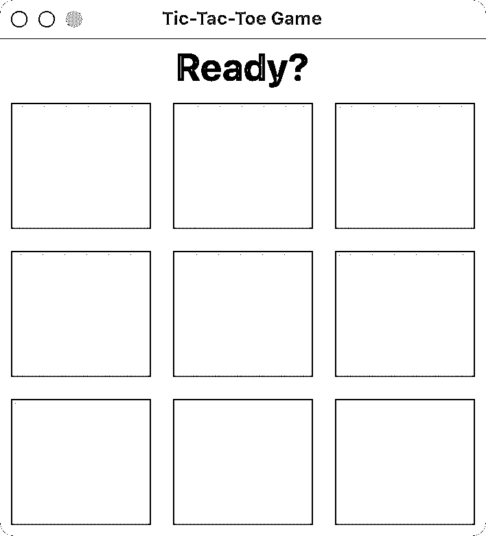
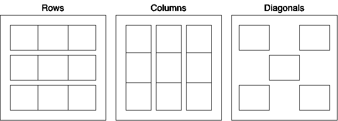

# 用 Python 和 Tkinter 构建一个井字游戏

> 原文：<https://realpython.com/tic-tac-toe-python/>

玩电脑游戏是放松或挑战自我的好方法。有些人甚至做得很专业。制作自己的电脑游戏既有趣又有教育意义。在本教程中，您将使用 Python 和 Tkinter 构建一个经典的井字游戏。

在这个项目中，你将经历创建你自己的游戏所需的思考过程。您还将学习如何整合您的各种编程技能和知识，以开发一个功能和有趣的电脑游戏。

**在本教程中，您将学习如何:**

*   使用 Python 编程经典井字游戏的逻辑
*   使用 Tkinter 工具包创建游戏的**图形用户界面(GUI)**
*   将游戏的逻辑和图形用户界面整合到一个**全功能的电脑游戏**

如前所述，您将使用 Python 标准库中的 Tkinter GUI 框架来创建您的游戏界面。您还将使用模型-视图-控制器模式和面向对象的方法来组织您的代码。关于这些概念的更多信息，请查看[先决条件](#prerequisites)中的链接。

要下载该项目的完整源代码，请单击下面框中的链接:

**获取源代码:** [单击此处获取您将用来构建井字游戏的源代码](https://realpython.com/bonus/tic-tac-toe-python-code/)。

## 演示:Python 中的井字游戏

在这个循序渐进的项目中，您将使用 Python 构建一个井字游戏。您将使用来自 Python [标准库](https://docs.python.org/3/library/index.html)的 [Tkinter](https://realpython.com/python-gui-tkinter/) 工具包来创建游戏的 GUI。在下面的演示视频中，一旦你完成了本教程，你将对你的游戏如何工作有一个大致的了解:

[https://player.vimeo.com/video/717834507?background=1](https://player.vimeo.com/video/717834507?background=1)

您的井字游戏将有一个界面，再现经典的三乘三游戏板。玩家将在共享设备上轮流移动。窗口顶部的游戏显示屏将显示下一个出场的玩家的名字。

如果玩家赢了，游戏显示屏将显示带有玩家姓名或标记的获胜消息( *X* 或 *O* )。同时，获胜的细胞组合将在板上突出显示。

最后，游戏的*文件*菜单会有选项来重置游戏，如果你想再玩一次或者当你玩完后退出游戏。

如果这听起来对你来说是一个有趣的项目，那么继续读下去开始吧！

[*Remove ads*](/account/join/)

## 项目概述

这个项目的目标是用 Python 创建一个井字游戏。对于游戏界面，您将使用 Tkinter GUI 工具包，它在标准 Python 安装中作为[包含的电池](https://peps.python.org/pep-0206/#batteries-included-philosophy)提供。

井字游戏是两个人玩的。一个玩家玩 *X* ，另一个玩家玩 *O* 。玩家轮流在一个 3×3 的格子上做标记。如果给定的玩家在一行中得到水平、垂直或对角的三个标记，则该玩家赢得游戏。当所有的格子都被标记时，如果没有人连续得到三个，游戏将被打平。

记住这些规则，您需要将以下游戏组件放在一起:

*   游戏的**棋盘**，你将使用一个名为`TicTacToeBoard`的类来构建它
*   游戏的**逻辑**，你将使用一个名为`TicTacToeGame`的类来管理它

游戏板将作为模型-视图-控制器设计中的**视图**和**控制器**的混合体。要构建电路板，您将使用 Tkinter 窗口，可以通过实例化 [`tkinter.Tk`](https://realpython.com/python-gui-tkinter/#building-your-first-python-gui-application-with-tkinter) 类来创建该窗口。该窗口有两个主要部分:

1.  **顶部显示:**显示游戏状态信息
2.  **单元格网格:**表示以前的移动和可用的空间或单元格

您将使用一个 [`tkinter.Label`](https://realpython.com/python-gui-tkinter/#displaying-text-and-images-with-label-widgets) 小部件创建游戏显示，它允许您显示文本和图像。

对于单元格网格，您将使用一系列排列在[网格](https://realpython.com/python-gui-tkinter/#the-grid-geometry-manager)中的 [`tkinter.Button`](https://realpython.com/python-gui-tkinter/#displaying-clickable-buttons-with-button-widgets) 小部件。当玩家点击这些按钮中的一个时，游戏逻辑将运行以处理玩家的移动并确定是否有赢家。在这种情况下，游戏逻辑将作为**模型**工作，它将管理游戏的数据、逻辑和规则。

现在你对如何构建井字游戏有了一个大致的概念，你应该检查一些知识前提，让你从本教程中获得最大的收益。

## 先决条件

要完成这个井字游戏项目，您应该熟悉或至少熟悉以下资源中涵盖的概念和主题:

*   [使用 Tkinter 的 Python GUI 编程](https://realpython.com/python-gui-tkinter/)
*   [Python 3 中的面向对象编程(OOP)](https://realpython.com/python3-object-oriented-programming/)
*   [Python“for”循环(确定迭代)](https://realpython.com/python-for-loop/)
*   [在 Python 中何时使用列表理解](https://realpython.com/list-comprehension-python/)
*   [模型-视图-控制器(MVC)解释-用乐高](https://realpython.com/the-model-view-controller-mvc-paradigm-summarized-with-legos/)
*   [Python 中的字典](https://realpython.com/python-dicts/)
*   [如何在 Python 中迭代字典](https://realpython.com/iterate-through-dictionary-python/)
*   [Python 中的主要函数](https://realpython.com/python-main-function/)
*   [用 namedtuple](https://realpython.com/python-namedtuple/) 编写 Pythonic 式的干净代码

如果在开始本教程之前，您还没有掌握所有建议的知识，那也没关系。你将通过实践来学习，所以去试一试吧！如果遇到困难，您可以随时停下来查看此处链接的资源。

## 第一步:用 Tkinter 设置井字游戏板

首先，您将从创建游戏板开始。在这样做之前，您需要决定如何组织井字游戏的代码。因为这个项目相当小，所以最初可以将所有代码保存在一个单独的`.py`文件中。这样，运行代码和执行游戏将会更加简单。

开始启动你最喜欢的[代码编辑器或 IDE](https://realpython.com/python-ides-code-editors-guide/) 。然后在当前工作目录下创建一个`tic_tac_toe.py`文件:

```py
# tic_tac_toe.py

"""A tic-tac-toe game built with Python and Tkinter."""
```

在本教程中，您将逐步向该文件添加代码，所以请保持它的开放性和接近性。如果您想获得这个井字游戏项目的完整代码，那么您可以单击下面的可折叠部分并从中复制代码:


```py
"""A tic-tac-toe game built with Python and Tkinter."""

import tkinter as tk
from itertools import cycle
from tkinter import font
from typing import NamedTuple

class Player(NamedTuple):
    label: str
    color: str

class Move(NamedTuple):
    row: int
    col: int
    label: str = ""

BOARD_SIZE = 3
DEFAULT_PLAYERS = (
    Player(label="X", color="blue"),
    Player(label="O", color="green"),
)

class TicTacToeGame:
    def __init__(self, players=DEFAULT_PLAYERS, board_size=BOARD_SIZE):
        self._players = cycle(players)
        self.board_size = board_size
        self.current_player = next(self._players)
        self.winner_combo = []
        self._current_moves = []
        self._has_winner = False
        self._winning_combos = []
        self._setup_board()

    def _setup_board(self):
        self._current_moves = [
            [Move(row, col) for col in range(self.board_size)]
            for row in range(self.board_size)
        ]
        self._winning_combos = self._get_winning_combos()

    def _get_winning_combos(self):
        rows = [
            [(move.row, move.col) for move in row]
            for row in self._current_moves
        ]
        columns = [list(col) for col in zip(*rows)]
        first_diagonal = [row[i] for i, row in enumerate(rows)]
        second_diagonal = [col[j] for j, col in enumerate(reversed(columns))]
        return rows + columns + [first_diagonal, second_diagonal]

    def toggle_player(self):
        """Return a toggled player."""
        self.current_player = next(self._players)

    def is_valid_move(self, move):
        """Return True if move is valid, and False otherwise."""
        row, col = move.row, move.col
        move_was_not_played = self._current_moves[row][col].label == ""
        no_winner = not self._has_winner
        return no_winner and move_was_not_played

    def process_move(self, move):
        """Process the current move and check if it's a win."""
        row, col = move.row, move.col
        self._current_moves[row][col] = move
        for combo in self._winning_combos:
            results = set(self._current_moves[n][m].label for n, m in combo)
            is_win = (len(results) == 1) and ("" not in results)
            if is_win:
                self._has_winner = True
                self.winner_combo = combo
                break

    def has_winner(self):
        """Return True if the game has a winner, and False otherwise."""
        return self._has_winner

    def is_tied(self):
        """Return True if the game is tied, and False otherwise."""
        no_winner = not self._has_winner
        played_moves = (
            move.label for row in self._current_moves for move in row
        )
        return no_winner and all(played_moves)

    def reset_game(self):
        """Reset the game state to play again."""
        for row, row_content in enumerate(self._current_moves):
            for col, _ in enumerate(row_content):
                row_content[col] = Move(row, col)
        self._has_winner = False
        self.winner_combo = []

class TicTacToeBoard(tk.Tk):
    def __init__(self, game):
        super().__init__()
        self.title("Tic-Tac-Toe Game")
        self._cells = {}
        self._game = game
        self._create_menu()
        self._create_board_display()
        self._create_board_grid()

    def _create_menu(self):
        menu_bar = tk.Menu(master=self)
        self.config(menu=menu_bar)
        file_menu = tk.Menu(master=menu_bar)
        file_menu.add_command(label="Play Again", command=self.reset_board)
        file_menu.add_separator()
        file_menu.add_command(label="Exit", command=quit)
        menu_bar.add_cascade(label="File", menu=file_menu)

    def _create_board_display(self):
        display_frame = tk.Frame(master=self)
        display_frame.pack(fill=tk.X)
        self.display = tk.Label(
            master=display_frame,
            text="Ready?",
            font=font.Font(size=28, weight="bold"),
        )
        self.display.pack()

    def _create_board_grid(self):
        grid_frame = tk.Frame(master=self)
        grid_frame.pack()
        for row in range(self._game.board_size):
            self.rowconfigure(row, weight=1, minsize=50)
            self.columnconfigure(row, weight=1, minsize=75)
            for col in range(self._game.board_size):
                button = tk.Button(
                    master=grid_frame,
                    text="",
                    font=font.Font(size=36, weight="bold"),
                    fg="black",
                    width=3,
                    height=2,
                    highlightbackground="lightblue",
                )
                self._cells[button] = (row, col)
                button.bind("<ButtonPress-1>", self.play)
                button.grid(row=row, column=col, padx=5, pady=5, sticky="nsew")

    def play(self, event):
        """Handle a player's move."""
        clicked_btn = event.widget
        row, col = self._cells[clicked_btn]
        move = Move(row, col, self._game.current_player.label)
        if self._game.is_valid_move(move):
            self._update_button(clicked_btn)
            self._game.process_move(move)
            if self._game.is_tied():
                self._update_display(msg="Tied game!", color="red")
            elif self._game.has_winner():
                self._highlight_cells()
                msg = f'Player "{self._game.current_player.label}" won!'
                color = self._game.current_player.color
                self._update_display(msg, color)
            else:
                self._game.toggle_player()
                msg = f"{self._game.current_player.label}'s turn"
                self._update_display(msg)

    def _update_button(self, clicked_btn):
        clicked_btn.config(text=self._game.current_player.label)
        clicked_btn.config(fg=self._game.current_player.color)

    def _update_display(self, msg, color="black"):
        self.display["text"] = msg
        self.display["fg"] = color

    def _highlight_cells(self):
        for button, coordinates in self._cells.items():
            if coordinates in self._game.winner_combo:
                button.config(highlightbackground="red")

    def reset_board(self):
        """Reset the game's board to play again."""
        self._game.reset_game()
        self._update_display(msg="Ready?")
        for button in self._cells.keys():
            button.config(highlightbackground="lightblue")
            button.config(text="")
            button.config(fg="black")

def main():
    """Create the game's board and run its main loop."""
    game = TicTacToeGame()
    board = TicTacToeBoard(game)
    board.mainloop()

if __name__ == "__main__":
    main()
```

拥有完整的源代码可以让你在浏览教程`的时候检查你的进度。

或者，您也可以通过单击下面框中的链接从 GitHub 下载游戏源代码:

**获取源代码:** [单击此处获取您将用来构建井字游戏的源代码](https://realpython.com/bonus/tic-tac-toe-python-code/)。

现在你已经知道了游戏的最终代码是什么样子，是时候确保你有适合这个项目的 Tkinter 版本了。然后，您将继续创建您的游戏板。

[*Remove ads*](/account/join/)

### 确保正确的 Tkinter 版本

为了完成这个项目，您将使用标准的 Python 安装。不需要创建虚拟环境，因为不需要外部依赖。你唯一需要的[包](https://realpython.com/python-modules-packages/)是 [Tkinter](https://docs.python.org/3/library/tkinter.html#module-tkinter) ，它带有 Python 标准库。

但是，您需要确保安装了正确的 Tkinter 版本。您的 Tkinter 应该大于或等于 8.6。否则，你的游戏就没用了。

您可以通过启动 Python [交互式](https://realpython.com/interacting-with-python/)会话并运行以下代码来检查您当前的 Tkinter 版本:

>>>

```py
>>> import tkinter
>>> tkinter.TkVersion
8.6
```

如果这段代码没有显示您的 Tkinter 安装的版本高于或等于 8.6，那么您需要修复它。

在 Ubuntu Linux 上，您可能需要使用系统的软件包管理器`apt`来安装`python3-tk`软件包。这是因为 Ubuntu 通常不会在默认的 Python 安装中包含 Tkinter。

正确安装 Tkinter 后，您需要检查它的当前版本。如果 Tkinter 版本低于 8.6，那么你必须安装一个更新的 Python 版本，要么从官方的[下载页面](https://www.python.org/downloads/)下载，要么使用像 [pyenv](https://realpython.com/intro-to-pyenv/) 或 [Docker](https://realpython.com/python-versions-docker/) 这样的工具。

在 macOS 和 Windows 上，一个直接的选择是从下载页面安装大于或等于 [3.9.8](https://www.python.org/downloads/release/python-398/) 的 Python 版本。

一旦你确定你有正确的 Tkinter 版本，你就可以回到你的代码编辑器并开始写代码。您将从表示井字游戏棋盘的 Python 类开始。

### 创建一个类来代表游戏板

要构建井字游戏的棋盘，您将使用`Tk`类，它允许您创建 Tkinter 应用程序的主窗口。然后，您将在顶部框架上添加一个显示，并在主窗口的其余部分添加一个单元格网格。

继续[导入](https://realpython.com/python-import/)所需的对象并定义电路板类别:

```py
# tic_tac_toe.py

import tkinter as tk
from tkinter import font

class TicTacToeBoard(tk.Tk):
    def __init__(self):
        super().__init__()
        self.title("Tic-Tac-Toe Game")
        self._cells = {}
```

在这个代码片段中，首先将`tkinter`作为`tk`导入，将模块的名称带到当前的[名称空间](https://realpython.com/python-namespaces-scope/)。在代码中使用 Tkinter 时，使用`tk`缩写是一种常见的做法。

然后你直接从`tkinter`导入 [`font`](https://docs.python.org/3/library/tkinter.font.html#module-tkinter.font) 模块。在本教程的后面，你将使用这个模块来调整游戏显示的字体。

`TicTacToeBoard`类[从`Tk`继承了](https://realpython.com/inheritance-composition-python/)，这使得它成为一个成熟的 GUI 窗口。这个窗口将代表游戏板。在 [`.__init__()`](https://realpython.com/python-class-constructor/#object-initialization-with-__init__) 中，首先调用超类的`.__init__()`方法来正确初始化父类。为此，您可以使用内置的 [super()](https://realpython.com/python-super/) 函数。

`Tk`的`.title`属性定义了显示在窗口标题栏上的文本。在本例中，您将标题设置为`"Tic-Tac-Toe Game"` [字符串](https://realpython.com/python-strings/)。

`._cells` [非公共](https://peps.python.org/pep-0008/#designing-for-inheritance)属性保存一个最初为空的[字典](https://realpython.com/python-dicts/)。这个字典将游戏板上的按钮或单元格映射到它们在网格上对应的坐标——行和列。这些坐标将是整数[数字](https://realpython.com/python-numbers/)，反映给定按钮将出现的行和列。

要继续游戏板，您现在需要创建一个显示，您可以在其中提供有关游戏状态和结果的信息。对于这个显示，您将使用一个 [`Frame`](https://realpython.com/python-gui-tkinter/#assigning-widgets-to-frames-with-frame-widgets) 小部件作为显示面板，并使用一个`Label`小部件来显示所需的信息。

**注意:**本教程中代码示例的行号是为了便于解释。大多数情况下，它们不会与你最终脚本中的行号相匹配。

现在继续将下面的方法添加到您的`TicTacToeBoard`类中:

```py
 1# tic_tac_toe.py
 2# ...
 3
 4class TicTacToeBoard(tk.Tk):
 5    # ...
 6
 7    def _create_board_display(self): 8        display_frame = tk.Frame(master=self)
 9        display_frame.pack(fill=tk.X)
10        self.display = tk.Label(
11            master=display_frame,
12            text="Ready?",
13            font=font.Font(size=28, weight="bold"),
14        )
15        self.display.pack()
```

下面是这个方法的逐行分解:

*   **第 8 行**创建一个`Frame`对象来保存游戏显示。请注意，`master`参数被设置为`self`，这意味着游戏的主窗口将是该框架的父窗口。

*   **第 9 行**使用 [`.pack()`](https://realpython.com/python-gui-tkinter/#the-pack-geometry-manager) **几何管理器**将框架对象放置在主窗口的顶部边框上。通过将`fill`参数设置为`tk.X`，可以确保当用户调整窗口大小时，框架将填满它的整个宽度。

*   **第 10 到 14 行**创建一个`Label`对象。这个标签需要存在于框架对象中，所以您将它的参数`master`设置为实际的框架。标签最初会显示文字`"Ready?"`，表示游戏准备就绪，玩家可以开始新的比赛。最后，将标签的字体大小改为`28`像素，并将其加粗。

*   **15 号线**使用`.pack()`几何图形管理器将显示标签打包在框架内。

酷！您已经有了游戏显示。现在，您可以创建单元格网格。一个经典的井字游戏有一个 3×3 的格子。

这里有一个使用`Button`对象创建单元格网格的方法:

```py
 1# tic_tac_toe.py
 2# ...
 3
 4class TicTacToeBoard(tk.Tk):
 5    # ...
 6
 7    def _create_board_grid(self): 8        grid_frame = tk.Frame(master=self)
 9        grid_frame.pack()
10        for row in range(3):
11            self.rowconfigure(row, weight=1, minsize=50)
12            self.columnconfigure(row, weight=1, minsize=75)
13            for col in range(3):
14                button = tk.Button(
15                    master=grid_frame,
16                    text="",
17                    font=font.Font(size=36, weight="bold"),
18                    fg="black",
19                    width=3,
20                    height=2,
21                    highlightbackground="lightblue",
22                )
23                self._cells[button] = (row, col)
24                button.grid(
25                    row=row,
26                    column=col,
27                    padx=5,
28                    pady=5,
29                    sticky="nsew"
30                )
```

哇！这个方法做的很多！下面是对每一行的解释:

*   **第 8 行**创建一个`Frame`对象来保存游戏的格子。您将`master`参数设置为`self`，这再次意味着游戏的主窗口将是这个 frame 对象的父窗口。

*   **第 9 行**使用`.pack()`几何管理器将框架对象放置在主窗口上。这个框架将占据游戏显示下面的区域，一直到窗口的底部。

*   **第 10 行**开始一个从`0`到`2`的循环。这些数字代表网格中每个单元格的行坐标。现在，您将在网格上拥有`3`行。但是，稍后您将更改这个[幻数](https://en.wikipedia.org/wiki/Magic_number_(programming))，并提供使用不同网格大小的选项，比如 4x 4。

*   **第 11 行和第 12 行**配置网格上每个单元格的宽度和最小尺寸。

*   **第 13 行**在三个列坐标上循环。同样，您使用三列，但是您将在以后更改这个数字，以提供更大的灵活性并消除幻数。

*   **第 14 到 22 行**为网格上的每个单元格创建一个`Button`对象。注意，您设置了几个属性，包括`master`、`text`、`font`等等。

*   **第 23 行**将每个新按钮添加到`._cells`字典中。按钮作为按键工作，它们的坐标——表示为`(row, col)`——作为值工作。

*   **第 24 到 30 行**最后使用`.grid()`几何管理器将每个按钮添加到主窗口。

现在你已经实现了`._create_board_display()`和`._create_board_grid()`，你可以从类[初始化器](https://realpython.com/python-class-constructor/#object-initialization-with-__init__)中调用它们。继续将下面两行添加到您的`TicTacToeBoard`类中的`.__init__()`:

```py
# tic_tac_toe.py
# ...

class TicTacToeBoard(tk.Tk):
    def __init__(self):
        super().__init__()
        self.title("Tic-Tac-Toe Game")
        self._cells = {}
 self._create_board_display() self._create_board_grid()
```

这两条线通过添加显示和单元格网格将游戏板放在一起。是不是很酷？

有了这些更新，你几乎可以运行你的应用程序，看看你的井字游戏会是什么样子。你只需要多写几行样板代码。您需要实例化`TicTacToeBoard`并调用它的`.mainloop()`方法来启动您的 Tkinter 应用程序。

继续将下面这段代码添加到您的`tic_tac_toe.py`文件的末尾:

```py
# tic_tac_toe.py
# ...

def main():
    """Create the game's board and run its main loop."""
    board = TicTacToeBoard()
    board.mainloop()

if __name__ == "__main__":
    main()
```

这段代码为你的游戏定义了一个 [`main()`](https://realpython.com/python-main-function/) 函数。在这个函数中，首先实例化`TicTacToeBoard`，然后通过调用`.mainloop()`运行它的主循环。

[`if __name__ == "__main__":`](https://realpython.com/python-main-function/#use-if-__name__-__main__-to-control-the-execution-of-your-code) 结构是 Python 应用程序中的常见模式。它允许您控制代码的执行。在这种情况下，只有将`.py`文件作为可执行程序运行，而不是作为可导入模块运行，才会调用`main()`。

就是这样！你现在可以第一次运行你的游戏了。当然，游戏还不能玩，但是棋盘已经准备好了。要运行游戏，请在命令行上执行以下命令:

```py
$ python tic_tac_toe.py
```

一旦您运行了这个命令，您将在屏幕上看到以下窗口:

[](https://files.realpython.com/media/tic-tac-toe-board.2d9a0dbd58c7.png)

酷！你的井字游戏开始看起来像真的了。现在你需要让这个窗口响应玩家在棋盘上的动作。

[*Remove ads*](/account/join/)

## 第二步:在 Python 中设置井字游戏逻辑

至此，您已经使用 Tkinter 构建了一个合适的井字游戏棋盘。现在你需要考虑如何处理游戏的逻辑。该逻辑将由处理玩家移动并确定该玩家是否赢得游戏的代码组成。

在实现井字游戏的逻辑时，有几个想法是关键。首先，你需要一个有效的代表**玩家**和他们的**移动**。你还需要一个更高级别的类来代表**游戏**本身。在本节中，您将为这三个逻辑概念定义类。

您可以通过单击下面的链接并导航到`source_code_step_2/`文件夹来下载此步骤的源代码:

**获取源代码:** [单击此处获取您将用来构建井字游戏的源代码](https://realpython.com/bonus/tic-tac-toe-python-code/)。

### 为玩家和他们的动作定义职业

在第一轮中，您将定义类来表示游戏板上的**玩家**和他们的**移动**。这些课程将非常简单。他们所需要的只是各自的一些属性。他们甚至不需要有什么方法。

您可以使用一些工具来构建满足这些需求的类。例如，您可以使用一个名为 tuple 的[数据类](https://realpython.com/python-data-classes/)或[。在本教程中，您将为这两个类使用一个命名元组，因为这种类提供了您所需要的一切。](https://realpython.com/python-namedtuple/)

不是使用来自 [`collections`](https://realpython.com/python-collections-module/) 模块的经典`namedtuple`，而是使用来自 [`typing`](https://docs.python.org/3/library/typing.html#module-typing) 的 [`NamedTuple`](https://realpython.com/python-namedtuple/#namedtuple-vs-typingnamedtuple) 类，作为在类中提供初始[类型提示](https://realpython.com/python-type-checking/)信息的一种方式。

回到代码编辑器，在`tic_tac_toe.py`文件的开头添加以下代码:

```py
 1# tic_tac_toe.py
 2
 3import tkinter as tk
 4from tkinter import font
 5from typing import NamedTuple 6
 7class Player(NamedTuple): 8    label: str
 9    color: str
10
11class Move(NamedTuple): 12    row: int
13    col: int
14    label: str = ""
15
16# ...
```

下面是这段代码的分解:

*   **五号线**从`typing`进口`NamedTuple`。

*   **第 7 到 9 行**定义了`Player`类。`.label`属性将存储经典玩家标志， *X* 和 *O* 。`.color`属性将保存一个带有 Tkinter 颜色的字符串。您将使用这种颜色来识别游戏板上的目标玩家。

*   **第 11 到 14 行**定义了`Move`类。`.row`和`.col`属性将保存标识移动目标单元格的坐标。`.label`属性将持有标识玩家的符号， *X* 或 *O* 。注意，`.label`默认为空弦，`""`，表示这个具体的招式还没有打出。

有了这两个类，现在可以定义用来表示游戏逻辑的类了。

### 创建一个类来表示游戏逻辑

在本节中，您将定义一个类来管理游戏的逻辑。这个类将负责处理移动，寻找赢家，切换玩家，并执行一些其他任务。回到您的`tic_tac_toe.py`文件，在您的`TicTacToeBoard`类之前添加下面的类:

```py
# tic_tac_toe.py
import tkinter as tk
from itertools import cycle from tkinter import font
# ...

class TicTacToeGame:
    def __init__(self, players=DEFAULT_PLAYERS, board_size=BOARD_SIZE):
        self._players = cycle(players)
        self.board_size = board_size
        self.current_player = next(self._players)
        self.winner_combo = []
        self._current_moves = []
        self._has_winner = False
        self._winning_combos = []
        self._setup_board()

class TicTacToeBoard(tk.Tk):
    # ...
```

这里，你先从 [`itertools`](https://realpython.com/python-itertools/) 模块中导入 [`cycle()`](https://docs.python.org/3/library/itertools.html#itertools.cycle) 。然后定义`TicTacToeGame`，它的初始化器有两个参数，`players`和`board_size`。`players`参数将保存两个`Player`对象的元组，代表玩家 *X* 和 *O* 。这个参数默认为`DEFAULT_PLAYERS`，一个您稍后将定义的常量。

`board_size`参数将保存一个代表游戏棋盘大小的数字。在经典的井字游戏中，这个大小应该是`3`。在您的类中，参数默认为`BOARD_SIZE`，这是您很快将定义的另一个常数。

在`.__init__()`中，您定义了以下[实例属性](https://realpython.com/python3-object-oriented-programming/#class-and-instance-attributes):

| 属性 | 描述 |
| --- | --- |
| `._players` | `players`的输入元组上的循环迭代器 |
| `.board_size` | 电路板尺寸 |
| `.current_player` | 当前玩家 |
| `.winner_combo` | 定义赢家的单元格组合 |
| `._current_moves` | 给定游戏中玩家的移动列表 |
| `._has_winner` | 一个用于确定游戏是否有赢家的[布尔](https://realpython.com/python-boolean/)变量 |
| `._winning_combos` | 包含定义获胜的单元格组合的列表 |

属性从`itertools`模块中调用`cycle()`。该函数将 iterable 作为参数，并返回一个迭代器，该迭代器从输入 iterable 中循环产生项目。在这种情况下，`cycle()`的参数是通过`players`参数传入的默认玩家元组。在学习本教程的过程中，您将了解上表中所有属性的更多信息。

关于`.__init__()`中的最后一行，它调用`._setup_board()`，这是一个方法，稍后您也将定义它。

现在继续在`Move`类下面定义以下常量:

```py
# tic_tac_toe.py
# ...

class Move(NamedTuple):
    # ...

BOARD_SIZE = 3 DEFAULT_PLAYERS = (
 Player(label="X", color="blue"), Player(label="O", color="green"), ) 
class TicTacToeGame:
    # ...
```

正如您已经了解到的，`BOARD_SIZE`掌握着井字游戏棋盘的大小。通常这个尺寸是`3`。所以，你会在黑板上看到一个 3x 3 的格子。

另一方面，`DEFAULT_PLAYERS`定义了一个两项元组。每个物品代表游戏中的一个玩家。每个玩家的`.label`和`.color`属性被设置为合适的值。玩家 *X* 会是蓝色，玩家 *O* 会是绿色。

[*Remove ads*](/account/join/)

### 设置抽象游戏板

管理游戏每时每刻的状态是游戏逻辑中的一个基本步骤。你需要跟踪棋盘上的每个动作。为此，您将使用`._current_moves`属性，每当玩家移动时，您将更新该属性。

您还需要确定棋盘上的哪些单元格组合决定了胜局。您将把这些组合存储在`._winning_combos`属性中。

下面是`._setup_board()`方法，它计算`._current_moves`和`._winning_combos`的初始值:

```py
# tic_tac_toe.py
# ...

class TicTacToeGame:
    # ...

 def _setup_board(self):        self._current_moves = [
            [Move(row, col) for col in range(self.board_size)]
            for row in range(self.board_size)
        ]
        self._winning_combos = self._get_winning_combos()
```

在`._setup_board()`中，您使用一个[列表理解](https://realpython.com/list-comprehension-python/)来为`._current_moves`提供一个初始的值列表。理解创建了一个列表列表。每个内部列表将包含空的`Move`对象。空移动存储其包含单元格的坐标和一个空字符串作为初始玩家的标签。

这个方法的最后一行调用`._get_winning_combos()`，并将其返回值赋给`._winning_combos`。您将在下一节中实现这个新方法。

### 找出获胜的组合

在经典的井字游戏棋盘上，你会有八种可能的获胜组合。它们本质上是棋盘的行、列和对角线。下图显示了这些获奖组合:

[](https://files.realpython.com/media/tic-tac-toe-winning-combos.5a2ac7488e82.png)

如何使用 Python 代码获得所有这些组合的坐标？有几种方法可以做这件事。在下面的代码中，您将使用四种列表理解来获得所有可能的获胜组合:

```py
# tic_tac_toe.py
# ...

class TicTacToeGame:
    # ...

 def _get_winning_combos(self):        rows = [
            [(move.row, move.col) for move in row]
            for row in self._current_moves
        ]
        columns = [list(col) for col in zip(*rows)]
        first_diagonal = [row[i] for i, row in enumerate(rows)]
        second_diagonal = [col[j] for j, col in enumerate(reversed(columns))]
        return rows + columns + [first_diagonal, second_diagonal]
```

这个方法的主要输入是`._current_moves`属性。默认情况下，该属性将保存一个包含三个子列表的列表。每个子列表代表网格上的一行，其中有三个`Move`对象。

第一种理解是遍历网格上的行，获得每个单元格的坐标，并构建一个坐标子列表。每个坐标子列表代表一个获胜的组合。第二种理解是创建包含网格列中每个单元格坐标的子列表。

第三和第四个理解使用类似的方法来获得棋盘对角线上每个单元格的坐标。最后，该方法返回包含井字游戏棋盘上所有可能获胜组合的列表列表。

有了游戏板的初始设置，您就可以开始考虑处理玩家的移动了。

## 第三步:根据游戏的逻辑处理玩家的行动

在这个井字游戏中，你将主要处理一种事件:**玩家的移动**。翻译成 Tkinter 术语，玩家的移动只是在选定的单元格上单击，它由一个按钮小部件表示。

玩家的每一个动作都会触发`TicTacToeGame`类上的一堆操作。这些操作包括:

*   验证移动
*   寻找赢家
*   检查平局的比赛
*   切换玩家的下一步行动

在接下来的部分中，您将编写代码来处理您的`TicTacToeGame`类中的所有这些操作。

要从 GitHub 下载该步骤的源代码，请单击下面的链接并导航到`source_code_step_3/`文件夹:

**获取源代码:** [单击此处获取您将用来构建井字游戏的源代码](https://realpython.com/bonus/tic-tac-toe-python-code/)。

[*Remove ads*](/account/join/)

### 验证玩家的移动

每次玩家点击井字游戏棋盘上的给定单元格时，您都需要验证该移动。问题是:如何定义有效的移动？好吧，至少有两个条件能让这一招有效。玩家只能在以下情况下玩游戏:

1.  这个游戏没有赢家。
2.  所选的棋还没有下过。

继续将以下方法添加到`TicTacToeGame`的末尾:

```py
 1# tic_tac_toe.py
 2# ...
 3
 4class TicTacToeGame:
 5    # ...
 6
 7    def is_valid_move(self, move): 8        """Return True if move is valid, and False otherwise."""
 9        row, col = move.row, move.col
10        move_was_not_played = self._current_moves[row][col].label == ""
11        no_winner = not self._has_winner
12        return no_winner and move_was_not_played
```

`.is_valid_move()`方法接受一个`Move`对象作为参数。下面是该方法的其余部分:

*   **第 9 行**从输入的`move`中获取`.row`和`.col`坐标。

*   **第 10 行**检查当前坐标`[row][col]`处的移动是否仍保留一个空字符串作为其标签。如果之前没有玩家输入过`move`，则该条件为`True`。

*   **第 11 行**检查游戏是否还没有赢家。

该方法返回一个布尔值，该值是通过检查游戏是否没有赢家以及当前棋步是否还没有下完而得到的。

### 处理玩家的移动以找到赢家

现在是时候让你决定一个玩家在最后一步棋后是否赢得了游戏。作为游戏设计师，这可能是你最关心的问题。当然，你会有许多不同的方法来找出一个给定的玩家是否赢得了游戏。

在这个项目中，您将使用以下想法来确定获胜者:

*   游戏板上的每个单元格都有一个关联的`Move`对象。
*   每一个`Move`对象都有一个`.label`属性，用于识别进行移动的玩家。

为了找出最后一个玩家是否赢得了游戏，您将检查该玩家的标签是否出现在给定获胜组合中包含的所有可能的移动中。

继续将以下方法添加到您的`TicTacToeGame`类中:

```py
 1# tic_tac_toe.py
 2# ...
 3
 4class TicTacToeGame:
 5    # ...
 6
 7    def process_move(self, move): 8        """Process the current move and check if it's a win."""
 9        row, col = move.row, move.col
10        self._current_moves[row][col] = move
11        for combo in self._winning_combos:
12            results = set(
13                self._current_moves[n][m].label
14                for n, m in combo
15            )
16            is_win = (len(results) == 1) and ("" not in results)
17            if is_win:
18                self._has_winner = True
19                self.winner_combo = combo
20                break
```

下面是这种新方法的逐行分解:

*   **第 7 行**定义了`process_move()`，它以一个`Move`对象作为参数。

*   **第 9 行**从输入的`move`中获取`.row`和`.col`坐标。

*   **第 10 行**将输入`move`分配给当前移动列表中`[row][col]`处的项目。

*   **第 11 行**开始在获胜的组合上循环。

*   **第 12 行到第 15 行**运行一个生成器表达式，从当前获胜组合的移动中检索所有标签。然后结果被转换成一个`set`对象。

*   **第 16 行**定义了一个布尔表达式，检查当前的移动是否决定了胜利。结果存储在`is_win`中。

*   **第 17 行**检查`is_win`的内容。如果变量保持`True`，那么`._has_winner`被设置为`True`并且`.winner_combo`被设置为当前组合。然后循环[中断](https://realpython.com/python-for-loop/#the-break-and-continue-statements)，功能终止。

在第 12 至 16 行，有几点和想法需要澄清。为了更好地理解第 12 行到第 15 行，假设与当前获胜组合的单元格相关联的移动中的所有标签都持有一个 *X* 。在这种情况下，生成器表达式将产生三个 *X* 标签。

当你用几个 *X* 的实例来填充内置的`set()`函数时，你会得到一个只有一个 *X* 实例的集合。集合不允许重复值。

所以，如果`results`中的集合包含一个不同于空字符串的值，那么你就有一个赢家。在这个例子中，获胜者将是带有 *X* 标签的玩家。第 16 行检查这两个条件。

为了总结寻找井字游戏赢家的主题，继续在您的`TicTacToeGame`类的末尾添加以下方法:

```py
# tic_tac_toe.py
# ...

class TicTacToeGame:
    # ...

 def has_winner(self):        """Return True if the game has a winner, and False otherwise."""
        return self._has_winner
```

每当您需要检查当前匹配是否有赢家时，该方法返回存储在`._has_winner`中的布尔值。在本教程的后面，您将使用这个方法。

[*Remove ads*](/account/join/)

### 检查平局游戏

在井字游戏中，如果玩家在所有单元格上玩，但没有赢家，那么游戏就平手了。因此，在宣布比赛平局之前，您需要检查两个条件:

1.  所有可能的方法都用过了。
2.  这场比赛没有赢家。

继续在`TicTacToeGame`的末尾添加以下方法来检查这些条件:

```py
# tic_tac_toe.py
# ...

class TicTacToeGame:
    # ...

 def is_tied(self):        """Return True if the game is tied, and False otherwise."""
        no_winner = not self._has_winner
        played_moves = (
            move.label for row in self._current_moves for move in row
        )
        return no_winner and all(played_moves)
```

在`.is_tied()`里面，你首先检查游戏是否还没有赢家。然后你用内置的 [`all()`](https://realpython.com/python-all/) 函数检查`._current_moves`中的所有招式是否都有不同于空串的标号。如果是这样，那么所有可能的单元格都已经打过了。如果两个条件都为真，那么比赛就平手了。

### 在回合之间切换玩家

每当一个玩家进行有效的移动时，您需要切换当前玩家，以便另一个玩家可以进行下一步移动。为了提供这个功能，继续将下面的方法添加到您的`TicTacToeGame`类中:

```py
# tic_tac_toe.py
# ...

class TicTacToeGame:
    # ...

 def toggle_player(self):        """Return a toggled player."""
        self.current_player = next(self._players)
```

因为`._players`拥有一个迭代器，循环遍历两个默认玩家，所以只要需要，就可以在这个迭代器上调用 [`next()`](https://docs.python.org/3/library/functions.html#next) 来获取下一个玩家。这种切换机制将允许下一个玩家轮到他们并继续游戏。

## 步骤 4:处理玩家在游戏棋盘上的移动

在这一点上，你能够在游戏逻辑上处理玩家的移动。现在你要把这个逻辑和游戏板本身联系起来。您还需要编写代码来使棋盘对玩家的移动做出响应。

首先，继续将游戏逻辑注入游戏板。为此，如下面的代码所示更新`TicTacToeBoard`类:

```py
# tic_tac_toe.py
# ...

class TicTacToeGame:
    # ...

class TicTacToeBoard(tk.Tk):
 def __init__(self, game):        super().__init__()
        self.title("Tic-Tac-Toe Game")
        self._cells = {}
 self._game = game        self._create_board_display()
        self._create_board_grid()

    # ...

    def _create_board_grid(self):
        grid_frame = tk.Frame(master=self)
        grid_frame.pack()
 for row in range(self._game.board_size):            self.rowconfigure(row, weight=1, minsize=50)
            self.columnconfigure(row, weight=1, minsize=75)
 for col in range(self._game.board_size):                # ...
```

在这个代码片段中，首先向`TicTacToeBoard`初始化器添加一个`game`参数。然后将这个参数分配给一个实例属性`._game`，这将使您能够从游戏面板上完全访问游戏逻辑。

第二个更新是使用`._game.board_size`来设置电路板尺寸，而不是使用一个幻数。此更新还使您能够使用不同的电路板尺寸。例如，您可以创建一个四乘四的棋盘网格，这可能是一种令人兴奋的体验。

有了这些更新，你就可以在`TicTacToeBoard`职业中处理玩家的移动了。

通常，您可以通过单击下面的链接并导航到`source_code_step_4/`文件夹来下载该步骤的源代码:

**获取源代码:** [单击此处获取您将用来构建井字游戏的源代码](https://realpython.com/bonus/tic-tac-toe-python-code/)。

### 处理玩家的移动事件

`Tk`类上的`.mainloop()`方法运行所谓的应用程序的**主循环**或**事件循环**。这是一个无限循环，所有 GUI **事件**都在其中发生。在这个循环中，您可以处理应用程序用户界面上的事件。事件是 GUI 上的用户操作，如按键、鼠标移动或鼠标单击。

当井字游戏中的玩家单击单元格时，游戏的事件循环中会发生一个单击事件。您可以通过在您的`TicTacToeBoard`类上提供一个适当的处理方法来处理这个事件。为此，请回到代码编辑器，在类的末尾添加下面的`.play()`方法:

```py
 1# tic_tac_toe.py
 2# ...
 3
 4class TicTacToeBoard(tk.Tk):
 5    # ...
 6
 7    def play(self, event): 8        """Handle a player's move."""
 9        clicked_btn = event.widget
10        row, col = self._cells[clicked_btn]
11        move = Move(row, col, self._game.current_player.label)
12        if self._game.is_valid_move(move):
13            self._update_button(clicked_btn)
14            self._game.process_move(move)
15            if self._game.is_tied():
16                self._update_display(msg="Tied game!", color="red")
17            elif self._game.has_winner():
18                self._highlight_cells()
19                msg = f'Player "{self._game.current_player.label}" won!'
20                color = self._game.current_player.color
21                self._update_display(msg, color)
22            else:
23                self._game.toggle_player()
24                msg = f"{self._game.current_player.label}'s turn"
25                self._update_display(msg)
```

这种方法是井字游戏的基础，因为它将几乎所有的游戏逻辑和 GUI 行为放在了一起。下面是这种方法的一个总结:

*   **第 7 行**定义了`play()`，它以一个 Tkinter 事件对象作为参数。

*   **第 9 行**检索触发当前事件的小部件。这个小部件将是棋盘网格上的一个按钮。

*   **第 10 行**将按钮的坐标解包成两个局部变量`row`和`col`。

*   **第 11 行**使用`row`、`col`和当前玩家的`.label`属性作为参数创建一个新的`Move`对象。

*   **第 12 行**开始一个条件语句，检查玩家的移动是否有效。如果移动有效，那么运行`if`代码块。否则，不会发生进一步的动作。

*   **第 13 行**通过调用`._update_button()`方法更新被点击的按钮。您将在下一节的[中编写这个方法。简而言之，该方法更新按钮的文本以反映当前播放器的标签和颜色。](#update-the-game-board-to-reflect-the-game-state)

*   **第 14 行**使用当前移动作为参数调用`._game`对象上的`.process_move()`。

*   **第 15 行**检查比赛是否平局。如果是这种情况，那么游戏显示会相应地更新。

*   **第 17 行**检查当前玩家是否已经赢得游戏。然后第 18 行突出显示获胜的单元格，第 19 到 21 行更新游戏显示以确认获胜者。

*   如果比赛不分胜负，没有赢家，第 22 行就会运行。在这种情况下，第 23 到 25 行切换玩家的下一步棋，并更新显示以指出下一个将玩的玩家。

你就快到了！通过一些更新和添加，您的井字游戏将为其首次比赛做好准备。

下一步是将游戏板上的每个按钮连接到`.play()`方法。为此，返回到`._create_board_grid()`方法并更新它，如下面的代码所示:

```py
# tic_tac_toe.py
# ...

class TicTacToeBoard(tk.Tk):
    # ...

    def _create_board_grid(self):
        grid_frame = tk.Frame(master=self)
        grid_frame.pack()
        for row in range(self._game.board_size):
            self.rowconfigure(row, weight=1, minsize=50)
            self.columnconfigure(row, weight=1, minsize=75)
            for col in range(self._game.board_size):
                # ...
                self._cells[button] = (row, col)
 button.bind("<ButtonPress-1>", self.play)                # ...
```

高亮显示的行[用`.play()`方法绑定](https://realpython.com/python-gui-tkinter/#using-bind)游戏板上每个按钮的点击事件。这样，每当玩家单击一个给定的按钮时，该方法将运行以处理移动并更新游戏状态。

[*Remove ads*](/account/join/)

### 更新游戏板以反映游戏状态

要完成处理游戏板上玩家移动的代码，您需要编写三个助手方法。这些方法将完成以下操作:

*   更新单击的按钮
*   更新游戏显示
*   突出显示获奖单元格

要开始，继续将`._update_button()`添加到`TicTacToeBoard`:

```py
# tic_tac_toe.py
# ...

class TicTacToeBoard(tk.Tk):
    # ...

 def _update_button(self, clicked_btn):        clicked_btn.config(text=self._game.current_player.label)
        clicked_btn.config(fg=self._game.current_player.color)
```

在这段代码中，`._update_button()`在被点击的按钮上调用`.config()`,将其`.text`属性设置为当前玩家的标签。该方法还将文本前景色`fg`设置为当前玩家的颜色。

下一个要添加的助手方法是`._update_display()`:

```py
# tic_tac_toe.py
# ...

class TicTacToeBoard(tk.Tk):
    # ...

 def _update_display(self, msg, color="black"):        self.display["text"] = msg
        self.display["fg"] = color
```

在这个方法中，不是使用`.config()`来调整游戏显示的文本和颜色，而是使用字典风格的下标符号。使用这种类型的符号是 Tkinter 为访问小部件的属性提供的另一个选项。

最后，您需要一个助手方法，以便在给定玩家做出获胜的一步时突出显示获胜的单元格:

```py
# tic_tac_toe.py
# ...

class TicTacToeBoard(tk.Tk):
    # ...

 def _highlight_cells(self):        for button, coordinates in self._cells.items():
            if coordinates in self._game.winner_combo:
                button.config(highlightbackground="red")
```

`._highlight_cells()`中的循环遍历`._cells`字典中的条目。该字典将按钮映射到它们在棋盘网格上的行和列坐标。如果当前坐标在一个获胜的单元格组合中，那么按钮的背景色设置为`"red"`，突出显示棋盘上的单元格组合。

有了这最后一个辅助方法，您的井字游戏就可以开始第一场比赛了！

### 第一次玩井字游戏

要完成井字游戏的逻辑和用户界面的整合，您需要更新游戏的`main()`功能。到目前为止，您只有一个`TicTacToeBoard`对象。您需要创建一个`TicTacToeGame`对象，并将其传递给`TicTacToeBoard`更新的构造函数。

回到`main()`并更新它，如下面的代码所示:

```py
# tic_tac_toe.py
# ...

def main():
    """Create the game's board and run its main loop."""
 game = TicTacToeGame() board = TicTacToeBoard(game)    board.mainloop()
```

在这段代码中，第一个突出显示的行创建了一个`TicTacToeGame`的实例，您将使用它来处理游戏逻辑。第二行突出显示的代码将新实例传递给`TicTacToeBoard`类构造函数，后者将游戏逻辑注入游戏板。

有了这些更新，你现在可以运行你的游戏了。为此，启动一个终端窗口并导航到包含您的`tic_tac_toe.py`文件的目录。然后运行以下命令:

```py
$ python tic_tac_toe.py
```

一旦这个命令运行，你游戏的主窗口就会出现在你的屏幕上。来吧，试一试！它会有这样的行为:

[https://player.vimeo.com/video/717495498?background=1](https://player.vimeo.com/video/717495498?background=1)

哇！你的游戏项目到目前为止看起来很惊艳！它允许两个玩家共享他们的鼠标，玩经典的井字游戏。游戏的图形用户界面看起来不错，总的来说，游戏运行正常。

在接下来的部分中，您将编写代码来允许玩家重新启动游戏并再次游戏。你还可以选择退出游戏。

[*Remove ads*](/account/join/)

## 第五步:提供重新游戏的选项并退出游戏

在本节中，您将为井字游戏提供一个**主菜单**。这个菜单将有一个重新开始游戏的选项，这样玩家可以开始另一场比赛。一旦玩家结束游戏，它还会有一个退出游戏的选项。

主菜单通常是许多 GUI 应用程序的基本组件。因此，学习如何在 Tkinter 中创建它们是一个很好的练习，可以提高你在游戏开发本身之外的 GUI 相关技能。

这是一个例子，说明构建自己的游戏是一种强大的学习体验，因为它允许您整合知识和技能，以便以后在其他非游戏项目中使用。

这一步的完整源代码可以下载。只需点击下面的链接并导航至`source_code_step_5/`文件夹:

**获取源代码:** [单击此处获取您将用来构建井字游戏的源代码](https://realpython.com/bonus/tic-tac-toe-python-code/)。

### 构建游戏的主菜单

要向 Tkinter 应用程序添加主菜单，可以使用`tkinter.Menu`类。这个类允许你在你的 Tkinter 窗口上创建一个菜单栏。它还允许您在菜单栏中添加下拉菜单。

下面是创建主菜单并将其添加到井字游戏中的代码:

```py
 1# tic_tac_toe.py
 2# ...
 3
 4class TicTacToeBoard(tk.Tk):
 5    def __init__(self, game):
 6        # ...
 7
 8    def _create_menu(self): 9        menu_bar = tk.Menu(master=self)
10        self.config(menu=menu_bar)
11        file_menu = tk.Menu(master=menu_bar)
12        file_menu.add_command(
13            label="Play Again",
14            command=self.reset_board
15        )
16        file_menu.add_separator()
17        file_menu.add_command(label="Exit", command=quit)
18        menu_bar.add_cascade(label="File", menu=file_menu)
```

下面是这段代码逐行执行的操作:

*   **第 8 行**定义了一个名为`._create_menu()`的助手方法来处理单个位置的菜单创建。

*   **第 9 行**创建一个`Menu`的实例，它将作为菜单栏工作。

*   **Line 10** 将菜单栏对象设置为当前 Tkinter 窗口的主菜单。

*   **第 11 行**创建了`Menu`的另一个实例来提供一个*文件*菜单。注意，类构造函数中的`master`参数被设置为菜单栏对象。

*   **第 12 到 15 行**使用`.add_command()`方法向*文件*菜单添加一个新的菜单选项。这个新选项将有标签`"Play Again"`。当用户点击这个选项时，应用程序将运行您通过`command`参数提供的`.reset_board()`方法。您将在下一节中编写这个方法。

*   **第 16 行**使用`.add_separator()`方法添加一个菜单分隔符。当您需要在给定的下拉菜单中分隔相关命令组时，分隔符非常有用。

*   **第 17 行**向*文件*菜单添加一个*退出*命令。该命令将通过调用`quit()`函数使游戏退出。

*   **第 18 行**最后通过调用带有适当参数的`.add_cascade()`将文件菜单添加到菜单栏。

要将主菜单添加到游戏的主窗口中，您需要从`TicTacToeBoard`的初始化器中调用`._create_menu()`。因此，继续将下面一行添加到该类的`.__init__()`方法中:

```py
# tic_tac_toe.py
# ...

class TicTacToeBoard(tk.Tk):
    def __init__(self, game):
        super().__init__()
        self.title("Tic-Tac-Toe Game")
        self._cells = {}
        self._game = game
 self._create_menu()        self._create_board_display()
        self._create_board_grid()

    # ...
```

随着这个最后的更新，你的游戏的主菜单几乎可以使用了。但是，在使用它之前，您必须实现`.reset_board()`方法。这就是你在接下来的部分要做的，为了让玩家可以再次玩。

### 执行再次播放选项

要重置游戏板并允许玩家再次游戏，您需要向两个类添加代码，`TicTacToeGame`和`TicTacToeBoard`。

在游戏逻辑类中，您需要重置`._current_moves`属性来保存最初为空的`Move`对象列表。您还需要将`._has_winner`和`.winner_combo`复位到它们的初始状态。另一方面，在游戏棋盘类中，您需要将棋盘显示和单元格重置为初始状态。

回到代码编辑器中的`TicTacToeGame`,在类的末尾添加下面的方法:

```py
# tic_tac_toe.py
# ...

class TicTacToeGame(tk.Tk):
        # ...

 def reset_game(self):        """Reset the game state to play again."""
        for row, row_content in enumerate(self._current_moves):
            for col, _ in enumerate(row_content):
                row_content[col] = Move(row, col)
        self._has_winner = False
        self.winner_combo = []
```

`.reset_game()`中的`for`循环将所有当前移动设置为一个空的`Move`对象。空移动的主要特征是它的`.label`属性保存空字符串`""`。

在更新当前移动之后，这些方法将`._has_winner`设置为`False`并将`.winner_combo`设置为空列表。这三个重置确保游戏的抽象表示准备好开始新的比赛。

请注意，在为新的比赛准备游戏时，`reset_game()`不会将玩家重置回 *X* 。通常情况下，上一场比赛的获胜者会在下一场比赛中第一个出场。所以，这里不需要重置播放器。

一旦在游戏逻辑中提供了所需的新功能，就可以更新游戏板的功能了。继续将以下方法添加到`TicTacToeBoard`的末尾:

```py
 1# tic_tac_toe.py
 2# ...
 3
 4class TicTacToeBoard(tk.Tk):
 5        # ...
 6
 7    def reset_board(self): 8        """Reset the game's board to play again."""
 9        self._game.reset_game()
10        self._update_display(msg="Ready?")
11        for button in self._cells.keys():
12            button.config(highlightbackground="lightblue")
13            button.config(text="")
14            button.config(fg="black")
```

该`.reset_board()`方法的工作原理如下:

*   **第 9 行**调用`.reset_game()`来重置棋盘的抽象表示。

*   **第 10 行**更新板显示以保存初始文本`"Ready?"`。

*   **第 11 行**在棋盘格子上的按钮上开始一个循环。

*   **第 12 到 14 行**将每个按钮的`highlightbackground`、`text`、`fg`属性恢复到初始状态。

就是这样！有了这最后一个功能，您的井字游戏项目就完成了。来吧，试一试！

[*Remove ads*](/account/join/)

## 结论

在这个循序渐进的项目中，您已经使用 Python 和 Tkinter 创建了一个经典的井字游戏。Python 标准库中提供了这个 GUI 框架。它可以在 Windows、Linux 和 macOS 上运行，所以你的游戏在这三个平台上都可以很好地运行。那很酷！

**在本教程中，您学习了如何:**

*   使用 Python 实现经典井字游戏的逻辑
*   使用 Python 标准库中的 Tkinter 构建**游戏的棋盘或 GUI**
*   连接游戏的逻辑和 GUI，使游戏**正常运行**

这些知识为您创建新的更复杂的游戏和 GUI 项目提供了基础，这将帮助您将 Python 技能提升到一个新的水平。

## 接下来的步骤

您在本教程中实现的井字游戏相当简单。然而，你可以用几种不同的有趣的方式来扩展它。让这个游戏项目更上一层楼的一些想法包括允许你的用户:

*   使用不同尺寸的游戏板
*   与电脑对战

你还能想出什么其他的主意来扩展这个项目？要有创意，要有乐趣！

现在你已经完成了这个项目，这里有一些额外的好项目可以继续用 Python 构建你自己的游戏:

*   制作你的第一个 Python 游戏:石头、剪刀、布！:在本教程中，你将从头开始学习用 Python 编程石头剪刀布。您将学习如何接受用户输入，让计算机选择一个随机动作，确定获胜者，以及将您的代码拆分成多个函数。

*   PyGame:Python 游戏编程入门:在这个循序渐进的教程中，你将学习如何使用 py Game。这个库允许你用 Python 创建游戏和丰富的多媒体程序。您将学习如何在屏幕上绘制项目，实现碰撞检测，处理用户输入，等等！

*   用 Python 和 Pygame 构建一个小行星游戏:这篇文章将向你展示如何在 PyGame 中创建一个游戏！

*   [Arcade:Python 游戏框架入门](https://realpython.com/arcade-python-game-framework/):这篇文章是一个很好的后续，因为它向您展示了另一个 Python 游戏框架，允许您创建更复杂的游戏。

*   [用街机在 Python 中构建平台游戏](https://realpython.com/platformer-python-arcade/):在这个循序渐进的教程中，你将使用街机库在 Python 中构建一个平台游戏。您将学习设计关卡、获取资源和实现高级功能的技术。

*   [用 Python 中的 AI 玩家构建井字游戏引擎](https://realpython.com/tic-tac-toe-ai-python/):在这个循序渐进的教程中，你将使用井字游戏规则和两个计算机玩家构建一个 Python 通用游戏引擎，包括一个使用 minimax 算法的无敌 AI 玩家。*********