# 顶级 Python 游戏引擎

> 原文：<https://realpython.com/top-python-game-engines/>

和很多人一样，也许你刚开始学编码的时候想写视频游戏。但是那些游戏和你玩过的游戏一样吗？可能你刚开始的时候没有 Python，没有 Python 游戏可供你学习，也没有游戏引擎可言。没有真正的指导或框架来帮助你，你在其他游戏中体验到的高级图形和声音可能仍然遥不可及。

现在，有了 Python，以及大量优秀的 Python 游戏引擎。这种强大的组合使得制作优秀的电脑游戏比过去容易得多。在本教程中，您将探索其中的几个游戏引擎，了解开始制作您自己的 Python 视频游戏所需的东西！

**本文结束时，你将:**

*   了解几款**流行的 Python 游戏引擎**的**优劣**
*   看看这些游戏引擎**的运行**
*   理解他们如何比较和**独立游戏引擎**
*   了解其他可用的 Python 游戏引擎

为了从本教程中获得最大收益，您应该精通 Python 编程，包括[面向对象编程](https://realpython.com/python3-object-oriented-programming/)。理解基本的游戏概念是有帮助的，但不是必需的。

准备好开始了吗？单击下面的链接下载您将创建的所有游戏的源代码:

**获取源代码:** [点击此处获取您将使用](https://realpython.com/bonus/top-python-game-engines-project-code/)试用 Python 游戏引擎的源代码。

## Python 游戏引擎概述

Python 的游戏引擎通常采用 Python 库的形式，可以通过多种方式安装。大多数在 [PyPI](https://pypi.org/) 上有，可以和 [`pip`](https://realpython.com/what-is-pip/) 一起安装。但是，有一些只在 GitHub、GitLab 或其他代码共享位置上可用，它们可能需要其他安装步骤。本文将涵盖所有讨论过的引擎的安装方法。

Python 是一种通用编程语言，除了编写计算机游戏之外，它还用于各种任务。相比之下，有许多不同的单机游戏引擎是专门为编写游戏而定制的。其中包括:

*   [虚幻引擎](https://www.unrealengine.com/)
*   [统一](https://unity.com/)
*   [戈多](https://godotengine.org/)

这些独立游戏引擎在几个关键方面不同于 Python 游戏引擎:

*   **语言支持:**像 C++、C#和 JavaScript 这样的语言在独立游戏引擎中编写的游戏中很受欢迎，因为引擎本身通常是用这些语言编写的。很少有独立引擎支持 Python。
*   **专有脚本支持:**另外，很多单机游戏引擎都维护和支持自己的脚本语言，可能不像 Python。比如 Unity 原生使用 C#，Unreal 用 C++效果最好。
*   **平台支持:**很多现代单机游戏引擎都可以不费吹灰之力制作出适用于多种平台的游戏，包括移动和专用游戏系统。相比之下，将 Python 游戏移植到各种平台，尤其是移动平台，可能是一项艰巨的任务。
*   **许可选项:**根据所使用的引擎，使用独立游戏引擎编写的游戏可能会有不同的许可选项和限制。

那么为什么要用 Python 来写游戏呢？一句话，Python。使用单机游戏引擎往往需要你学习一门新的编程或脚本语言。Python 游戏引擎利用您现有的 Python 知识，缩短学习曲线，让您快速前进。

有许多游戏引擎可用于 Python 环境。您将在此了解的所有引擎都具有以下标准:

*   它们是相对受欢迎的引擎，或者它们涵盖了游戏中通常不被涉及的方面。
*   它们目前被维护着。
*   他们有很好的文件可用。

对于每种引擎，您将了解到:

*   安装方法
*   基本概念，以及引擎做出的假设
*   主要特性和功能
*   两个游戏实现，为了便于比较

在适当的地方，你应该在一个虚拟环境中安装这些游戏引擎。本教程中游戏的完整源代码可以从下面的链接下载，并将在整篇文章中引用:

**获取源代码:** [点击此处获取您将使用](https://realpython.com/bonus/top-python-game-engines-project-code/)试用 Python 游戏引擎的源代码。

下载完源代码后，您就可以开始了。

[*Remove ads*](/account/join/)

## Pygame

当人们想到 Python 游戏引擎时，许多人的第一个想法是 [Pygame](https://www.pygame.org) 。事实上，在 Real Python 网站上已经有了[关于 Pygame](https://realpython.com/pygame-a-primer/) 的很棒的初级读本。

作为停滞不前的 PySDL 库的替代品，Pygame 包装并扩展了 [SDL 库](https://www.libsdl.org/)，它代表**简单直接媒体层**。SDL 提供对系统底层多媒体硬件组件的跨平台访问，如声音、视频、鼠标、键盘和操纵杆。SDL 和 Pygame 的跨平台特性意味着你可以为每一个支持它们的平台编写游戏和丰富的多媒体 Python 程序！

### Pygame 安装

PyPI 上有 Pygame，所以在创建并激活一个虚拟环境后，您可以使用适当的`pip`命令来安装它:

```py
(venv) $ python -m pip install pygame
```

完成后，您可以通过运行库附带的示例来验证安装:

```py
(venv) $ python -m pygame.examples.aliens
```

现在你已经安装了 Pygame，你可以马上开始使用它。如果您在安装过程中遇到问题，那么[入门指南](https://www.pygame.org/wiki/GettingStarted)概述了一些已知问题和所有平台的可能解决方案。

### 基本概念

Pygame 被组织成几个不同的模块，这些模块提供了对计算机图形、声音和输入硬件的抽象访问。Pygame 还定义了许多类，这些类封装了与硬件无关的概念。例如，在`Surface`对象上绘图，其矩形界限由其`Rect`对象定义。

每个游戏都利用一个**游戏循环**来控制游戏的进行。这个循环随着游戏的进行不断迭代。Pygame 提供了实现游戏循环的方法和函数，但是它没有自动提供。游戏作者应该实现游戏循环的功能。

游戏循环的每次迭代被称为一个**帧**。每一帧，游戏执行四个重要动作:

1.  **处理用户输入。使用[事件模型](https://realpython.com/pygame-a-primer/#processing-events)处理 Pygame 中的用户输入。鼠标和键盘输入会生成事件，这些事件可以被读取和处理，也可以被忽略。Pygame 本身不提供任何事件处理程序。**

2.  **更新游戏对象的状态。游戏对象可以使用任何 Pygame 数据结构或特殊的 Pygame 类来表示。诸如[精灵](https://realpython.com/pygame-a-primer/#sprites)、[图像](https://realpython.com/pygame-a-primer/#sprite-images)、字体和颜色等对象可以在 Python 中创建和扩展，以提供尽可能多的状态信息。**

3.  **更新显示和音频输出。** Pygame 提供了对显示器和[声音硬件](https://realpython.com/pygame-a-primer/#sound-effects)的抽象访问。`display`、`mixer`和`music`模块允许游戏作者在游戏设计和实现中具有灵活性。

4.  **保持游戏速度。** Pygame 的`time`模块允许游戏作者[控制游戏速度](https://realpython.com/pygame-a-primer/#game-speed)。通过确保每一帧在指定的时间限制内完成，游戏作者可以确保游戏在不同的硬件上类似地运行。

你可以在一个基本的例子中看到这些概念的结合。

### 基本应用

这个基本的 Pygame 程序在屏幕上绘制一些形状和一些文本:

[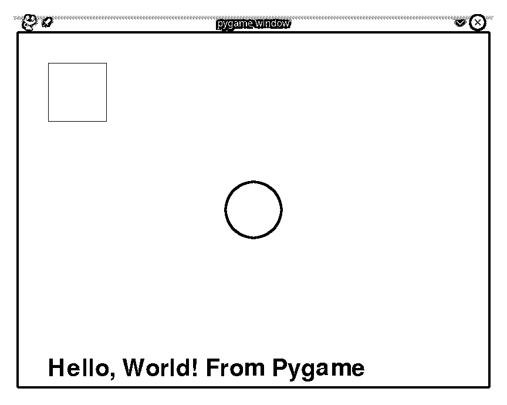](https://files.realpython.com/media/pygame-basic.bbd1d3e0d9ea.png)

此示例的代码可以在下面的可下载资料中找到:


```py
 1"""
 2Basic "Hello, World!" program in Pygame
 3
 4This program is designed to demonstrate the basic capabilities
 5of Pygame. It will:
 6- Create a game window
 7- Fill the background with white
 8- Draw some basic shapes in different colors
 9- Draw some text in a specified size and color
10- Allow you to close the window
11"""
12
13# Import and initialize the pygame library
14import pygame
15
16pygame.init()
17
18# Set the width and height of the output window, in pixels
19WIDTH = 800
20HEIGHT = 600
21
22# Set up the drawing window
23screen = pygame.display.set_mode([WIDTH, HEIGHT])
24
25# Run until the user asks to quit
26running = True
27while running:
28
29    # Did the user click the window close button?
30    for event in pygame.event.get():
31        if event.type == pygame.QUIT:
32            running = False
33
34    # Fill the background with white
35    screen.fill((255, 255, 255))
36
37    # Draw a blue circle with a radius of 50 in the center of the screen
38    pygame.draw.circle(screen, (0, 0, 255), (WIDTH // 2, HEIGHT // 2), 50)
39
40    # Draw a red-outlined square in the top-left corner of the screen
41    red_square = pygame.Rect((50, 50), (100, 100))
42    pygame.draw.rect(screen, (200, 0, 0), red_square, 1)
43
44    # Draw an orange caption along the bottom in 60-point font
45    text_font = pygame.font.SysFont("any_font", 60)
46    text_block = text_font.render(
47        "Hello, World! From Pygame", False, (200, 100, 0)
48    )
49    screen.blit(text_block, (50, HEIGHT - 50))
50
51    # Flip the display
52    pygame.display.flip()
53
54# Done! Time to quit.
55pygame.quit()
```

尽管它的期望很低，但即使是这个基本的 Pygame 程序也需要一个游戏循环和事件处理程序。游戏循环从**线 27** 开始，由`running`变量控制。将该变量设置为`False`将结束程序。

事件处理从第 30 行的**开始，伴随着**事件循环**。使用`pygame.event.get()`从队列中检索事件，并在每次循环迭代中一次处理一个事件。在这种情况下，唯一被处理的事件是`pygame.QUIT`事件，它是在用户关闭游戏窗口时生成的。当这个事件被处理时，你设置`running = False`，这将最终结束游戏循环和程序。**

Pygame 提供了各种绘制基本形状的方法，比如圆形和矩形。在该示例中，在第 38 条的**线上画了一个蓝色圆圈，在第 41 和 42 条**的**线上画了一个红色方块。请注意，绘制矩形需要您首先创建一个`Rect`对象。**

在屏幕上绘制文本稍微复杂一些。首先，在**第 45 行**上，选择一种字体并创建一个`font`对象。在第 46 到 48 行上使用该字体，调用`.render()`方法。这将创建一个包含以指定字体和颜色呈现的文本的`Surface`对象。最后，使用**行 49** 上的`.blit()`方法将`Surface`复制到屏幕上。

游戏循环的结束发生在**线 52** 处，此时先前绘制的所有内容都显示在显示器上。没有这一行，什么都不会显示。

要运行此代码，请使用以下命令:

```py
(venv) $ python pygame/pygame_basic.py
```

您应该会看到一个窗口，上面显示的图像。恭喜你！您刚刚运行了您的第一个 Pygame 程序！

[*Remove ads*](/account/join/)

### 高级应用程序

当然，Pygame 是为用 Python 写游戏而设计的。为了探究一个实际的 Pygame 游戏的功能和需求，您将通过以下细节来检查一个用 Pygame 编写的游戏:

*   玩家是屏幕上的一个精灵，通过移动鼠标来控制。
*   每隔一段时间，硬币就会一个接一个地出现在屏幕上。
*   当玩家移动每枚硬币时，硬币消失，玩家获得 10 分。
*   随着游戏的进行，硬币会更快地加入。
*   当屏幕上出现十个以上的硬币时，游戏结束。

完成后，游戏看起来会像这样:

[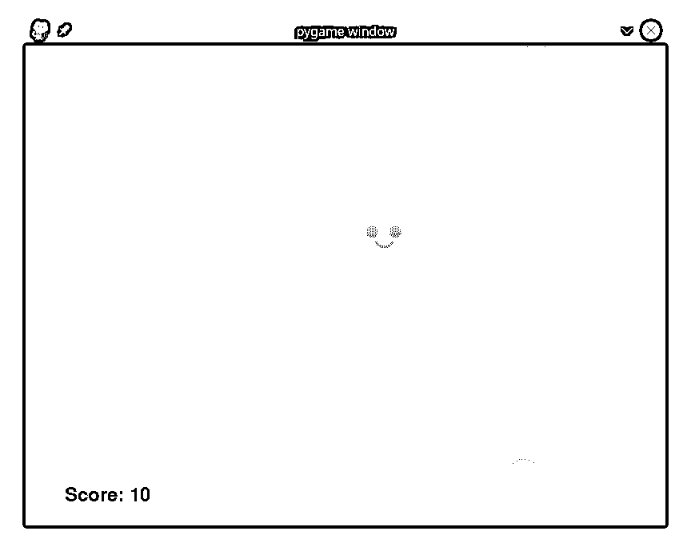](https://files.realpython.com/media/pygame-game.94ec6e22001e.png)

这个游戏的完整代码可以在下面的下载资料中找到:


```py
 1"""
 2Complete Game in Pygame
 3
 4This game demonstrates some of the more advanced features of
 5Pygame, including:
 6- Using sprites to render complex graphics
 7- Handling user mouse input
 8- Basic sound output
 9"""
 10
 11# Import and initialize the pygame library
 12import pygame
 13
 14# To randomize coin placement
 15from random import randint
 16
 17# To find your assets
 18from pathlib import Path
 19
 20# For type hinting
 21from typing import Tuple
 22
 23# Set the width and height of the output window, in pixels
 24WIDTH = 800
 25HEIGHT = 600
 26
 27# How quickly do you generate coins? Time is in milliseconds
 28coin_countdown = 2500
 29coin_interval = 100
 30
 31# How many coins can be on the screen before you end?
 32COIN_COUNT = 10
 33
 34# Define the Player sprite
 35class Player(pygame.sprite.Sprite):
 36    def __init__(self):
 37        """Initialize the player sprite"""
 38        super(Player, self).__init__()
 39
 40        # Get the image to draw for the player
 41        player_image = str(
 42            Path.cwd() / "pygame" / "images" / "alien_green_stand.png"
 43        )
 44        # Load the image, preserve alpha channel for transparency
 45        self.surf = pygame.image.load(player_image).convert_alpha()
 46        # Save the rect so you can move it
 47        self.rect = self.surf.get_rect()
 48
 49    def update(self, pos: Tuple):
 50        """Update the position of the player
 51
 52 Arguments:
 53 pos {Tuple} -- the (X,Y) position to move the player
 54 """
 55        self.rect.center = pos
 56
 57# Define the Coin sprite
 58class Coin(pygame.sprite.Sprite):
 59    def __init__(self):
 60        """Initialize the coin sprite"""
 61        super(Coin, self).__init__()
 62
 63        # Get the image to draw for the coin
 64        coin_image = str(Path.cwd() / "pygame" / "images" / "coin_gold.png")
 65
 66        # Load the image, preserve alpha channel for transparency
 67        self.surf = pygame.image.load(coin_image).convert_alpha()
 68
 69        # The starting position is randomly generated
 70        self.rect = self.surf.get_rect(
 71            center=(
 72                randint(10, WIDTH - 10),
 73                randint(10, HEIGHT - 10),
 74            )
 75        )
 76
 77# Initialize the Pygame engine
 78pygame.init()
 79
 80# Set up the drawing window
 81screen = pygame.display.set_mode(size=[WIDTH, HEIGHT])
 82
 83# Hide the mouse cursor
 84pygame.mouse.set_visible(False)
 85
 86# Set up the clock for a decent frame rate
 87clock = pygame.time.Clock()
 88
 89# Create a custom event for adding a new coin
 90ADDCOIN = pygame.USEREVENT + 1
 91pygame.time.set_timer(ADDCOIN, coin_countdown)
 92
 93# Set up the coin_list
 94coin_list = pygame.sprite.Group()
 95
 96# Initialize the score
 97score = 0
 98
 99# Set up the coin pickup sound
100coin_pickup_sound = pygame.mixer.Sound(
101    str(Path.cwd() / "pygame" / "sounds" / "coin_pickup.wav")
102)
103
104# Create a player sprite and set its initial position
105player = Player()
106player.update(pygame.mouse.get_pos())
107
108# Run until you get to an end condition
109running = True
110while running:
111
112    # Did the user click the window close button?
113    for event in pygame.event.get():
114        if event.type == pygame.QUIT:
115            running = False
116
117        # Should you add a new coin?
118        elif event.type == ADDCOIN:
119            # Create a new coin and add it to the coin_list
120            new_coin = Coin()
121            coin_list.add(new_coin)
122
123            # Speed things up if fewer than three coins are on-screen
124            if len(coin_list) < 3:
125                coin_countdown -= coin_interval
126            # Need to have some interval
127            if coin_countdown < 100:
128                coin_countdown = 100
129
130            # Stop the previous timer by setting the interval to 0
131            pygame.time.set_timer(ADDCOIN, 0)
132
133            # Start a new timer
134            pygame.time.set_timer(ADDCOIN, coin_countdown)
135
136    # Update the player position
137    player.update(pygame.mouse.get_pos())
138
139    # Check if the player has collided with a coin, removing the coin if so
140    coins_collected = pygame.sprite.spritecollide(
141        sprite=player, group=coin_list, dokill=True
142    )
143    for coin in coins_collected:
144        # Each coin is worth 10 points
145        score += 10
146        # Play the coin collected sound
147        coin_pickup_sound.play()
148
149    # Are there too many coins on the screen?
150    if len(coin_list) >= COIN_COUNT:
151        # This counts as an end condition, so you end your game loop
152        running = False
153
154    # To render the screen, first fill the background with pink
155    screen.fill((255, 170, 164))
156
157    # Draw the coins next
158    for coin in coin_list:
159        screen.blit(coin.surf, coin.rect)
160
161    # Then draw the player
162    screen.blit(player.surf, player.rect)
163
164    # Finally, draw the score at the bottom left
165    score_font = pygame.font.SysFont("any_font", 36)
166    score_block = score_font.render(f"Score: {score}", False, (0, 0, 0))
167    screen.blit(score_block, (50, HEIGHT - 50))
168
169    # Flip the display to make everything appear
170    pygame.display.flip()
171
172    # Ensure you maintain a 30 frames per second rate
173    clock.tick(30)
174
175# Done! Print the final score
176print(f"Game over! Final score: {score}")
177
178# Make the mouse visible again
179pygame.mouse.set_visible(True)
180
181# Quit the game
182pygame.quit()
```

Pygame 中的精灵提供了一些基本的功能，但是它们被设计成子类而不是独立使用。Pygame 精灵默认没有关联的图片，也不能自己定位。

为了正确地抽取和管理玩家和屏幕上的硬币，在第 35 到 55 行的**上创建了一个`Player`类，在第 58 到 75 行**的**上创建了一个`Coin`类。当每个 sprite 对象被创建时，它首先定位并加载它将显示的图像，保存在`self.surf`中。属性在屏幕上定位和移动精灵。**

定期向屏幕添加硬币是通过计时器完成的。在 Pygame 中，每当定时器到期时都会触发事件，游戏创建者可以将自己的事件定义为整数常量。在**线 90** 上定义`ADDCOIN`事件，定时器在**线 91** 上`coin_countdown`毫秒后触发事件。

由于`ADDCOIN`是一个事件，它需要在一个事件循环中处理，这发生在**的第 118 到 134 行**。该事件创建一个新的`Coin`对象，并将其添加到现有的`coin_list`中。检查屏幕上的硬币数量。如果少于三个，则`coin_countdown`减少。最后，前一个计时器停止，新的计时器开始计时。

当玩家移动时，它们会与硬币碰撞，一边碰撞一边收集硬币。这将自动从`coin_list`中移除每个收集的硬币。这也会更新乐谱并播放声音。

玩家移动发生在**线 137** 。在**行 140 到 142** 检查与屏幕上硬币的碰撞。`dokill=True`参数自动从`coin_list`中取出硬币。最后，**第 143 到 147 行**更新分数并为收集到的每枚硬币播放声音。

当用户关闭窗口，或者当屏幕上出现十个以上的硬币时，游戏结束。在**行 150 到 152** 上检查十个以上的硬币。

因为 Pygame 精灵没有内置的图像知识，他们也不知道如何在屏幕上画自己。游戏作者需要清空屏幕，按照正确的顺序画出所有的精灵，画出屏幕上的分数，然后`.flip()`显示器让一切出现。这一切都发生在第 155 到 170 行。

Pygame 是一个非常强大和完善的库，但是它也有缺点。Pygame 让游戏作者工作来得到他们的结果。由游戏作者来实现基本的精灵行为，并实现游戏循环和基本事件处理程序等关键的游戏要求。接下来，您将看到其他游戏引擎如何提供类似的结果，同时减少您必须做的工作量。

## Pygame Zero

Pygame 在许多方面做得很好，但在其他方面却显而易见。对于游戏写作初学者来说，更好的选择可以在 [Pygame Zero](https://pygame-zero.readthedocs.io/en/stable/) 找到。Pygame Zero 专为教育而设计，由一套简单的原则指导，旨在为年轻和刚入门的程序员提供完美的服务:

*   **使其可访问:**一切都是为初级程序员设计的。
*   **保守一点:**支持通用平台，避免实验特性。
*   工作就是了:确保一切正常，不要大惊小怪。
*   **最小化运行成本:**如果某些东西可能会失败，那就尽早失败。
*   **错误明显:**没有什么比不知道为什么会出错更糟糕的了。
*   做好文档:一个框架只有和它的文档一样好。
*   最小化突破性的改变:升级不需要重写你的游戏。

Pygame Zero 的文档对于初级程序员来说非常容易理解，它包括一个完整的[逐步教程](https://pygame-zero.readthedocs.io/en/stable/introduction.html)。此外，Pygame Zero 团队认识到许多初学编程的人是从 [Scratch](https://scratch.mit.edu/) 开始编码的，所以他们给[提供了一个教程](https://pygame-zero.readthedocs.io/en/stable/from-scratch.html)，演示如何将 Scratch 程序迁移到 Pygame Zero。

[*Remove ads*](/account/join/)

### Pygame 零安装

Pygame Zero 在 PyPI 上可用，您可以像在 Windows、macOS 或 Linux 上安装任何其他 Python 库一样安装它:

```py
(venv) $ python -m pip install pgzero
```

Pygame Zero，顾名思义，是建立在 Pygame 之上的，所以这一步也是将 Pygame 作为依赖库安装。Pygame Zero 默认安装在 [Raspberry Pi](https://www.raspberrypi.org/) 平台上，在 [Raspbian Jessie](https://www.raspberrypi.com/news/raspbian-jessie-is-here/) 或更高版本上。

### 基本概念

Pygame Zero 自动化了许多程序员在 Pygame 中必须手动完成的事情。默认情况下，Pygame Zero 为游戏创建者提供:

*   一个游戏循环，所以没必要写
*   处理绘图、更新和输入处理的事件模型
*   统一的图像、文本和声音处理
*   一个可用的精灵类和用户精灵的动画方法

由于这些规定，一个基本的 Pygame Zero 程序可能会非常短:


```py
 1"""
 2Basic "Hello, World!" program in Pygame Zero
 3
 4This program is designed to demonstrate the basic capabilities
 5of Pygame Zero. It will:
 6- Create a game window
 7- Fill the background with white
 8- Draw some basic shapes in different colors
 9- Draw some text in a specified size and color
10"""
11
12# Import pgzrun allows the program to run in Python IDLE
13import pgzrun
14
15# Set the width and height of your output window, in pixels
16WIDTH = 800
17HEIGHT = 600
18
19def draw():
20    """Draw is called once per frame to render everything on the screen"""
21
22    # Clear the screen first
23    screen.clear()
24
25    # Set the background color to white
26    screen.fill("white")
27
28    # Draw a blue circle with a radius of 50 in the center of the screen
29    screen.draw.filled_circle(
30        (WIDTH // 2, HEIGHT // 2), 50, "blue"
31    )
32
33    # Draw a red-outlined square in the top-left corner of the screen
34    red_square = Rect((50, 50), (100, 100))
35    screen.draw.rect(red_square, (200, 0, 0))
36
37    # Draw an orange caption along the bottom in 60-point font
38    screen.draw.text(
39        "Hello, World! From Pygame Zero!",
40        (100, HEIGHT - 50),
41        fontsize=60,
42        color="orange",
43    )
44
45# Run the program
46pgzrun.go()
```

Pygame Zero 识别出第 16 行**和第 17 行**上的常量`WIDTH`和`HEIGHT`指的是窗口的大小，并自动使用这些尺寸来创建窗口。另外，Pygame Zero 提供了一个内置的游戏循环，并且每帧调用一次**行 19 到 43** 上定义的`draw()`函数来渲染屏幕。

因为 Pygame Zero 基于 Pygame，所以继承了一些形状绘制代码。你可以看到在第 29 行**上画圆和在第 34 到 35** 行**上画正方形的相似之处:**

[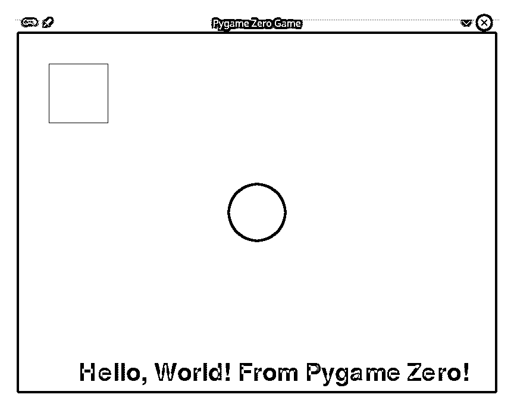](https://files.realpython.com/media/pgzero-basic.03f85e5f089c.png)

然而，文本绘制现在是对第 38 到 43 行的单个函数调用，而不是三个独立的函数。

Pygame Zero 还提供了基本的窗口处理代码，因此您可以通过单击适当的关闭按钮来关闭窗口，而不需要事件处理程序。

您可以在可下载的资料中找到演示 Pygame Zero 的一些基本功能的代码:

**获取源代码:** [点击此处获取您将使用](https://realpython.com/bonus/top-python-game-engines-project-code/)试用 Python 游戏引擎的源代码。

运行 Pygame Zero 程序是从命令行使用以下命令完成的:

```py
(venv) $ python pygame_zero/pygame_zero_basic.py
```

运行此命令将启动您的 Pygame Zero 游戏。您应该会看到一个窗口，显示基本形状和您的 Pygame Zero 问候语。

### 精灵和图像

精灵在 Pygame Zero 中被称为*演员*，他们有一些需要解释的特征:

1.  Pygame Zero 提供了`Actor`类。每个`Actor`至少有一个图像和一个位置。
2.  Pygame Zero 程序中使用的所有图像必须位于名为img/`的子文件夹中，并且只能使用小写字母、数字和下划线命名。
3.  仅使用图像的基本名称引用图像。例如，如果你的图像被称为`alien.png`，你在你的程序中引用它为`"alien"`。

由于 Pygame Zero 的这些内置特性，在屏幕上绘制精灵只需要很少的代码:

```py
 1alien = Actor("alien")
 2alien.pos = 100, 56
 3
 4WIDTH = 500
 5HEIGHT = alien.height + 20
 6
 7def draw():
 8    screen.clear()
 9    alien.draw()
```

现在，您将逐行分解这个小示例:

*   **第 1 行**创建新的`Actor`对象，给它一个要绘制的图像的名称。
*   **线 2** 设置`Actor`的初始 x 和 y 位置。
*   **第 4 行和第 5 行**设置 Pygame 零窗口的大小。注意`HEIGHT`是基于 sprite 的`.height`属性的。该值来自用于创建精灵的图像的高度。
*   **第 9 行**通过调用`Actor`对象上的`.draw()`来绘制精灵。这将在屏幕上由`.pos`提供的位置绘制精灵图像。

接下来，您将在更高级的游戏中使用这些技术。

[*Remove ads*](/account/join/)

### 高级应用程序

为了演示游戏引擎之间的区别，您将再次访问您在 Pygame 部分看到的相同的高级游戏，现在使用 Pygame Zero 编写。提醒一下，这个游戏的关键细节是:

*   玩家是屏幕上的一个精灵，通过移动鼠标来控制。
*   每隔一段时间，硬币就会一个接一个地出现在屏幕上。
*   当玩家移动每枚硬币时，硬币消失，玩家获得 10 分。
*   随着游戏的进行，硬币会更快地加入。
*   当屏幕上出现十个以上的硬币时，游戏结束。

这个游戏的外观和行为应该与之前演示的 Pygame 版本一致，只有窗口标题栏暴露了 Pygame 零原点:

[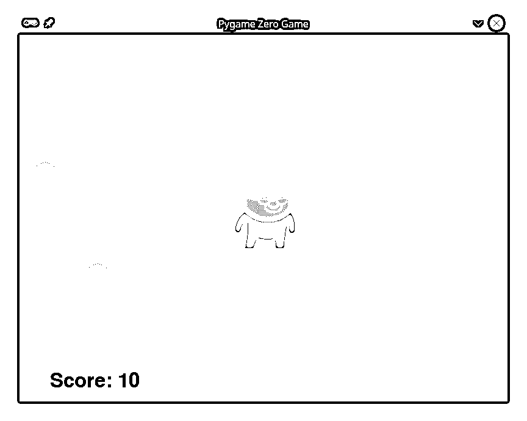](https://files.realpython.com/media/pgzero-game.9b11812969b5.png)

您可以在下面的下载资料中找到该示例的完整代码:


```py
 1"""
 2Complete game in Pygame Zero
 3
 4This game demonstrates some of the more advanced features of
 5Pygame Zero, including:
 6- Using sprites to render complex graphics
 7- Handling user input
 8- Sound output
 9
 10"""
 11
 12# Import pgzrun allows the program to run in Python IDLE
 13import pgzrun
 14
 15# For type-hinting support
 16from typing import Tuple
 17
 18# To randomize coin placement
 19from random import randint
 20
 21# Set the width and height of your output window, in pixels
 22WIDTH = 800
 23HEIGHT = 600
 24
 25# Set up the player
 26player = Actor("alien_green_stand")
 27player_position = WIDTH // 2, HEIGHT // 2
 28player.center = player_position
 29
 30# Set up the coins to collect
 31COIN_COUNT = 10
 32coin_list = list()
 33
 34# Set up a timer to create new coins
 35coin_countdown = 2.5
 36coin_interval = 0.1
 37
 38# Score is initially zero
 39score = 0
 40
 41def add_coin():
 42    """Adds a new coin to playfield, then
 43 schedules the next coin to be added
 44 """
 45    global coin_countdown
 46
 47    # Create a new coin Actor at a random location
 48    new_coin = Actor(
 49        "coin_gold", (randint(10, WIDTH - 10), randint(10, HEIGHT - 10))
 50    )
 51
 52    # Add it to the global coin list
 53    coin_list.append(new_coin)
 54
 55    # Decrease the time between coin appearances if there are
 56    # fewer than three coins on the screen.
 57    if len(coin_list) < 3:
 58        coin_countdown -= coin_interval
 59
 60    # Make sure you don't go too quickly
 61    if coin_countdown < 0.1:
 62        coin_countdown = 0.1
 63
 64    # Schedule the next coin addition
 65    clock.schedule(add_coin, coin_countdown)
 66
 67def on_mouse_move(pos: Tuple):
 68    """Called whenever the mouse changes position
 69
 70 Arguments:
 71 pos {Tuple} -- The current position of the mouse
 72 """
 73    global player_position
 74
 75    # Set the player to the mouse position
 76    player_position = pos
 77
 78    # Ensure the player doesn't move off the screen
 79    if player_position[0] < 0:
 80        player_position[0] = 0
 81    if player_position[0] > WIDTH:
 82        player_position[0] = WIDTH
 83
 84    if player_position[1] < 0:
 85        player_position[1] = 0
 86    if player_position[1] > HEIGHT:
 87        player_position[1] = HEIGHT
 88
 89def update(delta_time: float):
 90    """Called every frame to update game objects
 91
 92 Arguments:
 93 delta_time {float} -- Time since the last frame
 94 """
 95    global score
 96
 97    # Update the player position
 98    player.center = player_position
 99
100    # Check if the player has collided with a coin
101    # First, set up a list of coins to remove
102    coin_remove_list = []
103
104    # Check each coin in the list for a collision
105    for coin in coin_list:
106        if player.colliderect(coin):
107            sounds.coin_pickup.play()
108            coin_remove_list.append(coin)
109            score += 10
110
111    # Remove any coins with which you collided
112    for coin in coin_remove_list:
113        coin_list.remove(coin)
114
115    # The game is over when there are too many coins on the screen
116    if len(coin_list) >= COIN_COUNT:
117        # Stop making new coins
118        clock.unschedule(add_coin)
119
120        # Print the final score and exit the game
121        print(f"Game over! Final score: {score}")
122        exit()
123
124def draw():
125    """Render everything on the screen once per frame"""
126
127    # Clear the screen first
128    screen.clear()
129
130    # Set the background color to pink
131    screen.fill("pink")
132
133    # Draw the remaining coins
134    for coin in coin_list:
135        coin.draw()
136
137    # Draw the player
138    player.draw()
139
140    # Draw the current score at the bottom
141    screen.draw.text(
142        f"Score: {score}",
143        (50, HEIGHT - 50),
144        fontsize=48,
145        color="black",
146    )
147
148# Schedule the first coin to appear
149clock.schedule(add_coin, coin_countdown)
150
151# Run the program
152pgzrun.go()
```

创建玩家`Actor`是在**的第 26 到 28 行**完成的。初始位置是屏幕的中心。

`clock.schedule()`方法处理定期创建硬币。该方法需要调用一个函数，并在调用该函数之前确定延迟的秒数。

**第 41 到 65 行**定义了将要被调度的`add_coin()`功能。它在**第 48 到 50 行**的随机位置创建一个新硬币`Actor`，并将其添加到可见硬币的全局列表中。

随着游戏的进行，硬币应该会越来越快地出现，但不能太快。间隔管理在**线 57 至 62** 完成。因为`clock.schedule()`只会触发一次，所以你在**线路 65** 上安排了另一次呼叫。

鼠标移动在第 67 到 87 行的**事件处理程序中处理。鼠标位置被捕获并存储在**线 76** 的一个全局变量中。**第 79 行到第 87 行**确保该位置不会离开屏幕。**

将玩家位置存储在一个`global`变量中是一种便利，它简化了代码，并允许您专注于 Pygame Zero 的功能。在更完整的游戏中，你的设计选择可能会有所不同。

第 89 到 122 行定义的`update()`函数被 Pygame Zero 每帧调用一次。你用它来移动`Actor`物体并更新你所有游戏物体的状态。玩家`Actor`的位置被更新以在**线 98** 上跟踪鼠标。

与硬币的碰撞在**线 102 到 113** 上处理。如果玩家撞上了一枚硬币，那么硬币会被加到`coin_remove_list`上，分数会增加，并且会发出声音。当所有的碰撞都被处理后，你取出添加到**行 112 到 113** 的`coin_remove_list`中的硬币。

处理完硬币碰撞后，检查屏幕上的**行 116** 处是否还有过多硬币。如果是这样，游戏就结束了，所以你停止创造新的硬币，打印最后的分数，在**第 118 到 122 行**结束游戏。

当然，这一切的更新都需要体现在屏幕上。第 124 到 146 行**上的`draw()`函数在每帧`update()`之后被调用一次。在清空屏幕并在**行 128 和 131** 处填充背景色后，玩家`Actor`和所有硬币被绘制在**行 134 至 138** 处。当前分数是在**第 141 至 146 行**上绘制的最后一项。**

Pygame Zero 实现使用了 152 行代码来交付与 182 行 Pygame 代码相同的游戏。虽然这些行数是可比的，但 Pygame Zero 版本无疑比 Pygame 版本更干净、更模块化，并且可能更容易理解和编码。

当然，写游戏总会多一种方式。

## 街机

Arcade 是一个现代的 Python 框架，用于制作具有引人注目的图形和声音的游戏。通过面向对象的设计， [Arcade](https://api.arcade.academy/en/latest/index.html) 为游戏作者提供了一套现代的工具来打造出色的 Python 游戏体验。

Arcade 由美国爱荷华州辛普森学院的 Paul Craven 教授设计，建立在 T2 的 pyglet 窗口和多媒体图书馆之上。它提供了一系列改进、现代化和增强功能，与 Pygame 和 Pygame Zero 相比毫不逊色:

*   支持现代 OpenGL 图形
*   支持 Python 3 [类型提示](https://realpython.com/python-type-checking/#hello-types)
*   支持基于帧的动画精灵
*   整合了一致的命令、函数和参数名称
*   鼓励游戏逻辑与显示代码的分离
*   需要较少的样板代码
*   提供维护良好的最新[文档](https://api.arcade.academy/en/latest/index.html)，包括几个教程和完整的 Python 游戏[示例](https://api.arcade.academy/en/latest/examples/index.html)
*   内置了自顶向下和平台游戏的物理引擎

Arcade 处于不断的开发中，在社区中得到很好的支持，并且有一个对问题、错误报告和潜在修复非常敏感的作者。

[*Remove ads*](/account/join/)

### 街机安装

要安装 Arcade 及其依赖项，使用相应的 [`pip`](https://realpython.com/what-is-pip/) 命令:

```py
(venv) $ python -m pip install arcade
```

基于您的[平台](https://api.arcade.academy/en/latest/install/index.html)的完整安装说明可用于 [Windows](https://api.arcade.academy/en/latest/install/windows.html) 、 [macOS](https://api.arcade.academy/en/latest/install/mac.html) 和 [Linux](https://api.arcade.academy/en/latest/install/linux.html) 。如果你愿意，你甚至可以直接从[源](https://api.arcade.academy/en/latest/install/source.html)安装`arcade`。

### 基本概念

Arcade 中的一切都发生在一个由用户定义大小的窗口中。坐标系假设原点`(0, 0)`位于屏幕的左下角，随着你向上移动，y 坐标增加。这和其他很多游戏引擎不同，把`(0, 0)`放在左上角，增加了 y 坐标下移。

本质上，Arcade 是一个面向对象的库。虽然程序化地编写 Arcade 应用程序是可能的，但是当您创建完全面向对象的代码时，它的真正威力才会显现出来。

Arcade 和 Pygame Zero 一样，提供了内置的游戏循环和定义良好的事件模型，所以你最终得到的是非常干净易读的游戏代码。也像 Pygame Zero 一样，Arcade 提供了一个强大的 sprite 类来帮助渲染、定位和碰撞检测。此外，街机精灵可以通过提供多个图像来制作动画。

下面列出的基本 Arcade 应用程序的代码在教程的源代码中作为`arcade_basic.py`提供:


```py
 1"""
 2Basic "Hello, World!" program in Arcade
 3
 4This program is designed to demonstrate the basic capabilities
 5of Arcade. It will:
 6- Create a game window
 7- Fill the background with white
 8- Draw some basic shapes in different colors
 9- Draw some text in a specified size and color
10"""
11
12# Import arcade allows the program to run in Python IDLE
13import arcade
14
15# Set the width and height of your output window, in pixels
16WIDTH = 800
17HEIGHT = 600
18
19# Classes
20class ArcadeBasic(arcade.Window):
21    """Main game window"""
22
23    def __init__(self, width: int, height: int, title: str):
24        """Initialize the window to a specific size
25
26 Arguments:
27 width {int} -- Width of the window
28 height {int} -- Height of the window
29 title {str} -- Title for the window
30 """
31
32        # Call the parent class constructor
33        super().__init__(width, height, title)
34
35        # Set the background window
36        arcade.set_background_color(color=arcade.color.WHITE)
37
38    def on_draw(self):
39        """Called once per frame to render everything on the screen"""
40
41        # Start rendering
42        arcade.start_render()
43
44        # Draw a blue circle with a radius of 50 in the center of the screen
45        arcade.draw_circle_filled(
46            center_x=WIDTH // 2,
47            center_y=HEIGHT // 2,
48            radius=50,
49            color=arcade.color.BLUE,
50            num_segments=50,
51        )
52
53        # Draw a red-outlined square in the top-left corner of the screen
54        arcade.draw_lrtb_rectangle_outline(
55            left=50,
56            top=HEIGHT - 50,
57            bottom=HEIGHT - 100,
58            right=100,
59            color=arcade.color.RED,
60            border_width=3,
61        )
62
63        # Draw an orange caption along the bottom in 60-point font
64        arcade.draw_text(
65            text="Hello, World! From Arcade!",
66            start_x=100,
67            start_y=50,
68            font_size=28,
69            color=arcade.color.ORANGE,
70        )
71
72# Run the program
73if __name__ == "__main__":
74    arcade_game = ArcadeBasic(WIDTH, HEIGHT, "Arcade Basic Game")
75    arcade.run()
```

要运行此代码，请使用以下命令:

```py
(venv) $ python arcade/arcade_basic.py
```

该程序在屏幕上绘制一些形状和一些文本，如前面显示的基本示例所示:

[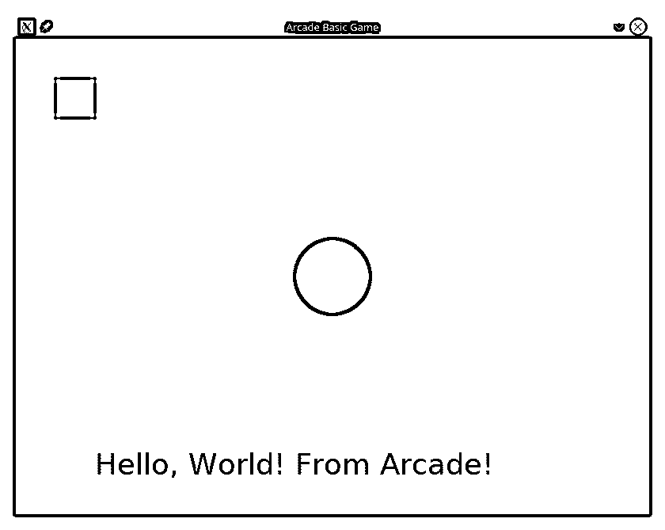](https://files.realpython.com/media/arcade-basic.1b3f1f033717.png)

如上所述，街机程序可以写成完全面向对象的代码。这个`arcade.Window`类被设计成你的游戏的子类，如**第 20 行**所示。在**线 33** 上调用`super().__init()`确保游戏窗口被正确设置。

Arcade 每帧调用一次**行 38 到 70** 上定义的`.on_draw()`事件处理程序，将所有内容渲染到屏幕上。这个方法从调用`.start_render()`开始，它告诉 Arcade 准备窗口进行绘制。这相当于 Pygame 绘制步骤结束时需要的`pygame.flip()`调用。

Arcade 中的每个基本形状绘制方法都以`draw_*`开始，并且需要一条线来完成。Arcade 内置了对[众多形状](https://api.arcade.academy/en/latest/api/drawing_primitives.html)的绘图支持。

Arcade 在`arcade.color`包中装载了[数百种命名的颜色](https://api.arcade.academy/en/latest/arcade.color.html)，但你也可以使用 RGB 或 RGBA 元组自由选择自己的颜色。

### 高级应用程序

为了展示 Arcade 与其他游戏引擎的不同，您将看到以前的相同游戏，现在在 Arcade 中实现。提醒一下，以下是游戏的关键细节:

*   玩家是屏幕上的一个精灵，通过移动鼠标来控制。
*   每隔一段时间，硬币就会一个接一个地出现在屏幕上。
*   当玩家移动每枚硬币时，硬币消失，玩家获得 10 分。
*   随着游戏的进行，硬币会更快地加入。
*   当屏幕上出现十个以上的硬币时，游戏结束。

同样，游戏的行为应该与前面的示例相同:

[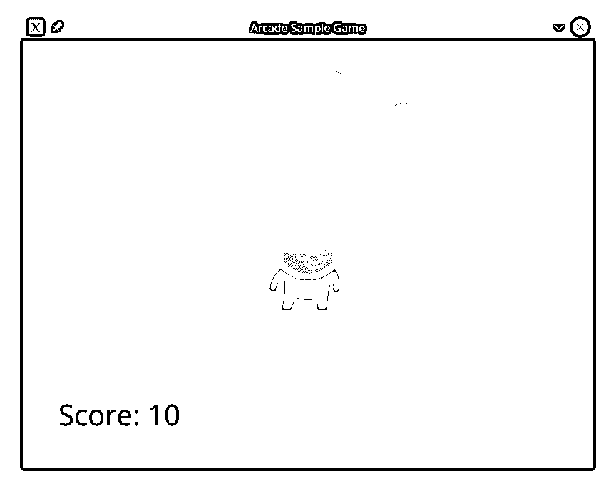](https://files.realpython.com/media/arcade-game.86aef9b5a501.png)

下面列出的完整街机游戏代码在可下载资料中以`arcade_game.py`的形式提供:


```py
 1"""
 2Complete game in Arcade
 3
 4This game demonstrates some of the more advanced features of
 5Arcade, including:
 6- Using sprites to render complex graphics
 7- Handling user input
 8- Sound output
 9"""
 10
 11# Import arcade allows the program to run in Python IDLE
 12import arcade
 13
 14# To randomize coin placement
 15from random import randint
 16
 17# To locate your assets
 18from pathlib import Path
 19
 20# Set the width and height of your game window, in pixels
 21WIDTH = 800
 22HEIGHT = 600
 23
 24# Set the game window title
 25TITLE = "Arcade Sample Game"
 26
 27# Location of your assets
 28ASSETS_PATH = Path.cwd() / "assets"
 29
 30# How many coins must be on the screen before the game is over?
 31COIN_COUNT = 10
 32
 33# How much is each coin worth?
 34COIN_VALUE = 10
 35
 36# Classes
 37class ArcadeGame(arcade.Window):
 38    """The Arcade Game class"""
 39
 40    def __init__(self, width: float, height: float, title: str):
 41        """Create the main game window
 42
 43 Arguments:
 44 width {float} -- Width of the game window
 45 height {float} -- Height of the game window
 46 title {str} -- Title for the game window
 47 """
 48
 49        # Call the super class init method
 50        super().__init__(width, height, title)
 51
 52        # Set up a timer to create new coins
 53        self.coin_countdown = 2.5
 54        self.coin_interval = 0.1
 55
 56        # Score is initially zero
 57        self.score = 0
 58
 59        # Set up empty sprite lists
 60        self.coins = arcade.SpriteList()
 61
 62        # Don't show the mouse cursor
 63        self.set_mouse_visible(False)
 64
 65    def setup(self):
 66        """Get the game ready to play"""
 67
 68        # Set the background color
 69        arcade.set_background_color(color=arcade.color.PINK)
 70
 71        # Set up the player
 72        sprite_image = ASSETS_PATH / "images" / "alien_green_stand.png"
 73        self.player = arcade.Sprite(
 74            filename=sprite_image, center_x=WIDTH // 2, center_y=HEIGHT // 2
 75        )
 76
 77        # Spawn a new coin
 78        arcade.schedule(
 79            function_pointer=self.add_coin, interval=self.coin_countdown
 80        )
 81
 82        # Load your coin collision sound
 83        self.coin_pickup_sound = arcade.load_sound(
 84            ASSETS_PATH / "sounds" / "coin_pickup.wav"
 85        )
 86
 87    def add_coin(self, dt: float):
 88        """Add a new coin to the screen, reschedule the timer if necessary
 89
 90 Arguments:
 91 dt {float} -- Time since last call (unused)
 92 """
 93
 94        # Create a new coin
 95        coin_image = ASSETS_PATH / "images" / "coin_gold.png"
 96        new_coin = arcade.Sprite(
 97            filename=coin_image,
 98            center_x=randint(20, WIDTH - 20),
 99            center_y=randint(20, HEIGHT - 20),
100        )
101
102        # Add the coin to the current list of coins
103        self.coins.append(new_coin)
104
105        # Decrease the time between coin appearances, but only if there are
106        # fewer than three coins on the screen.
107        if len(self.coins) < 3:
108            self.coin_countdown -= self.coin_interval
109
110            # Make sure you don't go too quickly
111            if self.coin_countdown < 0.1:
112                self.coin_countdown = 0.1
113
114            # Stop the previously scheduled call
115            arcade.unschedule(function_pointer=self.add_coin)
116
117            # Schedule the next coin addition
118            arcade.schedule(
119                function_pointer=self.add_coin, interval=self.coin_countdown
120            )
121
122    def on_mouse_motion(self, x: float, y: float, dx: float, dy: float):
123        """Processed when the mouse moves
124
125 Arguments:
126 x {float} -- X Position of the mouse
127 y {float} -- Y Position of the mouse
128 dx {float} -- Change in x position since last move
129 dy {float} -- Change in y position since last move
130 """
131
132        # Ensure the player doesn't move off-screen
133        self.player.center_x = arcade.clamp(x, 0, WIDTH)
134        self.player.center_y = arcade.clamp(y, 0, HEIGHT)
135
136    def on_update(self, delta_time: float):
137        """Update all the game objects
138
139 Arguments:
140 delta_time {float} -- How many seconds since the last frame?
141 """
142
143        # Check if you've picked up a coin
144        coins_hit = arcade.check_for_collision_with_list(
145            sprite=self.player, sprite_list=self.coins
146        )
147
148        for coin in coins_hit:
149            # Add the coin score to your score
150            self.score += COIN_VALUE
151
152            # Play the coin sound
153            arcade.play_sound(self.coin_pickup_sound)
154
155            # Remove the coin
156            coin.remove_from_sprite_lists()
157
158        # Are there more coins than allowed on the screen?
159        if len(self.coins) > COIN_COUNT:
160            # Stop adding coins
161            arcade.unschedule(function_pointer=self.add_coin)
162
163            # Show the mouse cursor
164            self.set_mouse_visible(True)
165
166            # Print the final score and exit the game
167            print(f"Game over! Final score: {self.score}")
168            exit()
169
170    def on_draw(self):
171        """Draw everything"""
172
173        # Start the rendering pass
174        arcade.start_render()
175
176        # Draw the coins
177        self.coins.draw()
178
179        # Draw the player
180        self.player.draw()
181
182        # Draw the score in the lower-left corner
183        arcade.draw_text(
184            text=f"Score: {self.score}",
185            start_x=50,
186            start_y=50,
187            font_size=32,
188            color=arcade.color.BLACK,
189        )
190
191if __name__ == "__main__":
192    arcade_game = ArcadeGame(WIDTH, HEIGHT, TITLE)
193    arcade_game.setup()
194    arcade.run()
```

Arcade 的面向对象特性允许您通过将游戏的初始化与每个不同级别的初始化分开来快速实现不同的级别。游戏在**第 40 到 63** 行的`.__init__()`方法中初始化，而关卡在**第 65 到 85** 行使用单独的`.setup()`方法设置和重启。这是一个很好的模式，即使是像这样只有一个关卡的游戏。

精灵是通过创建一个类`arcade.Sprite`的对象，并提供一个图像的路径来定义的。Arcade 支持 [pathlib](https://realpython.com/python-pathlib/) 路径，这使得在**第 72 到 75 行**上创建玩家精灵变得更加容易。

创建新硬币是在第 78 行到第 80 行的**上处理的，它们每隔一段时间调用`arcade.schedule()`来调用`self.add_coin()`方法。**

在**第 87 到 120 行**定义的`.add_coin()`方法在一个随机的位置创建一个新的硬币精灵，并将其添加到一个列表中，以简化绘图以及以后的碰撞处理。

要使用鼠标移动玩家，您需要在第 122 行到第 134 行的**上实现`.on_mouse_motion()`方法。`arcade.clamp()`方法确保玩家的中心坐标不会离开屏幕。**

检查玩家和硬币之间的碰撞是在**行 144 到 156** 的`.on_update()`方法中处理的。方法返回列表中所有与指定精灵冲突的精灵的列表。代码遍历列表，增加分数并播放声音效果，然后将每个硬币移出游戏。

`.on_update()`方法还检查在**行 159 到 168** 上是否有太多的硬币。如果是，游戏结束。

这个 Arcade 实现和 Pygame Zero 代码一样易读和结构良好，尽管它用了超过 27%的代码，写了 194 行。较长的代码可能是值得的，因为 Arcade 提供了更多这里没有展示的功能，例如:

*   动画精灵
*   几个内置的物理引擎
*   支持第三方游戏地图
*   更新的粒子和着色器系统

来自 Python Zero 的新游戏作者会发现 Arcade 在结构上类似，但提供了更强大和更广泛的功能。

[*Remove ads*](/account/join/)

## adventure lib〔t0〕

当然，并不是每个游戏都需要一个彩色的玩家在屏幕上移动，躲避障碍，杀死坏人。像 [Zork](https://en.wikipedia.org/wiki/Zork) 这样的经典电脑游戏展示了好故事的力量，同时还提供了很好的游戏体验。制作这些基于文本的游戏，也被称为[互动小说](https://en.wikipedia.org/wiki/Interactive_fiction)，在任何语言中都很难。对 Python 程序员来说幸运的是，有 adventurelib:

> adventurelib 提供了编写基于文本的冒险游戏的基本功能，目的是让青少年也能轻松完成。([来源](https://adventurelib.readthedocs.io/en/stable/))

然而，这不仅仅是针对青少年的！adventurelib 非常适合那些想编写基于文本的游戏而不需要编写自然语言解析器的人。

adventurelib 由 Pygame Zero 背后的人创建，它处理更高级的计算机科学主题，例如状态管理、业务逻辑、命名和引用以及集合操作等等。这使它成为教育工作者、家长和导师帮助年轻人通过游戏学习计算机科学的伟大的下一步。这对拓展你自己的游戏编码技能也很有帮助。

### adventurelib 安装

PyPI 上有 adventurelib，可以使用适当的`pip`命令进行安装:

```py
(venv) $ python -m pip install adventurelib
```

adventurelib 是一个单独的文件，所以也可以从 [GitHub repo](https://github.com/lordmauve/adventurelib) 中下载，保存在和你的游戏相同的文件夹中，直接使用。

### 基本概念

为了学习 adventurelib 的基础知识，您将看到一个有三个房间的小游戏和一把打开下面最后一个房间的门的钥匙。该示例游戏的代码在`adventurelib_basic.py`的可下载资料中提供:


```py
 1"""
 2Basic "Hello, World!" program in adventurelib
 3
 4This program is designed to demonstrate the basic capabilities
 5of adventurelib. It will:
 6- Create a basic three-room world
 7- Add a single inventory item
 8- Require that inventory item to move to the final room
 9"""
 10
 11# Import the library contents
 12import adventurelib as adv
 13
 14# Define your rooms
 15bedroom = adv.Room(
 16    """
 17You are in your bedroom. The bed is unmade, but otherwise
 18it's clean. Your dresser is in the corner, and a desk is
 19under the window.
 20"""
 21)
 22
 23living_room = adv.Room(
 24    """
 25The living room stands bright and empty. The TV is off,
 26and the sun shines brightly through the curtains.
 27"""
 28)
 29
 30front_porch = adv.Room(
 31    """
 32The creaky boards of your front porch welcome you as an
 33old friend. Your front door mat reads 'Welcome'.
 34"""
 35)
 36
 37# Define the connections between the rooms
 38bedroom.south = living_room
 39living_room.east = front_porch
 40
 41# Define a constraint to move from the bedroom to the living room
 42# If the door between the living room and front porch door is locked,
 43# you can't exit
 44living_room.locked = {"east": True}
 45
 46# None of the other rooms have any locked doors
 47bedroom.locked = dict()
 48front_porch.locked = dict()
 49
 50# Set the starting room as the current room
 51current_room = bedroom
 52
 53# Define functions to use items
 54def unlock_living_room(current_room):
 55
 56    if current_room == living_room:
 57        print("You unlock the door.")
 58        current_room.locked["east"] = False
 59    else:
 60        print("There is nothing to unlock here.")
 61
 62# Create your items
 63key = adv.Item("a front door key", "key")
 64key.use_item = unlock_living_room
 65
 66# Create empty Bags for room contents
 67bedroom.contents = adv.Bag()
 68living_room.contents = adv.Bag()
 69front_porch.contents = adv.Bag()
 70
 71# Put the key in the bedroom
 72bedroom.contents.add(key)
 73
 74# Set up your current empty inventory
 75inventory = adv.Bag()
 76
 77# Define your movement commands
 78@adv.when("go DIRECTION")
 79@adv.when("north", direction="north")
 80@adv.when("south", direction="south")
 81@adv.when("east", direction="east")
 82@adv.when("west", direction="west")
 83@adv.when("n", direction="north")
 84@adv.when("s", direction="south")
 85@adv.when("e", direction="east")
 86@adv.when("w", direction="west")
 87def go(direction: str):
 88    """Processes your moving direction
 89
 90 Arguments:
 91 direction {str} -- which direction does the player want to move
 92 """
 93
 94    # What is your current room?
 95    global current_room
 96
 97    # Is there an exit in that direction?
 98    next_room = current_room.exit(direction)
 99    if next_room:
100        # Is the door locked?
101        if direction in current_room.locked and current_room.locked[direction]:
102            print(f"You can't go {direction} --- the door is locked.")
103        else:
104            current_room = next_room
105            print(f"You go {direction}.")
106            look()
107
108    # No exit that way
109    else:
110        print(f"You can't go {direction}.")
111
112# How do you look at the room?
113@adv.when("look")
114def look():
115    """Looks at the current room"""
116
117    # Describe the room
118    adv.say(current_room)
119
120    # List the contents
121    for item in current_room.contents:
122        print(f"There is {item} here.")
123
124    # List the exits
125    print(f"The following exits are present: {current_room.exits()}")
126
127# How do you look at items?
128@adv.when("look at ITEM")
129@adv.when("inspect ITEM")
130def look_at(item: str):
131
132    # Check if the item is in your inventory or not
133    obj = inventory.find(item)
134    if not obj:
135        print(f"You don't have {item}.")
136    else:
137        print(f"It's an {obj}.")
138
139# How do you pick up items?
140@adv.when("take ITEM")
141@adv.when("get ITEM")
142@adv.when("pickup ITEM")
143def get(item: str):
144    """Get the item if it exists
145
146 Arguments:
147 item {str} -- The name of the item to get
148 """
149    global current_room
150
151    obj = current_room.contents.take(item)
152    if not obj:
153        print(f"There is no {item} here.")
154    else:
155        print(f"You now have {item}.")
156        inventory.add(obj)
157
158# How do you use an item?
159@adv.when("unlock door", item="key")
160@adv.when("use ITEM")
161def use(item: str):
162    """Use an item, consumes it if used
163
164 Arguments:
165 item {str} -- Which item to use
166 """
167
168    # First, do you have the item?
169    obj = inventory.take(item)
170    if not obj:
171        print(f"You don't have {item}")
172
173    # Try to use the item
174    else:
175        obj.use_item(current_room)
176
177if __name__ == "__main__":
178    # Look at the starting room
179    look()
180
181    adv.start()
```

要运行此代码，请使用以下命令:

```py
(venv) $ python adventurelib/adventurelib_basic.py
```

基于文本的游戏严重依赖于解析用户输入来驱动游戏前进。adventurelib 将玩家键入的文本定义为一个*命令*，并提供`@when()` [装饰器](https://realpython.com/primer-on-python-decorators/)来定义命令。

命令的一个很好的例子是在**行 113 到 125** 上定义的`look`命令。`@when("look")`装饰器将文本`look`添加到有效命令列表中，并将其连接到`look()`函数。每当玩家键入`look`，adventurelib 就会调用`look()`函数。

玩家输入的命令不区分大小写。玩家可以键入`look`、`LOOK`、`Look`，甚至`lOOk`，adventurelib 会找到正确的命令。

多个命令可以使用相同的功能，如第 78 到 110 行**的`go()`功能所示。这个功能由九个独立的命令装饰，允许玩家以几种不同的方式在游戏世界中移动。在下面的游戏示例中，命令`south`、`east`和`north`都被使用，但是每一个都导致相同的函数被调用:**

[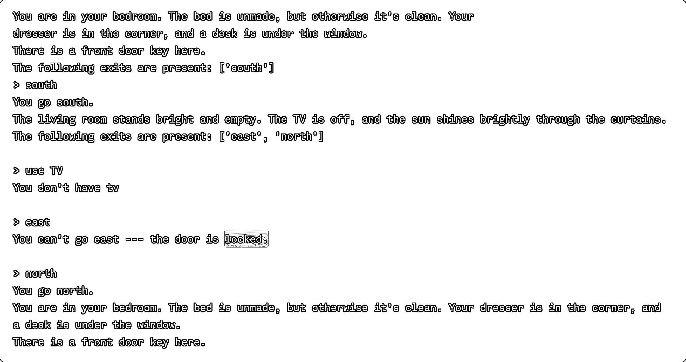](https://files.realpython.com/media/adventurelib_screenshot.776d25728ac7.png)

有时候玩家输入的命令是针对某个特定的物品的。例如，玩家可能想看某个特定的东西或者朝某个特定的方向走。游戏设计者可以通过在`@when()`装饰器中指定大写单词来捕获额外的**命令上下文**。这些被视为变量名，玩家在它们的位置键入的文本就是值。

这可以在第 128 到 137 行的`look_at()`功能中看到。这个函数定义了一个名为`item`的字符串参数。在定义`look at`和`inspect`命令的`@when()`装饰器中，单词`ITEM`充当命令后面任何文本的占位符。然后，该文本作为`item`参数传递给`look_at()`函数。比如玩家输入`look at book`，那么参数`item`就会得到值`"book"`。

基于文本的游戏的优势依赖于其文本的描述性。虽然您可以并且应该使用`print()`函数，但是为了响应用户命令而打印多行文本会给跨多行文本和确定换行符带来困难。adventurelib 通过`say()`函数减轻了这一负担，该函数可以很好地处理[三重引用的多行字符串](https://docs.python.org/3.7/library/stdtypes.html#textseq)。

您可以在`look()`功能中的**线 118** 上看到`say()`功能正在运行。每当玩家输入`look`时，`say()`功能就会向控制台输出当前房间的描述。

当然，你的命令需要出现的地方。adventurelib 提供了`Room`类来定义游戏世界的不同区域。通过提供房间的描述来创建房间，并且可以使用`.north`、`.south`、`.east`和`.west`属性将它们连接到其他房间。您还可以定义应用于整个`Room`类或单个对象的自定义属性。

这个游戏中的三个房间是在**15 到 35** 线创建的。`Room()`构造函数接受字符串形式的描述，或者在本例中，接受多行字符串形式的描述。一旦你创建了房间，然后你在第 38 到 39 行**上连接它们。将`bedroom.south`设置为`living_room`意味着`living_room.north`将成为`bedroom`。adventurelib 足够智能，可以自动建立这种连接。**

您还可以在**线 44** 上创建一个约束，以指示起居室和前廊之间的一扇锁着的门。打开这扇门需要玩家找到一个**物品**。

基于文本的游戏通常以必须收集的物品为特色，以打开游戏的新领域或解决某些谜题。物品也可以代表玩家可以与之互动的非玩家角色。adventurelib 提供了`Item`类来通过名字和别名定义可收集的物品和非玩家角色。例如，别名`key`是指前门钥匙:

[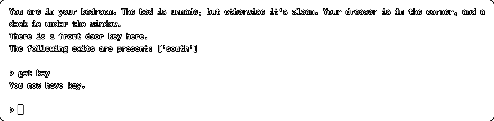](https://files.realpython.com/media/adventurelib_screenshot_2.da4c6a432924.png)

在**第 63 行**，你定义了用于打开客厅和前廊之间的门的`key`。`Item()`构造函数接受一个或多个字符串。第一个是项目的默认名称或全名，在打印项目名称时使用。所有其他名称都被用作别名，因此玩家不必键入项目的全名。

这个`key`不仅仅有名字和别名。它还有一个预期用途，在**行 64** 中定义。`key.use_item`是指当玩家试图通过输入`"use key"`来使用该物品时将被调用的功能。该功能在**行 159 至 175** 定义的`use()`命令处理器中调用。

物品的集合，例如玩家的物品清单或房间地面上的物品，可以存储在一个`Bag`对象中。您可以向包中添加物品，从包中取出物品，以及检查包中的物品。`Bag`对象在 Python 中是可迭代的，所以你也可以使用`in`来测试包里是否有东西，并在`for`循环中遍历包里的内容。

四个不同的`Bag`对象被定义在**行 67 到 75** 上。三个房间中的每一个都有一个`Bag`来存放房间中的物品，玩家也有一个`Bag`来存放他们拾取的`inventory`物品。`key`项目被放置在`bedroom`的起始位置。

物品通过**行 140 到 156** 定义的`get()`功能添加到玩家的物品清单中。当玩家输入`get key`时，你试图在**行 151** 上`take()`房间`contents`包中的物品。如果`key`被归还，它也会从房间的`contents`中移除。然后将`key`添加到玩家的`inventory`中的**行 156** 处。

[*Remove ads*](/account/join/)

### 高级应用程序

当然，adventurelib 还有更多内容。为了展示它的其他功能，您将使用下面的背景故事来创建一个更复杂的文本冒险:

*   你住在一个安静的小村庄里。
*   最近，你的邻居开始抱怨丢失的牲畜。
*   作为夜间巡逻队的一员，你注意到一个破损的栅栏和一条离开它的痕迹。
*   你决定去调查，只带了一把练习用的木剑。

这个游戏有几个方面需要描述和定义:

*   你安静的小村庄
*   这条小路远离田野
*   附近的一个村庄，在那里你可以买到更好的武器
*   一条通往能为你的武器附魔的巫师的小路
*   一个洞穴，里面有一个拿走你牲畜的巨人

有几个项目需要收集，如武器和食物，以及与角色互动。你还需要一个基本的战斗系统来让你与巨人战斗并赢得比赛。

这个游戏的所有代码都列在下面，可以在下载的资料中找到:

**获取源代码:** [点击此处获取您将使用](https://realpython.com/bonus/top-python-game-engines-project-code/)试用 Python 游戏引擎的源代码。

为了让事情有条理，你把你的游戏分成不同的文件:

*   `adventurelib_game_rooms.py`定义房间和区域。
*   `adventurelib_game_items.py`定义项目及其属性。
*   `adventurelib_game_characters.py`定义您可以与之互动的角色。
*   把所有东西放在一起，添加命令，然后开始游戏。


```py
 1"""
 2Complete game written in adventurelib
 3
 4This program is designed to demonstrate the capabilities
 5of adventurelib. It will:
 6- Create a large world in which to wander
 7- Contain several inventory items
 8- Set contexts for moving from one area to another
 9- Require some puzzle-solving skills
 10"""
 11
 12# Import the library contents
 13# from adventurelib import *
 14import adventurelib as adv
 15
 16# Import your rooms, which imports your items and characters
 17import adventurelib_game_rooms
 18
 19import adventurelib_game_items
 20
 21# For your battle sequence
 22from random import randint
 23
 24# To allow you to exit the game
 25import sys
 26
 27# Set the first room
 28current_room = adventurelib_game_rooms.home
 29current_room.visited = False
 30
 31# How many HP do you have?
 32hit_points = 20
 33
 34# How many HP does the giant have?
 35giant_hit_points = 50
 36
 37# Your current inventory
 38inventory = adv.Bag()
 39
 40# Some basic item commands
 41@adv.when("inventory")
 42@adv.when("inv")
 43@adv.when("i")
 44def list_inventory():
 45    if inventory:
 46        print("You have the following items:")
 47        for item in inventory:
 48            print(f"  - {item.description}")
 49    else:
 50        print("You have nothing in your inventory.")
 51
 52@adv.when("look at ITEM")
 53def look_at(item: str):
 54    """Prints a short description of an item if it is either:
 55 1\. in the current room, or
 56 2\. in our inventory
 57
 58 Arguments:
 59 item {str} -- the item to look at
 60 """
 61
 62    global inventory, current_room
 63
 64    # Check if the item is in the room
 65    obj = current_room.items.find(item)
 66    if not obj:
 67        # Check if the item is in your inventory
 68        obj = inventory.find(item)
 69        if not obj:
 70            print(f"I can't find {item} anywhere.")
 71        else:
 72            print(f"You have {item}.")
 73    else:
 74        print(f"You see {item}.")
 75
 76@adv.when("describe ITEM")
 77def describe(item: str):
 78    """Prints a description of an item if it is either:
 79 1\. in the current room, or
 80 2\. in your inventory
 81
 82 Arguments:
 83 item {str} -- the item to look at
 84 """
 85
 86    global inventory, current_room
 87
 88    # Check if the item is in the room
 89    obj = current_room.items.find(item)
 90    if not obj:
 91        # Check if the item is in your inventory
 92        obj = inventory.find(item)
 93        if not obj:
 94            print(f"I can't find {item} anywhere.")
 95        else:
 96            print(f"You have {obj.description}.")
 97    else:
 98        print(f"You see {obj.description}.")
 99
100@adv.when("take ITEM")
101@adv.when("get ITEM")
102@adv.when("pickup ITEM")
103@adv.when("pick up ITEM")
104@adv.when("grab ITEM")
105def take_item(item: str):
106    global current_room
107
108    obj = current_room.items.take(item)
109    if not obj:
110        print(f"I don't see {item} here.")
111    else:
112        print(f"You now have {obj.description}.")
113        inventory.add(obj)
114
115@adv.when("eat ITEM")
116def eat(item: str):
117    global inventory
118
119    # Make sure you have the thing first
120    obj = inventory.find(item)
121
122    # Do you have this thing?
123    if not obj:
124        print(f"You don't have {item}.")
125
126    # Is it edible?
127    elif obj.edible:
128        print(f"You savor every bite of {obj.description}.")
129        inventory.take(item)
130
131    else:
132        print(f"How do you propose we eat {obj.description}?")
133
134@adv.when("wear ITEM")
135@adv.when("put on ITEM")
136def wear(item: str):
137    global inventory
138
139    # Make sure you have the thing first
140    obj = inventory.find(item)
141
142    # Do you have this thing?
143    if not obj:
144        print(f"You don't have {item}.")
145
146    # Is it wearable?
147    elif obj.wearable:
148        print(f"The {obj.description} makes a wonderful fashion statement!")
149
150    else:
151        print(
152            f"""This is no time for avant garde fashion choices!
153 Wear a {obj.description}? Really?"""
154        )
155
156# Some character-specific commands
157@adv.when("talk to CHARACTER")
158def talk_to(character: str):
159    global current_room
160
161    char = current_room.characters.find(character)
162
163    # Is the character there?
164    if not char:
165        print(f"Sorry, I can't find {character}.")
166
167    # It's a character who is there
168    else:
169        # Set the context, and start the encounter
170        adv.set_context(char.context)
171        adv.say(char.greeting)
172
173@adv.when("yes", context="elder")
174def yes_elder():
175    global current_room
176
177    adv.say(
178        """
179 It is not often one of our number leaves, and rarer still if they leave
180 to defend our Home. Go with our blessing, and our hope for a successful
181 journey and speedy return. To help, we bestow three gifts.
182
183 The first is one of knowledge. There is a blacksmith in one of the
184 neighboring villages. You may find help there.
185
186 Second, seek a wizard who lives as a hermit, who may be persuaded to
187 give aid. Be wary, though! The wizard does not give away his aid for
188 free. As he tests you, remember always where you started your journey.
189
190 Lastly, we don't know what dangers you may face. We are peaceful people,
191 but do not wish you to go into the world undefended. Take this meager
192 offering, and use it well!
193 """
194    )
195    inventory.add(adventurelib_game_items.wooden_sword)
196    current_room.locked_exits["south"] = False
197
198@adv.when("thank you", context="elder")
199@adv.when("thanks", context="elder")
200def thank_elder():
201    adv.say("It is we who should thank you. Go with our love and hopes!")
202
203@adv.when("yes", context="blacksmith")
204def yes_blacksmith():
205    global current_room
206
207    adv.say(
208        """
209 I can see you've not a lot of money. Usually, everything here
210 if pretty expensive, but I just might have something...
211
212 There's this steel sword here, if you want it. Don't worry --- it
213 doesn't cost anything! It was dropped off for repair a few weeks
214 ago, but the person never came back for it. It's clean, sharp,
215 well-oiled, and will do a lot more damage than that
216 fancy sword-shaped club you've got. I need it gone to clear some room.
217
218 If you want, we could trade even up --- the wooden sword for the
219 steel one. I can use yours for fire-starter. Deal?
220 """
221    )
222    adv.set_context("blacksmith.trade")
223
224@adv.when("yes", context="blacksmith.trade")
225def trade_swords_yes():
226    print("Great!")
227    inventory.take("wooden sword")
228    inventory.add(adventurelib_game_items.steel_sword)
229
230@adv.when("no", context="blacksmith.trade")
231def trade_swords_no():
232    print("Well, that's all I have within your budget. Good luck!")
233    adv.set_context(None)
234
235@adv.when("yes", context="wizard")
236def yes_wizard():
237    global current_room
238
239    adv.say(
240        """
241 I can make your weapon more powerful than it is, but only if
242 you can answer my riddle:
243
244 What has one head...
245 One foot...
246 But four legs?
247 """
248    )
249
250    adv.set_context("wizard.riddle")
251
252@adv.when("bed", context="wizard.riddle")
253@adv.when("a bed", context="wizard.riddle")
254def answer_riddle():
255    adv.say("You are smarter than you believe yourself to be! Behold!")
256
257    obj = inventory.find("sword")
258    obj.bonus = 2
259    obj.description += ", which glows with eldritch light"
260
261    adv.set_context(None)
262    current_room.locked_exits["west"] = False
263
264@adv.when("fight CHARACTER", context="giant")
265def fight_giant(character: str):
266
267    global giant_hit_points, hit_points
268
269    sword = inventory.find("sword")
270
271    # The player gets a swing
272    player_attack = randint(1, sword.damage + 1) + sword.bonus
273    print(f"You swing your {sword}, doing {player_attack} damage!")
274    giant_hit_points -= player_attack
275
276    # Is the giant dead?
277    if giant_hit_points <= 0:
278        end_game(victory=True)
279
280    print_giant_condition()
281    print()
282
283    # Then the giant tries
284    giant_attack = randint(0, 5)
285    if giant_attack == 0:
286        print("The giant's arm whistles harmlessly over your head!")
287    else:
288        print(
289            f"""
290 The giant swings his mighty fist,
291 and does {giant_attack} damage!
292 """
293        )
294        hit_points -= giant_attack
295
296    # Is the player dead?
297    if hit_points <= 0:
298        end_game(victory=False)
299
300    print_player_condition()
301    print()
302
303def print_giant_condition():
304
305    if giant_hit_points < 10:
306        print("The giant staggers, his eyes unfocused.")
307    elif giant_hit_points < 20:
308        print("The giant's steps become more unsteady.")
309    elif giant_hit_points < 30:
310        print("The giant sweats and wipes the blood from his brow.")
311    elif giant_hit_points < 40:
312        print("The giant snorts and grits his teeth against the pain.")
313    else:
314        print("The giant smiles and readies himself for the attack.")
315
316def print_player_condition():
317
318    if hit_points < 4:
319        print("Your eyes lose focus on the giant as you sway unsteadily.")
320    elif hit_points < 8:
321        print(
322            """
323 Your footing becomes less steady
324 as you swing your sword sloppily.
325 """
326        )
327    elif hit_points < 12:
328        print(
329            """
330 Blood mixes with sweat on your face
331 as you wipe it from your eyes.
332 """
333        )
334    elif hit_points < 16:
335        print("You bite down as the pain begins to make itself felt.")
336    else:
337        print("You charge into the fray valiantly!")
338
339def end_game(victory: bool):
340    if victory:
341        adv.say(
342            """
343 The giant falls to his knees as the last of his strength flees
344 his body. He takes one final swing at you, which you dodge easily.
345 His momentum carries him forward, and he lands face down in the dirt.
346 His final breath escapes his lips as he succumbs to your attack.
347
348 You are victorious! Your name will be sung for generations!
349 """
350        )
351
352    else:
353        adv.say(
354            """
355 The giant's mighty fist connects with your head, and the last
356 sound you hear are the bones in your neck crunching. You spin
357 and tumble down, your sword clattering to the floor
358 as the giant laughs.
359 Your eyes see the giant step towards you, his mighty foot
360 raised to crash down on you.
361 Oblivion takes over before you experience anything else...
362
363 You have been defeated! The giant is free to ravage your town!
364 """
365        )
366
367    sys.exit()
368
369@adv.when("flee", context="giant")
370def flee():
371    adv.say(
372        """
373 As you turn to run, the giant reaches out and catches your tunic.
374 He lifts you off the ground, grabbing your dangling sword-arm
375 as he does so. A quick twist, and your sword tumbles to the ground.
376 Still holding you, he reaches his hand to your throat and squeezes,
377 cutting off your air supply.
378
379 The last sight you see before blackness takes you are
380 the rotten teeth of the evil grin as the giant laughs
381 at your puny attempt to stop him...
382
383 You have been defeated! The giant is free to ravage your town!
384 """
385    )
386
387    sys.exit()
388
389@adv.when("goodbye")
390@adv.when("bye")
391@adv.when("adios")
392@adv.when("later")
393def goodbye():
394
395    # Are you fighting the giant?
396    if adv.get_context() == "giant":
397        # Not so fast!
398        print("The giant steps in front of you, blocking your exit!")
399
400    else:
401        # Close the current context
402        adv.set_context(None)
403        print("Fare thee well, traveler!")
404
405# Define some basic commands
406@adv.when("look")
407def look():
408    """Print the description of the current room.
409 If you've already visited it, print a short description.
410 """
411    global current_room
412
413    if not current_room.visited:
414        adv.say(current_room)
415        current_room.visited = True
416    else:
417        print(current_room.short_desc)
418
419    # Are there any items here?
420    for item in current_room.items:
421        print(f"There is {item.description} here.")
422
423@adv.when("describe")
424def describe_room():
425    """Print the full description of the room."""
426    adv.say(current_room)
427
428    # Are there any items here?
429    for item in current_room.items:
430        print(f"There is {item.description} here.")
431
432# Define your movement commands
433@adv.when("go DIRECTION")
434@adv.when("north", direction="north")
435@adv.when("south", direction="south")
436@adv.when("east", direction="east")
437@adv.when("west", direction="west")
438@adv.when("n", direction="north")
439@adv.when("s", direction="south")
440@adv.when("e", direction="east")
441@adv.when("w", direction="west")
442def go(direction: str):
443    """Processes your moving direction
444
445 Arguments:
446 direction {str} -- which direction does the player want to move
447 """
448
449    # What is your current room?
450    global current_room
451
452    # Is there an exit in that direction?
453    next_room = current_room.exit(direction)
454    if next_room:
455        # Is the door locked?
456        if (
457            direction in current_room.locked_exits
458            and current_room.locked_exits[direction]
459        ):
460            print(f"You can't go {direction} --- the door is locked.")
461        else:
462            # Clear the context if necessary
463            current_context = adv.get_context()
464            if current_context == "giant":
465                adv.say(
466                    """Your way is currently blocked.
467 Or have you forgotten the giant you are fighting?"""
468                )
469            else:
470                if current_context:
471                    print("Fare thee well, traveler!")
472                    adv.set_context(None)
473
474                current_room = next_room
475                print(f"You go {direction}.")
476                look()
477
478    # No exit that way
479    else:
480        print(f"You can't go {direction}.")
481
482# Define a prompt
483def prompt():
484    global current_room
485
486    # Get possible exits
487    exits_string = get_exits(current_room)
488
489    # Are you in battle?
490    if adv.get_context() == "giant":
491        prompt_string = f"HP: {hit_points} > "
492    else:
493        prompt_string = f"({current_room.title}) > "
494
495    return f"""({exits_string}) {prompt_string}"""
496
497def no_command_matches(command: str):
498    if adv.get_context() == "wizard.riddle":
499        adv.say("That is not the correct answer. Begone!")
500        adv.set_context(None)
501        current_room.locked_exits["west"] = False
502    else:
503        print(f"What do you mean by '{command}'?")
504
505def get_exits(room):
506    exits = room.exits()
507
508    exits_string = ""
509    for exit in exits:
510        exits_string += f"{exit[0].upper()}|"
511
512    return exits_string[:-1]
513
514# Start the game
515if __name__ == "__main__":
516    # No context is normal
517    adv.set_context(None)
518
519    # Set the prompt
520    adv.prompt = prompt
521
522    # What happens with unknown commands
523    adv.no_command_matches = no_command_matches
524
525    # Look at your starting room
526    look()
527
528    # Start the game
529    adv.start()
```


```py
 1"""
 2Rooms for the adventurelib game
 3"""
 4
 5# Import the library contents
 6import adventurelib as adv
 7
 8# Import your items as well
 9import adventurelib_game_items
 10
 11# And your characters
 12import adventurelib_game_characters
 13
 14# Create a subclass of Rooms to track some custom properties
 15class GameArea(adv.Room):
 16    def __init__(self, description: str):
 17
 18        super().__init__(description)
 19
 20        # All areas can have locked exits
 21        self.locked_exits = {
 22            "north": False,
 23            "south": False,
 24            "east": False,
 25            "west": False,
 26        }
 27        # All areas can have items in them
 28        self.items = adv.Bag()
 29
 30        # All areas can have characters in them
 31        self.characters = adv.Bag()
 32
 33        # All areas may have been visited already
 34        # If so, you can print a shorter description
 35        self.visited = False
 36
 37        # Which means each area needs a shorter description
 38        self.short_desc = ""
 39
 40        # Each area also has a very short title for the prompt
 41        self.title = ""
 42
 43# Your home
 44home = GameArea(
 45    """
 46You wake as the sun streams in through the single
 47window into your small room. You lie on your feather bed which
 48hugs the north wall, while the remains of last night's
 49fire smolders in the center of the room.
 50
 51Remembering last night's discussion with the council, you
 52throw back your blanket and rise from your comfortable
 53bed. Cold water awaits you as you splash away the night's
 54sleep, grab an apple to eat, and prepare for the day.
 55"""
 56)
 57home.title = "Home"
 58home.short_desc = "This is your home."
 59
 60# Hamlet
 61hamlet = GameArea(
 62    """
 63From the center of your small hamlet, you can see every other
 64home. It doesn't really even have an official name --- folks
 65around here just call it Home.
 66
 67The council awaits you as you approach. Elder Barron beckons you
 68as you exit your home.
 69"""
 70)
 71hamlet.title = "Hamlet"
 72hamlet.short_desc = "You are in the hamlet."
 73
 74# Fork in road
 75fork = GameArea(
 76    """
 77As you leave your hamlet, you think about how unprepared you
 78really are. Your lack of experience and pitiful equipment
 79are certainly no match for whatever has been stealing
 80the villages livestock.
 81
 82As you travel, you come across a fork in the path. The path of
 83the livestock thief continues east. However, you know
 84the village of Dunhaven lies to the west, where you may
 85get some additional help.
 86"""
 87)
 88fork.title = "Fork in road"
 89fork.short_desc = "You are at a fork in the road."
 90
 91# Village of Dunhaven
 92village = GameArea(
 93    """
 94A short trek up the well-worn path brings you the village
 95of Dunhaven. Larger than your humble Home, Dunhaven sits at
 96the end of a supply route from the capitol. As such, it has
 97amenities and capabilities not found in the smaller farming
 98communities.
 99
100As you approach, you hear the clang-clang of hammer on anvil,
101and inhale the unmistakable smell of the coal-fed fire of a
102blacksmith shop to your south.
103"""
104)
105village.title = "Village of Dunhaven"
106village.short_desc = "You are in the village of Dunhaven."
107
108# Blacksmith shop
109blacksmith_shop = GameArea(
110    """
111As you approach the blacksmith, the sounds of the hammer become
112clearer and clearer. Passing the front door, you head towards
113the sound of the blacksmith, and find her busy at the furnace.
114"""
115)
116blacksmith_shop.title = "Blacksmith Shop"
117blacksmith_shop.short_desc = "You are in the blacksmith shop."
118
119# Side path away from fork
120side_path = GameArea(
121    """
122The path leads away from the fork to Dunhaven. Fresh tracks of
123something big, dragging something behind it, lead away to the south.
124"""
125)
126side_path.title = "Side path"
127side_path.short_desc = "You are standing on a side path."
128
129# Wizard's Hut
130wizard_hut = GameArea(
131    """
132The path opens into a shaded glen. A small stream wanders down the
133hills to the east and past an unassuming hut. In front of the hut,
134the local wizard Trent sits smoking a long clay pipe.
135"""
136)
137wizard_hut.title = "Wizard's Hut"
138wizard_hut.short_desc = "You are at the wizard's hut."
139
140# Cave mouth
141cave_mouth = GameArea(
142    """
143The path from Trent's hut follows the stream for a while before
144turning south away from the water. The trees begin closing overhead,
145blocking the sun and lending a chill to the air as you continue.
146
147The path finally terminates at the opening of a large cave. The
148tracks you have been following mix and mingle with others, both
149coming and going, but all the same. Whatever has been stealing
150your neighbor's livestock lives here, and comes and goes frequently.
151"""
152)
153cave_mouth.title = "Cave Mouth"
154cave_mouth.short_desc = "You are at the mouth of large cave."
155
156# Cave of the Giant
157giant_cave = GameArea(
158    """
159You take a few tentative steps into the cave. It feels much warmer
160and more humid than the cold sunless forest air outside. A steady
161drip of water from the rocks is the only sound for a while.
162
163You begin to make out a faint light ahead. You hug the wall and
164press on, as the light becomes brighter. You finally enter a
165chamber at least 20 meters across, with a fire blazing in the center.
166Cages line one wall, some empty, but others containing cows and
167sheep stolen from you neighbors. Opposite them are piles of the bones
168of the creatures unlucky enough to have already been devoured.
169
170As you look around, you become aware of another presence in the room.
171"""
172)
173giant_cave.title = "Cave of the Giant"
174giant_cave.short_desc = "You are in the giant's cave."
175
176# Set up the paths between areas
177home.south = hamlet
178hamlet.south = fork
179fork.west = village
180fork.east = side_path
181village.south = blacksmith_shop
182side_path.south = wizard_hut
183wizard_hut.west = cave_mouth
184cave_mouth.south = giant_cave
185
186# Lock some exits, since you can't leave until something else happens
187hamlet.locked_exits["south"] = True
188wizard_hut.locked_exits["west"] = True
189
190# Place items in different areas
191# These are just for flavor
192home.items.add(adventurelib_game_items.apple)
193fork.items.add(adventurelib_game_items.cloak)
194cave_mouth.items.add(adventurelib_game_items.slug)
195
196# Place characters where they should be
197hamlet.characters.add(adventurelib_game_characters.elder_barron)
198blacksmith_shop.characters.add(adventurelib_game_characters.blacksmith)
199wizard_hut.characters.add(adventurelib_game_characters.wizard_trent)
200giant_cave.characters.add(adventurelib_game_characters.giant)
```


```py
 1"""
 2Items for the adventurelib Game
 3"""
 4
 5# Import the adventurelib library
 6import adventurelib as adv
 7
 8# All items have some basic properties
 9adv.Item.color = "undistinguished"
10adv.Item.description = "a generic thing"
11adv.Item.edible = False
12adv.Item.wearable = False
13
14# Create your "flavor" items
15apple = adv.Item("small red apple", "apple")
16apple.color = "red"
17apple.description = "a small ripe red apple"
18apple.edible = True
19apple.wearable = False
20
21cloak = adv.Item("wool cloak", "cloak")
22cloak.color = "grey tweed"
23cloak.description = (
24    "a grey tweed cloak, heavy enough to keep the wind and rain at bay"
25)
26cloak.edible = False
27cloak.wearable = True
28
29slug = adv.Item("slimy brown slug", "slug")
30slug.color = "slimy brown"
31slug.description = "a fat, slimy, brown slug"
32slug.edible = True
33slug.wearable = False
34
35# Create the real items you need
36wooden_sword = adv.Item("wooden sword", "sword")
37wooden_sword.color = "brown"
38wooden_sword.description = (
39    "a small wooden practice sword, not even sharp enough to cut milk"
40)
41wooden_sword.edible = False
42wooden_sword.wearable = False
43wooden_sword.damage = 4
44wooden_sword.bonus = 0
45
46steel_sword = adv.Item("steel sword", "sword")
47steel_sword.color = "steely grey"
48steel_sword.description = (
49    "a finely made steel sword, honed to a razor edge, ready for blood"
50)
51steel_sword.edible = False
52steel_sword.wearable = False
53steel_sword.damage = 10
54steel_sword.bonus = 0
```


```py
 1"""
 2Characters for the adventurelib Game
 3"""
 4
 5# Import the adventurelib library
 6import adventurelib as adv
 7
 8# All characters have some properties
 9adv.Item.greeting = ""
10adv.Item.context = ""
11
12# Your characters
13elder_barron = adv.Item("Elder Barron", "elder", "barron")
14elder_barron.description = """Elder Barron, a tall distinguished member
15of the community. His steely grey hair and stiff beard inspire confidence."""
16elder_barron.greeting = (
17    "I have some information for you. Would you like to hear it?"
18)
19elder_barron.context = "elder"
20
21blacksmith = adv.Item("Alanna Smith", "Alanna", "blacksmith", "smith")
22blacksmith.description = """Alanna the blacksmith stands just 1.5m tall,
23and her strength lies in her arms and heart"""
24blacksmith.greeting = (
25    "Oh, hi! I've got some stuff for sale. Do you want to see it?"
26)
27blacksmith.context = "blacksmith"
28
29wizard_trent = adv.Item("Trent the Wizard", "Trent", "wizard")
30wizard_trent.description = """Trent's wizardly studies have apparently
31aged him past his years, but they have also preserved his life longer than
32expected."""
33wizard_trent.greeting = (
34    "It's been a long time since I've had a visitor? Do you seek wisdom?"
35)
36wizard_trent.context = "wizard"
37
38giant = adv.Item("hungry giant", "giant")
39giant.description = """Almost four meters of hulking brutish strength
40stands before you, his breath rank with rotten meat, his mangy hair
41tangled and matted"""
42giant.greeting = "Argh! Who dares invade my home? Prepare to defend yourself!"
43giant.context = "giant"
```

你可以用下面的命令开始这个游戏:

```py
(venv) $ python adventurelib/adventurelib_game.py
```

在定义了背景故事之后，你绘制了不同的游戏区域和玩家在它们之间移动的路径:

[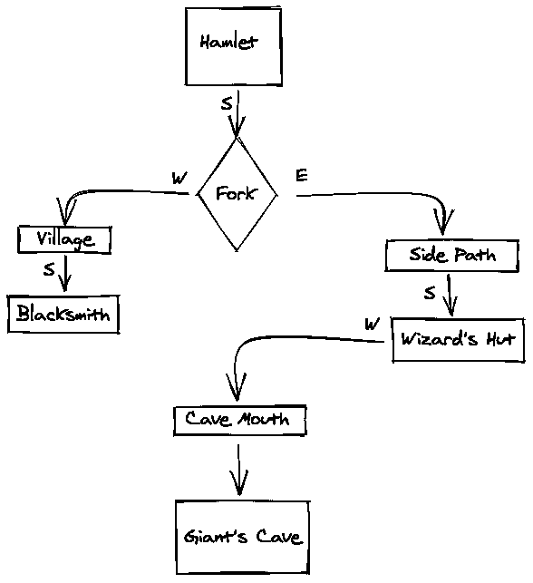](https://files.realpython.com/media/adventurelib-map.64ff7cbdea90.png)

每个区域都有与其相关联的各种属性，包括:

*   该区域中的项目和角色
*   一些出口被锁上了
*   标题、简短描述和较长描述
*   玩家是否到过这个区域的指示

为了确保每个区域都有自己的属性实例，您在第 15 到 41 行的`adventurelib_game_rooms.py`中创建了一个名为`GameArea`的`Room`的子类。每个房间中的物品保存在一个名为`items`的`Bag`对象中，而角色存储在`characters`中，在**的第 28 行和第 31 行**中定义。现在您可以创建`GameArea`对象，描述它们，并用独特的项目和角色填充它们，这些都在**第 9 行和第 12 行**中导入。

一些游戏道具是完成游戏所必需的，而其他的只是为了增加趣味。风味项目被识别并放置在**行 192 到 194** 上，随后是**行 197 到 200** 上的字符。

你所有的游戏物品都在`adventurelib_game_items.py`中被定义为`Item()`类型的对象。游戏物品有定义它们的属性，但是因为你使用了`Item`基类，一些基本的通用属性被添加到第 9 到 12 行的**类中。创建项目时会用到这些属性。例如，`apple`对象创建于**第 15 到 19 行**，并在创建时定义每个通用属性。**

但是，某些项目具有该项目独有的特定属性。例如，`wooden_sword`和`steel_sword`物品需要属性来追踪它们造成的伤害和它们携带的魔法奖励。在**43 至 44 线**和 **53 至 54 线**追加。

与角色互动有助于推动游戏故事向前发展，并经常给玩家一个探索的理由。adventurelib 中的角色被创建为`Item`对象，并且在`adventurelib_game_characters.py`中定义了该游戏的角色。

每个角色，就像每个物品一样，都有与之相关的通用属性，比如长描述和玩家第一次遇到它时使用的问候语。这些属性在**的第 9 行和第 10 行**声明，并且在创建角色时为每个角色定义。

当然，如果你有角色，那么玩家与他们交谈和互动是有意义的。知道什么时候你在和一个角色互动，什么时候你和一个角色在同一个游戏区域通常是个好主意。

这是通过使用一个叫做**上下文**的 adventurelib 概念来完成的。上下文允许您针对不同的情况打开不同的命令。它们还允许某些命令有不同的行为，并跟踪玩家可能采取的行动的附加信息。

当游戏开始时，没有背景设定。随着玩家的前进，他们首先遇到了老巴伦。当玩家输入`"talk to elder"`时，上下文被设置为`elder.context`，在本例中是`elder`。

老巴伦的问候以一个是或否的问题结束。如果玩家输入`"yes"`，那么`adventurelib_game.py`中**行 173** 上的命令处理程序被触发，定义为`@when("yes", context="elder")`，如下图所示:

[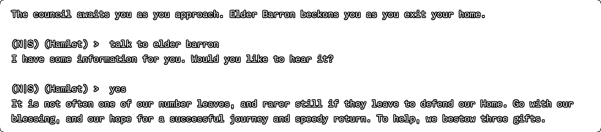](https://files.realpython.com/media/adventurelib_screenshot_3.fb864208a1f9.png)

稍后，当玩家与铁匠交谈时，第二层的上下文被添加，以反映他们正在进行一场可能的武器交易。第 203 到 233 行定义了与铁匠的讨论，包括提供武器交易。在第 222 行**上定义了一个新的上下文，这允许以多种方式优雅地使用同一个`"yes"`命令。**

您还可以在命令处理程序中检查上下文。例如，玩家不能简单地通过结束对话来离开与巨人的战斗。在**行 389 到 403** 定义的`"goodbye"`命令处理程序检查玩家是否在`"giant"`上下文中，这是当他们开始与巨人战斗时进入的。如果是这样，他们不允许停止谈话——这是一场殊死搏斗！

你也可以问玩家一些需要具体答案的问题。当玩家与巫师特伦特交谈时，他们被要求解答一个谜语。不正确的答案将结束互动。虽然正确答案由第 252 到 262 行上的命令处理程序处理，但几乎无限的错误答案中有一个与任何处理程序都不匹配。

没有匹配的命令由**行 497 到 503** 上的`no_command_matches()`函数处理。通过检查第**行 498** 上的`wizard.riddle`上下文，您可以利用这一点来处理向导谜语的错误答案。任何不正确的答案将导致向导结束对话。通过将`adventurelib.no_command_matches`设置为您的新函数，您可以在**行 523** 上将它连接到 adventurelib。

您可以通过编写一个返回新提示的函数来自定义显示给播放器的提示。您的新提示定义在第 483 到 495 行的**上，并连接到第 520 行**的**上的 adventurelib。**

当然，你还可以添加更多。创建一个完整的文本冒险游戏是具有挑战性的，adventurelib 确保主要的挑战在于用文字画一幅画。

[*Remove ads*](/account/join/)

## Ren'Py

纯文本冒险的现代后代是[视觉小说](https://en.wikipedia.org/wiki/Visual_novel)，它突出了游戏的讲故事方面，限制了玩家的互动，同时添加了视觉和声音来增强体验。视觉小说是游戏世界的图画小说——现代的、创新的、极具吸引力的创作和消费。

Ren'Py 是一款基于 Pygame 的工具，专为创作视觉小说而设计。Ren'Py 的名字来自日语，意为*浪漫爱情*，它为制作引人入胜的视觉小说提供了工具和框架。

公平地说，Ren'Py 严格来说并不是一个你可以使用的 Python 库。Ren'Py 游戏是使用 Ren'Py Launcher 创建的，它带有完整的 Ren'Py SDK。这个启动器也有一个游戏编辑器，虽然你可以在你选择的编辑器中编辑你的游戏。Ren'Py 还拥有自己的游戏创作脚本语言。然而，Ren'Py 基于 Pygame，并且可以使用 Python 进行扩展，这保证了它在这里的出现。

### Ren'Py 装置

如前所述，Ren'Py 不仅需要 SDK，还需要 Ren'Py 启动器。这些都打包在一个单元里，你需要[下载](https://www.renpy.org/latest.html)。

知道下载哪个包以及如何安装取决于您的平台。Ren'Py 为 Windows、macOS 和 Linux 用户提供安装程序和说明:

*   [*视窗*](#windows-1)
**   [*Linux*](#linux-1)**   [*macOS*](#macos-1)*

**Windows 用户应该下载提供的可执行文件，然后运行它来安装 SDK 和 Ren'Py Launcher。

Linux 用户应该将提供的 tarball 下载到一个方便的位置，然后使用`bunzip2`展开它。

macOS 用户应该下载提供的 DMG 文件，双击该文件将其打开，并将内容复制到一个方便的位置。

软件包安装完成后，您可以导航到包含 SDK 的文件夹，然后运行 Ren'Py 启动器。Windows 用户要用`renpy.exe`，macOS 和 Linux 用户要运行`renpy.sh`。这将首次启动 Ren'Py 启动器:

[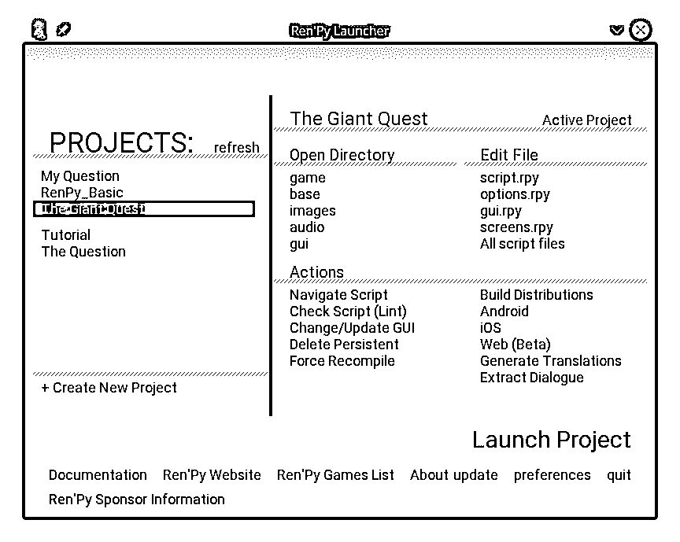](https://files.realpython.com/media/renpy-launcher.fda3bd695f70.png)

在这里，您将开始新的 Ren'Py 项目，处理现有项目，并设置 Ren'Py 的整体首选项。

### 基本概念

Ren'Py 游戏在 Ren'Py 启动器中作为新项目启动。创建一个将会为一个游戏建立正确的文件和文件夹结构。项目建立后，您可以使用自己的编辑器编写游戏，尽管运行游戏需要 Ren'Py 启动器:

[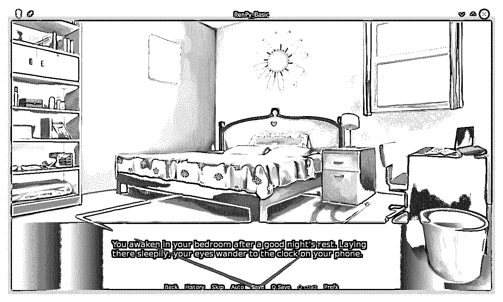](https://files.realpython.com/media/renpy-basic.c467db0e49e5.png)

任我行游戏包含在名为**脚本**的文件中。不要把 Ren'Py 脚本当成 shell 脚本。它们更类似于戏剧或电视节目的脚本。瑞文脚本的扩展名为`.rpy`，是用瑞文语言编写的。您的游戏可以包含任意多的脚本，这些脚本都存储在项目文件夹的`game/`子文件夹中。

创建新的 Ren'Py 项目时，会创建以下脚本供您使用和更新:

*   `gui.rpy`，它定义了游戏中使用的所有 UI 元素的外观
*   `options.rpy`，它定义了可改变的选项来定制你的游戏
*   `screens.rpy`，定义了用于对话、菜单和其他游戏输出的样式
*   这是你开始编写游戏的地方

要运行本教程下载资料中的示例游戏，您将使用以下过程:

1.  启动 Ren'Py 发射器。
2.  点击*首选项*，然后点击*项目目录*。
3.  将项目目录更改为您下载的存储库中的`renpy`文件夹。
4.  点击*返回*返回到主启动页面。

您会在左侧的项目列表中看到`basic_game`和`giant_quest_game`。选择您希望运行的项目，然后点击*启动项目*。

对于这个例子，您将只修改`basic_game`的`script.rpy`文件。这个游戏的完整代码可以在下载的资料中找到，也可以在下面找到:


```py
 1# The script of the game goes in this file.
 2
 3# Declare characters used by this game. The color argument colorizes the
 4# name of the character.
 5
 6define kevin = Character("Kevin", color="#c8ffc8")
 7define mom = Character("Mom", color="#c8ffff")
 8define me = Character("Me", color="#c8c8ff")
 9
10# The game starts here.
11
12label start:
13
14    # Some basic narration to start the game
15
16    "You hear your alarm going off, and your mother calling to you."
17
18    mom "It's time to wake up. If I can hear your alarm,
19    you can hear it to - let's go!"
20
21    "Reluctantly you open your eyes."
22
23    # Show a background.
24
25    scene bedroom day
26
27    # This shows the basic narration
28
29    "You awaken in your bedroom after a good night's rest. 
30    Laying there sleepily, your eyes wander to the clock on your phone."
31
32    me "Yoinks! I'm gonna be late!"
33
34    "You leap out of bed and quickly put on some clothes.
35    Grabbing your book bag, you sprint for the door to the living room."
36
37    scene hallway day
38
39    "Your brother is waiting for you in the hall."
40
41    show kevin normal
42
43    kevin "Let's go, loser! We're gonna be late!"
44
45    mom "Got everything, honey?"
46
47    menu:
48        "Yes, I've got everything.":
49            jump follow_kevin
50
51        "Wait, I forgot my phone!":
52            jump check_room
53
54label check_room:
55
56    me "Wait! My phone!"
57
58    kevin "Whatever. See you outside!"
59
60    "You sprint back to your room to get your phone."
61
62    scene bedroom day
63
64    "You grab the phone from the nightstand and sprint back to the hall."
65
66    scene hallway day
67
68    "True to his word, Kevin is already outside."
69
70    jump outside
71
72label follow_kevin:
73
74    kevin "Then let's go!"
75
76    "You follow Kevin out to the street."
77
78label outside:
79
80    scene street
81
82    show kevin normal
83
84    kevin "About time you got here. Let's Go!"
85
86    # This ends the game
87    return
```

*标签*定义你的故事的切入点，通常用于开始新的场景，并提供贯穿整个故事的替代路径。所有 Ren'Py 游戏都从第`label start:`行开始运行，这可以出现在你选择的任何脚本中。你可以在`script.rpy`的**第 12 行**看到这个。

您还可以使用标签来定义背景图像，设置场景之间的过渡，以及控制角色的外观。在该示例中，第二个场景从第**行第 54** 开始，第`label check_room:`行开始。

一行中用双引号括起来的文本称为 *say* 语句。一行中的单个字符串被视为*叙述*。两个字符串被视为*对话*，首先识别一个字符，然后提供他们正在说的台词。

在游戏开始时，旁白出现在第 16 行的**处，设定场景。对话在**第 18 行**提供，当你妈妈叫你的时候。**

你可以通过在故事中简单地命名来定义角色。但是，您也可以在脚本的顶部定义字符。你可以在**的第 6 到第 8 行**中看到这一点，这里定义了你、你的兄弟凯文和你的妈妈。`define`语句将三个变量初始化为`Characters`，给它们一个显示名称，后跟一个用于显示名称的文本颜色。

当然，这是一部视觉小说，所以伦比有办法处理图像是有道理的。像 Pygame Zero 一样，Ren'Py 要求游戏中使用的所有图像和声音都保存在特定的文件夹中。图像在`gaimg/`文件夹中，声音在`game/audio/`文件夹中。在游戏脚本中，你通过文件名来引用它们，没有任何文件扩展名。

**第 25 行**展示了这一点，当你睁开眼睛，第一次看到你的卧室。`scene`关键字清除屏幕，然后显示`bedroom day.png`图像。Ren'Py 支持 JPG、WEBP 和 PNG 图像格式。

您也可以使用`show`关键字和相同的图像命名约定在屏幕上显示字符。**第 41 行**显示了你弟弟凯文的照片，存储为`kevin normal.png`。

当然，如果你不能做出决定来影响结果，这就不是一场游戏。在 Ren'Py 中，玩家从游戏过程中出现的菜单中做出选择。游戏通过跳转到预定义的标签、改变角色图像、播放声音或采取其他必要的动作来做出反应。

这个例子中的一个基本选择显示在第 47 到 52 行中，这时你意识到你忘记带手机了。在一个更完整的故事中，这个选择可能会在以后产生后果。

当然，你可以用 Ren'Py 做更多的事情。您可以控制场景之间的转换，让角色以特定的方式进入和离开场景，并为您的游戏添加声音和音乐。Ren'Py 还支持编写更复杂的 Python 代码，包括使用 Python 数据类型和直接调用 Python 函数。现在让我们在一个更高级的应用程序中仔细看看这些功能。

[*Remove ads*](/account/join/)

### 高级应用程序

为了展示 Ren'Py 的深度，您将实现与 adventurelib 相同的游戏。提醒一下，这是游戏的基本设计:

*   你住在一个安静的小村庄里。
*   最近，你的邻居开始抱怨丢失的牲畜。
*   作为夜间巡逻队的一员，你注意到一个破损的栅栏和一条离开它的痕迹。
*   你决定去调查，只带了一把练习用的木剑。

这个游戏有几个需要定义和提供图像的区域。例如，您将需要图像和定义，用于您的安静小村庄、远离田野的小径、附近可以购买更好武器的村庄、通向可以为您的武器附魔的巫师的小路，以及包含一直在掠夺您牲畜的巨人的洞穴。

也有一些字符来定义和提供图像。你需要一个能给你更好武器的铁匠，一个能给你武器附魔的巫师，还有一个你需要打败的巨人。

对于本例，您将创建四个单独的脚本:

*   `script.rpy`，这是游戏开始的地方
*   `town.rpy`，其中包含了附近村庄的故事
*   `path.rpy`，其中包含了村庄之间的道路
*   `giant.rpy`，其中包含了巨人战斗的逻辑

你可以单独练习创建向导遭遇战。

这个游戏的完整代码可以在`renpy_sample/giant_quest/`的下载资料中找到，也可以在下面找到:


```py
 1#
 2# Complete game in Ren'Py
 3# 
 4# This game demonstrates some of the more advanced features of
 5# Ren'Py, including:
 6# - Multiple sprites
 7# - Handling user input
 8# - Selecting alternate outcomes
 9# - Tracking score and inventory
10# 
11
12## Declare characters used by this game. The color argument colorizes the
13## name of the character.
14define player = Character("Me", color="#c8ffff")
15define smith = Character("Miranda, village blacksmith", color="#99ff9c")
16define wizard = Character("Endeavor, cryptic wizard", color="#f4d3ff")
17define giant = Character("Maull, terrifying giant", color="#ff8c8c")
18
19## Images used in the game
20# Backgrounds
21image starting path = "BG10a_1280.jpg"
22image crossroads = "BG19a01_1280.jpg"
23
24# Items
25image wooden sword = "SwordWood.png"
26image steel sword = "Sword.png"
27image enchanted sword = "SwordT2.png"
28
29## Default settings
30# What is the current weapon?
31default current_weapon = "wooden sword"
32
33# What is the weapon damage?
34# These change when the weapon is upgraded or enchanted
35default base_damage = 4
36default multiplier = 1
37default additional = 0
38
39# Did they cross the bridge to town?
40default cross_bridge = False
41
42# You need this for the giant battle later
43
44init python:
45    from random import randint
46
47# The game starts here.
48
49label start:
50
51    # Show the initial background.
52
53    scene starting path
54    with fade
55
56    # Begin narration
57
58    "Growing up in a small hamlet was boring, but reliable and safe. 
59    At least, it was until the neighbors began complaining of missing
60    livestock. That's when the evening patrols began."
61
62    "While on patrol just before dawn, your group noticed broken fence
63    around a cattle paddock. Beyond the broken fence,
64    a crude trail had been blazed to a road leading away from town."
65
66    # Show the current weapon
67    show expression current_weapon at left
68    with moveinleft
69
70    "After reporting back to the town council, it was decided that you
71    should follow the tracks to discover the fate of the livestock.
72    You picked up your only weapon, a simple wooden practice sword,
73    and set off."
74
75    scene crossroads
76    with fade
77
78    show expression current_weapon at left
79
80    "Following the path, you come to a bridge across the river."
81
82    "Crossing the bridge will take you to the county seat,
83    where you may hear some news or get supplies.
84    The tracks, however, continue straight on the path."
85
86    menu optional_name:
87        "Which direction will you travel?"
88
89        "Cross the bridge":
90            $ cross_bridge = True
91            jump town
92        "Continue on the path":
93            jump path
94
95    "Your quest is ended!"
96
97    return
```


```py
 1##
 2## Code for the interactions in town
 3##
 4
 5## Backgrounds
 6image distant town = "4_road_a.jpg"
 7image within town = "3_blacksmith_a.jpg"
 8
 9# Characters
 10image blacksmith greeting = "blacksmith1.png"
 11image blacksmith confused = "blacksmith2.png"
 12image blacksmith happy = "blacksmith3.png"
 13image blacksmith shocked = "blacksmith4.png"
 14
 15label town:
 16
 17    scene distant town
 18    with fade
 19
 20    show expression current_weapon at left
 21
 22    "Crossing the bridge, you stride away from the river along a
 23    well worn path. The way is pleasant, and you find yourself humming
 24    a tune as you break into a small clearing."
 25
 26    "From here, you can make out the county seat of Fetheron.
 27    You feel confident you can find help for your quest here."
 28
 29    scene within town
 30    with fade
 31
 32    show expression current_weapon at left
 33
 34    "As you enter town, you immediately begin seeking the local blacksmith.
 35    After asking one of the townsfolk, you find the smithy on the far
 36    south end of town. You approach the smithy,
 37    smelling the smoke of the furnace long before you hear
 38    the pounding of hammer on steel."
 39
 40    player "Hello! Is the smith in?"
 41
 42    smith "Who wants to know?"
 43
 44    show blacksmith greeting
 45
 46    "The blacksmith appears from her bellows.
 47    She greets you with a warm smile."
 48
 49    smith "Oh, hello! You're from the next town over, right?"
 50
 51    menu:
 52        "Yes, from the other side of the river.":
 53            show blacksmith happy
 54
 55            smith "I thought I recognized you. Nice to see you!"
 56
 57        "Look, I don't have time for pleasantries, can we get to business?":
 58            show blacksmith shocked
 59
 60            smith "Hey, just trying to make conversation"
 61
 62    smith "So, what can I do for you?"
 63
 64    player "I need a better weapon than this wooden thing."
 65
 66    show blacksmith confused
 67
 68    smith "Are you going to be doing something dangerous?"
 69
 70    player "Have you heard about the missing livestock in town?"
 71
 72    smith "Of course. Everyone has. What do you know about it?"
 73
 74    player "Well, I'm tracking whatever took them from our town."
 75
 76    smith "Oh, I see. So you want something better to fight with!"
 77
 78    player "Exactly! Can you help?"
 79
 80    smith "I've got just the thing. Been working on it for a while,
 81    but didn't know what to do with it. Now I know."
 82
 83    "Miranda walks back past the furnace to a small rack.
 84    On it, a gleaming steel sword rests.
 85    She picks it up and walks back to you."
 86
 87    smith "Will this do?"
 88
 89    menu:
 90        "It's perfect!":
 91            show blacksmith happy
 92
 93            smith "Wonderful! Give me the wooden one -
 94            I can use it in the furnace!"
 95
 96            $ current_weapon = "steel sword"
 97            $ base_damage = 6
 98            $ multiplier = 2
 99
100        "Is that piece of junk it?":
101            show blacksmith confused
102
103            smith "I worked on this for weeks.
104            If you don't want it, then don't take it."
105
106    # Show the current weapon
107    show expression current_weapon at left
108
109    smith "Anything else?"
110
111    player "Nope, that's all."
112
113    smith "Alright. Good luck!"
114
115    scene distant town
116    with fade
117
118    show expression current_weapon at left
119
120    "You make your way back through town.
121    Glancing back at the town, you wonder if
122    you can keep them safe too."
123
124    jump path
```


```py
 1##
 2## Code for the interactions in town
 3##
 4
 5## Backgrounds
 6image path = "1_forest_a.jpg"
 7image wizard hut = "BG600a_1280.jpg"
 8
 9# Characters
10image wizard greeting = "wizard1.png"
11image wizard happy = "wizard2.png"
12image wizard confused = "wizard3.png"
13image wizard shocked = "wizard4.png"
14
15label path:
16
17    scene path
18    with fade
19
20    show expression current_weapon at left
21
22    "You pick up the tracks as you follow the path through the woods."
23
24    jump giant_battle
```


```py
 1##
 2## Code for the giant battle
 3##
 4
 5## Backgrounds
 6image forest = "forest_hill_night.jpg"
 7
 8# Characters
 9image giant greeting = "giant1.png"
 10image giant unhappy = "giant2.png"
 11image giant angry = "giant3.png"
 12image giant hurt = "giant4.png"
 13
 14# Text of the giant encounter
 15label giant_battle:
 16
 17    scene forest
 18    with fade
 19
 20    show expression current_weapon at left
 21
 22    "As you follow the tracks down the path, night falls.
 23    You hear sounds in the distance:
 24    cows, goats, sheep. You've found the livestock!"
 25
 26    show giant greeting
 27
 28    "As you approach the clearing and see your villages livestock,
 29    a giant appears."
 30
 31    giant "Who are you?"
 32
 33    player "I've come to get our livestock back."
 34
 35    giant "You and which army, little ... whatever you are?"
 36
 37    show giant unhappy
 38
 39    "The giant bears down on you - the battle is joined!"
 40
 41python:
 42
 43    def show_giant_condition(giant_hp):
 44        if giant_hp < 10:
 45            renpy.say(None, "The giant staggers, his eyes unfocused.")
 46        elif giant_hp < 20:
 47            renpy.say(None, "The giant's steps become more unsteady.")
 48        elif giant_hp < 30:
 49            renpy.say(
 50                None, "The giant sweats and wipes the blood from his brow."
 51            )
 52        elif giant_hp < 40:
 53            renpy.say(
 54                None,
 55                "The giant snorts and grits his teeth against the pain.",
 56            )
 57        else:
 58            renpy.say(
 59                None,
 60                "The giant smiles and readies himself for the attack.",
 61            )
 62
 63    def show_player_condition(player_hp):
 64        if player_hp < 4:
 65            renpy.say(
 66                None,
 67                "Your eyes lose focus on the giant as you sway unsteadily.",
 68            )
 69        elif player_hp < 8:
 70            renpy.say(
 71                None,
 72                "Your footing becomes less steady as you swing your sword sloppily.",
 73            )
 74        elif player_hp < 12:
 75            renpy.say(
 76                None,
 77                "Blood mixes with sweat on your face as you wipe it from your eyes.",
 78            )
 79        elif player_hp < 16:
 80            renpy.say(
 81                None,
 82                "You bite down as the pain begins to make itself felt.",
 83            )
 84        else:
 85            renpy.say(None, "You charge into the fray valiantly!")
 86
 87    def fight_giant():
 88
 89        # Default values
 90        giant_hp = 50
 91        player_hp = 20
 92        giant_damage = 4
 93
 94        battle_over = False
 95        player_wins = False
 96
 97        # Keep swinging until something happens
 98        while not battle_over:
 99
100            renpy.say(
101                None,
102                "You have {0} hit points. Do you want to fight or flee?".format(
103                    player_hp
104                ),
105                interact=False,
106            )
107            battle_over = renpy.display_menu(
108                [("Fight!", False), ("Flee!", True)]
109            )
110
111            if battle_over:
112                player_wins = False
113                break
114
115            # The player gets a swing
116            player_attack = (
117                randint(1, base_damage + 1) * multiplier + additional
118            )
119            renpy.say(
120                None,
121                "You swing your {0}, doing {1} damage!".format(
122                    current_weapon, player_attack
123                ),
124            )
125            giant_hp -= player_attack
126
127            # Is the giant dead?
128            if giant_hp <= 0:
129                battle_over = True
130                player_wins = True
131                break
132
133            show_giant_condition(giant_hp)
134
135            # Then the giant tries
136            giant_attack = randint(0, giant_damage)
137            if giant_attack == 0:
138                renpy.say(
139                    None,
140                    "The giant's arm whistles harmlessly over your head!",
141                )
142            else:
143                renpy.say(
144                    None,
145                    "The giant swings his mighty fist, and does {0} damage!".format(
146                        giant_attack
147                    ),
148                )
149                player_hp -= giant_attack
150
151            # Is the player dead?
152            if player_hp <= 0:
153                battle_over = True
154                player_wins = False
155
156            show_player_condition(player_hp)
157
158        # Return who died
159        return player_wins
160
161    # fight_giant returns True if the player wins.
162    if fight_giant():
163        renpy.jump("player_wins")
164    else:
165        renpy.jump("giant_wins")
166
167label player_wins:
168
169    "The giant's eyes glaze over as he falls heavily to the ground.
170    The earth shakes as his bulk lands face down,
171    and his death rattle fills the air."
172
173    hide giant
174
175    "You are victorious! The land is safe from the giant!"
176
177    return
178
179label giant_wins:
180
181    "The giant takes one last swing, knocking you down.
182    Your vision clouds, and you see the ground rising to meet you.
183    As you slowly lose consciousness, your last vision is
184    the smiling figure of the giant as he advances on you."
185
186    "You have lost!"
187
188    return
```

和前面的例子一样，在脚本从`script.rpy`的第 14 到 17 行的**开始之前，您定义了`Character()`对象。**

您还可以定义背景或人物`image`对象以备后用。**第 21 行到第 27 行**定义了几个你稍后会用到的图像，既可以用作背景，也可以作为项目显示。使用此语法，您可以为图像指定更短、更具描述性的内部名称。稍后，您将看到它们是如何显示的。

你还需要追踪装备武器的能力。这是在第 31 到 37 行的**中完成的，使用的是`default`变量值，你将在稍后的大型战役中用到。**

为了表明哪种武器被激活，你把图像显示为一个**表达式**。人物表情是显示在游戏窗口角落的小图像，用来显示各种各样的信息。在这个游戏中，你先在第 67 行和第 68 行的**处使用一个表达式来显示武器。**

`show`命令记录了许多修饰符。`with moveinleft`修改器使`current_weapon`图像从左边滑动到屏幕上。此外，重要的是要记住，每次`scene`改变，整个屏幕都被清除，要求你再次显示当前的武器。你可以在**第 75 到 78 行**看到。

当你在`town.rpy`进入城镇时，你遇到铁匠，他向你打招呼:

[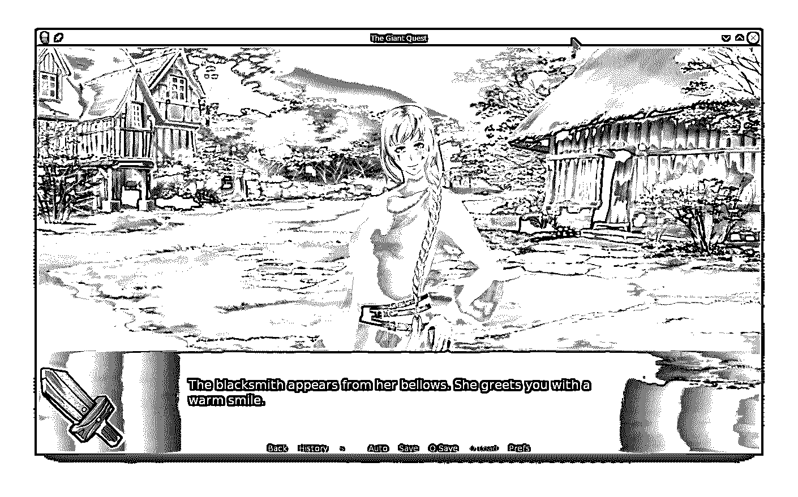](https://files.realpython.com/media/renpy-blacksmith.2c5137b779d4.png)

铁匠为你提供升级武器的机会。如果你选择这样做，那么你就更新了`current_weapon`和武器属性的值。这在**第 93 到 98 行**完成。

以`$`字符开头的行被 Ren'Py 解释为 Python 语句，允许您根据需要编写任意的 Python 代码。更新`current_weapon`和武器统计是使用第 96 到 98 行的三个 Python 语句完成的，这些语句改变了您在`script.rpy`顶部定义的`default`变量的值。

您还可以使用一个`python:`部分定义一大块 Python 代码，如从**行 41** 开始的`giant.rpy`所示。

第 43 到 61 行包含了一个助手功能，根据巨人剩余的生命值来显示巨人的状况。它使用`renpy.say()`方法将叙述输出回主窗口。在**第 63 到 85 行**中可以看到一个类似的显示玩家状态的助手功能。

战斗由 87 到 159 线**上的`fight_giant()`控制。游戏循环在**线 98** 上实现，并由`battle_over`变量控制。玩家选择战斗或逃跑是使用`renpy.display_menu()`方法显示的。**

如果玩家战斗，那么在**线 116 到 118** 上造成随机数量的伤害，并且调整巨人的生命值。如果巨人还活着，那么他们会在**的第 136 到 149 行**以类似的方式攻击。注意巨人有机会失手，而玩家总是命中。战斗持续到玩家或巨人的生命值为零或者玩家逃跑:

[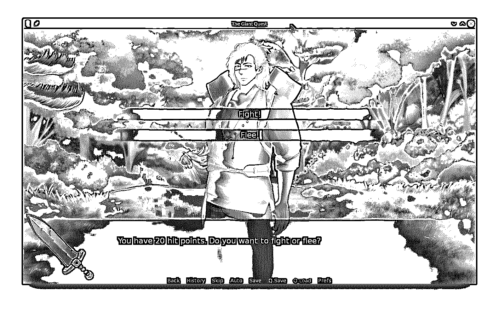](https://files.realpython.com/media/renpy-giant-fight.7fe536c52775.png)

需要注意的是，这段代码与您在 adventurelib 战斗中使用的代码非常相似。这展示了如何将完整的 Python 代码放到你的 Ren'Py 游戏中，而不需要将其翻译成 Ren'Py 脚本。

除了你在这里尝试过的，还有很多值得尝试的。查阅 [Ren'Py 文档](https://www.renpy.org/doc/html/)了解更多完整细节。

[*Remove ads*](/account/join/)

## 其他著名的 Python 游戏引擎

这五个引擎只是众多不同 Python 游戏引擎中的一小部分。还有其他几十种方法，这里有一些值得注意:

*   芥末 2D 由 Pygame Zero 的团队开发。这是一个建立在 [moderngl](https://moderngl.readthedocs.io/en/latest/) 基础上的现代框架，可以自动渲染，为动画效果提供协同程序，内置粒子效果，并使用事件驱动模型玩游戏。

*   [cocos2d](http://python.cocos2d.org/) 是一个为跨平台游戏编码而设计的框架。可悲的是，cocos2d-python 从 2017 年开始就没有更新过。

*   熊猫 3D 是一个用于创建 3D 游戏和 3D 渲染的开源框架。Panda 3D 可跨平台移植，支持多种资产类型，开箱即可与众多第三方库连接，并提供内置的管道分析。

*   Ursina 建立在熊猫 3D 的基础上，提供了一个专用的游戏开发引擎，简化了熊猫 3D 的许多方面。在撰写本文时，Ursina 得到了很好的支持和很好的文档，正在积极开发中。

*   purchased ybear 被宣传为教育图书馆。它拥有一个场景管理系统，基于帧的动画精灵，可以暂停，进入门槛低。文档很少，但是帮助只是 GitHub 讨论的一部分。

每天都有新的 Python 游戏引擎诞生。如果你找到了一个适合你的需求，但这里没有提到的，请在评论中赞美它！

## 游戏资产的来源

通常，创建游戏资产是游戏作者面临的最大问题。大型视频游戏公司雇佣艺术家、动画师和音乐家团队来设计游戏的外观和声音。有编码背景的单人游戏开发者可能会发现游戏开发的这一方面令人望而生畏。幸运的是，游戏资产有许多不同的来源。以下是在本教程中为游戏定位资产的一些重要因素:

*   OpenGameArt.org 为 2D 和 3D 游戏提供了各种各样的游戏艺术、音乐、背景、图标和其他资源。艺术家和音乐家列出了可供下载的资产，您可以下载并在游戏中使用这些资产。大多数资产都是免费的，许可条款可能适用于其中的许多资产。

*   Kenney.nl 拥有一系列免费和付费的资产，其中许多在别处是找不到的。[捐款](https://kenney.itch.io/kenney-donation)总是受欢迎的，以支持免费资产，这些资产都被授权用于商业游戏。

*   Itch.io 是一个面向专注于独立游戏开发的数字创作者的市场。在这里，你可以找到任何用途的数字资产，包括免费和付费的，还有完整的游戏。个人创作者在这里控制他们自己的内容，所以你总是直接与有才华的个人一起工作。

第三方提供的大多数资产都带有许可条款，规定了资产的正确和允许使用。作为这些资产的用户，您有责任阅读、理解并遵守资产所有者定义的许可条款。如果您对这些条款有任何疑问或疑虑，请咨询法律专业人士寻求帮助。

本文引用的游戏中使用的所有资产都符合各自的许可要求。

## 结论

恭喜你，伟大的游戏设计现在触手可及！多亏了 Python 和一系列高性能的 Python 游戏引擎，你可以比以前更容易地创作出高质量的电脑游戏。在本教程中，您已经探索了几个这样的游戏引擎，学习了开始制作自己的 Python 视频游戏所需的信息！

到目前为止，您已经看到了一些顶级 Python 游戏引擎的运行，并且您已经:

*   探究了几种**流行的 Python 游戏引擎**的**优缺点**
*   体验了他们如何将与**单机游戏引擎**进行比较
*   了解其他可用的 Python 游戏引擎

如果你想查看本教程中游戏的代码，你可以点击下面的链接:

**获取源代码:** [点击此处获取您将使用](https://realpython.com/bonus/top-python-game-engines-project-code/)试用 Python 游戏引擎的源代码。

现在你可以根据你的目的选择最好的 Python 游戏引擎。你还在等什么？出去写些游戏吧！*************