# 使用 Python 进行传统人脸检测

> 原文：<https://realpython.com/traditional-face-detection-python/>

*立即观看**本教程有真实 Python 团队创建的相关视频课程。配合文字教程一起看，加深理解: [**用 Python 进行传统人脸检测**](/courses/traditional-face-detection-python/)

计算机视觉是一个令人兴奋且不断发展的领域。有很多有趣的问题需要解决！其中之一是人脸检测:计算机识别照片中包含人脸，并告诉你其位置的能力。在本文中，您将学习使用 Python 进行人脸检测。

为了检测图像中的任何对象，有必要了解图像在计算机内部是如何表示的，以及该对象在视觉上与任何其他对象有何不同。

一旦完成，扫描图像和寻找这些视觉线索的过程需要自动化和优化。所有这些步骤结合在一起形成了一个快速可靠的计算机视觉算法。

在本教程中，你将学习:

*   什么是人脸检测
*   计算机如何理解图像中的特征
*   如何快速分析许多不同的特征以做出决策
*   如何使用最小的 Python 解决方案来检测图像中的人脸

**免费奖励:** ，向您展示真实世界 Python 计算机视觉技术的实用代码示例。

## 什么是人脸检测？

**人脸检测**是一种能够在数字图像中识别人脸的计算机视觉技术。这对人类来说非常容易，但计算机需要精确的指令。这些图像可能包含许多不是人脸的物体，比如建筑物、汽车、动物等等。

它不同于其他涉及人脸的计算机视觉技术，如面部识别、分析和跟踪。

**面部识别**包括识别图像中的面部属于人 *X* 而不是人 *Y* 。它通常用于生物识别目的，比如解锁你的智能手机。

面部分析试图通过人们的面部特征来了解他们的一些事情，比如确定他们的年龄、性别或他们表现出的情绪。

**面部跟踪**主要出现在视频分析中，试图逐帧跟踪面部及其特征(眼睛、鼻子和嘴唇)。最受欢迎的应用程序是 Snapchat 等移动应用程序中的各种滤镜。

所有这些问题都有不同的技术解决方案。本教程将重点介绍第一个挑战的传统解决方案:人脸检测。

[*Remove ads*](/account/join/)

## 计算机是如何“看见”图像的？

图像的最小元素称为**像素**，或图片元素。基本上就是图中的一个点。图像包含按行和列排列的多个像素。

你会经常看到用图像分辨率表示的行数和列数。例如，超高清电视的分辨率为 3840x2160，即宽 3840 像素，高 2160 像素。

但是计算机不理解像素是彩色的点。它只懂数字。为了将颜色转换成数字，计算机使用各种颜色模型。

在彩色图像中，像素通常用 RGB 颜色模型表示。RGB 代表**R**ed**G**reen**B**lue。每个像素都是这三种颜色的混合。RGB 非常擅长通过组合不同数量的红色、绿色和蓝色来模拟人类感知的所有颜色。

由于计算机只理解数字，每个像素由三个数字表示，对应于该像素中存在的红色、绿色和蓝色的数量。您可以在 OpenCV + Python 中使用色彩空间了解更多关于[图像分割中的色彩空间。](https://realpython.com/python-opencv-color-spaces/)

在灰度(黑白)图像中，每个像素都是一个数字，代表它携带的光量或强度。在许多应用中，亮度范围从`0`(黑色)到`255`(白色)。在`0`和`255`之间的一切都是各种深浅不同的灰色。

如果每个灰度像素都是一个数字，那么图像只不过是一个数字矩阵(或表格):

[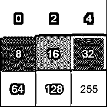](https://files.realpython.com/media/3x3.602445ad9862.png)

<figcaption class="figure-caption text-center">Example 3x3 image with pixel values and colors</figcaption>

在彩色图像中，有三个这样的矩阵代表红色、绿色和蓝色通道。

## 什么是特性？

**特征**是图像中与解决某个问题相关的一条信息。它可以是简单的单个像素值，也可以是更复杂的边缘、拐角和形状。您可以将多个简单特征组合成一个复杂特征。

对图像应用某些操作产生的信息也可以被认为是特征。计算机视觉和图像处理有大量有用的特征和特征提取操作。

基本上，图像的任何固有或衍生属性都可以用作解决任务的特征。

## 准备工作

要运行代码示例，您需要设置一个安装了所有必需库的环境。最简单的办法就是用 [`conda`](https://conda.io/docs/) 。

您将需要三个库:

1.  `scikit-image`
2.  `scikit-learn`
3.  `opencv`

要在`conda`中创建环境，请在您的 shell 中运行以下命令:

```py
$ conda create --name face-detection python=3.7
$ source activate face-detection
(face-detection)$ conda install scikit-learn
(face-detection)$ conda install -c conda-forge scikit-image
(face-detection)$ conda install -c menpo opencv3
```

如果您在正确安装 OpenCV 和运行示例时遇到问题，请尝试参考他们的[安装指南](https://docs.opencv.org/master/da/df6/tutorial_py_table_of_contents_setup.html)或关于 [OpenCV 教程、资源和指南](https://www.pyimagesearch.com/opencv-tutorials-resources-guides/)的文章。

现在，您已经拥有了练习本教程中所学内容所需的所有软件包。

[*Remove ads*](/account/join/)

## Viola-Jones 物体检测框架

这种算法是以 2001 年提出该方法的两位计算机视觉研究人员的名字命名的:保罗·维奥拉和迈克尔·琼斯。

他们开发了一个[通用对象检测](https://www.cs.cmu.edu/~efros/courses/LBMV07/Papers/viola-cvpr-01.pdf)框架，能够实时提供有竞争力的对象检测率。它可以用来解决各种检测问题，但主要的动机来自人脸检测。

Viola-Jones 算法有 4 个主要步骤，您将在接下来的章节中了解每个步骤的更多信息:

1.  选择类哈尔特征
2.  创造一个完整的形象
3.  跑步 AdaBoost 训练
4.  创建分类器级联

给定一幅图像，该算法查看许多更小的子区域，并通过在每个子区域中寻找特定特征来尝试找到一张脸。它需要检查许多不同的位置和比例，因为一幅图像可能包含许多不同大小的脸。Viola 和 Jones 使用类似 Haar 的特征来检测人脸。

### 类哈尔特征

所有人的面孔都有一些相似之处。例如，如果你看一张显示一个人面部的照片，你会发现眼睛区域比鼻梁要暗。脸颊也比眼睛区域更亮。我们可以使用这些属性来帮助我们理解图像是否包含人脸。

找出哪个区域更亮或更暗的简单方法是将两个区域的像素值相加并进行比较。较暗区域中像素值的总和将小于较亮区域中像素值的总和。这可以通过使用[类似 Haar 的特征](https://en.wikipedia.org/wiki/Haar-like_feature)来实现。

Haar-like 特征通过获取图像的矩形部分并将该矩形分成多个部分来表示。它们通常被视为黑白相邻的矩形:

[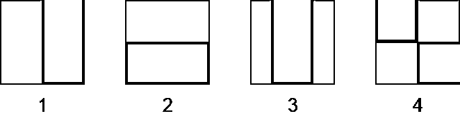](https://files.realpython.com/media/Haar.885b5c872b35.png)

<figcaption class="figure-caption text-center">Basic Haar-like rectangle features</figcaption>

在此图像中，您可以看到 4 种基本类型的 Haar-like 特征:

1.  带有两个矩形的水平特征
2.  带有两个矩形的垂直特征
3.  带有三个矩形的垂直特征
4.  具有四个矩形的对角线特征

前两个例子对于检测边缘是有用的。第三个检测线条，第四个适合寻找对角线特征。但是它们是如何工作的呢？

特征的值计算为一个数字:黑色区域的像素值之和减去白色区域的像素值之和。对于像墙这样的均匀区域，这个数字接近于零，不会给你任何有意义的信息。

为了有用，一个 Haar-like 特征需要给你一个大的数字，这意味着黑色和白色矩形中的面积是非常不同的。有一些已知的特征可以很好地检测人脸:

[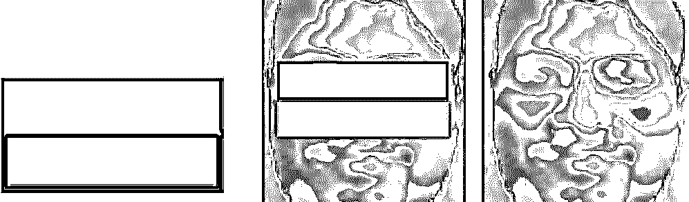](https://files.realpython.com/media/Haar_Feature_eyes.46f3184a76ab.jpg)

<figcaption class="figure-caption text-center">Haar-like feature applied on the eye region. (Image: [Wikipedia](https://commons.wikimedia.org/wiki/File:Haar_Feature_that_looks_similar_to_the_eye_region_which_is_darker_than_the_upper_cheeks_is_applied_onto_a_face.jpg#/media/File:Haar_Feature_that_looks_similar_to_the_eye_region_which_is_darker_than_the_upper_cheeks_is_applied_onto_a_face.jpg))</figcaption>

在这个例子中，眼睛区域比下面的区域暗。您可以使用此属性来查找图像的哪些区域对特定功能有强烈的响应(大量):

[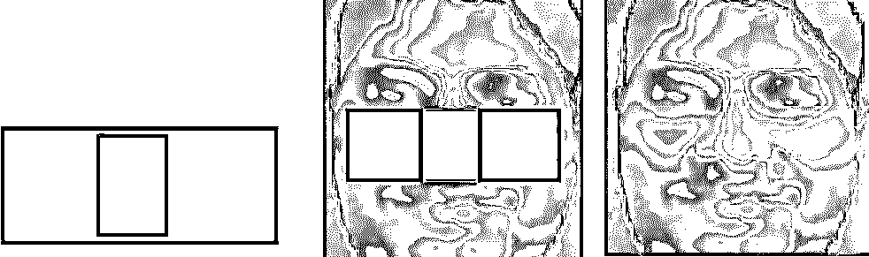](https://files.realpython.com/media/Haar_Feature_nose.eccdca63eb5a.jpg)

<figcaption class="figure-caption text-center">Haar-like feature applied on the bridge of the nose. (Image: [Wikipedia](https://commons.wikimedia.org/wiki/File:Haar_Feature_that_looks_similar_to_the_bridge_of_the_nose_is_applied_onto_the_face.jpg#/media/File:Haar_Feature_that_looks_similar_to_the_bridge_of_the_nose_is_applied_onto_the_face.jpg))</figcaption>

这个例子在应用于鼻梁时给出了强烈的反应。您可以结合这些特征来理解图像区域是否包含人脸。

如上所述，Viola-Jones 算法在图像的许多子区域中计算了许多这些特征。这很快在计算上变得昂贵:使用计算机有限的资源要花费大量的时间。

为了解决这个问题，Viola 和 Jones 使用了积分图像。

[*Remove ads*](/account/join/)

### 积分图像

积分图像(也称为总面积表)是数据结构和用于获得该数据结构的算法的名称。它被用作计算图像或图像的矩形部分中的像素值之和的快速有效的方法。

在积分图像中，每个点的值是上方和左侧所有像素的总和，包括目标像素:

[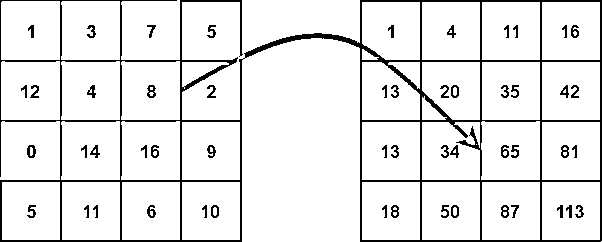](https://files.realpython.com/media/Integral_image.ff570b17c188.png)

<figcaption class="figure-caption text-center">Calculating an integral image from pixel values</figcaption>

积分图像可以在原始图像上的单次通过中计算。这将矩形内像素亮度的求和减少到只有三个四个数的运算，而与矩形大小无关:

[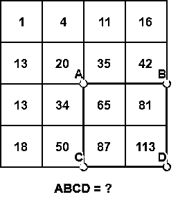](https://files.realpython.com/media/ABCD.97ca0ef04d39.png)

<figcaption class="figure-caption text-center">Calculate the sum of pixels in the orange rectangle.</figcaption>

矩形 *ABCD* 中的像素之和可以从点 *A* 、 *B* 、 *C* 和 *D* 的值导出，使用公式 *D - B - C + A* 。更容易直观地理解这个公式:

[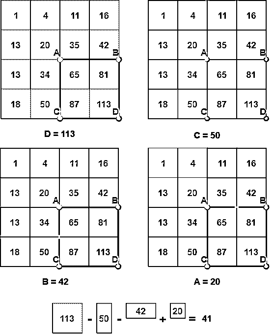](https://files.realpython.com/media/ABCD-2.c181d3f76349.png)

<figcaption class="figure-caption text-center">Calculating the sum of pixels step by step</figcaption>

你会注意到，减去 *B* 和 *C* 意味着用 *A* 定义的面积已经被减去两次，所以我们需要再把它加回来。

现在你有一个简单的方法来计算两个矩形的像素值之和的差。这对于类似 Haar 的特性来说是完美的！

但是你如何决定使用这些特征中的哪一个，以什么样的尺寸在图像中寻找人脸呢？这是通过一种叫做 **boosting** 的机器学习算法来解决的。具体来说，您将了解 AdaBoost，这是**自适应增强**的缩写。

### AdaBoost

Boosting 基于以下问题:“一组**弱学习者**能创造出一个单独的**强学习者**吗？”弱学习器(或弱分类器)被定义为仅比随机猜测略好的分类器。

在人脸检测中，这意味着弱学习者可以将图像的子区域分类为人脸或非人脸，仅略好于随机猜测。一个强有力的学习者更善于从非人脸中识别人脸。

提升的能力来自于将许多(数千个)弱分类器组合成单个强分类器。在 Viola-Jones 算法中，每个 Haar-like 特征代表一个弱学习者。为了决定进入最终分类器的特征的类型和大小，AdaBoost 检查您提供给它的所有分类器的性能。

要计算分类器的性能，需要对用于训练的所有图像的所有子区域进行评估。一些次区域将在分类器中产生强响应。这些将被分类为阳性，这意味着分类器认为它包含人脸。

在分类者看来，没有产生强烈反应的分区不包含人脸。它们将被归类为阴性。

表现良好的分类器被赋予更高的重要性或**权重**。最终结果是一个强分类器，也称为**增强分类器**，它包含性能最好的弱分类器。

该算法被称为自适应，因为随着训练的进行，它会更加强调那些被错误分类的图像。在这些硬例子中表现较好的弱分类器比其他分类器具有更强的权重。

让我们看一个例子:

[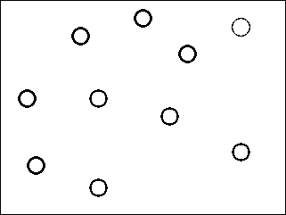](https://files.realpython.com/media/AdaBoost-1.f0eacdf0c2e2.png)

<figcaption class="figure-caption text-center">The blue and orange circles are samples that belong to different categories.</figcaption>

假设您要使用一组弱分类器对下图中的蓝色和橙色圆圈进行分类:

[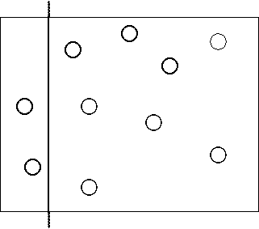](https://files.realpython.com/media/AdaBoost-2.03c3c6a0c34f.png)

<figcaption class="figure-caption text-center">The first weak classifier classifies some of the blue circles correctly.</figcaption>

您使用的第一个分类器捕获了一些蓝色的圆圈，但错过了其他的。在下一次迭代中，您将更加重视遗漏的示例:

[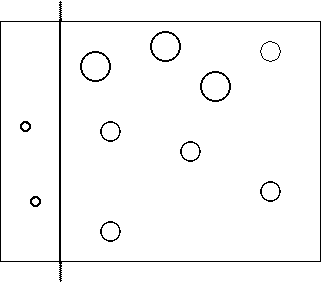](https://files.realpython.com/media/AdaBoost-3.2d874993bc92.png)

<figcaption class="figure-caption text-center">The missed blue samples are given more importance, indicated by size.</figcaption>

第二个能够正确分类这些例子的分类器将获得更高的权重。请记住，如果弱分类器表现更好，它将获得更高的权重，从而更有可能被包括在最终的强分类器中:

[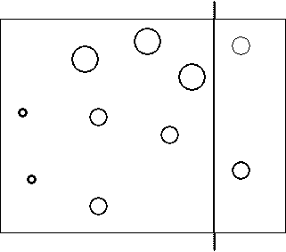](https://files.realpython.com/media/AdaBoost-4.705558b218f3.png)

<figcaption class="figure-caption text-center">The second classifier captures the bigger blue circles.</figcaption>

现在你已经成功地捕捉到了所有的蓝色圆圈，但是错误地捕捉到了一些橙色的圆圈。这些错误分类的橙色圆圈在下一次迭代中被赋予更大的重要性:

[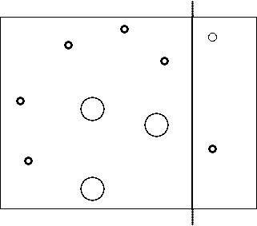](https://files.realpython.com/media/AdaBoost-5.1d800ca4ffff.png)

<figcaption class="figure-caption text-center">The misclassified orange circles are given more importance, and others are reduced.</figcaption>

最终的分类器设法正确地捕捉那些橙色圆圈:

[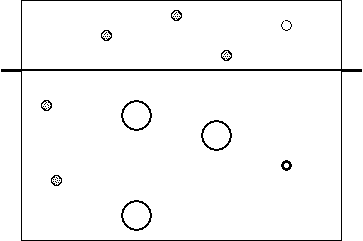](https://files.realpython.com/media/AdaBoost-6.ac0a9accb5f7.png)

<figcaption class="figure-caption text-center">The third classifier captures the remaining orange circles.</figcaption>

要创建一个强分类器，您需要组合所有三个分类器来正确分类所有示例:

[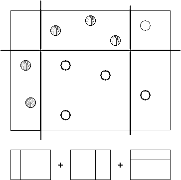](https://files.realpython.com/media/AdaBoost-7.2ec2db197252.png)

<figcaption class="figure-caption text-center">The final, strong classifier combines all three weak classifiers.</figcaption>

Viola 和 Jones 使用这一过程的一种变体，评估了数十万个专门在图像中寻找人脸的分类器。但是，在每幅图像的每个区域运行所有这些分类器在计算上是昂贵的，所以他们创建了一个叫做**分类器级联**的东西。

[*Remove ads*](/account/join/)

### 级联分类器

瀑布的定义是一系列一个接一个的瀑布。在计算机科学中，类似的概念被用来用简单的单元解决复杂的问题。这里的问题是减少每个图像的计算量。

为了解决这个问题，Viola 和 Jones 将他们的强分类器(由数千个弱分类器组成)变成了一个级联，其中每个弱分类器代表一个阶段。级联的工作是快速丢弃非人脸，避免浪费宝贵的时间和计算。

当图像子区域进入级联时，它由第一级评估。如果该阶段将子区域评估为正，这意味着它认为它是一张脸，则该阶段的输出是*可能是*。

如果一个子区域得到一个*也许是*，它将被发送到级联的下一级。如果那个给了正面评价，那么那就是另一个*也许是*，图像被发送到第三阶段:

[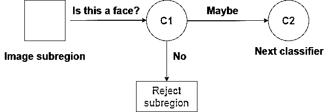](https://files.realpython.com/media/one_stage.901b5d130118.png)

<figcaption class="figure-caption text-center">A weak classifier in a cascade</figcaption>

重复这个过程，直到图像通过级联的所有阶段。如果所有分类器都认可该图像，则该图像最终被分类为人脸，并作为检测结果呈现给用户。

然而，如果第一阶段给出否定的评价，则该图像由于不包含人脸而被立即丢弃。如果它通过了第一阶段，但没有通过第二阶段，它也被丢弃。基本上，图像可以在分类器的任何阶段被丢弃:

[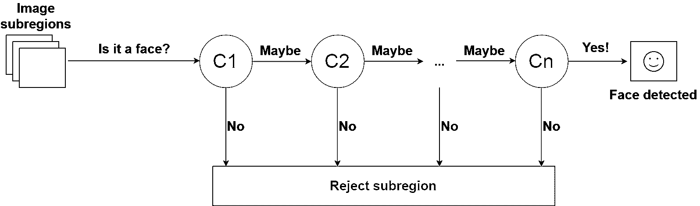](https://files.realpython.com/media/Classifier_cascade.e3b2a5652044.png)

<figcaption class="figure-caption text-center">A cascade of _n_ classifiers for face detection</figcaption>

这种设计使得非人脸很快被丢弃，节省了大量的时间和计算资源。因为每个分类器代表一张人脸的一个特征，所以一个肯定的检测基本上是说，“是的，这个子区域包含了人脸的所有特征。”但是一旦缺少一个特征，它就拒绝整个次区域。

为了有效地实现这一点，将性能最好的分类器放在级联的早期是很重要的。在 Viola-Jones 算法中，眼睛和鼻梁分类器是性能最好的弱分类器的例子。

既然你已经理解了算法的工作原理，那么是时候用 Python 来使用它检测人脸了。

### 使用维奥拉-琼斯分类器

从头开始训练 Viola-Jones 分类器可能需要很长时间。幸运的是，OpenCV 提供了一个预先训练好的 Viola-Jones 分类器！您将使用它来查看运行中的算法。

首先，找到并下载一张你想扫描人脸的图像。这里有一个例子:

[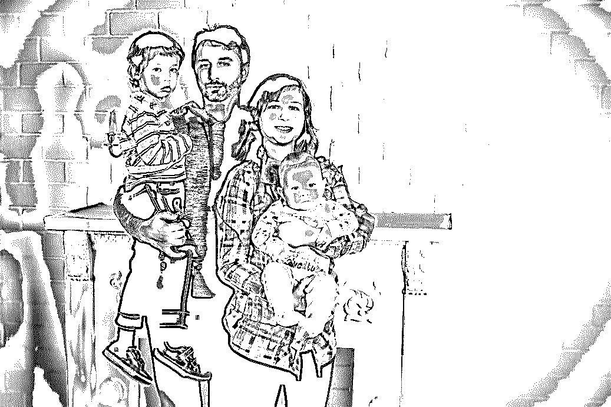](https://files.realpython.com/media/bla2.5577e4ec1f8e.jpg)

<figcaption class="figure-caption text-center">Example stock photo for face detection ([Image source](https://www.pexels.com/photo/standing-family-near-fireplace-1648387/))</figcaption>

导入 OpenCV 并将图像加载到内存中:

```py
import cv2 as cv

# Read image from your local file system
original_image = cv.imread('path/to/your-image.jpg')

# Convert color image to grayscale for Viola-Jones
grayscale_image = cv.cvtColor(original_image, cv.COLOR_BGR2GRAY)
```

接下来，您需要加载 Viola-Jones 分类器。如果您从源代码安装 OpenCV，它将位于您安装 OpenCV 库的文件夹中。

根据版本的不同，确切的路径可能会有所不同，但文件夹名称将是`haarcascades`，并且它将包含多个文件。你需要的那个叫`haarcascade_frontalface_alt.xml`。

如果出于某种原因，您安装的 OpenCV 没有获得预训练的分类器，您可以从 [OpenCV GitHub repo](https://github.com/opencv/opencv/tree/master/data/haarcascades) 中获得它:

```py
# Load the classifier and create a cascade object for face detection
face_cascade = cv.CascadeClassifier('path/to/haarcascade_frontalface_alt.xml')
```

`face_cascade`对象有一个方法`detectMultiScale()`，它接收一个图像作为参数，并在图像上运行分类器级联。术语**多尺度**表示该算法以多种尺度查看图像的子区域，以检测不同大小的面部:

```py
detected_faces = face_cascade.detectMultiScale(grayscale_image)
```

[变量](https://realpython.com/python-variables/) `detected_faces`现在包含目标图像的所有检测。为了可视化检测，您需要迭代所有检测，并在检测到的人脸上绘制矩形。

OpenCV 的`rectangle()`在图像上绘制矩形，它需要知道左上角和右下角的像素坐标。坐标表示图像中像素的行和列。

幸运的是，检测结果被保存为像素坐标。每个检测由其左上角坐标以及包含检测到的面部的矩形的宽度和高度来定义。

增加行的宽度和列的高度将得到图像的右下角:

```py
for (column, row, width, height) in detected_faces:
    cv.rectangle(
        original_image,
        (column, row),
        (column + width, row + height),
        (0, 255, 0),
        2
    )
```

`rectangle()`接受以下论点:

*   原始图像
*   检测左上角点的坐标
*   检测点右下角的坐标
*   矩形的颜色(定义红色、绿色和蓝色数量的元组(`0` - `255`))
*   矩形线条的粗细

最后，您需要显示图像:

```py
cv.imshow('Image', original_image)
cv.waitKey(0)
cv.destroyAllWindows()
```

`imshow()`显示图像。`waitKey()`等待击键。否则，`imshow()`会显示图像并立即关闭窗口。传递`0`作为参数，告诉它无限期等待。最后，当你按下一个键时，`destroyAllWindows()`关闭窗口。

结果如下:

[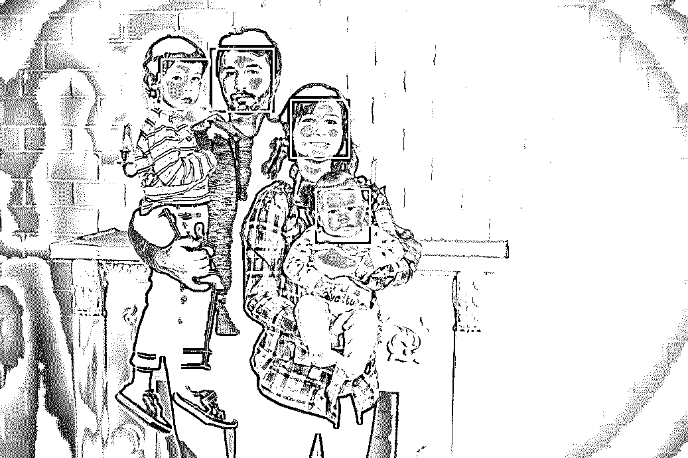](https://files.realpython.com/media/bla3.0a8b11f62c76.jpg)

<figcaption class="figure-caption text-center">Original image with detections</figcaption>

就是这样！现在，Python 中已经有了一个现成的人脸检测器。

如果你真的想自己训练分类器，`scikit-image`在他们的网站上提供了一个附带代码[的教程。](http://scikit-image.org/docs/dev/auto_examples/xx_applications/plot_haar_extraction_selection_classification.html)

[*Remove ads*](/account/join/)

## 延伸阅读

Viola-Jones 算法是一项惊人的成就。尽管它在许多用例中仍然表现出色，但它已经使用了将近 20 年。还存在其他算法，它们使用不同的功能

一个例子使用支持向量机(SVM)和称为梯度方向直方图(HOG)的特征。在 [Python 数据科学手册](https://jakevdp.github.io/PythonDataScienceHandbook/05.14-image-features.html)中可以找到一个例子。

大多数当前最先进的人脸检测和识别方法都使用深度学习，我们将在后续文章中介绍这一点。

对于最先进的计算机视觉研究，看看最近关于 arXiv 的[计算机视觉和模式识别](https://arxiv.org/list/cs.CV/recent)的科学文章。

如果你对机器学习感兴趣，但想切换到计算机视觉以外的东西，请使用 Python 和 Keras 查看[实用文本分类。](https://realpython.com/python-keras-text-classification/)

## 结论

干得好！你现在能够在图像中找到人脸。

在本教程中，您已经学习了如何用类似 Haar 的特征来表示图像中的区域。使用积分图像可以非常快速地计算这些特征。

您已经了解了 AdaBoost 如何从成千上万个可用特征中找到性能最佳的 Haar-like 特征，并将其转化为一系列弱分类器。

最后，您已经学习了如何创建一系列弱分类器，能够快速可靠地区分人脸和非人脸。

这些步骤说明了计算机视觉的许多重要元素:

*   寻找有用的功能
*   将它们结合起来解决复杂的问题
*   平衡性能和管理计算资源

这些想法一般适用于对象检测，并将帮助您解决许多现实世界的挑战。祝你好运！

*立即观看**本教程有真实 Python 团队创建的相关视频课程。配合文字教程一起看，加深理解: [**用 Python 进行传统人脸检测**](/courses/traditional-face-detection-python/)*******