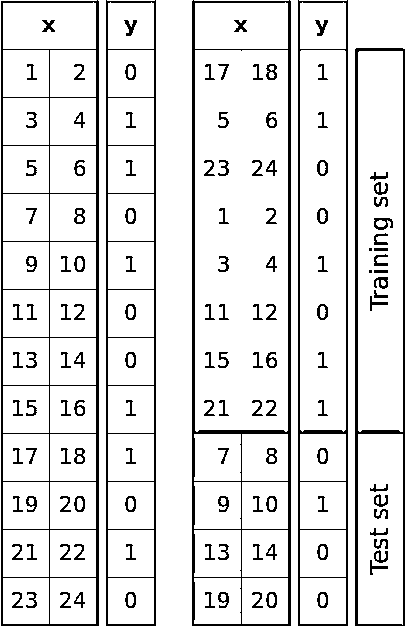
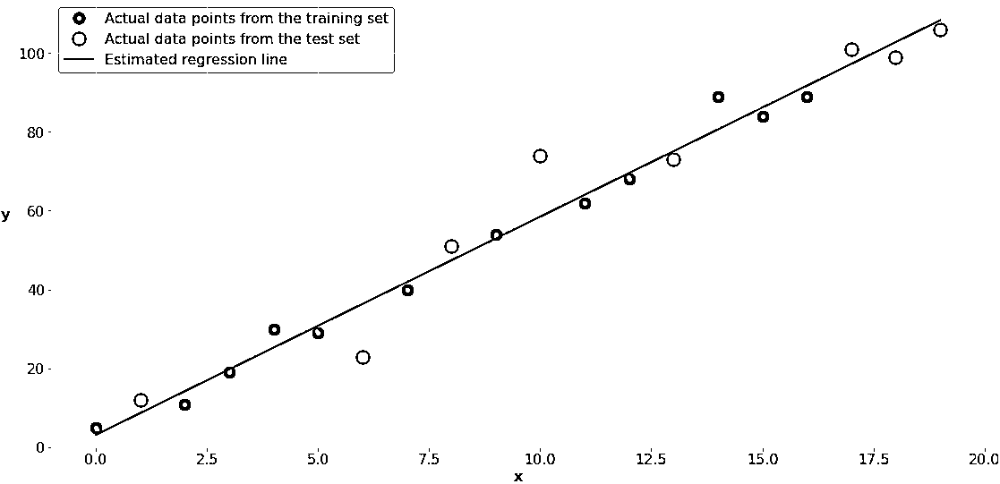

# 使用 scikit-learn 的 train_test_split()拆分数据集

> 原文：<https://realpython.com/train-test-split-python-data/>

*立即观看**本教程有真实 Python 团队创建的相关视频课程。和书面教程一起看，加深理解: [**用 scikit 拆分数据集-learn 和 train_test_split()**](/courses/splitting-datasets-scikit-learn-train-test-split/)

受监督的[机器学习](https://realpython.com/learning-paths/machine-learning-python/)的一个关键方面是模型评估和验证。当您评估模型的预测性能时，评估过程必须公正，这一点非常重要。使用数据科学库 [scikit-learn](https://scikit-learn.org/stable/index.html) 中的 [**`train_test_split()`**](https://scikit-learn.org/stable/modules/generated/sklearn.model_selection.train_test_split.html) ，您可以将数据集分割成子集，从而最大限度地减少评估和验证过程中的潜在偏差。

在本教程中，您将学习:

*   为什么在监督机器学习中需要分割数据集
*   您需要数据集的哪些**子集**来对您的模型进行无偏评估
*   如何使用 **`train_test_split()`** 拆分你的数据
*   如何将`train_test_split()`和**预测方法结合起来**

此外，您将从 [`sklearn.model_selection`](https://scikit-learn.org/stable/modules/classes.html#module-sklearn.model_selection) 获得相关工具的信息。

**免费奖励:** [点击此处获取免费的 NumPy 资源指南](#)，它会为您指出提高 NumPy 技能的最佳教程、视频和书籍。

## 数据拆分的重要性

[监督机器学习](https://en.wikipedia.org/wiki/Supervised_learning)是关于创建模型，该模型将给定输入(独立变量，或**预测器**)精确映射到给定输出(因变量，或**响应**)。

如何衡量模型的精度取决于您试图解决的问题的类型。在[回归分析](https://realpython.com/linear-regression-in-python/#regression)中，通常使用[决定系数](https://en.wikipedia.org/wiki/Coefficient_of_determination)、[均方根误差](https://en.wikipedia.org/wiki/Root-mean-square_deviation)、[平均绝对误差](https://en.wikipedia.org/wiki/Mean_absolute_error)或类似的量。对于[分类](https://realpython.com/logistic-regression-python/#classification)问题，你经常应用[准确度](https://developers.google.com/machine-learning/crash-course/classification/accuracy)、[精度、召回](https://en.wikipedia.org/wiki/Precision_and_recall)、 [F1 分数](https://en.wikipedia.org/wiki/F1_score)，以及相关指标。

衡量精度的可接受数值因字段而异。你可以从吉姆、 [Quora](https://www.quora.com/How-do-I-decide-whether-a-certain-R-square-value-is-good-enough-in-regression-analysis) 的[统计和许多其他资源中找到详细的解释。](https://statisticsbyjim.com/regression/how-high-r-squared/)

最重要的是要明白，你通常需要**无偏评估**来正确使用这些度量，评估你的模型的预测性能，并验证模型。

这意味着您无法使用用于训练的相同数据来评估模型的预测性能。你需要用模型以前没有见过的**新数据**评估模型。您可以通过在使用数据集之前对其进行拆分来实现这一点。

[*Remove ads*](/account/join/)

### 培训、验证和测试集

分割数据集对于无偏评估预测性能至关重要。在大多数情况下，将数据集随机分成三个子集就足够了:

1.  **训练集**用于训练，或者说**适合**，你的模型。例如，您使用训练集为[线性回归](https://realpython.com/linear-regression-in-python/)、[逻辑回归](https://realpython.com/logistic-regression-python/)或[神经网络](https://en.wikipedia.org/wiki/Artificial_neural_network)找到最佳权重或系数。

2.  **验证集**用于[超参数调整](https://en.wikipedia.org/wiki/Hyperparameter_optimization)期间的无偏模型评估。例如，当您想要找到神经网络中神经元的最佳数量或支持向量机的最佳核时，您可以尝试不同的值。对于每个考虑的超参数设置，用训练集拟合模型，并用验证集评估其性能。

3.  **最终模型的无偏评估需要测试集**。你不应该用它来拟合或验证。

在不太复杂的情况下，当您不必调优超参数时，只使用训练集和测试集也是可以的。

### 欠配合和过配合

分割数据集对于检测您的模型是否存在两个非常常见的问题也很重要，这两个问题分别称为[欠拟合和过拟合](https://en.wikipedia.org/wiki/Overfitting):

1.  **欠拟合**通常是模型无法封装数据间关系的结果。例如，当试图用线性模型表示非线性关系时，就会发生这种情况。训练不足的模型在训练集和测试集上都可能表现不佳。

2.  **过拟合**通常发生在模型具有过度复杂的结构，并学习数据和噪声之间的现有关系时。这种模型通常具有较差的泛化能力。尽管它们可以很好地处理训练数据，但对于看不见的(测试)数据，它们通常表现不佳。

你可以在 Python 的[线性回归中找到更详细的欠拟合和过拟合解释。](https://realpython.com/linear-regression-in-python/#underfitting-and-overfitting)

## 使用`train_test_split()` 的前提条件

现在，您已经了解了分割数据集以执行无偏模型评估并识别欠拟合或过拟合的必要性，您可以开始学习如何分割您自己的数据集了。

你将使用 0.23.1 版本的 **scikit-learn** ，或者 **`sklearn`** 。它有许多用于数据科学和机器学习的包，但对于本教程，您将重点关注 **`model_selection`** 包，特别是函数 **`train_test_split()`** 。

可以[用](https://scikit-learn.org/stable/install.html) [`pip install`](https://realpython.com/what-is-pip/) 安装`sklearn` :

```py
$ python -m pip install -U "scikit-learn==0.23.1"
```

如果你使用 [Anaconda](https://www.anaconda.com/) ，那么你可能已经安装了它。但是，如果你想使用一个[的新鲜环境](https://docs.conda.io/projects/conda/en/latest/user-guide/tasks/manage-environments.html)，确保你有指定的版本，或者使用 [Miniconda](https://docs.conda.io/en/latest/miniconda.html) ，那么你可以用`conda install`从 Anaconda Cloud 安装`sklearn`:

```py
$ conda install -c anaconda scikit-learn=0.23
```

你还需要 [NumPy](https://numpy.org/) ，但你不必单独安装它。如果你还没有安装它，你应该把它和`sklearn`放在一起。如果你想更新你的 NumPy 知识，那么看看官方文档或者看看 [Look Ma，No For-Loops:Array Programming With NumPy](https://realpython.com/numpy-array-programming/)。

## `train_test_split()`的应用

需要[导入](https://realpython.com/python-import/) `train_test_split()`和 NumPy 才能使用，所以可以从 [`import`](https://realpython.com/courses/python-imports-101/) 语句开始:

>>>

```py
>>> import numpy as np
>>> from sklearn.model_selection import train_test_split
```

现在，您已经导入了这两个数据，您可以使用它们将数据分为定型集和测试集。您将通过一个函数调用同时分离输入和输出。

使用`train_test_split()`，您需要提供想要分割的序列以及任何可选的参数。它返回一个[列表](https://realpython.com/python-lists-tuples/)的 [NumPy 数组](https://numpy.org/doc/stable/reference/generated/numpy.ndarray.html)，其他序列，或者[稀疏矩阵](https://docs.scipy.org/doc/scipy/reference/generated/scipy.sparse.csr_matrix.html)如果合适的话:

```py
sklearn.model_selection.train_test_split(*arrays, **options) -> list
```

**`arrays`** 是[列表的序列](https://realpython.com/python-lists-tuples/)、 [NumPy 数组](https://realpython.com/numpy-array-programming/)、 [pandas DataFrames](https://realpython.com/pandas-dataframe/) ，或者类似的数组状对象，它们保存着你想要分割的数据。所有这些对象一起构成数据集，并且必须具有相同的长度。

在受监督的机器学习应用程序中，您通常会处理两个这样的序列:

1.  带有输入(`x`)的二维数组
2.  带有输出(`y`)的一维数组

**`options`** 是可选的关键字参数，您可以使用它们来获得想要的行为:

*   **`train_size`** 是定义训练集大小的数字。如果您提供一个`float`，那么它必须在`0.0`和`1.0`之间，并且将定义用于测试的数据集的份额。如果您提供一个`int`，那么它将代表训练样本的总数。默认值为`None`。

*   **`test_size`** 是定义测试集大小的数字。和`train_size`很像。你应该提供`train_size`或`test_size`。如果两者都没有给出，那么将用于测试的数据集的默认份额是`0.25`，或者 25%。

*   **`random_state`** 是分割时控制随机化的对象。它可以是一个`int`，也可以是一个 [`RandomState`](https://numpy.org/doc/stable/reference/random/legacy.html?highlight=randomstate#numpy.random.RandomState) 的实例。默认值为`None`。

*   **`shuffle`** 是[布尔对象](https://realpython.com/python-boolean/)(默认为`True`)决定在应用分割之前是否洗牌。

*   **`stratify`** 是一个类似数组的对象，如果不是`None`，则决定如何使用[分层拆分](https://en.wikipedia.org/wiki/Stratified_sampling)。

现在是时候尝试数据拆分了！您将从创建一个简单的数据集开始。数据集将包含二维数组`x`中的输入和一维数组`y`中的输出:

>>>

```py
>>> x = np.arange(1, 25).reshape(12, 2)
>>> y = np.array([0, 1, 1, 0, 1, 0, 0, 1, 1, 0, 1, 0])
>>> x
array([[ 1,  2],
 [ 3,  4],
 [ 5,  6],
 [ 7,  8],
 [ 9, 10],
 [11, 12],
 [13, 14],
 [15, 16],
 [17, 18],
 [19, 20],
 [21, 22],
 [23, 24]])
>>> y
array([0, 1, 1, 0, 1, 0, 0, 1, 1, 0, 1, 0])
```

为了得到你的数据，你使用 [`arange()`](https://numpy.org/doc/stable/reference/generated/numpy.arange.html) ，这对于根据[数值范围](https://realpython.com/how-to-use-numpy-arange/)生成数组是非常方便的。你也可以使用 [`.reshape()`](https://numpy.org/doc/stable/reference/generated/numpy.ndarray.reshape.html) 来修改`arange()`返回的数组的形状，得到一个二维的数据结构。

您可以通过一次函数调用分割输入和输出数据集:

>>>

```py
>>> x_train, x_test, y_train, y_test = train_test_split(x, y)
>>> x_train
array([[15, 16],
 [21, 22],
 [11, 12],
 [17, 18],
 [13, 14],
 [ 9, 10],
 [ 1,  2],
 [ 3,  4],
 [19, 20]])
>>> x_test
array([[ 5,  6],
 [ 7,  8],
 [23, 24]])
>>> y_train
array([1, 1, 0, 1, 0, 1, 0, 1, 0])
>>> y_test
array([1, 0, 0])
```

给定两个序列，如这里的`x`和`y`,`train_test_split()`执行分割并按以下顺序返回四个序列(在本例中为 NumPy 数组):

1.  **`x_train` :** 第一序列的训练部分(`x`)
2.  **`x_test` :** 第一序列的测试部分(`x`)
3.  **`y_train` :** 第二序列的训练部分(`y`)
4.  **`y_test` :** 第二序列的测试部分(`y`)

您可能会得到与您在这里看到的不同的结果。这是因为数据集分割在默认情况下是随机的。每次运行该函数时，结果都会不同。然而，这通常不是你想要的。

有时，为了使您的测试具有可重复性，您需要对每个函数调用进行随机分割，并得到相同的输出。你可以用参数`random_state`来实现。`random_state`的值并不重要，它可以是任何非负整数。你可以使用一个`numpy.random.RandomState`的实例来代替，但是这是一个更复杂的方法。

在前面的示例中，您使用了一个包含 12 个观察值(行)的数据集，得到了一个包含 9 行的训练样本和一个包含 3 行的测试样本。这是因为您没有指定所需的训练集和测试集的大小。默认情况下，25%的样本被分配给测试集。对于许多应用程序来说，这个比率通常是不错的，但是它并不总是您所需要的。

通常，您会想要明确地定义测试(或训练)集的大小，有时您甚至会想要试验不同的值。您可以通过参数`train_size`或`test_size`来实现。

修改代码，以便您可以选择测试集的大小并获得可重现的结果:

>>>

```py
>>> x_train, x_test, y_train, y_test = train_test_split(
...     x, y, test_size=4, random_state=4
... )
>>> x_train
array([[17, 18],
 [ 5,  6],
 [23, 24],
 [ 1,  2],
 [ 3,  4],
 [11, 12],
 [15, 16],
 [21, 22]])
>>> x_test
array([[ 7,  8],
 [ 9, 10],
 [13, 14],
 [19, 20]])
>>> y_train
array([1, 1, 0, 0, 1, 0, 1, 1])
>>> y_test
array([0, 1, 0, 0])
```

有了这个改变，你会得到与以前不同的结果。之前，您有一个包含九个项目的训练集和一个包含三个项目的测试集。现在，由于参数`test_size=4`，训练集有八个项目，测试集有四个项目。用`test_size=0.33`你会得到同样的结果，因为 12 的 33%大约是 4。

最后两个例子还有一个非常重要的区别:现在每次运行这个函数都会得到相同的结果。这是因为你已经用`random_state=4`修复了随机数生成器。

下图显示了调用`train_test_split()`时的情况:

[](https://files.realpython.com/media/fig-1.c489adc748c8.png)

数据集的样本被随机打乱，然后根据您定义的大小分成训练集和测试集。

你可以看到`y`有六个 0 和六个 1。然而，测试集的四个项目中有三个零。如果你想通过训练集和测试集(大概)保持`y`值的比例，那就通过`stratify=y`。这将实现分层分割:

>>>

```py
>>> x_train, x_test, y_train, y_test = train_test_split(
...     x, y, test_size=0.33, random_state=4, stratify=y
... )
>>> x_train
array([[21, 22],
 [ 1,  2],
 [15, 16],
 [13, 14],
 [17, 18],
 [19, 20],
 [23, 24],
 [ 3,  4]])
>>> x_test
array([[11, 12],
 [ 7,  8],
 [ 5,  6],
 [ 9, 10]])
>>> y_train
array([1, 0, 1, 0, 1, 0, 0, 1])
>>> y_test
array([0, 0, 1, 1])
```

现在`y_train`和`y_test`具有与原始`y`数组相同的 0 和 1 的比率。

在某些情况下，分层分割是可取的，例如当您对一个不平衡数据集进行分类时，该数据集在属于不同类的样本数量上有显著差异。

最后，您可以使用`shuffle=False`关闭数据混排和随机分割:

>>>

```py
>>> x_train, x_test, y_train, y_test = train_test_split(
...     x, y, test_size=0.33, shuffle=False
... )
>>> x_train
array([[ 1,  2],
 [ 3,  4],
 [ 5,  6],
 [ 7,  8],
 [ 9, 10],
 [11, 12],
 [13, 14],
 [15, 16]])
>>> x_test
array([[17, 18],
 [19, 20],
 [21, 22],
 [23, 24]])
>>> y_train
array([0, 1, 1, 0, 1, 0, 0, 1])
>>> y_test
array([1, 0, 1, 0])
```

现在，您有了一个拆分，原始`x`和`y`数组中的前三分之二样本被分配给训练集，后三分之一被分配给测试集。没有洗牌。没有随机性。

[*Remove ads*](/account/join/)

## 用`train_test_split()`监督机器学习

现在是时候看看`train_test_split()`在解决监督学习问题时的表现了。在看一个更大的问题之前，您将从一个可以用线性回归解决的小回归问题开始。您还将看到，您也可以使用`train_test_split()`进行分类。

### 线性回归的极简例子

在这个例子中，您将应用到目前为止所学的知识来解决一个小的回归问题。您将学习如何创建数据集，将它们分成训练和测试子集，并使用它们进行线性回归。

和往常一样，您将从导入必要的包、函数或类开始。你需要 NumPy、 [`LinearRegression`](https://scikit-learn.org/stable/modules/generated/sklearn.linear_model.LinearRegression.html) 和`train_test_split()`:

>>>

```py
>>> import numpy as np
>>> from sklearn.linear_model import LinearRegression
>>> from sklearn.model_selection import train_test_split
```

现在您已经导入了您需要的所有东西，您可以创建两个小数组，`x`和`y`，来表示观察值，然后像以前一样将它们分成训练集和测试集:

>>>

```py
>>> x = np.arange(20).reshape(-1, 1)
>>> y = np.array([5, 12, 11, 19, 30, 29, 23, 40, 51, 54, 74,
...               62, 68, 73, 89, 84, 89, 101, 99, 106])
>>> x
array([[ 0],
 [ 1],
 [ 2],
 [ 3],
 [ 4],
 [ 5],
 [ 6],
 [ 7],
 [ 8],
 [ 9],
 [10],
 [11],
 [12],
 [13],
 [14],
 [15],
 [16],
 [17],
 [18],
 [19]])
>>> y
array([  5,  12,  11,  19,  30,  29,  23,  40,  51,  54,  74,  62,  68,
 73,  89,  84,  89, 101,  99, 106])
>>> x_train, x_test, y_train, y_test = train_test_split(
...     x, y, test_size=8, random_state=0
... )
```

您的数据集有二十个观察值，即`x` - `y`对。您指定了参数`test_size=8`，因此数据集被分为一个包含 12 个观察值的训练集和一个包含 8 个观察值的测试集。

现在，您可以使用训练集来拟合模型:

>>>

```py
>>> model = LinearRegression().fit(x_train, y_train)
>>> model.intercept_
3.1617195496417523
>>> model.coef_
array([5.53121801])
```

`LinearRegression`创建代表模型的对象，而 [`.fit()`](https://scikit-learn.org/stable/modules/generated/sklearn.linear_model.LinearRegression.html#sklearn.linear_model.LinearRegression.fit) 训练或拟合模型并返回它。对于线性回归，拟合模型意味着确定回归线的最佳截距(`model.intercept_`)和斜率(`model.coef_`)值。

尽管您可以使用`x_train`和`y_train`来检查拟合度，但这不是最佳实践。对模型预测性能的无偏估计基于测试数据:

>>>

```py
>>> model.score(x_train, y_train)
0.9868175024574795
>>> model.score(x_test, y_test)
0.9465896927715023
```

[`.score()`](https://scikit-learn.org/stable/modules/generated/sklearn.linear_model.LinearRegression.html#sklearn.linear_model.LinearRegression.score) 返回通过数据的**决定系数**，或 *R* 。它的最大值是`1`。 *R* 值越高，拟合度越好。在这种情况下，训练数据会产生稍高的系数。然而，用测试数据计算的 *R* 是对模型预测性能的无偏测量。

这是它在图表上的样子:

[](https://files.realpython.com/media/fig-2.850628602c7e.png)

绿点代表用于训练的`x` - `y`对。黑线称为[估计回归线](https://www.britannica.com/science/estimated-regression-equation)，由模型拟合的结果定义:截距和斜率。所以，它只反映了绿点的位置。

白点代表测试集。您可以使用它们来估计模型(回归线)的性能，而数据不用于定型。

### 回归示例

现在，您已经准备好分割更大的数据集来解决回归问题。您将使用一个著名的[波士顿房价数据集](https://scikit-learn.org/stable/datasets/toy_dataset.html#boston-house-prices-dataset)，它包含在`sklearn`中。该数据集有 506 个样本、13 个输入变量和作为输出的房屋值。可以用 [`load_boston()`](https://scikit-learn.org/stable/modules/generated/sklearn.datasets.load_boston.html#sklearn.datasets.load_boston) 检索。

首先，导入`train_test_split()`和`load_boston()`:

>>>

```py
>>> from sklearn.datasets import load_boston
>>> from sklearn.model_selection import train_test_split
```

现在您已经导入了两个函数，您可以获取要处理的数据了:

>>>

```py
>>> x, y = load_boston(return_X_y=True)
```

如您所见，带有参数`return_X_y=True`的`load_boston()`返回一个带有两个 NumPy 数组的[元组](https://realpython.com/python-lists-tuples/):

1.  带有输入的二维数组
2.  具有输出的一维数组

下一步是像以前一样分割数据:

>>>

```py
>>> x_train, x_test, y_train, y_test = train_test_split(
...     x, y, test_size=0.4, random_state=0
... )
```

现在您有了训练集和测试集。训练数据在`x_train`和`y_train`中，测试数据在`x_test`和`y_test`中。

当您处理较大的数据集时，通常以比率的形式传递训练或测试大小会更方便。`test_size=0.4`表示大约 40%的样本将被分配给测试数据，剩余的 60%将被分配给训练数据。

最后，您可以使用训练集(`x_train`和`y_train`)来拟合模型，并使用测试集(`x_test`和`y_test`)来对模型进行无偏见的评估。在本例中，您将应用三种众所周知的回归算法来创建适合您的数据的模型:

1.  用`LinearRegression()`进行线性回归
2.  [渐变助推](https://en.wikipedia.org/wiki/Gradient_boosting)与 [`GradientBoostingRegressor()`](https://scikit-learn.org/stable/modules/generated/sklearn.ensemble.GradientBoostingRegressor.html)
3.  [随机森林](https://en.wikipedia.org/wiki/Random_forest)同 [`RandomForestRegressor()`](https://scikit-learn.org/stable/modules/generated/sklearn.ensemble.RandomForestRegressor.html)

这个过程与前面的例子非常相似:

1.  **导入**你需要的类。
2.  使用这些类创建模型实例。
3.  **使用训练集将**模型实例与 **`.fit()`** 拟合。
4.  **使用测试集对 **`.score()`** 的模型进行评估**。

以下是遵循上述所有三种回归算法步骤的代码:

>>>

```py
>>> from sklearn.linear_model import LinearRegression
>>> model = LinearRegression().fit(x_train, y_train)
>>> model.score(x_train, y_train)
0.7668160223286261
>>> model.score(x_test, y_test)
0.6882607142538016

>>> from sklearn.ensemble import GradientBoostingRegressor
>>> model = GradientBoostingRegressor(random_state=0).fit(x_train, y_train)
>>> model.score(x_train, y_train)
0.9859065238883613
>>> model.score(x_test, y_test)
0.8530127436482149

>>> from sklearn.ensemble import RandomForestRegressor
>>> model = RandomForestRegressor(random_state=0).fit(x_train, y_train)
>>> model.score(x_train, y_train)
0.9811695664860354
>>> model.score(x_test, y_test)
0.8325867908704008
```

您已经使用训练和测试数据集来拟合三个模型并评估它们的性能。用`.score()`获得的精度测量值是决定系数。它可以用训练集或测试集来计算。然而，正如您已经了解到的，测试集获得的分数代表了对性能的无偏估计。

正如文档中提到的，您可以向`LinearRegression()`、`GradientBoostingRegressor()`和`RandomForestRegressor()`提供可选参数。`GradientBoostingRegressor()`和`RandomForestRegressor()`使用`random_state`参数的原因与`train_test_split()`相同:处理算法中的随机性并确保可再现性。

对于某些方法，您可能还需要[特征缩放](https://en.wikipedia.org/wiki/Feature_scaling)。在这种情况下，您应该让定标器适合训练数据，并使用它们来转换测试数据。

[*Remove ads*](/account/join/)

### 分类示例

你可以使用`train_test_split()`来解决**分类**问题，就像你做回归分析一样。在机器学习中，分类问题涉及训练模型来对输入值应用标签或进行分类，并将数据集分类。

在 Python 中的[逻辑回归教程中，你会发现一个](https://realpython.com/logistic-regression-python/)[手写识别](https://realpython.com/logistic-regression-python/#logistic-regression-in-python-handwriting-recognition)任务的例子。该示例提供了将数据分为训练集和测试集的另一个示例，以避免评估过程中的偏差。

## 其他验证功能

软件包 [`sklearn.model_selection`](https://scikit-learn.org/stable/modules/classes.html#module-sklearn.model_selection) 提供了许多与模型选择和验证相关的功能，包括以下内容:

*   交叉验证
*   学习曲线
*   超参数调谐

[交叉验证](https://en.wikipedia.org/wiki/Cross-validation_(statistics))是一套技术，它结合了预测性能的测量，以获得更准确的模型估计。

广泛使用的交叉验证方法之一是[*k*——折叠交叉验证](https://en.wikipedia.org/wiki/Cross-validation_(statistics)#k-fold_cross-validation)。在其中，你将你的数据集分成大小相等的 *k* (通常是五个或十个)子集，或者说**折叠**，然后执行 *k* 次训练和测试过程。每次，您使用不同的折叠作为测试集，所有剩余的折叠作为训练集。这提供了预测性能的 k 个度量，然后您可以分析它们的平均值和标准偏差。

您可以使用 [`KFold`](https://scikit-learn.org/stable/modules/generated/sklearn.model_selection.KFold.html) 、 [`StratifiedKFold`](https://scikit-learn.org/stable/modules/generated/sklearn.model_selection.StratifiedKFold.html) 、 [`LeaveOneOut`](https://scikit-learn.org/stable/modules/generated/sklearn.model_selection.LeaveOneOut.html) 以及`sklearn.model_selection`中的其他一些类和函数来实现交叉验证。

[学习曲线](https://en.wikipedia.org/wiki/Learning_curve_(machine_learning))，有时称为训练曲线，显示了训练和验证集的预测分数如何取决于训练样本的数量。您可以使用 [`learning_curve()`](https://scikit-learn.org/stable/modules/generated/sklearn.model_selection.learning_curve.html) 来获得这种依赖关系，它可以帮助您找到训练集的最佳大小，选择超参数，比较模型，等等。

[超参数调优](https://en.wikipedia.org/wiki/Hyperparameter_optimization)，也叫超参数优化，是确定一组最佳超参数来定义你的机器学习模型的过程。`sklearn.model_selection`为此提供了几个选项，包括[`GridSearchCV`](https://scikit-learn.org/stable/modules/generated/sklearn.model_selection.GridSearchCV.html)[`RandomizedSearchCV`](https://scikit-learn.org/stable/modules/generated/sklearn.model_selection.RandomizedSearchCV.html)[`validation_curve()`](https://scikit-learn.org/stable/modules/generated/sklearn.model_selection.validation_curve.html)等。分割数据对于超参数调整也很重要。

## 结论

你现在知道为什么以及如何从`sklearn`中使用 **`train_test_split()`** 了。您已经了解到，为了对机器学习模型的预测性能进行无偏估计，您应该使用尚未用于模型拟合的数据。这就是为什么您需要将数据集分为训练、测试和某些情况下的验证子集。

**在本教程中，您已经学会了如何:**

*   使用 **`train_test_split()`** 获得训练集和测试集
*   用参数 **`train_size`** 和 **`test_size`** 控制子集的大小
*   用`random_state`参数确定你劈叉的**随机性**
*   用`stratify`参数获得**分层分裂**
*   使用`train_test_split()`作为**监督机器学习**程序的一部分

您还看到了`sklearn.model_selection`模块提供了几个其他的模型验证工具，包括交叉验证、学习曲线和超参数调整。

如果你有任何问题或意见，请写在下面的评论区。

*立即观看**本教程有真实 Python 团队创建的相关视频课程。和书面教程一起看，加深理解: [**用 scikit 拆分数据集-learn 和 train_test_split()**](/courses/splitting-datasets-scikit-learn-train-test-split/)*****