# 如何用 Tweepy 用 Python 制作一个 Twitter 机器人

> 原文：<https://realpython.com/twitter-bot-python-tweepy/>

在本文中，您将学习如何使用 Tweepy 用 Python 制作自己的 Twitter 机器人，Tweepy 是一个提供了使用 Twitter API 的非常方便的方法的包。

Twitter 是使用最广泛的社交网络之一。对于许多组织和个人来说，拥有一个伟大的 Twitter 是保持他们的观众参与的关键因素。

拥有一个伟大的 Twitter 存在的一部分包括用新的 tweets 和 retweets 保持你的帐户活跃，关注有趣的帐户，并迅速回复你的追随者的消息。您可以手动完成所有这些工作，但这会花费很多时间。相反，你可以依靠一个**推特机器人**，一个自动完成你全部或部分推特活动的程序。

**在这篇文章中，你将学习如何:**

*   改善并自动化您与 Twitter 受众的互动
*   安装 Tweepy
*   注册成为 Twitter 开发者来使用它的 API
*   使用 Tweepy 调用 Twitter API
*   构建 Twitter 机器人
*   使用 Docker 和 AWS 将机器人部署到服务器上

**免费奖励:** [掌握 Python 的 5 个想法](https://realpython.com/bonus/python-mastery-course/)，这是一个面向 Python 开发者的免费课程，向您展示将 Python 技能提升到下一个水平所需的路线图和心态。

## 你好 Tweepy

首先，你可以使用 Tweepy 创建一条 tweet，说`Hello Tweepy`:

```py
import tweepy

# Authenticate to Twitter
auth = tweepy.OAuthHandler("CONSUMER_KEY", "CONSUMER_SECRET")
auth.set_access_token("ACCESS_TOKEN", "ACCESS_TOKEN_SECRET")

# Create API object
api = tweepy.API(auth)

# Create a tweet
api.update_status("Hello Tweepy")
```

这是一个简短的示例，但它显示了所有 Tweepy 程序共有的四个步骤:

1.  [导入](https://realpython.com/absolute-vs-relative-python-imports/)`tweepy`包
2.  设置身份验证凭据
3.  创建一个新的`tweepy.API`对象
4.  使用`api`对象调用 Twitter API

属于`tweepy.API`类的对象提供了大量的方法，可以用来访问几乎所有的 Twitter 功能。在代码片段中，我们使用了`update_status()`来创建一条新的 Tweet。

我们将在本文后面看到身份验证是如何工作的，以及如何创建所需的身份验证密钥、令牌和秘密。

这只是用 Tweepy 可以做的一个小例子。通过这篇文章，您将学习如何构建以更加有趣和复杂的方式与 Twitter 交互的程序。

[*Remove ads*](/account/join/)

## Twitter API

Twitter API 让开发者可以使用 Twitter 的大部分功能。您可以使用 API 来读取和写入与 Twitter 实体相关的信息，比如 tweets、用户和趋势。

从技术上讲，该 API 公开了许多与以下内容相关的 HTTP 端点:

*   小鸟叫声
*   转发
*   喜欢
*   直接消息
*   收藏夹
*   趋势
*   媒体

正如我们将在后面看到的，Tweepy 提供了一种无需处理底层细节就能调用那些 HTTP 端点的方法。

Twitter API 使用 [OAuth](https://oauth.net) (一种广泛使用的开放授权协议)来认证所有请求。在调用 Twitter API 之前，您需要创建和配置您的身份验证凭证。在本文的后面，您将找到这方面的详细说明。

您可以利用 Twitter API 来构建不同种类的自动化，例如机器人、分析和其他工具。请记住，Twitter 对使用它的 API 能做什么和不能做什么施加了一定的限制和政策。这样做是为了保证用户有良好的体验。禁止开发垃圾邮件、误导用户等工具。

Twitter API 还对允许调用 API 方法的频率施加了**速率限制**。如果超过这些限制，您必须等待 5 到 15 分钟才能再次使用该 API。您必须在设计和实现机器人时考虑这一点，以避免不必要的等待。

您可以在其官方文档中找到关于 Twitter API 的政策和限制的更多信息:

*   [推特自动化](https://help.twitter.com/en/rules-and-policies/twitter-automation)
*   [速率限制](https://developer.twitter.com/en/docs/basics/rate-limits)

## 什么是 Tweepy？

**[Tweepy](https://github.com/tweepy/tweepy)** 是一个开源的 Python 包，给你一个非常方便的方法来用 Python 访问 Twitter API。Tweepy 包括一组表示 Twitter 模型和 API 端点的类和方法，它透明地处理各种实现细节，例如:

*   数据编码和解码
*   HTTP 请求
*   结果分页
*   OAuth 认证
*   费率限制
*   流

如果您没有使用 Tweepy，那么您必须处理与 HTTP 请求、数据序列化、身份验证和速率限制有关的底层细节。这可能很耗时，并且容易出错。相反，由于 Tweepy，您可以专注于您想要构建的功能。

Twitter API 提供的几乎所有功能都可以通过 Tweepy 使用。从 3.7.0 版本开始，目前唯一的限制是，由于 Twitter API 最近的一些变化，直接消息不能正常工作。

## 使用 Tweepy

在本节中，您将学习如何安装 Tweepy for development、配置身份验证凭证以及与 Twitter API 交互。

### 安装

Tweepy 可以使用 Python 包管理器 **pip** 来安装。在本文中，我们将为项目使用一个虚拟环境( **virtualenv** )，以避免依赖系统范围的软件包。有关虚拟环境和 pip 的更多信息，请查看 [Python 虚拟环境:初级读本](https://realpython.com/python-virtual-environments-a-primer/)和[什么是 Pip？新蟒蛇指南](https://realpython.com/what-is-pip/)。

您可以通过创建一个名为`tweepy-bots`的项目开始。第一步是创建目录和虚拟环境:

```py
$ mkdir tweepy-bots
$ cd tweepy-bots
$ python3 -m venv venv
```

上面的命令在项目目录中创建虚拟环境。

然后就可以安装 Tweepy 包了。首先，您需要**激活**新创建的虚拟环境，然后使用 **pip** 进行安装:

```py
$ source ./venv/bin/activate
$ pip install tweepy
```

现在 Tweepy 已经安装好了，让我们创建一个包含您的[依赖项](https://realpython.com/courses/managing-python-dependencies/)的名称的`requirements.txt`文件。您可以使用 pip 命令**冻结**来完成该任务:

```py
$ pip freeze > requirements.txt
```

您将在部署项目时使用这个`requirements.txt`文件。

**注意:**用于激活虚拟环境的方法可能会有所不同，这取决于您的操作系统和 shell。你可以在 [venv 文档](https://docs.python.org/3/library/venv.html)中了解更多。

[*Remove ads*](/account/join/)

### 创建 Twitter API 认证证书

正如我们之前看到的，Twitter API 要求所有请求都使用 OAuth 进行身份验证。因此，您需要创建必需的身份验证凭证，以便能够使用 API。这些凭据是四个文本字符串:

1.  消费者密钥
2.  消费者秘密
3.  访问令牌
4.  访问机密

如果您已经有了一个 Twitter 用户帐户，那么按照以下步骤创建密钥、令牌和秘密。否则，你必须注册成为 Twitter 用户才能继续。

**第一步:申请 Twitter 开发者账户**

去 [Twitter 开发者网站](https://developer.twitter.com)申请一个开发者账号。在这里，您必须选择负责该帐户的 Twitter 用户。大概应该是你或者你的组织。该页面如下所示:

[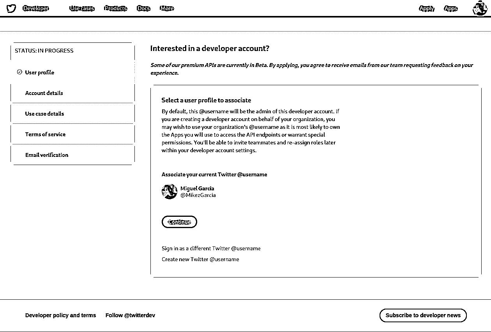](https://files.realpython.com/media/dev_account_01.2a5eab8edcb8.png)

在这种情况下，我选择用自己的账号， *@MikezGarcia* 。

Twitter 随后会询问一些关于你打算如何使用开发者账户的信息，如下所示:

[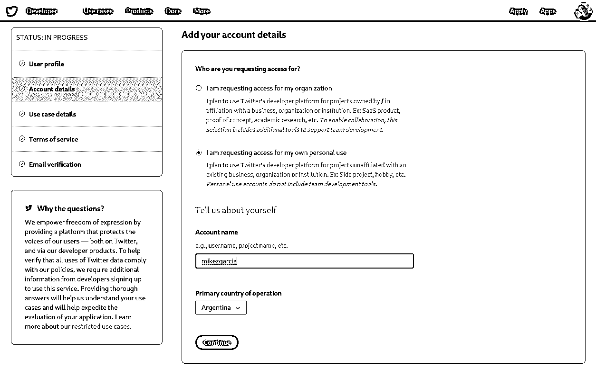](https://files.realpython.com/media/dev_account_02.f6f23b384b33.png)

您必须指定开发人员帐户名，以及您计划将其用于个人目的还是用于您的组织。

**第二步:创建一个应用程序**

Twitter 向应用程序授予认证证书，而不是帐户。一个应用可以是任何使用 Twitter API 的工具或机器人。因此，您需要注册您的应用程序才能进行 API 调用。

要注册你的应用，进入[你的 Twitter 应用页面](https://developer.twitter.com/en/apps)，选择*创建应用*选项。

你需要提供关于你的应用程序及其用途的以下信息:

*   **应用程序名称:**用于标识您的应用程序的名称(如 *examplebot*
*   **应用描述:**你的应用的目的(比如*一个真实 Python 文章的示例 bot*
*   **您或您的应用程序的网站 URL:** 必需，但可以是您的个人网站的 URL，因为机器人不需要 URL 来工作
*   **app 的使用:**用户会如何使用你的 app(比如*这个 app 是一个会自动回复用户的 bot*

**步骤 3:创建认证凭证**

要创建认证凭证，请前往[您的 Twitter 应用页面](https://developer.twitter.com/en/apps)。以下是*应用页面*的外观:

[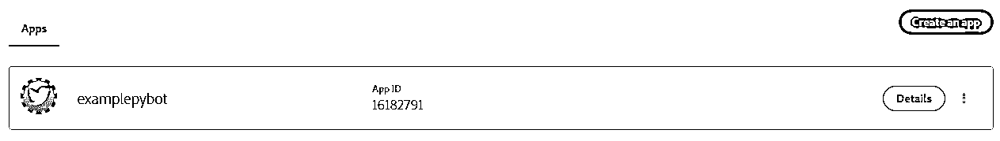](https://files.realpython.com/media/dev_account_06.fcb9c3b19939.png)

在这里你可以找到你的应用程序的*细节*按钮。单击此按钮将转到下一页，您可以在此生成凭据。

通过选择*密钥和令牌*选项卡，您可以生成并复制密钥、令牌和秘密，以便在您的代码中使用它们:

[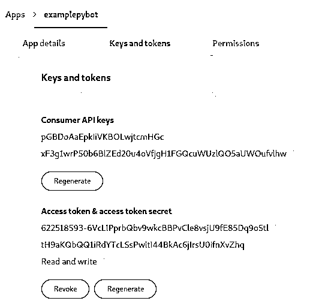](https://files.realpython.com/media/dev_account_07.f37afa5ab26a.efd2422a33c8.png)

生成凭据后，保存它们以便以后在代码中使用。

您可以使用以下代码片段测试凭据:

```py
import tweepy

# Authenticate to Twitter
auth = tweepy.OAuthHandler("pGBDoAaEpkliVKBOLwjtcmHGc", 
    "xF3g1wrP50b6BlZEd20u4oVfjgH1FGQcuWUzlQO5aUWOufvlhw")
auth.set_access_token("622518493-6VcLIPprbQbv9wkcBBPvCle8vsjU9fE85Dq9oStl", 
    "tH9aKQbQQ1iRdYTcLSsPwitl44BkAc6jilrsU0ifnXvZhq")

api = tweepy.API(auth)

try:
    api.verify_credentials()
    print("Authentication OK")
except:
    print("Error during authentication")
```

在这个代码片段中，使用`verify_credentials()`测试凭证。如果一切顺利，您应该会看到一条消息，说*认证成功*。

**注意:**本文中使用的所有凭据都只是示例，不起作用。你必须生成并使用你自己的凭证。

[*Remove ads*](/account/join/)

### 回顾 Tweepy 功能

Tweepy 为您提供了一个从 Python 访问 Twitter API 的接口。它通过封装 Twitter API 的复杂性，并在其上添加模型层和其他有用的功能来做到这一点。

由于随着时间的推移，各种 Twitter 概念的名称已经发生了变化，一些旧名称仍然在 Tweepy 中使用。因此请记住，在本文的上下文中，这些等价关系成立:

*   一条**状态**是一条**推文**。
*   一种**友谊**是一种**追随关系**。
*   一个**喜欢的**是一个**喜欢的**。

现在你知道 Tweepy 是如何命名事物的了，让我们看看它是如何工作的。

Tweepy 的功能可分为以下几组:

*   OAuth
*   API 类
*   模型
*   光标
*   流

现在，您将了解这些组，了解每个组提供的功能。

**OAuth**

Tweepy 负责使用 Twitter API 认证每个请求所需的 OAuth 的所有细节。它提供了一个`OAuthHandler`类，可以用来设置所有 API 调用中使用的凭证。

这段代码片段展示了如何创建一个`OAuthHandler`对象，该对象稍后可用于 API 调用:

```py
import tweepy

# Authenticate to Twitter
auth = tweepy.OAuthHandler("CONSUMER_KEY", "CONSUMER_SECRET")
auth.set_access_token("ACCESS_TOKEN", "ACCESS_TOKEN_SECRET")
```

这里您告诉 Tweepy 使用您在**步骤 3:创建认证凭证**中创建的凭证。您必须用之前生成的值替换`CONSUMER_KEY`、`CONSUMER_SECRET`、`ACCESS_TOKEN`和`ACCESS_TOKEN_SECRET`。

**API 类**

`API`类有许多方法提供对 Twitter API 端点的访问。使用这些方法，您可以访问 Twitter API 的功能。

下面的代码片段创建了一个`API`对象，您可以用它来调用 Twitter API 方法。将`wait_on_rate_limit`和`wait_on_rate_limit_notify`设置为`True`会使 API 对象[打印](https://realpython.com/python-print/)一条消息，并在超过速率限制时等待:

```py
import tweepy

# Authenticate to Twitter
auth = tweepy.OAuthHandler("CONSUMER_KEY", "CONSUMER_SECRET")
auth.set_access_token("ACCESS_TOKEN", "ACCESS_TOKEN_SECRET")

# Create API object
api = tweepy.API(auth, wait_on_rate_limit=True,
    wait_on_rate_limit_notify=True)
```

在上面的代码中，我们已经设置了认证凭证并创建了一个`api`对象。您可以调用该对象的方法来进行任何 API 调用。

`API`方法可分为以下几类:

*   用户时间线的方法
*   推文的方法
*   用户方法
*   追随者的方法
*   您的帐户的方法
*   喜欢的方法
*   阻止用户的方法
*   搜索方法
*   趋势方法
*   流式传输方法

在下面的小节中，您将回顾不同组的 API 方法。你可以访问 [API 类文档](https://tweepy.readthedocs.io/en/latest/api.html)来获得所有 API 方法的详细列表。

**用户时间线的方法**

这些方法处理从你的时间线或任何其他用户的时间线读取推文、提及和转发，只要它是公开的。

此代码片段打印了您的家庭时间轴中最后一条推文的作者和文本:

```py
timeline = api.home_timeline()
for tweet in timeline:
    print(f"{tweet.user.name} said {tweet.text}")
```

`home_timeline()`，一个 Tweepy API 方法，用于获取你的时间线中的最后 20 个条目。20 是 Tweepy 中的默认值。稍后您将看到如何获得 20 个以上的结果并处理分页的结果。

**推文方法**

这些方法与创建、获取和转发推文有关。

下面的代码使用 Tweepy 创建一条带有一些文本的 tweet:

```py
api.update_status("Test tweet from Tweepy Python")
```

我们已经使用`update_status()`从 Python 字符串创建了一条新的 tweet。

**用户方法**

该组中的方法使您能够使用过滤标准搜索用户，获取用户详细信息，并列出任何用户的关注者，只要该用户帐户是公共的。

下面的代码片段获取我的用户， *@MikezGarcia* ，然后打印它的详细信息以及它最近的 20 个关注者:

```py
user = api.get_user("MikezGarcia")

print("User details:")
print(user.name)
print(user.description)
print(user.location)

print("Last 20 Followers:")
for follower in user.followers():
    print(follower.name)
```

`get_user()`返回一个包含用户详细信息的对象。这个返回的对象也有访问与用户相关的信息的方法。您使用了`followers`属性来获取关注者列表。

**追随者的方法**

这组方法处理关注和不关注用户，查询用户的关注者，并列出任何用户正在关注的帐户。

这段代码展示了如何使用 Tweepy 开始跟随 *@realpython* :

```py
api.create_friendship("realpython")
```

`create_friendship()`将 *@realpython* 添加到您关注的帐户列表中。

**您的账户方式**

这些方法允许您读取和写入自己的个人资料详细信息。

例如，您可以使用以下代码片段来更新您的个人资料描述:

```py
api.update_profile(description="I like Python")
```

关键字参数`description`被传递给`update_profile()`以将您的个人资料描述更改为`"I like Python"`。

**喜欢的方法**

使用这些 API 方法，你可以将任何推文标记为*喜欢*或者移除*喜欢*的标记，如果它已经被添加的话。

您可以在您的个人日程表中将最近的推文标记为*喜欢的*，如下所示:

```py
tweets = api.home_timeline(count=1)
tweet = tweets[0]
print(f"Liking tweet {tweet.id} of {tweet.author.name}")
api.create_favorite(tweet.id)
```

这段代码使用`home_timeline()`获取最近的 tweet。然后，`tweet.id`被传递给`create_favorite()`以将推文标记为*喜欢*。

**阻止用户的方法**

这组方法处理阻止和解除阻止用户，以及列出被阻止的用户。

以下是查看您阻止的用户的方式:

```py
for block in api.blocks():
    print(block.name)
```

此代码遍历您已阻止的帐户列表。你可以用`blocks()`得到这个列表。

**搜索方法**

使用这些方法，您可以使用文本、语言和其他过滤器来搜索推文。

例如，您可以尝试使用以下代码来获取最近 10 条包含单词`"Python"`的英文公共 tweets:

```py
for tweet in api.search(q="Python", lang="en", rpp=10):
    print(f"{tweet.user.name}:{tweet.text}")
```

您使用了`search()`来过滤符合期望标准的推文。这将搜索任何公开的推文，而不仅仅是你关注的人的推文。

**趋势方法**

这组方法允许您列出任何地理位置的当前趋势。

例如，以下是如何列出全球热门话题:

```py
trends_result = api.trends_place(1)
for trend in trends_result[0]["trends"]:
    print(trend["name"])
```

使用`trends_place()`，您可以获得任何地点的趋势列表，将地点 id 作为唯一参数传递。在这里，`1`的意思是全球范围的。您可以使用`api.trends_available()`查看可用位置的完整列表。

**流式传输的方法**

**流媒体**允许你在**实时**中主动观看符合特定标准的推文。这意味着当没有任何新的 tweet 符合标准时，程序将等待直到一个新的 tweet 被创建，然后处理它。

要使用流，您必须创建两个对象:

1.  **流对象**使用 Twitter API 获取符合某些标准的推文。这个对象是推文的来源，然后由**流监听器**处理。
2.  **流监听器**从流中接收 tweets。

你可以这样做:

```py
import json
import tweepy

class MyStreamListener(tweepy.StreamListener):
    def __init__(self, api):
        self.api = api
        self.me = api.me()

    def on_status(self, tweet):
        print(f"{tweet.user.name}:{tweet.text}")

    def on_error(self, status):
        print("Error detected")

# Authenticate to Twitter
auth = tweepy.OAuthHandler("CONSUMER_KEY", "CONSUMER_SECRET")
auth.set_access_token("ACCESS_TOKEN", "ACCESS_TOKEN_SECRET")

# Create API object
api = tweepy.API(auth, wait_on_rate_limit=True,
    wait_on_rate_limit_notify=True)

tweets_listener = MyStreamListener(api)
stream = tweepy.Stream(api.auth, tweets_listener)
stream.filter(track=["Python", "Django", "Tweepy"], languages=["en"])
```

你声明了一个新类，`MyStreamListener`。这个类用于流监听器`tweets_listener`。通过扩展 Tweepy 的`StreamLister`，我们重用了所有流监听器通用的代码。来自流的推文由`on_status()`处理。

我们使用`tweepy.Stream`创建了流，传递了认证凭证和我们的流监听器。要开始从流中获取推文，您必须调用流的`filter()`，传递用于过滤推文的标准。然后，对于每个符合标准的新 tweet，流对象调用流监听器的`on_status()`。

**型号**

Tweepy 使用自己的模型类封装来自各种 Twitter API 方法的响应。这为您提供了一种使用 API 操作结果的便捷方式。

模型类包括:

*   `User`
*   `Status`
*   `Friendship`
*   `SearchResults`

假设您想要获取每条提到您的推文，然后将每条推文标记为*喜欢*并关注其作者。你可以这样做:

```py
tweets = api.mentions_timeline()
for tweet in tweets:
    tweet.favorite()
    tweet.user.follow()
```

因为由`mentions_timeline()`返回的每个`tweet`对象都属于`Status`类，所以可以使用:

*   **`favorite()`** 将其标注为*名不虚传*
*   **`user`** 取其作者

这个用户属性`tweet.user`也是一个属于`User`的对象，因此您可以使用`follow()`将推文作者添加到您关注的人列表中。

利用 Tweepy 模型使您能够创建简明易懂的代码。

**光标**

许多 Twitter API 端点使用分页来返回结果。默认情况下，每个方法返回第一页，通常包含几十个项目。

十二游标消除了处理分页结果的部分复杂性。游标被实现为一个名为`Cursor`的 Tweepy 类。要使用游标，请选择用于提取项目的 API 方法和所需的项目数。`Cursor`对象负责透明地获取各种结果页面。

这段代码展示了如何通过使用光标，不仅可以从时间轴中获取第一页，还可以获取最后 100 条推文:

```py
for tweet in tweepy.Cursor(api.home_timeline).items(100):
    print(f"{tweet.user.name} said: {tweet.text}")
```

使用`tweepy.Cursor`创建光标对象。类构造函数接收一个 API 方法作为结果的来源。在这个例子中，我们使用`home_timeline()`作为源，因为我们想要来自时间轴的 tweets。`Cursor`对象有一个`items()`方法，它返回一个 iterable，您可以用它来迭代结果。您可以向`items()`传递您想要获得的结果项的数量。

[*Remove ads*](/account/join/)

## 如何用 Tweepy 用 Python 制作一个 Twitter 机器人

现在你知道 Tweepy 是如何工作的了，让我们看看如何用 Tweepy 用 Python 制作一个 Twitter 机器人。机器人的工作原理是**持续观察**的一些 Twitter 活动，然后**自动对**做出反应。

### 关注 Twitter 活动

有两种方法可以持续观察 Twitter 活动:

1.  **使用流:**当新内容(比如 tweets)符合特定标准时被通知
2.  **使用轮询:**定期进行 Tweepy API 调用，然后检查它们的结果，看它们是否包含新的内容

选择哪个选项取决于您的用例。使用流是最有效的选择，但你只能观看与推文相关的活动，所以它不太灵活。在本节中，这两个选项都用于构建不同的机器人。

### 展示示例机器人

在本文中，您将了解如何构建三个不同的机器人来执行自动操作，以对一些 Twitter 事件做出反应:

1.  跟随者机器人自动跟随任何跟随你的人。
2.  最喜欢的&转发机器人自动喜欢并转发符合特定标准的推文。
3.  **回复提及机器人**会自动回复包含`help`或`support`字样的提及你的推文。

我们将使用一个名为`bots`的目录来存储项目的所有 Python 文件，如下所示:

```py
tweepy-bots/
│
├── bots/
│   ├── config.py
│   └── followfollowers.py
│   └── favretweet.py
│   └── autoreply.py
│
└── requirements.txt
```

下一节解释了`config`模块。

### 配置模块

我们正在构建的所有机器人都有一些共同的功能。例如，他们需要通过 Twitter API 的认证。

您可以创建一个包含所有机器人通用逻辑的可重用 Python 模块。我们将这个模块命名为`config`。

该模块从环境变量中读取身份验证凭证，并创建 Tweepy API 对象。通过从环境变量中读取凭证，您可以避免将它们硬编码到源代码中，从而更加安全。

机器人将从这些环境变量中读取凭证:

*   `CONSUMER_KEY`
*   `CONSUMER_SECRET`
*   `ACCESS_TOKEN`
*   `ACCESS_TOKEN_SECRET`

稍后，您将看到如何设置这些变量来匹配您之前为 Twitter 应用程序生成的凭证。

下面是`config`模块的完整源代码。它包含`create_api()`，一个从环境变量中读取认证凭证并创建 Tweepy API 对象的函数:

```py
# tweepy-bots/bots/config.py
import tweepy
import logging
import os

logger = logging.getLogger()

def create_api():
    consumer_key = os.getenv("CONSUMER_KEY")
    consumer_secret = os.getenv("CONSUMER_SECRET")
    access_token = os.getenv("ACCESS_TOKEN")
    access_token_secret = os.getenv("ACCESS_TOKEN_SECRET")

    auth = tweepy.OAuthHandler(consumer_key, consumer_secret)
    auth.set_access_token(access_token, access_token_secret)
    api = tweepy.API(auth, wait_on_rate_limit=True, 
        wait_on_rate_limit_notify=True)
    try:
        api.verify_credentials()
    except Exception as e:
        logger.error("Error creating API", exc_info=True)
        raise e
    logger.info("API created")
    return api
```

这段代码使用`os.getenv()`读取环境变量，然后创建 Tweepy `auth`对象。然后创建 API 对象。

在创建`tweepy.API`对象时传递`wait_on_rate_limit`和`wait_on_rate_limit_notify`会让 Tweepy 等待，并在超过速率限制时打印一条消息。

在返回 API 对象之前，`create_api()`调用`verify_credentials()`来检查凭证是否有效。

这个模块，以及您将在后面看到的机器人源代码，使用`logging` Python 模块通知错误和信息消息，如果出现任何问题，帮助您调试它们。你可以在 Python 的[日志中了解更多信息。](https://realpython.com/python-logging/)

[*Remove ads*](/account/join/)

### 跟随者机器人

这个机器人每分钟从 Twitter 获取你的关注者列表，然后遍历它来关注你还没有关注的每个用户。

**Bot 源代码**

这是这个机器人的完整源代码。它使用先前创建的`config`模块、Tweepy API 和游标:

```py
#!/usr/bin/env python
# tweepy-bots/bots/followfollowers.py

import tweepy
import logging
from config import create_api
import time

logging.basicConfig(level=logging.INFO)
logger = logging.getLogger()

def follow_followers(api):
    logger.info("Retrieving and following followers")
    for follower in tweepy.Cursor(api.followers).items():
        if not follower.following:
            logger.info(f"Following {follower.name}")
            follower.follow()

def main():
    api = create_api()
    while True:
        follow_followers(api)
        logger.info("Waiting...")
        time.sleep(60)

if __name__ == "__main__":
    main()
```

`main()`使用之前创建的`config`模块中的`create_api()`创建一个 Tweepy API 对象。然后，在一个循环内部，`follow_followers()`每分钟被调用一次。

`follow_followers()`使用 Tweepy 光标和 Tweepy API 方法`followers()`获取你的关注者列表。此列表包含关注您的每个用户的十二人用户模型。

然后，机器人遍历列表，并使用`following`来检查您是否已经关注了每个用户。使用`follow()`关注尚未被关注的用户。

**运行机器人**

要运行 bot，您必须首先为身份验证凭证创建环境变量。为此，您可以从终端运行以下命令，并用您的实际凭据替换这些值:

```py
$ export CONSUMER_KEY="pGBDoAaEpkliVKBOLwjtcmHGc"
$ export CONSUMER_SECRET="xF3g1wrP50b6BlZEd20u4oVfjgH1FGQcuWUzlQO5aUWOufvlhw"
$ export ACCESS_TOKEN="622518493-6VcLIPprbQbv9wkcBBPvCle8vsjU9fE85Dq9oStl"
$ export ACCESS_TOKEN_SECRET="tH9aKQbQQ1iRdYTcLSsPwitl44BkAc6jilrsU0ifnXvZhq"
```

**注意:**这里假设你使用的是 **Linux** 或 **macOS** 。如果您使用的是 Windows，那么步骤可能会有所不同。

运行这些命令后，您的环境变量将包含使用 Twitter API 所需的凭证。

接下来，您必须激活您的虚拟环境并运行 bot 的主文件`bots/followfollowers.py`:

```py
$ source ./venv/bin/activate
$ python bots/followfollowers.py
```

当它运行时，机器人会跟随任何跟随你的人。你可以通过取消跟踪正在跟踪你的人来测试它是否有效。一分钟后，他们又会被跟踪。你可以使用`Ctrl-C`来停止这个机器人。

### 最喜欢的转发机器人

这个机器人使用之前引入的 Tweepy 流来主动观察包含特定关键字的推文。对于每条推文，如果你不是推文作者，它会将推文标记为*喜欢*，然后转发。

你可以使用这个机器人向你的账户提供与你兴趣相关的内容。

**Bot 源代码**

下面，你可以看到这个机器人的完整源代码。它使用一个流来过滤包含单词`"Python"`或`"Tweepy"`的推文。来自信息流的每条推文都被标记为*喜欢*并被转发:

```py
#!/usr/bin/env python
# tweepy-bots/bots/favretweet.py

import tweepy
import logging
from config import create_api
import json

logging.basicConfig(level=logging.INFO)
logger = logging.getLogger()

class FavRetweetListener(tweepy.StreamListener):
    def __init__(self, api):
        self.api = api
        self.me = api.me()

    def on_status(self, tweet):
        logger.info(f"Processing tweet id {tweet.id}")
        if tweet.in_reply_to_status_id is not None or \
            tweet.user.id == self.me.id:
            # This tweet is a reply or I'm its author so, ignore it
            return
        if not tweet.favorited:
            # Mark it as Liked, since we have not done it yet
            try:
                tweet.favorite()
            except Exception as e:
                logger.error("Error on fav", exc_info=True)
        if not tweet.retweeted:
            # Retweet, since we have not retweeted it yet
            try:
                tweet.retweet()
            except Exception as e:
                logger.error("Error on fav and retweet", exc_info=True)

    def on_error(self, status):
        logger.error(status)

def main(keywords):
    api = create_api()
    tweets_listener = FavRetweetListener(api)
    stream = tweepy.Stream(api.auth, tweets_listener)
    stream.filter(track=keywords, languages=["en"])

if __name__ == "__main__":
    main(["Python", "Tweepy"])
```

与前面的 bot 一样，main 函数使用来自`config`模块的`create_api()`来创建 Tweepy API 对象。

创建一个 Tweepy 流来过滤英语的 Tweepy，其中包含 main 函数参数中指定的一些关键字，在本例中为`"Python"`或`"Tweepy"`。

`FavRetweetListener`的`on_status()`处理来自流的推文。该方法接收一个状态对象，并使用`favorite()`和`retweet()`将推文标记为*喜欢*并转发。

为了避免转发和喜欢回复其他推文的推文，`on_status()`使用一个`if`来查看`in_reply_to_status_id`是否不是 [`None`](https://realpython.com/null-in-python/) 。此外，代码会检查您是否是推文作者，以避免转发和喜欢您自己的内容。

您可以使用与上一个 bot 相同的指令运行这个 bot，将 Python 程序改为`favretweet.py`。

[*Remove ads*](/account/join/)

### 的回复提到了 Bot

这个机器人定期获取提到你的推文。如果这条推文不是对另一条推文的回复，并且它包含单词`"help"`或`"support"`，那么该推文的作者将被跟踪，并且该推文将被另一条推文回复为`"Please reach us via DM"`。

你可以使用这个机器人来自动化回答你的追随者的问题的初始过程。

**Bot 源代码**

这是这个机器人的完整源代码。它使用光标获取你的提及:

```py
#!/usr/bin/env python
# tweepy-bots/bots/autoreply.py

import tweepy
import logging
from config import create_api
import time

logging.basicConfig(level=logging.INFO)
logger = logging.getLogger()

def check_mentions(api, keywords, since_id):
    logger.info("Retrieving mentions")
    new_since_id = since_id
    for tweet in tweepy.Cursor(api.mentions_timeline,
        since_id=since_id).items():
        new_since_id = max(tweet.id, new_since_id)
        if tweet.in_reply_to_status_id is not None:
            continue
        if any(keyword in tweet.text.lower() for keyword in keywords):
            logger.info(f"Answering to {tweet.user.name}")

            if not tweet.user.following:
                tweet.user.follow()

            api.update_status(
                status="Please reach us via DM",
                in_reply_to_status_id=tweet.id,
            )
    return new_since_id

def main():
    api = create_api()
    since_id = 1
    while True:
        since_id = check_mentions(api, ["help", "support"], since_id)
        logger.info("Waiting...")
        time.sleep(60)

if __name__ == "__main__":
    main()
```

与其他机器人一样，main 函数创建一个 Tweepy API 对象。之后，它用值`1`初始化变量`since_id`。该变量仅用于获取在已经处理之后创建的提及。

在一个循环中，`check_mentions()`每分钟被调用一次。

这个函数使用一个 Tweepy 光标和`mentions_timeline()`来获取所有提到你的推文，这些推文的`id`大于`since_id`变量。

对于每一条提到你的推文，如果你还没有关注它们，就用`tweet.user.follow()`来关注它的作者。

然后使用`update_status()`创建对推文的**回复**，将原始推文的`id`作为`in_reply_to_status_id`传递。

`check_mentions()`返回处理量最大的 tweet `id`。这些信息将在下一次调用中用作`since_id`,只查找比已经获取的推文更新的推文。

您可以使用之前使用的相同指令来运行 bot。把 Python 程序改成`autoreply.py`就行了。

## 使用 Docker 将机器人部署到服务器

能够在你的本地机器上运行你的 Twitter 机器人对于开发来说很好，但是对于生产来说，你可能需要在服务器上运行你的机器人。本节详细介绍了如何使用 **Docker** 打包 bot 及其依赖项，然后将其部署到服务器上。

**注意:**这只是将 Twitter 机器人部署到服务器的一种方式。

Docker 提供了一种将任何应用程序打包到 Docker 映像中的方法，该映像不仅包含应用程序本身，还包含它的所有依赖项。您可以在 [Docker in Action 中了解更多关于 Docker 及其设置的信息——更健康、更快乐、更高效](https://realpython.com/docker-in-action-fitter-happier-more-productive/#why-docker)

### 构建 Docker 映像

要打包您的 bot 或应用程序，您必须在项目的根目录中创建一个 **Dockerfile** 。该文件包含一组指令，用于创建包含您的应用程序的 Docker 映像。

您的项目结构应该是这样的:

```py
tweepy-bots/
│
├── bots/
│   ├── config.py
│   └── followfollowers.py
│   └── favretweet.py
│   └── autoreply.py
│
├── requirements.txt
└── Dockerfile
```

如您所见，`Dockerfile`和`requirements.txt`位于您的项目顶层目录中。

您可以使用下面的 docker 文件为 Fav & Retweet bot 创建图像。它使用`Python:3.7-alpine`作为基础图像。我们选择这个图像作为基础，因为它非常小，包含 Python3.7 和 pip。然后，这个 Dockerfile 将 bot 代码和`requirements.txt`文件复制到映像中。最后，使用 **pip3** 将依赖项安装到映像中:

```py
FROM  python:3.7-alpine

COPY  bots/config.py /bots/
COPY  bots/favretweet.py /bots/
COPY  requirements.txt /tmp
RUN  pip3 install -r /tmp/requirements.txt

WORKDIR  /bots
CMD  ["python3",  "favretweet.py"]
```

最后一行说明了使用这个映像时必须运行什么命令。

现在，您可以使用以下命令构建映像:

```py
$ docker build . -t fav-retweet-bot
```

然后，使用`docker images`命令，您可以看到新生成的图像的细节。

最后，您可以使用`docker run`命令来测试图像，向它传递保存认证凭证的环境变量:

```py
$ docker run -it -e CONSUMER_KEY="uDRNy31oWfoiKV9AvPoNavy0I" \
 -e CONSUMER_SECRET="lnAL5VAgZLWNspQVpd3X6tEo47PRCmsPEwuxpvLCLSR08DMa4O" \
 -e ACCESS_TOKEN="622518593-j7gWSqzQO31ju7Bf7idB47NlZeSENsuADGU9B69I" \
 -e ACCESS_TOKEN_SECRET="iutFsxvP5IglRckJ1I1why6017xMNkzxqBID48Azw0GvT" \
 fav-retweet-bot
```

当它运行时，你会在屏幕上看到机器人的日志输出。

同样的过程可以用来为其他机器人创建 Docker 映像。

[*Remove ads*](/account/join/)

### 示例:将 Twitter 机器人部署到亚马逊 AWS

现在 Docker 映像已经准备好了，有很多方法可以部署它在任何服务器上运行。在本节中，您将看到一种方法，可以用来在亚马逊 AWS 的 **[服务器上部署机器人。这个设置使用一个亚马逊 AWS **EC2 实例**，就像一个虚拟服务器，来运行 Docker 映像。](https://aws.amazon.com)**

**注意:**你需要一个亚马逊 AWS 账户来执行这些步骤。本文中使用的所有资源都符合 AWS 免费层的条件，所以如果您是 AWS 新手，那么您将不会被收费。

**第一步:导出 Docker 图像**

在创建 Docker 映像的计算机上，运行这些命令将其导出到文件中并进行压缩。稍后您将使用该文件将图像上传到您的 EC2 实例:

```py
$ docker image save fav-retweet-bot:latest -o fav-retweet-bot.tar
$ gzip fav-retweet-bot.tar
```

现在图像已经压缩成`fav-retweet-bot.tar.gz`。

**步骤 2:创建一个 Amazon EC2 实例**

AWS 的第一步是创建一个新的 EC2 实例。机器人将在这个实例中运行。登录到您的 [AWS 控制台](https://aws.amazon.com/)，选择 EC2 服务，并选择*实例*。您会看到类似这样的内容:

[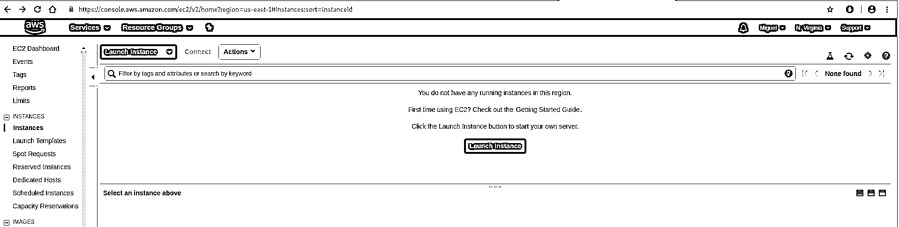](https://files.realpython.com/media/aws_1.bc3ce5234c7e.png)

点击*启动实例*按钮，选择 Ubuntu Server 18.04 作为基础镜像:

[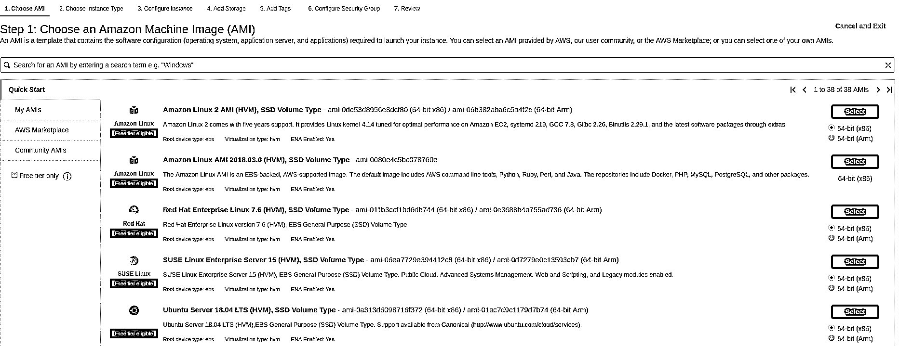](https://files.realpython.com/media/aws_2.63baf00be335.png)

现在您可以选择实例类型。这个要看你的 bot 需要的计算资源。对于本文中描述的机器人， *t2.micro* 实例类型是一个很好的起点。选中后点击*查看并启动*:

[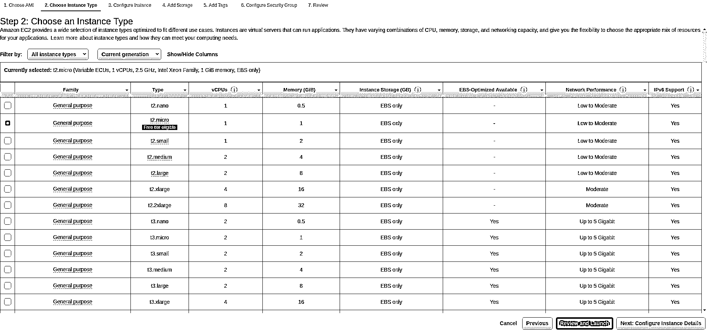](https://files.realpython.com/media/aws_3.9844080cc9c4.png)

在下一页，您可以查看和检查您的配置。然后点击 *Launch* 按钮开始创建 EC2 实例:

[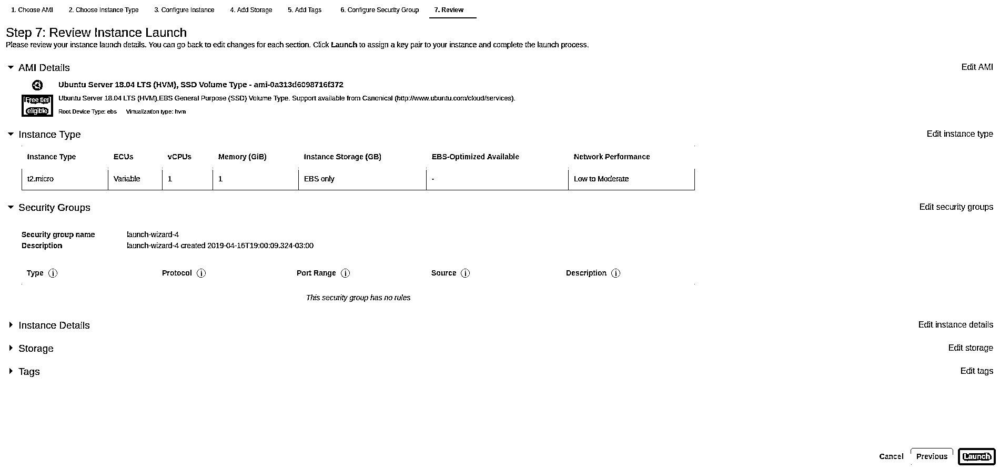](https://files.realpython.com/media/aws_4.e1b0bc829b9c.png)

在你点击了 *Launch* 之后，你将被要求创建一个密钥对。它允许您连接到实例并部署 bot Docker 映像。选择*创建新的密钥对*，输入密钥对名称，下载密钥对。

记住你在哪里下载密钥对。你以后会需要它的。

然后点击*启动实例*按钮继续:

[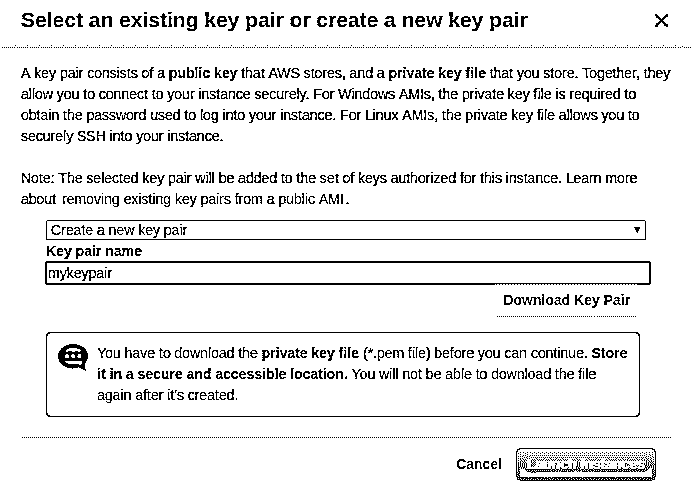](https://files.realpython.com/media/aws_5.8535e23d58c9.4d395260998a.png)

您将看到一个页面，显示正在创建您的实例。单击*查看实例*按钮查看实例的状态:

[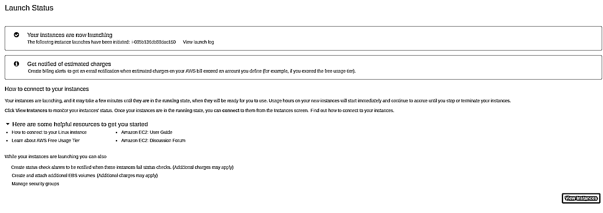](https://files.realpython.com/media/aws_6.cb10be3e43d0.png)

首先，您的实例状态将是 *pending* 。你必须等到它过渡到*运行*:

[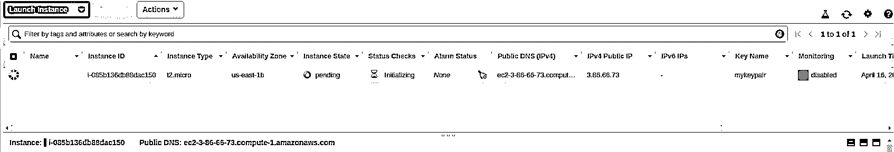](https://files.realpython.com/media/aws_7.0d23fb8e4c7f.png) [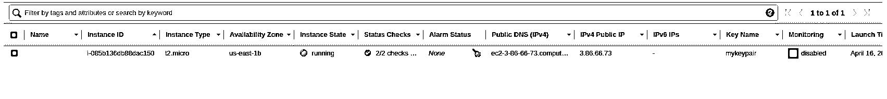](https://files.realpython.com/media/aws_8.daf1274ceeab.png)

**步骤 3:在 EC2 实例中安装 Docker**

现在，您必须使用 SSH 连接到您的实例，以便在其上安装 Docker。

如果在前面的屏幕中，右键单击您的实例，您会发现一个上下文菜单。选择*连接*选项，查看如何使用 SSH 进行连接:

[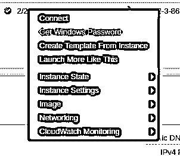](https://files.realpython.com/media/aws_9.6f76c4146b38.png)

此对话框显示了如何连接到您的实例:

[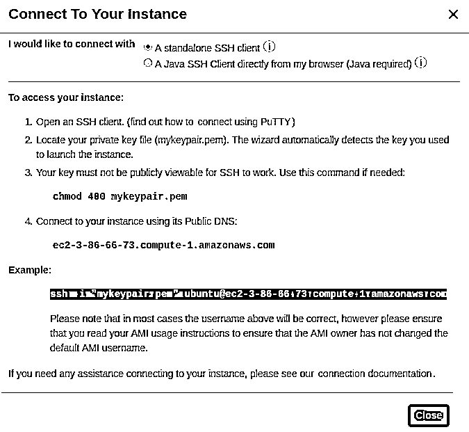](https://files.realpython.com/media/Captura_de_pantalla_de_2019-05-12_21-01-46.765f497770af.png)

**注意:** `ec2-3-86-66-73.compute-1.amazonaws.com`是 AWS 分配给本文中使用的实例的地址，但对您来说可能会有所不同。

首先，使用以下命令更改密钥对文件的权限。否则，您将无法使用这个密钥对连接到 EC2 实例:

```py
$ chmod 400 mykeypair.pem
```

然后使用 SSH 连接到您的实例。您可以从*连接到您的实例*对话框中复制您需要执行的命令:

```py
$ ssh -i "mykeypair.pem" ubuntu@ec2-3-86-66-73.compute-1.amazonaws.com
```

一旦连接完毕，运行以下命令在实例中安装 Docker:

```py
ubuntu@ip-172-31-44-227:~$ sudo apt-get update
ubuntu@ip-172-31-44-227:~$ sudo apt install docker.io
ubuntu@ip-172-31-44-227:~$ sudo adduser ubuntu docker
ubuntu@ip-172-31-44-227:~$ exit
```

安装后退出 SSH 会话很重要，这样在下次登录时，您的用户权限将被重新加载。

**第四步:上传你的机器人的 Docker 图像**

从您的本地计算机，使用`scp`将 bot Docker 映像上传到您的实例。这可能需要一些时间，具体取决于您的互联网连接:

```py
$ scp -i "mykeypair.pem" fav-retweet-bot.tar.gz \
    ubuntu@ec2-3-86-66-73.compute-1.amazonaws.com:/tmp
```

映像上传完成后，使用 SSH 再次登录到您的实例:

```py
$ ssh -i "mykeypair.pem" ubuntu@ec2-3-86-66-73.compute-1.amazonaws.com
```

在您的实例中运行以下命令来解压缩和导入 Docker 映像:

```py
ubuntu@ip-172-31-44-227:~$ gunzip /tmp/fav-retweet-bot.tar.gz 
ubuntu@ip-172-31-44-227:~$ docker image load -i /tmp/fav-retweet-bot.tar
```

**步骤 5:运行你的机器人的 Docker 镜像**

部署 bot 的最后一步是在 EC2 实例中运行 Docker 映像，向它传递身份验证凭证。

您可以使用`docker`命令来完成此操作。传递标志`-d`和`--restart-always`可以确保如果您从 SSH 会话断开连接或者如果实例重新启动，bot 将继续运行:

```py
ubuntu@ip-172-31-44-227:~$ docker run -d --restart always \
-e CONSUMER_KEY="uDRNy31oWfoiKV9AvPoNavy0I" \
-e CONSUMER_SECRET="lnAL5VAgZLWNspQVpd3X6tEo47PRCmsPEwuxpvLCLSR08DMa4O" \
-e ACCESS_TOKEN="622518593-j7gWSqzQO31ju7Bf7idB47NlZeSENsuADGU9B69I" \
-e ACCESS_TOKEN_SECRET="iutFsxvP5IglRckJ1I1why6017xMNkzxqBID48Azw0GvT" \
fav-retweet-bot
```

使用`docker ps`，您可以检查 bot 是否正在运行，并找到它的容器`id`。最后，使用`docker logs`命令和容器`id`，您可以检查机器人的输出，看看它是否正常工作:

```py
$ ubuntu@ip-172-31-44-227:~$ docker logs e6aefe73a885
INFO:root:API created
INFO:root:Processing tweet id 1118276911262785538
INFO:root:Processing tweet id 1118276942162214918
INFO:root:Processing tweet id 1118276990853951488
INFO:root:Processing tweet id 1118277032360722433
INFO:root:Processing tweet id 1118277034466324480
```

现在，即使您从 SSH 会话中断开连接或关闭计算机，bot 将继续在您的 AWS EC2 实例上运行。

**免费 AWS 资源**

为了节省资源和资金(如果您的 AWS 自由层期已经结束)，您可以停止或终止 EC2 实例:

[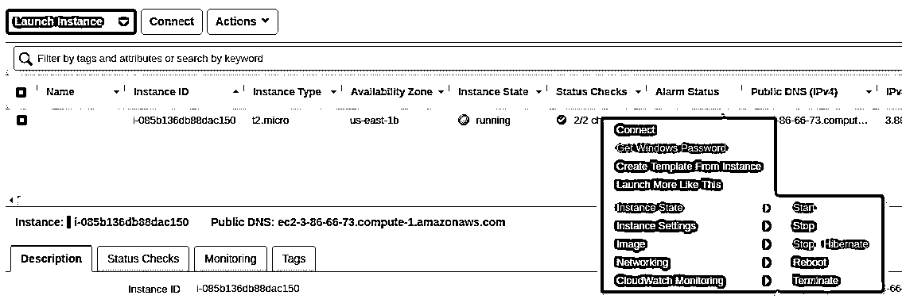](https://files.realpython.com/media/aws_11.e75996b3fab5.png)

停止它将允许您在将来重新启动它，但是它仍然会消耗一些与您的实例存储相关的资源。相比之下，如果您终止 EC2 实例，那么它的所有资源都将被释放，但是您将无法重新启动它。

使用 AWS 还有很多事情要做，比如创建实例的 AWS 映像，但这超出了本文的范围。

[*Remove ads*](/account/join/)

## 总结

构建自己的 Twitter 机器人可以让你的 Twitter 形象更上一层楼。通过使用机器人，你可以自动创建内容和其他 Twitter 活动。这可以节省你很多时间，给你的观众更好的体验。

Tweepy 包隐藏了许多 Twitter API 的底层细节，允许您专注于 Twitter 机器人的逻辑。

在本文中，您学习了如何:

*   改善并自动化您与 Twitter 受众的互动
*   安装 Tweepy
*   注册成为 Twitter 开发者来使用它的 API
*   使用 Tweepy 调用 Twitter API
*   构建 Twitter 机器人
*   使用 Docker 和 AWS 将机器人部署到服务器上

您可以使用本文中的机器人作为自动化部分 Twitter 活动的起点。不要忘记看一下整个 Tweepy API 文档,并发挥你的想象力来制作对你的用例有意义的更复杂的机器人。

你也可以探索一下[聊天机器人](https://realpython.com/build-a-chatbot-python-chatterbot/)、 [InstaPy](https://realpython.com/instagram-bot-python-instapy/) 、 [Discord](https://realpython.com/how-to-make-a-discord-bot-python/) 和 [Alexa Skills](hhttps://realpython.com/alexa-python-skill/) 的可能性，以了解如何使用 Python 为不同平台制作机器人。********