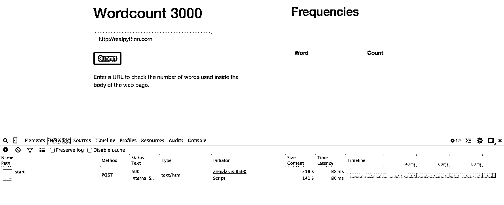

# flask by Example–更新暂存环境

> 原文：<https://realpython.com/updating-the-staging-environment/>

在这一部分中，我们将在 Heroku 上设置 Redis，并了解当我们使用字数统计功能更新暂存环境时，如何在一个 dyno 上运行 web 和 worker 进程。

*更新:*

*   03/22/2016:升级到 Python 版本 [3.5.1](https://www.python.org/downloads/release/python-351/) 。
*   2015 年 2 月 22 日:添加了 Python 3 支持。

* * *

记住:这是我们正在构建的——一个 Flask 应用程序，它根据来自给定 URL 的文本计算词频对。

1.  第一部分:建立一个本地开发环境，然后在 Heroku 上部署一个试运行环境和一个生产环境。
2.  第二部分:使用 SQLAlchemy 和 Alembic 建立一个 PostgreSQL 数据库来处理迁移。
3.  [第三部分](/flask-by-example-part-3-text-processing-with-requests-beautifulsoup-nltk/):添加后端逻辑，使用 requests、BeautifulSoup 和 Natural Language Toolkit (NLTK)库从网页中抓取并处理字数。
4.  第四部分:实现一个 Redis 任务队列来处理文本处理。
5.  [第五部分](/flask-by-example-integrating-flask-and-angularjs/):在前端设置 Angular，持续轮询后端，看请求是否处理完毕。
6.  第六部分:推送到 Heroku 上的临时服务器——建立 Redis 并详细说明如何在一个 Dyno 上运行两个进程(web 和 worker)。(*当前* )
7.  [第七部分](/flask-by-example-updating-the-ui/):更新前端，使其更加人性化。
8.  [第八部分](/flask-by-example-custom-angular-directive-with-d3/):使用 JavaScript 和 D3 创建一个自定义角度指令来显示频率分布图。

<mark>需要代码吗？从[回购](https://github.com/realpython/flask-by-example/releases)中抢过来。</mark>

## 测试推送

从提升当前状态的代码开始，看看需要修复什么:

```py
$ cd flask-by-example
$ git add -A
$ git commit -m "added angular and the backend worker process"
$ git push stage master
$ heroku open --app wordcount-stage
```

> 确保将`wordcount-stage`替换为您的应用程序名称。

尝试运行一个快速测试，看看字数统计功能是否有效。什么都不会发生。为什么？

嗯，如果你打开“Chrome 开发者工具”中的“网络”标签，你会看到对`/start`端点的 post 请求返回了一个 500(内部服务器错误)状态码:

[](https://files.realpython.com/media/heroku_https.672b5e3a9aea.png)

想想我们是如何在本地运行这个应用程序的:我们运行了一个工作进程和 Redis 服务器以及 Flask 开发服务器。同样的事情也需要发生在赫罗库。

[*Remove ads*](/account/join/)

## 再说一遍

首先向 staging 应用程序添加 Redis:

```py
$ heroku addons:create redistogo:nano --app wordcount-stage
```

您可以使用以下命令进行测试，以确保已经将`REDISTOGO_URL`设置为环境变量:

```py
$ heroku config --app wordcount-stage | grep REDISTOGO_URL
```

我们需要确保在我们的代码中链接到 Redis URI，这实际上已经设置好了。打开 *worker.py* 找到这个代码:

```py
redis_url = os.getenv('REDISTOGO_URL', 'redis://localhost:6379')
```

这里我们首先尝试使用与环境变量`REDISTOGO_URL`相关的 URI。如果这个变量不存在(比如在我们的本地环境中)，那么我们使用`redis://localhost:6379` URI。完美。

> 请务必查看 Heroku 官方文档,了解更多关于使用 Redis 的信息。

有了 Redis 设置，我们现在只需要启动并运行我们的工作进程。

## 工人

Heroku 允许你运行一个免费的 dyno。您*应该*为每个 dyno 运行一个进程。在我们的例子中，web 进程*应该*在一个 dyno 中运行，而工作进程*应该*在另一个 dyno 中运行。然而，因为我们正在做一个小项目，所以有一个变通方法可以用来在一个 dyno 上运行这两个过程。请记住，这种方法**不**推荐用于大型项目，因为流程不会随着流量的增加而适当扩展。

首先，将名为 *heroku.sh* 的 bash 脚本添加到根目录:

```py
#!/bin/bash
gunicorn app:app --daemon
python worker.py
```

然后，用以下内容更新 *Procfile* :

```py
web: sh heroku.sh
```

现在，web(后台被妖魔化)和 worker(前台)进程都在 *Procfile* 中的 web 进程下运行。

> 请注意，在 Heroku 上还有其他免费运行 web 和 worker 的方法。我们将在以后的文章中探讨另一种方法(如果大家感兴趣的话)。

在推送到临时服务器之前，让我们在本地测试一下。在新的终端窗口中，运行 Redis 服务器- `redis-server`。然后运行 [heroku local](https://devcenter.heroku.com/articles/heroku-local) :

```py
$ heroku local
forego | starting web.1 on port 5000
web.1  | 18:17:00 RQ worker 'rq:worker:Michaels-MacBook-Air.9044' started, version 0.5.6
web.1  | 18:17:00
```

导航到 [http://localhost:5000/](http://localhost:5000/) 并测试应用程序。应该能行。

提交您的更改，然后推至 Heroku。测试一下。

[*Remove ads*](/account/join/)

## 结论

作业！虽然我们还有很多工作要做，但是应用程序确实工作了——所以让我们进行一次迭代，让全世界都看到。使用相同的工作流程更新生产环境。

**链接:**

1.  [回购](https://github.com/realpython/flask-by-example/releases)
2.  [样品暂存 App](http://wordcount-stage.herokuapp.com/)
3.  [样品制作 App](http://wordcount-pro.herokuapp.com/)

请在下面留下问题和评论。**