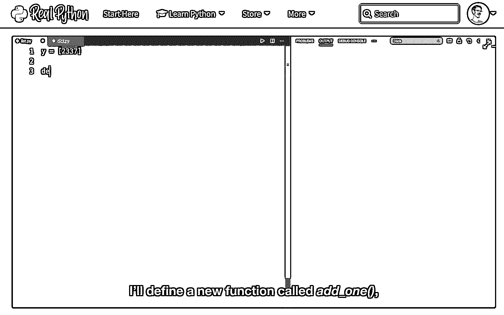
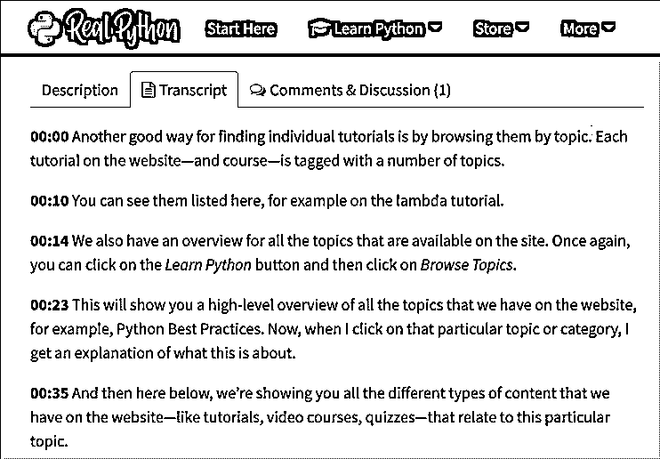
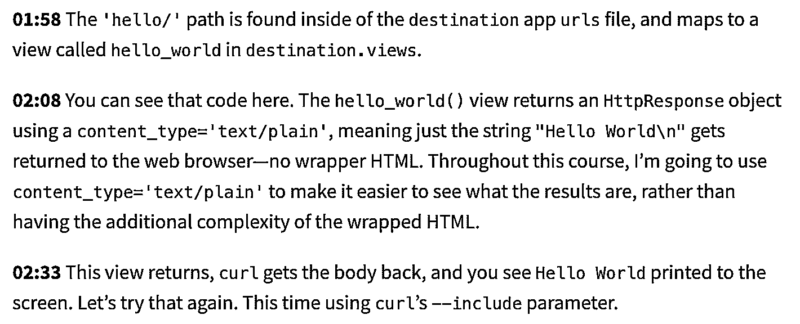
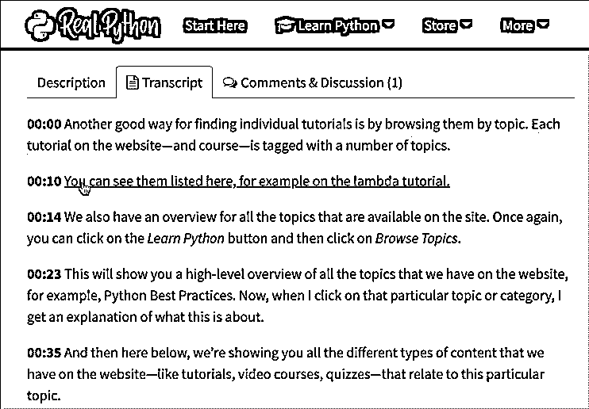

# Real Python 上现在有视频字幕和文字记录

> 原文：<https://realpython.com/video-subtitles-transcripts-now-available/>

你好，

今天我有一个重大的更新要分享:

真正的 Python 视频课程现在有完整的字幕和文字记录！

我认为这将大大提高可访问性，并使您最喜欢的 Python 学习资源更容易查看和搜索。

让我们快速演示一下。视频课程现在配有*全字幕*，你可以在方便的时候打开和关闭:

在每个视频下方，你还会发现一个*互动脚本*，它会随视频一起播放动画，向你展示视频当前正在播放的部分:

为了使字幕准确，编辑和润色字幕花费了大量精力。

例如，当代码示例和变量标识符出现在字幕提示文本和抄本中时，我们对它们应用自定义格式:

YouTube 和许多其他在线平台为其视频内容提供自动生成的字幕。

但是对于像我们编程课程这样的高技术材料来说，这还不够好。潦草、不准确的字幕和文字稿让人摸不着头脑。

它们浪费你的时间，减缓你的学习进度。

相反，我们将视频字幕和文字记录视为我们内容库的一等公民:在真正的 Python 上，你会得到高质量的、手工编辑的字幕，你可以相信它们是准确的。

此外，realpython.com 学习平台在访问字幕和文本时为你提供了几个便利的功能。

例如，抄本中的每个句子都是可点击的，因此只需点击抄本中的一个单词，您就可以快速跳转到视频的特定部分:

这使得复习课程的特定部分或查找您以前观看的内容变得非常容易…

您甚至可以通过右键单击文字记录中的一个句子或单词并选择*复制链接地址来共享视频中特定时间代码的链接。*

这对于向同事和朋友指出视频的某些部分非常有用。

或者，您可以使用我们的[网站搜索功能](https://realpython.com/search)对所有视频字幕进行全文搜索，立即找到对您最有*帮助的学习材料*。

如果你以 1.5 倍或 2 倍的速度观看视频，或者如果你想训练各种技术和编码缩略语的发音(如 API、RESTful、PyPy、PyPI 等)，字幕也会对你有所帮助。)

我们一直在与 [RP 社区聊天](https://realpython.com/community/)的成员测试字幕功能，现在它终于可以在所有 realpython.com 账户上使用了:

从第一天起，所有新课程都将有字幕和文字记录。

随着时间的推移，我们还将回顾我们的[课程目录](https://realpython.com/courses/)，为所有人提供字幕和抄本。

我对这个新功能和它背后的团队努力感到非常自豪。

为了给你带来最高质量的脚本，我扩大了真正的 Python 团队，并聘请了一位字幕专家(对 Sadie 大喊),整个 RP 编辑团队正在不断完善我们的编辑和格式标准。

顺便说一句:

这是对当前真正的 Python 成员的完全免费升级。如果你今天是会员，你将获得所有字幕和课程记录，完全免费。

还不是会员？ [加入真正的 Python](https://realpython.com/join) 并访问我们的整个 Python 视频课程库、互动测验&学习路径、真正的 Python 社区聊天、每周“办公时间”现场问答&等等。

看看新的字幕和文字记录功能是如何工作的:

*   [观看我们的(免费)欢迎课程，每节课都有完整的成绩单](https://realpython.com/courses/real-python-welcome/)或
*   [了解关于字幕/抄本功能的更多信息→](https://support.realpython.com/search?collectionId=5ca8f6c82c7d3a154461da2b&query=subtitles)

快乐的蟒蛇！

—丹·巴德，Real Python 的主编