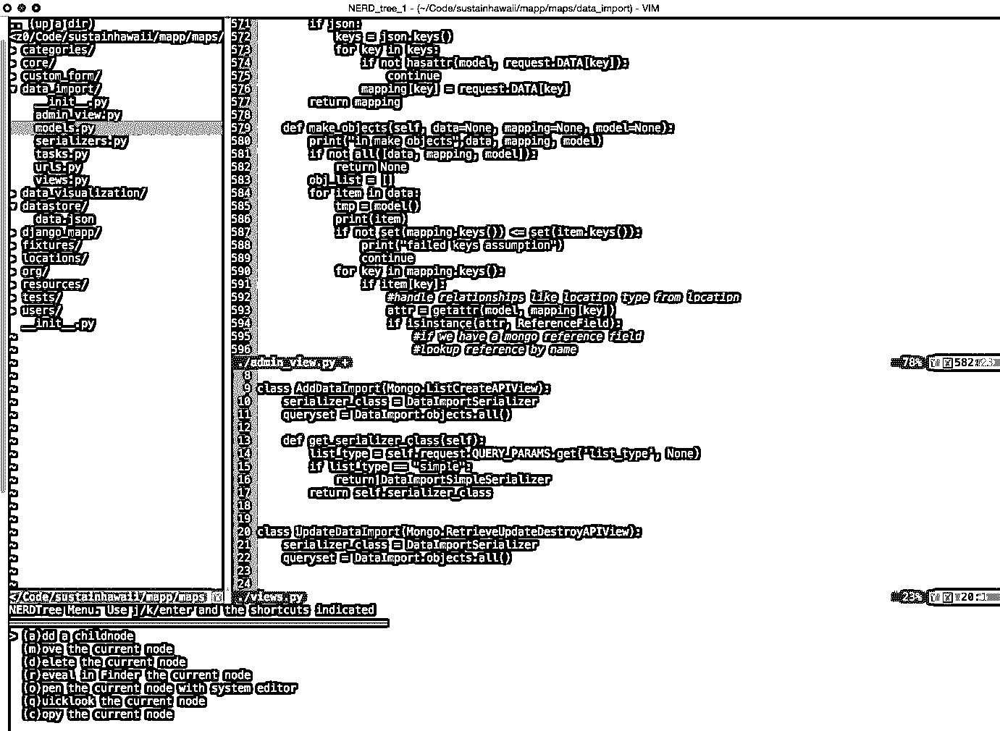
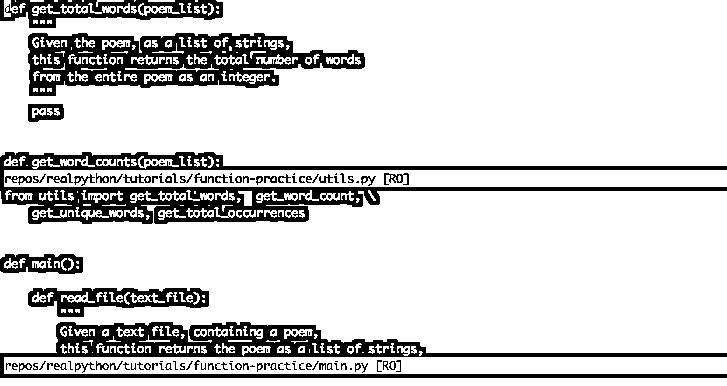
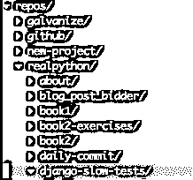

# VIM 和 Python–天作之合

> 原文：<https://realpython.com/vim-and-python-a-match-made-in-heaven/>

我注意到这一带有人一直在宣扬崇高文本 3 的福音。作为常驻高级开发人员(呃，老古董)，我觉得我有责任告诉你你将需要的唯一真正的 Python 开发环境: [VIM](http://www.vim.org/) 。

没错。VIM 无处不在，速度很快，而且从不崩溃。它还可以做任何事情！

不过，从负面来看，配置 VIM 可能会很痛苦，但不用担心。**本文将向您展示如何建立一个强大的 VIM 环境，以适应日复一日与 Python 的争论。**

[](https://files.realpython.com/media/vim-ide.90be624b30bf.png)

**注意:**为了从本文中获得最大收益，您至少应该对如何使用 VIM 及其命令模式有一个基本的了解。如果你刚刚开始，查看一下[的这个资源](http://vim-adventures.com)或者[的这个](http://www.openvim.com)。在继续下一步之前，您将需要花一些时间来学习 VIM 并了解基础知识。

**免费奖励:** ，其中包含优化 Python 开发设置的技巧和调整。

**更新于 2018-06-01**

## 安装

由于 VIM 预装在许多 [*nix](https://en.wikipedia.org/wiki/Unix-like) 系统上，让我们首先检查它是否已安装:

```py
$ vim --version
```

如果安装了它，您应该会看到如下内容:

```py
VIM - Vi IMproved 7.3 (2010 Aug 15, compiled Nov  5 2014 21:00:28)
Compiled by root@apple.com
Normal version without GUI.  Features included (+) or not (-):
-arabic +autocmd -balloon_eval -browse +builtin_terms +byte_offset +cindent
-clientserver -clipboard +cmdline_compl +cmdline_hist +cmdline_info +comments
-conceal +cryptv +cscope +cursorbind +cursorshape +dialog_con +diff +digraphs
-dnd -ebcdic -emacs_tags +eval +ex_extra +extra_search -farsi +file_in_path
+find_in_path +float +folding -footer +fork() -gettext -hangul_input +iconv
+insert_expand +jumplist -keymap -langmap +libcall +linebreak +lispindent
+listcmds +localmap -lua +menu +mksession +modify_fname +mouse -mouseshape
-mouse_dec -mouse_gpm -mouse_jsbterm -mouse_netterm -mouse_sysmouse
+mouse_xterm +multi_byte +multi_lang -mzscheme +netbeans_intg -osfiletype
+path_extra -perl +persistent_undo +postscript +printer -profile +python/dyn
-python3 +quickfix +reltime -rightleft +ruby/dyn +scrollbind +signs
+smartindent -sniff +startuptime +statusline -sun_workshop +syntax +tag_binary
+tag_old_static -tag_any_white -tcl +terminfo +termresponse +textobjects +title
 -toolbar +user_commands +vertsplit +virtualedit +visual +visualextra +viminfo
+vreplace +wildignore +wildmenu +windows +writebackup -X11 -xfontset -xim -xsmp
 -xterm_clipboard -xterm_save
 system vimrc file: "$VIM/vimrc"
 user vimrc file: "$HOME/.vimrc"
 user exrc file: "$HOME/.exrc"
 fall-back for $VIM: "/usr/share/vim"
Compilation: gcc -c -I. -D_FORTIFY_SOURCE=0 -Iproto -DHAVE_CONFIG_H -arch i386 -arch x86_64 -g -Os -pipe
Linking: gcc -arch i386 -arch x86_64 -o vim -lncurses
```

此时，您需要检查两件事情:

1.  VIM 版本应高于 7.3。
2.  应该出现在特性列表中，这样你就知道 Python 是受支持的。

如果这两个检查都通过了，那么就直接移动到 [VIM 扩展](#vim-extensions)。如果没有，是时候[安装/升级](http://www.vim.org/download.php)了。

[*Remove ads*](/account/join/)

### 马科斯/ OS X

如果你还没有自制软件的话，拿起它，然后运行:

```py
$ brew update
$ brew install vim
```

### NIX / Linux

对于 Debian 或 Ubuntu，可以尝试:

```py
$ sudo apt-get remove vim-tiny
$ sudo apt-get update
$ sudo apt-get install vim
```

对于其他版本的 Linux，请查看软件包管理器中的文档。这里有一个链接可以帮助您入门:[安装 Vim](http://oss.sgi.com/LDP/HOWTO/Vim-HOWTO/introduction.html) 。

### 窗户

在 Windows 上安装 VIM 有许多不同的方法。先从[公文](http://www.vim.org/download.php#pc)说起。

## 验证您的 VIM 安装

确保您已经安装了支持 Python 的 VIM > 7.3。再次运行`vim --version`来验证这一点。如果您想检查 VIM 中使用的 Python 的具体版本，请在 VIM 中运行`:python import sys; print(sys.version)`:

```py
2.7.6 (default, Sep  9 2014, 15:04:36)
[GCC 4.2.1 Compatible Apple LLVM 6.0 (clang-600.0.39)]
```

这应该会输出您当前的 Python 版本。如果您得到一个错误，那么您没有 Python 支持，如果您从源代码构建，您需要重新安装或重新编译。

安装了 VIM 之后，让我们看看如何为 Python 开发定制 VIM。

## VIM 扩展

VIM 可以做很多开发者需要的事情。然而，它也是大规模可扩展的，并且有一些非常棒的扩展使它的行为更像一个“现代”IDE。你首先需要的是一个好的扩展经理。

**注意:**VIM 中的扩展通常被称为捆绑包或[插件](http://vimdoc.sourceforge.net/htmldoc/usr_05.html#plugin)。

### Vundle

VIM 有几个扩展管理器，但是我强烈推荐的是 [Vundle](https://github.com/gmarik/Vundle.vim) 。可以把它想象成 VIM 的 [pip](https://realpython.com/what-is-pip/) 。它使得安装包和更新包变得很简单。

让我们安装 Vundle:

```py
$ git clone https://github.com/gmarik/Vundle.vim.git ~/.vim/bundle/Vundle.vim
```

这个命令下载 Vundle 插件管理器，并把它放到您的 VIM 包目录中。现在你可以从`.vimrc` [配置文件](https://github.com/amix/vimrc)中管理你所有的扩展。

将文件添加到用户的主目录:

```py
$ touch ~/.vimrc
```

现在，通过在文件顶部添加以下内容，在您的`.vimrc`中设置 Vundle:

```py
set nocompatible              " required
filetype off                  " required

" set the runtime path to include Vundle and initialize
set rtp+=~/.vim/bundle/Vundle.vim
call vundle#begin()

" alternatively, pass a path where Vundle should install plugins
"call vundle#begin('~/some/path/here')

" let Vundle manage Vundle, required
Plugin 'gmarik/Vundle.vim'

" add all your plugins here (note older versions of Vundle
" used Bundle instead of Plugin)

" ...

" All of your Plugins must be added before the following line
call vundle#end()            " required
filetype plugin indent on    " required
```

就是这样。你现在可以使用 Vundle 了。之后，您可以添加想要安装的插件，然后启动 VIM 并运行:

```py
:PluginInstall
```

这个命令告诉 Vundle 发挥它的魔力——下载所有的插件并为你安装/更新它们。

[](https://files.realpython.com/media/vim-plugininstall.321b07d92560.png)

**注意:**如果你是 Windows 用户，查看 [Windows 安装说明](https://github.com/gmarik/Vundle.vim/wiki/Vundle-for-Windows)。

[*Remove ads*](/account/join/)

## 让我们做一个 IDE

我们不可能列出所有的 VIM 特性，但是让我们快速列出一些非常适合 Python 开发的强大的现成特性。

### 扔掉鼠标

VIM 最重要的特性可能是它不需要鼠标(除了 VIM 的图形化变体)。起初，这似乎是一个可怕的想法，但是在你投入时间——这确实需要时间——去学习[组合键](http://stackoverflow.com/a/5400978/1799408)之后，你将会加快你的整个工作流程！

### 分割布局

如果用`:sp <filename>`打开一个文件，则垂直分割布局(在当前文件下打开新文件)。如果您将键反转到`:vs <filename>`，您会得到一个水平分割(在当前文件的右边打开新文件)。

[](https://files.realpython.com/media/split-layouts.e69dbe4a8c03.png)

你也可以嵌套拆分，这样你就可以随心所欲地在拆分中包含水平和垂直的拆分。众所周知，我们在开发的时候经常需要一次看几个文件。

**专业提示#1:** 确保在键入`:sp`后使用制表符补全来查找文件。

**专业提示#2:** 您也可以通过在`.vimrc`文件中添加以下几行来指定屏幕上应该出现拆分的不同区域:

```py
set splitbelow
set splitright
```

**专业提示#3:** 想不用鼠标就能在拆分之间移动吗？如果您简单地将以下内容添加到`.vimrc`中，只需一个组合键，您就可以在拆分之间跳转:

```py
"split navigations
nnoremap <C-J> <C-W><C-J>
nnoremap <C-K> <C-W><C-K>
nnoremap <C-L> <C-W><C-L>
nnoremap <C-H> <C-W><C-H>
```

关键组合:

*   `Ctrl` + `J` 移动到拆分的下方
*   `Ctrl` + `K` 移动到拆分上面
*   `Ctrl` + `L` 向右移动拆分
*   `Ctrl` + `H` 向左移动拆分

换句话说，按下 `Ctrl` 加标准 VIM 移动键移动到特定的窗格。

但是等等——什么是`nnoremap`事情？简而言之，`nnoremap`将一个组合键重新映射到另一个组合键。`no`部分意味着在普通模式下重新映射按键，而不是视觉模式。基本上，`nnoremap <C-J> <C-W><C-j>`说，在正常模式下，当我点击`<C-J>`时，改为做`<C-W><C-j>`。更多信息可以在[这里](http://stackoverflow.com/questions/3776117/what-is-the-difference-between-the-remap-noremap-nnoremap-and-vnoremap-mapping)找到。

### 缓冲器

虽然 VIM 可以做标签，但许多用户更喜欢[缓冲](http://vim.wikia.com/wiki/Vim_buffer_FAQ)和拆分。你可以把一个[缓冲区](http://stackoverflow.com/questions/26708822/why-do-vim-experts-prefer-buffers-over-tabs)想象成一个最近打开的文件。VIM 提供了对最近缓冲区的简单访问。只需输入`:b <buffer name or number>`就可以切换到一个开放的缓冲区。(自动完成在这里也有效。)也可以使用`:ls`列出所有缓冲区。

**Pro 提示#4:** 在`:ls`输出结束时，VIM 会提示`Hit enter to continue`。你可以输入`:b <buffer number>`,在列表显示的时候立即选择缓冲区。这样做将为您节省一次击键，并且您不必记住缓冲区编号。

### 代码折叠

大多数“现代”ide 提供了一种折叠(或[折叠](http://vim.wikia.com/wiki/Folding))方法和类的方法，只显示类/方法定义行，而不是所有代码。

您可以在`.vimrc`中使用下面几行来启用它:

```py
" Enable folding
set foldmethod=indent
set foldlevel=99
```

这可以正常工作，但是您必须键入`za`才能折叠(和展开)。空格键会更好。所以也将这一行添加到您的`.vimrc`文件中:

```py
" Enable folding with the spacebar
nnoremap <space> za
```

现在，您可以轻松地隐藏您当前没有处理的代码部分。

第一个命令`set foldmethod=indent`，根据行缩进创建折叠。然而，这通常会产生比您真正想要的更多的折叠。但是不要害怕！有几个扩展试图纠正这一点。我们推荐[simply fold](https://github.com/tmhedberg/SimpylFold)。通过在`.vimrc`中添加以下行，用 Vundle 安装它:

```py
Plugin 'tmhedberg/SimpylFold'
```

**注意:**别忘了安装插件- `:PluginInstall`。

**Pro Tip #5:** 如果你想查看折叠代码的文档字符串，试试这个:

```py
let g:SimpylFold_docstring_preview=1
```

[*Remove ads*](/account/join/)

### Python 缩进

当然，对于基于缩进的代码折叠，您希望缩进是正确的。同样，VIM 在开箱即用方面有所欠缺，因为它不处理函数定义后的自动缩进。使用缩进可以做两件事:

1.  让缩进遵循 PEP 8 标准。
2.  更好地处理自动缩进。

**PEP 8**

要添加正确的 PEP 8 缩进，请将以下内容添加到您的`.vimrc`:

```py
au BufNewFile,BufRead *.py
    \ set tabstop=4
    \ set softtabstop=4
    \ set shiftwidth=4
    \ set textwidth=79
    \ set expandtab
    \ set autoindent
    \ set fileformat=unix
```

当你点击 tab 键时，这将为你提供标准的四个空格，确保你的行长度不超过 80 个字符，并以 Unix 格式存储文件，这样你就不会在签入 [GitHub](https://realpython.com/python-git-github-intro/) 和/或与其他用户共享时遇到一堆转换问题。

对于全栈开发，您可以对每个文件类型使用另一个`au`命令:

```py
au BufNewFile,BufRead *.js, *.html, *.css
    \ set tabstop=2
    \ set softtabstop=2
    \ set shiftwidth=2
```

这样，不同的文件类型可以有不同的设置。还有一个名为 [ftypes](http://vim.wikia.com/wiki/Keep_your_vimrc_file_clean) 的插件，它允许你为每个你想要维护设置的文件类型创建一个单独的文件，所以如果你觉得合适就使用它。

**自动缩进**

`autoindent`将会有所帮助，但是在某些情况下(比如当一个函数签名跨越多行时)，它并不总是如你所愿，尤其是在涉及到符合 PEP 8 标准的时候。要解决这个问题，您可以使用 [indentpython.vim](https://github.com/vim-scripts/indentpython.vim) 扩展:

```py
Plugin 'vim-scripts/indentpython.vim'
```

### 标记不必要的空白

您还希望避免无关的空白。您可以让 VIM 为您标记它，以便于识别和删除:

```py
au BufRead,BufNewFile *.py,*.pyw,*.c,*.h match BadWhitespace /\s\+$/
```

这将把多余的空白标记为坏的，并可能把它涂成红色。

### UTF-8 支持

在大多数情况下，使用 Python 时应该使用 UTF-8，尤其是使用 Python 3 时。确保 VIM 知道使用下面的行:

```py
set encoding=utf-8
```

[*Remove ads*](/account/join/)

### 自动完成

Python 自动完成最好的插件是 [YouCompleteMe](https://github.com/Valloric/YouCompleteMe) 。同样，使用 Vundle 来安装:

```py
Bundle 'Valloric/YouCompleteMe'
```

在幕后，YouCompleteMe 使用了几个不同的自动完成器(包括 Python 的 [Jedi](https://github.com/davidhalter/jedi) )，它需要安装一些 C 库才能正常工作。文档中有非常好的[安装说明](https://github.com/Valloric/YouCompleteMe#mac-os-x-super-quick-installation)，所以我不会在这里重复，但请务必遵循它们。

它开箱即用，但让我们添加一些定制:

```py
let g:ycm_autoclose_preview_window_after_completion=1
map <leader>g  :YcmCompleter GoToDefinitionElseDeclaration<CR>
```

第一行确保自动完成窗口在您完成后消失，第二行定义了 goto 定义的快捷方式。

**注意:**我的 leader 键被映射到空间，所以`space-g`将转到我当前所在位置的定义。这在我探索新代码时很有帮助。

### 虚拟支持

上面 goto 定义的一个问题是，默认情况下，VIM 不知道任何关于 virtualenv 的信息，所以您必须通过向`.vimrc`添加以下代码行，让 VIM 和 YouCompleteMe 知道您的 virtualenv:

```py
"python with virtualenv support
py << EOF
import os
import sys
if 'VIRTUAL_ENV' in os.environ:
  project_base_dir = os.environ['VIRTUAL_ENV']
  activate_this = os.path.join(project_base_dir, 'bin/activate_this.py')
  execfile(activate_this, dict(__file__=activate_this))
EOF
```

这将确定您是否在 virtualenv 中运行，切换到该特定的 virtualenv，然后设置您的系统路径，以便您的 CompleteMe 将找到适当的站点包。

### 语法检查/高亮显示

您可以让 VIM 使用 [syntastic](https://github.com/vim-syntastic/syntastic) 扩展名在每次保存时检查语法:

```py
Plugin 'vim-syntastic/syntastic'
```

还用这个漂亮的小插件添加了 PEP 8 检查:

```py
Plugin 'nvie/vim-flake8'
```

最后，让你的代码看起来很漂亮:

```py
let python_highlight_all=1
syntax on
```

### 配色方案

配色方案与您正在使用的基本配色方案一起使用。检查 GUI 模式的[日光化](https://github.com/altercation/vim-colors-solarized)，终端模式的 [Zenburn](https://github.com/jnurmine/Zenburn) :

```py
Plugin 'jnurmine/Zenburn'
Plugin 'altercation/vim-colors-solarized'
```

然后，只需添加一点逻辑来定义基于 VIM 模式使用哪个方案:

```py
if has('gui_running')
  set background=dark
  colorscheme solarized
else
  colorscheme zenburn
endif
```

日晒也有黑暗和光明的主题。为了使它们之间的切换非常容易(通过按 `F5` )添加:

```py
call togglebg#map("<F5>")
```

[*Remove ads*](/account/join/)

### 文件浏览

如果你想要一个合适的文件树，那么 [NERDTree](https://github.com/scrooloose/nerdtree) 是一个不错的选择:

```py
Plugin 'scrooloose/nerdtree'
```

如果你想使用标签，使用 [vim-nerdtree-tabs](https://github.com/jistr/vim-nerdtree-tabs) :

```py
Plugin 'jistr/vim-nerdtree-tabs'
```

想隐藏`.pyc`文件？然后添加下面一行:

```py
let NERDTreeIgnore=['\.pyc$', '\~$'] "ignore files in NERDTree
```

### 超级搜索

想在 VIM 上搜索任何东西吗？检查 [ctrlP](https://github.com/kien/ctrlp.vim) :

```py
Plugin 'kien/ctrlp.vim'
```

如你所料，按下 `Ctrl` + `P` 将启用搜索，因此你可以直接开始输入。如果您的搜索与您要查找的文件匹配，它会找到它。哦，它不仅仅是文件:它还会找到标签！更多信息，请看这个 [YouTube 视频](http://www.youtube.com/watch?v=9XrHk3xjYsw)。

### 行号

使用以下选项打开屏幕侧面的行号:

```py
set nu
```

### Git 集成

想在不离开 VIM 的情况下执行基本的 git 命令吗？那么[vim-逃犯](https://github.com/tpope/vim-fugitive)就是要走的路:

```py
Plugin 'tpope/vim-fugitive'
```

[](https://files.realpython.com/media/fugitive.3ec5e0c0d29a.png)

在 [VIMcasts](http://vimcasts.org/episodes/fugitive-vim---a-complement-to-command-line-git/) 上观看它的运行。

### 电力线

Powerline 是一个状态栏，显示当前的 virtualenv、git 分支、正在编辑的文件等等。

[](https://files.realpython.com/media/powerline.de2002d13317.png)

它是用 Python 编写的，支持许多其他环境，如 zsh、bash、tmux 和 IPython:

```py
Plugin 'Lokaltog/powerline', {'rtp': 'powerline/bindings/vim/'}
```

查看[官方文档](http://powerline.readthedocs.org/en/latest/)了解所有配置选项。

[*Remove ads*](/account/join/)

### 系统剪贴板

Vim 通常有自己的剪贴板，并忽略系统键盘，但是有时您可能想要剪切、复制和/或粘贴到 VIM 之外的其他应用程序。在 OS X 上，您可以通过以下命令行访问系统剪贴板:

```py
set clipboard=unnamed
```

### 外壳中的 VIM

最后，一旦您掌握了 VIM 及其键盘快捷键，您会经常发现自己对 shell 中缺少相同的快捷键感到恼火。不用担心:大多数 shells 都有 VI 模式。要为您的 shell 打开它，请将下面一行添加到`~/.inputrc`:

```py
set editing-mode vi
```

现在，您不仅可以在 shell 中使用 VIM 组合键，还可以在 Python 解释器和任何其他使用 GNU Readline 的工具(大多数数据库 shell)中使用。现在你到处都有 VIM！

## 结论

差不多就是这样(至少对于 Python 开发来说)。你可以使用很多其他的扩展，以及这篇文章中详细描述的所有东西的替代品。你最喜欢的扩展是什么？你是如何配置 VIM 来匹配你的个性的？

这是我当前的 [VIM 配置](https://github.com/j1z0/vim-config/blob/master/vimrc)的链接。你自己有吗？请分享！

感谢阅读！

## 资源

**免费奖励:** ，其中包含优化 Python 开发设置的技巧和调整。

1.  [VIM Tutor](http://linuxcommand.org/man_pages/vimtutor1.html) 是 VIM 自带的，所以一旦安装了 VIM，只要从命令行输入`vimtutor`，程序就会教你如何使用 VIM。
2.  [VIMcasts](http://vimcasts.org) 是描述如何使用 VIM 许多特性的高级教程视频。
3.  [VIM 官方文档](http://vimdoc.sourceforge.net)
4.  [打开 Vim](http://www.openvim.com/)
5.  [艰难地学习 Vimscript](http://learnvimscriptthehardway.stevelosh.com/)非常适合学习 vim script。******